# 一、开始你的Kotlin冒险

Kotlin 是一种伟大的语言，它让安卓开发变得更容易、更快、更愉快。在这一章中，我们将讨论Kotlin到底是什么，并看看许多Kotlin的例子，这些例子将帮助我们构建更好的安卓应用程序。欢迎来到Kotlin令人惊叹的旅程，这将改变你思考编写代码和解决常见编程问题的方式。

在本章中，我们将涵盖以下主题:

*   柯特林的第一步
*   柯特林实例
*   在安卓工作室创建新的Kotlin项目
*   将现有的 Java 项目迁移到 Kotlin
*   Kotlin标准图书馆
*   为什么Kotlin是学习的好选择

# 向柯特林问好

Kotlin 是一种现代的、静态类型的、安卓兼容的语言，它修复了许多 *Java* 的问题，例如空指针异常或过度的代码冗长。Kotlin 是一种受 Swift、Scala、Groovy、C#和许多其他语言启发的语言。Kotlin 是由 JetBrains 专业人员设计的，基于对开发人员经验、最佳使用指南(最重要的是*干净代码*和*有效 Java* )以及该语言使用数据的分析。对其他编程语言进行了深入分析。Kotlin 努力避免重复其他语言的错误，并利用它们最有用的特性。在和 Kotlin 一起工作的时候，我们真的可以感觉到这是一种成熟的、设计良好的语言。

Kotlin 通过提高代码质量和安全性以及提升开发人员的性能，将应用程序开发提升到了一个全新的水平。谷歌在 2017 年宣布了官方对安卓平台的 Kotlin 支持，但 Kotlin 语言已经存在了一段时间。它有一个非常活跃的社区，Kotlin 在安卓平台上的采用已经在快速增长。我们可以将 Kotlin 描述为一种安全、富于表现力、简洁、通用和工具友好的语言，它与 Java 和 JavaScript 具有很好的互操作性。让我们讨论这些特性:

*   **安全性**:Kotlin在可空性和不变性方面提供了安全特性。Kotlin 是静态类型的，所以每个表达式的类型在编译时都是已知的。编译器可以验证我们试图访问的任何属性或方法或特定的类实例是否确实存在。这应该是从同样是静态类型的 Java 中熟悉的，但是与 Java 不同，Kotlin 类型系统要严格得多(安全)。我们必须明确告诉编译器给定的变量是否可以存储空值。这使得程序在编译时失败，而不是在运行时抛出`NullPointerException` :

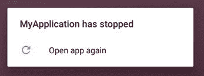

*   **轻松调试**:bug 可以在开发阶段更快的检测出来，而不是在应用发布后就崩溃，破坏用户体验。Kotlin 提供了一种处理不可变数据的便捷方法。例如，它可以通过提供方便的接口来区分可变(读写)和不可变(只读)集合(在幕后集合仍然是可变的)。
*   **简洁**:消除了大部分的 Java 冗长。我们需要更少的代码来完成常见任务，因此样板代码的数量大大减少，甚至将 Kotlin 与 Java 8 进行比较。因此，代码也更容易阅读和理解(表达)。
*   **互操作性** : Kotlin 旨在与 Java(跨语言项目)无缝并行工作。现有的 Java 库和框架生态系统与 Kotlin 一起工作，没有任何性能损失。许多 Java 库甚至有特定于 Kotlin 的版本，允许 Kotlin 有更习惯的用法。Kotlin 类也可以直接实例化，并从 Java 代码中透明地引用，而不需要任何特殊的语义，反之亦然。这使得我们可以将 Kotlin 合并到现有的安卓项目中，并轻松地将 Kotlin 与 Java 一起使用(如果我们愿意的话)。
*   **通用性**:我们可以针对很多平台，包括移动应用(安卓)、服务器端应用(后端)、桌面应用、浏览器中运行的前端代码，甚至构建系统(Gradle)。

任何编程语言都只取决于它的工具支持。Kotlin 对安卓工作室、IntelliJ Idea 和 Eclipse 等现代 ide 有出色的支持。像代码辅助或重构这样的常见任务得到了适当的处理。Kotlin团队努力使Kotlin插件在每次发布时都变得更好。大多数错误都很快被修复，社区要求的许多特性也得以实现。

Kotlin bug tracker: [https://youtrack.jetbrains.com/issues/KT](https://youtrack.jetbrains.com/issues/KT) Kotlin slack channel: [http://slack.kotlinlang.org/](http://slack.kotlinlang.org/)

有了 Kotlin，安卓应用程序开发变得更加高效和愉快。Kotlin 与 JDK 6 兼容，因此在 Kotlin 中创建的应用程序即使在安卓 4 之前的旧安卓设备上也能安全运行。

Kotlin 旨在通过结合过程编程和函数编程的概念和元素，为您带来两全其美的效果。它遵循了约书亚·布洛赫在《有效的 Java》第二版《T3》一书中描述的许多准则，这被认为是每个 Java 开发人员必须阅读的一本书。

最重要的是，Kotlin 是开源的，因此我们可以检查项目，并积极参与 Kotlin 项目的任何方面，如 Kotlin 插件、编译器、文档或 Kotlin 语言本身。

# 令人敬畏的Kotlin例子

对于安卓开发者来说，Kotlin 真的很容易学，因为语法类似于 Java，而且 Kotlin 经常感觉像是自然的 Java 进化。在开始时，开发人员通常在编写 Kotlin 代码时会考虑到 Java 的习惯，但过一段时间后，很容易转向更习惯的 Kotlin 解决方案。让我们来看看一些很酷的 Kotlin 特性，看看 Kotlin 通过以一种更简单、更简洁、更灵活的方式解决常见的编程任务可以提供哪些好处。我们试图让例子简单明了，但是它们利用了这本书不同部分的内容，所以如果它们在这一点上没有被完全理解也没关系。本节的目标是关注各种可能性，并展示使用 Kotlin 可以实现的目标。本节不一定需要完全描述如何实现它。让我们从变量声明开始:

```kt
    var name = "Igor" // Inferred type is String 
    name = "Marcin" 
```

请注意，Kotlin 不需要分号。你仍然可以使用它们，但是它们是可选的。我们也不需要指定变量类型，因为它是从上下文中推断出来的。每次编译器可以从上下文中找出类型时，我们不必显式指定它。Kotlin 是一种强类型语言，因此每个变量都有一个适当的类型:

```kt
    var name = "Igor" 
    name = 2 // Error, because name type is String 
```

该变量具有推断的`String`类型，因此分配不同的值(整数)将导致编译错误。现在，让我们看看 Kotlin 如何改进使用*字符串模板*添加多个字符串的方法:

```kt
    val name = "Marcin" 
    println("My name is $name") // Prints: My name is Marcin 
```

我们不再需要使用`+`字符连接字符串。在 Kotlin 中，我们可以很容易地将单个变量甚至整个表达式合并到字符串中:

```kt
    val name = "Igor" 
        println("My name is ${name.toUpperCase()}") 
        // Prints: My name is IGOR 
```

在 Java 中，任何变量都可以存储空值。在 Kotlin *中，严格的空值安全*迫使我们显式标记每个可以存储可空值的变量:

```kt
    var a: String = "abc"
    a = null // compilation error

    var b: String? = "abc"
    b = null // It is correct
```

向数据类型添加问号(字符串对字符串？)，我们说变量可以为空(可以存储空引用)。如果我们不将变量标记为可空，我们将无法为其分配可空引用。Kotlin 还允许以适当的方式处理可空变量。我们可以使用*安全调用*运算符来安全调用潜在可空变量上的方法:

```kt
    savedInstanceState?.doSomething 
```

方法`doSomething`只有在`savedInstanceState`具有非空值时才会被调用，否则方法调用将被忽略。这是 Kotlin 避免在 Java 中常见的空指针异常的安全方法。

Kotlin 还有几种新的数据类型。让我们看看`Range`数据类型，它允许我们定义结束包含范围:

```kt
    for (i in 1..10) { 
        print(i) 
    } // 12345678910 
```

Kotlin 引入了`Pair`数据类型，结合*中缀* *符号，*允许我们持有一对共同的值:

```kt
    val capitol = "England" to "London" 
    println(capitol.first) // Prints: England 
    println(capitol.second) // Prints: London 
```

我们可以使用*破坏性声明*将其解构为单独的变量:

```kt
    val (country, city) = capitol 
    println(country) // Prints: England 
    println(city) // Prints: London 
```

我们甚至可以遍历一个配对列表:

```kt
    val capitols = listOf("England" to "London", "Poland" to "Warsaw") 
    for ((country, city) in capitols) { 
        println("Capitol of $country is $city") 
    } 

    // Prints: 
    // Capitol of England is London 
    // Capitol of Poland is Warsaw 
```

或者，我们可以使用`forEach`功能:

```kt
    val capitols = listOf("England" to "London", "Poland" to "Warsaw") 
    capitols.forEach { (country, city) -> 
        println("Capitol of $country is $city") 
    } 
```

请注意，Kotlin 通过提供一组接口和辅助方法来区分可变集合和不可变集合(`List`对`MutableList`、`Set`对`Set`对`MutableSet`、`Map`对`MutableMap`等等):

```kt
    val list = listOf(1, 2, 3, 4, 5, 6) // Inferred type is List 
    val mutableList = mutableListOf(1, 2, 3, 4, 5, 6) 
    // Inferred type  is MutableList 
```

不可变集合意味着集合状态在初始化后不能改变(我们不能添加/移除项目)。可变集合(非常明显)意味着状态可以改变。

有了 lambda 表达式，我们可以用非常简洁的方式使用 Android 框架构建:

```kt
    view.setOnClickListener { 
        println("Click") 
    } 
```

Kotlin 标准库(stdlib)包含许多函数，允许我们以简单明了的方式对集合执行操作。我们可以轻松地对列表执行流处理:

```kt
    val text = capitols.map { (country, _) -> country.toUpperCase() } 
                       .onEach { println(it) } 
                       .filter { it.startsWith("P") } 
                       .joinToString (prefix = "Countries prefix P:")
    // Prints: ENGLAND POLAND
    println(text) // Prints: Countries prefix P: POLAND
    .joinToString (prefix = "Countries prefix P:")
```

请注意，我们不必将参数传递给 lambda。我们还可以定义自己的 lambdas，这将允许我们以全新的方式编写代码。这个 lambda 将允许我们只在安卓棉花糖或更新版本中运行一段特定的代码。

```kt
    inline fun supportsMarshmallow(code: () -> Unit) { 
        if(Build.VERSION.SDK_INT >= Build.VERSION_CODES.M) 
        code() 
    } 

    //usage 
    supportsMarshmallow { 
        println("This code will only run on Android Nougat and newer") 
    } 
```

我们可以使用`doAsync`函数轻松地发出异步请求，并在主线程上显示响应:

```kt
    doAsync { 
        var result = runLongTask()  // runs on background thread 

        uiThread { 
            toast(result)           // run on main thread 
        } 
    } 
```

智能转换允许我们在不执行冗余转换的情况下编写代码:

```kt
    if (x is String) { 
        print(x.length) // x is automatically casted to String 
    } 

    x.length //error, x is not casted to a String outside if block 

    if (x !is String) 
        return 

    x.length // x is automatically casted to String 
```

Kotlin 编译器在执行检查后知道变量`*x*`的类型为`String`，因此它会自动将其转换为`String`类型*、*，允许它调用所有方法并访问`String`类的所有属性，而无需任何显式转换。

有时，我们有一个简单的函数返回单个表达式的值。在这种情况下，我们可以使用带有表达式主体的函数来缩短语法:

```kt
    fun sum(a: Int, b: Int) = a + b 
    println (sum(2 + 4)) // Prints: 6 
```

使用*默认参数语法，*我们可以为每个函数参数定义默认值，并以各种方式调用它:

```kt
    fun printMessage(product: String, amount: Int = 0, 
        name: String = "Anonymous") { 
        println("$name has $amount $product")  
    } 

    printMessage("oranges") // Prints: Anonymous has 0 oranges 
    printMessage("oranges", 10) // Prints: Anonymous has 10 oranges 
    printMessage("oranges", 10, "Johny") 
    // Prints: Johny has 10 oranges 
```

唯一的限制是我们需要提供没有默认值的所有参数。我们也可以使用*命名参数* *语法*来指定函数参数:

```kt
    printMessage("oranges", name = "Bill") 
```

这也增加了在函数调用中使用多个参数调用函数时的可读性。

数据类提供了一种非常简单的方法来定义和操作数据模型中的类。为了定义一个合适的数据类，我们将在类名前使用`data`修饰符:

```kt
    data class Ball(var size:Int, val color:String) 

    val ball = Ball(12, "Red") 
    println(ball) // Prints: Ball(size=12, color=Red) 
```

请注意，我们有一个非常好的、人类可读的类实例字符串表示，并且我们不需要`new`关键字来实例化该类。我们还可以轻松创建该类的自定义副本:

```kt
    val ball = Ball(12, "Red") 
    println(ball) // prints: Ball(size=12, color=Red) 
    val smallBall = ball.copy(size = 3) 
    println(smallBall) // prints: Ball(size=3, color=Red) 
    smallBall.size++ 
    println(smallBall) // prints: Ball(size=4, color=Red) 
    println(ball) // prints: Ball(size=12, color=Red) 
```

上述构造使得处理*不可变的*对象变得非常容易和方便。

Kotlin最好的特色之一是*扩展。*它们允许我们向现有类添加新的行为(方法或属性)，而不改变其实现。有时，当您使用一个库或框架时，您希望为某个类拥有额外的方法或属性。扩展是添加这些缺失成员的好方法。扩展减少了代码的冗长性，并消除了使用 Java 中已知的实用函数的需要(例如，`StringUtils`类)。我们可以很容易地为定制类、第三方库甚至安卓框架类定义扩展。首先，`ImageView`没有从网络加载图像的能力，所以我们可以添加`loadImage`扩展方法，使用`Picasso`库(安卓的一个图像加载库)加载图像:

```kt
    fun ImageView.loadUrl(url: String) { 
        Picasso.with(context).load(url).into(this) 
    } 

    \\usage 
    imageView.loadUrl("www.test.com\\image1.png") 
```

我们还可以给`Activity`类添加一个显示祝酒词的简单方法:

```kt
    fun Context.toast(text:String) { 
        Toast.makeText(this, text, Toast.LENGTH_SHORT).show() 
    } 

    //usage (inside Activity class)
    toast("Hello") 
```

有很多地方使用*扩展*会使我们的代码更简单、更简洁。使用 Kotlin，我们可以充分利用 lambdas 来进一步简化 Kotlin 代码。

Kotlin 中的接口可以有默认实现，只要它们不包含任何状态:

```kt
    interface BasicData { 
        val email:String 
        val name:String 
        get() = email.substringBefore("@") 
    } 
```

在 Android 中，有许多应用程序，我们希望将对象初始化延迟到需要(使用)时。要解决这个问题，我们可以使用*委托*:

```kt
    val retrofit by lazy { 
        Retrofit.Builder() 
            .baseUrl("https://www.github.com") 
            .addConverterFactory(MoshiConverterFactory.create()) 
            .build() 
    } 
```

改装(一个流行的安卓网络框架)属性初始化将被延迟，直到第一次访问该值。惰性初始化可能会导致更快的安卓应用程序启动时间，因为加载被推迟到变量被访问时。这是初始化一个类中多个对象的好方法，尤其是当并不总是需要所有对象时(对于某些类的使用场景，我们可能只需要特定的对象)，或者当类创建后并不需要所有对象时。

所有给出的例子只是柯特林的一瞥。在这本书里，我们将学习如何利用柯特林的力量。

# 处理Kotlin代码

管理和运行 Kotlin 代码有多种方式。我们将主要关注安卓工作室和Kotlin游乐场。

# Kotlin游乐场

在不需要安装任何软件的情况下尝试 Kotlin 代码的最快方法是 Kotlin 操场([https://try.kotlinlang.org](https://try.kotlinlang.org))*。*我们可以使用 JavaScript 或 JVM Kotlin 实现在那里运行 Kotlin 代码，并在不同的 Kotlin 版本之间轻松切换。书中的所有代码示例都不需要安卓框架依赖，并且可以使用**Kotlin游乐场**执行。

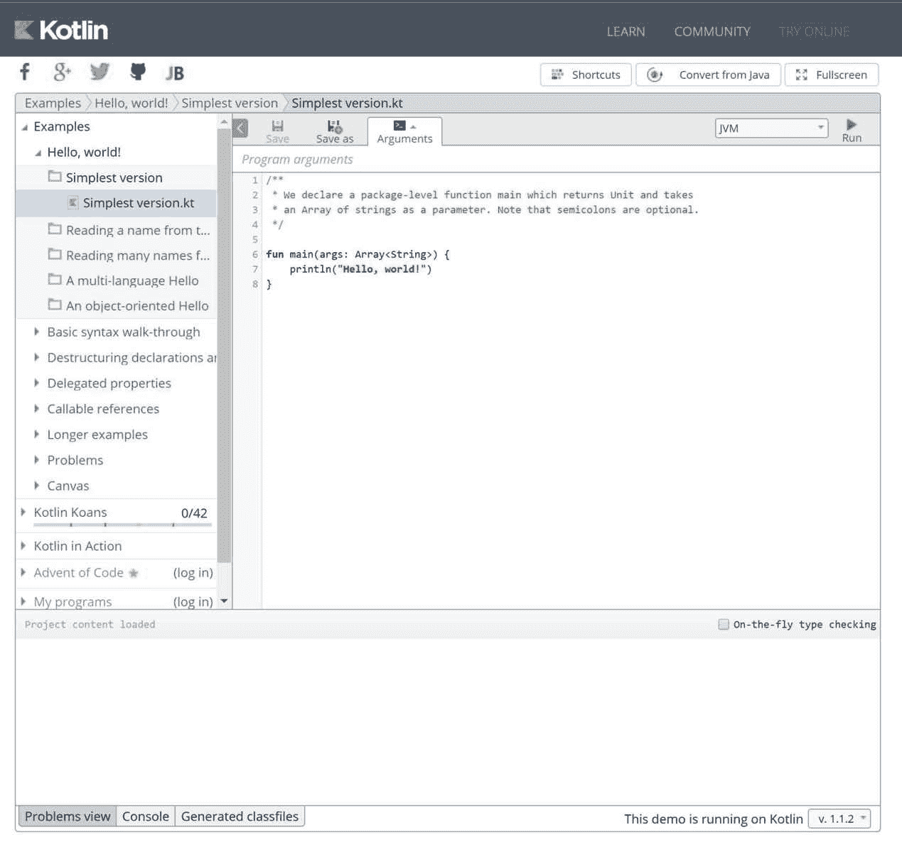

`main`函数是每个 Kotlin 应用程序的入口点。任何应用程序启动时都会调用这个函数，因此我们必须将书中示例的代码放在这个方法的主体中。我们可以直接放置代码，也可以只调用包含更多 Kotlin 代码的另一个函数:

```kt
    fun main(args: Array<String>) { 
        println("Hello, world!") 
    }
```

Android Applications have multiple entry points. main function is called implicitly by the Android framework, so we can't use it to run Kotlin code on Android platform.

# Android Studio

安卓工作室现有的所有工具都使用 Kotlin 代码。我们可以轻松地使用调试、lint 检查、适当的代码辅助、重构等等。大多数事情的工作方式与 Java 相同，因此最值得注意的变化是 Kotlin 语言语法。我们需要做的就是在项目中配置 Kotlin。

安卓应用有多个入口点(不同的意图可以启动应用中不同的组件)，需要安卓框架依赖。要运行书籍示例，我们需要扩展`Activity`类并在那里放置代码。

# 为项目配置 Kotlin

从 Android Studio 3.0 开始，增加了对 Kotlin 的全工具支持。不需要安装Kotlin插件，Kotlin被更深入地集成到安卓开发过程中。

要在安卓工作室 2.x 上使用 Kotlin，我们必须手动安装 Kotlin 插件。要安装它，我们需要转到安卓工作室|文件|设置|插件|安装喷气大脑插件...| Kotlin 并按下安装按钮:

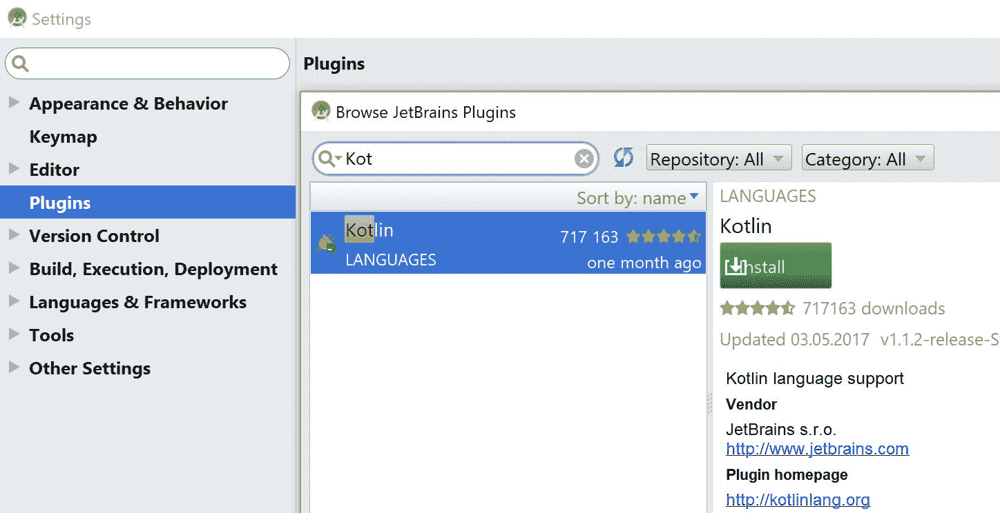

为了能够使用 Kotlin，我们需要在项目中配置 Kotlin。对于现有的 Java 项目，我们需要运行*在项目中配置 Kotlin* 动作(Windows 中的快捷键是*Ctrl*+*Shift*+*A*，在 macOS 中是*命令* + *shift* + *A* )或者使用相应的工具| Kotlin *|* 在项目菜单项中配置 Kotlin:

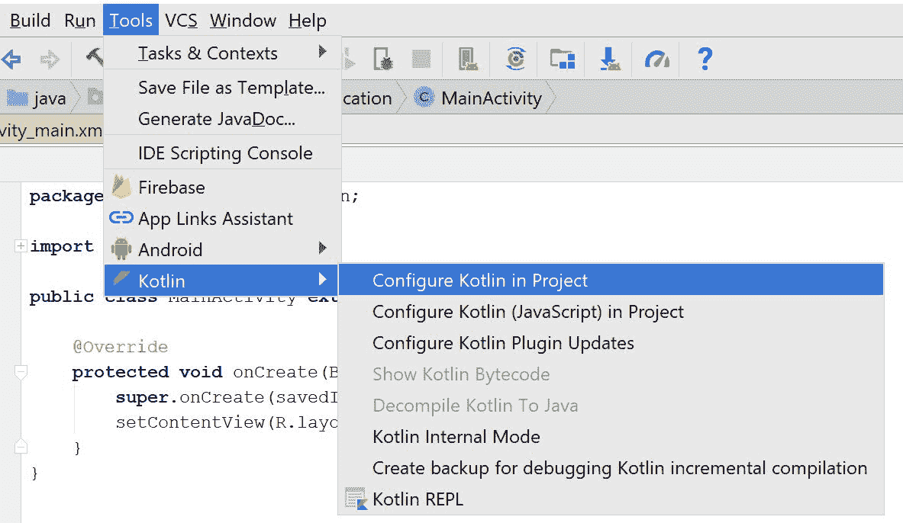

然后，选择带有 Gradle 的安卓:

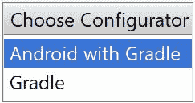

最后，我们需要选择所需的模块和正确的 Kotlin 版本:


前面的配置场景也适用于所有最初用 Java 创建的现有安卓项目。从 Android Studio 3.0 开始，我们还可以在创建新项目时选中包含 Kotlin 支持复选框:

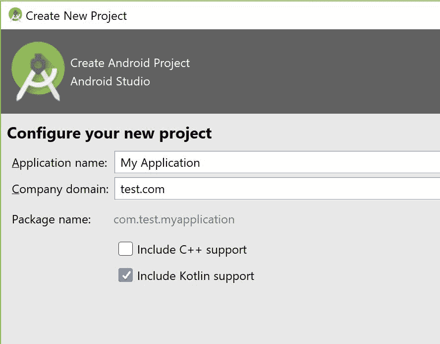

在这两种情况下，`Configure Kotlin in project`命令通过添加 Kotlin 依赖项来更新对应于模块的根`build.gradle`文件和`build.gradle`文件。它还将 Kotlin 插件添加到安卓模块中。在撰写本书期间，安卓工作室 3 的发布版本尚未推出，但我们可以从预发布版本查看构建脚本:

```kt
//build.gradle file in project root folder 
buildscript { 
    ext.kotlin_version = '1.1' 

    repositories { 
        google() 
        jcenter() 
    } 
    dependencies { 
       classpath 'com.android.tools.build:gradle:3.0.0-alpha9' 
       classpath "org.jetbrains.kotlin:kotlin-gradle-
             plugin:$kotlin_version" 
    } 
} 

...  
//build.gradle file in the selected modules 
apply plugin: 'com.android.application' 
apply plugin: 'kotlin-android' 
apply plugin: 'kotlin-android-extensions'
... 
dependencies { 
    ...
    implementation 'com.android.support.constraint:constraint-
          layout:1.0.2'

} 
... 
```

Prior to Android Plugin for Gradle 3.x (delivered with Android Studio 3.0) *compile* dependency configuration was used instead of *implementation*.

为了更新 Kotlin 版本(假设在未来)，我们需要更改`build.gradle`文件(项目根文件夹)中`kotlin_version`变量的值。Gradle 文件中的更改意味着项目必须同步，因此 Gradle 可以更新其配置并下载所有必需的依赖项:


# 在新的安卓项目中使用Kotlin

对于在 Android Studio 3.x 中创建的新 Kotlin 项目，主要活动将已经在 Kotlin 中定义，因此我们可以立即开始编写 Kotlin 代码:

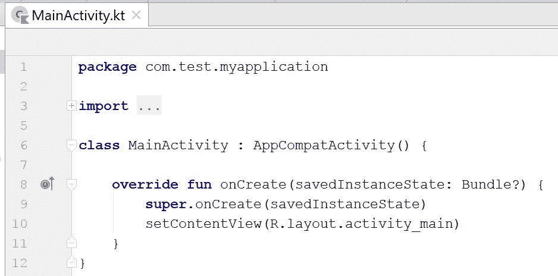

添加新的 Kotlin 文件类似于添加一个 Java 文件。只需右键单击一个包，然后选择新建| Kotlin 文件/类:


The reason why the IDE says Kotlin File/Class and not simply *Kotlin class*, analogously to *Java class* is that we can have more members defined inside a single file. We will discuss this in more detail in [Chapter 2](2.html#11C3M0-7a7324e7f1a1454d830df91c6b78f317), *Laying a Foundation*.

请注意，Kotlin 源文件可以位于`java`源文件夹内。我们可以为 Kotlin 创建一个新的源文件夹，但这不是必需的:

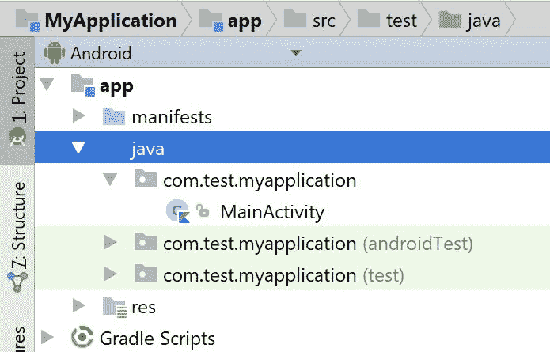

运行和调试项目与在 Java 中完全相同，除了在项目中配置 Kotlin 之外，不需要任何额外的步骤:

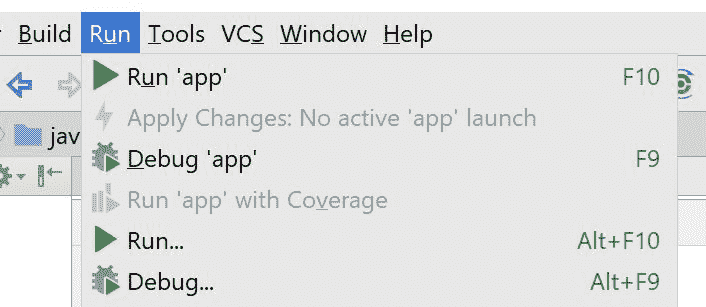

从安卓工作室 3.0 开始，各种安卓模板也将允许我们选择一种语言。这是新的配置活动向导:

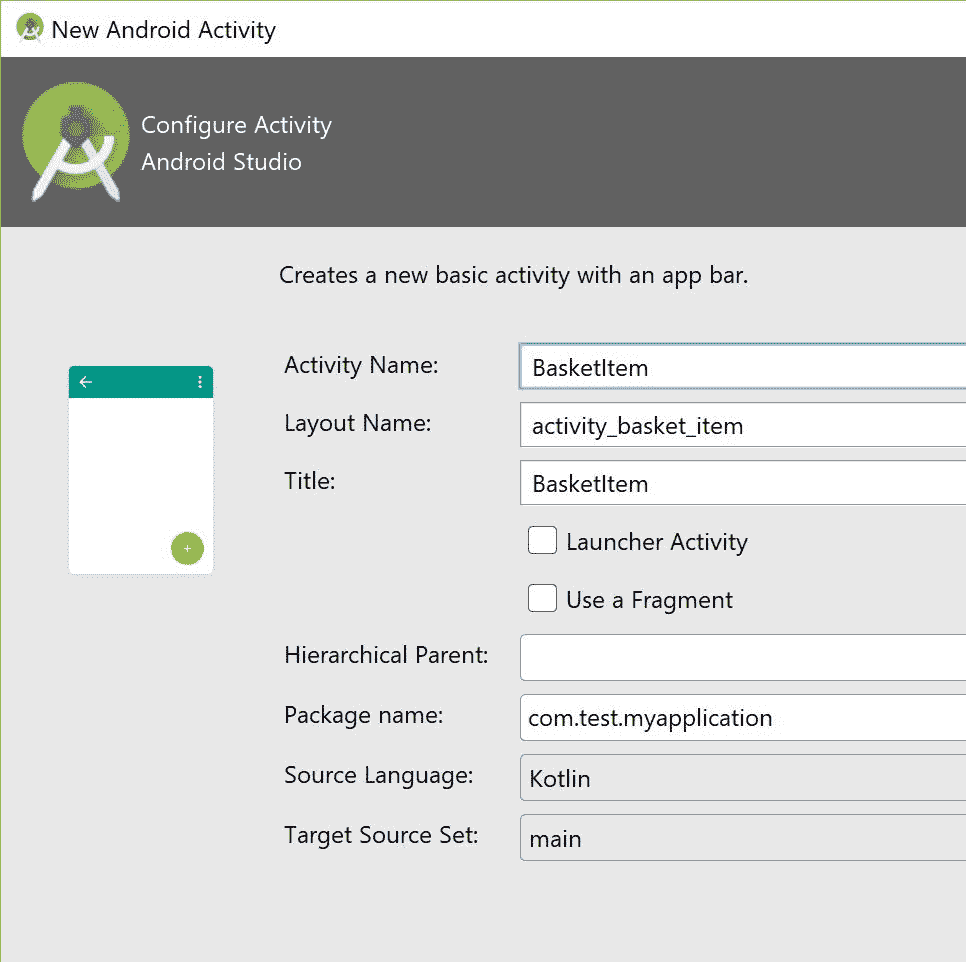

# Java 到 Kotlin 转换器(J2K)

现有 Java 项目的迁移也相当容易，因为我们可以在同一个项目中并排使用 Java 和 Kotlin。也有方法通过使用 **Java 到 Kotlin 转换器** ( **J2K** )将现有的 Java 代码转换成 Kotlin 代码。

第一种方法是使用 c *将 Java 文件转换为 Kotlin* 命令将整个 Java 文件转换为 Kotlin 文件(Windows 中的键盘快捷键是*Alt*+*Shift*+*Ctrl*+*K*，在 macOS 中:*选项* + *shift* + *命令* + *K* ，这种方法效果非常好。第二种方法是将 Java 代码粘贴到现有的 Kotlin 文件中，代码也将被转换(将出现一个带有转换建议的对话框窗口)。这在学习 Kotlin 的时候可能很有帮助。

如果我们不知道如何用 Kotlin 编写一段特定的代码，我们可以用 Java 编写，然后简单地复制到剪贴板，然后粘贴到 Kotlin 文件中。转换后的代码不会是 Kotlin 最惯用的版本，但它会起作用。集成开发环境将显示各种意图，以进一步转换代码并提高其质量。在转换之前，我们需要确保 Java 代码是有效的，因为转换工具非常敏感，即使缺少一个分号，转换过程也会失败。J2K 转换器与 Java 互操作性相结合，允许将 Kotlin 逐步引入到现有项目中(例如，一次转换一个类)。

# 运行 Kotlin 代码的替代方法

安卓工作室提供了一种无需运行安卓应用程序即可运行Kotlin代码的替代方式。当您想要从漫长的安卓编译和部署过程中分别快速测试一些 Kotlin 代码时，这非常有用。

运行Kotlin代码的方法是使用构建Kotlin**读取评估打印循环** ( **REPL** )。REPL 是一个简单的语言外壳，它读取单个用户输入，对其进行评估，并输出结果:


REPL 看起来像命令行，但它将为我们提供所有必需的代码提示，并允许我们访问项目内部定义的各种结构(类、接口、顶级函数等):

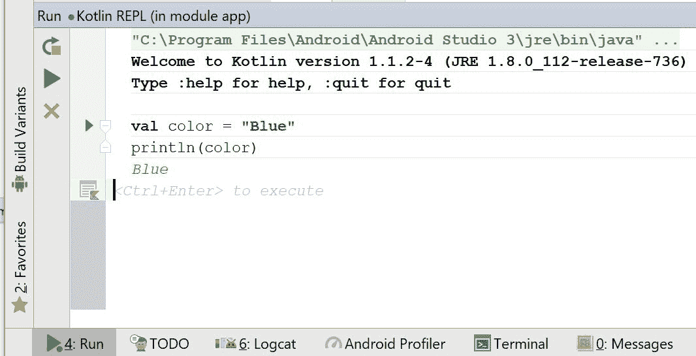

REPL 最大的优势是它的速度。我们可以非常快速地测试 Kotlin 代码。

# 引擎盖下的柯特林

我们将主要关注安卓，但请记住，Kotlin 可以编译到多个平台。Kotlin 代码可以编译成 *Java 字节码*，然后编译成*达尔维克字节码*。以下是安卓平台 Kotlin 构建过程的简化版本:

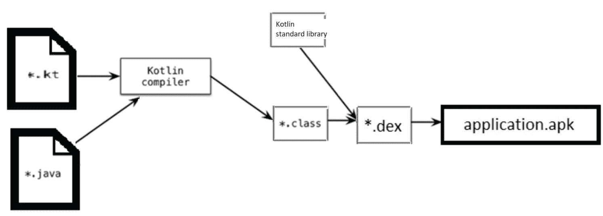

*   扩展名为`.java`的文件包含 Java 代码
*   扩展名为`.kt`的文件包含Kotlin代码
*   扩展名为`.class`的文件包含 Java 字节码
*   扩展名为`.dex`的文件包含达尔维克字节码
*   扩展名为`.apk`的文件包含`AndroidManifest`文件、资源和`.dex`文件

对于纯 Kotlin 项目，只会使用 Kotlin 编译器，但是 Kotlin 也支持跨语言项目，我们可以在同一个 Android 项目中将 Kotlin 和 Java 一起使用。在这种情况下，两个编译器都用于编译安卓应用程序，结果将在类级别合并。

# Kotlin标准图书馆

**Kotlin 标准库** ( **stdlib** )是一个非常小的库，和 Kotlin 一起分发。它需要运行用 Kotlin 编写的应用程序，并且在构建过程中会自动添加到我们的应用程序中。

In Kotlin 1.1, `kotlin-runtime` was required to run applications written in Kotlin. In fact, in Kotlin 1.1 there were two artifacts (`kotlin-runtime` and `kotlin-stdlib`) that shared a lot of Kotlin packages. To reduce the amount of confusion both the artifacts will be merged into single artifact (`kotlin-stdlib`) in in the upcoming 1.2 version of Kotlin. Starting from Kotlin 1.2, `kotlin-stdlib` is required to run applications written in Kotlin.

柯特林标准库提供了柯特林日常工作所需的基本元素。其中包括:

*   像数组、集合、列表、范围等数据类型
*   扩展ˌ扩张
*   高阶函数
*   用于处理字符串和字符序列的各种实用程序
*   JDK 类的扩展使得处理文件、输入输出和线程变得很方便

# 更多使用 Kotlin 的理由

Kotlin 得到了 jetbarks 的强大商业支持，jetbarks 是一家为许多流行编程语言提供非常流行的 IDEs 的公司(Android Studio 基于 JetBrains IntelliJ IDEA)。JetBrains 希望提高他们的代码质量和团队性能，因此他们需要能够解决所有 Java 问题并提供与 Java 无缝互操作的语言。其他 JVM 语言都不符合这些要求，所以 JetBrains 最终决定创建自己的语言，并开始了 Kotlin 项目。如今，Kotlin 被用于他们的旗舰产品中。有些将 Kotlin 与 Java 一起使用，而有些则是纯 Kotlin 产品。

柯特林是一种相当成熟的语言。事实上，它的发展始于谷歌宣布正式支持安卓系统的多年前(第一次承诺可以追溯到 2010-11-08 年):

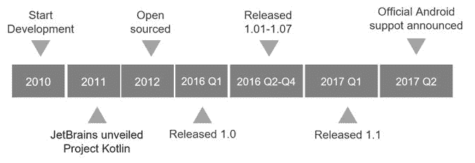

The initial name of the language was **Jet**. At some point, the JetBrains team decided to rename it to Kotlin. The name comes from Kotlin Island, near St. Petersburg and its analogy to Java which was also named after the Indonesian island.

2016 年 1.0 版本发布后，越来越多的公司开始支持 Kotlin 项目。Gradle 在构建脚本中加入了对 Kotlin 的支持，安卓库最大的创建者 Square 发布消息称，他们强烈支持 Kotlin，最后，谷歌宣布正式支持 Kotlin 安卓平台。这意味着安卓团队将发布的每一个工具不仅会与 Java 兼容，还会与 Kotlin 兼容。谷歌和喷气大脑已经开始合作，为Kotlin创建一个非营利基金会，负责未来的语言维护和开发。所有这些都将大大增加在项目中使用 Kotlin 的公司数量。

Kotlin 也类似于苹果的 Swift 编程语言。事实上，这就是相似之处，有些文章关注的是差异，而不是相似之处。学习 Kotlin 对于渴望为安卓和 iOS 开发应用的开发人员来说会非常有帮助。也有把 Kotlin 移植到 iOS (Kotlin/Native)的计划，也许我们终究不用学 Swift。在 Kotlin 中也可以进行全栈开发，因此我们可以开发与移动客户端共享相同数据模型的服务器端应用程序和前端客户端。

# 摘要

我们已经讨论了柯特林语言如何适应安卓开发，以及我们如何将柯特林整合到新的和现有的项目中。我们已经看到了一些有用的例子，其中 Kotlin 简化了代码，使其更加安全。还有很多有趣的事情要发现。

在下一章中，我们将学习 Kotlin 构建块，并为使用 Kotlin 开发 Android 应用程序奠定基础。