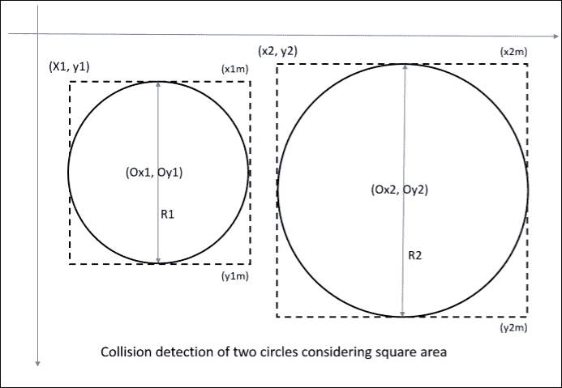
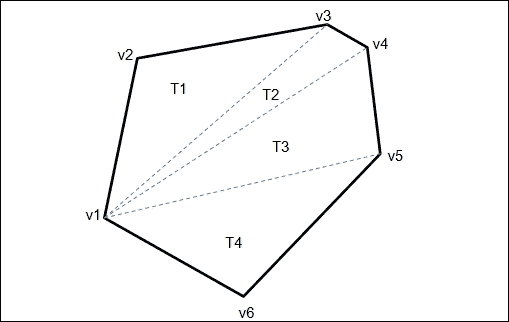
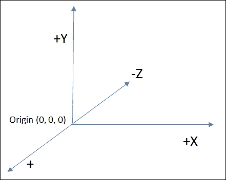
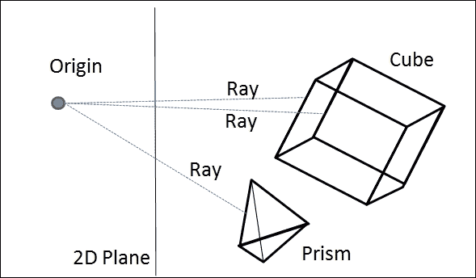
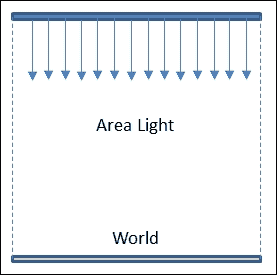
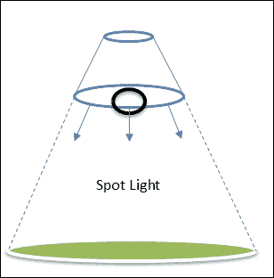
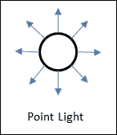

# 六、提高 2D/3D 游戏的性能

曾几何时，移动平台上的游戏仅限于黑白像素游戏，其他游戏媒介也严重依赖像素图形。时代变了。3D 游戏可以轻松地在手持设备上运行。然而，对 2D 素材的要求尚未改变。即使在硬核 3D 游戏中，2D 素材也是强制性的。很少有比赛是完全 2D 的。

我们将在这里借助以下主题讨论 2D 和 3D 游戏的表现:

*   2D 游戏发展的制约因素
*   3D 游戏开发限制
*   安卓系统中的渲染管道
*   通过 OpenGL 渲染
*   优化 2D 素材
*   优化 3D 素材
*   常见的游戏开发错误
*   2D/3D 性能比较

# 2D 游戏发展制约因素

从 2D 游戏发展来看，主要制约因素如下:

*   2D 艺术素材
*   2D 渲染系统
*   2D 映射
*   2D 物理学

## 2D 艺术品素材

艺术素材约束主要限于图形或视觉素材，包括图像、精灵和字体。不难理解，较大的素材比较小的素材需要更多的时间来处理和渲染，从而导致性能质量下降。

### 2D 艺术素材套

在安卓游戏开发中，不可能用一组素材来提供最大的显示质量。这就是大多数安卓游戏开发者选择高分辨率素材作为基础构建的原因。这通常在高配置硬件平台上表现良好，但在低配置设备上不能提供高质量的性能。许多开发人员选择移植到多分辨率硬件平台。这同样需要时间来完成项目。

### 多个分辨率的同一素材集

很多时候，开发者选择忽略一套硬件平台。大多数情况下，在移动游戏行业，通常的做法是选择分辨率更高的艺术素材，并通过缩小比例将其安装到分辨率更低的设备中。如今，大多数硬件平台都有更好的内存。因此，这个过程对开发者来说变得很方便。

### 屏幕上绘制的素材数量

游戏性能并不总是取决于素材规模；这还取决于屏幕上绘制的素材数量。精灵表的概念已经发展到减少屏幕上绘图元素的数量。

通常，系统发出对单个艺术素材的绘制指令的调用。随着素材数量的增加，在每个游戏循环周期中需要更多这样的绘制指令来完成渲染。很明显，这个过程会让处理器变慢，游戏性能变差。

一个精灵表可以由单个图像中的多个资源组成。因此，只需要一条绘制指令就可以渲染精灵的所有资源。但是，精灵表的物理大小受到限制。最大大小因不同硬件平台的不同设备而异。最方便的是，1024x1024 精灵是最安全的选择，因为在当前场景中，几乎所有可用的设备都支持它们。

### 字体文件的使用

几乎每款游戏都使用安卓默认系统字体以外的自定义或特殊字体。在这些情况下，字体源文件必须包含在游戏构建中。有多种方法可以使用不同的字体。我们将在这里讨论其中的三个:

*   Sprite 字体
*   位图字体
*   真实类型源

#### 雪碧字体

这是典型的老式技术，但在某些情况下仍然有效。开发人员创建一个包含所有必要字符的精灵表。所有字符都映射在一个数据文件中。该映射用于裁剪每个字符并相应地形成单词。

以下是这种字体的一些优点:

*   开发人员完全控制映射
*   可以根据需要定制字符样式
*   可以实现快速的处理速度；然而，这将取决于开发效率

这种字体有一些缺点:

*   它们增加了开发开销
*   系统效率完全取决于开发人员的技能
*   在多语言支持的情况下，很难映射字符
*   任何改变都需要大量的迭代才能达到完美

这种风格现在不常使用，因为我们有许多设计师和时尚的字体。

#### 位图字体

位图字体系统继承自 sprite 字体。它使用预定义的映射样式和库进行更新，以支持开发过程。它还使用一个或多个带有一个数据文件的精灵表。位图字体的工作原理与精灵字体相同。有很多工具可以直接从 TrueType 字体创建带有一点风格化的字体。

以下是这种字体的一些优点:

*   它与任何现有的代码库兼容，无论渲染框架是 OpenGL、DirectX、Direct Draw 还是 GDI+
*   很容易集成
*   它可以操纵现有 TrueType 字体的样式

这种字体有一些缺点:

*   sprite 字体的同样缺点在这里也适用，只是开发开销更少
*   放大位图字体会导致输出模糊

#### TrueType 字体

这是包括安卓在内的大多数平台都支持的通用字体格式。是游戏中集成各种字体最快的方式。

以下是这种字体的一些优点:

*   通用字体样式
*   最大平台支持
*   简单的多语言实现
*   这是一种矢量字体，因此没有缩放问题
*   轻松获得特殊字符

这种字体有一些缺点:

*   使用这种字体可能会额外花费游戏几千字节
*   并非所有脚本语言都受 TTF 支持

## 2D 渲染系统

安卓提供了一个通过应用编程接口框架在画布上呈现 2D 素材的范围。画布可以与`View`或`SurfaceView`中的`Drawable`对象一起使用。

画布充当实际绘图表面的界面，在其上可以绘制所有图形对象。画布上的绘制发生在`onDraw()`回调方法内。开发人员只需要指定图形对象以及它们在画布上的位置。

Canvas 本身有一组默认的绘制方法来呈现几乎每种类型的图形对象。以下是一些例子:

*   `drawBitmap()`方法用于以位图格式绘制图像对象。但是，图像不必是位图格式。
*   `drawRect()`和`drawLine()`方法用于在画布上绘制原始形状。
*   `drawText()`方法可用于使用特定的字体样式在画布上渲染文本。

画布可以在安卓架构的视图中使用。

## 2D 制图

2D 映射基于简单的 2D 坐标系。唯一不同的是与常规坐标系相比 *y* 轴相反:


在安卓 2D 中，原点位于画布的左上角。所有的几何计算都基于这个映射。但是，它不会像基于 2D 画布的应用那样对性能产生直接影响。许多开发人员习惯于基于常规系统映射他们的图形素材，并且他们反转垂直轴以将其呈现在画布上。这需要一些额外的计算。

关于 2D 渲染系统，还有一个性能限制。全世界通用的开发方法是拥有最少的一组图形素材，并尽可能多地使用它们。通常，这会导致多次渲染同一个像素。这会影响处理速度，从而影响 FPS。

例如，位图 **A** 、位图 **B** 、位图 **C** 、位图 **D** 在画布上的渲染方式为 **A** 、 **B** 、 **C** 相互重叠， **D** 保持分离。会发生以下情况:

*   仅绘制一个位图的区域 **R0** 中的像素将被渲染一次
*   两个位图重叠的区域 **R1** 中的像素将被渲染两次
*   三个位图重叠的区域 **R2** 中的像素将被渲染三次

如下所示:


现在，在区域 **R1** 和 **R2** 中，所有像素被渲染多次。在该系统中，像素数据信息将附加到先前的数据，产生最终的像素值。在该系统中，处理开销增加。因此，性能下降。

即使在今天，这也是 2D 游戏编程的普遍做法。原因如下:

*   透明度混合
*   模块化图形素材
*   低构建大小
*   通过重叠多个素材轻松构建屏幕

有时，可能会出现设备的图形处理器性能非常低的情况，多次渲染同一像素会对性能产生重大影响。在这种情况下，双缓冲机制帮助很大。

双缓冲系统是指创建缓冲的可显示素材，其中使用图形素材创建显示屏。然后，这个缓冲的对象只在屏幕上绘制一次。它可以防止以下问题:

*   屏幕闪烁
*   一个像素的多次绘制
*   素材撕裂

## 2D 物理学

2D 物理学在所有计算中只考虑了 *x-y* 平面。市场上有很多 2D 物理引擎。 **Box2D** 最受欢迎。物理引擎由实时物理的每个机制和计算组成。

实时物理计算比游戏中要求的要复杂得多。让我们讨论几个可用的物理引擎。

### Box2D

Box2D 是一个基于 C++ 的开源物理引擎。它几乎包含了固体物理的每个方面，可以用在各种游戏中。它的一些值得一提的特点如下:

*   刚体的动态碰撞检测
*   碰撞状态回调，如碰撞进入、退出、停留等
*   多边形碰撞
*   垂直、水平和抛射体运动
*   摩擦物理学
*   扭矩和动量物理学
*   基于枢轴点和关节的重力效果

### 液态娱乐

LiquidFun 是一个物理引擎，拥有液体物理的所有方面。这个引擎实际上是基于 Box2D 的。谷歌发布了这个开源物理引擎，涵盖了液体物理的公式和机制。LiquidFun 可以用于安卓、iOS、Windows 和其他一些流行的平台。LiquidFun 支持 Box2D 的所有功能，以及液体粒子物理。这包括以下内容:

*   波浪模拟
*   液体下落和粒子模拟
*   液体搅拌模拟
*   固体和液体的动态碰撞
*   液体混合

### 性能对游戏的影响

碰撞检测是一个昂贵的过程。多边和多边形冲突增加了处理开销。刚体和碰撞表面的数量对性能的影响最大。这就是为什么液体物理比固体物理慢。

让我们来看看主要的影响:

*   任何刚体的每次变换都需要刷新整个系统的碰撞检查
*   物理引擎负责重复的转换变化，这是负责繁重的过程

刚体上每一个可能的力都是在物理引擎中计算出来的。不是所有的游戏都需要计算。游戏开发并不总是需要物理的实时实现。然而，游戏需要实时可视化。

## 2D 碰撞检测

大多数游戏使用方块碰撞系统来检测大多数碰撞。矩形碰撞检测是最便宜的方法，可以在游戏内部使用来检测碰撞。

有时，三角形和圆形碰撞检测也用于 2D 游戏，以提高碰撞检测的准确性。使用这些方法需要有一个平衡。

例如，如果我们需要检测两个圆之间的碰撞，我们可以选择以下任何系统:

*   将每个圆视为一个矩形，并检测它们之间的碰撞
*   将一个圆看作一个矩形，并检测圆和矩形之间的碰撞
*   应用实际的圆形碰撞检测方法

让我们考虑两个圆，其原点为 *O1* 和 *O2* ，直径为 *R1* 和 *R2* :

*O1* 位于 *(Ox1，Oy1)*

*O2* 位于 *(Ox2，Oy2)*

### 矩形碰撞

如果我们把圆形想象成 2D 画布上的矩形，那么它看起来会是这样的:



矩形碰撞检测就是指这个公式。

输入馈送如下:

*xMin1 = x1* (第一个矩形的 *x* 轴上的最小坐标)

*yMin1 = y1* (第一个矩形的 *y* 轴上的最小坐标)

*xMax1 = x1m* (第一个矩形的 *x* 轴上的最大坐标)

*yMax1 = y1m* (第一个矩形的 *y* 轴上的最大坐标)

*xMin2 = x2* (第二个矩形的 *x* 轴上的最小坐标)

*yMin2 = y2* (第二个矩形的 *y* 轴上的最小坐标)

*xMax2 = x2m* (第二个矩形的 *x* 轴上的最大坐标)

*ym x2 = y2m*(第二个矩形的 *y* 轴上的最大坐标)

在给定的情况下，我们将拥有以下内容:

*x1 = Ox1 –( R1/2)*

*y1 = Oy1–(R1/2)*

*x1m = Ox1 + (R1 / 2) = x1 + R1*

*y1m = Oy1 + (R1 / 2) = y1 + R1*

*x2 = Ox2 –( R2/2)*

*y2 = Oy2–(R2/2)*

*x2m = Ox2 + (R2 / 2) = x2 + R2*

*y2m = Oy2 + (R2 / 2) = y2 + R2*

这两个矩形碰撞或不碰撞的条件如下:

```java
if( x1m < x2 )
{
  // Not Collide
}
else if( y1m < y2 )
{
  // Not collide
}
else if( x1 > x2m )
{
  //Not collide
}
else if( y1 > y2m )
{
  //Not collide
}
else
{
  //Successfully collide 
}
```

### 矩形和圆形碰撞

现在，仅将第二个圆视为矩形，我们将得到:


由于我们已经讨论了同一系统的坐标系的一般概念，我们可以直接导出这些值:

*Px1 = Ox2 –( R2/2)*

*Py1 = Oy2–(R2/2)*

*Px2 = Ox2 –( R2/2)*

*Py2 = Oy2 + (R2 / 2)*

*Px3 = Ox2 + (R2 / 2)*

*Py3 = Oy2 + (R2 / 2)*

*Px4 = Ox2 + (R2 / 2)*

*Py4 = Oy2–(R2/2)*

*x2m = Ox2 + (R2 / 2) = x2 + R2*

*y2m = Oy2 + (R2 / 2) = y2 + R2*

*半径 1 = (R1 / 2)*

*距离 eP1 =平方根((Px1–Ox1)*(Px1–Ox1))+((Py1–Oy1)*(Py1–Oy1)))*

*distance ep2 =平方根(((Px2–Ox1)*(Px2–Ox1))+((Py2–Oy1)*(Py2–Oy1)))*

*distance ep3 =平方根(((Px3–Ox1)*(Px3–Ox1))+((Py3–Oy1)*(Py3–Oy1)))*

*distance ep4 =平方根(((Px4–Ox1)*(Px4–Ox1))+((Py4–Oy1)*(Py4–Oy1)))*

碰撞和非碰撞条件如下:

```java
if ( (Ox1 + radius1) < x2 )
{
  //Not collide
}
else if ( Ox1 > x2m )
{
  //Not collide
}
else if ( (Oy1 + radius1) < y2 )
{
  //Not collide
}
else if ( Oy1 > y2m )
{
  //Not collide
}
else 
{
if (distanceP1 <= radius1)
{
  //Successfully collide
}
else if (distanceP2 <= radius1)
{
  //Successfully collide
}
else if (distanceP3 <= radius1)
{
  //Successfully collide
}
else if (distanceP4 <= radius1)
{
  //Successfully collide
}
else if ( Ox1 >= Px1 && Ox1 <= x2m &&
(Oy1 + radius1) >= Py1 && (Oy1 <= y2m))
{
  //Successfully collide
}
else if ( Oy1 >= Py1 && Oy1 <= y2m &&
(Ox1 + radius1) >= Px1 && (Ox1 <= x2m))
{
  //Successfully collide
}
else
{
  //Not collide
}
```

### 圆与圆的碰撞

最后，实际的碰撞检测系统是圆与圆之间的碰撞:


从逻辑上讲，这是找出循环碰撞最简单的程序。

首先，计算圆的两个原点之间的距离:

*originDistance =平方根(((Ox2–Ox1)*(Ox2–Ox1))+((Ox2–Ox1)*(Ox2–Ox1)))*

现在，我们需要检查距离是否小于或等于两个圆的半径之和:

```java
if (originDistance <= ((R1 + R2) / 2))
{
  //Successfully Collide
}
else
{
  //Not Collide
}
```

### 性能对比

对于第一种方法，执行检查需要最小的时钟周期。然而，并没有那么准确。尤其是当开发人员与更大的圈子合作时，准确性的不足就变得显而易见了。

第三种方法非常准确，但需要更多的时间来处理。在运行时许多圆碰撞的情况下，这个过程和数学计算可能会导致性能延迟。

总的来说，第二种方法是解决这个问题最糟糕的方法。然而，这种方法可以在非常特殊的情况下使用。当开发人员想要准确检测圆形和矩形碰撞时，只有这种方法可以尝试。

检测这些类型的冲突可能有多种解决方案。从性能的角度来看，您在这里学到的方法和解决方案是几个最有效的解决方案。

当准确检测矩形和圆形碰撞时，有一种更流行的方法，通过用圆形的直径增加宽度和高度来创建更大的圆形矩形。这个程序更重，但更准确。

# 3D 游戏开发限制

安卓原生的 3D 游戏开发非常复杂。安卓框架不支持直接 3D 游戏开发平台。安卓 Canvas 直接支持 2D 游戏开发。开发人员需要 OpenGL 支持才能为 Android 开发 3D 游戏。

开发由基于 C++ 的安卓 NDK 支持。我们将讨论支持 OpenGL 的安卓三维开发的一些限制。

安卓为开发提供了 OpenGL 库。开发人员需要首先设置场景、灯光和相机，才能开始任何开发过程。

## 顶点和三角形

顶点是指三维空间中的一个点。在安卓中，`Vector3`可以用来定义顶点。三角形由三个这样的顶点组成。任何三角形都可以投影到 2D 平面上。任何 3D 对象都可以简化为围绕其表面的三角形集合。

例如，立方体表面是两个三角形的集合。因此，一个立方体可以由 12 个三角形组成，因为它有六个面。三角形的数量对渲染时间有很大影响。

## 三维变换矩阵

每个 3D 对象都有自己的变换。`Vector`可用于指示其位置、缩放和旋转。通常，这是通过称为变换矩阵的矩阵来表示的。变换矩阵的维数是 4×4。

让我们假设矩阵为 *T* :


这里:

*   *{a、b、c、e、f、g、I、j、k}* 代表线性变换
*   *{d，h，l}* 代表透视变换
*   *{m，n，o}* 代表沿 *x* 、 *y* 和 *z* 轴的平移
*   *{a，f，k}* 表示沿 *x* 、 *y* 和 *z* 轴的局部缩放
*   *{p}* 代表整体缩放
*   *{f，g，I，k}* 代表沿 *x* 轴的旋转，其中 *a = 1*
*   *{a，c，I，k}* 代表沿着 *y* 轴的旋转，其中 *f = 1*
*   *{a，b，e，f}* 代表沿着 *z* 轴的旋转，其中 *k = 1*

任何 3D 对象都可以使用该矩阵和相应的变换 3D 向量进行平移。自然，矩阵计算比 2D 简单的线性计算更重。随着顶点数量的增加，计算的数量也会增加。这将导致性能下降。

## 3D 对象和多边形计数

任何三维模型或对象都有被称为多边形的表面。多边形越少意味着三角形越少，这直接减少了顶点数:



这是 3D 对象表面的多边形分布的简单示例。一个六边形有四个三角形和六个顶点。每个顶点都是一个三维向量。每个处理器都需要时间来处理每个顶点。建议您检查将在每个绘制周期中绘制的多边形总数。许多游戏都遭受了大量的 FPS 下降，因为大量的和未管理的多边形计数。

安卓是专门的移动操作系统。很多时候，它的设备配置有限。对于开发者来说，管理安卓 3D 游戏的聚合计数通常会成为一个问题。

## 三维渲染系统

安卓使用 OpenGL 提供了一个兼具框架和 NDK 的三维渲染平台。安卓框架提供`GLSurfaceView`和`GLSurfaceView.Renderer`在安卓中渲染 3D 对象。他们负责在屏幕上生成模型。我们已经讨论了通过 OpenGL 的 3D 渲染管道。

三维渲染按照右手拇指系统将所有对象映射到三维世界坐标系中:



## 3D 网格

三维网格由顶点、三角形和曲面创建。创建一个网格来确定对象的形状。纹理被应用于网格以创建完整的模型。

创建网格是 3D 模型创建中最棘手的部分，因为基本的优化可以在这里应用。

以下是创建网格的过程:


一个三维模型可以包含多个网格，它们甚至可以互换。网格负责模型的细节质量和模型的渲染性能。对于安卓开发，建议对网格保持一定的顶点和三角形限制，以提高渲染性能。

## 材质、着色器和纹理

在通过网格形成模型结构之后，纹理被应用于其上以创建最终模型。但是，纹理是通过材质应用的，并由着色器操作:


### 纹理

纹理是应用于模型的 2D 图像，用于增加细节和查看模型质量。该图像通过网格的表面进行映射，以便每个表面渲染纹理的特定片段。

### 着色器

着色器用于操纵纹理的质量、颜色和其他属性，使其更加逼真。大多数情况下，不可能创建所有属性都设置正确的纹理。三维模型的可见性取决于光源、强度、颜色和材质类型。

### 材质

材质决定了纹理属性和着色器属性。在将材质应用到网格以创建模型之前，可以将其称为着色器和纹理的容器。

## 碰撞检测

3D 安卓游戏的碰撞检测可以分为两种类型:

*   原始对撞机
*   网状对撞机

### 原始对撞机

这些对撞机由立方体、球体、圆柱体、棱镜等基本的 3D 元素组成。这个碰撞检测系统遵循某些几何模式和规则。这就是为什么它比任意网格碰撞器相对简单的原因。

大多数时候，开发者会给很多模型分配原始碰撞器，以提高游戏的性能。这种方法显然不如实际的对撞机精确。

### 网状对撞机

网格碰撞器可以检测实际的任意碰撞检测。这种碰撞检测技术过程繁重。很少有算法可以最小化处理开销。**四叉树**、 **kd 树**和 **AABB 树**是这种碰撞检测技术的几个例子。但是，它们并没有显著降低 CPU 开销。

最古老但最精确的方法是对每个表面进行三角形到三角形的碰撞检测。为了简化此方法，每个网格块都被转换为长方体。生成特殊的 AABB 树或四叉树来减少顶点检查。

这可以通过合并两个盒子碰撞器进一步简化为**八叉树**顶点映射。这样，开发人员可以减少冲突检查，以减少 CPU 开销。

## 光线投射

光线投射是一种检测三维图形对象表面的几何系统。该系统用于解决三维计算机图形学中的几何问题。在 3D 游戏的情况下，所有 3D 对象都投影在 2D 视图中。在 2D 电子显示器的情况下，如果没有光线投射，就不可能确定深度:



从原点投射到不同对象上的每条光线都可以检测对象的形状、与平面的距离、碰撞检测、对象的旋转和缩放等。

在安卓游戏中，光线投射被广泛用于处理屏幕上的触摸输入。大多数游戏都使用这种方法来操纵游戏中使用的 3D 对象的行为。

从开发性能的角度来看，在大规模使用光线投射是一个相当昂贵的系统。这需要一系列几何计算，导致处理开销。随着射线数量的增加，这个过程变得越来越重。

保持对在一点使用多条射线投射的控制始终是最佳实践。

## 世界的概念

3D 游戏中的“世界”一词是对现实世界的实时模拟，有地域限制。世界是用 3D 模型创建的，3D 模型指的是现实世界中的实际对象。游戏世界的范围是有限的。这个世界遵循特定的比例、位置和各自相机的旋转。

相机的概念是模拟这样一个世界的必备条件。多个相机可以用来渲染同一个世界的不同视角。

在游戏行业，游戏世界是根据需求创造的。这意味着不同游戏的世界是不同的。但是一些参数保持不变。这些参数如下:

*   有限元素
*   光源
*   照相机

### 游戏世界的元素

一个世界由游戏设计所需的元素组成。每个游戏可能需要不同的元素。然而，有两件事在整个游戏中都很常见:天空和地形。大部分元素通常放置在地形上，光源在天空。然而，许多游戏在不同的游戏范围内提供不同的光源。

元素可以分为两类:可移动的物体和静止的物体。游戏的刚体与这些元素相关联。通常，静态物体不支持运动物理。

优化世界上的对象对于性能是必要的。每个对象都有一定数量的顶点和三角形。我们已经讨论了三维对象顶点的处理开销。一般来说，世界优化基本上就是对世界上每个元素的优化。

### 游戏世界的光源

一个游戏世界必须有一个或多个光源。灯光被用来暴露世界上的元素。多个光源对用户体验有很大的视觉影响。

游戏开发过程总是需要至少一个优秀的灯光艺术家。现代游戏使用灯光贴图来增强视觉质量。游戏世界中的光影玩法完全依赖灯光映射。

毫无疑问，光是游戏世界的必备元素。然而，处理光影的后果是大量的处理。所有的顶点都需要根据特定着色器的光源进行处理。使用大量光源会导致低性能。

光源可以是以下类型:

*   区域灯
*   聚光灯
*   点光源
*   平行光
*   背景光
*   音量灯

**区域灯**

这种光源用于照亮矩形或圆形区域。本质上，它是一个方向灯，以相同的强度照亮该区域:



**聚光灯**

聚光灯用于以锥形方向形状聚焦特定对象:



**点光源**

点光源向光源的各个方向照射。一个典型的例子是灯泡照明:



**方向灯**

定向光是投射在 3D 世界中某个地方的一组平行光束。阳光就是一个典型的例子:


**环境光**

环境光是一组任意方向的任意光束。通常，这种光源的强度较低。由于光束不遵循特定方向，也不会产生任何阴影:


**L1** 、 **L2** 、 **L3** 、 **L4** 都是这里的环境光源。

**体积灯**

体积光是点光的修改类型。这种光源可以转换成一组限定几何形状的光束。任何光束都是这种光源的完美例子:


### 游戏世界中的摄像头

相机是游戏世界最后但也是最重要的元素。摄像机负责游戏画面的渲染。它还确定要添加到渲染管道中的元素。

游戏中使用的相机有两种。

**透视相机**

这种类型的相机通常用于渲染三维对象。可见的比例和深度完全取决于这种类型的相机。开发人员操纵视野和远近范围来控制渲染管道:


**正投影相机**

这种类型的相机用于从 2D 视角渲染对象，而不考虑对象。正交相机在同一平面上渲染对象，与深度无关。开发人员操纵摄像机的有效宽度和高度来控制 2D 渲染管道。这款相机通常用于 2D 游戏和在 3D 游戏中渲染 2D 物体:


除此之外，游戏摄像头也可以根据其性质和用途进行分类。以下是最常见的变体。

**固定摄像头**

固定摄像机在执行过程中不会旋转、平移或缩放。通常，2D 游戏使用这样的摄像头。就处理速度而言，固定摄像头是最方便的摄像头。固定摄像机没有任何运行时操作。

**旋转摄像头**

该摄像机在运行时具有旋转功能。这种类型的摄像头在运动模拟或监视模拟游戏的情况下是有效的。

**移动摄像头**

当运行时可以改变平移时，摄像机可以说是在移动。这种类型的相机通常用于游戏的鸟瞰图。这种相机的典型用途是用于游戏，如*帝国时代*、*英雄连队*、*氏族冲突*等。

**第三人称摄像头**

这个摄像头主要是游戏设计的部分。这是一个移动的摄像机，但是这个摄像机跟随一个特定的物体或角色。角色应该是用户角色，所以所有的动作和移动都被这个摄像机跟踪，包括角色和对象。大多数情况下，这个相机可以根据玩家的动作旋转或推动。

**第一人称摄像头**

当玩家扮演作为主角时，这个摄像头用来实现玩家眼睛的典型视图。摄像机根据玩家的动作移动或平移。

# 安卓中的渲染流水线

现在我们来看看 Android 中渲染管道的类型。

## 2D 渲染管道

在 2D 安卓绘图系统通过 canvas 的情况下，所有的素材首先在 canvas 上绘制，Canvas 呈现在屏幕上。图形引擎根据给定的位置映射有限画布中的所有素材。

通常，开发人员分别使用小素材，这导致为每个素材执行映射指令。总是建议您使用精灵表来合并尽可能多的小素材。然后，可以应用单个绘制调用来绘制画布上的每个对象。

现在，问题是如何创建精灵，以及其他后果是什么。以前，安卓系统不支持超过 1024 x 1024 像素的图像或精灵。从安卓 2.3 开始，开发者可以使用 4096 x 4096 的精灵。然而，在所有小素材的范围内，使用这样的精灵会导致永久的内存占用。许多低配置的安卓设备不支持在应用中加载如此大的图像。开发人员最好将自己限制在 2048 x 2048 像素。这将减少内存使用峰值，以及对画布的大量绘制调用。

## 3D 渲染管道

安卓使用 OpenGL 在屏幕上渲染素材。所以，安卓 3D 的渲染管道基本上就是 OpenGL 管道。

让我们来看看 OpenGL 渲染系统:


现在，让我们详细看看前面渲染流程图的每个步骤:

1.  **顶点着色器**使用顶点数据处理单个顶点。
2.  **控制着色器**负责控制镶嵌的顶点数据和面片。
3.  **多边形排列**系统用顶点创建的每对相交线排列多边形。因此，它创建的边没有重复的顶点。
4.  **镶嵌**是将多边形平铺成没有重叠或任何间隙的形状的过程。
5.  **几何着色器**负责优化图元形状。这样三角形就产生了。
6.  构建多边形和形状后，对模型进行**裁剪**进行优化。
7.  **顶点后处理**用于过滤掉不必要的数据。
8.  然后网格被**栅格化**。
9.  **片段着色器**用于处理光栅化生成的片段。
10.  所有像素在碎片化后被**映射**，并用处理后的数据进行**处理**。
11.  网格被添加到**帧缓冲区**进行最终渲染。

# 优化 2D 素材

任何数字游戏都离不开 2D 艺术素材。游戏中一定有某种形式的 2D 素材。所以，就游戏组件优化而言，每个 2D 素材也应该优化。优化 2D 素材意味着这三件主要的事情。

## 尺寸优化

每个素材帧应该只包含游戏中要使用的有效像素。不必要的像素会增加运行时的素材大小和内存使用。

## 数据优化

并非所有图像都需要像素的完整数据信息。取决于图像格式，每个像素中可能存储大量数据。例如，全屏不透明图像不应包含透明度数据。同样，根据颜色设置，图像必须采用 8 位、16 位或 24 位格式。

图像优化工具可用于执行此类优化。

## 工艺优化

优化时压缩的数据量越大，解压加载到内存的时间就越长。因此，图像优化对处理速度有直接影响。

从另一个角度来看，创建图像图册或精灵表是减少图像处理时间的另一种方法。

# 优化 3D 素材

3D 艺术素材有两个部分需要优化。2D 纹理部分将按照相同的 2D 优化风格进行优化。开发者唯一需要考虑的是在优化之后，着色器应该对结构有同样的效果。

3D 素材优化的其余部分完全取决于顶点的数量和模型多边形。

## 限制多边形数量

非常明显大量用于创建网格的多边形可以创建更多细节。但是，我们都知道安卓是一个移动操作系统，它总是有硬件限制。

开发人员应该计算网格中使用的多边形数量以及单个绘制周期中屏幕上渲染的多边形总数。根据硬件配置的不同，总会有一些限制。

因此，为了获得一定的帧速率或性能，限制每个网格的多边形和顶点数量总是一个优势。

## 模型优化

模型由多个网格创建。在最终模型中使用单独的网格总是会导致繁重的处理。这对于游戏艺术家来说是一个重大的努力。如果使用多个网格，可能会出现多个重叠。这增加了顶点处理。

装配是最终确定模型的另一个重要部分。一个好的装配工用最少的可能的接头来定义骨架，以便进行最少的加工。

# 常见游戏开发错误

在每一个开发阶段，并不总是能够看到每一个性能方面。在临时模式下使用素材和编写代码，并在最终游戏中使用，这是非常常见的做法。

这会影响整体性能和未来的维护程序。以下是游戏开发过程中最常见的几个错误。

## 使用非优化图像

一个艺术家创建艺术素材，开发人员直接将这些素材集成到游戏中进行调试构建。然而，大多数情况下，这些素材从未被优化过，即使对于发布候选人也是如此。

这就是为什么在素材包含有限信息的情况下，可能会有大量高位图像。阿尔法信息可以在不透明的图像中找到。

## 使用完全实用的第三方库

现代日开发风格不要求每一个开发模块都是从头开始写。大多数开发人员使用预定义的第三方库来实现常见的实用机制。

大多数情况下，这些包附带了大多数可能的方法，其中很少被实际用于游戏。大多数时候，开发人员使用这些包时没有任何过滤。在这种情况下，运行时大量未使用的数据会占用内存。

通常，第三方库没有编辑功能。在这种情况下，开发人员应该非常仔细地选择这样的包，这取决于它们的具体要求。

## 使用未管理的网络连接

现代安卓游戏中，互联网连接的使用非常普遍。许多游戏使用基于服务器的游戏方式。在这种情况下，整个游戏在服务器上运行，服务器和客户端设备之间频繁进行数据传输。每个数据传输过程都需要时间，连接性会显著消耗电池电量。

管理不善的网络状态通常会冻结应用。大量的数据被处理，尤其是实时多人游戏。在这种情况下，应该正确创建和管理请求和响应队列。然而，开发人员经常跳过这一部分来节省开发时间。

非托管连接的另一个方面是在服务器和客户端之间传输不必要的数据包。因此，每次传输数据时都会涉及额外的解析过程。

## 使用不符合标准的编程

我们已经讨论了编程风格和标准。模块化编程方法可能会增加一些额外的过程，但是编程的长期管理需要模块化编程。否则，开发人员最终会重复代码，这增加了流程开销。

内存管理也需要良好的编程风格。在少数情况下，开发人员分配内存，但经常忘记释放内存。这会导致大量内存泄漏。有时，应用会因内存不足而崩溃。

不符合标准的编程包括以下错误:

*   多次声明相同的变量
*   创建许多静态实例
*   编写非模块化编码
*   不正确的单例类创建
*   运行时加载对象

## 走捷径

这是实践不当的开发风格中最有趣的事实。在开发过程中走捷径在游戏开发者中非常普遍。

做游戏主要是逻辑发展。解决一个逻辑问题可能有多种方法。很多时候，开发人员会选择最方便的方式来解决这类问题。例如，开发人员在大多数排序需求中大多使用冒泡排序方法，尽管他们知道这是最低效的排序过程。

在游戏中多次使用此类快捷方式可能会导致明显的进程延迟，从而直接影响帧率。

# 2D/3D 性能对比

2D 的安卓游戏开发和 3D 不同。3D 游戏处理比 2D 游戏重是事实。然而，游戏规模始终是决定因素。

## 不同的观感

3D 外观和感觉与 2D 截然不同。在 3D 游戏中使用粒子系统来提供视觉效果是非常常见的。在 2D 游戏中，雪碧动画和其他变换被用来显示这样的效果。

2D 和 3D 观感的另一个区别是动态光影。动态光线始终是提高视觉质量的一个因素。如今，大多数 3D 游戏都使用动态照明，这对游戏性能有显著影响。以 2D 奥运会为例，灯光管理是通过素材来完成的。所以，在 2D 游戏中没有对光影的额外处理。

在 2D 游戏中，游戏屏幕呈现在画布上。只有一个固定的观点。所以，摄像头的概念仅限于固定摄像头。然而，在 3D 游戏中，情况就不同了。可以实现多种类型的摄像机。多个摄像头可以一起使用，以获得更好的游戏体验。通过多个摄像机渲染对象会导致更多的处理开销。因此，它降低了游戏的帧速率。

使用 2D 物理和 3D 物理之间有显著的性能差异。3D 物理引擎比 2D 物理引擎的处理量大得多。

## 3D 处理比 2D 处理重得多

与 2D 游戏相比，在 3D 游戏中接受较少的 FPS 是游戏行业的常见做法。在安卓系统中，2D 游戏的标准可接受 FPS 约为 60 FPS，而 3D 游戏即使运行速度低至 40 FPS 也是可以接受的。

这背后的逻辑原因是，就流程而言，3D 游戏比 2D 游戏重得多。主要原因如下:

*   **顶点处理**:3D 游戏中，渲染时每个顶点都在 OpenGL 图层上进行处理。因此，增加顶点的数量会导致更重的处理。
*   **网格渲染**:一个网格由多个顶点和多个多边形组成。处理网格也会增加渲染开销。
*   **3D 碰撞系统**:3D 动态碰撞检测系统要求计算碰撞器的每个顶点进行碰撞。这种计算通常由图形处理器完成。
*   **3D 物理实现** : 3D 变换计算完全依赖矩阵操作，总是很重。
*   **多摄像头使用**:使用多摄像头并动态设置渲染流水线需要更多内存和时钟周期。

## 设备配置

安卓平台支持多种设备配置选项。在前面的章节中，我们已经看到了这样的变化。在不同的配置上运行相同的游戏不会产生相同的结果。

性能取决于以下因素。

### 处理器

就内核数量和每个内核的速度而言，安卓设备使用的处理器有很多。速度决定了一个周期内可以执行的指令数量。曾经有一段时间，安卓的单核 CPU 速度低于 500 MHz。现在我们有了多核处理器，每个内核的速度都超过了 2 千兆赫。

### RAM

RAM 的可用性是决定性能的另一个因素。大型游戏在运行时需要更大的内存。如果内存有限，频繁的加载/卸载过程会影响性能。

### GPU

GPU 决定渲染速度。它充当图形对象的处理单元。更强大的处理器可以处理更多的渲染指令，从而获得更好的性能。

### 显示质量

显示质量实际上与性能成反比。更好的显示质量必须得到更好的图形处理器、中央处理器和内存的支持，因为更好的显示器总是由更大的分辨率、更好的 dpi 和更多的颜色支持组成。

我们可以看到各种不同显示质量的设备。安卓本身已经通过这一特性划分了素材:

*   **LDPI** :安卓最低 dpi 显示(~120 dpi)
*   **MDPI** :安卓中等 dpi 显示(~160 dpi)
*   **HDPI** :安卓高 dpi 显示(~240 dpi)
*   **xDPI**:额外安卓高 dpi 显示(~320 dpi)
*   **xxDPI**:额外安卓超高 dpi 显示(~480 dpi)
*   **XXXHDPI** :额外安卓超高 DPI 显示(~640 dpi)

可以很容易地预测，随着硬件技术的进步，该列表在不久的将来会包含更多的选项。

### 电池容量

电池容量是应用性能的一个奇怪因素。更强大的中央处理器、图形处理器和内存需要更大的功率。如果电池不能供电，那么处理单元就不能以最高效率运行。

总结这些因素，我们可以很容易地做出几个与性能相关的等式:

*   中央处理器与性能成正比
*   GPU 与性能成正比
*   内存与性能成正比
*   显示质量与性能成反比
*   电池容量与性能成正比

# 总结

3D 游戏的范围日益扩大，质量和性能也越来越高。但是，这需要运行安卓平台的硬件支持。旧设备还没有过时。

当相同的应用在不同的设备上运行时，这将成为一个严重的问题。这成为开发人员跨设备运行相同应用的挑战。

2D 和 3D 游戏在渲染、处理和素材方面有很多技术差异。开发人员应该始终使用优化的方法来创建素材和编写代码。获得性能的另一种方法是将游戏移植到 2D 和 3D 游戏的不同硬件系统中。

我们可以看到过去十年以来硬件平台的革命性升级。相应地，游戏的本质也发生了变化。然而，2D 奥运会的范围仍然存在着很大的可能性。

有许多框架和引擎可用于开发 2D 和 3D 游戏。对多种操作系统的支持也增加了它在 2D 和 3D 游戏中的价值。

提高性能与其说是一项技术任务，不如说是一项逻辑任务。有一些工具可以完成这项工作，但选择它们是开发人员的决定。因此，为正确的目的选择正确的工具是必要的，应该有一个不同的方法来制作 2D 和 3D 游戏。

我们已经讨论了 2D 和 3D 开发中的渲染过程。我们将在安卓中借助着色器进一步增强渲染，并在本书的后面尝试探索优化安卓游戏的各种技术。