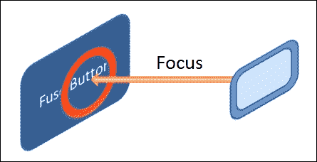

# 十、安卓在虚拟现实游戏中的应用范围

简单来看，“虚拟”和“现实”是两个对立的词。所以，一个自然的问题是，它们如何能一起意味着什么。这个短语描述了一种关于数字计算系统的虚拟或真实环境的体验。

游戏环境也是虚拟的或实时的。然而，这些环境并没有描绘出触觉、嗅觉、听觉和视觉的实时体验。所以，借助**虚拟现实** ( **VR** )游戏有了新的探索空间。

让我们通过以下主题来探索安卓游戏中虚拟现实的概念和范围:

*   理解虚拟现实
*   游戏中的虚拟现实
*   安卓在虚拟现实中的未来
*   虚拟现实设备的游戏开发
*   纸板软件开发工具包简介
*   使用纸板软件开发工具包开发游戏的基本指南
*   通过谷歌虚拟现实开发虚拟现实游戏
*   安卓虚拟现实开发最佳实践
*   安卓虚拟现实游戏市场的挑战
*   扩展的虚拟现实游戏概念和发展

# 理解 VR

在数字计算世界中，VR 意味着由数字计算创造的实时环境。这意味着地球上不存在环境，但可以通过数字计算来体验。然而，并不总是需要虚拟现实总是复制真实的环境。它具有复制想象世界或环境的能力，可以在电脑屏幕或 VR 头戴式耳机(头戴式显示器)设备上显示(图片来源:[https://lh3 . ggpht . com/uv8mx 61-jsrbcu-epnw 1 wi4 bcxg 7338 alepvlr 7 kbkjf 7 ez9 ext 2 u3a 08 swx 1 rc8 = h 900-rw](https://lh3.ggpht.com/uv8mx61-jsrbcu-EPNw1wIi4BCXg7338alepVlr7xKbKJf7eZ9EXT2U3roA8SWx1RC8=h900-rw)):


暗影之枪虚拟现实游戏的真实屏幕显示

## 虚拟现实的演进

VR 概念看似代表了现代科技，但事实是 VR 概念是在二十世纪的第二个四分之一左右引入的。1935 年，斯坦利·g·温鲍姆写了一篇短篇科幻小说《皮格马利翁的眼镜》《T2》，其中描述了一只护目镜。护目镜描述了用触觉和嗅觉对虚构经历的全息记录。从技术上来说，它定义了虚拟现实。

在二十世纪中期，这个概念是由视觉、嗅觉、触觉和声音虚拟化临时拼凑而成的。最终，在 1968 年，伊凡·苏泽兰和他的学生鲍勃·斯普罗尔创造了世界上第一个虚拟现实头戴式显示设备。

## 现代虚拟现实系统

现代虚拟现实设备是在 1990 年之后发展起来的。它们更轻，有更好的显示和计算设备。世嘉在 1991 年为街机游戏和游戏机开发了世嘉 VR。该设备配备了液晶显示器、立体声耳机和惯性传感器。

后来，2000 年后，虚拟现实设备在许多方面得到了改进。许多技术公司对开发更好的虚拟现实系统很感兴趣。如今，市场上已经可以买到虚拟现实设备。VR 现已集成到最新的带有输入控制器系统的移动设备中。

有许多公司出于多种目的开发运行在虚拟现实设备上的应用。随着时间的推移，虚拟现实技术的更多用途正在被引入和即兴发挥。

## 虚拟现实的使用

虚拟现实每天都在现代世界的许多领域传播。让我们快速了解一下虚拟现实可用性领域:

*   视频游戏
*   教育和学习
*   建筑设计
*   美术
*   城市设计
*   电影
*   医学疗法

### 电子游戏

视频游戏在技术上是由显示、声音和各种类型的交互系统组成的。虚拟现实设备已经被证明拥有运行游戏应用的所有必要组件。虚拟现实游戏化始于二十世纪末。从那时起，虚拟现实就被用于游戏行业。

游戏基本上是一个互动娱乐系统。VR 只是一个支持视频游戏系统的环境。虚拟现实系统可以带用户进入游戏世界与元素互动。

在本章的后面，我们将详细探讨虚拟现实在游戏中的作用。

### 教育和学习

教育主题的实地考察和可视化对学习过程有很大影响。很多时候，不可能就每一个科目都提供一堂实践课。虚拟现实有助于在许多教育主题上创造虚拟的、实用的和视觉的影响。许多机构和培训者使用这种方法来更好地教学。

培训是虚拟现实教育的另一个主要方面。例如，在发达国家，虚拟现实被用来训练飞行员驾驶战斗机。它减少了事故发生的机会，受训者可以体验驾驶喷气式飞机的实时感受。

它被广泛用于训练医学生进行各种野外治疗。

### 建筑设计

虚拟现实已经广泛应用于建筑设计中。它可以浏览提议的设计，而无需在现实中实施。许多建筑公司使用虚拟现实来演示设计。

有许多虚拟现实软件可以从建筑设计的数字副本中构建虚拟现实应用。

### 美术

这是一个不太为人所知和探索较少的虚拟现实应用。然而，许多优秀的艺术家已经使用虚拟现实来创建一个可导航的虚拟艺术世界。一些艺术博物馆可以通过虚拟现实技术进行虚拟参观。

### 城市设计

在现代世界，城市设计和规划使用虚拟现实来模拟和验证设计。城市设计也是用来发现设计中的漏洞和缺陷。在城市/城镇重建、交通规划、景观设计等方面，虚拟现实技术使城市设计变得更加容易。

### 电影

我们可以找到一些使用 VR 技术概念的电影。电影画面*头像*就是一个很好的例子。整个概念包含在虚拟现实技术中。这个概念在技术的帮助下描绘了一个虚拟的生活和活动，这样角色就可以体验一个虚拟的世界，而不会出现在现实中。

在虚拟现实仿真的帮助下，电影已经走向了多维度。如今，观众体验通过 VR 得到了提升。

### 药物治疗

**虚拟现实疗法**(**【VRT】**)在医学上相当流行，尤其是心理治疗。据记载，VRT 的成功率在世界范围内大于 90%。

VRT 主要用来治疗恐惧身高、飞行、昆虫、运动、公共谈话等的人，创造一个可控的虚拟环境。

# 安卓游戏中的 VR

安卓 N 最新发布之前，安卓没有直接支持 VR。谷歌已经意识到 VR 是应用的未来。此前，谷歌发布了 Cardboard SDK，在安卓系统上开发 VR 应用。这个软件开发工具包仍然在市场上，并被广泛使用。

市场上已经有很多针对安卓 VR 耳机的游戏。VR 耳机的数量日益增多。虚拟现实不是主流安卓游戏开发的一部分，但相信它很快就会成为主流，因为安卓现在已经为虚拟现实提供了一个特殊的设置。

## 安卓 VR 游戏历史

70 年代末，VR 系统开始以更好的设备快速进化。结果就是 2016 年主流安卓 SDK 中加入了 VR。最新的安卓设备支持虚拟现实。相信大部分即将推出的设备都会支持 VR 耳机。

以前，操作虚拟现实耳机需要高端电脑或控制台。但是现在，虚拟现实耳机被设计成支持移动设备。VR 耳机被认为是安卓可穿戴设备的一部分，具有很高的配置。

## 技术规范

从技术上讲，虚拟现实系统滞后于严重的延迟问题。然而，随着技术的进步，延迟在减少，体验在改善。一些著名的 VR 耳机有 Oculus Rift、HTC Vive、三星 Gear VR 等等。

让我们来看看与安卓设备直接兼容的 VR 设备。以前，虚拟现实设备中有集成显示器。然而，现在，安卓设备可以直接与带有多个输入处理器的虚拟现实耳机相关联。这是虚拟现实耳机面临的一个限制。由于其自身的物理尺寸和硬件规格，这种虚拟现实耳机仅与定义的移动手机兼容。虚拟现实耳机旨在适应特定的屏幕尺寸。然而，市场上有一些支持多种屏幕尺寸的 VR 套件。

## 当前安卓 VR 游戏行业

安卓 VR 游戏产业快速做大。几乎所有的新手机都支持虚拟现实应用。许多设备制造商正在提供专门为特定手机设计的外部虚拟现实套件。

以前有单独的设备来体验 VR，比如 Oculus VR 套装。然而，在安卓虚拟现实开发的帮助下，大多数移动设备都能够运行虚拟现实应用，并且可以通过外部虚拟现实工具包进行体验。

# 安卓在虚拟现实中的未来

众所周知，VR 游戏正在占领游戏市场。安卓日益发展。最新发布的安卓 N 有了新的 VR 支持维度。这清楚地表明，安卓在虚拟现实游戏方面有着巨大的潜力。谷歌可能正在开发一个未来的虚拟现实专用平台。

有更多的设备上市，是虚拟现实兼容的。所以，安卓平台上的 VR 游戏有着光明的前景。

## 谷歌白日梦

谷歌白日梦是下一代 VR 开发平台。据说它是谷歌纸板的继承者。最新的安卓 N 将包括对谷歌白日梦的支持，并且已经决定这些手机将被宣布为“准备做白日梦的手机”。

谷歌白日梦和安卓 N 将把安卓上的 VR 游戏带到数字游戏世界的新高度。游戏的体验和质量将会更好，更流畅，更真实。

# 虚拟现实设备的游戏开发

手机游戏行业有一个大的 VR 空间。基于安卓和谷歌的虚拟现实平台，开发人员现在正在瞄准虚拟现实的游戏。VR 游戏与其他游戏在本质上是不同的。它将用户带入游戏世界。当然，游戏设计和策划也不同于其他手机游戏。

## VR 游戏设计

虚拟现实并不满足每种类型的标准。因此，虚拟现实游戏设计需要做相应的工作。当游戏中有一个角色时，虚拟现实游戏是合适的，最优选的是第一人称射击游戏或一些 RPG 或赛车游戏。

设计师需要牢记，整个游戏世界必须由用户通过游戏来体验。因此，游戏体验是任何虚拟现实游戏最重要的因素。

通常，游戏设计师从一个想法开始设计游戏。然后，考虑相应的控制、环境和经验。然而，在虚拟现实游戏的情况下，开发者或设计者已经有了一套定义好的特性，他们可以在这些特性上通过设计来执行一个想法。

## VR 目标受众

世界上有几十亿部手机。然而，他们中很少有人实际上是虚拟现实兼容的，并且可以流畅地运行虚拟现实游戏。久而久之通过，越来越多的设备正在推出具有虚拟现实功能。

在安卓系统上玩虚拟现实游戏不仅仅需要手机，还需要一个支持的虚拟现实耳机。不是每个用户都会去买额外的设备玩 VR 游戏。这就是为什么休闲玩家不是 VR 游戏的主要目标受众。相反，典型的游戏玩家和游戏爱好者是目前的实际目标受众。

虚拟现实的应用非常广泛。使用的主要部分是模拟，包括教育。教育过程的游戏化打开了学生的巨大目标受众。另一个主要目标受众是精力充沛、对新事物充满好奇的年轻人。

## VR 游戏开发的制约因素

VR 游戏开发不需要超常的技能。开发人员应该了解并精通安卓，并且足够高效地理解虚拟现实规范和平台限制。以下是在安卓平台上开发虚拟现实游戏时的一些限制:

*   支持的手机有限
*   有限且特定的目标受众
*   有限的控制
*   有限的图形质量和最大的体验

# 纸板软件开发工具包简介

谷歌纸板是谷歌在 2014 年开发并发布的一款 VR 平台，用于智能手机的头戴式设备。该平台的目标是一个低成本的项目，以鼓励大规模的虚拟现实应用开发，这已被证明是富有成效的迄今为止。2016 年 5 月 18 日，谷歌宣布白日梦是该平台的下一步。

“纸板”这个名字来自于用纸板制成的虚拟现实设备的概念，这使得设备明显更便宜。然而，许多第三方公司正在使用各种材质遵循相同的构建架构，以增加其风格和构建质量。

目前，谷歌纸板只能用于为安卓和 iOS 创建虚拟现实应用。这改变了仅限于典型设备和硬件规格的虚拟现实开发理念:


## 纸板耳机组件

典型的谷歌卡纸耳机包含以下几个部分:

*   切成精确形状的纸板
*   45 毫米焦距镜头
*   磁铁或电容胶带
*   钩环扣件
*   橡皮筋
*   可选的近场通信标签

纸板装置的每个部分要么是预装的，要么有一个机械槽来安装。组装全齿轮简单快捷。橡皮筋最后才戴上耳机。然而，通过任何方式握住组装好的虚拟现实耳机都可以达到虚拟现实体验的目的。

组装套件后，将兼容的智能手机插入虚拟现实耳机的设备插槽，并由相应的组件固定到位。

## 纸板应用工作原理

一款与谷歌纸板兼容的应用将智能手机的显示图像分成两部分，每只眼睛一张。图像可以通过每个 45 毫米的镜头看到。它将桶形失真应用于每个显示片段，以抵消来自镜头的枕形失真。因此，一个完整的广阔的三维世界被创造出来。

最初的纸板耳机可以安装屏幕高达 5.7 英寸(140 毫米)的手机，并使用磁铁作为输入按钮，这也需要智能手机设备中的指南针传感器。后来，按钮被导电杆取代。

## 升级和变化

谷歌更新了的设计，在 2016 年发布了下一代 Cardboard VR 耳机，这款耳机可以与最大 6 英寸(150 mm)显示屏的手机配合使用。它还更新了输入按钮，增加了一个导电杆，可以触发智能手机屏幕上的触摸事件，从而提高设备间的兼容性。

谷歌允许几家供应商和制造商用不同的材质和风格制造与硬纸板兼容的耳机。今天，我们可以观察到这种产品的许多变体。

# 使用纸板 SDK 开发游戏的基本指南

为硬纸板 SDK 或任何其他 VR 组件开发游戏与其他安卓游戏并不相似。让我们通过以下几点快速了解一下纸板开发风格和标准的基础知识:

*   启动和退出虚拟现实游戏
*   虚拟现实设备适配
*   显示属性
*   游戏内组件
*   游戏控制
*   游戏音频设置
*   用户焦点协助
*   终极虚拟现实体验

## 启动和退出虚拟现实游戏

正常情况下，在启动安卓游戏后，它会执行一些自动化的任务，并带用户到菜单中选择一个动作。在 VR 游戏的情况下，将安卓设备正确安装到 VR 耳机上需要时间，因此开发者不会在游戏刚启动后就执行任何自动化任务。游戏应该等用户在完美的情况下运行后再开始。

为了获得更好的共同体验，游戏应该用虚拟现实标志或按钮提示用户开始虚拟现实游戏。

标准虚拟现实游戏有两种可能的出口:

*   点击后退按钮
*   点击主页按钮

### 点击后退按钮

如果虚拟现实有一个 2D 界面来显示退出弹出窗口，那么使用后退按钮是最好的主意。玩安卓虚拟现实游戏时，由于设备安装在虚拟现实耳机中，因此没有意外按下后退按钮的可能性。由于上面提到的标准，用一次点击后退按钮退出游戏是非常常见的。否则，退出弹出窗口可以达到这个目的，类似于非虚拟现实游戏。

### 点击主页按钮

一般来说，在虚拟现实游戏的情况下，点击主页按钮会将安卓应用推到后台，而不会杀死应用。

## VR 设备适配

使用硬纸板 SDK 的安卓虚拟现实游戏应该适应虚拟现实耳机的物理特性。谷歌纸板软件开发工具包有一个自动执行这项工作的功能。开发者可以依靠 SDK 根据 VR 耳机调整应用设置和配置。纸板软件开发工具包本身包含一些特定纸板设备的调整设置。SDK 可以为虚拟现实耳机的几个特定镜头配置立体声设置并校正失真。

建议开发人员使用 Cardboard SDK 功能，在单个游戏中支持最大可能的 VR 头戴式耳机，为用户提供最佳可能的 VR 体验，没有任何麻烦。

## 显示属性

在许多安卓设备中，有一个名为“熄灯”的功能。在这些设备中，“主页”、“菜单”和“后退”控件隐藏在“熄灯”功能下。虚拟现实游戏使用滑动屏幕技术，通过虚拟现实耳机镜头产生 3D 体验。这就是为什么在全屏模式下运行虚拟现实游戏是极其必要的。系统控件或状态栏实际上可能会出现在用户的外围视觉中，阻碍或分散他们对实际虚拟现实体验的注意力。

## 游戏内组件

通常，虚拟现实游戏体验通过设备屏幕位于环境中。在游戏过程中，它不太可能在屏幕上触发任何弹出窗口和其他不想要的组件。

开发人员不得调用任何会在游戏过程中触发任何弹出窗口或任何不想要的中断的应用编程接口。安卓目前不支持任何 2D 组件渲染。强制渲染的 2D 元素可能会导致虚拟现实显示迷失方向。即使没有，用户也需要将设备从 VR 耳机中取出，然后执行想要的动作来摆脱弹出，一点都不方便。

## 游戏控制

一个安卓 VR 耳机只包含一个按钮。这就是为什么虚拟现实游戏中的控件设计不遵循传统方式的原因。先来看看 VR 游戏的控制方案。

### 控制概念

UI 控件一般出现在游戏启动时。开发人员应该将用户界面控件放在初始视野中，以便用户可以找到它们来开始游戏。如果控件不在可见范围内，用户可能会感到困惑。在这种情况下，他们可能会四处寻找控制，或者干脆离开游戏。在这两种情况下，用户可能会对游戏失去兴趣。

玩游戏时，如果有任何用户界面，那些控件需要随着视野移动。否则，用户可能不得不回到 UI 元素所在的位置。

#### 控制类型

虽然耳机设备只有一个控制单元，但可能有几种方法来使用按钮和一些其他选项。最流行的控制类型如下:

*   保险丝按钮
*   视觉倒计时

##### 保险丝按钮

纸板虚拟现实耳机在设备侧面只有一个按钮。它可以用来点击目标。这个按钮的用途之一是在虚拟现实世界中触发一个虚拟按钮，这个虚拟按钮将会融合。这意味着在聚焦虚拟熔断按钮一段时间后，将触发相应的任务。然而，这可能会令人沮丧，因为用户需要等待这段时间。为了克服这个问题，开发人员应该给出一个选项，只要有可能，立即点击虚拟按钮:


##### 视觉倒计时

在使用带定时器的保险丝按钮时，有相当大的几率，用户可能会在不知不觉中专注于该按钮，并在一定时间后改变游戏状态。在这种情况下，用户可能会感到困惑，无法继续相同的游戏体验。开发人员应该直观地显示倒计时，向用户显示在一定时间内将要发生的事情:



#### 保险丝按钮指示

我们已经知道，VR 游戏不支持 2D UI 按钮。所以，开发人员使用保险丝按钮。保险丝按钮可以是游戏中的任何元素。必须有一个指示来指导用户关注特定的保险丝按钮。然后，可以通过倒计时或点击来执行操作。

例如，开发人员经常使用一些发光、发亮、摇动或其他动态机制来使对象对于点击可见。相应的任务或动作由周围环境定义，以指示任务。

#### 控制放置

当元件足够大，可以聚焦时，激活保险丝按钮总是一个很好的做法。它可以为用户省去很多困惑。此外，场景中不应有难以定位且可能造成混乱的相邻保险丝按钮。

# 通过谷歌 VR 进行 VR 游戏开发

谷歌已经通过谷歌虚拟现实发布了一个面向安卓的虚拟现实开发工具包，该工具包包含安卓软件开发工具包和安卓 NDK。这些 SDK 支持纸板和白日梦虚拟现实平台。

开发人员可以通过以下任务跳转到虚拟现实游戏开发:

*   头部跟踪系统
*   空间音频
*   动态渲染
*   用户界面处理
*   三维校准
*   镜头畸变校正
*   立体几何构型

让我们来看看用于 VR 游戏开发的安卓 SDK:

*   谷歌虚拟现实使用安卓软件开发工具包
*   谷歌虚拟现实使用安卓 NDK

## 使用安卓软件开发工具包进行谷歌虚拟现实

我们将在安卓软件开发工具包的帮助下看看虚拟现实的开发。在 Gradle 的帮助下，可以构建一个虚拟现实应用。Gradle 可以独立使用，也可以和 Android Studio 一起使用。

开发人员可以使用其他工具代替 Android Studio，但强烈建议使用 Android Studio 进行安卓构建。是安卓平台上 VR 应用开发最便捷的方法。

开发人员需要检查以下因素，以便为安卓创建虚拟现实应用构建:

*   Android Studio 1.0 或更高版本
*   Android SDK 版或更高版本
*   Gradle 版本 23.0.1 或更高版本

使用 Android Studio 可以省去用户配置 Gradle 设置来构建应用包。如果需要，它还可以帮助开发人员识别和更新 Gradle。

开发者可以选择 Gradle 来构建一个安卓应用项目。在这种情况下，开发人员需要手动编辑每个模块的每个`build.gradle`文件，以包含用于 Gradle 构建的`.AAR`声明。

修改必须这样做:

```java
dependencies
{
  compile(name:'audio', ext:'aar')
  compile(name:'common', ext:'aar')
  compile(name:'core', ext:'aar')
}

repositories
{
  flatDir
  {
    dirs 'libs'
  }
}
```

Android Studio 会自动进行这些更改，并声明每个模块的依赖关系。这将告诉 Gradle 在相应模块的`libs`子目录中查找三个`.AAR`声明。如果没有名为`libs`的子目录，那么开发人员需要在模块目录中创建一个`libs`子目录，并手动复制所需的`.AAR`文件。

## 谷歌 VR 使用安卓 NDK

VR 应用使用安卓 NDK 开发与 SDK 开发没有太大区别。它需要以下组件:

*   Android Studio 1.0 或更高版本
*   安卓 NDK
*   针对安卓的谷歌 VR SDK

建议你使用带有白日梦开发平台的安卓 NDK。因此，开发人员需要为白日梦软件开发工具包设置开发环境。

谷歌虚拟现实开发工具包从测试版的 v0.8.0 版本开始支持 NDK 开发。从 v0.8.1 版本开始，它包含了一个本地头部跟踪系统来为开发提供动力。

安卓 SDK 足以用 Cardboard 开发 VR 游戏，但少数开发者喜欢用 C++ 等原生语言开发游戏。对技术有了更好的理解，少数选择用 C++ 和 OpenGL 开发 VR 游戏。这样，虚拟现实游戏也可以移植到其他虚拟现实平台。

# 安卓 VR 开发最佳实践

开发人员需要有为安卓编写常规游戏的经验，然后才能开始用 Cardboard 构建 VR 体验。以下是开发人员在为谷歌纸板开发虚拟现实游戏时需要关注的几个领域:

*   绘制调用限制
*   三角形计数限制
*   保持稳定的 FPS
*   克服过热问题
*   旨在获得更好的音频体验
*   设置正确的项目设置
*   使用适当的测试环境

## 绘制调用限制

VR 游戏显然是 3D 游戏，渲染过程非常广泛。尽量减少绘制调用以限制渲染时间并减少 GPU 开销始终是一种好的做法。

一般来说，基于当前可用设备的列表，开发人员应该保持每帧 100 个渲染调用的限制。在当前的行业中，大多数开发人员都试图将平局呼叫保持在 50 到 100 之间。

## 三角形计数限制

我们已经讨论了 3D 游戏中顶点和三角形的功能。同样的逻辑也适用于虚拟现实游戏。然而，在 VR 游戏中保持性能比正常的 3D 游戏更难。这就是为什么 VR 游戏通常使用 100k 以内的三角形计数。

目前，一款表现不错的 VR 游戏的平均三角形数在 50k 到 80k 左右。开发人员需要简化其所有的 3D 对象，并在尽可能少的三角形和顶点中优化它们，以在运行时实现良好的 FPS。

## 保持稳定的 FPS

对于任何一款安卓游戏来说，保持稳定得体的 FPS 是必须的。安卓的 VR 游戏也不例外。通过上述限制，开发人员可以减少渲染时间以获得性能。

VR 游戏使用分屏技术，这是一个繁重的过程。因此，开发人员应该决定并使用尽可能少的游戏对象或元素来保持 FPS 稳定。

用有限的资源提供更好的视觉效果，对 VR 游戏开发者来说是一个很大的挑战。设计和创造艺术素材是一个主要部分。使用具有最小三角形的低多边形模型会产生较差的视觉质量。然而，这种质量可以在虚拟现实世界中对模型和战略灯光映射的出色纹理支持的帮助下得到改善。

## 克服过热问题

过热是安卓 VR 游戏常见的问题。由于大量使用中央处理器和图形处理器，设备在运行虚拟现实应用时会发热。要完全解决这个问题，开发人员无能为力。但是，开发人员可以优化 VR 游戏，以减少处理器的使用。游戏应该有有限的网络使用和其他设备组件，以最大限度地减少电池消耗。

## 更好的音频体验

安卓 VR 游戏是在额外的 VR 设备支持下玩的，比如谷歌 Cardboard 或者类似的。我们已经在本章中讨论了这些设备。此类设备不支持音频；虚拟现实游戏默认使用设备扬声器。

没有适当的音频体验，虚拟现实体验是不完整的。在游戏中使用 3D 环境音频，建议用户在玩 VR 游戏时佩戴耳机，这一直是一个很好的做法。

## 设置正确的项目设置

尽早设置 VR 项目设置可以让开发人员在未来免于头痛。特别是为了获得更好的项目性能，在项目开始时正确设置质量设置非常重要。如果没有预先的项目配置，整个项目和绩效计划就不会有成果。

## 使用合适的测试环境

设置你的测试环境对于任何游戏的成功都是极其重要的，尤其是对于 VR 这样的大型游戏。开发人员必须知道每个开发阶段的状态，以便他们可以做出未来的决定，使游戏变得更好。这样，开发过程才能顺利进行。

始终建议您从虚拟现实设备外部运行虚拟现实游戏进行测试。还建议您使用 **adb** 检查每个调试条件和语句。对于虚拟现实游戏来说，很难使用正常的调试桥，因为游戏必须用虚拟现实设备进行测试。开发人员需要建立一个无线调试桥来克服这个问题。调试桥还可以用于从虚拟现实设备外部运行和停止游戏。这样，开发者可以节省很多时间，可以用来改进游戏。

# 安卓 VR 游戏市场面临的挑战

我们已经了解了在安卓平台上开发 VR 游戏的技术挑战。现在，让我们看看开发人员在为安卓开发虚拟现实游戏或将其货币化时可能面临的其他挑战:

*   低目标受众
*   有限的游戏类型
*   长时间的游戏
*   有限的设备支持
*   实时约束

## 低目标受众

很少有安卓用户熟悉 VR 的概念和技术。大多数情况下，用户是没有虚拟现实耳机的普通手机持有者。因此，已经有一大部分观众不在虚拟现实游戏的范围之内。这就是为什么虚拟现实游戏市场仅限于使用虚拟现实耳机的观众。

## 限定游戏类型

我们已经研究了虚拟现实游戏中可能的游戏类型。虚拟现实游戏不能支持迄今为止发布的所有游戏类型，并且可能在不久的将来无法支持。这种限制对于安卓虚拟现实游戏市场来说是一个严峻的挑战，因为它需要获得有利可图的地位和设计货币化。

## 长时间的游戏

安卓 VR 游戏必须用装有安卓手机的 VR 耳机玩。通常，游戏时间较长，并且需要花费时间和精力来建立一个可玩的环境。

安卓游戏用户通常沉迷于快速灵活的游戏会话。大多数游戏可以立即暂停和恢复，以方便游戏。但是，VR 游戏不能立即暂停或恢复。用户在空闲时间较长时，更喜欢玩 VR 游戏。

## 有限的设备支持

安卓 VR 游戏需要高级硬件配置才能运行游戏。硬件平台必须有足够的能力来处理游戏，渲染单元必须在尽可能短的时间内以尽可能高的质量渲染游戏。

市场上有许多便宜和低配置的手机。数百万安卓用户使用这些手机。然而，他们中的大多数人都无法以稳定和可接受的 FPS 运行虚拟现实游戏。安卓 VR 游戏的开发者必然会排斥那些设备。这种限制大大减少了支持的设备数量。

## 实时约束

大部分 VR 游戏玩家都是游戏玩家或者游戏爱好者。然而，他们在玩 VR 游戏时也有一些实时性的限制。用户或玩家必须选择一个中断可能性最小的游戏环境。

游戏玩家通常更喜欢坐在一个位置或一个宽敞的地方，以避免在玩游戏时发生任何事故。他们的眼睛被 VR 耳机遮住了，所以用户需要采取这些安全措施。这些问题无法解决，这影响了虚拟现实游戏市场，并导致会话数量和时间减少。

# 扩展的虚拟现实游戏概念和开发

我们只讨论了安卓的几个虚拟现实游戏方面。这些想法已经或正在实施。然而，虚拟游戏有一个更广泛的概念。

游戏开发者现在正尝试用 VR 技术制作实时体验。还有一些类似数字游戏的实时游戏，比如*彩球*、*激光标签*等等。在 VR 技术的帮助下，这些体验可以更上一层楼。在与虚拟现实应用环境物理同步的预定义环境中使用虚拟现实耳机可以将用户带入游戏。这种游戏的概念已经开始形成。在各种其他物理设备和传感器的支持下，已经创建了一些虚拟现实游戏的测试场地。这些齿轮和传感器实时跟踪用户的运动，并通过虚拟现实耳机显示器在虚拟世界中复制它。

简单的动作，如行走、蹲下、触摸虚拟世界中的某个东西、射击虚拟敌人，都已经实现了。开发人员和研究人员正在使它一天比一天好。然而，安卓平台还没有迈出这种虚拟现实开发的一步，原因如下:

*   安卓是一个移动操作系统，最适合便携式设备。
*   大多数安卓设备都是移动手机或平板电脑。
*   很难通过安卓管理一个物理设置很大的专用硬件平台。**实时操作系统**(**【RTOS】**)在这类系统上的表现要比安卓好得多。
*   这种安卓系统的市场前景不佳，成本可能很高。

尽管在大规模设置安卓虚拟现实游戏时存在这些问题，但相信安卓很快就会成为这些系统的一部分。

# 总结

这是科技的时代。VR 技术让游戏体验更上一层楼。安卓现在是最进步的游戏平台。加入两个领先的平台肯定能让手机游戏体验更上一层楼。

在虚拟现实游戏中，用户有机会进入游戏环境。然而，用虚拟现实功能为安卓开发游戏有很多限制。谷歌已经宣布了其即将推出的虚拟现实开发平台“白日梦”，该平台包括带有独立控制器的扩展控件。

虚拟现实游戏行业发展迅速。它有自己的一套优点和缺点。但是，毫无疑问，游戏体验远胜于常规的游戏系统。因此，认为安卓虚拟现实游戏行业的未来是光明的，这不会是一个错误的假设。