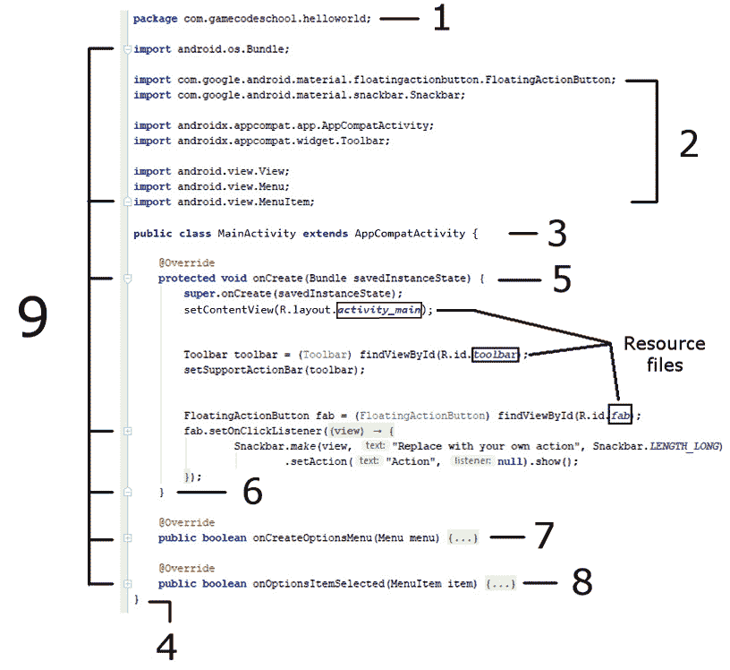
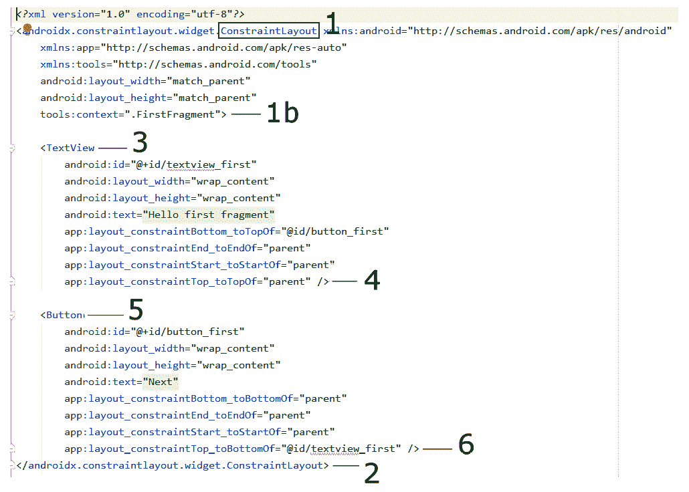
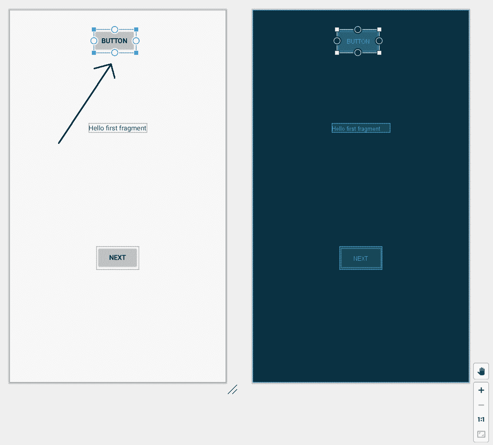
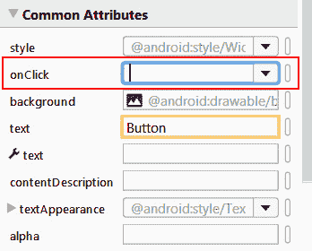
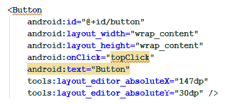
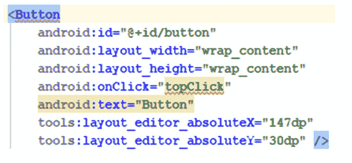
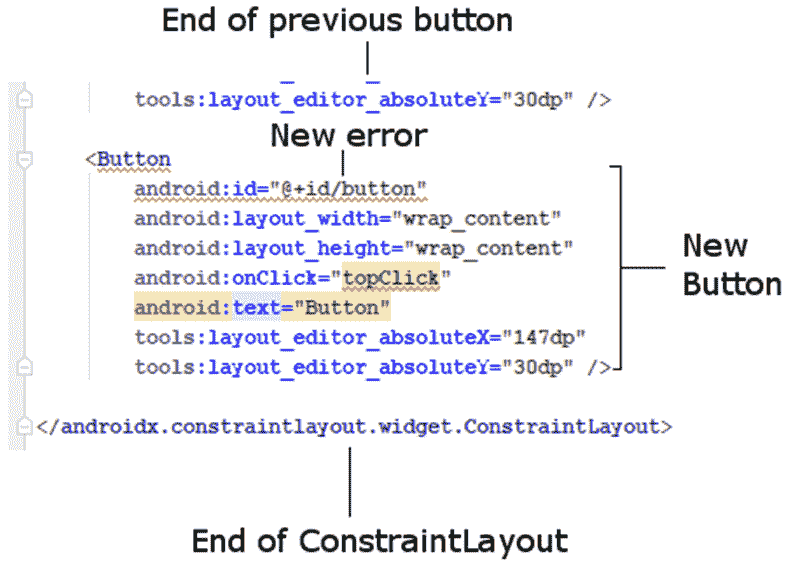
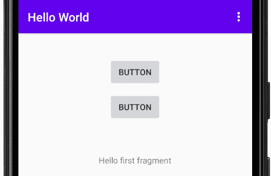
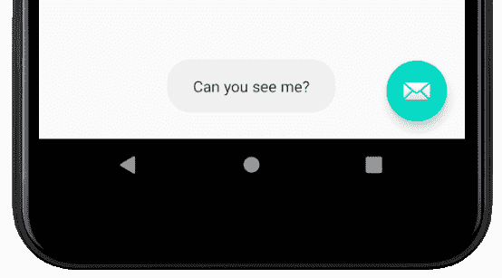

# *第二章*:第一次接触:Java、XML 和 UI 设计师

在这个阶段，我们有一个运行良好的安卓开发环境，我们已经构建并部署了我们的第一个应用程序。然而，很明显，安卓工作室自动生成的代码不会成为谷歌 Play 上的下一个畅销应用。我们需要探索这个自动生成的代码，这样我们就可以开始理解安卓，然后学习如何在这个有用的模板上构建。牢记这一目标，在本章中，我们将执行以下操作:

*   了解如何从我们的应用程序中获得技术反馈
*   检查我们第一个应用程序中的 Java 代码和用户界面 XML 代码
*   让我们第一次体验使用安卓工作室**用户界面** ( **用户界面**)设计师
*   了解一些核心的 Java 基础知识，以及它们与安卓的关系
*   编写我们的第一个 Java 代码

首先，让我们看看如何从我们的应用程序中获得反馈。

# 技术要求

你可以在[https://GitHub . com/PacktPublishing/Android-初学者编程-第三版/tree/main/章节%2002](https://github.com/PacktPublishing/Android-Programming-for-Beginners-Third-Edition/tree/main/chapter%2002) 找到本章的代码。

# 检查日志文件输出

在前一章中，我们提到我们的应用程序在模拟器或真实设备上以调试模式运行，因此我们可以监控它，并在出现问题时获得反馈。那么，这些反馈在哪里呢？

您可能已经注意到安卓工作室窗口底部有一大堆滚动文本。如果没有，点击**日志**选项卡，如下图中标记为 **1** 的高亮区域所示:

注意

模拟器必须正在运行，或者必须在调试模式下连接一个真实设备，这样您才能看到下面的窗口。此外，如果您由于某种原因重新启动了安卓工作室，并且在重新启动后没有执行该应用，则**日志文件**窗口将为空。请参考第一章，让应用程序在模拟器或真实设备上运行。


图 2.1–日志目录选项卡

您可以拖动窗口使其变高，就像您在大多数其他 Windows 应用程序中希望看到更多一样。

该窗口被称为 **logcat** 或有时被称为**控制台**。这是我们的应用程序告诉我们下面发生了什么以及用户看到了什么的方式。如果应用崩溃或有错误，原因或原因的线索会出现在这里。如果我们需要输出调试信息，我们也可以在这里这样做。

注意

我们正在构建的应用程序在现阶段应该不会有任何问题，但是在未来，如果你只是不能弄清楚你的应用程序为什么会崩溃，那么从 logcat 复制并粘贴一点文本到 Google 中通常会揭示原因。

## 过滤日志输出

您可能已经注意到 logcat 的大部分内容(如果不是全部的话)几乎是不可理解的。没关系。目前，我们只对错误和调试信息感兴趣，错误将以红色突出显示，调试信息我们将在下一步了解。为了让我们在 logcat 窗口中看到更少的不需要的文本，我们可以打开一些过滤器来使事情更加清晰。

在上图中，我突出显示了另外两个区域，如 **2** 和 **3** 。区域 **2** 是控制第一个过滤器的下拉列表。现在左键点击，从**详细**变为**信息**。我们大幅削减了文本输出。当我们对我们的应用程序进行一些更改并重新部署时，我们将看到这是多么有用。在我们探索了代码和构成项目的资产之后，我们将这样做。此外，在标有 **3** 的区域内双击，该区域显示**仅显示选定的应用程序**。如果没有，左键点击，改为**现在只显示选中的应用程序**。

现在我们可以看看安卓工作室自动为我们生成了什么，然后我们可以开始更改和添加代码，以个性化它，超越我们从项目创建阶段获得的内容。

# 探索项目 Java 和主布局 XML

我们将查看包含定义简单用户界面布局的代码的资源文件和包含 Java 代码的文件。在这个阶段，我们不会试图理解所有的事情，因为我们需要学习更多的基础知识，这样做才有意义。然而，我们将看到的是这两个文件的基本内容和结构，因此我们可以将它们的内容与我们已经知道的关于 Android 资源和 Java 的内容进行协调。

## 检查 MainActivity.java 文件

先来看看 Java 代码。如果由于某种原因，当前不可见，您可以通过左键单击**MainActivity.java**选项卡来查看该代码，如下图所示:


图 2.2–MainActivity.java 选项卡

因为我们没有看到代码的复杂细节，所以带注释的屏幕截图比以文本形式再现实际代码更有用。在阅读本节时，定期参考下图:



图 2.3–Java 代码

首先要注意的是，我在代码中添加了几行空行，将事情稍微隔开一点并呈现出更清晰的图像。

### 安卓工作室中的代码折叠(隐藏)

现在看图的左手边，多个零件标注 **9** 。这指向编辑器中的所有小+和-按钮，它们可以折叠和展开部分代码。我确实折叠了代码的一些部分，而其他部分仍然可见。所以，你在屏幕上看到的和你看图时看到的略有不同。在安卓工作室中，使用+和–按钮玩一会儿，练习隐藏和取消隐藏部分代码。您可能想让您的屏幕看起来像图，但这不是继续的要求。像这样隐藏代码的专业术语是**折叠**。

### 包装声明

第 **1** 部分被称为**包声明**，如您所见，这是我们在创建项目时选择的包名，前面有一个单词`package`。每个 Java 文件的顶部都会有一个包声明。

### 导入类

部分 **2** 是八行代码，所有都以`import`这个词开头。在`import`这个词之后，我们可以看到各种各样的点分隔词。每行的最后一个单词是该行导入到我们项目中的类的名称，每行中所有前面的单词都是包含这些类的包和子包。

例如，下一行从`androidx.appcompat.app`包和子包导入`AppCompatActivity`类:

```java
import androidx.appcompat.app.AppCompatActivity;
```

注意

行尾的分号向编译器显示它是该行代码的结尾。

这意味着在这个文件中我们将可以访问这些类。事实上，自动生成的代码正是使用这些类来制作我们在上一章中看到的简单应用程序。

我们不会在本章讨论所有这些课程。现在重要的是我们可以进行这种导入的概念。请注意，我们可以随时从任何包中添加额外的类，当我们很快改进我们的应用程序时，我们会的。

### 班级

我们的代码的第 **3** 部分被称为**类声明**。这是那一行的全文；我强调了其中的一部分:

```java
public class MainActivity extends AppCompatActivity {
```

类声明是类的开始。请注意高亮显示的部分`MainActivity`。这是我们创建项目时安卓工作室给这个类起的名字，它也和我们之前讨论过的 Java 类的`MainActivity.java`文件名一样。

类和文件可以重命名，但由于这是我们应用程序的关键/主要活动，`MainActivity`似乎是合适的。`extends`关键字意味着我们这个叫`MainActivity`的班级将是`AppCompatActivity`类型。

我们可以并且将会使用一些没有这个`extends`部分的类。我们在这里使用`extends`是因为我们想要使用所有进入`AppCompatActivity`类的代码，以及向其中添加我们自己的代码。所以，我们**延长**它。所有这些和更多将在面向对象编程第 10 章[](10.html#_idTextAnchor187)**中变得清晰。**

 *最后，对于部分 **3** ，请看行尾的左花括号:`{`。现在看下图我们代码的 **4** 部分。这个右花括号`}`表示类的结束。在左大括号和右大括号`{...}`之间的一切都是`MainActivity`类的一部分。

### 类内的方法

现在看代码的第 **5** 部分。这是完整的代码行，突出了我们讨论的关键部分:

```java
protected void onCreate(Bundle savedInstanceState) {
```

这是一个方法**签名**。突出显示的部分`onCreate`是方法**名称**。我们制作一个方法通过使用它的名字来执行它的代码。当我们这样做的时候，我们说我们在**调用**一个方法。

虽然我们现在不关心方法名两边代码部分的细节，但是您可能已经注意到了`Bundle`，我们在代码的 **2** 部分导入的类之一。如果我们删除了相关的`import`行，安卓工作室将不会知道`Bundle`是什么，它将无法使用，并用红色下划线表示为错误。

我们的代码将无法编译和运行。请注意，前一行代码中的最后一件事是一个左大括号`{`。这表示包含在`onCreate`方法中的代码的开始。现在跳到我们代码的第 **6** 部分，您将看到一个右花括号，`}`。您可能已经猜到这是方法的结尾。`onCreate`方法的左大括号和右大括号之间的所有内容都是调用该方法时执行的代码。

我们还不需要深入研究这段代码的作用，但是作为概述，它通过引用我们创建项目时安卓工作室自动生成的资源文件来设置应用程序的外观/布局。在上图中，我用大纲突出显示了资源文件。

部分 **7** 和 **8** 也是我为了让形象和这个讨论更直白而折叠的方法。他们的名字分别是`onCreateOptionsMenu`和`onOptionsItemSelected`。

我们对我们的 Java 代码了解得足够多，可以取得一些进展。我们将再次看到这段代码，并在本章稍后进行更改。

### 到目前为止的 Java 代码概要

诚然，包含在我们刚刚概述的代码中，有一些复杂的语法。然而，我们正在做的是建立关于这段代码的足够多的知识，这样我们就可以与它合作，开始在学习 Java 和安卓方面取得快速进展，而不必先学习数百页的 Java 理论。到这本书的最后，所有的代码都将有意义，但是为了现在取得快速进展，我们只需要接受一些细节将在一段时间内保持神秘。

## 检查应用布局文件

现在我们来看看众多`.xml`文件中的一个。有几个不同的布局文件，我们将在本书的整个过程中遇到它们，但让我们从最容易识别的一个开始，它决定了我们应用程序的大部分外观。

在项目浏览器窗口中，左键单击 **res** 文件夹，然后左键单击**布局**文件夹。现在双击`fragment_first.xml`文件。文件的 XML 代码内容现在显示在安卓工作室的主窗口中。

我们可以忽略 **res 生成的**文件夹。

我们将很快探索这个 XML 代码，但是首先找到并左键单击**设计**按钮(如下所示)以切换到设计视图:


图 2.4–打开设计视图

现在，我们可以看到设计视图，它向我们显示了当应用程序在模拟器中运行时，XML 代码将导致显示什么:


图 2.5–应用程序显示

上图看起来应该很熟悉，因为它显示了我们在上一章末尾运行的第一个应用程序的布局——带有**你好第一片段**文本和**下一个**按钮的那个。如果您从与`fragment_first.xml`相同的文件夹中查看`fragment_second.xml`文件，您将看到我们在上一章中看到的第二个布局，上面有**上一个**按钮。事实上，与布局相关的文件比我们最初预期的还要多，但是我们将在本章和下一章讨论它们。

我们在整本书中设计应用程序时所做的大部分工作都将在这个设计视图中完成。然而，重要的是要知道幕后发生了什么。

设计视图是包含在`fragment_first.xml`文件中的 XML 代码的图形表示。点击**代码**选项卡(上图**设计**选项卡附近)查看构成布局的 XML 代码。我已经注释了一个 XML 文本的截图，所以我们接下来可以讨论它:



图 2.6–XML 文本的截图

首先要注意的是，这个文件并不代表整个布局。然而，它确实代表了大部分表面区域和整个**你好第一片段**信息和**下一个**按钮。此外，在左侧，我们可以看到现在熟悉的+和–图标，因此我们可以折叠和展开代码的部分。

### 用户界面布局元素

如果我们首先看代码中标记为 **1** 的部分，我们可以看到第一件事就是`…ConstraintLayout...`。现在，`ConstraintLayout`是一个 UI 元素，用来包装 UI 的其他部分。

当我们在安卓中向用户界面添加一个新元素时，我们总是以`<`开始一行，后跟元素的名称。

接下来的代码很长，看起来很麻烦，定义了这个元素的**属性**。根据用户界面元素的类型，这可能包括几十种不同的东西。在这里，在一些其他的 XML 中，我们可以看到诸如`layout_width`和`layout_height`这样的东西。所有这些属性定义了`ConstraintLayout`元素在用户屏幕上的显示方式。`ConstraintLayout`元素的属性在标记为 **1b** 的第一个`>`处结束。

如果我们看一下我们的 XML 截图的底部，我们会看到一些标记为 **2** 的代码。该代码`</…ConstraintLayout>`标志着`ConstraintLayout`元素的结束。元素属性的结束`>`和定义其结束的`</…ConstraintLayout>`之间的任何东西都被认为是元素的子元素。所以，我们可以看到我们的`ConstraintLayout`有/包含两个子元素。现在让我们看看那些孩子。

### 用户界面文本元素

用我们刚刚学到的，可以说截图中从位置 **3** 开始的 UI 元素叫做一个 **TextView** 。就像它的父母一样，它以一个`<`和它的名字:`<TextView...`开始。如果我们进一步观察我们的`TextView`元素，我们可以看到它有几个属性。它有一个设置为`"Hello first fragment"`的`text`属性。这当然是我们的应用程序向用户显示的确切文本。它还有`layout_width`和`layout_height`属性，都设置为`"wrap_content"`。这告诉`TextView`它可以占据它所需要的内容所需要的空间。正如我们将在整本书中看到的，还有更多属性可用于这个和其他用户界面元素。`TextView`中的最后一个属性是`id`，我们将在下一节中看到我们和安卓在改进这第一款 app 时如何使用`id`属性。

请注意，我们的 XML 截图中 **4** 处的代码是`/>`。这标志着`TextView`元素的结束。这与`ConstraintLayout`元素的结尾书写方式略有不同。当 XML 中的一个元素没有子元素时，我们可以这样结束它:`/>`。当元素有子元素，并且它的结束在定义它的属性的代码中出现得更远时，通过像这样重复它的名字来结束元素就更清楚了:`</…ConstraintLayout>`。

注意

你可能想知道为什么`TextView`的元素名称清晰简洁(简称为`TextView`)，而`ConstraintView`的全称前面是复杂明显的混乱(`androidx.constraintlayout.widget.ConstraintLayout`)。这个`ConstraintLayout`元素是一个特殊的布局，用于确保我们的应用程序与旧版安卓兼容。当我们向应用程序添加按钮时，我们马上就会看到，大多数元素都有简单明了的名称。

### 用户界面按钮元素

现在我们应该可以快速识别出截图中从 **5** 开始的代码是一个**按钮**元素。就像它的父母一样，它以一个`<`和它的名字:`<Button...`开始。如果我们进一步观察我们的`Button`，我们可以看到它有几个属性。它有一个设置为`"Next"`的文本属性。这当然是用户可以点击的按钮上显示的确切文本。它还有`layout_width`和`layout_height` 属性，都设置为`"wrap_content"`。这与`TextView`元素一样，会导致屏幕按钮占据所需的空间。`Button`中的最后一个属性是`id`，对于按钮来说，这通常是一个至关重要的属性，甚至比用户界面的其他部分更重要。由于`id`属性可以将该按钮与其他按钮区分开来，因此我们可以根据`id`属性中的值为不同的按钮编程不同的功能。我们将很快看到这一原则的实施。

请注意，我们的 XML 截图中 **6** 处的代码是`/>`。我们已经知道，这标志着`Button`元素的结束。

我们将在下一节中编辑并添加到这个 XML 代码中，并了解更多关于属性的信息。

注意

布局的元素是通常被称为**小部件**。

# 向主布局文件添加按钮

在这里，我们将在屏幕上添加几个按钮小部件，然后我们将看到一种让它们真正做某事的快速方法。我们将以两种不同的方式添加按钮，第一种是使用可视化设计器，第二种是直接添加和编辑 XML 代码。

## 通过视觉设计器添加按钮

要开始添加我们的第一个按钮`fragment_first.xml`，请在编辑器中打开它，并通过单击**设计**选项卡切换回设计视图(如下所示):


图 2.7–设计选项卡

请注意，在布局的左侧，我们有一个名为**调色板**的窗口，如下所示:


图 2.8–调色板窗口

调色板分为两部分。左侧列表包含用户界面元素的类别，允许您选择一个类别，然后右侧向您显示当前所选类别中所有可用的用户界面元素。

确保选择了**常用**类别，如上图所示。现在，左键单击并按住**按钮**部件，然后将其拖动到靠近顶部中心的布局上。

不确切也没关系。然而，练习把它做对是很好的。所以，如果你对你的按钮的位置不满意，那么你可以左键点击它在布局上选择它，然后点击键盘上的*删除*键来摆脱它。现在，您可以重复上一步，直到有一个您满意的新的整齐放置的按钮，如下所示:



图 2.9–更新布局

此时，我们可以在模拟器或真实设备上运行应用程序，按钮就在那里。如果我们点击它，甚至会有一个简单的动画来表示按钮被按下和释放。如果你愿意的话，现在就试试这个吧。如果您这样做了，您会注意到按钮的位置没有达到您的预期:


图 2.10–按钮位置不正确

暂时不要担心这个明显的异常现象；我们将在接下来的几节中研究这个问题。

接下来，我们将在**属性**窗口中编辑我们按钮的属性。

### 编辑按钮的属性

左键点击按钮，确保选择了该按钮。现在找到编辑窗口右侧的**属性**窗口，如下图所示:


图 2.11–属性窗口

在上图中，您可以看到，我们可以从当前选择的 UI 元素中访问广泛的属性选择。为了显示更多的属性，我们单击不同类别的属性，并使用右边的滚动条滚动它们。如果默认情况下它们尚未打开，请左键单击**常用**T3】属性和**所有属性**部分的箭头以显示它们的选项。

现在你可以看到按钮的全部细节，我们可以开始编辑它了。像按钮这样简单的东西拥有如此多的属性，这似乎令人惊讶。这是安卓应用编程接口为用户界面操作提供的多功能性和强大功能的标志。

正如你所看到的，这里有一大堆不同的属性，我们可以在用户界面设计器中编辑。在 [*第 13 章*](13.html#_idTextAnchor228) *【匿名类–将安卓小部件带入生活】*中，我们还将使用我们的 Java 代码编辑和操作这些属性。

现在，我们将只编辑一个属性。滚动**属性**窗口，直到看到**常用属性**部分的 **onClick** 属性，然后左键单击选中进行编辑，如下图:



图 2.12–通用属性部分

注意

如果您在查找属性时遇到困难，您总是可以在**所有属性**部分找到它，其中属性按字母顺序排列。因此， **onClick** 属性也可以在**所有属性**部分的冗长列表中找到大约三分之二。

在**中输入`topClick`点击**属性的编辑框，按键盘上的*进入*。一定要用同样的大小写，包括稍微违反直觉的小写`t`和大写`C`。

完成后**属性**窗口将如下所示:


图 2.13-onclick 选项

我们在这里所做的是在我们的代码中命名 Java 方法，当用户点击这个按钮时，我们想要调用这个方法。名字是任意的，但是因为这个按钮在屏幕的顶部，这个名字看起来很有意义并且容易记住。我们使用的奇怪的大小写是一个惯例，它将帮助我们保持代码清晰易读。随着我们的代码变得越来越长、越来越复杂，我们将看到这样做的好处。

当然`topClick`法还不存在。安卓工作室很有帮助，但是有些事情我们需要自己去做。在我们向用户界面添加了另一个按钮之后，我们将使用 Java 代码编写这个方法。此时，您可以运行该应用程序，它仍然可以工作。但是如果你点击这个按钮，它会崩溃，你会得到一个错误，因为这个方法不存在。安卓工作室通过用红色勾勒出 **onClick** 属性来警告我们即将到来的崩溃，如上图所示。如果将鼠标光标悬停在这个红色的轮廓上，会看到问题的详细信息:**对应的方法处理程序…未找到**。

### 检查新按钮的 XML 代码

在我们为这个项目添加我们的最终按钮之前。单击**代码**选项卡，切换回查看构成我们用户界面的 XML 代码。

请注意，在我们之前检查的 XML 中有一个新的代码块。这是新代码块的图像:



图 2.14–XML 中的新代码块

此外，请注意以下细节，这些细节应该对应于我们对 XML 和 Android UI 元素的了解:

*   新代码以文本`<Button`开始，以`/>`结束。
*   代码有一系列定义按钮的属性，包括`layoutWidth`和`layoutHeight`。
*   代码中包含了我们刚刚添加的`onClick`属性，值为`"topClick"`。
*   `onClick`属性的`topClick`值用红色下划线标出，表示缺少方法错误。
*   代表按钮的代码的开始和结束包含在`ConstraintLayout`元素中。

如同在设计视图中一样，您可以将鼠标光标悬停在带红色下划线的`topClick`代码上，以揭示问题的细节:**对应的方法处理程序……未找到**。

注意

在写这本书的过程中，安卓工作室更新了它在 XML 中显示错误的方式。目前，它以红色突出显示错误，而不是如附图和描述中所示的红色下划线。黑白印刷的下划线更清晰，所以它们保持原样。

我们可以看到的问题是安卓工作室希望在我们的 Java 代码中实现一个名为`topClick`的方法。一旦我们添加了第二个按钮，我们就会这样做。

## 通过编辑 XML 代码添加按钮

只是为了多样化和证明我们可以，我们现在将只使用 XML 代码添加另一个按钮，而不是用户界面设计器。大多数情况下，我们将使用用户界面设计器，但是这个快速练习应该会在您的脑海中巩固用户界面设计器和底层 XML 代码之间的关系。

我们将通过复制和粘贴现有按钮的代码来实现这一点。然后，我们将对粘贴的代码进行一些小的编辑。

在开始`<Button`的按钮代码前左键单击。请注意，代码的开头和结尾现在有一个轻微的突出显示:



图 2.15–按钮代码

这已经确定了我们要复制的代码部分 y .现在左键单击并拖动选择所有按钮代码，包括高亮显示的开始和结束，如下图所示:


图 2.16–选择所有按钮代码

按下 *Ctrl + C* 键盘组合复制高亮显示的文本。将键盘光标放在现有按钮代码下方，点击*回车*键几次，留下一些多余的空行。

按下 *Ctrl + V* 键盘组合粘贴按钮代码。此时，我们有两个按钮。然而，有几个问题:



图 2.17–附加错误

我们在代表按钮的两个代码块中都有一个附加错误。`id`属性(在两个块中)用红色下划线标出。出现此错误的原因是两个按钮具有相同的`id`属性。`id`属性应该将用户界面元素与所有其他用户界面元素区分开来。我们来解决这个问题。

## 赋予按钮唯一的 id 属性

我们可以通过调用第二个按钮`button2`来解决问题，但是两者都改变会更有意义。编辑第一个按钮中的代码，给它一个`buttonTop`的标识。为此，请找到下面一行代码(在第一个按钮中):

```java
android:id="@+id/button"
```

将其更改为:

```java
android:id="@+id/buttonTop"
```

注意

注意`button`中的小写`b`和`Top`中的大写`T`。

现在在第二个按钮中识别这一行代码:

```java
android:id="@+id/button"
```

将其更改为:

```java
android:id="@+id/buttonBottom"
```

`id`属性线上的错误都没有了。在这一点上，你可能会认为我们可以继续解决我们缺少方法的问题。

然而，如果你运行应用并快速浏览一下，你会看到我们似乎只有一个按钮。不仅如此，而且(如前所述)按钮也不在我们预期的位置:


图 2.18–单按钮

原因是我们没有明确定位它们，所以它们默认为左上角。我们在**设计**选项卡上看到的位置只是设计时位置。现在让我们改变这一点。

## 在布局中定位两个按钮

我们之所以只能看到一个按钮，是因为两个按钮位置相同。第二个按钮正好覆盖第一个按钮。即使在**设计**标签中(请随意查看)，按钮仍然相互重叠，尽管它们位于屏幕中间。

注意

您可能想知道为什么用户界面布局工具是以这种明显违反直觉的方式设计的。原因是灵活性。正如我们将在接下来的两章中看到的，不仅可以在设计时和应用运行时不同地定位用户界面元素，而且还有一大堆不同的布局方案可供应用设计者(也就是你)选择，以适应他们的计划。这种灵活性在学习安卓的时候会导致一点尴尬，但是一旦你克服了这种尴尬，你就拥有了强大的设计能力。别担心:我们会一步一步来，直到你把这个东西打败。

我们将通过首先添加到我们的代码中，然后使用用户界面设计器，让安卓工作室自动为我们解决这个问题。首先，让我们把设计时的布局做好。在第二个按钮的代码中，找到这一行代码:

```java
tools:layout_editor_absoluteY="30dp" />
```

将其编辑为与此相同:

```java
tools:layout_editor_absoluteY="100dp" />
```

这种微妙的变化会将第二个按钮下移一点，但只是在设计时。如果你在 **Design** 选项卡中查看，按钮被整齐地放置在第一个按钮的下方，但是如果你在模拟器上运行应用程序，它们仍然在左上角，并且在彼此的顶部。

注意

有可能，甚至有可能，你的布局中的精确`dp`尺寸会与书中显示的略有不同。只要第二个按钮的`layout_editor_absoluteY`属性大约比第一个按钮的`70dp`大，那么一切都会整洁。在**代码**和**设计**选项卡之间切换时，请随意在两个按钮上使用该属性，直到按钮的位置符合您的喜好。

当您对按钮的位置感到满意时，切换到**设计**选项卡，找到**推断约束**按钮，如下所示:


图 2.19–推断约束按钮

点击**推断约束**按钮。安卓工作室将编辑该 XML。让我们简单看看幕后发生了什么。从这两个按钮的末尾，删除了下面几行代码。

如果没有应用约束，点击**左侧的**清除所有约束**按钮，推断约束**；有时候，安卓工作室会感到困惑，需要在推断其他约束之前重置现有的约束:

```java
tools:layout_editor_absoluteX="147dp"
tools:layout_editor_absoluteY="30dp" />
```

这两行代码是水平方向(`…absoluteX`)和垂直方向(`…absoluteY`)按钮的定位。

安卓工作室还在第一个按钮上添加了四行代码，在第二个按钮上添加了三行代码。下面是在第一个按钮开始处添加的代码:

```java
android:layout_marginTop="30dp"
```

该代码使按钮顶部的边距为 30。但是在顶端相对到底是什么呢？看看添加在第一个按钮末尾的这三行代码:

```java
app:layout_constraintEnd_toEndOf="parent"
app:layout_constraintStart_toStartOf="parent"
app:layout_constraintTop_toTopOf="parent" />
```

注意`layout_constraintEnd_toEndOf`、`layout_constraintStart_toStartOf`和`layout_constraintTop_toTopOf`的新属性。分配给每个属性的值是`"parent"`。这将导致第一个按钮相对于*父*用户界面元素定位。父元素是包含布局:`ConstraintLayout`元素。

现在看看第二个(底部)按钮上添加的三行代码。

在代码的开头，我们看到这样的内容:

```java
android:layout_marginTop="22dp"
```

在第二个按钮的代码末尾，我们看到了这两行额外的代码:

```java
app:layout_constraintStart_toStartOf="@+id/buttonTop"
app:layout_constraintTop_toBottomOf="@+id/buttonTop" />
```

这意味着第二个按钮的位置相对于`buttonTop`小部件有 22 的边距。

注意

`dp`代码是测量/距离的单位，将在 [*第 5 章*](05.html#_idTextAnchor101) *、带 CardView 和 ScrollView 的美丽布局*中进行更深入的讨论。`dp`测量的精确值可能会根据您的布局略有不同。

现在运行该应用程序，您会看到我们有两个不同的按钮。一个按钮的`id`属性为`buttonTop`，位于另一个按钮的上方，其`id`属性为`buttonBottom`:



图 2.20–两个按钮选项

显然，布局比我到目前为止提到的更多，但是你已经第一次看到了我们设计应用程序用户界面的选项之一。我们将仔细查看`ConstraintLayout`布局元素，并在 [*第 4 章*](04.html#_idTextAnchor076) *【布局和材料设计入门】中探索更多布局选项。*

我们想在我们的 XML 代码中再做一个更改。

## 让按钮调用不同的方法

切换回**代码**选项卡，在第二个(`buttonBottom`)按钮中识别该下一行代码:

```java
android:onClick="topClick"
```

将代码编辑为:

```java
android:onClick="bottomClick"
```

现在我们有两个按钮，一个在另一个上面。最上面一个的`id`属性为`buttonTop`，而`onClick`属性的值为`topClick`。另一个具有`id`属性`buttonBottom`和`onClick`属性`bottomClick`值。

这些最后的 XML 代码更改现在意味着我们需要在 Java 代码中编码两个方法(`topClick`和`bottomClick`)。

注意

两个按钮点击时调用同一个方法是可以的；这不是语法错误。然而，大多数按钮确实有不同的目的，所以如果我们的按钮做不同的事情，这个练习会更有意义。

我们很快就会这样做，但是在我们这样做之前，让我们多了解一点关于 Java 注释的知识，并看看一些我们可以编写来发送消息的 Java 代码。我们将学习向用户发送消息，让他们了解情况，并出于调试目的向我们自己发送消息。

# 在我们的 Java 代码中留下注释

在编程中，写注释总是一个聪明的想法，被称为代码注释，并在您的代码中随意地添加注释。这是为了提醒我们在编写代码时在想什么。为此，您只需添加一个双正斜杠，然后键入您的注释，如下所示:

```java
// This is a comment and it could be useful
```

另外，我们可以用注释来*注释掉*一行代码。假设我们有一行代码要暂时禁用。我们可以通过添加两个正斜杠来实现，如下所示:

```java
// The code below used to send a message
// Log.i("info","our message here");
// But now it doesn't do anything
// And I am getting ahead of where I should be
```

注意

使用注释来注释掉代码应该只是一种临时措施。一旦找到了要使用的正确代码，就应该删除注释掉的代码，以保持代码文件的整洁和有序。

我们先来看看安卓系统中两种单独发送消息的方式，然后我们可以编写一些方法，当我们的新 UI 按钮被按下的时候会发送消息。

# 给用户和开发者编码消息

在本章和上一章的介绍中，我们谈到了使用其他人的代码，特别是通过类及其方法使用安卓应用编程接口。我们发现我们可以用少量的代码做一些相当复杂的事情(比如和卫星通话)。

为了让我们开始，我们将使用安卓应用编程接口中的两个不同的类来允许我们输出消息。第一个类`Log`，允许我们向 Logcat 窗口输出消息。第二类`Toast`，不是美味的早餐，但它会产生一个吐司形状的弹出消息，让我们应用的用户看到。

下面是我们需要编写的向 Logcat 窗口发送消息的代码:

```java
Log.i("info","our message here");
```

具体为什么会这样在 [*【第 10 章*](10.html#_idTextAnchor187) *【面向对象编程】*中会变得更加清晰，但是现在我们只需要知道，无论我们在两组引号之间放什么都会输出到 Logcat 窗口。我们将很快看到在哪里编写这种类型的代码。

下面是我们需要编写的向用户屏幕发送消息的代码:

```java
Toast.makeText(this, "our message",      
Toast.LENGTH_SHORT).show();
```

这是一行看起来非常复杂的代码，它到底是如何工作的，直到面向对象编程第 10 章[](10.html#_idTextAnchor187)**才会变得清晰。*这里重要的是，无论我们在引号之间放什么，都会出现在给用户的弹出消息中。*

 *让我们把一些代码，就像我们刚刚看到的一样，真实地放入我们的应用程序中。

# 编写我们的第一个 Java 代码

因此，我们现在知道将输出到 Logcat 或用户屏幕的代码。但是*我们在哪里*写代码？要回答这个问题，我们需要了解`MainActivity.java`中的`onCreate`方法是在 app 准备展示给用户时执行的。因此，如果我们将代码放在这个方法的末尾，它将在用户看到应用程序时执行。听起来不错。

注意

我们知道要在方法中执行代码，我们需要调用它。我们已经将按钮连接起来，以调用几个方法:`topClick`和`bottomClick`。很快我们就会写出这些方法。但是谁或者什么在呼唤`onCreate`！？这个谜团的答案是安卓操作系统本身调用`onCreate`。当用户点击应用程序图标运行应用程序时，它就会这样做。在 [*第六章*](06.html#_idTextAnchor119) *【安卓生命周期】*中，我们会更深入地观察这一现象，会清楚到底是什么代码在何时执行。你现在不需要完全理解这一点。我只是想给你一个大概的了解。

让我们快速尝试一下。切换到安卓工作室的`MainActivity.java`选项卡。

我们知道`onCreate`方法是在 app 启动前调用的。让我们将一些代码复制并粘贴到我们应用的`onCreate`方法中，看看当我们运行它时会发生什么。

## 向 onCreate 方法添加消息代码

找到`onCreate`方法的右花括号`}`，并添加如下所示的高亮代码。在代码中，我没有显示`onCreate`方法的完整内容，但是使用了`…`来指示一些没有显示的代码行。重要的是将新代码(完整显示)放在末尾，但在右花括号`}`之前:

```java
@Override
protected void onCreate(Bundle savedInstanceState) {
…
…
…
// Your code goes here
Toast.makeText(this, "Can you see me?", 
                    Toast.LENGTH_SHORT).show();

     Log.i("info", "Done creating the app");
}
```

请注意，单词`Toast`和单词`Log`的两个实例在安卓工作室中以红色突出显示。它们是错误。我们知道`Toast`和`Log`是类，类是代码的容器。

问题是安卓工作室不知道他们，直到我们告诉他们。我们必须为每个班级增加一个`import`。幸好这是半自动的。

左键单击`onCreate`方法中的红色`Toast`代码。现在按住 *Alt* 键，然后点击*进入*。出现提示时，选择**导入** **类**。现在对`Log`重复这个过程。安卓工作室将导入指令添加到我们其他导入的代码顶部，错误就消失了。

注意

*Alt + Enter* 只是众多有用的键盘快捷键之一。以下链接是安卓工作室的键盘快捷键参考。更具体地说，它是为智能智能想法集成开发环境，安卓工作室的基础。查看此网页并添加书签；这将是本书的无价之宝。

滚动至`MainActivity.java`顶部，查看添加的`import`指令。这些是为了您的方便:

```java
import android.util.Log;
import android.widget.Toast;
```

以通常的方式在中运行应用程序，并查看**日志文件**窗口中的输出。

### 检查输出

下图显示了**日志**窗口的输出截图:


图 2.21–日志窗口中的输出

查看 **Logcat** 窗口，可以看到我们的消息**创建完应用**就输出了，虽然它和我们目前不感兴趣的其他系统消息混在一起了。如果您在应用程序首次启动时观看模拟器，您还会看到用户将看到的简洁的弹出消息:



图 2.22–弹出消息

您可能想知道为什么消息会在当时输出。答案是`onCreate`方法刚好在应用开始响应用户之前被调用*。正是因为这个原因，安卓开发者通常会在这种方法中放入代码，让他们的应用程序为用户设置和准备好。*

现在我们将更进一步并编写我们自己的方法，这些方法将被用户界面中的两个按钮调用。我们将在这些新方法中放置类似的`Log`和`Toast`消息。

## 编写自己的 Java 方法

让我们直接进入编写我们的第一个 Java 方法，在其中包含更多的`Log`和`Toast`消息。

注意

现在是获取包含所有代码文件的下载包的好时机，如果还没有的话。您可以查看每章的完整代码。例如，本章的完整代码可以在 [*第 2 章*](#_idTextAnchor043) 文件夹中找到。我进一步将 [*第二章*](#_idTextAnchor043) 文件夹细分为`java`和`res`文件夹(针对 Java 和资源文件)。在包含多个项目的章节中，我将进一步划分文件夹以包含项目名称。您应该在文本编辑器中查看这些文件。我最喜欢的是记事本++，从[https://notepad-plus-plus.org/download/](https://notepad-plus-plus.org/download/)免费下载。在文本编辑器中查看的代码比直接从书中阅读更容易，尤其是平装版，在代码行很长的地方更是如此。文本编辑器也是选择部分代码复制并粘贴到安卓工作室的好方法。你可以在安卓工作室中打开代码，但是你可能会把我的代码和安卓工作室自动生成的代码混在一起。

识别`MainActivity`类的右花括号`}`。

注意

你要找的是整个类的结束，而不是上一节`onCreate`方法的结束。花点时间来识别新代码，以及它在现有代码中的位置。

在大括号内，输入以下高亮显示的代码。

```java
@Override
protected void onCreate(Bundle savedInstanceState) {
…
…
…
…
}
…
…
…
public void topClick(View v){
Toast.makeText(this, "Top button clicked", 
                            Toast.LENGTH_SHORT).show();
Log.i("info","The user clicked the top 
                   button");
}
public void bottomClick(View v){
Toast.makeText(this, "Bottom button clicked", 
                            Toast.LENGTH_SHORT).show();
Log.i("info","The user clicked the bottom 
                   button");
}
} // This is the end of the class
```

请注意，单词`View`的两个实例可能是红色的，表示有错误。只需使用 *Alt + Enter* 键盘组合导入`View`类并删除错误。

注意

我说“可能”有错误的原因是因为这取决于你是如何输入代码的。如果你复制粘贴了代码，那么安卓工作室可能会自动添加`View`类导入代码。如果你输入了新的代码，那么就会出现错误，你需要使用 *Alt + Enter* 键解决。这只是安卓工作室的一个怪癖。

以通常的方式将应用程序部署到真实的设备或模拟器上，并开始点击按钮，这样我们就可以观察输出。

### 检查输出

最后，我们的应用程序做了一些事情当我们告诉它去做的时候，我们告诉它去做。我们可以看到，我们在按钮`onClick`属性中定义的方法名称确实是在点击按钮时调用的，相应的消息被添加到 **Logcat** 窗口，相应的`Toast`消息被显示给用户。

诚然，我们仍然不理解`Toast`和`Log`类为什么或者如何工作，也不完全理解我们方法语法的`public void`和`(View v)`部分(或者自动生成代码的其余部分)。随着我们的进步，这将变得更加清晰。如前所述，在 [*第 10 章*](10.html#_idTextAnchor187) *【面向对象编程】*中，我们将深入探究类的世界，在 [*第 9 章*](09.html#_idTextAnchor169) *中，学习 Java 方法*，我们将掌握与方法相关的其余语法。

检查**日志**窗口输出。您可以看到，每次单击按钮之一时，日志条目都是由`onCreate`方法创建的，就像以前一样，也是由我们自己编写的两个方法创建的。在下图中，您可以看到我单击了每个按钮三次:


图 2.23–Logcat 窗口输出

由于您现在已经熟悉了在哪里可以找到**日志文件**窗口，因此在未来，我将把**日志文件**输出显示为修剪后的文本，如下所示，因为它更容易阅读:

```java
The user clicked the top button
The user clicked the top button
The user clicked the top button
The user clicked the bottom button
The user clicked the bottom button
The user clicked the bottom button
```

在下图中，您可以看到顶部按钮已被点击并调用了`topClick`方法，从而触发了此处突出显示的弹出`Toast`消息:


图 2.24–弹出吐司消息

在这本书里，我们会定期输出到 **Logcat** 窗口，这样我们就可以看到我们应用程序的 UI 背后发生了什么。吐司消息更多的是为了通知用户发生了一些事情。这可能是下载已经完成，新的电子邮件已经到达，或者用户可能希望被告知的一些其他事件。

# 常见问题

1.  Can you remind me what methods are?

    方法是代码的容器，可以从代码的其他部分执行(调用)。方法包含在类中。

2.  Like the first, I found this chapter tough going. Do I need to reread it?

    没有；如果你成功地构建了应用程序，你已经取得了足够的进展来处理下一章。随着这本书的进展，你知识中的所有空白都将被不断填补，并被实现的辉煌时刻所取代。

# 总结

在这一章中，我们取得了很大的成就。的确，大部分的 XML 代码仍然是不可理解的。没关系，因为在接下来的两章中，我们将真正掌握可视化设计器，并了解更多关于 XML 的知识，尽管最终我们的目标是尽可能少地使用 XML。

我们已经看到，当我们将一个按钮拖到我们的设计上时，XML 代码是如何为我们生成的。此外，如果我们在**属性**窗口中更改了一个属性，那么，再次为我们编辑 XML 代码。此外，我们看到，我们可以直接在**代码**选项卡中键入(或者，在我们的例子中，复制并粘贴)XML 代码，以在用户界面上创建新按钮或编辑现有按钮。

我们已经看到并编写了我们的第一个 Java，包括帮助我们记录代码的注释，我们甚至还添加了自己的方法，向 Logcat 窗口输出调试消息，并向用户弹出`Toast`消息。

在下一章中，我们将对安卓工作室进行全面的指导，以了解不同的事情是如何同时完成的，同时了解我们项目的资产(如文件和文件夹)是如何结构化的，以及我们如何管理它们。这将为我们更深入地了解 [*第 4 章*](04.html#_idTextAnchor076) *【布局和材质设计入门】*和 [*第 5 章*](05.html#_idTextAnchor101) *中的 UI 设计做好准备，届时我们将为我们的应用程序构建一些重要的现实世界布局。***