# 四、布局和材质设计入门

我们已经看到 AndroidStudio**用户界面** ( **UI** )设计器，以及 Java 在行动。在这一实践章节中，我们将构建另外三个布局——仍然非常简单，但比我们目前所做的工作更进一步。

在进入动手部分之前，我们先简单介绍一下**材质设计**的概念。

我们将看到另一种叫做`LinearLayout`的布局，并逐步使用它来创建一个可用的用户界面。我们将使用`ConstraintLayout`更进一步，既理解约束，又设计更复杂和精确的用户界面设计。最后，我们将会见`TableLayout`，在一个易于阅读的表格中布局数据。

我们还将编写一些 Java 代码来在我们的应用/项目中的不同布局之间切换。这是第一个将多个主题链接到一个整洁的包中的主要应用。这个应用叫做**探索布局**。

在本章中，我们将研究以下主题:

*   了解材质设计
*   探索安卓用户界面设计
*   介绍布局
*   建立一个`LinearLayout`并学习什么时候最好使用这种布局
*   构建另一个稍微高级一点的`ConstraintLayout`，了解更多关于使用约束的信息
*   建立`TableLayout`并用数据填充显示
*   在一个名为**探索布局**的应用中将一切联系在一起

首先是材质设计。

# 技术要求

你可以在[https://GitHub . com/PacktPublishing/Android-初学者编程-第三版/tree/main/章节%2004](https://github.com/PacktPublishing/Android-Programming-for-Beginners-Third-Edition/tree/main/chapter%2004) 找到本章中出现的代码。

# 了解材质设计

你可能听说过材质设计，但它到底是什么？材质设计的目标很简单——创造漂亮的用户界面。然而，这也是为了让这些用户界面在安卓设备上保持一致。材质设计不是一个新概念；它直接取自纸笔设计中使用的设计原则，例如通过阴影和深度进行视觉上令人愉悦的修饰。

“材质设计”使用了材质层的概念，你可以像在照片编辑应用中看待层一样看待它。一致性是通过一套原则、规则和指导方针来实现的。必须强调的是，材质设计完全是可选的，但也必须强调材质设计是有效的——如果你没有遵循它，你的设计很有可能会不太被用户欣赏。毕竟，用户已经习惯了某种类型的用户界面，并且该用户界面很可能是使用材质设计原则创建的。

材质设计是一个值得努力的标准，但是当我们学习它的细节时，我们不能让它阻碍我们学习如何开始使用安卓。

这本书将专注于完成事情，同时偶尔指出材质设计何时影响了设计，它如何影响了设计，并为那些想更深入地研究材质设计的人提供进一步的资源。

# 探索安卓 UI 设计

我们将通过安卓用户界面设计看到，我们学到的很多东西都是上下文相关的。给定小部件的 *x* 属性影响其外观的方式可能取决于小部件的 *y* 属性，甚至取决于另一个小部件的属性。逐字逐句地学习这个不容易。最好是期望随着实践逐渐得到更好更快的效果。

例如，如果您通过将小部件拖放到设计中来使用设计器，则生成的**可扩展标记语言** ( **XML** )代码会有很大的不同，这取决于您使用的布局类型。我们将在本章中看到这一点。

这是因为不同的布局类型使用不同的方式来决定他们孩子的位置——例如，我们接下来要探索的`LinearLayout`作品与 [*第一章*](01.html#_idTextAnchor014) *中默认添加到我们项目中的`ConstraintLayout`非常不同，开始安卓和 Java* 。

这个信息最初可能看起来是个问题，甚至是个坏主意，一开始肯定有点尴尬。然而，我们将逐渐了解到，这种明显丰富的布局选项及其个人怪癖是一件好事，因为它们给了我们几乎无限的设计潜力。很少有你能想象到的布局是不可能实现的。

然而，这种几乎无限的潜力伴随着一点复杂性。开始处理这个问题的最好方法是构建几个类型的工作示例。在本章中，我们将看到三种类型的布局，概述如下:

*   `LinearLayout`
*   `ConstraintLayout`
*   `TableLayout`

我们将看到如何使用视觉设计器的独特功能使事情变得更容易，我们还将关注自动生成的 XML，以使我们的理解更加全面。

# 介绍布局

我们已经在 [*第一章*](01.html#_idTextAnchor014)*中看到`ConstraintLayout`开始安卓和 Java* 了，但是的布局比这个多。布局是将其他用户界面元素组合在一起的构件。布局也可以包含其他布局。

让我们来看看安卓系统中一些常用的布局，因为了解不同的布局及其优缺点会让我们更加意识到可以实现什么，从而在可能实现的方面拓展我们的视野。

我们已经看到，一旦我们设计了一个布局，我们就可以用 Java 代码中的`setContentView`方法将其付诸行动。

让我们用不同的布局类型构建三个设计，然后让`setContentView`工作并在它们之间切换。

## 创建和探索布局项目

安卓系统中最棘手的事情之一不仅仅是找出*如何做某事*，而是找出*如何在特定环境下做某事*。这就是为什么在这本书里，除了向你展示如何做一些简单的事情，我们还会将许多主题链接到应用中，这些应用跨越多个主题，通常是章节。**探索布局**项目是这种类型的第一个应用。我们将学习如何构建多种类型的布局，同时在一个方便的应用中将它们链接在一起。

让我们开始，如下所示:

1.  Create a new project in Android Studio. If you already have a project open, select **File** | **New Project**. When prompted, choose **Open in same window** as we do not need to refer to our previous project.

    重要说明

    如果你在 AndroidStudio 的开始屏幕上，只需点击**新建项目**选项，就可以新建一个项目。

2.  确保选择**空活动**项目模板，因为我们将从头开始构建大部分 UI。点击**下一步**按钮。
3.  输入`Exploring Layouts`作为应用名称，然后点击**完成**按钮。

看`MainActivity.java`文件。以下是代码，不包括`import…`语句:

```java
public class MainActivity extends AppCompatActivity {
    @Override
    protected void onCreate(Bundle savedInstanceState) {
         super.onCreate(savedInstanceState);
         setContentView(R.layout.activity_main);
    }
}
```

找到对`setContentView`方法的调用并删除整行。该行在前面的代码片段中突出显示。

这正是我们想要的，因为现在，我们可以构建自己的布局，探索底层的 XML，并编写自己的 Java 代码来显示这些布局。如果你现在运行应用，你只会得到一个有标题的空白屏幕；甚至没有一个 Hello World！消息。

我们将探索的第一种布局类型是`LinearLayout`类型。

## 使用线性布局构建布局

`LinearLayout`可能是安卓提供的最简单的布局。顾名思义，它里面的所有用户界面项目都是线性布局的。你只有两个选择:垂直和水平。通过添加以下代码行(或通过**属性**窗口编辑)，您可以配置`LinearLayout`来垂直布局:

```java
android:orientation="vertical"
```

然后你可以(正如你可能已经猜到的)将`"vertical"`改为`"horizontal"`来横向布局。

在我们使用`LinearLayout`做任何事情之前，我们需要在布局文件中添加一个；当我们在这个项目中构建三个布局时，我们还需要一个新的布局文件。

## 向项目添加线性布局布局类型

在项目窗口中，展开`res`文件夹。现在，右键单击`layout`文件夹，选择**新建**。注意**布局资源文件**有一个选项，如下图截图所示:

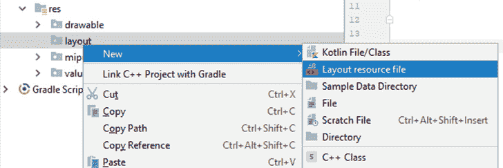

图 4.1–向项目添加线性布局

选择**布局资源文件**，会看到**新建资源文件**对话框窗口。在**根元素:**字段，输入`LinearLayout`，如下图所示:


图 4.2–创建新的资源文件

在**文件名:**字段，输入`main_menu`。名称是任意的，但是这个布局将是我们用来选择其他布局的主菜单，所以名称似乎是合适的。

点击**确定**按钮，AndroidStudio 将在一个名为`main_menu`的 XML 文件中生成一个新的`LinearLayout`，并将其放置在`layout`文件夹中，为我们构建新的主菜单用户界面做好准备。新文件会在编辑器中自动打开，为我们开始设计做好准备。

## 准备您的工作空间

如果您还没有进入设计视图，请单击**设计**选项卡切换到设计视图。通过拖动窗口的边框并调整其大小来调整窗口(在大多数窗口应用中可以这样做)，以使调色板、设计和属性尽可能清晰，但不超过必要的大小。下面的截图显示了我选择的大致窗口比例，以便尽可能清晰地设计我们的用户界面和探索 XML。截图中的细节并不重要:

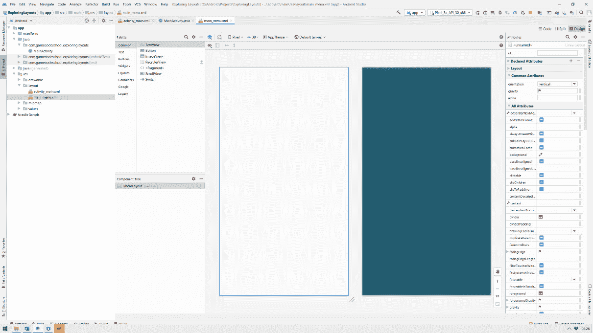

图 4.3–准备工作空间

重要说明

我已经使项目，调色板和属性窗口尽可能窄，但没有模糊任何内容。我还关闭了屏幕底部的构建/日志窗口，结果是我有了一个很好的清晰的画布来构建用户界面。

## 检查生成的 XML

点击**代码**选项卡，我们将看到在这个阶段形成我们设计的 XML 代码的当前状态。下面是代码，以便我们可以谈论它(我稍微重新格式化了它，使它在页面上看起来更清楚):

```java
<?xml version="1.0" encoding="utf-8"?>
<LinearLayout 
xmlns:android="http://schemas.android.com/apk/res/android"
android:orientation="vertical" 
android:layout_width="match_parent"
    android:layout_height="match_parent">
</LinearLayout>
```

我们有通常的开始和结束标签，正如我们可以预测的，它们被称为`<LinearLayout`和`</LinearLayout>`。还没有子元素，但是有三个属性。我们知道它们是属性而不是`LinearLayout`的孩子，因为它们出现在第一次关闭`>`之前。为了清楚起见，定义这个`LinearLayout`的三个属性已经在前面的代码中突出显示了。

第一个属性是`android:orientation`，或者——更简洁地说——我们将只引用没有`android:`部分的属性。`orientation`属性的值为`vertical`。这意味着当我们开始向这个布局添加项目时，它会从上到下垂直排列它们。我们可以将`vertical`值更改为`horizontal`，它将从左到右排列。

接下来的两个属性是`layout_width`和`layout_height`。这些决定了`LinearLayout`的大小。这两个属性的值都是`match_parent`。布局的父级是整个可用空间。通过水平和垂直匹配父级，布局将填充整个可用空间。

## 向用户界面添加文本视图

切换回**设计**选项卡，我们会给 UI 增加一些元素。

首先，在调色板中找到`TextView`小部件。这可以在**通用**和**文本**类别中找到。左键点击并拖动`TextView`到用户界面上，注意它整齐地位于`LinearLayout`的顶部。

查看**代码**选项卡上的 XML，确认它是`LinearLayout`的子级，并缩进一个选项卡以明确这一点。这是`TextView`小部件的代码，没有`LinearLayout`的周围代码:

```java
<TextView
   android:id="@+id/textView"
   android:layout_width="match_parent"
   android:layout_height="wrap_content"
   android:text="TextView" />
```

注意它有四个属性:一个`id`属性，以防我们需要从另一个 UI 元素或者从我们的 Java 代码中引用它；一个设置为`match_parent`的`layout_width`属性，表示`TextView`横跨`LinearLayout`的整个宽度；以及设置为`wrap_content`的`layout_height`属性，这意味着`TextView`精确到足以包含其中的文本。最后，就目前而言，它有一个`text`元素，它决定了它将显示的实际文本，而这目前被设置为只是“`TextView`”。

切换回**设计**选项卡，我们会做一些修改。

我们希望此文本成为此屏幕(即菜单屏幕)的标题文本。在**属性**窗口，点击**搜索**图标，在搜索框中输入`text`，如下图截图所示。找到`text`属性，将其值更改为`Menu`:


图 4.4–向用户界面添加文本视图

小费

您可以通过搜索或滚动选项来找到任何属性。找到要编辑的属性后，左键选中它，然后按键盘上的*回车*键使其可编辑。

接下来，使用你喜欢的搜索技术找到`textSize`属性，并将`textSize`设置为`50sp`。输入新值后，文本大小将会增加。

重要说明

`sp`值代表**可缩放像素**。这意味着当用户在安卓设备上更改字体大小设置时，字体会动态重新缩放自身。

现在，搜索`gravity`属性，点击下面截图中的小箭头展开选项:

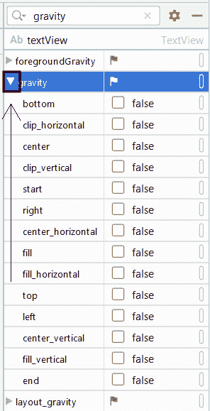

图 4.5–扩展重力属性

通过将该值设置为**真**，将`center_horizontal`添加到重力中，如下图所示:


图 4.6–通过将值设置为真，将重心水平添加到重力中

`gravity`属性指的是`TextView`本身内部的重力，我们的改变起到了将`TextView`内部的实际文字向中心移动的效果。

重要说明

`gravity`属性不同于`layout_gravity`属性。`layout_gravity`属性设置布局内的重力——在本例中，是父级`LinearLayout`。我们将在本项目后期使用`layout_gravity`。

此时，我们已经更改了`TextView`小部件的文本，增加了它的大小，并将其水平居中。用户界面设计器现在应该如下所示:


图 4.7–调整用户界面上的文本视图

快速浏览一下**代码**选项卡，可以看到以下代码:

```java
<TextView
   android:id="@+id/textView"
   android:layout_width="match_parent"
   android:layout_height="wrap_content"
   android:gravity="center_horizontal"
   android:text="Menu"
   android:textSize="50sp" />
```

可以看到新的属性如下:`gravity`，设置为`center_horizontal`；`text`，现已变更为`Menu`；和`textSize`，设置为`50sp`。

如果你运行这个应用，你可能看不到你所期望的。这是因为我们没有在 Java 代码中调用`setContentView`方法来加载 UI。您仍然会看到空白的用户界面。一旦我们的设计有了更多的进展，我们就会解决这个问题。

### 向用户界面添加多行文本视图

切换回**设计**选项卡，从调色板的**文本**类别中找到**多行文本**，并将其拖到我们刚才添加的`TextView`小部件正下方的设计上。

使用您喜欢的搜索技术，将`text`属性设置为如下:`Select a layout type to view an example. The onClick attribute of each button will call a method which executes setContentView to load the new layout`。

现在，您的布局将如下所示:


图 4.8–添加到用户界面的多行文本视图

您的 XML 将在`LinearLayout`(在`TextView`之后)中用另一个孩子更新，如下所示(为了在页面上显示，我对其进行了稍微的重新格式化):

```java
<EditText
   android:id="@+id/editTextTextMultiLine"
   android:layout_width="match_parent"
   android:layout_height="wrap_content"
   android:ems="10"
   android:gravity="start|top"
   android:inputType="textMultiLine"
   android:text="Select a layout type to view an example. 
         The onClick attribute of each button will call a 
         method which executes setContentView to load the 
         new layout" />
```

您可以看到用户界面项目的详细信息。看一下 XML 就会发现我们有一个`inputType`属性，表明这个文本是可编辑的。还有一个我们之前没见过的属性，那就是`ems`。`ems`属性控制每行可以输入多少个字符，10 的值由 AndroidStudio 自动选择。但是，另一个属性`layout_width="match_parent"`会覆盖该值，因为它会导致元素展开以适合其父元素，即整个屏幕宽度。

当您在下一部分运行该应用时，您将看到文本确实是可编辑的，尽管对于这个演示应用来说，它没有任何实际用途。

## 用 Java 代码连接用户界面(第 1 部分)

为了实现一个交互应用，我们将做以下三件事:

1.  我们将从`onCreate`方法调用`setContentView`方法，以在运行应用时显示我们的 UI 进度。
2.  我们将再编写两个自己的方法，每个方法将在不同的布局上调用`setContentView`方法(我们还没有设计)。
3.  然后，在本章的后面，当我们设计另外两个用户界面布局时，我们将能够通过点击一个按钮来加载它们。

由于我们将构建一个`ConstraintLayout`和一个`TableLayout`，我们将分别调用我们的新方法`loadConstraintLayout`和`loadTableLayout`。

现在就这么办吧，然后我们可以看看如何添加一些调用这些方法的按钮。

切换到`MainActivity.java`文件，然后在`onCreate`方法中添加以下高亮显示的代码:

```java
@Override
protected void onCreate(Bundle savedInstanceState) {
   super.onCreate(savedInstanceState);
   setContentView(R.layout.main_menu);
}
```

代码使用`setContentView`方法加载我们当前正在处理的 UI。现在，您可以运行该应用来查看以下结果:


图 4.9–探索布局菜单

在`onCreate`方法之后的`MainActivity`类中添加这两个新方法，如下所示:

```java
public void loadConstraintLayout(View v){
   setContentView(R.layout.activity_main);
}
public void loadTableLayout(View v){
   setContentView(R.layout.my_table_layout);
}
```

第一种方法有一个错误，第二种方法有两个错误。第一个错误我们可以通过添加`import`语句来修复，这样 AndroidStudio 就知道`View`类了。左键点击`View`选择错误。按住 *Alt* 键，然后点击*进入*键。您将看到弹出以下消息:


图 4.10–选择导入类以消除错误

选择**导入类**。错误消失了。如果你滚动到代码的顶部，你会看到我们刚才执行的快捷方式添加了一行新的代码。以下是新代码:

```java
import android.view.View;
```

AndroidStudio 知道`View`类，不再有错误。

然而，第二种方法仍然有一个错误。问题是代码调用`setContentView`方法加载新的 UI ( `R.layout.my_table_layout`)。由于该用户界面布局尚不存在，因此会产生错误。您可以注释掉这个调用来消除错误，直到我们在本章后面创建文件并设计用户界面布局。添加注释正斜杠(`//` )，如下图所示:

```java
public void loadConstraintLayout(View v){
   setContentView(R.layout.activity_main);
}
public void loadTableLayout(View v){
   // setContentView(R.layout.my_table_layout);
}
```

`loadConstraintLayout`方法没有错误的原因是因为该方法加载了`activity_main.xml`布局，这是我们生成项目时 AndroidStudio 创建的。

现在，我们想添加一些按钮，我们可以点击这些按钮来调用我们的新方法，并加载我们将要构建的新布局。但是添加几个带有文本的按钮太容易了——我们以前就做过。我们要做的是用右边的按钮排列一些文本。问题是我们的`LinearLayout`将`orientation`属性设置为`vertical`，正如我们所看到的，我们添加到布局中的所有新零件都将垂直排列。

## 在布局中添加布局

布局的解决方案是在布局中嵌套布局，以不同于其他元素的方向布局一些元素。下面是如何做到的。

从调色板的**布局**类别中，将一个**线性布局(水平)**拖到我们的设计上，将其放置在**多行文本**的正下方。请注意，在下面的截图中，有一个蓝色边框占据了**多行文本**下方的所有空间:

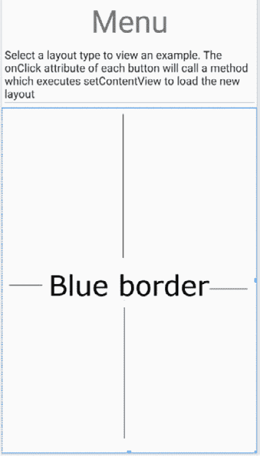

图 4.11–将线性布局(水平)从布局类别拖到我们的设计中，并将其放在多行文本的正下方

这表明我们新的**线性布局(水平)**正在填充空间。请记住这个蓝色边框区域，因为这是我们将在用户界面上放置下一个项目的地方。

现在，回到调色板的**文本**类别，将一个`TextView`部件拖到我们刚刚添加的新`LinearLayout`上。请注意下面截图中的`TextView`小部件如何紧贴在新`LinearLayout`的左上角:

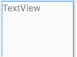

图 4.12–将文本视图小部件从面板的文本类别拖到新的线性布局上

起初，这似乎与之前的垂直`LinearLayout`没有什么不同，它从一开始就是我们用户界面的一部分。但是看看当我们添加下一部分用户界面时会发生什么。

重要说明

用于在布局中添加布局的术语是**嵌套**。安卓术语适用于任何出现在用户界面上的项目(按钮、文本等)是**视图**，任何包含视图的东西是**视图组**。由于术语*视图*和*视图组*在某些上下文中并不总是清楚它们的含义，我通常会具体地(如`TextView`、`Button`、`LinearLayout`)或更广泛地(UI 元素、项目或小部件)引用 UI 的某些部分。

从**按钮**类别中，将一个`Button`部件拖到上一个`TextView`部件的右侧。请注意，按钮位于文本的右侧，如下所示:


图 4.13–将按钮小部件从按钮类别拖到上一个文本视图小部件的右侧

接下来，通过点击空白部分选择`LinearLayout`(水平部分)。找到`layout_height`属性，设置为`wrap_content`。请注意`LinearLayout`现在只占用了它需要的空间，下面还有空间可以添加更多的小部件。这显示在下面的截图中:


图 4.14–通过点击空白部分选择线性布局(水平布局)

在添加用户界面的下一部分之前，让我们配置`TextView`小部件和`Button`小部件的`text`属性。将`Button`小部件的`text`属性更改为`LOAD`。将我们新的`TextView`小部件的文本属性更改为`Load` `ConstraintLayout`。

此屏幕截图显示了当前布局的样子:

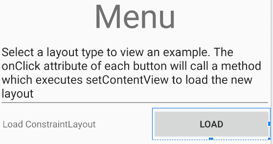

图 4.15–配置文本视图小部件和按钮小部件的文本属性

小费

成功了吗？什么事？太好了。你现在已经熟悉了安卓视图的编辑属性。没有吗？左键单击要编辑的项目(本例中为`TextView`小部件)，使用搜索图标进行搜索，或者在**属性**窗口(本例中为`text`属性)中滚动找到要编辑的属性，选择该属性，按*回车*进行编辑。我现在可以对如何构建未来的用户界面项目给出更简洁的说明，这让你成为安卓忍者的旅程变得更快。

现在，我们可以重复自己，在另一个**线性布局(水平)**中添加另一个`TextView`小部件和`Button`小部件，就在我们刚刚完成的那个下面。为此，请按以下顺序执行这些步骤:

1.  在前一个布局的正下方添加另一个**线性布局(水平)**。
2.  在新的`LinearLayout`中添加**文本视图**。
3.  将`TextView`的`text`属性更改为`Load TableLayout`。
4.  在`TextView`小部件的右侧添加一个`Button`小部件。
5.  将`Button`小部件的`text`属性更改为`LOAD`。
6.  通过将`layout_height`属性更改为`wrap_content`来调整`LinearLayout`的大小。
7.  只是为了好玩，为了让更多地探索调色板，找到调色板的**小部件**类别，并将一个`RatingBar`小部件拖到设计上，就在最终的`LinearLayout`下方。

现在，您的用户界面应该如下所示:


图 4.16–在另一个线性布局(水平)中添加的另一个文本视图小部件和按钮小部件

让我们为布局添加一些视觉上的收尾工作。

## 让布局看起来漂亮

在本节中，我们将探索更多控制用户界面细节的属性。你可能已经注意到用户界面在某些地方看起来有点拥挤，而在其他地方看起来不稳定和不对称。当我们阅读这本书的时候，我们会不断增加我们的曲目来改进我们的布局，但是这些简短的步骤会介绍和处理一些基本的东西。

在开始下一步之前，请考虑以下提示。

小费

当您配置小部件的属性时，您可以一次选择多个小部件——例如，在接下来的说明中的*步骤 3* 中，您可以左键选择第一个`TextView`小部件，然后*移动*并左键选择第二个`TextView`小部件。然后，您可以同时更改两者的属性。这个技巧也适用于`Button`小部件的*步骤 4* 。如果您只编辑所有选定小部件的属性，它甚至可以在小部件是不同类型时工作。因此，在接下来的*步骤 5* 中，您可以同时选择和编辑两个`TextView`和两个`Button`部件上的`padding`属性。

遵循以下说明:

1.  选择`Multiline Text`小部件，找到后展开`padding`属性。将`padding`选项设置为`15sp`。这就在`text`的外部形成了一个整洁的空间区域。
2.  要在多行文本小部件下面创建一个漂亮的空间，找到并展开`Layout_Margin`属性并将`bottom`设置为`50sp`。
3.  在两个按钮对齐的`TextView`部件上，将`textSize`属性设置为`20sp`；`layout_gravity`到`center_vertical`；`layout_width`属性为`match_parent`；和`layout_weight`至`.7`。
4.  在两个按钮上，将重量设置为`.3`。请注意，现在两个按钮正好占据了宽度的`.3`，而文本占据了`LinearLayout`的`.7`，使得整个外观更加令人愉悦。
5.  在两个`TextView`部件和两个`Button`部件上，选择`padding`然后选择`padding`，并将值设置为`10dp`。
6.  在`RatingBar`小部件上，找到`Layout_Margin`属性，然后将`left`和`right`设置为`15sp`。
7.  仍然使用`RatingBar`小部件和`Layout_Margin`属性，将顶部更改为`75sp`。

现在，您可以运行应用并看到我们的第一个完整布局的所有荣耀，如下图所示:


图 4.17–改进的布局

请注意，您可以使用`RatingBar`小部件，尽管当应用关闭时，评级不会持续。

不幸的是，我们的应用中的按钮还没有任何作用。我们现在就解决这个问题。

## 用 Java 代码连接用户界面(第 2 部分)

要使用户能够与我们的按钮交互，请按照以下两个步骤使布局中的按钮调用我们的方法:

1.  选择`Load ConstraintLayout`文本旁边的按钮。找到`onClick`属性并将其设置为`loadConstraintLayout`。
2.  选择`Load TableLayout`文本旁边的按钮。找到`onClick`属性并将其设置为`loadTableLayout`。

现在，按钮将调用方法，但是`loadTableLayout`方法内部的代码被注释掉以避免错误。请随意运行该应用，并检查您是否可以通过单击`loadConstraintLayout`按钮切换到`ConstraintLayout`。但是`ConstraintLayout`目前只有一个**你好世界！**消息。

我们现在可以继续建造这个了。

# 使用约束布局构建精确的用户界面

打开我们创建项目时自动生成的`ConstraintLayout`。它可能已经在编辑器顶部的选项卡中打开了。如果没有，它将在`res/layout`文件夹中。文件名是`activity_main.xml`。

检查**代码**选项卡和中的 XML，注意它是空的，除了一个写着`Hello World`的`TextView` 。切换回`Design`选项卡，左键点击`TextView`选择它，点击*删除*键将其删除。

现在，我们可以自己构建一个简单而复杂的用户界面。当您想要非常精确地和/或相对于其他部分定位用户界面的部分，而不仅仅是以线性方式定位时，`ConstraintLayout`是最有用的。

## 添加日历视图

要启动，查看调板的**小部件**类别，找到`CalendarView`。将`CalendarView`拖放到顶部附近，水平居中。当你拖动`CalendarView`的时候，注意它会跳到一些位置。

此外，请注意视图对齐时显示的微妙视觉提示。我在下面的截图中突出显示了水平居中的视觉提示:

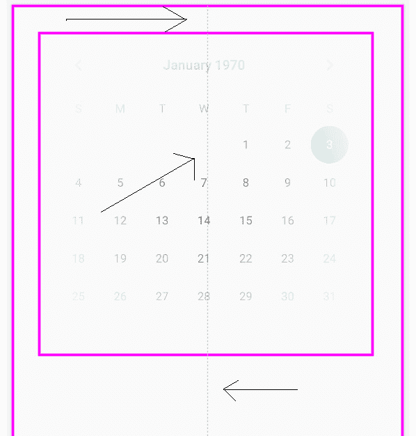

图 4.18–水平居中的视觉提示

当水平居中时放开，如前一张截图。现在，我们将调整它的大小。

### 在约束布局中调整视图的大小

左键按住放开`CalendarView`时露出的其中一个角方块，向内拖动减小`CalendarView`的大小，如下图截图所示:

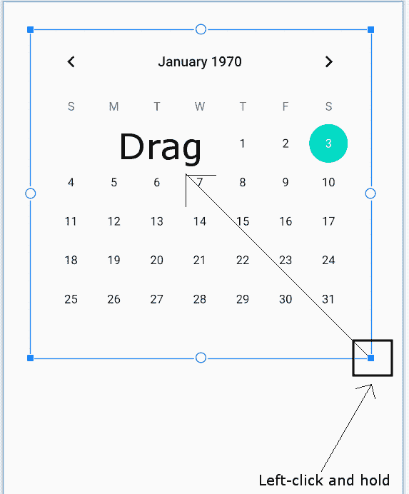

图 4.19–在约束布局中调整视图大小

将尺寸缩小一半左右，将`CalendarView`留在顶部附近，水平居中。您可能需要在调整小部件的大小时重新定位它。结果应该如下所示:


图 4.20–重新定位小部件

您不需要将`CalendarView`放置在完全相同的位置，因为练习的目的是熟悉通知您放置位置的视觉提示，而不是创建我的布局的副本。

### 使用“组件树”窗口

现在，看看**组件树**窗口，视觉设计器左侧调色板下方的窗口。组件树是可视化 XML 布局的一种方式，但没有所有细节。

如果您没有看到这一点，请在**调色板**选项卡的底部寻找垂直显示组件树的选项卡。点击此处打开**组件树**选项卡。

在下一张截图中，我们可以看到`CalendarView`缩进到`ConstraintLayout`的右边，因此是一个孩子。在我们构建的下一个用户界面中，我们将看到我们有时需要利用**组件树**来构建用户界面。

现在，我只想让你看到我们的`CalendarView`旁边有一个警告标志。我在这里强调了这一点:


图 4.21–日历视图中的警告标志

错误说**这个观点不受约束。它只有设计时位置，所以它会在运行时跳转到(0，0)，除非您添加约束**。还记得当我们第一次在 [*第二章*](02.html#_idTextAnchor043) *、第一联系人:Java、XML 和 UI 设计师*中给屏幕添加按钮时，它们只是移到了左上角吗？

小费

现在运行应用，如果你想被提醒这个问题，点击`Load ConstraintLayout`按钮。

现在，我们可以通过点击 [*第二章*](02.html#_idTextAnchor043) *、第一联系人:Java、XML 和用户界面设计器*中使用的**推断约束**按钮来解决这个问题。这里再次提醒大家:


图 4.22–通过单击推断约束按钮修复错误

但是学习手动添加约束是值得的，因为它为我们提供了更多的选择和灵活性。此外，随着您的布局变得越来越复杂，总有一两个项目的表现不如您希望的那样，手动修复它几乎总是必要的。

### 手动添加约束

确定选择了`CalendarView`，注意上、下、左、右四个小圆圈，如下图所示:


图 4.23–四个约束手柄

这些是**约束句柄**。我们可以点击并拖动它们，将它们与用户界面的其他部分或屏幕的侧面锚定在一起。通过将`CalendarView`与屏幕的四个边缘锚定，我们可以在应用运行时将其锁定到位。

一次一个，单击并拖动顶部手柄到设计的顶部，右侧手柄到设计的右侧，底部手柄到底部，左侧手柄到左侧。注意当我们应用这些约束时`CalendarView`是如何跳跃的？这是因为我们一放入约束，设计者就应用约束，所以我们可以确切地看到它在运行时的样子。

注意`CalendarView`现在被约束在中心。左键单击并将`CalendarView`拖回到屏幕的上部，类似于下面截图中所示的位置。使用视觉提示(也显示在下一张截图中)确保`CalendarView`水平居中:


图 4.24–使日历视图水平居中

在这个阶段，您可以运行该应用，并且`CalendarView`将被定位，就像前面截图中所示的那样。

让我们再向用户界面添加几个项目，看看如何约束它们。

## 添加和约束更多 UI 元素

从调色板的**部件**类别中拖动一个`ImageView`，并将其放置在`CalendarView`的下方和左侧。当您放置`ImageView`时，一个弹出窗口将提示您选择一个图像。您可以选择您喜欢的任何图像，但是为了查看另一个正在运行的 AndroidStudio 功能，请在**示例数据**部分从列表顶部的**头像**中选择图像。单击**确定**将图像添加到布局中。我们将在即将到来的*使文本可点击部分*中看到从**样本数据**部分添加图像对我们项目的影响。

将`ImageView`的左侧和`ImageView`的底部分别约束到用户界面的左侧和底部。这是你现在应该处于的位置:


图 4.25–将图像视图的左侧和底部分别约束到用户界面的左侧和底部

`ImageView`被约束在左下角的中。现在，抓住`ImageView`上的顶部约束手柄，将其拖动到`CalendarView`的底部约束手柄。这就是现在的现状:

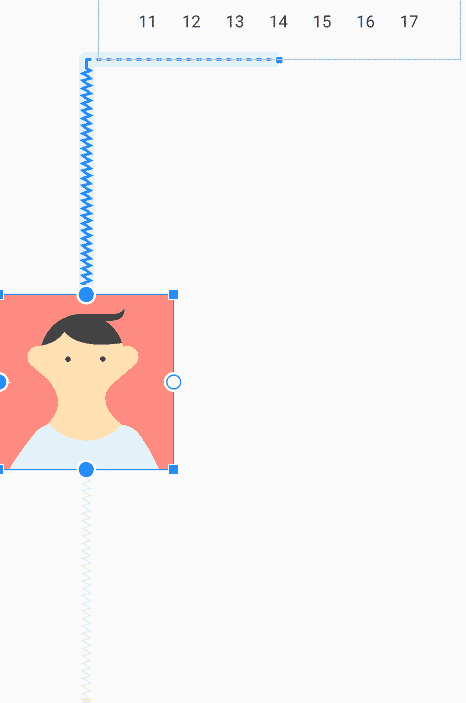

图 4.26–编辑后的用户界面

`ImageView`只是水平约束在一侧，因此被固定/约束在左侧。它在`CalendarView`和用户界面底部之间被垂直且均等地约束。

接下来，在`ImageView`的右侧添加一个`TextView`。将`TextView`的右边限制在用户界面的右边，将`TextView`的左边限制在`ImageView`的右边。然后，将`TextView`的顶部约束到`ImageView`的顶部，将`TextView`的底部约束到 UI 的底部。现在，你会得到类似这样的东西:


图 4.27–向用户界面添加文本视图

重要说明

**组件树**窗口中所有关于无约束项目的警告都消失了。有关于硬编码字符串的警告，因为我们将文本直接添加到布局而不是`strings.xml`文件，还有关于缺少`contentDescription`属性的警告。`contentDescription`属性应该用于添加文本描述，以便视障用户可以在应用中获得图像的口头描述。为了快速推进`ConstraintLayout`，我们将忽略这两个警告。我们将在 [*第 18 章*](18.html#_idTextAnchor320)*本地化*中更正确地看待添加字符串资源，您可以在*安卓开发者*网站的[https://developer.android.com/studio/intro/accessibility](https://developer.android.com/studio/intro/accessibility)上阅读 AndroidStudio 的辅助功能。

你可以将三个 UI 元素左右移动，整齐排列，随你便。请注意，当您移动`ImageView`时，`TextView`也会随之移动，因为`TextView`被约束到`ImageView`上。但是也要注意，你可以独立移动`TextView`并且，无论你把它放在哪里，这代表它相对于`ImageView`的新的约束位置。无论一个项目被约束到什么位置，它的位置总是相对于那个项目。正如我们已经看到的，水平和垂直约束是彼此不同的。我这样定位我的:

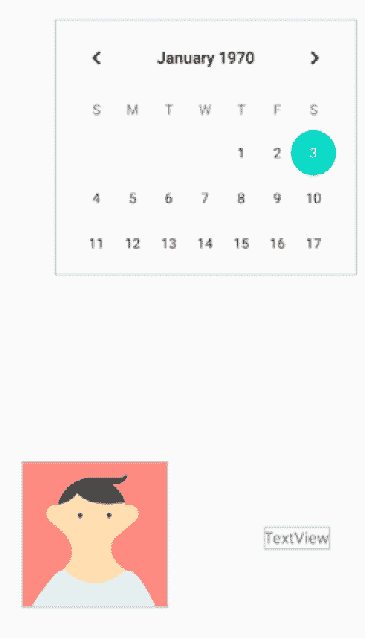

图 4.28–定位文本视图

小费

`ConstraintLayout`可以被认为是默认的布局类型，虽然它比其他布局更复杂，但它是最强大的，也是在我们用户设备上运行最好的布局。值得花时间多看看一些关于`ConstraintLayout`的教程。尤其是在 *YouTube* 上，因为视频是学习调整`ConstraintLayout`的好方法。我们将在整本书中回到`ConstraintLayout`，除了我们已经介绍过的内容，您不需要知道更多就可以继续前进。

## 使文本可点击

我们几乎完成了我们的`ConstraintLayout`。我们只想连接回主菜单屏幕。这是一个很好的机会来证明`TextView`(和大多数其他用户界面项目)也是可点击的。事实上，可点击文本在现代安卓应用中可能比传统外观的按钮更常见。

将`TextView`小部件的`text`属性更改为`Back to the menu`。现在，找到`onClick`属性，进入`loadMenuLayout`。

现在，在`loadTableLayout`方法之后的`MainActivity.java`文件中添加以下方法，如下图所示:

```java
public void loadTableLayout(View v){
   //setContentView(R.layout.my_table_layout);
}
public void loadMenuLayout(View v){
   setContentView(R.layout.main_menu);
}
```

现在，每当用户点击**返回菜单**文本时，将调用`loadMenuLayout`方法，并且`setContentView`方法将在`main_menu.xml`中加载布局。

你可以运行 app，在主菜单(`LinearLayout`)和`CalendarView`小部件(`ConstraintLayout`)之间来回点击，但是你有没有注意到下面截图中的图片好像不见了？


图 4.29–用户界面中缺少图像

`TextView`小部件的位置很整齐，就好像`ImageView`小部件在那里一样，但是从前面的截图中我们可以看到，AndroidStudio 中可见的头像图标是不存在的。这样做的原因是因为我们从**样本数据**类别中选择了图像。AndroidStudio 允许我们使用样本数据，这样我们就可以在图像可用之前开始布局我们的应用。这很有用，因为在应用的整个开发生命周期中，需要生成/获取图像是很常见的。

为了解决这个图像缺失的问题，我们可以简单地在`Attributes`窗口中找到`srcCompat`属性，左键单击它，选择任何不是来自**样本数据**类别的图像。我选择了`sym_def_app_icon`，这是下面显示的酷酷的安卓图标:


图 4.30–从 srcCompat 属性添加图标

让我们构建本章的最终布局。

# 用表格布局布局数据

现在，我们将构建一个类似电子表格的布局。它将有整齐排列的标题和数据单元格。在现实世界的应用中，您很可能会使用来自用户的真实实时数据。由于我们只是练习不同的布局，所以不会走到这种程度。

请遵循以下步骤:

1.  在项目窗口中，展开`res`文件夹。现在，右键单击`layout`文件夹，选择**新建**。注意**布局资源文件**有一个选项。
2.  选择**布局资源文件**，会看到**新建资源文件**对话框窗口。
3.  在**文件名:**字段，输入`my_table_layout`。这与我们在调用`loadTableLayout`方法中的`setContentView`时使用的名称相同。
4.  请注意在**根元素:**字段中，它默认选择了……**约束布局**作为选项。删除… `ConstraintLayout`并键入`TableLayout`。
5.  点击**确定**按钮，AndroidStudio 将在一个名为`my_table_layout`的 XML 文件中生成一个新的`TableLayou` t，并将其放置在`layout`文件夹中，为我们构建新的基于表格的用户界面做好准备。AndroidStudio 也会打开 UI 设计器(如果还没有打开的话)，左边是调色盘，右边是**属性**窗口。
6.  现在可以取消`MainActivity.java`文件中`loadTableLayout`方法的注释，如下所示:

```java
void loadTableLayout(View v){
   setContentView(R.layout.my_table_layout);
}
```

你现在可以在运行应用的时候用新的`TableLayout`小部件切换到屏幕，虽然目前是空白的，没有办法切换回主菜单屏幕；因此，您将不得不退出该应用。

## 向表格布局添加表格行元素

将一个`TableRow`元素从`Layouts`类别拖到用户界面设计上。请注意，这个新的`TableRow`元素的外观几乎察觉不到，以至于不值得在书中放一张它的截图。UI 顶部只有一条细细的蓝线。这是因为`TableRow`元素已经在其内容周围折叠了自身，这些内容当前是空的。

可以将我们选择的用户界面元素拖放到这条细细的蓝线上，但这也有点尴尬，甚至违反直觉。此外，一旦我们有多个相邻的`TableRow`元素，它会变得更加困难。解决方案在**组件树**窗口，我们在构建`ConstraintLayout`时简单介绍过。

### 将组件树用于视觉设计器无法完成的情况

查看**组件树**注意可以看到`TableRow`是`TableLayout`的子节点。我们可以将新的用户界面部件直接拖到**组件树**中的`TableRow`上。将三个`TextView`小部件拖到**组件树**中的`TableRow`上，应该会留下以下布局。我已经对下一个截图进行了 Photoshopped 处理，同时给大家展示了**组件树**和常规 UI 设计器:


图 4.31–将三个文本视图小部件拖到组件树的 TableRow 元素上

现在，再添加两个`TableRow`小部件(来自**布局**类别)。您可以通过**组件树**窗口或主界面设计器添加它们。

小费

您需要将小部件放在窗口的最左侧，否则新的`TableRow`将成为上一个`TableRow`的子代。这会让整个桌子变得有点混乱。如果您不小心添加了一个`TableRow`作为上一个`TableRow`的子代，您可以选择它然后点击*删除*键，使用 *Ctrl* + *z* 键盘组合将其撤销，或者向左拖动放置错误的`TableRow`(在**组件树**中)使其成为`Table`的直接子代(而不是`TableRow`)。

现在，为每个新的`TableRow`元素添加三个`TextView`小部件。这将通过**组件树**窗口添加它们来实现。检查您的布局，确保它是这样的:

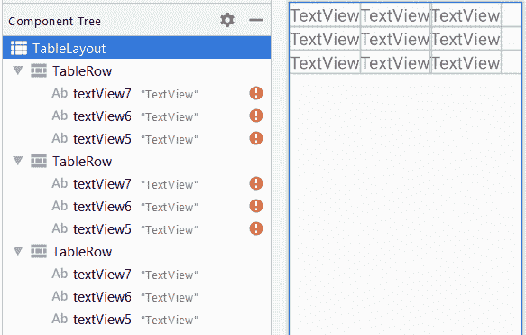

图 4.32–向每个新的 TableRow 元素添加三个 TextView 小部件

让我们通过改变一些属性，让表格看起来更像一个真实的数据表格。

在`TableLayout`上，将`layout_width`和`layout_height`属性设置为`wrap_content`。这样可以去除多余的细胞

通过编辑`textColor`属性，将所有外部(沿左上下方)`TextView`小部件变为黑色。您可以通过选择第一个`TextView`，搜索其`color`属性，然后开始在`color`属性值字段中键入`black`来实现。然后，您可以从下拉列表中选择`@android:color/black`。对每个外部`TextView`小部件执行此操作。

小费

请记住，您可以通过按住 *Shift* 键并依次左键单击每个所需的小部件来同时选择多个小部件。

找到所有`TextView`小部件的`padding`类别，并将`padding`属性更改为`10sp`。

下一张截图展示了这个阶段 AndroidStudio 的表格是什么样子的:


图 4.33–AndroidStudio 中的表格

让我们对这张桌子做些最后的润色。

## 组织表格列

在这一点上，我们似乎已经完成了，但是我们需要更好地组织数据。和许多表格一样，我们的表格会在左上角有一个空白单元格来划分列标题和行标题。为了实现这一点，我们需要对所有细胞进行编号。为此，我们需要编辑`layout_column`属性。

小费

单元格编号从左边的 0 开始编号。

从删除左上角`TextView`开始。请注意右侧的`TextView`已经移到了左上角的位置。

接下来，在新的左上角`TextView`中，将`layout_column`属性编辑为`1`(这将其分配给第二个单元格，因为第一个单元格是`0`，我们希望将第一个单元格留空)，对于下一个单元格，将`layout_column`属性编辑为`2`。

结果应该如下所示:

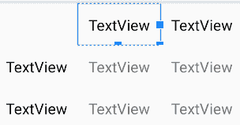

图 4.34–表格列组织

对于接下来的两行单元格，从左到右编辑它们从`0`到`2`的`layout_column`属性。

如果你想在编辑后澄清这一行的精确代码，这里有一个片段，记得在 [*第 4 章*](#_idTextAnchor076) 文件夹的下载包中查看整个文件的上下文。

重要说明

在接下来的代码片段中，我还为整个`text`属性添加了一些值。

```java
<TableRow
   android:layout_width="wrap_content"
   android:layout_height="wrap_content">
   <TextView
         android:id="@+id/textView2"
         android:layout_width="wrap_content"
         android:layout_height="wrap_content"
         android:layout_column="1"
         android:padding="10sp"
         android:text="India"
         android:textColor="@android:color/black" />
   <TextView
         android:id="@+id/textView1"
         android:layout_width="wrap_content"
         android:layout_height="wrap_content"
         android:layout_column="2"
         android:padding="10sp"
         android:text="England"
         android:textColor="@android:color/black" />
</TableRow>
```

尝试完成这个练习，但是，如果可能的话，使用**属性**窗口。

# 链接回主菜单

最后，对于这个布局，我们将添加一个链接回菜单的按钮，如下所示:

1.  通过**组件树**添加另一个`TableRow`。
2.  将一个按钮拖到新的`TableRow`上。
3.  将其`layout_column`属性编辑为`1`，使其位于行的中间。
4.  将其`text`属性编辑为`Menu`并编辑其`onClick`属性以匹配我们已经存在的`loadMenuLayout`方法。

您现在可以运行应用并在不同的布局之间来回切换。

如果你愿意，你可以通过编辑`TextView`的所有`text`属性来给表格添加一些有意义的标题和数据，就像我在下面的截图中所做的那样，它显示了在模拟器中运行的`TableLayout`:

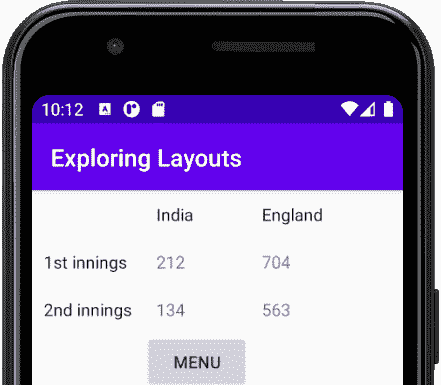

图 4.35–通过编辑文本视图的所有文本属性，向表格中添加一些重要的标题和数据

注意

作者承认前面的数据可能被认为过于乐观。

最后一个想法是，考虑一个呈现数据表的应用。有可能数据会被动态地添加到表中，而不是像我们刚刚做的那样由开发人员在设计时添加，而是更有可能由用户或者从网络上的数据库中添加。在 [*第 16 章*](16.html#_idTextAnchor285)*适配器和回收器*中，我们将看到如何使用适配器将数据动态添加到不同类型的布局中；而在 [*第 27 章*](27.html#_idTextAnchor462)*安卓数据库*中，我们也会看到如何在我们的 app 中创建和使用数据库。

# 总结

在短短的几十页中，我们已经讨论了许多主题。我们不仅构建了三种不同类型的布局——包括带有嵌套布局的`LinearLayout`、带有手动配置约束的`ConstraintLayout`和`TableLayout`(尽管使用的是假数据)——而且我们还将所有布局与可点击的按钮和文本连接在一起，这些按钮和文本触发我们的 Java 代码在所有这些不同的布局之间切换。

在下一章，我们将继续讨论布局的话题。我们将回顾我们已经看到的许多属性，我们将通过合并多个`CardView`布局来构建我们迄今为止最具美感的布局，将深度和阴影完整地合并到平滑滚动的`ScrollView`布局中。