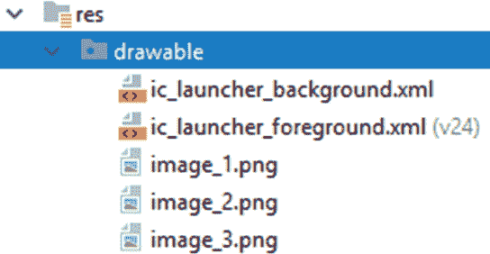
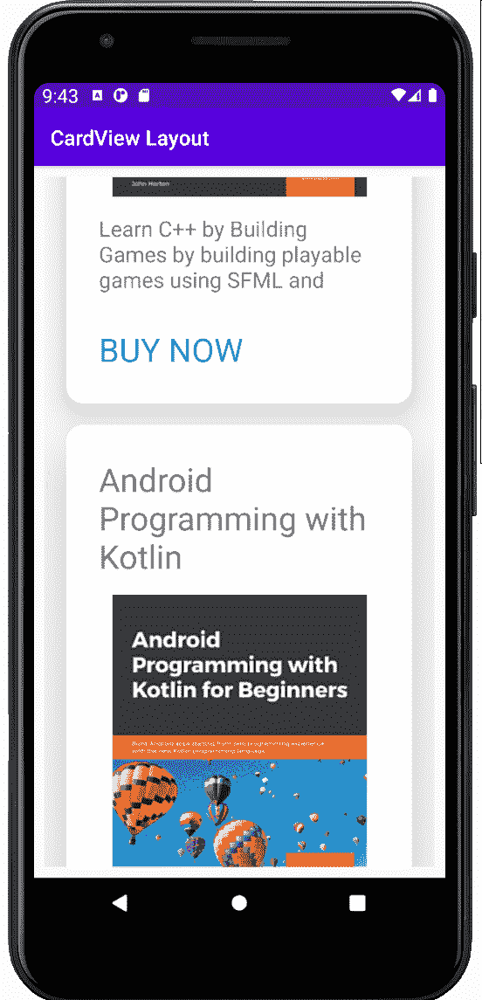
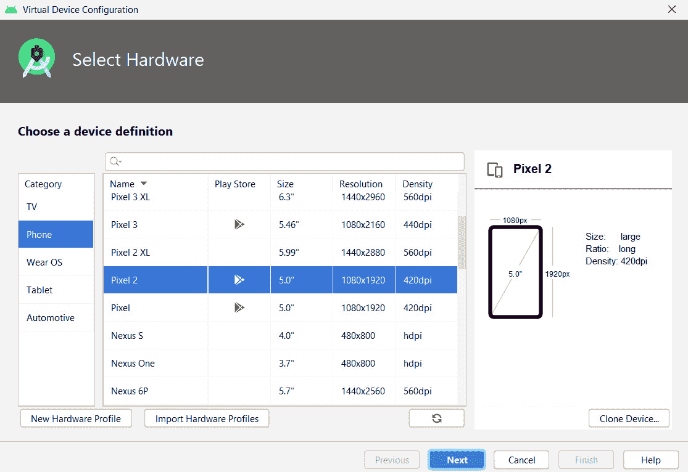

# 五、卡片视图和滚动视图的漂亮布局

在我们花时间更多地关注 Java 和面向对象编程之前，这是关于布局的最后一章。我们将形式化我们已经遇到的一些不同属性的学习，我们还将引入两个更酷的布局:`ScrollView`和`CardView`。为了完成这一章，我们将在平板电脑模拟器上运行`CardView`项目。

在本章中，我们将介绍以下内容:

*   用户界面属性的快速总结
*   使用`ScrollView`和`CardView`构建我们迄今为止最整洁的布局
*   创建和使用平板电脑模拟器

让我们从概括一些属性开始。

# 技术要求

你可以在[https://GitHub . com/PacktPublishing/Android-初学者编程-第三版/tree/main/章节%2005](https://github.com/PacktPublishing/Android-Programming-for-Beginners-Third-Edition/tree/main/chapter%2005) 找到本章中出现的代码文件。

# 属性快速汇总

在最后几章中，我们使用并讨论了相当多不同的属性。我认为有必要快速总结并进一步研究一些更常见的属性。

## 使用差压进行上浆

我们知道，有成千上万种不同的安卓设备。为了尝试一种适用于不同设备的测量系统，安卓系统使用了密度无关的像素作为测量单位。其工作方式是首先计算运行应用的设备上的像素密度。

重要说明

我们可以用屏幕的水平尺寸除以水平分辨率来计算密度。这一切都是在运行我们应用的设备上即时完成的。

我们所要做的就是在设置小部件各种属性的大小时，将`dp`与一个数字结合使用。使用与密度无关的测量，我们可以设计布局，在尽可能多的不同屏幕上创建统一的外观。

那么，这意味着问题解决了吗？我们只是在任何地方使用`dp`，我们的布局在任何地方都会起作用？不幸的是，密度无关只是解决方案的一部分。在本书的剩余部分，我们将看到更多关于如何让我们的应用在一系列不同的屏幕上看起来很棒的内容。

例如，我们可以通过向小部件的属性添加以下代码来影响其高度和宽度:

```java
...
android:height="50dp"
android:width="150dp"
...
```

或者，我们可以使用属性窗口，并通过适当的编辑框添加它们。

我们也可以用同样的`dp`单位来设置其他属性，比如边距和填充。我们将在一分钟内更仔细地观察边距和填充。

## 使用 sp 调整字体大小

用于调整安卓字体大小的另一个依赖于设备的度量单位是**可缩放像素**，或 **sp** 。`sp`测量单位用于字体，与`dp`完全一样，与像素密度相关。

基于你使用的`sp`的值，安卓设备在决定你的字体有多大时会使用的额外的计算是用户自己的字体大小设置。因此，如果你用正常大小的字体在设备和模拟器上测试你的应用，那么一个有视力障碍(或者只是喜欢大字体)并且字体设置为大的用户会看到与你在测试中看到的不同的东西。

如果您想尝试使用安卓设备的字体大小设置，您可以在模拟器或真实设备上进行，方法是选择**设置** | **显示** | **高级** | **字体大小**并尝试调整以下截图中突出显示的滑块:


图 5.1–使用 sp 调整字体大小

我们可以在任何有文本的小部件中使用`sp`设置字体的大小。这包括`Button`、`TextView`，以及调色板中**文本**类别下的所有用户界面元素以及其他一些元素。我们通过这样设置`textSize`属性来实现:

```java
android:textSize="50sp"
```

像往常一样，我们也可以使用属性窗口来实现同样的事情。

## 通过包裹或匹配确定尺寸

我们还可以决定用户界面元素的大小以及许多其他用户界面元素相对于包含/父元素的行为。我们可以通过将`layoutWidth`和`layoutHeight`属性设置为`wrap_content`或`match_parent`来实现。

例如，假设我们将布局中一个单独按钮的属性设置为:

```java
...
android:layout_width="match_parent"
android:layout_height="match_parent"
....
```

然后，按钮将在高度和宽度上扩展到**与**父级**匹配。我们可以看到下一张截图中的按钮填满了整个屏幕:**

重要说明

我在上一章的项目中添加了新布局的按钮。


图 5.2–按钮的高度和宽度都扩展到与父按钮相匹配

一个按钮更常见的是`wrap_content`，如下图:

```java
....
android:layout_width="wrap_content"
android:layout_height="wrap_content"
....
```

这使得按钮变得和它需要的一样大，以便**包裹**它的**内容**(宽度和高度在`dp`中，文本在`sp`中)。

## 使用填充和边距

如果你曾经做过任何网页设计，那么你会非常熟悉接下来的两个属性。**填充**是小部件边缘到小部件中内容开始的空间。**边距**是小部件外部留在其他小部件之间的空间，包括其他小部件的边距(如果有的话)。这是一个可视化表示:


图 5.3–使用的填充和边距

我们可以简单地设置填充和边距，对所有边都是一样的，如下所示:

```java
...
android:layout_margin="43dp"
android:padding="10dp"
...
```

看看边距和填充的命名约定的细微差别。填充只是被称为`padding`，但边距被称为`layout_margin`。这反映了这样一个事实，即填充只影响用户界面元素本身，但边距会影响布局中的其他小部件。

或者，我们可以指定不同的顶部、底部、左侧和右侧边距和填充，如下所示:

```java
android:layout_marginTop="43dp"
android:layout_marginBottom="43dp"
android:paddingLeft="5dp"
android:paddingRight="5dp"
```

为小部件指定边距和填充值是可选的，如果未指定任何内容，则假定值为 0。我们也可以选择指定一些不同边的边距和填充，但不能指定其他边，如前面的例子。

很可能越来越明显的是，我们设计布局的方式非常灵活，但也需要一些实践才能用这么多选项获得精确的结果。我们甚至可以指定负的边距值来创建重叠的小部件。

让我们再看几个属性，然后我们将继续玩一个时尚的布局–`CardView`。

## 使用布局 _ 权重属性

权重是指相对于其他用户界面元素的数量。因此，为了使`layout_weight`有用，我们需要为两个或更多元素的`layout_weight`属性赋值。

然后，我们可以分配总计 100%的部分。这对于在用户界面的不同部分之间划分屏幕空间特别有用，在这些部分中，无论屏幕大小如何，我们都希望它们所占据的相对空间保持不变。

将`layout_weight`与`sp`和`dp`单元结合使用，可以实现简单灵活的布局。例如，看看这段代码:

```java
<Button
        android:layout_width="match_parent"
        android:layout_height="0dp"
        android:layout_weight=".1"
        android:text="one tenth" />
<Button
        android:layout_width="match_parent"
        android:layout_height="0dp"
        android:layout_weight=".2"
        android:text="two tenths" />
<Button
        android:layout_width="match_parent"
        android:layout_height="0dp"
        android:layout_weight=".3"
        android:text="three tenths" />
<Button
        android:layout_width="match_parent"
        android:layout_height="0dp"
        android:layout_weight=".4"
        android:text="four tenths" />
```

下面是这个代码将做的事情:


图 5.4–使用布局权重属性的用户界面

注意所有`layout_height`属性都设置为`0dp`。实际上，`layout_weight`正在取代`layout_height`物业。我们使用`layout_weight`的背景很重要，否则它不会起作用。还要注意，我们不必使用分数 1；我们可以使用整数、百分比或任何其他数字；只要他们是相对的，他们很可能会达到你所追求的效果。注意`layout_weight`只在特定的上下文中起作用。

## 利用重力

**重力**可以成为我们的朋友，并且可以在我们的布局中以多种方式使用。就像太阳系中的重力一样，它通过将物体向给定的方向移动来影响它们的位置，就像它们受到重力的作用一样。看重力能做什么的最好方法是看一些示例代码和图片。

假设我们将按钮(或另一个小部件)上的`gravity`属性设置为`left|center_vertical`，如下所示:

```java
android:gravity="left|center_vertical"
```

这将产生如下效果:


图 5.5–在小部件上设置重力属性

请注意，小部件的内容(在这种情况下是按钮的文本)确实是左对齐和垂直居中的。

此外，小部件可以通过`layout_gravity`元素影响其在布局元素中的位置，如下所示:

```java
android:layout_gravity="left"
```

这将按照预期在布局中设置小部件，如下所示:


图 5.6–将重力布局设置为左侧

前面的代码允许同一布局中的不同小部件受到影响，就好像该布局具有多个不同的权重一样。

通过使用与小部件相同的代码，布局中所有小部件的内容都可以受到其父布局的`gravity`属性的影响:

```java
android:gravity="left"
```

事实上，属性比我们讨论过的属性多得多。许多我们在这本书里不需要的，有些相当晦涩，你可能在你的整个安卓职业生涯中永远都不需要它们。但是其他的都是比较常用的，比如`background`、 `textColor`、`alignment`、`typeface`、`visibility`、`shadowColor`。现在让我们探索更多的属性和布局。

# 用卡片视图和滚动视图构建用户界面

以常规方式在中创建新项目，并选择**空活动**项目模板。命名项目`CardView Layout`。

我们将在`ScrollView`布局中设计我们的`CardView`杰作，顾名思义，它允许用户滚动浏览布局的内容。

展开项目浏览器窗口中的文件夹，以便您可以看到`res`文件夹。展开`res`文件夹，查看`layout`文件夹。

右键单击**布局**文件夹，选择**新建**。注意**布局** **资源文件**有一个选项。选择**布局资源文件**，会看到**新建资源文件**对话框窗口。

在**文件名**字段中，输入`main_layout`。这个名字是任意的，但是这个布局将是我们的主要布局，所以这个名字使它变得简单。

请注意，它在**根元素**字段中被设置为**…约束布局**。改为`ScrollView`。这种布局类型似乎就像`LinearLayout`一样工作；不同的是当屏幕上显示的内容太多时，它会允许用户用手指滑动来滚动内容。

点击**确定**按钮 AndroidStudio 将在一个名为`main_layout`的 XML 文件中生成一个新的`ScrollView`，并将其放置在`layout`文件夹中，为我们构建基于`CardView`的用户界面做好准备。

AndroidStudio 将打开 UI 设计器准备行动。

## 用 Java 代码设置视图

正如我们之前所做的一样，我们现在将通过调用`MainActivity.java`文件中的`setContentView`方法来加载`main_layout.xml`文件作为我们应用的布局。

选择**MainActivity.java**选项卡。如果默认情况下选项卡不存在，您可以在项目浏览器中的`app/java/your_package_name`下找到它，其中`your_package_name`等于您创建项目时自动生成的包名。

修改`onCreate`方法中的代码，使其看起来与下一个代码完全一样。我强调了您需要添加的那一行:

```java
@Override
protected void onCreate(Bundle savedInstanceState) {
   super.onCreate(savedInstanceState);

   setContentView(R.layout.main_layout);
}
```

你现在可以运行这个应用，但是除了一个空的`ScrollView`之外，什么也看不到。

## 添加图像资源

我们需要这个项目的一些图像。这样我们就可以演示如何将它们添加到项目中(这一部分)，并在`CardView`小部件中整齐地显示和格式化它们(下一部分)。

你从哪里得到图像并不重要；本练习的目的是实践、动手体验。为了避免版权和版税的问题，我打算使用来自 Packt 出版网站的一些图书图片。这也让我很容易为您提供完成项目所需的所有资源，并应减轻您获取自己的图像的麻烦。请随意交换 [*第 5 章*](#_idTextAnchor101) `/res/drawable`文件夹中的图像。

有三个图像:`image_1.png`、`image_2.png`和`image_3.png`。要将它们添加到项目中，请执行以下步骤:

1.  使用操作系统的文件浏览器查找图片文件。
2.  全部高亮显示，按 *Ctrl* + *C* 复制。
3.  在 AndroidStudio 项目浏览器中，通过左键单击选择**RES/drawing**文件夹。
4.  右键单击**可绘制的**文件夹，选择**粘贴**。
5.  在弹出的询问**选择目的地目录**的窗口中，点击**确定**接受默认目的地，即`drawable`文件夹。
6.  再次点击**确定**到**复制指定文件**。

现在，您应该能够在`drawable`文件夹中看到您的图像，以及项目创建时 AndroidStudio 放在那里的其他几个文件，如下面的截图所示:



图 5.7–展开可绘制文件夹

在我们进入`CardView`小部件之前，让我们设计一下我们要放在卡片里面的东西。

## 为卡片创建内容

接下来我们需要做的是为我们的卡片创建内容。将内容与布局分开是有意义的。我们要做的是创建三个独立的布局，分别叫做`card_contents_1`、`card_contents_2`和`card_contents_3`。它们每个都包含一个`LinearLayout`，T3 本身包含一个图像和一些文本。

让我们再创建三个布局，其根为`LinearLayout`布局:

1.  右键单击**布局**文件夹，选择**新建布局资源文件**。
2.  命名文件`card_contents_1`并将根元素的**…约束布局**更改为**线性布局**。
3.  单击**确定**在`layout`文件夹中创建新文件。
4.  重复*步骤 1* 至 *3* 两次，每次将文件名改为`card_contents_2`，然后改为`card_contents_3`。

现在，选择 **card_contents_1.xml** 选项卡，并确保您在设计视图中。我们将一些元素拖放到布局中，得到基本结构，然后我们将一些`sp`、`dp`、`gravity`属性添加到中，使它们看起来很漂亮:

1.  将一个`TextView`拖到布局的顶部。
2.  将一个`ImageView`拖到`TextView`下方的布局上。
3.  在**资源**弹出窗口中，选择**项目** | **图像 _1** ，然后点击**确定**。
4.  在图像下方再拖动两个`TextView`。

这是您的布局现在应该是什么样子:


图 5.8–通过添加 sp、dp 和重力属性使布局看起来更好

现在，让我们使用一些材质设计准则来使布局看起来更有吸引力:

重要说明

当您继续进行这些修改时，布局底部的用户界面元素可能会从设计视图底部消失。如果发生这种情况，请记住，您始终可以从调色板下方的**组件树**窗口中选择任何用户界面元素。

1.  将顶部`TextView`小部件的`textSize`属性设置为`24sp`。
2.  仍在处理顶部的`TextView`小部件，将**布局 _ 边距** | **布局 _ 边距**属性设置为`16dp`。
3.  将`text`属性设置为`Learning Java by Building Android Games`(或任何适合您图像的标题)。
4.  在`ImageView`小部件上，将`layout_width`和`layout_height`属性设置为`wrap_content`。
5.  仍在处理`ImageView`部件，将`layout_gravity`属性设置为`center_horizontal`。
6.  在`ImageView`下方的`TextView`小部件上，将`textSize`设置为`16sp`。
7.  在同一个`TextView`小部件上，将**布局 _ 边距** | **布局 _ 边距**设置为`16dp`。
8.  在同一个`TextView`小部件上，将`text`属性设置为`Learn Java` `and Android from scratch by building 6 playable games`(或者描述你的图像的东西)。
9.  在底部的`TextView`小部件上，将`text`属性更改为`BUY NOW`。
10.  在同一个`TextView`小部件上，将**布局 _ 边距** | **布局 _ 边距**设置为`16dp`。
11.  在同一个`TextView`小部件上，将`textSize`属性设置为`24sp`。
12.  在同一个`TextView`小部件上，将`textColor`属性设置为`@color/` `teal_200`。
13.  在包含所有其他元素的`LinearLayout`布局上，将**填充** | **填充**设置为`15dp`。请注意，从**组件树**窗口中选择`LinearLayout`是最简单的。

此时，您的布局将看起来非常类似于下面的截图:


图 5.9–使用一些材质设计指南增强布局的吸引力

现在用完全相同的尺寸和颜色布局另外两个文件(`card_contents_2`和`card_contents_3`)。当您获得**资源**弹出菜单选择图像时，分别使用`image_2`和`image_3`。此外，更改前两个`TextView`元素的所有`text`属性，使标题和描述是唯一的。标题和描述并不重要；这是我们正在学习的布局和外观。

注意

请注意，所有尺寸和颜色都来自这里的材质设计网站:[https://material.io/design/introduction](https://material.io/design/introduction)和这里的安卓专用用户界面指南:[https://developer.android.com/guide/topics/ui/look-and-feel](https://developer.android.com/guide/topics/ui/look-and-feel)。这些都非常值得你在完成这本书的同时或不久后研究。

现在我们可以继续到`CardView`小部件。

## 定义卡片视图的尺寸

右键单击**值**文件夹，选择**新建** | **值资源文件**。在**新建资源文件**弹出窗口中，命名文件`dimens`(尺寸简称)，点击**确定**。AndroidStudio 将创建并打开一个名为`dimens.xml`的文件。我们将使用这个文件来创建一些共同的价值观，我们的`CardView`将通过引用它们来使用。

为此，我们将直接在**代码**选项卡中编辑该 XML。将`dimens.xml`文件编辑为与以下代码相同:

```java
<?xml version="1.0" encoding="utf-8"?>
<resources>
    <dimen name="card_corner_radius">16dp</dimen>
    <dimen name="card_margin">10dp</dimen>
</resources>
```

请确保它完全相同，因为一个小的遗漏可能会导致错误并阻止项目工作。

我们定义了两个资源，第一个资源名为`card_corner_radius`，值为`16dp`，第二个资源名为`card_margin`，值为`10dp`。

我们将参考`main_layout`文件中的这些资源，并使用它们来一致地配置我们的三个`CardView`元素。

## 将卡片视图添加到我们的布局中

切换到 **main_layout.xml** 选项卡，确保您在设计视图中。您可能还记得，我们现在使用的`ScrollView`会滚动应用的内容，而则类似于网络浏览器滚动不适合一个屏幕的网页内容。

`ScrollView`有一个限制——只能有一个直接子布局。我们希望它包含三个`CardView`小部件。

要解决这个问题，请从调色板的`Layouts`类别中拖动一个`LinearLayout`布局。请务必选择**线性布局(垂直)**，如调色板中的图标所示:


图 5.10–线性布局(垂直)图标

我们将我们的三个`CardView`添加到`LinearLayout`里面，然后整个东西会滚动得很好很流畅，没有任何错误。

在调色板的**容器**类别中可以找到`CardView`小部件，因此切换到该小部件并定位`CardView`。

将一个`CardView`拖到设计上的`LinearLayout`上，你可能会也可能不会在 AndroidStudio 得到一条弹出消息。这是一条信息:


图 5.11–请求添加卡片视图权限的弹出窗口

如果您收到此消息，请单击**确定**按钮。AndroidStudio 将在幕后做一些工作，并将为项目添加必要的部分。AndroidStudio 在这个项目中增加了更多的类，特别是为旧版本的安卓提供`CardView`功能的类，否则这些类不会有这些功能。

你现在应该有一个关于 T2 的设计。直到里面有一些内容，`CardView`只在**组件树**窗口中容易看到。

通过**组件树**选择`CardView`并配置以下属性:

1.  将`layout_width`设置为`wrap_content`。
2.  将`layout_gravity`设置为`center`。
3.  将**布局 _ 边距** | **布局 _ 边距**设置为`@dimen/card_margin`以使用我们在`dimens.xml`文件中定义的边距值。
4.  将`cardCornerRadius`属性设置为`@dimen/card_corner_radius`以使用我们在`dimens.xml`文件中定义的半径值。
5.  将`cardElevation`设置为`2dp`。

现在切换到**代码**选项卡，您会发现您有如下代码:

```java
<androidx.cardview.widget.CardView
   android:layout_width="wrap_content"
   android:layout_height="match_parent"
   android:layout_gravity="center"
   android:layout_margin="@dimen/card_margin"
   app:cardCornerRadius="@dimen/card_corner_radius"
   app:cardElevation="2dp" />
```

前面的代码列表只显示了`CardView`的代码。

目前的问题是我们的`CardView`是空的。让我们通过添加`card_contents_1.xml`的内容来解决这个问题。下面是如何做到的。

### 将布局文件包含在另一个布局中

我们需要非常轻微地编辑代码，原因如下。我们需要在代码中添加一个`include` 元素。`include`元素是将从`card_contents_1.xml`布局插入内容的代码。问题是，要添加这段代码，我们需要稍微改变`CardView` XML 的格式。当前格式以一个标签开始和结束`CardView`，如下所示:

```java
<androidx.cardview.widget.CardView
…
…/>
```

我们需要像这样将格式更改为单独的开始和结束标记(暂时不要更改任何内容):

```java
<androidx.cardview.widget.CardView
…
…
</androidx.cardview.widget.CardView>
```

这种格式的改变将使我们能够添加`include…`代码，我们的第一个`CardView`小部件将完成。考虑到这一点，将`CardView`的代码编辑为与以下代码完全相同。我已经突出显示了两行新代码，但是注意到在`cardElevation`属性之后的正斜杠也被删除了:

```java
<androidx.cardview.widget.CardView
   android:layout_width="wrap_content"
   android:layout_height="match_parent"
   android:layout_gravity="center"
   android:layout_margin="@dimen/card_margin"
   app:cardCornerRadius="@dimen/card_corner_radius"
   app:cardElevation="2dp" >
             <include layout="@layout/card_contents_1" />
</androidx.cardview.widget.CardView>
```

现在，您可以在可视化设计器中查看`main_layout`文件，并查看`CardView`元素内的布局。然而，视觉设计师并没有揭示`CardView`的真正美学。我们将很快在完成的应用中看到所有的`CardView`小部件一起滚动。这是模拟器中的屏幕截图，显示了我们目前的进展情况:


图 5.12–卡片视图元素内部的布局

在布局中再添加两个`CardView`小部件，除了一个例外，配置与第一个相同。在第二个`CardView`上，将`cardElevation`设置为`22dp`，在第三个`CardView`上，将`cardElevation`设置为`42dp`。将`include`代码改为分别引用`card_contents_2`和`card_contents_3`。

小费

您可以通过复制和粘贴`CardView` XML 并简单地修改上一段中提到的高程和`include`代码来非常快速地做到这一点。

这就是完成后`LinearLayout`代码中与`CardView`相关的代码的样子:

```java
<androidx.cardview.widget.CardView
     android:layout_width="wrap_content"
     android:layout_height="match_parent"
     android:layout_gravity="center"
     android:layout_margin="@dimen/card_margin"
     app:cardCornerRadius="@dimen/card_corner_radius"
     app:cardElevation="2dp" >
     <include layout="@layout/card_contents_1" />
</androidx.cardview.widget.CardView>
<androidx.cardview.widget.CardView
     android:layout_width="wrap_content"
     android:layout_height="match_parent"
     android:layout_gravity="center"
     android:layout_margin="@dimen/card_margin"
     app:cardCornerRadius="@dimen/card_corner_radius"
     app:cardElevation="22dp" >
     <include layout="@layout/card_contents_2" />
</androidx.cardview.widget.CardView>
<androidx.cardview.widget.CardView
     android:layout_width="wrap_content"
     android:layout_height="match_parent"
     android:layout_gravity="center"
     android:layout_margin="@dimen/card_margin"
     app:cardCornerRadius="@dimen/card_corner_radius"
     app:cardElevation="42dp" >
     <include layout="@layout/card_contents_3" />
</androidx.cardview.widget.CardView>
```

现在我们可以运行该应用并看到我们的三个漂亮的、提升的`CardView`小部件正在运行。在下一张截图中，我捕捉到了它，这样您就可以看到高程设置对创建具有阴影效果的非常令人满意的深度的影响:



图 5.13–令人愉悦的阴影效果深度

重要说明

在本书的黑白印刷版本中，截图可能会稍微不清楚。一定要自己构建并运行这个应用，才能看到这种酷炫的效果。

让我们在平板电脑模拟器上探索我们的最新应用。

# 创建平板电脑模拟器

我们经常希望在多个不同的设备上测试我们的应用。幸运的是，AndroidStudio 让创建我们喜欢的多种不同模拟器变得很容易。按照以下步骤制作平板电脑模拟器。

选择**工具** | **AVD 管理器**，然后在**你的虚拟设备**窗口点击**创建虚拟设备…** 按钮。您将看到如下图所示的**选择硬件**窗口:



图 5.14–选择硬件窗口

从**类别**列表中选择**平板**选项，然后从可用平板中突出显示**像素 C** 平板。

小费

如果你在将来某个时候读到这篇文章，像素 C 选项可能已经被更新了。选择平板电脑不如实践这个创建平板电脑模拟器然后测试我们的应用的过程重要。

点击**下一步**按钮。在随后的**系统图像**窗口中，只需点击**下一步**，因为这将选择默认的系统图像。选择您自己的映像可能会导致模拟器无法正常工作。

最后，在**安卓虚拟设备**屏幕上，可以保留所有默认选项。如果您愿意，可以随意更改仿真器的 **AVD 名称**选项或**启动方向**(纵向或横向)选项。准备好之后，点击**完成**按钮。

如果手机模拟器正在运行，请将其关闭。现在，每当你从 AndroidStudio 运行你的一个应用时，你将可以选择像素 C(或者你创建的任何平板电脑)。这是我运行`CardView`应用的 Pixel C 模拟器截图:


图 5.15–运行 CardView 应用的像素 C 仿真器

不算太坏，但是相当浪费了大量的空间，看起来有点奇怪。让我们在风景模式下试试。如果你尝试用平板电脑在横向模式下运行应用，结果会更糟。我们可以从中学到的是，我们必须为不同尺寸的屏幕和不同的方向设计布局。有时，它们会是巧妙的设计，可以根据不同的大小或方向进行缩放，但通常它们会是独立布局文件中完全不同的设计。

# 常见问题

1.  Do I need to master all this stuff about Material Design?

    不，除非你想成为专业设计师。如果你只想制作自己的应用，并在游戏商店出售或赠送，那么了解基本知识就足够了。

# 总结

在本章中，我们构建了美观的`CardView`布局，并将它们放入`ScrollView`中，这样用户就可以像浏览网页一样浏览布局的内容。为了完成这一章，我们推出了一款平板电脑仿真器，并发现如果我们想要迎合不同的设备尺寸和方向，就需要在布局设计方面变得聪明。在 [*第 24 章*](24.html#_idTextAnchor411) *【设计模式、多种布局和碎片*中，我们将开始将我们的布局提升到下一个层次，并学习如何使用碎片来应对如此多样的设备阵列。

然而，在此之前，学习更多的 Java 以及如何使用它来控制用户界面和与用户交互将对我们有很大帮助。这将是接下来七章的重点。

当然，在这一点上，房间里的大象是，尽管学习了很多关于布局、项目结构、Java 和 XML 之间的联系等等，除此之外，我们的用户界面，无论多么漂亮，实际上什么都不做！我们需要认真提升我们的 Java 技能，同时也要更多地了解如何在安卓环境中应用它们。在下一章中，我们将完全这样做。通过使用**安卓活动生命周期**，我们将看到如何添加恰好在我们需要的时刻执行的 Java 代码。