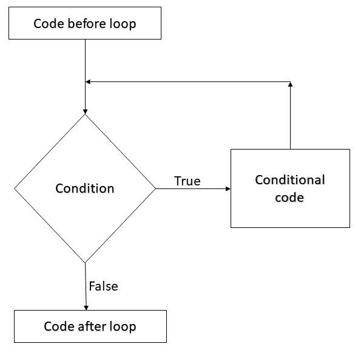
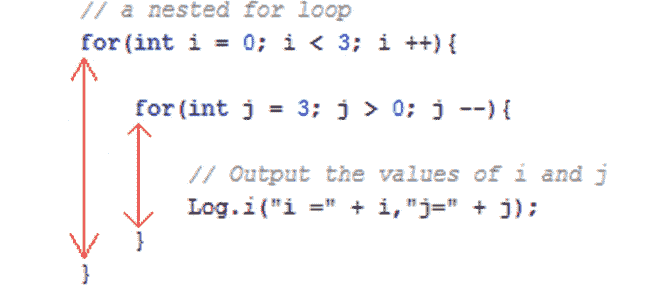

# *第八章* : Java 决策与循环

我们刚刚学习了变量，我们知道如何改变变量在表达式中的值，但是如何根据变量的值采取行动呢？

我们当然可以将新消息的数量添加到先前未读消息的数量中，但是，例如，当用户已经阅读了他们所有的消息时，我们如何在我们的应用程序中触发一个动作呢？

第一个问题是，我们需要一种方法来测试一个变量的值，然后当该值落在一个值的范围内或者是一个特定的值时做出响应。

在所有编程形式中常见的另一个问题是，我们需要根据变量值将代码的某些部分执行一定次数(不止一次，有时甚至根本不执行)。

为了解决第一个问题，我们将看看用 Java 通过`if`、`else`和`switch`进行决策。为了解决后者，我们将使用`while`、`do while`、`for`和`break`查看 Java 中的循环。

在本章后面，我们将介绍以下内容:

*   用`if`、`else`、`else if`和`switch`做决定
*   `switch`演示应用
*   Java `while`循环和`do while`循环
*   Java `for`循环
*   Loops 演示应用

让我们学习更多的 Java。

# 技术要求

你可以在[https://GitHub . com/PacktPublishing/Android-初学者编程-第三版/tree/main/章节%2008](https://github.com/PacktPublishing/Android-Programming-for-Beginners-Third-Edition/tree/main/chapter%2008) 找到本章中出现的代码文件。

# 用 Java 做决策

我们的 Java 代码将不断地做出决定。例如，我们可能需要知道用户是否有新消息，或者他们是否有一定数量的朋友。我们需要能够测试我们的变量，看看它们是否满足特定条件，然后根据它们是否满足特定条件来执行特定的代码部分。

在这一节中，随着我们的代码变得越来越复杂，它有助于以一种更易读的方式呈现它。让我们看看代码缩进，让我们关于决策的讨论变得更容易。

## 为清晰起见，缩进代码

您可能已经注意到，我们项目中的 Java 代码是缩进的。例如，`MainActivity`类内的第一行代码缩进一个制表符。此外，第一行代码在每个方法中缩进。这里有一个带注释的截图来说明这一点，作为另一个快速的例子:


图 8.1–缩进的 Java 代码

还要注意的是，当缩进的块结束时，通常用一个右花括号“`}`”、“”，`}`缩进的程度与开始该块的代码行相同。

我们这样做是为了让代码更易读。然而，它不是 Java 语法的一部分，如果我们不这样做，代码仍然会编译。

随着代码变得越来越复杂，缩进和注释有助于保持代码的意义和结构清晰。我现在提到这一点是因为当我们开始学习 Java 中用于决策的语法时，缩进变得特别有用，建议您以同样的方式缩进代码。

这种缩进大部分是由安卓工作室为我们完成的，但不是全部。

现在我们知道如何更清楚地展示我们的代码，让我们了解更多的操作符，然后我们就可以真正开始用 Java 做决策了。

## 更多操作员

我们已经可以用运算符加(+)、取(-)、乘(*)、除(/)、赋值(=)、递增(++)和递减(-)。让我们介绍一些更有用的操作符，然后我们将直接了解如何在 Java 中使用它们。

重要说明

不要担心记住后面的每个操作符。浏览一下他们和他们的解释，然后快速进入下一部分。在那里，我们将使用一些操作符，当我们看到一些它们允许我们做什么的例子时，它们会变得更加清晰。它们以列表的形式呈现在这里，这样在不与接下来关于实现的讨论相混淆的情况下，更便于参考。

我们使用运算符来创建一个非真即假的表达式。我们将该表达式用括号括起来，如下所示:`(expression goes here)`。

### 比较运算符

这是比较运算符，它测试相等性；是非真即假:`==`

比如像`(10 == 9)`这样的表达式就是假的。10 显然不等于 9。然而，像`(2 + 2 == 4)`这样的表达显然是正确的。

注意

除了在 *1984* 时 2+2 = = 5([https://en.wikipedia.org/wiki/Nineteen_Eighty-Four](https://en.wikipedia.org/wiki/Nineteen_Eighty-Four))。

### 逻辑非运算符

这是逻辑非运算符:`!`

它用于测试一个表达式的否定。否定意味着如果表达式为假，那么非运算符将导致表达式为真。举个例子会有帮助。

表达式`(!(2 + 2 == 5))`的计算结果为真，因为 2 + 2 *不是* 5。但是`(!(2 + 2 = 4))`的另一个例子是错误的。这是因为 2 + 2 显然*是* 4。

### 不等运算符

这是非等运算符，是另一个比较运算符:`!=`

不相等运算符测试某物是否不相等。例如表达式`(10 != 9)`为真。10 不等于 9。另一方面，`(10 != 10)`是假的，因为 10 显然等于 10。

### 大于运算符

另一个比较运算符(还有一些)是大于运算符。在这里:`>`

这个运算符测试某个事物是否比其他事物更伟大。表达式`(10 > 9)`为真，但表达式`(9 > 10)`为假。

### 小于运算符

你可以大概猜到这个操作员测试的值比别人少。这就是操作员的样子:`<`

表达式`(10 < 9)`为假，因为 10 不小于 9，而表达式`(9 < 10)`为真。

### 大于或等于运算符

该运算符测试一个值是否大于或等于另一个值，如果其中之一为真，则结果为真。这就是操作员的样子:`>=`

举个例子，表达式`(10 >= 9)`为真，表达式`(10 >= 10)`也为真，但是表达式`(10 >= 11)`为假，因为 10 既不大于也不等于 11。

### 小于或等于运算符

和前面的算子一样，这一个测试了两个条件，但是这次小于等于。看看下面显示的操作符，然后我们会看到一些例子:`<=`

表达式`(10 <= 9)`为假，表达式`(10 <= 10)`为真，表达式`(10 <= 11)`也为真。

### 逻辑“与”运算符

这个运算符被称为逻辑“与”。它测试一个表达式的两个或多个独立部分，所有部分必须为真，整个表达式才为真:`&&`

逻辑与是通常与其他运算符一起使用来构建更复杂的测试。表达式`((10 > 9) && (10 < 11))`为真，因为两部分都为真。另一方面，`((10 > 9) &&` `(10 < 9))`这个表达是假的，因为这个表达只有一部分是真的，`(10 > 9)`，另一部分是假的，`(10 < 9)`。

### 逻辑或运算符

这个运算符被称为逻辑或，它就像逻辑与一样，除了表达式的两个或多个部分中只有一个需要为真，表达式才为真:`||`

让我们看看最后一个例子，我们使用逻辑“与”，但将`&&`切换为`||`。`((10 > 9) || (10 < 9))`这个表达现在是真的，因为这个表达至少有一部分是真的。

### 模数运算符

这个算符叫做模数(`%`)。在对两个数字进行除法运算后，它返回两个数字的余数。例如，表达式`(16 % 3 > 0)`为真，因为 16 除以 3 等于 5 余数 1，1 当然大于 0。

在本章和本书的其余部分中，以更实际的背景来看待这些运算符将有助于阐明不同的用途。现在我们知道如何用运算符、变量和值来形成表达式了。接下来，我们可以研究一种结构化和组合表达式的方法，以做出一些深入的决策。

## 如何使用所有这些运算符来测试变量

所有这些操作符如果没有一种正确使用它们来做出影响真实变量和代码的真实决策的方法，实际上是没有用的。

现在我们有了我们需要的所有信息，我们可以看一个假设的情况，然后实际上看到一些用于决策的代码。

### 使用 Java if 关键字

正如我们所看到的，操作者自己的目的很少，但是仅仅看到我们可用的广泛多样的范围的部分可能是有用的。现在，当我们考虑使用最常见的操作符`==`时，我们可以开始看到操作符为我们提供的强大而精细的控制。

让我们使前面的例子不那么抽象。满足 Java `if`关键字。我们将使用`if`和一些条件运算符以及一个小故事来演示它们的用法。接下来是一个虚构的军事情况，希望比前面的例子不那么抽象。

船长快死了，知道他剩下的下属经验不多，他决定写一个 Java 程序，在他死后传达他最后的命令。部队在等待增援时必须守在桥的一边——但有几条规则决定他们的行动。

船长想要确保他的部队明白的第一个命令是这样的:

**如果他们过桥，就开枪打他们。**

那么，我们如何在 Java 中模拟这种情况呢？我们需要一个布尔变量`isComingOverBridge`。下一段代码假设`isComingOverBridge`变量已经声明并初始化为`true`或`false`。

我们可以这样使用`if`:

```java
if(isComingOverBridge){

   // Shoot them

}
```

如果`isComingOverBridge`布尔为`true`，则执行左右花括号内的代码。如果`isComingOverBridge`是`false`，程序在`if`块之后继续，不运行其中的代码。

**否则改为这样做**

船长还想告诉他的部队，如果敌人不过桥该怎么办。在这种情况下，他希望他们留在原地等待。

现在我们介绍另一个 Java 关键词，`else`。当我们想在`if`没有评估为真的情况下明确做某事时，我们可以使用`else`。

例如，要告诉部队如果敌人不过桥就原地不动，我们可以编写以下代码:

```java
if(isComingOverBridge){

   // Shoot them
}else{

   // Hold position
}
```

船长随后意识到问题并不像他最初想的那么简单。如果敌人过了桥但是部队太多怎么办？他的队伍会被蹂躏和屠杀。

因此，他提出了这个代码(这次我们也将使用一些变量):

```java
boolean isComingOverBridge;
int enemyTroops;
int friendlyTroops;
// Code that initializes the above variables one way or another
// Now the if
if(isComingOverBridge && friendlyTroops > enemyTroops){
   // shoot them
}else if(isComingOveBridge && friendlyTroops < enemyTroops) {
   // blow the bridge
}else{
   // Hold position
}
```

前面的代码有三种可能的执行路径。第一种是如果敌人正在过桥，而友军人数较多:

```java
if(isComingOverBridge && friendlyTroops > enemyTroops)
```

第二种情况是如果敌军正在过桥，但人数多于友军:

```java
else if(isComingOveBridge && friendlyTroops < enemyTroops)
```

然后，第三个和最后一个可能的结果将被最终的`else`捕获，如果其他两个都不为真，则该结果将被执行，而没有`if`条件。

读者挑战

你能发现前面代码的缺陷吗？一个可能会让一群没有经验的士兵完全陷入混乱的计划？敌军和友军数量完全相等的可能性没有明确处理，因此将由最终`else`处理，这意味着当没有敌军时。我想任何一个自尊的上尉都会期望他的部队在这种情况下作战，他可以改变第一个`if`语句来适应这种可能性:

`if(isComingOverBridge && friendlyTroops >= enemyTroops)`

最后，船长最后担心的是，如果敌人挥舞着投降的白旗从桥上经过，并被迅速屠杀，那么他的士兵将最终成为战犯。需要的 Java 代码显而易见。使用`wavingWhiteFlag`布尔变量，他编写了这个测试:

```java
if (wavingWhiteFlag){
   // Take prisoners
}
```

但是把这个代码放在哪里就不太清楚了。最后，队长选择下面的嵌套解，将`wavingWhiteFlag`的测试改为逻辑非，如下所示:

```java
if (!wavingWhiteFlag){
   // not surrendering so check everything else

   if(isComingOverTheBridge && friendlyTroops >= 
      enemyTroops){
          // shoot them
   }else if(isComingOverTheBridge && friendlyTroops < 
                enemyTroops) {
         // blow the bridge
   }
}else{

   // this is the else for our first if
   // Take prisoners
{
// Holding position
```

这表明我们可以将`if`和`else`语句嵌套在一起，以创建相当深入和详细的决策。

我们可以继续用`if`和`else`做出越来越复杂的决定，但是我们所看到的作为介绍已经足够了。

或许值得指出的是，解决问题的方法往往不止一种。正确的方法通常是以最清晰和最简单的方式解决问题的方法。

让我们看看用 Java 做决定的其他方法，然后我们可以把它们都放在一个应用程序中。

# 切换到决策

我们已经看到了将 Java 操作符与`if`和`else`语句相结合的巨大且几乎无限的可能性。但是有时候用 Java 做决定可以用其他方式做得更好。

当我们在不涉及复杂组合的可能性的清晰列表的基础上做出决定时，`switch`通常是要走的路。

我们这样开始一个`switch`决定:

```java
switch(argument){
}
```

在前面的例子中，`argument`可以是表达式或变量。在花括号`{}`内，我们可以根据`case`和`break`元素的参数进行决策:

```java
case x:
   // code for case x
   break;
case y:
   // code for case y
   break;
```

你可以在前面的例子中看到，每个`case`表示一个可能的结果，每个`break`表示该情况的结束，以及不再需要评估其他`case` 语句的点。

遇到的第一个`break`突破了`switch`块，进入整个`switch`块的右大括号`}`后的下一行代码。

我们也可以使用不带值的`default`来运行一些代码，以防`case`语句都不为真，如下所示:

```java
default:// Look no value
   // Do something here if no other case statements are 
      true
   break;
```

让我们编写一个使用`switch`的快速演示应用。

## 切换演示应用

首先，创建一个名为`Switch` `Demo`的新安卓项目，使用**清空** **活动**模板，并保留所有其他设置的默认值。通过左键点击编辑器上方的**MainActivity.java**标签切换到`MainActivity.java`文件，我们可以开始编码了。

让我们假设我们正在写一个老式的文本冒险游戏，这种游戏中玩家键入命令，如“向东走”、“向西走”、“拿剑”等。

在这种情况下，`switch`可以用类似于这个示例代码的东西来处理这种情况，我们可以使用`default`来处理玩家键入的不是特别处理的命令。

在右花括号`}`前的`onCreate`方法中输入以下代码:

```java
// get input from user in a String variable called command
String command = "go east";
switch(command){
   case "go east":
         Log.i("Player: ", "Moves to the East" );
         break;
   case "go west":
         Log.i("Player: ", "Moves to the West" );
         break;
   case "go north":
         Log.i("Player: ", "Moves to the North" );
         break;
   case "go south":
         Log.i("Player: ", "Moves to the South" );
         break;

   case "take sword":
         Log.i("Player: ", "Takes the silver sword" );
         break;
   // more possible cases
   default:
         Log.i("Message: ", "Sorry I don't speak Elfish" );
         break;
}
```

运行几次应用程序。每次都把`command`的初始化改成新的。请注意，当您将`command`初始化为由`case`语句显式处理的内容时，我们会得到预期的输出。否则，我们会收到默认**抱歉我不会说小精灵**的消息。

如果有很多代码要为`case`执行，我们可以把它们都包含在一个方法中——也许就像下面这段代码，我在这里强调了新的一行:

```java
   case "go west":
                         goWest();
         break;
```

当然，我们需要编写新的`goWest`方法。然后，当`command`初始化为`"go west"`时，`goWest`方法将被执行，当`goWest`完成时，执行将返回到`break`语句，这将导致代码在`switch`块之后继续。

当然，这段代码严重缺乏的东西之一是与用户界面的交互。我们已经看到了如何通过点击按钮来调用方法，但即使这样也不足以让这段代码在真正的应用程序中变得有价值。我们将在 [*第 12 章*](12.html#_idTextAnchor218)*堆栈、堆和垃圾收集器*中看到如何解决这个问题。

我们还有的另一个问题是，代码执行完之后，就这样了！我们需要它不断地向玩家寻求指导，不仅仅是一次，而是一次又一次。接下来我们将研究这个问题的解决方案。

# 循环重复代码

在这里，我们将通过观察 Java 中几种类型的**循环**来学习如何以受控且精确的方式重复执行部分代码。这些包括`while`循环、`do while`循环和`for`循环。我们还将学习最合适的情况来使用不同类型的循环。

问循环与编程有什么关系是完全合理的。但它们正是顾名思义。它们是一种不止一次地重复同一部分代码的方式，或者是在同一部分代码上循环，尽管每次都有可能产生不同的结果。

这可能仅仅意味着做同样的事情，直到被循环的代码(**迭代**)提示循环结束。它可以是循环代码本身指定的预定迭代次数。可能要等到预定的情况或**条件**被满足。或者它可以是这些东西中的一个以上的组合。与`if`、`else`和`switch`一起，循环是 Java **控制流语句**的一部分。

当条件为真时执行的代码称为**条件代码**。我们将要讨论的所有类型的循环，除了一个(T0)循环，都可以用这个简单的图表来说明:



图 8.2–当代码达到循环时，测试条件

该图说明了当代码达到循环时，测试条件。如果条件为真，则执行条件代码。执行条件代码后，再次测试条件。每当条件为假时，循环后代码继续。这可能意味着条件代码永远不会被执行。

我们将查看 Java 为我们提供的控制代码的所有主要类型的循环，我们将使用其中的一些来实现一个工作的小应用程序，以确保我们完全理解它们。让我们看看 Java 中第一个也是最简单的循环类型，叫做`while`循环。

## 同时循环

Java `while`循环有最简单的语法。回想一下`if`的陈述。我们可以将几乎任何运算符和变量的组合放入`if`语句的条件表达式中。如果表达式的计算结果为真，则执行`if`块主体中的代码。在`while`循环中，我们还使用了一个可以评估为真或假的表达式。看看这段代码:

```java
int x = 10;
while(x > 0){
   x--;
   // x decreases by one each pass through the loop
}
```

这里发生的是这样的:

1.  在`while`循环之外，一个名为`x`的`int`被声明并初始化为`10`。
2.  然后，`while`循环开始。其条件为`x > 0`。因此，`while`循环将执行其主体中的代码。
3.  其主体中的代码将继续执行，直到条件评估为 false。

所以之前的代码会执行 10 次。

第一遍`x = 10`，第二遍等于`9`，然后是`8`，以此类推。但是一旦`x`等于`0`，当然不再大于 0。此时，程序将退出`while`循环，并继续执行`while`循环后的第一行代码。

就像`if`语句一样，`while`循环甚至可能一次都不会执行。看看这个例子，其中`while`循环中的代码将不会执行:

```java
int x = 10;
while(x > 10){
   // more code here.
   // but it will never run 
   // unless x is greater than 10.
}
```

此外，条件表达式的复杂性和循环体中的代码量没有限制。下面是另一个例子:

```java
int newMessages = 3;
int unreadMessages = 0;
while(newMessages > 0 || unreadMessages > 0){
   // Display next message
   // etc.
}
// continue here when newMessages and unreadMessages equal 0
```

前面的`while`循环将继续执行，直到`newMessages`和`unreadMessages`都等于或小于 0。由于条件使用逻辑或运算符`||`，这些条件中的任何一个为真都将导致`while`循环继续执行。

值得注意的是一旦进入循环体，即使表达式中途求值为 false，它也将始终完成，因为在代码尝试开始另一次传递之前，它不会再次被测试。举以下例子:

```java
int x = 1;
while(x > 0){
   x--;
   // x is now 0 so the condition is false
   // But this line still runs
   // and this one
   // and me!
}
```

前面的循环体将只执行一次。我们还可以设置一个永远运行的`while`循环！这个也许不出所料地被称为无限循环。下面是一个无限循环的例子:

```java
int x = 0;
while(true){
   x++; // I am going to get very big!
}
```

### 打破循环

我们可以使用这样一个无限循环，这样我们就可以决定什么时候从包含在它体内的测试中退出这个循环。当准备离开循环体时，我们可以通过使用`break`关键字来做到这一点。这里有一个例子:

```java
int x = 0;
while(true){
   x++; //I am going to get very big!
   break; // No, you're not- ha!
   // code doesn't reach here
}
```

您可能已经猜到，我们可以将任何决策工具(如`if`、`else`、`switch`)结合到我们的`while`循环中，其余的循环我们将在一分钟后查看。举以下例子:

```java
int x = 0;
int tooBig = 10;
while(true){
   x++; // I am going to get very big!
   if(x == tooBig){
         break;
   } // No, you're not- ha!

   // code reaches here only until x = 10
}
```

继续阅读更多的页面将会很简单演示`while`循环的多功能性，但是在某个时候，我们想要回到做一些真正的编程。这是最后一个与`while`循环相结合的概念。

### continue 关键字

**继续**关键词的行为方式与`break`相似——在某种程度上。`continue`关键字将会使脱离循环体，但之后还会检查条件表达式，以便循环可以再次运行。一个例子会有帮助:

```java
int x = 0;
int tooBig = 10;
int tooBigToPrint = 5;
while(true){
   x++; // I am going to get very big!
   if(x == tooBig){
         break;
   } // No, you're not- ha!

   // code reaches here only until x = 10
   if(x >= tooBigToPrint){
         // No more printing but keep looping
         continue;
   }
   // code reaches here only until x = 5
   // Print out x 
}
```

## 边循环边做

除了一个`do` `while`循环在身体之后评估其表达式*之外，一个`do while`循环与`while`循环非常相似。看看上图的这个修改，它代表了一个`do while`循环的流动:*


图 8.3–边循环边做

这意味着在检查循环条件之前，`do while`循环将总是至少执行一次条件代码:

```java
int x= 1
do{
   x++;
}while(x < 1);
// x now = 2 
```

在前面的代码中，即使测试为假也执行了循环，因为测试是在循环执行之后进行的。然而，测试确实阻止了循环体被第二次执行。这导致`x`增加一次，`x`现在等于`2`。

重要说明

注意`break`和`continue`也可以用在`do while`循环中。

下一种循环类型是`for`循环。

# 用于循环

一个`for`循环的语法比`while`或`do while`循环稍微复杂一些，因为它需要三个部分来初始化。先看看代码，然后我们将它分解:

```java
for(int i = 0; i < 10;  i++){
   //Something that needs to happen 10 times goes here
}
```

`for`循环稍微复杂一点的形式在这样放的时候更清晰:

```java
for(declaration and initialization; condition; change after each pass through loop).
```

为了进一步澄清，我们有以下内容:

*   `declaration and initialization`:我们创建一个新的`int`变量，`i`，并初始化为 0。
*   `condition`:和其他循环一样，是指循环要继续必须评估为真的条件。
*   `change after each pass through the loop`: In the example, `i++` means that 1 is added/incremented to `i` on each pass. We could also use `i--` to reduce/decrement `i` at each pass:

    ```java
    for(int i = 10; i > 0;  i--){
       // countdown
    }
    // blast off i = 0
    ```

    重要说明

    注意`break`和`continue`也可以用在`for`循环中。

`for`循环对初始化、条件评估和变量修改进行控制。

# 循环演示应用

首先，创建一个名为`Loops`的新安卓项目，使用**空活动**模板，并将所有其他设置保留为默认值。

让我们在用户界面上添加几个按钮，让它更有趣。切换到`activity_main.xml`文件，确保您在**设计**选项卡上，然后按照以下步骤操作:

1.  将按钮拖到用户界面上，并将其水平居中放置在顶部附近。
2.  在属性窗口中，将**文本**属性更改为`Count Up`。
3.  在属性窗口中，将**点击**属性更改为`countUp`。
4.  在前一个按钮的正下方放置一个新按钮，重复*步骤 2* 和*步骤 3* ，但这次使用`Count Down`作为**文本**属性，使用`countDown`作为 **onClick** 属性。
5.  在前一个按钮的正下方放置一个新按钮，重复*步骤 2* 和*步骤 3* ，但这次对**文本**属性和 **onClick** 属性使用**嵌套**。
6.  单击**推断约束**按钮，将三个按钮约束到位。

外观对于本演示来说并不重要，但请运行该应用程序，并检查布局是否类似于下面的截图:


图 8.4–添加到用户界面的按钮

重要说明

我还删了《你好世界》！`TextView`但这不是必须的。

重要的是我们有三个标有 **COUNT UP** 、 **COUNT DOWN** 和 **NESTED** 的按钮，分别调用名为 **countUp** 、**倒计时**和 **nested** 的方法。

通过左键单击编辑器上方的**MainActivity.java**选项卡切换到`MainActivity.java`文件，我们可以开始编码我们的方法。

在`onCreate`方法的右花括号后，添加如下所示的`countUp`方法:

```java
public void countUp(View v){
   Log.i("message:","In countUp method");

   int x = 0;
   // Now an apparently infinite while loop
      while(true){
       // Add 1 to x each time
       x++;
       Log.i("x =", "" + x);
       if(x == 3){
          // Get me out of here
          break;
       }
   }
}
```

重要说明

使用您喜欢的方法导入`Log`和`View`类:

`import android.util.Log;`

`import android.view.View;`

我们将能够从适当标记的按钮调用我们刚刚编写的这个方法。

在`countUp`方法的右花括号后，添加`countDown`方法:

```java
public void countDown(View v){
   Log.i("message:","In countDown method");
   int x = 4;
   // Now an apparently infinite while loop
   while(true){
       // Add 1 to x each time
       x--;
       Log.i("x =", "" + x);
       if(x == 1){
          // Get me out of here
          break;
       }
   }
}
```

我们将能够从适当标记的按钮调用我们刚刚编写的这个方法。

在`countDown`方法的右花括号后，添加`nested`方法:

```java
public void nested(View v){
   Log.i("message:","In nested method");
   // a nested for loop
   for(int i = 0; i < 3; i ++){
         for(int j = 3; j > 0; j --){
                // Output the values of i and j
                Log.i("i =" + i,"j=" + j);
         }
   }
}
```

我们将能够从适当标记的按钮调用我们刚刚编写的这个方法。

现在，让我们运行应用程序并开始点击按钮。如果您从上到下点击每个按钮一次，您将看到控制台输出:

```java
message:: In countUp method
x =: 1
x =: 2
x =: 3
message: : In countDown method
x =: 3
x =: 2
x =: 1
message: : In nested method
i =0: j=3
i =0: j=2
i =0: j=1
i =1: j=3
i =1: j=2
i =1: j=1
i =2: j=3
i =2: j=2
i =2: j=1
```

我们可以看到`countUp`方法正是这么做的。`int x`变量初始化为`0`，进入无限`while`循环，`x`随增量`++`运算符递增。幸运的是，在循环的每一次迭代中，我们测试`x`是否等于`3`和`if (x == 3)`，当这是真的时就中断。

接下来，在`countDown`方法中，我们反过来做同样的事情。`int x`变量初始化为`4`，进入无限`while`循环，`x`用递减`--`运算符递减。这一次，在循环的每次迭代中，我们用`if (x == 1)`测试`x`是否等于`1`，如果是，则中断。

最后，我们将两个`for`循环嵌套在一起。从输出中我们可以看到每次`i`(由外环控制)递增时，`j`(由内环控制)从`3`递减到`1`。仔细看这张截图，它显示了每个`for`循环的开始和结束位置，有助于完全理解这一点:



图 8.5–对于循环

当然，只要你愿意，你可以一直点击来观察每个按钮的输出。作为一个实验，试着让循环变长，也许`1000`。

随着循环的彻底学习和测试，让我们在下一章看看方法的细节。

# 总结

在这一章中，我们学习了如何使用`if`、`else`和`switch`来用表达式进行决策并分支我们的代码。我们看到并练习了`while`、`for`和`do while`来重复部分代码。然后我们把它们放在两个快速演示应用程序中。

在下一章中，我们将更仔细地研究 Java 方法，这是我们所有代码的方向。