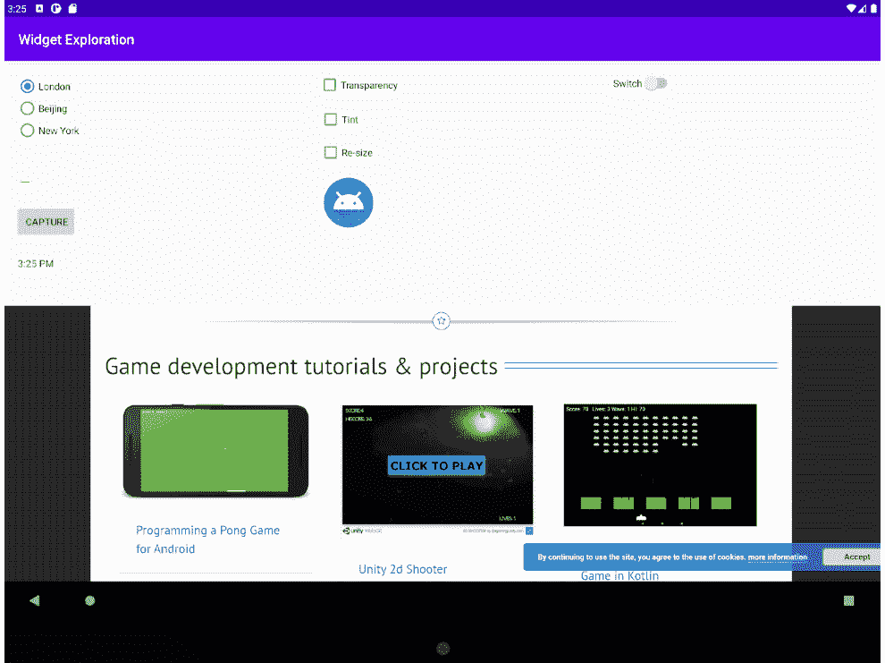
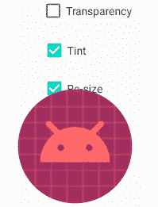

# *第 13 章*:匿名类——让安卓小部件活起来

这一章本可以被称为*甚至更多的 OOP* ，因为匿名类仍然是这个主题的一部分。然而，正如您将看到的，匿名类为我们提供了如此多的灵活性，尤其是当涉及到与**用户界面** ( **用户界面**)的交互时，我认为它们应该有一章专门介绍它们及其在安卓中的关键用途。

现在，我们已经很好地概述了安卓应用的布局和编码，以及我们对**面向对象编程** ( **OOP** )以及如何从我们的 Java 代码中操作用户界面的新见解，我们已经准备好在匿名类旁边使用调色板中的更多小部件进行实验。

OOP 有时是一件棘手的事情，匿名类对初学者来说有点尴尬。然而，通过逐渐学习这些新概念，然后反复练习，随着时间的推移，它们会成为我们的朋友。

在这一章中，我们将通过回到AndroidStudio调色板，查看六个我们从未见过或尚未完全使用的小部件，来丰富我们的内容。

一旦我们做到了这一点，我们将把它们都放入一个布局中，并练习用 Java 代码操纵它们。

在本章中，我们将重点讨论以下主题:

*   声明和初始化布局小部件
*   仅用 Java 代码创建小部件
*   `EditText`、`ImageView`、`RadioButton`(和`RadioGroup`)、`Switch`、`CheckBox`和`TextClock`部件
*   使用网络视图
*   如何使用匿名类
*   使用前面所有的小部件和一些匿名类制作一个小部件演示迷你应用程序

让我们先简单回顾一下。

# 技术要求

您可以在 GitHub 上找到本章中的代码文件，网址为 https://GitHub . com/PacktPublishing/Android-初学者编程-第三版/tree/main/chapter%2013。

# 声明和初始化对象

我们知道当我们从`onCreate`方法调用`setContentView`方法时，安卓会膨胀所有的小部件和布局，并将它们变成堆中*真实的* Java 对象。

此外，我们知道要使用堆中的小部件，我们必须首先声明一个正确类型的对象，然后使用它通过使用其唯一的`id`属性来获取对堆中用户界面小部件对象的引用。

例如，我们获得一个对具有`txtTitle`的`id`属性的`TextView`小部件的引用，并将其分配给一个名为`myTextView`的新 Java 对象，如下所示:

```java
// Grab a reference to an object on the heap
TextView myTextView = findViewById(R.id.txtTitle);
```

现在，使用我们的`myTextView`实例变量，我们可以做`TextView`类设计要做的任何事情。例如，我们可以将文本设置为显示以下内容:

```java
myTextView.setText("Hi there");
```

此外，我们可以让它消失如下:

```java
// Bye bye
myTextView.setVisibility(View.GONE)
```

我们可以再次更改其文本并使其重新出现:

```java
myTextView.setText("BOO!");
// Surprise
myTextView.setVisibility(View.VISIBLE)
```

值得一提的是，我们可以操作 Java 中的任何属性，这些属性是我们在前面章节中使用 XML 设置的。此外，我们已经暗示了——但没有实际看到——只使用 Java 代码从无到有地创建小部件。

# 从没有 XML 的纯 Java 创建 UI 小部件

我们还可以从 Java 对象中创建小部件，这些对象不是我们布局中对象的引用。我们可以在代码中声明、实例化和设置小部件的属性，如下所示:

```java
Button myButton = new Button();
```

前面的代码使用`new()`关键字创建了一个新的`Button`。唯一需要注意的是`Button`必须是布局的一部分，用户才能看到。因此，我们可以从 XML 布局中获取对布局元素的引用，或者在代码中创建一个新的布局元素。

如果我们假设我们的 XML 中有一个属性等于 T2 的 T0，我们可以将前面代码行中的 T3 放入其中，如下所示:

```java
// Get a reference to the LinearLayout
LinearLayout linearLayout = (LinearLayout)
   findViewById(R.id.linearLayout);
// Add our Button to it
linearLayout.addView(myButton);
```

我们甚至可以用纯 Java 代码创建一个完整的布局，首先创建一个新的布局，然后添加我们想要添加的所有小部件。然后，最后，我们在拥有小部件的布局上调用`setContentView`方法。

在下面的代码中，我们用纯 Java 创建了一个布局，尽管是一个非常简单的布局，在一个`LinearLayout`中只有一个`Button`:

```java
// Create a new LinearLayout
LinearLayout linearLayout = new LinearLayout();
// Create a new Button
Button myButton = new Button();
// Add myButton to the LinearLayout
linearLayout.addView(myButton);
// Make the LinearLayout the main view
setContentView(linearLayout);
```

很明显，但值得指出的是，只使用 Java 设计一个详细而细致的布局要困难得多，更难可视化，而且不是通常的方式。然而，有时我们会发现这样做是有用的。

我们现在的布局和小部件越来越先进了。然而，很明显，调色板中还有一大堆我们没有探索或交互过的小部件。让我们解决这个问题。

# 探索调色板–第 1 部分

让我们从调色板中旋风般地浏览一些以前未探索/未使用的项目。然后，我们可以将它们拖到一个布局上，看看它们有哪些有用的方法。然后，我们可以实施一个项目来使用它们。

我们已经在上一章探讨了`Button`和`TextView`小部件。让我们仔细看看一些额外的小部件。

## 编辑文本小部件

`EditText`小部件就像它的名字所暗示的那样。如果我们为用户提供一个`EditText`小部件，那么他们确实能够*编辑*里面的*文本*。我们在前面的章节中讨论过这个问题；然而，我们实际上并没有用它取得任何成就。我们没有探索的是如何从其中捕获信息，或者我们将在哪里键入这些文本捕获代码。

下面的代码块假设我们已经声明了一个`EditText`类型的对象，并使用它来获取对我们的 XML 布局中的`EditText`小部件的引用。我们可以为按钮单击编写类似于以下代码的代码，例如，表单的提交按钮。但是，它可以放在我们认为应用程序需要的任何地方:

```java
String editTextContents = editText.getText()
// editTextContents now contains whatever the user entered
```

我们将在下一个迷你应用程序中在现实生活中使用它。

## 图像视图小部件

到目前为止，我们已经有几次把一个图像放到我们的布局中，但是我们从来没有从我们的 Java 代码中得到一个图像的引用，也没有用它做过任何事情。获取对`ImageView`小部件的引用的过程与任何其他小部件相同:

*   声明一个对象。
*   使用`findViewById`方法和有效的`id`属性获取一个引用，如下所示:

    ```java
    ImageView imageView = findViewById(R.id.imageView);
    ```

然后，我们可以通过使用类似于下面的代码，继续用我们的图像做一些非常简洁的事情:

```java
// Make the image 50% TRANSPARENT
imageView.setAlpha(.5f);
```

重要说明

奇怪的`f`只是让编译器知道这个值是`float`类型的，正如`setAlpha`方法所要求的那样。

在前面，我们使用了`imageView`上的`setAlpha`方法。`setAlpha`方法取 0 到 1 之间的值。完全透明的图像为 0，完全没有透明度的图像为 1。

小费

还有一个重载的`setAlpha`方法，取一个从 0(完全透明)到 255(无透明度)的整数值。我们可以选择当时最合适的。如果想了解方法重载的提醒，请回头参考 [*第九章*](09.html#_idTextAnchor169)*学习* *Java 方法*。

我们将在下一个应用程序中使用一些`ImageView`类方法。

## 单选按钮和组

当有两个或更多互斥选项供用户选择时，使用`RadioButton`小部件。这意味着，当选择一个选项时，其他选项都不可用——就像老式收音机一样。看看下面截图中简单的`RadioGroup`和几个`RadioButton`小部件:


图 13.1–单选按钮小部件

当用户选择一个选项时，其他选项将自动取消选择。我们通过将`RadioButton`小部件放在用户界面布局中的`RadioGroup`内来控制它们。当然，我们可以使用视觉设计器简单地将一堆`RadioButtons`拖到`RadioGroup`上。当我们在一个`ConstraintLayout`布局中这样做时，XML 看起来类似于以下内容:

```java
<RadioGroup
     android:layout_width="wrap_content"
     android:layout_height="wrap_content"
     tools:layout_editor_absoluteX="122dp"
     tools:layout_editor_absoluteY="222dp" >
     <RadioButton
          android:id="@+id/radioButton1"
          android:layout_width="match_parent"
          android:layout_height="wrap_content"
          android:text="Option 1" />
     <RadioButton
          android:id="@+id/radioButton2"
          android:layout_width="match_parent"
          android:layout_height="wrap_content"
          android:text="Option 2" />
     <RadioButton
          android:id="@+id/radioButton3"
          android:layout_width="match_parent"
          android:layout_height="wrap_content"
          android:text="Option 3" />
</RadioGroup>
```

请注意，正如在之前的代码中突出显示的，每个`RadioButton`实例都有一个适当的`id`属性集。如我们所料，我们可以获得对它们的引用，如这段代码所示:

```java
// Get a reference to all our widgets
RadioButton rb1 = findViewById(R.id.radioButton1);
RadioButton rb2 = findViewById(R.id.radioButton2);
RadioButton rb3 = findViewById(R.id.radioButton3);
```

然而，在实践中，正如您将看到的，我们几乎可以仅从`RadioGroup`参考来管理一切。此外，您将了解到我们可以为此目的为`RadioGroup`小部件分配一个`id`属性。

你可能会想，我们怎么知道它们什么时候被点击过？或者，你可能想知道跟踪被选中的人是否会很尴尬。我们需要安卓应用编程接口和 Java 以匿名类的形式提供一些帮助。

# 匿名类

在 [*第 12 章*](12.html#_idTextAnchor218) *【堆栈、堆和垃圾收集器】*中，我们简单介绍了匿名类。在这里，我们将更详细地讨论它，并研究他们如何帮助我们。当`RadioButton`小部件是`RadioGroup`小部件的一部分时，它们的视觉外观对我们来说都是协调的。我们所需要做的就是在任何给定的`RadioButton`部件被按下时做出反应。当然，和其他任何按钮一样，我们需要知道它们是什么时候被点击的。

一个`RadioButton`小部件的行为与普通的`Button`不同，仅仅在`onClick`(实现`OnClickListener`后)监听点击是行不通的，因为`RadioButton`不是这样设计的。

我们需要做的是使用另一个 Java 特性。我们需要实现一个类，也就是一个匿名类，唯一的目的是监听`RadioGroup`小部件上的点击。下一段代码假设我们引用了一个名为`radioGroup`的`RadioGroup`小部件。下面是代码:

```java
radioGroup.setOnCheckedChangeListener(
   new RadioGroup.OnCheckedChangeListener() {

         @Override
         public void onCheckedChanged(RadioGroup group, 
                int checkedId) {

                // Handle clicks here
         }
   }
);
```

前面的代码，具体来说，从打开`{`到关闭`}`的`RadioGroup.OnCheckedChangedListener`，就是所谓的**匿名**类。这是因为它没有名字。

如果我们将前面的代码放在`onCreate`方法中，那么令人惊讶的是，当`onCreate`被调用时，代码不会运行。它只是为新的匿名类做好准备，以应对任何点击`radioGroup`。我们现在将更详细地讨论这一点。

这个类在技术上更被称为**匿名内部**类，因为它在另一个类里面。内部类可以是匿名的，也可以有名字。我们将在 [*第 16 章*](16.html#_idTextAnchor285)*适配器和回收器*中了解带名称的内部类。

记得第一次看到匿名课，让我想躲在柜子里。然而，它并不像一开始看起来那么复杂。

我们正在做的是给`radioGroup`添加一个监听器。这与我们在第 12 章[](12.html#_idTextAnchor218)**中实现`View.OnClickListener`时，堆栈、堆和垃圾收集器*的效果非常相似。然而，这一次，我们声明并实例化了一个监听器类，准备让它监听`radioGroup`，同时覆盖所需的方法，在这种情况下是`onCheckedChanged`。这就像是`RadioGroup`版的`onClick`。*

 *让我们逐步完成这个过程:

1.  首先，我们在`radioGroup`实例上调用`setOnCheckedChangedListener`方法:

    ```java
    radioGroup.setOnCheckedChangeListener(
    ```

2.  然后，我们提供了一个新的匿名类实现，它包含了这个类的被覆盖方法的细节，作为`setOnCheckedChangedListener`方法的参数:

    ```java
    new RadioGroup.OnCheckedChangeListener() {

          @Override
          public void onCheckedChanged(RadioGroup group, 
                 int checkedId) {

                 // Handle clicks here
          }
    }
    ```

3.  最后，我们有方法的右括号，当然还有分号来标记代码行的结尾。我们多行呈现的唯一原因就是让它更易读。就编译器而言，可以把它们都归在一起:

    ```java
    );
    ```

如果我们使用前面的代码来创建和实例化一个类，该类监听我们的`RadioGroup`的点击，也许在`onCreate`方法中，它将在活动的整个生命周期中监听和响应。我们现在需要学习的是如何处理我们忽略的`onCheckedChanged`方法中的点击。

请注意，按下`radioGroup`时传入的`onCheckedChanged`方法的参数之一是`int checkedId`。这保存了当前选定的`RadioButton`小部件的`id`属性。这正是我们所需要的——嗯，差不多。

知道`checkedId`是`int`可能会令人惊讶。安卓将所有身份证存储为`int`，即使我们用字母数字字符如`radioButton1`和`radioGroup`来声明它们。

编译应用程序时，我们所有人性化的名字都会转换成整数。那么，我们如何知道哪个整数值指的是哪个`id`属性值，比如`radioButton1`或者`radioButton2`？

我们需要做的是获取一个对实际对象的引用，整数是该对象的标识符。我们可以通过使用`int CheckedId`参数，然后向对象询问其人性化的`id`属性值来实现。我们按如下方式进行:

```java
RadioButton rb = group.findViewById(checkedId);
```

现在，我们可以使用`getId`方法检索熟悉的`id`属性值，该属性值用于当前选择的`RadioButton`小部件，我们现在在`rb`中存储了该小部件的引用，如下所示:

```java
rb.getId();
```

因此，对于每个可能被按下的`RadioButton`小部件，我们可以通过使用带有`case`的`switch`块和作为`switch`块表达式的`rb.getId()`来处理任何小部件的点击。

下面的代码显示了我们刚刚讨论的`onCheckedChanged`方法的全部内容:

```java
// Get a reference to the RadioButton 
// that is currently checked
RadioButton rb = group.findViewById(checkedId);
// Switch based on the 'friendly' id from the XML layout
switch (rb.getId()) {
   case R.id.radioButton1:
          // Do something here
          break;
   case R.id.radioButton2:
          // Do something here
          break;
   case R.id.radioButton3:
          // Do something here
          break;
}
// End switch block
```

为了更清楚地说明这一点，我们将在下一个工作应用中查看这个动作，我们可以在这里实时按下按钮。

让我们继续我们的调色板探索。

# 探索调色板和更多匿名类–第 2 部分

既然我们已经看到了匿名类的工作原理，特别是`RadioGroup`和`RadioButton`，我们可以继续探索调色板，并研究匿名类如何与更多的用户界面小部件一起工作。

## 开关

`Switch`(不要和小写的`switch` Java 关键字混淆)小部件就像一个`Button`小部件，只是它有两个可能的状态可以读取和响应。

`Switch`小部件的一个明显用途是显示或隐藏某些东西。请记住，在我们的 Java Meet UI 应用程序中，在 [*第 12 章*](12.html#_idTextAnchor218)*堆栈、堆和垃圾收集器*中，我们使用了一个`Button`小部件来显示和隐藏一个`TextView`小部件。

每次我们隐藏或显示`TextView`小部件时，我们都会更改`Button`小部件上的`text`属性，以明确如果再次单击它会发生什么。对用户来说更直观，对我们程序员来说更直接的方法是使用`Switch`小部件，如下所示:


图 13.2–开关小部件

下面的代码假设我们已经有一个名为`mySwitch`的对象，它是对布局中对象的引用。我们可以显示和隐藏一个`TextView`小部件，就像我们在 [*第 12 章*](12.html#_idTextAnchor218)*堆栈、堆和垃圾收集器*中所做的那样。

为了监听和响应点击，我们再次使用匿名类。不过这次我们用的是`OnCheckedChangedListener`的`CompoundButton`版本，而不是`RadioGroup`版本。

我们需要覆盖`onCheckedChanged`方法，该方法有一个布尔参数，叫做`isChecked`。`isChecked`变量简单来说就是`false`代表关闭，`true`代表开启。

以下是我们如何更直观地替换第 12 章*中隐藏/显示代码的文本:堆栈、堆和垃圾收集器*:

```java
mySwitch.setOnCheckedChangeListener(
   new CompoundButton.OnCheckedChangeListener() {

         public void onCheckedChanged(
                CompoundButton buttonView, boolean 
                isChecked) {

                if(isChecked){
                      // Currently visible so hide it
                      txtValue.setVisibility(View.
                      INVISIBLE);

                }else{
                      // Currently hidden so show it
                      txtValue.setVisibility(View. 
                      VISIBLE);
                }
         }
   }
);
```

如果匿名的类代码看起来还是有点奇怪，不要担心，因为随着你的不断使用，它会变得更加熟悉。我们现在将在查看`CheckBox`小部件时这样做。

## 复选框

这是一个`CheckBox`小部件。要么是勾选，要么是未勾选。在下面的截图中，它被选中:


图 13.3–CheckBox 小部件

借助`CheckBox`小部件，我们可以简单地检测其在给定时刻的状态(选中或未选中)——例如，在点击特定按钮的时刻。下面的代码让我们看到了这是如何发生的，再次使用内部类作为侦听器:

```java
myCheckBox.setOnCheckedChangeListener(
   new CompoundButton.OnCheckedChangeListener() {

         public void onCheckedChanged(
                CompoundButton buttonView, boolean 
                isChecked) {
                if (myCheckBox.isChecked()) {
                      // It's checked so do something
                } else {
                      // It's not checked do something else
                }
         }
   }
);
```

在前面的代码中，我们假设`myCheckBox`已经被声明和初始化。然后，我们使用与`Switch`相同类型的匿名类，以便检测和响应点击。

## 文字时钟

在我们的下一个应用中，我们将使用`TextClock`小部件来展示它的一些功能。我们需要直接添加 XML，因为这个小部件不能从调色板中拖放。`TextClock`小部件看起来类似于下面的截图:


图 13.4–文本时钟小部件

我们来看一个使用`TextClock`的例子。这就是我们如何将其时间设置为与欧洲布鲁塞尔相同的时间:

```java
tClock.setTimeZone("Europe/Brussels");
```

前面的代码假设`tClock`是对布局中`TextClock`小部件的引用。

## 使用网络视图

WebView 是一个相当强大的小部件。它可以用来在应用程序的用户界面中显示网页。你甚至可以用六行代码实现一个基本的网络浏览器应用程序。

小费

通常，你不会实现一个完整的网络浏览器；相反，您应该使用用户首选的 web 浏览器。

要简单地获取对存在于 XML 中的`WebView`小部件的引用并显示一个网站，您只需要两行代码。此代码加载我的网站–[https://gamecodeschool.com](https://gamecodeschool.com)–假设布局中有一个`WebView`小部件，并且`id`属性设置为`webView`:

```java
WebView webView = findViewById(R.id.webView);
webView.loadUrl("https://gamecodeschool.com");
```

有了所有这些额外的信息，让我们制作一个比目前更广泛使用安卓小部件的应用程序。

# 小部件探索应用

到目前为止，我们已经讨论了七个小部件:`EditText`、`ImageView`、`RadioButton`(和`RadioGroup`)、`Switch`、`CheckBox`、`TextClock`和`WebView`。让我们制作一个有效的应用程序，对他们每个人都做一些真实的事情。我们还将再次使用一个`Button`小部件和一个`TextView`小部件。

请记住，您可以参考下载包中的完整代码。这款 app 可以在 [*第十三章*](#_idTextAnchor228) `/Widget Exploration`找到。

## 设置小部件探索项目和用户界面

首先，我们将建立一个新的项目，并准备用户界面布局。这些步骤将在屏幕上排列所有小部件并设置`id`属性，准备抓取对它们的引用。在开始之前，查看目标布局(当它启动并运行时)非常有用。请看下面的截图:



图 13.5–小部件探索布局

下面是这个应用程序将如何演示这些小部件:

*   单选按钮允许用户将时钟上显示的时间更改为三个时区的选择。
*   点击**捕捉**按钮，会将`TextView`小部件(位于右侧)的文本更改为当前在`EditText`小部件(位于左侧)中的文本。
*   三个`CheckBox`小部件将添加和移除安卓机器人图像的视觉效果。
*   `Switch`小部件将打开和关闭`TextView`小部件，该小部件显示在`EditText`小部件中输入的信息，并在按下按钮时被捕获。
*   `WebView`小部件将占据应用的整个宽度和下半部分。向布局中添加小部件时，请记住这一点；试着把他们都弄到上半部分。

精确的布局位置不是必需的，但是指定的`id`属性必须完全匹配。如果您只是想查看/使用代码，可以在下载包的 [*第 13 章*](#_idTextAnchor228) `/Widget Exploration`文件夹中找到所有文件。

因此，让我们执行以下步骤来设置新项目并准备用户界面布局:

1.  创建一个新项目，称为`Widget Exploration`。将**最小软件开发工具包**设置为`API 17:Android 4.2 (Jelly Bean)`。然后，使用“空活动”并将所有其他设置保持为默认值。我们使用`API 17`是因为`TextClock`小部件的一个特性要求我们这样做。我们仍然可以支持超过 99%的安卓设备。
2.  切换到`activity_main.xml`布局文件，确保你在设计视图中。删除默认**你好世界！** `TextView`小部件。
3.  Using the drop-down controls that are displayed above the design view (as shown in the following screenshot), select a tablet in landscape orientation. I chose the **Pixel C** option:

    

    图 13.6–选择方向选项

    重要说明

    关于如何制作平板模拟器的提醒，请参考 [*第三章*](03.html#_idTextAnchor064)*探索AndroidStudio和项目结构*。关于如何操纵模拟器方向的更多建议，请参考 [*第 5 章*](05.html#_idTextAnchor101)*带 CardView 和 ScrollView 的美丽布局*。

4.  Drag a **Switch** widget from the **Button** category of the palette to near the upper-right corner of the layout. Then, just below this, add a **TextView** widget. The upper-right corner of your layout should now look similar to the following screenshot:

    

    图 13.7–将小部件切换到布局

5.  Drag three **CheckBox** widgets, one above the other. Then, drag an **ImageView** widget below them onto the central area of the layout. In the resulting pop-up **Resources** dialog window, choose `sym_def_app_icon` to use the Android icon as the image for the `ImageView`. The central portion of the layout should now look similar to the following screenshot. For more context on the final layout, please refer back to the screenshot showing the completed app:

    

    图 13.8–CheckBox 小部件

6.  将**无线电组**拖到布局的左上角。
7.  在**电台群**中添加三个**电台按钮**部件。使用**组件树**窗口可以轻松完成此步骤。
8.  在**单选按钮组**下方，从调板的**文本**类别中拖动一个**纯文本**小部件。请记住，尽管它有的名字，但这是一个允许用户在其中键入一些文本的小部件。稍后，我们将学习如何捕获和使用输入的文本。
9.  Add a **Button** widget underneath the **Plain Text** widget. The left-hand side of your layout should look similar to the following screenshot:

    

    图 13.9–添加按钮小部件

10.  Now, add the following attributes to the widgets we have just laid out:

    重要说明

    请注意，默认情况下，某些属性可能已经是正确的。

    

11.  倒数第二个小部件有点不同，所以我想我们会单独处理它。在左侧的`Button`小部件下添加另一个常规`TextView`小部件，并将其`id`属性设置为`textClock`。请记住，与所有其他小部件一样，将这个小部件保持在大约垂直中点的上方。如果需要，重新调整上面的一些小部件。
12.  切换到代码视图，找到我们正在处理的`TextView`小部件——以`textClock`作为其`id`属性值的小部件。
13.  Observe the start of the XML code, as shown in the following code snippet, with a couple of key parts highlighted:

    ```java
    <TextView
         android:id="@+id/textClock"
         android:layout_width="wrap_content"
         android:layout_height="wrap_content"
         android:text="TextView"
         ...
         ...
    ```

    将前面突出显示的代码更改为以下代码:

    ```java
    <TextClock
         android:id="@+id/textClock"
         android:layout_width="wrap_content"
         android:layout_height="wrap_content"
         android:format12Hour="hh:mm:ss a"
         ...
         ...
    ```

    请注意，我们已经将小部件的类型从`TextView`更改为`TextClock`，并且删除了`text`属性，将其替换为我们想要的时钟格式。

14.  切换到**设计**选项卡。
15.  现在是最后一个小部件的时间了。从调色板的**部件**部分拖动一个`WebView`部件，并将其添加到中心布局的底部。一切可能都不像你期望的那样。`WebView`小部件显然不见了。事实上，如果你仔细看，你可以看到一个微小的指示，小部件在布局的左上角。我们将稍微不同地配置`WebView`小部件的位置和大小。
16.  确保在组件树窗口中选择了`WebView`小部件。
17.  将`id`属性更改为`webView`(如果还没有该值)。
18.  为了使下一步正常工作，必须约束所有其他小部件。因此，点击**推断约束**按钮来保护所有其他部件。
19.  At the moment, our `WebView` widget is not constrained to anything, and it is not possible to grab the constraint handles that we need. Now, find the **Layout** section in the attributes window, as shown in the following screenshot:

    

    图 13.10–添加约束

20.  左键单击底部的添加约束按钮，如前一个截图中突出显示的那样。现在，我们有一个约束，其中`WebView`小部件的底部被约束到布局的底部。这几乎是完美的，但默认保证金设置得非常高。
21.  在属性窗口中找到`layout_margin_bottom`属性，并将其更改为`0dp`。
22.  将属性窗口中的`layout_height`属性更改为`400dp`。请注意，当这个项目完成时，如果你的`WebView`小部件太高或太矮，那么你可以回来调整这个值。
23.  尽可能调整布局，使其类似于下面的参考图。但是，如果您有适当类型的具有正确`id`属性的用户界面，那么即使布局不相同，代码仍然可以工作。请记住`WebView`小部件不可见，但是一旦我们完成一些编码，它将占据整个屏幕的下半部分:


图 13.11–调整布局

我们刚刚布局了并为我们的布局设置了所需的属性。这里没有我们以前没有做过的事情，除了一些小部件类型对我们来说是新的，布局稍微复杂一些。

现在我们可以继续在 Java 代码中使用所有这些小部件了。

## 编写小部件探索应用程序

这个应用程序需要很多语句。所以，现在让我们把它们都加进去，这样我们就不用一直提到它们了。增加以下`import`语句:

```java
import android.graphics.Color;
import android.graphics.PorterDuff;
import androidx.appcompat.app.AppCompatActivity;
import android.os.Bundle;
import android.util.Log;
import android.view.Menu;
import android.view.MenuItem;
import android.view.View;
import android.widget.AnalogClock;
import android.widget.Button;
import android.widget.CheckBox;
import android.widget.CompoundButton;
import android.widget.EditText;
import android.widget.ImageView;
import android.widget.RadioButton;
import android.widget.RadioGroup;
import android.widget.Switch;
import android.widget.TextClock;
import android.widget.TextView;
```

让我们参考一下我们将在 Java 代码中使用的 UI 的所有部分。

### 获取对用户界面所有部分的引用

下一个代码块看起来很长，而且杂乱无章，但是我们所做的就是获取布局中每个小部件的引用。当我们开始使用它们时，我们将更详细地讨论代码。

在下一段代码中唯一新的是一些对象被声明为`final`。这是必需的，因为它们将在匿名类中使用。

但是`final`不就是说对象不能变吗？

如果你回忆一下 [*第十一章*](11.html#_idTextAnchor201) *【更多面向对象编程】*，我们得知声明为`final`的变量是不能改变的，也就是说它们是一个常量。那么，我们将如何改变这些对象的属性呢？请记住，对象是引用类型变量。这意味着它们引用堆中的一个对象。他们本身不是对象。我们可以认为它们持有一个对象的地址。这是无法改变的地址。我们仍然可以使用地址来引用堆中的对象，并根据自己的喜好来改变实际的对象。让我们进一步类比地址。如果你住在一个特定的地址，如果这个地址是最终的，那么你就不能搬到新房子里。然而，你在那个地址可以做什么是不受限制的。例如，你仍然可以重新布置你的房子，也许重新粉刷客厅，把浴室放在厨房，把沙发放在屋顶。

在调用`onCreate`方法中的`setContentView`方法后，输入以下代码:

```java
// Get a reference to all our widgets
RadioGroup radioGroup =
findViewById(R.id.radioGroup);
final EditText editText = 
findViewById(R.id.editText);
final Button button = 
findViewById(R.id.button);
final TextClock tClock = 
findViewById(R.id.textClock);
final CheckBox cbTransparency = 
findViewById(R.id.checkBoxTransparency);
final CheckBox cbTint = 
findViewById(R.id.checkBoxTint);
final CheckBox cbReSize = 
findViewById(R.id.checkBoxReSize);
final ImageView imageView = 
findViewById(R.id.imageView);
Switch switch1 = (Switch) findViewById(R.id.switch1);
final TextView textView = 
findViewById(R.id.textView);
// Hide the TextView at the start of the app
textView.setVisibility(View.INVISIBLE);
```

在我们的 Java 代码中，我们现在有了对布局中所有需要操作的用户界面元素的引用。

### 为复选框编码

现在，我们可以创建一个匿名类来监听并处理复选框的点击。接下来的三个代码块依次为每个复选框实现一个匿名类。然而，以下三个代码块的不同之处在于我们如何响应点击；我们将依次讨论每一个。

#### 改变透明度

第一个复选框标记为**透明度**，我们使用`imageView`中的`setAlpha`方法来更改的透明度。`setAlpha`方法采用 0 到 1 之间的浮点值作为参数。

0 是不可见的，1 表示完全没有透明度。因此，当勾选此复选框时，我们将 alpha 设置为`.1`，这意味着图像几乎不可见。并且当它未被选中时，我们将其设置为`1`，这意味着它是完全可见的，没有透明度。`onCheckedChanged`的`boolean isChecked`参数包含`true`或`false`以显示复选框是否被选中。

在`onCreate`方法中的前一段代码后添加该代码:

```java
/*
   Now we need to listen for clicks
   on the button, the CheckBoxes 
   and the RadioButtons
*/
// First the check boxes using an anonymous class
cbTransparency.setOnCheckedChangeListener(new 
CompoundButton.OnCheckedChangeListener(){
   public void onCheckedChanged(
   CompoundButton buttonView, boolean isChecked){
         if(cbTransparency.isChecked()){
                // Set some transparency
                imageView.setAlpha(.1f);
         }else{
                imageView.setAlpha(1f);
         }
   }
});
```

在下一个匿名类中，我们将处理标记为**色调的复选框。**

#### 改变颜色

在`onCheckedChanged`方法中，我们使用`imageView`中的`setColorFilter`方法在图像上叠加一个颜色层。当`isChecked`为真时，我们叠加一个颜色，当`isChecked`为假时，我们去掉它。

`setColorFilter`方法以 **ARGB** ( **阿尔法**、**红色**、**绿色**、**蓝色**格式的一种颜色为自变量。颜色由`Color`类的静态方法`argb`提供。正如您所料，`argb`方法的四个参数是 alpha、red、green 和 blue 的值。这四个值创建一种颜色。在我们的例子中，`150`、`255`、`0`、`0`的值产生了强烈的红色。或者，`0`、`0`、`0`、`0`的值根本不会产生色调。

重要说明

要了解更多关于`Color`课程的信息，请访问[安卓开发者网站。此外，要更详细地了解 RGB 颜色系统，请参考以下维基百科页面:](http://developer.android.com/reference/android/graphics/Color.html)[https://en.wikipedia.org/wiki/RGB_color_model](https://en.wikipedia.org/wiki/RGB_color_model)。

在`onCreate`方法中的前一段代码后添加该代码:

```java
// Now the next checkbox
cbTint.setOnCheckedChangeListener(new 
CompoundButton.OnCheckedChangeListener() {
   public void onCheckedChanged(CompoundButton 
   buttonView, boolean isChecked) {
         if (cbTint.isChecked()) {
                // Checked so set some tint
                imageView.setColorFilter(
                Color.argb(150, 255, 0, 0));
         } else {
                // No tint needed
                imageView.setColorFilter(Color.argb(0, 0, 
                0, 0));
         }
   }
});
```

现在我们来看看如何缩放 UI。

#### 改变尺寸

在处理标记的**调整**复选框的匿名类中，我们使用`setScaleX`方法来调整机器人图像的大小。当我们在`imageView`中调用`setScaleX(2)`和`setScaleY(2)`时，我们会将图像放大一倍，`setScaleX(1)`和`setScaleY(1)`会恢复正常。

在`onCreate`方法中的前一代码块后添加该代码:

```java
// And the last check box
cbReSize.setOnCheckedChangeListener(
new CompoundButton.OnCheckedChangeListener() {
   public void onCheckedChanged(
   CompoundButton buttonView, boolean isChecked) {
         if (cbReSize.isChecked()) {
                // It's checked so make bigger
                imageView.setScaleX(2);
                imageView.setScaleY(2);
         } else {
                // It's not checked make regular size
                imageView.setScaleX(1);
                imageView.setScaleY(1);
         }
   }
});
```

现在我们来处理三个单选按钮。

### 编码单选按钮

由于它们是`RadioGroup`小部件的一部分，我们可以比我们处理`CheckBox`对象更简洁地处理它们。我们是这样做的。

首先，我们通过在`radioGroup`中调用`clearCheck()`来确保他们一开始就清楚。然后，我们创建`OnCheckedChangedListener`类型的匿名类并覆盖`onCheckedChanged`方法。

当点击`RadioGroup`中的任何`RadioButton`小部件时，将调用该方法。我们所需要做的就是获取点击的`RadioButton`小部件的`id`属性并做出相应的响应。我们可以通过使用带有三种可能情况的`switch`语句来实现这一点，每种情况对应一个`RadioButton`。

您会记得当我们第一次讨论`RadioButton`小部件时，我们提到了在`onCheckedChanged`方法的`checkedId`参数中提供的值是一个整数。这就是为什么我们必须首先从`checkedId`参数创建一个新的`RadioButton`实例:

```java
RadioButton rb = 
(RadioButton) group.findViewById(checkedId);
```

然后，我们可以在新的`RadioButton`实例上调用`getId`作为`switch`块的条件:

```java
switch (rb.getId())
```

然后，在每个`case`选项中，我们使用带有适当安卓时区代码的`setTimeZone`方法作为参数。

小费

您可以在[https://gist.github.com/arpit/1035596](https://gist.github.com/arpit/1035596)查看所有安卓时区代码。

看看下面的代码，它包含了我们刚才讨论的所有内容。在我们输入的处理复选框的前一个代码之后，将其添加到`onCreate`方法中:

```java
// Now for the radio buttons
// Uncheck all buttons
radioGroup.clearCheck();
radioGroup.setOnCheckedChangeListener(new RadioGroup.OnCheckedChangeListener() {
@Override
public void onCheckedChanged(
RadioGroup group, int checkedId) {
         RadioButton rb =
         group.findViewById(checkedId);

                switch (rb.getId()) {
                      case R.id.radioButtonLondon:
                            tClock.setTimeZone(
                            "Europe/London");
                            break;
                      case R.id.radioButtonBeijing:
                            tClock.setTimeZone("Etc/GMT-
                            8");
                            break;
                      case R.id.radioButtonNewYork:

                            tClock.setTimeZone(
                            "America/New_York");
                            break; 
                }// End switch block
   }
});
```

现在来看一些新的东西。

### 对常规按钮使用匿名类

在下一个代码块中，我们将编写并使用一个匿名类来处理常规`Button`上的点击。我们称之为`button.setOnclickListener`，就像我们以前那样。然而，这一次，我们没有传递`this`作为参数，而是创建了一个全新的`View.OnClickListener`类型的类，并覆盖了`onClick`方法作为参数——就像我们对其他匿名类所做的那样。

小费

这种方法在这种情况下更好，因为只有一个按钮。如果我们有很多按钮，那么让`MainActivity`实现`View.OnClickListener`，然后覆盖`onClick`方法，在一个方法中处理所有的点击，可能会更好，就像我们之前做的那样。

在`onClick`方法中，我们使用`setText`方法在`textView`上设置`text`属性，使用`editText`的`getText`方法获取`EditText`小部件中当前的任何文本。

在`onCreate`方法的前一段代码后添加以下代码:

```java
/*
   Let's listen for clicks on our "Capture" Button.
   We can do this with an anonymous class as well.
   An interface seems a bit much for one button.
*/
button.setOnClickListener(new View.OnClickListener() {
   @Override
   public void onClick(View v) {
          // We only handle one button
          // So, no switching required

          // Change the text on the TextView 
          // to whatever is currently in the EditText
          textView.setText(editText.getText());
   }
});
```

### 对开关小部件进行编码

接下来，我们将创建另一个匿名的类来监听和处理对我们的`Switch`小部件的更改。

当`isChecked`变量为`true`时，我们显示`textView`；当它是`false`的时候，我们把它藏起来。

在`onCreate`方法的前一段代码后添加以下代码:

```java
// Show or hide the TextView
switch1.setOnCheckedChangeListener(
   new CompoundButton.OnCheckedChangeListener() {

   public void onCheckedChanged(
         CompoundButton buttonView, boolean isChecked) {

         if(isChecked){
                textView.setVisibility(View.VISIBLE);
         }else{
                textView.setVisibility(View.INVISIBLE);
         }
   }
});
```

现在我们可以将移至`WebView`部件。

# 使用网络视图

您的清单必须包含`INTERNET`许可。我们是这样添加的。

打开`AndroidManifest.xml`文件，添加下面一行高亮显示的代码，显示时带有一点上下文:

```java
<?xml version="1.0" encoding="utf-8"?>
<manifest xmlns:android="http://schemas.android.com/apk/res/android"
    package="com.gamecodeschool.widgetexploration">
    <uses-permission android:name="android
      .permission.INTERNET" />
    <application
     …
     …
```

最后，我们将再添加两行代码，以便获取对`WebView`小部件的引用并加载一个网站。为了加载任何你喜欢的网站，修改代码应该是一个相对简单的过程。在`onCreate`方法的末尾添加以下几行代码:

```java
WebView webView = (WebView) findViewById(R.id.webView);
webView.loadUrl("https://gamecodeschool.com");
```

现在我们可以运行我们的应用程序，并尝试所有的功能。

# 运行小部件探索应用程序

以通常的方式运行应用程序，确保使用平板电脑模拟器。

小费

安卓模拟器可以通过在电脑上按下 *Ctrl + F11* 键盘组合或在苹果电脑上按下 *Ctrl + fn+ F11* 旋转到横向模式。

这是整个应用程序，包括现在可见的`WebView`小部件:


图 13.12–最终应用布局

尝试检查收音机按钮，查看时钟上的时区变化。在下图中，我将几个裁剪好的截图一起进行了 Photoshopped 处理，以显示选择新时区时时间会发生变化:


图 13.13–时区

要测试 **CAPTURE** 按钮、可编辑文本和开关，请按照以下步骤操作(我们也在相邻截图中列出了这些步骤):

1.  在`EditText`小部件(位于左侧)中输入不同的值。
2.  点击**捕捉**按钮。
3.  确保`Switch`小部件打开。
4.  查看消息:


图 13.14–测试捕获按钮

您可以使用选中和未选中复选框的不同组合来更改上图的外观，并且可以使用上面的开关隐藏和显示`TextView`小部件。下面的截图显示了当选择**着色**和**重新调整**选项时`ImageView`小部件会发生什么:



图 13.15–测试 ImageView 小部件

哎呀！图标的大小已经增加到与**重新调整**复选框重叠的程度。

小费

透明度在印刷本中显示不太清楚，所以我没有显示选中**透明度**框的视觉示例。请务必在模拟器或真实设备上试用。

# 总结

在这一章中，我们学到了很多东西，并且探索了很多小部件。我们学习了如何在没有任何 XML 的情况下用 Java 代码实现小部件，并使用我们的第一个匿名类来处理小部件上的点击，并将我们所有新的小部件能力放入一个工作应用程序中。

现在，让我们继续看另一种方法，我们可以显著增强我们的用户界面。

在下一章中，我们将看到一个全新的用户界面元素，我们不能简单地从调色板中拖放，但我们仍然会得到安卓应用编程接口的大量帮助。接下来是对话窗口。此外，我们还将从迄今为止最重要的应用程序“自我笔记”开始，用于备忘录、待办事项列表和个人笔记。*