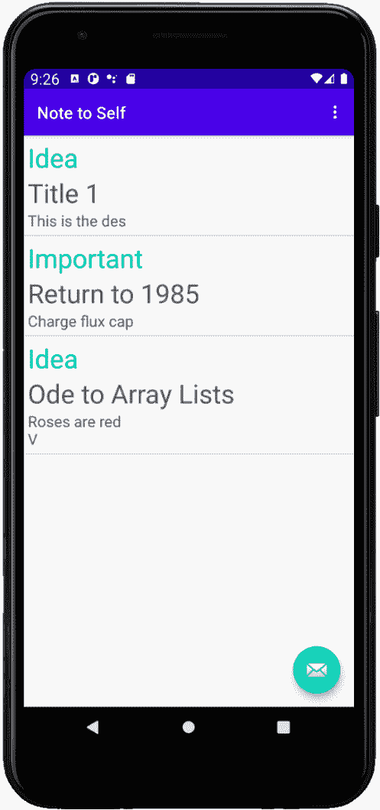
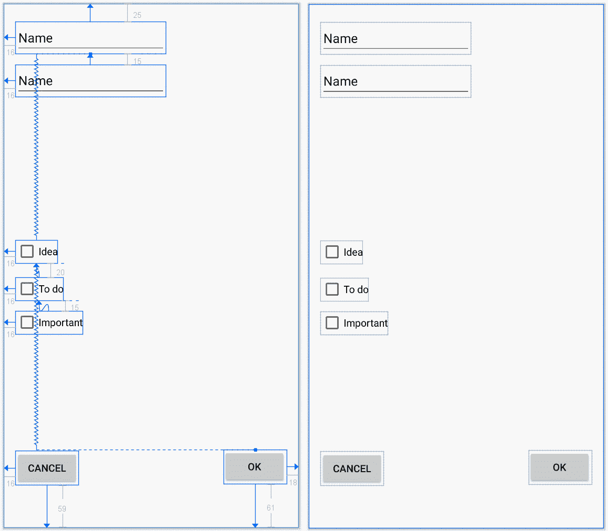
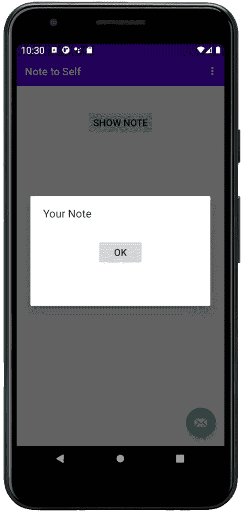
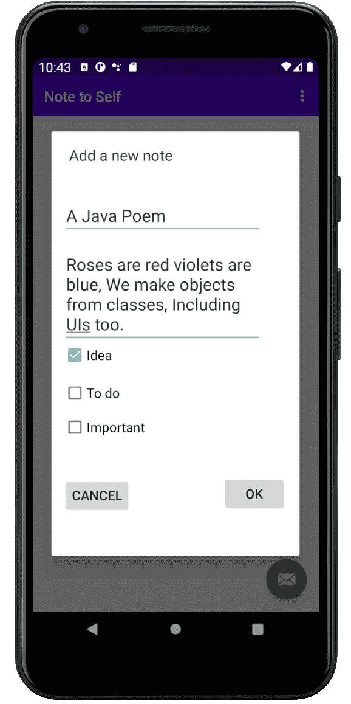

# 十四、安卓对话框窗口

在本章中，我们将了解如何向用户呈现一个弹出对话框窗口。然后，我们可以将我们所知道的一切放入我们第一个应用的第一阶段，即**注意自我**。然后我们将在本章和接下来的四章(一直到 [*第十八章*](18.html#_idTextAnchor320)**本地化*)中探索最新的安卓和 Java 特性，并在每个阶段使用我们新获得的知识来增强 Note to Self app。*

 *每一章还将建立一个从这个主应用中分离出来的小应用的选择。那么，这一章为你准备了什么？我们将讨论以下主题:

*   用弹出对话框实现简单的应用
*   使用`DialogFragment`课程开始“自我笔记”应用
*   在项目中添加字符串资源，而不是在布局中硬编码文本
*   第一次使用安卓命名约定，让我们的代码更易读
*   实现更复杂的对话框来捕获用户的输入

我们开始吧。

# 技术要求

你可以在[https://GitHub . com/PacktPublishing/Android-初学者编程-第三版/tree/main/章节%2014](https://github.com/PacktPublishing/Android-Programming-for-Beginners-Third-Edition/tree/main/chapter%2014) 找到本章中出现的代码文件。

# 对话框窗口

在许多场合，在我们的应用中，我们会希望向用户显示一些信息，甚至要求在弹出窗口中确认某个动作。这就是所谓的**对话框**窗口。如果你快速浏览 AndroidStudio 的调色板，你可能会惊讶地发现没有提到任何对话框。

安卓系统中的对话框比简单的小部件甚至整个布局都要高级。它们是可以有自己的布局和其他**用户界面** ( **用户界面**)元素的类。

在安卓中创建对话框窗口的最好方法是使用`FragmentDialog`类。

注意

片段在安卓中是一个广泛而重要的话题，我们将在本书的后半部分花很多时间来探索和使用它们。

为我们的用户创建一个整洁的弹出对话框(使用`FragmentDialog`)进行交互是对片段的一个很好的介绍，而且一点也不复杂。

## 创建对话演示项目

我们之前提到在安卓系统中创建对话框的最佳方式是通过`FragmentDialog`类。

为此，使用空活动模板在 AndroidStudio 创建一个新项目，并将其称为`Dialog Demo`。如您所料，本项目的完整代码位于下载包的 [*第 14 章*](#_idTextAnchor249) `/Dialog Demo`文件夹中。

## 编码一个对话片段类

在 AndroidStudio 中创建一个新的类，方法是右键单击包含你的包名的文件夹(与包含`MainActivity.java`文件的文件夹相同)。选择**新建** | **Java 类**并命名为`MyDialog`。按下*进入*键创建类。

首先要做的是更改类声明来扩展`DialogFragment`。完成后，您的新类应该类似于下面的代码块:

```java
public class MyDialog extends DialogFragment {    
}
```

现在，让我们一点一点地向这个类添加代码，并解释每一步发生了什么。现在，我们需要导入`DialogFragment`类。您可以通过按住 *Alt* 键，然后点击*进入*或通过在`MyDialog.java`文件顶部的包声明后添加以下一行高亮显示的代码来实现:

```java
package com.gamecodeschool.dialogdemo;
import androidx.fragment.app.DialogFragment;
public class MyDialog extends DialogFragment {
}
```

就像安卓应用编程接口中的许多类一样，`DialogFragment`为我们提供了可以覆盖的方法，以便与类中发生的不同事件进行交互。

添加以下高亮显示的代码来覆盖`onCreateDialog`方法。仔细研究它，我们将检查接下来会发生什么:

```java
public class MyDialog extends DialogFragment {
   @Override
   public Dialog onCreateDialog(Bundle savedInstanceState) {
// Use the Builder class because this dialog 
   // has a simple UI
AlertDialog.Builder builder = 
          new AlertDialog.Builder(getActivity());
   }
}
```

您需要以常规方式或通过手动添加以下突出显示的代码来导入`Dialog`、`Bundle`和`AlertDialog`类:

```java
import android.app.Dialog;
import android.os.Bundle;
import androidx.appcompat.app.AlertDialog;
import androidx.fragment.app.DialogFragment;
```

注意

代码中还有一个错误，因为我们遗漏了`onCreateDialog`方法的`return`语句。稍后当我们完成方法的其余部分的编码时，我们将添加这个。

在前面的代码中，我们首先添加了被覆盖的`onCreateDialog`方法。当我们稍后通过`MainActivity`类中的代码向用户显示对话框时，这将被安卓调用。

然后，在`onCreateDialog`方法中，我们得到一个新的类。我们声明并初始化一个`AlertDialog.Builder`类型的对象，它需要一个传递到其构造函数中的`MainActivity`的引用。这就是为什么我们用`getActivity()`方法作为论据。

`getActivity`方法是`Fragment`类的一部分(因此也是`DialogFragment`的一部分)，它返回对`Activity`的引用，这将创建`DialogFragment`。这样的话，那就是我们的`MainActivity`班了。

现在我们已经声明并初始化了`builder`，让我们检查一下我们可以用它做什么。

### 使用链接配置对话片段

现在我们可以使用我们的`builder`对象来完成剩下的工作。下面的代码片段有点古怪。如果您快速浏览接下来的三个代码块，您会注意到明显缺少分号(`;`)。这三个代码块实际上只是编译器的一行代码。

我们以前见过这种情况，但不太明显；也就是说，当我们创建了一个`Toast`消息并在它的末尾添加了一个`.show()`方法时。这个叫做**连锁**。这是我们在同一个对象上依次调用多个方法的地方。这相当于写多行代码；这样更简洁。

在我们之前添加的代码之后，在`onCreateDialog`方法中添加以下代码(使用链接)。检查新代码，我们接下来将讨论它:

```java
// Dialog will have "Make a selection" as the title
builder.setMessage("Make a selection")

// An OK button that does nothing
.setPositiveButton("OK", new DialogInterface.OnClickListener() {
   public void onClick(DialogInterface dialog, int id) {
          // Nothing happening here
   }
})
// A "Cancel" button that does nothing 
.setNegativeButton("Cancel", new DialogInterface.OnClickListener() {

   public void onClick(DialogInterface dialog, int id) {
          // Nothing happening here either

   }

});
```

此时，您需要导入`DialogInterface`类。使用*替换* | *进入*技术，或者在其他`import`语句中添加这一行代码:

```java
import android.content.DialogInterface;
```

下面是我们刚刚添加的代码的三个部分的解释:

1.  在三个块中的第一个(使用链接)，我们称之为`builder.setMessage`。这将设置用户将在对话框中看到的主要消息。此外，请注意，在链式方法调用的各个部分之间有注释是没有问题的，因为编译器会忽略这些注释。
2.  然后，我们用`.setPositiveButton`方法在对话框中添加一个按钮，这个方法的第一个参数将按钮的文本设置为`OK`。第二个参数是一个名为`DialogInterface.OnClickListener`的匿名类，它处理任何点击按钮的操作。请注意，我们不会向`onClick`方法添加任何代码。在这里，我们只想看到这个简单的对话框；我们将在下一个项目中更进一步。
3.  接下来，我们在同一个`builder`对象上调用另一个方法。这次是`setNegativeButton`法。同样，这两个参数将`Cancel`设置为按钮的文本和一个用于监听点击的匿名类。同样，出于本演示的目的，我们不会在被覆盖的`onClick`方法中采取任何行动。调用`setNegativeButton`方法后，我们终于看到一个分号标记了代码行的末尾。

我们最终将对`return`语句进行编码，以完成该方法，并消除我们从一开始就有的错误。将`return`语句添加到`onCreateDialog`方法的末尾(但在最后一个大括号内)，如下图所示:

```java
…
// Create the object and return it
return builder.create();
}// End of onCreateDialog
```

这最后一行代码的效果是返回到`MainActivity`类(首先调用`onCreateDialog`方法)我们新的、完全配置的对话框窗口。稍后我们将检查并添加这个调用代码。

现在，我们有了扩展`FragmentDialog`的`MyDialog`类。我们所需要做的就是声明`MyDialog`的一个实例，实例化它，并调用它被覆盖的`createDialog`方法。

## 使用 DialogFragment 类

在我们转向代码之前，让我们在布局中添加一个按钮。请执行以下步骤:

1.  切换到`activity_main.xml`选项卡，然后切换到**设计**选项卡。
2.  将**按钮**拖到布局上，并确保其`id`属性设置为`button`。
3.  单击**推断约束**按钮，将按钮精确约束在您想要放置的位置。请注意，位置并不重要——我们将如何使用它来创建我们的`MyDialog`类的实例是目前的关键课程。

现在切换到`MainActivity.java`选项卡，我们将通过使用匿名类来处理这个新按钮的点击，就像我们在 [*第 13 章*](13.html#_idTextAnchor228)*匿名类–在小部件探索应用期间将安卓小部件带入生活*中所做的那样。我们这样做是因为我们在布局中只有一个按钮，这似乎比实现更复杂的`OnClickListener`接口替代方案更明智、更紧凑(就像我们在 [*第 12 章*](12.html#_idTextAnchor218)*栈、堆和垃圾收集器*中为 Java Meet UI 演示应用所做的那样)。

请注意，在下面的代码块中，匿名类与我们之前实现的接口类型完全相同。将此代码添加到`onCreate`方法中:

```java
/*
   Let's listen for clicks on our regular Button.
   We can do this with an anonymous class.
*/
Button button = (Button) findViewById(R.id.button);
button.setOnClickListener(
   new View.OnClickListener() {

         @Override
         public void onClick(View v) {
                // We only handle one button
                // Therefor no switching required
                MyDialog myDialog = new MyDialog();
                myDialog.show(getSupportFragmentManager(), 
                "123");
                // This calls onCreateDialog
                // Don't worry about the strange looking 
                   123
                // We will find out about this in chapter 
                   18
         }
   }
);
```

注意

该代码需要以下`import`语句:

`import android.view.View;`

`import android.widget.Button;`

请注意，代码中唯一发生的事情是`onClick`方法创建了一个新的`MyDialog`的实例，并调用了它的`show`方法。不出所料，这将显示我们的对话窗口，就像我们在`MyDialog`类中配置的一样。

`show`方法需要参考`FragmentManager`，我们可以通过`getSupportFragmentManager`得到。这是跟踪和控制活动的所有`Fragment`实例的类。我们还传递了一个标识符:`"123"`。

当我们更仔细地观察片段时，会发现更多关于`FragmentManager`的细节。我们将在 [*第 20 章*](20.html#_idTextAnchor345)*绘制图形*中的*安卓片段*部分进行。

注意

我们使用`getSupportFragmentManager`方法的原因是我们通过扩展`AppCompatActivity`来支持旧设备。如果我们简单地扩展`Activity`，那么我们可以使用`getFragmentManager`类。不利的一面是，该应用无法在如此多的设备上运行。

现在，我们可以运行应用，欣赏我们的新对话框窗口，当我们点击布局中的按钮时，它就会出现。请注意，单击对话框窗口中的任一按钮都会将其关闭。这是默认行为。下面的截图显示了我们在 Pixel C 平板电脑模拟器上的对话框:


图 14.01–正在运行的对话框

接下来，我们将制作另外两个实现对话框的类，作为我们的多章自我笔记应用的第一阶段的一部分。我们将了解到，对话窗口几乎可以有我们选择的任何布局，并且我们不必依赖于像`Dialog.Builder`类给我们的简单布局。

# 自我提示应用

欢迎来到我们将在本书中实现的三大应用中的第一个。当我们执行这些项目时，我们将比较小的应用更专业地执行它们。我们将使用安卓命名约定、字符串资源和适当的封装。

有时候，当你试图学习一个新的安卓/Java 主题时，这些东西可能会被过度使用。然而，它们是有用的，在实际项目中尽快开始使用它们是很重要的。最终，它们会成为第二天性，我们应用的质量也会受益。

## 使用命名约定和字符串资源

在 [*第三章*](03.html#_idTextAnchor064)*探索 AndroidStudio 和项目结构*中，我们谈到了在布局文件中使用字符串资源而不是硬编码文本。这样做有几个好处，但也比较啰嗦。

由于这是我们的第一个真实项目，这将是一个以正确的方式做事的好时机，这样我们就可以获得这样做的经验。如果你想快速复习一下字符串资源的好处，请回到 [*第 3 章*](03.html#_idTextAnchor064)*探索 AndroidStudio 和项目结构*。

命名约定是用于在我们的代码中命名变量、方法和类的约定或规则。在本书中，我们宽松地应用了安卓的命名约定。由于这是我们的第一个真实世界的应用，我们在应用这些命名约定时会稍微严格一些。

最值得注意的是，当一个变量是一个类的成员时，我们会用小写的`m`作为名字的前缀。

注意

你可以在 https://source.android.com/source/code-style.html.找到更多关于安卓命名惯例和代码风格的信息

## 如何获取“给自己的笔记”应用的代码文件

完整的 app，包括所有代码和资源，可以在 [*第 18 章*](18.html#_idTextAnchor320) `/Note to self`文件夹的下载包中找到。当我们在接下来的五章中实现这个应用时，在每一章的末尾查看部分完成的、可运行的应用可能会很有用。部分完成的可运行应用及其所有相关代码和资源可以在各自的文件夹中找到:

[*第十四章*](#_idTextAnchor249)T0】

[*第十六章*](16.html#_idTextAnchor285)T0】

[*第十七章*](17.html#_idTextAnchor300)T0】

[*第十八章*](18.html#_idTextAnchor320)T0】

注意

[*第 15 章*](15.html#_idTextAnchor267)*阵图和随机数*中没有【自我注意】代码。这是因为，即使我们会了解到自己在《自我笔记》中使用的主题，我们也要到 [*第 16 章*](16.html#_idTextAnchor285)*适配器和回收器*才会做出任何改变。

如果您一直关注并打算从头到尾构建笔记到自我应用，我们将构建一个名为`Note to self`的项目。然而，仍然没有什么能阻止你从每一章开始，在任何时候，都可以从项目的代码文件中进行一点复制和粘贴。请注意，在说明中的不同点，您将被要求删除或替换前一章中偶尔出现的代码行。

因此，即使您复制和粘贴的内容比键入的代码多，也一定要完整阅读说明，并参考书中的代码以获得可能有用的额外注释。

在每一章中，代码将被呈现为好像你已经完整地完成了最后一章，在必要时显示来自前面章节的代码，作为我们新代码的有用上下文。

每一章都不会只讨论“自我笔记”应用——我们将了解其他通常相关的东西，并构建一些更小/更简单的应用。所以，当我们来到自我实现的笔记时，理论上，我们会为此做好准备。

## 已完成的应用

以下截图来自已完成的 app。当然，在不同的发展阶段，情况会略有不同。必要时，我们将参考更多的截图，作为提醒或查看整个开发过程中的差异。

完成后的应用将允许用户点击应用右下角的浮动操作按钮，以打开一个对话框窗口来添加新的注释。以下屏幕截图突出显示了该功能:


图 14.02–浮动操作按钮

左边可以查看按钮点击，右边可以查看对话框窗口，用户可以在其中添加新的备注。

最终，随着用户添加更多的笔记，他们将在应用的主屏幕上看到他们添加的所有笔记的列表，如下图所示。用户可以选择该笔记是**重要的**、**想法**和/或**待办事项**:



图 14.03–主屏幕上的注释

您将能够向下滚动列表并点击一个笔记，看到它显示在另一个专用于该笔记的对话框窗口中。下面的屏幕截图显示了一个显示注释的对话框:


图 14.04–所选注释的显示

还有简单(也就是很简单)**设置**画面，可以从菜单进入。它将允许用户配置笔记列表是否用分隔线格式化。以下是**设置中的**菜单选项:


图 14.05–设置菜单选项

现在，我们确切地知道了我们要构建什么，我们就可以开始实施它了。

## 建设项目

让我们现在创建新的项目。使用基本活动模板。正如我们在 [*第三章*](03.html#_idTextAnchor064)*探索 AndroidStudio 和项目结构*中所讨论的，这个模板将生成一个简单的菜单和一个浮动动作按钮，这两者都在这个项目中使用。调用项目`Note to Self`。

## 准备字符串资源

这里，我们将创建我们将从布局文件中引用的所有字符串资源，而不是硬编码用户界面小部件的`text`属性，这是我们到目前为止一直在做的事情。

首先，从项目浏览器的`res/values`文件夹中打开`strings.xml`文件。您将看到自动生成的资源。添加以下突出显示的字符串资源，我们将在项目的其余部分中使用这些资源。在关闭`</resources>`标签前添加代码:

```java
...
<resources>
    <string name="app_name">Note to Self</string>
    <string name="action_settings">Settings</string>
    <!-- Strings used for fragments for navigation -->
    <string name="first_fragment_label">First 
               Fragment</string>
    <string name="second_fragment_label">Second 
               Fragment</string>
    <string name="next">Next</string>
    <string name="previous">Previous</string>
    <string name="hello_first_fragment">Hello first 
               fragment</string>
    <string name="hello_second_fragment">Hello second 
               fragment. Arg: %1$s</string>
    <string name="action_add">add</string>
    <string name="title_hint">Title</string>
    <string name="description_hint">Description</string>
    <string name="idea_text">Idea</string>
    <string name="important_text">Important</string>
    <string name="todo_text">To do</string>
    <string name="cancel_button">Cancel</string>
    <string name="ok_button">OK</string>

    <string name="settings_title">Settings</string>
    <string name="theme_title">Theme</string>
    <string name="theme_light">Light</string>
    <string name="theme_dark">Dark</string>
</resources>
```

在前面的代码中，请注意，每个字符串资源都有一个唯一的`name`属性，它将与所有其他属性区分开来，同时还提供了一个有意义的、有希望的、令人难忘的线索，说明它所代表的实际字符串值。我们将使用这些名称值在布局文件中进行引用。

对于应用的其余部分，我们不需要重新访问该文件。

## 对笔记类进行编码

这是 app 的基础数据结构。这是一个我们自己从头开始编写的类，并且拥有我们需要的所有成员变量来表示用户的一个注释。在 [*第十五章*](15.html#_idTextAnchor267)*数组地图和随机数*中，我们将学习一些新的 Java，以便了解如何让用户拥有几十个、几百个甚至几千个笔记。

右键单击与包同名的文件夹，创建一个新类。不出所料，是同样包含`MainActivity.java`文件的那个。选择**新** | **Java 类**并命名为`Note`。按下*进入*键创建类。

将以下高亮显示的代码添加到新的`Note`类中:

```java
public class Note {
    private String mTitle;
    private String mDescription;
    private boolean mIdea;
    private boolean mTodo;
    private boolean mImportant;
}
```

请注意，根据安卓惯例，我们的成员变量名以`m`为前缀。此外，我们不希望任何其他类直接访问这些变量，所以它们都被声明为`private`。

因此，我们每个成员都需要一个 getter 和一个 setter 方法。将以下 getter 和 setter 方法添加到`Note`类中:

```java
public String getTitle() {
   return mTitle;
}
public void setTitle(String mTitle) {
   this.mTitle = mTitle;
}
public String getDescription() {
   return mDescription;
}
public void setDescription(String mDescription) {
   this.mDescription = mDescription;
}
public boolean isIdea() {
   return mIdea;
}
public void setIdea(boolean mIdea) {
   this.mIdea = mIdea;
}
public boolean isTodo() {
   return mTodo;
}
public void setTodo(boolean mTodo) {
   this.mTodo = mTodo;
}
public boolean isImportant() {
   return mImportant;
}
public void setImportant(boolean mImportant) {
   this.mImportant = mImportant;
}
```

前面这个列表中有相当多的代码，但是没有什么复杂的。每个方法都有指定的`public`访问权限，因此它可以被引用了`Note`类型对象的任何其他类使用。此外，对于每个变量，都有一个名为`get...`的方法和一个名为`set...`的方法。布尔型变量的获取器被命名为`is...`。如果你仔细想想，这是一个合乎逻辑的名字，因为返回的答案不是真就是假。

每个 getters 只返回相关变量的值。每个设置器将相关变量的值设置为传递给该方法的任何值。

注意

事实上，我们应该加强我们的设置器，做一些检查，以确保传入的值在合理的范围内。例如，我们可能想要检查并强制执行`String mTtile`和`String mDescription`的最大或最小长度。这是留给读者的练习。

让我们设计两个对话框窗口的布局。

## 实现对话设计

现在，我们将做一些我们以前做过很多次的事情，但是这次，为了一个新的原因。正如我们所知，我们将有两个对话窗口:一个供用户输入新注释，另一个供用户查看他们选择的注释。

我们可以设计这两个对话框窗口的布局，就像我们以前设计所有布局一样。当我们开始为`FragmentDialog`类创建 Java 代码时，我们将学习如何合并这些布局。

首先，让我们为“新注释”对话框添加一个布局。请执行以下步骤:

1.  右键单击项目浏览器中的**布局**文件夹，选择**新建** | **布局资源文件**。在**文件名:**字段输入`dialog_new_note`。
2.  左键单击**确定**以生成新的布局文件，默认情况下，该文件的根元素为`ConstraintLayout`类型。
3.  Refer to the target design, in the following diagram, as you follow the rest of these instructions. I have Photoshopped the finished layout, including the constraints that we will soon autogenerate, next to the layout with the constraints hidden for extra clarity:

    

    图 14.06–新便笺的完成布局

4.  将**纯文本**小部件(从**文本**类别)拖放到布局的左上角。然后，在其下方添加另一个**纯文本**小部件。暂时不要担心任何属性。
5.  从**按钮**类别中拖放三个**复选框**部件，一个在另一个下面。查看前面的参考图以获得指导。同样，现在不要担心任何属性。
6.  将两个**按钮**拖放到布局上。第一个将直接位于上一步最后一个**复选框**部件的下方；第二个将水平落下，与第一个**按钮**一致，但是在布局的右侧。
7.  整理布局，使其看起来尽可能接近参考图。然后，点击**推断约束**按钮来固定您选择的位置。
8.  Now, we can set up all of our `text`, `id`, and `hint` properties. You can do this by using the values from the following table. Remember that we are using our string resources for the `text` and `hint` properties:

    注意

    当您编辑第一个`id`属性时(我们接下来会做)，您可能会看到一个弹出窗口，要求确认您的更改。勾选框中的**不要再问，点击**是**继续:**

    

    图 14.07–变更确认

    

我们现在有了一个有组织的布局，可以显示我们的 Java 代码了。确保记住不同小部件的`id`属性值。当我们编写 Java 代码时，我们将看到它们在起作用。重要的是，我们的布局看起来很好，并且每个相关项目都有一个`id`属性值，所以我们可以对其进行引用。

让我们为“显示注释”对话框创建布局:

1.  右键单击项目浏览器中的**布局**文件夹，选择**新建** | **布局资源文件**。在**文件名:**字段输入`dialog_show_note`。
2.  左键单击**确定**以生成新的布局文件，默认情况下该文件将把`ConstraintLayout`类型作为其根元素。
3.  Refer to the target design, in the following diagram, as you follow the rest of these instructions. I have Photoshopped the finished layout, including the constraints we will soon autogenerate, next to the layout with the constraints hidden for extra clarity:

    

    图 14.08–显示注释对话框的完成布局

4.  首先，拖放三个**文本视图**小部件，使它们在布局顶部垂直对齐。
5.  接下来，将另一个**文本视图**部件拖放到前面三个`TextView`部件的正下方。
6.  在前一个小部件的正下方但在左侧添加另一个**文本视图**小部件。
7.  现在在中间水平添加一个**按钮**，但是靠近布局的底部。
8.  整理布局，使其看起来尽可能接近参考图，然后点击**推断约束**按钮，固定您选择的位置。
9.  从下表中配置属性:


注意

由于我们调整了一些用户界面元素的大小和内容，您可能希望通过稍微拖动它们来调整它们的最终位置。首先，点击**清除所有约束**。然后，调整布局到你想要的样子，最后，点击**推断约束**再次固定位置。将`btnOK`应用于按钮标识时，可能会出现一个对话框，提示该标识已经存在，单击**继续**忽略该弹出窗口。

现在我们有了一个布局，我们可以使用它向用户显示一个注释。请注意，我们可以重用一些字符串资源。我们的应用越大，以这种方式做事就越有利。

## 对对话框进行编码

现在，我们的两个对话窗口都有了一个设计(“显示注释”和“新注释”)，我们可以使用我们所知道的`FragmentDialog`类来实现一个类来表示用户可以与之交互的每个对话窗口。

我们将从“新笔记”屏幕开始。

### 为 DialogNewNote 类编码

通过右键单击包含所有`.java`文件的项目文件夹并选择**新建** | **Java 类**来创建一个新类。命名班级`DialogNewNote`。

首先，更改类声明并扩展`DialogFragment`。然后，重写`onCreateDialog`方法，这是这个类中所有剩余代码的去处。为此，请确保您的代码与以下代码片段相同:

```java
public class DialogNewNote extends DialogFragment { 
   @Override
   public Dialog onCreateDialog(Bundle savedInstanceState) {

         // All the rest of the code goes here

   }
}
```

注意

您还需要添加这些新的导入:

`import androidx.fragment.app.DialogFragment;`

`import android.app.Dialog;`

`import android.os.Bundle;`

我们在新类中暂时有一个错误，因为我们需要一个`return`语句；然而，我们马上就会谈到这一点。

在下一段代码中，首先，我们声明并初始化一个`AlertDialog.Builder`对象，就像我们之前创建对话框窗口时所做的一样。然而，这一次，我们对这个物体的依赖将远远少于以前。

接下来，我们初始化一个`LayoutInflater`对象，我们将使用它来膨胀我们的 XML 布局。通过“膨胀”，我们只是指如何将我们的 XML 布局转换成一个 Java 对象。一旦这样做了，我们就可以用通常的方式访问所有的小部件。我们可以把`inflater.inflate`方法看作是替换我们对话框中的`setContentView`方法。然后，在第二行，我们使用`inflate`方法来完成。

添加我们刚刚讨论过的三行代码:

```java
AlertDialog.Builder builder = 
   new AlertDialog.Builder(getActivity());
LayoutInflater inflater = 
   getActivity().getLayoutInflater();

View dialogView = 
   inflater.inflate(R.layout.dialog_new_note, null);
```

注意

要使用前面三行代码中的新类，您需要添加以下`import`语句:

`import androidx.appcompat.app.AlertDialog;`

`import android.view.View;`

`import android.view.LayoutInflater;`

我们现在有一个名为`dialogView`的`View`对象，它包含了我们的`dialog_new_note.xml`布局文件中的所有用户界面元素。

紧接在前面的代码块之后，我们将添加下面的代码块，接下来我们将对此进行解释。

这段代码将以通常的方式获取对每个 UI 小部件的引用。以下代码中的许多对象被声明为`final`，因为它们将在一个匿名类中使用，正如我们之前所了解的，这是必要的。记住是参照物是`final`(即不能改变)；我们仍然可以更改堆中引用的对象。

在前一个代码块之后添加以下代码:

```java
final EditText editTitle = 
dialogView.findViewById(R.id.editTitle);
final EditText editDescription = 
dialogView.findViewById(R.id.editDescription);
final CheckBox checkBoxIdea =
dialogView.findViewById(R.id.checkBoxIdea);
final CheckBox checkBoxTodo =
dialogView.findViewById(R.id.checkBoxTodo);
final CheckBox checkBoxImportant = 
dialogView.findViewById(R.id.checkBoxImportant);
Button btnCancel = 
dialogView.findViewById(R.id.btnCancel);
Button btnOK = 
dialogView.findViewById(R.id.btnOK);
```

注意

添加以下`import`代码语句，使刚才添加的代码无错误:

`import android.widget.Button;`

`import android.widget.CheckBox;`

`import android.widget.EditText;`

在下一个代码块中，我们将使用`builder`设置对话框的消息，这是我们的构建器实例。然后，我们将编写一个匿名类来处理`btnCancel`按钮的点击。在被覆盖的`onClick`方法中，我们将简单地调用`DialogFragment`的公共方法`dismiss()`来关闭对话框窗口。如果用户点击**取消**，这正是我们需要的。

添加我们刚刚讨论过的以下代码:

```java
builder.setView(dialogView).setMessage("Add a new note");
// Handle the cancel button
btnCancel.setOnClickListener( new View.OnClickListener() {
   @Override
   public void onClick(View v) {
         dismiss();
   }
});
```

现在，我们将添加一个匿名类来处理当用户点击**确定**按钮(`btnOK`)时发生的事情。

首先，我们创建一个新的`Note`实例，称为`newNote`。然后，我们将`newNote`中的每个成员变量设置为表单的适当内容。

在这之后，我们做一些新的事情。我们使用`getActivity`方法创建对`MainActivity`类的引用。然后，我们用这个引用来调用`MainActivity`中的`createNewNote`方法。

注意

注意，我们还没有写这个`createNewNote`方法，在本章后面写之前，它会显示为一个错误。

这个方法发送的参数是我们新初始化的`newNote`对象。这具有将用户的新笔记发送回`MainActivity`的效果。我们将在本章的后面学习如何处理这个问题。

最后，我们调用`dismiss`关闭对话框窗口。

在前面的代码之后添加我们已经讨论过的以下代码:

```java
btnOK.setOnClickListener(new View.OnClickListener() {

   @Override
   public void onClick(View v) {

         // Create a new note
         Note newNote = new Note();
         // Set its variables to match the 
         // user's entries on the form
         newNote.setTitle(editTitle.
                getText().toString());

         newNote.setDescription(editDescription.
                getText().toString());

         newNote.setIdea(checkBoxIdea.isChecked());
         newNote.setTodo(checkBoxTodo.isChecked());
         newNote.setImportant(checkBoxImportant.
                isChecked());
         // Get a reference to MainActivity
         MainActivity callingActivity = 
                (MainActivity) getActivity();

         // Pass newNote back to MainActivity
         callingActivity.createNewNote(newNote);
         // Quit the dialog
         dismiss();
   }
});
return builder.create();
```

这是我们完成的第一个对话。我们还没有连线到出现在`MainActivity`中，我们还需要实现`createNewNote`方法。我们将在创建下一个对话框后直接这样做。

### 对 DialogShowNote 类进行编码

右键单击包含所有`.java`文件的项目文件夹，选择**新建** | **Java 类**，创建一个新的类。命名班级`DialogShowNote`。

首先，更改类声明并扩展`DialogFragment`。然后，覆盖`onCreateDialog`方法。由于这个类的大部分代码都在`onCreateDialog`方法中，所以实现签名和空主体，如下面的代码片段所示，我们稍后将重新讨论它。

请注意，我们声明了`Note`类型的成员变量`mNote`。添加`sendNoteSelected`方法和初始化`mNote`的一行代码。该方法将由`MainActivity`调用，并传递给用户点击的`Note`对象。

添加我们刚刚讨论的代码。然后，我们可以查看`onCreateDialog`的详细信息并进行编码:

```java
public class DialogShowNote extends DialogFragment {
    private Note mNote;
    @Override
    public Dialog onCreateDialog(Bundle savedInstanceState) {
        // All the other code goes here
    }
    // Receive a note from the MainActivity
    public void sendNoteSelected(Note noteSelected) {
        mNote = noteSelected;
    }
}
```

注意

此时，您将需要导入以下类:

`import android.app.Dialog;`

`import android.os.Bundle;`

`import androidx.fragment.app.DialogFragment;`

接下来，我们声明并初始化`AlertDialog.Builder`的一个实例。此外，正如我们对`DialogNewNote`类所做的那样，我们声明并初始化一个`LayoutInflater`实例，然后使用它来创建一个`View`对象，该对象具有对话框的布局。在这种情况下，是来自`dialog_show_note.xml`的布局。

最后，在下面的代码中，我们获得了对每个 UI 小部件的引用，并从在`sendNoteSelected`方法中初始化的`mNote`的适当成员变量中将`text`属性设置为`txtTitle`和`textDescription`。

将我们刚才讨论的代码添加到`onCreateDialog`方法中:

```java
// All the other code goes here
AlertDialog.Builder builder = 
      new AlertDialog.Builder(getActivity());
LayoutInflater inflater = 
      getActivity().getLayoutInflater();

View dialogView = 
      inflater.inflate(R.layout.dialog_show_note, null);
TextView txtTitle = 
       dialogView.findViewById(R.id.txtTitle);
TextView txtDescription = 
       dialogView.findViewById(R.id.txtDescription);
txtTitle.setText(mNote.getTitle());
txtDescription.setText(mNote.getDescription());
TextView txtImportant = 
       dialogView.findViewById(R.id.textViewImportant);
TextView txtTodo = 
       dialogView.findViewById(R.id.textViewTodo);
TextView txtIdea = 
       dialogView.findViewById(R.id.textViewIdea);
```

注意

添加以下`import`语句，以便前面代码中的所有类都可用:

`import android.view.LayoutInflater;`

`import android.view.View;`

`import android.widget.TextView;`

`import androidx.appcompat.app.AlertDialog;`

下面我们要添加的代码也在`onCreateDialog`方法中。它检查正在显示的注释是否“重要”，然后相应地显示或隐藏`txtImportant TextView`。然后我们对`txtTodo`和`txtIdea`进行同样的操作。

当你还在`onCreateDialog`方法中时，在前一段代码后添加这段代码:

```java
if (!mNote.isImportant()){
   txtImportant.setVisibility(View.GONE);
}
if (!mNote.isTodo()){
   txtTodo.setVisibility(View.GONE);
}
if (!mNote.isIdea()){
   txtIdea.setVisibility(View.GONE);
}
```

我们现在需要做的就是当用户点击**确定**按钮时`dismiss`(关闭)对话框。这是通过一个匿名类来完成的，我们已经讨论过几次了。`onClick`方法只是调用`dismiss`方法，关闭对话框。

将此代码添加到前一代码块后的`onCreateDialog`方法中:

```java
Button btnOK = (Button) dialogView.findViewById(R.id.btnOK);
builder.setView(dialogView).setMessage("Your Note");
btnOK.setOnClickListener(new View.OnClickListener() {
   @Override
   public void onClick(View v) {
         dismiss();
   }
});
return builder.create();
```

注意

使用以下代码行导入`Button`类:

`import android.widget.Button;`

我们现在有两个对话窗口准备滚动。我们只需要在`MainActivity`类中添加一些代码来完成这项工作。首先，让我们做一点项目管理。

### 移除不需要的自动生成片段

我们现在将整理我们项目的文件和结构。请记住，我们用来生成这个项目的基本活动模板有很多特性。有些我们需要，有些我们不需要。我们希望浮动操作按钮在布局的右下角，我们希望主菜单的右上角有**设置**选项。然而，我们不希望用户在多个片段之间导航。为了有效地移除所有片段，并且在`content_main.xml`文件中只有一个简单的主布局，我们将删除对片段及其所有导航选项的引用。

打开`content_main.xml`布局文件。在`content_main.xml`文件的**设计**选项卡的**组件树**窗口中，找到 **nav_host_fragment** 元素。选中后按键盘上的*删除*键。现在，我们有了一个更干净的用户界面，为未来的发展做好了准备。

## 展示我们的新对话框

打开`MainActivity.java`文件。在类声明后添加一个新的临时成员变量。这不会出现在最终的应用中；这样我们就可以尽快测试我们的对话窗口:

```java
// Temporary code
Note mTempNote = new Note();
```

现在，将此方法添加到`MainActivity`类中，这样我们就可以从`DialogNewNote`类中接收到新的注释:

```java
public void createNewNote(Note n){
   // Temporary code
   mTempNote = n;
}
```

要向`DialogShowNote`方法发送注释，我们需要在`content_main.xml`布局文件中添加一个 ID 为`button`的按钮。打开`content_main.xml`布局文件。

为了清楚这个按钮是干什么用的，我们将其`text`属性改为`Show Note`，如下:

*   将按钮拖到`content_main.xml`布局上，将`id`属性配置为`button`，将`text`属性配置为`Show Note`。
*   Click on the **Infer Constraints** button so that the button stays where you put it. The exact position of this button is not important at this stage.

    注意

    只是澄清一下，这是一个用于测试目的的临时按钮，不会出现在最终的应用中。在开发结束时，我们将能够从滚动列表中点击笔记的标题。

在`onCreate`方法中，我们将设置一个匿名类来处理对临时按钮的点击。`onClick`方法中的代码将执行以下操作:

*   创建一个新的`DialogShowNote`实例，简称为`dialog`。
*   调用`dialog`上的`sendNoteSelected`方法传入`mTempNote`作为参数，这就是我们的`Note`对象。
*   最后，它将调用`show`，为我们的新对话框注入活力，并向用户展示。

将我们刚刚描述的代码添加到`onCreate`:

```java
// Temporary code
Button button = findViewById(R.id.button);
button.setOnClickListener(new View.OnClickListener() {
   @Override
   public void onClick(View v) {
         // Create a new DialogShowNote called dialog
         DialogShowNote dialog = new DialogShowNote();

         // Send the note via the sendNoteSelected method
         dialog.sendNoteSelected(mTempNote);

         // Create the dialog
         dialog.show(getSupportFragmentManager(), "123");
   }
});
```

注意

使用这行代码添加`Button`类:

`import android.widget.Button;`

我们现在可以点击一个按钮来调用我们的`DialogShowNote`对话窗口。运行该应用，点击**显示注释**按钮，查看带有`dialog_show_note.xml`布局的`DialogShowNote`对话框:



图 14.09-对话框说明对话框

诚然，考虑到我们在这一章中做了多少编码工作，这并不是要看的太多。然而，当我们让`DialogNewNote`类工作时，我们将能够看到`MainActivity`类如何在两个对话框之间交互和共享数据。

接下来，让我们使用`DialogNewNote`对话框。

### 对浮动操作按钮进行编码

这很容易。布局中为我们提供了浮动动作按钮。提醒一下，浮动操作按钮是一个圆形图标，上面有一个信封图像，如上一张截图右下角所示。

在`activity_main.xml`文件中。这是定位和定义其外观的 XML 代码。请注意，就在浮动动作按钮的代码之前，有一行代码(高亮显示)包含`content_main.xml`文件。这目前包含我们的**显示注释**按钮，并将最终包含我们的复杂滚动列表:

```java
…
…
<include layout="@layout/content_main" />
<com.google.android.material
     .floatingactionbutton.FloatingActionButton

     android:id="@+id/fab"
     android:layout_width="wrap_content"
     android:layout_height="wrap_content"
     android:layout_gravity="bottom|end"
     android:layout_margin="@dimen/fab_margin"
     app:srcCompat="@android:drawable/ic_dialog_email" />
…
…
```

AndroidStudio 甚至提供了一个匿名类来处理浮动动作按钮上的任何点击。我们只需要在这个已经提供的类的`onClick`方法中添加一些代码，就可以使用`DialogNewNote`类了。

浮动动作按钮通常用于应用中的核心动作。例如，在一个电子邮件应用中，它可能会被用来启动一个新的电子邮件。或者，在笔记应用中，它可能被用来添加新的笔记。所以，我们现在就开始吧。

在`MainActivity.java`文件中，在`onCreate`方法的`MainActivity`类中找到 AndroidStudio 提供的自动生成代码。这里是它的全部:

```java
fab.setOnClickListener(new View.OnClickListener() {
   @Override
   public void onClick(View view) {
            Snackbar.make(view, "Replace with your own 
action", 
                          Snackbar.LENGTH_LONG)
.setAction("Action", 
                          null).show();

   }
});
```

在前面的代码片段中，请注意高亮显示的行并将其删除。现在，添加以下代码代替删除的代码:

```java
DialogNewNote dialog = new DialogNewNote();
dialog.show(getSupportFragmentManager(), "");
```

新代码创建一个新的`DialogNewNote`种类的对话窗口，然后显示给用户。

我们现在可以运行该应用。点击浮动操作按钮，并添加类似于以下屏幕截图的注释:



图 14.10–添加新注释

接下来，我们可以点击**显示注释**按钮，以便在对话框窗口中查看，如下所示:


图 14.11–显示注释对话框窗口

注意如果你添加第二个音符，它将覆盖第一个音符，因为我们只有一个`Note`对象。为了解决这个问题，我们需要学习更多的 Java。

# 总结

在本章中，我们使用`DialogFragment`类讨论并实现了一个带有对话框窗口的通用用户界面设计。

然后，我们更进一步，通过实现更复杂的对话框来从用户那里获取信息，从而启动了“自我笔记”应用。我们看到`DialogFragment`类使我们能够在对话框中设计任何用户界面。

在下一章中，我们将处理用户只能有一个笔记的明显问题。我们将通过探索 Java 数组及其近亲`ArrayList`，以及另一个数据相关的 Java 类`Map`来解决这个问题。*