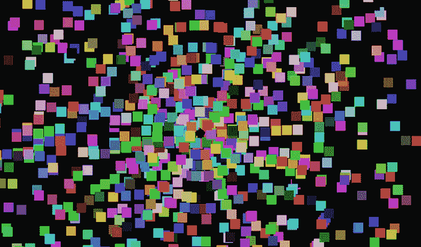
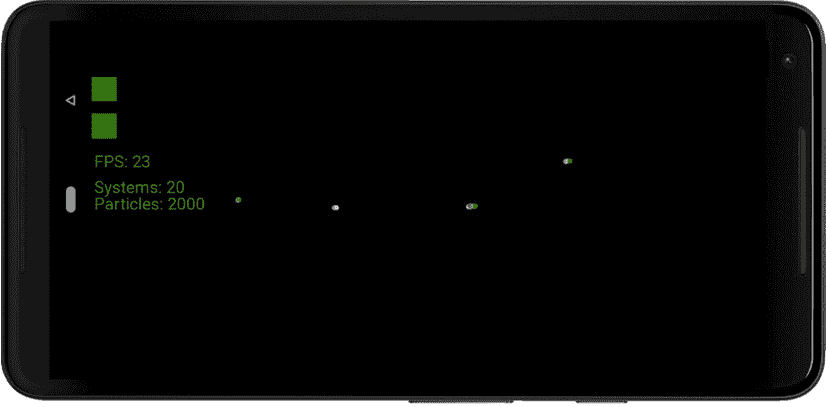
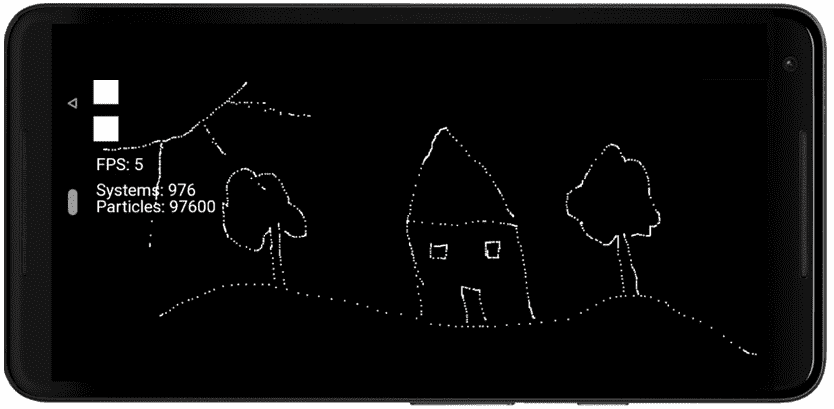
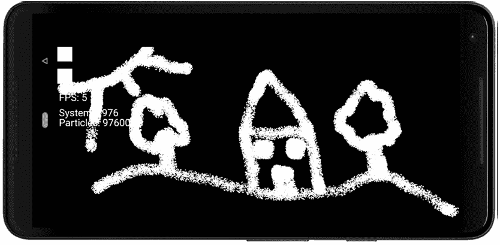

# *第 22 章*:粒子系统和处理屏幕触摸

我们已经有了上一章中使用线程实现的实时系统。在这一章中，我们将创建将在这个实时系统中存在和发展的实体，就好像它们有自己的头脑一样；它们将形成用户可以实现的绘图外观。

我们还将通过学习如何响应与屏幕的交互来了解用户如何实现这些实体。这不同于在用户界面布局中与小部件交互。

这一章的内容如下:

*   向屏幕添加自定义按钮
*   编码`Particle`类
*   编码`ParticleSystem`类
*   处理屏幕触摸
*   AndroidStudio剖析工具

我们将从向我们的应用添加自定义用户界面开始。

警告

这个应用产生明亮闪烁的颜色。它可能会引起光敏性癫痫患者的不适或癫痫发作。建议读者谨慎。您可能喜欢简单地阅读这个项目的理论，而不是运行已完成的项目。

# 技术要求

你可以在[https://GitHub . com/PacktPublishing/Android-初学者编程-第三版/tree/main/章节%2022](https://github.com/PacktPublishing/Android-Programming-for-Beginners-Third-Edition/tree/main/chapter%2022) 找到本章中出现的代码文件。

# 在屏幕上添加自定义按钮

我们需要让用户控制何时开始另一个绘图并清除他们之前工作的屏幕。我们需要用户能够决定是否以及何时将绘图变为现实。为此，我们将在屏幕上添加两个按钮，每个按钮对应一个任务。

添加`LiveDrawingView`类中下一个突出显示的成员:

```java
// These will be used to make simple buttons
private RectF mResetButton;
private RectF mTogglePauseButton;
```

我们现在有两个`RectF`实例。这些对象各有四个浮点坐标，我们提出的两个按钮的每个角各有一个坐标。

初始化`LiveDrawingView`构造器中的位置:

```java
// Initialize the two buttons
mResetButton = new RectF(0, 0, 100, 100);
mTogglePauseButton = new RectF(0, 150, 100, 250);
```

为`RectF`类添加`import`:

```java
import android.graphics.RectF;
```

现在我们已经为按钮添加了实际坐标。如果您在屏幕上可视化坐标，那么您将看到它们位于左上角，暂停按钮位于重置/清除按钮的正下方。

现在我们可以画按钮了。在`LiveDrawingView`类的`draw`方法中添加这两行代码:

```java
// Draw the buttons
mCanvas.drawRect(mResetButton, mPaint);
mCanvas.drawRect(mTogglePauseButton, mPaint);
```

新代码使用了`drawRect`方法的覆盖版本，我们只需将两个`RectF`实例直接传递到通常的`Paint`实例旁边。我们的按钮现在将被拉到屏幕上。

我们将在本章后面看到如何与这些略显粗糙的按钮进行交互。

# 实现粒子系统效果

粒子系统是一个控制粒子的系统。在我们的例子中，`ParticleSystem`是我们将要编写的一个类，它将产生`Particle`类(也是我们将要编写的一个类)的实例(大量实例)，这将创建一个简单的类似爆炸的效果。

这是由粒子系统控制的一些粒子的图像:



图 22.1–粒子系统效应

为了清楚起见，每个彩色方块都是`Particle`类的一个实例，所有`Particle`实例都由`ParticleSystem`类控制和持有。此外，用户将通过用手指绘图来创建多个(数百个)`ParticleSystem`实例。这些粒子将以点或块的形式出现，直到用户点击暂停按钮，它们才会复活。我们将仔细检查代码，以便您能够在代码中设置`Particle`和`ParticleSystem`实例的大小、颜色、速度和数量。

注意

留给读者的练习是在屏幕上添加额外的按钮，以允许用户将这些属性作为应用的一项功能进行更改。

我们将从编码`Particle`类开始。

## 对粒子类进行编码

添加`import`语句、成员变量和构造函数方法，如下代码所示:

```java
import android.graphics.PointF;
class Particle {
    PointF mVelocity;
    PointF mPosition;
    Particle(PointF direction)
    {
        mVelocity = new PointF();
        mPosition = new PointF();
        // Determine the direction
        mVelocity.x = direction.x;
        mVelocity.y = direction.y;
    }
}
```

我们有两个成员:一个负责速度，一个负责位置。他们都是`PointF`对象。`PointF`保存两个浮点值。位置简单；它只是一个水平和垂直的值。速度值得多解释一下。`PointF`中的两个值都是速度，一个水平，另一个垂直。这两种速度的结合意味着一个方向。

注意

在构造函数中，两个新的`PointF`对象被实例化，并且`mVeleocity`的`x`和`y`值用`PointF direction`参数传入的值初始化。请注意数值从`direction`复制到`mVelocity`的方式。现在，`PointF mVelocity`不是作为参数传入的`PointF`的引用。每个`Particle`实例都会复制`direction`的值(每个实例的值都不一样)，但是`mVelocity`和`direction`没有持久的联系。

接下来，把这三个方法加起来，然后我们就可以接着谈了:

```java
void update(float fps)
{
   // Move the particle
   mPosition.x += mVelocity.x;
   mPosition.y += mVelocity.y;
}
void setPosition(PointF position)
{
   mPosition.x = position.x;
   mPosition.y = position.y;
}
PointF getPosition()
{
   return mPosition;
}
```

或许不出所料，有一种`update`方法。每个`Particle`实例的`update`方法将由`ParticleSystem`类的`update`方法在应用的每一帧中调用，该方法又将由`LiveDrawingView`类调用(同样在`update`方法中)，我们将在本章的后面进行编码。

在`update`方法中，`mPosition`的水平和垂直值使用`mVelocity`的对应值进行更新。

注意

请注意，我们在更新中并不使用当前的帧速率。如果你想确定你的粒子都以正确的速度飞行，你可以修改这个。但是所有的速度都是随机的。添加这个额外的计算(对于每个粒子)并没有太大的好处。然而，正如我们将很快看到的那样，`ParticleSystem`类将需要考虑当前每秒的帧数来测量它应该运行多长时间。

接下来，我们对`setPosition`方法进行编码。注意，该方法接收`PointF`，用于设置初始位置。当效果被触发时，`ParticleSystem`类将传递这个位置。

最后，我们有`getPosition`法。我们需要这种方法，以便`ParticleSystem`类可以在正确的位置绘制所有粒子。我们可以给`Particle`类添加一个`draw`方法，而不是`getPosition`方法，让`Particle`类自己绘制。在这个实现中，两种选择都没有特别的好处。

现在我们可以进入`ParticleSysytem`课了。

## 对粒子系统类进行编码

`ParticleSystem`类比`Particle`类有更多的细节，但它仍然相当简单。记住我们需要通过这个类实现什么:保持、繁殖、更新和绘制一堆(相当大的一堆)`Particle`实例。

添加以下成员和`import`语句:

```java
import android.graphics.Canvas;
import android.graphics.Color;
import android.graphics.Paint;
import android.graphics.PointF;
import java.util.ArrayList;
import java.util.Random;
class ParticleSystem {
    private float mDuration;
    private ArrayList<Particle> mParticles;
    private Random random = new Random();
    boolean mIsRunning = false;

}
```

我们有四个成员变量:首先，一个名为`mDuration`的`float`变量将被初始化为我们希望效果运行的秒数。名为`mParticles`的`ArrayList`实例保存`Particle`实例，并将保存我们实例化的所有`Particle`对象。

名为`random`的`Random`实例是作为一个成员创建的，因为我们需要生成如此多的随机值，以至于每次创建一个新对象肯定会让我们慢一点。

最后，`mIsRunning`布尔值将跟踪粒子系统当前是否正在显示(更新和绘制)。

现在我们可以对`init`方法进行编码了。每次我们想要一个新的`ParticleSystem`的时候都会调用这个方法。请注意，唯一的参数是名为`numParticles`的`int`参数。

当我们调用`init`时，我们可以从初始化疯狂数量的粒子中获得一些乐趣。添加`init`方法，然后我们将更仔细地查看代码:

```java
void init(int numParticles){
   mParticles = new ArrayList<>();
   // Create the particles
   for (int i = 0; i < numParticles; i++){
         float angle = (random.nextInt(360)) ;
         angle = angle * 3.14f / 180.f;
         // Option 1 - Slow particles
         //float speed = (random.nextFloat()/10);
         // Option 2 - Fast particles
         float speed = (random.nextInt(10)+1);
         PointF direction;
         direction = new PointF((float)Math.cos(angle) * 
                     speed, (float)Math.sin(angle) * 
                     speed);
         mParticles.add(new Particle(direction));
   }
}
```

`init`方法只包含一个完成所有工作的`for`循环。`for`循环从零运行到`numParticles-1`。

首先，生成一个介于 0 和 359 之间的随机数，并存储在名为`angle`的`float`变量中。接下来，有一点数学知识，我们用`angle`乘以`3.14/180`。这将把角度从度数变成弧度，这是我们稍后将使用的`Math`类所要求的。

然后我们生成另一个介于 1 和 10 之间的随机数，并将结果分配给一个名为`speed`的`float`变量。

注意

我添加了注释，为代码的这一部分中的值建议了不同的选项。我在`ParticleSystem`课的几个地方都这样做了，当我们到了这一章的结尾，我们会有一些乐趣来改变这些值，看看它对绘图应用有什么影响。

现在我们有了一个随机的角度和速度，我们可以将它们转换并组合成一个向量，该向量可以在`Particle`类的`update`方法中使用，以每帧更新其位置。

注意

矢量是决定方向和速度的值。我们的向量存储在`direction`对象中，直到它被传递到`Particle`构造函数中。向量可以是多维的。我们的是二维的，因此定义了 0 到 359 度之间的航向和 1 到 10 度之间的速度。你可以在我的网站上读到更多关于向量、标题、正弦和余弦的内容:http://gamecode school . com/essentials/计算-2d 游戏中的标题-使用三角函数-part-1/ 。

使用`Math.sin`和`Math.cos`创建向量的单行代码，我决定不完整解释，因为魔法部分出现在以下公式中:

*   角度余弦* `speed`
*   角度的正弦* `speed`

这也部分发生在`Math`类提供的余弦和正弦函数的隐藏计算中。如果你想知道他们的全部细节，请看前面的提示框。

最后，创建一个新的`Particle`，然后添加到`mParticles ArrayList`实例中。

接下来，我们将对`update`方法进行编码。注意`update`方法确实需要当前帧率作为参数。编码`update`方法如下所示:

```java
void update(long fps){
   mDuration -= (1f/fps);
   for(Particle p : mParticles){
         p.update(fps);
   }
   if (mDuration < 0)
   {
         mIsRunning = false;
   }
}
```

`update`方法内部发生的第一件事是将经过的时间从`mDuration`中去掉。请记住`fps`参数是每秒帧数，因此`1/fps`给出的值是一秒的几分之一。

接下来，有一个增强的`for`循环，为`mParticles` `ArrayList`实例中的每个`Particle`实例调用`update`方法。

最后，代码检查粒子效果是否已经随着`if(mDuration < 0)`运行，如果已经运行，则将`mIsRunning`设置为`false`。

现在我们可以对`emitParticles`方法进行编码，它将设置每个`Particle`实例运行。这不要和`init`混淆，后者创造了所有的新粒子并赋予它们速度。在用户开始交互之前`init`方法将被调用一次，而当用户在屏幕上绘制时，每次效果需要启动时`emitParticles`方法将被调用。

添加`emitParticles`方法:

```java
void emitParticles(PointF startPosition){
   mIsRunning = true;
   // Option 1 - System lasts for half a minute
   //mDuration = 30f;
   // Option 2 - System lasts for 2 seconds
   mDuration = 3f;
   for(Particle p : mParticles){
         p.setPosition(startPosition);
   }
}
```

首先，请注意，所有粒子将从哪里开始的`PointF`参考是作为参数传入的。所有粒子都将从完全相同的位置开始，然后根据各自的速度扇出每一帧。

`mIsRunning`布尔设置为`true`、`mDuration`设置为`1f`，效果运行一秒钟，增强的`for`循环为每个粒子调用`setPosition`将它们移动到起始坐标。

我们`ParticleSysytem`类的最后一个方法是`draw`方法，它会在所有荣耀中揭示效果。该方法接收到对一个`Canvas`实例和一个`Paint`实例的引用，因此它可以绘制到相同的画布上，而`LiveDrawingView`类刚刚将锁定在其`draw`方法中。

添加`draw`方法:

```java
void draw(Canvas canvas, Paint paint){
         for (Particle p : mParticles) {
                // Option 1 - Coloured particles
                //paint.setARGB(255, random.nextInt(256),
                            //random.nextInt(256),
                            //random.nextInt(256));
                // Option 2 - White particles
                paint.setColor(
                Color.argb(255,255,255,255));
                // How big is each particle?
                float sizeX = 0;
                float sizeY = 0;
                // Option 1 - Big particles
                //sizeX = 25;
                //sizeY = 25;
                // Option 2 - Medium particles
                sizeX = 10;
                sizeY = 10;
                // Option 3 - Tiny particles
                //sizeX = 1;
                //sizeY = 1;
                // Draw the particle
                // Option 1 - Square particles
                //canvas.drawRect(p.getPosition().x, 
                            //p.getPosition().y,
                            //p.getPosition().x + sizeX,
                            //p.getPosition().y + sizeY,
                            //paint);
                // Option 2 - Circle particles
                canvas.drawCircle(p.getPosition().x, 
                            p.getPosition().y,
                            sizeX, paint);
         }
}
```

增强的`for`循环遍历`mParticles` `ArrayList`实例中的每个`Particle`实例。每个`Particle`依次使用`drawRect`方法和`getPosition`方法绘制。注意对`paint.setARGB`方法的调用。你会看到我们随机生成每个颜色通道。

注意

请注意，在评论中，我建议了不同的代码更改选项，这样我们在完成编码后就可以玩得开心了。

我们现在可以开始让粒子系统工作了。

## 在 LiveDrawingView 类中生成粒子系统

添加一个充满系统的`ArrayList`实例和一些更多的成员来跟踪事情。在现有注释指示的位置添加突出显示的代码:

```java
// The particle systems will be declared here later
private ArrayList<ParticleSystem> 
 mParticleSystems = new ArrayList<>();
private int mNextSystem = 0;
private final int MAX_SYSTEMS = 1000;
private int mParticlesPerSystem = 100;
```

如下所示导入`ArrayList`类:

```java
import java.util.ArrayList;
```

我们现在可以跟踪多达 1000 个粒子系统，每个系统中有 100 个粒子。随意玩这些数字。

注意

在现代设备上，你可以毫无困难地将粒子运行到数百万个，但在模拟器上，它只能与数十万个粒子进行斗争。

通过添加以下突出显示的代码来初始化构造函数中的系统:

```java
// Initialize the particles and their systems
for (int i = 0; i < MAX_SYSTEMS; i++) {
 mParticleSystems.add(new ParticleSystem());
 mParticleSystems.get(i).init(mParticlesPerSystem);
}
```

代码循环通过`ArrayList`实例，调用构造函数，然后在每个`ParticleSystem`实例上调用`init`方法。

通过在`update`方法中添加此高亮显示的代码，为循环的每一帧更新系统:

```java
private void update() {
   // Update the particles
   for (int i = 0; i < mParticleSystems.size(); i++) {
 if (mParticleSystems.get(i).mIsRunning) {
 mParticleSystems.get(i).update(mFPS);
 }
 }
}
```

前面的代码循环遍历每个`ParticleSystem`实例，首先检查它们是否处于活动状态，然后调用`update`方法并每秒传入当前帧。

通过将此高亮代码添加到`draw`方法，为循环的每一帧绘制系统:

```java
// Choose a color to paint with
mPaint.setColor(Color.argb(255, 255, 255, 255));
// Choose the font size
mPaint.setTextSize(mFontSize);
// Draw the particle systems
for (int i = 0; i < mNextSystem; i++) {
 mParticleSystems.get(i).draw(mCanvas, mPaint);
}
// Draw the buttons
mCanvas.drawRect(mResetButton, mPaint);
mCanvas.drawRect(mTogglePauseButton, mPaint);
```

前面的代码循环通过`mParticleSystems`，在每个上面调用`draw`方法。当然，我们实际上还没有产生任何实例。为此，我们需要学习如何应对屏幕交互。

# 处理触摸

要启动，在`LiveDrawingView`类中添加`OnTouchEvent`方法:

```java
@Override
public boolean onTouchEvent(MotionEvent motionEvent) {

   return true;
}
```

这是一个被覆盖的方法，每次用户与屏幕交互时，安卓都会调用它。看看`OnTouchEvent`方法的唯一参数。

用这行代码导入`MotionEvent`类:

```java
import android.view.MotionEvent;
```

原来`motionEvent`里面藏着一大堆数据，这些数据包含了刚刚发生的触摸的细节。操作系统将它发送给我们，因为它知道我们可能会需要一些。

请注意，我说了一些。`MotionEvent`类相当广泛。它包含几十个方法和变量。

注意

我们将揭示这个项目中`MotionEvent`类的一些细节。您可以在此完整探索`MotionEvent`课程:[https://stuff . MIT . edu/AFS/sipb/project/Android/docs/reference/Android/view/motion event . html](https://stuff.mit.edu/afs/sipb/project/android/docs/reference/android/view/MotionEvent.html)。请注意，没有必要做进一步的研究来完成这个项目。

目前，我们只需要知道玩家手指在屏幕上移动、触摸屏幕或从屏幕上移开的精确时刻的屏幕坐标。

我们将使用的`motionEvent`中包含的一些变量和方法包括以下内容。

*   `getAction`方法，不出所料，它“获取”已执行的动作。不幸的是，它以稍微编码的格式提供了这些信息，这解释了为什么需要一些其他变量。
*   `ACTION_MASK`变量，它提供了一个被称为掩码的值，借助于更多的 Java 技巧，它可以用来过滤来自`getAction`的数据。
*   `ACTION_UP`变量，我们可以使用它来比较和查看所执行的动作是否是我们想要响应的动作(从屏幕上移除手指)。
*   `ACTION_DOWN`变量，我们可以用它来比较和查看执行的动作是否是我们想要响应的动作。
*   `ACTION_MOVE`变量，我们可以用它来比较和查看执行的动作是否是移动/拖动。
*   `getX`方法，告诉我们事件发生的水平浮点坐标。
*   `getY`方法，告诉我们事件发生的垂直浮点坐标。

作为一个具体的例子，假设我们需要使用`ACTION_MASK`过滤`getAction`方法返回的数据，看看结果是否与`ACTION_UP`相同。如果是的话，那么我们知道用户刚刚将手指从屏幕上移开，可能是因为他们刚刚点击了一个按钮。一旦我们确定事件属于正确的类型，我们将需要使用`getX`和`getY`方法找出事件发生的地点。

还有最后一个复杂因素。我提到的“Java 诡计”是`&`位运算符，不要与我们一直在结合`if`关键字使用的逻辑`&&`运算符混淆。

`&`按位运算符检查两个值中的每个对应部分是否为真。这是配合`getAction`使用`ACTION_MASK`时需要的过滤器。

注意

理智检查。我不太愿意详细讨论`MotionEvent`和按位运算符。完成整本书甚至一个专业质量的互动应用都是可能的，而不需要完全理解它们。如果你知道我们在下一节写的代码行决定了玩家刚刚触发的事件类型，那就是你需要知道的全部。我只是猜测像你这样有眼光的读者会想知道来龙去脉。总之，如果你懂按位运算符，很好，你就可以开始了。如果你没有，没关系，你还是可以去的。如果你对按位运算符感到好奇(有很多)，你可以在这里阅读更多关于它们的内容:[https://en.wikipedia.org/wiki/Bitwise_operation](https://en.wikipedia.org/wiki/Bitwise_operation)。

现在我们可以对`onTouchEvent`方法进行编码，并看到所有`MotionEvent`的东西都在运行。

## 对 onTouchEvent 方法进行编码

通过将`onTouchEvent`方法中突出显示的代码添加到我们已经有的代码中，处理用户在屏幕上移动手指:

```java
// User moved a finger while touching screen
 if ((motionEvent.getAction() &
 MotionEvent.ACTION_MASK)
 == MotionEvent.ACTION_MOVE) {
 mParticleSystems.get(mNextSystem).emitParticles(
 new PointF(motionEvent.getX(),
 motionEvent.getY()));
 mNextSystem++;
 if (mNextSystem == MAX_SYSTEMS) {
 mNextSystem = 0;
 }
 }
   return true;
```

添加以下代码行来导入`PointF`类:

```java
import android.graphics.PointF;
```

`if`条件检查事件类型是否是用户移动手指。如果是，那么`mParticleSystems`中的下一个粒子系统有它的`emitParticles`方法叫做。之后，`mNextSystem`变量递增，测试是否是最后一个粒子系统。如果是，那么`mNextSystem`被设置为零，准备在下一次需要时开始重用现有的粒子系统。

通过在我们刚刚讨论的代码之后和我们已经编码的`return`语句之前添加这个突出显示的代码来处理用户按下的一个按钮:

```java
// Did the user touch the screen
 if ((motionEvent.getAction() &
 MotionEvent.ACTION_MASK)
 == MotionEvent.ACTION_DOWN) {
 // User pressed the screen see if it was in a 
 button
 if (mResetButton.contains(motionEvent.getX(),
 motionEvent.getY())) {
 // Clear the screen of all particles
 mNextSystem = 0;
 }
 // User pressed the screen see if it was in a 
 button
 if (mTogglePauseButton.contains
 (motionEvent.getX(), motionEvent.getY())) {
 mPaused = !mPaused;
 }
 }
   return true;
```

`if`语句的条件检查用户是否点击了屏幕。如果有，`RectF`类的`contains`方法与`getX`和`getY`方法结合使用，以查看该按钮是否在我们的自定义按钮中。如果按下复位按钮，由于`mNextSystem`设置为零，所有颗粒将消失。如果按下暂停按钮，则切换`mPaused`的值，使`update`方法停止/开始在线程中被调用。

## 完成抬头显示器

将高亮代码添加到`printDebuggingText`方法中:

```java
// We will add more code here in the next chapter
mCanvas.drawText("Systems: " + mNextSystem,
 10, mFontMargin + debugStart + debugSize * 2, 
 mPaint);
mCanvas.drawText("Particles: " + mNextSystem * mParticlesPerSystem,
 10, mFontMargin + debugStart + debugSize * 3, 
 mPaint);
```

这段代码将在屏幕上打印一些有趣的统计数据，告诉我们目前有多少粒子和系统被绘制出来。

警告

该应用产生明亮闪烁的颜色。它可能会引起光敏性癫痫患者的不适或癫痫发作。建议读者谨慎。您可能喜欢简单地阅读这个项目的理论，而不是运行已完成的项目。

# 运行应用

现在我们可以看到实时绘图应用在运行，并使用我们在代码中注释掉的一些不同选项。

用小的、圆的、彩色的、快速的粒子运行应用。只需在几个地方轻按屏幕:



图 22.2–点击屏幕

然后继续绘图:


图 22.3–点击结果

用小的、白色的、方形的、缓慢的、持续时间长的粒子做一个儿童风格的绘画:



图 22.4–儿童风格的绘画

然后取消暂停绘图，等待 20 秒钟，直到绘图恢复生机并发生变化:



图 22.5–孩子风格的绘画结果

在我们进入下一个项目之前，实时绘图应用为我们提供了一个探索AndroidStudio另一个功能的绝佳机会。

# AndroidStudio评测工具

安卓 Studio Profiler 工具相当复杂和深入。但是用它来做一些非常重要的测量是非常简单的。我们可以看到我们的应用使用了多少设备资源，因此试图提高我们的应用的效率，使其更有效地运行，并减少资源的使用。通过资源，我说的是 CPU 和内存的使用。

代码优化超出了本书的范围，但是看看我们如何开始监控应用的性能是一个很好的介绍。从AndroidStudio主菜单中选择**查看**，然后选择**工具窗口** | **侧写**。

你会在AndroidStudio的下方看到如下窗口:


图 22.6–AndroidStudio窗口

要开始使用探查器工具，请运行实时绘图应用。Profiler 工具应该开始显示图表和数据，如下图所示。

根据您的电脑防火墙软件的配置，您可能必须允许访问探查器工具才能运行。此外，您可能需要左键单击 **Profiler** 窗口左上方的 **+** 图标，如前图所示，然后为 Profiler 工具选择要连接的 AVD:


图 22.7–实时图表数据

在上图中，我们可以看到 CPU 使用、内存使用、网络使用和能源/电池使用的实时图表数据。我们将关注 CPU 和内存的使用情况。

将鼠标悬停在**中央处理器**行上，然后悬停在**内存**行上，查看每个指标的弹出详细信息。下图显示了我的电脑上这两个指标的详细信息，经过 photoshopped 处理:


图 22.8–每个指标的弹出详细信息

有可能，甚至有可能，你会看到我不同的价值观。上图显示大约四分之一的 CPU 在使用，大约 121 MB 的 RAM 在使用。

接下来，让我们稍微修改一下代码，观察一下效果。在`LiveDrawingView`类中，编辑`mParticlesPerSystem`成员变量的初始化:

```java
private int mParticlesPerSystem = 100;
```

将其更改为:

```java
private int mParticlesPerSystem = 1000;
```

我们现在已经将每个系统的粒子数增加了 10 倍。我们这样做是为了在剖面仪数据中获得峰值，因为我们现在将使用该应用绘制一些粒子系统。

再次运行应用时，通过在屏幕上移动手指/指针来绘制大量粒子系统。请注意，当您在屏幕上绘制一些粒子系统时，CPU 使用量会激增，尽管可能没有您预期的那么多。当粒子移动时，我的比例上升到略低于 40%，然后回落到略高于 25%。如果您以前从未使用过像 profiler 这样的工具，那么可能更令人惊讶的是，内存使用几乎没有变化。

我们得到这些结果的原因是，数千个粒子的计算占用了大量的中央处理器。但是，在屏幕上绘制粒子不需要增加内存。原因是应用的内存都是在执行开始时分配的。粒子当前是否显示给用户并不重要。

这个简短的部分甚至不是为了触及我们如何优化图形或 CPU 密集型应用的表面；它只是想引入一个想法，即您可能希望将优化添加到您的事情列表中，以便进一步研究。

# 总结

在这一章中，我们看到了如何将数千个独立的实体添加到我们的实时系统中。实体由`ParticleSystem`类控制，该类又与游戏循环交互并受其控制。当游戏循环在一个线程中运行时，我们看到用户仍然可以与屏幕无缝交互，操作系统通过`onTouchEvent`方法向我们发送这些交互的细节。

在下一章中，当我们探索如何播放音效时，我们的应用最终会变得有点嘈杂；我们还将学习如何检测不同版本的 Android。