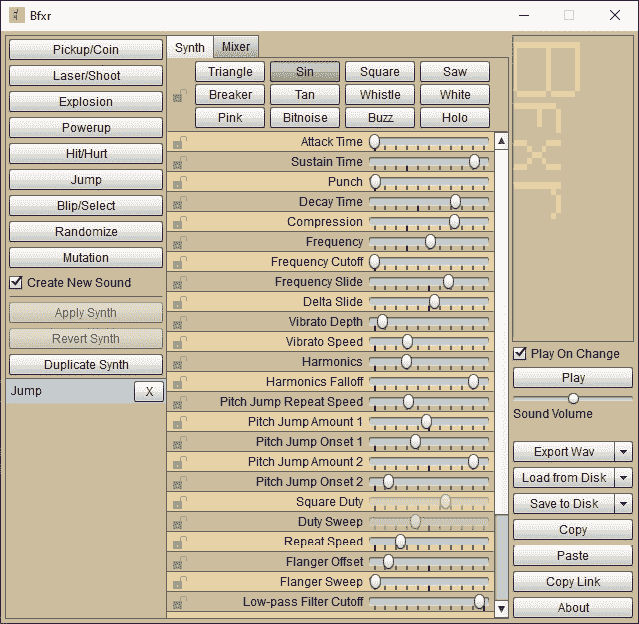
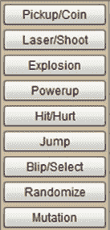
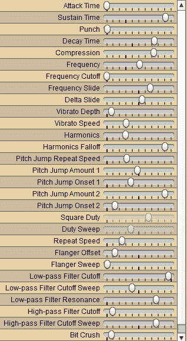
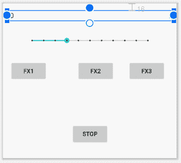
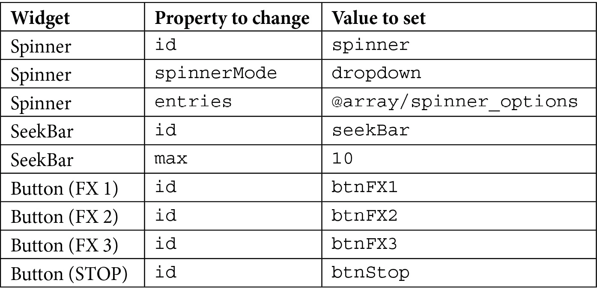

# *第 23 章*:支持不同版本的安卓、音效和 Spinner Widget

在本章中，我们将学习如何检测和处理不同版本的安卓系统。然后，我们将能够研究`SoundPool`类以及我们使用它的不同方式，这取决于应用运行的设备的安卓版本。在这一点上，我们可以把我们所学的一切都投入到制作一个很酷的声音演示应用中，这也将向我们介绍一个新的用户界面小部件， **Spinner** 。

总之，在本章中，我们将涵盖以下内容:

*   学习如何处理不同版本的安卓系统
*   学习如何使用安卓`SoundPool`课程
*   同样使用`SpinnerView`小部件编写基于声音的应用

我们开始吧。

# 处理不同版本的安卓

在这本书的大部分时间里，我们没有注意支持旧的安卓设备，主要原因是我们一直在使用的应用编程接口的所有最新部分都在如此高比例的设备上工作(超过 99%)，以至于看起来不值得。除非你打算在古代安卓遗迹的应用中开辟一个利基市场，否则这似乎是一个明智的方法。然而，关于播放声音，安卓应用编程接口有一些相对较新的修改。

实际上，这并不是什么大不了的事情，因为比这新的设备仍然可以使用旧的应用编程接口。但是专门处理兼容性上的这些差异是一个很好的做法，因为最终有一天，旧的部分可能在新版本的安卓系统上不起作用。

此时此地讨论这个问题的主要原因是，安卓前后棒棒糖声音处理的细微差异给了我们一个很好的借口，看看我们如何在代码中处理这样的事情。

我们将看到我们如何让我们的应用兼容最新的设备和棒棒糖之前的设备。

我们将要用来制造噪音的班级是`SoundPool`班。首先，让我们看一些检测当前安卓版本的简单代码。

## 检测当前安卓版本

我们可以使用`Build.Version`类的静态变量来确定安卓的当前版本，并且我们可以通过将其与那个版本的适当`Build.VERSION_CODES`变量进行比较来确定它是否比特定版本新。如果这个解释有点牵强，看看我们如何确定当前版本是等于还是比棒棒糖新(更大):

```java
if (Build.VERSION.SDK_INT >= Build.VERSION_CODES.LOLLIPOP) {

   // Lollipop or newer code goes here 

} else {
   // Code for devices older than lollipop here

}
```

现在让我们看看如何用比棒棒糖更新，然后更旧的安卓设备制造一些噪音。

# 音池类

`SoundPool`类允许我们保持和操纵一组声音效果——字面上是一个声音池。类处理从解压缩声音文件如`.wav`或`.ogg`到通过整数标识保存对它的识别引用，当然还有播放声音的所有事情。当声音播放时，它是以非阻塞的方式(使用幕后的线程)进行的，不会干扰我们的应用的平稳运行或我们的用户与它的交互。

我们需要做的第一件事是将音效添加到游戏项目的`main`文件夹中一个名为`assets`的文件夹中。我们很快就会真正做到这一点。

接下来，在我们的 Java 代码中，声明一个`SoundPool`类型的对象和一个`int`作为我们打算使用的每个音效的标识。我们还声明了另一个名为`nowPlaying`的`int`，我们可以使用它来跟踪当前正在播放的声音，我们将很快看到如何做到这一点:

```java
// create an ID
SoundPool sp;
int nowPlaying =-1;
int repeats = 2;
int idFX1 = -1;
float volume = 1;// Volumes rage from 0 through 1
```

现在，我们将根据设备使用的安卓版本，看看初始化`SoundPool`的两种不同方式。这是使用我们的方法为不同版本的安卓系统编写不同代码的绝佳机会。

## 以新的方式初始化音池

新的方式包括我们使用一个`AudioAttributes`对象来设置我们想要的声音池的属性。

在第一个代码块中，我们使用链接并在一个对象上调用四个独立的方法来初始化我们的`AudioAttributes`对象(`audioAttributes`):

```java
// Instantiate a SoundPool dependent on Android version
if (Build.VERSION.SDK_INT >= Build.VERSION_CODES.LOLLIPOP) {

   // The new way
   // Build an AudioAttributes object
AudioAttributes audioAttributes = 
      // First method call
new AudioAttributes.Builder()
// Second method call
         .setUsage
         (AudioAttributes.USAGE_ASSISTANCE_SONIFICATION)
          // Third method call
          .setContentType
          (AudioAttributes.CONTENT_TYPE_SONIFICATION)
          // Fourth method call
          .build();// Yay! A semicolon
   // Initialize the SoundPool
   sp = new SoundPool.Builder()
         .setMaxStreams(5)
         .setAudioAttributes(audioAttributes)
         .build();
} 
```

在代码中，我们使用链接和这个类的`Builder`方法来初始化一个`AudioAttributes`对象，让它知道它将用于与`USAGE_ASSISTANCE_SONIFICATION`的用户界面交互。

我们还使用`CONTENT_TYPE_SONIFICATION`值，它让类知道它用于响应声音，例如，用户按钮点击、碰撞或类似的情况。

现在我们可以通过传入`AudioAttributes`对象(`audioAttributes`)和我们可能想要播放的最大同时声音数量来初始化`SoundPool` ( `sp`)本身。

第二个代码块链接另外四个方法来初始化`sp`，包括对`setAudioAttributes`的调用，该调用使用了我们在前面链接的方法块中初始化的`audioAttributes`对象。

现在我们可以编写一个`else`代码块，当然，它将拥有旧的做事方式的代码。

## 用老方法初始化音池

不需要`AudioAttributes`对象；只需通过传入同步声音的数量来初始化`SoundPool` ( `sp`)。最后一个参数是音质，通过`0`就是我们需要做的。这比新方法简单得多，但在我们可以做出的选择方面也不那么灵活:

```java
else {
   // The old way
   sp = new SoundPool(5, AudioManager.STREAM_MUSIC, 0);
}
```

注意

我们可以使用旧的方式，新版本的安卓可以处理它。然而，我们会得到一个关于使用不推荐使用的方法的警告。官方文件是这么说的。

此外，正如我们所看到的，新方法提供了更多的功能。无论如何，这是一个很好的借口，看看一些简单的代码来处理不同版本的安卓。

现在我们可以将声音文件加载(解压缩)到我们的`SoundPool`中。

### 将声音文件加载到内存

与我们的线程控制一样，我们需要将代码包装在`try` - `catch`块中。这很有意义因为读取文件可能会因为我们无法控制的原因而失败，但是我们也被迫这样做，因为我们使用的方法抛出了一个异常，否则我们编写的代码将无法编译。

在`try`块中，我们声明并初始化一个`AssetManager`和`AssetFileDescriptor`类型的对象。

使用`AssetManager`对象的`openFd`方法初始化`AssetFileDescriptor`实例，实际上是解压缩声音文件。然后，我们在将`AssetFileDescriptor`的内容加载到我们的`SoundPool`中的同时，初始化我们的 ID ( `idFX1`)。

`catch`块只是向控制台输出一条消息，让我们知道是否出了问题。请注意，无论安卓版本如何，这段代码都是相同的:

```java
try{

   // Create objects of the 2 required classes
   AssetManager assetManager = this.getAssets();
   AssetFileDescriptor descriptor;
   // Load our fx in memory ready for use
   descriptor = assetManager.openFd("fx1.ogg");
   idFX1 = sp.load(descriptor, 0);
}catch(IOException e){

   // Print an error message to the console
   Log.d("error", "failed to load sound files");
}
```

我们准备制造一些噪音。

### 播放声音

在这一点上，在我们的`SoundPool`实例中有一个音效，我们有一个可以引用它的 ID。

不管我们如何构建`SoundPool`对象，这段代码都是一样的，这就是我们播放声音的方式。请注意，在下一行代码中，我们使用播放声音的同一方法的返回值来初始化`nowPlaying`变量。

因此，以下代码同时播放声音并将正在播放的 ID 值加载到`nowPlaying`中:

```java
nowPlaying = sp.play(idFX1, volume, volume, 0, repeats, 1);
```

注意

不需要在`nowPlaying`中存储 ID 来播放声音，但是它有它的用途，正如我们现在将要看到的。

`play`方法的参数如下:

*   音效的识别码
*   左扬声器音量和右扬声器音量
*   优先于其他声音
*   重复声音的次数
*   播放的速率/速度(1 是正常速率)

在我们制作声音演示应用之前，还有一件事。

### 停止声音

还在玩`stop`法的时候停个音也是很琐碎的。请注意，在任何给定时间都可能有多个音效在播放，因此`stop`方法需要音效的 ID 来停止:

```java
sp.stop(nowPlaying);
```

当你调用`play`时，如果你想让跟踪它，你只需要存储当前播放声音的 ID，这样你就可以在以后与它交互。我们很快就会看到，在 Pong 游戏中播放声音的代码看起来更像这样:

```java
sp.play(mBeepID, 1, 1, 0, 0, 1);
```

前一行代码将简单地以最低优先级以全音量播放所选的声音(`mBeepID`)，直到它以正常速度无重复结束。

现在我们可以制作声音演示应用了。

# 声音演示应用，介绍 Spinner 小部件

当然，关于音效，我们需要一些真实的声音文件。你可以用 Bfxr(下一个解释)制作你自己的或者使用提供的。该应用的音效在 [*第 23 章*](#_idTextAnchor400) `/Sound Demo`文件夹的`assets`下载包中。但是你可以自己做。

## 制作音效

有一款名为 Bfxr 的开源应用，可以让我们自己制作音效。这里有一个非常快速的使用 Bfxr 制作自己的音效的指南。从[www.bfxr.net](http://www.bfxr.net)手里拿一份免费的。

注意

请注意，声音演示应用的音效是在 [*第 23 章*](#_idTextAnchor400) `/assets`文件夹中提供给您的。除非你想，否则你不必创造自己的音效。获得这个免费软件并学习如何使用它仍然是值得的。

按照网站上的简单说明进行设置。试着做一些这样的事情来产生很酷的声音效果:

注意

这是一个非常浓缩的教程。你可以用 Bfxr 做更多的事情。要了解更多信息，请阅读网站上前一个网址的提示。如果您在下载 Bfxr 时遇到任何问题，您可以使用该网站来创建您所有的音效，或者只使用提供的示例。

1.  Run Bfxr:

    

    图 23.1-bfxr page

2.  Try out all the preset types that generate a random sound of that type. When you have a sound that is close to what you want, move on to the next step:

    

    图 23.2–不同的效果

3.  Use the sliders to fine-tune the pitch, duration, and other aspects of your new sound:

    

    图 23.3–微调您的声音

4.  Save your sound by clicking the **Export Wav** button. Despite the text of this button, as we will see, we can save in formats other than `.wav` too:

    

    图 23.4–导出 Wav 按钮

5.  安卓在 OGG 格式的声音上工作得非常好，所以当被要求给你的文件命名时，在文件名的末尾使用`.ogg`扩展名。
6.  重复*第 2 步*到*第 5 步*创建三种酷炫音效。将它们命名为`fx1.ogg`、`fx2.ogg`和`fx3.ogg`。我们使用`.ogg`文件格式，因为它比 WAV 等格式更压缩。

一旦你的声音文件准备好了，我们就可以使用这个应用了。

## 布置声音演示

我将比以前的项目更简洁地描述我们正在习惯的项目部分。然而，每次有一个新概念，我一定会完整地解释它。我想现在你可以把一些小部件拖到一个`ConstraintLayout`上并改变它们的`text`属性了。

完成以下步骤。如果您有任何问题，可以在下载包的 [*第 23 章*](#_idTextAnchor400) 文件夹中复制或查看代码:

1.  创建一个新项目，称之为`Sound Demo`，选择**空活动**模板，将所有其他设置保留为默认值，删除 **Hello world！** `TextView`来自`activity_main.xml`文件。
2.  Now we will build a layout in the `activity_main.xml` file, so be sure to be in design view. In this order, from top to bottom then left to right, drag a **Spinner** from the **Containers** category, a **SeekBar** **(discrete)** from the **Widgets** category, and four Buttons from the palette onto the layout, arranging and resizing them and setting their `text` properties as shown in the next screenshot:

    

    图 23.5–在 activity_main.xml 文件中构建布局

3.  单击**推断约束**按钮。
4.  Use the following table to set their properties:

    

5.  接下来，将以下高亮显示的代码添加到`values`文件夹的`strings.xml`文件中。我们在上一步中使用了这个名为`spinner_options`的字符串资源数组作为`options`属性。它将代表可以从我们的`Spinner`小部件中选择的选项:

    ```java
    <resources>
        <string name="app_name">Sound Demo</string>
        <string name="hello_world">Hello world!</string>
        <string-array name="spinner_options">
          <item>0</item>
          <item>1</item>
          <item>3</item>
          <item>5</item>
          <item>10</item>
        </string-array>
        </resources>
    ```

现在运行该应用，您最初不会看到我们以前没有看到过的任何内容。然而，如果你点击微调器，你会看到我们的字符串数组中的选项`spinner_options`。我们可以使用微调器来控制播放时声音效果重复的次数:


图 23.6–微调选项

让我们编写Java 代码来使这个应用工作，包括我们如何与微调器交互。

使用操作系统的文件浏览器，转到项目的`app\src\main`文件夹，添加一个名为`assets`的新文件夹。

在下载包的 [*第 23 章*](#_idTextAnchor400) `/assets`文件夹中有三个为你准备好的声音文件。将这三个文件放入您刚刚创建的资产目录中，或者使用您自己创建的文件。重要的是它们的文件名是`fx1.ogg`、`fx2.ogg`和`fx3.ogg`。

## 对声音演示进行编码

首先，我们将更改类声明，这样我们就可以有效地处理与所有小部件的交互。编辑声明以实现`View.OnClickListener`，如下图所示:

```java
public class MainActivity extends AppCompatActivity 
implements View.OnClickListener {
```

我们将很快添加所需的`onClick`方法。

现在，我们为我们的`SoundPool`、音效 id、`nowPlaying int`添加一些成员变量，如前所述，我们还将添加一个`float`来保存`0`(静音)和`1`(相对于设备当前音量的全音量)之间的音量值。我们还将添加一个名为`repeats`的`int`，它不出所料地保存了我们重复给定音效的次数值:

```java
SoundPool sp;
int idFX1 = -1;
int idFX2 = -1;
int idFX3 = -1;
int nowPlaying = -1;
float volume = .1f;
int repeats = 2;
```

现在，在`onCreate`方法中，我们可以获得一个引用，并以通常的方式为我们的按钮设置一个点击监听器。将以下代码添加到项目中:

```java
Button buttonFX1 = findViewById(R.id.btnFX1);
buttonFX1.setOnClickListener(this);
Button buttonFX2 = findViewById(R.id.btnFX2);
buttonFX2.setOnClickListener(this);
Button buttonFX3 = findViewById(R.id.btnFX3);
buttonFX3.setOnClickListener(this);
Button buttonStop = findViewById(R.id.btnStop);
buttonStop.setOnClickListener(this);
```

还是在`onCreate`中，我们可以基于设备正在使用的安卓版本来初始化我们的`SoundPool` ( `sp`)。将以下代码添加到项目中:

```java
// Instantiate our SoundPool based on the version of Android
if (Build.VERSION.SDK_INT >= Build.VERSION_CODES.LOLLIPOP) {
   AudioAttributes audioAttributes = 
      new AudioAttributes.Builder()
   .setUsage(AudioAttributes. 
   USAGE_ASSISTANCE_SONIFICATION)

   .setContentType(
   AudioAttributes.CONTENT_TYPE_SONIFICATION)
                .build();
   sp = new SoundPool.Builder()
                .setMaxStreams(5)
                .setAudioAttributes(audioAttributes)
                .build();
} else {
   sp = new SoundPool(5, AudioManager.STREAM_MUSIC, 0);
}
```

注意

使用您喜欢的方法为之前的代码添加以下`import`语句:

`import android.media.AudioAttributes;`

`import android.media.AudioManager;`

`import android.media.SoundPool;`

`import android.os.Build;`

`import android.view.View;`

`import android.widget.Button;`

接下来，我们依次加载每个音效，并用一个值初始化我们的标识，该值指向我们加载到`SoundPool`中的相关音效。整个东西按照要求包裹在`try` - `catch`块里。将以下代码添加到项目中:

```java
try{
   // Create objects of the 2 required classes
   AssetManager assetManager = this.getAssets();
   AssetFileDescriptor descriptor;
   // Load our fx in memory ready for use
   descriptor = assetManager.openFd("fx1.ogg");
   idFX1 = sp.load(descriptor, 0);
   descriptor = assetManager.openFd("fx2.ogg");
   idFX2 = sp.load(descriptor, 0);
   descriptor = assetManager.openFd("fx3.ogg");
   idFX3 = sp.load(descriptor, 0);
}catch(IOException e){
   // Print an error message to the console
   Log.e("error", "failed to load sound files");
}
```

注意

使用您喜欢的方法为之前的代码添加以下`import`语句:

`import android.content.res.AssetFileDescriptor;`

`import android.content.res.AssetManager;`

`import android.util.Log;`

`import java.io.IOException;`

然后我们看看如何处理`SeekBar`小部件。正如您可能已经预料到的，我们将使用匿名类。我们使用`OnSeekBarChangeListener`类并覆盖`onProgressChanged`、`onStartTrackingTouch`和`onStopTrackingTouch`方法。

我们只需要给`onProgressChanged`方法添加代码。在这个方法中，我们只需改变音量变量的值，然后在我们的`SoundPool`对象上使用`setVolume`方法，传入当前播放的音效和左右声道的音量。将以下代码添加到项目中:

```java
// Now setup the seekbar
SeekBar seekBar = findViewById(R.id.seekBar);
seekBar.setOnSeekBarChangeListener(new SeekBar.OnSeekBarChangeListener() {
   @Override
   public void onProgressChanged(SeekBar seekBar, 
   int value, boolean fromUser) {
         volume = value / 10f;
         sp.setVolume(nowPlaying, volume, volume);
   }
   @Override
   public void onStartTrackingTouch(SeekBar seekBar) {
   }
   @Override
   public void onStopTrackingTouch(SeekBar seekBar) {
   }
});
```

注意

使用您喜欢的方法为之前的代码添加以下`import`语句:

`import android.widget.SeekBar;`

在`SeekBar`代码之后是`Spinner`代码和另一个处理用户交互的匿名类。我们使用`AdapterView.OnItemSelectedListener`来覆盖`onItemSelected`和`onNothingSelected`方法。

我们所有的代码都进入`onItemSelected`方法，该方法创建一个名为`temp`的临时字符串，然后使用`Integer.ValueOf`方法将该字符串转换为`int`，我们可以使用该字符串来初始化`repeats`变量。将以下代码添加到项目中:

```java
// Now for the spinner
final Spinner spinner = (Spinner) findViewById(R.id.spinner);
spinner.setOnItemSelectedListener(
new AdapterView.OnItemSelectedListener() {
   @Override
   public void onItemSelected(AdapterView<?> 
   parentView, View selectedItemView, 
   int position, long id) {
         String temp = String.valueOf(
         spinner.getSelectedItem());
         repeats = Integer.valueOf(temp);
   }
   @Override
   public void onNothingSelected(AdapterView<?> parentView) {

   }
});
```

注意

使用您喜欢的方法为之前的代码添加以下`import`语句:

`import android.widget.AdapterView;`

`import android.widget.Spinner;`

那是从`onCreate`开始的一切。

现在实现`onClick`方法，因为这个类实现了`View.OnClickListener`接口，所以需要这个方法。很简单，每个按钮都有一个`case`语句。有一个`case`语句可以播放我们的三种音效，设置音量，设置重复次数。请注意，每次调用`play`的返回值都存储在`nowPlaying`中。当用户按下 **STOP** 按钮时，我们简单地用`nowPlaying`的当前值调用`stop`，导致最近开始的声音效果停止。将以下代码添加到项目中:

```java
@Override
public void onClick(View v) {
   switch (v.getId()){
         case R.id.btnFX1:
                sp.stop(nowPlaying);
                nowPlaying = sp.play(idFX1, volume, 
                volume, 0, repeats, 1);
                break;
         case R.id.btnFX2:
                sp.stop(nowPlaying);
                nowPlaying = sp.play(idFX2, 
                volume, volume, 0, repeats, 1);
                break;
         case R.id.btnFX3:
                sp.stop(nowPlaying);
                nowPlaying = sp.play(idFX3, 
                volume, volume, 0, repeats, 1);
                break;
         case R.id.btnStop:
                sp.stop(nowPlaying);
                break;
   }
}
```

我们现在可以运行该应用。如果听不到任何声音，请确保设备上的音量已调高。

单击您想要播放的声音效果对应的按钮。改变音量和重复的次数，当然，尝试用**停止**按钮停止。

另请注意，当一个声音效果已经在播放时，您可以重复点击多个播放按钮，声音将同时播放，直到我们设置的最大流数(`5`)。

# 总结

在这一章中，我们仔细研究了`SoundPool`类，包括我们如何检测用户拥有哪个版本的安卓系统，并相应地改变我们的代码。然后，我们使用所有这些知识来完成声音演示应用。

在下一章中，我们将学习如何让我们的应用使用多种不同的布局。