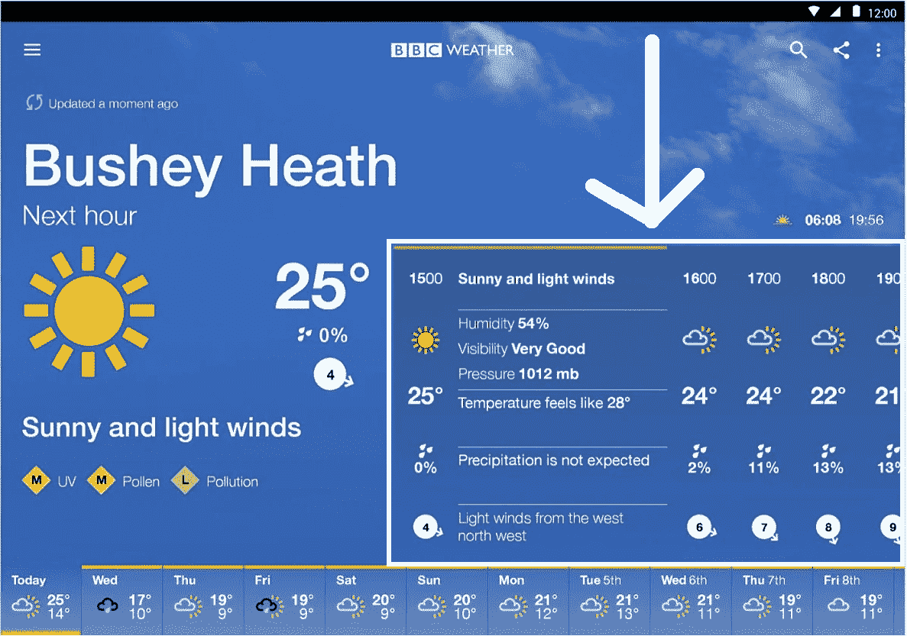
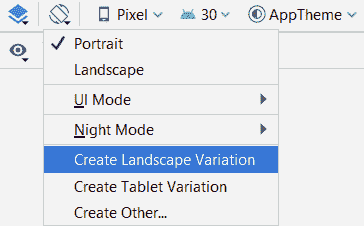
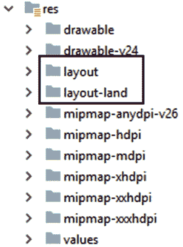
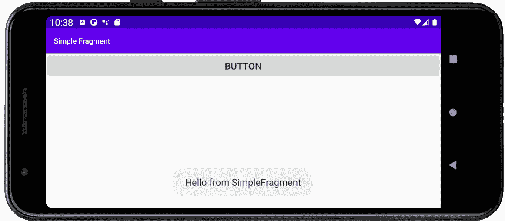

# *第 24 章*:设计模式、多重布局和片段

从我们刚刚建立AndroidStudio开始，我们已经走了很长一段路。当时，我们一步一步地经历了一切，但随着我们的进行，我们不仅试图展示如何将 x 添加到 y 或将功能 a 添加到 app b，还试图让您能够以自己的方式使用所学知识，将自己的想法付诸实践。

乍一看，这一章可能看起来枯燥和技术性，但这一章更多的是关于你未来的应用程序，而不是书中迄今为止的任何内容。我们将研究 Java 和 Android 的几个方面，您可以将其用作框架或模板，在保持代码可管理的同时，制作出更加令人兴奋和复杂的应用程序。这是现代应用成功的关键。此外，我将建议进一步研究的领域，这些领域在本书中根本没有足够的空间来触及表面。

在本章中，我们将了解以下内容:

*   模式和模型-视图-控制器
*   安卓设计指南
*   开始使用真实世界的设计并处理多种不同的设备
*   碎片导论

我们开始吧。

# 技术要求

你可以在[https://GitHub . com/PacktPublishing/Android-初学者编程-第三版/tree/main/章节%2024](https://github.com/PacktPublishing/Android-Programming-for-Beginners-Third-Edition/tree/main/chapter%2024) 找到本章中出现的代码文件。

# 引入模型-视图-控制器模式

模型-视图-控制器模式包括将我们应用程序的不同方面分离成称为层的不同部分。安卓应用通常使用模型-视图-控制器模式。模式简单来说就是构造我们的代码和其他应用程序资源(如布局文件、图像、数据库等)的公认方式。

模式对我们来说是有用的，因为通过遵循一种模式，我们可以更加自信我们正在做正确的事情，并且不太可能不得不撤销许多艰苦的工作，因为我们已经把自己编码到了一个尴尬的境地。

计算机科学中有许多模式，但是对**模型-视图-控制器** ( **MVC** )的理解将足以创建一些专业构建的安卓应用程序。

我们已经部分使用了 MVC，所以让我们依次看看这三层:

*   **模型**:模型是指驱动我们的应用程序的数据，以及任何专门管理它并使它对其他层可用的逻辑/代码。例如，在我们的自我注释应用程序中，`Note`类及其获取器、设置器和 JSON 代码就是数据和逻辑。
*   **视图**:给 Self 应用的注释视图是所有不同布局的所有小部件。用户在屏幕上看到的或与之交互的任何东西通常都是视图的一部分。您可能还记得小部件来自安卓应用编程接口的`View`类层次结构。
*   **Controller**: The controller is the bit in between the view and the model. It interacts with both and keeps them separate. It contains what is known in geek speak as the application logic. If a user taps a button, the application layer decides what to do about it. When the user clicks **OK** to add a new note, the application layer listens for the interaction on the view layer. It captures the data contained in the view and passes it to the model layer.

    注意

    设计模式是一个巨大的话题。有许多不同的设计模式，如果你想对这个主题有一个初学者友好的介绍，我会推荐*头部优先设计模式*。如果你真的想深入设计模式的世界，那么你可以试试*设计模式:可重用面向对象软件的元素*，这是一种公认的设计模式甲骨文，但更难阅读。

随着这本书的进展，我们也将开始利用更多我们已经讨论过但还没有完全受益的面向对象编程方面。我们会一步一步来。

# 安卓设计指南

应用程序设计是一个巨大的话题。这是一个只能在自己的书中开始教授的话题。同样，就像编程一样，你只有通过不断的练习、回顾和改进，才能开始擅长应用程序设计。

那么，我说的设计到底是什么意思呢？我说的是你把小部件放在屏幕上的什么位置，哪些小部件，它们应该是什么颜色，它们应该有多大，如何在屏幕之间过渡，滚动页面的最佳方式，何时使用哪些动画插值器，你的应用应该分成哪些屏幕，等等。

这本书希望能让你有足够的资格去实现你对以上问题的所有选择。可惜没有篇幅，作者大概也没有本事，来教大家如何*做出*那些选择。

注意

你可能会想，“我该怎么办？”继续制作应用，不要让缺乏设计经验和知识阻止你！甚至将你的应用发布到应用商店。然而，请记住，如果你的应用程序要真正成为世界级的，还有另一个主题——设计——需要注意。

即使是中型开发公司，设计师也很少是程序员，即使是非常小的公司也会经常外包他们应用程序的设计(或者设计师可能外包编码)。

设计既是艺术也是科学，谷歌已经证明，他们认识到这一点，为现有设计师和有抱负的新设计师提供高质量的支持。

注意

我强烈建议您访问并标记此网页:[https://developer.android.com/design/](https://developer.android.com/design/)。它相当详细和全面，完全以安卓为中心，并且以图像、调色板和指南的形式拥有大量资源。

将理解设计原则作为短期目标。让提高你的实际设计技能成为一项持续的任务。访问和阅读以设计为中心的网站，尝试并实现你觉得令人兴奋的想法。

然而，最重要的是，不要等到你是设计专家时才制作应用程序。不断将你的想法付诸实践并发表出来。让每个应用程序都比上一个设计得好一点。

我们将在接下来的章节中看到，并且已经看到，安卓应用编程接口为我们提供了一大堆超级时尚的用户界面，我们可以用很少的代码或设计技巧来利用它们。这些用户界面对让你的应用看起来像是由专业人士设计的大有帮助。

# 真实世界的应用

到目前为止，我们已经构建了十几个或更多不同复杂程度的应用程序。其中大部分是我们在手机上设计和测试的。

当然，在现实世界中，我们的应用程序需要在任何设备上运行良好，并且必须能够处理在纵向或横向视图中(在所有设备上)发生的情况。

此外，我们的应用程序仅仅在不同的设备上工作并看起来“正常”往往是不够的。通常情况下，我们的应用程序需要*以不同的方式运行*，并根据设备是手机还是平板电脑以及横向/纵向来呈现明显不同的用户界面。

注意

安卓通过穿戴应用编程接口支持大屏幕电视、智能手表、虚拟现实和增强现实的应用，以及物联网的“物”。我们不会在这本书里讨论后两种情况，但是到了书的结尾，作者猜测，如果你愿意，你会有足够的准备去探索这些话题。

请看这张在安卓手机上纵向运行的 BBC 天气应用的截图。查看基本布局，同时研究显示的信息，我们稍后会将其与平板电脑应用进行比较:


图e 24.1–在安卓手机上纵向运行的英国广播公司天气应用

就目前而言，上一张截图的目的与其说是向你展示具体的 UI 功能，不如说是让你与下一张截图进行对比。看看平板电脑上横向运行的完全相同的应用:



图 24.2–在安卓手机上横向运行的英国广播公司天气应用

请注意，与手机应用程序相比，平板电脑用户界面有一个额外的信息面板。这个额外的面板在前面的截图中突出显示。

这个截图的重点不在于具体的用户界面，甚至不在于我们如何实现一个类似的用户界面，而在于用户界面如此不同，以至于它们很容易被认为是完全不同的应用程序。然而，如果你下载这款应用，平板电脑和手机的下载是一样的。

安卓允许我们设计像这样的真实应用，不仅不同设备类型/方向/大小的布局不同，而且(这很重要)行为也不同。使这成为可能的安卓秘密武器是`Fragments`。

谷歌表示:

“片段表示活动中的行为或用户界面的一部分。您可以在单个活动中组合多个片段来构建多窗格用户界面，并在多个活动中重用一个片段。

您可以将片段视为活动的模块化部分，它有自己的生命周期，接收自己的输入事件，并且您可以在活动运行时添加或删除它(有点像“子活动”，您可以在不同的活动中重用它)。

片段必须始终嵌入到活动中，并且片段的生命周期直接受到宿主活动生命周期的影响。"

我们可以在不同的 XML 文件中设计多个不同的布局，我们很快就会这样做。我们还可以在我们的 Java 代码中检测设备方向和屏幕分辨率之类的东西，这样我们就可以动态地做出布局决策。

让我们使用设备检测来尝试一下，然后我们将第一次看到碎片。

# 设备检测小应用

学习检测和响应设备及其不同属性(屏幕、方向等)的最佳方法是制作一个简单的应用程序:

1.  创建一个新的**空活动**项目，并将其称为`Device Detection`。将所有其他设置保留为默认值。
2.  打开设计选项卡中的`activity_main.xml`文件，删除默认的 **Hello world！** `TextView`。
3.  将**按钮**拖到屏幕顶部，并将其 **onClick** 属性设置为`detectDevice`。我们将在一分钟内对这个方法进行编码。
4.  将两个**文本视图**小部件拖到布局上，一个在另一个的下方，并将它们的 **id** 属性设置为`txtOrientation`和`txtResolution`。
5.  Check you have a layout that looks something like this next screenshot:

    注意

    我已经拉伸了我的小部件(主要是水平方向)，并将`textSize`属性增加到`24sp`以使它们在屏幕上更加清晰，但这不是应用程序正常工作所必需的。

    

    图 24.3–布局检查

6.  点击**推断约束**按钮，确保用户界面元素的位置。

现在我们将做一些新的事情。我们将建立一个专门面向风景的布局。

在 Android Studio 中，确保在编辑器中选择了`activity_main.xml`文件，并找到**方向进行预览**按钮，如下图所示:



图 24.4–创造景观变化

单击它，然后选择**创建景观变化**。

现在你有了一个新的布局 XML 文件，同名但以横向模式定位。布局在编辑器中显示为空白，但正如我们将看到的，情况并非如此。查看项目浏览器中的`layout`文件夹，注意到确实有两个名为`activity_main`的文件，其中一个(我们刚刚创建的新文件)后缀为 **land** 。这显示在下一张截图中:


图 24.5–活动 _ 主文件夹

选择这个新文件(后缀为**和**的文件)，现在查看组件树。下图为下一张截图:


图 24.6–组件树

似乎布局已经包含了我们所有的小部件——我们只是在设计视图中看不到它们。出现这种异常的原因是，当我们创建横向布局时，AndroidStudio复制了纵向布局，包括所有的约束。纵向限制很少与横向限制相匹配。

要解决问题，点击**移除所有约束**按钮；它是**推断约束**按钮左边的按钮。用户界面现在不受约束。所有的 UI 小部件都会乱糟糟的出现在左上角。一次一个，重新排列它们，看起来像下一张截图。我必须手动添加约束来使这个设计工作，所以我在下面的截图中显示了约束:


图 24.7–添加约束

单击**推断约束**按钮或手动设置约束，选择最适合您的选项。如果您在重新创建该布局时遇到任何问题，那么您可以从 [*第 24 章*](#_idTextAnchor411) `/Device Detection/layout-land`文件夹中的下载包中抓取代码。

注意

只要你能看到两个`TextView`小部件的内容并点击按钮，外观并不重要。

现在我们有了两个不同方向的基本布局，我们可以将注意力转向 Java 编码。

## 对主要活动类进行编码

在`MainActivity`类声明之后添加以下成员变量，以保存对我们的两个`TextView`小部件的引用:

```java
private TextView txtOrientation;
private TextView txtResolution;
```

注意

此时导入`TextView`类:

`import android.widget.TextView;`

现在，在`MainActivity`类的`onCreate`方法中，在调用`setContentView`之后，添加以下代码:

```java
// Get a reference to our TextView widgets
txtOrientation = findViewById(R.id.txtOrientation);
txtResolution = findViewById(R.id.txtResolution);
```

在`onCreate`之后，添加处理我们的按钮点击并运行我们的检测代码的方法:

```java
public void detectDevice(View v){
   // What is the orientation?
   Display display = 
   getWindowManager().getDefaultDisplay();
   txtOrientation.setText("" + display.getRotation());
   // What is the resolution?
   Point xy = new Point();
   display.getSize(xy);
   txtResolution.setText("x = " + xy.x + " y = " + xy.y);
}
```

注意

导入以下三个类:

`import android.graphics.Point;`

`import android.view.Display;`

`import android.view.View;`

这段代码的工作原理是声明并初始化一个名为`display`的`Display`类型的对象。这个对象(`display`)现在保存了一大堆关于设备特定显示属性的数据。

`getRotation`方法的结果输出到顶部的`TextView`小部件中。

然后代码初始化一个名为`xy`的类型为`Point`的对象。然后`getSize`方法将屏幕分辨率加载到`xy`中。然后使用`setText`方法将水平(`xy.x`)和垂直(`xy.y`)分辨率输出到`TextView`小部件中。

注意

你可能记得我们在儿童绘画应用中使用了`Display`和`Point`课程。

每次点击按钮，两个`TextView`小部件都会更新。

### 解锁屏幕方向

在运行应用程序之前，我们希望确保设备没有锁定在纵向模式(大多数新手机默认情况下都是)。从模拟器(或您将使用的设备)的应用程序抽屉中，点击**设置**应用程序，选择**显示**，并使用开关将**自动旋转屏幕**设置为打开。我已经在下一张截图中展示了这个设置:


图 24.8–自动旋转屏幕

## 运行应用

现在你可以运行应用并点击按钮:


图 24.9–点击按钮

使用模拟器控制面板上的旋转按钮之一将设备旋转至横向:


图 24.10–旋转设备

注意

也可以在 PC 上使用 *Ctrl* + *F11* 或者在 Mac 上使用*Ctrl*+*FN*+*F11*。

现在，再次单击按钮，您将看到横向布局在起作用:


图 24.11–横向布局

你可能会注意到的第一件事是，当你旋转屏幕时，它会短暂地变成空白。这是活动重启并再次调用`onCreate`方法——这正是我们需要的。它在布局的横向版本上调用`setContentView`方法，`MainActivity`中的代码引用了具有相同标识的小部件，因此完全相同的代码可以工作。

注意

不要花太长时间思考这个问题，因为我们将在本章后面讨论它。

如果 0 和 1 结果在设备方向上不太明显，它们指的是`Surface`类的`public static final`变量–`Surface.ROTATION_0`等于 0，`Surface.ROTATION_180`等于 1。

注意

请注意，如果您将屏幕向左旋转，那么您的值将是 1–与我的值相同，但是如果您将其向右旋转，您将看到值 3。如果将设备上下颠倒旋转到纵向模式，您将获得值 4。

我们可以根据这些检测测试的结果编写一个`switch`块，并加载不同的布局。

但是正如我们刚刚看到的，安卓通过允许我们将特定的布局添加到带有配置限定符的文件夹中，比如 **land** ，风景的简称，让这变得更简单。

# 配置限定符

我们已经在 [*第三章*](03.html#_idTextAnchor064)*中遇到了`layout-large`和`layout-xhdpi`等配置限定词，探索AndroidStudio和项目结构*。在这里，我们将刷新和扩展我们对它们的理解。

我们可以开始通过使用配置限定符来消除对控制器层的依赖，从而影响应用程序布局。有大小、方向和像素密度的配置限定符。为了利用配置限定符，我们只需以通常的方式设计一个布局，针对我们的首选配置进行优化，然后将该布局放在一个文件夹中，该文件夹的名称被安卓识别为适用于该特定配置。

例如，在之前的应用中，在`land`文件夹中放置一个布局，告诉安卓在设备处于横向时使用该布局。

很可能上述说法会显得有些模棱两可。这是因为AndroidStudio**项目浏览器**窗口向我们展示了一个不完全符合现实的文件和文件夹结构——它试图简化事情并“帮助”我们。如果您从**项目浏览器**窗口顶部的下拉列表中选择**项目文件**选项，然后检查项目内容，您确实会看到有一个`layout`和`layout-land`文件夹，如下所示:



图 24.12–布局和布置–陆地文件夹

切换回**安卓**视图，或者将其保留在**项目文件**视图中——无论您喜欢哪个。

因此，如果我们想要一个不同的 T2 风景和肖像布局，我们将在 T1 文件夹中创建一个名为 T0 的文件夹，并在其中放置我们特别设计的布局。

当设备处于纵向位置时，将使用来自`layout`文件夹的常规布局，当设备处于横向位置时，将使用来自`layout-land`文件夹的布局。

如果我们为不同尺寸的屏幕进行设计，我们会将布局放入具有以下名称的文件夹中:

*   `layout-small`
*   `layout-normal`
*   `layout-large`
*   `layout-xlarge`

如果我们为不同像素密度的屏幕进行设计，我们可以将 XML 布局放入具有如下名称的文件夹中:

*   `layout-ldpi`适用于低 DPI 设备
*   `layout-mdpi`适用于中等 DPI 设备
*   `layout-hdpi`适用于高 DPI 设备
*   `layout-xhdpi`用于超高 DPI 设备
*   `layout-xxhdpi`用于超高 DPI 设备
*   `layout-xxxhdpi`用于超超高 DPI 设备
*   `layout-nodpi`对于您尚未满足的 DPI 设备
*   `layout-tvdpi`用于电视

什么是低、高或超高 DPI 等可以在下一个信息框的链接中进行研究。这里的重点是校长。

值得指出的是我们刚刚讨论的内容远非配置限定符的全部内容，与设计一样，值得将其放在您的列表中进一步研究。

注意

通常，安卓开发者网站有很多关于处理不同设备布局的详细信息。更多信息请点击此链接:[https://developer . Android . com/guide/practices/screens _ support](https://developer.android.com/guide/practices/screens_support)。

## 配置限定符的限制

之前的应用程序和我们对配置限定符的讨论向我们展示了在许多情况下非常有用的东西。然而不幸的是，配置限定符和在代码中检测属性只能解决我们的 MVC 模式的视图层中的问题。

如上所述，我们的应用有时需要有不同的*行为*以及布局。这可能意味着我们的 Java 代码在控制器层中有多个分支(在我们以前的大多数应用程序中是`MainActivity`)，并且可能会召唤出噩梦般的景象:对于每个不同的场景，都有巨大的`if`或`switch`块，它们有不同的代码。

幸运的是，这不是怎么做到的。对于这样的情况，其实对于大多数应用来说，安卓都有碎片。

# 碎片

碎片可能会成为你制作的几乎每个应用程序的主食。它们是如此有用，有如此多的理由使用它们，而一旦你习惯了它们，它们是如此简单，几乎没有理由不使用它们。

就像任何类一样，片段是应用程序的可重用元素，但正如前面提到的，它们有特殊的功能，例如加载自己的视图/布局以及自己的生命周期方法的能力，这使得它们非常适合实现我们在*真实世界应用程序*部分讨论的目标，并且对于不同的设备具有不同的布局和代码(就像我们看到的天气应用程序)。

让我们深入挖掘片段，一次一个特征。

## 碎片也有生命周期

我们可以通过覆盖适当的生命周期方法来建立和控制片段，就像我们做活动一样:

*   `onCreate`:在`onCreate`方法中，我们可以初始化变量，做几乎所有我们在`Activity onCreate`方法中通常会做的事情。最大的例外是初始化我们的用户界面。
*   `onCreateView`:在这个方法中，顾名思义，我们将获得对我们的任何 UI 小部件的引用，设置匿名类来监听点击，此外还有更多，我们很快就会看到。
*   `onAttach`和`onDetach`:就在`Fragment`投入使用/停用之前调用这些方法。
*   `onResume`, `onStart`, `onPause`, and `onStop`: In these methods, we can take certain actions, such as creating or deleting objects or saving data, just like we have done with their `Activity` based counterparts.

    注意

    如果你想研究`Fragment`生命周期的细节，你可以在安卓开发者网站的这个链接上这样做:[https://developer.android.com/guide/components/fragments](https://developer.android.com/guide/components/fragments)。

这一切都很好，但是我们首先需要一种方法来创建我们的片段，并且能够在正确的时间调用这些方法。

## 使用片段管理器管理片段

`FragmentManager`类是`Activity`的一部分。我们用它来初始化一个`Fragment`，将碎片添加到活动布局，并结束一个`Fragment`。在之前，当我们初始化`FragmentDialog`时，我们短暂地看到了`FragmentManager`。

注意

不碰上`Fragment`类很难学到很多关于安卓的东西，就像不经常碰上 OOP/类很难学到很多关于 Java 的东西，等等。

下面突出显示的代码显示了我们如何使用`FragmentManager`(已经是`Activity`的一部分)作为参数来创建弹出对话框:

```java
button.setOnClickListener(new View.OnClickListener() {
   @Override
   public void onClick(View v) {
         // Create a new DialogShowNote called dialog
         DialogShowNote dialog = new DialogShowNote();

         // Send the note via the sendNoteSelected method
         dialog.sendNoteSelected(mTempNote);

         // Create the dialog
         dialog.show(getFragmentManager(), "123");
   }
});
```

当时，我要求您不要关心方法调用的参数。方法调用的第二个参数是`Fragment`的一个 ID。我们将看到如何更广泛地使用`FragmentManager`，以及如何使用`Fragment`身份证。

`FragmentManager`顾名思义。这里重要的是`Activity`只有一个`FragmentManager`，但是可以照顾很多碎片。这正是我们在单个应用程序中需要的多种行为和布局。

`FragmentManager`还调用其负责的片段的各种生命周期方法。这与安卓系统调用的`Activity`生命周期方法不同，但密切相关，因为`FragmentManager`调用许多`Fragment`生命周期方法*来响应被调用的*`Activity`生命周期方法。像往常一样，如果我们在每种情况下都做出适当的反应，我们不需要太担心何时以及如何。

注意

碎片将成为我们未来许多应用程序(如果不是全部的话)的基础部分。然而，正如我们对命名约定、字符串资源和封装所做的那样，我们不会将片段用于简单的学习目的或非常小的应用程序，因为它们会被过度使用。当然，当我们学习片段时，这是个例外。

# 我们的第一款碎片应用

让我们以最简单的可能的形式构建`Fragment`，这样我们就可以理解之前发生了什么，在后面的章节中，我们开始在所有地方产生真正有用的片段。

注意

我敦促所有读者完成并建立这个项目。从一个文件跳到另一个文件有很多，仅仅是阅读就能让它看起来比实际更复杂。当然，您可以复制并粘贴下载包中的代码，但也请按照步骤创建您自己的项目和类。片段不是太难，但是它们的实现，顾名思义，有点支离破碎。

使用空活动模板创建一个名为`Simple Fragment`的新项目，并将其余设置保留为默认值。

切换到`activity_main.xml`删除默认**你好世界！** `TextView`小部件。

现在通过在**组件树**窗口中左键单击根`ConstraintLayout`来确保选中它，然后将其 **id** 属性更改为`fragmentHolder`。我们现在将能够在我们的 Java 代码中获得对这个布局的引用，正如`id`属性所暗示的，我们将向它添加一个`Fragment`。

现在我们将创建一个布局来定义片段的外观。右键单击**布局**文件夹，选择**新建** | **布局资源文件**。在**文件名**字段中，键入`fragment_layout`，在**根元素**字段中，键入`LinearLayout`，左键单击**确定**。我们刚刚创建了一个新的布局类型`LinearLayout`。

在新布局的任何位置添加单个**按钮**小部件，并使其 **id** 属性`button`。

现在我们有了一个简单的布局供我们的片段使用，让我们编写一些 Java 代码来制作实际的片段。

注意

请注意，您可以通过简单地从调色板中拖放一个来创建`Fragment`，但是以这种方式做事的灵活性和可控性要低得多，灵活性和可控性是片段的最大优势，我们将在下一章中看到。通过创建一个扩展`Fragment`的类，我们可以根据自己的喜好从中制作任意多的片段。

在项目浏览器中，右键单击包含`MainActivity`文件的文件夹。从上下文菜单中，选择**新建** | **Java 类**，并将其称为`SimpleFragment`。

注意

请注意，可以选择在各种预编码状态下创建`Fragment`类来更快地实现`Fragment`，但是现在它们会稍微模糊这个应用程序的学习目标。

在我们新的`SimpleFragment`类中，更改代码来扩展`Fragment`。输入代码时，系统会要求您选择要导入的特定`Fragment`类，如下图所示:


图 24.13–选择特定的片段类

选择最上面的选项，即`androidx.fragment.app`。

注意

在本课中，我们将需要以下所有`import`语句。上一步已经添加了`androidx.fragment.app.Fragment`类:

`import androidx.fragment.app.Fragment;`

`import android.os.Bundle;`

`import android.view.LayoutInflater;`

`import android.view.View;`

`import android.view.ViewGroup;`

`import android.widget.Button;`

`import android.widget.Toast;`

现在添加一个名为`myString`的`String`变量和一个名为`myButton`的`Button`变量作为成员。

现在覆盖`onCreate`方法。在`onCreate`方法中，将`myString`初始化为`Hello from SimpleFragment`。到目前为止，我们的代码(不包括包声明和`import`声明)将与下一个代码完全相同:

```java
public class SimpleFragment extends Fragment {
   // member variables accessible from anywhere in this 
   fragment
   String myString;
   Button myButton;

    @Override
    public void onCreate(Bundle savedInstanceState){
        super.onCreate(savedInstanceState);

        myString = "Hello from SimpleFragment";
    }
}
```

在前面的代码中，我们创建了一个名为`myString`的成员变量，然后在`onCreate`方法中，我们对其进行了初始化。这很像我们以前只使用`Activity`的应用程序。

然而，不同的是，我们没有设置视图或尝试获取对我们的`Button`成员变量`myButton`的引用。

在使用`Fragment`时，我们需要在`onCreateView`方法中做到这一点。让我们现在覆盖它，看看我们如何设置视图并获取对我们的`Button`小部件的引用。

将此代码添加到`onCreate`方法后的`SimpleFragment`类中:

```java
@Override
public View onCreateView(LayoutInflater inflater, ViewGroup
container, Bundle savedInstanceState) {
   View view = inflater.inflate(R.layout.fragment_layout, 
   container, false);
   myButton = view.findViewById(R.id.button);

   return view;
}
```

要理解前面的代码块，首先要看`onCreateView`方法签名。首先，请注意方法的开头声明它必须返回一个类型为`View`的对象:

```java
public View onCreateView...
```

接下来，我们有三个论点。让我们看看前两个:

```java
(LayoutInflater inflater, ViewGroup container,...
```

我们需要一个`LayoutInflater`引用，因为我们不能调用`setContentView`方法，因为`Fragment`类不提供这样的方法。在`onCreateView`的主体中，我们使用`inflater`的`inflate`方法对包含在`fragment_layout.xml`中的布局进行膨胀，并用结果初始化`view`(类型为`View`的对象)。

在`inflate`方法中，我们也使用传递到`onCreateView`中的`container`作为参数。`container`变量是对`activity_main.xml`布局的引用。

看起来很明显`activity_main.xml`是包含布局，但是正如我们将在本章后面看到的，`ViewGroup container`参数允许*任何* `Activity`和*任何*布局成为我们片段的容器。这非常灵活，并使我们的`Fragment`代码在很大程度上可重用。

我们传递给`inflate`的第三个参数是`false`，这意味着我们不希望我们的布局立即添加到包含布局中。我们将很快从代码的另一部分开始自己做这件事。

`onCreateView`的第三个参数是`Bundle savedInstanceState`，它在那里帮助我们维护我们的片段所保存的数据。

现在我们在`view`中包含了一个膨胀的布局，我们可以用它来获取对我们的`Button`小部件的引用，如下所示:

```java
myButton = view.findViewById(R.id.button);
```

并根据需要使用`view`实例作为调用代码的返回值:

```java
return view;
```

现在我们可以以通常的方式添加一个匿名类来监听对我们按钮的点击。在`onClick`方法中，我们显示一个弹出的`Toast`消息来证明一切都在按预期工作。

就在`onCreateView`方法中的`return`语句之前添加该代码，如下一个代码所示:

```java
@Override
public View onCreateView(LayoutInflater inflater, 
ViewGroup container, 
Bundle savedInstanceState) {
View view = inflater.inflate(R.layout.fragment_layout,
container, false);
myButton = view.findViewById(R.id.button);
myButton.setOnClickListener(
   new View.OnClickListener() {

      @Override
      public void onClick(View v) {
               Toast.makeText(getActivity(),
myString , 
               Toast.LENGTH_SHORT).
               show();
                 }
          });
return view;
}
```

注意

提醒一下，`makeText`中用作参数的 `getActivity()`方法调用引用了包含`Fragment`的`Activity`。这是显示`Toast`信息所必需的。我们还在“自我提示”应用程序的`FragmentDialog`类中使用了`getActivity`方法。

我们还不能运行我们的应用程序；它不会起作用，因为还需要一个步骤。我们需要创建一个`SimpleFragment`类的实例，并对其进行适当的初始化。这就是`FragmentManager`班要介绍的地方。

下一个代码通过调用`getSupportFragmentManager`创建一个新的`FragmentManager`。然后，代码基于我们的`SimpleFragment`类，使用`FragmentManager`创建一个新的`Fragment`，并传入将保存它的布局的标识(在`Activity`内)。

将此代码添加到`MainActivity.java`的`onCreate`方法中，就在调用`setContentView`方法之后:

```java
// Get a fragment manager
FragmentManager fManager = getSupportFragmentManager();
// Create a new fragment using the manager
// Passing in the id of the layout to hold it
Fragment frag = fManager.findFragmentById(R.id.fragmentHolder);
// Check the fragment has not already been initialized
if(frag == null){
     // Initialize the fragment based on our SimpleFragment
     frag  = new SimpleFragment();
     fManager.beginTransaction()
               .add(R.id.fragmentHolder, frag)
               .commit();
}
```

注意

您需要在`MainActivity`类中添加以下`import`语句:

`import androidx.fragment.app.Fragment;`

`import androidx.fragment.app.FragmentManager;`

`import android.os.Bundle;`

现在运行该应用程序并凝视惊奇于我们的可点击按钮，该按钮显示带有`Toast`类的消息，并采用两种布局和两个完整的类来创建:



图 24.14–用 Toast 类显示消息

如果你还记得在 [*第二章*](02.html#_idTextAnchor043) *【第一次接触:Java、XML 和 UI 设计器】*中实现了比这更多的，并且用更少的代码，那么很明显，我们需要一个片段现实检查来完全理解我们为什么这样做的问题的答案！

# 碎片现实检查

那么，这个`Fragment`东西到底为我们做了什么？如果我们没有被`Fragment`困扰的话，我们的第一个`Fragment`迷你应用会有同样的外观和功能。

事实上，使用`Fragment`类让整个事情变得更加复杂！我们为什么要这么做？

我们知道`Fragment`实例或片段可以添加到`Activity`的布局中。

我们知道`Fragment`不仅包含自己的布局(视图)，还包含自己的代码(控制器)，虽然由`Activity`托管，`Fragment`实例实际上是独立的。

我们的快速应用程序只显示了一个`Fragment`实例，但是我们可以有一个`Activity`来承载两个或更多的片段。然后，我们有效地在一个屏幕上显示两个几乎独立的控制器。

然而，最有用的是，当`Activity`启动时，我们可以检测我们的应用程序运行的设备的属性——可能是手机或平板电脑；肖像或风景。然后，我们可以使用这些信息来决定同时显示我们的一个或两个片段。

这不仅有助于我们实现本章开头的*现实世界应用程序*一节中讨论的功能，还允许我们在两种可能的情况下使用完全相同的`Fragment`代码来实现这些功能！

这真的是碎片的本质。我们通过将功能(控制器)和外观(视图)配对成一堆片段来创建一个完整的应用程序，我们可以以不同的方式重用这些片段，几乎不用担心。

当然，有可能预见到一些绊脚石，所以看看这个常见问题。

# 常见问题

1.  The missing link is that if all these fragments are fully functioning independent controllers, then we need to learn a bit more about how we would implement our model layer. If we simply have, say, an `ArrayList`, like with the Note to Self app, where will the `ArrayList` instance go? How would we share it between fragments (assuming both/all fragments need access to the same data)?

    有一个更优雅的解决方案可以用来创建模型层(数据本身和维护数据的代码)。当我们在 [*第 26 章*](26.html#_idTextAnchor439) *中探索`NavigationView`布局，带有导航抽屉和片段的高级用户界面*，以及 [*第 27 章*](27.html#_idTextAnchor462) *中的安卓数据库*时，我们会看到这一点。

# 总结

现在我们已经对碎片的用途以及如何开始使用碎片有了广泛的了解，我们可以开始更深入地了解它们是如何使用的。在下一章中，我们将完成几个以不同方式使用多个片段的应用程序。