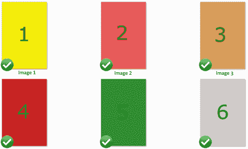

# 二十五、构建简单的图片库应用

**翻页**是从一页移动到另一页的动作，在安卓系统上，我们通过在屏幕上滑动手指来完成。当我们这样做时，当前页面在一个方向和速度上转换，以匹配手指的移动。这是一种在应用中导航的有用且实用的方法，但也许比这更重要的是，它为用户创造了极其令人满意的视觉效果。此外，与`RecyclerView`小部件一样，我们可以有选择地只加载当前页面所需的数据，也可能加载上一页和下一页的数据。

正如您所料，安卓应用编程接口有一些以非常简单的方式实现分页的解决方案。

在本章中，我们将学习如何执行以下操作:

*   像在照片库应用中一样，实现图像分页和滑动。

首先，我们来看一个刷卡的例子。

# 技术要求

你可以在[https://GitHub . com/PacktPublishing/Android-初学者编程-第三版/tree/main/章节%2025](https://github.com/PacktPublishing/Android-Programming-for-Beginners-Third-Edition/tree/main/chapter%2025) 找到本章中出现的代码文件。

# 愤怒的小鸟经典刷卡菜单

在这里我们可以看到著名的愤怒的小鸟等级选择菜单，显示了滑动/分页的动作:


图 25.1–愤怒的小鸟等级选择菜单

让我们构建一个分页应用。

# 构建一个图库/滑块应用

在 AndroidStudio 新建一个名为`Image Pager`的项目。使用**清空活动**模板，将其余所有设置保留为默认值。

图片在 [*第 25 章*](#_idTextAnchor430) `/Image Pager/drawable`文件夹的下载包中。下一张截图显示了它们在窗口文件资源管理器中的位置:



图 25.2–添加图像

将图片添加到 AndroidStudio 项目浏览器的`drawable`文件夹中，或者您可以添加更多有趣的图片，也许是您拍摄的一些照片。

## 实施布局

对于一个简单的图片分页应用，我们使用`PagerAdapter`类。我们可以认为这就像`RecyclerAdapter`一样，但是对于图像来说，它将处理`ViewPager`小部件中图像阵列的显示。这很像`RecyclerAdapter`如何处理`ListView`中`ArrayList`的内容显示。我们需要做的就是覆盖适当的方法。

要用`PagerAdapter`实现一个图库，我们首先需要在我们的主布局中有一个`ViewPager`小部件。所以你可以清楚地看到需要什么，这是`activity_main.xml`的实际 XML 代码。编辑`activity_main.xml`如下图所示:

```java
<RelativeLayout xmlns:android=
   "http://schemas.android.com/apk/res/android"
    android:layout_width="fill_parent"
    android:layout_height="fill_parent" >
    <androidx.viewpager.widget.ViewPager
        android:id="@+id/pager"
        android:layout_width="wrap_content"
        android:layout_height="wrap_content" />
</RelativeLayout>
```

名为`androidx.ViewPager.widget.ViewPager`的类是使这个功能在`ViewPager`之前发布的安卓版本中可用的类。

接下来，有点像我们需要一个布局来表示一个列表项目，我们需要一个布局来表示一个项目，在这种情况下，一个图像，在`ViewPager`中。以通常的方式创建一个新的布局文件，并将其称为`pager_item.xml`。添加一个 ID 为`imageView`的单个`ImageView`。

使用可视化设计器来实现这一点，或者将以下 XML 复制到`pager_item.xml`中:

```java
<?xml version="1.0" encoding="utf-8"?>
<RelativeLayout
    xmlns:android="http://schemas.android.com/apk/res/android"
    android:layout_width="fill_parent"
    android:layout_height="fill_parent" >
    <ImageView
        android:id="@+id/imageView"
        android:layout_width="match_parent"
        android:layout_height="match_parent" />
</RelativeLayout>
```

现在我们可以开始我们的`PagerAdapter`课了。

## 对寻呼机适配器类进行编码

接下来，我们需要扩展`PagerAdapter`来处理图像。创建一个名为`ImagePagerAdapter`的新类，并使其扩展`PagerAdapter`。

将以下导入添加到`ImagePagerAdapter`类的顶部。我们经常依靠使用 *Alt* + *进入*快捷键来添加进口。这次我们做的事情略有不同，因为有些名称非常相似的类不适合我们的目标。

将以下导入添加到`ImagePagerAdapter`类中:

```java
import android.content.Context;
import android.view.LayoutInflater;
import android.view.View;
import android.view.ViewGroup;
import android.widget.ImageView;
import android.widget.RelativeLayout;
import androidx.viewpager.widget.PagerAdapter;
import androidx.viewpager.widget.ViewPager;
```

这是添加了`extends...`代码和几个成员变量的类声明。这些变量是我们将很快使用的一个`Context`对象和一个名为`images`的`int`数组。拥有图像的`int`数组的原因是我们将为每个图像存储`int`标识符。我们将在几个代码块时间内看到这是如何工作的。最后一个成员变量是一个`LayoutInflater`实例，你可能猜到它将被用来膨胀`pager_item.xml`的每个实例。

扩展`PagerAdapter`类，添加我们刚才讨论的成员变量:

```java
public class ImagePagerAdapter extends PagerAdapter {
    Context context;
    int[] images;
    LayoutInflater inflater;
}
```

现在我们需要一个构造器，它通过接收来自`MainActivity`类的`Context`以及用于图像的`int`数组并使用它们初始化成员变量来设置`ImagerPagerAdapter`。

将构造函数方法添加到`ImagePagerAdapter`类中:

```java
public ImagePagerAdapter(
   Context context,  int[] images) {

   this.context = context;
   this.images = images;
}
```

现在我们必须超越`PagerAdapter`的必需方法。在前一个代码之后，立即添加被覆盖的`getCount`方法，该方法简单地返回数组中图像标识的数量。此方法由类在内部使用:

```java
@Override
public int getCount() {
   return images.length;
}
```

现在我们必须覆盖`isViewFromObject`方法，该方法根据当前`View`实例是否与作为参数传入的当前`Object`相同或相关联来返回一个布尔值。同样，这是一个由类内部使用的方法。紧接着前面的代码，添加这个`Override`方法:

```java
@Override
public boolean isViewFromObject(View view, Object object) {
   return view == object;
}
```

现在我们必须覆盖`instantiateItem`方法；这是我们完成大部分相关工作的地方。首先，我们声明一个新的`ImageView`对象，然后初始化我们的`LayoutInflater`成员。接下来，我们使用`LayoutInflater`实例从我们的`pager_item.xml`布局文件中声明并初始化一个新的`View`实例。

在此之后，我们获得了对`pager_item.xml`布局内的`ImageView`小部件的引用。我们现在可以基于`instantiateItem`方法的`position`参数和来自`images`数组的适当的 ID 整数添加适当的图像作为`ImageView`小部件的内容。

最后，我们使用`addView`方法将布局添加到`PagerAdapter`实例，并从该方法返回。

添加我们刚才讨论的方法:

```java
@Override
public Object instantiateItem(
   ViewGroup container, int position) {
   ImageView image;
   inflater = (LayoutInflater) 
         context.getSystemService(
         Context.LAYOUT_INFLATER_SERVICE);

   View itemView = inflater.inflate(
         R.layout.pager_item, container, false);
   // get reference to imageView in pager_item layout
   image = 
         itemView.findViewById(R.id.imageView);
   // Set an image to the ImageView
   image.setImageResource(images[position]);
   // Add pager_item layout as the current page to the 
   ViewPager
   ((ViewPager) container).addView(itemView);
   return itemView;
}
```

我们必须覆盖的最后一个方法是`destroyItem`方法，当类需要根据`position`参数的值移除适当的项目时，可以调用该方法。

在上一个代码之后，`ImagePagerAdapter`类的右花括号之前添加`destroyItem`方法:

```java
@Override
public void destroyItem(ViewGroup container, 
   int position, 
   Object object) {

   // Remove pager_item layout from ViewPager
   container.removeView((RelativeLayout) object);
}
```

正如我们在编写`ImagePagerAdapter`类代码时所看到的，它的内容非常少。这只是恰当地实现了`ImagePagerAdapter`类用来帮助事情在幕后顺利进行的重写方法的一个例子。

现在我们可以对`MainActivity`类进行编码，它将使用我们的`ImagePagerAdapter`实现。

## 对主要活动类进行编码

最后，我们可以为我们的`MainActivity`类编码。与`ImagePagerAdapter`类一样，为了清楚起见，在类声明之前将以下`import`语句手动添加到`MainActivity.java`类，如下所示:

```java
import androidx.appcompat.app.AppCompatActivity;
import androidx.viewpager.widget.PagerAdapter;
import androidx.viewpager.widget.ViewPager;
```

我们需要一些成员变量。不出所料，我们需要一个`ViewPager`实例，它将用于保存对布局中`ViewPager`的引用。此外，我们需要一个我们刚刚编码的类的`ImagePagerAdapter`参考。我们还需要一个`int`数组来保存图像标识数组。

将`MainActivity`类修改如下:

```java
public class MainActivity extends AppCompatActivity {
   ViewPager viewPager;
   PagerAdapter adapter;
   int[] images;
   @Override
   public void onCreate(Bundle savedInstanceState) {
          super.onCreate(savedInstanceState);
          ...
```

其余的代码都在`onCreate`方法中。我们用添加到`drawable-xhdpi`文件夹的每个图像初始化我们的`int`数组。

我们用`findViewById`方法以通常的方式初始化`ViewPager`。我们还通过传入对`MainActivity`类和`images`数组的引用来初始化我们的`ImagePagerAdapter`实例，正如我们之前编码的构造函数所要求的那样。最后，我们使用`setAdapter`方法将适配器绑定到寻呼机。

将`onCreate`方法编码为如下代码:

```java
@Override
public void onCreate(Bundle savedInstanceState) {
   super.onCreate(savedInstanceState);
   setContentView(R.layout.activity_main);
   // Grab all the images and stuff them in our array
   images = new int[] { R.drawable.image1,
                R.drawable.image2,
                R.drawable.image3,
                R.drawable.image4,
                R.drawable.image5,
                R.drawable.image6 };
   // get a reference to the ViewPager in the layout
   viewPager = findViewById(R.id.pager);
   // Initialize our adapter
   adapter = new 
          ImagePagerAdapter(MainActivity.this, images);
   // Binds the Adapter to the ViewPager
   viewPager.setAdapter(adapter);
}
```

现在我们准备运行应用。

## 运行图库应用

在这里我们可以看到我们`int`阵列的第一张图像:


图 25.3–第一张图像

向左和向右轻扫一点以查看图像平滑、令人愉悦的过渡方式:


图 25.4–滑动查看图像

这一章就到这里。让我们回顾一下我们做了什么。

# 总结

在这一章中，我们看到了如何将寻呼机用于简单的图片库，只需几行代码和一些非常简单的布局。因为有了`ImagePagerAdapter`班，我们这么容易就做到了。

在下一章中，我们将看看另一个非常酷的用户界面元素，它被用在许多最新的安卓应用中，可能是因为它看起来很棒，使用起来非常愉快，也非常实用。`NavigationView`布局将使我们能够用完全不同的行为(代码)设计和实现不同的布局。我们来看看`NavigationView`的布局。