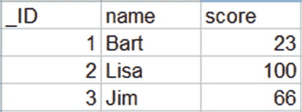
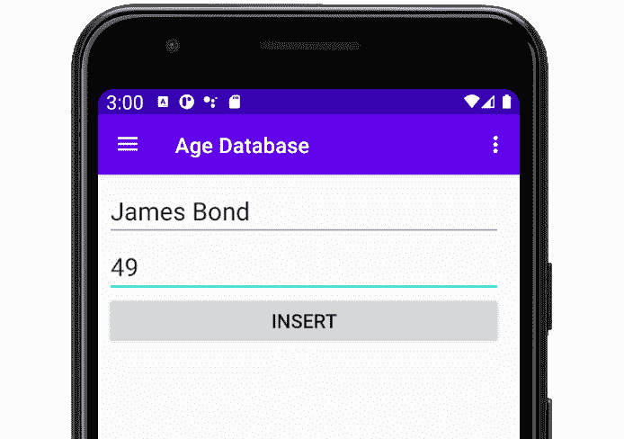
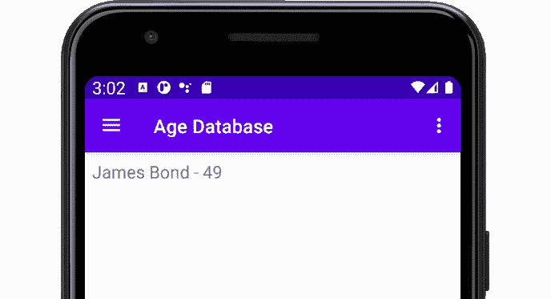
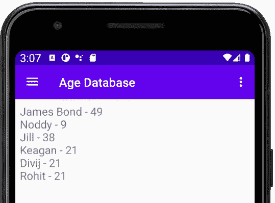
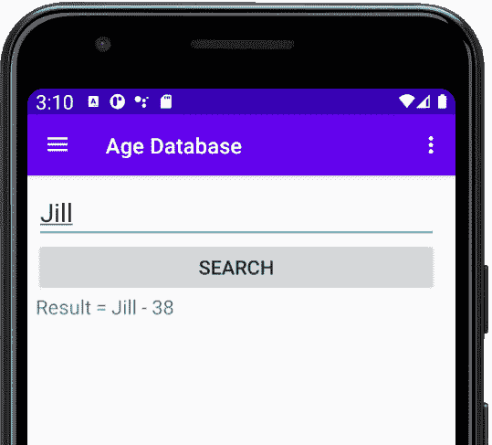

# *第二十七章*:安卓数据库

如果我们要让应用为用户提供重要功能，那么我们几乎肯定需要一种方法来管理、存储和过滤大量数据。

使用 JSON 可以高效地存储大量数据，但是当我们需要选择性地使用这些数据，而不是简单地将自己限制在“保存所有内容”和“加载所有内容”的选项中时，我们需要考虑还有哪些其他选项可用。

一门好的计算机科学课程可能会教你处理排序和过滤数据所必需的算法，但所涉及的工作会相当广泛，我们想出一个像给我们安卓应用编程接口的人所做的那样好的解决方案的可能性有多大？

就像通常的情况一样，使用安卓应用编程接口中提供的解决方案是最有意义的。正如我们已经看到的那样，`JSON`和`SharedPreferences`类有它们的位置，但是在某些时候，我们需要继续使用真实数据库来获得真实世界的解决方案。安卓使用的是 SQLite 数据库管理系统，正如你所料，有一个 API 可以让它尽可能简单。

在本章中，我们将执行以下操作:

*   找出数据库到底是什么
*   了解什么是 SQL 和 SQLite
*   学习 SQL 语言的基础知识
*   来看看安卓 SQLite API
*   对我们在上一章开始的年龄数据库应用进行编码

# 技术要求

你可以在[https://GitHub . com/PacktPublishing/Android-初学者编程-第三版/tree/main/章节%2027](https://github.com/PacktPublishing/Android-Programming-for-Beginners-Third-Edition/tree/main/chapter%2027) 找到本章中出现的代码文件。

# 数据库 101

让我们回答一大堆与数据库相关的问题，然后我们就可以开始制作使用 SQLite 的应用了。

## 什么是数据库？

一个**数据库**既是一个存储场所，也是一个检索、存储和操作数据的手段。在学习如何使用它之前，能够可视化数据库是有帮助的。数据库内部的实际结构因数据库而异。SQLite 实际上将其所有数据存储在一个文件中。

然而，如果我们将数据可视化，就像它在一个电子表格中，或者有时在多个电子表格中一样，这将大大有助于我们的理解。我们的数据库，像电子表格一样，将被分成多列，代表不同类型的数据，和行，代表数据库的条目。

想想有名字和考试分数的数据库。看看这些数据的可视化表示，想象一下它在数据库中的样子:



图 27.1–数据库示例

但是，请注意，还有一个额外的数据列:一个 _ **ID** 列。我们将继续讨论这个问题。这个单一的类似电子表格的结构被称为**表**。如前所述，一个数据库中可能存在多个表，而且经常如此。表中的每一个列都有一个名称，在对数据库说话时可以参考。

## 什么是 SQL？

**SQL** 代表代表**结构化查询语言**。正是语法被用来完成数据库的工作。

## 什么是 SQLite？

SQLite 是安卓青睐的数据库系统的名称，它有自己的 SQL 版本。SQL 的 SQLite 版本需要与其他一些版本略有不同的原因是数据库具有不同的功能。

接下来的 SQL 语法入门将集中在 SQLite 上。

# SQL 语法入门

在我们能够学习如何在安卓系统上使用 SQLite 之前，我们需要首先学习如何在平台无关的环境下使用 SQLite 的基本知识。

让我们看一些示例 SQL 代码，它们可以直接在 SQLite 数据库上使用，而不需要任何 Java 或 Android 类；然后我们可以更容易地理解我们的 Java 代码稍后在做什么。

## SQLite 示例代码

SQL 有关键字，很像 Java，会导致事情发生。以下是我们即将使用的一些 SQL 关键字的味道:

*   `INSERT`:允许我们向数据库添加数据
*   `DELETE`:允许我们从数据库中删除数据
*   `SELECT`:允许我们从数据库中读取数据
*   `WHERE`:允许我们指定部分数据库，匹配特定的标准，我们想使用`INSERT`、`DELETE`或`SELECT`打开
*   `FROM`: Used to specify a table or column name in a database

    注意

    还有比这个多很多的 SQLite 关键词；有关类型的完整列表，请查看此链接:[https://sqlite.org/lang_keywords.html](https://sqlite.org/lang_keywords.html)。

除了关键词，SQL 还有**类型**。SQL 类型的一些示例如下:

*   **整数**:正是我们存储整数所需要的
*   **文本**:完美的来存储一个简单的名字或地址
*   **real**: For large floating-point numbers

    注意

    还有比这个多很多的 SQLite 类型；有关类型的完整列表，请查看此链接:[https://www.sqlite.org/datatype3.html](https://www.sqlite.org/datatype3.html)。

让我们来看看我们如何使用完整的 SQLite 语句将这些类型与关键字相结合来创建表以及添加、删除、修改和读取数据。

### 创建表格

问我们为什么不先创建一个新的数据库是一个非常好的问题。原因是默认情况下每个安卓应用都可以访问一个 SQLite 数据库。该数据库是该应用的私有数据库。下面是我们用来在数据库中创建一个表的语句。我强调了几个部分，以使陈述更清楚:

```java
create table StudentsAndGrades 
   _ID integer primary key autoincrement not null,
   name text not null,
   score int;
```

前面的代码创建了一个名为`StudentsAndGrades`的表，该表具有一个整数行标识，每当添加一行数据时，该标识将自动增加(递增)。

表格也将有一个`name`列，该列将为`text`类型，不能为空(`not null`)。

它还将有一个类型为`int`的`score`列。此外，请注意，该语句由分号完成。

### 将数据插入数据库

下面是我们如何在数据库中插入新的一行数据:

```java
INSERT INTO StudentsAndGrades
   (name, score)
   VALUES
   ("Bart", 23);
```

前面的代码向数据库中添加了一行。在前面的语句之后，数据库将有一个条目，其中包含列(`_ID`、`name`、`score`)的值(`1`、`Bart`、`23`)。

下面是我们如何向数据库中插入另一个新的数据行:

```java
INSERT INTO StudentsAndGrades
   (name, score)
   VALUES
   ("Lisa", 100);
```

前面的代码为列(`_ID`、`name`、`score`)添加了新的一行数据值(`2`、`Lisa`、`100`)。

我们类似电子表格的结构现在看起来如下:


图 27.2–更新的电子表格

### 从数据库中检索数据

下面是我们如何访问数据库中的所有行和列:

```java
SELECT * FROM StudentsAndGrades;
```

前面的代码要求每行每列。`*`符号可以读作“全部”

我们还可以更有选择性，如这段代码所示:

```java
SELECT score FROM StudentsAndGrades
     where name = "Lisa";
```

之前的代码只会返回`100`，这当然是与名称`Lisa`相关的分数。

### 更新数据库结构

我们甚至可以在创建表和添加数据后添加新列。就 SQL 而言，这很简单，但是可能会引起一些关于用户在已经发布的应用上的数据的问题。下一条语句添加了一个名为`age`的新列，其类型为`int`:

```java
ALTER TABLE StudentsAndGrades
     ADD 
     age int;
```

数据类型、关键字和使用它们的方法比我们目前看到的要多得多。接下来我们来看看安卓 SQLite API 我们将开始了解如何使用我们的新 SQLite 技能。

# Android SQLite API

安卓应用编程接口有许多不同的方法可以让我们很容易地使用应用的数据库。我们需要熟悉的第一堂课是`SQLiteOpenHelper`。

## SQLiteOpenHelper 和 SQLiteDatabase

`SQLiteDatabase`类是代表实际数据库的类。然而`SQLiteOpenHelper`班是大部分活动发生的地方。这个类将使我们能够访问一个数据库并初始化一个 T2 的实例。

此外，我们将在年龄数据库应用中扩展的`SQLiteOpenHelper`有两种方法可以覆盖。首先，它有一个`onCreate`方法，第一次使用数据库时调用；因此，我们放入 SQL 来创建表结构是有意义的。

我们必须覆盖的另一个方法是`onUpgrade`，正如你可能猜到的，它是在我们升级数据库时调用的(使用`ALTER`来改变它的结构)。

## 构建和执行查询

随着我们的数据库结构变得越来越复杂，随着我们的 SQL 知识的增长，我们的 SQL 语句将变得相当长和笨拙。出错的可能性很大。

我们帮助克服复杂性问题的方法是将部分查询构建成字符串。然后，我们可以将该字符串传递给将为我们执行查询的方法。

此外，我们将使用`final`字符串来表示表名和列名，这样我们就不会混淆它们。

例如，我们可以声明以下成员，这些成员将代表前面虚构示例中的表名和列名。请注意，我们还将为数据库本身指定一个名称，并为此指定一个字符串:

```java
private static final String DB_NAME = "MyCollegeDB";
private static final String TABLE_S_AND_G = " StudentsAndGrades";
public static final String TABLE_ROW_ID = "_id";
public static final String TABLE_ROW_NAME = "name";
public static final String TABLE_ROW_SCORE = "score";
```

请注意，在前面的代码中，当我们声明字符串`public`时，我们将如何从访问类外的字符串中获益。你可能会认为这打破了封装的规则。确实如此，但是当类的意图是尽可能广泛地使用时，这是可以的。记住，所有的变量都是最终的。使用这些字符串变量的外部类不能改变它们或者把事情搞砸。他们只能引用和使用他们持有的价值观。

然后，我们可以构建一个查询，如下例所示。该示例向我们假设的数据库中添加了一个新条目，并将 Java 变量合并到 SQL 语句中:

```java
String name = "Onkar";
int score = 95;
// Add all the details to the table
String query = "INSERT INTO " + TABLE_S_AND_G + " (" +
         TABLE_ROW_NAME + ", " +
         TABLE_ROW_SCORE +
         ") " +
         "VALUES (" +
         "'" + name + "'" + ", " +
         score +
         ");"; 
```

注意在前面的代码中，常规的`name`和`score` Java 变量被高亮显示。以前名为`query`的字符串现在是 SQL 语句，完全等同于:

```java
INSERT INTO StudentsAndGrades (
   name, score)
   VALUES ('Onkar',95);
```

注意

为了继续学习安卓编程，完全掌握前面两个代码块并不是必要的。但是，如果你想构建自己的应用并构造出完全符合你需要的 SQL 语句，那么*将会帮助你做到这一点。为什么不研究前面两个代码块，以便辨别成对的双引号`"`之间的区别，这是用`+`连接在一起的字符串部分；成对的单引号，`'`，这是 SQL 语法的一部分；常规的 Java 变量；以及字符串和 Java 中的 SQL 语句中不同的分号。*

在输入查询的整个过程中，AndroidStudio会提示我们变量的名称，这使得出错的几率大大降低，尽管这比简单地输入查询要冗长得多。

现在，我们可以使用前面介绍的类来执行查询:

```java
// This is the actual database
private SQLiteDatabase db;
// Create an instance of our internal CustomSQLiteOpenHelper class
CustomSQLiteOpenHelper helper = new
   CustomSQLiteOpenHelper(context);
// Get a writable database
db = helper.getWritableDatabase();
// Run the query
db.execSQL(query);
```

当将数据添加到数据库中时，我们将使用`execSQL`作为前面代码中的；当从数据库中获取数据时，我们将使用`rawQuery`方法，如下所示:

```java
Cursor c = db.rawQuery(query, null); 
```

注意`rawQuery`方法返回一个类型为`Cursor`的对象。

注意

我们可以通过几种不同的方式与 SQLite 进行交互，它们各有优缺点。我们选择使用原始的 SQL 语句，因为它使我们正在做的事情完全透明，并增强了我们对 SQL 语言的知识。如果你想知道更多，请看下一个提示。

## 数据库游标

除了允许我们访问数据库的类和允许我们执行查询的方法之外，还有一个问题就是我们从查询中得到的结果是如何格式化的。

幸好有`Cursor`班。我们所有的数据库查询都将返回类型为`Cursor`的对象。我们可以使用`Cursor`类的方法有选择地访问查询返回的数据，如下所示:

```java
Log.i(c.getString(1), c.getString(2)); 
```

前面的代码将向 logcat 输出存储在查询返回的结果的前两列中的两个值。正是`Cursor`对象本身决定了我们当前正在读取返回数据的哪一行。

我们可以访问对象的许多方法，包括`moveToNext`方法，不出所料，该方法会将`Cursor`移到下一行，准备阅读:

```java
c.moveToNext();
/*
   This same code now outputs the data in the
   first and second column of the returned 
   data but from the SECOND row.
*/
Log.i(c.getString(1), c.getString(2));
```

在某些情况下，我们将能够将`Cursor`绑定到我们的用户界面的一部分(例如`RecyclerView`)，就像我们在“给自己的笔记”应用中对一个`ArrayList`实例所做的那样，并将所有事情都留给安卓应用编程接口。

`Cursor`类还有很多更有用的方法，其中一些我们很快就会看到。

注意

对安卓 SQLite 应用编程接口的介绍实际上只是触及了它功能的表面。随着我们的深入，我们将会遇到更多的方法和类。然而，如果你的应用想法需要复杂的数据管理，那就值得进一步研究。

现在我们可以看到所有这些理论是如何结合在一起的，以及我们将如何在 Age Database 应用中构造我们的数据库代码。

# 对数据库类进行编码

在这里，我们将把到目前为止所学的一切付诸实践，并完成年龄数据库应用的编码。在之前，我们前面部分的`Fragment`类可以与共享数据库交互，我们需要一个类来处理与数据库的交互和数据库的创建。

我们将使用`SQLiteOpenHelper`类创建一个管理我们数据库的类。它还将定义一些`final`字符串来表示表及其列的名称。此外，它将提供一堆我们可以调用的帮助方法来执行所有必要的查询。必要时，这些辅助方法将返回一个`Cursor`对象，我们可以用它来显示我们检索到的数据。如果我们的应用需要发展，那么添加新的助手方法将是微不足道的。

创建一个名为`DataManager`的新类，并添加以下成员变量:

```java
import android.database.sqlite.SQLiteDatabase;
public class DataManager {
    // This is the actual database
    private SQLiteDatabase db;
    /*
        Next we have a public static final string for
        each row/table that we need to refer to both
        inside and outside this class
    */
    public static final String TABLE_ROW_ID = "_id";
    public static final String TABLE_ROW_NAME = "name";
    public static final String TABLE_ROW_AGE = "age";
    /*
        Next we have a private static final strings for
        each row/table that we need to refer to just
        inside this class
    */
    private static final String DB_NAME = "name_age_db";
    private static final int DB_VERSION = 1;
    private static final String TABLE_N_AND_A = 
                                   "name_and_age";
}
```

接下来，我们添加将创建我们的自定义版本`SQLiteOpenHelper`的实例的构造函数。我们将很快把这个类实现为一个内部类。构造器还初始化`db`成员，这是我们的`SQLiteDatabase`参考。

将我们刚刚讨论的以下构造函数添加到`DataManager`类中:

```java
public DataManager(Context context) {
   // Create an instance of our internal 
   CustomSQLiteOpenHelper 

   CustomSQLiteOpenHelper helper = new 
      CustomSQLiteOpenHelper(context);
   // Get a writable database
   db = helper.getWritableDatabase();
}
```

现在我们可以添加我们将从片段类中访问的辅助方法。从`insert`方法开始，该方法基于传递到方法中的`name`和`age`参数执行`INSERT` SQL 查询。

将`insert`方法添加到`DataManager`类中:

```java
// Here are all our helper methods
// Insert a record
public void insert(String name, String age){
   // Add all the details to the table
   String query = "INSERT INTO " + TABLE_N_AND_A + " (" +
                  TABLE_ROW_NAME + ", " +
                  TABLE_ROW_AGE +
                  ") " +
                  "VALUES (" +
                  "'" + name + "'" + ", " +
                  "'" + age + "'" +
                  ");";
   Log.i("insert() = ", query);
   db.execSQL(query);
}
```

下一个名为`delete`的方法将从数据库中删除一条记录，如果它在名称列中有一个值与传入的`name`参数匹配。它使用 SQL `DELETE`关键字来实现这一点。

将`delete`方法添加到`DataManager`类中:

```java
// Delete a record
public void delete(String name){
   // Delete the details from the table if already exists
   String query = "DELETE FROM " + TABLE_N_AND_A +
                  " WHERE " + TABLE_ROW_NAME +
                  " = '" + name + "';";
   Log.i("delete() = ", query);
   db.execSQL(query);
}
```

接下来我们有`selectAll`方法，顾名思义也是这样做的。它通过使用`*`参数的`SELECT`查询来实现这一点，这相当于单独指定所有列。另外，注意这个方法返回一个`Cursor`实例，我们将在一些`Fragment`类中使用它。

将`selectAll`方法添加到`DataManager`类中:

```java
// Get all the records
public Cursor selectAll() {
   Cursor c = db.rawQuery("SELECT *" +" from " +
                TABLE_N_AND_A, null);
   return c;
}
```

现在我们添加一个`searchName`方法，它有一个`String`参数作为用户想要搜索的名称。它还返回一个包含所有找到的条目的`Cursor`实例。请注意，SQL 语句使用`SELECT`、`FROM`和`WHERE`来实现这一点:

```java
// Find a specific record
public Cursor searchName(String name) {
   String query = "SELECT " +
                  TABLE_ROW_ID + ", " +
                  TABLE_ROW_NAME +
                  ", " + TABLE_ROW_AGE +
                  " from " +
                  TABLE_N_AND_A + " WHERE " +
                  TABLE_ROW_NAME + " = '" + name + "';";
   Log.i("searchName() = ", query);
   Cursor c = db.rawQuery(query, null);
   return c;
}
```

最后，对于`DataManager`类，我们创建了一个内部类，它将是`SQLiteOpenHelper`的实现。这是一个简单的实现。

我们有一个接收`Context`对象、数据库名称和数据库版本的构造函数。

我们还覆盖了具有 SQL 语句的`onCreate`方法，该方法创建了具有`_ID`、`name`和`age`列的数据库表。

`onUpgrade`方法是故意为这个应用留空。

将内部`CustomSQLiteOpenHelper`类添加到`DataManager`类中:

```java
// This class is created when our DataManager is initialized
private class CustomSQLiteOpenHelper extends SQLiteOpenHelper {
   public CustomSQLiteOpenHelper(Context context) {
         super(context, DB_NAME, null, DB_VERSION);
   }
   // This runs the first time the database is created
   @Override
   public void onCreate(SQLiteDatabase db) {
         // Create a table for photos and all their details
         String newTableQueryString = "create table "
                      + TABLE_N_AND_A + " ("
                      + TABLE_ROW_ID
                      + " integer primary key 
                      autoincrement not null,"
                      + TABLE_ROW_NAME
                      + " text not null,"
                      + TABLE_ROW_AGE
                      + " text not null);";
         db.execSQL(newTableQueryString);

   }
   // This method only runs when we increment DB_VERSION
   @Override
   public void onUpgrade(SQLiteDatabase db, 
int oldVersion, int newVersion) {
// Not needed in this app
// but we must still override it
   }
}
```

现在我们可以给我们的`Fragment`类添加代码来使用我们新的`DataManager`类。

# 编码片段类以使用数据管理器类

将此高亮代码添加到`InsertFragment`类中，更新`onCreateView`方法:

```java
View v = inflater.inflate(R.layout.content_insert, 
   container, false);
final DataManager dm = 
   new DataManager(getActivity());
Button btnInsert = 
   v.findViewById(R.id.btnInsert);

final EditText editName = 
   v.findViewById(R.id.editName);

final EditText editAge = 
   v.findViewById(R.id.editAge);
btnInsert.setOnClickListener(new View.OnClickListener() {
   @Override
   public void onClick(View v) {
          dm.insert(editName.getText().toString(),
                       editAge.getText().toString());
   }
});
return v;
```

在代码中，我们得到了`DataManager`类的一个实例，以及对每个用户界面小部件的引用。然后，在`onClick`方法中，我们使用`insert`方法向数据库添加新的姓名和年龄。要插入的值取自两个`EditText`小部件。

将此高亮代码添加到`DeleteFragment`类中，更新`onCreateView`方法:

```java
View v = inflater.inflate(R.layout.content_delete, 
   container, false);
final DataManager dm = 
   new DataManager(getActivity());
Button btnDelete = 
   v.findViewById(R.id.btnDelete);

final EditText editDelete = 
   v.findViewById(R.id.editDelete);
btnDelete.setOnClickListener(new View.OnClickListener() {
   @Override
   public void onClick(View v) {
          dm.delete(editDelete.getText().toString());
   }
});
return v;
```

在`DeleteFragment`类中，我们创建一个`DataManager`类的实例，然后从布局中获取对`EditText`和`Button`小部件的引用。当点击按钮时，调用`delete`方法，从用户输入的`EditText`小部件中传递任何文本的值。`delete`方法在我们的数据库中搜索匹配项，如果找到一个匹配项，就删除它。

将此高亮显示的代码添加到`SearchFragment`类，以更新`onCreateView`方法:

```java
View v = inflater.inflate(R.layout.content_search,
   container,false);
Button btnSearch = 
   v.findViewById(R.id.btnSearch);

final EditText editSearch = 
   v.findViewById(R.id.editSearch);

final TextView textResult = 
   v.findViewById(R.id.textResult);
// This is our DataManager instance
final DataManager dm = 
   new DataManager(getActivity());
btnSearch.setOnClickListener(new View.OnClickListener() {
   @Override
   public void onClick(View v) {
          Cursor c = dm.searchName(
                     editSearch.getText().toString());
// Make sure a result was found before using the 
          Cursor
          if(c.getCount() > 0) {
                 c.moveToNext();
textResult.setText("Result = " + 
c.getString(1) + " - " + 
                     c.getString(2));
          }
   }
});
return v;
```

正如我们对所有不同的`Fragment`类所做的一样，我们创建了一个`DataManager`类的实例，并获得了对布局中所有不同的用户界面小部件的引用。在`onClick`方法中，使用`searchName`方法，从`EditText`小部件传入值。如果数据库在`Cursor`实例中返回结果，那么`TextView`小部件使用其`setText`方法输出结果。

将此高亮显示的代码添加到`ResultsFragment`类以更新`onCreateView`方法:

```java
View v = inflater.inflate(R.layout.content_results, 
   container, false);
// Create an instance of our DataManager
DataManager dm = 
   new DataManager(getActivity());
// Get a reference to the TextView to show the results
TextView textResults = 
   v.findViewById(R.id.textResults);
// Create and initialize a Cursor with all the results
Cursor c = dm.selectAll();
// A String to hold all the text
String list = "";
// Loop through the results in the Cursor
while (c.moveToNext()){
   // Add the results to the String
   // with a little formatting
   list+=(c.getString(1) + " - " + c.getString(2) + "\n");
}
// Display the String in the TextView
textResults.setText(list);
return v;
```

在这个类中，`Cursor`实例在任何交互发生之前使用`selectAll`方法加载数据。然后通过连接结果将`Cursor`的内容输出到`TextView`小部件中。连接中的`\n`在`Cursor`实例中的每个结果之间创建了一条新的线。

# 运行年龄数据库应用

让我们运行通过我们的应用的一些功能，以确保它按预期工作。

首先，我使用**插入**菜单选项给数据库添加了一个新名称:



图 27.3–插入菜单

然后我通过查看**结果**选项确认它在那里:



图 27.4–结果选项

之后，我又添加了几个名字和年龄，只是为了把数据库填满一点点:



图 27.5–填充数据库

然后我使用**删除**菜单选项，再次查看**结果**选项，检查我选择的名字是否被删除:


图 27.6–删除菜单

然后我搜索一个我知道存在的名字来测试**搜索**菜单选项:



图 27.7–搜索菜单

让我们回顾一下本章所做的工作。

# 总结

这一章我们已经讲了很多。我们已经了解了数据库，特别是安卓应用使用的数据库——SQlite。我们已经练习了使用 SQL 语言与数据库通信的基础知识。

我们已经看到了安卓应用编程接口如何帮助我们使用 SQLite 数据库，并实现了我们第一个使用数据库的工作应用。

你已经走了很长一段路，已经到了书的结尾。让我们谈谈接下来会发生什么。