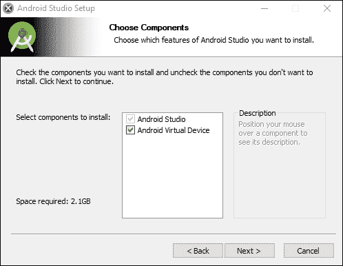
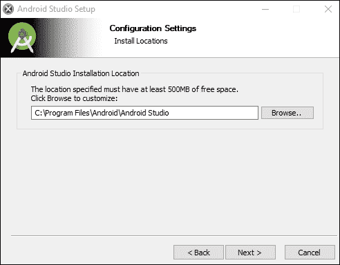
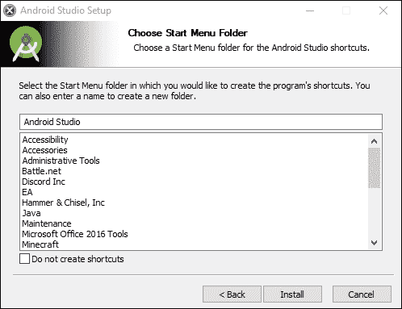
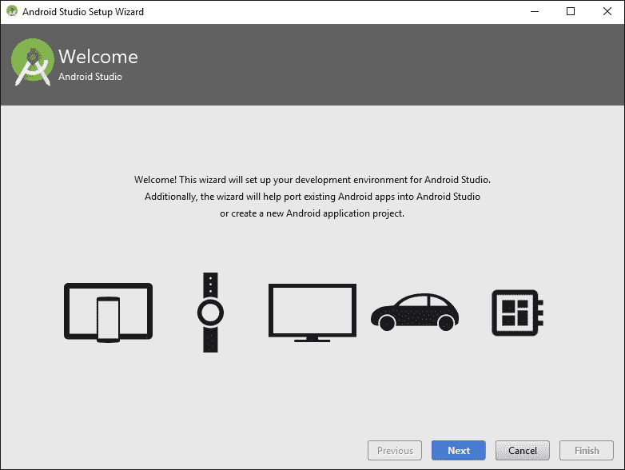
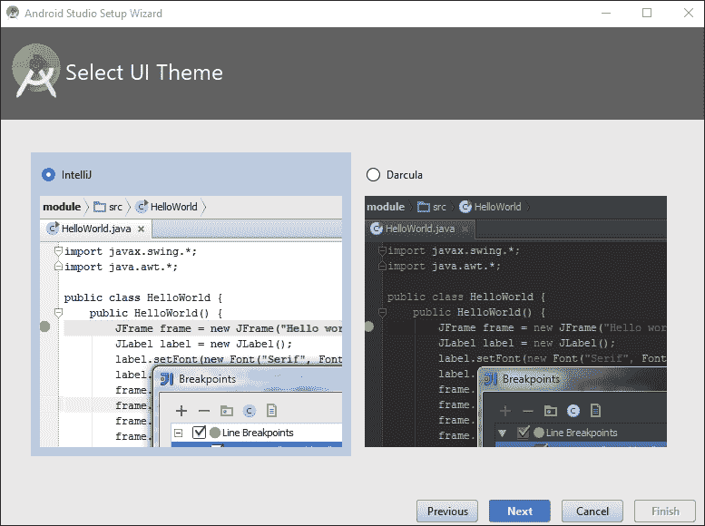

# 一、安卓和 Kotlin 入门

欢迎来到*安卓和 Kotlin 的刺激世界*！在第一章中，我们不会浪费任何时间来开始开发安卓应用。

我们将看看安卓有什么了不起的，安卓和 Kotlin 是什么，它们是如何工作和相互补充的，这对我们作为未来的开发者意味着什么。接下来，我们将设置所需的软件，这样我们就可以构建和部署一个简单的第一个应用。

在本章中，我们将涵盖以下主题:

*   了解 Kotlin 和 Android 如何协同工作
*   建立我们的开发环境，AndroidStudio
*   了解什么是安卓应用
*   了解 Kotlin
*   打造我们第一款安卓应用
*   部署安卓模拟器
*   在安卓模拟器和真实设备上运行我们的应用

这是一个很大的难题，让我们开始吧。

# 为什么要用 Kotlin 和安卓？

当安卓在 2008 年首次出现时，与苹果 iPhone/iPad 上更时尚的 iOS 相比，它有点单调。但是，很快，通过各种各样的手机产品，吸引了注重实用、注重价格的消费者，以及那些注重时尚和精通技术的消费者，安卓用户数量激增。

对包括我在内的许多人来说，为安卓系统开发是最有益的消遣和业务，无一例外。

快速构建一个想法的原型，提炼它，然后决定运行它，并将其连接到一个成熟的应用中，这是一个如此令人兴奋和有益的过程。任何编程都可能很有趣——我一生都在编程——但为安卓系统创作不知何故是非常值得的。

准确定义为什么会出现这种情况是相当困难的。也许是平台免费开放的事实。你可以分发你的应用，而不需要大型控股公司的许可——没有人能阻止你。与此同时，你拥有完善的、由企业控制的大众市场，比如亚马逊 Appstore 和谷歌 Play。

然而，更有可能的是，为安卓开发给人如此美好感觉的原因是设备本身的性质。他们是非常私人的。您可以开发与人们生活互动的应用，这些应用可以教育、娱乐、讲故事等等，而且就在他们的口袋里，随时可以带走——无论是在家里、工作场所还是度假。

您当然可以为桌面构建更大的东西，但是知道成千上万(或数百万)的人将您的作品放在口袋里并与朋友分享不仅仅是一个话题。

开发应用不再被认为是极客、书呆子或隐士。事实上，为安卓开发被认为是高度熟练的，最成功的开发人员受到极大的钦佩，甚至崇敬。

如果所有这些蓬松的、精神上的东西对你来说没有任何意义，那也没关系；为安卓系统开发可以让你谋生，甚至让你变得富有。随着设备保有量的持续增长，CPU 和 GPU 能力的持续提升，以及安卓操作系统本身的不停进化，对专业应用开发者的需求只会越来越大。

简而言之，最好的安卓开发者——更重要的是，拥有最好想法和最大决心的安卓开发者——比以往任何时候都更受欢迎。没人知道这些未来的安卓应用开发者是谁，他们甚至可能还没有写好第一行代码。

那么，为什么不是每个人都是安卓开发者呢？显然，并不是每个人都会分享我对创造能帮助人们生活变得更好的软件的热情，但我猜想，因为你正在阅读这篇文章，你可能会。

# 初学者的第一块绊脚石

不幸的是，对于那些和我一样热情的人来说，在前进的道路上有一种玻璃墙，让许多有抱负的安卓开发者感到沮丧。

安卓要求有抱负的开发者从三种编程语言中选择一种来制作应用。每一本安卓书，甚至是那些针对所谓初学者的书，都假设读者至少有一个中级水平的 Kotlin、C++、或者 Java，大多数需要高级水平。所以，优秀到优秀的编程知识被认为是学习安卓的前提。

不幸的是，在与安卓完全不同的环境中学习这些语言有时会有点枯燥，你所学的很多东西也不能直接转移到安卓的世界中。你可以看到为什么安卓初学者经常被推迟。

不需要这样。在这本书里，我小心翼翼地把你会学到的所有 Kotlin 主题放在一本厚重的 Kotlin 入门书里，并把它们重新制作成三个多章节的应用和十几个快速迷你应用，从一个简单的备忘录应用开始，发展到一个很酷的绘图应用和一个数据库应用。

如果你想成为一名专业的安卓开发者，或者只是想在学习 Kotlin 和安卓的时候有更多的乐趣，这本书会有所帮助。

# Kotlin 和安卓是如何合作的

**安卓软件开发工具包** ( **SDK** )很大程度上是用 Java 编写的，因为 Kotlin 是街区里的新生；但是，当我们告诉 Android Studio 将我们的 Kotlin 代码变成一个工作应用时，它会以中间形式与来自 SDK 的 Java 合并在一起，然后被转换成一种称为 DEX 代码的格式，Android 设备使用该格式转换成一个正在运行的应用。这对于作为开发人员的我们来说是无缝的，但是知道幕后发生了什么是值得的(并且，也许，是相当有趣的)。

无论你是用 Kotlin 还是 Java 编程你的应用，得到的 DEX 代码都是一样的。然而，使用 Kotlin 有一些显著的优势。

Kotlin 是以俄罗斯圣彼得堡附近的一个岛屿命名的。Kotlin 与苹果的 Swift 语言非常相似，所以现在学习 Kotlin 对学习 iPhone/iPad 开发非常有帮助。

Kotlin 是最简洁的语言，因此最不容易出错，对初学者来说很棒。Kotlin 也是最有趣的语言，主要是因为简洁意味着你可以用更少的代码更快地得到结果。谷歌认为 Kotlin 是一种官方(一流)安卓语言。Kotlin 还有其他一些优点，使它不容易出错，也不太可能犯导致崩溃的错误。我们将在前进的过程中发现这些优势的细节。

许多最先进、最创新、最受欢迎的应用都是用 Kotlin 编写的。仅举几个例子，包括 Kindle、Evernote、Twitter、Expedia、Pinterest 和网飞。

在我们开始我们的安卓探索之前，我们需要了解安卓和 Kotlin 是如何合作的。在我们用 Java 或 Kotlin 为 Android 编写了一个程序之后，我们点击一个按钮，我们的代码就会转换成另一种形式，一种 Android 可以理解的形式。另一种形式称为**达尔维克可执行、**或 **DEX** 代码，转换过程称为**编译**。当应用安装在设备上时，操作系统会再次将 DEX 代码转换为优化的可执行状态。

### 注

我们将在本章稍后设置好我们的开发环境后，看到这个过程在起作用。

安卓是一个复杂的系统，但你不需要深入了解它就能开始制作令人惊叹的应用。

### 类型

随着时间的推移，在使用它并与之互动之后，就会有一个完整的理解。

要开始，我们只需要了解基础知识。安卓运行在一个经过特别改编的 Linux 操作系统版本上。所以，用户看到的安卓只是一个运行在另一个操作系统上的应用。

安卓是系统内的系统。典型的安卓用户看不到 Linux 操作系统，很可能甚至不知道它在那里。

这样做的一个目的是隐藏安卓运行的硬件和软件的复杂性和多样性，但同时暴露其所有有用的功能。这些功能的曝光以两种方式工作:

*   首先，操作系统本身必须对硬件有完全的访问权，它确实有。
*   第二，这种访问必须是程序员友好且易于使用的，这是因为安卓**应用编程接口** ( **API)** 。

让我们继续深入研究安卓应用编程接口。

## 安卓 API

安卓应用编程接口是一种代码，可以让你轻松地做一些特别的事情。一个简单的类比可以用一台机器来做，也许是一辆汽车。当你踩下油门时，引擎盖下会发生一大堆事情。我们不需要了解燃烧或者燃油泵，因为某个聪明的工程师为我们做了一个**界面**；在这种情况下，是机械接口——加速踏板。

例如，以下代码行在本书的这个阶段可能看起来有点吓人，但它是安卓应用编程接口如何帮助我们的一个很好的例子:

```kt
locationManager.getLastKnownLocation(LocationManager.GPS_PROVIDER)
```

一旦你知道这一行代码在太空中搜索可用的卫星，在它们围绕地球的轨道上与它们通信，然后检索你在行星表面的精确纬度和经度，就很容易瞥见安卓应用编程接口的力量和深度。

这段代码看起来确实有点挑战性，在这本书的这个阶段甚至令人难以置信，但是想象一下尝试以其他方式与卫星通话！

安卓应用编程接口有一大堆已经为我们编写好的代码，可以随心所欲地使用。

我们必须问的问题，也是本书试图回答的问题，如下:我们如何使用所有这些代码来做很酷的事情？或者，把这个问题框起来，以适应早期的类比:我们如何找到并操纵踏板、方向盘，以及最重要的安卓应用编程接口的天窗？

这个问题的答案是 Kotlin 编程语言，事实上 Kotlin 是为了帮助程序员处理复杂性、避免错误和快速进步而设计的。让我们更深入地了解 Kotlin 和**面向对象编程** ( **OOP** )。

## Kotlin 是面向对象的

Kotlin 是一种**面向对象**语言。这意味着它使用了可重用编程对象的概念。如果这听起来像技术术语，另一个类比会有帮助。Kotlin 使我们和其他人(比如安卓 API 开发团队)能够编写基于现实世界的结构化代码，这里有一个重要的部分——它可以被**重用**。

所以，用汽车类比，我们可以问以下问题:如果一个制造商一天生产多辆汽车，他们会为每辆下线的汽车重新设计每个零件吗？

答案当然是否定的。他们让高技能的工程师开发出完全正确的组件，经过多年的磨砺、提炼和改进。然后，这些相同的组件被一次又一次地重用，并且偶尔被改进。

如果你要挑剔我的类比，那么你可以指出，汽车的每个部件仍然必须使用现实生活中的工程师或机器人从原材质中制造。这是真的。

软件工程师在编写代码时所做的就是为一个对象构建一个蓝图。然后，我们使用代码从他们的蓝图中创建一个对象，一旦我们有了这个对象，我们就可以配置它、使用它、将它与其他对象结合，等等。

此外，我们可以自己设计蓝图，并用它们制造物体。编译器然后将我们定制的创造转换(制造)成 DEX 代码。嘿，很快！我们有一个安卓应用。

在 Kotlin，蓝图被称为**类。**当一个类转化为一个真正的工作“事物”时，我们称之为类的一个**对象**或一个**实例**。

### 注

**物体简而言之。**

我们可以整天继续做类比。就这一点而言，Kotlin(以及大多数现代编程语言)是一种允许我们编写一次代码，然后可以重复使用的语言。

这非常有用，因为它节省了我们的时间，并允许我们使用他人的代码来执行我们可能没有时间或知识为自己编写的任务。很多时候，我们甚至不需要看到这段代码，甚至不需要知道它是如何工作的！

最后一个类比。我们只需要知道如何使用该代码，就像我们需要学习如何驾驶汽车一样。

所以，安卓总部的一些聪明的软件工程师编写了一个极其复杂的程序，可以和卫星对话，结果，在一行代码中，我们就可以得到我们在地球表面的位置。不错。

大多数安卓应用编程接口是用另一种语言(Java)编写的，但这对我们来说并不重要，因为我们可以在使用更简洁的 Kotlin 的同时完全访问这些功能(用 Java 编码)。AndroidStudio 和 Kotlin 编译器处理幕后的复杂性。

软件工程师们考虑了如何让这些代码对所有安卓程序员有用，这些程序员希望制作出神奇的应用，利用用户的位置来做酷的事情。他们将做的事情之一是制作功能，例如将设备在世界上的位置变成一个简单的单线任务。

因此，我们之前看到的单个代码行会产生更多我们看不到，也不需要看到的代码行。这是一个使用别人的代码使我们的代码变得无限简单的例子。

### 类型

如果你不必看到所有代码的事实让你失望，那么我理解你的感受。我们中的一些人，当我们了解一些事情时，想要了解每一个错综复杂的细节。如果这是你，那么请放心，开始学习安卓应用编程接口如何在内部工作的最好地方是按照应用编程接口程序员的意图使用它。在整本书中，我将定期指出进一步学习的机会，在这些机会中，您可以了解安卓应用编程接口的内部工作原理。此外，我们将编写本身可重用的类，有点像我们自己的应用编程接口，只是我们的类将专注于我们希望我们的应用做什么。

欢迎来到的世界。我会在每一章不断的参考 OOP，在[第 10 章](12.html "Chapter 10. Object-Oriented Programming")*面向对象编程*会有很大的揭示。

## 再说一遍——安卓到底是什么？

为了在安卓上完成的事情，我们编写自己的代码，它也使用安卓应用编程接口的代码。然后，这些代码被编译成 DEX 代码，剩下的由 Android 设备处理，而 Android 设备又运行在一个名为 Linux 的底层操作系统上，该操作系统处理复杂且极其多样化的硬件，即不同的 Android 设备。

安卓设备和单个硬件组件的制造商显然也知道这一点，他们编写了名为**驱动程序**的高级软件，确保他们的硬件(例如，中央处理器、图形处理器、全球定位系统接收器、内存芯片和硬件接口)可以在底层的 Linux 操作系统上运行。

DEX 代码(以及其他一些资源)被放在一个名为**安卓应用包** ( **APK** )的文件包中，这是设备运行我们的应用所需要的。

### 类型

不需要记住我们的代码与硬件交互时所经历的步骤的细节。只要明白我们的代码经过一些自动化过程，成为我们将发布到谷歌游戏商店的应用就足够了。

下一个问题是:所有这些编码和编译成 DEX 代码以及 APK 打包到底发生在哪里？让我们看看我们将要使用的开发环境。

## Android 工作室

一个**开发环境**是一个术语，指的是拥有开发所需的一切，设置并准备好去一个地方。

有一整套的工具需要为安卓开发，当然我们也需要安卓的 API。这一整套需求统称为软件开发工具包。幸运的是，下载并安装单个应用会给我们这些东西都捆绑在一起。这个应用叫做 AndroidStudio。

AndroidStudio 是一个**集成开发环境** ( **IDE** )，它将处理编译我们的代码和与安卓应用编程接口链接的所有复杂性。一旦我们安装了 AndroidStudio，我们就可以在这个单一的应用中做我们需要的一切，并把我们一直在讨论的许多复杂性抛在脑后。

### 类型

随着时间的推移，这些复杂性将成为第二天性。没有必要立即掌握它们来取得进一步的进展。

所以，我们最好去 AndroidStudio。

# 设置 AndroidStudio

设置 AndroidStudio 相当简单，虽然有点耗时。吃点点心，开始以下步骤:

1.  Visit [developer.android.com/studio/index.html](http://developer.android.com/studio/index.html). Click the big **DOWNLOAD ANDROID STUDIO** button to proceed:

    

2.  Accept the terms and conditions by checking the checkbox, and then click the **DOWNLOAD ANDROID STUDIO FOR WINDOWS** button:

    

3.  当下载完成后，运行刚刚下载的文件。它有一个以`android-studio-ide…`、开头的名称，而文件名的结尾会根据读取时的当前版本而有所不同。
4.  Click the **Next >** button to proceed:

    

5.  Leave the default options selected, as shown in the following screenshot, and click the **Next >** button:

    

6.  Next, we need to choose where to install Android Studio, as shown in the following screenshot:

    

    安装向导推荐**500 MB**T3 的可用空间，但是你可能从之前的屏幕中注意到建议 2.1 GB。然而，在安装过程的后面还有更多要求。此外，如果您将所有 AndroidStudio 部分以及项目文件都放在同一个硬盘上，事情会简单得多。

    出于这些原因，我建议至少有 4 GB 的可用空间。如果您需要切换驱动器以适应这种情况，请使用**浏览..**按钮浏览到硬盘上合适的位置。

    ### 类型

    记下你选择的地点。

7.  准备好之后，点击**下一步>** 按钮。
8.  In this next window, choose the folder in your start menu where **Android Studio** will appear. You can leave it as the default, as follows:

    

9.  Click **Install**. This step might take some time, especially on older machines or if you have a slow internet connection. When this stage is done, you will see the following screen:

    

10.  点击**下一步>T1。**
11.  Android Studio is now installed – kind of. Check the **Start Android Studio** checkbox and click the **Finish** button:

    

12.  You will be greeted with the **Welcome** screen, as shown in the following screenshot:

    

13.  点击**下一步**按钮。
14.  Choose the **Standard** install type, as shown in the following screenshot:

    

15.  点击**下一步**按钮。
16.  Choose whichever color scheme looks nice to you. I chose **IntelliJ**, as shown in the following screenshot:

    

17.  点击**下一步**。
18.  Now you will see the **Verify Settings** screen:

    

19.  点击**完成**按钮。AndroidStudio 现在将开始更多的下载，这可能需要一些时间。
20.  AndroidStudio 准备好了，你就可以选择运行了。此时，点击**完成**按钮。AndroidStudio 很可能已经准备好了。如果您继续进行下一部分，您可以让它保持打开，或者您可以关闭它，然后在下一部分指示时重新打开它。

## 最后一步——目前

使用你的首选文件管理软件，也许是视窗浏览器，创建一个名为`AndroidProjects`的文件夹。让它位于安装 AndroidStudio 的同一个驱动器的根目录。所以，如果你在`C:/Program Files/Android`安装了 AndroidStudio，那么在`C:/AndroidProjects`创建你的新文件夹。

或者，如果你在`D:/Program Files/Android`安装了 AndroidStudio，那么在`D:/AndroidProjects`创建你的新文件夹。

### 类型

注意下一节截图显示的是`D:`驱动器上的`AndroidProjects`文件夹。这是因为我的`C:`驱动器有点满了。两者都可以。我在一台借来的电脑上安装了教程屏幕截图，C:驱动器上有足够的空间，因为这是 AndroidStudio 的默认设置。将它与安卓系统安装在同一个驱动器上更整洁，可以避免未来的问题，所以尽可能这样做。

注意`Android`和`Projects,`两个单词之间没有空格，两个单词的第一个字母都是大写的。大写是为了清晰，省略一个空格是 AndroidStudio 要求的。

AndroidStudio 和我们需要的配套工具都已经安装好，可以出发了。我们现在离开发第一款应用已经很近了。

现在，让我们看一下安卓应用的组成。

# 安卓应用是由什么构成的？

我们已经知道我们将编写使用其他人代码的 Kotlin 代码，并且这些代码将被编译成在我们用户的安卓设备上使用的 DEX 代码。除此之外，我们还将添加和编辑最终 APK 中包含的其他文件。这些文件被称为**安卓资源**。

## 安卓资源

正如本章前面提到的，我们的应用将包括资源，如图像、声音和用户界面布局，这些资源保存在与 Kotlin 代码不同的文件中。在这本书的过程中，我们将慢慢地向他们介绍我们自己。

它们还将包括包含我们应用文本内容的文件。惯例是通过单独的文件来引用我们应用中的文本，因为这使得它们易于更改，并且易于创建适用于多种不同语言和地理区域的应用。

此外，我们应用的实际**用户界面** ( **用户界面**)布局，尽管可以选择用视觉设计器实现，但都是由安卓从基于文本的文件中读取的。

安卓(或任何计算机)无法像人类一样阅读和识别文本。因此，我们必须以高度组织和预定义的方式展示我们的资源。为此，我们将使用 **E** x **可扩展标记语言** ( **XML** )。XML 是一个巨大的话题；幸运的是，它的全部目的是使人和机器都可读。我们不需要学习这种语言；我们只需要注意(然后遵守)一些规则。此外，大多数时候，当我们与 XML 交互时，我们会通过 AndroidStudio 提供的整洁的视觉编辑器来完成。我们可以知道什么时候我们在处理一个 XML 资源，因为文件名将以`.xml`扩展名结束。

你不需要记住这一点，因为我们会不断地在书中回到这个概念。

# 安卓的代码结构

除了这些资源之外，值得注意的是，安卓的代码也有结构。我们可以利用数百万行代码。这段代码显然需要以一种易于查找和引用的方式进行组织。它被组织成专用于安卓的**包**。

## 包装

每当我们创建一个新的安卓应用时，我们都会选择一个独特的名称，称为一个**包**。我们将很快看到如何做到这一点，在标题为*我们的第一个安卓应用*的部分。包装通常被分成**子包装**，这样就可以和其他类似的包装组合在一起。我们可以简单地把它们看作文件夹和子文件夹，这几乎就是它们的本来面目。

我们可以将安卓应用编程接口提供给我们的所有包视为代码库中的代码。我们将使用的一些常见安卓软件包包括:

*   `android.graphics`
*   `android.database`
*   `android.view.animation`

正如你所看到的，它们被排列和命名是为了让它们里面的东西尽可能的明显。

### 类型

如果你想了解安卓应用编程接口的深度和广度，那么看看 https://developer.android.com/reference/packages 的安卓软件包索引

## 类

之前，我们了解到我们可以转换成对象的可重用代码蓝图被称为**类**。类包含在这些包中。我们将在我们的第一个应用中看到如何轻松地**导入**其他人的包，以及这些包中用于我们项目的特定类。一个类通常包含在它自己的文件中，该文件与该类同名。

## 功能

在 Kotlin 中，我们进一步将我们的类分成执行类的不同动作的部分。我们称这些面向行动的部分为**功能**。我们将使用类的函数来访问所有数百万行安卓代码中提供的功能。

我们不需要阅读代码。我们只需要知道哪个类有我们需要的东西，它在哪个包中，以及这个类中的哪个函数准确地给出了我们想要的结果。

我们可以用同样的方式思考我们自己编写的代码的结构，尽管我们通常每个应用只有一个包。

当然，由于 Kotlin 的面向对象特性，我们将只使用从这个 API 中选择的部分。还要注意，每个类都有自己独特的数据。通常，如果您想要访问类中的数据，您需要有该类的对象。

### 类型

你不需要记住这一点，因为我们会不断地在书中回到这个概念。

到本章结束时，我们将导入多个包，以及其中的一些类。到第 2 章、*Kotlin、XML 和用户界面设计器*结束时，我们甚至已经编写了自己的函数。

# 我们的第一款安卓应用

现在我们可以开始使用我们的第一个应用了。在编程中，新生的第一个应用使用他们正在使用的任何语言/操作系统向世界问好是一种传统。我们将很快构建一个这样的应用，在[第 2 章](04.html "Chapter 2. Kotlin, XML, and the UI Designer")、*Kotlin、XML 和用户界面设计器*中，我们将超越这一点，添加一些按钮，当用户点击这些按钮时，它们会做出响应。

### 注

本章末尾的完整代码在`Chapter01`文件夹的下载包中，供您参考。但是，您不能简单地复制和粘贴这些代码。您仍然需要经历本章中解释的项目创建阶段(以及所有项目的开始)，因为 AndroidStudio 在幕后做了大量工作。一旦您熟悉了这些步骤，并了解哪些代码是由您(程序员)键入的，哪些代码/文件是由 Android Studio 生成的，那么您将能够通过从我在下载包中提供的文件中复制和粘贴来节省时间和键入。

按照以下步骤启动项目:

1.  Run Android Studio in the same way you run any other app. On Windows 10, for example, the launch icon appears in the start menu.

    ### 类型

    如果系统提示您从… 导入工作室设置，请选择**不导入设置**。

2.  You will be greeted with the Android Studio welcome screen, as shown in the following screenshot. Locate the **Start a new Android Studio project** option and left-click it:

    

3.  After this, Android Studio will bring up the **Choose your project** window, as follows:

    

4.  我们将使用**基本活动**选项，如前一张截图中所选。AndroidStudio 将自动生成一些代码和一些资源来启动我们的项目。我们将在下一章详细讨论代码和资源。选择**基本活动**，点击**下一步**。
5.  下一个屏幕是**配置您的项目**屏幕，我们将在此执行以下步骤以及一些其他操作:
    1.  命名新项目
    2.  提供一个公司域名作为包名来区分我们的项目和其他项目，以防我们决定在游戏商店发布它
    3.  选择项目文件应该放在计算机的什么位置
    4.  选择我们首选的编程语言
6.  我们项目的名称是`Hello World,`，文件的位置是我们在*设置 AndroidStudio*部分创建的`AndroidProjects`文件夹。
7.  包裹的名字几乎可以是你喜欢的任何东西。如果你有一个网站，你可以使用`com.yourdomain.helloworld`格式。如果没有，可以随便用`com.gamecodeschool.helloworld,`或者自己刚补的东西。只有你来发表的时候才重要。
8.  To be clear, in case you can't see the details in the following screenshot clearly, here are the values I used. Remember that yours might vary depending upon your choice of company domain and project save location:

    <colgroup><col style="text-align: left"> <col style="text-align: left"></colgroup> 
    | 

    [计]选项

     | 

    输入的值

     |
    | --- | --- |
    | 名称: | `Hello World` |
    | 包名: | `com.gamecodeschool.helloworld` |
    | 语言: | 我的锅 |
    | 保存位置: | `D:\AndroidProjects\HelloWorld` |
    | 最低空气污染指数: | 不管默认值是什么，都不要动 |
    | 该项目将支持即时应用: | 不管默认值是什么，都不要动 |
    | 使用 AndroidX 工件: | 选择此选项 |

    ### 注

    请注意，应用名称在“Hello”和“World”之间有一个空格，但项目位置没有，如果有也不会起作用。

    关于**最低应用编程接口级别**的设置，我们已经知道安卓软件开发工具包是我们将用于开发应用的代码包的集合。像任何好的 SDK 一样，Android SDK 会定期更新，每次得到重大更新，版本号都会增加。简单来说，版本号越高，你能使用的功能就越新；版本号越低，我们的应用运行的设备就越多。就目前而言，默认的 **API 15，Android 4 . 0 . 3(IceCreamSandwich)**版本将会给我们带来很多很棒的功能，并且与目前使用的 Android 设备有接近 100%的兼容性。如果在阅读时，AndroidStudio 建议使用更新的应用编程接口，那就随它去吧。

    如果你在未来几年阅读这本书，那么**最小应用编程接口**选项可能会默认为不同的东西，但是这本书里的代码仍然有效。

    输入所有信息后，以下截图显示了**配置您的项目**屏幕:

    

    ### 注

    你可以用几种不同的语言编写安卓应用，包括 C++和 Java。与使用 Kotlin 相比，每种方法都有不同的优点和缺点。学习 Kotlin 将是对其他语言的一个很好的介绍，Kotlin 也是安卓最新的(可以说是最好的)官方语言。

9.  Click the **Finish** button and Android Studio will prepare our new project for us. This might take a few seconds or a few minutes, depending upon how powerful your PC is.

    在这个阶段，您可能已经准备好继续，但是根据安装过程，您可能需要单击几个额外的按钮。

    ### 类型

    这就是为什么我提到我们只是*大概*安装设置完毕。

    查看 AndroidStudio 的底部窗口，看看您是否有以下消息:

    ### 注

    请注意，如果您在 Android Studio 的底部没有看到像下面截图所示的水平窗口，您可以跳过这两个额外的步骤。

## 可能的额外步骤 1


如果是，点击**安装缺失平台并同步项目**，接受许可协议，然后点击**下一步**，接着**完成**。

## 可能的额外步骤 2

你可能会得到另一条类似这样的信息:


如果出现前面的信息，点击**安装构建工具……**。然后点击**完成**。

### 类型

你可以稍微整理一下屏幕，通过点击 AndroidStudio 最底部的**消息**标签来关闭这个底部的水平窗口，但这不是强制性的。

# 部署应用到目前为止

在我们探索任何代码并学习第一点 Kotlin 之前，您可能会惊讶地发现我们已经可以运行我们的项目了。这将是一个相当无特色的屏幕，但由于我们将尽可能频繁地运行该应用来检查我们的进度，让我们看看如何做到这一点。你有三个选择:

*   在调试模式下，在您的电脑(AndroidStudio 的一部分)上的模拟器上运行该应用
*   在真实的安卓设备上以 USB 调试模式运行该应用
*   将应用导出为完整的安卓项目，可以上传到游戏商店

第一个选项(调试模式)是最容易设置的，因为我们是在设置 AndroidStudio 的过程中设置的。如果你有一台功能强大的电脑，你很难看出仿真器和真实设备之间的区别。然而，屏幕触摸是通过鼠标点击来模拟的，并且在一些后来的应用中，例如绘图应用中，对用户体验的适当测试是不可能的。此外，你可能更喜欢在真正的设备上测试你的作品——我知道我喜欢。

第二个选项，使用真实的设备，有几个额外的步骤，但是，一旦设置好，就像选项一一样好，屏幕触摸是真实的。

最后一个选项需要大约五分钟(至少)来准备，然后您需要手动将创建的包放在一个真实的设备上并安装它(每次您对代码进行更改时)。

最好的方法可能是使用模拟器快速测试和调试代码中的小增量，然后在真实设备上相当定期地使用 USB 调试模式以确保事情仍然如预期的那样。您只是偶尔想要导出一个实际的可部署包。

### 类型

如果你有一台特别慢的电脑或一台特别老化的安卓设备，你只需要用一个或另一个选项运行本书中的项目就可以了。请注意，运行速度较慢的安卓手机可能可以应付，但运行速度非常慢的电脑可能无法处理运行一些后期应用的模拟器，您将从在手机/平板电脑上运行这些应用中受益。

出于这些原因，我现在将介绍如何在真实设备上使用仿真器和 USB 调试来运行应用。

## 在安卓模拟器上运行和调试应用

按照以下简单步骤在默认安卓模拟器上运行应用:

1.  On the Android Studio main menu bar, select **Tools** | **AVD Manager**. AVD stands for Android Virtual Device (an emulator). You will see the following window:

    

2.  Notice that there is an emulator in the list. In my case, it is **Pixel 2 XL API 28**. If you are following this sometime in the future, it will be a different emulator that was installed by default. It won't matter. Click the green play icon (to the right) shown in the following screenshot, and wait while the emulator boots up:

    

3.  Now you can click the play icon on the Android Studio quick-launch bar as shown in the following screenshot and, when prompted, choose **Pixel 2 XL API 28** (or whatever your emulator is called) and the app will launch on the emulator:

    

你完了。这是到目前为止该应用在模拟器中的样子。请记住，您可能(确实)有不同的仿真器，这很好:


显然，我们在搬到硅谷并寻求资金支持之前，还有更多工作要做，但这是一个好的开始。

我们需要在整个开发过程中经常测试和调试我们的应用，以检查任何错误、崩溃或任何其他意外情况。

### 注

我们将在下一章看到如何从我们的应用中获得错误和其他调试反馈。

同样重要的是，要确保它在您想要瞄准的每种设备类型/大小上看起来都很好并且运行正常。显然，我们并不拥有成千上万个安卓设备中的每一个。这就是模拟器的用武之地。

然而，仿真器有时有点慢和麻烦，尽管它们最近已经改进了很多。如果我们想让用户获得真实的体验，那么部署到真正的设备上是最好不过的了。因此，在开发应用时，我们希望同时使用真实设备和仿真器。

### 类型

如果您计划很快再次使用模拟器，请让它保持运行，以避免不得不等待它再次启动。

如果你想在平板电脑上试用你的应用，你需要一个不同的模拟器。

### 注

**创建新的仿真器**

为不同的安卓设备创建模拟器很简单。从主菜单中，选择**工具** | **自动驾驶仪管理器**。在 **AVD 管理器**窗口中，左键单击**创建新的虚拟设备**。现在左键单击您想要创建的设备类型–**电视**、**电话**、**穿戴 OS、**或**平板电脑**。现在只需左键单击**下一步**并按照说明创建您的新动静脉畸形。下次运行应用时，新的 AVD 将作为运行应用的选项出现。

现在我们可以看看如何将我们的应用放到一个真实的设备上。

## 在真实设备上运行应用

首先要做的是访问您的设备制造商的网站，获取并安装您的设备和操作系统所需的任何驱动程序。

### 类型

大多数较新的设备不需要驱动程序，所以您可能想先尝试以下步骤。

接下来的几个步骤将设置安卓设备进行调试。请注意，不同的制造商对菜单选项的结构与其他制造商略有不同。但是，对于在大多数设备上启用调试来说，以下顺序可能非常接近(如果不是精确的话):

1.  点击手机/平板电脑上的**设置**菜单选项或**设置**应用。
2.  This next step will vary slightly for different versions of Android. The **Developer options** menu is hidden away so as not to trouble regular users. You must perform a slightly odd task to unlock the menu option. Tap the **About device** or **About Phone** option. Find the **Build Number** option and repeatedly tap it until you get a message informing you that **You are now a developer!**

    ### 类型

    一些制造商有不同的，模糊的方法来实现这一步。如果这一步不起作用，请在网上搜索您的设备并“解锁开发者选项”

3.  回到**设置**菜单。
4.  点击**开发者选项。**
5.  点击 **USB 调试的复选框。**
6.  将安卓设备连接到电脑的 USB 端口。
7.  Click the play icon from the Android Studio toolbar, as shown in the following screenshot:

    

8.  出现提示时，单击确定在您选择的设备上运行应用。

我们现在准备学习一些 Kotlin，并将我们自己的 Kotlin 代码添加到 Hello World 项目中。

# 常见问题

问)所以，安卓并不是真正的操作系统；它只是一个虚拟机，所有安卓手机和平板电脑真的都是 Linux 机器吗？

答:不，安卓设备的所有不同子系统，包括 Linux、库和驱动程序，都是安卓操作系统的组成部分。

# 总结

到目前为止，我们已经建立了一个安卓开发环境，并在模拟器和真实设备上创建和部署了一个应用。如果你仍然有未回答的问题(你可能比这一章的开头有更多的问题)，不要担心，因为随着我们对安卓和 Kotlin 世界的深入研究，事情会变得更加清晰。

随着章节的进展，你将建立一个非常全面的理解，了解一切是如何结合在一起的，然后成功将只是一个练习和深入挖掘安卓应用编程接口的问题。

在下一章中，我们将使用可视化设计器和原始的 XML 代码编辑用户界面，并编写我们的第一个 Kotlin 函数，我们将开始使用安卓应用编程接口为我们提供的一些函数。