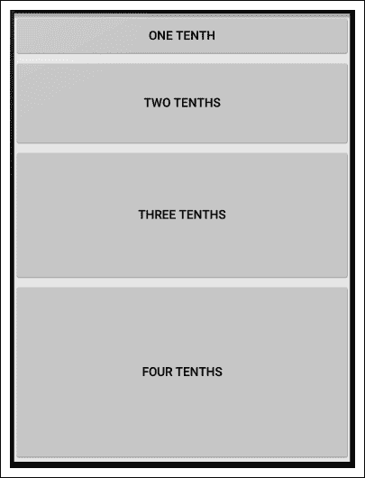
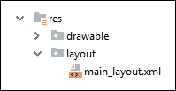
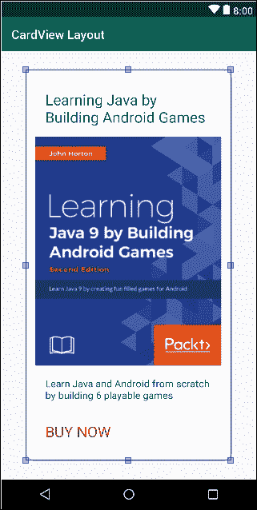
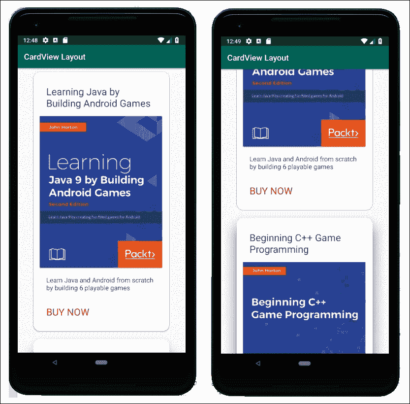
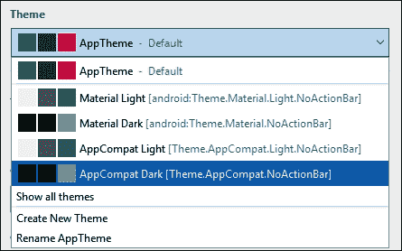
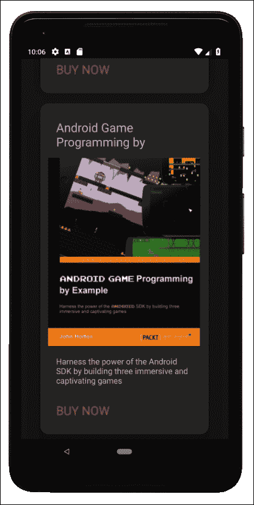
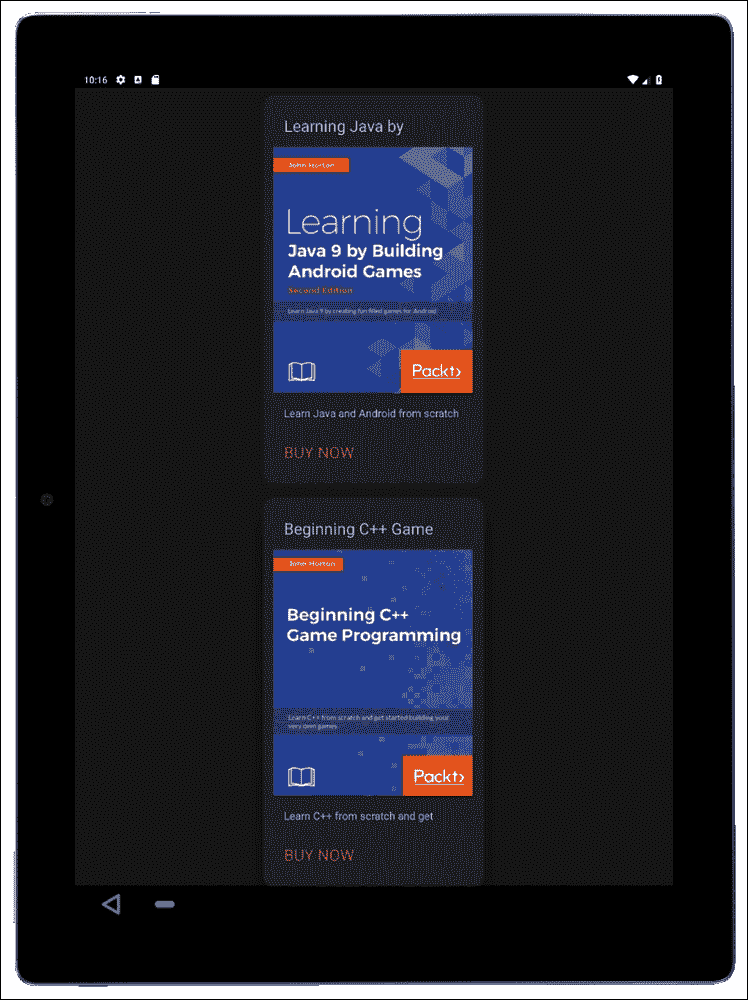

# 第五章。卡片视图和滚动视图的漂亮布局

在我们花一些时间关注 Kotlin 和面向对象编程之前，这是关于布局的最后一章。我们将在已经看到的一些不同属性上正式化我们的学习，我们还将引入两个更酷的布局:`ScrollView`和`CardView`。为了完成这一章，我们将在平板电脑模拟器上运行`CardView`项目。

在本章中，我们将涵盖以下主题:

*   编译用户界面属性的快速摘要
*   使用`ScrollView`和`CardView`构建我们迄今为止最漂亮的布局
*   切换和自定义主题
*   创建和使用平板电脑模拟器

让我们从概括一些属性开始。

# 属性–快速总结

在最后几章，我们已经使用和讨论了相当多不同的属性。我认为有必要快速总结并进一步研究一些更常见的问题。

## 使用差压进行上浆

正如我们所知，有成千上万种不同的安卓设备。安卓系统使用**密度无关像素**或 **dp** 作为测量单位，尝试并拥有一个适用于不同设备的测量系统。其工作方式是首先计算运行应用程序的设备上的像素密度。

### 类型

我们可以通过水平分辨率除以屏幕的水平尺寸(以英寸为单位)来计算密度。这些都是在运行我们的应用程序的设备上即时完成的。

我们所要做的就是在设置小部件的各种属性的大小时，将`dp`与一个数字结合使用。使用与密度无关的测量，我们可以设计布局，在尽可能多的不同屏幕上创建统一的外观。

那么，问题解决了吗？我们只是在任何地方使用`dp`，我们的布局在任何地方都会起作用？不幸的是，密度无关只是解决方案的一部分。在本书的其余部分，我们将看到更多关于如何让我们的应用程序在一系列不同的屏幕上看起来很棒的。

例如，我们可以通过向小部件的属性添加以下代码来影响其高度和宽度:

```kt
...
android:height="50dp"
android:width="150dp"
...
```

或者，我们可以使用属性窗口，并通过适当的编辑框添加它们。你使用哪一种选择将取决于你的个人偏好，但有时在特定情况下，一种方式会比另一种方式更合适。这两种方法都是正确的，当我们浏览图书制作应用程序时，我通常会指出一种方法是否比另一种方法更好。

我们也可以用同样的`dp`单位来设置其他属性，比如边距和填充。我们将在一分钟内更仔细地查看页边距和填充。

## 使用 sp 调整字体大小

另一个用于调整安卓字体大小的设备相关测量单位是**可缩放像素**，或 **sp** 。`sp`度量单位用于字体，并且与`dp`完全一样，取决于像素密度。

安卓设备在根据你使用的`sp`值决定你的字体大小时，会使用额外的计算，这是用户自己的字体大小设置。因此，如果你用正常大小的字体在设备和模拟器上测试你的应用程序，那么一个视力受损(或者只是喜欢大字体)并且字体设置为大的用户会看到一些与你在测试中看到的不同的东西。

如果您想尝试使用安卓设备的字体大小设置，您可以通过选择**设置|显示|字体 s** **e** 来进行:


正如我们在前面的截图中可以看到的，有相当多的设置，如果你在**巨大，**上尝试一下，区别就是，嗯，巨大！

我们可以在任何有文本的小部件中使用`sp`设置字体的大小。这包括`Button`、`TextView,`和调色板中**文本**类别下的所有用户界面元素，以及其他一些元素。我们通过如下设置`textSize`属性来实现:

```kt
android:textSize="50sp"
```

像往常一样，我们也可以使用属性窗口来实现同样的事情。

## 通过包裹或匹配确定尺寸

我们还可以决定用户界面元素的大小，以及许多其他用户界面元素相对于包含/父元素的行为。我们可以通过将`layoutWidth`和`layoutHeight`属性设置为`wrap_content`或`match_parent`来实现。

例如，假设我们将布局中一个单独按钮的属性设置为:

```kt
...
android:layout_width="match_parent"
android:layout_height="match_parent"
....
```

然后，按钮将在高度和宽度上扩展到**与**父级**匹配。我们可以看到下一张图片中的按钮填满了整个屏幕:**


一个按钮更常见的是`wrap_content`，如下图所示:

```kt
....
android:layout_width="wrap_content"
android:layout_height="wrap_content"
....
```

这使得按钮变得像它需要的那样大，以**包裹其**内容**(宽度和高度在`dp`中，文本在`sp`中)。**

## 使用填充和边距

如果你曾经做过任何网页设计，你会非常熟悉接下来的两个属性。**填充**是从小部件边缘到小部件内容开始的空间。**边距**是小部件外部留在其他小部件之间的空间，包括其他小部件的边距(如果有的话)。这是一个可视化表示:


我们可以直接设置填充和边距，对所有边都是一样的，如下所示:

```kt
...
android:layout_margin="43dp"
android:padding="10dp"
...
```

看看在边距和填充的命名约定上的细微差别。填充值只是称为`padding,`，但边距值称为`layout_margin`。这反映了这样一个事实，即填充只影响 UI 元素本身，但边距会影响布局中的其他小部件。

或者，我们可以指定不同的顶部、底部、左侧和右侧边距和填充，如下所示:

```kt
android:layout_marginTop="43dp"
android:layout_marginBottom="43dp"
android:paddingLeft="5dp"
android:paddingRight="5dp"
```

为小部件指定边距和填充值是可选的，如果未指定任何内容，则假定值为零。我们也可以选择指定一些不同边的边距和填充，但不指定其他的，如前面的例子。

我们设计布局的方式非常灵活，这一点可能变得越来越明显，但也需要一些实践才能通过这些选项获得精确的结果。我们甚至可以指定负的边距值来创建重叠的小部件。

让我们再看一些属性，然后我们会继续玩一个时尚的布局，`CardView`。

## 使用布局 _ 权重属性

权重是指相对于其他 UI 元素的相对量。因此，为了使`layout_weight`有用，我们需要为两个或更多元素的`layout_weight`属性赋值。

然后，我们可以分配总计 100%的部分。这对于在用户界面的不同部分之间划分屏幕空间特别有用，在这些部分中，无论屏幕大小如何，我们都希望它们所占据的相对空间保持不变。

将`layout_weight`与`sp`和`dp`单元结合使用，可以实现简单灵活的布局。例如，看看这段代码:

```kt
<Button
        android:layout_width="match_parent"
        android:layout_height="0dp"
        android:layout_weight="0.10"
        android:text="one tenth" />

<Button
        android:layout_width="match_parent"
        android:layout_height="0dp"
        android:layout_weight="0.20"
        android:text="two tenths" />

<Button
        android:layout_width="match_parent"
        android:layout_height="0dp"
        android:layout_weight="0.30"
        android:text="three tenths" />

<Button
        android:layout_width="match_parent"
        android:layout_height="0dp"
        android:layout_weight="0.40"
        android:text="four tenths" />
```

下面是这段代码的作用:



注意所有`layout_height`属性都设置为`0dp`。实际上，`layout_weight`属性正在取代`layout_height`属性。我们使用`layout_weight`的背景很重要(否则它不会起作用)，我们将很快在一个真正的项目中看到这一点。还要注意，我们不必使用分数 1；我们可以使用整数、百分比和任何其他数字。只要是相对的，大概就会达到你所追求的效果。注意`layout_weight`只在特定的环境下起作用，当我们构建更多的布局时，我们会看到在哪里。

## 利用重力

**引力**可以是我们的朋友，可以在我们的布局中有这么多的用途。就像太阳系中的重力一样，它通过向给定的方向移动物品来影响物品的位置，就像它们受到重力的作用一样。了解重力能做什么的最好方法是看一些示例代码和图表:

```kt
android:gravity="left|center_vertical"
```

如果按钮(或另一个小部件)上的`gravity`属性设置为`left|center_vertical`，如前面的代码所示，它将具有如下效果:


请注意小部件的内容(在这种情况下是按钮的文本)确实是左对齐和居中垂直的。

此外，小部件可以通过`layout_gravity`元素影响自己在布局元素中的位置，如下所示:

```kt
android:layout_gravity="left"
```

这将按照预期在布局中设置小部件，如下所示:


前面的代码允许同一布局中的不同小部件受到影响，就好像该布局具有多个不同的权重一样。

通过使用与小部件相同的代码，布局中所有小部件的内容都可以受到其父布局的`gravity`属性的影响:

```kt
android:gravity="left"
```

事实上，比我们讨论的属性多得多。很多我们在这本书里不需要的，有些相当晦涩，所以你可能在你的整个安卓职业生涯中从来不需要它们。但是其他的都很常用，包括`background`、`textColor`、`alignment`、`typeface`、`visibility`、`shadowColor`。现在让我们探索更多的属性和布局。

# 用卡片视图和滚动视图构建用户界面

以通常的方式创建一个新项目。命名项目`CardView Layout`，选择**空活动**项目模板。保持其余所有设置与之前所有项目相同。

为了使能够编辑我们的主题并正确测试结果，我们需要生成我们的布局文件，并通过从`onCreate`函数调用`setContentView`函数来编辑 Kotlin 代码以显示它。我们将在`ScrollView`布局中设计我们的`CardView`杰作，顾名思义，它允许用户滚动浏览布局的内容。

右键单击`layout`文件夹，选择**新建**。注意**布局资源** **文件**有一个选项。选择**布局资源文件**，会看到**新建资源文件**对话框窗口。

在**文件名**字段中，输入`main_layout`。名字是随意的，但是这个布局将作为我们的主要布局，所以名字使它变得简单。

请注意将其设置为**线性布局**作为**根**元素选项。改为`ScrollView`。这种布局类型看起来就像`LinearLayout,`一样工作，只是当屏幕上显示的内容太多时，它会允许用户用手指滑动来滚动内容。

点击**确定**按钮，安卓工作室将在一个名为`main_layout`的 XML 文件中生成一个新的`ScrollView`布局，并将其放置在`layout`文件夹中，为我们构建基于`CardView`的用户界面做好准备。

您可以在下面的截图中看到我们的新文件:



安卓工作室也将打开用户界面设计器，准备行动。

## 用柯特林代码设置视图

正如我们之前所做的，我们现在将通过调用`MainActivity.kt`文件中的`setContentView`函数来加载`main_layout.xml`文件作为我们的应用程序的布局。

选择`MainActivity.kt`选项卡。如果默认情况下选项卡不存在，您可以在`app/java/your_package_name`下的项目浏览器中找到它，其中`your_package_name`等于您在创建项目时选择的包名。

修改`onCreate`函数中的代码，使其看起来与下一个代码完全一样。我强调了您需要添加的那一行:

```kt
override fun onCreate(savedInstanceState: Bundle?) {
   super.onCreate(savedInstanceState)
   setContentView(R.layout.main_layout);
}
```

你现在可以运行这个应用程序，但是除了一个空的`ScrollView`布局，什么也看不到。

## 添加图像资源

我们这个项目需要一些图片。这是为了让我们演示如何将它们添加到项目中(本节)，并以`CardView`布局整齐地显示和格式化它们(下一节)。

你从哪里得到图像并不重要。本练习的目的是实践动手经验。为了避免版权和版税问题，我将使用来自 Packt 出版网站的一些书籍图像。这也让我很容易为你提供完成项目所需的所有资源，如果你不想去麻烦获取自己的图像。请随意交换`Chapter05/CardViewLayout/res/drawable`文件夹中的图像。

有三个图像:`image_1.png`、`image_2.png`和`image_3.png`。要将它们添加到项目中，请按照下列步骤操作。

1.  使用操作系统的文件资源管理器查找图像文件。
2.  全部高亮显示，按 *Ctrl* + *C* 复制。
3.  在安卓工作室项目浏览器中，左键选择`res/drawable`文件夹。
4.  右键单击`drawable`文件夹，选择**粘贴。**
5.  在要求您**选择目的地目录**的弹出窗口中，点击**确定**接受默认目的地，即`drawable`文件夹。
6.  再次单击**确定**以**复制指定文件。**

您现在应该可以在`drawable`文件夹中看到您的图像，以及项目创建时安卓工作室放在那里的其他几个文件，如下图所示:


在我们进入`CardView,`之前，让我们设计一下我们将放在它们里面的东西。

## 为卡片创建内容

下一步我们需要做的是为我们的卡片创建内容。将内容与布局分开是有意义的。我们要做的是创建三个独立的布局，分别叫做`card_contents_1`、`card_contents_2,`和`card_contents_3`。它们将各自包含一个`LinearLayout`，其中将包含实际的图像和文本。

让我们再创建三个以`LinearLayout`为根的布局:

1.  右键单击`layout`文件夹，选择**新建布局资源文件**。
2.  命名文件`card_contents_1`并确保选择**线性布局**作为**根元素**
3.  单击**确定**将文件添加到`layout`文件夹
4.  重复步骤一至三两次，每次将文件名改为`card_contents_2`，然后再改为`card_contents_3`

现在，选择`card_contents_1.xml`选项卡，并确保您处于设计视图中。我们将拖动并将一些元素拖放到布局中以获得基本结构，然后我们将添加一些`sp`、`dp`和重力属性以使它们看起来美观:

1.  将`TextView`小部件拖到布局的顶部。
2.  将`ImageView`部件拖到`TextView`部件下方的布局上。
3.  在**资源**弹出窗口中，选择**项目** | **图像 _1** ，然后点击**确定。**
4.  将另外两个**文本视图**部件拖到图像下方。
5.  This is how your layout should now appear:

    

现在，让我们使用一些材料设计准则来使布局看起来更有吸引力。

### 类型

当您继续进行这些修改时，布局底部的用户界面元素可能会从设计视图的底部消失。如果发生这种情况，请记住，您始终可以从调色板下方的**组件树**窗口中选择任何用户界面元素。或者，参考下一个提示。

另一种最小化问题的方法是使用更大的屏幕，如以下说明所述:

### 类型

我将设计视图的默认设备更改为 **Pixel 2 XL** 来创建之前的截图。我将把这个设置留给本书的其余部分，除非我特别提到我正在改变它。它允许在布局上多几个像素，这意味着这个布局更容易完成。如果您也想这样做，请查看设计视图上方的菜单栏，单击设备下拉列表，然后选择您的设计视图设备，如下图所示:


1.  将顶部`TextView`小部件的`textSize`属性设置为`24sp.`
2.  将**布局 _ 边距** | **所有**属性设置为`16dp.`
3.  将`text`属性设置为**通过构建安卓游戏**学习 Java(或者任何适合你形象的标题)。
4.  在`ImageView`上，将`layout_width`和`layout_height`设置为`wrap_content.`
5.  在`ImageView`上，将`layout_gravity`设置为`center_horizontal.`
6.  在`ImageView,`下方的`TextView`上，将`textSize`设置为`16sp.`
7.  在上同样`TextView,`设置**布局 _ 边距** | **所有**到`16dp.`
8.  在同一个`TextView,`上，将`text`属性设置为`Learn Java and Android from scratch by building 6 playable games`(或者描述你的形象的东西)。
9.  在底部`TextView,`将`text`属性更改为`BUY NOW.`
10.  在同一个`TextView,`上设置**布局 _ 边距** | **所有**到`16dp.`
11.  在同一`TextView,`上将`textSize`属性设置为`24sp.`
12.  在同一`TextView,`上将`textColor`属性设置为`@color/colorAccent.`
13.  在包含所有其他元素的`LinearLayout`上，将`padding`设置为`15dp`。请注意，从**组件树**窗口中选择`LinearLayout`是最简单的。
14.  At this point, your layout will look very similar to the following screenshot:

    

现在，用完全相同的尺寸和颜色布置另外两个文件(`card_contents_2`和`card_contents_3)`)。当您获得**资源**弹出菜单选择图像时，分别使用`image_2`和`image_3`。此外，更改前两个`TextView`元素的所有`text`属性，使标题和描述是唯一的。标题和描述并不重要；我们正在学习的是布局和外观。

### 类型

注意，所有尺寸和颜色均来自[https://material.io/design/introduction](https://material.io/design/introduction)的材质设计网站，以及[https://developer.android.com/guide/topics/ui/look-and-feel](https://developer.android.com/guide/topics/ui/look-and-feel)的安卓专属 UI 指南。这本书很值得你边读边读，或者在你读完之后马上读。

我们现在可以继续`CardView`了。

## 定义卡片视图的尺寸

右键单击`values`文件夹，选择**新建** | **值资源文件**。在**新建资源文件**弹出窗口中，命名文件`dimens.xml`(尺寸的简称)，点击**确定**。我们将使用这个文件来创建一些共同的值，我们的`CardView`对象将通过引用它们来使用这些值。

为了实现这一点，我们将直接编辑 XML。将`dimens.xml`文件编辑为与以下代码相同:

```kt
<?xml version="1.0" encoding="utf-8"?>
<resources>
    <dimen name="card_corner_radius">16dp</dimen>
    <dimen name="card_margin">10dp</dimen>
</resources>
```

确保使其完全相同，因为一个小的遗漏或错误可能会导致错误并阻止项目工作。

我们定义了两个资源，第一个资源名为`card_corner_radius,`，值为`16dp,`，第二个资源名为`card_margin,`，值为`10dp`。

我们将在`main_layout`文件中引用这些资源，并使用它们来一致地配置我们的三个`CardView`元素。

## 将卡片视图添加到我们的布局中

切换到`main_layout.xml`选项卡，确保您在设计视图中。你可能还记得我们现在使用的是`ScrollView`，它可以滚动应用程序的内容，就像网络浏览器滚动不适合一个屏幕的网页内容一样。

`ScrollView`有一个限制——只能有一个直接子布局。我们希望它包含三个`CardView`元素。

要解决这个问题，请从调色板的`Layouts`类别中拖动一个`LinearLayout`。确保在调色板中选择**线性布局(垂直)，**如该图标所示:


我们将在`LinearLayout`中添加我们的三个`CardView`对象，然后整个东西会滚动得很好很流畅，没有任何错误。

`CardView`可以在调色板的**容器**类别中找到，所以切换到该类别并定位`CardView`。

将一个`CardView`对象拖到设计上的`LinearLayout`上，你会在安卓工作室得到一个弹出消息。这是图中的信息:


点击**确定**按钮，安卓工作室会在幕后做一些工作，为项目添加必要的部分。安卓工作室在这个项目中增加了更多的类，特别是为旧版本的安卓提供`CardView`功能的类，否则这些类不会有这些功能。

你现在应该在设计上有一个`CardView`对象了。直到其中有一些内容，`CardView`对象只在**组件树**窗口中容易看到。

通过**组件树**窗口选择`CardView`对象，并配置以下属性:

*   将`layout_width`设置为`wrap_content`
*   将`layout_gravity`设置为`center`
*   将**布局 _ 边距** | **全部**设置为`@dimens/card_margin`
*   将`cardCornerRadius`设置为`@dimens/card_corner_radius`
*   将`cardEleveation`设置为`2dp`

现在，切换到**文本**选项卡，您会发现您有一些与下一个代码非常相似的东西:

```kt
<androidx.cardview.widget.CardView
   android:layout_width="wrap_content"
   android:layout_height="wrap_content"
   android:layout_gravity="center"
   android:layout_margin="@dimen/card_margin"
   app:cardCornerRadius="@dimen/card_corner_radius"
   app:cardElevation="2dp" />
```

前面的代码列表只显示了`CardView`对象的代码。

目前的问题是我们的`CardView`对象是空的。让我们通过添加`card_contents_1.xml`的内容来解决这个问题。下面是如何做到的。

## 在另一个布局中包含布局文件

我们需要非常轻微地编辑代码，原因如下。我们需要在代码中添加一个`include`元素。`include`元素是将从`card_contents_1.xml`布局插入内容的代码。问题是，要添加这段代码，我们需要稍微改变`CardView` XML 的格式。当前格式以一个标签开始和结束`CardView`对象，如下所示:

```kt
<androidx.cardview.widget.CardView
…
…/>
```

我们需要像这样将格式更改为单独的开始和结束标记(暂时不要更改任何内容):

```kt
<androidx.cardview.widget.CardView
…
…
</androidx.cardview.widget.CardView>
```

这种格式的改变将使我们能够添加`include…`代码，我们的第一个`CardView`对象将完成。考虑到这一点，将`CardView`的代码编辑为与以下代码完全相同。我已经突出显示了两行新代码，但也注意到在`cardElevation`属性之后的正斜杠也被删除了:

```kt
<androidx.cardview.widget.CardView
   android:layout_width="wrap_content"
   android:layout_height="wrap_content"
   android:layout_gravity="center"
   android:layout_margin="@dimen/card_margin"
   app:cardCornerRadius="@dimen/card_corner_radius"
   app:cardElevation="2dp" >

 <include layout="@layout/card_contents_1" />

</androidx.cardview.widget.CardView>

```

现在，您可以在可视化设计器中查看`main_layout`文件，并查看`CardView`对象内部的布局。视觉设计师没有揭示`CardView`真正的美学。我们将很快看到所有`CardView`小部件在完成的应用程序中很好地滚动。这是到目前为止我们进展的截图:



将另外两个`CardView`小部件添加到布局中，并与第一个小部件一样配置它们，只有一个例外。在第二个`CardView`对象上，将`cardElevation`设置为`22dp`，在第三个`CardView`对象上，将`cardElevation`设置为`42dp`。另外，将`include`代码改为分别引用`card_contents_2`和`card_contents_3`。

### 类型

您可以通过复制和粘贴`CardView` XML 并简单地修改高程和`include`代码来非常快速地做到这一点，如前一段所述。

现在，我们可以运行该应用程序，并看到我们的三个美丽的，高架`CardView`小部件在行动。在下一张截图中，我将两个截图并排进行了 photoshopped 处理，因此您可以看到一个完整的`CardView`布局正在运行(在左侧)，并且在右侧的图像中，立面设置具有的效果，这创建了一个非常令人满意的深度，具有阴影效果:



### 注

在这本书的黑白印刷版本中，图像可能会稍微不清楚。一定要自己构建并运行这个应用，才能看到这种酷炫的效果。

现在我们可以玩转编辑 app 的主题了。

# 主题和材质设计

创建一个新主题，从技术上来说是非常容易的，一分钟后我们就来看看怎么做。然而，从艺术的角度来看，这更难。选择哪些颜色可以很好地搭配，更不用说适合你的应用和图像了，这要困难得多。幸运的是，我们可以求助于材料设计。

材料设计对用户界面设计的每个方面都有指导方针，所有的指导方针都有很好的记录。甚至我们在`CardView`项目中使用的文本和填充的大小都来自材料设计指南。

材质设计不仅可以让你设计自己的配色方案，还可以提供现成配色方案的调色板。

### 类型

这本书不是关于设计的，尽管它是关于实现设计的。为了让您开始，我们设计的目标可能是使我们的用户界面独特，并在让用户感到舒适甚至熟悉的同时脱颖而出。

主题是由 XML `style`项构建的。我们在[第三章](05.html "Chapter 3. Exploring Android Studio and the Project Structure")、*探索安卓工作室和项目结构*中看到了`styles.xml`文件。`styles`文件中的每一项都定义了外观，并给它起了一个名字，如`colorPrimary`或`colorAccent`。

剩下的问题是，我们如何选择我们的颜色，如何在我们的主题中实现它们？第一个问题的答案有两个可能的选择。第一个答案是注册一门设计课程，在接下来的几年里学习用户界面设计。更有用的答案是使用内置主题之一，并根据材料设计指南进行定制，在[https://developer . Android . com/guide/topics/UI/look-and-feel/](https://developer.android.com/guide/topics/ui/look-and-feel/)对每个 UI 元素进行了深入讨论。

我们现在就做后者。

## 使用安卓工作室主题设计器

从安卓工作室主菜单中，选择**工具** | **主题编辑器**。在左侧，请注意显示主题外观的用户界面示例，右侧是编辑主题各个方面的控件:


如前所述，创建自己的主题最简单的方法是从现有的主题开始，然后进行编辑。在**主题**下拉列表中，选择一个你喜欢的主题。我选择了**AppCompat**T5【黑暗】T6:



选择右侧要更改颜色的任何项目，并在屏幕中选择以下颜色:


系统会提示您为新主题选择一个名称。我称我的为`Theme.AppCompat.MyDarkTheme`:


现在，点击**修复**文本，将你的主题应用到当前应用，如下图所示:


然后，您可以在模拟器上运行您的应用程序来查看正在运行的主题:



到目前为止，我们所有的应用都是在手机上运行的。显然，安卓设备生态系统的很大一部分是平板电脑。让我们看看如何在平板电脑模拟器上测试我们的应用程序，以及深入了解这个多样化的生态系统将给我们带来的一些问题，然后我们可以开始学习克服这些问题。

# 创建平板电脑模拟器

选择**工具** | **AVD 管理器**和，然后点击**您的虚拟设备**窗口上的**创建虚拟设备…** 按钮。您将在下面的截图中看到**选择硬件**窗口:


从**类别**列表中选择**平板电脑**选项，然后从可用平板电脑的选择中突出显示**像素 C** 平板电脑。这些选项在前面的截图中突出显示。

### 类型

如果你在将来某个时候读到这篇文章，像素 C 选项可能已经被更新了。选择平板电脑不如实践创建平板电脑模拟器然后测试应用程序的过程重要。

点击**下一步**按钮。在随后的**系统映像**窗口中，只需点击**下一步**，因为这将选择默认系统映像。选择您自己的映像可能会导致模拟器无法正常工作。

最后，在**安卓虚拟设备**屏幕上，可以保留所有默认选项不变。如果您想，可以随意更改仿真器的 **AVD 名称**或**启动方向**(纵向或横向):


准备好之后点击**完成**按钮。

现在，无论何时你运行安卓工作室的某个应用，你都可以选择**像素 C** (或者你创建的任何平板电脑)。这是我运行`CardView`应用的 Pixel C 模拟器截图:



不算太差但是浪费的空间相当大，看起来有点稀疏。让我们在风景模式下试试。如果你尝试用平板电脑在横向模式下运行应用程序，结果会更糟。我们可以从中学到的是，我们必须为不同尺寸的屏幕和不同的方向设计布局。有时，这些将是巧妙的设计，可以根据不同的尺寸或方向进行缩放，但通常它们将是完全不同的设计。

# 常见问题

问)我需要掌握所有这些关于材料设计的东西吗？

a)不会，除非你想成为专业设计师。如果你只想制作自己的应用程序，并在 Play 商店出售或赠送，那么了解基本知识就足够了。

# 总结

在本章中，我们构建了美观的`CardView`布局，并将它们放在`ScrollView`布局中，这样用户就可以像浏览网页一样浏览布局的内容。在这一章的最后，我们推出了一款平板电脑仿真器，并发现如果我们想要迎合不同的设备尺寸和方向，就需要在布局设计方面变得更加聪明。在[第 24 章](26.html "Chapter 24. Design Patterns, Multiple Layouts, and Fragments")、*设计模式、多种布局和碎片*中，我们将开始将我们的布局提升到下一个层次，并学习如何使用安卓碎片来应对如此多样化的设备阵列。

然而，在我们这样做之前，它将很好地帮助我们了解更多关于 Kotlin 的知识，以及我们如何使用它来控制我们的用户界面和与用户交互。这将是接下来七章的重点。

当然，在这一点上，房间里的大象是，尽管学习了很多关于布局、项目结构、Kotlin 和 XML 之间的联系，以及更多，我们的用户界面，无论多么漂亮，实际上什么都不做！我们需要认真升级我们的 Kotlin 技能，同时也要学习如何在安卓环境中应用它们。

在下一章中，我们将完全这样做。我们将看看如何通过使用**安卓活动生命周期**，添加恰好在我们需要的时刻执行的 Kotlin 代码。