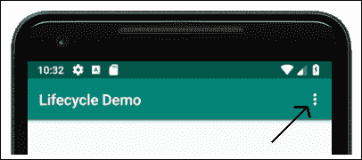

# 第六章。安卓的生命周期

在本章中，我们将熟悉安卓应用程序的生命周期。计算机程序有生命周期的想法起初可能听起来很奇怪，但很快就会有意义。

生命周期是所有安卓应用程序与安卓操作系统交互的方式。就像人类的生命周期使他们能够与周围的世界互动一样，我们别无选择，只能与安卓的生命周期互动，如果我们想让我们的应用程序生存下去，我们必须准备好处理无数不可预测的事件。

我们将探索应用程序经历的生命周期的各个阶段，从创建到销毁，以及这如何帮助我们知道*将我们的 Kotlin 代码放在哪里，这取决于我们试图实现什么。*

在本章中，我们将探讨以下主题:

*   安卓应用的生活和时代
*   覆盖的过程和`override`关键字
*   安卓生命周期的各个阶段
*   我们需要知道和做什么来编码我们的应用程序
*   生命周期演示应用程序
*   安卓代码是如何构造的，并为下一章深入Kotlin编码做准备

让我们开始了解安卓的生命周期。

# 一款安卓应用的生命和时代

我们已经谈到了我们代码的结构；我们知道我们可以编写类，在这些类中，我们有函数，这些函数包含我们的代码，这些代码完成了事情。我们还知道，当我们希望函数内的代码运行(即**被**执行)时，我们**通过使用函数的名称来调用**该函数。

此外，在[第二章](04.html "Chapter 2. Kotlin, XML, and the UI Designer")、*柯特林、XML 和用户界面设计器*中，我们了解到安卓本身在应用程序准备启动之前就调用了`onCreate`功能。当我们输出到 logcat 窗口并使用`Toast`类向用户发送弹出消息时，我们看到了这一点。

在这一章中，我们将研究在我们编写的每个应用程序的整个生命周期中发生了什么；也就是说，当它开始，结束，以及中间的阶段。我们将看到的是，安卓每次运行时都会在许多场合与我们的应用程序进行交互。

## 安卓如何与我们的应用互动

安卓通过调用`Activity`类中包含的函数与我们的应用程序进行交互。即使该函数在我们的 Kotlin 代码中不可见，它仍然在适当的时候被 Android 调用。如果这看起来没有任何意义，那就继续读下去。

你有没有想过为什么`onCreate`函数的前面会有不寻常的`override`关键字？考虑以下代码行:

```kt
override fun onCreate(…
```

当我们覆盖像`onCreate`这样的函数时，我们是在对安卓说，当你调用`onCreate`时，请使用我们被覆盖的版本，因为我们在其中有一些我们想要执行的代码。

此外，您可能还记得`onCreate`函数中看起来不寻常的第一行代码:

```kt
super.onCreate(savedInstanceState)
```

这是在告诉安卓在继续我们的覆盖版本之前调用`onCreate`的原始版本。

还有许多我们可以随意覆盖的其他功能，它们允许我们在安卓应用程序的生命周期内的适当时间添加代码。就像`onCreate`在 app 展示给用户之前被调用一样，在其他时间也有其他函数被调用。我们还没有看到它们或者覆盖它们，但是它们在那里，它们被调用，它们的代码执行。

之所以我们需要知道和理解*我们的*应用的功能，安卓随时可以调用它，是因为这些功能控制着我们代码的生死。例如，如果我们的应用程序允许用户键入重要提醒，那么，在键入提醒的中途，他们的电话响起，我们的应用程序消失，数据(即用户的重要提醒)消失了，会怎么样？

了解什么时候、为什么以及安卓将调用哪些功能作为我们应用程序生命周期的一部分是至关重要的，谢天谢地，这非常简单。然后，我们可以理解在哪里需要覆盖函数来添加我们自己的代码，以及在哪里添加定义我们的应用程序的真正功能(代码)。

让我们来研究一下安卓的生命周期。然后，我们可以继续了解 Kotlin 的来龙去脉，并了解我们编写的代码应该放在哪里。

# 安卓生命周期的简化解释

如果你曾经使用过安卓设备，你可能已经注意到它的工作方式与许多其他操作系统截然不同。例如，你可以在你的设备上使用一个应用程序，也许可以检查人们在脸书做什么。

然后，您会收到一封电子邮件通知，并点击该通知进行阅读。在阅读电子邮件的中途，你可能会收到推特通知，因为你正在等待你关注的人的重要消息，你会中断你的电子邮件阅读，轻轻一点就把应用程序换成推特。

看完推文，你看中了一款*愤怒的小鸟*的游戏；然而，在第一次放纵的中途，你突然想起了《脸书邮报》。所以，你退出*愤怒的小鸟*，点击脸书图标。

你很可能会在离开脸书的同一个地方重新开始。之后，你可以继续阅读邮件，决定回复推文，或者启动一个全新的应用程序。

所有这一切都需要操作系统进行大量管理，并且独立于各个应用程序本身。

例如，在我们刚刚讨论的背景下，视窗电脑和安卓之间的区别是显而易见的。在安卓系统中，虽然用户决定使用哪个应用程序，但操作系统会决定何时关闭(或销毁)一个应用程序以及我们用户的数据(如假设的笔记)。我们在编写应用程序时需要考虑这一点；仅仅因为我们可能会编写代码来对用户的输入做一些有趣的事情，并不意味着 Android 会让代码执行。

## 生命周期阶段被揭开神秘面纱

安卓系统有许多不同的阶段，任何给定的应用程序都可以进入这些阶段。根据不同的阶段，安卓系统决定用户如何查看应用，或者是否查看应用。

安卓有这些阶段，这样它就可以决定哪个应用程序正在使用，然后可以为应用程序分配正确的资源量，例如内存和处理能力。

此外，当用户与设备交互时(例如，触摸屏幕)，安卓必须将该交互的细节提供给正确的应用程序。例如，*愤怒的小鸟*中的拖拽和释放动作意味着拍摄，但在消息应用中，它可能意味着删除一条短信。

我们已经提出了用户什么时候退出我们的 app 接听电话的问题；他们会失去进度、数据或重要记录吗？

安卓有一个系统，出于解释的目的稍微简化一下，这意味着安卓设备上的每个应用程序都处于以下阶段之一:

*   正在创建
*   开始
*   重新开始
*   运转
*   暂停
*   填料
*   被摧毁

希望这个阶段列表看起来合乎逻辑。举个例子，用户按下脸书 app 图标，app 正在创建**；然后，是**启动了**。到目前为止，这一切都很简单，但是列表中的下一个阶段是**恢复**。**

 **这并不像最初看起来的那样不合逻辑。如果有那么一瞬间，我们可以接受应用程序在启动后恢复，那么随着我们的继续，一切都会变得清晰。

**恢复后，**app 正在**运行**。此时，脸书应用程序可以控制屏幕，拥有更大份额的系统内存和处理能力，并且正在接收用户输入的详细信息。

那么，我们从脸书应用程序切换到电子邮件应用程序的例子呢？

当我们点击前往阅读我们的电子邮件时，脸书应用将进入**暂停**阶段，随后**停止**阶段，电子邮件应用将进入**正在**T6】创建阶段，随后**恢复**，然后**运行**。

如果我们决定重游脸书，就像之前的场景一样，脸书应用可能会跳过正在创建的**，直接进入**恢复**，然后再次运行**(很可能就在我们离开的地方)。****

 ****注意，在任何时候，安卓都可以决定**停止**，然后**销毁**一个应用，在这种情况下，当我们再次运行该应用时，它将需要再次被**在第一阶段创建**。

因此，如果脸书应用程序停止运行足够长的时间，或者也许*愤怒的小鸟*需要如此多的系统资源，以至于安卓已经**摧毁了**脸书应用程序，那么我们找到之前阅读的准确帖子的体验可能会有所不同。关键是它在应用程序的控制范围内，以及它如何与生命周期交互来决定用户的体验。

如果这一切都开始变得混乱，那么你会很高兴知道提到这些阶段的唯一原因是由于以下原因:

*   你知道他们的存在
*   我们偶尔需要与他们互动
*   当我们这样做的时候，我们会一步一步来

# 我们如何处理生命周期阶段

当我们正在编程一个应用程序时，我们如何与这种复杂性交互？好消息是，当我们创建第一个项目时自动生成的安卓代码为我们完成了大部分工作。

正如我们已经讨论过的，我们只是没有看到处理这种交互的函数，但是如果我们需要的话，我们确实有机会覆盖它们，并在那个阶段添加我们自己的代码。

这意味着我们可以继续学习Kotlin和制作安卓应用程序，直到我们偶尔需要在其中一个阶段做些什么。

### 注

如果我们的应用程序有多个活动，它们将有各自的生命周期。这不一定会让事情变得复杂，总的来说，它会让事情变得更容易。

下面的列表快速解释了安卓提供的管理生命周期阶段的功能。为了澄清我们对生命周期功能的讨论，它们被列在我们已经讨论过的相应阶段的旁边。然而，正如您将会看到的，函数名清楚地表明了它们适合的位置。

在列表中，还有一个简短的解释或建议，说明为什么我们可能在每个阶段使用每个函数进行交互。当我们阅读这本书的时候，我们会遇到这些功能中的大部分；当然，我们已经看到了:

*   `onCreate`:该功能在创建*活动*时执行。在这里，我们为应用程序做好了一切准备，包括用户界面(如调用`setContentView`)、图形和声音。
*   `onStart`:该功能在 app 处于*启动*阶段时执行。
*   `onResume`:该功能在`onStart`之后运行，但也可以在我们的活动在之前暂停后恢复后进入(最符合逻辑)。我们可能会重新加载之前保存的用户数据(例如重要的注释)，从应用程序被中断的时候开始，可能是因为一个电话或者用户运行另一个应用程序。
*   `onPause`:当我们的应用程序*暂停*时会出现这种情况。在这里，我们可以保存未保存的数据(如注释)，这些数据可以在`onResume`中重新加载。当另一个用户界面元素显示在当前活动的顶部时(例如，弹出对话框)，或者当活动即将停止时(例如，当用户导航到不同的活动时)，活动总是转换到暂停状态。
*   `onStop`:这涉及到*停止*阶段。这是我们可以撤销在`onCreate`中所做的一切的地方，比如释放系统资源或者将信息写入数据库。如果我们到达这里，活动可能很快就会被摧毁。
*   `onDestroy`:这是我们的活动最终被*摧毁的时候*。在这个阶段没有回头路。这是我们有序拆除应用的最后机会。如果活动达到这一阶段，它将需要在下次使用应用程序时从头开始经历生命周期阶段。

下图显示了函数之间可能的执行流程:


所有的功能描述及其相关阶段应该看起来简单明了。唯一真正的问题是:跑步阶段呢？正如您将看到的，当我们在其他函数和阶段编写代码时，`onCreate`、`onStart`和`onResume`函数将准备应用程序，然后应用程序将持续运行，形成运行阶段。然后，`onPause`、`onStop`和`onDestroy`功能将在之后出现。

现在我们可以用一个小应用程序来观察这些生命周期功能。我们将通过覆盖它们并为每个添加一个`Log`消息和一个`Toast`消息来实现。这将直观地展示我们的应用所经历的阶段。

# 生命周期演示应用

在这一部分，我们将做一个快速实验，这将有助于我们熟悉我们的应用程序使用的生命周期功能，并给我们一个机会来玩更多的 Kotlin 代码。

按照以下步骤启动一个新项目，然后我们可以添加一些代码:

1.  启动新项目，选择**基础活动**项目模板；这是因为在这个项目中，我们还会查看控制 app 菜单的功能，**空活动**选项不会生成菜单。
2.  称之为**生命周期演示**。代码在`Chapter06/Lifecycle Demo`文件夹的下载包中，如果你想参考或者复制粘贴的话。
3.  保持其他设置，因为他们已经在我们所有的示例应用程序到目前为止。
4.  等待AndroidStudio生成项目文件，然后通过左键点击编辑器上方的**主活动**选项卡，在代码编辑器中打开`MainActivity.kt`文件(如果默认不为您打开)。

我们只需要`MainActivity.kt`文件进行演示，因为我们不会构建用户界面。

## 编写生命周期演示应用程序

在`MainActivity.kt`文件中，找到`onCreate`函数，在结束的大括号(`}`)前添加两行代码，这标志着`onCreate`函数的结束:

```kt
    Toast.makeText(this, "In onCreate", 
                Toast.LENGTH_SHORT).show()

    Log.i("info", "In onCreate")
```

### 类型

请记住，您需要使用 *Alt* + *输入* 键盘组合两次来导入`Toast`和`Log`所需的类。

在`onCreate`函数的右花括号(`}`)后，留一行空白，添加以下五个生命周期函数及其包含的代码。注意我们以什么顺序添加被覆盖的函数并不重要；安卓会以正确的顺序调用它们，而不管我们键入它们的顺序:

```kt
override fun onStart() {
  // First call the "official" version of this function
  super.onStart()

  Toast.makeText(this, "In onStart",
        Toast.LENGTH_SHORT).show()

  Log.i("info", "In onStart")
}

override fun onResume() {
  // First call the "official" version of this function
  super.onResume()

  Toast.makeText(this, "In onResume",
              Toast.LENGTH_SHORT).show()

  Log.i("info", "In onResume")
}

override fun onPause() {
  // First call the "official" version of this function
  super.onPause()

  Toast.makeText(this, "In onPause", 
               Toast.LENGTH_SHORT).show()

  Log.i("info", "In onPause")
}

override fun onStop() {
  // First call the "official" version of this function
  super.onStop()

  Toast.makeText(this, "In onStop", 
              Toast.LENGTH_SHORT).show()

  Log.i("info", "In onStop")
}

override fun onDestroy() {
  // First call the "official" version of this function
  super.onDestroy()

  Toast.makeText(this, "In onDestroy", 
              Toast.LENGTH_SHORT).show()

  Log.i("info", "In onDestroy")
}
```

首先，我们来谈谈代码本身。请注意，函数名都对应于生命周期函数及其相关阶段，我们在本章前面已经讨论过了。请注意，所有函数声明前面都有`override`关键字。另外，请注意每个函数内部的第一行代码是`super.on...`。

下面解释了到底发生了什么:

*   安卓在我们已经讨论过的不同时间调用我们的功能。
*   `override`关键字显示这些功能取代或覆盖了作为安卓应用编程接口一部分提供的功能的原始版本。请注意，我们没有看到这些被替换的功能，但它们确实存在，如果我们没有覆盖它们，这些原始版本将由安卓而不是我们调用。
*   `super.on...`代码是每个被覆盖函数中的第一行代码，然后调用这些原始版本。因此，我们不会为了添加自己的代码而简单地覆盖这些原始函数；我们也叫它们，它们的代码也被执行。

### 注

对于渴望阅读的读者来说，`super`关键词是超一流。随着本书的深入，我们将更多地探索函数覆盖和超类。

最后，您添加的代码将使每个功能输出一条`Toast`消息和一条`Log`消息。但是，输出的消息各不相同，从双语音标记(`""`)之间的文本可以看出。输出的消息将表明是哪个函数产生的。

## 运行生命周期演示应用程序

现在我们已经查看了代码，我们可以玩我们的应用程序，并从发生的事情中了解生命周期:

1.  在设备或模拟器上运行应用程序。
2.  观看模拟器的屏幕，您会看到以下消息一个接一个地显示为`Toast`消息:**在 onCreate** 、**在 onStart** 和**在 onResume** 中。
3.  请注意 logcat 窗口中的以下消息；如果消息太多，请记住您可以通过将**日志级别**下拉列表设置为**信息【T4:

    ```kt
     info:in onCreate
     info:in onStart
     info:in onResume

    ```

    来过滤它们**
4.  现在点击模拟器或设备上的后退按钮。请注意，您会收到以下三条`Toast`消息，其顺序如下: **In onPause** 、**In ontop**和 **In onDestroy** 。验证我们在 logcat 窗口中有匹配的输出。
5.  接下来，运行不同的应用程序。或许可以从[第 1 章](03.html "Chapter 1. Getting Started with Android and Kotlin")、*安卓和Kotlin*开始运行 Hello World 应用程序(但任何应用程序都可以)，方法是点击模拟器或设备屏幕上的图标。
6.  Now try opening the task manager on the emulator.

    ### 类型

    如果您不确定，可以参考[第 3 章](05.html "Chapter 3. Exploring Android Studio and the Project Structure")、*探索AndroidStudio和项目结构*以及“将模拟器用作真实设备”部分，了解如何在模拟器上进行此操作。

7.  你应该现在看到设备上所有最近运行的应用。
8.  点击生命周期演示应用程序，注意通常会显示三条启动消息；这是因为我们的应用程序之前被破坏了。
9.  现在再次点击任务管理器按钮，切换到 Hello World app。请注意，这一次只显示了 onPause 中的**和 ontop**中的**消息。验证我们在 logcat 窗口中有匹配的输出；这应该告诉我们 app 已经**而不是**被破坏了。**
10.  现在，再次使用任务管理器按钮，切换到生命周期演示应用程序。您将看到，只显示 onStart 中的**和 onResume** 中的**消息，表示无需`onCreate`即可让应用程序再次运行。这是意料之中的，因为该应用程序之前没有被销毁，而只是被停止了。**

接下来，让我们谈谈运行该应用时看到的情况。

## 检查生命周期演示应用程序输出

当我们第一次启动生命周期演示应用时，我们看到`onCreate`、`onStart`和`onResume`功能被调用。然后，当我们使用后退按钮关闭应用程序时，调用了`onPause`、`onStop`和`onDestroy`功能。

此外，我们从代码中知道，所有这些函数的原始版本也被调用，因为我们自己用`super.on...`代码调用它们，这是我们在每个被重写的函数中做的第一件事。

当我们使用任务管理器在应用程序之间切换时，我们的应用程序行为中的怪癖出现了，当从生命周期演示应用程序切换时，它没有被破坏，随后，当切换回来时，没有必要运行`onCreate`。

### 注

**我的吐司呢？**

打开三条和关闭三条`Toast`消息由操作系统排队，功能在显示时已经完成。您可以通过再次运行实验来验证这一点，并看到在第二条`Toast`消息显示之前，所有三条启动和关闭日志消息都已输出。然而，`Toast`的信息确实加强了我们对订单的了解，如果不是时间的话。

完全有可能(但不太可能)当你遵循前面的步骤时会得到稍微不同的结果。可以肯定的是，当我们的应用程序由数百万不同的用户在数千个不同的设备上运行时，这些用户对与他们的设备交互有不同的偏好，安卓将在不可预测的时间调用生命周期功能。

例如，当用户按下主页按钮退出应用程序时会发生什么？如果我们一个接一个地打开两个应用程序，然后使用后退按钮切换到更早的应用程序，这会破坏还是只是停止应用程序？当用户的任务管理器中有十几个应用程序，而操作系统需要销毁一些以前只停止的应用程序时，会发生什么；我们的应用会成为受害者之一吗？

当然，您可以在模拟器上测试前面所有的场景。但是结果只会在你第一次测试的时候才是真的。不能保证每次都会表现出相同的行为，当然也不能保证在每个不同的安卓设备上都会表现出来。

终于有了一些好消息；解决所有这些复杂性的方法是遵循一些简单的规则:

*   设置您的应用程序，使其可以在`onCreate`功能中运行。
*   在`onResume`功能中加载你的用户数据。
*   在`onPause`功能中保存您的用户数据。
*   整理好自己的 app，在`onDestroy`功能中做一个好的安卓公民。
*   注意本书中我们可能会用到`onStart`和`onStop`的几个场合。

如果我们遵循前面的规则，我们会看到，在本书的过程中，我们可以简单地停止担心生命周期，让安卓来处理它。

我们还可以覆盖其他一些函数；那么，让我们来看看它们。

# 其他一些被覆盖的功能

你可能已经注意到，在我们所有使用基本活动模板的项目代码中，还有另外两个自动生成的函数。分别是`onCreateOptionsMenu`和`onOptionsItemSelected`。许多安卓应用程序都有一个弹出菜单，所以AndroidStudio在使用基本活动模板时会默认生成一个，包括使其工作的代码大纲。

您可以从项目浏览器中看到描述`res/menu/menu_main.xml`中菜单的 XML。XML 代码的关键行如下:

```kt
<item
      android:id="@+id/action_settings"
      android:orderInCategory="100"
      android:title="@string/action_settings"
      app:showAsAction="never" />
```

这描述了带有**设置**文本的菜单**项目**。如果您运行我们使用基本活动模板构建的任何应用程序，您将看到如下截图所示的按钮:



如果您轻按该按钮，您可以看到它的动作如下:


那么，`onCreateOptionsMenu`和`onOptionsItemSelected`函数是如何产生这些结果的呢？

`onCreateOptionsMenu`功能从`menu_main.xml`文件加载菜单，代码如下:

```kt
menuInflater.inflate(R.menu.menu_main, menu)
```

它是由`onCreate`函数的默认版本调用的，这就是为什么我们没有看到它发生。

### 注

我们将使用[第 17 章](19.html "Chapter 17. Data Persistence and Sharing")、*数据持久化和共享*中的弹出菜单，在我们应用的不同屏幕之间切换。

当用户点击菜单按钮时，会调用`onOptionsItemSelected`功能。这个函数处理当一个项目被选中时会发生什么。现在，什么都没发生；它只是返回`true`。

请随意在这些函数中添加`Toast`和`Log`消息，以测试我刚才描述的顺序和时序。

现在我们已经看到了安卓生命周期是如何工作的，并且已经引入了许多可覆盖的函数来与这个生命周期进行交互，我们最好学习 Kotlin 的基础知识，这样我们就可以编写一些更有用的代码来进入这些函数，并且也可以编写我们自己的函数。

# Kotlin代码的结构——再探

我们已经看到，每次我们创建一个新的安卓项目，我们也会创建一个新的**包**；这是我们编写的代码的一种容器。

我们也学习了和**班**一起玩。我们已经从安卓应用编程接口中导入并直接利用了类，如`Log`和`Toast`。我们也使用了`AppCompatActivity`类，但是使用方式不同于`Log`和`Toast`类。您可能还记得到目前为止我们所有项目中的第一行代码，在`import`语句之后，使用了`:`符号来继承一个类:

```kt
class MainActivity : AppCompatActivity() {
```

当我们从一个类继承时，而不仅仅是导入它，我们正在使它成为我们自己的。事实上，如果你再看一下代码行，你可以看到我们正在创建一个新的类，有一个新的名字，`MainActivity`，但是它是基于安卓应用编程接口的`AppCompatActivity`类。

### 注

`AppCompatActivity`是`Activity`的修改版。它为旧版本的安卓提供了额外的功能，否则这些功能将不会出现。我们所讨论的关于`Activity`的一切，比如生命周期，对于`AppCompatActivity`来说同样如此。如果名字以`...Activity`结尾，那也没关系，因为我们讨论过的和将要讨论的一切都是同样真实的。我通常只是简单地称这个类为`Activity`。

我们可以将类的使用总结如下:

*   我们可以导入类来使用它们
*   我们可以从类继承来使用它们并扩展它们的功能
*   我们最终可以建立自己的班级(而且很快就会这样做)

我们自己的类和其他人编写的类是我们代码的构建块，类中的函数包装了功能代码——也就是完成工作的代码。

我们可以在我们扩展的类中编写函数，就像我们在[第 2 章](04.html "Chapter 2. Kotlin, XML, and the UI Designer")、*柯特林、XML 和用户界面设计器*中所做的那样。此外，我们重写已经是其他人编写的类的一部分的函数，例如`onCreate`和`onPause`。

然而，我们放入这些函数的唯一代码是使用`Toast`和`Log`的一些调用。现在，我们准备与Kotlin一起采取更多的步骤。

# 总结

在这一章中，我们了解到不仅是我们可以调用我们的代码；操作系统还可以调用包含在我们已经重写的函数中的代码。通过向各种被覆盖的生命周期函数添加适当的代码，我们可以确保在正确的时间执行正确的代码。

我们现在需要做的是学习如何编写更多的 Kotlin 代码。在下一章中，我们将开始关注 Kotlin，因为我们已经在安卓系统中有了如此好的基础，所以我们练习和使用所学的一切都没有问题。******