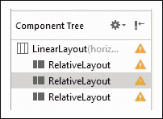
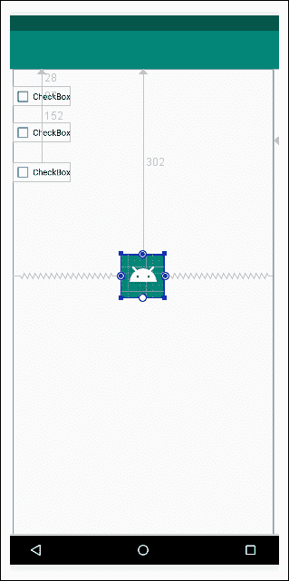
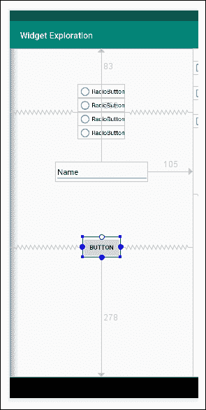

# 第十三章。让安卓小部件栩栩如生

既然我们已经很好地概述了安卓应用的布局和编码，以及我们对**面向对象编程** ( **OOP** )以及如何通过我们的Kotlin代码操作用户界面的新见解，我们就准备好从安卓工作室的调色板中尝试更多的小部件了。

有时候，面向对象编程是一件棘手的事情，本章介绍了一些对初学者来说很尴尬的话题。然而，通过逐渐学习这些新概念并反复练习，随着时间的推移，它们将成为我们的朋友。

在这一章中，我们将通过返回安卓工作室调色板，查看六个我们从未见过或尚未完全使用的小部件，来丰富我们的内容。

一旦我们这样做了，我们将把它们都放入一个布局中，并用我们的 Kotlin 代码练习操纵它们。

在本章中，我们将涵盖以下主题:

*   刷新我们关于声明和初始化布局小部件的记忆
*   看看如何用 Kotlin 代码创建小部件
*   看看`EditText`、`ImageView`、`RadioButton`(和`RadioGroup`)、`Switch`、`CheckBox`和`TextClock`小部件
*   了解如何使用 lambda 表达式
*   使用前面所有的小部件和大量的 lambda 表达式制作一个小部件演示迷你应用程序

让我们先简单回顾一下。

# 从布局中声明和初始化对象

我们知道当我们在`onCreate`函数中调用`setContentView`时，安卓会膨胀所有的小部件和布局，并将它们变成堆上的*真实的*实例。

我们知道要使用堆中的小部件，我们必须通过使用其唯一的`id`属性来拥有一个正确类型的对象。有时，我们必须专门从布局中获取一个小部件。例如，要获取对具有`txtTitle`的`id`属性的`TextView`类的引用，并将其分配给名为`myTextView`的新对象，我们可以执行以下操作:

```kt
// Grab a reference to an object on the Heap
val myTextView = findViewById<TextView>(R.id.txtTitle)
```

`myTextView`实例声明的左侧应该与我们在前面三章中声明的其他类的所有实例相似。这里的新之处在于，我们依赖函数的返回值来提供实例。`findViewById`函数确实返回了布局膨胀时在堆上创建的实例。所需实例由与布局中小部件的`id`属性匹配的函数参数标识。奇怪的`<TextView>`语法是**强制转换**或转换为`TextView`，因为函数返回超类类型`View`。

现在，使用我们的`myTextView`实例变量，我们可以做`TextView`类被设计来做的任何事情；例如，我们可以将文本设置为如下所示:

```kt
myTextView.text = "Hi there"
```

然后，我们可以让它像这样消失:

```kt
// Bye bye
myTextView.visibility = View.GONE
```

现在再次更改其文本并使其重新出现，如下所示:

```kt
myTextView.text = "BOO!"

// Surprise
myTextView.visibility = View.VISIBLE
```

值得一提的是，我们可以操作 Kotlin 中的任何属性，我们可以在前面的章节中使用 XML 代码设置这些属性。此外，我们已经暗示过，但实际上并没有看到，我们可以只使用代码从无到有地创建小部件。

# 从没有 XML 的纯 Kotlin 创建用户界面小部件

我们还可以从 Kotlin 对象中创建小部件，这些对象不是我们布局中对象的引用。我们可以用代码声明、实例化和设置小部件的属性，如下所示:

```kt
Val myButton = Button()
```

前面的代码创建了一个新的`Button`实例。唯一需要注意的是`Button`实例必须是布局的一部分，用户才能看到。因此，我们可以像以前使用`findViewById`函数一样，从我们的 XML 布局中获取对布局元素的引用，或者我们可以在代码中创建一个新的布局元素。

如果我们假设我们的 XML 中有一个属性等于 T2 的 T0，我们可以将前面代码行中的 T3 实例合并到其中，如下所示:

```kt
// Get a reference to the LinearLayout
val linearLayout = 
   findViewById<LinearLayout>(R.id.linearLayout)

// Add our Button to it
linearLayout.addView(myButton)
```

我们甚至可以用纯 Kotlin 代码创建一个完整的布局，首先创建一个新的布局，然后是我们想要添加的所有小部件，最后在其中有我们需要的小部件的布局上调用`setContentView`。

在下面这段代码中，我们在纯 Kotlin 中创建了一个布局，尽管是一个非常简单的布局，在一个`LinearLayout`中有一个`Button`实例:

```kt
// Create a new LinearLayout
val linearLayout = LinearLayout()

// Create a new Button
val myButton = Button()

// Add myButton to the LinearLayout
linearLayout.addView(myButton)

// Make the LinearLayout the main view of the app
setContentView(linearLayout)
```

这可能很明显，但仍然值得一提的是，仅在Kotlin设计一个详细而细致的布局就明显更尴尬，更难想象，而且不是最常见的方式。然而，有时我们会发现这样做是有用的。

我们现在的布局和小部件越来越先进了。然而，很明显，调色板中还有很多其他小部件(和用户界面元素)我们没有探索或交互过(除了将它们倾倒在布局中而不使用它们)；所以，让我们解决这个问题。

# 探索调色板–第 1 部分

让我们从调色板中旋风般地浏览一些以前未探索和未使用的项目，然后我们可以将它们拖到一个布局上，看看它们可能有什么有用的功能。然后，我们可以实施一个项目来使用它们。

上一章我们已经探讨了`Button`和`TextView`。现在让我们仔细看看它们旁边的一些小部件。

## 编辑文本小部件

`EditText`小部件顾名思义就是这么做的。如果我们为用户提供一个`EditText`小部件，那么他们将能够编辑*中的**文本*。我们在前面的章节中看到了这一点，但是我们没有用它取得任何成就。我们没有看到的是如何从其中捕获信息，或者我们可以在哪里键入文本捕获代码。

下一个代码块假设我们已经声明了一个类型为`EditText`的对象，并使用它来获取对我们的 XML 布局中的`EditText`小部件的引用。我们可能会为按钮点击编写类似下面的代码，可能是表单的“提交”按钮，但它可以在我们的应用程序中出现在我们认为必要的任何地方:

```kt
val editTextContents = editText.text
// editTextContents now contains whatever the user entered
```

我们将在下一个应用中看到真实环境中的`EditText`小部件。

## 图像视图小部件

到目前为止，我们已经有几次在我们的布局中放置了一个图像，但是我们还没有从我们的代码中获得对一个图像的引用，也没有对它做过任何事情。获取对`ImageView`小部件的引用的过程与获取对任何其他小部件的引用的过程相同:

1.  声明一个对象。
2.  使用`findViewById`函数和有效的`id`属性获取引用，如下所示:

    ```kt
    val imageView = findViewById<ImageView>(R.id.imageView)
    ```

然后，我们可以通过使用类似于下面的代码，继续对我们的图像做一些有趣的事情:

```kt
// Make the image 50% TRANSPARENT
imageView.alpha = .5f
```

### 注

奇怪的`f`值只是让编译器知道该值是类型`Float`，这是`alpha`属性所要求的。

在前面的代码中，我们使用了来自`imageView`的`alpha`属性。`alpha`属性需要 0 到 1 之间的值。0 表示完全透明，而 1 表示完全不透明。我们将在下一个应用中使用`ImageView`的一些功能。

## 收音机按钮和收音机组

当用户有两个或更多互斥选项可供选择时，使用`RadioButton`小部件。这意味着，当选择一个选项时，其他选项不可用；例如在老式收音机上。看看下面截图中一个简单的`RadioGroup`小部件和几个`RadioButton`小部件:


当用户做出选择时，其他选项将自动取消选择。我们通过将`RadioButton`小部件放在用户界面布局中的`RadioGroup`小部件中来控制它们。当然，我们可以使用视觉设计器简单地将一堆`RadioButtons`拖到`RadioGroup`上。当我们这样做时，XML 代码看起来像这样:

```kt
<RadioGroup
   android:layout_width="match_parent"
   android:layout_height="match_parent"
   android:layout_alignParentTop="true"
   android:layout_alignParentLeft="true"
   android:layout_alignParentStart="true"
   android:id="@+id/radioGroup">

   <RadioButton
         android:layout_width="wrap_content"
         android:layout_height="wrap_content"
         android:text="Option 1"
         android:id="@+id/radioButton1"
         android:checked="true" />

   <RadioButton
         android:layout_width="wrap_content"
         android:layout_height="wrap_content"
         android:text="Option 2"
         android:id="@+id/radioButton2"
         android:checked="false" />

   <RadioButton
         android:layout_width="wrap_content"
         android:layout_height="wrap_content"
         android:text="Option 3"
         android:id="@+id/radioButton3"
         android:checked="false" />

<RadioGroup/>
```

请注意，正如前面代码中突出显示的，每个`RadioButton`小部件和`RadioGroup`小部件都有一个适当的`id`属性集。我们可以如我们所料获得对它们的引用，如下面代码中的所示:

```kt
// Get a reference to all our widgets
val radioGroup = 
   findViewById<RadioGroup>(R.id.radioGroup)

val rb1 = 
   findViewById<RadioButton>(R.id.radioButton1)

val rb2 = 
   findViewById<RadioButton> R.id.radioButton2)

val rb3 = 
   findViewById<RadioButton>(R.id.radioButton3)
```

然而，在实践中，我们可以仅通过`RadioGroup`参考来管理几乎所有的事情。

你可能会想，我们怎么知道他们是什么时候被点击的，或者跟踪哪个被选中可能会很尴尬？我们需要安卓应用编程接口和Kotlin以 **lambdas** 的形式提供一些帮助。

# 兰达斯

当`RadioButton`小部件是`RadioGroup,`的一部分时，它们的视觉外观对我们来说是协调的。我们所需要做的就是在任何给定的`RadioButton`部件被按下时做出反应。当然，和其他任何按钮一样，我们需要知道它们是什么时候被点击的。

一个`RadioButton`小部件的行为不同于一个普通的`Button`小部件，仅仅在`onClick`(在实现`OnClickListener`之后)监听点击不会起作用，因为`RadioButton`类不是这样设计的。

我们需要做的是使用另一个 Kotlin 特性。我们需要一个特殊界面的实例，唯一的目的是监听`RadioGroup`上的点击。下一段代码假设我们引用了一个名为`radioGroup`的`RadioGroup`实例；下面是要检查的代码:

```kt
radioGroup.setOnCheckedChangeListener {
   group, checkedId ->
   // Handle the clicks here
}
```

前面的代码，特别是从它的左花括号(`{`)到右花括号(`}`)的`setOnChekedChangeListener`，就是所谓的λ。

Lambdas 是一个广泛的主题，随着我们的进步，它们将被进一步探索。它们在 Kotlin 中使用，以避免不必要的键入。编译器知道`setOnCheckedChangeListener`需要一个特殊的接口作为参数，它在幕后为我们处理这个。此外，编译器知道接口有一个我们必须覆盖的抽象函数。位于左括号和右括号之间的代码是我们实现函数的地方。好奇的`group, checkedId ->`参数就是这个函数的参数。

为了进一步讨论，假设前面的代码是在`onCreate`函数中编写的。注意当调用`onCreate`时，花括号内的代码不运行；它只需准备实例(`radioGroup`)就可以处理任何点击。我们现在将更详细地讨论这一点。

### 注

这个看不见的接口被称为**匿名**类。

我们正在做的是向`radioGroup`添加一个监听器，这与我们在[第 12 章](14.html "Chapter 12. Connecting Our Kotlin to the UI and Nullability") *中实现`View.OnClickListener`时将我们的 Kotlin 连接到 UI 和可空性*的效果非常相似。只是这一次，我们声明并实例化了一个监听器接口，并准备让它监听`radioGroup`，同时覆盖所需的函数，在这种情况下(虽然我们看不到名字)，就是`onCheckedChanged`。这就像是`RadioGroup`版的`onClick`。

如果我们使用前面的代码来创建和实例化一个类，该类在`onCreate`函数中监听我们的`RadioGroup`的点击，它将在活动的整个生命周期中监听和响应。我们现在需要学习的是如何处理我们正在覆盖的`onCheckedChanged`函数中的点击。

### 类型

一些学生觉得前面的代码简单明了，而另一些学生则觉得有点难以承受。决定你感知方式的不是你智力水平的标志，而是你的大脑喜欢如何学习的问题。有两种方法可以解决本章中的信息:

接受代码是有效的，继续前进，并在你的编程生涯的后期重新审视事情是如何工作的。

坚持成为本章主题的专家，花大量时间掌握它们，然后再继续。

我强烈推荐选项 1。有些题目只有理解了其他题目才能掌握。但是一个问题出现了，当你要继续学习后者，你首先需要对前者有一个介绍。如果你一直坚持完全掌握，问题就会变得循环往复，无法解决。有时候，重要的是接受表面下有更多。如果你能简单地接受我们刚刚看到的代码确实在幕后工作，并且花括号内的代码是当单选按钮被点击时发生的事情；然后，您就可以继续了。你现在可以去网上搜索 lambdas 然而，要为许多小时的理论做好准备。我们将在本章和整本书中再次重温 lambdas，同时关注实际应用。

## 编写被覆盖函数的代码

注意当`radioGroup`实例被按下时，该函数传入的参数之一是`checkedId`。该参数为`Int`类型，保存当前选中的`RadioButton`的`id`属性。这正是我们所需要的——差不多。

`checkedId`是一种`Int`类型可能会令人惊讶。安卓将所有身份证存储为`Int`，即使我们用字母数字字符如`radioButton1`或`radioGroup`来声明它们。

我们所有人性化的名字在 app 编译的时候都会转换成`Int`。那么，我们如何知道哪个`Int`类型指的是`radioButton1`或者`radioButton2`这样的 ID 呢？

我们需要做的是使用 `Int id`属性获取`Int`类型作为标识的实际对象的引用，然后向该对象询问其人性化的`id`值。我们将按如下方式进行:

```kt
val rb = group.findViewById<RadioButton>(checkedId)
```

现在，我们可以使用`id`属性的 getter 函数来检索我们为当前选择的`RadioButton`小部件使用的熟悉的`id`属性，我们现在在`rb`中存储了该属性的引用，如下所示:

```kt
rb.id
```

因此，我们可以通过使用一个带有分支的`when`块来处理`RadioButton`点击，每个分支对应一个可能被按下的`RadioButton`，并且`rb.id`作为条件。

下面的代码显示了我们刚刚讨论的`onCheckedChanged`函数的全部内容:

```kt
// Get a reference to the RadioButton 
// that is currently checked
val rb = group.findViewById<RadioButton>(checkedId)

// branch the code based on the 'friendly' id
when (rb.id) {

   R.id.radioButton1->
          // Do something here

   R.id.radioButton2->
          // Do something here

   R.id.radioButton3->
          // Do something here

}
// End when block
```

在下一个工作中的小应用中看到这个在行动，我们可以在那里真实地按下按钮，这将使这变得更加清晰。

让我们继续我们的调色板探索。

# 探索调色板–第 2 部分，以及更多小册子

现在我们已经看到了 lambdas 和匿名类和接口是如何工作的，特别是在`RadioGroup`和`RadioButton`上，我们现在可以继续探索调色盘，看看如何使用更多的 UI 小部件。

## 开关小部件

`Switch`小部件就像一个`Button`小部件，除了它有两个固定的状态可以被读取和响应。

`Switch`小部件的一个明显的用途是显示和隐藏一些东西。还记得在[第 12 章](14.html "Chapter 12. Connecting Our Kotlin to the UI and Nullability")、*中我们的 Kotlin Meet UI 应用程序将我们的 Kotlin 连接到 UI 和可空性*中，我们使用了`Button`来显示和隐藏一个`TextView`小部件吗？

每次我们隐藏或显示`TextView`小部件时，我们都会更改`Button`上的`text`属性，以明确如果再次点击它会发生什么。对用户来说更直观，对我们程序员来说更直接的方法是使用`Switch`小部件，如下图所示:


下面的代码假设我们已经有一个名为`mySwitch`的对象，它是对布局中一个`Switch`对象的引用。我们可以显示和隐藏一个`TextView`小部件，就像我们在[第 12 章](14.html "Chapter 12. Connecting Our Kotlin to the UI and Nullability")中的*Kotlin会议界面*应用程序一样。

为了收听并对点击/切换做出响应，我们再次使用匿名类。不过这次我们用的是`OnCheckedChangeListener`的`CompoundButton`版本。和以前一样，这些细节都是推断出来的，我们可以使用非常相似和简单的代码来处理单选按钮小部件。

我们需要来覆盖`onCheckedChanged`函数，该函数有一个`Boolean`参数，`isChecked`。`isChecked`变量简单地为假表示关，为真表示开。

这就是我们如何通过隐藏或显示代码来更直观地替换这些文本:

```kt
mySwitch.setOnCheckedChangeListener{
   buttonView, isChecked->
      if(isChecked){
            // Currently visible so hide it
            txtValue.visibility = View.INVISIBLE

      }else{
            // Currently hidden so show it
            txtValue.visibility = View.VISIBLE
      }
}
```

如果匿名类或 lambda 代码看起来仍然有点奇怪，不要担心，因为我们越使用它，它就会变得越熟悉。当我们看到`CheckBox`时，我们将再次这样做。

## 复选框小部件

借助`CheckBox`小部件，我们只需检测其在给定时刻的状态(选中或未选中)——例如在点击特定按钮的时刻。下面的代码让我们看到了这是如何发生的，同样使用匿名类和 lambda 作为侦听器:

```kt
myCheckBox.setOnCheckedChangeListener{   
   buttonView, isChecked->

   if (myCheckBox.isChecked) {
         // It's checked so do something
   } else {
         // It's not checked do something else
   }    
}
```

在之前的代码中，我们假设`myCheckBox`已经被声明为并被初始化，然后使用与我们为`Switch`所做的相同类型的匿名类来检测和响应点击。

## 文本时钟部件

在我们的下一个应用中，我们将使用`TextClock`小部件来展示它的一些功能。我们需要将 XML 代码直接添加到布局中，因为这个小部件不能从调色板中拖放。这就是`TextClock`部件的样子:


作为使用`TextClock`的一个例子，这就是我们如何将其时间设置为与欧洲布鲁塞尔相同的时间:

```kt
tClock.timeZone = "Europe/Brussels"
```

前面的代码假设`tClock`是对布局中`TextClock`小部件的引用。

有了这些额外的信息，让我们制作一个应用程序来更实际地使用安卓小部件而不是我们目前拥有的。

# 小部件探索应用

我们已经讨论了六个小部件–`EditText`、`ImageView`、`RadioButton`(和`RadioGroup`)、`Switch`、`CheckBox`和`TextClock`。让我们制作一个可行的应用程序，并对每个应用程序做一些实际的事情。我们还将再次使用一个`Button`小部件和一个`TextView`小部件。

在这个布局中，我们将使用`LinearLayout`作为保存所有内容的布局类型，在`LinearLayout`中，我们将使用多个`RelativeLayout` 实例。

`RelativeLayout`已经被`ConstraintLayout`取代了，但是它们依然常用，值得玩转。当您在`RelativeLayout`中构建布局时，您会看到用户界面元素的行为与`ConstraintLayout`非常相似，但是底层的 XML 不同。没有必要详细学习这个 XML，相反，使用`RelativeLayout`将允许我们展示安卓工作室使您能够将这些布局转换为`ConstraintLayout`的有趣方式。

请记住，您可以参考下载包中的完整代码。这个 app 可以在`Chapter13/Widget Exploration`文件夹找到。

## 设置小部件探索项目和 UI

首先我们将新建一个项目，准备 UI 布局。这些步骤将获得屏幕上的所有小部件和设置的`id`属性，准备抓取对它们的引用。在我们开始之前，查看一下目标布局并运行会有所帮助，如下图所示:


下面是这个应用将如何演示这些小部件:

*   单选按钮允许用户将时钟上显示的时间更改为四个时区的选择。
*   点击**捕捉**按钮，会将`TextView`小部件(右侧)的`text`属性更改为当前在`EditText`小部件(左侧)中的任何属性。
*   三个`CheckBox`小部件将添加和移除安卓机器人图像的视觉效果。在前面的截图中，图像被调整大小(变大)并应用了色调。
*   `Switch`小部件将打开和关闭`TextView`小部件，该小部件显示在`EditText`小部件中输入的信息(通过点击按钮获取)。

精确的布局位置并不重要，但是指定的`id`属性必须完全匹配。因此，让我们执行以下步骤来设置新项目并准备用户界面布局:

1.  创建一个名为`Widget Exploration`的新项目，并使用**空活动**项目模板，除了一个小的改变之外，其他设置保持不变。将**最低空气污染水平**选项设置为`API 17: Android 4.2 (Jelly Bean)`，并将所有其他设置保持在默认设置。我们使用 API 17 是因为`TextClock`小部件的一个特性要求我们这样做。我们仍然支持超过 98%的安卓设备。
2.  让我们创建一个新的布局文件，因为我们希望我们的新布局基于`LinearLayout`。右键单击项目浏览器中的`layout`文件夹，从弹出菜单中选择**新建** | **布局资源文件**。
3.  在**新资源文件**窗口中，在**文件名**字段中输入`exploration_layout.xml`，然后在**根元素**字段中输入`LinearLayout`；现在点击**确定**。
4.  在**属性**窗口中，将`LinearLayout`的`orientation`属性更改为**水平**。
5.  Using the drop-down controls above the design view, make sure you have selected a tablet in landscape orientation.

    ### 注

    关于如何制作平板电脑模拟器的提示，请参考[第三章](05.html "Chapter 3. Exploring Android Studio and the Project Structure") *探索安卓工作室和项目结构*。有关如何操纵模拟器方向的建议，请参考[第 5 章](07.html "Chapter 5. Beautiful Layouts with CardView and ScrollView") *带 CardView 和 ScrollView 的漂亮布局*。

6.  我们现在可以开始创建我们的布局了。将三个**相对布局**布局从调色板的**传统**类别拖放到设计上，以创建我们设计的三个垂直分区。对于这一步，您可能会发现使用**组件树**窗口更容易。
7.  Set the **weight** property for each of the `RelativeLayout` widgets in turn to `.33`. We now have three equal vertical divisions, just like in the following screenshot:

    

8.  Check that the **Component Tree** window looks like the following screenshot:

    

    ### 注

    如果要用`ConstraintLayout`代替`RelativeLayout`，那么下面的说明将几乎相同。只需记住通过点击**推断约束**按钮或通过手动设置约束来设置用户界面的最终位置，如[第 4 章，](06.html "Chapter 4. Getting Started with Layouts and Material Design") *开始布局和材料设计*中所述。或者，您可以完全按照本教程中的详细说明构建布局，并且可以使用本章稍后将讨论的**转换为约束布局**功能。这对于使用你已经拥有和想要使用的布局非常好，但是更喜欢使用运行更快的`ConstraintLayout`。

9.  Drag a **Switch** widgetnear the top-center of the right-hand `RelativeLayout` widget and just below, drag a **TextView** from the palette. The right-hand side of your layout should now look like the following screenshot:

    

10.  Drag three **CheckBox** widgets, one above the other, and then an **ImageView** widget underneath them onto the central `RelativeLayout`. In the resulting pop-up **Resources** dialog window, choose **Project** | **ic_launcher** to use the Android icon as the image for the `ImageView` widget. The central column should now appear as follows:

    

11.  将**无线电组**部件拖至左侧`RelativeLayout`。
12.  在**电台组**小部件中添加四个**电台按钮**小部件。通过使用**组件树**窗口，这一步会更容易。
13.  在**单选按钮组**部件下方，从调色板的**文本**类别中拖动一个**纯文本**部件。请记住，不管它的名字是什么，这是一个允许用户在其中输入一些文本的小部件。很快，我们将看到如何捕获和使用输入的文本。
14.  Add a **Button** widget to the right of the **Plain Text** widget. Your left-hand `RelativeLayout` should look like this screenshot:

    

    在此阶段**组件树**窗口将如下图所示:

    

15.  Now add the following attributes to the widgets that we have just laid out:

    ### 注

    请注意，默认情况下，某些属性可能已经是正确的。

    <colgroup><col style="text-align: left"> <col style="text-align: left"> <col style="text-align: left"></colgroup> 
    | 

    小部件类型

     | 

    财产

     | 

    要设置为的值

     |
    | --- | --- | --- |
    | RadioGroup | `id` | `radioGroup` |
    | 单选按钮(顶部) | `id` | `radioButtonLondon` |
    | 单选按钮(顶部) | `text` | `London` |
    | 单选按钮(顶部) | `checked` | 选择“勾选”图标为真 |
    | 单选按钮(秒) | `id` | `radioButtonBeijing` |
    | 单选按钮(秒) | `text` | `Beijing` |
    | 单选按钮(第三个) | `id` | `radioButtonNewYork` |
    | 单选按钮(第三个) | `text` | `New York` |
    | 单选按钮(底部) | 身份证明（identification） | `radioButtonEuropeanEmpire` |
    | 单选按钮(底部) | 文本 | `European Empire` |
    | 编辑文本 | 身份证明（identification） | `editText` |
    | 纽扣 | 身份证明（identification） | `button` |
    | 纽扣 | 文本 | `Capture` |
    | 复选框(顶部) | 文本 | `Transparency` |
    | 复选框(顶部) | 身份证明（identification） | `checkBoxTransparency` |
    | 复选框(中间) | 文本 | `Tint` |
    | 复选框(中间) | 身份证明（identification） | `checkBoxTint` |
    | 复选框(底部) | 文本 | `Resize` |
    | 复选框(底部) | 身份证明（identification） | `checkBoxReSize` |
    | 影像检视 | 身份证明（identification） | `imageView` |
    | 转换 | 身份证明（identification） | `switch1` |
    | 转换 | 使能够 | 选择“勾选”图标为真 |
    | 转换 | 可点击的 | 选择“勾选”图标为真 |
    | 文本视图 | 身份证明（identification） | `textView` |
    | 文本视图 | 文本大小 | `34sp` |
    | 文本视图 | 布局宽度 | `match_parent` |
    | 文本视图 | 布局高度 | `match_parent` |

16.  现在切换到**文本**选项卡查看布局的 XML 代码。找到第一个(左侧)`RelativeLayout`列的末尾，如下面的代码清单所示。我添加了一个 XML 注释，并在下面的代码中突出显示了它:

    ```kt
    ...
    ...
       </RadioGroup>

       <EditText
             android:id="@+id/editText2"
             android:layout_width="wrap_content"
             android:layout_height="wrap_content"
             android:layout_alignParentTop="true"
             android:layout_alignParentEnd="true"
             android:layout_marginTop="263dp"
             android:layout_marginEnd="105dp"
             android:ems="10"
             android:inputType="textPersonName"
             android:text="Name" />

       <Button
             android:id="@+id/button2"
             android:layout_width="wrap_content"
             android:layout_height="wrap_content"
             android:layout_alignParentBottom="true"
             android:layout_centerHorizontal="true"
             android:layout_marginBottom="278dp"
             android:text="Button" />

       <!-- Insert TextClock here-->

    </RelativeLayout>
    ```

17.  在`<!--Insert TextClock Here-->`注释后，为`TextClock`小部件插入以下 XML 代码。请注意，这个评论是我在之前的列表中添加的，用来显示代码放在哪里。注释不会出现在您的代码中。我们这样做是因为`TextClock`不能直接从调色板中获得。下面是评论后要添加的代码:

    ```kt
    <TextClock
       android:id="@+id/textClock"
       android:layout_width="wrap_content"
       android:layout_height="wrap_content"
       android:layout_alignParentBottom="true"
       android:layout_centerHorizontal="true"
       android:layout_gravity="center_horizontal"
       android:layout_marginBottom="103dp" 
       android:textSize="54sp" />
    ```

18.  Switch to the **Design** tab and tweak your layout to resemble the following reference diagram as closely as possible, but if you have the appropriate types of UI with the correct `id` attributes, then the code will still work even if the layout isn't identical:

    

我们刚刚为我们的布局设置了所需的属性。没有什么新的东西是我们之前没有做过的，除了一些小部件类型对我们来说是新的，布局稍微复杂一些。

现在我们可以用我们的 Kotlin 代码继续使用所有这些小部件了。

# 编写小部件探索应用程序

我们需要改变的Kotlin代码的第一个部分是确保显示我们的新布局。我们可以这样做，将对`onCreate`函数中`setContentView`函数的调用更改如下:

```kt
setContentView(R.layout.exploration_layout)
```

这个应用程序需要很多`import`语句，所以让我们提前把它们加起来，这样我们就不用在进行的时候一直提到它们了。增加以下`import`语句:

```kt
import androidx.appcompat.app.AppCompatActivity
import android.graphics.Color
import android.os.Bundle
import android.view.View
import android.widget.CompoundButton
import android.widget.RadioButton
import kotlinx.android.synthetic.main.exploration_layout.*

```

前面的代码还包括`…exploration_layout.*`代码(如前面的代码中突出显示的那样)，以自动使我们能够使用我们刚刚在 Kotlin 代码中配置为实例名的`id`属性。这样我们就不用多次使用`findViewByID`功能了。用这种方式做事情并不总是可能的，并且知道如何使用`findViewByID`函数有时是必要的，正如我们之前在布局部分声明和初始化对象中所讨论的那样。

## 编码复选框小部件

现在我们可以创建一个 lambda 来监听和处理复选框的点击。以下三个代码块依次为每个复选框实现了一个匿名类。然而，它们的不同之处在于我们如何回应点击，我们将依次讨论其中的每一个。

### 改变透明度

第一个复选框被标记为**透明度**，我们使用`imageView`实例上的`alpha`属性来更改它的透明度(即透视)。`alpha`属性需要一个介于 0 和 1 之间的浮点值作为参数。

0 不可见，1 完全没有透明度。因此，当勾选此复选框时，我们将`alpha`属性设置为`.1`，这样图像几乎不可见；然后，当它未被选中时，我们将其设置为`1`，这是完全可见的，没有透明度。`onCheckedChanged`功能的`Boolean isChecked`参数包含复选框是否被选中的真值或假值。

在调用`onCreate`函数中的`setContentView`函数后，添加以下代码:

```kt
// Listen for clicks on the button,
// the CheckBoxes and the RadioButtons

// setOnCheckedChangeListener requires an interface of type
// CompoundButton.OnCheckedChangeListener. In turn this interface
// has a function called onCheckedChanged
// It is all handled by the lambda
checkBoxTransparency.setOnCheckedChangeListener({
   view, isChecked ->
      if (isChecked) {
         // Set some transparency
         imageView.alpha = .1f
      } else {
         // Remove the transparency
         imageView.alpha = 1f
      }
})
```

在下一个匿名类中，我们处理标记为**着色**的复选框。

### 变色

在`onCheckedChanged`功能中，我们使用`imageView`上的`setColorFilter`功能在图像上叠加一个颜色层。当`isChecked`为真时，我们叠加一个颜色，当`isChecked`为假时，我们去掉它。

`setColorFilter`功能将 **ARGB** ( **阿尔法**、**红色**、**绿色**、**蓝色**)格式的颜色作为参数。颜色由`Color`类的`argb`功能提供。`argb`函数的四个参数是阿尔法、红色、绿色和蓝色的值。这四个值创建一种颜色。在我们的例子中，`150, 255, 0, 0`值产生强烈的红色，而`0, 0, 0, 0`值根本不产生任何色调。

### 类型

想要了解更多关于`Color`类的内容，可以在[http://developer . Android . com/reference/Android/graphics/color . html](http://developer.android.com/reference/android/graphics/Color.html)查看安卓开发者网站，想要了解更多 RGB 色彩系统，可以在这里看看维基百科:[https://en.wikipedia.org/wiki/RGB_color_model](https://en.wikipedia.org/wiki/RGB_color_model)。

在`onCreate`功能的前一段代码后添加以下代码:

```kt
checkBoxTint.setOnCheckedChangeListener({
   view, isChecked ->
   if (isChecked) {
      // Checked so set some tint
      imageView.setColorFilter(Color.argb(150, 255, 0, 0))
   } else {
      // No tint required
      imageView.setColorFilter(Color.argb(0, 0, 0, 0))
   }
})
```

现在我们来看看如何通过玩`ImageView`小部件的大小来缩放 UI。

### 改变尺寸

在处理**调整**标签复选框的匿名类中，我们使用`scaleX`和`scaleY`属性来调整机器人图像的大小。当我们在`imageView`上将`scaleX`设置为 2，将`scaleY` 设置为 2 时，我们会将图像的大小加倍，而将值设置为 1 会将图像恢复到其正常大小。

在`onCreate`功能的前一段代码后添加以下代码:

```kt
checkBoxReSize.setOnCheckedChangeListener({
   view, isChecked ->
   if (isChecked) {
      // It's checked so make bigger
      imageView.scaleX = 2f
      imageView.scaleY = 2f
   } else {
      // It's not checked make regular size
      imageView.scaleX = 1f
      imageView.scaleY = 1f
   }
})
```

现在我们将处理三个单选按钮。

## 对单选按钮部件进行编码

由于它们是`RadioGroup`小部件的一部分，我们可以比处理`CheckBox`对象更简洁地处理它们。

首先，我们通过在`radioGroup`实例上调用`clearCheck()`来确保它们是清晰的。然后，我们创建`OnCheckedChangeListener`类型的匿名类，并用一个短而甜的λ覆盖`onCheckedChanged`函数。

当点击`RadioGroup`小部件中的任何`RadioButton`时，将调用该功能。我们所需要做的就是获取点击的`RadioButton`小部件的`id`属性并做出相应的响应。我们将通过使用具有三种可能执行路径的`when`语句来实现这一点，每个`RadioButton`小部件一个执行路径。

请记住，当我们第一次讨论`RadioButton,`时，`onCheckedChanged`的`checkedId`参数中提供的`id`属性是一个`Int`类型。这就是为什么我们必须首先从`checkedId`创建一个新的`RadioButton`对象:

```kt
val rb = group.findViewById<View>(checkedId) as RadioButton
```

然后，我们可以使用新的`RadioButton`对象的`id`属性的 getter 作为`when`的条件，如下所示:

```kt
when (rb.id) {
   …
```

然后，在每个分支中，我们使用`timeZone`属性的 setter 和正确的安卓时区代码作为参数。

### 类型

你可以在[https://gist.github.com/arpit/1035596](https://gist.github.com/arpit/1035596)看到所有安卓时区代码。

添加下面的代码，它包含了我们刚才讨论的所有内容。在我们之前输入的用于处理复选框的代码之后，将其添加到`onCreate`功能中:

```kt
// Now for the radio buttons
// Uncheck all buttons
radioGroup.clearCheck()

radioGroup.setOnCheckedChangeListener {
   group, checkedId ->
   val rb = group.findViewById<View>(checkedId) as RadioButton

   when (rb.id) {
      R.id.radioButtonLondon ->
         textClock.timeZone = "Europe/London"

      R.id.radioButtonBeijing ->
         textClock.timeZone = "CST6CDT"

      R.id.radioButtonNewYork ->
         textClock.timeZone = "America/New_York"

      R.id.radioButtonEuropeanEmpire ->
         textClock.timeZone = "Europe/Brussels"
   }
}
```

现在是时候做一些新的事情了。

### 使用 lambda 处理常规按钮小部件上的点击

在我们将要编写的下一个代码块中，我们将使用一个 lambda 实现一个匿名类来处理常规`Button`小部件上的点击。我们称之为`button.setOnclickListener`，就像我们之前所做的那样。然而，这一次，我们没有将`this`作为参数传递，而是创建了一个类型为`View.OnClickListener`的全新类，并覆盖了作为参数的`onClick`函数，就像我们对其他匿名类所做的那样。与我们之前的类一样，代码是推断出来的，我们有简短、敏捷的代码，代码中没有太多的细节。

### 类型

这种方法在这种情况下更好，因为只有一个按钮。如果我们有很多按钮，那么让`MainActivity`实现`View.OnClickListener`然后覆盖`onClick`来处理一个功能中的所有点击可能会更好，就像我们之前所做的那样。

在`onClick`函数中，我们使用`text`属性的 setter 来设置`textView`上的`text`属性，然后使用`editText`实例的`text`属性的 getter 来获取用户在`EditText`小部件中输入的任何文本(如果有的话)。

在`onCreate`功能的前一段代码后添加以下代码:

```kt
/*
   Let's listen for clicks on our "Capture" Button.
   The compiler has worked out that the single function
   of the required interface has a single parameter.
   Therefore, the syntax is shortened (->) is removed
   and the only parameter, (should we have needed it)
   is declared invisibly as "it"
*/
button.setOnClickListener {
   // it... accesses the view that was clicked

   // We want to act on the textView and editText instances
   // Change the text on the TextView
   // to whatever is currently in the EditText
   textView.text = editText.text
}
```

接下来，我们将处理 Switch 小部件。

### 对开关小部件进行编码

接下来，我们创建另一个匿名类来监听和处理对我们的`Switch`小部件的更改。

当`isChecked`变量为`true`时，我们显示`TextView`小部件，当它为假时，我们隐藏它。

在`onCreate`功能的前一段代码后添加以下代码:

```kt
// Show or hide the TextView
switch1.setOnCheckedChangeListener {
   buttonView, isChecked ->
   if (isChecked) {
      textView.visibility = View.VISIBLE
   } else {
      textView.visibility = View.INVISIBLE
   }
}
```

现在我们可以运行我们的应用程序，并尝试所有的功能。

### 类型

在 Windows 上按下*Ctrl**+**【F11】*键盘组合，或者在 macOS 上按下*Ctrl*+**fn*+**F11*即可将安卓模拟器旋转到横向模式。****

 **# 运行小部件探索应用程序

尝试检查单选按钮，查看时钟上的时区变化。在下图中，我对一些裁剪的截图进行了 photoshopped 处理，以显示当选择新时区时时间会发生变化:


在`EditText`小部件中输入不同的值，然后点击按钮看到它抓取文本并显示在自身上，如本教程开头的截图所示。

使用选中和未选中复选框的不同组合更改应用程序中图像的外观，并使用上面的`Switch`小部件隐藏和显示`TextView`小部件。下面的屏幕截图显示了复选框和 switch 小部件的两种组合，出于演示目的，它们一起进行了 photoshopped 处理:


### 类型

透明度在印刷本中显示不太清楚，所以我没有选中该框。请务必在模拟器或真实设备上试用。

# 将布局转换为约束布局

最后，正如所承诺的，这就是我们如何将布局转换为更快运行的`ConstraintLayout`:

1.  将切换回**设计**选项卡
2.  Right-click on the parent layout – in this case, `LinearLayout` – and select **Convert LinearLayout to ConstraintLayout**, as shown in the following screenshot:

    

现在，您可以将任何旧的`RelativeLayout`布局转换为更新更快的`ConstraintLayout`小部件，并构建自己的`RelativeLayout`。

# 总结

这一章我们学到了很多。除了探索过多的小部件之外，我们还学习了如何在没有任何 XML 的情况下用 Kotlin 代码实现小部件，我们使用了我们的第一个匿名类，使用 lambda 形式的简短、敏捷的代码来处理小部件选择的点击，我们将我们所有新的小部件能力放入一个工作应用程序中。

现在，让我们继续看看另一种可以显著增强用户界面的方法。

在下一章中，我们将看到一个全新的 UI 元素，我们不能只是从调色板中拖放，但我们仍然会从 Android API 中获得大量帮助。我们将了解**对话框窗口**。我们还将启动迄今为止最重要的应用程序，名为“自我笔记”。这是一个备忘录、待办事项和个人笔记应用程序。**