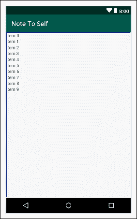
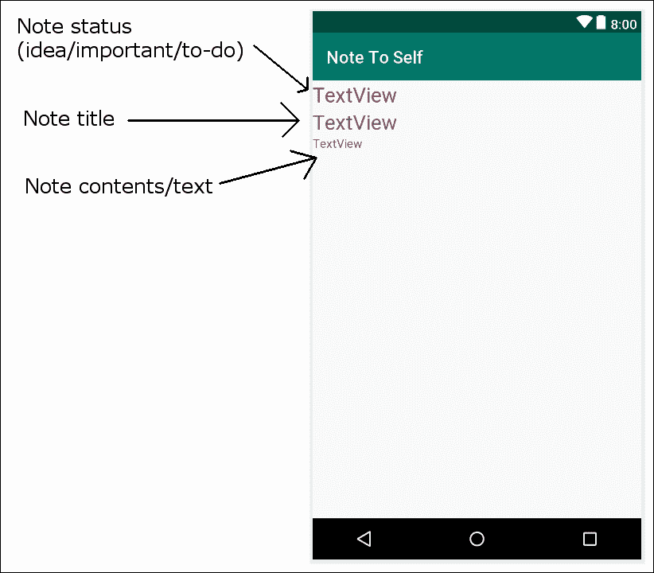
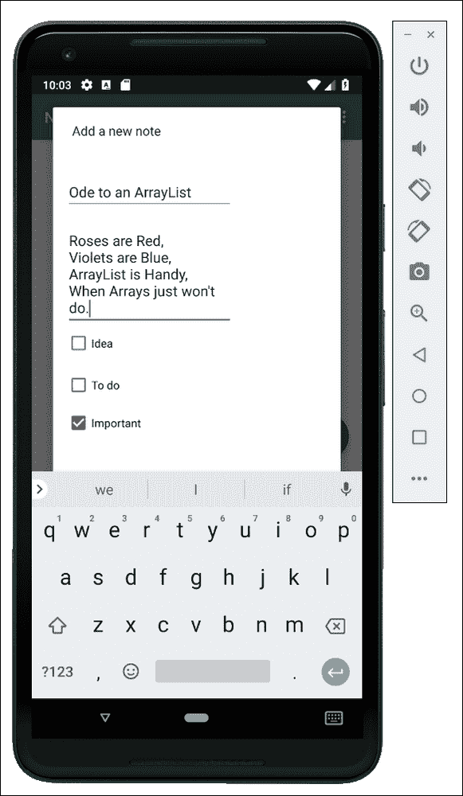

# 十六、适配器和回收器

在这简短的一章中，我们将取得很大成就。我们将首先讨论适配器和列表的理论。然后，我们将了解如何在 Kotlin 代码中使用一个`RecyclerAdapter`实例，并将一个`RecyclerView`小部件添加到布局中，该小部件充当我们的用户界面的列表，然后，通过安卓应用编程接口的明显魔力，将它们绑定在一起，以便`RecyclerView`实例显示`RecyclerAdapter`实例的内容，并允许用户滚动浏览充满`Note`实例的`ArrayList`实例的内容。您可能已经猜到，我们将使用这种技术在笔记到自我应用中显示我们的笔记列表。

在本章中，我们将执行以下操作:

*   探索另一种类型的Kotlin类——内部类
***   看看适配器的理论，并检查将它们绑定到我们的用户界面*   用`RecyclerView`实现布局*   布置一个列表项用于`RecyclerView`*   用`RecyclerAdapter`实现适配器*   将适配器绑定到`RecyclerView`*   将笔记存储在`ArrayList`中，并通过 `RecycleAdapter`显示在`RecyclerView`中**

 **很快，我们将有一个自我管理的布局，保存和显示我们所有的笔记，所以让我们开始吧。

# 内班

在这个项目中，我们将使用一种我们还没有见过的类——一个**内部的**类。假设我们有一个名为`SomeRegularClass`的常规类，它有一个名为`someRegularProperty`的属性和一个名为`someRegularFunction`的函数，如下面的代码所示:

```kt
class SomeRegularClass{
    var someRegularProperty = 1    

    fun someRegularFunction(){
    }
}
```

内部类是在常规类内部声明的类，如下面突出显示的代码所示:

```kt
class SomeRegularClass{
    var someRegularProperty = 1

    fun someRegularFunction(){
    }

    inner class MyInnerClass {
 val myInnerProperty = 1

 fun myInnerFunction() {
 }
 }

}
```

前面突出显示的代码显示了一个名为`MyInnerClass`的内部类，它有一个名为`myInnerProperty`的属性和一个名为`myInnerFunction`的函数。

一个优点是，外部类可以通过声明其实例来使用内部类的属性和函数，如下面的代码片段中突出显示的那样:

```kt
class SomeRegularClass{
    var someRegularProperty = 1

    val myInnerInstance = MyInnerClass()

    fun someRegularFunction(){
        val someVariable = myInnerInstance.myInnerProperty
 myInnerInstance.myInnerFunction()
    }

    inner class MyInnerClass {
        val myInnerProperty = 1

        fun myInnerFunction() {
        }

    }
}
```

此外，内部类也可以访问常规类的属性，可能是从到`myInnerFunction`函数。下面的代码片段显示了这一点:

```kt
fun myInnerFunction() {
 someRegularProperty ++
}
```

这种在类中定义新类型、创建实例和共享数据的能力在某些情况下和封装中非常有用。我们将在本章后面的自我笔记应用中使用一个内部类。

# 回收视图和回收面板

在[第 5 章](07.html "Chapter 5. Beautiful Layouts with CardView and ScrollView")、*带 CardView 和 ScrollView 的漂亮布局*中，我们使用了一个`ScrollView`小部件，并用几个`CardView`小部件填充它，以便我们可以看到它滚动。我们可以利用刚刚学到的关于`ArrayList`的知识，创建一个包含`TextView`对象的容器，使用它们来填充一个`ScrollView`小部件，并在每个`TextView`中放置一个注释的标题。这听起来像是显示每个笔记的完美解决方案，这样它就可以在笔记到自我应用中点击。

我们可以在 Kotlin 代码中动态创建`TextView`对象，将它们的`text`属性设置为注释的标题，然后将`TextView`对象添加到包含在`ScrollView`中的`LinearLayout`中。但这并不完美。

## 显示大量小部件的问题

这可能看起来很好，但是如果有几十个、几百个甚至几千个音符呢？我们不可能在内存中有成千上万的对象，因为安卓设备可能会耗尽内存，或者至少在试图处理如此大量数据的滚动时会停止运行。

现在，也想象一下，我们希望`ScrollView`小部件中的每个注释都显示它是重要的、要做的还是一个想法。从笔记的正文中摘录一小段怎么样？

我们需要设计一些巧妙的代码，从`ArrayList`加载并销毁`Note`对象和`TextView`对象。这是可以做到的，但要有效地做到这一点远非易事。

## 显示大量小部件问题的解决方案

幸运的是，这是移动开发者普遍面临的问题，安卓应用编程接口内置了一个解决方案。

我们可以在我们的用户界面布局中添加一个名为`RecyclerView`的小部件(就像一个环保的`ScrollView`，但也有助推器)。`RecyclerView`课是为了解决我们一直在讨论的问题而设计的。此外，我们需要用一种特殊类型的类与`RecyclerView`互动，这种类理解`RecyclerView`是如何工作的。我们将使用**适配器**与之交互。我们将使用`RecyclerAdapter`类，继承它，定制它，然后使用它来控制来自我们的`ArrayList`的数据，并在`RecyclerView`类中显示它。

让我们更多地了解一下`RecyclerView`和`RecyclerAdapter`类是如何工作的。

## 如何使用 RecyclerView 和 RecyclerAdapter

我们已经知道如何存储几乎无限的笔记——我们可以在`ArrayList`中这样做，尽管我们还没有实现它。我们还知道有一个名为`RecyclerView`的用户界面布局，专门用于显示潜在的长数据列表。我们只需要看看如何将这一切付诸行动。

为了给我们的布局添加一个`RecyclerView`小部件，我们可以简单地用通常的方式把它从调色板拖放到我们的用户界面上。

### 类型

先别做。我们先讨论一会儿。

`RecyclerView`类在用户界面设计器中如下所示:



然而，这种外观与其说是应用中的实际外观，不如说是可能性的表现。如果我们在添加`RecyclerView`小部件后立即运行应用，我们只会得到一个空白屏幕。

要实际使用`RecyclerView`小部件，我们需要做的第一件事是决定列表中的每个项目看起来是什么样子。它可能只是一个单独的`TextView`小部件，也可能是整个布局。我们将使用`LinearLayout`。为了清楚具体，我们将使用一个`LinearLayout`实例，它为我们的`RecyclerView`小部件中的每个项目保存三个`TextView`小部件。这将允许我们显示笔记状态(重要/想法/待办事项)、笔记标题以及来自实际笔记内容的一小段文本。

一个列表项需要在自己的 XML 文件中定义，那么`RecyclerView`小部件可以保存这个列表项布局的多个实例。

当然，这些都不能解释我们如何克服管理哪些数据显示在哪个列表项中以及如何从`ArrayList`中检索这些数据的复杂性。

这个数据处理由我们自己定制的`RecyclerAdapter`实现来处理。`RecyclerAdapter`类实现了`Adapter`接口。我们不需要知道`Adapter`在内部是如何工作的，我们只需要覆盖一些功能，然后`RecyclerAdapter`将完成与我们的`RecyclerView`小部件通信的所有工作。

将`RecyclerAdapter`的实现连接到`RecyclerView`小部件当然比将 20 个`TextView`小部件拖到`ScrollView`小部件上更复杂，但是一旦完成，我们就可以忘记它，并且它将继续工作和管理自己，不管我们给`ArrayList`添加多少注释。它还内置了处理诸如整洁的格式和检测列表中哪个项目被点击之类的功能。

我们将需要覆盖`RecyclerAdapter`的一些功能，并添加一点我们自己的代码。

## 我们将如何使用 RecyclerAdapter 和笔记数组列表来设置 RecyclerView

查看这个所需步骤的概要，这样我们就知道会发生什么。为了使整个系统启动并运行，我们将执行以下操作:

1.  删除临时按钮和相关代码，然后用特定的`id`属性向我们的布局添加一个`RecyclerView`小部件。
2.  创建一个 XML 布局来表示列表中的每个项目。我们已经提到，列表中的每个项目都将是一个包含三个`TextView`小部件的`LinearLayout`。
3.  创建一个继承自`RecyclerAdapter`的新类，并向几个被覆盖的函数添加代码来控制它的外观和行为，包括使用我们的列表项布局和充满`Note`实例的`ArrayList`。
4.  在`MainActivity`中添加代码以使用`RecyclerAdapter`和`RecyclerView`小部件，并将其绑定到我们的`ArrayList`实例。
5.  在`MainActivity`中添加一个`ArrayList`实例来保存我们所有的笔记，并更新`createNewNote`函数来将在`DialogNewNote`类中创建的任何新笔记添加到这个`ArrayList.`中

让我们详细介绍并实现这些步骤。

# 将 RecyclerView、RecyclerAdapter 和 ArrayList 添加到“给自己的笔记”项目中

打开注意自我项目。提醒一下，如果你想查看完成本章的代码和基于的工作 app，可以在`Chapter16/Note to self` 文件夹中找到。

### 类型

随着本章中所需的操作在不同的文件、类和函数之间跳转，我鼓励您将下载包中的文件放在首选文本编辑器中以供参考。

## 删除临时“显示注释”按钮，并添加回收视图

接下来的这几步将摆脱我们在[第 14 章](16.html "Chapter 14. Android Dialog Windows")、*安卓对话窗口*中添加的临时代码，并设置我们的`RecyclerView`准备绑定到本章后面的`RecyclerAdapter`:

1.  在`content_main.xml`文件中，用`button`的`id`移除临时`Button`，这是我们之前为了测试而添加的。
2.  在`MainActivity.kt`的`onCreate`函数中，删除`Button`实例声明和初始化以及处理其点击的 lambda，因为这段代码现在会产生一个错误。我们将在本章后面删除一些临时代码。删除下面显示的代码:

    ```kt
    // Temporary code
    val button = findViewById<View>(R.id.button) as Button
    button.setOnClickListener {
      // Create a new DialogShowNote called dialog
      val dialog = DialogShowNote()

      // Send the note via the sendNoteSelected function
      dialog.sendNoteSelected(tempNote)

      // Create the dialog
      dialog.show(supportFragmentManager, "123")
    }
    ```

3.  现在，在设计视图中切换回`content_main.xml`并将一个**recycle view**小部件从调色板的 **Common** 类别拖到布局上。
4.  将其`id`属性设置为`recyclerView`。

现在我们已经从我们的项目中移除了临时的用户界面方面，并且我们有一个完整的`RecyclerView`小部件，它有一个独特的`id`属性，可以从我们的Kotlin代码中引用。

## 为回收视图创建列表项

接下来，我们需要一个布局来表示我们的`RecyclerView`小部件中的每个项目。如前所述，我们将使用一个包含三个`TextView`小部件的`LinearLayout`实例。

以下是创建在`RecyclerView`中使用的列表项所需的步骤:

1.  右键单击项目浏览器中的`layout` 文件夹，选择**新建|布局资源文件**。在**名称:**字段输入`listitem`，使**根元素:**T2。默认的方向属性是垂直的，这正是我们所需要的。
2.  Look at the next screenshot to see what we are trying to achieve with the remaining steps of this section. I have annotated it to show what each part will be in the finished app:

    

3.  根据参考截图，将三个`TextView`实例拖到布局上，一个在另一个之上。第一个(顶部)将保存笔记状态/类型(想法/重要/待办事项)，第二个(中间)将保存笔记标题，第三个(底部)将保存笔记本身的片段。
4.  配置`LinearLayout`实例和`TextView`小部件的各种属性，如下表所示:

    <colgroup><col style="text-align: left"><col style="text-align: left"><col style="text-align: left"></colgroup>
    | 

    **小工具类型**

     | 

    **属性**

     | 

    **设置为**的值

     |
    | --- | --- | --- |
    | 线形布局 | `layout_height` | `wrap_contents` |
    | 线形布局 | `Layout_Margin all` | `5dp` |
    | 文本视图（顶部) | `id` | `textViewStatus` |
    | 文本视图（顶部) | `textSize` | `24sp` |
    | 文本视图（顶部) | `textColor` | `@color/colorAccent` |
    | 文本视图（中间) | `id` | `textViewTitle` |
    | 文本视图（中间) | `textSize` | `24sp` |
    | 文本视图（顶部) | `id` | `textViewDescription` |

现在我们有一个主布局的`RecylerView`小部件和一个用于列表中每个项目的布局。我们可以继续编码我们的`RecyclerAdapter`实现。

## 对回收器类进行编码

我们现在将创建并编码一个全新的类。让我们称我们的新班级为`NoteAdapter`。以通常的方式在与`MainActivity`类(以及所有其他类)相同的文件夹中创建一个名为`NoteAdapter`的新类。

通过添加这些`import`语句并继承`RecyclerView.Adapter`类来编辑`NoteAdapter`类的代码，然后添加如图所示的两个属性。将`NoteAdapter`类编辑为与我们刚才讨论的以下代码相同:

```kt
import android.view.LayoutInflater
import android.view.View
import android.view.ViewGroup
import android.widget.TextView
import androidx.recyclerview.widget.RecyclerView

class NoteAdapter(
   private val mainActivity: MainActivity, 
   private val noteList: List<Note>) 
   : RecyclerView.Adapter<NoteAdapter.ListItemHolder>() {

}
```

在前面的代码中，我们使用主构造函数声明并初始化了`NoteAdapter`类的两个属性。请注意构造函数的参数。它接收到一个`MainActivity`参考和一个`List`参考。这意味着，当我们使用这个类时，我们需要发送一个对这个应用的主要活动的引用(`MainActivity`)以及一个`List`引用。我们将很快看到`MainActivity`引用的用途，但是我们可以明智地猜测，对类型为`<Note>`的`List`的引用将是对我们的`Note`实例的引用，我们将很快在`MainActivity`类中对其进行编码。`NoteAdapter`将永久引用所有用户的笔记。

但是，您会注意到，类声明和代码的其他区域用红色下划线标出，表明我们的代码中有错误。

第一个错误是因为`RecylerView.Adapter`类(我们继承自)需要我们覆盖它的一些抽象函数。

### 注

我们在[第 11 章](13.html "Chapter 11. Inheritance in Kotlin") *中讨论了抽象类及其功能，在*中讨论了继承。

最快的方法是点击类声明，按住 *Alt* 键，然后点击*回车*键。选择**实现成员，**如下图所示:


在接下来的窗口中，按住 *Shift* 并左键单击所有三个选项(要添加的功能)，然后单击**确定**。该过程增加了以下三个功能:

*   `onCreateViewHolder`功能，当需要列表项的布局时调用
*   当`RecyclerAdapter`实例绑定到布局中的`RecyclerView`实例时调用的`onBindViewHolder`函数
*   `getItemCount`功能，用于返回`ArrayList`中`Note`实例的数量

我们将很快为这些函数中的每一个添加代码，以便在特定的时间完成所需的工作。

但是，请注意，我们的代码中仍然有多个错误，包括新自动生成的函数以及类声明。我们需要做一些工作来解决这些错误。

错误是因为`NoteAdapter.ListItemHolder`类不存在。`ListItemHolder`是我们扩展`NoteAdapter`时添加的。我们选择的类别类型将用作每个列表项的持有者。目前，它并不存在——因此出现了错误。同样因为同样的原因出现同样错误的两个函数，是在我们要求AndroidStudio实现缺失的函数时自动生成的。

让我们从必修的`ListItemHolder`课开始来解决这个问题。`ListItemHolder`实例与`NoteAdapter`共享数据/变量对我们很有用；因此，我们将创建`ListItemHolder`作为一个内部类。

点击类声明中的错误，选择**创建类【ListItemHolder】**，如下图所示:


在随后的弹出窗口中，选择**注意适配器**在`NoteAdapter`内生成`ListItemHolder`。

以下代码已添加到`NoteAdapter`类中:

```kt
class ListItemHolder {

}
```

但是我们仍然有多个错误。让我们现在修理其中一个。将鼠标悬停在类声明中带红色下划线的错误上，如下图所示:


错误消息显示**类型参数不在其范围内。应为:****recycle view。ViewHolder！找到:NoteAdapter。ListItemHolder** 。这样做的原因是因为我们可能添加了`ListItemHolder`，但是`ListItemHolder`也必须实现`RecyclerView.ViewHolder`才能作为正确的类型使用。

修改`ListItemHolder`类的声明以匹配该代码:

```kt
    inner class ListItemHolder(view: View) : 
         RecyclerView.ViewHolder(view), 
         View.OnClickListener {
```

现在错误从 `NoteAdapter`类声明中消失了，但是因为我们也实现了`View.OnClickListener`，所以我们需要实现`onClick`函数。再者，`ViewHolder`没有提供默认的构造函数，所以我们需要做。将以下`onClick`功能(目前为空)和此`init`块(目前为空)添加到`ListItemHolder`类:

```kt
init {
}

override fun onClick(view: View) {
}
```

### 类型

请确保您将代码添加到了内部`ListItemHolder`类，而不是`NoteAdapter`类。

让我们清除最后剩下的错误。当`onBindViewHolder`功能自动生成时，AndroidStudio没有为`holder`参数添加类型。这导致了函数中的错误和类声明中的错误。更新`onBindViewHolder`函数的签名，如下图代码所示:

```kt
override fun onBindViewHolder(
   holder: ListItemHolder, position: Int) {
```

在`onCreateViewHolder`函数签名中，返回类型还没有自动生成。修改`onCreateViewHolder`功能的签名，如下代码所示:

```kt
    override fun onCreateViewHolder(
       parent: ViewGroup, viewType: Int): ListItemHolder {
```

作为最后一点好的内务处理，让我们删除三个自动生成但不需要的`// TODO…`注释。每个自动生成的函数中都有一个。它们看起来像下一张截图中突出显示的那张:


当您删除`TODO…`注释时，会出现更多错误。我们需要在一些自动生成的函数中添加`return`语句。我们将在继续编写类的代码时这样做。

经过大量的修改和自动生成，我们终于有了一个几乎没有错误的`NoteAdapter`类，完成了被覆盖的函数和一个内部类，我们可以对其进行编码以使我们的`RecyclerAdapter`实例工作。此外，我们可以编写代码来响应每个`ListItemHolder`实例上的点击(在`onClick`)。

后面是代码在这个阶段应该是什么样子的完整列表(不包括导入语句):

```kt
class NoteAdapter(
  private val mainActivity: MainActivity,
  private val noteList: List<Note>)
  : RecyclerView.Adapter<NoteAdapter.ListItemHolder>() {

    override fun onCreateViewHolder(
         parent: ViewGroup, viewType: Int):
         ListItemHolder {

    }

    override fun getItemCount(): Int {

    }

    override fun onBindViewHolder(
         holder: ListItemHolder, 
         position: Int) {

    }

    inner class ListItemHolder(view: View) : 
          RecyclerView.ViewHolder(view),
          View.OnClickListener {

        init {

        }

        override fun onClick(view: View) {
        }
    }
}
```

### 类型

您本可以复制并粘贴前面的代码，而不是忍受前面页面的阴谋诡计，但是这样您就不会经历如此紧密地实现接口和内部类的过程。

现在，让我们对函数进行编码，让这个类运行起来。

### 对 onCreateViewHolder 函数进行编码

接下来，我们将调整自动生成的`onCreateViewHolder`功能。将高亮显示的代码行添加到`onCreateViewHolder`功能中并研究它们:

```kt
override fun onCreateViewHolder(
   parent: ViewGroup, viewType: Int): 
   ListItemHolder {

 val itemView = LayoutInflater.from(parent.context)
 .inflate(R.layout.listitem, parent, false)

 return ListItemHolder(itemView)
}
```

这段代码通过使用`LayoutInflater`和我们新设计的`listitem`布局初始化`itemView`来工作。然后它会返回一个新的`ListItemHolder`实例，并带有一个膨胀的现成布局。

### 对 onBindViewHolder 函数进行编码

接下来，我们将适配`onBindViewHolder`功能。添加突出显示的代码，使函数与该代码相同，并确保研究该代码:

```kt
override fun onBindViewHolder(
         holder: ListItemHolder, position: Int) {

   val note = noteList[position]
 holder.title.text = note.title

 // Show the first 15 characters of the actual note
 holder.description.text = 
 note.description!!.substring(0, 15)

 // What is the status of the note?
 when {
 note.idea -> holder.status.text = 
 mainActivity.resources.getString(R.string.idea_text)

 note.important -> holder.status.text = 
 mainActivity.resources.getString(R.string.important_text)

 note.todo -> holder.status.text = 
 mainActivity.resources.getString(R.string.todo_text)
 }

}
```

首先，代码将文本截断为 15 个字符，以便在列表中看起来合理。请注意，如果用户输入的短音符少于 15 个字符，将会导致崩溃。这是留给读者的一个练习，让他们回到这个项目，并找到解决这个缺陷的方法。

然后，它检查它是什么类型的注释(想法/要做的事情/重要的事情)，并使用`when`表达式从字符串资源中分配适当的标签。

这个新代码在带有`holder.title`、`holder.description`和`holder.status`的代码中留下了一些错误，因为我们需要将它们添加到我们的`ListItemHolder`内部类中。我们很快就会这样做。

### 编码 getItemCount

修改`getItemCount`功能中的代码，如下图:

```kt
override fun getItemCount(): Int {
   if (noteList != null) {
 return noteList.size
 }
 // error
 return -1
}
```

该函数由类内部使用，它提供`List`中当前的项目数。

### 对 ListItemHolder 内部类进行编码

现在我们可以把注意力转移到`ListItemHolder`内班了。通过添加以下突出显示的代码调整`ListItemHolder`内部类:

```kt
inner class ListItemHolder(view: View) :
         RecyclerView.ViewHolder(view),
         View.OnClickListener {

 internal var title =
 view.findViewById<View>(
 R.id.textViewTitle) as TextView

 internal var description =
 view.findViewById<View>(
 R.id.textViewDescription) as TextView

 internal var status =
 view.findViewById<View>(
 R.id.textViewStatus) as TextView

  init {

        view.isClickable = true
 view.setOnClickListener(this)
  }

  override fun onClick(view: View) {
        mainActivity.showNote(adapterPosition)
  }
}
```

`ListItemHolder`属性获取布局中每个`TextView`小部件的引用。`init`块代码将整个视图设置为可点击的，这样当点击持有人时，操作系统将调用我们讨论的下一个函数`onClick`。

在`onClick`中，对`mainActivity.showNote`的调用有一个错误，因为该函数还不存在，但是我们将在下一节中修复这个问题。该调用将使用我们的自定义`DialogFragment`实例简单地显示被点击的笔记。

## 对主要活动进行编码，以使用 RecyclerView 和 RecyclerAdapter 类

现在，在编辑器窗口中将切换到`MainActivity`类。将这三个新属性添加到`MainActivity`类中，并删除临时代码:

```kt
// Temporary code
//private var tempNote = Note()

private val noteList = ArrayList<Note>()
private val recyclerView: RecyclerView? = null
private val adapter: NoteAdapter? = null
```

这三个属性是我们所有`Note`实例的`ArrayList`实例、我们的`RecyclerView`实例和我们的`NoteAdapter`类的一个实例。

### 向 onCreate 添加代码

在处理用户按下浮动动作按钮的代码后，在`onCreate`功能中添加以下高亮显示的代码(上下文再次显示):

```kt
fab.setOnClickListener { view ->
   val dialog = DialogNewNote()
   dialog.show(supportFragmentManager, "")
}

recyclerView = 
 findViewById<View>(R.id.recyclerView) 
 as RecyclerView

adapter = NoteAdapter(this, noteList)
val layoutManager = 
 LinearLayoutManager(applicationContext)

recyclerView!!.layoutManager = layoutManager
recyclerView!!.itemAnimator = DefaultItemAnimator()

// Add a neat dividing line between items in the list
recyclerView!!.addItemDecoration(
 DividerItemDecoration(this, 
 LinearLayoutManager.VERTICAL))

// set the adapter
recyclerView!!.adapter = adapter

```

这里，我们用布局中的`RecyclerView`小部件初始化`recyclerView`。我们的`NoteAdapter` ( `adapter`)实例通过调用我们编码的构造函数来初始化。请注意，对`MainActivity` ( `this`)和`ArrayList`实例的引用被传入，正如我们之前编码的类所要求的。

接下来，我们创建一个新对象–一个`LayoutManager`对象。在接下来的四行代码中，我们配置了`recyclerView`的一些属性。

`itemAnimator`属性和`addItemDecoration`功能通过在列表中的每个项目之间添加一条分隔线，使每个列表项目在视觉上更加突出。稍后，当我们构建“设置”屏幕时，我们将为用户提供添加和删除该分隔符的选项。

我们做的最后一件事是用我们的适配器初始化`recylerView`的`adapter`属性，它将我们的适配器和我们的视图结合在一起。

现在，我们将对`createNewNote`功能进行一些更改。

### 修改 createNewNote 函数

在`createNewNote`功能中，删除我们在[第十四章](16.html "Chapter 14. Android Dialog Windows")、*安卓对话框*中添加的临时代码(如图注释掉)。并添加新的突出显示的代码，如下所示:

```kt
fun createNewNote(n: Note) {
  // Temporary code
  // tempNote = n
  noteList.add(n)
 adapter!!.notifyDataSetChanged()

}
```

新的高亮代码向`ArrayList`实例添加了一个注释，而不是简单地初始化一个单独的`Note`对象，该对象现在已经被注释掉了。然后，我们需要调用`notifyDataSetChanged`，这让我们的适配器知道已经添加了新的注释。

### 对显示注释功能进行编码

将使用引用从`NoteAdapter`类调用的`showNote`函数添加到传递给`NoteAdapter`构造函数的这个类中。或者，更准确地说，当用户点击`RecyclerView`小部件中的一个项目时，从`ListerItemHolder`内部类调用它。将`showNote`功能添加到`MainActivity`类别中:

```kt
fun showNote(noteToShow: Int) {
   val dialog = DialogShowNote()
   dialog.sendNoteSelected(noteList[noteToShow])
   dialog.show(supportFragmentManager, "")
}
```

### 注

`NoteAdapter.kt`文件中的所有错误现在都消失了。

刚刚添加的代码将启动`DialogShowNote`的新实例，传入由`noteToShow`引用的特定必需注释。

# 运行应用

您现在可以运行该应用并输入新的注释，如下图所示:



当你输入了几个类型的几个音符后，列表(`RecyclerView`)将会如下图所示:


并且，如果你点击查看其中一个笔记，它会是这样的:


### 注

**读者挑战**

我们本可以花更多的时间来格式化两个对话窗口的布局。为什么不参考[第五章](07.html "Chapter 5. Beautiful Layouts with CardView and ScrollView")、*带 CardView 和 ScrollView* 的美图，以及材质设计网站[https://material.io/design/](https://material.io/design/)，做的比这个更好。此外，您可以使用`CardView`而不是`LinearLayou`T3 来增强`RecyclerView`笔记列表。

不过，不要花太长时间添加新笔记，因为有一个小问题:关闭并重新启动应用。哦哦，所有的笔记都不见了！

# 常见问题

问题 1)我还是不明白`RecyclerAdapter`是怎么工作的？

那是因为我们还没有真正讨论过。我们没有讨论幕后细节的原因是因为我们不需要了解它们。如果我们覆盖所需的功能，正如我们刚刚看到的，一切都将工作。这就是`RecyclerAdapter`和我们使用的大多数其他类的本意:用公共函数隐藏实现，以公开必要的功能。

问题 2)我觉得我需要知道`RecyclerAdapter`和其他班级里发生了什么。我该怎么做？

a)确实`RecyclerAdapter`(也是我们在本书中使用的几乎每一个类)有更多的细节我们没有空间讨论。阅读您使用的类的官方文档是一个很好的做法。你可以在[https://developer . Android . com/reference/Android/support/V7/widget/recycle view 上了解更多。适配器](https://developer.android.com/reference/android/support/v7/widget/RecyclerView.Adapter)。

# 总结

现在，我们已经添加了保存多个笔记的功能，并实现了显示它们的能力。

我们通过学习和使用`RecyclerAdapter`类来实现这一点，该类实现了`Adapter`接口，允许我们将一个`RecyclerView`实例和一个`ArrayList`实例绑定在一起，允许无缝显示数据，而我们(程序员)不必担心这些类中的复杂代码，我们甚至看不到这些代码。

在下一章中，我们将从当用户退出应用或关闭设备时让他们的笔记保持不变开始。此外，我们将创建一个“设置”屏幕，看看我们如何使设置保持不变。我们将使用不同的技术来实现这些目标。**