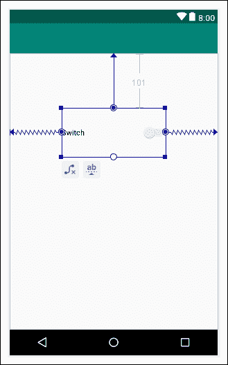
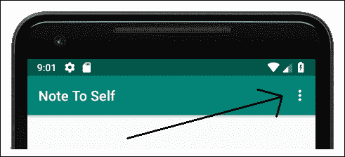

# 第十七章。数据持久性和共享

在这一章中，我们将看看将数据保存到安卓设备永久存储的几种不同方法。同样，我们将第一次在我们的应用中添加第二个`Activity`实例。在新的`Activity`实例中，在我们的应用程序中实现单独的“屏幕”，例如“设置”屏幕，通常是有意义的。我们可以像在[第 4 章](06.html "Chapter 4. Getting Started with Layouts and Material Design")、*开始布局和材质设计*中那样，麻烦地隐藏原始用户界面，然后在同一个`Activity`中显示新的用户界面，但这将很快导致混乱和容易出错的代码。因此，我们将看到如何添加另一个`Activity`实例并在它们之间导航用户。

在本章中，我们将执行以下操作:

*   了解安卓`Intent`类来切换`Activity`实例并在它们之间传递数据
*   在一个新的`Activity`实例中创建一个非常简单的设置屏幕
*   使用`SharedPreferences`类保存设置屏幕数据
*   了解用于序列化的 **JavaScript 对象符号** ( **JSON** )
*   探索`try` - `catch` - `finally`
*   在我们的笔记应用程序中实现保存数据

# 安卓意图类

`Intent`类的命名很恰当。这是一个从我们的应用程序中演示`Activity`实例意图的类。它明确了意图，也促进了意图。

到目前为止，我们所有的应用都只有一个`Activity`实例，但许多安卓应用包含不止一个实例。

也许最常见的用法是，一个`Intent`对象允许我们在`Activity`实例之间切换。但是，当然，`Activity`实例是由类构成的。那么，当我们在这些类之间切换时，数据会发生什么呢？`Intent`类也通过允许我们在它们之间传递数据来为我们处理这个问题。

`Intent`课程不仅仅是连接我们应用程序的活动。它们也使得与其他应用程序交互成为可能。例如，我们可以在我们的应用程序中提供一个链接，供用户发送电子邮件、打电话、与社交媒体互动或在浏览器中打开网页，并让电子邮件、拨号器、网络浏览器或相关的社交媒体应用程序完成所有工作。

没有足够的页面来深入挖掘与其他应用程序的交互，因此我们将主要关注在活动和传递数据之间的切换。

## 切换活动

假设我们有一个应用，有两个`Activity`类，我们很快就会有。我们可以假设，像往常一样，我们有一个名为`MainActivity`的`Activity`实例，这是应用程序启动的地方，还有第二个名为`SettingsActivity`的`Activity`实例。这就是我们如何从`MainActivity`切换到`SettingsActivity`的方法:

```kt
// Declare and initialize a new Intent object called myIntent
val myIntent = Intent(this, 
         SettingsActivity::class.java)

// Switch to the SettingsActivity
startActivity(myIntent)
```

仔细看看我们是如何初始化`Intent`对象的。`Intent`有一个接受两个参数的构造函数。首先是对当前`Activity`实例`this`的引用。第二个参数是我们想要打开的`Activity`实例的名称，`SettingsActivity::class`。`SettingsActivity`末尾的`class`使其成为`AndroidManifest.xml`文件中声明的`Activity`实例的全名，我们将在稍后实验`Intent`时看到这一点。

### 注

结尾看起来怪怪的`.java`是因为所有的 Kotlin 代码都变成了 Java 字节代码，`SettingsActivity::class.java`是它的全限定名。

唯一的问题是`SettingsActivity`没有共享`MainActivity`的任何数据。在某种程度上，这是一件好事，因为如果你需要来自`MainActivity`的所有数据，那么切换`Activity`实例可能不是继续你的应用程序设计的最佳方式，这是一个合理的迹象。然而，将封装得如此彻底以至于两个`Activity`实例对彼此一无所知是不合理的。

## 在活动之间传递数据

如果我们有一个用户登录屏幕，我们想把登录凭证传递给我们应用的每个`Activity`实例，会怎么样？我们可以使用`Intent`类来实现。

我们可以像这样向`Intent`实例添加数据:

```kt
// Create a String called username 
// and set its value to bob
val username = "Bob"

// Create a new Intent as we have already seen
val myIntent = Intent(this, 
         SettingsActivity::class.java)

// Add the username String to the Intent
// using the putExtra function of the Intent class
myIntent.putExtra("USER_NAME", username)

// Start the new Activity as we have before
startActivity(myIntent)
```

在`SettingsActivity`中，我们可以这样检索`String`值:

```kt
// Here we need an Intent also
// But the default constructor will do
// as we are not switching Activity
val myIntent = Intent()

// Initialize username with the passed in String 
val username = intent.extras.getString("USER_NAME")
```

在前面的两个代码块中，我们以我们已经看到的相同方式切换了`Activity`实例。但是，在我们调用`startActivity`之前，我们使用`putExtra`函数将一个`String`值加载到`myIntent`中。

我们使用**键值对**添加数据。每条数据都需要附带一个**标识符**，该标识符可用于检索`Activity`实例，以识别然后检索数据。

标识符名称是任意的，但是应该使用有用/值得记住的值。

然后，在接收`Activity`实例的中，我们简单地使用默认构造函数创建一个`Intent`对象:

```kt
val myIntent = Intent();
```

然后，我们可以使用`extras.getString`函数和键值对中的适当标识符来检索数据。

`Intent`类可以帮助我们发送比这更复杂的数据，但是`Intent`类也有它的局限性。例如，我们将无法发送一个`Note`对象。一旦我们想开始发送多个值，就值得考虑不同的策略。

# 添加一个设置页面给自己备注

现在我们已经掌握了所有关于安卓`Intent`类的知识，我们可以在我们的 Note to self 应用程序中添加另一个屏幕(`Activity`):一个“设置”屏幕。

我们将首先为我们的新屏幕创建一个新的`Activity`实例，看看这对`AndroidManifest.xml`文件有什么影响。然后，我们将为我们的设置屏幕创建一个非常简单的布局，并添加Kotlin代码从`MainActivity`切换到新的。然而，在我们学会如何将用户喜欢的设置保存到磁盘上之前，我们将推迟用 Kotlin 连接我们的设置屏幕布局。我们将在本章的稍后部分进行此操作，然后返回到设置屏幕，使其数据保持不变。

首先，让我们对新的`Activity`类进行编码。我们称之为`SettingsActivity`。

## 创建设置活动

设置活动将是一个屏幕，用户可以在其中打开或关闭`RecyclerView`小部件中每个音符之间的装饰分隔线。这将不是一个非常全面的设置屏幕，但这将是一个有用的练习，我们将看到两个`Activity`实例之间的切换以及将数据保存到磁盘。按照以下步骤开始:

1.  在项目浏览器窗口中，右键单击包含所有`.kt`文件并且与您的包同名的文件夹。从弹出的上下文菜单中，选择**新建|活动|空活动**。
2.  在**活动名称:**字段中，输入`SettingsActivity`。
3.  将所有其他选项保留为默认值，然后左键单击**完成**。

AndroidStudio为我们创建了一个新的`Activity`类及其相关的`.kt`文件。让我们快速浏览一下在幕后为我们完成的一些工作，因为了解正在发生的事情很有用。

在项目浏览器的`manifests`文件夹中打开`AndroidManifest.xml`文件。请注意该文件末尾的以下新代码行:

```kt
<activity android:name=".SettingsActivity"></activity>
```

这就是`Activity`类如何在操作系统中注册**。如果一个`Activity`类没有注册，那么试图运行它将会使应用崩溃。我们可以通过在一个新的`.kt`文件中创建一个扩展`Activity`(或`AppCompatActivity`)的类来创建一个`Activity`类。然而，我们必须自己添加前面的代码。此外，通过使用新的活动向导，我们获得了一个为我们自动生成的布局 XML 文件(`activity_settings.xml`)。**

## 设计设置屏幕布局

我们将快速为我们的设置画面搭建一个用户界面；下面的步骤和截图应该会使这变得简单明了:

1.  打开`activity_settings.xml`文件，切换到**设计**选项卡，我们将快速布局我们的设置屏幕。
2.  Use this next screenshot as a guide while following the rest of the steps:

    

3.  拖动并将**开关**部件放到布局的中间顶部。我通过拖动边缘来拉伸我的，使它更大更清晰。
4.  添加一个`switch1`的`id`属性(如果还没有的话)，这样我们就可以用 Kotlin 和它交互了。
5.  使用约束手柄固定开关位置，或点击**推断约束**按钮自动固定。

现在，我们的设置屏幕有了一个很好的(并且非常简单的)新布局，并且`id`属性已经准备好了，当我们在本章后面用我们的代码连接它时就可以使用了。

## 允许用户切换到“设置”屏幕

我们已经知道如何创建和切换到一个`SettingsActivity`实例。此外，由于我们不会向它传递任何数据，也不会从它那里传递任何数据，因此我们只需几行 Kotlin 代码就可以完成这项工作。

你可能已经注意到在我们的应用程序的操作栏中有一个菜单图标。下一张截图显示了这一点:



如果你点击它，里面已经有一个菜单选项用于**设置**，这是我们第一次创建应用时默认提供的。这是您点击菜单图标时将看到的内容:


我们所需要做的就是在`MainActivity.kt`文件的`onOptionsItemSelected`函数中放置我们的代码来创建并切换到`SettingsActivity`实例。AndroidStudio甚至默认为我们提供了一个`when`块来粘贴我们的代码，假设有一天我们想要添加一个设置菜单。多体贴啊。

在编辑器窗口中切换到`MainActivity.kt`，在`onOptionsItemSelected`功能中找到以下代码块:

```kt
return when (item.itemId) {
   R.id.action_settings -> true
   else -> super.onOptionsItemSelected(item)
}
```

编辑前面显示的`when`块，以匹配以下代码:

```kt
return when (item.itemId) {
   R.id.action_settings -> {
         val intent = Intent(this, 
                      SettingsActivity::class.java)

         startActivity(intent)
         true
  }

  else -> super.onOptionsItemSelected(item)
}
```

### 类型

您将需要使用您喜欢的技术导入`Intent`类来添加这一行代码:

```kt
import android.content.Intent
```

您现在可以通过点击**设置**菜单选项来运行应用程序并访问新的设置屏幕。此屏幕截图显示了模拟器上运行的设置屏幕:


要从`SettingsActivity`屏幕返回到`MainActivity`屏幕，您可以点击设备上的后退按钮。

# 用共享引用保存数据

在安卓系统中，有几种方法可以让数据持久化。坚持，我的意思是，如果用户退出应用程序，那么当他们回到应用程序时，他们的数据仍然可用。哪种技术是正确的取决于应用程序和数据类型。

在这本书里，我们将研究三种使数据持久化的方法。为了保存用户的设置，我们只需要一个简单的方法。毕竟，我们只需要知道他们是否想要`RecyclerView`小部件中每个音符之间的装饰分隔线。

让我们看看如何让我们的应用程序将变量保存并重新加载到设备的内部存储中。我们需要使用`SharedPreferences`类。`SharedPreferences`是一个提供数据访问的类，可以被一个应用的所有类访问和编辑。让我们看看如何使用它:

```kt
// A SharedPreferences instance for reading data
val prefs = getSharedPreferences(
         "My app",
          Context.MODE_PRIVATE)

// A SharedPreferences.Editor instance for writing data
val editor = prefs.edit()
```

我们使用`getSharedPreferences`函数初始化`prefs`对象，并传入一个`String`值，该值将用于引用使用该对象读取和写入的所有数据。通常，我们可以使用应用程序的名称作为字符串值。在接下来的代码中，`Mode_Private`表示任何类都可以访问它，但只能从这个 app 访问。

然后，我们使用新初始化的`prefs`对象，通过调用`edit`函数来初始化我们的`editor`对象。

假设我们想要保存用户名，这个用户名在名为`username`的`String`实例中。然后，我们可以将数据写入设备的内部存储器，如下所示:

```kt
editor.putString("username", username)
```

`putString`函数中使用的第一个参数是可以用来引用数据的标签，第二个参数是保存我们想要保存的数据的实际变量。前面代码的第二行启动保存过程。因此，我们可以像这样将多个变量写入磁盘:

```kt
editor.putString("username", username)
editor.putInt("age", age)
editor.putBoolean("newsletter-subscriber", subscribed)

// Save all the above data
editor.apply()
```

前面的代码演示了您可以保存其他变量类型，当然，它假设`username`、`age`和`subscribed`变量先前已经声明，然后用适当的值初始化。

一旦`editor.apply()`被执行，数据被存储。我们可以退出应用，甚至关闭设备，数据会持续存在。

# 用共享引用重新加载数据

让我们看看下一次运行应用程序时如何重新加载数据。这段代码将重新加载前一段代码保存的三个值。我们甚至可以声明我们的变量并用存储的值初始化它们:

```kt
val username  = prefs.getString(
   "username", "new user")

val age  = prefs.getInt("age", -1)

val subscribed = prefs.getBoolean(
    "newsletter-subscriber", false)
```

在前面的代码中，我们使用适合数据类型的函数和最初保存数据时使用的标签从磁盘加载数据。不太清楚的是每个函数调用的第二个参数。

`getString`、`getInt`和`getBoolean`函数需要默认值作为第二个参数。如果没有存储该标签的数据，它将返回默认值。

然后，我们可以在代码中检查这些默认值，并尝试获取所需的值或处理错误。例如，请参见以下代码:

```kt
if (age == -1){
   // Ask the user for his age
}
```

我们现在知道的足够多，可以将用户的设置保存在“给自己的笔记”应用程序中。

# 使自我设置的注释持续

我们已经学习了如何将数据保存到设备的内存中。当我们实现保存用户设置时，我们将再次看到我们如何处理`Switch`小部件输入，以及我们刚刚看到的代码将在哪里使我们的应用程序按照我们希望的方式工作。

## 编码设置活动类

大部分动作将发生在`SettingsActivity.kt`文件中。因此，单击适当的选项卡，我们将一次添加一点代码。

首先，我们想要一个属性来表示用户在设置屏幕上的选项——无论他们是否想要装饰性的分隔物。

在`SettingsActivity`中增加以下内容:

```kt
private val showDividers: Boolean = true
```

现在，在`onCreate`中，添加高亮显示的代码来初始化`prefs`，这被推断为一个`SharedPreferences`实例:

```kt
val prefs = getSharedPreferences(
               "Note to self",
                Context.MODE_PRIVATE)
```

### 类型

导入`SharedPreferences`类:

```kt
import android.content.SharedPreferences
```

接下来，还是在`onCreate`中，让我们加载保存的数据，这代表了用户之前对于是否显示分隔线的选择。我们将根据情况将开关设置为开或关:

```kt
showDividers  = prefs.getBoolean("dividers", true)

// Set the switch on or off as appropriate
switch1.isChecked = showDividers
```

接下来，我们将创建一个 lambda 来处理对我们的`Switch`小部件的更改。我们只需将`showDividers`的值设置为与`Switch`小部件的`isChecked`变量相同。将以下代码添加到`onCreate`功能中:

```kt
switch1.setOnCheckedChangeListener {
   buttonView, isChecked ->

   showDividers = isChecked
}
```

您可能已经注意到，我们没有在任何代码中的任何点向设备存储器写入任何值。我们本可以在检测到交换机发生变化后将其放置，但更简单的方法是将它放在保证被调用的地方，但只能被调用一次。

我们将使用我们对`Activity`生命周期的知识并覆盖`onPause`功能。当用户离开`SettingsActivity`屏幕时，无论是返回`MainActivity`屏幕还是退出应用，都会调用`onPause`并保存设置。这样，用户可以随心所欲地切换开关，应用程序将保存他们的最终决定。添加该代码以覆盖`onPause`功能并保存用户设置。在`SettingsActivity`类的右花括号前添加代码:

```kt
override fun onPause() {
   super.onPause()

   // Save the settings here
   val prefs = getSharedPreferences(
               "Note to self",
                Context.MODE_PRIVATE)

   val editor = prefs.edit()

   editor.putBoolean("dividers", showDividers)

   editor.apply()
}
```

前面的代码使用应用程序的名称在私有模式下声明并初始化了一个新的`SharedPreferences`实例。它还声明并初始化一个新的`SharedPreferences.Editor`实例。最后，使用`putBoolean`将该值输入到`editor`对象中，并使用`apply`功能写入磁盘。

现在我们可以在`MainActivity`增加一些代码，在 app 启动时，或者用户从设置画面切换回主画面时，加载设置。

## 对主要活动类进行编码

在`NoteAdapter`声明后添加此高亮代码:

```kt
private var adapter: NoteAdapter? = null
private var showDividers: Boolean = false

```

现在我们有一个`Boolean`属性来决定是否显示分隔线。我们将覆盖`onResume`函数并初始化我们的`Boolean`属性。添加被覆盖的`onResume`功能，如`MainActivity`类旁边所示:

```kt
override fun onResume() {
   super.onResume()

   val prefs = getSharedPreferences(
               "Note to self",
                Context.MODE_PRIVATE)

  showDividers = prefs.getBoolean(
               "dividers", true)
}
```

用户现在可以选择他们的设置。该应用将根据需要保存和重新加载它们，但我们需要让`MainActivity`响应用户的选择。

在`onCreate`功能中找到该代码并删除:

```kt
recyclerView!!.addItemDecoration(
   DividerItemDecoration(this,
         LinearLayoutManager.VERTICAL))
```

之前的代码设置了列表中每个音符之间的分隔线。将此新代码添加到`onResume`函数中，该函数是由`if`语句包围的同一行代码，仅当`showDividers`为`true`时，才选择性地使用分隔符。在`onResume`的前一个代码后添加代码:

```kt
// Add a neat dividing line between list items
if (showDividers)
    recyclerView!!.addItemDecoration(
          DividerItemDecoration(
          this, LinearLayoutManager.VERTICAL))
else {
  // check there are some dividers
  // or the app will crash
  if (recyclerView!!.itemDecorationCount > 0)
        recyclerView!!.removeItemDecorationAt(0)
}
```

运行应用程序，你会发现分隔线不见了；转到设置屏幕，打开分隔线，返回主屏幕(使用后退按钮)，看:现在有分隔线了。下一张截图显示了带有和不带有分隔符的列表，并排进行了 photoshopped 处理，以说明开关工作正常，并且设置在两个`Activity`实例之间保持不变:


请务必尝试退出应用程序并重新启动，以验证设置是否保存到磁盘。您甚至可以关闭模拟器，然后重新打开，设置将保持不变。

现在我们有一个整洁的设置屏幕，我们可以永久保存用户的选择。当然，关于持久性，最大的缺失环节是用户的基本数据，他们的笔记，仍然没有持久性。

# 更高级的坚持

让我们想想我们需要做什么。我们想把一堆笔记存到内部存储器。更具体地说，我们希望存储字符串和相关布尔值的选择。这些字符串和布尔值表示用户的笔记标题、文本以及它是待办事项、重要事项还是想法。

鉴于我们对`SharedPreferences`类的了解，乍一看，这似乎并不特别具有挑战性——除非我们更深入地挖掘我们的需求。如果用户喜欢我们的应用程序，最终得到 100 个笔记怎么办？我们需要 100 个键值对标识符。不是不可能，但开始变得尴尬。

现在，假设我们想要增强应用程序，并让用户能够在其中添加日期。安卓有一个`Date`类非常适合这个。然后在我们的应用程序中添加一些简洁的功能，比如提醒，这将是相当简单的。但是说到保存数据，事情突然变得复杂起来。

我们如何使用`SharedPreferences`存储日期？不是为这个设计的。我们可以在保存它时将其转换为字符串值，然后在加载它时再次转换回来，但这并不简单。

而且，随着我们的应用在功能上的增长，我们的用户得到越来越多的笔记，整个持久性的事情变成了一场噩梦。我们需要的是一种保存和加载实际 Kotlin 对象的方法。如果我们可以简单地保存和加载对象，包括它们的内部数据(字符串、布尔值、日期或任何其他数据)，我们的应用程序就可以拥有任何类型的数据来满足我们的用户。

将数据对象转换为位和字节存储在磁盘上的过程称为**序列化**；相反的过程称为**反序列化**。序列化本身是一个庞大的话题，远非简单明了。幸运的是，正如我们所料，有一个类可以为我们处理大部分的复杂性。

## 什么是 JSON？

**JSON** 代表 **JavaScript 对象标注**，广泛应用于安卓编程之外的领域。它可能更常用于在 web 应用程序和服务器之间发送数据。

幸运的是，安卓有一些 JSON 类几乎完全隐藏了序列化过程的复杂性。通过学习更多的柯特林概念，我们可以快速开始使用这些类，并开始将整个柯特林对象写入设备存储，而不是担心对象是由什么基元类型组成的。

JSON 类与我们目前看到的其他类相比，承担的操作比正常情况下失败的可能性更高，超出了它们的控制范围。为了找出为什么会这样，以及对此可以做些什么，让我们看看**异常**。

## 异常–尝试、捕捉，最后

JSON 的所有这些的谈论要求我们学习另一个柯特林的概念:**例外**。当我们编写一个执行有失败可能性的操作的类时，特别是由于我们无法控制的原因，建议在我们的代码中明确这一点，以便任何使用我们类的人都为这种可能性做好准备。

保存和加载数据就是这样一种情况，在这种情况下，失败是我们无法控制的。当 SD 卡被移除或损坏时，请考虑尝试加载数据。代码可能失败的另一个例子是，当我们编写依赖于网络连接的代码时——如果用户在数据传输的过程中部分离线了怎么办？

Kotlin 异常是解决方案，JSON 类使用它们，所以现在是了解它们的好时机。

当我们编写一个使用有可能失败的代码的类时，我们可以通过使用带有`try`、`catch`和`finally`的异常来准备我们类的用户。

我们可以在签名前使用@ `Throws`注释在类中编写函数；可能有点像这样:

```kt
@Throws(someException::class)
fun somePrecariousFunction() {
   // Risky code goes here
}
```

现在，任何使用`somePrecariousFunction`的代码都需要**处理**异常。我们处理异常的方式是在`try`和`catch`块中包装代码；也许是这样的:

```kt
try {
  …
  somePrecariousFunction()
  …

} catch (e: Exception) {
   Log.e("Uh Oh!", "somePrecariousFunction failure", e)
}
```

可选地，如果我们想要在`try`和`catch`块之后采取任何进一步的动作，我们也可以添加一个`finally`块:

```kt
finally{
   // More action here
}
```

在我们的 Note to self 应用程序中，我们将采取最少的必要操作来处理异常，并简单地向 logcat 窗口输出一个错误，但是您可以做一些事情，例如通知用户，重试操作，或者将一些巧妙的备份计划投入运行。

# 备份自己笔记中的用户数据

所以，有了我们对异常的新发现，让我们把我们的 Note 修改成自己的代码，然后我们可以被介绍给`JSONObject`和`JSONException`。

首先，让我们对我们的`Note`类做一些小的修改。

为我们的`Note`类的每个方面添加更多的属性，作为键值对中的键:

```kt
private val JSON_TITLE = "title"
private val JSON_DESCRIPTION = "description"
private val JSON_IDEA = "idea"
private val JSON_TODO = "todo"
private val JSON_IMPORTANT = "important"
```

现在，添加一个构造函数和一个空的默认构造函数，它接收一个`JSONObject`引用并抛出一个`JSONException`错误。第一个构造函数的主体通过调用`JSONObject`类的`getString`或`getBoolean`函数来初始化定义单个`Note`对象属性的每个成员，并将键作为参数传入。我们还提供了一个空的构造函数，这是必需的，这样我们也可以用未初始化的属性创建一个`Note`对象:

```kt
// Constructor
// Only used when created from a JSONObject
@Throws(JSONException::class)
constructor(jo: JSONObject) {

  title = jo.getString(JSON_TITLE)
  description = jo.getString(JSON_DESCRIPTION)
  idea = jo.getBoolean(JSON_IDEA)
  todo = jo.getBoolean(JSON_TODO)
  important = jo.getBoolean(JSON_IMPORTANT)
}

// Now we must provide an empty default constructor for
// when we create a Note to pass to the new note dialog
constructor() {

}
```

### 类型

您需要导入`JSONException`和`JSONObject`类:

```kt
import org.json.JSONException;
import org.json.JSONObject;
```

我们将看到的下一个代码将把一个给定的`Note`对象的属性值加载到一个`JSONObject`实例中。这就是`Note`对象的值打包的地方，为实际的序列化做好准备。

我们需要做的就是用合适的密钥和匹配的属性调用`put`。这个函数返回`JSONObject`(一分钟后我们会看到去哪里)，并且还抛出一个`JSONObject`异常。添加我们刚刚讨论过的代码:

```kt
@Throws(JSONException::class)
fun convertToJSON(): JSONObject {

  val jo = JSONObject()

  jo.put(JSON_TITLE, title)
  jo.put(JSON_DESCRIPTION, description)
  jo.put(JSON_IDEA, idea)
  jo.put(JSON_TODO, todo)
  jo.put(JSON_IMPORTANT, important)

  return jo
}
```

现在，让我们创建一个`JSONSerializer`类，它将执行实际的序列化和反序列化。创建一个新的 Kotlin 类，并将其称为`JSONSerializer`。

让我们将编码分成几个块，并讨论我们在编码每个块时正在做什么。

首先，声明和几个属性:一个保存数据的文件名的`String`实例，和一个`Context` 实例，这在安卓系统中是将数据写入文件所必需的。将`JSONSerializer`类代码编辑为如下所示:

```kt
class JSONSerializer(
   private val filename: String, 
   private val context: Context) {
   // All the rest of the code goes here

}
```

### 类型

您需要导入`Context`类:

```kt
import android.content.Context
```

现在我们可以开始编写这个类的真正内核了。接下来是`save`功能。它首先创建一个`JSONArray`对象，这是一个专门用于处理 JSON 对象的`ArrayList`类。

接下来，代码使用`for`循环遍历`notes`中的所有`Note`对象，并使用我们之前添加的`Note`类中的`convertToJSON`函数将它们转换为 JSON 对象。然后，我们将这些转换后的`JSONObjects`加载到`jArray`中。

接下来，代码使用一个`Writer`实例和一个`Outputstream`实例将数据写入一个实际文件。请注意，`OutputStream`实例需要`Context`对象。添加我们刚刚讨论过的代码:

```kt
@Throws(IOException::class, JSONException::class)
fun save(notes: List<Note>) {

   // Make an array in JSON format
   val jArray = JSONArray()

   // And load it with the notes
   for (n in notes)
         jArray.put(n.convertToJSON())

  // Now write it to the private disk space of our app
  var writer: Writer? = null
  try {
    val out = context.openFileOutput(filename,
                Context.MODE_PRIVATE)

    writer = OutputStreamWriter(out)
    writer.write(jArray.toString())

  } finally {
        if (writer != null) {

        writer.close()
      }
   }
}
```

### 类型

您需要为这些新类添加以下导入语句:

```kt
import org.json.JSONArray
import org.json.JSONException
import java.io.IOException
import java.io.OutputStream
import java.io.OutputStreamWriter
import java.io.Writer
import java.util.List
```

现在进行反序列化——加载数据。这一次，如我们所料，函数没有参数，而是返回`ArrayList`。使用`context.openFileInput`创建一个`InputStream`实例，打开包含所有数据的文件。

我们使用`for`循环将所有数据追加到一个`String`对象，并使用我们新的`Note`构造函数，该函数将 JSON 数据提取到常规属性中，将每个`JSONObject`解包到一个`Note`对象中，并将其添加到`ArrayList`中，最后返回到调用代码中。增加`load`功能:

```kt
@Throws(IOException::class, JSONException::class)
fun load(): ArrayList<Note> {
   val noteList = ArrayList<Note>()
   var reader: BufferedReader? = null

   try {

         val `in` = context.openFileInput(filename)
         reader = BufferedReader(InputStreamReader(`in`))
         val jsonString = StringBuilder()

    for (line in reader.readLine()) {
          jsonString.append(line)
    }

    val jArray = JSONTokener(jsonString.toString()).
                 nextValue() as JSONArray

    for (i in 0 until jArray.length()) {
           noteList.add(Note(jArray.getJSONObject(i)))
    }

  } catch (e: FileNotFoundException) {
         // we will ignore this one, since it happens
        // when we start fresh. You could add a log here.

  } finally {
   // This will always run            
            reader!!.close()
  }

  return noteList
}
```

### 类型

您将需要添加这些导入:

```kt
import org.json.JSONTokener
import java.io.BufferedReader
import java.io.FileNotFoundException
import java.io.InputStream
import java.io.InputStreamReader
import java.util.ArrayList
```

现在，我们需要做的就是让我们的新班级在`MainActivity`班工作。如下图所示，在`MainActivity`声明后添加一个新属性。此外，删除`noteList`的初始化，只留下声明，因为我们现在将用`onCreate`函数中的一些新代码初始化它。我已经注释掉了您需要删除的行:

```kt
private var mSerializer: JSONSerializer? = null
private var noteList: ArrayList<Note>? = null
//private val noteList = ArrayList<Note>()
```

现在，在`onCreate`函数中，我们通过用文件名和`getApplicationContext()`调用`JSONSerializer`构造函数来初始化`mSerializer`，这是应用程序的`Context`实例，并且是必需的。然后我们可以使用`JSONSerializer load`功能加载任何保存的数据。在处理浮动操作按钮的代码之后添加这个新的突出显示的代码。这个新代码必须在我们初始化`RecyclerView`实例的代码之前:

```kt
fab.setOnClickListener { view ->
   val dialog = DialogNewNote()
   dialog.show(supportFragmentManager, "")
}

mSerializer = JSONSerializer("NoteToSelf.json",
 applicationContext)

try {
 noteList = mSerializer!!.load()
} catch (e: Exception) {
 noteList = ArrayList()
 Log.e("Error loading notes: ", "", e)
}

recyclerView =
         findViewById<View>(R.id.recyclerView) 
         as RecyclerView

adapter = NoteAdapter(this, this.noteList!!)
val layoutManager = LinearLayoutManager(
          applicationContext)
```

### 类型

我在前面的代码中展示了大量的上下文，因为它的正确定位是它工作所必需的。如果您在运行时遇到任何问题，请务必将其与`Chapter17/Note to self`文件夹中下载包中的代码进行比较。

现在，给我们的`MainActivity`类添加一个新函数，这样我们就可以调用它来保存我们用户的所有数据。这个新函数所做的只是调用`JSONSerializer`类的`save`函数，传递所需的`Note`对象列表:

```kt
private fun saveNotes() {
  try {
        mSerializer!!.save(this.noteList!!)

  } catch (e: Exception) {
        Log.e("Error Saving Notes", "", e)
  }
}
```

现在，我们将覆盖`onPause`功能来保存我们的用户数据，就像我们在保存我们的用户设置时所做的那样。请务必在`MainActivity`类中添加此代码:

```kt
override fun onPause() {
   super.onPause()

   saveNotes()
}
```

就这样。我们现在可以运行该应用程序，并添加任意多的注释。`ArrayList`实例将它们全部存储在我们运行的应用程序中，我们的`RecyclerAdapter`将管理它们在`RecyclerView`小部件中的显示，现在 JSON 将负责从磁盘加载它们并将它们保存回磁盘。

# 常见问题

Q.1)本章的内容我都没看懂，那我是不是天生就是做程序员的料？

a)本章介绍了许多新的类、概念和函数。如果你的头有点痛，那是意料之中的。如果一些细节不清楚，不要让它阻碍你。继续下几章(它们要简单得多)，然后重温这一章，特别是检查完整的代码文件。

问题 2)那么，序列化是如何详细工作的？

a)序列化真的是一个很广阔的话题。你可以一辈子写应用程序，而且永远不需要真正理解它。这是计算机科学学位的主题类型。想了解更多的话，可以看看这篇文章:[https://en.wikipedia.org/wiki/Serialization](https://en.wikipedia.org/wiki/Serialization)。

# 总结

在我们的安卓应用编程接口之旅的这一点上，值得总结一下我们所知道的。我们可以布局自己的用户界面设计，并可以从广泛多样的小部件中进行选择，以允许用户进行交互。我们可以创建多个屏幕，以及弹出对话框，我们可以捕获全面的用户数据。此外，我们现在可以保持这些数据。

当然，安卓应用编程接口还有很多东西需要学习，甚至超出了这本书将教给你的，但关键是我们现在已经足够了解如何规划和实现一个有效的应用。你现在可以开始使用自己的应用程序了。

如果你有立即开始自己项目的冲动，那么我的建议是继续做下去。不要等到你认为自己是“专家”或更有准备的时候。阅读这本书，更重要的是，实现应用程序会让你成为一个更好的安卓程序员，但没有什么能比设计和实现自己的应用程序更快地教会你了！读这本书和同时做自己的项目是完全可能的。

在下一章中，我们将通过使该应用程序多语言化来为其添加最后的润色。这是相当快速和容易的。