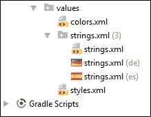

# 十八、本地化

这一章既快速又简单，但我们将学习如何让数百万潜在用户能够访问您的应用。我们将看到如何添加额外的语言，以及为什么在添加多种语言时，通过字符串资源以正确的方式添加文本对我们有好处。

在本章中，我们将执行以下操作:

*   通过添加西班牙语和德语，使笔记应用多语言化
*   学习如何更好的使用**字符串资源**

我们开始吧。

# 用西班牙语、英语和德语给自己的应用做笔记

首先，我们需要给我们的项目添加一些文件夹——每种新语言一个。文本被归类为**资源**，因此需要进入`res`文件夹。按照以下步骤为项目添加西班牙语支持。

### 注

虽然本项目的源文件在`Chapter18`文件夹中提供，但仅供参考。您需要完成接下来描述的过程来实现多语言功能。

## 添加西班牙语支持

按照接下来的步骤添加西班牙语:

1.  右键点击`res`文件夹，然后选择**新建** | **安卓资源目录**。在**目录名**字段中，键入`values-es`。
2.  现在我们需要添加一个文件，我们可以在其中放置我们所有的西班牙语翻译。
3.  右键点击`res`，选择**新建** | **安卓资源文件**，在**文件名**字段输入`strings.xml`。在**目录名**字段中输入`values-es`。

我们现在有一个`strings.xml`文件，任何设置为使用西班牙语的设备都将引用该文件。为了清楚起见，我们现在有两个不同的`strings.xml`文件。

## 增加德国支持

按照这些步骤添加德语语言支持。

1.  右键单击`res`文件夹，然后选择**新建** | **安卓资源目录**。在**目录名**字段中，键入`values-de`。
2.  现在我们需要添加一个文件，我们可以在其中放置我们所有的德语翻译。
3.  右键点击`res`，选择**新建** | **安卓资源文件**，在**文件名**字段输入`strings.xml`。在**目录名**字段中输入`values-de`。

下面的截图显示了`strings.xml`文件夹的样子。您可能想知道`strings.xml`文件夹是从哪里来的，因为它不符合我们在前面步骤中创建的结构。

AndroidStudio正在帮助我们按照 APK 格式的安卓操作系统的要求组织文件和文件夹。但是，您可以清楚地看到西班牙语和德语文件的标志以及它们的 **(de)** 和 **(es)** 后缀:



### 类型

根据您的AndroidStudio设置，您可能看不到国旗图标。如果你能看到三个`strings.xml`文件，一个没有后缀，一个有**(德)**，一个有 **(es)** ，那么你就可以继续了。

现在我们可以将翻译添加到我们刚刚创建的文件中。

## 添加字符串资源

正如我们所知，`strings.xml`文件包含应用将显示的单词，如重要、待办事项和想法等单词。通过为我们希望支持的每种语言准备一个`strings.xml`文件，我们可以让安卓根据用户的语言设置选择合适的文本。

当您阅读以下内容时，请注意，尽管我们将正在翻译的任何单词的翻译作为值，但是`name`属性保持不变。仔细想想，这是合乎逻辑的，因为这是我们在布局文件中引用的`name`属性。

让我们提供翻译，看看我们取得了什么成就，然后回来讨论我们将如何处理Kotlin代码中的文本。

实现该代码最简单的方法是从原始`strings.xml`文件中复制并粘贴代码，然后编辑每个`name`属性的值:

1.  双击打开`strings.xml`文件。一定要选择西班牙国旗旁边的那个或者 **(es)** 后缀。编辑文件如下:

    ```kt
    <?xml version="1.0" encoding="utf-8"?>
    <resources>
    <string name="app_name">Nota a sí mismo</string>
    <string name="action_settings">Configuración</string>

    <string name="action_add">add</string>
    <string name="title_hint">Título</string>
    <string name="description_hint">Descripción</string>
    <string name="idea_text">Idea</string>
    <string name="important_text">Importante</string>
    <string name="todo_text">Que hacer</string>
    <string name="cancel_button">Cancelar</string>
    <string name="ok_button">Vale</string>

    <string name="settings_title">Configuración</string>
    <string name="title_activity_settings">Configuración</string>

    </resources>
    ```

2.  双击打开文件。一定要选择德国国旗旁边的那个或者**(德)**后缀。编辑文件如下:

    ```kt
        <?xml version="1.0" encoding="utf-8"?>
        <resources>
     <string name="app_name">Hinweis auf selbst</string>
     <string name="action_settings">Einstellungen</string>

     <string name="action_add">add</string>
     <string name="title_hint">Titel</string>
     <string name="description_hint">Beschreibung</string>
     <string name="idea_text">Idee</string>
     <string name="important_text">Wichtig</string>
     <string name="todo_text">zu tun</string>
     <string name="cancel_button">Abbrechen</string>
     <string name="ok_button">Okay</string>

     <string name="settings_title">Einstellungen</string>
     <string name="title_activity_settings">Einstellungen</string>
        </resources>
    ```

### 类型

如果您没有提供额外(西班牙语和德语)`strings.xml`文件中的所有字符串资源，那么丢失的资源将从默认文件中获取。

我们所做的是提供两个翻译。安卓知道哪个翻译是哪个语言的，因为它们被放置在文件夹中。此外，我们使用了一个**字符串标识符**(属性`name`)来引用翻译。回头看看前面的代码，你会发现相同的标识符被用于两个翻译以及原始的`strings.xml`文件。

### 类型

您甚至可以本地化为一种语言的不同版本，例如美国或英国英语。完整的代码列表可在[http://stackoverflow . com/questions/7973023/什么是支持的语言列表-android 上的语言环境](http://stackoverflow.com/questions/7973023/what-is-the-list-of-supported-languages-locales-on-android)中找到。您甚至可以本地化资源，如图像和声音。在[了解更多信息。](http://developer.android.com/guide/topics/resources/localization.html)

翻译是从谷歌翻译复制粘贴的，所以很可能有些翻译是不正确的。像这样便宜地进行翻译是一种有效的方法，可以让一个应用在对自己说不同语言的用户的设备上使用一组基本的字符串资源。一旦你开始需要任何深度的翻译，也许是故事驱动的游戏或社交媒体应用的台词，你肯定会受益于由人类专业人员完成的翻译。

这个练习的目的是展示安卓是如何工作的，而不是如何翻译。

### 注

我真诚地向任何讲西班牙语或德语的人道歉，他们可能会看到这里提供的翻译的局限性。

现在我们有了翻译，我们可以看到他们在行动——在某种程度上。

# 用德语或西班牙语写给自己的跑步笔记

运行应用，看看是否如预期工作。现在，我们可以更改本地化设置，以西班牙语查看它。不同的设备在如何做到这一点上略有不同，但像素 2 XL 模拟器可以通过点击**自定义区域**应用进行更改:


接下来，选择 **es-ES** ，然后点击屏幕左下方的**SELECT‘ES’**按钮，如下图截图所示:


现在，您可以以通常的方式运行该应用。这是一个截图，显示了该应用运行在西班牙语。我已经将几个图像并排进行了 photoshopped 处理，以显示 Note to self 应用的几个不同屏幕:


你可以清楚地看到，我们的 app 主要是翻译成西班牙语的。显然，用户输入的文本将使用他们所说的任何语言——这不是我们应用的缺陷。然而，仔细看图片，你会注意到我指出了几个文本仍然是英文的地方。我们的每个对话窗口中仍有一些未翻译的文本。

这是因为文本直接包含在我们的 Kotlin 代码中。正如我们所看到的，在多种语言中使用字符串资源，然后在我们的布局中引用它们是很容易的，但是我们如何从我们的 Kotlin 代码中引用字符串资源呢？

## 用Kotlin代码进行翻译

首先要做的是在三个`strings.xml`文件中创建资源。下面是需要添加到三个不同文件中的两个资源。

在`strings.xml`(没有任何标志或后缀)中，在`<resources></resources>`标签内添加这两个资源:

```kt
<string name="add_new_note">Add a new note</string>
<string name="your_note">Your note</string>
```

在带有西班牙国旗和/或**后缀的`strings.xml`文件中，在`<resources></resources>`标签内添加这两个资源:**

```kt
<string name="add_new_note">Agregar una nueva nota</string>
<string name="your_note">Su nota</string>
```

在带有德国国旗和/或**(德)**后缀的`strings.xml`文件中，在`<resources></resources>`标签内添加这两个资源:

```kt
<string name="add_new_note">Eine neue Note hinzufügen</string>
<string name="your_note">Ihre Notiz</string>
```

接下来，我们需要编辑一些 Kotlin 代码来引用资源，而不是硬编码的 String。

打开`DialogNewNote.kt`文件，找到这行代码:

```kt
builder.setView(dialogView).setMessage("Add a new note")
```

编辑它以使用我们刚刚添加的字符串资源，而不是硬编码文本，如下所示:

```kt
builder.setView(dialogView).setMessage(
      resources.getString(
         R.string.add_new_note))
```

新代码使用链接的`setView`、`setMessage`和`resources.getString`功能来替换先前硬编码的`"Add a new note"`文本。仔细看，你会发现发送到`getString`的参数是字符串`R.string.add_new_note`标识符。

`R.string`代码指的是`res`文件夹中的字符串资源，`add_new_note`是我们的标识。然后，安卓将能够根据运行该应用的设备的区域设置来决定哪个版本(默认、西班牙或德语)合适。

我们还有一个硬编码的字符串资源需要更改。

打开`DialogShowNote.kt`文件，找到这行代码:

```kt
builder.setView(dialogView).setMessage("Your Note")
```

编辑它以使用我们刚刚添加的字符串资源，而不是硬编码文本，如下所示:

```kt
builder.setView(dialogView).setMessage(
         resources.getString(R.string.your_note))
```

新代码再次使用链接的`setView`、`setMessage`和`resources.getString`功能来替换先前硬编码的`"Your note"`文本。同样，发送到`getString`的参数是字符串标识符，在本例中是`R.string.your_note`。

安卓现在可以根据运行该应用的设备的地区来决定哪个版本(默认、西班牙或德语)合适。下一个屏幕截图显示，新的笔记屏幕现在具有相应语言的开始文本:


您可以添加任意多的字符串资源。从[第 3 章](05.html "Chapter 3. Exploring Android Studio and the Project Structure")、*探索AndroidStudio和项目结构*中提醒大家，使用字符串资源是推荐的方式，可以将所有文本添加到所有项目中。本书中的教程(除了《自我笔记》)将倾向于对它们进行硬编码，以形成一个更紧凑的教程。

# 总结

我们现在可以通过我们的应用走向全球，并添加更灵活的字符串资源，而不是对所有文本进行硬编码。

在下一章中，我们将看到如何使用动画和插值器为布局添加酷炫的动画。**