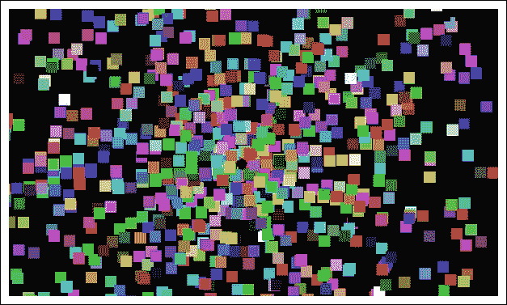

# 第二十二章。粒子系统和处理屏幕触摸

我们已经有了我们在上一章中使用线程实现的实时系统。在这一章中，我们将创建将在这个实时系统中存在和发展的实体，就好像它们有自己的思想一样。

我们还将通过学习如何设置与屏幕交互的能力来了解用户如何将这些实体绘制到屏幕上。这不同于在 UI 布局中与小部件交互。

这一章的内容如下:

*   向屏幕添加自定义按钮
*   编码`Particle`类
*   编码`ParticleSystem`类
*   处理屏幕触摸

我们将从向我们的应用程序添加自定义用户界面开始。

# 在屏幕上添加自定义按钮

我们需要让用户控制何时开始另一个绘图，并清除他们之前工作的屏幕。我们还需要用户能够决定是否或何时将该绘图变为现实。为了实现这一点，我们将在屏幕上添加两个按钮，每个按钮对应一个任务。

将这些新属性添加到`LiveDrawingView`类中其他属性之后的代码中:

```kt
// These will be used to make simple buttons
private var resetButton: RectF
private var togglePauseButton: RectF
```

我们现在有两个`RectF`实例。这些对象各有四个`Float`坐标，我们提出的两个按钮的每个角各有一个坐标。

我们现在将向`LiveDrawingView`类添加一个`init`块，并在首次创建`LiveDrawingView`实例时初始化位置，如下所示:

```kt
init {
   // Initialize the two buttons
   resetButton = RectF(0f, 0f, 100f, 100f)
   togglePauseButton = RectF(0f, 150f, 100f, 250f)
}
```

现在我们已经为按钮添加了实际坐标。如果你在屏幕上可视化坐标，那么你会看到它们在左上角，暂停按钮在重置/清除按钮的正下方。

现在我们可以画按钮了。将以下两行代码添加到`LiveDrawingView`类的`draw`函数中。预先存在的注释准确地显示了新的突出显示的代码应该放在哪里:

```kt
// Draw the buttons
canvas.drawRect(resetButton, paint)
canvas.drawRect(togglePauseButton, paint)

```

新代码使用了`drawRect`函数的覆盖版本，我们只需将两个`RectF`实例直接传递到通常的`Paint`实例旁边。我们的按钮现在将出现在屏幕上。

我们将在本章后面看到用户如何与这些稍微粗糙的按钮交互。

# 实现粒子系统效果

粒子系统是一个控制粒子的系统。在我们的例子中，`ParticleSystem`是我们将要编写的一个类，它将产生`Particle`类(也是我们将要编写的一个类)的实例(大量实例)，这些实例将一起创建一个简单的类似爆炸的效果。

这是由粒子系统控制的一些粒子的截图，可能会在本章结束时出现:



为了澄清，每个彩色方块都是`Particle`类的一个实例，所有`Particle`实例都由`ParticleSystem`类控制和持有。此外，用户将通过用手指绘图来创建多个(数百个)`ParticleSystem`实例。粒子系统将以点或块的形式出现，直到用户点击暂停按钮，它们才会出现。我们将仔细检查代码，以便您能够在代码中修改`Particle`和`ParticleSystem`实例的大小、颜色、速度和数量。

### 注

留给读者的练习是在屏幕上添加额外的按钮，以允许用户将这些属性作为应用程序的一项功能进行更改。

我们将从编码`Particle`类开始。

## 对粒子类进行编码

添加如下代码所示的 `import`语句、成员变量、构造函数和`init`块:

```kt
import android.graphics.PointF

class Particle(direction: PointF) {

    private val velocity: PointF = PointF()
    val position: PointF = PointF()

    init {
          // Determine the direction
          velocity.x = direction.x
          velocity.y = direction.y
    }
```

我们有两个性质——一个是速度性质，一个是位置性质。他们都是`PointF`对象。`PointF`持有两种`Float`价值观。粒子的位置很简单:它只是一个水平和垂直的值。速度值得多解释一下。`velocity`对象`PointF`中的两个值都是速度，一个水平，另一个垂直。这两种速度的结合将创造一个方向。

接下来，增加如下`update`功能；我们稍后将更详细地了解它:

```kt
fun update() {
    // Move the particle
    position.x += velocity.x
    position.y += velocity.y
}
```

每个`Particle`实例的`update`函数将由`ParticleSystem` 对象的`update`函数为应用程序的每一帧调用，该函数又将由`LiveDrawingView`类调用(同样是在`update`函数中)，我们将在本章后面对其进行编码。

在`update`功能中，`position`的水平和垂直值使用`velocity`的相应值进行更新。

### 类型

请注意，我们不会在更新中使用当前的帧速率。如果你想确定你的粒子都以正确的速度飞行，你可以修改这个，但是所有的速度都是随机的。添加这个额外的计算(对于每个粒子)并没有太大的好处。然而，正如我们将很快看到的那样，`ParticleSystem`类将需要考虑每秒的当前帧数来测量它应该运行多长时间。

现在我们可以进入`ParticleSysytem`课了。

## 对粒子系统类进行编码

`ParticleSystem`类比`Particle`类多了一些细节，但还是相当直白。记住我们需要通过这个类实现什么:保持、繁殖、更新和绘制一堆(相当大的一堆)`Particle`实例。

添加以下构造函数、属性和导入语句:

```kt
import android.graphics.Canvas
import android.graphics.Color
import android.graphics.Paint
import android.graphics.PointF

import java.util.*

class ParticleSystem {

    private var duration: Float = 0f
    private var particles: 
         ArrayList<Particle> = ArrayList()

    private val random = Random()
    var isRunning = false
```

我们有四个属性:第一，一个名为`duration`的`Float`，它将被初始化为我们希望效果运行的秒数；名为`particles`的`ArrayList`实例保存`Particle`实例，并将保存我们为此系统实例化的所有`Particle`对象。

创建名为`random`的`Random`实例是因为我们需要生成如此多的随机值，以至于每次创建一个新对象都会让我们慢一点。

最后，名为`isRunning`的`Boolean`将跟踪粒子系统当前是否正在显示(更新和绘制)。

现在我们可以对`initParticles`功能进行编码了。每次我们想要一个新的`ParticleSystem`时都会调用这个函数。请注意，唯一的参数是名为`numParticles`的`Int`。

当我们调用`initParticles`时，我们可以从初始化疯狂数量的粒子中获得一些乐趣。如下添加`initParticles`函数，然后我们将更仔细地查看代码:

```kt
fun initParticles(numParticles:Int){

   // Create the particles
   for (i in 0 until numParticles) {
         var angle: Double = random.nextInt(360).toDouble()
         angle *= (3.14 / 180)

         // Option 1 - Slow particles
         val speed = random.nextFloat() / 3

         // Option 2 - Fast particles
         //val speed = (random.nextInt(10)+1);

         val direction: PointF

         direction = PointF(Math.cos(
                     angle).toFloat() * speed,
                     Math.sin(angle).toFloat() * speed)

         particles.add(Particle(direction))

    }
}
```

`initParticles`函数只包含一个完成所有工作的`for`循环。`for`循环从零运行到`numParticles`。

首先，生成一个 0 到 359 之间的随机数并存储在`Float angle`中。接下来，有一点数学，我们用`3.14/180`乘以`angle`。这会将中的角度转换为基于弧度的测量，这是我们稍后将使用的`Math`类所要求的。

然后我们生成另一个介于 1 和 10 之间的随机数，并将结果分配给一个名为`speed`的`Float`变量。

### 注

请注意，我已经添加了注释，为这部分代码中的值建议了不同的选项。我在`ParticleSystem`课的几个地方都是这样做的，当我们到了这一章的最后，我们会有一些乐趣改变这些值，看看这对绘图应用有什么影响。

现在我们有了一个随机的角度和速度，我们可以将它们转换并组合成一个向量，可以在每一帧的`update`函数内部使用。

### 注

矢量是决定方向和速度的值。我们的向量存储在`direction`对象中，直到它被传递到`Particle`构造函数中。向量可以是多维的。我们的由两个维度组成，因此定义了 0 到 359 度之间的航向和 1 到 10 度之间的速度。你可以在我的网站上阅读更多关于向量、标题、正弦和余弦的信息。

我决定不解释使用`Math.sin`和`Math.cos`来完整创建向量的单行代码，因为魔法部分出现在以下公式中:

*   角度的余弦 x `speed`
*   角度 x 的正弦值`speed`

其余的魔法发生在由`Math`类提供的余弦和正弦函数中的隐藏计算中。如果你想知道他们的全部细节，那么你可以看看前面的提示。

最后，一个新的`Particle`被创建，然后被添加到`particles ArrayList`中。

接下来，我们将对`update`功能进行编码。注意`update`功能需要当前帧率作为参数。将`update`功能编码如下:

```kt
fun update(fps: Long) {
   duration -= 1f / fps

   for (p in particles) {
         p.update()
  }

   if (duration < 0) {
         isRunning = false
  }
}
```

`update`功能内发生的第一件事是从`duration`中取出经过的时间。记住`fps`的意思是每秒帧数，所以`1/fps`给出的值是一秒的几分之一。

接下来，有一个`for`循环，为`particles` `ArrayList`中的每个`Particle`实例调用`update`函数。

最后，代码检查粒子效果是否已经随着`if(duration < 0)`运行，如果已经运行，那么`isRunning`被设置为`false`。

现在我们可以对`emitParticles`函数进行编码，该函数将设置每个`Particle`实例运行，不要与`initParticles`混淆，后者创建所有新粒子并给出它们的速度。`initParticles`功能将在用户与屏幕交互之前调用一次，而`emitParticles`功能将在用户在屏幕上绘制时每次需要启动效果时调用。

使用以下代码添加`emitParticles`功能:

```kt
fun emitParticles(startPosition: PointF) {
    isRunning = true

    // Option 1 - System lasts for half a minute
    duration = 30f

    // Option 2 - System lasts for 2 seconds
    //duration = 3f

    for (p in particles) {
          p.position.x = startPosition.x
          p.position.y = startPosition.y
   }
}
```

首先，注意所有粒子将开始的`PointF`作为参数被传入。所有的粒子都将从同一个位置开始，然后根据各自的随机速度扇出每一帧。

`isRunning` `Boolean`设置为`true``duration`设置为`30f`，效果运行 30 秒，`for`循环将每个粒子的位置设置为起始坐标。

我们的`ParticleSysytem`的最后一个功能是`draw`功能，它将揭示出效果的全部荣耀。该函数接收到对`Canvas`和`Paint`的引用，因此它可以绘制到`LiveDrawingView`刚刚锁定在其`draw`函数中的同一个`Canvas`实例。

添加`draw`功能如下:

```kt
fun draw(canvas: Canvas, paint: Paint) {

    for (p in particles) {

           // Option 1 - Colored particles
           //paint.setARGB(255, random.nextInt(256),
           //random.nextInt(256),
           //random.nextInt(256))

           // Option 2 - White particles
           paint.color = Color.argb(255, 255, 255, 255)
           // How big is each particle?

           // Option 1 - Big particles
           //val sizeX = 25f
           //val sizeY = 25f

           // Option 2 - Medium particles
           //val sizeX = 10f
           //val sizeY = 10f

           // Option 3 - Tiny particles
           val sizeX = 12f
           val sizeY = 12f

           // Draw the particle
           // Option 1 - Square particles
           canvas.drawRect(p.position.x, p.position.y,
                       p.position.x + sizeX,
                       p.position.y + sizeY,
                       paint)

          // Option 2 - Circular particles
          //canvas.drawCircle(p.position.x, p.position.y,
          //sizeX, paint)
   }
}
```

在前面的代码中，一个`for`循环遍历`particles`中的每个`Particle`实例。设置好矩形的大小和颜色后，依次使用`drawRect`绘制每个`Particle`。

### 注

请再次注意我是如何为代码更改建议不同的选项的，以便我们在完成编码后可以享受一些乐趣。

我们现在可以开始让粒子系统工作了。

## 在 LiveDrawingView 类中生成粒子系统

添加一个充满系统和更多成员的`ArrayList`实例来跟踪事物。将以下代码中突出显示的代码添加到现有注释指示的位置:

```kt
// The particle systems will be declared here later
private val particleSystems = ArrayList<ParticleSystem>()

private var nextSystem = 0
private val maxSystems = 1000
private val particlesPerSystem = 100

```

我们现在可以跟踪多达 1000 个粒子系统，每个系统中有 100 个粒子。随意玩这些数字。在现代设备上，你可以毫无困难地将粒子运行到数百万个，但是在模拟器上，它将开始与仅仅几十万个粒子作斗争。

通过添加以下突出显示的代码，初始化`init`块中的系统:

```kt
init {

  // Initialize the two buttons
  resetButton = RectF(0f, 0f, 100f, 100f)
  togglePauseButton = RectF(0f, 150f, 100f, 250f)

  // Initialize the particles and their systems
  for (i in 0 until maxSystems) {
 particleSystems.add(ParticleSystem())
 particleSystems[i]
 .initParticles(particlesPerSystem)
 }
}
```

代码循环通过`ArrayList`，在每个`ParticleSystem`实例上调用后跟`initParticles`的构造函数。

现在我们可以通过将高亮显示的代码添加到`update`函数来更新循环的每一帧上的系统:

```kt
private fun update() {
  // Update the particles
  for (i in 0 until particleSystems.size) {
 if (particleSystems[i].isRunning) {
 particleSystems[i].update(fps)
         }
 }
}
```

前面的代码循环遍历每个`ParticleSystem`实例，首先检查它们是否处于活动状态，然后调用`update`函数，每秒传入当前帧。

现在，我们可以通过将以下代码片段中突出显示的代码添加到`draw`函数来绘制循环的每一帧中的系统:

```kt
// Choose the font size
paint.textSize = fontSize.toFloat()

// Draw the particle systems
for (i in 0 until nextSystem) {
 particleSystems[i].draw(canvas, paint)
}

// Draw the buttons
canvas.drawRect(resetButton, paint)
canvas.drawRect(togglePauseButton, paint)
```

之前的代码循环通过`particleSystems`，在每个上面调用`draw`函数。当然，我们实际上还没有产生任何实例；为此，我们需要学习如何应对屏幕交互。

# 处理触摸

要让开始屏幕交互，将`OnTouchEvent`功能添加到`LiveDrawingView`类，如下所示:

```kt
override fun onTouchEvent(
   motionEvent: MotionEvent): Boolean {

   return true
}
```

这是一个被覆盖的函数，每次用户与屏幕交互时，安卓都会调用它。看看`onTouchEvent`唯一的参数。

原来`motionEvent`里面藏着一大堆数据，这些数据包含了刚刚发生的触摸的细节。操作系统将它发送给我们，因为它知道我们可能会需要一些。

注意，我说的是*其中一些*。`MotionEvent`类相当广泛；它包含几十个函数和属性。

目前，我们需要知道的是，在玩家手指移动、触摸屏幕或被移除的精确时刻，屏幕会做出反应。

我们将使用的包含在`motionEvent`中的一些变量和函数包括:

*   `action`属性，不出所料，它保存已执行的动作。不幸的是，它以稍微编码的格式提供了这些信息，这解释了为什么需要一些其他变量。
*   `ACTION_MASK`变量，它提供了一个被称为掩码的值，借助更多一点的科特林技巧，可以用来过滤来自`action`的数据。
*   `ACTION_UP`变量，我们可以用它来查看所执行的动作(比如移除手指)是否是我们想要响应的动作。
*   `ACTION_DOWN`变量，我们可以用它来查看执行的动作是否是我们想要响应的动作。
*   `ACTION_MOVE`变量，我们可以用它来查看执行的动作是否是移动/拖动动作。
*   `x`属性保存事件发生的水平浮点坐标。
*   `y`属性保存事件发生的垂直浮点坐标。

作为的具体例子，假设我们需要使用`ACTION_MASK`过滤`action`中的数据，看看结果是否与`ACTION_UP`相同。如果是的话，那么我们知道用户刚刚将手指从屏幕上移开，可能是因为他们刚刚点击了一个按钮。一旦我们确定事件属于正确的类型，我们将需要使用`x`和`y`找出事件发生的地点。

还有最后一个复杂因素。我提到的柯特林诡计是`&`逐位运算符，不要与我们一直在结合`if`关键字使用的逻辑`&&`运算符混淆。

`&`按位运算符检查两个值中的每个对应部分是否为真。这是配合`action`使用`ACTION_MASK`时需要的过滤器。

### 注

健全性检查:我不太愿意详细讨论`MotionEvent`和按位运算符。有可能完成整本书，甚至制作一个专业质量的互动应用程序，而不需要完全理解它们。如果您知道我们将在下一节中编写的代码行决定了玩家触发的事件类型，那么这就是您需要知道的全部。我只是认为像你这样有眼光的读者会想知道这个系统是如何工作的。总之，如果你懂按位运算符，那就太好了；你可以走了。如果没有，也没关系；你还是可以去的。如果你对按位运算符感到好奇(有很多)，你可以在[https://en.wikipedia.org/wiki/Bitwise_operation](https://en.wikipedia.org/wiki/Bitwise_operation)了解更多。

现在我们可以对`onTouchEvent`功能进行编码，看到所有`MotionEvent`的东西都在运行。

## 对 onTouchEvent 函数进行编码

响应用户在屏幕上移动手指，在`onTouchEvent`函数中添加以下代码片段中突出显示的代码到我们已经有的代码中:

```kt
// User moved a finger while touching screen
if (motionEvent.action and MotionEvent.
 ACTION_MASK == 
 MotionEvent.ACTION_MOVE) {

 particleSystems[nextSystem].emitParticles(
 PointF(motionEvent.x,
 motionEvent.y))

 nextSystem++
 if (nextSystem == maxSystems) {
 nextSystem = 0
 }
}

return true
```

`if`条件检查事件类型是否是用户移动手指。如果是，那么`particleSystems`中的下一个粒子系统的`emitParticles`函数被调用。之后，`nextSystem`变量递增，并进行测试，看它是否是最后一个粒子系统。如果是，那么`nextSystem`被设置为零，准备在下次需要时开始重用现有的粒子系统。

我们可以继续让系统对用户按下其中一个按钮做出响应，方法是在我们刚刚讨论的前一个代码之后和我们已经编码的`return`语句之前，在下面的代码片段中添加高亮显示的代码:

```kt
// Did the user touch the screen
if (motionEvent.action and MotionEvent.ACTION_MASK ==
 MotionEvent.ACTION_DOWN) {

 // User pressed the screen so let's 
 // see if it was in the reset button
 if (resetButton.contains(motionEvent.x,
 motionEvent.y)) {

 // Clear the screen of all particles
 nextSystem = 0
 }

 // User pressed the screen so let's 
 // see if it was in the toggle button
 if (togglePauseButton.contains(motionEvent.x,
 motionEvent.y)) {

 paused = !paused
 }
}

return true
```

`if`语句的条件检查用户是否点击了屏幕。如果有，`RectF`类的`contains`功能与`x`和`y`一起使用，以查看该按钮是否在我们的自定义按钮内。如果按下复位按钮，那么当`nextSystem`设置为零时，所有的颗粒将消失。如果按下暂停按钮，则切换`paused`的值，使`update`功能停止/开始在线程内被调用。

## 完成抬头显示器

编辑`printDebuggingText`功能中的代码，如下所示:

```kt
canvas.drawText("Systems: $nextSystem",
         10f, (fontMargin + debugStart + 
         debugSize * 2).toFloat(), paint)

canvas.drawText("Particles: ${nextSystem * 
         particlesPerSystem}",
         10f, (fontMargin + debugStart 
         + debugSize * 3).toFloat(), paint)
```

前面的代码只是将一些有趣的统计数据打印到屏幕上，告诉我们当前绘制了多少粒子和系统。

# 运行应用

现在我们可以看到实时绘图应用程序在运行，并使用我们在代码中注释掉的一些不同选项。

用小的、圆的、彩色的、快速的粒子运行应用程序。下面的截图显示了在几个地方被点击的屏幕:


然后恢复绘图，如下图截图所示:


用小的、白色的、方形的、缓慢的、持续时间长的粒子做一个儿童风格的图画，如下图所示:


然后恢复绘图，等待 20 秒，直到绘图恢复生机并发生变化:


# 总结

在这一章中，我们学习了如何将数千个独立的实体添加到我们的实时系统中。这些实体由`ParticleSystem`类控制，该类又与游戏循环交互并受其控制。当游戏循环在一个线程中运行时，我们了解到用户仍然可以与屏幕无缝交互，操作系统将通过`onTouchEvent`功能向我们发送这些交互的细节。

在下一章中，当我们探索如何播放音效时，我们的应用程序最终会变得有点嘈杂。