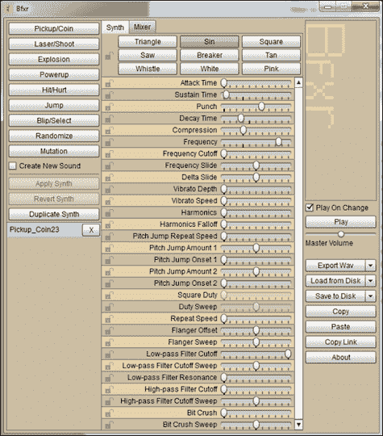
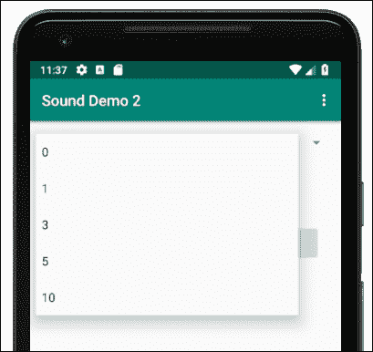

# 二十三、安卓音效和旋转小部件

在这一章中，我们将研究`SoundPool`类，以及我们可以使用它的不同方式，这取决于我们是只想播放声音，还是走得更远并跟踪我们正在播放的声音。然后，我们将通过制作一个酷音演示应用将我们所学的一切付诸行动，该应用还将向我们介绍一个新的用户界面小部件:**微调器**。

在本章中，我们将执行以下操作:

*   了解如何使用安卓`SoundPool`课程
*   使用`SpinnerView`对基于声音的应用进行编码

我们开始吧。

# 音池类

`SoundPool`类允许我们保持和操纵一组声音效果:字面上，一个声音池。该类处理从解压缩声音文件，如`.wav`或`.ogg`文件，通过一个整数标识保持对它的识别引用，当然，播放声音的一切。声音播放时，以不阻塞方式(使用幕后线程)播放，不干扰我们 app 的流畅运行，也不干扰我们用户与它的交互。

我们需要做的第一件事是将音效添加到游戏项目的`main`文件夹中一个名为`assets`的文件夹中。我们很快就会这么做。

接下来，在我们的 Kotlin 代码中，我们为打算使用的每个音效声明一个`SoundPool`类型的对象和一个`Int`标识符，如下面的代码所示。我们还将声明另一个名为`nowPlaying`的`Int`，我们可以使用它来跟踪当前正在播放的声音；我们将很快看到如何做到这一点:

```kt
var sp: SoundPool
var idFX1 = -1
nowPlaying = -1
volume = .1f
```

现在，我们来看看初始化`SoundPool`的方法。

## 初始化音池

我们将使用对象来设置我们想要的声音池的属性。

第一段代码使用链接，并在一个对象上调用四个独立的函数来初始化我们的`AudioAttributes`对象(`audioAttributes`)，如以下代码所示:

```kt
val audioAttributes = AudioAttributes.Builder()
         .setUsage(AudioAttributes.
                     USAGE_ASSISTANCE_SONIFICATION)
         .setContentType(AudioAttributes.
                     CONTENT_TYPE_SONIFICATION)
         .build()

sp = SoundPool.Builder()
         .setMaxStreams(5)
         .setAudioAttributes(audioAttributes)
         .build()
```

在前面的代码中，我们使用了这个类的`Builder`函数来初始化一个`AudioAttributes`实例，让它知道它将用于与`USAGE_ASSISTANCE_SONIFICATION`的用户界面交互。

我们还使用了`CONTENT_TYPE_SONIFICATION`，它让类知道它是用于响应声音的，例如，按钮点击、碰撞或类似的。

现在，我们可以通过传入`AudioAttributes`对象(`audioAttributes`)和我们可能想要播放的最大同时声音数量来初始化`SoundPool` ( `sp`)本身。

第二个代码块链接另外四个函数来初始化`sp`，包括对`setAudioAttributes`的调用，该调用使用了我们在前面的链接函数块中初始化的`audioAttributes`对象。

现在，我们可以继续将声音文件加载(解压缩)到我们的`SoundPool`中。

### 将声音文件加载到内存中

像我们的线程控制一样，我们需要将代码包装在`try` - `catch`块中。这很有意义，因为读取文件可能会因为我们无法控制的原因而失败，但我们这样做也是因为我们被迫这样做，因为我们使用的函数会引发异常，否则我们编写的代码将无法编译。

在`try`块中，我们声明并初始化`AssetManager`和`AssetFileDescriptor`类型的对象。

使用解压缩声音文件的`AssetManager`对象的`openFd`功能初始化`AssetFileDescriptor`。然后我们初始化我们的标识(`idFX1`)，同时我们将`AssetFileDescriptor`实例的内容加载到我们的`SoundPool`中。

`catch`块简单地向控制台输出一条消息，让我们知道是否出了问题，如下面的代码所示:

```kt
try {
    // Create objects of the 2 required classes
    val assetManager = this.assets
    var descriptor: AssetFileDescriptor

    // Load our fx in memory ready for use
    descriptor = assetManager.openFd("fx1.ogg")
    idFX1 = sp.load(descriptor, 0)

}  catch (e: IOException) {
    // Print an error message to the console
    Log.e("error", "failed to load sound files")
}
```

现在，我们准备制造一些噪音。

### 播放声音

在这个点，我们的`SoundPool`中有一个音效，我们有一个 ID 可以用来指代它。

这就是我们演奏声音的方式。请注意，在下面的代码行中，我们使用播放声音的同一个函数的返回值来初始化`nowPlaying`变量。因此，以下代码同时播放声音并将正在播放的标识值加载到`nowPlaying`中:

```kt
nowPlaying = sp.play(idFX2,
  volume, volume, 0, repeats, 1f)
```

### 注

不需要为了播放声音而将 ID 存储在`nowPlaying`中，但是它有它的用途，正如我们现在将要看到的。

`play`功能的参数如下，从左到右:

*   音效的识别码
*   左右扬声器音量
*   优先于其他可能正在播放的声音
*   声音重复的次数
*   播放速率/速度(1 为正常速率)

在制作声音演示应用之前，我们还需要做一件事。

### 停止声音

使用`stop`功能在还在播放的时候停止一个声音也是非常容易的，如下代码所示。请注意，在任何给定时间都可能有多个音效在播放，因此`stop`功能需要您想要停止的音效的 ID:

```kt
sp.stop(nowPlaying)
```

当你调用`play`时，你只需要存储当前正在播放的声音的 ID，如果你想跟踪它，以便以后可以与之交互。现在，我们可以制作声音演示应用。

# 声音演示应用，介绍 Spinner 小部件

当然，关于音效，我们需要一些真实的声音文件。你可以用 BFXR 使你自己拥有(如下一节所解释的)或者使用所提供的。该应用的音效在下载包中，可以在`Chapter23/Sound Demo`文件夹的`assets`文件夹中找到。

## 制作音效

有一款名为 BFXR 的开源应用，可以让我们自己制作音效。这里有一个非常快速的使用 BFXR 制作自己的音效的指南。从[www.bfxr.net](http://www.bfxr.net)获取一份免费拷贝。

### 类型

请注意，声音演示应用的音效是在`Chapter23/assets`文件夹中提供给您的。除非你想，否则你不必创建自己的音效，但是获得这个免费软件并学习如何使用它仍然是值得的。

按照网站上的简单说明进行设置。试着做一些这样的事情来产生很酷的声音效果:

### 类型

这是一个非常浓缩的教程。你可以用 BFXR 做这么多。要了解更多信息，请阅读我们之前提到的网址上的网站提示。

1.  Run `bfxr`. You should see a screen similar to the one shown in the following screenshot:

    

2.  Try out all the preset types that generate a random sound of that type, as shown in the following screenshot. When you have a sound that is close to what you want, move on to the next step:

    

3.  Use the sliders to fine-tune the pitch, duration, and other aspects of your new sound, as shown in the following screenshot:

    

4.  Save your sound by clicking the **Export Wav** button, as shown in the following screenshot. Despite the text of this button, as we will see, we can also save in formats other than `.wav`:

    

5.  安卓在 OGG 格式的声音上非常好用，所以当被要求给你的文件命名时，在文件名的末尾使用`.ogg`扩展名。
6.  重复步骤 2 到 5，创建三种很酷的音效。将它们命名为`fx1.ogg`、`fx2.ogg`和`fx3.ogg`。我们使用`.ogg`文件格式，因为它比 WAV 等格式更压缩。

当您准备好声音文件后，我们可以继续使用该应用。

## 布局声音演示界面

我将比我在之前的项目中更简短地描述我们正在习惯的项目部分。不过，每次有新的概念，我一定会完整地解释清楚。我想现在你可以把一些小部件拖到一个`ConstraintLayout`上，改变它们的`text`属性。

完成以下步骤，如有问题，可在下载包的`Chapter23/Sound Demo`文件夹中复制或查看代码:

1.  创建一个新项目，称之为`Sound Demo`，选择一个**基础活动**，在**最低 API 等级**选项上选择 **API 21: Android 5.0(棒棒糖)**，但其他所有设置保留默认值，删除 **Hello world！** `TextView`。
2.  In this order, from top to bottom, and then from left to right, drag a **Spinner** from the **Containers** category, a **SeekBar** **(discrete)** from the **Widgets** category, and four **Buttons** from the palette onto the layout while arranging and resizing them and setting their `text` properties, as shown in the following screenshot:

    

3.  单击**推断约束**按钮。
4.  使用以下表格设置其属性:

    诶诶诶诶哟哟哟哟哟哟哟哟哟哟哟哟哟哟哟哟哟哟哟哟哟哟哟哟哟哟哟哟哟哟哟哟哟哟哟哟哟哟哟哟哟哟哟哟哟哟哟哟哟哟哟哟哟哟哟哟

    【T1135】

    <colgroup><col style="text-align: left"><col style="text-align: left"><col style="text-align: left"></colgroup>
    | 

    是朱公

     | 

    孟尝君

     | 

    绿筠小姐

     |
    | --- | --- | --- |
    | 温契夫 | 菲兰达(音译)(标识) |  |
    | 温契夫 | 阿金 | `dropdown` |
    | 温契夫 | 阿悦 | `@array/spinner_options` |
    | 菲兰达(音译)(标识) | `seekBar` |
    | 诶诶诶诶哟哟哟哟哟哟哟哟哟哟哟哟哟哟哟哟哟哟哟哟哟哟哟哟哟哟哟哟哟哟哟哟哟哟哟哟哟哟哟哟哟哟哟哟哟哟哟哟哟哟哟哟哟哟哟哟 | (中文) | `10` |
    | 哟哟哟哟哟哟哟哟哟哟哟哟哟哟哟哟哟哟哟哟哟哟哟哟哟哟哟哟哟哟哟哟哟哟哟哟哟哟哟哟哟哟哟哟哟哟哟哟哟哟哟哟哟哟哟哟哟(**FX 1**) | 菲兰达(音译)(识别) | `btnFX1` |
    | 【T1121】哟哟哟哟哟哟哟哟哟哟哟哟哟哟哟哟哟哟哟哟哟哟哟哟哟哟哟哟哟哟哟哟哟哟哟哟哟哟哟哟哟哟哟哟哟哟哟哟哟哟哟哟哟哟哟哟哟(**FX 2**) | 菲兰达(音译)(识别) | 【T1131】`btnFX2` | 【T1137】哟哟哟哟哟哟哟哟哟哟哟哟哟哟哟哟哟哟哟哟哟哟哟哟哟哟哟哟哟哟哟哟哟哟哟哟哟哟哟哟哟哟哟哟哟哟哟哟哟哟哟哟哟哟哟哟哟( **FX 3** | 菲兰达(音译)(识别) |  | `btnFX3` |
    | 哟哟哟哟哟哟哟哟哟哟哟哟哟哟哟哟哟哟哟哟哟哟哟哟哟哟哟哟哟哟哟哟哟哟哟哟哟哟哟哟哟哟哟哟哟哟哟哟哟哟哟哟哟哟哟哟哟(**云娥** ) | 菲兰达(音译)(识别) | `btnStop` |

5.  接下来，将以下高亮显示的代码添加到`values`文件夹中的`strings.xml`文件中。在上一步中，我们为`options`属性使用了这个名为`spinner_options`的字符串资源数组。它将代表可以从我们的旋转器中选择的选项:

    ```kt
       <resources>
           <string name="app_name">Sound Demo</string>

           <string name="hello_world">Hello world!</string>
           <string name="action_settings">Settings</string>

           <string-array name="spinner_options">
             <item>0</item>
             <item>1</item>
             <item>3</item>
             <item>5</item>
             <item>10</item>
           </string-array>

        </resources>
    ```

现在运行该应用，您最初将不会看到任何以前没有看到过的内容。然而，如果你点击微调器，那么你会看到我们的字符串数组中的选项`spinner_options`。我们将使用微调器来控制声音效果在播放时重复出现的次数，如下图所示:



让我们编写 Kotlin 代码来使这个应用工作，包括我们如何与微调器交互。

使用操作系统的文件浏览器，转到项目的`app\src\main`文件夹，添加一个名为`assets`的新文件夹。

下载包的`Chapter23/Sound Demo/assets`文件夹里有三个为你准备好的声音文件。将这三个文件放入您刚刚创建的`assets`目录或使用您自己创建的目录。重要的是它们的文件名必须是`fx1.ogg`、`fx2.ogg`和`fx3.ogg`。

## 对声音演示进行编码

首先，我们将更改类声明，这样我们就可以有效地处理与所有小部件的交互。编辑声明以实现`View.OnClickListener`，如下代码所示:

```kt
class MainActivity : AppCompatActivity(), 
  View.OnClickListener {
```

我们将很快添加所需的`onClick`功能。

现在，我们将为我们的`SoundPool`实例添加一些属性，音效 id 和一个`nowPlaying Int`属性，正如我们之前所讨论的，我们还将添加一个`Float`来保存 0(静音)和 1(全音量，基于设备的当前音量)之间的音量的值。我们还将添加一个名为`repeats`的`Int`属性，它包含我们重复给定音效的次数，这并不奇怪:

```kt
var sp: SoundPool   

private var idFX1 = -1
private var idFX2 = -1
private var idFX3 = -1

var nowPlaying = -1
var volume = .1f
var repeats = 2

init{

  val audioAttributes = AudioAttributes.Builder()
        .setUsage(AudioAttributes.
              USAGE_ASSISTANCE_SONIFICATION)
        .setContentType(AudioAttributes.
              CONTENT_TYPE_SONIFICATION)
        .build()

  sp = SoundPool.Builder()
        .setMaxStreams(5)
        .setAudioAttributes(audioAttributes)
        .build()
}
```

在前面的代码中，我们还添加了一个`init`块，在这里我们初始化了我们的`SoundPool`实例。

### 类型

为前面的代码添加以下`import`语句，以便使用您喜欢的方法工作:

```kt
import android.media.AudioAttributes
import android.media.AudioManager
import android.media.SoundPool
import android.os.Build

import android.view.View
import android.widget.Button
```

现在，在`onCreate`功能中，我们可以用通常的方式为我们的按钮设置点击监听器，如下所示:

```kt
btnFX1.setOnClickListener(this)
btnFX2.setOnClickListener(this)
btnFX3.setOnClickListener(this)
btnStop.setOnClickListener(this)
```

### 类型

请务必添加以下`import`以使前面的代码工作:

```kt
import kotlinx.android.synthetic.main.content_main.*
```

接下来，我们依次加载我们的每个音效，并用与我们加载到`SoundPool`中的相关音效相匹配的值初始化我们的 id。根据需要，整个东西被包裹在一个`try` - `catch`块中，如下代码所示:

```kt
try {
    // Create objects of the 2 required classes
    val assetManager = this.assets
    var descriptor: AssetFileDescriptor

    // Load our fx in memory ready for use
    descriptor = assetManager.openFd("fx1.ogg")
    idFX1 = sp.load(descriptor, 0)

    descriptor = assetManager.openFd("fx2.ogg")
    idFX2 = sp.load(descriptor, 0)

    descriptor = assetManager.openFd("fx3.ogg")
    idFX3 = sp.load(descriptor, 0)

}   catch (e: IOException) {
    // Print an error message to the console
    Log.e("error", "failed to load sound files")
}
```

### 类型

使用您喜欢的方法为之前的代码添加以下`import`语句:

```kt
import android.content.res.AssetFileDescriptor
import android.content.res.AssetManager
import android.util.Log
import java.io.IOException
```

接下来，我们将看看我们将如何处理`SeekBar`。正如您可能已经预料到的，我们将使用λ。我们将使用`OnSeekBarChangeListener`并覆盖`onProgressChanged`、`onStartTrackingTouch`和`onStopTrackingTouch`功能。

我们只需要给`onProgressChanged`函数添加代码。在这个函数中，我们只需更改我们的`volume`变量的值，然后在我们的`SoundPool`对象上使用`setVolume`函数，传入当前播放的音效和左右声道的音量，如下代码所示:

```kt
seekBar.setOnSeekBarChangeListener(
         object : SeekBar.OnSeekBarChangeListener {

   override fun onProgressChanged(
         seekBar: SeekBar, value: Int, fromUser: Boolean) {

         volume = value / 10f
         sp.setVolume(nowPlaying, volume, volume)
  }

   override fun onStartTrackingTouch(seekBar: SeekBar) {}

   override fun onStopTrackingTouch(seekBar: SeekBar) {

  }
})
```

### 类型

使用您喜欢的方法为之前的代码添加以下`import`语句:

```kt
import android.widget.SeekBar
```

在`SeekBar`之后是`Spinner`和另一个λ来处理用户交互。我们将使用`AdapterView.OnItemSelectedListener`来覆盖`onItemSelected`和`onNothingSelected`功能。

我们所有的代码都进入`onItemSelected`函数，该函数创建一个名为`temp`的临时`String`，然后使用`Integer.ValueOf`函数将`String`转换为`Int`，我们可以使用该函数初始化`repeats`属性，如下代码所示:

```kt
 spinner.onItemSelectedListener =
         object : AdapterView.OnItemSelectedListener {

   override fun onItemSelected(
         parentView: AdapterView<*>,
         selectedItemView: View,
         position: Int, id: Long) {

         val temp = spinner.selectedItem.toString()
         repeats = Integer.valueOf(temp)
  }

   override fun onNothingSelected(
         parentView: AdapterView<*>) {
  }
}
```

### 类型

使用您喜欢的方法将以下`import`语句添加到前面的代码中:

```kt
import android.widget.AdapterView
import android.widget.Spinner
```

`onCreate`功能到此为止。

现在实现`onClick`函数，因为这个类实现了`View.OnClickListener`接口，所以是必需的。很简单，每个按钮都有一个`when`选项。请注意，每次调用`play`的返回值都存储在`nowPlaying`中。当用户按下 **STOP** 按钮时，我们简单地用`nowPlaying`的当前值调用`stop`，导致最近启动的音效停止，如下代码所示:

```kt
 override fun onClick(v: View) {
   when (v.id) {
         R.id.btnFX1 -> {
               sp.stop(nowPlaying)
               nowPlaying = sp.play(idFX1, volume,
                           volume, 0, repeats, 1f)
    }

         R.id.btnFX2 -> {
               sp.stop(nowPlaying)
               nowPlaying = sp.play(idFX2,
                           volume, volume, 0, repeats, 1f)
    }

         R.id.btnFX3 -> {
               sp.stop(nowPlaying)
               nowPlaying = sp.play(idFX3,
                           volume, volume, 0, repeats, 1f)
    }

         R.id.btnStop -> sp.stop(nowPlaying)
   }
}
```

我们现在可以运行这个应用了。如果您听不到任何声音，请确保将设备上的音量调大。

点按您想要播放的声音效果的相应按钮。改变音量和重复次数，当然也可以尝试用 **STOP** 按钮停止。

还要注意，当声音效果已经在播放时，您可以重复点击多个播放按钮，声音将同时播放，直到我们设置的最大流数(五个)。

# 总结

在这一章中，我们仔细研究了如何使用`SoundPool`，我们利用所有这些知识完成了 Sound 演示应用。

在下一章中，我们将学习如何让我们的应用使用多种不同的布局。