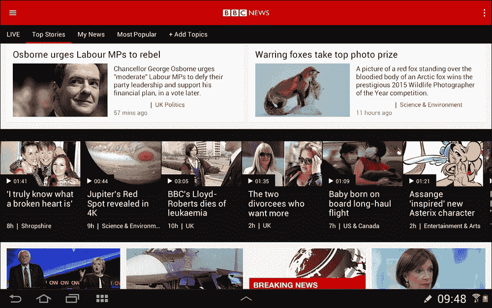
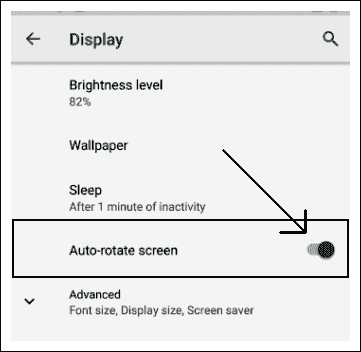
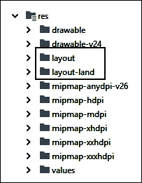
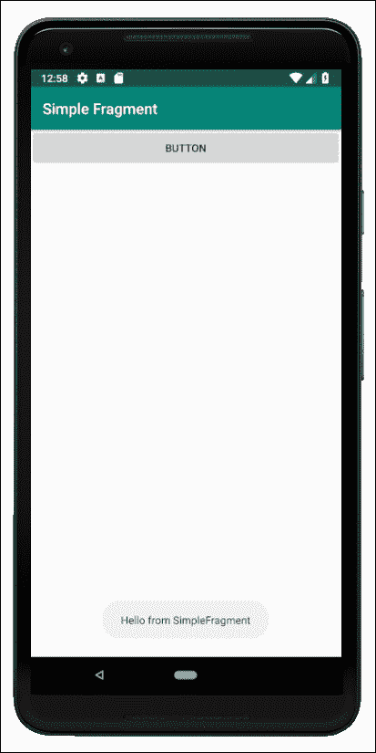

# 二十四、设计模式、多种布局和片段

从一开始，当我们刚刚建立 AndroidStudio 时，我们已经取得了很大的进步。当时，我们一步一步地经历了一切，但随着我们的进行，我们试图向您展示的不仅仅是如何将 *x* 添加到 *y* 或将功能 A 添加到 app B，而是让您能够以自己的方式使用所学知识，从而将自己的想法付诸实践。

到目前为止，这一章比这本书的任何其他章节都更关注你未来的应用。我们将研究 Kotlin 和 Android 的一些特性，您可以将其用作框架或模板来制作更令人兴奋和复杂的应用，同时保持代码的可管理性。此外，鉴于本书的范围有限，我将建议本书几乎没有涉及的进一步研究领域。

在本章中，我们将了解以下内容:

*   模式和模型-视图-控制器
*   安卓设计指南
*   开始使用真实世界的设计并处理多种不同的设备
*   片段介绍

我们开始吧。

# 引入模型-视图-控制器模式

**短语模型、视图**和**控制器**反映了我们的应用的不同部分被分成不同的部分，称为**层**。安卓应用通常使用模型-视图-控制器**模式**。模式只是一种公认的组织代码和其他应用资源的方式，如布局文件、图像和数据库。

模式对我们来说是有用的，因为通过遵循一种模式，我们可以更有信心我们正在做正确的事情，并且不太可能不得不撤销许多艰苦的工作，因为我们已经把自己编码到一个尴尬的境地。

计算机科学中有许多模式，但是仅仅理解 MVC 模式就足以创建一些专业构建的安卓应用。

我们已经部分使用了 MVC，所以让我们依次看看这三层。

## 模型

模型是指驱动我们的应用的数据，以及任何专门管理它并使它对其他层可用的逻辑/代码。例如，在我们的自我注释应用中，`Note`类及其 JSON 代码是数据和逻辑。

## 视图

自我笔记应用的视图是所有不同布局中的所有小部件。用户在屏幕上看到的或与之交互的任何东西通常都是视图的一部分。您可能还记得小部件来自安卓应用编程接口的`View`类层次结构。

## 控制器

控制器是视图和模型之间的位。它与两者相互作用，并使它们保持分离。它包含所谓的**应用逻辑**。如果用户点击一个按钮，应用层决定如何处理。当用户点击**确定**添加新注释时，应用层监听视图层的交互。它捕获视图中包含的数据，并将其传递给模型层。

### 类型

设计模式是一个巨大的话题。有很多不同的设计模式，如果你想对这个话题有一个初学者友好的介绍，我会推荐 *Head First Design Patterns* 。即使这本书的例子是用另一种语言 Java 描述的，它仍然对你非常有用。如果你真的想深入设计模式的世界，那么你可以试试*设计模式:可重用面向对象软件的元素*，这是一种公认的设计模式甲骨文，但更难读懂。

随着这本书的进展，我们也将开始利用更多我们已经讨论过但还没有完全受益的面向对象编程特性。我们会一步一步来。

# 安卓设计指南

应用设计是一个巨大的话题——如此之大，以至于只能在一本专门介绍这个话题的书中开始教授。同样，就像编程一样，你只有通过不断的练习、回顾和改进，才能开始擅长应用设计。

那么，我说的设计到底是什么意思呢？我说的是你把小部件放在屏幕上的什么位置，哪些小部件，它们应该是什么颜色，它们应该有多大，如何在屏幕之间过渡，滚动页面的最佳方式，何时使用哪些动画插值器，你的应用应该分成哪些屏幕，以及除此之外的更多内容。

这本书将有希望让你有足够的资格去实现你对这些问题以及更多问题的所有选择答案。可惜它没有空间，作者大概也没有本事教你*如何做出*那些选择。

### 类型

你可能会想，“我该怎么办？”。继续制作应用，不要让缺乏设计经验和知识阻止你！甚至将你的应用发布到应用商店。然而，请记住，如果你的应用要真正成为世界级的，还有一个完全不同的主题——设计——需要一些关注。

即使是中型开发公司，设计师也很少是程序员，即使是非常小的公司也会经常外包他们应用的设计(或者设计师可能外包编码)。

设计既是一门艺术，也是一门科学，谷歌已经证明，它认识到这一点，为现有的和有抱负的设计师提供高质量的支持。

### 类型

强烈推荐您访问[https://developer.android.com/design/](https://developer.android.com/design/)网页并添加书签。它相当详细和全面，完全以安卓为中心，并以图像、调色板和指南的形式拥有大量数字资源。

将理解设计原则作为短期目标。让提高你的实际设计技能成为一项持续的任务。访问和阅读以设计为中心的网站，尝试并实现你觉得令人兴奋的想法。

然而，最重要的是，不要等到你成为设计专家后才开始制作应用。不断将你的想法付诸实践并发表出来。重点是让每个应用的设计比上一个好一点。

我们将在接下来的章节中看到，并且已经在一定程度上看到，安卓应用编程接口为我们提供了一大堆超级时尚的用户界面，我们可以用很少的代码或设计技巧来利用它们。这些用户界面在让你的应用看起来像是由专业人员设计的方面发挥了很大作用。

# 真实世界的应用

到目前为止，我们已经构建了十几个或更多不同复杂程度的应用。大多数都是在手机上设计和测试的。

当然，在现实世界中，我们的应用需要在任何设备上运行良好，并且必须能够处理在纵向或横向视图中(在所有设备上)发生的事情。

此外，我们的应用仅仅在不同的设备上工作并看起来“正常”往往是不够的。通常，我们的应用需要有不同的行为，并根据设备是手机、平板电脑还是横向/纵向来显示明显不同的用户界面。

### 注

安卓通过穿戴应用编程接口支持大屏幕电视、智能手表、虚拟和增强现实应用，以及物联网“物”。在本书中，我们不会涉及后两个方面，但是在本书的结尾，作者希望如果您愿意，您将做好充分的准备来探索这些主题。

请看下面这张在安卓手机上纵向运行的 BBC 新闻应用截图。看一下基本布局，还要注意新闻的类别( **Top Stories** 、 **World** 、 **UK** )都是可见的，允许用户滚动查看更多类别或者在每个类别内的故事之间左右滑动:


我们将在下一章中看到如何使用`ImagePager`和`FragmentPager`类实现滑动/分页用户界面，但是在我们做到这一点之前，我们需要了解更多的基础知识，我们将在本章中进行探索。就目前而言，上一张截图的目的与其说是向您展示具体的 UI 功能，不如说是允许您将其与下面的截图进行比较。看看平板电脑上横向运行的完全相同的应用:



注意故事(数据层)是相同的，但是布局(视图层)非常不同。用户不仅可以从应用顶部的标签菜单中选择类别，还可以通过**添加主题**选项添加自己的标签。

同样，这张图片的重点不是向你展示特定的用户界面，或者我们如何实现一个类似的用户界面，而是它们是如此的不同，以至于它们很容易被误认为是完全不同的应用。

安卓允许我们设计像这样的真实应用，不仅不同设备类型/方向/大小的布局不同，行为也是如此，也就是应用层。安卓让这成为可能的秘密武器是`Fragment`类。

### 注

**谷歌称:**

*“片段表示活动中的行为或用户界面的一部分。您可以在单个活动中组合多个片段来构建多窗格用户界面，并在多个活动中重用一个片段。*

*您可以将片段看作活动的模块化部分，它有自己的生命周期，接收自己的输入事件，并且您可以在活动运行时添加或删除它(有点像您可以在不同活动中重用的“子活动”)。*

*片段必须始终嵌入到活动中，片段的生命周期直接受到宿主活动生命周期的影响。”*

我们可以在不同的 XML 文件中设计多个不同的布局，并且很快就会这么做。我们还可以在代码中检测设备方向和屏幕分辨率等信息，这样我们就可以动态地做出布局决策。

让我们使用设备检测来尝试一下，然后我们将第一次看到片段。

# 设备检测小应用

了解检测和响应设备及其不同属性(屏幕、方向等)的最佳方式是制作一个简单的应用。让我们通过以下步骤来实现这一点:

1.  创建一个新的**空活动**项目，并将其称为`Device Detection`。将所有其他设置保留为默认值。
2.  打开**设计**选项卡中的`activity_main.xml`文件，删除默认的**你好世界！** `TextView`。
3.  将**按钮**拖到屏幕顶部，并将其 **onClick** 属性设置为`detectDevice`。我们将在一分钟内对这个函数进行编码。
4.  将两个**文本视图**小部件拖到布局上，一个在另一个的下方，并将它们的 **id** 属性分别设置为`txtOrientation`和`txtResolution`。
5.  Check that you have a layout that looks something like the following screenshot:

    ### 类型

    我已经拉伸了我的小部件(主要是水平方向)，并将`textSize`属性增加到`24sp`以使它们在屏幕上更清晰，但这不是应用正常工作所必需的。

    

6.  点击**推断约束**按钮，确保用户界面元素的位置。

现在，我们将做一些新的事情:我们将建立一个专门面向风景的布局。

在 AndroidStudio 中，确保在编辑器中选择`activity_main.xml`文件，定位**方向进行预览**按钮，如下图截图所示:


单击它，然后选择**创建景观变化**。

现在，您有了一个同名的新布局 XML 文件，但方向是横向模式。布局在编辑器中显示为空白，但正如我们将看到的，情况并非如此。查看项目浏览器中的`layout`文件夹，注意确实有两个名为`activity_main`的文件，其中一个(我们刚刚创建的新文件)是用**(土地)**后缀的。这显示在下面的截图中:


选择这个新文件(后缀为 **(land)** 的文件)，现在看组件树。如下图所示:


看起来布局已经包含了我们所有的小部件——我们只是在设计视图中看不到它们。出现这种异常的原因是，当我们创建横向布局时，AndroidStudio 复制了纵向布局，包括所有的约束。纵向限制很少与横向限制相匹配。

要解决这个问题，点击**移除所有约束**按钮；它是**推断约束**按钮左边的按钮。用户界面现在不受约束。这是我的样子:


布局有点乱，但至少我们现在可以看到。重新排列，使它看起来整洁。我是这样重新安排我的:


点击**推断约束**按钮，将布局锁定在新位置。

现在我们有了两个不同方向的基本布局，我们可以将注意力转向我们的 Kotlin 代码。

## 对主要活动类进行编码

我们已经有了调用一个名为`detectDevice`的函数的机制，我们所需要做的就是编写这个演示应用的代码。在`MainActivity`类中的`onCreate` 函数之后，添加处理我们的按钮点击和运行我们的检测代码的函数，如下所示:

```kt
fun detectDevice(v: View) {
   // What is the orientation?
   val display = windowManager.defaultDisplay
   txtOrientation.text = "${display.rotation}"

   // What is the resolution?
   val xy = Point()
   display.getSize(xy)
   txtResolution.text = "x = ${xy.x} y = ${xy.y}"
}
```

### 类型

导入以下三个类:

```kt
import android.graphics.Point
import android.view.Display
import android.view.View
```

这段代码通过声明和初始化一个名为`display`的`Display`类型的对象来工作。这个对象(`display`)现在保存了一大堆关于设备特定显示属性的数据。

存储在`rotation`属性中的值输出到顶部的`TextView`小部件中。

代码然后初始化一个名为`xy`的`Point`类型的对象。然后`getSize`功能将屏幕分辨率加载到`xy`中。然后，结果用于将水平(`xy.x`)和垂直(`xy.y`)分辨率输出到`TextView`中。

每次点击按钮，两个`TextView`小部件都会更新。

### 解锁屏幕方向

在我们运行应用之前，我们希望确保设备没有被锁定在纵向模式(默认情况下，大多数新手机都是)。从模拟器(或您将要使用的设备)的应用抽屉中，点击**设置**应用并选择**显示**，然后使用开关将**自动旋转屏幕**设置为打开。我在下面的截图中展示了这个设置:



## 运行应用

现在，您可以运行应用并点击按钮，如下图所示:


使用模拟器控制面板上的一个旋转按钮将设备旋转到横向，如下图所示:


### 类型

你也可以在电脑上使用 *CTRL* + *F11* ，或者在 macOS 设备上使用*CTRL*+*FN*+*F11*。

现在，再次单击按钮，您将看到横向布局正在运行，如下图所示:


你可能会注意到的第一件事是，当你旋转屏幕时，它会短暂地变成空白。这是重新开始并再次经历`onCreate`的活动。这正是我们所需要的。它在布局的横向版本上调用`setContentView`，并且`MainActivity`中的代码引用了具有相同标识的小部件，因此完全相同的代码起作用。

### 注

就一会儿，考虑一下如果我们需要两个方向之间不同的行为和布局，我们会如何处理事情。不要花太多时间去思考这个问题，因为我们将在本章后面讨论它。

如果`0`和`1`的结果对你来说不太明显，它们指的是`Surface`类的`public const`变量，其中`Surface.ROTATION_0`等于零，`Surface.ROTATION_180`等于一。

### 注

请注意，如果你向左旋转屏幕，那么你的值将是`1`，与我的相同，但是如果你向右旋转，你将会看到值`3`。如果您将设备旋转到纵向模式(上下颠倒)，您将获得值`4`。

我们可以使用一个`when`块，根据这些检测测试的结果执行不同的代码，并加载不同的布局。但是正如我们刚刚看到的，安卓让事情变得更简单，它允许我们用配置限定符给文件夹添加特定的布局，比如**和**。

# 配置限定符

我们已经在[第三章](05.html "Chapter 3. Exploring Android Studio and the Project Structure")、*探索 AndroidStudio 和项目结构*中看到了的配置限定符，比如`layout-large`或`layout-xhdpi`。在这里，我们将刷新和扩展我们对它们的理解。

我们可以通过使用配置限定符来减轻对控制器层影响应用布局的依赖。有大小、方向和像素密度的配置限定符。为了利用配置限定符，我们只需以通常的方式设计一个布局，针对我们的首选配置进行优化，然后将该布局放在一个文件夹中，该文件夹的名称被安卓识别为适用于该特定配置。

例如，在之前的应用中，在`land`文件夹中放置一个布局，告诉安卓在设备处于横向时使用该布局。

很可能前面的陈述看起来有点模棱两可。这是因为 Android Studio 项目浏览器窗口向我们显示的文件和文件夹结构并不完全符合现实——它试图简化事情并“帮助”我们。如果您从项目浏览器窗口顶部的下拉列表中选择**项目文件**选项，然后检查项目的内容，您确实会看到有一个布局和`layout-land`文件夹，如下图所示:



切换回**安卓**布局或者留在**项目文件**视图，随你喜欢。

如果我们想要有不同的横向和纵向布局，我们可以在`res`文件夹中创建一个名为`layout-land`的文件夹(或者使用我们在之前的应用中使用的快捷方式)，并将我们专门设计的布局放在其中。

当设备处于纵向时，将使用来自`layout`文件夹的常规布局，当其处于横向时，将使用来自`layout-land`文件夹的布局。

如果我们为不同尺寸的屏幕进行设计，我们会将布局放入具有以下名称的文件夹中:

*   `layout-small`
*   `layout-normal`
*   `layout-large`
*   `layout-xlarge`

如果我们为不同像素密度的屏幕设计，我们可以将 XML 布局放入具有如下名称的文件夹中:

*   `layout-ldpi`适用于低 DPI 设备
*   `layout-mdpi`适用于中等 DPI 设备
*   `layout-hdpi`适用于高 DPI 设备
*   `layout-xhdpi`用于超高 DPI 设备
*   `layout-xxhdpi`用于超高 DPI 设备
*   `layout-xxxhdpi`用于超超高 DPI 设备
*   `layout-nodpi`对于您尚未满足的 DPI 设备
*   `layout-tvdpi`用于电视

在以下信息框的链接中可以找到到底是低、高还是超高 DPI 等等。这里要说的是在哪里存储布局。

值得一提的是，我们刚刚讨论的内容与关于配置限定符的整个故事相去甚远，并且与设计一样，值得将其放在您的事项列表中进一步研究。

### 注

就像通常的情况一样，安卓开发者网站有很多关于处理不同设备布局的详细信息。更多信息请访问[https://developer . Android . com/guide/practices/screens _ support](https://developer.android.com/guide/practices/screens_support)。

## 配置限定符的限制

之前的应用和我们对配置限定符的讨论向我们展示了在许多情况下非常有用的东西。然而不幸的是，配置限定符和在代码中检测属性只能解决我们的 MVC 模式的视图层中的问题。

正如我们已经讨论过的，我们的应用有时需要有不同的*行为*，以及布局。这可能意味着我们的 Kotlin 代码在控制器层中有多个分支(在我们之前的应用中是`MainActivity`)，并且可能会出现噩梦般的景象，即拥有巨大的`if`或`when`块，每个块都有针对不同场景的特定代码。

幸运的是，事情并非如此。对于这种情况——事实上，对于大多数应用——安卓有**片段**。

# 碎片

碎片将可能成为你制作的几乎每个应用的主要部分。它们非常有用，有很多理由使用它们，而且——一旦你习惯了——它们非常简单，几乎没有理由不使用它们。

片段是应用的可重用元素，就像任何类一样，但是，正如我们前面提到的，它们有特殊的功能——比如加载它们自己的视图/布局的能力，以及它们自己的生命周期功能——这使得它们非常适合实现我们在真实世界应用部分讨论的目标。

让我们深入挖掘片段，一次一个特征。

## 碎片也有生命周期

我们可以通过覆盖适当的生命周期功能来建立和控制片段，就像我们对活动所做的那样。

### 开启创建功能

在`onCreate`函数中，我们可以初始化变量，并做几乎所有我们通常在`Activity onCreate`函数中做的事情。最大的例外是初始化我们的用户界面。

### onCreateView 功能

在`onCreateView`功能中，顾名思义，我们将获得对我们的任何 UI 小部件的引用，设置 lambdas 来监听点击，此外，我们很快就会看到更多。

### onAttach 和 on attach 功能

就在`Fragment`实例进入使用/停止使用之前，调用`onAttach`和`onDetach`功能。

### 启动、暂停和停止功能

在`onStart`、`onPause`和`onStop`功能中，我们可以采取某些动作，例如创建或删除对象或保存数据，就像我们对基于活动的对应对象做一样。

还有其他的片段生命周期函数，但是我们已经知道足够多可以开始使用片段了。如果你想研究片段生命周期的细节，你可以在安卓开发者网站[https://developer.android.com/guide/components/fragments](https://developer.android.com/guide/components/fragments)上进行。

这一切都很好，但是我们首先需要一种方法来创建我们的片段，并配置它们来响应这些功能。

## 使用片段管理器管理片段

`FragmentManager`班是`Activity`班的一部分。我们用它来初始化一个`Fragment`实例，将`Fragment`实例添加到布局中，并结束一个`Fragment`。我们之前在笔记到自我应用中初始化`FragmentDialog`实例时，短暂地看到了`FragmentManager`。

不碰到`Fragment` 类就很难多了解安卓，就像不经常碰到 OOP、类等就很难多了解 Kotlin 一样。

以下代码片段中突出显示的代码提醒我们如何使用`FragmentManager`(它已经是`Activity` 类的一部分)作为参数来创建弹出对话框:

```kt
button.setOnClickListener {
   val myDialog = MyDialog()
   myDialog.show(supportFragmentManager, "123")
   // This calls onCreateDialog
   // Don't worry about the strange looking 123
   // We will find out about this in Chapter 18
}
```

当时，我要求您不要关心函数调用的参数。呼叫的第二个参数是`Fragment`的标识。我们将很快看到如何更广泛地使用`FragmentManager`和`Fragment`标识。

`FragmentManager`正如它的名字所暗示的那样。这里重要的是一个`Activity`只有一个`FragmentManager`，但是它可以处理很多`Fragment`的情况。这正是我们在一个应用中拥有多种行为和布局所需要的。

`FragmentManager`还调用它所负责的片段的各种生命周期函数。这与安卓调用的`Activity`生命周期函数不同，但也是密切相关的，因为`FragmentManager`调用许多`Fragment`生命周期函数*来响应*`Activity`生命周期函数被调用。像往常一样，只要我们在每种情况下做出适当的反应，我们就不需要太担心它何时以及如何做到这一点。

# 我们的第一个片段应用

让我们以最简单的形式构建一个片段，这样我们就可以在开始生产真正有用的东西之前了解发生了什么。

### 类型

我敦促所有读者完成并建立这个项目。从一个文件到另一个文件有很多跳跃，仅仅是阅读指令就可以使它看起来比实际更复杂。当然，您可以复制并粘贴下载包中的代码，但也请按照步骤操作，创建您自己的项目和类。片段并不太难，但它们的实现，就像它们的名字所暗示的那样，有点支离破碎。

使用**空活动**模板创建一个名为`Simple Fragment`的新项目，并将其余设置保留为默认值。

请注意，可以选择创建一个带有片段的项目，但是我们将通过从头开始自己做事情来了解更多。

切换到`activity_main.xml`删除默认**你好世界！** `TextView`。

现在，确保通过在**组件树**窗口中左键单击根`ConstraintLayout`将其选中，然后将其 **id** 属性更改为`fragmentHolder`。我们现在将能够在我们的 Kotlin 代码中获得对这个布局的引用，并且，正如 **id** 属性所暗示的，我们将向它添加一个片段。

现在，我们将创建一个布局来定义片段的外观。右键单击`layout`文件夹，选择**新建|布局资源文件**。在**文件名:**字段中，键入`fragment_layout`并左键单击**确定**。我们刚刚创建了一个新的布局`LinearLayout`类型。

在布局的任意位置添加单个**按钮**小部件，并使其 **id** 属性`button`。

现在我们有了一个简单的布局供我们的片段使用，让我们编写一些 Kotlin 代码来制作实际的片段。

请注意，您可以通过简单地从调色板中拖放一个来创建一个`Fragment`实例，但是以这种方式做事情的灵活性和可控性要低得多，灵活性和可控性是使用片段的最大好处，我们将在本文和接下来的三章中看到这一点。通过创建一个扩展`Fragment`的类，我们可以根据自己的喜好从中制作任意多的片段。

在项目浏览器中，右键单击包含`MainActivity`文件的文件夹。从上下文菜单中，创建一个名为`SimpleFragment`的新 Kotlin 类。

在我们新的`SimpleFragment`类中，将代码更改为从`Fragment`继承。当您键入代码时，系统会要求您选择要导入的特定`Fragment`类，如下图所示:


选择最上面的选项(如前面截图所示)，就是常规的`Fragment`类。

### 注

在这个类中，我们需要以下所有导入语句:

```kt
import android.app.Fragment
import android.os.Bundle
import android.view.LayoutInflater
import android.view.View
import android.view.ViewGroup
import android.widget.Button
import android.widget.Toast
```

这是代码在这个阶段的样子:

```kt
class SimpleFragment: Fragment() {
}
```

现在，添加一个名为`myString`的单个`String`属性并初始化它，如下面的代码所示:

```kt
class SimpleFragment: Fragment() {
    val myString: String = "Hello from SimpleFragment"
}
```

使用`Fragment`时，我们需要在`onCreateView`功能中处理布局。让我们现在忽略它，学习如何设置视图并获取对我们的`Button`的引用。

将以下代码添加到`SimpleFragment`类中:

```kt
override fun onCreateView(
          inflater: LayoutInflater,
          container: ViewGroup?,
          savedInstanceState: Bundle?)
          : View? {

  val view = inflater.inflate(
              R.layout.fragment_layout,
              container,
              false)  

  return view
}
```

要理解前面的代码块，首先要看`onCreateView`签名。注意，在第一种情况下，签名声明它必须返回一个`View` 类型的对象，如下面的代码所示:

```kt
…:View?
```

接下来，我们有三个参数。让我们看看前两个:

```kt
(inflater: LayoutInflater, container: ViewGroup?...
```

我们需要一个`LayoutInflater`，因为我们不能称之为`setContentView`，因为`Fragment`不提供这样的功能。在`onCreateView`的主体中，我们使用`inflater`的`inflate`功能对包含在`fragment_layout.xml`中的布局进行膨胀，并用结果初始化`view`(T8 的一个对象)。

我们也使用传递到`onCreateView`中的`container`作为`inflate`函数中的参数。`container`变量是对`activity_main.xml`布局的引用。

看起来很明显`activity_main.xml`是包含布局，但是，正如我们将在本章后面看到的那样，`ViewGroup container`参数允许*任何* `Activity`和*任何*布局成为我们片段的容器。这非常灵活，并使我们的`Fragment`代码在很大程度上可重用。

我们传递到`inflate`的第三个参数是`false`，这意味着我们不希望我们的布局立即添加到包含布局中。我们将很快从代码的另一部分开始自己做这件事。

`onCreateView`的第三个参数是`Bundle savedInstanceState`，它的存在是为了帮助我们维护我们的片段所保存的数据。

现在我们已经在`view`中包含了一个膨胀的布局，我们可以使用它从布局中获取对我们的`Button`小部件的引用，并监听点击。

最后，我们根据需要使用`view`作为调用代码的返回值。我们可以这样设置:

```kt
return view
```

现在，我们可以以通常的方式添加一个 lambda 来监听按钮上的点击。在`onClick`功能中，我们会显示一条弹出的`Toast`消息，以证明一切都在按预期运行。

在`onCreateView`中的`return`语句前添加该代码，如下代码所示:

```kt
val button = view.findViewById(R.id.button) as Button

button.setOnClickListener(
  {
         Toast.makeText(activity,
               myString, Toast.LENGTH_SHORT).show()
  }
)
```

### 类型

注意`makeText`中`activity`属性的使用，它是对包含`Fragment`的`Activity`的引用。这是显示`Toast`信息所必需的。

我们还不能运行我们的应用；它不会起作用，因为还需要一个步骤。我们需要创建一个`SimpleFragment`的实例，并对其进行适当的初始化。这就是`FragmentManager`被介绍的地方。

下面的代码使用了`Activity`的`supportFragmentManager`属性。它基于我们的`SimpleFragment`类，使用`findFragmentByID` 函数创建一个新的`Fragment`，并传入将保存它的布局的 ID(在`Activity`内)。

在调用`setContentView`后，将此代码添加到`MainActivity.kt`的`onCreate`功能中:

```kt
// Create a new fragment using the manager
var frag = supportFragmentManager
         .findFragmentById(R.id.fragmentHolder)

// Check the fragment has not already been initialized
if (frag == null) {
   // Initialize the fragment based on our SimpleFragment
   frag = SimpleFragment()
         supportFragmentManager.beginTransaction()
               .add(R.id.fragmentHolder, frag)
               .commit()
}
```

现在，运行该应用，惊奇地注视着我们的可点击按钮，该按钮显示一条带有`Toast`类的消息，并且需要两个布局和两个完整的类来创建:



如果你还记得在[第 2 章](04.html "Chapter 2. Kotlin, XML, and the UI Designer")、 *Kotlin、XML 和 UI 设计器*中这样做的话，并且用少得多的代码，那么很明显我们需要一个片段现实检查来回答这个问题，“为什么？”！

# 碎片现实检查

那么这个碎片东西到底为我们做了什么？如果我们没有为这个片段烦恼的话，我们的第一个片段迷你应用会有相同的外观和功能。

事实上，使用片段使整个事情变得更加复杂！我们为什么要这么做？

我们已经知道这个问题的答案了。根据我们到目前为止所看到的情况，还不是特别清楚。我们知道一个或多个片段可以添加到活动的布局中。

我们知道，一个片段不仅包含它自己的布局(视图)，还包含它自己的代码(控制器)，尽管它由一个活动托管，但实际上是独立的。

我们的快速应用只显示了一个片段，但是我们可以有一个包含两个或更多片段的活动。然后，我们有效地在一个屏幕上显示两个几乎独立的控制器。这听起来可能有用。

然而，最有用的是，当活动开始时，我们可以检测我们的应用运行的设备的属性，可能是电话或平板电脑，处于纵向或横向模式。然后，我们可以使用这些信息来决定同时显示我们的一个或两个片段。

这不仅有助于我们实现我们在本章开头的真实世界应用部分中讨论的那种功能，而且还允许我们在两种可能的场景中使用完全相同的片段代码来实现这种功能！

这真的是碎片的本质。我们通过将功能(控制器)和外观(视图)配对成一堆片段来创建一个完整的应用，我们可以以不同的方式重用这些片段，几乎不用担心。

缺少的环节是，如果所有这些片段都是功能齐全的独立控制器，那么我们需要更多地了解如何实现我们的模型层。

当然也有可能预见到几个绊脚石，那么来看看下面这个经常被问到的问题。

# 常见问题

问)如果我们只是有一个`ArrayList`，就像我们在笔记应用中做的那样，它会去哪里？我们如何在片段之间共享它(假设两个/所有片段都需要访问相同的数据)？

a)有一个更优雅的解决方案，我们可以用来创建一个模型层(数据本身和维护数据的代码)。当我们在[第 26 章](28.html "Chapter 26. Advanced UI with Navigation Drawer and Fragment")、*带导航抽屉和碎片的高级 UI*以及[第 27 章](29.html "Chapter 27. Android Databases")、*安卓数据库*中探索`NavigationDrawer`时，我们会看到这一点。

# 总结

现在，我们已经对片段的含义以及如何开始使用它们有了广泛的理解，我们可以开始更深入地了解它们是如何使用的。在下一章中，我们将制作几个以不同方式使用多个片段的应用。