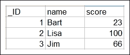
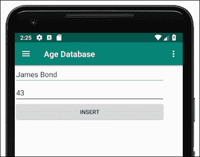
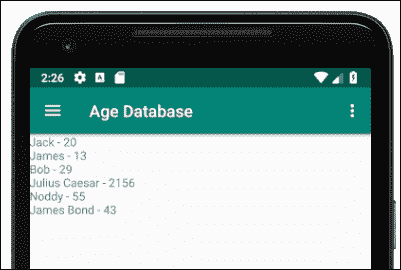

# 第二十七章。安卓数据库

如果我们要让应用程序为用户提供重要功能，那么几乎可以肯定的是，我们需要一种方法来管理、存储和过滤大量数据。

使用 JSON 可以高效地存储非常大量的数据，但是当我们需要选择性地使用这些数据，而不是简单地将自己限制在“保存所有内容”和“加载所有内容”的选项中时，我们需要考虑还有哪些其他选项可用。

一门好的计算机科学课程可能会教授处理数据排序和过滤所需的算法，但所涉及的工作会相当广泛，我们有多大机会提出一个像为我们提供安卓应用编程接口的人一样好的解决方案？

通常，使用安卓应用编程接口中提供的解决方案是有意义的。正如我们已经看到的，`JSON`和`SharedPreferences`类有它们的位置，但是在某些时候，我们需要继续使用真实的数据库来获得真实世界的解决方案。安卓系统使用 SQLite 数据库管理系统，正如你所料，有一个应用编程接口让它尽可能简单。

在本章中，我们将执行以下操作:

*   找出数据库到底是什么
*   了解什么是 SQL 和 SQLite
*   学习 SQL 语言的基础知识
*   来看看安卓 SQLite API
*   对我们在上一章开始的年龄数据库应用进行编码

# 数据库 101

让我们回答一大堆与数据库相关的问题，然后我们就可以开始制作使用 SQLite 的应用程序了。

那么，什么是数据库？

## 什么是数据库？

一个**数据库**既是存储的地方，也是检索、存储和操作数据的手段。在学习如何使用数据库之前，能够将它可视化是有帮助的。数据库内部的实际结构因所讨论的数据库而异。SQLite 实际上将其所有数据存储在一个文件中。

然而，如果我们将数据可视化，就像它在一个电子表格中，或者有时在多个电子表格中一样，这将极大地帮助我们理解。我们的数据库，就像电子表格一样，将被分成代表不同类型数据的多个列和代表数据库条目的行。

想想有名字和考试分数的数据库。看看这些数据的可视化表示，我们可以想象它在数据库中的样子:



然而，请注意，还有一个额外的数据列——一个 **ID** 列。我们将继续讨论这个。这个单一的类似电子表格的结构被称为**表**。如前所述，一个数据库中可能存在多个表，而且经常如此。表中的每一列都有一个名称，可以在对数据库说话时引用。当我们问数据库问题时，我们说我们是在**查询**数据库。

## 什么是 SQL？

**SQL** 代表**结构化查询语言**。这是用来完成数据库工作的语法。

## 什么是 SQLite？

SQLite 是安卓青睐的整个数据库系统的名字，它有自己的 SQL 版本。SQL 的 SQLite 版本需要与其他一些版本略有不同的原因是因为数据库具有不同的功能。

接下来的 SQL 语法入门将重点介绍 SQLite 版本。

# SQL 语法入门

在我们能够学习如何在安卓系统上使用 SQLite 之前，我们需要首先学习如何在平台中立的环境下使用 SQLite 的基本知识。

让我们看一些示例 SQL 代码，它们可以直接在 SQLite 数据库上使用，而不需要任何 Kotlin 或 Android 类，然后我们可以更容易地理解我们的 Kotlin 代码稍后在做什么。

## SQLite 示例代码

SQL 有个关键字，很像 Kotlin，可以导致事情发生。以下是我们即将使用的一些 SQL 关键字的味道:

*   `INSERT`:允许我们向数据库添加数据
*   `DELETE`:允许用户从数据库中删除数据
*   `SELECT`:允许我们从数据库中读取数据
*   `WHERE`:允许我们指定数据库中符合我们想要的特定标准的部分`INSERT`、`DELETE,`或`SELECT`
*   `FROM`:用于指定数据库中的表或列名

### 注

SQLite 关键词比这个多很多，综合列表，看看这个链接:[https://sqlite.org/lang_keywords.html](https://sqlite.org/lang_keywords.html)。

除了到关键词，SQL 还有**类型**。SQL 类型的一些示例如下:

*   **整数**:正是我们存储整数所需要的
*   **文本**:完美的来存储一个简单的名字或地址
*   **实数**:对于大的浮点数

### 注

SQLite 类型比这多得多，综合列表，看一下这个链接:[https://www.sqlite.org/datatype3.html](https://www.sqlite.org/datatype3.html)。

让我们看看如何使用完整的 SQLite 语句，将这些类型与关键字结合起来创建表，并添加、删除、修改和读取数据。

### 创建表格

问我们为什么不首先创建一个新的数据库将是一个非常体面的问题。原因是默认情况下，每个应用程序都可以访问 SQLite 数据库。该数据库是该应用程序的私有数据库。下面是我们用来在数据库中创建一个表的语句。我强调了几个部分，以使陈述更清楚:

```kt
create table StudentsAndGrades 
   _ID integer primary key autoincrement not null,
   name text not null,
 score int;
```

前面的代码创建了一个名为`StudentsAndGrades`的表，表中有一个**整数**行 **id** ，每次添加一行数据时，该表都会自动增加(递增)。

该表还将有一个属于`text`类型的`name`列，并且不能为空(`not null`)。

它还将有一个属于`int` 类型的`score`列。此外，请注意，该语句由分号完成。

### 将数据插入数据库

下面是我们如何向数据库中插入一行新数据:

```kt
INSERT INTO StudentsAndGrades
   (name, score)
   VALUES
   ("Bart", 23);
```

前面的代码向数据库中添加了一行。在前面的语句之后，数据库将有一个条目，其值(1，“Bart”，23)用于列(_ID、名称和分数)。

下面是我们如何向数据库中插入另一个新的数据行:

```kt
INSERT INTO StudentsAndGrades
   (name, score)
   VALUES
   ("Lisa", 100);
```

前面的代码为列(_ID、名称和分数)添加了一个新的数据行，值为(2，“Lisa”，100)。

我们类似电子表格的结构现在看起来如下图所示:


### 从数据库中检索数据

下面是我们如何访问数据库中的所有行和列:

```kt
SELECT * FROM StudentsAndGrades;

```

前面的代码要求每行每列。`*`符号可以读作**全**。

我们还可以更有选择性一些，如下面的代码所示:

```kt
SELECT score FROM StudentsAndGrades
 where name = "Lisa";

```

之前的代码只会返回`100`，当然，这是与丽莎这个名字相关的分数。

### 更新数据库结构

我们甚至可以在创建表和添加数据后添加新列。就 SQL 而言，这很简单，但是对于已经发布的应用程序上的用户数据，这可能会导致一些问题。下一条语句添加了一个名为`age`的新列，它属于`int`类型:

```kt
ALTER TABLE StudentsAndGrades
            ADD 
     age int;
```

数据类型、关键字和使用它们的方法比我们目前看到的要多得多。接下来，让我们看看 Android SQLite API，我们将开始了解如何使用我们的新 SQLite 技能。

# 安卓 SQLite API

安卓应用编程接口有许多不同的方式可以让我们很容易地使用应用程序的数据库。我们需要熟悉的第一堂课是`SQLiteOpenHelper`。

## SQLiteOpenHelper 和 SQLiteDatabase

`SQLiteDatabase`类是表示实际数据库的类。然而`SQLiteOpenHelper`班是大部分活动发生的地方。这个类将使我们能够访问数据库并初始化`SQLiteDatabase`的一个实例。

此外，我们将从我们的*年龄数据库*应用程序中继承的`SQLiteOpenHelper`类有两个要覆盖的功能。首先，它有一个`onCreate`函数，在第一次使用数据库时被称为，因此有意义的是，我们将在其中合并我们的 SQL 来创建我们的表结构。

我们必须覆盖的另一个函数是`onUpgrade`，你可能猜到了，它是在我们升级数据库时调用的(`ALTER`它的结构)。

## 构建和执行查询

随着我们的数据库结构变得更加复杂，随着我们的 SQL 知识的增长，我们的 SQL 语句将变得相当长和笨拙。语法错误或错别字的可能性很大。

我们帮助克服这种复杂性问题的方法是将我们的查询从部分构建成一个。然后，我们可以将`String`传递给将为我们执行查询的函数(我们很快就会看到这一点)。

此外，我们将使用`String`实例来表示表和列名等东西，所以我们不能和它们混为一谈。

例如，我们可以在一个`companion`对象中声明下面的`String`实例，它将代表前面虚构例子中的表名和列名。请注意，我们还将为数据库本身命名，并为此命名一个`String`:

```kt
companion object {
   /*
   Next, we have a const string for
   each row/table that we need to refer to both
   inside and outside this class
   */

   const val DB_NAME = "MyCollegeDB";
   const val TABLE_S_AND_G = "StudentsAndGrades";

   const val TABLE_ROW_ID = "_id";
   const val TABLE_ROW_NAME = "name";
   const val TABLE_ROW_SCORE = "score";

}
```

然后，我们可以在下一个示例中构建这样的查询。以下示例向我们假设的数据库中添加了一个新条目，并将 Kotlin 变量合并到 SQL 语句中:

```kt
val name = "Smit";
val score = 95;

// Add all the details to the table
val query = "INSERT INTO " + TABLE_S_AND_G + " (" +
         TABLE_ROW_NAME + ", " +
         TABLE_ROW_SCORE +
         ") " +
         "VALUES (" +
         "'" + name + "'" + ", " +
         score +
         ");"
```

注意在前面的代码中，常规的 Kotlin 变量`name`和`score`被高亮显示。以前的`String`叫做`query`现在是 SQL 语句，完全相当于这个:

```kt
INSERT INTO StudentsAndGrades (
   name, score)
   VALUES ('Smit',95);
```

### 类型

为了继续学习安卓编程，完全掌握前面两个代码块并不是必要的。但是，如果你想构建自己的应用程序并构造出完全符合你需要的 SQL 语句，它*将会帮助你做到这一点。为什么不研究前面的两个代码块，以便辨别由单引号对`'`连接在一起的`String`部分之间的差异，这是 SQL 语法的一部分？*

在输入查询的整个过程中，安卓工作室会提示我们变量的名称，这使得出错的可能性大大降低，尽管这比简单地输入查询要冗长得多。

现在，我们可以使用前面介绍的类来执行查询:

```kt
// This is the actual database
private val db: SQLiteDatabase

// Create an instance of our internal CustomSQLiteOpenHelper class
val helper = CustomSQLiteOpenHelper(context)

// Get a writable database
db = helper.writableDatabase

// Run the query
db.execSQL(query)
```

当向数据库中添加数据时，我们将使用`execSQL`，就像前面的代码一样，当从数据库中获取数据时，我们将使用`rawQuery`函数，演示如下:

```kt
Cursor c = db.rawQuery(query, null)
```

注意`rawQuery`函数返回一个`Cursor`类型的对象。

### 类型

我们可以通过几种不同的方式与 SQLite 进行交互，它们各有优缺点。我们选择使用原始的 SQL 语句，因为它对我们正在做的事情是完全透明的，同时增强了我们对 SQL 语言的知识。

## 数据库游标

除了允许我们访问数据库的类和允许我们执行查询的函数之外，还有一个问题就是我们从查询中得到的结果是如何格式化的。

幸好有`Cursor`班。我们所有的数据库查询都将返回`Cursor` 类型的对象。我们可以使用`Cursor`类的函数有选择地访问查询返回的数据，如下面的代码所示:

```kt
Log.i(c.getString(1), c.getString(2))
```

前面的代码将向 logcat 窗口输出存储在查询返回的结果的前两列中的两个值。正是`Cursor`对象本身决定了我们当前正在读取返回数据的哪一行。

我们可以访问`Cursor`对象的各种功能，包括`moveToNext`功能，不出所料，它会将`Cursor`移动到下一行进行读取:

```kt
c.moveToNext()

/*
   This same code now outputs the data in the
   first and second column of the returned 
   data but from the SECOND row.
*/

Log.i(c.getString(1), c.getString(2))
```

在某些情况下，我们可以将`Cursor`绑定到用户界面的一部分(如`RecyclerView`，就像我们在*自我注释*应用程序中对`ArrayList`所做的那样，只需将一切留给安卓应用编程接口。

`Cursor`类中还有很多更有用的函数，其中一些我们很快就会看到。

### 类型

对安卓 SQLite 应用编程接口的介绍实际上只是触及了它功能的表面。随着我们的深入，我们将会遇到更多的函数和类。然而，如果你的应用想法需要复杂的数据管理，那就值得进一步研究。

现在，我们可以看到所有这些理论是如何结合在一起的，以及我们将如何在 Age Database 应用程序中构造我们的数据库代码。

# 对数据库类进行编码

在这里，我们将将我们到目前为止所学的一切付诸实践，并完成 Age 数据库应用程序的编码。在我们前面部分的`Fragment`类可以与共享数据库交互之前，我们需要一个类来处理与数据库的交互和数据库的创建。

我们将通过实现`SQLiteOpenHelper`来创建一个管理数据库的类。它还将在一个`companion object`中定义一些`String`变量来表示表及其列的名称。此外，它将提供一堆帮助函数，我们可以调用这些函数来执行所有必要的查询。必要时，这些助手函数将返回一个`Cursor`对象，我们可以用它来显示我们检索到的数据。如果我们的应用需要发展，那么添加新的助手功能将是微不足道的:

创建一个名为`DataManager`的新类，并添加伴随对象、构造函数和`init`块:

### 类型

我们在[第 25 章](27.html "Chapter 25. Advanced UI with Paging and Swiping")*中讨论了`companion object`带分页和滑动的高级 UI*

```kt
class DataManager(context: Context) {

    // This is the actual database
    private val db: SQLiteDatabase

    init {
        // Create an instance of our internal
        // CustomSQLiteOpenHelper class
        val helper = CustomSQLiteOpenHelper(context)
        // Get a writable database
        db = helper.writableDatabase
    }

    companion object {
        /*
        Next, we have a const string for
        each row/table that we need to refer to both
        inside and outside this class
        */

        const val TABLE_ROW_ID = "_id"
        const val TABLE_ROW_NAME = "name"
        const val TABLE_ROW_AGE = "age"

        /*
        Next, we have a private const strings for
        each row/table that we need to refer to just
        inside this class
        */

        private const val DB_NAME = "address_book_db"
        private const val DB_VERSION = 1
        private const val TABLE_N_AND_A = "names_and_addresses"
    }
}
```

### 注

我命名了数据库和表格，因为它可以发展成为一个地址簿应用程序，也可以记录年龄，也许还有生日。

前面的代码为我们构建查询提供了所有便利的`String`实例，它还声明并初始化了我们的数据库和助手类。

现在，我们可以添加我们将从`Fragment`类访问的助手函数；首先是`insert`函数，它基于传递给函数的`name`和`age`参数执行`INSERT` SQL 查询。

将`insert`功能添加到`DataManager`类:

```kt
// Insert a record
fun insert(name: String, age: String) {
  // Add all the details to the table
  val query = "INSERT INTO " + TABLE_N_AND_A + " (" +
               TABLE_ROW_NAME + ", " +
               TABLE_ROW_AGE +
               ") " +
               "VALUES (" +
               "'" + name + "'" + ", " +
               "'" + age + "'" +
               ");"

  Log.i("insert() = ", query)

  db.execSQL(query)
}
```

下一个名为`delete`的函数将从数据库中删除一条记录，如果该记录在`name`列中具有与传入的`name`参数相匹配的值。它使用 SQL `DELETE`关键字来实现这一点。

将`delete`功能添加到`DataManager`类:

```kt
// Delete a record
fun delete(name: String) {

   // Delete the details from the table
   // if already exists
   val query = "DELETE FROM " + TABLE_N_AND_A +
               " WHERE " + TABLE_ROW_NAME +
               " = '" + name + "';"

   Log.i("delete() = ", query)

   db.execSQL(query)

}
```

接下来，我们有`selectAll`功能，顾名思义也是这样做的。它通过使用`*`参数的`SELECT`查询来实现，这相当于单独指定所有列。另外，注意这个函数返回一个`Cursor`，我们将在一些`Fragment`类中使用它。

将`selectAll`功能添加到`DataManager`类，如下所示:

```kt
// Get all the records
fun selectAll(): Cursor {
   return db.rawQuery("SELECT *" + " from " +
               TABLE_N_AND_A, null)
}
```

现在，我们添加一个`searchName`函数，它有一个`String`参数用于用户想要搜索的名称。它还返回一个`Cursor`对象，该对象将包含找到的所有条目。请注意，SQL 语句使用`SELECT`、`FROM`和`WHERE`来实现这一点:

```kt
// Find a specific record
fun searchName(name: String): Cursor {
    val query = "SELECT " +
                 TABLE_ROW_ID + ", " +
                 TABLE_ROW_NAME +
                 ", " + TABLE_ROW_AGE +
                 " from " +
                 TABLE_N_AND_A + " WHERE " +
                 TABLE_ROW_NAME + " = '" + name + "';"

   Log.i("searchName() = ", query)

   return db.rawQuery(query, null)
}
```

最后，对于`DataManager`类，我们创建一个`inner`类，它将是我们的`SQLiteOpenHelper`的实现。这是一个简单的实现。

我们有一个构造函数接收一个对象、数据库名和数据库版本。

我们还覆盖了`onCreate`函数，该函数包含创建带有`_ID`、`name`和`age`列的数据库表的 SQL 语句。

这个应用的`onUpgrade`功能故意留空，但是仍然需要存在，因为当我们从`SQLiteOpenHelper`继承时，它是契约的一部分。

将内部`CustomSQLiteOpenHelper`类添加到`DataManager`类中:

```kt
// This class is created when 
// our DataManager class is instantiated
private inner class CustomSQLiteOpenHelper(
         context: Context)
     : SQLiteOpenHelper(
           context, DB_NAME,
           null, DB_VERSION) {

  // This function only runs the first
  // time the database is created
  override fun onCreate(db: SQLiteDatabase) {

        // Create a table for photos and all their details
        val newTableQueryString = ("create table "
              + TABLE_N_AND_A + " ("
              + TABLE_ROW_ID
              + " integer primary key autoincrement not null,"
              + TABLE_ROW_NAME
              + " text not null,"
              + TABLE_ROW_AGE
              + " text not null);")

        db.execSQL(newTableQueryString)
  }

  // This function only runs when we increment DB_VERSION
  override fun onUpgrade(db: SQLiteDatabase,
                     oldVersion: Int,
                     newVersion: Int) {

  }

}
```

现在，我们可以给我们的`Fragment`类添加代码来使用我们新的`DataManager`类。

# 编码片段类以使用数据管理器类

将这个高亮显示的代码添加到`InsertFragment`类来更新`onCreateView`功能，如下所示:

```kt
val view = inflater.inflate(
         R.layout.content_insert,
         container,
         false)

// Database and UI code goes here in next chapter
val dm = DataManager(activity!!)

val btnInsert = view.findViewById(R.id.btnInsert) as Button
val editName = view.findViewById(R.id.editName) as EditText
val editAge = view.findViewById(R.id.editAge) as EditText

btnInsert.setOnClickListener(
            {
 dm.insert(editName.text.toString(),
 editAge.text.toString())
            }
)

return view
```

在代码中，我们获得了一个`DataManager`类的实例和对每个用户界面小部件的引用。然后，在按钮的`onClick`功能中，我们使用`insert`功能向数据库添加新的姓名和年龄。要插入的值取自两个`EditText`小部件。

将此高亮显示的代码添加到`DeleteFragment`类以更新`onCreateView`功能:

```kt
val view = inflater.inflate(
         R.layout.content_delete,
         container,
         false)

// Database and UI code goes here in next chapter
val dm = DataManager(activity!!)

val btnDelete = 
 view.findViewById(R.id.btnDelete) as Button
val editDelete = 
 view.findViewById(R.id.editDelete) as EditText

btnDelete.setOnClickListener(
 {
 dm.delete(editDelete.text.toString())
 }
)

return view
```

在`DeleteFragment`类中，我们创建一个`DataManager`类的实例，然后从布局中获取对`EditText`和`Button`的引用。当点击按钮时，调用`delete`功能，从`EditText`传入任何文本的值。删除功能在我们的数据库中搜索匹配项，如果找到匹配项，就会将其删除。

将此高亮代码添加到`SearchFragment`类，以更新`onCreateView`功能:

```kt
val view = inflater.inflate(R.layout.content_search,
         container,
         false)

// Database and UI code goes here in next chapter
val btnSearch = view.findViewById(R.id.btnSearch) as Button
val editSearch = view.findViewById(R.id.editSearch) as EditText
val textResult = view.findViewById(R.id.textResult) as TextView

// This is our DataManager instance
val dm = DataManager(activity!!)

btnSearch.setOnClickListener(
 {
 val c = dm.searchName(editSearch.text.toString())

 // Make sure a result was found 
 // before using the Cursor
 if (c.count > 0) {
 c.moveToNext()
 textResult.text =
 "Result = ${c.getString(1)} - ${c.getString(2)}"
 }
 }
)

return view
```

正如我们对所有不同的`Fragment`类所做的那样，我们创建一个`DataManager`的实例，并获取对布局中所有不同用户界面小部件的引用。在按钮的`onClick`功能中，使用`searchName`功能，从`EditText`传入值。如果数据库在`Cursor`中返回结果，则`TextView`使用其`text`属性输出结果。

将此高亮代码添加到`ResultsFragment`类，以更新`onCreateView` 功能:

```kt
val view = inflater.inflate(R.layout.content_results,
         container,
         false)

// Database and UI code goes here in next chapter
// Create an instance of our DataManager
val dm = DataManager(activity!!)

// Get a reference to the TextView 
// to show the results in
val textResults = 
 view.findViewById(R.id.textResults) as TextView

// Create and initialize a Cursor 
// with all the results in
val c = dm.selectAll()

// A String to hold all the text
var list = ""

// Loop through the results in the Cursor
while (c.moveToNext()) {
 // Add the results to the String
 // with a little formatting
 list += c.getString(1) + " - " + c.getString(2) + "\n"
}

// Display the String in the TextView
textResults.text = list

return view
```

在这个类中，`Cursor`对象在任何交互发生之前使用`selectAll`功能加载数据。然后通过连接结果将`Cursor`的内容输出到`TextView`中。串联中的`\n`在`Cursor`的每个结果之间创建了一条新的线。

# 运行年龄数据库应用程序

让我们运行通过我们的应用程序的一些功能，以确保它按预期工作。首先，我使用**插入**菜单选项给数据库添加了一个新名称:



然后，我通过查看**结果**选项确认它在那里:



然后，我使用**删除**菜单选项，并再次查看**结果**选项，以检查我选择的名称是否已被删除:


接下来，我搜索了一个我知道存在的名字来测试**搜索**功能:


让我们回顾一下本章所做的工作。

# 总结

这一章我们已经讲了很多。我们已经了解了数据库，特别是安卓应用程序的数据库 SQLite。我们已经练习了使用 SQL 语言与数据库进行通信和查询的基础知识。

我们已经看到了安卓应用编程接口如何帮助我们使用 SQLite 数据库，并且已经用数据库实现了我们的第一个工作应用。

差不多就是这样，但请看看下面简短的最后一章。