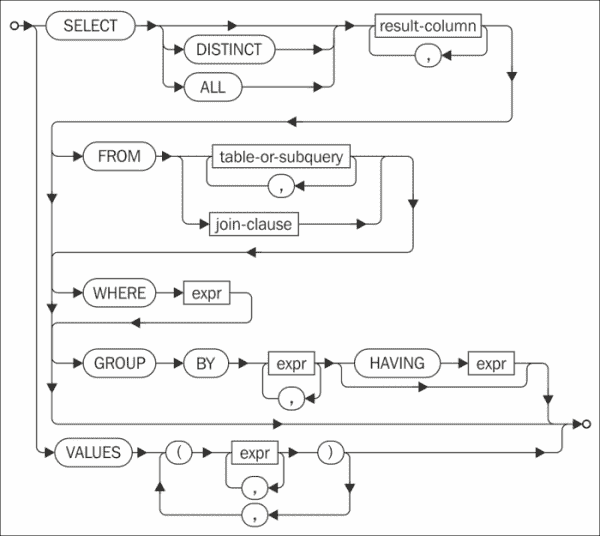
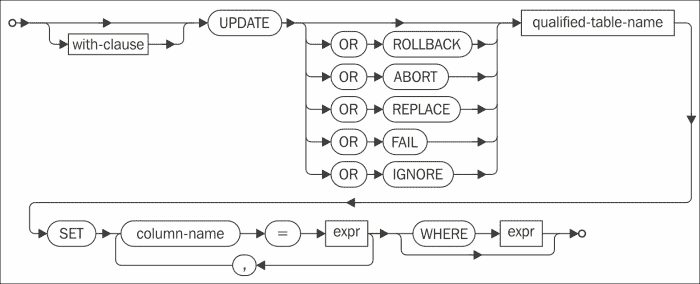

# 二、把点连接起来

|   | *“不多学一种方法，什么都不懂。”* |   |
|   | -*-马文·明斯基* |

在上一章中，我们学习了两个重要的安卓类及其相应的方法，以便使用 SQLite 数据库:

*   `SQLiteOpenHelper`类
*   `SQLiteDatabase`类

我们还看到了解释其实现的代码片段。现在，我们准备在安卓应用中使用所有这些概念。我们将利用我们在上一章中学到的知识来制作一个功能性的应用。我们将进一步研究从数据库中插入、查询和删除数据的 SQL 语句。

在本章中，我们将在安卓模拟器上构建和运行一个安卓应用。我们也将建立我们自己的完整的`contacts`数据库。我们将在本章中遇到安卓用户界面组件，如`Buttons`和`ListView`。如果需要重访安卓系统的用户界面组件，请访问链接。

在我们开始之前，本章中的代码旨在解释与安卓系统中的 SQLite 数据库相关的概念，还没有准备好生产；在很多地方，您会发现缺少适当的异常处理，或者缺少适当的 null 检查和类似的实践来减少代码的冗长。您可以从 Packt 的网站下载当前章节和后续章节的完整代码。为了获得最佳效果，我们建议下载代码，并在下一章中引用它。

在本章中，我们将介绍:

*   积木
*   数据库处理程序和查询
*   连接用户界面和数据库

# 积木

众所周知，安卓可以在各种不同硬件和软件规格的设备上运行。在撰写本书时，已经跨越了 10 亿个激活标记。运行安卓系统的设备数量惊人，为用户提供了不同外形和不同硬件基础的丰富选择。当在不同的设备上测试应用时，这就增加了一个障碍，因为人类不可能完全掌握它们，更不要忘记需要投入的时间和资金。中的仿真器本身就是一个很棒的工具；它让我们能够灵活地模仿不同的硬件功能，如 CPU 架构、RAM 和摄像头，以及从早期的纸杯蛋糕到 KitKat 等不同的软件版本，从而规避这个问题。我们也将尝试在我们的项目中利用这一点，并尝试在模拟器上运行我们的应用。使用模拟器的另一个好处是，我们将运行一个根设备，允许我们执行一些动作。我们将无法在普通设备上实现这些操作。

让我们从在 Eclipse 中设置模拟器开始:

1.  Go to **Android Virtual Device Manager** from the **Window** menu to start the emulator.

    我们可以设置不同的硬件属性，如中央处理器类型、前/后摄像头、内存(最好小于 768 兆字节)、内部和外部存储大小。

2.  While launching the app, enable **Save to snapshot**; this will reduce the launch time the next time we are launching an emulator instance from the snapshot:

    

    ### 注

    想要尝试更快模拟器的感兴趣的读者可以在 http://www.genymotion.co T2 尝试一下。

    让我们现在开始构建我们的安卓应用。

3.  我们将通过创建一个新项目`PersonalContactManager`开始。前往**档案** | **新建** | **项目**。现在，导航到**安卓**，然后选择**安卓应用项目**。这一步将为我们提供一个活动文件和一个相应的 XML 文件。

我们将回到这些组件后，我们有所有我们需要的区块到位。对于我们的应用，我们将创建一个名为`contact`的数据库，它将包含一个表`ContactsTable`。在前一章中，我们讨论了如何使用 SQL 语句创建数据库；让我们为我们的项目构建一个数据库模式。这是基于我们应用需求的非常重要的一步；例如，在我们的案例中，我们正在构建一个个人联系人管理器，并且需要姓名、号码、电子邮件和显示图片等字段。

`ContactsTable`的数据库模式概述如下:

<colgroup><col style="text-align: left"> <col style="text-align: left"></colgroup> 
| 

圆柱

 | 

数据类型

 |
| --- | --- |
| `Contact_ID` | 整数/主键/自动增量 |
| `Name` | 文本 |
| `Number` | 文本 |
| `Email` | 文本 |
| `Photo` | 一滴 |

### 注

一个安卓应用可以有多个数据库，每个数据库可以有多个表。每个表都以 2D(行和列)格式存储数据。

第一列是`Contact_ID`。其数据类型为整数，其 **列约束**为主键。此外，该列是自动递增的，这意味着当数据插入到每一行时，该列将递增 1。

主键唯一标识每行，不能为空。数据库中的每个表最多只能有一个主键。一个表的主键可以充当另一个表的外键。外键充当两个相关表之间的连接；例如，我们当前的`ContactsTable`模式是:

```java
ContactsTable (Contact_ID,Name, Number, Email, Photo)
```

假设我们有另一个表`ColleagueTable`，其模式如下:

```java
ColleagueTable (Colleague_ID, Contact_ID, Position, Fax)
```

这里`ContactTable`的主键，也就是`Contact_ID`可以称为`ColleagueTable`的外键。它用于链接关系数据库中的两个表，因此允许我们在`ColleagueTable`上执行操作。我们将在后面的章节和例子中详细探讨这个概念。

### 注

**列约束**

约束是对表中的数据列强制执行的规则。这确保了数据库中数据的准确性和可靠性。

与大多数 SQL 数据库不同，SQLite 并不基于列的声明类型来限制可以插入到列中的数据类型。取而代之的是，SQLite 使用 **动态打字**。列的声明类型仅用于确定该列的**亲缘关系**。当一种类型的变量存储在另一种类型的变量中时，也会(自动)进行类型转换。

约束可以是列级或表级的。列级约束仅应用于一列，而表级约束应用于整个表。

以下是 SQLite 中常用的约束和关键字:

*   `NOT NULL`约束:这确保了一列没有`NULL`值。
*   `DEFAULT`约束:当未指定时，这将为列提供默认的值。
*   `UNIQUE`约束:这确保了列中的所有值都是不同的。
*   `PRIMARY`键:这唯一地识别数据库表中的所有行/记录。
*   `CHECK`约束:`CHECK`约束确保一列中的所有值满足特定条件。
*   `AUTO INCREMENT`关键字:`AUTOINCREMENT`是用于自动递增表中字段值的关键字。我们可以在创建具有特定列名的表时使用`AUTOINCREMENT`关键字自动递增字段值。关键字`AUTOINCREMENT`只能用于`INTEGER`字段。

下一步是准备我们的数据模型；我们将使用我们的模式来构建数据模型类。`ContactModel`类将有`Contact_ID`、`Name`、`Number`、`Email`和`Photo`作为字段，分别表示为`id`、`name`、`contactNo`、`email`和`byteArray`。该类将包含一个 getter/setter 方法，用于根据需要设置和获取属性值。数据模型的使用将有助于用于显示/处理数据的活动和我们的数据库处理程序之间的通信，我们将在本章后面定义数据库处理程序。我们将在其中创建一个新的包和一个名为`ContactModel`类的新类。请注意，创建新包不是必要步骤；它被用来以一种合乎逻辑且容易理解的方式组织我们的课程。这个类可以描述如下:

```java
public class ContactModel {
  private int id;
  private String name, contactNo, email;
  private byte[] byteArray;

  public byte[] getPhoto() {
    return byteArray;
  }
  public void setPhoto(byte[] array) {
    byteArray = array;
  }
  public int getId() {
    return id;
  }
  public void setId(int id) {
    this.id = id;
  }
  ……………
}
```

### 类型

Eclipse 提供了很多有用的快捷方式，但不是为了生成 getter 和 setter 方法。我们可以根据自己的喜好将生成 getter 和 setter 方法绑定到任何键绑定。在 Eclipse 中，转到**窗口** | **偏好设置** | **通用** | **键**，搜索 getter，并添加您的绑定。我们用的是*Alt*+*Shift*+*G*；您可以自由设置任何其他组合键。

# 数据库处理程序和查询

我们将构建我们的支持类，它将包含根据我们的数据库需求读取、更新和删除数据的方法。这个类将使我们能够创建和更新数据库，并将作为我们的数据管理中心。我们将使用这个类来运行 SQLite 查询，并将数据发送到 UI；在我们的例子中，显示结果的列表视图:

```java
public class DatabaseManager {

  private SQLiteDatabase db; 
  private static final String DB_NAME = "contact";

  private static final int DB_VERSION = 1;
  private static final String TABLE_NAME = "contact_table";
  private static final String TABLE_ROW_ID = "_id";
  private static final String TABLE_ROW_NAME = "contact_name";
  private static final String TABLE_ROW_PHONENUM = "contact_number";
  private static final String TABLE_ROW_EMAIL = "contact_email";
  private static final String TABLE_ROW_PHOTOID = "photo_id";
  .........
}
```

我们将创建一个`SQLiteDatabase`类的对象，稍后我们将用`getWritableDatabase()`或`getReadableDatabase()`初始化它。我们将定义我们将在类中使用的常数。

### 注

按照惯例，常数是用大写字母定义的，但是在定义常数时使用`static final`比惯例多一点。要了解更多，请参考[http://goo.gl/t0PoQj](http://goo.gl/t0PoQj)。

我们将数据库的名称定义为`contact`，版本定义为 1。如果我们回顾前一章，我们会回想起这个价值的重要性。快速回顾一下，我们可以将数据库从当前版本升级到新版本。通过这个例子，用例将变得清晰。假设将来有一个新的要求，那就是我们需要在联系方式上增加一个传真号码。我们将修改我们当前的模式，以纳入这一变化，我们的联系人数据库也将相应地发生变化。如果我们在新设备上安装应用，就不会有问题；但是在我们已经有应用运行实例的设备的情况下，我们将面临问题。在这种情况下，`DB_VERSION`会派上用场，帮助我们用当前版本替换数据库的旧版本。另一种方法是卸载应用并重新安装，但这是不鼓励的。

现在将定义表名和表列等重要字段。`TABLE_ROW_ID`是一个非常重要的栏目。这将作为表的主键；它也会自动递增，不能为空。`NOT NULL`也是列约束，只能附加到列定义，不能指定为表约束。不足为奇的是，`NOT NULL`约束规定关联列可能不包含`NULL`值。当插入新行或更新现有行时，试图将列值设置为`NULL`会导致约束冲突。这将用于在表格中查找特定值。标识的唯一性保证了我们不会与表中的数据有任何冲突，因为每行都由键唯一标识。表中其余的列都很容易解释。`DatabaseManager`类的构造函数如下:

```java
public DatabaseManager(Context context) {
   this.context = context;
   CustomSQLiteOpenHelper helper = new CustomSQLiteOpenHelper(context);
   this.db = helper.getWritableDatabase();
  }
```

请注意，我们正在使用一个名为`CustomSQLiteOpenHelper`的类。我们稍后再谈这个。我们将使用类对象来获取我们的`SQLitedatabase`实例。

## 构建创建查询

为了创建一个包含所需列的表，我们将构建一个查询语句并执行它。该语句将包含表名、不同的表列和各自的数据类型。我们现在将研究创建新数据库的方法，以及根据应用的需要升级现有数据库的方法:

```java
private class CustomSQLiteOpenHelper extends SQLiteOpenHelper {
  public CustomSQLiteOpenHelper(Context context) {
    super(context, DB_NAME, null, DB_VERSION);
  }
  @Override
  public void onCreate(SQLiteDatabase db) {
String newTableQueryString = "create table "
+ TABLE_NAME + " ("
+ TABLE_ROW_ID 
+ " integer primary key autoincrement not null,"
+ TABLE_ROW_NAME
+ " text not null," 
+ TABLE_ROW_PHONENUM 
+ " text not null,"
+ TABLE_ROW_EMAIL
+ " text not null,"
+ TABLE_ROW_PHOTOID 
+ " BLOB" + ");";
    db.execSQL(newTableQueryString);
  }

  @Override
  public void onUpgrade(SQLiteDatabase db, int oldVersion, 
int newVersion) {

    String DROP_TABLE = "DROP TABLE IF EXISTS " + 
TABLE_NAME;
    db.execSQL(DROP_TABLE);
    onCreate(db);
  }
}
```

`CustomSQLiteOpenHelper`扩展`SQLiteOpenHelper`，为我们提供关键方法`onCreate()`和`onUpgrade()`。我们已经将这个类定义为我们`DatabaseManager`类的内部类。这个使我们能够从一个地方管理所有数据库相关的功能，即 CRUD(创建、读取、更新和删除)。

在我们的`CustomSQLiteOpenHelper`构造函数中，负责创建我们类的一个实例，我们将传递一个上下文，该上下文又将传递给具有以下参数的超级构造函数:

*   `Context context`:这是我们传递给构造函数的上下文
*   `String name`:这是我们数据库的名字
*   `CursorFactory factory`:这是光标工厂对象，可以传递为`null`
*   `int version`:这是数据库的数据库版本

接下来重要的方法是 `onCreate()`。我们将构建我们的 SQLite 查询字符串，它将创建我们的数据库表:

```java
"create table " + TABLE_NAME + " ("
+ TABLE_ROW_ID
+ " integer primary key autoincrement not null,"
….....
+ TABLE_ROW_PHOTOID + " BLOB" + ");";
```

前面的语句基于以下语法图:


这里，关键字`create table`用于创建表格。接下来是表名、列声明及其数据类型。在准备好我们的 SQL 语句之后，我们将使用 SQLite 数据库的`execSQL()`方法来执行它。如果我们之前构建的查询语句有问题，我们将会遇到异常，`android.database.sqlite.SQLiteException`。默认情况下，数据库在分配给应用的内部内存空间中形成。文件夹可以在`/data/data/<yourpackage>/databases/`找到。

我们可以很容易地验证我们的数据库是否是在模拟器或根手机上运行这段代码时形成的。在 Eclipse 中，转到 DDMS 透视图，然后转到文件管理器。如果我们有足够的权限，也就是根设备，我们可以很容易地导航到给定的文件夹。我们还可以在文件资源管理器的帮助下调出我们的数据库，在独立的 SQLite 管理器工具的帮助下，我们可以查看我们的数据库并对其执行 CRUD 操作。是什么让安卓应用的数据库可以通过另一个工具读取？还记得上一章我们是如何在 SQLite 特性中讨论跨平台的吗？在下面的截图中，请注意表名、用于构建它的 SQL 语句、列名及其数据类型:


### 注

SQLite 管理器工具可以在 Chrome 或 Firefox 浏览器中下载。以下是火狐扩展的链接:[http://goo.gl/NLu8JT](http://goo.gl/NLu8JT)。

另一种方便的方法是使用`adb pull`命令调出我们的数据库或任何其他文件:

```java
adb pull /data/data/your package name/databases  /file location

```

另一个值得注意的有趣点是`TABLE_ROW_PHOTOID`的数据类型是`BLOB`。BLOB 代表二进制大物体。它不同于其他数据类型，如文本和整数，因为它可以存储二进制数据。二进制数据可以是图像、音频或任何其他类型的多媒体对象。

不建议在数据库中存储大型图像；我们可以存储文件名或位置，但是存储图像有点矫枉过正。想象这样一种情况，我们存储联系人图像。把这种情况放大，不是几百个触点，而是几千个触点。数据库的大小将变大，访问时间也将增加。我们希望通过存储联系人图像来演示 BLOBs 的使用。

数据库升级时调用`onUpgrade()`方法。通过更改数据库的版本号来升级数据库。这里，实现取决于应用的需要。在某些情况下，可能需要删除整个表，并需要创建一个新的表，在某些应用中，只需要稍加修改。如何从一个版本迁移到另一个版本在[第 4 章](04.html "Chapter 4. Thread Carefully")、*中有详细介绍*。

## 构建插入查询

要在数据库表中插入新的行数据，我们需要使用`insert()`方法，或者我们可以进行插入查询语句并使用`execute()`方法:

```java
public void addRow(ContactModel contactObj) {
  ContentValues values = prepareData(contactObj);
  try {
    db.insert(TABLE_NAME, null, values);
  } catch (Exception e) {
    Log.e("DB ERROR", e.toString()); 
    e.printStackTrace();
  }
}
```

万一我们的表名错了，SQLite 会给出一个日志`no such table`消息和异常`android.database.sqlite.SQLiteException`。使用 `addRow()`方法在数据库行中插入联系方式；注意方法的参数是`ContactModel`的一个对象。我们创建了一个额外的方法`prepareData()` 来从`ContactModel`对象的 getter 方法构建一个`ContentValues`对象:

```java
.......................
values.put(TABLE_ROW_NAME, contactObj.getName());
values.put(TABLE_ROW_PHONENUM, contactObj.getContactNo());
....................
```

准备好`ContentValues`对象后，我们将使用`SQLiteDatabase`类的`insert()`方法:

```java
public long insert (String table, String nullColumnHack, ContentValues values)
```

`insert()`方法的参数如下:

*   `table`:要插入行的数据库表。
*   `values`:这个键值映射包含表行的初始列值。列名充当键。值作为列值。
*   `nullColumnHack`: This is as interesting as its name. Here's a quote from the Android documentation website:

    > *“可选；可能为空。SQL 不允许在没有命名至少一个列名的情况下插入完全空白的行。如果您提供的值为空，则不知道列名，并且不能插入空行。如果未设置为空，nullColumnHack 参数将提供可空列名的名称，以便在值为空的情况下显式插入空值。”*

    简而言之，在我们试图传递一个空的`ContentValues`来插入的情况下，SQLite 需要一些安全的列来分配`NULL`。

或者，代替`insert()`方法的，我们可以准备 SQL 语句并执行它，如图所示:

```java
public void addRowAlternative(ContactModel contactObj) {

  String insertStatment = "INSERT INTO " + TABLE_NAME 
      + " ("
      + TABLE_ROW_NAME + ","
      + TABLE_ROW_PHONENUM + ","
      + TABLE_ROW_EMAIL + ","
      + TABLE_ROW_PHOTOID
      + ") "
      + " VALUES "
      + "(?,?,?,?)";

  SQLiteStatement s = db.compileStatement(insertStatment);
  s.bindString(1, contactObj.getName());
  s.bindString(2, contactObj.getContactNo());
  s.bindString(3, contactObj.getEmail());
if (contactObj.getPhoto() != null)
   {s.bindBlob(4, contactObj.getPhoto());}
  s.execute();
}
```

我们将介绍这里提到的许多方法的替代方案。这个想法是为了让您对构建和执行查询的其他可能方式感到舒适。替代部分的解释留给你做练习。`getRowAsObject()`方法将以`ContactModel`对象的形式返回从数据库中提取的行，如下面的代码所示。它需要`rowID`作为一个参数来唯一标识我们要访问的表中的哪一行:

```java
public ContactModel getRowAsObject(int rowID) { 
  ContactModel rowContactObj = new ContactModel();
  Cursor cursor;
  try {
    cursor = db.query(TABLE_NAME, new String[] {
TABLE_ROW_ID, TABLE_ROW_NAME, TABLE_ROW_PHONENUM, TABLE_ROW_EMAIL, TABLE_ROW_PHOTOID },
    TABLE_ROW_ID + "=" + rowID, null,
    null, null, null, null);
    cursor.moveToFirst();
    if (!cursor.isAfterLast()) {
      prepareSendObject(rowContactObj, cursor);    }
  } catch (SQLException e) {
      Log.e("DB ERROR", e.toString());
    e.printStackTrace();
  }
  return rowContactObj;
}
```

该方法将以`ContactModel`对象的形式返回从数据库中提取的行。我们正在使用`SQLiteDatabase()`查询方法根据提供的`rowID`参数从我们的联系人表中获取该行。方法在结果集上返回光标:

```java
public Cursor query (String table, String[] columns, String selection, String[] selectionArgs, String groupBy, String having, String orderBy, String limit)
```

以下是之前代码的参数:

*   `table`:这表示查询将针对其运行的数据库表。
*   `columns`:这是返回的列列表；如果我们通过`null`，它会返回所有的列。
*   `selection`:这是我们定义哪些行将作为 SQL `WHERE`子句返回和构造的地方。通过`null`将返回所有行。
*   `selectionArgs`:这个参数我们可以通过`null`，也可以在选择中加入问号，用`selectionArgs`的值代替。
*   `groupBy`:这是一个过滤器，框架为一个 SQL `GROUP BY`子句，声明如何对行进行分组。通过`null`将导致行不分组。
*   `Having`:这是一个过滤器，告诉哪些行组将成为游标的一部分，框架为一个 SQL `HAVING`子句。通过`null`将导致包括所有的行组。
*   `OrderBy`:这告诉查询如何对作为 SQL `ORDER BY`子句的行进行排序。传递`null`将使用默认的排序顺序。
*   `limit`:这将限制被框定为`LIMIT`子句的查询返回的行数。通过`null`表示没有`LIMIT`条款。

这里的另一个重要概念是移动光标来访问数据。注意以下方法:`cursor.moveToFirst()`、`cursor.isAfterLast()`、`cursor.moveToNext()`。

当我们试图检索数据构建的 SQL 查询语句时，数据库将首先创建一个游标对象的对象并返回它的引用。这个返回引用的指针指向第 0 个位置，也就是光标的“第一个位置之前”。当我们想要检索数据时，我们必须首先将移动到第一个记录；于是，使用`cursor.moveToFirst()`。谈到剩下的两种方法，`cursor.isAfterLast()`返回光标是否指向最后一行后的位置，`cursor.moveToNext()`将光标移动到下一行。

### 类型

建议读者在安卓开发者网站浏览更多光标方法:[http://goo.gl/fR75t8](http://goo.gl/fR75t8)。

或者，我们可以使用以下方法:

```java
public ContactModel getRowAsObjectAlternative(int rowID) {

  ContactModel rowContactObj = new ContactModel();
  Cursor cursor;

  try {
    String queryStatement = "SELECT * FROM " 
       + TABLE_NAME  + " WHERE " + TABLE_ROW_ID + "=?";
    cursor = db.rawQuery(queryStatement,
      new String[]{String.valueOf(rowID)});
    cursor.moveToFirst();

    rowContactObj = new ContactModel();
    rowContactObj.setId(cursor.getInt(0));
    prepareSendObject(rowContactObj, cursor);

  } catch (SQLException e) {
    Log.e("DB ERROR", e.toString());
    e.printStackTrace();
  }

  return rowContactObj;
}
```

`update`语句是基于以下语法图的的:



在我们转到`datamanager`类中的其他方法之前，让我们看一下从`prepareSendObject()`方法中的光标对象获取数据:

```java
rowObj.setContactNo(cursor.getString(cursor.getColumnIndexOrThrow(TABLE_ROW_PHONENUM)));
rowObj.setEmail(cursor.getString(cursor.getColumnIndexOrThrow(TABLE_ROW_EMAIL)));
```

这里`cursor.getstring()`将列索引作为参数并返回请求列的值，而`cursor.getColumnIndexOrThrow()`将列名作为参数并返回给定列名的从零开始的索引。代替这种链接方式，我们可以直接使用`cursor.getstring()`。如果我们知道要从中获取数据的所需列的列号，我们可以使用以下符号:

```java
cursor.getstring(2);
```

## 建立删除查询

要从我们的数据库表中删除特定的数据行，我们需要提供主键来唯一地识别要删除的数据集:

```java
public void deleteRow(int rowID) {
  try {
    db.delete(TABLE_NAME, TABLE_ROW_ID 
    + "=" + rowID, null);
  } catch (Exception e) {
    Log.e("DB ERROR", e.toString());
    e.printStackTrace();
  }
}
```

该方法使用 SQLiteDatabase `delete()`方法删除表中给定标识的行:

```java
public int delete (String table, String whereClause, String[] whereArgs)
```

以下是前面代码片段的参数:

*   `table`:这是将要运行查询的数据库表
*   `whereClause`:这是删除行时要应用的子句；在该子句中通过`null`将删除所有行
*   `whereArgs`:我们可能会在`where`子句中包含问号，问号将被绑定为字符串的值替换

或者，我们可以使用以下方法:

```java
public void deleteRowAlternative(int rowId) {

  String deleteStatement = "DELETE FROM " 
    + TABLE_NAME + " WHERE " 
    + TABLE_ROW_ID + "=?";
  SQLiteStatement s = db.compileStatement(deleteStatement);
  s.bindLong(1, rowId);
  s.executeUpdateDelete();
}
```

`delete`语句是基于的如下语法图:


## 构建更新查询

要更新现有值，我们需要使用`update()`方法和所需的参数:

```java
public void updateRow(int rowId, ContactModel contactObj) {

  ContentValues values = prepareData(contactObj);

  String whereClause = TABLE_ROW_ID + "=?";
  String whereArgs[] = new String[] {String.valueOf(rowId)};

  db.update(TABLE_NAME, values, whereClause, whereArgs);

}
```

通常，我们需要主键，在我们的例子中是`rowId`参数，来标识要修改的行。一种 SQLiteDatabase `update()`方法用于修改数据库表中零行或多行的现有数据:

```java
public int update (String table, ContentValues values, String whereClause, String[] whereArgs) 
```

以下是前面代码片段的参数:

*   `table`:这是需要更新的合格数据库表名。
*   `values`:这是从列名到新列值的映射。
*   `whereClause`:这是可选的`WHERE`子句，用于更新值/行。如果`UPDATE`语句没有`WHERE`子句，表中的所有行都会被修改。
*   `whereArgs`:我们可能会在`where`子句中包含问号，问号将被绑定为字符串的值替换。

或者，您可以使用以下代码:

```java
public void updateRowAlternative(int rowId, ContactModel contactObj) {
  String updateStatement = "UPDATE " + TABLE_NAME + " SET "
      + TABLE_ROW_NAME     + "=?,"
      + TABLE_ROW_PHONENUM + "=?,"
      + TABLE_ROW_EMAIL    + "=?,"
      + TABLE_ROW_PHOTOID  + "=?"
      + " WHERE " + TABLE_ROW_ID + "=?";

  SQLiteStatement s = db.compileStatement(updateStatement);
  s.bindString(1, contactObj.getName());
  s.bindString(2, contactObj.getContactNo());
  s.bindString(3, contactObj.getEmail());
  if (contactObj.getPhoto() != null)
   {s.bindBlob(4, contactObj.getPhoto());}
  s.bindLong(5, rowId);

  s.executeUpdateDelete();
}
```

`update`语句基于以下语法图的:



# 连接用户界面和数据库

现在我们已经有了数据库挂钩，让我们将用户界面与数据连接起来:

1.  The first step would be to get the data from the user. We can use the existing contact data from the Android's contact application by means of the content provider.

    我们将在下一章介绍这种方法。现在，我们将要求用户添加一个新联系人，并将其插入数据库:

    

2.  We are using standard Android UI widgets, such as `EditText`, `TextView`, and `Buttons` to collect the data provided by the user:

    ```java
    private void prepareSendData() {
      if (TextUtils.isEmpty(contactName.getText().toString())
          || TextUtils.isEmpty(
          contactPhone.getText().toString())) {

      .............

       } else {
        ContactModel contact = new ContactModel();
        contact.setName(contactName.getText().toString());
        ............

        DatabaseManager dm = new DatabaseManager(this);
        if(reqType == ContactsMainActivity
    .CONTACT_UPDATE_REQ_CODE) {
          dm.updateRowAlternative(rowId, contact);
        } else {
          dm.addRowAlternative(contact);
        }

        setResult(RESULT_OK);
        finish();
      }
    }
    ```

    `prepareSendData`()是负责将数据绑定到我们的对象模型中，然后将其插入到我们的数据库中的方法。请注意，我们使用的不是`contactName`上的空校验和长度校验，而是`TextUtils.isEmpty()`，这是一个非常方便的方法。如果字符串为空或长度为零，则返回`true`。

3.  We prepare our `ContactModel` object from the data received by the user filling the form. We create an instance of our `DatabaseManager` class and access our `addRow()` method passing our contact object to be inserted in the database, as we discussed earlier.

    另一个重要的方法是`getBlob()`，用于获取 BLOB 格式的图像数据:

    ```java
    private byte[] getBlob() {

      ByteArrayOutputStream blob = new ByteArrayOutputStream();
      imageBitmap.compress(Bitmap.CompressFormat.JPEG, 100, blob);
      byte[] byteArray = blob.toByteArray();

      return byteArray;
    }
    ```

4.  We create a new `ByteArrayOutputStream` object `blob`. Bitmap's `compress()` method will be used to write a compressed version of the bitmap to our `o``utputstream` object:

    ```java
    public boolean compress (Bitmap.CompressFormat format, int quality, OutputStream stream)
    ```

    以下是前面代码的参数:

    *   `format`:这是压缩图像的格式，在我们这里是 JPEG。
    *   `quality`:这是对压缩机的提示，范围从`0`到`100`。值`0`表示压缩到较小的尺寸和较低的质量，而`100`表示最高质量。
    *   `stream`:这是将压缩数据写入的输出流。
5.  Then, we create our `byte[]` object, which will be constructed from the `ByteArrayOutputStream toByteArray()` method.

    ### 注

    你会注意到我们并没有涵盖所有的方法；只有那些与数据操作和一些可能引起混淆的方法或调用相关的。还有一些方法可以用来调用相机或图库来选择照片作为联系人图像。建议您探索随书提供的代码中的方法。

    让我们进入演示部分，在这里我们使用一个定制的 listview 以一种可演示和可读的方式显示我们的联系信息。我们将跳过与演示相关的大部分代码，专注于获取数据并向 listview 提供数据的部分。我们还将实现一个上下文菜单，以便为用户提供删除特定联系人的功能。我们将基于数据库管理器方法(如`getAllData()`来获取所有添加的联系人)进行接触。我们将使用`deleteRow()`以便从我们的联系人数据库中删除任何不需要的联系人。最终结果类似于下面的截图:

    

6.  To make a custom listview similar to the one shown in the preceding screenshot, we create `CustomListAdapter` extending `BaseAdapter` and using the custom layout for the listview rows. Notice in the following constructor we have initialized a new array list and will use our database manager to fetch values by using the getAllData() method to fetch all the database entries:

    ```java
    public CustomListAdapter(Context context) {

       contactModelList = new ArrayList<ContactModel>();
       _context = context;
       inflater = (LayoutInflater)context.getSystemService( 
    Context.LAYOUT_INFLATER_SERVICE);
          dm = new DatabaseManager(_context);
       contactModelList = dm.getAllData();
    }
    ```

    另一个非常重要的方法是`getView()`法。这是我们在视图中扩展自定义布局的地方:

    ```java
    convertView = inflater.inflate(R.layout.contact_list_row, null);
    ```

    我们将使用视图支架模式来提高 listview 滚动的平滑度:

    ```java
    vHolder = (ViewHolder) convertView.getTag();
    ```

7.  And finally, set the data to the corresponding views:

    ```java
    vHolder.contact_email.setText(contactObj.getEmail());
    ```

    ### 注

    通过减少对`findViewById()`的调用，将视图对象保存在视图固定器中可以提高性能。你可以在上阅读更多关于这个以及如何让列表视图平滑滚动的内容。

8.  我们还将实现删除列表视图条目的方法。为此，我们将使用上下文菜单。我们将首先在应用结构的`res`下的`menu`文件夹中创建一个菜单项:

    ```java
    <?xml version="1.0" encoding="utf-8"?>
    <menu xmlns:android="http://schemas.android.com/apk/res/android" >

        <item
            android:id="@+id/delete_item"
            android:title="Delete"/>
    <item
            android:id="@+id/update_item"
         android:title="Update"/>
    </menu>
    ```

9.  现在，在我们显示 listview 的主要活动中，我们将使用下面的调用向上下文菜单注册 listview。为了启动上下文菜单，我们需要对 listview 项目执行长按操作:

    ```java
    registerForContextMenu(listReminder) 
    ```

10.  There are a few more methods that we need to implement in order to achieve the delete functionality:

    ```java
    @Override
      public void onCreateContextMenu(ContextMenu menu, View v,
          ContextMenuInfo menuInfo) {
        super.onCreateContextMenu(menu, v, menuInfo);
        MenuInflater m = getMenuInflater();
        m.inflate(R.menu.del_menu, menu);
      }
    ```

    这个方法用于用我们之前在 XML 中定义的菜单来扩展上下文菜单。`MenuInfater`类从菜单 XML 文件生成菜单对象。菜单膨胀严重依赖于构建时对 XML 文件的预处理；这样做是为了提高性能。

11.  现在，我们将实现一种捕捉上下文菜单上点击的方法:

    ```java
      @Override
      public boolean onContextItemSelected(MenuItem item) {
    ..............
        case R.id.delete_item:

          cAdapter.delRow(info.position);
          cAdapter.notifyDataSetChanged();
          return true;
        case R.id.update_item:

          Intent intent = new Intent( 
    ContactsMainActivity.this, AddNewContactActivity.class);
          ......................
      }
    ```

12.  Here, we will find the position ID of the clicked listview item and invoke the `delRow()` method of the CustomListAdapter, and in the end, we will notify the adapter that the dataset has changed:

    ```java
    public void delRow(int delPosition) {
                      dm.deleteRowAlternative(contactModelList.get(delPosition).getId());
           contactModelList.remove(delPosition);
    ```

    `delRow()`方法负责将我们数据库的`deleteRowAlternative()`方法连接到我们上下文菜单的`delete()`方法。这里，我们获取在特定列表视图项目上设置的对象的标识，并将其传递给`databaseManager`的`deleteRowAlternative()`方法，以便从数据库中删除数据。从数据库中删除数据后，我们将指示 listview 从联系人列表中删除相应的条目。

在 `onContextItemSelected()`方法中，如果用户点击了`update`按钮，我们也可以看到`update_item`。我们将启动添加新联系人的活动，并添加我们已经拥有的数据，以防用户想要编辑某些字段。关键是要知道呼叫是从哪里发起的。是添加新条目还是更新现有条目？我们借助以下代码告诉活动，此操作用于更新，而不是添加新条目:

```java
intent.putExtra(REQ_TYPE, CONTACT_UPDATE_REQ_CODE);
```

# 总结

在本章中，我们讲述了构建基于数据库的应用的步骤，从零开始，然后从模式到对象模型，再从对象模型到构建实际的数据库。我们经历了构建数据库管理器的过程，并最终实现了 UI 数据库连接，以实现功能全面的应用。涵盖的主题从模型类的构建块、数据库模式到我们的数据库处理程序和 CRUD 方法。我们还介绍了将数据库连接到安卓视图的重要概念，在适当的位置有适当的钩子来提取用户数据，向数据库添加数据，并在从数据库中提取数据后显示相关信息。

在下一章中，我们将集中在我们已经完成的基础上。我们将探索`ContentProviders`。我们还将学习如何从`ContentProviders`获取数据，如何创建我们自己的内容提供商，构建它们时相关的最佳实践，等等。