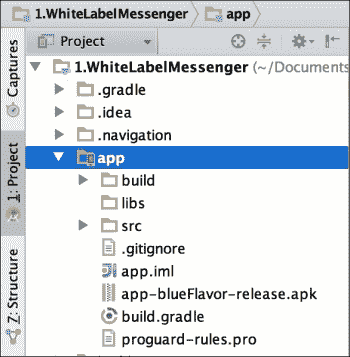
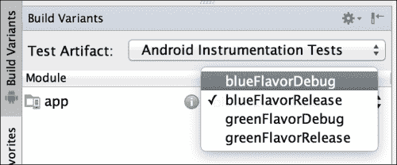
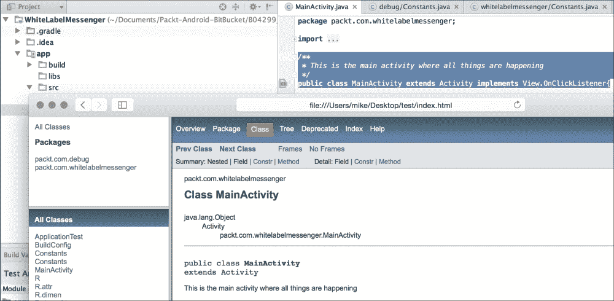
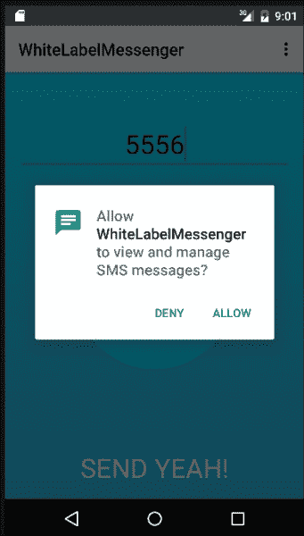
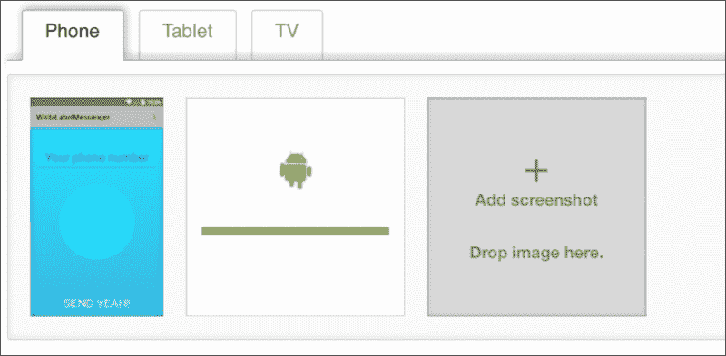

# 十、通过测试版测试你的应用

您尽了一切努力来确保您的应用的质量和性能。现在是时候将你的应用发送给你的测试版用户，看看他们对它的看法。

### 类型

在发布你的应用之前，你应该先看看 Crashlytics。你可以在[https://try.crashlytics.com](https://try.crashlytics.com)找到它。

不仅在测试期间，而且在 Play Store 上发布应用之后，Crashlytics 都可以为您提供实时崩溃报告信息。迟早，你的应用会在一个你没有测试过的设备上运行，然后崩溃。防撞工具可以帮助你找到原因。

只需下载他们的 SDK，在你的应用中添加几行代码，你就可以开始了。

通过在 Play Store 上发布您的应用，在向大量观众展示您的应用之前，分发并测试它。从他们的反馈中学习并改进您的应用。

最后，你可以把这个标志放在你的网站上:


在本章中，您将了解:

*   构建变体
*   运行时权限
*   Play Store 测试版发行版

# 简介

典型的软件发布周期是这样的，尽管它不一定要经历每个阶段:

Alpha ->封闭 beta ->开放 beta ->发布。

你可以直接在谷歌 Play 商店发布你的应用，但是至少有一轮测试是一件聪明的事情。收集反馈并应用进一步的改进可以让你的应用变得更好。

我们将了解如何为您的应用设置多种不同的风格，以及如何为其定义不同的构建类型。例如，您的发布应用很可能会使用不同于您用于调试和测试的应用编程接口端点，至少我希望如此。

您选择的最低应用编程接口级别、所需功能和请求的权限将影响您的应用在游戏商店中可用的设备数量。此外，我们将预览安卓棉花糖附带的运行时权限如何需要不同的方法。

最后，我们将找出我们需要做什么来使用谷歌 Play 商店分发我们的应用的 beta 或 alpha 版本。

# 构建变体

Android Studio 支持不同的应用配置。例如，您的应用可能使用不同的 API 端点进行调试。为此，我们将使用构建类型。

除此之外，您可能还有不同版本的应用。一个项目可以有多个定制版本的应用。如果这些变化很小，例如，只要改变一个应用的外观，以防它是一个白色标签的解决方案，使用一种味道是正确的方法。

构建变体是构建类型和特定风格的组合。即将到来的食谱将演示如何使用这些。

## 做好准备

对于这个食谱，你只需要一个 Android Studio 的最新版本。

## 怎么做...

我们将构建一个简单的消息传递应用，使用不同的构建类型和构建风格:

1.  在 Android Studio 中创建新项目，命名为`WhiteLabelMessenger`，在**公司域**字段输入公司名称，点击**确定**按钮。
2.  接下来，选择**手机和平板**，点击**下一步**按钮。
3.  选择**空白活动**，点击**下一步**按钮。
4.  接受建议值，点击**完成**按钮。
5.  打开 `strings.xml`文件，多加几个字符串。它们应该是这样的:

    ```java
    <resources>
        <string name="app_name">WhiteLabelMessenger</string>
        <string name="hello_world">Hello world!</string>
        <string name="action_settings">Settings</string>
        <string name="button_send">SEND YEAH!</string>
        <string name="phone_number">Your phone number</string>
        <string name="yeah">Y-E-A-H</string>
        <string name="really_send_sms">YES</string>
    </resources>
    ```

6.  在`res/drawable`文件夹中创建一个`icon.xml`和一个`background.xml`资源文件。
7.  在`res/drawable`文件夹中，新建一个文件并命名为`icon.xml`。它会画一个蓝色的圆圈:

    ```java
    <?xml version="1.0" encoding="utf-8"?>
    <shape    xmlns:android="http://schemas.android.com/apk/res/android"
        android:shape="oval">
        <solid
            android:color="@android:color/holo_blue_bright"/>
        <size
            android:width="120dp"
            android:height="120dp"/>
    </shape>
    ```

8.  在`res/drawable`文件夹中，新建一个文件并命名为`background.xml`。它定义了一个渐变蓝色背景:

    ```java
    <?xml version="1.0" encoding="utf-8"?>
    <selector xmlns:android="http://schemas.android.com/apk/res/android">
        <item>
            <shape>
                <gradient
                    android:angle="90"
                    android:startColor="@android:color/holo_blue_light"android:endColor="@android:color/holo_blue_bright"android:type="linear" />
            </shape>
        </item>
    </selector>
    ```

9.  打开 `activity_main.xml`文件，修改成这样:

    ```java
    <FrameLayout xmlns:android=
      "http://schemas.android.com/apk/res/android"
        xmlns:tools="http://schemas.android.com/tools"  android:layout_width="match_parent"
         android:layout_height="match_parent"    android:paddingLeft="@dimen/activity_horizontal_margin"       
         android:paddingRight="@dimen/activity_horizontal_margin"android:paddingTop="@dimen/activity_vertical_margin"android:background="@drawable/background"       
         android:paddingBottom= "@dimen/activity_vertical_margin" 
         tools:context=".MainActivity">
        <EditText
            android:id="@+id/main_edit_phone_number"
            android:layout_marginTop="38dp"
            android:textSize="32sp"
            android:gravity="center"
            android:hint="@string/phone_number"
            android:layout_width="match_parent"
            android:layout_height="wrap_content" />
        <Button
            android:id="@+id/main_button_send"android:background="@drawable/icon"android:layout_gravity="center"android:layout_width="200dp"android:layout_height="200dp" />
        <TextView
            android:text="@string/button_send"android:textSize="32sp"android:gravity="center"android:layout_gravity="bottom"android:textColor="@android:color/white"android:layout_width="match_parent"android:layout_height="wrap_content" />
    </FrameLayout>
    ```

10.  打开`androidmanifest.xml`文件和发送短信的权限:

    ```java
    <uses-permission 
     android:name="android.permission.SEND_SMS"/>
    ```

11.  修改`MainActivity`文件的`onCreate`方法。可以按 *Shift* 两次，显示一个搜索面板。在搜索面板上输入`onCreate`，选择`MainActivity`类的`onCreate`方法:

    ```java
    findViewById(R.id.main_button_send).setOnClickListener(this);
    ```

12.  在`MainActivity`类上添加一个点击监听器并实现`onClick`方法:

    ```java
    public class MainActivity extends Activity implements View.OnClickListener{
    @Override
    public void onClick(View v) {
        String phoneNumber = ((EditText)findViewById( 
         R.id.main_edit_phone_number)).getText().toString();
        SmsManager sms = SmsManager.getDefault();
        String message = getString(R.string.yeah);
        if (getString(R.string.really_send_sms)  == "YES"){
         Toast.makeText(this, String.format(
          "TEST Send %s to %s", message, phoneNumber), Toast.LENGTH_SHORT).show();
        }
        else {
          sms.sendTextMessage(phoneNumber, null, message, null, 
           null);

          Toast.makeText(this, String.format(
           "Send %s to %s", message, phoneNumber), Toast.LENGTH_SHORT).show();
        }
    }
    ```

13.  选择`app`文件夹。接下来，从**构建**菜单中选择**编辑口味**。
14.  该列表只包含一个默认配置。点击**+**+T5】按钮添加新口味。将其命名为`blueFlavor`，并赋予其与`min sdk version`和`target sdk version`相同的值，就像**默认配置**一样。
15.  对于**应用 id** 字段，使用包名 **+** 作为扩展名。`blue`。
16.  输入该口味的**版本代码**和**版本名称**，点击**确定**按钮。
17.  对另一种口味重复步骤 14 至 16。说出那个味道`greenFlavor`。
18.  现在你的`build.gradle`文件应该包含如下所示的味道:

    ```java
    productFlavors {
        blueFlavor {
            minSdkVersion 21
            applicationId 'packt.com.whitelabelmessenger.blue'targetSdkVersion 21
            versionCode 1
            versionName '1.0'
        }
        greenFlavor {
            minSdkVersion 21
            applicationId 'packt.com.whitelabelmessenger.green'targetSdkVersion 21versionCode 1
            versionName '1.0'
        }
    }
    ```

19.  在**项目**面板中，选择`app`文件夹下的`src`文件夹。然后，创建一个新文件夹并命名为`blueFlavor`。在该文件夹中，您可以保持相同的结构，如`main`文件夹的情况。对于这个食谱，只需添加一个`res`文件夹，并在该文件夹中添加另一个名为`drawable`的文件夹就足够了。
20.  Do the same thing for the `greenFlavor` build's flavor. The project structure will now look like this:

    

21.  从`/main/res/drawable`文件夹中复制`background.xml`和`icon.xml`文件，并粘贴到`blueFlavor/res/drawable`文件夹中。
22.  对`greenFlavor`重复此操作，打开`greenFlavor/res/drawable`文件夹中的`background.xml`文件。修改其内容。对于绿色风味，我们将使用渐变绿色:

    ```java
    <?xml version="1.0" encoding="utf-8"?>
    <selector xmlns:android=
      "http://schemas.android.com/apk/res/android">
        <item>
            <shape>
                <gradient
                android:angle="90"
                android:startColor= 
                 "@android:color/holo_green_light"                   
                android:endColor=  
                 "@android:color/holo_green_dark"
                android:type="linear" />
            </shape>
        </item>
    </selector>
    ```

23.  现在，在同一个文件夹中，打开`icon.xml`文件，使`drawable`文件夹也显示为绿色:

    ```java
    <?xml version="1.0" encoding="utf-8"?>
    <shape xmlns:android=
       "http://schemas.android.com/apk/res/android"
         android:shape="oval">
        <solidandroid:color="@android:color/holo_green_dark"/>
        <size
            android:width="120dp"android:height="120dp"/>
    </shape>
    ```

24.  对于调试和发布构建类型，可以使用不同的值(或类或布局)进行同样的操作。在`app/src`文件夹中创建`debug`文件夹。
25.  在该文件夹中，创建一个`res`文件夹，在该文件夹中，创建一个`values`文件夹。
26.  从`main/res/values`文件夹复制`strings.xml`文件，粘贴到`debug/res/values`文件夹。
27.  打开`strings.xml`文件，修改`really_send_sms`字符串资源:

    ```java
    <string name="really_send_sms">NO</string>
    ```

### 类型

当然，更好的方法是使用一个定义不同值的常量类，但是为了简单起见，我们将改为修改字符串资源。

### 构建变体

选择`app`文件夹并从**构建**菜单中选择**选择构建变体**。将显示**构建变体**面板，如下图所示:



按照**构建变体**中的下一步操作:

1.  选择**绿色调试**构建变体并运行应用。
2.  如果一切顺利，该应用将呈现绿色外观，其行为就像正在调试一样。
3.  现在将构建变量更改为**蓝色调试**，并再次运行应用。的确，它现在看起来是蓝色的。

### 构建类型

差不多同样的适用于调试和发布构建类型；然而，这一次不是外观，而是行为或数据(或终点)发生了变化。

### 注

发布应用需要签名，这是我们将应用分发到 Play Store 时会做的事情，这在上一份食谱中有所描述。


这基本上就是构建变体的全部内容。大多数理想的构建类型和风格只包含少量的修改。如果你的应用的不同风格之间的差异不仅仅是布局、可绘制性或常量值的一些调整，你将不得不考虑一种不同的方法。

## 还有更多...

Android Studio 还提供了其他一些很棒的功能来完成你的应用。其中之一是自动创建技术文档。只需给类或方法添加一些注释，如下所示:

```java
/*** This is the main activity where all things are happening*/
public class MainActivity extends Activity implements View.OnClickListener{
```

现在，如果您从**工具**菜单中选择**生成 JavaDoc** ，并在出现的对话框中的**输出目录**字段中定义路径，您只需单击**确定**按钮，所有文档都将生成为 HTML 文件。结果将显示在您的浏览器中，如下所示:



### 注

**Android Studio tip**

您是否经常需要返回到代码中的特定位置？使用 *Cmd* + *F3* (对于窗口: *F11* )快捷方式创建书签。

要显示书签列表并从中进行选择，请使用快捷方式 *Cmd* + *F3* (对于 Windows:*Shift*+*F11*)。

# 运行时权限

您的应用将瞄准的不同类型设备的数量取决于功能要求(需要权限)和您瞄准的市场(通过明确选择特定国家或以特定语言提供您的应用)。

例如，如果您的应用需要前置和后置摄像头，您将瞄准较少数量的设备，就像您只需要后置摄像头一样。

通常在安装应用时，用户会被要求接受(或拒绝)所有必需的权限，因为它已经在应用的`AndroidManifest`文件中定义了。

随着安卓 6(棉花糖)的推出，用户被要求特定权限的方式发生了变化。只有当需要某种类型的权限时，才会提示用户允许或拒绝该权限。

这样，应用就有机会解释为什么需要这种许可。在此之后，整个事情对用户来说更有意义。这些所谓的运行时权限需要一种稍微不同的开发方法。

对于这个食谱，我们将修改以前发送 SmS 的应用。现在我们需要在用户点击按钮发送短信时征得他的同意。

## 做好准备

要测试运行时权限，您需要有一个运行在安卓 6.0 或更高版本上的设备，或者您需要有一个运行在安卓棉花糖或更高版本上的虚拟设备。

此外，确保您已经下载了安卓 6.x 软件开发工具包(应用编程接口级别 23 或更高)。

## 怎么做...

那么，这些运行时权限看起来如何，我们又是如何处理的呢？这可以通过以下步骤进行检查:

1.  从上一个配方打开项目。
2.  打开`AndroidManifest`文件，添加发送短信的权限(根据新型号):

    ```java
    <uses-permission-sdk- 
     android:name="android.permission.SEND_SMS"/>
    ```

3.  打开`app`文件夹中的`build.gradle`文件，将`compileSdkVersion`的值设置为最新版本。另外，将每个`minSdkVersion`和`targetSdkVersion`的值更改为`23`或以上。
4.  修改`onClick`方法:

    ```java
    @Override
    public void onClick(View v) {
        String phoneNumber = ((EditText) findViewById( 
         R.id.main_edit_phone_number)).getText().toString();
        String message = getString(R.string.yeah);
        if (Constants.isTestSMS) {
          Toast.makeText(this, String.format(
           "TEST Send %s to %s", message, phoneNumber), 
           Toast.LENGTH_SHORT).show();
        } 
        else {
          if (checkSelfPermission(Manifest.permission.SEND_SMS)   
           != PackageManager.PERMISSION_GRANTED) {
                requestPermissions(new String[]{  
                  Manifest.permission.SEND_SMS},
                     REQUEST_PERMISSION_SEND_SMS);
            }
        }
    }
    ```

5.  添加一个常量值，以便稍后我们知道许可结果指的是哪个许可请求:

    ```java
    private final int REQUEST_PERMISSION_SEND_SMS = 1;
    ```

6.  执行`sendSms`方法。我们将使用`SmsManager`方法向用户输入的电话号码发送`Y-E-A-H`文本。信息发送后，将显示祝酒词:

    ```java
    private void sendSms(){
        String phoneNumber = ((EditText) findViewById( 
         R.id.main_edit_phone_number)).getText().toString();
        String message = getString(R.string.yeah);
        SmsManager sms = SmsManager.getDefault();
        sms.sendTextMessage(phoneNumber, null, 
         getString(R.string.yeah), null, null);
        Toast.makeText(this, String.format("Send %s to %s", getString(R.string.yeah), phoneNumber), Toast.LENGTH_SHORT).show();
    }
    ```

7.  最后，执行`onRequestPermissionsResult`方法。如果授予的权限是短信权限，则调用`sendSms`方法。如果许可被拒绝，将显示祝酒词并禁用**发送**按钮和输入电话号码的编辑文本:

    ```java
    @Override
    public void onRequestPermissionsResult(int requestCode,  String permissions[], int[] grantResults) {
        switch (requestCode) {
            case REQUEST_PERMISSION_SEND_SMS: {
                if (grantResults[0] == PackageManager.PERMISSION_GRANTED) {
                    sendSms();
                }
                else {                
                  findViewById(
                   R.id.main_edit_phone_number).setEnabled(false); 
                  findViewById(  
                   R.id.main_button_send).setEnabled(false);
                    Toast.makeText(this, 
                     getString(R.string.no_sms_permission), Toast.LENGTH_SHORT).show();
                }
                return;
            }
        }
    }
    ```

8.  运行您的应用。使用运行在 Android 6.0 或更高版本上的设备，或者创建运行在 API 级别 23 或更高版本上的虚拟设备。
9.  现在，发送短信的权限不会被提前询问(也就是说，如果用户安装了应用)。相反，一按**发送**按钮，就会弹出一个请求许可的对话框。
10.  If you agree with the request permission, the SMS message will be sent. If you deny the requested permission, the edit box and the button will be disabled and a toast will be displayed to provide feedback:

    

这个配方展示了运行时权限的基本思想。

## 还有更多...

要了解如何以及何时请求许可，或者如何以及何时向提供关于不可用的特定功能的反馈，您可以在[https://www . Google . com/design/spec/patterns/permissions . html](https://www.google.com/design/spec/patterns/permissions.html)查看谷歌指南。

### 注

**Android Studio tip**

您可以很容易地从变得太大的方法中提取代码。只需标记您想要移动的代码并使用快捷方式*Cmd*+*Alt*+*M*(对于 Windows:*Ctrl*+*Alt*+*M*)。

# 玩商店测试版分发

好了，我们将把我们的应用上传到游戏商店，作为测试版分发。很刺激，不是吗？

## 做好准备

对于这个食谱，我们将使用第一个食谱的应用；不过，任何你认为已经准备好测试版的应用都可以。

确保你也有一些艺术品，比如图标和截图。别担心，对于这个食谱，你也可以从<[www.packtpub.com](http://www.packtpub.com)T2 下载这些物品。此外，想想你的应用的元数据，如标题，描述和类别。

最重要的是，你确实有一个开发者帐户，并且你确实可以访问谷歌游戏开发者控制台。如果没有账号，需要先通过[http://developer . Android . com/distribute/googleplay/start . html](http://developer.android.com/distribute/googleplay/start.html)注册。

## 怎么做...

让你的应用进入游戏商店并不困难。只是需要一些时间来以正确的方式设置事情:

1.  登录您的**谷歌游戏开发者控制台**网页，或者如果需要，先注册。
2.  在仪表盘上，点击**添加新应用**按钮。
3.  在对话框中，输入应用`Blue Messenger`的**标题**，点击**立即上传 APK** 按钮。
4.  你会注意到**生产**、**贝塔**和**阿尔法**标签。理想情况下，您从 alpha 测试开始，但出于演示目的，我们将立即选择 **beta** 选项卡。显示**将您的第一个 APK 上传到测试版**按钮。点击那个按钮。
5.  在 Android Studio 中，打开我们为第一个(或第二个)配方创建的应用，从**构建**菜单中，选择**生成签名 APK** 选项。
6.  选择`app`模块，点击**下一步**按钮。
7.  进入**路径**到你的钥匙店。如果您有，点击**新建…** 按钮，为您的密钥存储文件(扩展名为`.jks`)找到一个合适的位置。为其输入一个**密码**，重复该密码，并为**名字和姓氏**输入一个合适的值。然后，点击**确定**按钮。
8.  输入**密钥库密码**，新建**密钥别名**，并命名为`whitelabelmessenger`。输入钥匙的**密码**，点击**下一步**按钮。
9.  如果需要，输入**主密码**，点击**确定**按钮。
10.  如果愿意，修改**目的地路径**，然后选择一个**建造类型**和**风味**。选择**释放**和**蓝味**，然后点击**确定**按钮。
11.  一个新的对话框告诉我们，如果一切顺利，一个新签署的 APK 已经成功创建。点击**在 Finder 中显示**(或者在使用 Windows 的情况下使用 Windows 资源管理器找到它)按钮，查看刚刚创建的 APK 文件。
12.  在你的浏览器中，上传这个 APK 文件。一旦上传了 APK 文件，版本就会显示在**测试版**标签上；你可以选择一种测试方法，你会看到支持的设备数量，这将取决于你选择的应用编程接口级别和短信许可附带的所需功能(例如，这会立即排除许多平板电脑)。
13.  测试方法，点击**设置封闭测试**按钮。
14.  点击**创建列表**按钮，创建列表。给列表起一个名字，例如**内部测试**并添加测试人员的电子邮件地址(或者只是为了练习，输入你自己的)。完成后，点击**保存**按钮。
15.  输入您自己的电子邮件地址作为**反馈通道**，点击**保存草稿**按钮。
16.  Although we are not publishing anything on the store yet, you need to enter some values for the **Store listing** section, which is an option that you can select from the menu on the left-hand side of the webpage:

    

17.  输入标题、简短和详细描述。另外，添加两个截图，一个高分辨率图标和一个特征图形图像。你可以从<[www.packtpub.com](http://www.packtpub.com)>下载这些资源，或者你可以通过从你的应用中捕捉截图来自己创建它们，并通过某种绘画程序来给它们提供合适的宽度和高度。
18.  在 **分类**中，选择**应用**作为**应用类型****社交**或**交流**作为**类别**。
19.  输入您的**联系方式**并选择**此时不提交隐私政策**(当然，除非您确实想这样做)。
20.  点击**保存草稿**按钮，从屏幕左侧的菜单中选择该选项，继续进行**内容评分**部分。

### 给你的应用评分

点击**继续** 按钮，输入您的**电子邮件地址**，并回答关于您的应用是否有任何暴力、性或其他潜在危险内容或功能的问题。最后，点击**保存问卷**按钮:

1.  您现在可以点击**计算等级**按钮。之后将显示您的评分。点击**应用评级**按钮，您就完成了。
2.  下一节是**定价和配送**。从页面左侧的**菜单**中选择该选项。
3.  通过点击**免费**按钮和**选择选择所有国家**(或指定特定国家，如果你愿意)，使其成为一个免费的应用。之后，点击**保存草稿**按钮。
4.  此时**发布 app** 按钮应该已启用。点击它。如果没有启用，可以点击**我不能发布？**链接找出缺少什么信息。
5.  在这里，“出版”这个词有点令人困惑。这实际上意味着，在这种情况下，应用将为您刚刚创建的列表中的测试用户发布。别担心。在您将应用推广到生产之前，Play Store 将不会提供任何内容，尽管术语“发布”似乎暗示了这一点。
6.  当你的应用状态显示**等待发布**时，你可以调查一些其他选项，例如你的应用支持的设备列表、所需功能以及用于分析目的的权限和选项，包括功能分离测试(A/B 测试)。

### 休息一下

**待发布状态**可能需要几个小时(甚至更长时间)，因为最近(自 2015 年 4 月以来)，谷歌宣布将提前(以半手动半自动的方式)审查应用，即使是 alpha 和 beta 版本。

1.  Eat a marshmallow or have some coffee or have a walk in the park. Return within a couple of hours to check whether your app's status has changed to **Published**. It may take some time, but it will.

    ### 注

    您的测试人员可能需要将他们的(安全)设置更改为**以允许在谷歌 Play 商店以外的地方安装应用**。

2.  还有其他一些事情看起来令人困惑。在包名后面会有一个链接写着**在 Play Store 查看……**还有一个提示说 alpha 和 beta 应用没有在 Play Store 中列出。
3.  Click on the **APK** item in the menu on the left-hand side of the webpage. By following the link, you will find **Opt In Url** on the **Beta** tab that your test users can download and use to install the beta app:

    

巨大！您的第一个测试版已经准备好接受测试。你可能需要多次迭代才能把事情做好，或者仅仅一个测试版就足以发现你的应用已经为 **Play Store** 做好了准备。

如果你敢，点击**升级到产品**按钮，在游戏商店发布你的应用

至此，本书结束。关于安卓开发，还有很多要讲和学习的，比如服务、安卓支付、**近场通信** ( **NFC** )、蓝牙等等；然而，通过阅读这本书，你已经看到了 Android Studio IDE 的大部分元素，这也是我们的目标。

现在就这样了。感谢阅读，快乐编码！

## 还有更多...

你应该意识到，除了技术，方法也同样重要。很难开发出一个不仅技术完美，而且有很多用户对你的应用及其流量、可用性和外观非常满意的应用，以至于他们都给了你应有的五星。

我假设你不想开发一个应用几个月或几年，但后来发现实际上没人关心它。为了在早期发现是什么让人们真正想要使用你的应用，你应该考虑应用开发的精益启动方法。

**构建-测量-学习**

**精益创业**方法论是一种开发业务和产品(或服务)的方法。这个想法是，基于假设、经验证的学习和迭代产品发布的实验导致更短的产品开发周期。

精益启动方法最重要的关键要素是:

*   **最小存活产品** ( **MVP** )
*   分离测试和可操作的指标
*   持续部署

简而言之，MVP 是一个产品的版本，只需要很少的努力就可以测试特定的假设。

要了解更多关于精益创业方法的信息，请访问网站[http://theleanstartup.com](http://theleanstartup.com)，阅读埃里克·里斯的书，或者从[http://www.leanstartupcircle.com](http://www.leanstartupcircle.com)找到一个离你不远的精益创业活动。

**Play Store 开发者控制台**提供了用于分割测试和测量应用使用情况的选项。谷歌分析可以帮助你做到这一点，因为这是获得可行指标的最简单方法，你需要收集反馈，以便通过从中学习来改进你的应用。

**连续** **部署**很好地符合精益启动方法论。它可以提高你的应用开发的质量和速度。

你可能想知道什么是持续部署。需要另一本书来全面解释这个概念，但是这里有一个关于持续集成和持续交付的简短介绍，如果结合起来，这就是持续部署的含义。

**持续集成** ( **CI** )是开发人员提交他们的更改并将结果合并到源代码库中的过程。构建服务器观察代码存储库的变化，提取和编译代码。服务器还运行自动测试。

**持续交付**是通过在 Play Store 中发布 alpha 或 beta 应用，自动创建应用可部署版本的过程，例如。出于这个原因，提交和验证的代码处于始终可部署的状态是很重要的。

设置连续部署将需要一些前期工作，但最终，它将导致更小和更快的开发周期。

对于安卓应用的持续部署来说，`Jenkins`和`TeamCity`都是合适的。`Teamcity`是最常推荐的，并且确实使用插件与 Android Studio 集成。

要了解如何设置`TeamCity`服务器或找到任何进一步的信息，您可以查看 Packt Publishing 的网站，该网站提供了一些很棒的书籍，解释了持续集成的概念，特别是`TeamCity`。