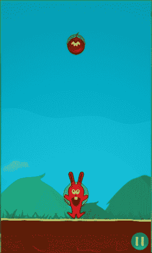

# 三、理解游戏物理

在这一章中，我们将介绍如何使用 Cocos2d-x 基于流行的 Chipmunk 框架提供的内置引擎将物理添加到我们的游戏中。我们将解释以下主题:

*   建立物理世界
*   检测碰撞
*   处理重力
*   处理物理属性

有关花栗鼠物理引擎的更多信息，您可以访问[https://chipmunk-physics.net](https://chipmunk-physics.net)。

物理引擎封装了所有与给我们的场景赋予真实运动相关的复杂性，比如给一个物体增加重力，让它被吸引到屏幕底部，或者检测物体之间的碰撞等等。

在从事物理工作的同时，我们要牢记，我们面对的是我们场景中的一个物理世界，参与这个世界的所有物理元素都被称为物理体。这些物体具有质量、位置和旋转等属性。这些可能会改变，以定制身体。一个物理体可以通过一个联合定义与另一个物理体相联系。

考虑到，从物理学的角度来看，物理体不知道精灵和物理世界之外的其他物体，但是我们将在本章中看到如何将精灵与物理体联系起来。

视频游戏最常见的特征之一是碰撞检测；我们经常需要知道物体相互碰撞的时间。这可以通过定义代表每个物体上碰撞区域的形状，然后指定一个碰撞监听器来轻松完成，我们将在本章后面介绍。

最后，我们将介绍 Box2D 物理引擎，这是一个完全独立的物理引擎，与花栗鼠无关。Box2D 用 C++ 写，花栗鼠用 C 写。

# 建立物理世界

为了在我们的游戏中启用物理，我们需要在我们的`HelloWorldScene.h`头文件中添加以下几行:

```cpp
cocos2d::Sprite* _sprBomb;
  void initPhysics();
  bool onCollision(cocos2d::PhysicsContact& contact);
  void setPhysicsBody(cocos2d::Sprite* sprite);
```

这里我们为`_sprBomb`变量创建了一个实例变量，这样就可以从所有实例方法中访问它。在这种特殊情况下，我们希望能够访问`onCollision`方法中的炸弹实例，每次检测到物理物体之间的碰撞时都会调用该实例，这样我们只需将其可见属性设置为 false，就可以使炸弹消失。

现在让我们转到我们的`HelloWorld.cpp`实现文件，并做一些更改，以便建立我们的物理世界。

首先，让我们修改我们的`createScene`方法，使它现在看起来像这样:

```cpp
Scene* HelloWorld::createScene()
{
  auto scene = Scene::createWithPhysics();
  scene->getPhysicsWorld()->setGravity(Vect(0,0));
  auto layer = HelloWorld::create();
  //enable debug draw
  scene->getPhysicsWorld()->setDebugDrawMask(PhysicsWorld::DEBUGDRAW_ALL);
  scene->addChild(layer);
  return scene;
}
```

### 注

在 Cocos2d-x 分支 3 的早期版本中，您需要指定当前场景层将使用的物理世界。但是，在 3.4 版本中没有必要，并且`setPhysicsWorld`方法已经从`Layer`类中移除。

这里我们可以看到，我们现在使用包含在`Scene`类中的`createWithPhysics`静态方法创建场景实例，而不是使用简单的创建方法。

我们要在这里执行的第二步是将重力设置为(0，0)，这样物理世界的重力就不会将我们的精灵吸引到屏幕底部。

然后，我们将启用物理引擎调试绘制，这将允许我们看到所有的物理体。这个选项将在开发阶段帮助我们，我们将使用 COCOS2D_DEBUG 宏，这样当在调试模式下运行时，它只显示调试绘图，如下所示:

```cpp
#if COCOS2D_DEBUG
  scene->getPhysicsWorld()->setDebugDrawMask(PhysicsWorld::DEBUGDRAW_ALL);
#endif
```

在下面的截图中，我们可以看到围绕炸弹和玩家精灵的红色圆圈。这代表每个玩家精灵的物理身体:



现在让我们实现我们的`setPhysicsBody`方法，该方法接收一个精灵对象指针作为参数，该指针指向我将向其添加物理体的精灵。该方法将创建一个圆，该圆将代表物理体，并因此代表碰撞区域。这个圆的半径是精灵宽度的一半，所以它会覆盖精灵尽可能多的区域。

```cpp
void HelloWorld::setPhysicsBody(cocos2d::Sprite* sprite){
  auto body = PhysicsBody::createCircle(sprite->getContentSize().width/2);
  body->setContactTestBitmask(true);
  body->setDynamic(true);
  sprite -> setPhysicsBody(body);
}
```

### 注

圆圈通常用于检测冲突，因为它们需要较少的 CPU 工作来检测每一帧中的冲突；然而，在某些情况下，它们的精确性可能是不可接受的。

现在让我们在我们的`init`方法中，将物理体添加到我们的玩家和炸弹精灵中。为了做到这一点，我们将在初始化每个精灵之后调用我们的实例方法 setPhysicsBody。

# 碰撞检测

首先，让我们实现我们的`onCollision`实例方法。这将在每次探测到两个物理体之间的碰撞时被称为。正如我们在下面的代码中看到的，当炸弹物理体与我们的玩家发生碰撞时，它会使炸弹不可见:

```cpp
bool HelloWorld::onCollision(PhysicsContact& contact){
  _sprBomb->setVisible(false);
  return false;
}
```

### 注

这是一个在开发过程中放置一些日志的好地方，以便发现何时检测到冲突。在 Cocos2d-x 3.4 中，您可以使用`CCLOG`宏打印日志消息。这可以通过如下定义宏`COCOS2D_DEBUG`来打开:`#define COCOS2D_DEBUG 1`。

正如我们所看到的，这个方法返回一个布尔值。它表明这两个物体是否能再次碰撞。在这种特殊情况下，我们将返回 false，表示这两个物理体一旦碰撞，就不应该继续碰撞。如果我们返回真实的指示，那么这两个物体将继续碰撞，这将导致我们的玩家精灵移动，从而给我们的游戏带来不希望的视觉效果。

现在，让我们让我们的游戏能够检测到我们的炸弹何时与我们的玩家相撞。为了做到这一点，我们将创建一个`EventListenerPhysicsContact`实例，我们将设置它，这样当两个物理体开始碰撞时，它应该调用我们的`onCollision`实例方法。然后，我们将事件侦听器添加到事件调度器中。我们将在我们的`initPhysics`实例方法中创建这三个简单的步骤。因此，我们的代码如下所示:

```cpp
void HelloWorld::initPhysics()
{
  auto contactListener = EventListenerPhysicsContact::create();
  contactListener->onContactBegin = CC_CALLBACK_1(HelloWorld::onCollision,this);
  getEventDispatcher() ->addEventListenerWithSceneGraphPriority(contactListener,this);
}
```

我们的`init`方法代码将如下所示:

```cpp
bool HelloWorld::init() {
  if( !Layer::init() ){
    return false;
  }
  _director = Director::getInstance();
  _visibleSize = _director->getVisibleSize();
  auto origin = _director->getVisibleOrigin();
  auto closeItem = MenuItemImage::create("pause.png", "pause_pressed.png", CC_CALLBACK_1(HelloWorld::pauseCallback, this));
  closeItem->setPosition(Vec2(_visibleSize .width - closeItem->getContentSize().width/2, closeItem->getContentSize().height/2));

  auto menu = Menu::create(closeItem, nullptr);
  menu->setPosition(Vec2::ZERO);
  this->addChild(menu, 1);
  _sprBomb = Sprite::create("bomb.png");
  _sprBomb->setPosition(_visibleSize .width/2, _visibleSize .height + _sprBomb->getContentSize().height/2);
  this->addChild(_sprBomb,1);
  auto bg = Sprite::create("background.png");
  bg->setAnchorPoint(Vec2());
  bg->setPosition(0,0);
  this->addChild(bg, -1);
  auto sprPlayer = Sprite::create("player.png");
  sprPlayer->setPosition(_visibleSize .width / 2, _visibleSize .height * 0.23);
  setPhysicsBody(sprPlayer);
  this->addChild(sprPlayer, 0);
  //Animations
  Vector<SpriteFrame*> frames;
  Size playerSize = sprPlayer->getContentSize();
  frames.pushBack(SpriteFrame::create("player.png", Rect(0, 0, playerSize.width, playerSize.height)));
  frames.pushBack(SpriteFrame::create("player2.png", Rect(0, 0, playerSize.width, playerSize.height)));
  auto animation = Animation::createWithSpriteFrames(frames,0.2f);
  auto animate = Animate::create(animation);
  sprPlayer->runAction(RepeatForever::create(animate));
  setPhysicsBody(_sprBomb);
  initPhysics();
  return true;
}
```

# 处理重力

现在我们已经成功使用内置的物理引擎检测到碰撞，让我们玩一点重力。转到`createScene`方法，修改我们发送给构造器的参数。在我们的游戏中，我们使用了`(0,0)`值，因为我们不希望我们的世界有任何重力在 *x* 或 *y* 轴上移动我们的身体。

现在，试一试，将数值改为正或负。当我们在 *x* 轴上使用负值时，它会向左吸引身体，当我们在 *y* 轴上使用负值时，它会向底部吸引身体。

### 注

改变这些值并理解加入到我们游戏中的物理知识可能会给你接下来的游戏带来一些想法。

## 处理物理属性

现在我们已经创建了我们的场景，它对应于物理世界，我们现在有能力改变物理属性，例如每个物体的速度、线性阻尼、力、冲量和扭矩。

### 施加速度

在前一章中，我们使用`MoveTo`动作成功地将炸弹从屏幕顶部移到了底部。现在我们使用了内置的物理引擎，只要给炸弹设定一个速度，就能达到同样的效果。这可以通过简单调用炸弹精灵物理体的`setVelocity`方法来实现。速度是一个矢量；因此，所述方法接收一个`Vect`实例作为参数。 *x* 的值将代表其水平分量；在此轴上，正值表示身体将向右移动，负值表示身体将向左移动。 *y* 值影响垂直移动。正值将正文移向屏幕顶部，负值将正文移向屏幕底部。

就在返回语句之前，我们在`HelloWorld.cpp`实现文件的`init`方法中添加了以下一行:

```cpp
  _sprBomb->getPhysicsBody()->setVelocity(Vect(0,-100));
```

请记住删除请求炸弹精灵执行`MoveTo`动作的代码行，这样您就可以确认炸弹现在正在移动，因为它的速度参数。

现在让我们进入`onCollision`方法，在那里我们将设置炸弹与我们的玩家精灵碰撞时的速度为零。

```cpp
  _sprBomb -> getPhysicsBody()->setVelocity(Vect());
```

### 注

类似于`Vec2`类，空构造函数将所有向量值初始化为零。

### 线性阻尼

我们可以降低我们物理体的速度来产生摩擦效应。实现这一点的一种方法是调用`linearDamping`方法，并指定身体速度的变化率。该值应为介于`0.0`和`1.0`之间的浮点数。

可以通过将炸弹物理体的值设置为`0.1f`来测试线性阻尼，观察炸弹的速度是如何下降的。

```cpp
  _sprBomb->getPhysicsBody()->setLinearDamping(0.1f);
```

记得在测试线性阻尼后记录或删除这条线，这样游戏就不会以意想不到的方式运行。

### 施加力

我们可以通过简单地调用我们想要应用的物理体的`applyForce`方法来对一个体施加一个即时的力。类似于前面章节中解释的方法，它接收一个矢量作为参数，这意味着力有垂直和水平分量。

我们可以通过对炸弹施加一个力来测试这个方法，在我们的`onCollision`方法中，一旦炸弹与我们的玩家精灵碰撞，炸弹就会向右移动。

```cpp
  _sprBomb->getPhysicsBody()->applyForce(Vect(1000,0));
```

### 施加脉冲

在上一节我们给我们的物理体增加了一个即时力，现在我们可以通过调用`applyImpulse`方法给它施加一个脉冲来增加一个持续力。

在`onCollision`方法中对物理体施加即时力后，添加以下代码行:

```cpp
  _sprBomb->getPhysicsBody()->applyImpulse(Vect(10000,0));
```

现在运行游戏，你会看到炸弹是如何向右移动的。


用`onCollision`方法去掉那几行给我们的炸弹增加力量和冲力的代码。

### 施加扭矩

最后，让我们让我们的炸弹在与我们的玩家精灵碰撞后旋转。我们可以通过使用`applyTorque`方法对炸弹的物理体施加扭力来实现，该方法接收一个浮点数；如果为正，会使物理体逆时针旋转。

让我们在返回语句之前给`onCollision`方法添加一个任意的正扭矩:

```cpp
  auto body = _sprBomb -> getPhysicsBody();
body->applyTorque(100000);
```

现在给`applyTorque`方法加一个负值，你会看到物理体是如何顺时针旋转的。

# 把所有东西放在一起

在所有的修改之后，我们的`onCollision`方法看起来像这样:

```cpp
bool HelloWorld::onCollision(PhysicsContact& contact){
  auto body = _sprBomb -> getPhysicsBody();
  body->setVelocity(Vect());
  body->applyTorque(100900.5f);
  return false;
}
```

我们的`init`方法现在看起来是这样的:

```cpp
bool HelloWorld::init()
{
  if( !Layer::init() ){
    return false;
  }
  _director = Director::getInstance();
  _visibleSize = _director->getVisibleSize();
  auto origin = _director->getVisibleOrigin();
  auto closeItem = MenuItemImage::create("CloseNormal.png", "CloseSelected.png", CC_CALLBACK_1(HelloWorld::pauseCallback, this));
  closeItem->setPosition(Vec2(_visibleSize .width - closeItem->getContentSize().width/2, closeItem->getContentSize().height/2));

  auto menu = Menu::create(closeItem, nullptr);
  menu->setPosition(Vec2::ZERO);
  this->addChild(menu, 1);
  _sprBomb = Sprite::create("bomb.png");
  _sprBomb->setPosition(_visibleSize .width/2, _visibleSize .height + _sprBomb->getContentSize().height/2);
  this->addChild(_sprBomb,1);
  auto bg = Sprite::create("background.png");
  bg->setAnchorPoint(Vec2());
  bg->setPosition(0,0);
  this->addChild(bg, -1);
  auto sprPlayer = Sprite::create("player.png");
  sprPlayer->setPosition(_visibleSize .width/2, _visibleSize .height * 0.23);
  setPhysicsBody(sprPlayer);

  this->addChild(sprPlayer, 0);
  //Animations
  Vector<SpriteFrame*> frames;
  Size playerSize = sprPlayer->getContentSize();
  frames.pushBack(SpriteFrame::create("player.png", Rect(0, 0, playerSize.width, playerSize.height)));
  frames.pushBack(SpriteFrame::create("player2.png", Rect(0, 0, playerSize.width, playerSize.height)));
  auto animation = Animation::createWithSpriteFrames(frames,0.2f);
  auto animate = Animate::create(animation);
  sprPlayer->runAction(RepeatForever::create(animate));

  setPhysicsBody(_sprBomb);
  initPhysics();
  _sprBomb->getPhysicsBody()->setVelocity(Vect(0,-100));
  return true;
}
```

下面的截图显示了我们的游戏在修改后的样子:


### 类型

**Box2D 物理引擎**

到目前为止我们已经使用了框架提供的内置物理引擎，基于花栗鼠 C 物理库；尽管如此，Cocos2d-x 还在其 API 中提供了与 Box2D 物理引擎的集成。

为了创建一个 Box2D 世界，我们实例化`b2World`类，然后将一个表示世界重力的`b2Vec`对象传递给它的构造器。世界实例有一个创建`b2Bodies`的实例方法。精灵类有一个名为`setB2Body`的方法，它允许我们将 Box2D 物理体与任何给定的精灵相关联。这比它在框架的分支 2 中的样子更流畅；将 T4 和雪碧联系起来需要更多的代码。

虽然 Box2D 集成很好用，但是我强烈推荐使用内置的物理引擎，因为 Box2D 集成已经不在积极开发中了。

# 总结

我们通过创建一个物理世界和代表炸弹和我们的玩家精灵的物理体，将物理添加到我们的游戏中，我们在很少的步骤中使用了内置物理引擎提供的碰撞检测机制。我们还展示了如何改变重力参数，使物理体根据重力运动。我们已经很容易地改变了物体的物理性质，比如速度、摩擦力、力、冲量和扭矩，每一项都用一行代码来完成。到目前为止，我们的玩家忽略了我们的用户事件。在下一章中，我们将介绍如何在我们的游戏中添加用户交互。