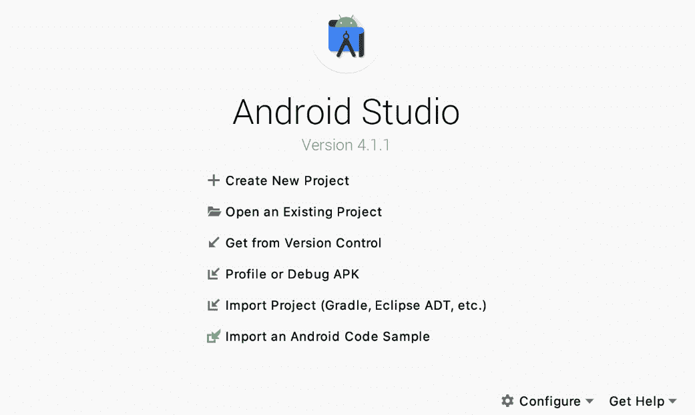
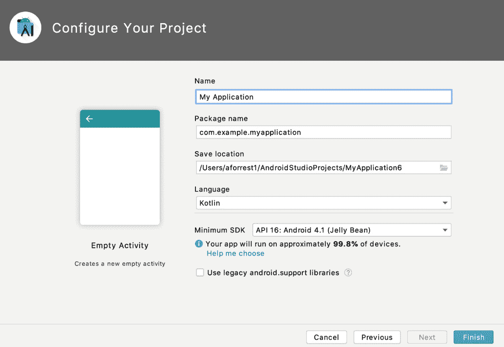
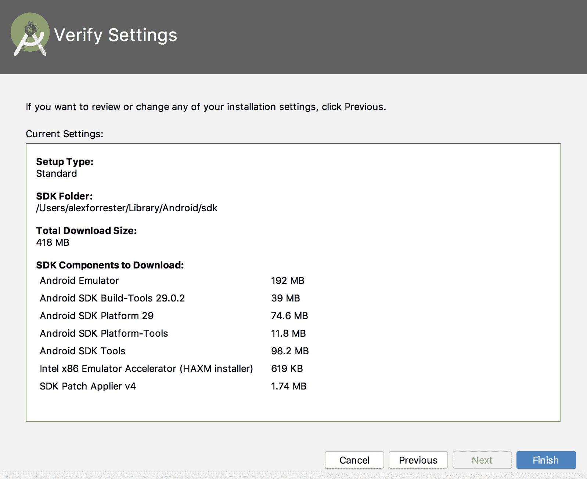
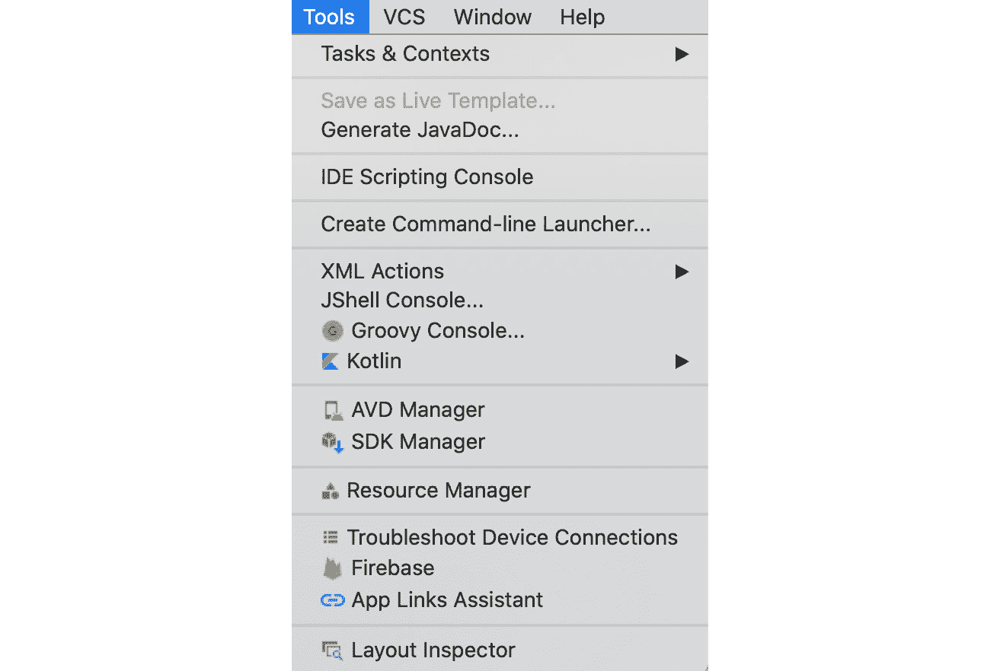
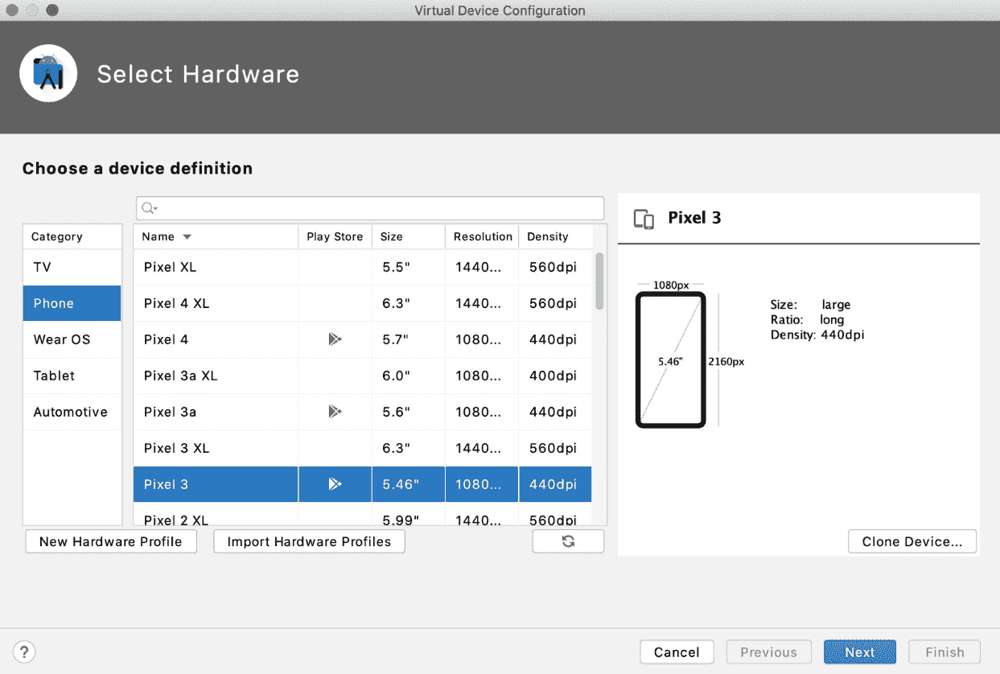
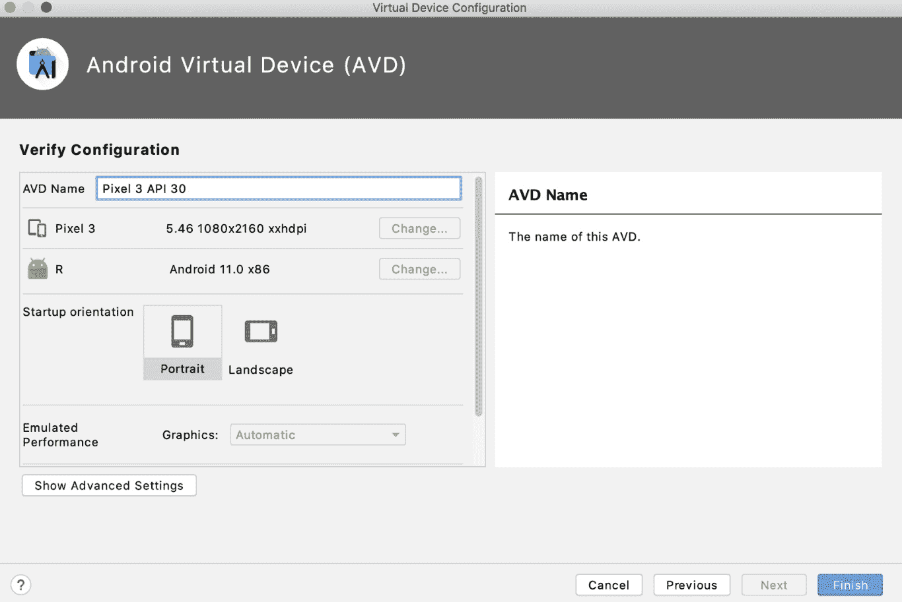
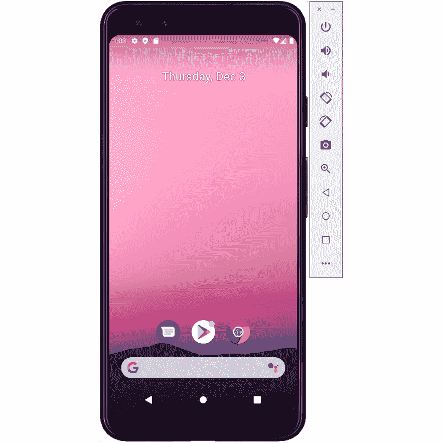
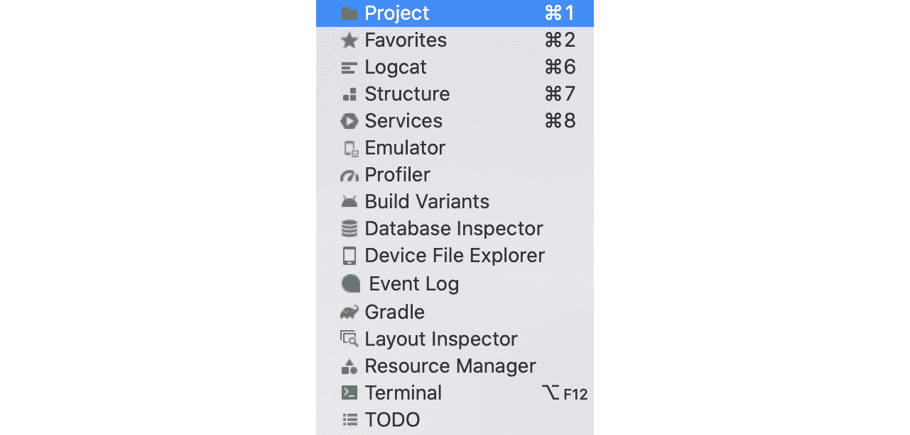
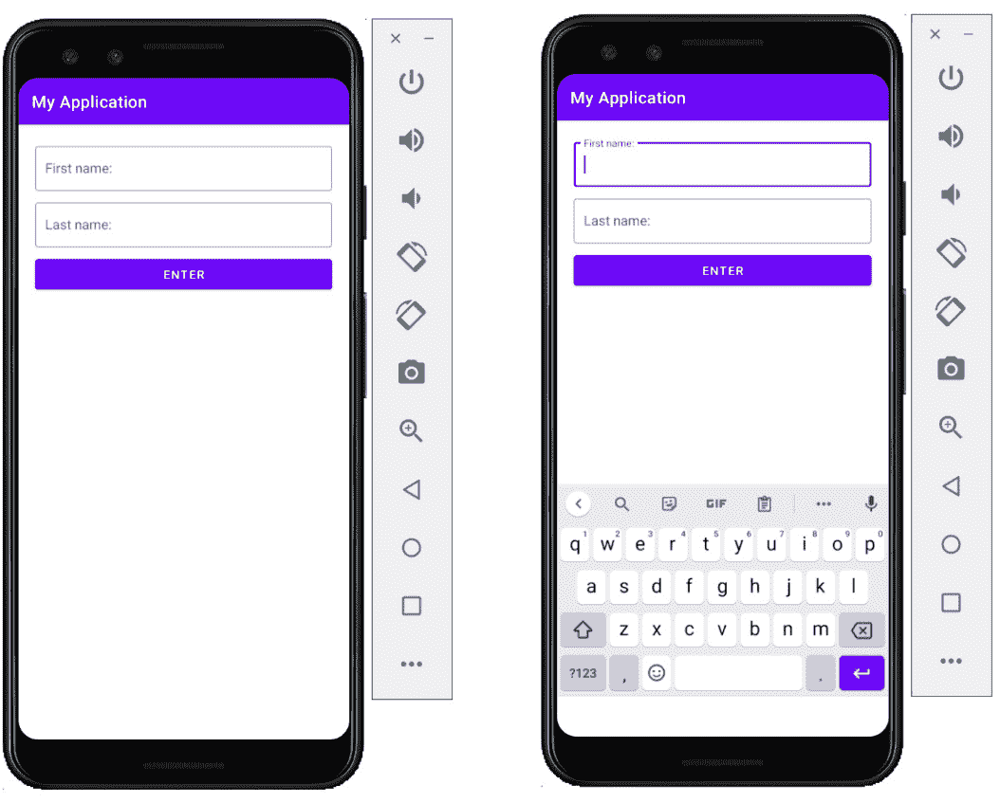
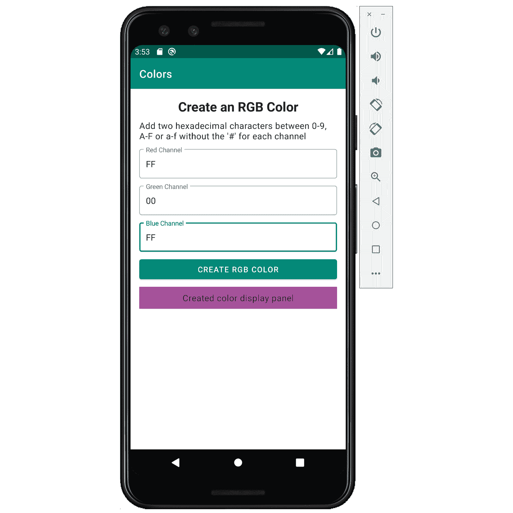

# 一、创建您的第一个应用

概观

这一章是对安卓的介绍，在这里你将设置你的环境，并专注于安卓开发的基础。到本章结束时，您将获得从头开始创建安卓应用并将其安装在虚拟或物理安卓设备上所需的知识。您将能够分析和理解`AndroidManifest.xml`文件的重要性，并使用 Gradle 构建工具来配置您的应用和实现来自材质设计的 UI 元素。

# 简介

安卓是全球使用最广泛的手机操作系统，全球市场份额超过 70%(见[https://gs.statcounter.com/os-market-share/mobile/worldwide](https://gs.statcounter.com/os-market-share/mobile/worldwide))。这为通过学习安卓和构建具有全球影响力的应用做出贡献和产生影响提供了巨大的机会。对于一个刚接触安卓的开发人员来说，要开始学习并变得高效，你必须应对许多问题。这本书将解决这些问题。在学习了工具和开发环境之后，您将探索构建安卓应用的基本实践。我们将涵盖开发人员面临的各种现实世界开发挑战，并探索各种技术来克服这些挑战。

在本章中，您将学习如何创建一个基本的安卓项目并为其添加功能。您将被介绍到 AndroidStudio 的全面开发环境，并了解软件的核心领域，使您能够高效地工作。AndroidStudio 提供了应用开发的所有工具，但没有提供知识。这第一章将指导您有效地使用该软件来构建应用，并配置安卓项目中最常见的领域。

让我们开始创建一个安卓项目。

# 用 AndroidStudio 创建安卓项目

为了在构建安卓应用方面卓有成效，对如何使用**AndroidStudio**充满信心至关重要。这是安卓开发的官方**集成开发环境** ( **IDE** )，构建在 JetBrains 的 **IntelliJ IDEA IDE** 上，由谷歌 AndroidStudio 团队开发。在本课程中，您将使用它来创建应用，并逐步添加更多高级功能。

AndroidStudio 的发展跟随了智能智能集成开发环境的发展。集成开发环境的基本特性当然是存在的，使您能够通过建议、快捷方式和标准重构来优化代码。在本课程中，您将使用的创建安卓应用的编程语言是 Kotlin。自谷歌 I/O 2017(年度谷歌开发者大会)以来，这一直是谷歌用于安卓应用开发的首选语言。真正让 AndroidStudio 区别于其他安卓开发环境的是 **Kotlin** 是由创建 AndroidStudio 所基于的软件 IntelliJ IDEA 的公司 JetBrains 创建的。因此，您可以受益于对 Kotlin 的既定和不断发展的一流支持。

创建 Kotlin 是为了解决 Java 在冗长、处理空类型和添加更多函数式编程技术等方面的一些缺点。由于 Kotlin 自 2017 年以来一直是安卓开发的首选语言，取代了 Java，您将在本书中使用它。

掌握并熟悉 AndroidStudio 将使你对开发和构建安卓应用充满信心。那么，让我们开始创建您的第一个项目。

注意

AndroidStudio 的安装和设置在*前言*中有介绍。请确保您已经完成这些步骤，然后再继续。

## 练习 1.01:为应用创建 AndroidStudio 项目

这是创建应用将基于的项目结构的起点。模板驱动的方法将使您能够在短时间内创建一个基本项目，同时建立您可以用来开发您的应用的构件。要完成本练习，请执行以下步骤:

注意

你将使用的 AndroidStudio 版本是 *v4.1.1* (或以上)。

1.  Upon opening Android Studio, you will see a window asking whether you want to create a new project or open an existing one. Select `Create New Project`.

    启动窗口将显示如下:

    

    图 1.1:AndroidStudio 4.1.1 版本

2.  Now, you'll enter a simple wizard-driven flow, which greatly simplifies the creation of your first Android project. The next screen you will see has a large number of options for the initial setup you'd like your app to have:

    

    图 1.2:启动应用的项目模板

3.  Welcome to your first introduction to the **Android development ecosystem**. The word displayed in most of the project types is `Activity`. In Android, an `Activity` is a page or screen. The options you can choose from on the preceding screen all create this initial screen differently. The descriptions describe how the first screen of the app will look. These are templates to build your app with. Select `Empty Activity` from the template and click on next.

    项目配置屏幕如下:

    

    图 1.3:项目配置

4.  The preceding screen configures your app. Let's go through all the options:

    **a.** `Name`:类似于你的安卓项目的名字，这个名字在手机上安装的时候会作为你的 app 的默认名称出现，在 Google Play 上可见。您可以用自己的字段替换`Name`字段，或者现在将其设置为您要创建的应用。

    **b.** `Package name`:这使用标准的反向域名模式来创建名称。它将被用作应用中源代码和资产的地址标识符。最好使这个名称尽可能清晰和描述性，并尽可能与您的应用的目的保持一致。因此，可能最好将其更改为使用一个或多个子域(如`com.sample.shop.myshop`)。如图*图 1.3* 所示，应用的`Name`(小写，去掉空格)被追加到域中。

    **c.** `Save location`:这是你机器上的本地文件夹，应用最初会存放在这里。这个以后可以改，大概可以保留默认值或者编辑成不同的东西(比如`Users/MyUser/android/projects`)。默认位置将因您使用的操作系统而异。

    **d.** `Language – Kotlin`:这是谷歌开发安卓应用的首选语言。

    **即** `Minimum SDK`:根据你下载的 AndroidStudio 版本不同，默认可能与*图 1.3* 中显示的相同，也可能是不同的版本。保持这个不变。安卓的大部分新功能都是向后兼容的，所以你的应用可以在绝大多数旧设备上正常运行。但是，如果您确实想针对较新的设备，您应该考虑提高最低的应用编程接口级别。有一个链接`Help Me Choose`，指向一个对话框，该对话框解释了您可以访问的功能集，以便在不同版本的安卓上进行开发，以及当前全球运行每个安卓版本的设备的百分比。

    **f .**T0。不要检查这个。您将使用 AndroidX 库，它是支持库的替代品，支持库旨在使新版 Android 上的功能与旧版向后兼容，但它提供的远不止这些。它还包含名为 Jetpack 的较新安卓组件，顾名思义，它“促进”了你的安卓开发，并提供了一系列你想在应用中使用的丰富功能，从而简化了常见操作。

    填写完所有这些细节后，选择`Finish`。将构建您的项目，然后您将看到以下屏幕或类似屏幕:您可以立即在一个选项卡中看到已创建的活动(`MainActivity`)，在另一个选项卡中看到用于屏幕的布局(`activity_main.xml`)。应用结构文件夹位于左侧面板中。

    

图 1.4:AndroidStudio 默认项目

在本练习中，您已经完成了使用 AndroidStudio 创建第一个安卓应用的步骤。这是一种模板驱动的方法，向您展示了为应用配置所需的核心选项。

在下一部分，您将设置一个虚拟设备，并看到您的应用首次运行。

# 设置虚拟设备并运行应用

作为安装 Android Studio 的一部分，您下载并安装了最新的 Android SDK 组件。其中包括一个基本模拟器，您将配置它来创建一个运行安卓应用的虚拟设备。好处是，您可以在开发应用时进行更改，并在桌面上快速看到这些更改。虽然虚拟设备不具备真实设备的所有功能，但反馈周期通常比连接真实设备的步骤更快。

此外，虽然您应该确保您的应用在不同的设备上按预期运行，但是您可以通过下载模拟器皮肤来瞄准特定的设备来标准化它，即使您没有真正的设备(如果这是项目的要求)。

安装 Android Studio 时，您将看到的屏幕(或类似的东西)如下:



图 1.5:软件开发工具包组件

让我们看一下安装的 SDK 组件以及虚拟设备如何适应:

*   **安卓仿真器**:这是基础仿真器，我们将配置它来创建不同安卓品牌和型号的虚拟设备。
*   **安卓 SDK 构建工具**:AndroidStudio 使用构建工具来构建你的应用。这个过程包括编译、链接和打包您的应用，为在设备上安装做准备。
*   **安卓 SDK 平台**:这是你用来开发应用的安卓平台版本。平台指的是 API 级别。API 级别 30 的 Android 版本是 11，名字叫 Android 11。在安卓 10 发布之前，安卓的版本也是用一个代号来称呼的，和版本名不同。用于遵循甜食/甜点主题的代号；因此，上面在创建项目向导中选择了名称`Jelly Bean`来配置项目的最低 API 级别。从安卓 10 开始，版本化将不再有不同于版本名的代码名。(构建工具和平台的版本将随着新版本的发布而变化)
*   **安卓 SDK 平台-工具**:这些是你可以使用的工具，通常，从命令行，与你的应用交互和调试。
*   **安卓 SDK 工具**:与平台工具不同的是，这些工具主要是你为了完成某些任务而从 AndroidStudio 内部使用的，比如运行应用的虚拟设备和下载安装平台和 SDK 其他组件的 SDK 管理器。
*   **英特尔 x86 仿真器加速器(HAXM 安装程序)**:如果是你的 OS 提供的，这是你电脑硬件层面的一个功能，系统会提示你启用，这样可以让你的仿真器运行得更快。
*   **SDK Patch Applier v4** :随着 Android Studio 的更新版本可用，这使得可以应用补丁来更新您正在运行的版本。

有了这些知识，让我们从本章的下一个练习开始。

## 练习 1.02:设置虚拟设备并在其上运行应用

我们在*练习 1.01**中设置了一个 AndroidStudio 项目来创建我们的应用，为你的应用*创建一个 AndroidStudio 项目，现在我们将在虚拟设备上运行它。您也可以在真实设备上运行您的应用，但在本练习中，您将使用虚拟设备。这个过程是一个连续的循环，而你的应用工作。一旦您实现了一个特性，您就可以根据需要验证它的外观和行为。在本练习中，您将创建一个虚拟设备，但是您应该确保在多个设备上运行您的应用，以验证其外观和行为是否一致。请执行以下步骤:

1.  In the top toolbar in Android Studio, you will see two drop-down boxes next to each other pre-selected with `app` and `No devices`:

    

    图 1.6:AndroidStudio 工具栏

    `app`是我们将要运行的应用的配置。由于我们还没有设置虚拟设备，上面写着`No devices`。

2.  In order to create a virtual device, click on the `AVD Manager` (**AVD** stands for **Android Virtual Device**) to open the virtual devices window/screen. The option to do this can also be accessed from the `Tools` menu:

    

    图 1.7:工具菜单中的自动车辆识别管理器

3.  Click the button or toolbar option to open the `Your Virtual Devices` window:

    

    图 1.8:您的虚拟设备窗口

4.  Click the `Create Virtual Device...` button as shown in *Figure 1.8*:

    

    图 1.9:设备定义创建

5.  We are going to choose the `Pixel 3` device. The real (non-virtual device) Pixel range of devices are developed by Google and have access to the most up-to-date versions of the Android platform. Once selected, click the `Next` button:

    

    图 1.10:系统映像

    这里显示的`R`名称是安卓 11 的初始代码/发布名称。选择可用的最新系统映像。`Target`列也可能在名称中显示`(Google Play)`或`(Google APIs)`。谷歌应用编程接口意味着系统映像预装了 Google Play 服务。这是一套丰富的谷歌应用接口和谷歌应用功能集，你的应用可以使用它们并与之交互。首次运行该应用时，您将看到地图和 Chrome 等应用，而不是纯模拟器图像。Google Play 系统映像意味着，除了谷歌应用接口，还将安装 Google Play 应用。

6.  You should develop your app with the latest version of the Android platform to benefit from the latest features. On first creating a virtual device, you will have to download the system image. If a `Download` link is displayed next to `Release Name`, click on it and wait for the download to complete. Select the `Next` button to see the virtual device you have set up:

    

    图 1.11:虚拟设备配置

    然后，您将看到最终的配置屏幕。

7.  Click `Finish` and your virtual device will be created. You will then see your device highlighted:

    

    图 1.12:列出的虚拟设备

8.  Press the right arrow button under the `Actions` column to run up the virtual device:

    

    图 1.13:虚拟设备启动

    现在您已经创建了虚拟设备，并且它正在运行，您可以返回 AndroidStudio 运行您的应用。

9.  将选择您设置并启动的虚拟设备。按绿色三角形/播放按钮启动您的应用:


图 1.14:应用启动配置


图 1.15:运行在虚拟设备上的应用

在本练习中，您已经完成了创建虚拟设备并在其上运行您创建的应用的步骤。您曾经使用过的安卓虚拟设备管理器可以让您创建您希望应用瞄准的设备(或设备范围)。在虚拟设备上运行您的应用，可以快速反馈一个周期，以验证新功能开发的表现，以及它是否按照您期望的方式显示。

接下来，您将浏览项目的`AndroidManifest.xml`文件，其中包含您的应用的信息和配置。

# 安卓清单

您刚刚创建的应用虽然简单，但包含了您将在所有创建的项目中使用的核心构建块。该应用由`AndroidManifest.xml`文件驱动，该文件是一个清单文件，详细说明了您的应用的内容。它拥有所有组件，如活动、内容提供者、服务、接收者，以及应用实现其功能所需的权限列表。例如，在应用中拍摄照片需要相机许可。您可以在`MyApplication` | `app` | `src` | `main`下的项目视图中找到它。或者，如果您正在查看安卓视图，它位于`app` | `manifests` | `AndroidManifest.xml`:

```kt
<?xml version="1.0" encoding="utf-8"?>
<manifest xmlns:android="http://schemas.android.com/apk/res/android"
    package="com.example.myapplication">
    <!--Permissions like camera go here-->
    <application
        android:allowBackup="true"
        android:icon="@mipmap/ic_launcher"
        android:label="@string/app_name"
        android:roundIcon="@mipmap/ic_launcher_round"
        android:supportsRtl="true"
        android:theme="@style/Theme.MyApplication">
        <activity android:name=".MainActivity"           android:screenOrientation="portrait">
            <intent-filter>
              <action android:name="android.intent.action.MAIN" />

             <category android:name="android.intent.category.LAUNCHER" />
            </intent-filter>
        </activity>
    </application>
</manifest>
```

一般来说，一个典型的清单文件是一个顶层文件，它描述了组成一个组或单元的封闭文件或其他数据以及相关的元数据。安卓清单采用了这个概念，并将其作为一个 XML 文件应用于你的安卓应用。指定的应用的显著特征是在清单 XML 根定义的包:

```kt
package="com.example.myapplication"
```

每个安卓应用都有一个允许你配置应用的应用类。默认情况下，在 Android Studio 的 4.1.1 版本中，在应用元素中创建了以下 XML 属性和值:

*   `android:allowBackup="true"`:这将在重新安装或切换设备时，从以 Android 6.0 (API 级别 23)或更高版本为目标并运行的应用中备份用户的数据。
*   `android:icon="@mipmap/ic_launcher"`:Android 使用的资源是用前面带`@`符号的 XML 引用的，mipmap 指的是存储启动器图标的文件夹。
*   `android:label="@string/app_name"`:这是你创建应用时指定的名字。它目前也显示在应用的工具栏中，并将在启动器的用户设备上显示为应用的名称。它由`@`符号引用，后跟创建应用时指定名称的字符串引用。
*   `android:roundIcon="@mipmap/ic_launcher_round"`:根据用户拥有的设备，启动器图标可以是方形的，也可以是圆形的。当用户设备在启动器中显示圆形图标时，使用`roundIcon`。
*   `android:supportsRtl="true` `"`:指定 app 及其布局文件是否支持从右向左的语言布局。
*   `android:theme="@style/Theme.MyApplication"`:这将根据应用内的文本样式、颜色和其他样式来指定应用的主题。

在`<application>`元素打开后，您定义您的应用由哪些组件组成。由于我们刚刚创建了我们的应用，它只包含下面代码中显示的第一个屏幕:

```kt
<activity android:name=".MainActivity"> 
```

指定的下一个子 XML 节点如下:

```kt
<intent-filter> 
```

安卓使用意图作为与应用和系统组件交互的机制。意图被发送，意图过滤器注册你的应用对这些意图做出反应的能力。`<android.intent.action.MAIN>`是进入你的应用的主要入口点，正如它出现在`.MainActivity`的封闭 XML 中一样，指定该屏幕将在应用启动时启动。`android.intent.category.LAUNCHER`声明您的应用将出现在用户设备的启动器中。

由于您已经从模板创建了应用，它有一个基本清单，将启动应用，并在启动时通过`Activity`组件显示初始屏幕。根据您想要添加到应用中的其他功能，您可能需要在安卓清单文件中添加权限。

权限分为三个不同的类别:正常、签名和危险。

*   **正常**权限包括访问网络状态、Wi-Fi、互联网和蓝牙。这些通常是允许的，运行时无需征得用户同意。
*   **签名**权限是必须用同一证书签名的同一组应用共享的权限。这意味着这些应用可以自由共享数据，但其他应用无法访问。
*   **危险**权限集中在用户及其隐私上，例如，发送短信、访问账户和位置、读写文件系统和联系人。

这些权限必须在清单中列出，并且，在从安卓棉花糖 API 23(安卓 6 棉花糖)开始的危险权限的情况下，您还必须要求用户在运行时授予权限。

在下一个练习中，我们将配置安卓清单文件。

## 练习 1.03:配置安卓清单互联网权限

大多数应用需要的关键权限是访问互联网。默认情况下，不会添加此项。在本练习中，我们将修复这个问题，并在此过程中加载一个`WebView`，使应用能够显示网页。这个用例在安卓应用开发中非常常见，因为大多数商业应用都会显示隐私政策、条款和条件等。由于这些文档可能对所有平台都是通用的，所以显示它们的通常方式是加载网页。请执行以下步骤:

1.  创建一个新的 AndroidStudio 项目，就像你在*练习 1.01* 、*中为你的应用*创建一个 AndroidStudio 项目一样。
2.  Switch tabs to the `MainActivity` class. From the main project window, it's located in `MyApplication` | `app` | `src` | `main` | `java` | `com` | `example` | `myapplication`. This follows the package structure you defined when creating the app. Alternatively, if you are looking at the Android view within the project window, it is located at `app` | `java` | `com` | `example` | `myapplication`.

    您可以通过选择`View | Tool Windows | Project` 打开`Tool`窗口来更改`Project`窗口显示的内容-这将选择`Project`视图。`Project`窗口顶部的下拉选项允许您更改查看项目的方式，最常用的显示是`Project`和`Android`。

    

    图 1.16 工具窗口下拉列表

    打开后，您会看到它包含以下内容或类似内容:

    ```kt
    package com.example.myapplication
    import androidx.appcompat.app.AppCompatActivity
    import android.os.Bundle
    class MainActivity : AppCompatActivity() {
        override fun onCreate(savedInstanceState: Bundle?) {
            super.onCreate(savedInstanceState)
            setContentView(R.layout.Activity_main)
        }
    }
    ```

    您将在本章的下一节更详细地检查这个文件的内容，但是现在，您只需要知道`setContentView(R.layout.Activity_main)`语句设置了您第一次在虚拟设备中运行应用时看到的 UI 的布局。

3.  Use the following code to change this to the following:

    ```kt
    package com.example.myapplication
    import androidx.appcompat.app.AppCompatActivity
    import android.os.Bundle
    import android.webkit.WebView
    class MainActivity : AppCompatActivity() {
        override fun onCreate(savedInstanceState: Bundle?) {
            super.onCreate(savedInstanceState)
            val webView = WebView(this)
            webView.settings.javaScriptEnabled = true
            setContentView(webView)
            webView.loadUrl("https://www.google.com")
        }
    }
    ```

    所以，你正在用`WebView`替换布局文件。`val`关键字是只读属性引用，一旦设置就不能更改。需要在 WebView 中启用 JavaScript 才能执行 JavaScript。

    注意

    我们没有设置类型，但是 Kotlin 有类型推断，所以如果可能的话它会推断类型。所以，没有必要用`val webView: WebView = WebView(this)`明确指定类型。根据您过去使用的编程语言，定义参数名称和类型的顺序可能熟悉，也可能不熟悉。Kotlin 遵循帕斯卡符号，即名字后面跟着类型。

4.  Now, run the app up and the text will appear as shown in the screenshot here:

    

    图 1.17 无互联网权限错误消息

5.  This error occurs because there is no `INTERNET` permission added in your `AndroidManifest.xml` file. (If you get the error `net::ERR_CLEARTEXT_NOT_PERMITTED`, this is because the URL you are loading into the `WebView` is not HTTPS and non-HTTPS traffic is disabled from API level 28, Android 9.0 Pie and above.) Let's fix that by adding the internet permission to the manifest. Open up the Android Manifest and add the following to above the `<application>` tag:

    ```kt
    <uses-permission android:name="android.permission.INTERNET" />
    ```

    您的清单文件现在应该如下所示:

    ```kt
    <?xml version="1.0" encoding="utf-8"?>
    <manifest xmlns:android="http://schemas.android.com/apk/res/android"
        package="com.example.myapplication">
        <uses-permission android:name="android.permission.INTERNET" />
        <application
            android:allowBackup="true"
            android:icon="@mipmap/ic_launcher"
            android:label="@string/app_name"
            android:roundIcon="@mipmap/ic_launcher_round"
            android:supportsRtl="true"
            android:theme="@style/AppTheme">
            <activity android:name=".MainActivity">
                <intent-filter>
                    <action android:name="android.intent.action.MAIN" />
                    <category android:name=                  "android.intent.category.LAUNCHER" />
                </intent-filter>
            </activity>
        </application>
    </manifest>
    ```

    在再次运行应用之前，请从虚拟设备中卸载该应用。您需要这样做，因为应用权限有时会被缓存。长按应用图标并选择出现的`App Info`选项，然后按下下方带有`Uninstall`文本的 Bin 图标，即可完成此操作。或者，长按应用图标，然后将其拖动到屏幕右上角带有`Uninstall`文本的 Bin 图标。

6.  再次安装应用，看到网页出现在`WebView`:


图 1.18 显示网络视图的应用

在本例中，您学习了如何向清单添加权限。安卓清单可以被认为是你的应用的目录。它列出了应用使用的所有组件和权限。正如您从启动程序启动应用时看到的，它还提供了进入应用的入口点。

在下一节中，您将探索安卓构建系统，该系统使用 Gradle 构建工具来启动和运行您的应用。

# 使用梯度构建、配置和管理应用依赖关系

在创建这个项目的过程中，您主要使用了安卓平台的软件开发工具包。必要的安卓库是在你安装 AndroidStudio 的时候下载的。然而，这些并不是唯一用于创建应用的库。为了配置和构建您的安卓项目或应用，使用了一个名为 Gradle 的构建工具。Gradle 是一个多用途的构建工具，AndroidStudio 用它来构建你的应用。默认情况下，在 Android Studio 中，它使用 Groovy(一种动态类型的 JVM 语言)来配置构建过程，并允许轻松的依赖关系管理，因此您可以将库添加到项目中并指定版本。AndroidStudio 也可以配置为使用 Kotlin 来配置构建，但是，由于默认语言是 Groovy，您将使用它。存储该构建和配置信息的文件被命名为`build.gradle`。当您第一次创建应用时，有两个`build.gradle`文件，一个在项目的根/顶层，一个在应用`module`文件夹中特定于您的应用。

## 项目级构建文件

现在来看看项目级`build.gradle`文件。这是添加所有子项目/模块共有的配置选项的地方，如以下代码所示:

```kt
buildscript {
    ext.kotlin_version = "1.4.21"
    repositories {
        google()
        jcenter()
    }
    dependencies {
        classpath "com.android.tools.build:gradle:4.4.1"
        classpath "org.jetbrains.kotlin:kotlin-gradle-plugin:          $kotlin_version"
        // NOTE: Do not place your application dependencies here; 
        //they belong in the individual module build.gradle files
    }
}
allprojects {
    repositories {
        google()
        jcenter()
    }
}
task clean(type: Delete) {
    delete rootProject.buildDir
}
```

`buildscript`块包含实际创建项目的构建和配置信息，而`allprojects`块指定了应用所有模块的配置。Groovy 在插件系统上工作，因此您可以编写自己的插件来完成一个任务或一系列任务，并将其插入您的构建管道。这里指定的两个插件是安卓工具插件和 Kotlin`gradle`插件，前者连接到`gradle`构建工具包，并提供特定于安卓的设置和配置来构建你的安卓应用，后者负责在项目中编译 Kotlin 代码。依赖项本身遵循由“`:`”冒号分隔的`groupId`、`artifactId`和`versionId`的 Maven **项目对象模型** ( **POM** )约定。例如，上面的安卓工具插件依赖关系如下所示:

`'com.android.tools.build:gradle:4.4.1'`

`groupId`为`com.android.tools.build`，`artifactId`为`gradle`，`versionId`为`4.4.1`。这样，构建系统通过使用`repositories`块中引用的存储库来定位和下载这些依赖项。

库的具体版本可以在依赖项中直接指定(就像安卓`tools`插件一样)或者作为变量添加。变量上的`ext.`前缀意味着它是一个 Groovy 扩展属性，也可以在应用`build.gradle`文件中使用。

注意

在前面的代码部分以及本章节和其他章节的后续部分中指定的依赖版本可能会更改，并且会随着时间的推移而更新，因此在您创建这些项目时可能会更高。

## 应用级构建.梯度

`build.gradle`应用特定于您的项目配置:

```kt
plugins {
    id 'com.android.application'
    id 'kotlin-android'
}
android {
    compileSdkVersion 30
    buildToolsVersion "30.0.3"
    defaultConfig {
        applicationId "com.example.myapplication"
        minSdkVersion 16
        targetSdkVersion 30
        versionCode 1
        versionName "1.0"
        testInstrumentationRunner           "androidx.test.runner.AndroidJUnitRunner"
        buildTypes {
            release {
                minifyEnabled false
                proguardFiles getDefaultProguardFile(                  'proguard-android-optimize.txt'), 'proguard-rules.pro'
            }
        }
        compileOptions {
            sourceCompatibility JavaVersion.VERSION_1_8
            targetCompatibility JavaVersion.VERSION_1_8
        }
        kotlinOptions {
            jvmTarget = '1.8'
        }
    }
    dependencies {
        implementation "org.jetbrains.kotlin:kotlin-stdlib:          $kotlin_version"
        implementation 'androidx.core:core-ktx:1.3.2'
        implementation 'androidx.appcompat:appcompat:1.2.0'
        implementation 'com.google.android.material:material:1.2.1'
        implementation 'androidx.constraintlayout:constraintlayout:2.0.4'
        testImplementation 'junit:junit:4.+'
        androidTestImplementation 'androidx.test.ext:junit:1.1.2'
        androidTestImplementation 'androidx.test.espresso           :espresso-core:3.3.0'
    }
}
```

前面解释中详述的安卓和 Kotlin 的插件在`plugins`行通过 id 应用到你的项目中。

由`com.android.application`插件提供的`android`块是您配置安卓专用配置设置的地方:

*   `compileSdkVersion`:用于定义应用已经编译的 API 级别，应用可以使用该 API 及更低版本的功能。
*   `buildToolsVersion`:构建应用的构建工具版本。(默认情况下，`buildToolsVersion`行将被添加到您的项目中，但是为了始终使用最新版本的构建工具，您可以将其删除)。
*   `defaultConfig`:这是你 app 的基础配置。
*   `applicationId`:这是设置到你的应用的包，是在 Google Play 上用来唯一识别你的应用的应用标识符。如果需要，可以将其更改为不同于包名。
*   `minSdkVersion`:你的应用支持的最低 API 级别。这将过滤掉您的应用，使其无法在低于此值的设备上显示。
*   `targetSdkVersion`:你所针对的 API 等级。这是您构建的应用要使用的应用编程接口级别，并且已经过测试。
*   `versionCode`:指定你的应用的版本代码。每次需要对应用进行更新时，版本代码都需要增加 1 个或更多。
*   `versionName`:一个用户友好的版本名称，通常遵循 X.Y.Z 的语义版本化，其中 X 为主要版本，Y 为次要版本，Z 为补丁版本，例如 1.0.3。
*   `testInstrumentationRunner`:用于用户界面测试的测试运行程序。
*   `buildTypes`:在`buildTypes`下，增加了一个版本，配置你的应用来创建一个`release`版本。`minifyEnabled`值，如果设置为`true`，将通过删除任何未使用的代码来缩小你的应用大小，并模糊你的应用。该混淆步骤将源代码引用的名称更改为`a.b.c()`等值。这使得您的代码不太容易进行逆向工程，并进一步减小了构建的应用的大小。
*   `compileOptions`:Java 源代码的语言级别(`sourceCompatibility`)和字节码(`targetCompatibility`)
*   `kotlinOptions`:T2 插件应该使用的`jvm`库

`dependencies`块指定了您的应用在安卓平台 SDK 上使用的库，如下所示:

```kt
    dependencies {
//The version of Kotlin your app is being built with
 implementation "org.jetbrains.kotlin:kotlin-stdlib-jdk7:          $kotlin_version"
//Kotlin extensions, jetpack 
//component with Android Kotlin language features
implementation 'androidx.core:core-ktx:1.3.2'
//Provides backwards compatible support libraries and jetpack components
 implementation 'androidx.appcompat:appcompat:1.2.0'
//Material design components to theme and style your app
 implementation 'com.google.android.material:material:1.2.1'
//The ConstraintLayout ViewGroup updated separately 
//from main Android sources
 implementation 'androidx.constraintlayout:constraintlayout:2.0.4'
//Standard Test library for unit tests. 
//The '+' is a gradle dynamic version which allows downloading the 
//latest version. As this can lead to unpredictable builds if changes 
//are introduced all projects will use fixed version '4.13.1'
 testImplementation 'junit:junit:4.+'
//UI Test runner
 androidTestImplementation 'androidx.test:runner:1.1.2'
//Library for creating Android UI tests
 androidTestImplementation           'androidx.test.espresso:espresso-core:3.3.0'
    }
```

添加这些库的`implementation`符号意味着它们的内部依赖不会暴露给你的应用，使得编译更快。

您将在这里看到`androidx`组件是作为依赖项添加的，而不是在安卓平台源代码中。这是为了使它们能够独立于安卓版本进行更新。`androidx`是重新打包的支持库和 Jetpack 组件。为了添加或验证您的`gradle.properties`文件是否启用了`androidx`，您需要检查项目根目录下的`gradle.properties`文件，查找`android.useAndroidX`和`android.enableJetifier`属性，并确保它们设置为`true`。

现在可以打开`gradle.properties`文件，会看到如下内容:

```kt
# Project-wide Gradle settings.
# IDE (e.g. Android Studio) users:
# Gradle settings configured through the IDE *will override*
# any settings specified in this file.
# For more details on how to configure your build environment visit
# http://www.gradle.org/docs/current/userguide/build_environment.html
# Specifies the JVM arguments used for the daemon process.
# The setting is particularly useful for tweaking memory settings.
org.gradle.jvmargs=-Xmx2048m -Dfile.encoding=UTF-8
# When configured, Gradle will run in incubating parallel mode.
# This option should only be used with decoupled projects. 
# More details, visit
# http://www.gradle.org/docs/current/userguide/multi_project_builds
# .html#sec
#:decoupled_projects
# org.gradle.parallel=true
# AndroidX package structure to make it clearer which packages are 
# bundled with #the Android operating system, and which are packaged 
# with your app's APK
# https://developer.android.com/topic/libraries/support-library/
# androidx-rn
android.useAndroidX=true
# Automatically convert third-party libraries to use AndroidX
android.enableJetifier=true
# Kotlin code style for this project: "official" or "obsolete":
kotlin.code.style=official
```

当您使用 AndroidStudio 模板创建项目时，它将这些标志设置为`true`，并将应用使用的相关`androidx`依赖项添加到应用的`build.gradle`文件的`dependencies`块中。除了前面评论的解释之外，`android.useAndroidX=true`标志表示该项目使用的是`androidx`库而不是旧的支持库，`android.enableJetifier=true`还会将第三方库中使用的任何旧版本的支持库转换为 AndroidX 格式。`kotlin.code.style=official`将代码样式设置为官方 kotlin one，而不是默认的 Android Studio one。

最后要检查的 Gradle 文件是`settings.gradle`。此文件显示您的应用使用的模块。首次使用 AndroidStudio 创建项目时，将只有一个模块`app`，但是当您添加更多功能时，您可以添加专用于包含该功能来源的新模块，而不是将其打包在主`app`模块中。这些模块称为功能模块，您可以用其他类型的模块来补充它们，例如共享模块，所有其他模块都使用这些模块，例如网络模块。`settings.gradle`文件将如下所示:

```kt
include ':app'
rootProject.name='My Application'
```

## 练习 1.04:探索如何使用材质设计为应用设置主题

在本练习中，您将学习谷歌的新设计语言**材质设计**，并使用它加载一个**材质设计**主题的应用。**材质设计**是由谷歌创建的一种设计语言，它基于真实世界的效果(如灯光、深度、阴影和动画)添加了丰富的 UI 元素。请执行以下步骤:

1.  创建一个新的 AndroidStudio 项目，就像你在*练习 1.01* 、*中为你的应用*创建一个 AndroidStudio 项目一样。
2.  首先看`dependencies`块，找到材质设计依赖

    ```kt
    implementation 'com.google.android.material:material:1.2.1'
    ```

3.  Next, open the `themes.xml` file located at `app` | `src` | `main` | `res` | `values` | `themes.xml`:

    ```kt
    <resources xmlns:tools="http://schemas.android.com/tools">
        <!-- Base application theme. -->
        <style name="Theme.MyApplication"       parent="Theme.MaterialComponents.DayNight.DarkActionBar">
            <!-- Primary brand color. -->
            <item name="colorPrimary">@color/purple_500</item>
            <item name="colorPrimaryVariant">@color/purple_700</item>
            <item name="colorOnPrimary">@color/white</item>
            <!-- Secondary brand color. -->
            <item name="colorSecondary">@color/teal_200</item>
            <item name="colorSecondaryVariant">@color/teal_700</item>
            <item name="colorOnSecondary">@color/black</item>
            <!-- Status bar color. -->
            <item name="android:statusBarColor"           tools:targetApi="l">?attr/colorPrimaryVariant</item>
            <!-- Customize your theme here. -->    </style></resources>
    ```

    注意`Theme.MyApplication`的父代是`Theme.MaterialComponents.DayNight.DarkActionBar`

    在`dependencies`块中添加的材质设计依赖项正在这里被用来应用应用的主题。

4.  如果现在运行应用，会看到默认的材质主题应用，如图*图 1.15*

在本练习中，您已经学习了如何使用**材质设计**为应用设置主题。由于你目前只在屏幕上显示一个`TextView`，不清楚材质设计提供了什么好处，但是当你开始更多地使用材质 UI 设计小部件时，这种情况就会改变。既然您已经了解了项目是如何构建和配置的，在下一节中，您将详细探索项目结构，了解它是如何创建的，并熟悉开发环境的核心领域。

# 安卓应用架构

既然我们已经介绍了 Gradle 构建工具是如何工作的，我们将探索项目的其余部分。最简单的方法是检查应用的文件夹结构。AndroidStudio 左上角有一个名为`Project`的工具窗口，可以让你浏览应用的内容。默认情况下，首次创建安卓项目时是`open` / `selected`。选择后会看到类似*图 1.19* 截图的视图。(如果在屏幕左侧看不到任何窗口条，则转到顶部工具栏，选择`View` |外观| `Tool` `Window Bars`并确保勾选)。如何浏览您的项目有许多不同的选项，但`Android`将被预先选择。这个视图将`app`文件夹结构整齐地分组在一起，让我们来看看。

下面是这些文件的概述，以及最重要的文件的更多细节。打开它时，您会看到它由以下文件夹结构组成:


图 1.19:应用中文件和文件夹结构的概述

您指定在应用启动时运行的 Kotlin 文件(`MainActivity`)如下:

```kt
package com.example.myapplication
import androidx.appcompat.app.AppCompatActivity
import android.os.Bundle
class MainActivity : AppCompatActivity() {
    override fun onCreate(savedInstanceState: Bundle?) {
        super.onCreate(savedInstanceState)
        setContentView(R.layout.activity_main)
    }
}
```

`import`语句包括库和这个活动使用的资源。类头`class MainActivity : AppCompatActivity()`创建一个扩展`AppCompatActivity`的类。在 Kotlin 中，`:`冒号字符用于从类派生(也称为继承)和实现接口。

`MainActivity`来源于`androidx.appcompat.app.AppCompatActivity`，这是一个向后兼容的活动，旨在使您的应用在旧设备上工作。

安卓活动有许多回调函数，你可以在活动的不同阶段覆盖它们。这被称为**活动生命周期**。对于本活动，当您想要显示具有布局的屏幕时，您可以覆盖`onCreate`功能，如下所示:

```kt
override fun onCreate(savedInstanceState: Bundle?) 
```

Kotlin 中的`override`关键字指定您正在为父类中定义的函数提供特定的实现。`fun`关键字(你可能猜到了)代表*功能*。`savedInstanceState: Bundle?`参数是安卓恢复之前保存状态的机制。对于这个简单的活动，您没有存储任何状态，所以这个值将是`null`。类型后面的问号`?`表示该类型可以是`null`。`super.onCreate(savedInstanceState)`行调用基类的重写方法，最后，`setContentView(R.layout.Activity_main)`加载我们想要在活动中显示的布局；否则，它将显示为空白屏幕，因为尚未定义布局。

让我们看看文件夹结构中存在的其他一些文件(*图 1.19* ):

*   `ExampleInstrumentedTest`:这是一个 UI 测试的例子。当应用运行时，您可以通过在用户界面上运行测试来检查和验证应用的流程和结构。
*   `ExampleUnitTest`:这是一个单元测试的例子。创建安卓应用的一个重要部分是编写单元测试，以验证源代码是否如预期那样工作。
*   `ic_launcher_background.xml` / `ic_launcher_foreground.xml`:这两个文件共同组成了矢量格式的你的 app 的启动器图标，在安卓 API 26(奥利奥)及以上版本中，启动器图标文件`ic_launcher.xml`将会用到这个图标。
*   `activity_main.xml`: This is the layout file that was created by Android Studio when we created the project. It is used by `MainActivity` to draw the initial screen content, which appears when the app runs:

    ```kt
    <?xml version="1.0" encoding="utf-8"?>
    <androidx.constraintlayout.widget.ConstraintLayout   xmlns:android="http://schemas.android.com/apk/res/android"
        xmlns:app="http://schemas.android.com/apk/res-auto"
        xmlns:tools="http://schemas.android.com/tools"
        android:layout_width="match_parent"
        android:layout_height="match_parent"
        tools:context=".MainActivity">
        <TextView
            android:layout_width="wrap_content"
            android:layout_height="wrap_content"
            android:text="Hello World!"
            app:layout_constraintBottom_toBottomOf="parent"
            app:layout_constraintStart_toStartOf="parent"
            app:layout_constraintEnd_toEndOf="parent"
            app:layout_constraintTop_toTopOf="parent" />
    </androidx.constraintlayout.widget.ConstraintLayout>
    ```

    为了支持应用和从右向左(`rtl`)布局的国际化，您应该删除这些属性(如果存在的话):

    ```kt
            app:layout_constraintStart_toLeftOf="parent"
            app:layout_constraintEnd_toRightOf="parent"
    ```

    替换为以下内容:

    ```kt
            app:layout_constraintStart_toStartOf="parent"
            app:layout_constraintEnd_toEndOf="parent"
    ```

这样，开始和结束由应用语言决定，而左右意味着开始和结束仅在从左到右的语言中。

安卓中的大多数屏幕显示都是使用 XML 布局创建的。文档以一个 XML 头开始，后面跟着一个顶层`ViewGroup`(这里是`ConstraintLayout`)，然后是一个或多个嵌套的`Views`和`ViewGroups`。

`ConstraintLayout` `ViewGroup`允许在屏幕上非常精确地定位视图，用父视图和兄弟视图、指导方针和障碍约束视图。

`TextView`，目前是`ConstraintLayout`的唯一子视图，通过`android:text`属性在屏幕上显示文字。视图的水平定位是通过将视图约束到父视图的起点和终点来完成的，当应用这两个约束时，视图将水平居中。(从左到右语言(`ltr`)的开始和结束是从左到右，但在`non ltr`语言中是从右到左。通过将视图约束到其父视图的顶部和底部，视图被垂直定位在中心。应用所有四个约束的结果在`ConstraintLayout`内水平和垂直居中`TextView`。

`ConstraintLayout`标签中有三个 XML 名称空间:

*   `xmlns:android`是指安卓特有的命名空间，用于安卓主 SDK 内的所有属性和值。
*   `xmlns:app`命名空间用于安卓软件开发工具包中没有的任何东西。所以，在这种情况下，`ConstraintLayout`不是主安卓 SDK 的一部分，而是作为库添加的。
*   `xmnls:tools`指的是用于向 XML 添加元数据的命名空间，在这里用来表示布局的使用位置(`tools:context=".MainActivity"`)。

安卓 XML 布局文件最重要的两个属性是`android:layout_width`和`android:layout_height`。

这些可以设置为绝对值，通常是与密度无关的像素(称为`dip`或`dp`)的绝对值，这些像素在不同密度的设备上缩放至大致相等的像素大小。然而，更常见的是，这些属性具有为其设置的`wrap_content`或`match_parent`的值。`wrap_content`将尽可能大，只需附上其内容。`match_parent`将根据其父级调整大小。

还有其他`ViewGroups`可以用来创建布局。`LinearLayout`垂直或水平布局视图，`FrameLayout`通常用于显示单个子视图，`RelativeLayout`是`ConstraintLayout`的更简单版本，它布局相对于父视图和兄弟视图定位的视图。

`ic_launcher.png`文件是`.png`启动器图标，每个不同密度的设备都有一个图标。由于我们使用的安卓最低版本是 API 16:安卓 4.1(果冻豆)，这些`.png`图像被包括在内，因为对启动器矢量格式的支持直到安卓 API 26(奥利奥)才引入。

`ic_launcher.xml`文件使用矢量文件(`ic_launcher_background.xml` / `ic_launcher_foreground.xml`)来缩放到 Android API 26(奥利奥)及以上版本中不同密度的设备。

注意

为了针对安卓平台上不同密度的设备，除了每一个`ic_launcher.png`图标之外，你会在括号中看到它所针对的密度。由于设备的像素密度差异很大，谷歌创建了密度桶，以便根据设备每英寸有多少点来选择显示正确的图像。

不同的密度限定符及其详细信息如下:

*   `nodpi`:密度无关的资源
*   `ldpi`:120 dpi 的低密度屏幕
*   `mdpi`:160 dpi 的中密度屏幕(基线)
*   `hdpi`:240 dpi 高密度屏幕
*   `xhdpi`:320 dpi 的超高密度屏幕
*   `xxhdpi`:480 dpi 的超高密度屏幕
*   `xxxhdpi`:640 dpi 的超超高密度屏幕
*   `tvdpi`:电视资源(约 213 dpi)

对于中密度设备，基线密度桶是以每英寸`160`点创建的，称为 **mdpi** 。这代表一个设备，一英寸的屏幕是`160`点/像素，最大的显示桶是`xxxhdpi`，每英寸有`640`点。安卓根据单个设备确定要显示的合适图像。因此，Pixel 3 模拟器的密度大约为`443dpi`，因此它使用的资源来自最接近的超高密度桶(xxhdpi)。安卓倾向于缩小资源以最佳匹配密度桶，因此一个带有`400dpi`的设备，位于`xhdpi`和`xxhdpi`桶的中间，很可能显示`xxhdpi`桶中的`480dpi`资产。

要创建不同密度的替代位图绘图，您应该遵循六种主要密度之间的`3:4:6:8:12:16`比例。例如，如果您有一个中密度屏幕的`48x48`像素位图，所有不同的大小应该是:

*   `36x36` ( `0.75x`)为低密度(`ldpi`)
*   `48x48` ( `1.0x`基线)为中等密度(`mdpi`)
*   `72x72` ( `1.5x`)为高密度(`hdpi`)
*   `96x96` ( `2.0x`)为超高密度(`xhdpi`)
*   `144x144` ( `3.0x`)为超高密度(`xxhdpi`)
*   `192x192` ( `4.0x`)为超超高密度(`xxxhdpi`)

有关每个密度桶的这些物理启动器图标的比较，请参考下表:


图 1.20:主要密度桶发射器图像尺寸的比较

注意

启动器图标比应用中的正常图像略大，因为它们将被设备的启动器使用。由于一些发射器可以放大图像，这是为了确保图像没有像素化和模糊。

现在，您将看到该应用使用的一些资源。这些在 XML 文件中被引用，并保持应用的显示和格式一致。

在`colors.xml`文件中，您以十六进制格式定义您希望在应用中使用的颜色。

```kt
<?xml version="1.0" encoding="utf-8"?>
<resources>
    <color name="purple_200">#FFBB86FC</color>
    <color name="purple_500">#FF6200EE</color>
    <color name="purple_700">#FF3700B3</color>
    <color name="teal_200">#FF03DAC5</color>
    <color name="teal_700">#FF018786</color>
    <color name="black">#FF000000</color>
    <color name="white">#FFFFFFFF</color>
</resources>
```

格式基于 RGB 颜色空间，所以前两个字符为红色，后两个字符为绿色，最后两个字符为蓝色，其中`#00`表示没有添加任何颜色来组成合成颜色，`#FF`表示添加了所有颜色。

如果您希望颜色有一些透明度，那么在它前面加上两个十六进制字符，从`#00`表示完全透明，到`#FF`表示完全不透明。因此，要创建蓝色和 50%透明的蓝色字符，格式如下:

```kt
    <color name="colorBlue">#0000FF</color>
    <color name="colorBlue50PercentTransparent">#770000FF</color>
```

`strings.xml`文件显示应用中显示的所有文本:

```kt
<resources>
    <string name="app_name">My Application</string>
</resources>
```

您可以在应用中使用硬编码字符串，但这会导致重复，也意味着如果您想让应用多语言化，就不能自定义文本。通过添加字符串作为资源，如果字符串在应用中的不同位置使用，您也可以在一个位置更新字符串。

您希望在整个应用中使用的常见样式会添加到`themes.xml`文件中。

```kt
<resources xmlns:tools="http://schemas.android.com/tools">
    <!-- Base application theme. -->
    <style name="Theme.MyApplication"       parent="Theme.MaterialComponents.DayNight.DarkActionBar">
        <!-- Primary brand color. -->
        <item name="colorPrimary">@color/purple_500</item>
        <item name="colorPrimaryVariant">@color/purple_700</item>
        <item name="colorOnPrimary">@color/white</item>
        <!-- Secondary brand color. -->
        <item name="colorSecondary">@color/teal_200</item>
        <item name="colorSecondaryVariant">@color/teal_700</item>
        <item name="colorOnSecondary">@color/black</item>
        <!-- Status bar color. -->
        <item name="android:statusBarColor"           tools:targetApi="l">?attr/colorPrimaryVariant</item>
        <!-- Customize your theme here. -->
    </style></resources>
```

通过在`TextView`上将`android:textStyle="bold"`设置为属性，可以将样式信息直接应用于视图。然而，对于你想要以粗体显示的每个`TextView`，你必须在多个地方重复这个步骤。当您开始将多个样式属性添加到单个视图中时，会增加很多重复，并且当您想要对所有相似的视图进行更改而错过了对一个视图的样式属性的更改时，会导致错误。如果定义了样式，只需更改样式，它就会更新应用了该样式的所有视图。当您创建项目时，顶层主题应用于`AndroidManifest.xml`文件中的应用标签，并被称为样式化应用中包含的所有视图的主题。您在`colors.xml`文件中定义的颜色在这里使用。实际上，如果您更改了`colors.xml`文件中定义的颜色之一，它现在也会传播到应用的样式中。

您现在已经探索了该应用的核心领域。您已经添加了`TextView`视图来显示标签、标题和文本块。在下一个练习中，将向您介绍允许用户与您的应用交互的用户界面元素。

## 练习 1.05:添加交互式用户界面元素，向用户显示定制的问候

本练习的目标是增加用户添加和编辑文本的能力，然后提交这些信息，用输入的数据显示定制的问候语。您需要添加可编辑的文本视图来实现这一点。`EditText`视图通常是这样完成的，可以像这样添加到一个 XML 布局文件中:

```kt
<EditText
    android:id="@+id/full_name"
    style="@style/TextAppearance.AppCompat.Title"
    android:layout_width="wrap_content"
    android:layout_height="wrap_content"
    android:hint="@string/first_name" />
```

这使用安卓风格`TextAppearance.AppCompat.Title`显示如下所示的标题:


图 1.21:带提示的编辑文本

虽然这对于用户添加/编辑文本来说非常好，但是材质`TextInputEditText`及其包装视图`TextInputLayout`视图给了`EditText`显示一些润色。让我们使用以下代码:

```kt
    <com.google.android.material.textfield.TextInputLayout
        android:id="@+id/first_name_wrapper"
        style="@style/text_input_greeting"
        android:layout_width="match_parent"
        android:layout_height="wrap_content"
        android:hint="@string/first_name_text">
        <com.google.android.material.textfield.TextInputEditText
            android:id="@+id/first_name"
            android:layout_width="match_parent"
            android:layout_height="wrap_content" />
    </com.google.android.material.textfield.TextInputLayout>
```

输出如下:


图 1.22:带提示的材质文本输入布局/文本输入文本

`TextInputLayout`允许我们为`TextInputEditText`视图创建一个标签，并且当`TextInputEditText`视图被聚焦(移动到场的顶部)同时仍然显示标签时，做一个漂亮的动画。标签用`android:hint.`标明

您将更改应用中的`Hello World`文本，以便用户可以输入自己的名字和姓氏，并在按下按钮时进一步显示问候。请执行以下步骤:

1.  通过将这些条目添加到`app`|`src`|`main`|`res`|`values`|`strings.xml`:

    ```kt
    <resources>
        <string name="app_name">My Application</string>
        <string name="first_name_text">First name:</string>
        <string name="last_name_text">Last name:</string>
        <string name="enter_button_text">Enter</string>
        <string name="welcome_to_the_app">Welcome to the app</string>
        <string name="please_enter_a_name">Please enter a full name!
        </string>
    </resources>
    ```

    中，创建您将在应用中使用的标签和文本
2.  Next, we are going to update our styles to use in the layout by adding the following styles to `app` | `src` | `main` | `res` | `themes.xml` after the Base application theme)

    ```kt
    <resources xmlns:tools="http://schemas.android.com/tools">
        <!-- Base application theme. -->
        <style name="Theme.MyApplication"       parent="Theme.MaterialComponents.DayNight.DarkActionBar">
            <!-- Primary brand color. -->
            <item name="colorPrimary">@color/purple_500</item>
            <item name="colorPrimaryVariant">@color/purple_700</item>
            <item name="colorOnPrimary">@color/white</item>
            <!-- Secondary brand color. -->
            <item name="colorSecondary">@color/teal_200</item>
            <item name="colorSecondaryVariant">@color/teal_700</item>
            <item name="colorOnSecondary">@color/black</item>
            <!-- Status bar color. -->
            <item name="android:statusBarColor"           tools:targetApi="l">?attr/colorPrimaryVariant</item>
            <!-- Customize your theme here. -->
        </style>
        <style name="text_input_greeting"       parent="Widget.MaterialComponents.TextInputLayout.OutlinedBox">
            <item name="android:layout_margin">8dp</item>
        </style>
        <style name="button_greeting">
            <item name="android:layout_margin">8dp</item>
            <item name="android:gravity">center</item>
        </style>
        <style name="greeting_display"         parent="@style/TextAppearance.MaterialComponents.Body1">
            <item name="android:layout_margin">8dp</item>
            <item name="android:gravity">center</item>
            <item name="android:layout_height">40dp</item>
        </style>
        <style name="screen_layout_margin">
            <item name="android:layout_margin">12dp</item>
        </style>
    </resources>
    ```

    注意

    某些样式的父样式引用了材质样式，因此这些样式将直接应用于视图以及指定的样式。

3.  Now that we have added the styles we want to apply to views in the layout and the text, we can update the layout in `activity_main.xml` in `app` | `src` | `main` | `res` | `layout` folder. The code below is truncated for space, but you can view the full source code using the link below.

    activity_main.xml

    ```kt
    10    <com.google.android.material.textfield.TextInputLayout
    11        android:id="@+id/first_name_wrapper"
    12        style="@style/text_input_greeting"
    13        android:layout_width="match_parent"
    14        android:layout_height="wrap_content"
    15        android:hint="@string/first_name_text"
    16        app:layout_constraintTop_toTopOf="parent"
    17        app:layout_constraintStart_toStartOf="parent">
    18
    19        <com.google.android.material.textfield.TextInputEditText
    20            android:id="@+id/first_name"
    21            android:layout_width="match_parent"
    22            android:layout_height="wrap_content" />
    23
    24    </com.google.android.material.textfield.TextInputLayout>
    25
    26    <com.google.android.material.textfield.TextInputLayout
    27        android:id="@+id/last_name_wrapper"
    28        style="@style/text_input_greeting"
    29        android:layout_width="match_parent"
    30        android:layout_height="wrap_content"
    31        android:hint="@string/last_name_text"
    32        app:layout_constraintTop_toBottomOf="@id/first_name_wrapper"
    33        app:layout_constraintStart_toStartOf="parent">
    34
    35        <com.google.android.material.textfield.TextInputEditText
    36            android:id="@+id/last_name"
    37            android:layout_width="match_parent"
    38            android:layout_height="wrap_content" />
    39
    40    </com.google.android.material.textfield.TextInputLayout>
    41
    42    <com.google.android.material.button.MaterialButton
    43        android:layout_width="match_parent"
    44        android:layout_height="wrap_content"
    45        style="@style/button_greeting"
    46        android:id="@+id/enter_button"
    47        android:text="@string/enter_button_text"
    48        app:layout_constraintTop_toBottomOf="@id/last_name_wrapper"
    49        app:layout_constraintStart_toStartOf="parent"/>
    50
    51    <TextView
    52        android:id="@+id/greeting_display"
    53        android:layout_width="match_parent"
    54        style="@style/greeting_display"
    55        app:layout_constraintTop_toBottomOf="@id/enter_button"
    56        app:layout_constraintStart_toStartOf="parent" />
    ```

    这一步的完整代码可以在[http://packt.live/35T5IMN](http://packt.live/35T5IMN)找到。

    您已经为所有视图添加了标识，因此它们可以相对于它们的兄弟视图进行约束，并且还在活动中提供了一种获取`TextInputEditText`视图值的方法。`style="@style.."`符号应用了`themes.xml`文件中的样式。

4.  Run the app and see the look and feel. If you select one of the `TextInputEditText` views, you'll see the label animated and move to the top of the view:

    

    图 1.23:标签状态为无焦点和有焦点的文本输入文本字段

5.  现在，我们必须在活动中添加与视图的交互。布局本身除了允许用户在`EditText`字段中输入文本之外没有任何作用。在这个阶段点击按钮不会有任何作用。当按钮被按下时，您将通过使用表单域的标识捕获输入的文本，然后使用文本填充`TextView`消息来实现这一点。
6.  打开`MainActivity`并完成下一步处理输入的文本，并使用该数据显示问候语和处理任何表单输入错误。
7.  在`onCreate`功能中，在按钮上设置一个点击监听器，这样我们就可以通过将`MainActivity`更新为下面显示的内容来响应按钮点击并检索表单数据:

    ```kt
    package com.example.myapplication
    import androidx.appcompat.app.AppCompatActivity
    import android.os.Bundle
    import android.view.Gravity
    import android.widget.Button
    import android.widget.TextView
    import android.widget.Toast
    import com.google.android.material.textfield.TextInputEditText
    class MainActivity : AppCompatActivity() {
        override fun onCreate(savedInstanceState: Bundle?) {
            super.onCreate(savedInstanceState)
            setContentView(R.layout.activity_main)
            findViewById<Button>(R.id.enter_button)?.setOnClickListener {
                //Get the greeting display text
                val greetingDisplay =               findViewById<TextView>(R.id.greeting_display)
                //Get the first name TextInputEditText value
                val firstName = findViewById<TextInputEditText>              (R.id.first_name)?.text.toString().trim()
                //Get the last name TextInputEditText value
                val lastName = findViewById<TextInputEditText>              (R.id.last_name)?.text.toString().trim()
                //Check names are not empty here:
            }
        }
    }
    ```

8.  然后，检查修剪后的名称不是空的，并使用 Kotlin 的字符串模板格式化名称:

    ```kt
    if (firstName.isNotEmpty() && lastName.isNotEmpty()) {
        val nameToDisplay = firstName.plus(" ").plus(lastName)
        //Use Kotlin's string templates feature to display the name
        greetingDisplay?.text =
            " ${getString(R.string.welcome_to_the_app)} ${nameToDisplay}!"
    }
    ```

9.  Finally, show a message if the form fields have not been filled in correctly:

    ```kt
    else {
        Toast.makeText(this, getString(R.string.please_enter_a_name),       Toast.LENGTH_LONG).
        apply{
            setGravity(Gravity.CENTER, 0, 0)
            show()
        }
    }
    ```

    指定的`Toast`是一个短时间出现在主布局上方的小文本对话框，在消失之前向用户显示一条消息。

10.  Run up the app and enter text into the fields and verify that a greeting message is shown when both text fields are filled in, and a pop-up message appears with why the greeting hasn't been set if both fields are not filled in. You should see the following display for each one of these cases:

    

图 1.24:名称填写正确但有错误的应用

完整的锻炼代码可以在这里查看:[http://packt.live/39JyOzB](http://packt.live/39JyOzB)

前面的练习已经向您介绍了如何使用用户可以填写的`EditText`字段向您的应用添加交互性，添加点击监听器来响应按钮事件并执行一些验证。

## 访问布局文件中的视图

在布局文件中访问视图的既定方法是使用带有视图 id 名称的`findViewById`。因此在活动中的`setContentView(R.layout.activity_main)`中设置布局后，通过语法`findViewById<Button>(R.id.enter_button)`检索`enter_button` `Button`。在本课程中，您将使用这种技术。谷歌还引入了视图绑定来取代`findViewById`，后者创建了一个绑定类来访问视图，并具有空值和类型安全的优势。你可以在这里读到:[https://developer.android.com/topic/libraries/view-binding](https://developer.android.com/topic/libraries/view-binding)

## 进一步输入验证

验证用户输入是处理用户数据的一个关键概念，当您没有在表单中输入必填字段时，您一定已经多次看到它的实际应用。这是上一个练习在检查用户是否在名字和姓氏字段中都输入了值时验证的内容。

在 XML 视图元素中还有其他直接可用的验证选项。比方说，您想要验证输入到字段中的 IP 地址。您知道，一个 IP 地址可以是由句点/点分隔的四个数字，其中一个数字的最大长度为 3。因此，字段中最多可以输入 15 个字符，并且只能输入数字和句点。有两个 XML 属性可以帮助我们进行验证:

*   `android:digits="0123456789."`:通过列出所有允许的单个字符来限制可以输入到字段中的字符。
*   `android:maxLength="15"`:限制用户输入超过一个 IP 地址最大字符数的内容。

因此，您可以这样在表单域中显示:

```kt
<com.google.android.material.textfield.TextInputLayout
    style="@style/Widget.MaterialComponents.TextInputLayout.OutlinedBox"
    android:layout_width="match_parent"
    android:layout_height="wrap_content">
    <com.google.android.material.textfield.TextInputEditText
        android:id="@+id/ip_address"
        android:digits="0123456789."
        android:layout_width="match_parent"
        android:layout_height="wrap_content"
        android:maxLength="15" />
</com.google.android.material.textfield.TextInputLayout>
```

该验证限制了可以输入的字符和最大长度。根据 IP 地址格式，需要对字符序列以及它们是句点/点还是数字进行额外验证，但这是帮助用户输入正确字符的第一步。

有了这一章的知识，让我们从下面的活动开始。

## 活动 1.01:制作创建 RGB 颜色的应用

在本活动中，我们将研究一个使用验证的场景。假设您已经被分配了创建一个应用的任务，该应用显示了如何将红色、绿色和蓝色的 RGB 通道添加到 RGB 颜色空间来创建颜色。每个 RGB 通道都应该作为两个十六进制字符添加，其中每个字符可以是 0-9 或 A-F 的值。然后这些值将被组合以产生一个 6 个字符的十六进制字符串，该字符串在应用中显示为颜色。

本练习的目的是生成一个带有可编辑字段的表单，用户可以在其中为每种颜色添加两个十六进制值。填写完所有三个字段后，用户应该单击一个按钮，获取这三个值并将它们连接起来，以创建一个有效的十六进制颜色字符串。然后，这应该被转换成一种颜色，并显示在应用的用户界面中。

以下步骤将帮助您完成活动:

1.  创建一个名为`Colors`的新项目
2.  向约束到布局顶部的布局添加标题。
3.  向用户添加关于如何完成表单的简短描述。
4.  添加三个材质`TextInputLayout`字段，包裹出现在`Title`下的三个`TextInputEditText`字段。应该约束这些视图，使每个视图都在另一个视图的顶部(而不是侧面)。分别命名`TextInputEditText`字段`Red Channel`、`Green Channel`和`Blue Channel`，并在每个字段中添加限制，只能输入两个字符并添加十六进制字符。
5.  添加一个从三色字段获取输入的按钮。
6.  添加将在布局中显示生成的颜色的视图。
7.  最后，显示从布局中的三个通道创建的 RGB 颜色。

最终输出应该如下所示(颜色会因输入而异):



图 1.25:显示颜色时的输出

注意

这个活动的解决方案可以在:[http://packt.live/3sKj1cp](http://packt.live/3sKj1cp)找到

本章中所有练习和活动的来源都在这里:[http://packt.live/2LLY9kb](http://packt.live/2LLY9kb)

注意

第一次将本课程 Github 资源库中所有已完成的项目加载到 Android Studio 中时，请不要使用【顶部】菜单中的`File` | `Open`打开项目。始终使用`File` | `New` | `Import Project`。这是正确构建应用所必需的。初次导入后打开项目时，可以使用`File` | `Open or File` | `Open Recent`。

# 总结

这一章已经讲述了很多关于安卓开发的基础。你从如何使用 AndroidStudio 创建安卓项目开始，然后在虚拟设备上创建和运行应用。接下来，本章继续探索`AndroidManifest`文件，该文件详细介绍了应用的内容和权限模型，然后介绍了 Gradle 以及添加依赖项和构建应用的过程。接下来是安卓应用的细节以及文件和文件夹结构。介绍了布局和视图，并重复了一些练习来说明如何通过介绍谷歌的材质设计来构建用户界面。下一章将在这些知识的基础上，学习活动生命周期、活动任务和启动模式，在屏幕之间保存和共享数据，以及如何通过应用创建强健的用户旅程。