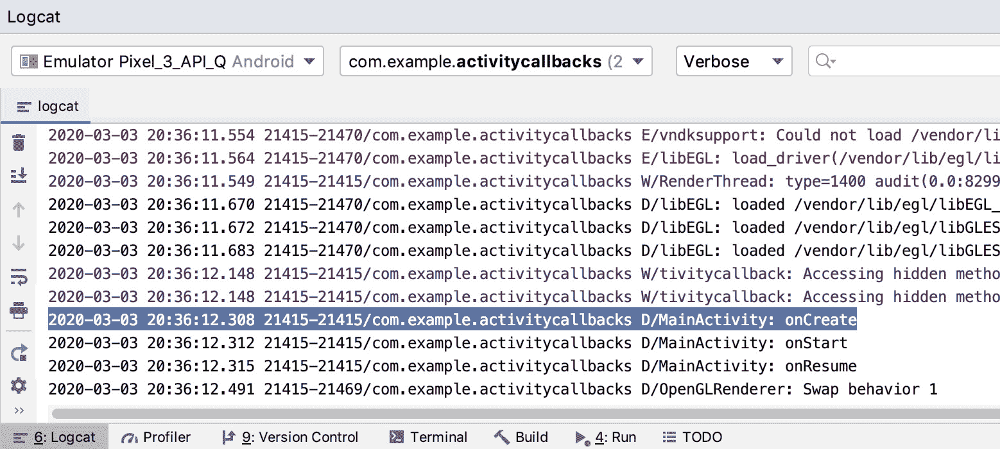
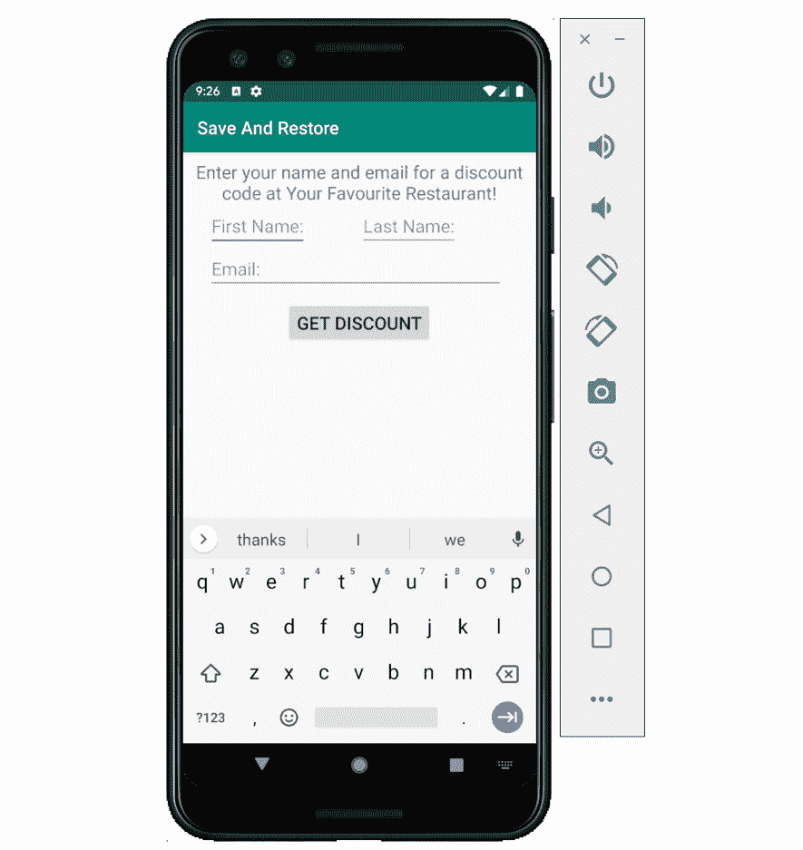
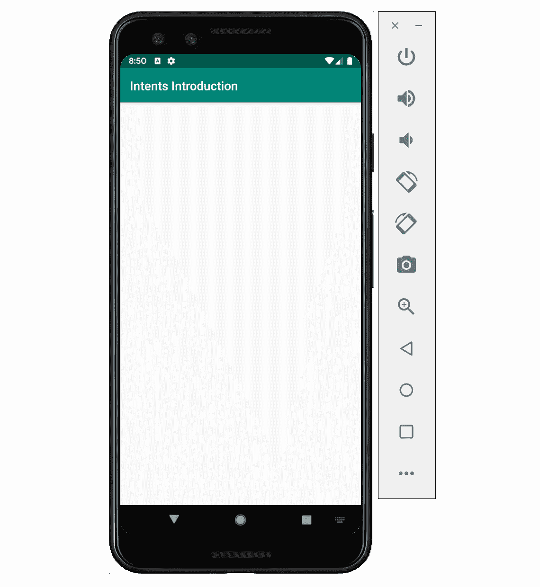
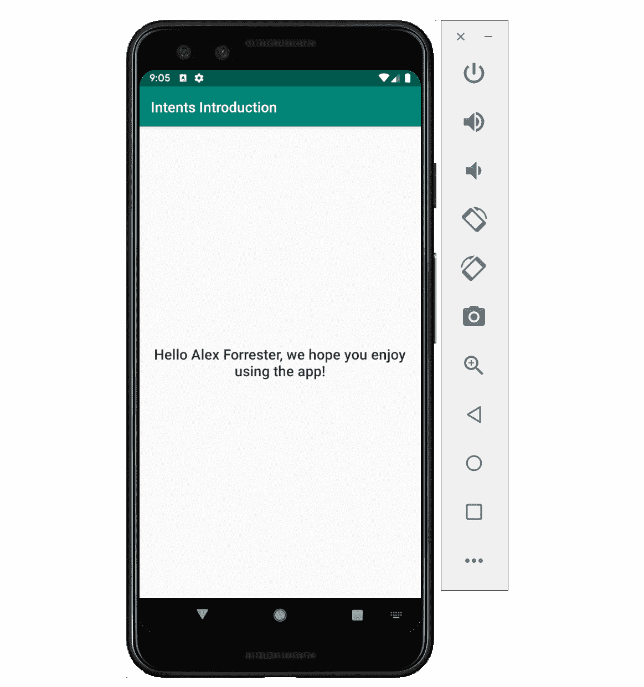
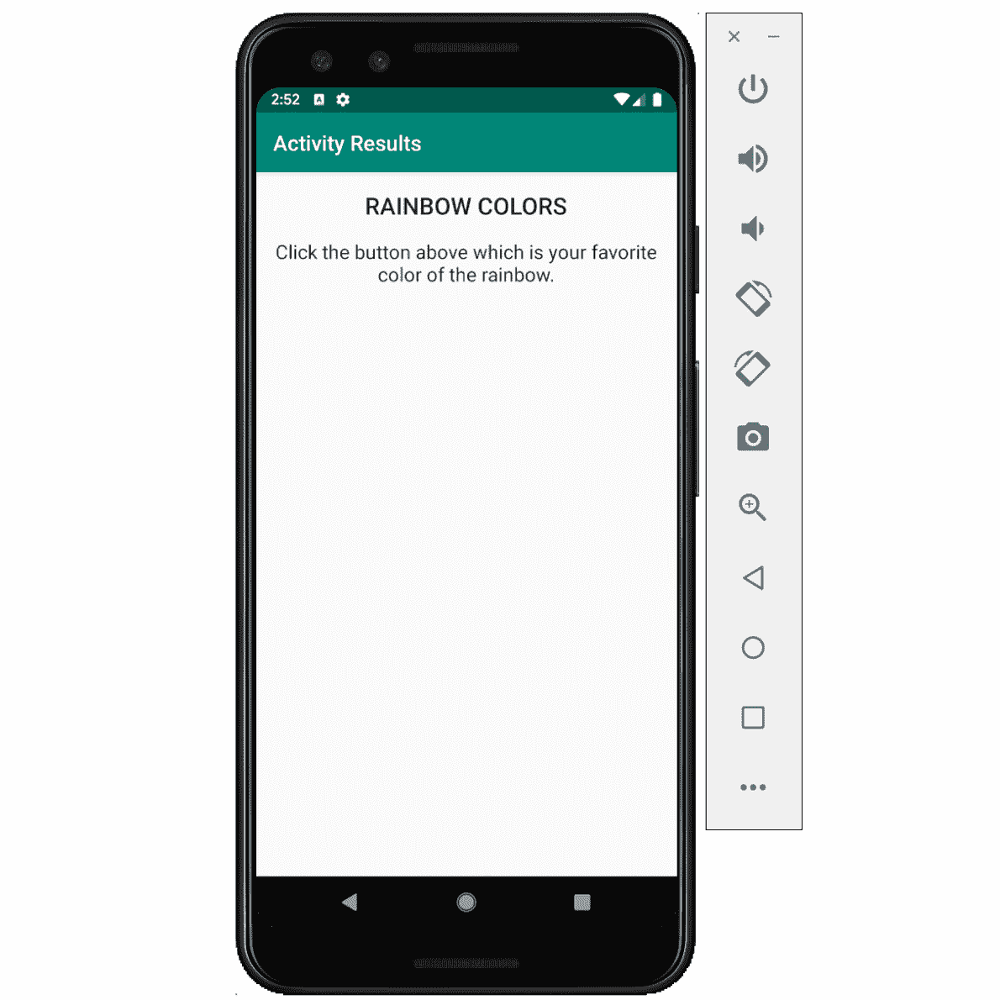
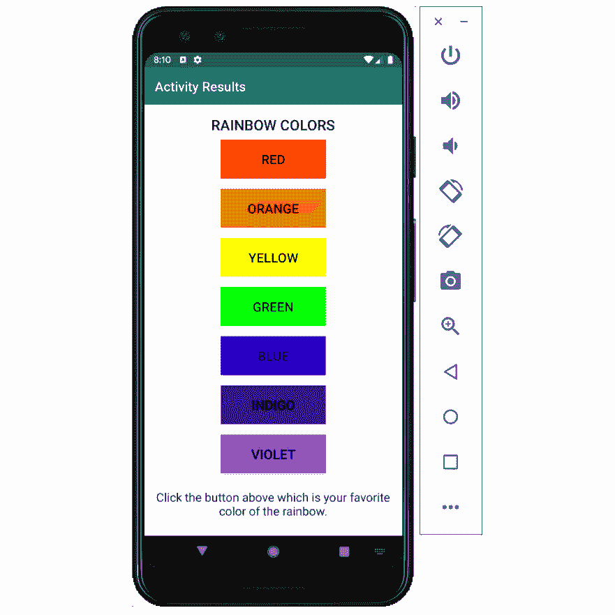
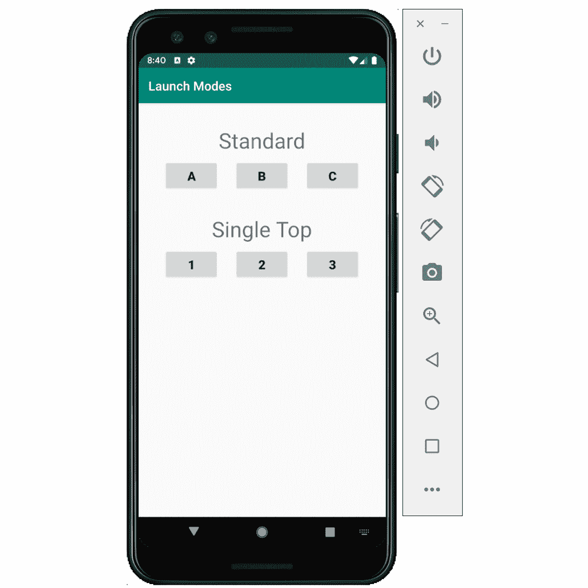

# 二、构建用户屏幕流

概观

本章涵盖了安卓活动生命周期，并解释了安卓系统如何与您的应用交互。到本章结束时，您将学会如何通过不同的屏幕构建用户旅程。您还可以使用活动任务和启动模式，保存和恢复活动状态，使用日志报告应用，以及在屏幕之间共享数据。

# 简介

上一章向您介绍了安卓开发的核心要素，从使用`AndroidManifest.xml`文件配置您的应用、使用简单的活动和安卓资源结构，到使用`build.gradle`构建应用并在虚拟设备上运行应用。在本章中，您将进一步了解安卓系统如何在安卓生命周期中与您的应用交互，如何通知您应用状态的变化，以及如何使用安卓生命周期来响应这些变化。然后，您将学习如何通过您的应用创建用户旅程，以及如何在屏幕之间共享数据。将向您介绍实现这些目标的不同技术，以便您能够在自己的应用中使用它们，并在看到它们在其他应用中使用时识别它们。

# 活动生命周期

在前一章中，我们使用`onCreate(saveInstanceState: Bundle?)`方法在屏幕的用户界面中显示布局。现在，我们将更详细地探讨安卓系统如何与您的应用交互来实现这一点。一个活动一启动，它就会经历一系列的步骤来完成初始化，并准备将其显示为部分显示，然后完全显示。还有一些步骤对应于你的应用被隐藏、后台化，然后被销毁。这个过程被称为**活动生命周期**。对于这些步骤中的每一步，都有一个**回调**，您的活动可以使用它来执行一些操作，例如在您的应用被放入后台时创建和更改显示并保存数据，然后在您的应用回到前台后恢复这些数据。您可以将这些回调视为系统如何与您的活动/屏幕交互的钩子。

每个活动都有其扩展的父活动类。这些回调是在活动的父级上进行的，由您决定是否需要在自己的活动中实现它们来采取相应的操作。这些回调函数都有`override`关键字。Kotlin 中的`override`关键字意味着要么这个函数提供了一个接口或者一个抽象方法的实现，要么，对于这里的 Activity，它是一个子类，它提供的实现将覆盖它的父类。

现在您已经了解了**活动生命周期**的一般工作方式，让我们更详细地了解一下您将按顺序处理的主要回调，从创建活动到销毁活动:

*   `override fun onCreate(savedInstanceState: Bundle?)`:这是你画全尺寸屏幕的活动最常用的回调。您可以在这里准备要显示的活动布局。在这个阶段，方法完成后，它仍然不会显示给用户，尽管如果不实现任何其他回调，它会以这种方式出现。您通常通过调用`setContentView`方法`setContentView(R.layout.activity_main`在这里设置您的活动的用户界面，并执行任何所需的初始化。除非再次创建活动，否则该方法在其**生命周期**中只调用一次。默认情况下，某些操作会发生这种情况(例如，将手机从纵向旋转到横向)。`Bundle?`类型的`savedInstanceState`参数(`?`表示该类型可以为空)最简单的形式是一个键值对的映射，该映射被优化以保存和恢复数据。如果这是应用启动后第一次运行活动，或者是第一次创建或重新创建活动而未保存任何状态，则该值为空。如果在重新创建活动之前已经保存在`onSaveInstanceState(outState: Bundle?)`回调中，它可能包含一个保存的状态。
*   `override fun onRestart()`:活动重启时，紧接在`onStart()`之前调用。明确重新启动活动和重新创建活动之间的区别非常重要。当按下主页按钮使活动成为背景时，例如，当它再次回到前景时，将调用`onRestart()`。重新创建活动是发生配置更改时发生的情况，例如设备正在旋转。活动完成，然后再次创建。
*   `override fun onStart()`:这是活动第一次出现时的回调。此外，在通过按下“后退”、“主页”或`recents/overview`硬件按钮来后台化应用后，在从`recents/overview`菜单或启动器中再次选择应用时，该功能将运行。这是第一个可见的生命周期方法。
*   `override fun onRestoreInstanceState(savedInstanceState: Bundle?)`:如果状态已经使用`onSaveInstanceState(outState: Bundle?)`保存，这是系统在`onStart()`之后调用的方法，在这里您可以检索`Bundle`状态，而不是在`onCreate(savedInstanceState: Bundle?)`期间恢复状态
*   `override fun onResume()`:这个回调是作为第一次创建活动的最后阶段运行的，也是在应用被后台化然后被带到前台的时候运行的。完成此回调后，屏幕/活动就可以使用了，接收用户事件并做出响应。
*   `override fun onSaveInstanceState(outState: Bundle?)`:如果想保存活动的状态，这个功能可以做到。根据数据类型，您可以使用其中一个便利函数来添加键值对。如果您的活动在`onCreate(saveInstanceState: Bundle?)`和`onRestoreInstanceState(savedInstanceState: Bundle?)`中重新创建，数据将可用。
*   `override fun onPause()`:当活动开始后台化或者另一个对话框或活动进入前台时，调用该功能。
*   `override fun onStop()`:当活动被隐藏时调用这个函数，要么是因为它被后台处理，要么是因为另一个活动在它上面被启动。
*   `override fun onDestroy()`:当系统资源不足时，当在 Activity 上显式调用`finish()`时，或者更常见的是，当 Activity 被用户通过最近/概览按钮关闭应用时，系统会调用该函数来终止 Activity。

现在您已经理解了这些常见的生命周期回调的作用，让我们实现它们，看看它们何时被调用。

## 练习 2.01:记录活动回调

让我们用一个空的活动创建一个名为*活动回调*的应用，就像您之前在*第 1 章*、*创建您的第一个应用*中所做的那样。本练习的目的是记录活动回调以及它们在常见操作中出现的顺序:

1.  After the application has been created, `MainActivity` will appear as follows:

    ```kt
    package com.example.activitycallbacks
    import androidx.appcompat.app.AppCompatActivity
    import android.os.Bundle
    class MainActivity : AppCompatActivity() {
        override fun onCreate(savedInstanceState: Bundle?) {
            super.onCreate(savedInstanceState)
            setContentView(R.layout.activity_main)
        }
    }
    ```

    为了验证回调的顺序，让我们在每个回调的末尾添加一个日志语句。要准备记录活动，通过在`import`语句中添加`import android.util.Log`来导入安卓日志包。然后，向类中添加一个常量来标识您的活动。Kotlin中的常量由`const`关键字标识，可以在顶级(类外)或类内的对象中声明。如果要求顶级常量是公共的，则通常使用顶级常量。对于私有常量，Kotlin 提供了一种通过声明伴随对象向类添加静态功能的便捷方法。在`onCreate(savedInstanceState: Bundle?)`下方的班级底部添加以下内容:

    ```kt
    companion object {
        private const val TAG = "MainActivity"
    }
    ```

    然后在`onCreate(savedInstanceState: Bundle?)`末尾增加一条日志语句:

    ```kt
    Log.d(TAG, "onCreate")
    ```

    我们的活动现在应该有以下代码:

    ```kt
    package com.example.activitycallbacks
    import android.os.Bundle
    import android.util.Log
    import androidx.appcompat.app.AppCompatActivity
    class MainActivity : AppCompatActivity() {
        override fun onCreate(savedInstanceState: Bundle?) {
            super.onCreate(savedInstanceState)
            setContentView(R.layout.activity_main)
            Log.d(TAG, "onCreate")
        }
        companion object {
            private const val TAG = "MainActivity"
        }
    }
    ```

    前面日志语句中的`d`指的是*调试*。有六种不同的日志级别可以用来输出从最少到最重要的消息信息- `v`表示*详细*、`d`表示*调试*、`i`表示*信息*、`w`表示*警告*、`e`表示*错误*、`wtf`表示*多么可怕的失败*。(最后一个日志级别突出显示了一个永远不会发生的异常。)

    ```kt
            Log.v(TAG, "verbose message")
            Log.d(TAG, "debug message")
            Log.i(TAG, "info message")
            Log.w(TAG, "warning message")
            Log.e(TAG, "error message")
            Log.wtf(TAG, "what a terrible failure message")
    ```

2.  现在，让我们看看日志在AndroidStudio是如何显示的。打开`Logcat`窗口。点击屏幕底部的`Logcat`选项卡即可进入，也可通过进入`View` | `Tool Windows` | `Logcat`从工具栏进入。
3.  Run the app on the virtual device and examine the `Logcat` window output. You should see the log statement you have added formatted like the following line in *Figure 2.1*:

    

    图 2.1:日志目录中的日志输出

4.  Log statements can be quite difficult to interpret at first glance, so let's break down the following statement into its separate parts:

    ```kt
    2020-03-03  20:36:12.308  21415-21415/com.example.activitycallbacks D/MainActivity: onCreate
    ```

    让我们详细检查日志语句的元素:

    

    图 2.2:解释日志语句的表格

    您可以通过将日志过滤器从`Debug`更改为下拉菜单中的其他选项来检查不同日志级别的输出。如果选择`Verbose`，顾名思义，会看到很多输出。

5.  What's great about the `TAG` option of the log statement is that it enables you to filter the log statements that are reported in the `Logcat` window of Android Studio by typing in the text of the tag, as shown in *Figure 2.3*:

    

    图 2.3:按标记名过滤日志语句

    因此，如果您正在调试活动中的问题，您可以键入`TAG`名称，并将日志添加到您的活动中，以查看日志语句的顺序。这就是您接下来要做的，实现主体活动回调，并向每个回调添加一个日志语句，以查看它们何时运行。

6.  将光标放在`onCreate(savedInstanceState: Bundle?)`函数右大括号后的新行上，然后用 log 语句添加`onRestart()`回调。确保您呼叫到`super.onRestart()`，以便活动回调的现有功能按预期工作:

    ```kt
    override fun onRestart() {
        super.onRestart()
        Log.d(TAG, "onRestart")
    }
    ```

7.  You will find that once you start typing the name of the function, Android Studio's autocomplete feature will suggest options for the name of the function you want to override.

    注意

    在AndroidStudio中，你可以开始输入一个函数的名称，自动完成选项会弹出，并给出函数覆盖的建议。或者，如果您转到顶部菜单，然后选择`Code` | `Generate` | `Override methods`，您可以选择要覆盖的方法。

    对以下所有回调函数执行此操作:

    ```kt
    onCreate(savedInstanceState: Bundle?)
    onRestart()
    onStart()
    onRestoreInstanceState(savedInstanceState: Bundle?)
    onResume()
    onPause()
    onStop()
    onSaveInstanceStateoutState: Bundle?)
    onDestroy()
    ```

8.  Your Activity should now have the following code (truncated here). You can see the full code on GitHub at [http://packt.live/38W7jU5](http://packt.live/38W7jU5 )

    完成的活动现在将用您的实现覆盖回调，这将添加一条日志消息:

    ```kt
    package com.example.activitycallbacks
    import android.os.Bundle
    import android.util.Log
    import androidx.appcompat.app.AppCompatActivity
    class MainActivity : AppCompatActivity() {
        override fun onCreate(savedInstanceState: Bundle?) {
            super.onCreate(savedInstanceState)
            setContentView(R.layout.activity_main)
            Log.d(TAG, "onCreate")
        }
        override fun onRestart() {
            super.onRestart()
            Log.d(TAG, "onRestart")
        }
        //Remaining callbacks follow: see github link above
        companion object {
            private const val TAG = "MainActivity"
        }
    }
    ```

9.  Run the app, and then once it has loaded, as in *Figure 2.4*, look at the `Logcat` output; you should see the following log statements (this is a shortened version):

    ```kt
    D/MainActivity: onCreate
    D/MainActivity: onStart
    D/MainActivity: onResume
    ```

    活动已经创建、启动，然后准备好供用户进行交互:

    

    图 2.4:应用加载并显示主要活动

10.  Press the round home button in the center of the bottom navigation controls and background the app. You should now see the following Logcat output:

    ```kt
    D/MainActivity: onPause
    D/MainActivity: onStop
    D/MainActivity: onSaveInstanceState
    ```

    对于目标低于安卓派(API 28)的应用，那么`onSaveInstanceState(outState: Bundle?)`也可以在`onPause()`或`onStop()`之前调用。

11.  Now, bring the app back into the foreground by pressing the recents/overview button (usually a square or three vertical lines) on the right and selecting the app, or by going to the launcher and opening the app. You should now see the following:

    ```kt
    D/MainActivity: onRestart
    D/MainActivity: onStart
    D/MainActivity: onResume
    ```

    活动已重新启动。你可能已经注意到`onRestoreInstanceState(savedInstanceState: Bundle)`函数没有被调用。这是因为活动没有被销毁和重新创建。

12.  按下底部导航控件左侧的三角形后退按钮(也可能在右侧)，您将看到活动被销毁。您也可以通过按下最近/概览按钮，然后向上滑动应用来终止活动。这是输出:

    ```kt
    D/MainActivity: onPause
    D/MainActivity: onStop
    D/MainActivity: onDestroy
    ```

13.  Launch your app again and then rotate the phone. You might find that the phone does not rotate and the display is sideways. If this happens drag down the status bar at the very top of the virtual device and select the auto-rotate button 2nd from the right in the settings.

    

    图 2.5:选择了无线网络和自动旋转按钮的快速设置栏

    您应该会看到以下回调:

    ```kt
    D/MainActivity: onCreate
    D/MainActivity: onStart
    D/MainActivity: onResume
    D/MainActivity: onPause
    D/MainActivity: onStop
    D/MainActivity: onSaveInstanceState
    D/MainActivity: onDestroy
    D/MainActivity: onCreate
    D/MainActivity: onStart
    D/MainActivity: onRestoreInstanceState
    D/MainActivity: onResume
    ```

    请注意，如步骤 11 所述，`onSaveInstanceState(outState: Bundle?)`回调的顺序可能会有所不同。

14.  Configuration changes, such as rotating the phone, by default recreate the activity. You can choose not to handle certain configuration changes in the app, which will then not recreate the activity. To do this for rotation, add `android:configChanges="orientation|screenSize|screenLayout"` to `MainActivity` in the `AndroidManifest.xml` file. Launch the app and then rotate the phone, and these are the only callbacks that you have added to `MainActivity` that you will see:

    ```kt
    D/MainActivity: onCreate
    D/MainActivity: onStart
    D/MainActivity: onResume
    ```

    对于不同的安卓应用编程接口级别，检测屏幕方向变化的`orientation`和`screenSize`值具有相同的功能。`screenLayout`值检测可折叠手机上可能发生的其他布局变化。这些是您可以选择自己处理的一些配置更改(另一个常见的是`keyboardHidden`对访问键盘的更改做出反应)。系统仍会通过以下回拨通知应用这些更改:

    ```kt
    override fun onConfigurationChanged(newConfig: Configuration) {
        super.onConfigurationChanged(newConfig)
        Log.d(TAG, "onConfigurationChanged")
    }
    ```

    如果你把这个回调函数添加到`MainActivity`中，并且你已经在清单中把`android:configChanges="orientation|screenSize|screenLayout"`添加到`MainActivity`中，你会看到它在旋转时被调用。

在本练习中，您已经了解了主要的 Activity 回调，以及当用户通过系统与`MainActivity`的交互对您的应用执行常见操作时，它们是如何运行的。在下一节中，您将讨论保存状态和恢复状态，以及查看活动生命周期如何工作的更多示例。

# 保存和恢复活动状态

在本节中，您将探索活动如何保存和恢复状态。正如您在上一节中了解到的，配置更改(如旋转手机)会导致重新创建活动。如果系统为了释放内存而不得不关闭你的应用，这种情况也会发生。在这些场景中，重要的是保持活动的状态，然后恢复它。在接下来的两个练习中，您将通过一个示例来确保在填写表单后根据用户数据创建和填充`TextView`时恢复用户数据。

## 练习 2.02:保存和恢复布局中的状态

在本练习中，首先创建一个名为*的应用，用一个空活动保存和恢复*。您将要创建的应用将有一个简单的表单，如果用户输入一些个人详细信息(实际信息不会发送到任何地方，因此您的数据是安全的)，该表单将为用户最喜欢的餐厅提供折扣代码:

1.  打开`strings.xml`文件(位于`app` | `src` | `main` | `res` | `values` | `strings.xml`)并创建应用所需的以下字符串:

    ```kt
    <resources>
        <string name="app_name">Save And Restore</string>
        <string name="header_text">Enter your name and email       for a discount code at Your Favorite Restaurant!        </string>
        <string name="first_name_label">First Name:</string>
        <string name="email_label">Email:</string>
        <string name="last_name_label">Last Name:</string>
        <string name="discount_code_button">GET DISCOUNT</string>
        <string name="discount_code_confirmation">Your       discount code is below %s. Enjoy!</string>
    </resources>
    ```

2.  You are also going to specify some text sizes, layout margins, and padding directly, so create the `dimens.xml` file in the `app` | `src` | `main` | `res` | `values` folder and add the dimensions you'll need for the app (you can do this by right-clicking on the `res` | `values` folder within Android Studio and selecting `New` `values`):

    ```kt
    <?xml version="1.0" encoding="utf-8"?>
    <resources>
        <dimen name="grid_4">4dp</dimen>
        <dimen name="grid_8">8dp</dimen>
        <dimen name="grid_12">12dp</dimen>
        <dimen name="grid_16">16dp</dimen>
        <dimen name="grid_24">24dp</dimen>
        <dimen name="grid_32">32dp</dimen>
        <dimen name="default_text_size">20sp</dimen>
        <dimen name="discount_code_text_size">20sp</dimen>
    </resources>
    ```

    这里，您指定了练习中需要的所有尺寸。你会在这里看到`default_text_size`和`discount_code_text_size`是在`sp`指定的。它们代表与密度无关的像素相同的值，密度无关的像素不仅根据运行应用的设备的密度定义大小测量，还根据用户的偏好更改文本大小，在`Settings` | `Display` | `Font style`中定义(这可能是`Font size and style`或类似的东西，取决于您使用的确切设备)。

3.  In `R.layout.activity_main`, add the following XML, creating a containing layout file and adding header a `TextView` with the `Enter your name and email for a discount code at Your Favorite Restaurant!` text. This is done by adding the `android:text` attribute with the `@string/header_text` value:

    ```kt
    <?xml version="1.0" encoding="utf-8"?>
    <androidx.constraintlayout.widget.ConstraintLayout 
        xmlns:android="http://schemas.android.com/apk/res/android"
        xmlns:app="http://schemas.android.com/apk/res-auto"
        xmlns:tools="http://schemas.android.com/tools"
        android:layout_width="match_parent"
        android:layout_height="match_parent"
        android:padding="@dimen/grid_4"
        android:layout_marginTop="@dimen/grid_4"
        tools:context=".MainActivity">
        <TextView
            android:id="@+id/header_text"
            android:gravity="center"
            android:textSize="@dimen/default_text_size"
            android:paddingStart="@dimen/grid_8"
            android:paddingEnd="@dimen/grid_8"
            android:layout_width="wrap_content"
            android:layout_height="wrap_content"
            android:text="@string/header_text"
            app:layout_constraintTop_toTopOf="parent"
            app:layout_constraintEnd_toEndOf="parent"
            app:layout_constraintStart_toStartOf="parent"/>
    </androidx.constraintlayout.widget.ConstraintLayout>
    ```

    您正在使用`ConstraintLayout`来约束父视图和同级视图的视图。

    虽然您通常应该使用样式来指定视图的显示，但是您可以直接在 XML 中这样做，就像这里对一些属性所做的那样。`android:textSize`属性的值是`@dimen/default_text_size`，在前面的代码块中定义，用来避免重复，可以在一个地方改变所有的文本大小。使用样式是设置文本大小的首选选项，因为您将获得合理的默认值，并且可以覆盖样式中的值，或者像您在这里所做的那样，覆盖单个视图中的值。

    影响定位的其他属性也在视图中直接指定。最常见的是填充和边距。填充应用于视图内部，是文本和边框之间的空间。边距在视图的外侧指定，是与视图外边缘的距离。例如，`ConstraintLayout`中的`android:padding`设置视图的填充，所有边都有指定的值。或者，您可以使用`android:paddingTop`、`android:paddingBottom`、`android:paddingStart`和`android:paddingEnd`指定视图四条边之一的填充。此模式也存在以指定边距，因此`android:layout_margin`指定视图所有四条边的边距值，`android:layoutMarginTop`、`android:layoutMarginBottom`、`android:layoutMarginStart`和`android:layoutMarginEnd`允许设置单个边的边距。

    对于低于 17 的 API 级别(并且您的应用支持低至 16)，如果您使用`android:layoutMarginStart`还必须添加`android:layoutMarginLeft`，如果您使用`android:layoutMarginEnd`还必须添加`android:layoutMarginRight`。为了在整个应用中保持一致性和统一性，您可以将边距和填充值定义为包含在`dimens.xml`文件中的尺寸。

    要在视图中定位内容，可以指定`android:gravity`。`center`值在视图中垂直和水平约束内容。

4.  Next, add three `EditText` views below the `header_text` for the user to add their first name, last name, and email:

    ```kt
        <EditText
            android:id="@+id/first_name"
            android:textSize="@dimen/default_text_size"
            android:layout_marginStart="@dimen/grid_24"
            android:layout_marginLeft="@dimen/grid_24"
            android:layout_marginEnd="@dimen/grid_16"
            android:layout_marginRight="@dimen/grid_16"
            android:layout_width="wrap_content"
            android:layout_height="wrap_content"
            android:hint="@string/first_name_label"
            android:inputType="text"
            app:layout_constraintTop_toBottomOf="@id/header_text"
            app:layout_constraintStart_toStartOf="parent" />
        <EditText
            android:textSize="@dimen/default_text_size"
            android:layout_marginEnd="@dimen/grid_24"
            android:layout_marginRight="@dimen/grid_24"
            android:layout_width="wrap_content"
            android:layout_height="wrap_content"
            android:hint="@string/last_name_label"
            android:inputType="text"
            app:layout_constraintTop_toBottomOf="@id/header_text"
            app:layout_constraintStart_toEndOf="@id/first_name"
            app:layout_constraintEnd_toEndOf="parent" />
        <!-- android:inputType="textEmailAddress" is not enforced, 
          but is a hint to the IME (Input Method Editor) usually a 
          keyboard to configure the display for an email - 
          typically by showing the '@' symbol -->
        <EditText
            android:id="@+id/email"
            android:textSize="@dimen/default_text_size"
            android:layout_marginStart="@dimen/grid_24"
            android:layout_marginLeft="@dimen/grid_24"
            android:layout_marginEnd="@dimen/grid_32"
            android:layout_marginRight="@dimen/grid_32"
            android:layout_width="match_parent"
            android:layout_height="wrap_content"
            android:hint="@string/email_label"
            android:inputType="textEmailAddress"
            app:layout_constraintTop_toBottomOf="@id/first_name"
            app:layout_constraintEnd_toEndOf="parent"
            app:layout_constraintStart_toStartOf="parent" />
    ```

    `EditText`字段具有`inputType`属性，用于指定可以输入表单字段的输入类型。有些值，如`EditText`上的`number`，限制了可以输入到字段中的输入，在选择字段时，建议如何显示键盘。其他的，如`android:inputType="textEmailAddress"`，将不会强制一个`@`符号被添加到表单域中，但是会给键盘一个提示来显示它。

5.  Finally, add a button for the user to press to generate a discount code, and display the discount code itself and a confirmation message:

    ```kt
        <Button
            android:id="@+id/discount_button"
            android:textSize="@dimen/default_text_size"
            android:layout_marginTop="@dimen/grid_12"
            android:gravity="center"
            android:layout_width="wrap_content"
            android:layout_height="wrap_content"
            android:text="@string/discount_code_button"
            app:layout_constraintTop_toBottomOf="@id/email"
            app:layout_constraintEnd_toEndOf="parent"
            app:layout_constraintStart_toStartOf="parent"/>
        <TextView
            android:id="@+id/discount_code_confirmation"
            android:gravity="center"
            android:textSize="@dimen/default_text_size"
            android:paddingStart="@dimen/grid_16"
            android:paddingEnd="@dimen/grid_16"
            android:layout_marginTop="@dimen/grid_8"
            android:layout_width="match_parent"
            android:layout_height="wrap_content"
            app:layout_constraintTop_toBottomOf="@id/discount_button"
            app:layout_constraintEnd_toEndOf="parent"
            app:layout_constraintStart_toStartOf="parent"
            tools:text="Hey John Smith! Here is your discount code" />
        <TextView
            android:id="@+id/discount_code"
            android:gravity="center"
            android:textSize="@dimen/discount_code_text_size"
            android:textStyle="bold"
            android:layout_marginTop="@dimen/grid_8"
            android:layout_width="match_parent"
            android:layout_height="wrap_content"
            app:layout_constraintTop_toBottomOf="@id/discount_code           _confirmation"
            app:layout_constraintEnd_toEndOf="parent"
            app:layout_constraintStart_toStartOf="parent"
            tools:text="XHFG6H9O" />
    ```

    也有一些你以前没见过的属性。在 xml 布局文件顶部指定的工具名称空间`xmlns:tools="http://schemas.android.com/tools"`启用了某些功能，这些功能可以在创建应用时用来帮助配置和设计。当您构建应用时，这些属性会被移除，因此它们不会影响应用的整体大小。您正在使用`tools:text`属性来显示通常会显示在表单字段中的文本。当您从AndroidStudio的`Code`视图中查看 XML 切换到`Design`视图时，这很有帮助，因为您可以看到您的布局在设备上的大致显示方式。

6.  Run the app and you should see the output displayed in *Figure 2.6*:

    

    图 2.6:第一次启动时的活动屏幕

7.  Enter some text into each of the form fields:

    

    图 2.7:编辑文本字段被填充

8.  Now, use the second rotate button in the virtual device controls () to rotate the phone 90 degrees to the right:

    

    图 2.8:虚拟设备转向横向

    你能发现发生了什么吗？不再设置`Last Name`字段值。它在重新创建活动的过程中丢失了。这是为什么？嗯，在`EditText`字段的情况下，如果字段上设置了标识，安卓框架会保留字段的状态。

9.  回到`activity_main.xml`布局文件，在`EditText`字段

    ```kt
    <EditText
        android:id="@+id/last_name"
        android:textSize="@dimen/default_text_size"
        android:layout_marginEnd="@dimen/grid_24"
        android:layout_width="wrap_content"
        android:layout_height="wrap_content"
        android:hint="@string/last_name_label"
        android:inputType="text"
        app:layout_constraintTop_toBottomOf="@id/header_text"
        app:layout_constraintStart_toEndOf="@id/first_name"
        app:layout_constraintEnd_toEndOf="parent"
        tools:text="Last Name:"/>
    ```

    中为`Last Name`值添加一个 ID

当您再次运行应用并旋转设备时，它将保留您输入的值。您现在已经看到，您需要在`EditText`字段上设置一个标识来保存状态。对于`EditText`字段，当用户在表单中输入详细信息时，通常会保留配置更改的状态，因此如果字段有标识，这是默认行为。很明显，一旦用户输入了一些文本，您就想要获得`EditText`字段的详细信息，这就是为什么您要设置一个标识，但是为其他字段类型设置一个标识，例如`TextView`，如果您更新它们并且您需要自己保存状态，则不会保留状态。为支持滚动的视图(如`RecyclerView`)设置标识也很重要，因为这样可以在重新创建活动时保持滚动位置。

现在，您已经定义了屏幕布局，但是没有添加任何逻辑来创建和显示折扣代码。在下一个练习中，我们将解决这个问题。

本练习中创建的布局可在[http://packt.live/35RSdgz](http://packt.live/35RSdgz )获得

你可以在[http://packt.live/3p1AZF3](http://packt.live/3p1AZF3)找到整个练习的代码

## 练习 2.03:使用回调保存和恢复状态

本练习的目的是将布局中的所有用户界面元素聚集在一起，以便在用户输入数据后生成折扣代码。为此，您必须在按钮上添加逻辑来检索所有`EditText`字段，然后向用户显示确认，并生成折扣代码:

1.  Open up `MainActivity.kt` and replace the default empty Activity from the project creation. A snippet of the code is shown here, but you'll need to use the link given below to find the full code block you need to add:

    MainActivity.kt 公司

    ```kt
    14  class MainActivity : AppCompatActivity() {
    15
    16    private val discountButton: Button
    17        get() = findViewById(R.id.discount_button)
    18
    19    private val firstName: EditText
    20        get() = findViewById(R.id.first_name)
    21
    22    private val lastName: EditText
    23        get() = findViewById(R.id.last_name)
    24
    25    private val email: EditText
    26        get() = findViewById(R.id.email)
    27  
    28    private val discountCodeConfirmation: TextView
    29        get() = findViewById(R.id             .discount_code_confirmation)
    30
    31    private val discountCode: TextView
    32        get() = findViewById(R.id.discount_code)    
    33  
    34    override fun onCreate(savedInstanceState: Bundle?) {
    35        super.onCreate(savedInstanceState)
    36        setContentView(R.layout.activity_main)
    37        Log.d(TAG, "onCreate")
    ```

    你可以在这里找到完整的代码[http://packt.live/38XcdQS](http://packt.live/38XcdQS)。

    `get() = …`是属性的自定义访问器。

    单击折扣按钮后，从`first_name`和`last_name`字段中检索值，用空格连接它们，然后使用字符串资源格式化折扣代码确认文本。您在`strings.xml`文件中引用的字符串如下:

    ```kt
    <string name="discount_code_confirmation">Hey  %s! Here is   your discount code</string>
    ```

    `%s`值指定检索字符串资源时要替换的字符串值。这是通过在获取字符串时传入全名来实现的:

    ```kt
    getString(R.string.discount_code_confirmation, fullName)
    ```

    代码是使用`java.util`包中的 UUID(通用唯一标识符)库生成的。这将创建一个唯一的 id，然后使用`take()` Kotlin 函数获取前八个字符，然后将其设置为大写。最后，在视图中设置了 discount_code，隐藏了键盘，所有表单字段都设置回初始值。

2.  Run the app and enter some text into the name and email fields, and then click on `GET DISCOUNT`:

    

    图 2.9:用户生成折扣代码后显示的屏幕

    该应用的行为符合预期，显示了确认信息。

3.  Now, rotate the phone (pressing the fifth button down with the arrow on the right-hand side of the virtual device picture) and observe the result:

    

    图 2.10:折扣代码不再显示在屏幕上

    哦，不！折扣代码已消失。`TextView`字段不保留状态，所以您必须自己保存状态。

4.  Go back into `MainActivity.kt` and add the following Activity callbacks:

    ```kt
    override fun onRestoreInstanceState(savedInstanceState:   Bundle) {
        super.onRestoreInstanceState(savedInstanceState)
        Log.d(TAG, "onRestoreInstanceState")
    }
    override fun onSaveInstanceState(outState: Bundle) {
        super.onSaveInstanceState(outState)
        Log.d(TAG, "onSaveInstanceState")
    }
    ```

    正如名称所声明的，这些回调使您能够保存和恢复实例状态。`onSaveInstanceState(outState: Bundle)`允许您在活动被后台处理或销毁时从活动中添加键值对，您可以在`onCreate(savedInstanceState: Bundle?)`或`onRestoreInstanceState(savedInstanceState: Bundle)`中检索键值对。

    因此，一旦设置好状态，就有两个回调来检索状态。如果您在`onCreate(savedInstanceState: Bundle)`中进行大量初始化，那么在重新创建您的活动时，最好使用`onRestoreInstanceState(savedInstanceState: Bundle)`来检索该实例状态。通过这种方式，很清楚哪个状态正在被重新创建。然而，如果需要最小的设置，您可能更喜欢使用`onCreate(savedInstanceState: Bundle)`。

    无论您决定使用两个回调中的哪一个，您都必须获得您在`onSaveInstanceState(outState: Bundle)`调用中设置的状态。对于练习的下一步，您将使用`onRestoreInstanceState(savedInstanceState: Bundle)`。

5.  向`MainActivity`伴随对象添加两个常数:

    ```kt
    private const val DISCOUNT_CONFIRMATION_MESSAGE =   "DISCOUNT_CONFIRMATION_MESSAGE"
    private const val DISCOUNT_CODE = "DISCOUNT_CODE"
    ```

6.  现在，通过在活动中添加以下内容，将这些常量添加为要保存和检索的值的关键字:

    ```kt
        override fun onRestoreInstanceState(
            savedInstanceState: Bundle) {
            super.onRestoreInstanceState(savedInstanceState)
            Log.d(TAG, "onRestoreInstanceState")
            //Get the discount code or an empty           string if it hasn't been set
            discountCode.text = savedInstanceState           .getString(DISCOUNT_CODE,"")
            //Get the discount confirmation message           or an empty string if it hasn't been set
            discountCodeConfirmation.text =          savedInstanceState.getString(            DISCOUNT_CONFIRMATION_MESSAGE,"")
        }
        override fun onSaveInstanceState(outState: Bundle) {
            super.onSaveInstanceState(outState)
            Log.d(TAG, "onSaveInstanceState")
            outState.putString(DISCOUNT_CODE,          discountCode.text.toString())
            outState.putString(DISCOUNT_CONFIRMATION_MESSAGE,          discountCodeConfirmation.text.toString())
        }
    ```

7.  Run the app, enter the values into the `EditText` fields, and then generate a discount code. Then, rotate the device and you will see that the discount code is restored in *Figure 2.11*:

    

图 2.11:屏幕上继续显示折扣代码

在本练习中，您首先看到了如何在配置更改时保持`EditText`字段的状态。您还使用活动生命周期`onSaveInstanceState(outState: Bundle)`和`onCreate(savedInstanceState: Bundle?)` / `onRestoreInstanceState(savedInstanceState: Bundle)`功能保存和恢复了实例状态。这些功能提供了保存和恢复简单数据的方法。安卓框架还提供了`ViewModel`，一个感知生命周期的安卓架构组件。如何保存和恢复这种状态(用`ViewModel`)的机制是由框架管理的，所以不必像前面的例子那样显式管理。您将在*第 10 章*、*安卓架构组件*中学习如何使用该组件。

到目前为止，您已经创建了一个单屏幕应用。虽然简单的应用可以使用一个活动，但您可能希望将您的应用组织到不同的活动中，以处理不同的功能。因此，在下一部分中，您将向应用添加另一个活动，并在这些活动之间导航。

# 活动与意图的相互作用

安卓的一个意图是组件之间的通信机制。在您自己的应用中，很多时候，当当前活动中发生一些动作时，您会希望启动另一个特定的活动。明确指定哪项活动将开始被称为“T2”明确意图“T3”。在其他情况下，您可能想要访问系统组件，例如摄像机。由于您不能直接访问这些组件，您必须发送一个意图，系统会解析该意图以打开摄像机。这些被称为**隐含意图**。为了注册以响应这些事件，必须设置意图过滤器。转到`AndroidManifest.xml`文件，您将看到在`<intent-filter>` XML 元素中设置的两个意图过滤器的示例:

```kt
<activity android:name=".MainActivity">
    <intent-filter>
        <action android:name="android.intent.action.MAIN" />
        <category android:name="android.intent.category.          LAUNCHER" />
    </intent-filter>
</activity>
```

用`<action android:name="android.intent.action.MAIN" />`指定的那个表示这是进入 app 的主要入口点。根据设置的类别，它控制应用启动时首先启动的活动。指定的另一个意图过滤器是`<category android:name="android.intent.category.LAUNCHER" />`，它定义了应用应该出现在启动器中。当两个意图过滤器结合时，定义了当应用从启动器启动时，应该启动`MainActivity`。移除这些意图过滤器中的任何一个都会产生`"Error running 'app': Default Activity not found"`消息。由于该应用没有主入口点，无法上线，这也是你移除`<action android:name="android.intent.action.MAIN". />`时会发生的情况。如果去掉`<category android:name="android.intent.category.LAUNCHER" />`不指定类别，那就无处可发了。

在下一个练习中，您将看到意图如何在您的应用中导航。

## 练习 2.04:意向介绍

本练习的目标是创建一个简单的应用，使用意图根据用户的输入向用户显示文本。在AndroidStudio创建一个新项目，并选择一个空的活动。设置好项目后，进入工具栏，选择`File` | `New` | `Activity` | `Empty` `Activity`。称之为`WelcomeActivity`并保持所有其他默认值不变。它将被添加到`AndroidManifest.xml`文件中，准备使用。现在你添加了`WelcomeActivity`的问题是你如何使用它做任何事情？`MainActivity`在你启动应用的时候就开始了，但是你需要一种方法来启动`WelcomeActivity`，然后，可选地，将数据传递给它，这就是你使用意图的时候:

1.  为了完成这个例子，在`strings.xml`文件中添加以下代码。这些是您将在应用中使用的字符串:

    ```kt
    <resources>
        <string name="app_name">Intents Introduction</string>
        <string name="header_text">Please enter your name and       then we\'ll get started!</string>
        <string name="welcome_text">Hello %s, we hope you enjoy       using the app!</string>
        <string name="full_name_label">Enter your full       name:</string>
        <string name="submit_button_text">SUBMIT</string>
    </resources>
    ```

2.  Next, update the styles in the `themes.xml` file adding the header style.

    ```kt
        <style name="header" parent=      "TextAppearance.AppCompat.Title">
            <item name="android:gravity">center</item>
            <item name="android:layout_marginStart">24dp</item>
            <item name="android:layout_marginEnd">24dp</item>
            <item name="android:layout_marginLeft">24dp</item>
            <item name="android:layout_marginRight">24dp</item>
            <item name="android:textSize">20sp</item>
        </style>
        <!--  continued below -->
    ```

    接下来，添加`fullname`、`button`和`page`样式:

    ```kt
        <style name="full_name" parent=      "TextAppearance.AppCompat.Body1">
            <item name="android:layout_marginTop">16dp</item>
            <item name="android:layout_gravity">center</item>
            <item name="android:textSize">20sp</item>
            <item name="android:inputType">text</item>
        </style>
        <style name="button" parent=      "TextAppearance.AppCompat.Button">
            <item name="android:layout_margin">16dp</item>
            <item name="android:gravity">center</item>
            <item name="android:textSize">20sp</item>
        </style>
        <style name="page">
            <item name="android:layout_margin">8dp</item>
            <item name="android:padding">8dp</item>
        </style>
    ```

    通常，您不会直接在样式本身中指定尺寸。它们应该被引用为`dimens`值，以便它们可以在一个地方更新，更加统一，并且可以被标记来表示维度实际是什么。为了简单起见，这里不做这些。

3.  Next, change the `MainActivity` layout in `activity_main.xml` and add a `TextView` header:

    ```kt
    <?xml version="1.0" encoding="utf-8"?>
    <androidx.constraintlayout.widget.ConstraintLayout 
        xmlns:android="http://schemas.android.com/apk/res/android"
        xmlns:app="http://schemas.android.com/apk/res-auto"
        xmlns:tools="http://schemas.android.com/tools"
        android:layout_width="match_parent"
        android:layout_height="match_parent"
        style="@style/page"
        tools:context=".MainActivity">
        <TextView
            android:id="@+id/header_text"
            style="@style/header"
            android:layout_width="wrap_content"
            android:layout_height="wrap_content"
            android:text="@string/header_text"
            app:layout_constraintTop_toTopOf="parent"
            app:layout_constraintEnd_toEndOf="parent"
            app:layout_constraintStart_toStartOf="parent"/>
    </androidx.constraintlayout.widget.ConstraintLayout>
    ```

    这应该是显示的第一个视图，当它被使用`ConstraintLayout`约束到其父视图的顶部时，它显示在屏幕的顶部。由于它还被约束到其父级的开始和结束，所以当您运行该应用时，它将显示在中间，如图 2.12*所示:*

    

    图 2.12:添加文本视图标题后的初始应用显示

4.  Now, add an `EditText` field for the full name and a `Button` field for the submit button in the `activity_main.xml` file below the `TextView` header:

    ```kt
        <EditText
            android:id="@+id/full_name"
            style="@style/full_name"
            android:layout_width="wrap_content"
            android:layout_height="wrap_content"
            android:hint="@string/full_name_label"
            app:layout_constraintTop_toBottomOf="@id/header_text"
            app:layout_constraintStart_toStartOf="parent"
            app:layout_constraintEnd_toEndOf="parent"/>
        <Button
            android:id="@+id/submit_button"
            style="@style/button"
            android:layout_width="wrap_content"
            android:layout_height="wrap_content"
            android:text="@string/submit_button_text"
            app:layout_constraintTop_toBottomOf="@id/full_name"
            app:layout_constraintEnd_toEndOf="parent"
            app:layout_constraintStart_toStartOf="parent"/>
    ```

    该应用运行时，如图*图 2.13* :

    

    图 2.13:添加编辑文本全名字段和提交按钮后的应用显示

    现在，您需要配置按钮，这样当它被点击时，它会从`EditText`字段中检索用户的全名，然后发送一个意图，这将启动`WelcomeActivity`。

5.  Update the `activity_welcome.xml` layout file to prepare to do this:

    ```kt
    <?xml version="1.0" encoding="utf-8"?>
    <androidx.constraintlayout.widget.ConstraintLayout 
        xmlns:android="http://schemas.android.com/apk/res/android"
        xmlns:app="http://schemas.android.com/apk/res-auto"
        xmlns:tools="http://schemas.android.com/tools"
        android:layout_width="match_parent"
        android:layout_height="match_parent"
        style="@style/page"
        tools:context=".WelcomeActivity">
        <TextView
            android:id="@+id/welcome_text"
            style="@style/header"
            android:layout_width="wrap_content"
            android:layout_height="wrap_content"
            app:layout_constraintTop_toTopOf="parent"
            app:layout_constraintEnd_toEndOf="parent"
            app:layout_constraintStart_toStartOf="parent"
            app:layout_constraintBottom_toBottomOf="parent"
            tools:text="Welcome John Smith we hope you enjoy           using the app!"/>
    </androidx.constraintlayout.widget.ConstraintLayout>
    ```

    您正在添加一个`TextView`字段来显示带有欢迎信息的用户全名。下一步将显示创建全名和欢迎消息的逻辑。

6.  Now, open `MainActivity` and add a constant value above the class header and also update the imports:

    ```kt
    package com.example.intentsintroduction
    import android.content.Intent
    import android.os.Bundle
    import android.widget.Button
    import android.widget.EditText
    import android.widget.Toast
    import androidx.appcompat.app.AppCompatActivity
    const val FULL_NAME_KEY = "FULL_NAME_KEY"
    class MainActivity : AppCompatActivity()… 
    ```

    您将使用常量来设置键，通过在意图中设置它来保存用户的全名。

7.  Then, add the following code to the bottom of `onCreate(savedInstanceState: Bundle?)`:

    ```kt
    findViewById<Button>(R.id.submit_button).setOnClickListener {
        val fullName = findViewById<EditText>(R.id.full_name)      .text.toString().trim()
        if (fullName.isNotEmpty()) {
            //Set the name of the Activity to launch
            Intent(this, WelcomeActivity::class.java)          .also { welcomeIntent ->
                //Add the data
                welcomeIntent.putExtra(FULL_NAME_KEY, fullName)
                //Launch
                startActivity(welcomeIntent)
            }
        } else {
            Toast.makeText(this, getString(          R.string.full_name_label),           Toast.LENGTH_LONG).show()
        }
    }
    ```

    有逻辑检索全名的值，并验证用户是否填写了该值；否则，如果是空白的，将显示一条弹出的祝酒信息。然而，主要的逻辑是采用`EditText`字段的`fullName`值，并创建一个启动`WelcomeActivity`的明确意图。`also`范围函数允许您继续使用您刚刚创建的意图`Intent(this, WelcomeActivity::class.java)`，并通过使用名为**λ表达式**的东西对其进行进一步操作。这里的 lambda 参数有一个默认名称`it`，但是为了清楚起见，我们在这里称之为`welcomeIntent`。然后，使用`welcomeIntent.putExtra(FULL_NAME_KEY, fullName)`行中的 lambda 参数添加`fullName`字段，使用`FULL_NAME_KEY`作为键，使用`fullName`作为意图所包含的额外值。

    然后，你用意图开始`WelcomeActivity`。

8.  Now, run the app, enter your name, and press `SUBMIT`, as shown in *Figure 2.14*:

    

    图 2.14:未处理意图附加数据时显示的默认屏幕

    嗯，那不是很令人印象深刻。您已经添加了发送用户名但不显示用户名的逻辑。

9.  To enable this, please open `WelcomeActivity` and add the following to the bottom of the `onCreate(savedInstanceState: Bundle?)` callback:

    ```kt
    //Get the intent which started this activity
    intent?.let {
        //Set the welcome message
        val fullName = it.getStringExtra(FULL_NAME_KEY)
        findViewById<TextView>(R.id.welcome_text).text =
          getString(R.string.welcome_text, fullName)
    }
    ```

    我们引用以`intent?.let{} which`开始活动的意图，指定如果意图不为空，将运行`let`块，`let`是一个作用域函数，在该函数中，您可以使用默认的 lambda 参数`it`引用上下文对象。这意味着在使用变量之前，不必赋值。您可以使用`it`引用意图，然后通过获取字符串`FULL_NAME_KEY`额外键来检索从`MainActivity`意图传递的字符串值。然后通过从资源中获取字符串并传递从意图中检索的`fullname`值来格式化`<string name="welcome_text">Hello %s, we hope you enjoy using the app!</string>`资源字符串。最后，这被设置为`TextView`的文本。

10.  Run the app again, and a simple greeting will be displayed, as in *Figure 2.15*:

    

图 2.15:显示用户欢迎消息

这个练习虽然在布局和用户交互方面非常简单，但是允许演示一些核心的意图原则。您将使用它们来添加导航，并创建从应用的一个部分到另一个部分的用户流。在下一节中，您将看到如何使用意图来启动活动并从中接收结果。

## 练习 2.05:从活动中检索结果

对于某些用户流，您将仅出于从活动中检索结果的唯一目的而启动活动。这种模式通常用于请求使用特定功能的权限，弹出一个对话框，询问用户是否允许访问联系人、日历等，然后将是或否的结果报告给呼叫活动。在本练习中，您将要求用户选择他们最喜欢的彩虹颜色，一旦选择，就在呼叫活动中显示结果:

1.  创建一个名为`Activity Results`的新项目，并将以下字符串添加到`strings.xml`文件中:

    ```kt
        <string name="header_text_main">Please click the button       below to choose your favorite color of the rainbow!        </string>
        <string name="header_text_picker">Rainbow Colors</string>
        <string name="footer_text_picker">Click the button       above which is your favorite color of the rainbow.        </string>
        <string name="color_chosen_message">%s is your favorite       color!</string>
        <string name="submit_button_text">CHOOSE COLOR</string>
        <string name="red">RED</string>
        <string name="orange">ORANGE</string>
        <string name="yellow">YELLOW</string>
        <string name="green">GREEN</string>
        <string name="blue">BLUE</string>
        <string name="indigo">INDIGO</string>
        <string name="violet">VIOLET</string>
        <string name="unexpected_color">Unexpected color</string>
    ```

2.  将以下颜色添加到 colors.xml

    ```kt
        <!--Colors of the Rainbow -->
        <color name="red">#FF0000</color>
        <color name="orange">#FF7F00</color>
        <color name="yellow">#FFFF00</color>
        <color name="green">#00FF00</color>
        <color name="blue">#0000FF</color>
        <color name="indigo">#4B0082</color>
        <color name="violet">#9400D3</color>
    ```

3.  Add the relevant new styles to the `themes.xml` file. A snippet is shown below, but you'll need to follow the link given to see all the code that you need to add:

    主题. xml

    ```kt
    11    <!-- Style for page header on launch screen -->
    12    <style name="header" parent=        "TextAppearance.AppCompat.Title">
    13        <item name="android:gravity">center</item>
    14        <item name="android:layout_marginStart">24dp</item>
    15        <item name="android:layout_marginEnd">24dp</item>
    16        <item name="android:layout_marginLeft">24dp</item>
    17        <item name="android:layout_marginRight">24dp</item>
    18        <item name="android:textSize">20sp</item>
    19    </style>
    20
    21    <!-- Style for page header on rainbow color         selection screen -->
    22    <style name="header.rainbows" parent="header">
    23        <item name="android:textSize">22sp</item>
    24        <item name="android:textAllCaps">true</item>
    25    </style>
    ```

    你可以在这里找到完整的代码[http://packt.live/39J0qES](http://packt.live/39J0qES)。

    注意

    为简单起见，尺寸没有添加到`dimens.xml`中。

4.  现在，您必须设置活动，该活动将设置您在`MainActivity`中收到的结果。转到`File` | `New` | `Activity` | `EmptyActivity`并创建一个名为`RainbowColorPickerActivity`的活动。
5.  更新`activity_main.xml`布局文件，显示一个标题、一个按钮，然后显示一个隐藏的`android:visibility="gone"`视图，当报告结果时，该视图将变为可见，并设置用户喜欢的彩虹颜色:

    ```kt
    <?xml version="1.0" encoding="utf-8"?>
    <androidx.constraintlayout.widget.ConstraintLayout 
        xmlns:android="http://schemas.android.com/apk/res/android"
        xmlns:app="http://schemas.android.com/apk/res-auto"
        xmlns:tools="http://schemas.android.com/tools"
        android:layout_width="match_parent"
        android:layout_height="match_parent"
        style="@style/page"
        tools:context=".MainActivity">
        <TextView
            android:id="@+id/header_text"
            style="@style/header"
            android:layout_width="wrap_content"
            android:layout_height="wrap_content"
            android:text="@string/header_text_main"
            app:layout_constraintTop_toTopOf="parent"
            app:layout_constraintEnd_toEndOf="parent"
            app:layout_constraintStart_toStartOf="parent"/>
        <Button
            android:id="@+id/submit_button"
            style="@style/button"
            android:layout_width="wrap_content"
            android:layout_height="wrap_content"
            android:text="@string/submit_button_text"
            app:layout_constraintTop_toBottomOf="@id/header_text"
            app:layout_constraintEnd_toEndOf="parent"
            app:layout_constraintStart_toStartOf="parent"/>
        <TextView
            android:id="@+id/rainbow_color"
            style="@style/color_block"
            android:visibility="gone"
            app:layout_constraintTop_toBottomOf="@id/          submit_button"
            app:layout_constraintStart_toStartOf="parent"
            app:layout_constraintEnd_toEndOf="parent"
            tools:text="This is your favorite color of the           rainbow"/>
    </androidx.constraintlayout.widget.ConstraintLayout>
    ```

6.  您将使用`startActivityForResult(Intent intent, int requestCode)`功能从您启动的活动中获得结果。为了保证你得到的结果是来自你期望的操作，你必须设置`requestCode`。为请求代码添加这个常量，并为我们想要在意图中使用的值设置另外两个键，以及 MainActivity 中类头上方的默认颜色，这样它就以包名和导入显示如下:

    ```kt
    package com.example.activityresults
    import android.content.Intent
    import androidx.appcompat.app.AppCompatActivity
    import android.os.Bundle
    import android.widget.Button
    import android.widget.TextView
    const val PICK_RAINBOW_COLOR_INTENT = 1  // The request code
    // Key to return rainbow color name in intent
    const val RAINBOW_COLOR_NAME = "RAINBOW_COLOR_NAME" 
    // Key to return rainbow color in intent
    const val RAINBOW_COLOR = "RAINBOW_COLOR" 
    const val DEFAULT_COLOR = "#FFFFFF" // White
    class MainActivity : AppCompatActivity()…
    ```

7.  Then, at the bottom of `onCreate(savedInstanceState: Bundle?)` in `MainActivity` add the following:

    ```kt
            findViewById<Button>(R.id.submit_button).setOnClickListener {
            //Set the name of the Activity to launch passing 
            //in request code
                Intent(this, RainbowColorPickerActivity::class.java)
                .also { rainbowColorPickerIntent ->
                    startActivityForResult(
                        rainbowColorPickerIntent,
                        PICK_RAINBOW_COLOR_INTENT
                    )
                }
            }
    ```

    这将使用您之前与`also`一起使用的语法来创建意图，并将其与上下文对象的命名 lambda 参数一起使用。在这种情况下，您使用`rainbowColorPickerIntent`来引用您刚刚使用`Intent(this, RainbowColorPickerActivity::class.java)`创建的意图。

    关键调用是`startActivityForResult(rainbowColorPickerIntent, PICK_RAINBOW_COLOR_INTENT)`，用请求代码启动`RainbowColorPickerActivity`。那么，我们什么时候能得到这个结果呢？当通过覆盖`onActivityResult(requestCode: Int, resultCode: Int, data: Intent?)`设置结果时，您会收到结果。

    此调用指定请求代码，您可以检查该代码以确认它与您发送的请求代码相同。`resultCode`报告操作状态。您可以设置自己的代码，但它通常被设置为`Activity.RESULT_OK`或`Activity.RESULT_CANCELED`，最后一个参数`data`是为结果而启动的活动“RainbowColorPickerActivity”所设置的意图。

8.  在`MainActivity`的`onActivityResult(requestCode: Int, resultCode: Int, data: Intent?)`回调中增加以下内容:

    ```kt
    override fun onActivityResult(requestCode: Int, resultCode:   Int, data: Intent?) {
        super.onActivityResult(requestCode, resultCode, data)
        if (requestCode == PICK_RAINBOW_COLOR_INTENT &&       resultCode == Activity.RESULT_OK) {
            val backgroundColor = data?.getIntExtra(RAINBOW_COLOR,           Color.parseColor(DEFAULT_COLOR)) ?:             Color.parseColor(DEFAULT_COLOR)
            val colorName = data?.getStringExtra           (RAINBOW_COLOR_NAME) ?: ""
            val colorMessage = getString           (R.string.color_chosen_message, colorName)
            val rainbowColor = findViewById           <TextView>(R.id.rainbow_color)
    rainbowColor.setBackgroundColor(ContextCompat.getColor(this,   backgroundColor))
            rainbowColor.text = colorMessage
            rainbowColor.isVisible = true
        }
    }
    ```

9.  因此，您检查请求代码和响应代码值是否符合预期，然后继续查询预期值的意图数据。在本练习中，您希望获得背景颜色名称(`colorName`)和颜色的十六进制值(`backgroundColor`)，以便我们显示它。`?`操作符检查该值是否为空(即，未在意图中设置)，如果是，猫王操作符(`?:`)设置默认值。颜色消息使用字符串格式设置消息，用颜色名称替换资源值中的占位符。现在您已经获得了颜色，您可以使`rainbow_color` `TextView`字段可见，并将视图的背景颜色设置为`backgroundColor`，并添加显示用户最喜欢的彩虹颜色名称的文本。
10.  对于`RainbowColorPickerActivity`活动的布局，您将为彩虹的七种颜色中的每一种显示一个带有背景颜色和颜色名称的按钮:`RED`、`ORANGE`、`YELLOW`、`GREEN`、`BLUE`、`INDIGO`和`VIOLET`。这些将显示在`LinearLayout`垂直列表中。对于本课程中的大多数布局文件，您将使用`ConstrainLayout`，因为它提供了单个视图的细粒度定位。对于需要显示少量项目的垂直或水平列表的情况，`LinearLayout`也是一个不错的选择。如果您需要显示大量项目，那么`RecyclerView`是一个更好的选择，因为它可以缓存单个行的布局，并回收不再显示在屏幕上的视图。您将在*第 5 章*、*循环查看*中了解`RecyclerView`。
11.  在`RainbowColorPickerActivity`中首先需要做的是创建布局。这将是您向用户呈现选择他们喜欢的彩虹颜色的选项的地方。
12.  Open `activity_rainbow_color_picker.xml` and replace the layout, inserting the following:

    ```kt
    <?xml version="1.0" encoding="utf-8"?>
    <ScrollView 
        xmlns:android="http://schemas.android.com/apk/res/android"
        xmlns:app="http://schemas.android.com/apk/res-auto"
        xmlns:tools="http://schemas.android.com/tools"
        android:layout_width="match_parent"
        android:layout_height="wrap_content">
    </ScrollView>
    ```

    我们正在添加`ScrollView`以允许在屏幕高度无法显示所有项目的情况下滚动内容。`ScrollView`只能带一个子视图，就是要滚动的布局。

13.  Next, add `LinearLayout` within `ScrollView` to display the contained views in the order that they are added with a header and a footer. The first child View is a header with the title of the page and the last View that is added is a footer with instructions to the user to pick their favorite color:

    ```kt
        <LinearLayout
            style="@style/page"
            android:layout_width="match_parent"
            android:layout_height="wrap_content"
            android:gravity="center_horizontal"
            android:orientation="vertical"
            tools:context=".RainbowColorPickerActivity">
        <TextView
            android:id="@+id/header_text"
            style="@style/header.rainbows"
            android:layout_width="wrap_content"
            android:layout_height="wrap_content"
            android:text="@string/header_text_picker"
            app:layout_constraintEnd_toEndOf="parent"
            app:layout_constraintStart_toStartOf="parent"
            app:layout_constraintTop_toTopOf="parent"/>
        <TextView
            style="@style/body"
            android:layout_width="wrap_content"
            android:layout_height="wrap_content"
            android:text="@string/footer_text_picker"
            app:layout_constraintEnd_toEndOf="parent"
            app:layout_constraintStart_toStartOf="parent"
            app:layout_constraintTop_toTopOf="parent"/>
        </LinearLayout>
    ```

    布局现在应该如应用中的*图 2.16* 所示:

    

    图 2.16:带有页眉和页脚的彩虹色屏幕

14.  Now, finally, add the button views between the header and the footer to select a color of the rainbow, and then run the app:

    ```kt
        <Button
            android:id="@+id/red_button"
            style="@style/button"
            android:layout_width="wrap_content"
            android:layout_height="wrap_content"
            android:background="@color/red"
            android:text="@string/red"/>
        <Button
            .......
            android:text="@string/orange"/>
        <Button
            .......
            android:text="@string/yellow"/>
        <Button
            .......
            android:text="@string/green"/>
        <Button
            .......
            android:text="@string/blue"/>
        <Button
            .......
            android:text="@string/indigo"/>
        <Button
            .......
            android:text="@string/violet"/>
    ```

    前面创建的布局可在以下链接获得:[http://packt.live/2M7okBX](http://packt.live/2M7okBX)

    这些视图是按彩虹颜色顺序显示的按钮。虽然颜色和背景色都有按钮标签，用合适的颜色填充，但最重要的 XML 属性是`id`。这是您将在活动中用来准备返回给调用活动的结果的内容。

15.  Now, open `RainbowColorPickerActivity` and replace the content with the following:

    ```kt
    package com.example.activityresults
    import android.app.Activity
    import android.content.Intent
    import androidx.appcompat.app.AppCompatActivity
    import android.os.Bundle
    import android.view.View
    import android.widget.Toast
    class RainbowColorPickerActivity : AppCompatActivity() {
        override fun onCreate(savedInstanceState: Bundle?) {
            super.onCreate(savedInstanceState)
            setContentView(R.layout.activity_rainbow_color_picker)
        }
        private fun setRainbowColor(colorName: String, color: Int) {
            Intent().let { pickedColorIntent ->
                pickedColorIntent.putExtra(RAINBOW_COLOR_NAME,               colorName)
                pickedColorIntent.putExtra(RAINBOW_COLOR, color)
                setResult(Activity.RESULT_OK, pickedColorIntent)
                finish()
            }
        }
    }
    ```

    这是一个创建意图的函数，并放入相关的字符串附加项，这些附加项包含彩虹颜色名称和彩虹颜色`hex`值。结果随后返回到调用活动，由于您不再使用该活动，因此您调用`finish()`以显示调用活动。检索用户选择的彩虹色的方式是通过为布局中的所有按钮添加一个监听器来实现的。

16.  Now, add the following to the bottom of `onCreate(savedInstanceState: Bundle?)`:

    ```kt
    val colorPickerClickListener = View.OnClickListener { view ->
        when (view.id) {
            R.id.red_button -> setRainbowColor(          getString(R.string.red), R.color.red)
            R.id.orange_button -> setRainbowColor(          getString(R.string.orange), R.color.orange)
            R.id.yellow_button -> setRainbowColor(          getString(R.string.yellow), R.color.yellow)
            R.id.green_button -> setRainbowColor(          getString(R.string.green), R.color.green)
            R.id.blue_button -> setRainbowColor(          getString(R.string.blue), R.color.blue)
            R.id.indigo_button -> setRainbowColor(          getString(R.string.indigo), R.color.indigo)
            R.id.violet_button -> setRainbowColor(          getString(R.string.violet), R.color.violet)
            else -> {
                Toast.makeText(this, getString(              R.string.unexpected_color), Toast.LENGTH_LONG)                .show()
            }
        }
    }
    ```

    在前面的代码中添加的`colorPickerClickListener`点击监听器通过使用`when`语句来确定为`setRainbowColor(colorName: String, color: Int)`功能设置哪些颜色。`when`语句相当于 Java 和基于 c 语言的`switch`语句，允许一个分支满足多个条件，更加简洁。在前面的例子中，`view.id`与彩虹布局按钮的标识相匹配，当找到时，执行分支，设置字符串资源的颜色名称和十六进制值进入`setRainbowColor(colorName: String, color: Int)`。

17.  Now, add this click listener to the buttons from the layout:

    ```kt
    findViewById<View>(R.id.red_button).setOnClickListener(  colorPickerClickListener)
    findViewById<View>(R.id.orange_button).setOnClickListener(  colorPickerClickListener)
    findViewById<View>(R.id.yellow_button).setOnClickListener(  colorPickerClickListener)
    findViewById<View>(R.id.green_button).setOnClickListener(  colorPickerClickListener)
    findViewById<View>(R.id.blue_button).setOnClickListener(  colorPickerClickListener)
    findViewById<View>(R.id.indigo_button).setOnClickListener(  colorPickerClickListener)
    findViewById<View>(R.id.violet_button).setOnClickListener(  colorPickerClickListener)
    ```

    每个按钮都有一个`ClickListener`接口，由于操作相同，所以它们也有相同的`ClickListener`接口。然后，当按钮被按下时，它设置用户选择的颜色的结果，并将其返回到调用活动。

18.  Now, run the app and press the `CHOOSE COLOR` button, as shown in *Figure 2.17*:

    

    图 2.17:彩虹色应用启动屏幕

19.  Now, select your favorite color of the rainbow:

    

    图 2.18:彩虹颜色选择屏幕

20.  Once you've chosen your favorite color, a screen with your favorite color will be displayed, as shown in *Figure 2.19*:

    

图 2.19:显示选定颜色的应用

如您所见，该应用在*图 2.19* 中显示您选择的颜色作为您最喜欢的颜色。

本练习向您介绍了使用`startActivityForResult`创建用户流的另一种方式。这对于执行一个专门的任务非常有用，在这个任务中，您需要一个结果，然后才能继续用户在应用中的流程。接下来，您将探索启动模式，以及它们在构建应用时如何影响用户旅程的流动。

# 意图、任务和启动模式

到目前为止，您一直在使用标准行为来创建活动，并从一个活动移动到下一个活动。您一直使用的流是默认的，在大多数情况下，这将是您选择使用的流。当您使用默认行为从启动器打开应用时，它会创建自己的任务，并且您创建的每个活动都会添加到一个后堆栈中，因此当您作为用户旅程的一部分一个接一个地打开三个活动时，按三次后退按钮会将用户移回之前的屏幕/活动，然后返回设备的主屏幕，同时仍然保持应用打开。

此类活动的启动模式称为`Standard`；它是默认的，不需要在`AndroidManifest.xml`的 Activity 元素中指定。即使您一个接一个地启动同一个活动三次，也会有三个相同活动的实例表现出前面描述的行为。

对于某些应用，您可能希望更改此行为。最常用的不符合这种模式的场景是当您想要在不创建新的单独实例的情况下重新启动活动时。一个常见的用例是当你有一个主屏幕，主菜单和不同的新闻故事，用户可以阅读。一旦用户浏览了单个新闻故事，然后从菜单中按下另一个新闻故事标题，当用户按下后退按钮时，他们将期望返回主屏幕，而不是先前的新闻故事。这里能帮忙的发射模式叫做`singleTop`。如果一个`singleTop`活动位于任务的顶部(*顶部*，在本文中，是指最近添加的)，当相同的`singleTop`活动启动时，它不会创建新的活动，而是使用相同的活动并运行`onNewIntent`回调。在前面的场景中，这可以使用相同的活动来显示不同的新闻故事。在这个回调中，您会收到一个意图，然后您可以像之前在`onCreate`中所做的那样处理这个意图。

还有另外两种发射模式需要注意，分别叫做`SingleTask`和`SingleInstance`。这些不是一般用途，仅用于特殊场景。对于这两种启动模式，应用中只能存在一个这种类型的活动，并且它总是处于其任务的根。如果您以此启动模式启动活动，它将创建一个新任务。如果它已经存在，那么它将通过`onNewIntent`调用路由意图，而不创建另一个实例。`SingleTask`和`SingleInstance`唯一的区别是`SingleInstance`是其任务中唯一的活动。不能在其任务中启动任何新活动。相比之下，`SingleTask`确实允许其他活动进入它的任务，但是`SingleTask`活动总是在根。

这些启动模式可以添加到`AndroidManifest.xml`的 XML 中，或者通过添加意图标志以编程方式创建。最常用的有以下几种:

*   `FLAG_ACTIVITY_NEW_TASK`:将活动启动到新任务中。
*   `FLAG_ACTIVITY_CLEAR_TASK`:清除当前任务，因此完成所有活动并在当前任务的根处启动活动。
*   `FLAG_ACTIVITY_SINGLE_TOP`:复制`launchMode="singleTop"` XML 的启动模式。
*   `FLAG_ACTIVITY_CLEAR_TOP`:删除高于同一活动的任何其他实例的所有活动。如果这是在标准启动模式“活动”下启动的，那么它会将任务清除到同一活动的第一个现有实例，然后启动同一活动的另一个实例。这可能不是您想要的，您可以使用`FLAG_ACTIVITY_SINGLE_TOP`标志启动此标志，将所有活动清除到您正在启动的活动的同一个实例，并且不创建新实例，而是将新意图路由到现有活动。要使用这两个`intent`标志创建活动，您可以执行以下操作:

    ```kt
    val intent = Intent(this, MainActivity::class.java).apply {
        flags = Intent.FLAG_ACTIVITY_CLEAR_TOP or
        Intent.FLAG_ACTIVITY_SINGLE_TOP
    }
    startActivity(intent)
    ```

如果一个意图用前面代码块中指定的一个或多个意图标志启动一个活动，那么指定的启动模式将覆盖在`AndroidManifest.xml`文件中设置的模式。

意图标志可以多种方式组合。更多信息见[官方文档 https://developer . Android . com/reference/Android/content/Intent](https://developer.android.com/reference/android/content/Intent)。

在下一个练习中，您将探索这两种启动模式的行为差异。

## 练习 2.06:设置活动的启动模式

本练习有许多不同的布局文件和活动来说明两种最常用的启动模式。请从[http://packt.live/2LFWo8t](http://packt.live/2LFWo8t)下载代码，然后我们将在[http://packt.live/2XUo3Vk](http://packt.live/2XUo3Vk)进行练习:

1.  Open up the `activity_main.xml` file and examine it.

    这说明了使用布局文件时的新概念。如果您有一个布局文件，并且希望将其包含在另一个布局中，您可以使用`<include>` XML 元素(查看布局文件的以下片段):

    ```kt
    <include layout="@layout/letters"
        android:id="@+id/letters_layout"
        android:layout_width="wrap_content"
        android:layout_height="wrap_content"
        app:layout_constraintLeft_toLeftOf="parent"
        app:layout_constraintRight_toRightOf="parent"
        app:layout_constraintTop_toBottomOf="@id/      launch_mode_standard"/>
    <include layout="@layout/numbers"
        android:layout_width="wrap_content"
        android:layout_height="wrap_content"
        app:layout_constraintLeft_toLeftOf="parent"
        app:layout_constraintRight_toRightOf="parent"
        app:layout_constraintTop_toBottomOf="@id/      launch_mode_single_top"/> 
    ```

    前面的布局使用了`include` XML 元素来包含两个布局文件:`letters.xml`和`numbers.xml`。

2.  打开并检查在`res` | `layout`文件夹中找到的`letters.xml`和`numbers.xml`文件。这些按钮非常相似，仅通过按钮本身的标识和显示的文本标签与它们包含的按钮区分开来。
3.  Run the app and you will see the following screen:

    

    图 2.20:显示标准模式和单顶模式的应用

    为了演示/说明`standard`和`singleTop`活动启动模式的区别，你必须一个接一个地启动两个或三个活动。

4.  Open up `MainActivity` and examine the contents of the code block in `onCreate(savedInstanceState: Bundle?)` after the signature:

    ```kt
        val buttonClickListener = View.OnClickListener { view ->
            when (view.id) {
                R.id.letterA -> startActivity(Intent(this,               ActivityA::class.java))
                //Other letters and numbers follow the same pattern/flow
                else -> {
                    Toast.makeText(
                        this,
                        getString(R.string.unexpected_button_pressed),
                        Toast.LENGTH_LONG
                    )
                    .show()
                }
            }
        }
        findViewById<View>(R.id.letterA).setOnClickListener(buttonClickListener)
        //The buttonClickListener is set on all the number and letter views
    }
    ```

    主活动和其他活动包含的逻辑基本相同。它显示一个活动，并允许用户按下按钮启动另一个活动，使用的逻辑与创建 ClickListener 并将其设置在您在练习 2.05*中看到的从活动中检索结果*的按钮上的逻辑相同。

5.  Open the `AndroidManifest.xml` file and you will see the following:

    ```kt
    <?xml version="1.0" encoding="utf-8"?>
    <manifest xmlns:android="http://schemas.android.com/apk/res/android"
        package="com.example.launchmodes">
        <application
            android:allowBackup="true"
            android:icon="@mipmap/ic_launcher"
            android:label="@string/app_name"
            android:roundIcon="@mipmap/ic_launcher_round"
            android:supportsRtl="true"
            android:theme="@style/Theme.LaunchModes">
            <activity android:name=".ActivityA"           android:launchMode="standard"/>
            <activity android:name=".ActivityB"           android:launchMode="standard"/>
            <activity android:name=".ActivityC"           android:launchMode="standard"/>
            <activity android:name=".ActivityOne"           android:launchMode="singleTop"/>
            <activity android:name=".ActivityTwo"           android:launchMode="singleTop"/>
            <activity android:name=".ActivityThree"           android:launchMode="singleTop"/>
            <activity android:name=".MainActivity">
                <intent-filter>
                    <action android:name=                  "android.intent.action.MAIN" />
                    <category android:name=                  "android.intent.category.LAUNCHER" />
                </intent-filter>
            </activity>
        </application>
    </manifest>
    ```

    您可以基于主屏幕上按下的按钮启动一个活动，但是字母和数字活动有不同的启动模式，您可以在`AndroidManifest.xml`文件中看到指定的模式。

    这里指定的`standard`启动模式是为了说明`standard`和`singleTop`之间的区别，但是`standard`是默认的，如果`android:launchMode` XML 属性不存在，那么活动将如何启动。

6.  Press one of the letters under the `Standard` heading and you will see the following screen (with `A` or letters `C` or `B`):

    

    图 2.21:显示标准活动的应用

7.  Keep on pressing any of the letter buttons, which will launch another Activity. Logs have been added to show this sequence of launching activities. Here is the log after pressing 10 letter Activities randomly:

    ```kt
    2019-10-23 20:50:51.097 15281-15281/com.example.launchmodes D/MainActivity: onCreate
    2019-10-23 20:51:16.182 15281-15281/com.example.launchmodes D/Activity B: onCreate
    2019-10-23 20:51:18.821 15281-15281/com.example.launchmodes D/Activity B: onCreate
    2019-10-23 20:51:19.353 15281-15281/com.example.launchmodes D/Activity C: onCreate
    2019-10-23 20:51:20.334 15281-15281/com.example.launchmodes D/Activity A: onCreate
    2019-10-23 20:51:20.980 15281-15281/com.example.launchmodes D/Activity B: onCreate
    2019-10-23 20:51:21.853 15281-15281/com.example.launchmodes D/Activity B: onCreate
    2019-10-23 20:51:23.007 15281-15281/com.example.launchmodes D/Activity C: onCreate
    2019-10-23 20:51:23.887 15281-15281/com.example.launchmodes D/Activity B: onCreate
    2019-10-23 20:51:24.349 15281-15281/com.example.launchmodes D/Activity C: onCreate
    ```

    如果您观察前面的日志，每次用户在启动模式下按下字符按钮时，都会启动一个新的字符活动实例并将其添加到后堆栈中。

8.  Close the app, making sure it is not backgrounded (or in the recents/overview menu) but is actually closed, and then open the app again and press one of the number buttons under the `Single Top` heading:

    

    图 2.22:显示“单顶”活动的应用

9.  Press the number buttons 10 times, but make sure you press the same number button at least twice sequentially before pressing another number button.

    您应该在`Logcat`窗口中看到的日志(`View` | `Tool Windows` | `Logcat`)应该类似于以下内容:

    ```kt
    2019-10-23 21:04:50.201 15549-15549/com.example.launchmodes D/MainActivity: onCreate
    2019-10-23 21:05:04.503 15549-15549/com.example.launchmodes D/Activity 2: onCreate
    2019-10-23 21:05:08.262 15549-15549/com.example.launchmodes D/Activity 3: onCreate
    2019-10-23 21:05:09.133 15549-15549/com.example.launchmodes D/Activity 3: onNewIntent
    2019-10-23 21:05:10.684 15549-15549/com.example.launchmodes D/Activity 1: onCreate
    2019-10-23 21:05:12.069 15549-15549/com.example.launchmodes D/Activity 2: onNewIntent
    2019-10-23 21:05:13.604 15549-15549/com.example.launchmodes D/Activity 3: onCreate
    2019-10-23 21:05:14.671 15549-15549/com.example.launchmodes D/Activity 1: onCreate
    2019-10-23 21:05:27.542 15549-15549/com.example.launchmodes D/Activity 3: onNewIntent
    2019-10-23 21:05:31.593 15549-15549/com.example.launchmodes D/Activity 3: onNewIntent
    2019-10-23 21:05:38.124 15549-15549/com.example.launchmodes D/Activity 1: onCreate
    ```

你会注意到，当你再次按下同一个按钮时，不是调用`onCreate`，而是调用`onNewIntent`，而不是创建活动。如果您按下后退按钮，您会注意到，退出应用并返回主屏幕需要不到 10 次点击，这反映了 10 个活动尚未创建的事实。

## 活动 2.01:创建登录表单

本活动的目的是创建一个包含用户名和密码字段的登录表单。提交这些字段中的值后，对照硬编码值检查这些输入的值，如果匹配，则显示欢迎消息，如果不匹配，则显示错误消息，并将用户返回到登录表单。实现这一目标所需的步骤如下:

1.  创建一个带有用户名和密码`EditText`视图和一个`LOGIN`按钮的表单。
2.  在按钮上增加`ClickListener`界面，对按钮按下事件做出反应。
3.  验证表单字段是否已填写。
4.  对照硬编码值检查提交的用户名和密码字段。
5.  如果成功，显示带有用户名的欢迎消息并隐藏表单。
6.  如果不成功，则显示错误消息，并将用户重定向回表单。

有几种可能的方法可以让你尝试完成这个活动。以下是你可以采用的三种方法:

*   使用`singleTop`活动，并发送一个路由到同一活动的意图，以验证凭据。
*   使用**标准**活动将用户名和密码传递给另一个活动并验证凭据。
*   使用`startActivityForResult`在另一个活动中进行验证，然后返回结果。

第一次加载时，完成的应用应如图 2.23*所示:*


图 2.23:首次加载时应用显示

注意

这个活动的解决方案可以在:[http://packt.live/3sKj1cp](02.html)找到

本章所有练习和活动的源代码位于[http://packt.live/3o12sp4](http://packt.live/3o12sp4)。

# 总结

在这一章中，您已经涵盖了应用如何与安卓框架交互的许多基础知识，从活动生命周期回调到保留活动中的状态，从一个屏幕导航到另一个屏幕，以及意图和启动模式如何实现这一点。这些是你需要理解的核心概念，以便进入更高级的主题。

在下一章中，将向您介绍片段以及它们如何适合应用的架构，并探索更多的安卓资源框架。