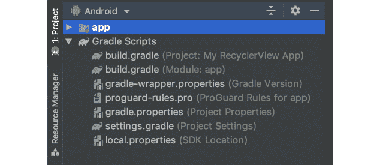
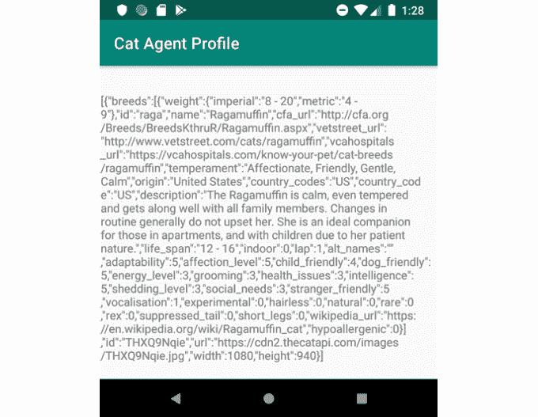
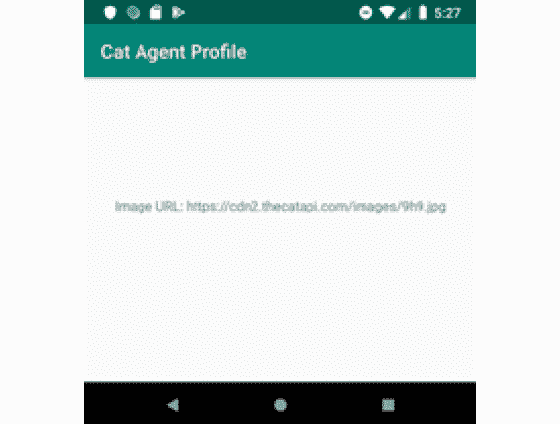
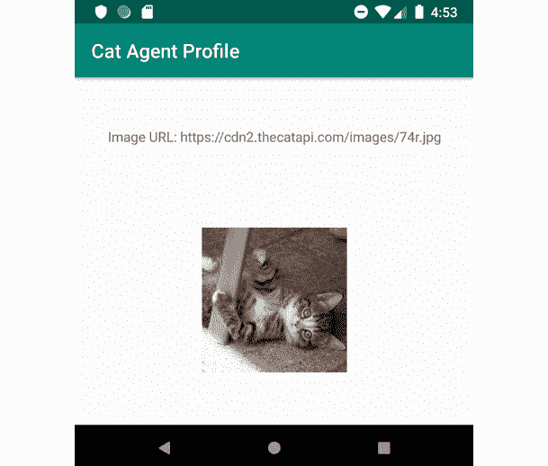
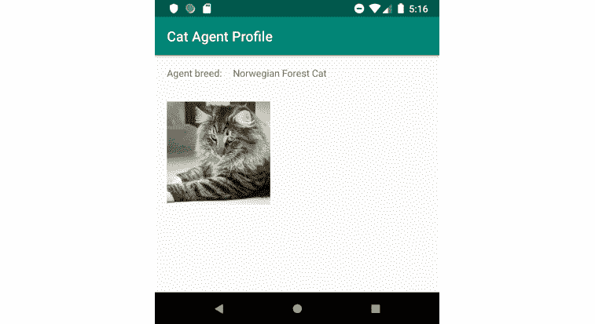
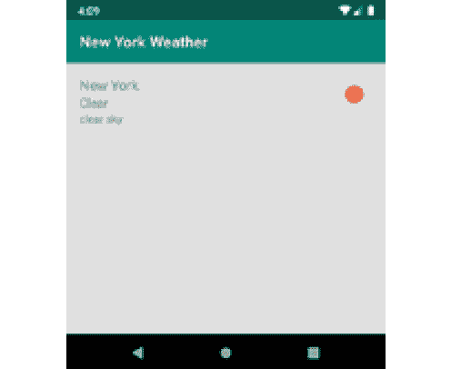

# 五、基本库：RetroFit 库、Moshi 库和 Glide 库

概观

在本章中，我们将介绍向应用用户呈现从远程服务器获取的动态内容所需的步骤。将向您介绍检索和处理这些动态数据所需的不同库。

在本章结束时，您将能够使用 RetroFit 从网络端点获取数据，使用 Moshi 将 JSON 有效负载解析为 Kotlin 数据对象，并使用 Glide 将图像加载到`ImageViews`中。

# 简介

在前一章中，我们学习了如何在我们的应用中实现导航。在本章中，我们将学习如何在用户浏览我们的应用时向他们呈现动态内容。

呈现给用户的数据可以来自不同的来源。它可以硬编码到应用中，但这也有局限性。要更改硬编码数据，我们必须发布对应用的更新。有些数据无法根据其性质进行硬编码，例如货币汇率、素材的实时可用性和当前天气等。其他数据可能会过时，例如应用的使用条款。

在这种情况下，您通常会从服务器获取相关数据。服务这类数据的最常见架构之一是**表示状态转移** ( **REST** )架构。REST 架构由一组六个约束定义:客户机-服务器架构、无状态性、可缓存性、分层系统、按需代码(可选)和统一接口。欲了解更多关于 REST 的信息，请访问[https://medium . com/extend/什么是 REST-初学者简单解释-第 1 部分-简介-b4a072f8740f](https://medium.com/extend/what-is-rest-a-simple-explanation-for-beginners-part-1-introduction-b4a072f8740f) 。

当应用到 web 服务**应用编程接口** ( **API** )时，我们得到一个基于**超文本传输协议** ( **HTTP** )的 RESTful API。HTTP 协议是万维网(也称为互联网)数据通信的基础。它是世界各地的服务器使用的协议，以 HTML 文档、图像、样式表等形式向用户提供网站服务。关于这个主题的一篇有趣的文章可以在[https://developer.mozilla.org/en-US/docs/Web/HTTP/Overview](https://developer.mozilla.org/en-US/docs/Web/HTTP/Overview)找到更多信息。

RESTful APIs 依赖于标准的 HTTP 方法— `GET`、`POST`、`PUT`、`DELETE`和`PATCH`—来获取和转换数据。这些方法允许我们获取、存储、删除和更新远程服务器上的数据实体。

要执行这些 HTTP 方法，我们可以依赖内置的 Java `HttpURLConnection`类，或者使用`OkHttp`这样的库，它提供了 gzipping、重定向、重试以及同步和异步调用等附加功能。有趣的是，从安卓 4.4 开始，`HttpURLConnection`只是`OkHttp`的包装。如果我们选择`OkHttp`，我们不妨选择**RetroFit**，正如我们将在本章中看到的那样，以受益于其更适合处理 REST 呼叫的类型安全。

最常见的是，数据由 **JavaScript 对象符号** ( **JSON** )表示。JSON 是一种基于文本的数据传输格式。顾名思义，它源自于 JavaScript。然而，它已经成为最流行的数据传输标准之一，其最现代的编程语言都有库，可以对进出 JSON 的数据进行编码或解码。一个简单的 JSON 有效负载可能如下所示:

```kt
{"employees":[  
    {"name": "James", "email": "james.notmyemail@gmail.com"},
    {"name": "Lea", "email": "lea.dontemailme@gmail.com"},
    {"name": "Steve", "email": "steve.notreally@gmail.com"}
]}
```

RESTful 服务使用的另一种常见数据结构是**可扩展标记语言** ( **XML** )，它以人类和机器可读的格式编码文档。XML 比 JSON 冗长得多。XML 中与前面相同的数据结构看起来像这样:

```kt
<employees>
    <employee>
        <name>James</name>
        <email>james.notmyemail@gmail.com</email>
    </employee>
    <employee>
        <name>Lea</name>
        <email>lea.dontemailme@gmail.com</email>
    </employee>
    <employee>
        <name>Steve</name>
        <email>steve.notreally@gmail.com</email>
    </employee>
</employees>
```

在本章中，我们将重点讨论 JSON。

当获取 JSON 有效负载时，我们实际上是在接收一个字符串。要将该字符串转换为数据对象，我们有几个选项——最受欢迎的是库，如 **GSON** 、 **Jackson** 和 **Moshi** ，以及内置的`org.json`包。对于它的轻质特性，我们将重点关注 Moshi。

最后，我们将研究从网络加载图像。这样做不仅可以让我们提供最新的图像，还可以为用户的设备加载正确的图像。它还会让我们只在需要的时候加载图像，从而保持我们的 APK 尺寸更小。

# 从网络端点获取数据

在本节中，我们将使用 tapi([https://thecatapi.com/](https://thecatapi.com/))。这个 RESTful API 为我们提供了大量关于猫的数据。

首先，我们将创建一个新项目。然后，我们必须授予我们的应用互联网访问权限。这是通过将以下代码添加到您的`AndroidManifest.xml`文件中来完成的，就在`Application`标签之前:

```kt
    <uses-permission android:name="android.permission.INTERNET" />
```

接下来，我们需要设置我们的应用，以包括 RetroFit。**RetroFit**是 Square 提供的一个类型安全的库，建立在`OkHttp` HTTP 客户端之上。RetroFit 帮助我们生成**统一资源定位器** ( **网址**，这是我们想要访问的服务器端点的地址。它还通过提供与几个解析库的集成，使 JSON 有效负载的解码变得更加容易。使用 RetroFit 将数据发送到服务器也更容易，因为它有助于对请求进行编码。你可以在这里阅读更多关于 RetroFit 的内容:[https://square.github.io/retrofit/](https://square.github.io/retrofit/)。

为了给我们的项目添加 RetroFit，我们需要在我们的应用的`build.gradle`文件的`dependencies`块中添加以下代码:

```kt
implementation 'com.squareup.retrofit2:retrofit:(insert latest version)'
```

注意

你可以在这里找到最新版本:[https://github.com/square/retrofit](https://github.com/square/retrofit)。

随着改造包括在我们的项目中，我们可以着手建立它。

首先，要访问一个 HTTP(S)端点，我们从定义与该端点的契约开始。访问`https://api.thecatapi.com/img/search`端点的合同如下所示:

```kt
interface TheCatApiService {
    @GET("img/search")
    fun searchImages(
        @Query("limit") limit: Int,
        @Query("size") format: String
    ): Call<String>
}
```

这里有几点需要注意。首先，您会注意到契约是作为接口实现的。这是您定义 RetroFit 合同的方式。接下来，您会注意到接口的名称意味着这个接口最终可以覆盖所有对该 tAPI 服务的调用。有点不幸的是，Square 选择了`Service`作为这些合同的常规后缀，因为服务一词在安卓世界中有不同的含义，正如您将在*第 8 章*、*服务、广播接收器和通知*中看到的那样。然而，这是惯例。

为了定义我们的端点，我们首先使用适当的注释说明调用的方法——在我们的例子中是`@GET`。传递给注释的参数是要访问的端点的路径。你会注意到`https://api.thecatapi.com/v1/`从那条路上被剥离了。这是因为这是 tAPI 所有端点的公共地址，因此将在构建时传递给我们的 RetroFit 实例。接下来，我们为函数选择一个有意义的名称——在本例中，我们将调用图像搜索端点，因此`searchImages`似乎是合适的。`searchImages`函数的参数定义了我们在调用时可以传递给应用编程接口的值。

我们可以通过不同的方式将数据传输到应用编程接口。`@Query`允许我们定义添加到我们的请求 URL 的查询中的值(这是在问号之后的 URL 的可选部分)。它需要一个键值对(在我们的例子中，我们有`limit`和`size`)和一个数据类型。如果数据类型不是字符串，该类型的值将被转换为字符串。传递的任何值都将为我们进行 URL 编码。

另一种这样的方式是使用`@Path`。这个注释可以用来用提供的值替换路径中用花括号包装的标记。`@Header`、`@Headers`和`@HeaderMap`注释将允许我们在请求中添加或删除 HTTP 头。`@Body`可以用来传递`POST` / `PUT`请求正文中的内容。

最后，我们有一个返回类型。为了在这个阶段保持简单，我们将接受字符串形式的响应。我们把我们的绳子包在一个`Call`界面里。`Call`是 RetroFit 同步(通过`execute()`)或异步(通过`enqueue(Callback)`)执行网络请求的机制。当使用 RxJava 时(ReactiveX 或 Reactive Extensions 的 Java 实现；你可以在`https://reactivex.io/`阅读更多关于 ReactiveX 的内容，我们可以适当地将结果包装在`Observable`类(一个发出数据的类)或`Single`类(一个只发出一次数据的类)中(有关 RxJava 的更多信息，请参见*第 13 章*、 *RxJava 和 Coroutines* )。

定义好合同后，我们可以让 RetroFit 公司实现我们的服务接口:

```kt
val retrofit = Retrofit.Builder()
    .baseUrl("https://api.thecatapi.com/v1/")
    .build()
val theCatApiService = retrofit.create(TheCatApiService::class.java)
```

如果我们试图用这个代码运行我们的应用，我们的应用将会因`IllegalArgumentException`而崩溃。这是因为 RetroFit 需要我们告诉应用如何处理服务器对字符串的响应。这个过程是通过 RetroFit 公司所谓的**转换器**完成的。要为我们的`retrofit`实例设置`ConverterFactory`实例，我们需要添加以下内容:

```kt
val retrofit = Retrofit.Builder()
    .baseUrl("https://api.thecatapi.com/v1/")
 .addConverterFactory(ScalarsConverterFactory.create())
    .build()
```

为了让我们的项目识别`ScalarsConverterFactory`，我们需要通过添加另一个依赖项来更新我们应用的`build.gradle`文件:

```kt
implementation 'com.squareup.retrofit2:converter-scalars:(insert latest version)'
```

现在，我们可以通过调用`val call = theCatApiService.searchImages(1, "full")`获得一个`Call`实例。通过这种方式获得的实例，我们可以通过调用`call.enqueue(Callback)`来执行异步请求。

我们的`Callback`实现会有两种方法:`onFailure(Call, Throwable)`和`onResponse(Call, Response)`。请注意，如果调用`onResponse`，我们不能保证有成功的响应。每当我们成功接收到来自服务器的任何响应并且没有发生意外异常时，就会调用`onResponse`。所以，为了确认响应是成功响应，我们应该检查`response.isSuccessful`属性。`onFailure`函数将在网络错误或意外异常的情况下被调用。

那么，我们应该在哪里实现 RetroFit 代码呢？在干净的架构中，数据由存储库提供。存储库反过来也有数据源。一个这样的数据源可以是网络数据源。这是我们实施网络呼叫的地方。我们的视图模型(在**模型-视图-视图模型** ( **MVVM** )的情况下，视图模型是暴露属性和命令的视图的抽象)然后将通过用例从存储库请求数据。

对于我们的实现，我们将通过实例化改造和活动中的服务来简化过程。这不是好的做法。不要在生产应用中这样做。它不能很好地扩展，并且很难测试。相反，采用一种架构，将您的视图与业务逻辑和数据分离开来。一些想法见*第 14 章*、*建筑格局*。

## 练习 5.01:从应用编程接口读取数据

在接下来的几章中，我们将为一个虚构的秘密机构开发一个应用，该机构拥有一个全球性的代理网络，将世界从无数的危险中拯救出来。这个秘密机构非常独特:它经营秘密的猫特工。在本练习中，我们将创建一个应用，向我们展示一个来自 CatAPI 的随机秘密猫代理。在将数据从应用编程接口呈现给用户之前，您首先必须获取这些数据。让我们开始吧:

1.  首先创建一个新的`Empty Activity`项目(`File` | `New` | `New Project` | `Empty Activity`)。点击`Next`。
2.  说出你的申请`Cat Agent Profile`。
3.  确保您的套餐名称为`com.example.catagentprofile`。
4.  将保存位置设置为要保存项目的位置。
5.  将其他所有内容保留为默认值，然后单击`Finish`。
6.  Make sure you are on the `Android` view in your `Project` pane:

    

    图 5.1:项目窗格中的安卓视图

7.  打开你的`AndroidManifest.xml`文件。像这样给你的应用添加互联网权限:

    ```kt
    <manifest xmlns:android="http://schemas.android.com/apk/res/android"
        package="com.example.catagentprofile">
     <uses-permission android:name="android.permission.INTERNET" />
        <application ...>
            ...
        </application>
    </manifest>
    ```

8.  To add Retrofit and the scalars converter to your app, open the app module, `build.gradle` (`Gradle Scripts` | `build.gradle (Module: app)`), and add the following lines anywhere inside the `dependencies` block:

    ```kt
    dependencies {
        ...
        implementation 'com.squareup.retrofit2:retrofit:2.9.0'
        implementation 'com.squareup.retrofit2:converter-scalars:2.9.0'
        ...
    }
    ```

    您的`dependencies`块现在应该如下所示:

    ```kt
    dependencies {
        implementation "org.jetbrains.kotlin:kotlin-stdlib
          :$kotlin_version"
        implementation 'androidx.core:core-ktx:1.3.2'
        implementation 'androidx.appcompat:appcompat:1.2.0'
        implementation 'com.google.android.material:material:1.2.1'
        implementation 'androidx.constraintlayout:constraintlayout:2.0.4'
        implementation 'androidx.navigation:navigation-fragment
          -ktx:2.2.2'
        implementation 'androidx.navigation:navigation-ui-ktx:2.2.2'
     implementation 'com.squareup.retrofit2:retrofit:2.9.0'
     implementation 'com.squareup.retrofit2:converter-scalars:2.9.0'
        testImplementation 'junit:junit:4.+'
        androidTestImplementation 'androidx.test.ext:junit:1.1.2'
        androidTestImplementation 'androidx.test.espresso:espresso-core
          :3.3.0'
    }
    ```

    在撰写本文和执行本练习之间，一些依赖关系可能已经改变。您仍然应该只添加前面代码块中的粗体行。这些将增加 RetroFit 和支持读取服务器响应作为单一字符串。

    注意

    值得注意的是，RetroFit 现在至少需要安卓 API 21 或 Java 8。

9.  点击 AndroidStudio 的`Sync Project with Gradle Files`按钮。
10.  在`Text`模式下打开你的`activity_main.xml`文件。
11.  为了能够使用您的标签来呈现最新的服务器响应，您需要为其分配一个 ID:

    ```kt
    <TextView
     android:id="@+id/main_server_response"
        android:layout_width="wrap_content"
        android:layout_height="wrap_content"
        android:text="Hello World!"
        app:layout_constraintBottom_toBottomOf="parent"
        app:layout_constraintLeft_toLeftOf="parent"
        app:layout_constraintRight_toRightOf="parent"
        app:layout_constraintTop_toTopOf="parent" />
    ```

12.  在左侧的`Project`面板中，右键点击你的应用包(`com.example.catagentprofile`，然后选择`New` | `Package`。
13.  说出你的包裹`api`。
14.  现在，右击新创建的包(`com.example.catagentprofile.api`)，然后选择`New` | `Kotlin File/Class`。
15.  命名你的新文件`TheCatApiService`。对于`Kind`，选择`Interface`。
16.  Add the following into the `interface` block:

    ```kt
    interface TheCatApiService {
     @GET("img/search")
     fun searchImages(
     @Query("limit") limit: Int,
     @Query("size") format: String
     ) : Call<String>
    }
    ```

    这定义了图像搜索端点。确保导入所有必需的 RetroFit 依赖项。

17.  打开你的`MainActivity`文件。
18.  At the top of the `MainActivity` class block, add the following:

    ```kt
    class MainActivity : AppCompatActivity() {
     private val retrofit by lazy {
     Retrofit.Builder()
     .baseUrl("https://api.thecatapi.com/v1/")
     .addConverterFactory(ScalarsConverterFactory.create())
     .build()
     }
     private val theCatApiService
     by lazy { retrofit.create(TheCatApiService::class.java) }
        ...
    }
    ```

    这将实例化 RetroFit 和应用编程接口服务。我们使用`lazy`来确保仅在需要时创建实例。

19.  Add `serverResponseView` as a field:

    ```kt
    class MainActivity : AppCompatActivity() {
     private val serverResponseView: TextView
     by lazy { findViewById(R.id.main_server_response) }
    ```

    这将在第一次访问`serverRespnseView`时查找带有`main_server_response`标识的视图，然后保留对它的引用。

20.  Now, add the `getCatImageResponse()` function after the `onCreate(Bundle?)` function:

    ```kt
    override fun onCreate(savedInstanceState: Bundle?) {
        ...
    }
    private fun getCatImageResponse() {
    val call = theCatApiService.searchImages(1, "full")
     call.enqueue(object : Callback<String> {
     override fun onFailure(call: Call<String>, t: Throwable) {
     Log.e("MainActivity", "Failed to get search results", t)
     }
     override fun onResponse(
     call: Call<String>,
     response: Response<String>
     ) {
     if (response.isSuccessful) {
     serverResponseView.text = response.body()
     } else {
     Log.e(
     "MainActivity",
     "Failed to get search results\n
     ${response.errorBody()?.string() ?: ""}"
     )
     }
     }
     })
    }
    ```

    这个函数将触发搜索请求并处理可能的结果——成功响应、错误响应和任何其他抛出的异常。

21.  调用`onCreate()`中的`getCatImageResponse()`。这将在创建活动后立即触发呼叫:

    ```kt
    override fun onCreate(savedInstanceState: Bundle?) {
        ...
        getCatImageResponse()
    }
    ```

22.  添加缺少的导入。
23.  点击`Run 'app'`按钮或按 *Ctrl* + *R* 运行你的应用。在模拟器上，它应该如下所示:



图 5.2:呈现服务器响应 JSON 的应用

因为每次你运行你的应用，都会有一个新的调用，并返回一个随机的响应，你的结果可能会有所不同。然而，不管你的结果如何，如果成功的话，它应该是一个 JSON 负载。接下来，我们将学习如何解析该 JSON 负载，并从中提取我们想要的数据。

# 解析 JSON 响应

现在，我们已经成功地从一个应用编程接口中检索到了一个 JSON 响应，是时候学习如何使用我们获得的数据了。为此，我们需要解析 JSON 负载。这是因为有效负载是表示数据对象的普通字符串，我们对该对象的特定属性感兴趣。如果你仔细观察*图 5.2* ，你可能会注意到 JSON 包含品种信息、一个图像网址和一些其他信息。然而，为了让我们的代码使用这些信息，首先我们必须提取这些信息。

正如在介绍中提到的，存在多个库，它们将为我们解析一个 JSON 负载。最受欢迎的是谷歌的 GSON([https://github.com/google/gson](https://github.com/google/gson))和最近的 Square 的 Moshi([https://github.com/square/moshi](https://github.com/square/moshi))。Moshi 非常轻量级，这就是为什么我们选择在本章中使用它。

JSON 库是做什么的？基本上，它们帮助我们将数据类转换成 JSON 字符串(序列化)，反之亦然(反序列化)。这有助于我们与理解 JSON 字符串的服务器通信，同时允许我们在代码中使用有意义的数据结构。

要使用 Moshi RetroFit，我们需要在我们的项目中添加 Moshi RetroFit 转换器。这是通过在我们应用的`build.gradle`文件的`dependencies`块中添加以下行来完成的:

```kt
implementation 'com.squareup.retrofit2:converter-moshi:2.9.0'
```

由于我们将不再接受字符串形式的响应，我们可以继续移除标量 RetroFit 转换器。

接下来，我们需要创建一个数据类来映射服务器 JSON 响应。一个惯例是用`Data`给 API 响应数据类的名称加后缀——所以我们称我们的数据类为`ImageResultData`。另一个常见的后缀是`Entity`。

当我们设计我们的服务器响应数据类时，我们需要考虑两个因素:JSON 响应的结构和我们的数据需求。第一个将影响我们的数据类型和字段名称，而第二个将允许我们省略我们当前不需要的字段。JSON 库知道它们应该忽略我们在数据类中没有定义的字段中的数据。

JSON 库为我们做的另一件事是，如果字段碰巧同名，它会自动将 JSON 数据映射到字段。虽然这是一个很好的特性，但它也有问题。如果我们仅仅依赖于它，我们的数据类(以及访问它们的代码)将与 API 命名紧密耦合。因为并不是所有的 API 都设计得很好，你可能会以没有意义的字段名结束，比如`fn`或者`last`，或者不一致的命名。幸运的是，这个问题有一个解决方案。Moshi 为我们提供了一个`@field:Json`注解。它可用于将 JSON 字段名映射到有意义的字段名:

```kt
data class UserData(
    @field:Json(name = "fn") val firstName: String,
    @field:Json(name = "last") val lastName: String
)
```

有些人认为，为了保持一致性，即使应用编程接口名称与字段名称相同，包含注释也是更好的做法。当字段名足够清晰时，我们更喜欢直接转换的简洁。当混淆我们的代码时，这种方法会受到挑战。如果我们这样做，我们必须要么排除我们的数据类，要么确保注释所有字段。

虽然我们并不总是足够幸运地拥有正确记录的 API，但是当我们这样做的时候，最好在设计我们的模型时参考文档。我们的模型将是一个数据类，来自我们所有调用的 JSON 数据将被解码到其中。在[https://docs . TheCatAPI . com/API-referenimg/images-search](https://docs.thecatapi.com/api-referenimg/images-search)上可以找到关于 thetapi 图像搜索端点的文档。您经常会发现文档不完整或不准确。如果碰巧是这种情况，您能做的最好的事情就是联系 API 的所有者，请求他们更新文档。不幸的是，您可能不得不求助于端点实验。这是有风险的，因为未记录的字段或结构不能保证保持不变，所以在可能的情况下，尝试更新文档。

基于从前面的链接中获得的响应模式，我们可以如下定义我们的模型:

```kt
data class ImageResultData(
    @field:Json(name = "url") val imageUrl: String,
    val breeds: List<CatBreedData>
)
data class CatBreedData(
    val name: String,
    val temperament: String
)
```

请注意，响应结构实际上是一个结果列表。这意味着我们需要将我们的反应映射到`List<ImageResultData>`，而不仅仅是`ImageResultData`。

现在，我们需要更新`TheCatApiService`。我们现在可以拥有`Call<List<ImageResultData>>`而不是`Call<String>`。

接下来，我们需要更新我们的 RetroFit 实例的构造。代替`ScalarsConverterFactory`，我们现在将有`MoshiConverterFactory`。

最后，我们需要更新我们的回调，因为它不再处理字符串调用，而是`List<ImageResultData>`:

```kt
@GET("img/search")
fun searchImages(
    @Query("limit") limit: Int,
    @Query("size") format: String
) : Call<List<ImageResultData>>
```

## 练习 5.02:从 API 响应中提取图像 URL

所以，我们有一个字符串形式的服务器响应。现在，我们希望从该字符串中提取图像网址，并在屏幕上只显示该网址:

1.  打开应用的`build.gradle`文件，用 Moshi 转换器替换标量转换器实现:

    ```kt
        implementation 'com.squareup.retrofit2:retrofit:2.9.0'
     implementation 'com.squareup.retrofit2:converter-moshi:2.9.0'
        testImplementation 'junit:junit:4.12'
    ```

2.  点击`Sync Project with Gradle Files`按钮。
3.  在你的应用包(`com.example.catagentprofile`)下，创建一个`model`包。
4.  在`com.example.catagentprofile.model`包中，创建一个名为`CatBreedData`的新 Kotlin 文件。
5.  用以下内容填充新创建的文件:

    ```kt
    package com.example.catagentprofile.model
    data class CatBreedData(
     val name: String,
     val temperament: String
    )
    ```

6.  接下来，在同一个包下创建`ImageResultData`。
7.  将其内容设置如下:

    ```kt
    package com.example.catagentprofile.model
    import com.squareup.moshi.Json
    data class ImageResultData(
     @field:Json(name = "url") val imageUrl: String,
    val breeds: List<CatBreedData>
    )
    ```

8.  打开`TheCatApiService`文件，更新`searchImages`返回类型:

    ```kt
        @GET("img/search")
        fun searchImages(
            @Query("limit") limit: Int,
            @Query("size") format: String
        ) : Call<List<ImageResultData>>
    ```

9.  最后，打开`MainActivity`。
10.  更新 RetroFit 初始化块，使用 Moshi 转换器反序列化 JSON:

    ```kt
        private val retrofit by lazy {
            Retrofit.Builder()
                .baseUrl("https://api.thecatapi.com/v1/")
                .addConverterFactory(MoshiConverterFactory.create())
                .build()
        }
    ```

11.  更新`getCatImageResponse()`功能以处理`List<ImageResultData>`请求和响应:

    ```kt
    private fun getCatImageResponse() {
        val call = theCatApiService.searchImages(1, "full")
        call.enqueue(object : Callback<List<ImageResultData>> {
            override fun onFailure(call: Call<List<ImageResultData>>,           t: Throwable) {
                Log.e("MainActivity", "Failed to get search results",             t)
            }
            override fun onResponse(
               call: Call<List<ImageResultData>>,
                response: Response<List<ImageResultData>>
            ) {
                if (response.isSuccessful) {
     val imageResults = response.body()
     val firstImageUrl = imageResults?.firstOrNull()                  ?.imageUrl ?: "No URL"
     serverResponseView.text = "Image URL:                   $firstImageUrl"
                } else {
                    Log.e(
                        "MainActivity",
                        "Failed to get search                        results\n${response.errorBody()?.string()                          ?: ""}"
                    )
                }
            }
        })
    }
    ```

12.  现在，您不仅需要检查响应是否成功，还需要检查是否至少有一个`ImageResultData`实例。然后，您可以读取该实例的`imageUrl`属性，并将其呈现给用户。
13.  Run your app. It should now look something like the following:

    

    图 5.3:呈现解析图像网址的应用

14.  同样，由于应用编程接口响应的随机性，您的网址可能会有所不同。

您现在已经成功地从应用编程接口响应中提取了一个特定的属性。接下来，我们将学习如何从应用编程接口提供给我们的网址加载图像。

# 从远程网址加载图像

我们刚刚学习了如何从应用编程接口响应中提取特定数据。通常，这些数据会包括我们想要呈现给用户的图像的网址。实现这一目标需要做大量的工作。首先，您必须从 URL 中以二进制流的形式获取图像。然后，您需要将该二进制流转换为图像(它可以是 GIF、JPEG 或其他几种图像格式之一)。然后，您需要将其转换为位图实例，可能会调整其大小以使用更少的内存。

此时，您可能还想对其应用其他转换。然后，您需要将其设置为`ImageView`。听起来工作量很大，不是吗？对我们来说幸运的是，有一些库为我们做了所有这些(甚至更多)。最常用的图书馆是 Square 的**毕加索**([https://square.github.io/picasso/](https://square.github.io/picasso/))和 Bump Technologies 的**Glide**([https://github.com/bumptech/glide](https://github.com/bumptech/glide))。脸书的**壁画**([https://frescolib.org/](https://frescolib.org/))有点不太受欢迎。我们将继续 Glide，因为无论是从互联网还是从缓存加载图像，它始终是两者中速度较快的。值得注意的是，毕加索更轻量级，所以这是一个权衡，两个库都相当有用。

要在项目中包含 Glide，请将其添加到应用的`build.gradle`文件的`dependencies`块中:

```kt
dependencies {
    implementation 'com.github.bumptech.glide:glide:4.10.0'
    ...
}
```

事实上，因为我们可能会在以后改变主意，所以这是一个很好的机会来抽象出具体的库，以拥有一个我们自己的更简单的接口。所以，让我们从定义我们的`ImageLoader`界面开始:

```kt
interface ImageLoader {
    fun loadImage(imageUrl: String, imageView: ImageView)
}
```

这是一个幼稚的实现。在生产实现中，您可能希望添加参数(或多个函数)来支持不同的裁剪策略或加载状态等选项。

我们的接口实现将依赖于 Glide，因此看起来像这样:

```kt
class GlideImageLoader(private val context: Context) : ImageLoader {
    override fun loadImage(imageUrl: String, imageView: ImageView) {
        Glide.with(context)
            .load(imageUrl)
            .centerCrop()
            .into(imageView)
    }
}
```

我们在类名前面加上`Glide`以区别于其他潜在的实现。用`context`构建`GlideImageLoader`可以让我们实现干净的`loadImage(String, ImageView)`界面，而不用担心图像加载需要的上下文。事实上，Glide 在安卓环境方面很聪明。这意味着我们可以为`Activity`和`Fragment`范围分别实现，当图像加载请求超出范围时，Glide 会知道。

由于我们尚未在布局中添加`ImageView`，现在就让我们这样做吧:

```kt
<TextView
    ...
    app:layout_constraintBottom_toTopOf="@+id/main_profile_image"
    ... />
<ImageView
 android:id="@+id/main_profile_image"
 android:layout_width="150dp"
 android:layout_height="150dp"
 app:layout_constraintBottom_toBottomOf="parent"
 app:layout_constraintEnd_toEndOf="parent"
app:layout_constraintStart_toStartOf="parent"
 app:layout_constraintTop_toBottomOf="@+id/main_server_response" />
```

这将在我们的`TextView`下方添加一个 ID 为`main_profile_image`的`ImageView`。

我们现在可以在`MainActivity`中创建`GlideImageLoader`的实例:

```kt
private val imageLoader: ImageLoader by lazy { GlideImageLoader(this) }
```

同样，在生产应用中，您将注入依赖项，而不是内联创建它。

接下来，我们告诉我们的下滑加载器加载图像，一旦加载，在提供的`ImageView`中居中裁剪它。这意味着图像将被放大或缩小以完全填充`ImageView`，任何多余的内容都将被剪掉(裁剪)。由于我们之前已经获得了一个图像网址，我们所需要做的就是调用:

```kt
val firstImageUrl = imageResults?.firstOrNull()?.imageUrl ?: ""
if (!firstImageUrl.isBlank()) {
    imageLoader.loadImage(firstImageUrl, profileImageView)
} else {
    Log.d("MainActivity", "Missing image URL")
}
```

我们必须确保结果包含一个不是空的或由空格组成的字符串(在前面的代码块中为`isBlank()`)。然后，我们可以安全地将网址加载到我们的`ImageView`中。我们结束了。如果我们现在运行我们的应用，我们应该会看到类似于以下内容的内容:


图 5.4:服务器响应图像 URL 和实际图像

请记住，API 返回随机结果，因此实际图像可能会有所不同。如果我们幸运的话，我们甚至可能得到一个动画 GIF，然后我们会看到动画。

## 练习 5.03:从获取的网址加载图像

在前面的练习中，我们从 API 响应中提取了图像 URL。现在，我们将使用该网址从网络上获取图像，并在我们的应用中显示它:

1.  Open the app's `build.gradle` file and add the Glide dependency:

    ```kt
    dependencies {
        ... 
        implementation 'com.squareup.retrofit2:converter-moshi:2.9.0'
     implementation 'com.github.bumptech.glide:glide:4.11.0'
        testImplementation 'junit:junit:4.12'
        ...
    }
    ```

    将项目与渐变文件同步。

2.  在左侧`Project`面板上，右键单击您的项目包名称(`com.example.catagentprofile`)并选择`New` | `Kotlin File/Class`。
3.  在`Name`字段填写`ImageLoader`。对于`Kind`，选择`Interface`。
4.  Open the newly created `ImageLoader.kt` file and update it like so:

    ```kt
    interface ImageLoader {
     fun loadImage(imageUrl: String, imageView: ImageView)
    }
    ```

    这将是你在应用中的任何图像加载器的界面。

5.  再次右键点击项目包名称，再次选择`New` | `Kotlin File/Class`。
6.  命名新文件`GlideImageLoader`，为`Kind`选择`Class`。
7.  更新新创建的文件:

    ```kt
    class GlideImageLoader(private val context: Context) : ImageLoader {
    override fun loadImage(imageUrl: String, imageView: ImageView) {
     Glide.with(context)
     .load(imageUrl)
     .centerCrop()
     .into(imageView)
        }
    }
    ```

8.  Open `activity_main.xml`.

    像这样更新它:

    ```kt
    <?xml version="1.0" encoding="utf-8"?>
    <androidx.constraintlayout.widget.ConstraintLayout
        xmlns:android="http://schemas.android.com/apk/res/android"
        xmlns:app="http://schemas.android.com/apk/res-auto"
        xmlns:tools="http://schemas.android.com/tools"
        android:layout_width="match_parent"
        android:layout_height="match_parent"
        tools:context=".MainActivity">
        <TextView
            android:id="@+id/main_server_response"
            android:layout_width="wrap_content"
            android:layout_height="wrap_content"
            android:text="Hello World!"
            app:layout_constraintBottom_toTopOf="@+id/main_profile_image"
            app:layout_constraintLeft_toLeftOf="parent"
            app:layout_constraintRight_toRightOf="parent"
            app:layout_constraintTop_toTopOf="parent" />
     <ImageView
     android:id="@+id/main_profile_image"
     android:layout_width="150dp"
     android:layout_height="150dp"
     app:layout_constraintBottom_toBottomOf="parent"
    app:layout_constraintEnd_toEndOf="parent"
     app:layout_constraintStart_toStartOf="parent"
     app:layout_constraintTop_toBottomOf=
     "@+id/main_server_response" />
    </androidx.constraintlayout.widget.ConstraintLayout>
    ```

    这将在您的`TextView`下方添加一个名为`main_profile_image`的`ImageView`。

9.  打开`MainActivity.kt`文件。
10.  在班级顶部为您新添加的`ImageView`添加一个字段:

    ```kt
    private val serverResponseView: TextView
        by lazy { findViewById(R.id.main_server_response) } 
    private val profileImageView: ImageView
     by lazy { findViewById(R.id.main_profile_image) } 
    ```

11.  定义`onCreate(Bundle?)`功能上方的`ImageLoader`:

    ```kt
    private val imageLoader: ImageLoader by lazy { GlideImageLoader(this) }
    override fun onCreate(savedInstanceState: Bundle?) {
    ```

12.  像这样更新你的`getCatImageResponse()`功能:

    ```kt
    private fun getCatImageResponse() {
        val call = theCatApiService.searchImages(1, "full")
        call.enqueue(object : Callback<List<ImageResultData>> {
            override fun onFailure(call: Call<List<ImageResultData>>,           t: Throwable) {
                Log.e("MainActivity", "Failed to get search results", t)
            }
            override fun onResponse(
                call: Call<List<ImageResultData>>,
                response: Response<List<ImageResultData>>
            ) {
                if (response.isSuccessful) {
                    val imageResults = response.body()
                    val firstImageUrl =                   imageResults?.firstOrNull()?.imageUrl ?: ""
     if (firstImageUrl.isNotBlank()) {
     imageLoader.loadImage(firstImageUrl, 
     profileImageView)
     } else {
     Log.d("MainActivity", "Missing image URL")
     }
                    serverResponseView.text = "Image URL: $firstImageUrl"
                } else {
                    Log.e(
                        "MainActivity",
                        "Failed to get search results\n
                          ${response.errorBody()?.string() ?: ""}"
                    )
                }
            }
        })
    }
    ```

13.  现在，一旦你有了一个非空白的网址，它就会被加载到`profileImageView`中。
14.  Run the app:

    

    图 5.5:练习结果–显示随机图像及其来源网址

    以下是奖励步骤。

15.  Update your layout like so:

    ```kt
    <?xml version="1.0" encoding="utf-8"?>
    <androidx.constraintlayout.widget.ConstraintLayout
        xmlns:android="http://schemas.android.com/apk/res/android"
        xmlns:app="http://schemas.android.com/apk/res-auto"
        xmlns:tools="http://schemas.android.com/tools"
        android:layout_width="match_parent"
        android:layout_height="match_parent"
        tools:context=".MainActivity">
        <TextView
            android:id="@+id/main_agent_breed_label"
            android:layout_width="wrap_content"
            android:layout_height="wrap_content"
            android:padding="16dp"
            android:text="Agent breed:"
            app:layout_constraintStart_toStartOf="parent"
            app:layout_constraintTop_toTopOf="parent" />
        <TextView
            android:id="@+id/main_agent_breed_value"
            android:layout_width="wrap_content"
            android:layout_height="wrap_content"
            android:paddingTop="16dp"
            app:layout_constraintStart_toEndOf=
              "@+id/main_agent_breed_label"
            app:layout_constraintTop_toTopOf=
              "@+id/main_agent_breed_label" />
        <ImageView
            android:id="@+id/main_profile_image"
            android:layout_width="150dp"
            android:layout_height="150dp"
            android:layout_margin="16dp"
            app:layout_constraintStart_toStartOf="parent"
            app:layout_constraintTop_toBottomOf=
              "@+id/main_agent_breed_label" />
    </androidx.constraintlayout.widget.ConstraintLayout>
    ```

    这将添加一个`Agent breed`标签并整理视图布局。现在，您的布局看起来更像一个合适的卡特彼勒代理商档案应用。

16.  In `MainActivity.kt`, locate the following lines:

    ```kt
    private val serverResponseView: TextView
        by lazy { findViewById(R.id.main_server_response) } 
    ```

    用以下内容替换该行以查找新名称字段:

    ```kt
    private val agentBreedView: TextView
        by lazy { findViewById(R.id.main_agent_breed_value) }
    ```

17.  Update `getCatImageResponse()` like so:

    ```kt
    private fun getCatImageResponse() {
        val call = theCatApiService.searchImages(1, "full")
        call.enqueue(object : Callback<List<ImageResultData>> {
            override fun onFailure(call: Call<List<ImageResultData>>,           t: Throwable) {
                Log.e("MainActivity", "Failed to get search results", t)
            }
            override fun onResponse(
                call: Call<List<ImageResultData>>,
                response: Response<List<ImageResultData>>
            ) {
                if (response.isSuccessful) {
                    val imageResults = response.body()
                    val firstImageUrl =                   imageResults?.firstOrNull()?.imageUrl ?: ""
                    if (!firstImageUrl.isBlank()) {
                        imageLoader.loadImage(firstImageUrl, 
                          profileImageView)
                    } else {
                        Log.d("MainActivity", "Missing image URL")
                    }
                    agentBreedView.text =
                        imageResults?.firstOrNull()?.breeds?                      .firstOrNull()?.name ?: "Unknown"
                } else {
                    Log.e(
                      "MainActivity",
                      "Failed to get search results\n
                        ${response.errorBody()?.string() ?:""}"
                    )
                }
            }
        })
    }
    ```

    这样做是为了将从 API 返回的第一个品种加载到`agentNameView`中，回退到`Unknown`。

18.  在撰写本文时，tAPI 中没有多少图片有品种数据。但是，如果您运行应用的次数足够多，您最终会看到如下内容:



图 5.6:显示猫代理图像和品种

在本章中，我们学习了如何从远程应用编程接口获取数据。然后，我们学习了如何处理这些数据，并从中提取我们需要的信息。最后，我们学习了当给定图像网址时，如何在屏幕上呈现图像。

在接下来的活动中，我们将运用我们的知识开发一个应用，告诉用户纽约当前的天气，并为用户呈现一个相关的天气图标。

## 活动 5.01:显示当前天气

假设我们想构建一个显示纽约当前天气的应用。此外，我们还想显示一个代表当前天气的图标。

本活动旨在创建一个应用，该应用以 JSON 格式轮询当前天气的应用编程接口端点，将该数据转换为本地模型，并使用该模型呈现当前天气。它还提取代表当前天气的图标的网址，并提取该图标以显示在屏幕上。

出于本活动的目的，我们将使用免费的 OpenWeatherMap.org 应用编程接口。文件可以在[https://www.metaweather.com/api/](https://www.metaweather.com/api/)找到。要注册 API 令牌，请前往[https://home.openweathermap.org/users/sign_up](https://home.openweathermap.org/users/sign_up)。您可以在[https://home.openweathermap.org/api_keys](https://home.openweathermap.org/api_keys)找到您的钥匙并根据需要生成新钥匙。

步骤如下:

1.  创建新应用。
2.  授予应用互联网权限，以便能够进行应用接口和图像请求。
3.  将 RetroFit、莫希转换器和滑翔添加到应用中。
4.  更新应用布局，以支持以文本形式(短描述和长描述)以及天气图标图像呈现天气。
5.  定义模型。创建将包含服务器响应的类。
6.  添加 OpenWeatherMap API 的 RetroFit 服务，[https://api.openweathermap.org/data/2.5/weather](https://api.openweathermap.org/data/2.5/weather)。
7.  使用 Moshi 转换器创建一个 RetroFit 实例。
8.  调用 API 服务。
9.  处理成功的服务器响应。
10.  处理不同的故障场景。

预期输出如下所示:



图 5.7:最终的天气应用

注意

这个活动的解决方案可以在:[http://packt.live/3sKj1cp](05.html)找到

# 总结

在本章中，我们学习了如何使用 RetroFit 从应用编程接口获取数据。然后，我们学习了如何使用 Moshi 处理 JSON 响应，以及纯文本响应。我们还看到了如何处理不同的错误场景。

我们后来学习了如何使用 Glide 从 URL 加载图像，以及如何通过`ImageView`将它们呈现给用户。

有相当多的流行库用于从 API 获取数据以及加载图像。我们只报道了一些最受欢迎的。您可能想要尝试一些其他的库来找出最适合您的目的的库。

在下一章中，我们将介绍`RecyclerView`，这是一个强大的 UI 组件，我们可以使用它向用户呈现项目列表。