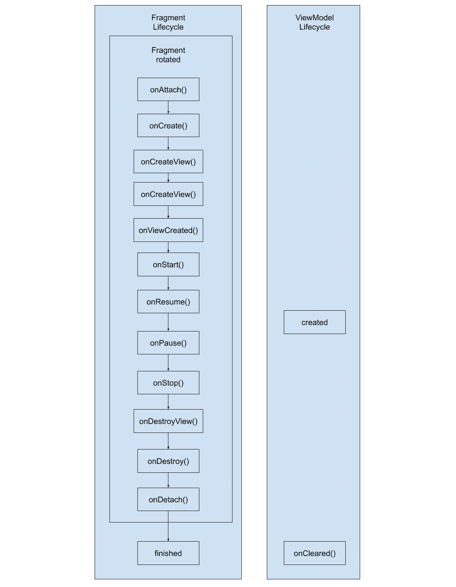
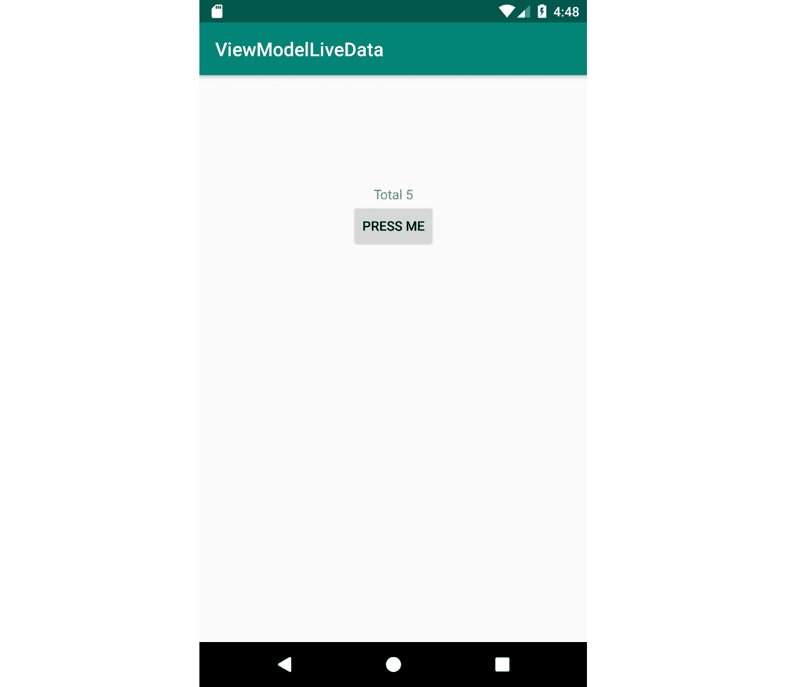
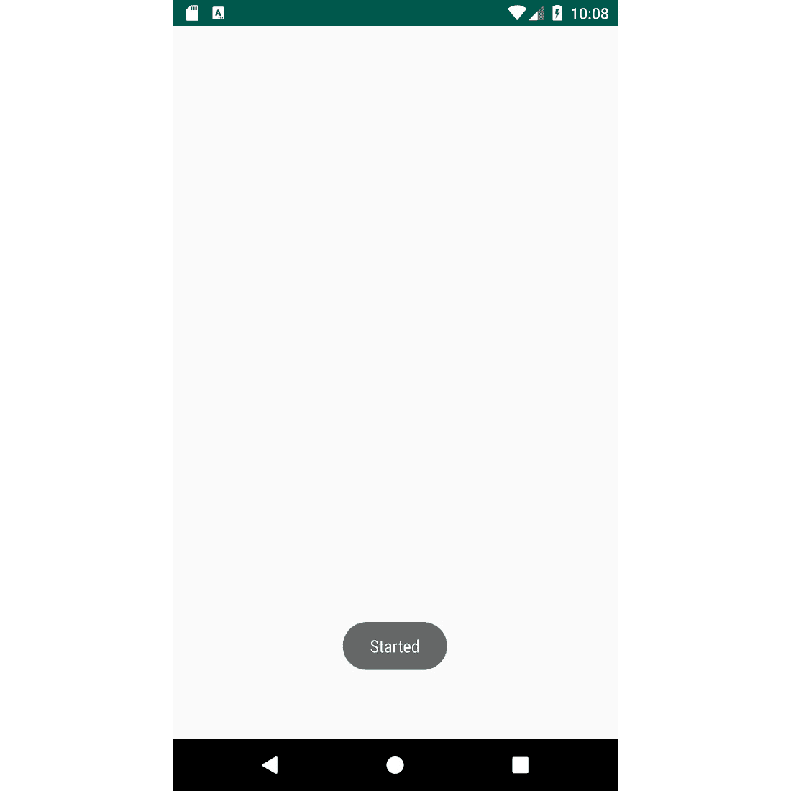

# 十、安卓架构组件

概观

在本章中，您将了解安卓 Jetpack 库的关键组件，以及它们给标准安卓框架带来的好处。您还将学习如何在 Jetpack 组件的帮助下构建代码，并为您的类赋予不同的职责。最后，您将提高代码的测试覆盖率。

到本章结束时，您将能够轻松创建处理活动和片段生命周期的应用。您还将了解更多关于如何使用房间在安卓设备上保存数据，以及如何使用视图模型将您的逻辑与视图分开的信息。

# 简介

在前几章中，您学习了如何编写单元测试。问题是:你能单元测试什么？你能单元测试活动和片段吗？由于它们的构建方式，它们很难在你的机器上进行单元测试。如果您可以将代码从活动和片段中移走，测试会更容易。

此外，考虑您正在构建支持不同方向(如横向和纵向)并支持多种语言的应用的情况。默认情况下，在这些场景中，当用户旋转屏幕时，活动和片段会被重新创建为新的显示方向。现在，想象一下当您的应用正在处理数据时会发生什么。你必须跟踪你正在处理的数据，你必须跟踪用户正在做什么来与你的屏幕交互，你必须避免导致上下文泄露。

注意

当您被破坏的活动无法被垃圾收集时，就会发生上下文泄漏，因为它在生命周期更长的组件中被引用，就像当前正在处理您的数据的线程一样。

在许多情况下，您必须使用`onSaveInstanceState`来保存您的活动/片段的当前状态，然后在`onCreate`或`onRestoreInstanceState`中，您需要恢复您的活动/片段的状态。这将增加代码的额外复杂性，并使其重复，特别是如果处理代码将成为您的活动或片段的一部分。

这些场景就是`ViewModel`和`LiveData`出现的地方。`ViewModels`是以在生命周期发生变化时保存数据为明确目标而构建的组件。它们还将逻辑与视图分开，这使得它们非常容易进行单元测试。`LiveData`是一个组件，用于保存数据，并在发生变化时通知观察者，同时考虑其生命周期。更简单地说，片段只处理视图，`ViewModel`执行繁重的工作，`LiveData`处理将结果传递给片段，但是只有当片段在那里并且准备好的时候。

如果你曾经使用过 WhatsApp 或类似的消息应用，并且关闭了互联网，你会注意到你仍然可以使用该应用。这是因为消息存储在设备的本地。在大多数情况下，这是通过使用名为 **SQLite** 的数据库文件来实现的。安卓框架已经允许你在你的应用中使用这个特性。为了读写数据，这需要大量的样板代码。每次想要与本地存储交互时，都必须编写一个 SQL 查询。当您读取 SQLite 数据时，必须将其转换为 Java/Kotlin 对象。所有这些都需要大量的代码、时间和单元测试。如果其他人处理了 SQLite 连接，而你所要做的就是专注于代码部分呢？这就是**房间**进来的地方。这是一个包装 SQLite 的库。您所需要做的就是定义应该如何保存数据，并让库来处理其余的数据。

假设你想让你的活动知道什么时候有网络连接，什么时候网络中断。这个可以用一个叫`BroadcastReceiver`的东西。这样做的一个小问题是，每次你在一个活动中注册一个`BroadcastReceiver`，当这个活动被破坏时，你必须注销它。您可以使用`Lifecycle`来观察您的活动状态，从而允许您的接收者在所需状态下注册，而在补充状态下(例如，`RESUMED-PAUSED`、`STARTED-STOPPED`或`CREATED-DESTROYED`)取消注册。

`ViewModels`、`LiveData`、`Room`都是安卓架构组件的一部分，是安卓 Jetpack 库的一部分。架构组件旨在帮助开发人员构建他们的代码，编写可测试的组件，并帮助减少样板代码。其他架构组件包括`Databinding`(将视图与模型或`ViewModels`绑定，允许在视图中直接设置数据)`WorkManager`(允许开发人员轻松处理后台工作)`Navigation`(允许开发人员创建可视化导航图并指定活动和片段之间的关系)`Paging`(允许开发人员加载分页数据，这在需要无限滚动的情况下有所帮助)。

# 视图模型和实时数据

`ViewModel`和`LiveData`都代表生命周期机制的专门实现。当您希望在屏幕旋转时保存数据，并且希望仅在视图可用时显示数据时，它们会派上用场，从而避免开发人员在尝试更新视图时面临的最常见问题之一——T2 问题。一个很好的用途是当你想显示你最喜欢的球队的比赛的实况比分和比赛的当前分钟。

## 视图模型

`ViewModel`组件负责保存和处理 UI 所需的数据。它的好处是能够经受住破坏和重新创建片段和活动的配置更改，这允许它保留数据，然后可以用来重新填充用户界面。当活动或片段在没有重新创建的情况下被销毁时，或者当应用进程终止时，它将最终被销毁。这使得`ViewModel`能够履行其职责，并在不再需要时被垃圾收集。`ViewModel`仅有的方法是`onCleared()`方法，在`ViewModel`终止时调用。您可以覆盖此方法来终止正在进行的任务并释放不再需要的资源。

将数据处理从活动迁移到`ViewModel`有助于创建更好更快的单元测试。测试活动需要在设备上执行的安卓测试。活动也有状态，这意味着您的测试应该让活动进入断言工作的适当状态。A `ViewModel`可以在你的开发机器上本地进行单元测试，也可以是无状态的，这意味着你的数据处理逻辑可以单独测试。

视图模型最重要的特性之一是它们允许片段之间的通信。要在没有`ViewModel`的片段之间进行通信，您必须让您的片段与活动进行通信，然后活动将调用您希望与之通信的片段。要使用视图模型实现这一点，您可以将它们附加到父活动，并在您希望与之通信的片段中使用相同的`ViewModel`。这将减少以前需要的样板代码。

在下图中，您可以看到`ViewModel`可以在活动生命周期的任何点创建(实际上它们通常在活动的`onCreate`和片段的`onCreateView`或`onViewCreated`中初始化，因为这些代表了创建视图并准备更新的点)，并且一旦创建，它将与活动一样长时间存在:


图 10.1:与视图模型生命周期相比，活动的生命周期

下图显示了`ViewModel`如何连接到片段:



图 10.2:与视图模型生命周期相比，片段的生命周期

## 李〔t0〕禁闭室

`LiveData`是一个生命周期感知组件，允许更新用户界面，但前提是用户界面处于活动状态(例如，如果活动或片段处于`STARTED`或`RESUMED`状态)。要监控你的`LiveData`上的变化，你需要一个观察者和一个`LifecycleOwner`组合。当活动设置为活动状态时，将在发生更改时通知观察者。如果重新创建活动，观察器将被销毁，新的观察器将被重新连接。一旦发生这种情况，`LiveData`的最后一个值将被发出，以允许我们恢复状态。活动和片段是`LifecycleOwners`，但是片段对于视图状态有一个单独的`LifecycleOwner`。片段具有这种特殊的`LifecycleOwner`是因为它们在片段`BackStack`中的行为。当碎片在后堆栈中被替换时，它们不会被完全销毁；只有他们的观点是正确的。开发人员用来触发处理逻辑的一些常见回调是`onViewCreated()`、`onActivityResumed()`和`onCreateView()`。如果我们用这些方法在`LiveData`上注册观察者，我们可能会在每次我们的片段弹出屏幕时创建多个观察者。

更新`LiveData`模型时，我们有两个选项:`setValue()`和`postValue()`。`setValue()`将立即传递结果，并意味着只在 UI 线程上调用。另一方面，`postValue()`可以在任何线程上调用。当`postValue()`被调用时，`LiveData`将在用户界面线程上安排一次值的更新，并在用户界面线程空闲时更新该值。

在`LiveData`类中，这些方法受到保护，这意味着有子类允许我们更改数据。`MutableLiveData`将方法公开，这为我们在大多数情况下观察数据提供了一个简单的解决方案。`MediatorLiveData`是`LiveData`的一个专门实现，它允许我们将多个`LiveData`对象合并成一个(这在我们的数据保存在不同存储库中并且我们想要显示组合结果的情况下很有用)。`TransformLiveData`是允许我们从一个对象转换到另一个对象的另一个专用实现(这有助于我们从一个存储库获取数据，并希望从依赖于先前数据的另一个存储库请求数据，以及希望对存储库的结果应用额外逻辑的情况)。`Custom LiveData`允许我们创建自己的`LiveData`实现(通常当我们定期接收更新时，例如体育博彩应用中的赔率、股票市场更新以及脸书和推特订阅源)。

注意

在`ViewModel`中使用`LiveData`是一种常见的做法。当配置发生变化时，在片段或活动中保留`LiveData`将导致数据丢失。

下图显示了`LiveData`是如何与`LifecycleOwner`的生命周期相联系的:


图 10.3:实时数据和具有生命周期所有者的生命周期观察者之间的关系

注意

我们可以在一个`LiveData`上注册多个观察者，每个观察者可以注册一个不同的`LifecycleOwner`。在这种情况下，一个`LiveData`将变得不活跃，但是只有当所有的观察者都不活跃的时候。

## Exe rcise 10.01:使用配置更改创建布局

您的任务是构建一个应用，该应用在纵向模式下有一个屏幕，在横向模式下分为两个垂直屏幕。前半部分包含一些文本，下面是一个按钮。后半部分只包含文本。当屏幕打开时，两半文本显示`Total: 0`。当点击按钮时，文本将变为`Total: 1`。再次点击时，文字会变为`Total: 2`，以此类推。旋转设备时，最后的总数将显示在新的方向上。

为了解决这个任务，我们将定义以下内容:

*   一项活动将包含两个部分——一个是纵向布局，另一个是横向布局。
*   一个片段，一个布局包含`TextView`和一个按钮。
*   一个片段，一个布局包含`TextView`。
*   将在两个片段之间共享的一个`ViewModel`。
*   一`LiveData`将持有总数。

让我们从设置配置开始:

1.  创建一个名为`ViewModelLiveData`的新项目，并添加一个名为`SplitActivity`的空活动。
2.  In the root `build.gradle` file, add the `google()` repository:

    ```kt
    allprojects {
        repositories {
     google()
            jcenter()
        }
    }
    ```

    这将使 Gradle(构建系统)知道在哪里可以找到由谷歌开发的 Android Jetpack 库。

3.  Let's add the `ViewModel` and `LiveData` libraries to `app/build.gradle`:

    ```kt
    dependencies {
        ... 
        def lifecycle_version = "2.2.0"
        implementation "androidx.lifecycle:lifecycle-      extensions:$lifecycle_version"
        ...
    }
    ```

    这将把`ViewModel`和`LiveData`代码带入我们的项目。

4.  创建并定义`SplitFragmentOne` :

    ```kt
    class SplitFragmentOne : Fragment() {
        override fun onCreateView(
            inflater: LayoutInflater,
            container: ViewGroup?,
            savedInstanceState: Bundle?
        ): View? {
            return inflater.inflate(R.layout.fragment_split_one,           container, false)
        }
        override fun onViewCreated(view: View, savedInstanceState:       Bundle?) {
            super.onViewCreated(view, savedInstanceState)
            view.findViewById<TextView>          (R.id.fragment_split_one_text_view).text =             getString(R.string.total, 0)
        }
    }
    ```

5.  将`fragment_split_`一个`.xml`文件添加到`res/layout`文件夹:

    ```kt
    <?xml version="1.0" encoding="utf-8"?>
    <LinearLayout xmlns:android=  "http://schemas.android.com/apk/res/android"
        android:layout_width="match_parent"
        android:layout_height="match_parent"
        android:gravity="center"
        android:orientation="vertical">
        <TextView
            android:id="@+id/fragment_split_one_text_view"
            android:layout_width="wrap_content"
            android:layout_height="wrap_content" />
        <Button
            android:id="@+id/fragment_split_one_button"
            android:layout_width="wrap_content"
            android:layout_height="wrap_content"
            android:text="@string/press_me" />
    </LinearLayout>
    ```

6.  现在，让我们创建并定义`SplitFragmentTwo` :

    ```kt
    class SplitFragmentTwo : Fragment() {
        override fun onCreateView(
            inflater: LayoutInflater,
            container: ViewGroup?,
            savedInstanceState: Bundle?
        ): View? {
            return inflater.inflate(R.layout.fragment_split_two,           container, false)
        }
        override fun onViewCreated(view: View, savedInstanceState:       Bundle?) {
            super.onViewCreated(view, savedInstanceState)
            view.findViewById<TextView>          (R.id.fragment_split_two_text_view).text =             getString(R.string.total, 0)
        }
    }
    ```

7.  将`fragment_split_two.xml`文件添加到`res/layout`文件夹:

    ```kt
    <?xml version="1.0" encoding="utf-8"?>
    <LinearLayout xmlns:android   ="http://schemas.android.com/apk/res/android"
        android:layout_width="match_parent"
        android:layout_height="match_parent"
        android:gravity="center"
        android:orientation="vertical">
        <TextView
            android:id="@+id/fragment_split_two_text_view"
            android:layout_width="wrap_content"
            android:layout_height="wrap_content" />
    </LinearLayout>
    ```

8.  定义`SplitActivity` :

    ```kt
    class SplitActivity : AppCompatActivity() {
        override fun onCreate(savedInstanceState: Bundle?) {
            super.onCreate(savedInstanceState)
            setContentView(R.layout.activity_split)
        }
    }
    ```

9.  在`res/layout`文件夹中创建`activity_split.xml`文件:

    ```kt
    <?xml version="1.0" encoding="utf-8"?>
    <LinearLayout xmlns:android   ="http://schemas.android.com/apk/res/android"
        xmlns:tools="http://schemas.android.com/tools"
        android:layout_width="match_parent"
        android:layout_height="match_parent"
        android:orientation="vertical"
        tools:context=".SplitActivity">
        <androidx.fragment.app.FragmentContainerView
            android:id="@+id/activity_fragment_split_1"
            android:name="com.android           .testable.viewmodellivedata.SplitFragmentOne"
            android:layout_width="match_parent"
            android:layout_height="0dp"
            android:layout_weight="1" />
        <androidx.fragment.app.FragmentContainerView
            android:id="@+id/activity_fragment_split_2"
            android:name="com.android           .testable.viewmodellivedata.SplitFragmentTwo"
            android:layout_width="match_parent"
            android:layout_height="0dp"
            android:layout_weight="1" />
    </LinearLayout>
    ```

10.  Next, let's create a `layout-land` folder in the `res` folder. Then, in the `layout-land` folder, we'll create an `activity_split.xml` file with the following layout:

    ```kt
    <?xml version="1.0" encoding="utf-8"?>
    <LinearLayout xmlns:android=  "http://schemas.android.com/apk/res/android"
        xmlns:tools="http://schemas.android.com/tools"
        android:layout_width="match_parent"
        android:layout_height="match_parent"
        android:baselineAligned="false"
        android:orientation="horizontal"
        tools:context=".SplitActivity">
        <androidx.fragment.app.FragmentContainerView
            android:id="@+id/activity_fragment_split_1"
            android:name="com.android           .testable.viewmodellivedata.SplitFragmentOne"
            android:layout_width="0dp"
            android:layout_height="match_parent"
            android:layout_weight="1" />
        <androidx.fragment.app.FragmentContainerView
            android:id="@+id/activity_fragment_split_2"
            android:name="com.android           .testable.viewmodellivedata.SplitFragmentTwo"
            android:layout_width="0dp"
            android:layout_height="match_parent"
            android:layout_weight="1" />
    </LinearLayout>
    ```

    请注意两个`activity_split.xml`文件中的`android:id`属性。这允许操作系统在循环期间正确保存和恢复片段的状态。

    注意

    确保在两个`activity_split.xml`文件的`FragmentContainerView`标签中的`android:name`属性中正确指向您的具有正确包声明的片段。此外，`id`属性在 `FragmentContainerView`标签中是必须的，所以确保它存在；否则，应用将崩溃。

11.  以下字符串应添加到`res/strings.xml` :

    ```kt
    <string name="press_me">Press Me</string>
    <string name="total">Total %d</string>
    ```

12.  Make sure that `ActivitySplit` is present in the `AndroidManifest.xml` file:

    ```kt
    <activity android:name=".SplitActivity">
    ```

    注意

    如果这是您的清单中唯一的活动，那么请确保添加启动器`intent-filter`标签，以便系统知道在安装您的应用时应该打开哪个活动:

    `<intent-filter> <action android:name="android.intent.action.MAIN" /> <category android:name="android.intent.category.LAUNCHER" /></intent-filter>`

现在，让我们运行这个项目。运行后，您可以旋转设备，查看屏幕是否按照规格定向。`Total`被设置为 0，点击按钮将不起作用:


图 10.4:练习 10.01 的输出

我们需要构建每次点击按钮时添加 1 所需的逻辑。这个逻辑也需要是可测试的。我们可以建立一个`ViewModel`并将其附加到每个片段上。这将使逻辑可测试，也将解决生命周期的问题。

## 练习练习 10.02:添加视图模型

我们现在需要实现将`ViewModel`连接到按钮点击的逻辑，并确保该值在配置变化(如旋转)中保持不变。让我们开始吧:

1.  Create a `TotalsViewModel` that looks like this:

    ```kt
    class TotalsViewModel : ViewModel() {
        var total = 0
        fun increaseTotal(): Int {
            total++
            return total
        }
    }
    ```

    请注意，我们从`ViewModel`类扩展而来，它是生命周期库的一部分。在`ViewModel`类中，我们定义了一个增加总值并返回更新值的方法。

2.  现在，将`updateText`和`prepareViewModel`方法添加到`SplitFragment1`片段中:

    ```kt
    class SplitFragmentOne : Fragment() {
        override fun onCreateView(
            inflater: LayoutInflater,
            container: ViewGroup?,
            savedInstanceState: Bundle?
        ): View? {
            return inflater.inflate(R.layout.fragment_split_one,           container, false)
        }
        override fun onViewCreated(view: View, savedInstanceState:       Bundle?) {
            super.onViewCreated(view, savedInstanceState)
            prepareViewModel()
        }

     private fun prepareViewModel() {
    }
     private fun updateText(total: Int) {
     view?.findViewById<TextView>        (R.id.fragment_split_one_text_view)?.text =          getString(R.string.total, total)
     }
    }
    ```

3.  In the `prepareViewModel()` function, let's start adding our `ViewModel`:

    ```kt
    private fun prepareViewModel() {
        val totalsViewModel       = ViewModelProvider(this).get(TotalsViewModel::class.java)
    }
    ```

    这是如何访问`ViewModel`实例的。`ViewModelProvider(this)`会让`TotalsViewModel`被绑定到生命周期的碎片上。`.get(TotalsViewModel::class.java)`将检索我们之前定义的`TotalsViewModel`的实例。如果片段是第一次创建，它将生成一个新实例，而如果片段是在循环之后重新创建的，它将提供以前创建的实例。我们将类作为参数传递的原因是因为一个片段或活动可以有多个视图模型，并且类可以作为我们想要的`ViewModel`类型的标识符。

4.  Now, set the last known value on the view:

    ```kt
    private fun prepareViewModel() {
        val totalsViewModel       = ViewModelProvider(this).get(TotalsViewModel::class.java)
     updateText(totalsViewModel.total)
    }
    ```

    第二行将在设备旋转期间有所帮助。它将设置上次计算的总数。如果我们移除这条线并重建，那么我们将在每次旋转时看到`Total 0`，并且在每次点击后我们将看到先前计算的总和加 1。

5.  Update the View when the button is clicked:

    ```kt
    private fun prepareViewModel() {
        val totalsViewModel       = ViewModelProvider(this).get(TotalsViewModel::class.java)
        updateText(totalsViewModel.total)
     view?.findViewById<Button>      (R.id.fragment_split_one_button)?.setOnClickListener {
            updateText(totalsViewModel.increaseTotal())
     }
    }
    ```

    最后几行表示当点击按钮时，我们告诉`ViewModel`重新计算总数并设置新值。

6.  现在，运行应用，按下按钮，旋转屏幕，看看会发生什么:



图形 e 10.5:练习 10.02 的输出

当您按下按钮时，您将看到总的增加，当您旋转显示屏时，该值保持不变。如果您按下后退按钮并重新打开活动，您会注意到总计设置为 0。我们需要通知另一个片段值已经改变。我们可以通过使用一个界面并让活动知道来做到这一点，这样活动就可以提醒`SplitFragmentOne`。或者，我们可以将`ViewModel`附加到活动中，这将允许我们在片段之间共享它。

## 练习 10.03:在片段之间共享我们的视图模型

我们需要访问`SplitFragmentOne`中的`TotalsViewModel`，并将我们的`ViewModel`附加到活动中。让我们开始吧:

1.  Add the same `ViewModel` we used previously to our `SplitFragmentTwo`:

    ```kt
    class SplitFragmentTwo : Fragment() {
        override fun onCreateView(
            inflater: LayoutInflater,
            container: ViewGroup?,
            savedInstanceState: Bundle?
        ): View? {
            return inflater.inflate(R.layout.fragment_split_two,           container, false)
        }
        override fun onViewCreated(view: View, savedInstanceState:       Bundle?) {
            super.onViewCreated(view, savedInstanceState)
            val totalsViewModel = ViewModelProvider(this)          .get(TotalsViewModel::class.java)
     updateText(totalsViewModel.total)
     }
     private fun updateText(total: Int) {
     view?.findViewById<TextView>          (R.id.fragment_split_one_text_view)?.text =             getString(R.string.total, total)
        }
    }
    ```

    如果我们现在运行该应用，我们将看到没有任何变化。第一个片段像以前一样工作，但是第二个片段没有得到任何更新。这是因为即使我们定义了一个`ViewModel`，实际上我们的每个片段都有两个`ViewModel`的实例。我们需要将每个片段的实例数量限制为一个。我们可以通过一种叫做`requireActiviy`的方法将我们的`ViewModel`附加到`SplitActivity`生命周期来实现这一点。

2.  Let's modify our fragments. In both fragments, we need to find and change the following code:

    ```kt
    val totalsViewModel =   ViewModelProvider(this).get(TotalsViewModel::class.java)
    ```

    我们将更改为以下内容:

    ```kt
    val totalsViewModel =   ViewModelProvider(requireActivity())    .get(TotalsViewModel::class.java)
    ```

3.  现在，让我们运行应用:


图 10.6:练习 10.03 的输出

同样，在这里，我们可以观察到一些有趣的东西。当点击按钮时，我们在第二个片段中看不到任何变化，但是我们看到了总数。这意味着片段可以交流，但不是实时的。我们可以通过`LiveData`解决这个问题。通过观察两个片段中的`LiveData`，我们可以在值改变时更新每个片段的`TextView`类。

注意

使用视图模型在片段之间进行通信只有当片段被放在同一个活动中时才有效。

## 练习 se 10.04:添加实时数据

现在，我们需要确保我们的片段彼此实时通信。我们可以用`LiveData`来实现这一点。这样，每次一个片段进行更改时，都会通知另一个片段该更改，并进行必要的调整。

为此，请执行以下步骤:

1.  Our `TotalsViewModel` should be modified so that it supports `LiveData`:

    ```kt
    class TotalsViewModel : ViewModel() {
        private val total = MutableLiveData<Int>()
        init {
            total.postValue(0)
        }
        fun increaseTotal() {
            total.postValue((total.value ?: 0) + 1)
        }
        fun getTotal(): LiveData<Int> {
            return total
        }
    }
    ```

    在这里，我们创建了一个`MutableLiveData`，一个`LiveData`的子类，允许我们改变数据的值。当`ViewModel`被创建时，我们设置`0`的默认值，然后当我们增加总数时，我们发布前一个值加 1。我们还创建了`getTotal()`方法，该方法返回一个`LiveData`类，该类可以被观察到，但不能从片段中修改。

2.  Now, we need to modify our fragments so that they adjust to the new `ViewModel`. For `SplitFragmentOne`, we do the following:

    ```kt
        override fun onViewCreated(view: View, savedInstanceState:       Bundle?) {
            super.onViewCreated(view, savedInstanceState)
            val totalsViewModel =           ViewModelProvider(requireActivity())            .get(TotalsViewModel::class.java)
            totalsViewModel.getTotal().observe(viewLifecycleOwner,           Observer {
                updateText(it)
            })
            view.findViewById<Button>          (R.id.fragment_split_one_button).setOnClickListener {
                totalsViewModel.increaseTotal()
            }
        }
        private fun updateText(total: Int) {
            view?.findViewById<TextView>          (R.id.fragment_split_one_text_view)?.text             = getString(R.string.total, total)
        }
    ```

    对于`SplitFragmentTwo`，我们进行如下操作:

    ```kt
        override fun onViewCreated(view: View, savedInstanceState:       Bundle?) {
            super.onViewCreated(view, savedInstanceState)
            val totalsViewModel =           ViewModelProvider(requireActivity())            .get(TotalsViewModel::class.java)
            totalsViewModel.getTotal().observe(viewLifecycleOwner,           Observer {
                updateText(it)
            })
        }
        private fun updateText(total: Int) {
           view?.findViewById<TextView>         (R.id.fragment_split_two_text_view)?.text =            getString(R.string.total, total)
        }
    ```

    注意

    让我们看看前面片段中的这一行:

    `totalsViewModel.getTotal().observe(viewLifecycleOwner, Observer { updateText(it)})`

    `observe`方法的`LifecycleOwner`参数称为`viewLifecycleOwner`。这是从`fragment`类继承而来的，当我们在片段管理的视图被渲染时观察数据时，它会有所帮助。在我们的例子中，用`this`替换`viewLifecycleOwner`不会造成任何影响。但是，如果我们的片段是后栈特性的一部分，那么就会有创建多个观察器的风险，这将导致同一数据集被多次通知。

3.  现在，让我们为我们的新`ViewModel`写一个测试。我们会将其命名为`TotalsViewModelTest`并将其放入`test`包中，而不是`androidTest`。这是因为我们希望该测试在我们的工作站上执行，而不是在设备上执行:

    ```kt
    class TotalsViewModelTest {
        private val totalsViewModel = TotalsViewModel()
        @Before
        fun setUp() {
            assertEquals(0, totalsViewModel.getTotal().value)
        }
        @Test
        fun increaseTotal() {
            val total = 5
            for (i in 0 until total) {
                totalsViewModel.increaseTotal()
            }
            assertEquals(4, totalsViewModel.getTotal().value)
        }
    }
    ```

4.  在前面的测试中，在测试开始之前，我们断言`LiveData`的初始值被设置为 0。然后，我们写一个小测试，将总数增加五倍，我们断言最终值是`5`。让我们运行测试，看看会发生什么:

    ```kt
    java.lang.RuntimeException: Method getMainLooper in   android.os.Looper not mocked.
    ```

5.  将出现类似于前一条的消息。这是因为`LiveData`是如何实现的。在内部，它使用 Handlers 和 Loopers，它们是 Android 框架的一部分，因此阻止我们执行测试。幸运的是，有办法解决这个问题。我们的测试需要在我们的 Gradle 文件中有以下配置:

    ```kt
    testImplementation 'android.arch.core:core-testing:2.1.0'
    ```

6.  这为我们的测试代码添加了一个测试库，而不是我们的应用代码。现在，让我们在代码中添加下面一行，在`ViewModel`类的实例化之上:

    ```kt
    class TotalsViewModelTest {
        @get:Rule
        val rule = InstantTaskExecutorRule()
        private val totalsViewModel = TotalsViewModel()
    ```

7.  我们在这里做的是增加了一个`TestRule`，表示每次一个`LiveData`的值发生变化，它都会立即做出改变，并且会避免使用安卓框架组件。我们将在这个类中编写的每一个测试都将受到这个规则的影响，因此我们可以自由地为每个新的测试方法使用`LiveData`类。如果我们再次运行测试，我们将看到以下内容:

    ```kt
    java.lang.RuntimeException: Method getMainLooper
    ```

8.  这是否意味着我们的新规则不起作用？不完全是。如果你看看你的`TotalsViewModels`类，你会看到这个:

    ```kt
    init {
            total.postValue(0)
    }
    ```

9.  这意味着因为我们在规则范围之外创建了`ViewModel`类，所以规则将不适用。我们可以做两件事来避免这种情况:我们可以更改代码来处理一个空值，该值将在我们第一次订阅`LiveData`类时发送，或者我们可以调整我们的测试，以便我们将`ViewModel`类放在规则的范围内。让我们采用第二种方法，改变我们在测试中创建`ViewModel`类的方式。应该是这样的:

    ```kt
    @get:Rule
    val rule = InstantTaskExecutorRule()
    private lateinit var totalsViewModel: TotalsViewModel
    @Before
    fun setUp() {
        totalsViewModel = TotalsViewModel()
        assertEquals(0, totalsViewModel.getTotal().value)
    }
    ```

10.  Let's run the test again and see what happens:

    ```kt
    java.lang.AssertionError: 
    Expected :4
    Actual   :5
    ```

    看看您能否发现测试中的错误，修复它，然后重新运行它:


图 10.7:练习 10.04 的输出

横向模式下的相同输出如下所示:


图 10.8:横向模式下练习 10.04 的输出

通过查看前面的示例，我们可以看到结合使用`LiveData`和`ViewModel`方法如何帮助我们解决问题，同时考虑到安卓操作系统的特殊性:

*   `ViewModel`帮助我们跨设备方向变化保存数据，它解决了片段之间的通信问题。
*   `LiveData`帮助我们检索我们已经处理过的最新信息，同时考虑片段的生命周期。
*   两者的结合帮助我们以有效的方式委托我们的处理逻辑，允许我们对这个处理逻辑进行单元测试。

# 房间

房间持久性库充当应用代码和 SQLite 存储之间的包装器。您可以将 SQLite 视为一个数据库，它在没有自己的服务器的情况下运行，并将所有应用数据保存在一个只有您的应用才能访问的内部文件中(如果设备没有根)。空间将位于应用代码和 SQLite Android 框架之间，它将处理必要的创建、读取、更新和删除(CRUD)操作，同时公开一个抽象，您的应用可以使用它来定义数据以及您希望如何处理数据。这种抽象以下列对象的形式出现:

*   **实体**:您可以指定您希望数据如何存储以及数据之间的关系。
*   **数据访问对象** ( **DAO** ):可以对你的数据进行的操作。
*   **数据库**:可以指定数据库应该具备的配置(数据库名称和迁移场景)。

这些可以在下图中看到:


图 10.9:应用和房间组件之间的关系

在上图中，我们可以看到房间组件是如何相互作用的。用一个例子更容易形象化。让我们假设您想要制作一个消息应用，并将每条消息存储在本地存储中。在这种情况下，`Entity`将是一个`Message`对象，它将有一个 ID，并将包含消息的内容、发送者、时间、状态等等。为了从本地存储器访问消息，您将需要一个`MessageDao`，它将包含诸如`insertMessage()`、`getMessagesFromUser()`、`deleteMessage()`和`updateMessage()`等方法。因为它是一个消息应用，所以您需要一个`Contact`实体来保存关于消息发送者和接收者的信息。`Contact`实体将包含诸如姓名、上次在线时间、电话号码、电子邮件等信息。要访问联系信息，您需要一个`ContactDao`界面，该界面将包含`createUser()`、`updateUser()`、`deleteUser()`和`getAllUsers()`。两个实体都将在 SQLite 中创建一个匹配表，其中包含我们在实体类中定义为列的字段。为了实现这一点，我们必须创建一个`MessagingDatabase`来引用这两个实体。

在没有 Room 或类似 DAO 库的世界里，我们需要使用 Android 框架的 SQLite 组件。这通常涉及到设置数据库时的代码，例如创建一个表的查询，以及对每个表应用类似的查询。每次我们在一个表中查询数据时，我们都需要将结果对象转换成一个 Java 或 Kotlin 对象。然后，对于我们更新或创建的每个对象，我们将需要在另一个方向执行转换并调用适当的方法。Room 删除了所有这些样板代码，让我们能够专注于应用的需求。

默认情况下，Room 不允许用户界面线程上的任何操作来执行与输入输出操作相关的安卓标准。为了进行异步调用来访问数据，Room 在其默认定义的基础上兼容了许多库和框架，比如 Kotlin coroutines、RxJava 和`LiveData`。

## 实体

实体有两个目的:定义表的结构和保存表行中的数据。让我们使用消息应用的场景，定义两个实体:一个用于用户，一个用于消息。`User`实体将包含关于谁发送消息的信息，而`Message`实体将包含关于消息内容、发送时间以及消息发送者的参考的信息。以下代码片段提供了如何使用房间定义实体的示例:

```kt
@Entity(tableName = "messages")
data class Message(
    @PrimaryKey(autoGenerate = true) @ColumnInfo(name = "message_id")       val id: Long,
    @ColumnInfo(name = "text", defaultValue = "") val text: String,
    @ColumnInfo(name = "time") val time: Long,
    @ColumnInfo(name = "user") val userId: Long,
)
@Entity(tableName = "users")
data class User(
    @PrimaryKey @ColumnInfo(name = "user_id") val id: Long,
    @ColumnInfo(name = "first_name") val firstName: String,
    @ColumnInfo(name = "last_name") val lastName: String,
    @ColumnInfo(name = "last_online") val lastOnline: Long
)
```

如您所见，实体只是带有注释的*数据类*，这些注释将告诉 Room 应该如何在 SQLite 中构建表。我们使用的注释如下:

*   `@Entity`注释定义了表格。默认情况下，表名将是类的名称。我们可以通过`Entity`注释中的`tableName`方法更改表的名称。这在我们希望代码模糊但希望保持 SQLite 结构一致性的情况下非常有用。
*   `@ColumnInfo`定义某一列的配置。最常见的是列名。我们还可以指定默认值、字段的 SQLite 类型以及字段是否应该被索引。
*   `@PrimaryKey`表示我们的实体中有什么会使它独一无二。每个实体应该至少有一个主键。如果您的主键是整数或长整型，那么我们可以添加`autogenerate`字段。这意味着插入到`Primary Key`字段的每个实体都是由 SQLite 自动生成的。通常，这是通过递增先前的标识来完成的。如果您希望将多个字段定义为主键，则可以调整`@Entity`注释以适应这一点；如以下:

    ```kt
    @Entity(tableName = "messages", primaryKeys = ["id", "time"])
    ```

让我们假设我们的消息应用想要发送位置。位置有纬度、经度和名称。我们可以将它们添加到`Message`类中，但这将增加该类的复杂性。我们可以做的是创建另一个实体并引用我们类中的 ID。这种方法的问题在于，每次查询`Message`实体时，我们都会查询`Location`实体。房间通过`@Embedded`注释有第三种方法。现在，让我们看看更新后的`Message`实体:

```kt
@Entity(tableName = "messages")
data class Message(
    @PrimaryKey(autoGenerate = true) @ColumnInfo(name = "message_id")       val id: Long,
    @ColumnInfo(name = "text", defaultValue = "") val text: String,
    @ColumnInfo(name = "time") val time: Long,
    @ColumnInfo(name = "user") val userId: Long,
    @Embedded val location: Location?
)
data class Location(
    @ColumnInfo(name = "lat") val lat: Double,
    @ColumnInfo(name = "long") val log: Double,
    @ColumnInfo(name = "location_name") val name: String
)
```

这段代码的作用是向消息表中添加三列(`lat`、`long`和`location_name`)。这使我们能够避免拥有包含大量字段的对象，同时保持表的一致性。

如果我们观察我们的实体，我们会发现它们彼此独立存在。`Message`实体有一个`userId`字段，但是没有什么可以阻止我们添加来自无效用户的消息。这可能会导致我们毫无目的地收集数据的情况。如果我们想删除一个特定的用户，以及他们的消息，那么我们必须手动删除。房间通过一个`ForeignKey`为我们提供了定义这种关系的方法:

```kt
@Entity(
    tableName = "messages",
    foreignKeys = [ForeignKey(
 entity = User::class,
 parentColumns = ["user_id"],
 childColumns = ["user"],
onDelete = ForeignKey.CASCADE
 )]
)
data class Message(
    @PrimaryKey(autoGenerate = true) @ColumnInfo(name = "message_id")       val id: Long,
    @ColumnInfo(name = "text", defaultValue = "") val text: String,
    @ColumnInfo(name = "time") val time: Long,
    @ColumnInfo(name = "user") val userId: Long,
    @Embedded val location: Location?
)
```

在前面的例子中，我们添加了`foreignKeys`字段并为`User`实体创建了一个新的`ForeignKey`，而对于父列，我们在`User`类中定义了`user_id`字段，对于子列，在`Message`类中定义了`user`字段。每次我们向表中添加消息时，都需要在`users`表中有一个`User`条目。如果我们试图删除一个用户，并且仍然存在来自该用户的任何消息，那么默认情况下，由于依赖关系，这将不起作用。但是，我们可以告诉 Room 进行级联删除，这将删除用户和相关消息。

## DAO

如果条目指定我们如何定义和保存数据，那么 Dao 指定如何处理这些数据。DAO 类是我们定义 CRUD 操作的地方。理想情况下，每个实体都应该有一个对应的 DAO，但是也有发生交叉的情况(通常，当我们必须处理两个表之间的连接时，就会发生这种情况)。

继续前面的例子，让我们为实体构建一些相应的 Dao:

```kt
@Dao
interface MessageDao {
    @Insert(onConflict = OnConflictStrategy.REPLACE)
    fun insertMessages(vararg messages: Message)
    @Update
    fun updateMessages(vararg messages: Message)
    @Delete
    fun deleteMessages(vararg messages: Message)
    @Query("SELECT * FROM messages")
    fun loadAllMessages(): List<Message>
    @Query("SELECT * FROM messages WHERE user=:userId AND       time>=:time")
    fun loadMessagesFromUserAfterTime(userId: String, time: Long):       List<Message>
}
@Dao
interface UserDao {
    @Insert(onConflict = OnConflictStrategy.REPLACE)
    fun insertUser(user: User)
    @Update
    fun updateUser(user: User)
    @Delete
    fun deleteUser(user: User)
    @Query("SELECT * FROM users")
    fun loadAllUsers(): List<User>
}
```

就我们的消息而言，我们定义了以下功能:插入一条或多条消息、更新一条或多条消息、删除一条或多条消息，以及检索来自某个用户的超过特定时间的所有消息。对于我们的用户，我们可以插入一个用户，更新一个用户，删除一个用户，检索所有用户。

如果你看看我们的`Insert`方法，你会看到我们已经定义了在冲突的情况下(当我们试图插入一个已经存在的 ID 的东西时)，它将替换现有的条目。`Update`字段有类似的配置，但在我们的例子中，我们选择了默认值。这意味着如果更新无法进行，将不会发生任何事情。

`@Query`注释在所有其他注释中脱颖而出。这是我们使用 SQLite 代码来定义我们的读取操作如何工作的地方。`SELECT *`意味着我们想要读取表中每一行的所有数据，这将填充我们所有实体的字段。`WHERE`子句表示我们希望应用于查询的限制。我们也可以这样定义一个方法:

```kt
@Query("SELECT * FROM messages WHERE user IN (:userIds) AND   time>=:time")
fun loadMessagesFromUserAfterTime(userIds: List<String>, time: Long):   List<Message>
```

这允许我们过滤来自多个用户的消息。

我们可以这样定义一个新类:

```kt
data class TextWithTime(
    @ColumnInfo(name = "text") val text: String,
    @ColumnInfo(name = "time") val time: Long
)
```

现在，我们可以定义以下查询:

```kt
@Query("SELECT text,time FROM messages")
fun loadTextsAndTimes(): List<TextWithTime>
```

这将允许我们一次从某些列中提取信息，而不是从整个行中提取信息。

现在，假设您想将发件人的用户信息添加到每封邮件中。这里，我们需要使用与之前类似的方法:

```kt
data class MessageWithUser(
    @Embedded val message: Message,
    @Embedded val user: User
)
```

通过使用新的数据类，我们可以定义这个查询:

```kt
@Query("SELECT * FROM messages INNER JOIN users on   users.user_id=messages.user")
fun loadMessagesAndUsers(): List<MessageWithUser>
```

现在，我们有了想要显示的每条消息的用户信息。这将在群聊等场景中派上用场，在群聊中，我们应该显示每封邮件的发件人姓名。

## 设置数据库

到目前为止，我们有一堆道和实体。现在，是时候把它们放在一起了。首先，让我们定义我们的数据库:

```kt
@Database(entities = [User::class, Message::class], version = 1)
abstract class ChatDatabase : RoomDatabase() {
    companion object {
        private lateinit var chatDatabase: ChatDatabase
        fun getDatabase(applicationContext: Context): ChatDatabase {
            if (!(::chatDatabase.isInitialized)) {
                chatDatabase =
                    Room.databaseBuilder(applicationContext,                       chatDatabase::class.java, "chat-db")
                        .build()
            }
            return chatDatabase
        }
    }
    abstract fun userDao(): UserDao
    abstract fun messageDao(): MessageDao
}
```

在`@Database`注释中，我们指定了数据库中的实体，我们还指定了我们的版本。然后，对于每个 DAO，我们在`RoomDatabase`中定义一个抽象方法。这允许构建系统构建我们的类的一个子类，并在其中提供这些方法的实现。构建系统还将创建与我们的实体相关的表。

伴随对象中的`getDatabase`方法用于说明我们如何创建`ChatDatabase`类的实例。理想情况下，由于构建新数据库对象的复杂性，我们的应用应该有一个数据库实例。这可以通过依赖注入框架更好地实现。

假设您已经发布了聊天应用。您的数据库当前版本为 1，但您的用户抱怨缺少消息状态功能。您决定在下一个版本中添加此功能。这涉及到改变数据库的结构，这可能会影响已经构建其结构的数据库。幸运的是，Room 提供了一种叫做迁移的东西。在迁移中，我们可以定义我们的数据库在版本 1 和版本 2 之间是如何变化的。让我们看看我们的例子:

```kt
data class Message(
    @PrimaryKey(autoGenerate = true) @ColumnInfo(name = "message_id")       val id: Long,
    @ColumnInfo(name = "text", defaultValue = "") val text: String,
    @ColumnInfo(name = "time") val time: Long,
    @ColumnInfo(name = "user") val userId: Long,
    @ColumnInfo(name = "status") val status: Int,
    @Embedded val location: Location?
)
```

这里，我们向`Message`实体添加了状态标志。

现在，让我们看看我们的`ChatDatabase`:

```kt
Database(entities = [User::class, Message::class], version = 2)
abstract class ChatDatabase : RoomDatabase() {
    companion object {
        private lateinit var chatDatabase: ChatDatabase
        private val MIGRATION_1_2 = object : Migration(1, 2) {
 override fun migrate(database: SupportSQLiteDatabase) {
 database.execSQL("ALTER TABLE messages ADD COLUMN                   status INTEGER")
 }
 }
        fun getDatabase(applicationContext: Context): ChatDatabase {
            if (!(::chatDatabase.isInitialized)) {
                chatDatabase =
                    Room.databaseBuilder(applicationContext,                       chatDatabase::class.java, "chat-db")
                        .addMigrations(MIGRATION_1_2)
                        .build()
            }
            return chatDatabase
        }
    }
    abstract fun userDao(): UserDao
    abstract fun messageDao(): MessageDao
}
```

在我们的数据库中，我们将版本增加到了 2，并增加了版本 1 和版本 2 之间的迁移。在这里，我们向表中添加了状态列。我们将在构建数据库时添加此迁移。一旦我们发布了新的代码，当更新的应用被打开，构建数据库的代码被执行时，它会将存储数据的版本与我们类中指定的版本进行比较，它会注意到一个差异。然后，它将执行我们指定的迁移，直到达到最新版本。这使我们能够在不影响用户体验的情况下维护一个应用多年。

如果你看看我们的`Message`课，你可能已经注意到我们把时间定义为一个龙。在 Java 和 Kotlin 中，我们有`Date`对象，它可能比消息的时间戳更有用。幸运的是，Room 以类型转换器的形式提供了解决方案。下表显示了我们可以在代码中使用的数据类型以及等效的 SQLite。需要使用类型转换器将复杂的数据类型降低到这些级别:


图 10.10:Kotlin/Java 数据类型和 SQLite 数据类型之间的关系

这里，我们修改了`lastOnline`字段，使其属于`Date`类型:

```kt
data class User(
    @PrimaryKey @ColumnInfo(name = "user_id") val id: Long,
    @ColumnInfo(name = "first_name") val firstName: String,
    @ColumnInfo(name = "last_name") val lastName: String,
    @ColumnInfo(name = "last_online") val lastOnline: Date
)
```

这里，我们定义了两种方法，将`Date`对象转换为`Long`，反之亦然。`@TypeConverter`注释帮助房间识别转换发生的位置:

```kt
class DateConverter {
    @TypeConverter
    fun from(value: Long?): Date? {
        return value?.let { Date(it) }
    }
    @TypeConverter
    fun to(date: Date?): Long? {
        return date?.time
    }
}
```

最后，我们将通过`@TypeConverters`注释向房间添加转换器:

```kt
@Database(entities = [User::class, Message::class], version = 2)
@TypeConverters(DateConverter::class)
abstract class ChatDatabase : RoomDatabase() {
```

在下一节中，我们将研究一些第三方框架。

## 第三方框架

Room 与第三方框架(如 LiveData、RxJava 和 coroutines)配合良好。这解决了两个问题:多线程和观察数据变化。

`LiveData`将使您的 DAOs 中的`@Query`注释方法具有反应性，这意味着如果添加了新数据，`LiveData`将通知观察者:

```kt
    @Query("SELECT * FROM users")
    fun loadAllUsers(): LiveData<List<User>>
```

Kotlin 协同程序通过使`@Insert`、`@Delete`和`@Update`方法异步来补充`LiveData`:

```kt
    @Insert(onConflict = OnConflictStrategy.REPLACE)
    suspend fun insertUser(user: User)
    @Update
    suspend fun updateUser(user: User)
    @Delete
    suspend fun deleteUser(user: User)
```

**RxJava** 解决了这两个问题:通过`Publisher`、`Observable`或`Flowable`等组件使`@Query`方法具有反应性，并通过`Completable`、`Single`或`Maybe`使其余方法异步:

```kt
    @Insert(onConflict = OnConflictStrategy.REPLACE)
    fun insertUser(user: User) : Completable
    @Update
    fun updateUser(user: User) : Completable
    @Delete
    fun deleteUser(user: User) : Completable
    @Query("SELECT * FROM users")
    fun loadAllUsers(): Flowable<List<User>>
```

**执行器和线程**是 Java 框架自带的，如果前面提到的第三方集成都不是您项目的一部分，那么它可以成为解决 Room 线程问题的有用解决方案。您的 DAO 类不会受到任何修改；但是，您将需要访问 Dao 的组件来调整和使用执行器或线程:

```kt
    @Query("SELECT * FROM users")
    fun loadAllUsers(): List<User>
    @Insert(onConflict = OnConflictStrategy.REPLACE)
    fun insertUser(user: User)
    @Update
    fun updateUser(user: User)
    @Delete
    fun deleteUser(user: User)
```

访问 DAO 的一个例子如下:

```kt
    fun getUsers(usersCallback:()->List<User>){
        Thread(Runnable {
           usersCallback.invoke(userDao.loadUsers())
        }).start()
     }
```

前面的示例将创建一个新线程，并在每次我们想要检索用户列表时启动它。该代码有两个主要问题:

*   线程创建是一项昂贵的操作
*   代码很难测试

第一个问题的解决可以通过`ThreadPools`和`Executors`来解决。当涉及到`ThreadPools`时，Java 框架提供了一组强大的选项。线程池是负责线程创建和销毁的组件，允许开发人员指定池中的线程数量。线程池中的多个线程将确保多个任务可以同时执行。

我们可以将前面的代码重写如下:

```kt
    private val executor:Executor =       Executors.newSingleThreadExecutor()
    fun getUsers(usersCallback:(List<User>)->Unit){
        executor.execute {
            usersCallback.invoke(userDao.loadUsers())
        }
    }
```

在前面的例子中，我们定义了一个执行器，它将使用一个线程池。当我们想要访问用户列表时，我们将查询移到执行器内部，当数据被加载时，我们的回调 lambda 将被调用。

## 练习 10.05:腾出一点空间

你被一家新闻机构雇佣来构建一个新闻应用。该应用将显示记者撰写的文章列表。一篇文章可以由一个或多个记者撰写，每个记者可以撰写一篇或多篇文章。每篇文章的数据信息包括文章的标题、内容和日期。记者的信息包括他们的名字、姓氏和职称。您需要建立一个保存这些信息的房间数据库，以便进行测试。

在我们开始之前，让我们看看实体之间的关系。在聊天应用示例中，我们定义了一个用户可以发送一条或多条消息的规则。这种关系被称为一对多关系。这种关系被实现为一个实体到另一个实体之间的引用(用户是在消息表中定义的，以便连接到发送方)。在这种情况下，我们有一种多对多的关系。为了实现多对多关系，我们需要创建一个持有引用的实体，该实体将链接其他两个实体。让我们开始吧:

1.  让我们从添加注释处理插件到`app/build.gradle`开始。这将读取 Room 使用的注释，并生成与数据库交互所需的代码:

    ```kt
        apply plugin: 'kotlin-kapt' 
    ```

2.  Next, let's add the Room libraries in `app/build.gradle`:

    ```kt
    def room_version = "2.2.5"
    implementation "androidx.room:room-runtime:$room_version"
    kapt "androidx.room:room-compiler:$room_version"
    ```

    第一行定义了库版本，第二行引入了用于 Java 和 Kotlin 的 Room 库，最后一行用于 Kotlin 注释处理器。这允许构建系统从房间注释中生成样板代码。

3.  让我们定义我们的实体:

    ```kt
    @Entity(tableName = "article")
    data class Article(
        @PrimaryKey(autoGenerate = true)       @ColumnInfo(name = "id") val id: Long = 0,
        @ColumnInfo(name = "title") val title: String,
        @ColumnInfo(name = "content") val content: String,
        @ColumnInfo(name = "time") val time: Long
    )
    @Entity(tableName = "journalist")
    data class Journalist(
        @PrimaryKey(autoGenerate = true)       @ColumnInfo(name = "id") val id: Long = 0,
        @ColumnInfo(name = "first_name") val firstName: String,
        @ColumnInfo(name = "last_name") val lastName: String,
        @ColumnInfo(name = "job_title") val jobTitle: String
    )
    ```

4.  Now, define the entity that connects the journalist to the article and the appropriate constraints:

    ```kt
    @Entity(
        tableName = "joined_article_journalist",
        primaryKeys = ["article_id", "journalist_id"],
        foreignKeys = [ForeignKey(
            entity = Article::class,
            parentColumns = arrayOf("id"),
            childColumns = arrayOf("article_id"),
            onDelete = ForeignKey.CASCADE
        ), ForeignKey(
            entity = Journalist::class,
            parentColumns = arrayOf("id"),
            childColumns = arrayOf("journalist_id"),
            onDelete = ForeignKey.CASCADE
        )]
    )
    data class JoinedArticleJournalist(
        @ColumnInfo(name = "article_id") val articleId: Long,
        @ColumnInfo(name = "journalist_id") val journalistId: Long
    )
    ```

    在前面的代码中，我们定义了连接实体。如您所见，我们还没有为唯一性定义标识，但是文章和记者在一起使用时都是唯一的。我们还为实体引用的每个其他实体定义了外键。

5.  创建`ArticleDao` DAO:

    ```kt
    @Dao
    interface ArticleDao {
        @Insert(onConflict = OnConflictStrategy.REPLACE)
        fun insertArticle(article: Article)
        @Update
        fun updateArticle(article: Article)
        @Delete
        fun deleteArticle(article: Article)
        @Query("SELECT * FROM article")
        fun loadAllArticles(): List<Article>
        @Query("SELECT * FROM article INNER JOIN       joined_article_journalist ON         article.id=joined_article_journalist.article_id WHERE           joined_article_journalist.journalist_id=:journalistId")
        fun loadArticlesForAuthor(journalistId: Long): List<Article>
    }
    ```

6.  现在，创建`JournalistDao`数据访问对象:

    ```kt
    @Dao
    interface JournalistDao {
        @Insert(onConflict = OnConflictStrategy.REPLACE)
        fun insertJournalist(journalist: Journalist)
        @Update
        fun updateJournalist(journalist: Journalist)
        @Delete
        fun deleteJournalist(journalist: Journalist)
        @Query("SELECT * FROM journalist")
        fun loadAllJournalists(): List<Journalist>
        @Query("SELECT * FROM journalist INNER JOIN       joined_article_journalist ON         journalist.id=joined_article_journalist.journalist_id           WHERE joined_article_journalist.article_id=:articleId")
        fun getAuthorsForArticle(articleId: Long): List<Journalist>
    }
    ```

7.  Create the `JoinedArticleJournalistDao` DAO:

    ```kt
    @Dao
    interface JoinedArticleJournalistDao {
        @Insert(onConflict = OnConflictStrategy.REPLACE)
        fun insertArticleJournalist(joinedArticleJournalist:       JoinedArticleJournalist)
        @Delete
        fun deleteArticleJournalist(joinedArticleJournalist:       JoinedArticleJournalist)
    }
    ```

    让我们稍微分析一下我们的代码。对于文章和记者，我们有能力添加、插入、删除和更新查询。对于文章，我们有能力提取所有的文章，但也提取某个作者的文章。我们也可以选择提取所有写文章的记者。这是通过我们中间实体的 JOIN 来完成的。对于该实体，我们定义了插入(将文章链接到记者)和删除(将删除该链接)的选项。

8.  Finally, let's define our `Database` class:

    ```kt
    @Database(
        entities = [Article::class, Journalist::class,       JoinedArticleJournalist::class],
        version = 1
    )
    abstract class NewsDatabase : RoomDatabase() {
        abstract fun articleDao(): ArticleDao
        abstract fun journalistDao(): JournalistDao
        abstract fun joinedArticleJournalistDao():       JoinedArticleJournalistDao
    }
    ```

    我们避免在这里定义`getInstance`方法，因为我们不会在任何地方调用数据库。但是如果我们不这样做，我们怎么知道它是否有效？答案是我们会测试它。这不是一个将在您的机器上运行的测试，而是一个将在设备上运行的测试。这意味着我们将在`androidTest`文件夹中创建它。

9.  Let's start by setting up the test data. Here, we will add some articles and journalists to the database:

    NewsDatabaseTest.kt

    ```kt
    15@RunWith(AndroidJUnit4::class)
    16class NewsDatabaseTest {
    17
    18    private lateinit var db: NewsDatabase
    19    private lateinit var articleDao: ArticleDao
    20    private lateinit var journalistDao: JournalistDao
    21    private lateinit var joinedArticleJournalistDao:         JoinedArticleJournalistDao
    22
    23     @Before
    24     fun setUp() {
    25        val context =             ApplicationProvider.getApplicationContext<Context>()
    26        db = Room.inMemoryDatabaseBuilder(context,             NewsDatabase::class.java).build()
    27        articleDao = db.articleDao()
    28        journalistDao = db.journalistDao()
    29        joinedArticleJournalistDao =             db.joinedArticleJournalistDao()
    30        initData()
    31    }
    ```

    这一步的完整代码可以在[http://packt.live/3oWok6a](http://packt.live/3oWok6a)找到。

10.  我们来测试一下数据是否更新:

    ```kt
        @Test
        fun updateArticle() {
            val article = articleDao.loadAllArticles()[0]
            articleDao.updateArticle(article.copy(title =           "new title"))
            assertEquals("new title",           articleDao.loadAllArticles()[0].title)
        }
        @Test
        fun updateJournalist() {
            val journalist = journalistDao.loadAllJournalists()[0]
            journalistDao.updateJournalist(journalist.copy(jobTitle           = "new job title"))
            assertEquals("new job title",           journalistDao.loadAllJournalists()[0].jobTitle)
        }
    ```

11.  接下来，让我们测试清除数据:

    ```kt
        @Test
        fun deleteArticle() {
            val article = articleDao.loadAllArticles()[0]
            assertEquals(2,           journalistDao.getAuthorsForArticle(article.id).size)
            articleDao.deleteArticle(article)
            assertEquals(4, articleDao.loadAllArticles().size)
            assertEquals(0,           journalistDao.getAuthorsForArticle(article.id).size)
        }
    ```

这里，我们定义了几个如何测试 Room 数据库的例子。有趣的是我们如何建立数据库。我们的数据库是内存数据库。这意味着只要测试运行，所有的数据都将被保留，之后将被丢弃。这使我们能够为每个新的状态重新开始，并避免我们每个测试会话相互影响的后果。在我们的测试中，我们设置了五篇文章和十名记者。第一篇是前两位记者写的，第二篇是第一位记者写的。其余的文章没有作者。通过这样做，我们可以测试我们的更新和删除方法。对于 delete 方法，我们也可以测试我们的外键关系。在测试中，我们可以看到，如果我们删除第 1 条，它将删除文章和撰写文章的记者之间的关系。测试数据库时，您应该添加应用将使用的场景。请随意添加其他测试场景，并在您自己的数据库中改进前面的测试。

# 定制生命周期

之前，我们讨论了`LiveData`以及如何通过`LifecycleOwner`观察它。我们可以使用生命周期所有者订阅一个`LifecycleObserver`，这样当所有者的状态改变时，它就会进行监控。这在调用某些生命周期回调时想要触发某些函数的情况下很有用；例如，请求位置、开始/停止视频以及监控活动/片段的连接变化。我们可以通过使用`LifecycleObserver`来实现这一点:

```kt
class ToastyLifecycleObserver(val onStarted: () -> Unit) :   LifecycleObserver {
    @OnLifecycleEvent(Lifecycle.Event.ON_START)
    fun onStarted() {
        onStarted.invoke()
    }
}
```

在前面的代码中，我们定义了一个实现`LifecycleObserver`接口的类，并定义了一个当生命周期进入`ON_START`事件时将被调用的方法。构建系统将使用`@OnLifecycleEvent`注释来生成样板代码，该代码将调用它所用于的注释。

我们接下来需要做的是在活动/片段中注册我们的观察者:

```kt
 lifecycle.addObserver(ToastyLifecycleObserver {
        Toast.makeText(this, "Started", Toast.LENGTH_LONG).show()
})
```

在前面的代码中，我们在一个`Lifecycle`对象上注册了观察者。通过`getLifecycle()`方法从父活动类继承`Lifecycle`对象。

注意

`LiveData`是这个原理的专门用法。在`LiveData`场景中，多个生命周期所有者订阅一个`LiveData`。在这里，您只需为相同的`LifecycleOwner`订阅新的所有者。

## 练习 10.06:重新发明轮子

在本练习中，我们将实现一个自定义`LifecycleOwner`，当活动开始时，它将在`ToastyLifecycleObserver`中触发`Lifecycle.Event.ON_START`事件。让我们从创建一个新的 AndroidStudio 项目开始，这个项目有一个名为 SplitActivity 的空活动:

1.  Let's start by adding the observer to our activity:

    ```kt
    class SplitActivity : AppCompatActivity() {
        override fun onCreate(savedInstanceState: Bundle?) {
            super.onCreate(savedInstanceState)
            lifecycle.addObserver(ToastyLifecycleObserver {
                Toast.makeText(this, "Started",               Toast.LENGTH_LONG).show()
            })
        }
    }
    ```

    如果你运行代码并打开活动，旋转设备，将应用放在后台，恢复应用，你会看到`Started`吐司。

2.  现在，定义一个新的活动，它将重新发明轮子并使它变得更糟:

    ```kt
    class LifecycleActivity : Activity(), LifecycleOwner {
        private val lifecycleRegistry: LifecycleRegistry =       LifecycleRegistry(this)
        override fun onCreate(savedInstanceState: Bundle?) {
            super.onCreate(savedInstanceState)
            lifecycleRegistry.currentState = Lifecycle.State.CREATED
            lifecycleRegistry.addObserver(ToastyLifecycleObserver {
                Toast.makeText(applicationContext, "Started",               Toast.LENGTH_LONG).show()
            })
        }
     override fun getLifecycle(): Lifecycle {
     return lifecycleRegistry
     }

     override fun onStop() {
    super.onStop()
     lifecycleRegistry.currentState = Lifecycle.State.STARTED
     }
    }
    ```

3.  In the `AndroidManifest.xml` file you can replace the SplitActivity with LifecycleActivity and it will look something like this

    ```kt
            <activity android:name=".LifecycleActivity" >
                <intent-filter>
                    <action android:name="android.intent.action.MAIN"                   />
                    <category android:name=                  "android.intent.category.LAUNCHER" />
                </intent-filter>
            </activity>
    ```

    如果我们运行前面的代码，我们会看到每次活动开始时都会出现祝酒词。



图 10.11:练习 10.06 的输出

请注意，这是在不覆盖`Activity`类中的`onStart()`方法的情况下触发的。您可以进一步使用`LifecycleObserver`类在`Activity`类的其他状态下触发敬酒。

现在，让我们分析一下新活动的代码。请注意，我们已经扩展了活动，而不是`AppCompatActivity`类。这是因为`AppCompatActivity`类已经包含了`LifecycleRegistry`逻辑。在我们的新活动中，我们定义了一个`LifecycleRegistry`，它将负责添加我们的观察者和改变状态。然后，我们实现了`LifecycleOwner`界面，在`getLifecycle()`方法中，我们返回`LifecycleRegistry`。然后，对于我们的每个回调，我们可以更改注册表的状态。在`onCreate()`方法中，我们将注册表设置为`CREATED`状态(这将触发 LifecycleObservers 上的`ON_CREATE`事件)，然后注册我们的`LifecycleObserver`。为了完成我们的任务，我们在`onStop()`方法中发送了`STARTED`事件。如果我们运行前面的例子并最小化我们的活动，我们应该看到我们的`Started`祝酒词。

## A 活动 10.01:购物笔记 App

你想跟踪你的购物项目，所以你决定建立一个应用，在其中你可以保存你希望在下次去商店时购买的项目。这方面的要求如下:

*   用户界面将分为两部分:纵向模式下的顶部/底部和横向模式下的左侧/右侧。用户界面看起来类似于下面截图中显示的内容。
*   前半部分将显示笔记的数量、文本字段和按钮。每次按下按钮时，会添加一个注释，其中包含文本字段中的文本。
*   下半部分将显示笔记列表。
*   对于每一半，您将有一个保存相关数据的视图模型。
*   您应该定义一个存储库，该存储库将在房间数据库的顶部用于访问您的数据。
*   您还应该定义一个保存笔记的房间数据库。
*   注释实体将具有以下属性:id、文本:


图 10.12:活动 10.01 的可能输出示例

执行以下步骤完成本活动:

1.  通过创建`Entity`、`Dao`和`Database`方法，从房间集成开始。对于`Dao`，带注释的`@Query`方法可以直接返回一个`LiveData`对象，这样如果数据发生变化，可以直接通知观察者。
2.  以界面的形式定义我们存储库的模板。
3.  实现存储库。存储库将有一个对我们之前定义的`Dao`对象的引用。用于插入数据的代码需要移动到一个单独的线程中。创建`NotesApplication`类来提供将在应用中使用的存储库的一个实例。确保更新`AndroidManifest.xml`文件中的`<application>`标签，以添加新的应用类。
4.  单元测试存储库并定义`ViewModels`，如下所示:
    *   定义`NoteListViewModel`和相关测试。这将引用存储库并返回注释列表。
    *   定义`CountNotesViewModel`和相关测试。`CountViewModel`将有一个对存储库的引用，并返回注释总数作为`LiveData`。它还将负责插入新注释。
    *   定义`CountNotesFragment`和相关的`fragment_count_notes.xml`布局。在布局中，定义一个显示总数的`TextView`，一个新音符名称的`EditText`，以及一个插入在`EditText`中引入的音符的按钮。
    *   为名为`NoteListAdapter`的注释列表定义一个适配器，并为名为`view_note_item.xml`的行定义一个关联的布局文件。
    *   定义关联的布局文件，称为`fragment_note_list.xml`，它将包含一个`RecyclerView`。布局将由`NoteListFragment`使用，它将连接`NoteListAdapter`和`RecyclerView`。还会观察`NoteListViewModel`的数据，更新适配器。
    *   用横向模式和纵向模式的相关布局定义`NotesActivity`。
5.  Make sure you have all the necessary data in `strings.xml`.

    注意

    这个活动的解决方案可以在:[http://packt.live/3sKj1cp](10.html)找到

# 苏〔t0〕麦理

在本章中，我们分析了构建可维护应用所需的构建块。我们还研究了开发人员在使用安卓框架时遇到的最常见的问题之一，即在生命周期变化期间维护对象的状态。

我们首先分析`ViewModels`以及它们如何解决在方向改变期间保存数据的问题。我们在`ViewModels`中增加了`LiveData`来展示两者是如何互补的。

然后，我们转到 Room，展示如何用最少的努力，在没有大量 SQLite 样板代码的情况下持久化数据。我们还探索了一对多和多对多的关系，以及如何迁移数据并将复杂的对象分解成用于存储的原语。

之后，我们重新发明了`Lifecycle`轮子，以展示`LifecycleOwners`和`LifecycleObservers`是如何互动的。

我们还构建了我们的第一个存储库，当其他数据源被添加到组合中时，我们将在后面的章节中对其进行扩展。

我们在本章中完成的活动是安卓应用发展方向的一个例子。然而，这并不是一个完整的例子，因为您会发现许多框架和库为开发人员提供了向不同方向发展的灵活性。

您在本章中学到的信息将为您的下一章提供很好的服务，下一章将扩展存储库的概念。这将允许您将从服务器获得的数据保存到房间数据库中。持久化数据的概念也将得到扩展，因为您将探索持久化数据的其他方法，例如通过`SharedPreferences`和文件。我们将重点关注某些类型的文件:从设备的摄像头获取的媒体文件。