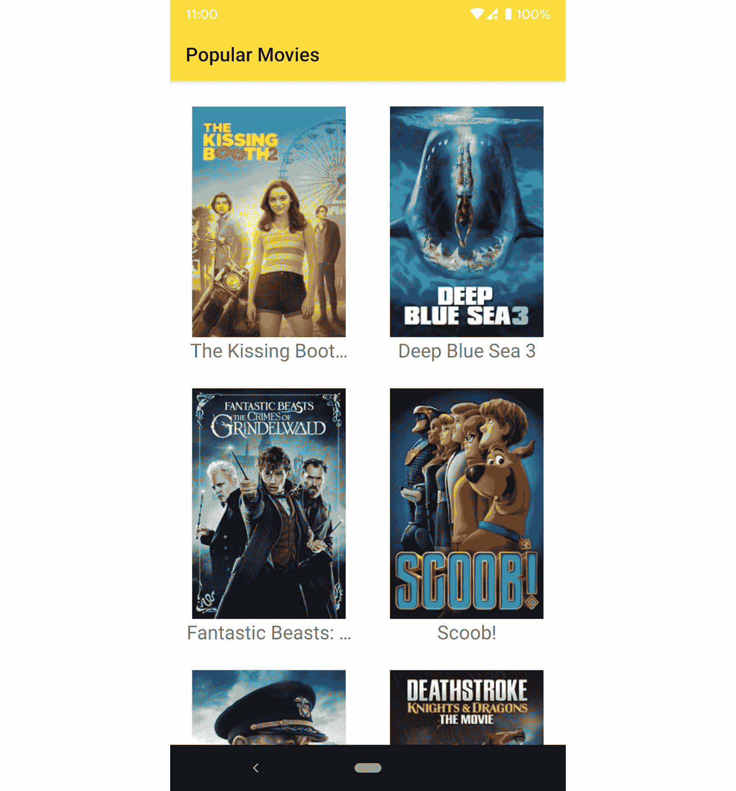
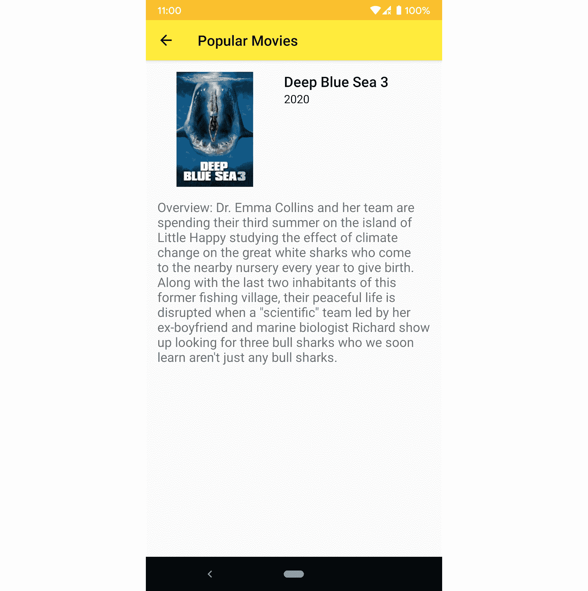
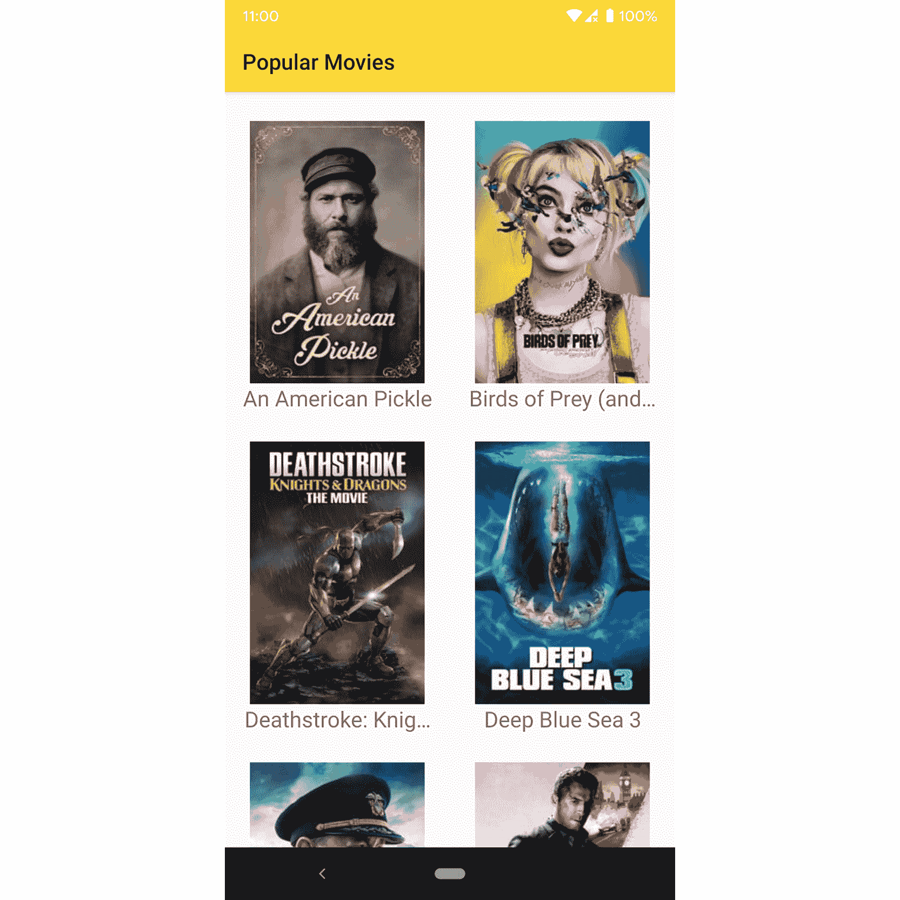
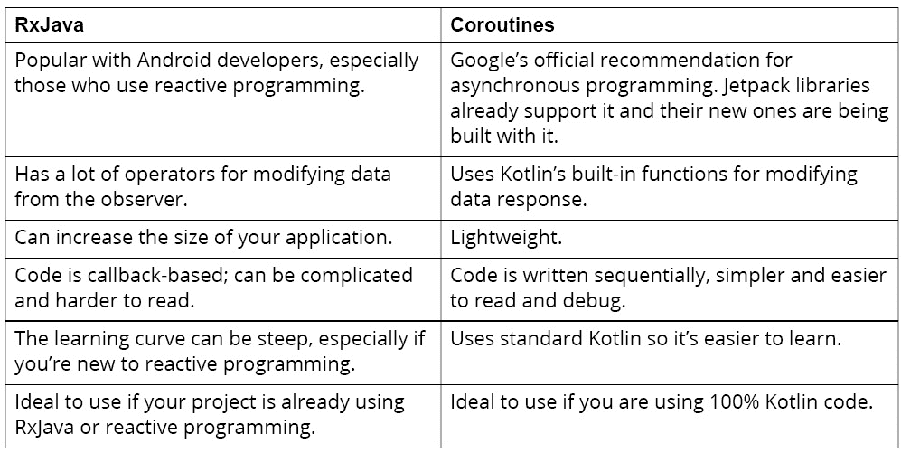
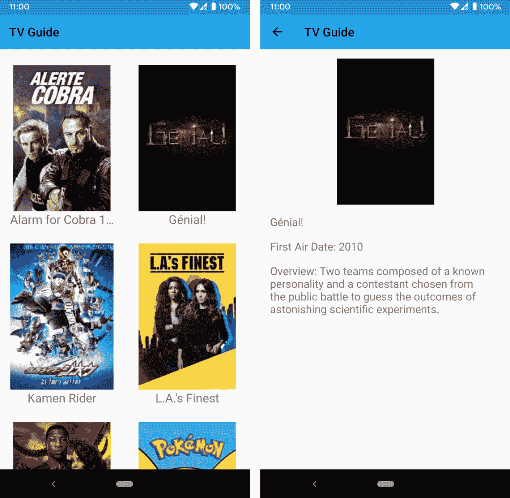

# 13。RxJava 和 Coroutines

概观

本章将向您介绍如何使用 RxJava 和 coroutines 进行后台操作和数据操作。它涵盖了如何使用 RxJava 从外部应用编程接口检索数据，以及如何使用 coroutines 来实现这一点。您还将学习如何使用 RxJava 操作符和 LiveData 转换来操作和显示数据。

到本章结束时，您将能够在后台使用 RxJava 管理网络调用，并使用 RxJava 运算符转换数据。您还将能够使用 Kotlin 协同程序在后台执行网络任务，并使用 LiveData 转换来操作数据。

# 简介

现在，您已经学习了安卓应用开发的基础知识，并实现了诸如 RecyclerViews、通知、从网络服务获取数据和服务等功能。您还获得了测试和持久化数据的最佳实践技能。在前一章中，您学习了依赖注入。现在，您将学习后台操作和数据操作。

一些安卓应用可以独立工作。然而，大多数应用需要后端服务器来检索或处理数据。这些操作可能需要一段时间，具体取决于互联网连接、设备设置和服务器规格。如果长时间运行的操作在主 UI 线程中运行，应用将被阻止，直到任务完成。应用可能会变得没有响应，并可能会提示用户关闭它并停止使用它。

为了避免这种情况，需要无限长时间的任务必须异步运行。异步任务意味着它可以与另一个任务并行运行或在后台运行。例如，当异步从数据源获取数据时，您的用户界面仍然可以显示或与用户交互。

您可以使用像 RxJava 和 coroutines 这样的库来进行异步操作。我们将在本章中讨论这两个问题。让我们从 RxJava 开始。

# RxJava

RxJava 是用于反应式编程的库**反应式扩展** ( **Rx** )的 Java 实现。在反应式编程中，您可以观察到数据流。当值改变时，可以通知您的观察者并做出相应的反应。例如，假设点击一个按钮是你可以观察到的，并且有观察者在听。如果用户点击那个按钮，你的观察者就能做出反应，做出特定的动作。

RxJava 使异步数据处理和错误处理变得更加简单。按照通常的方式写是很棘手的，也容易出错。如果您的任务涉及一系列异步任务，那么编写和调试将会更加复杂。使用 RxJava，可以更容易地完成，并且代码更少，可读性和可维护性更强。RxJava 还有一系列操作符，您可以使用它们将数据转换为所需的类型或格式。

RxJava 有三个主要组件:观察器、观察器和操作器。要使用 RxJava，您需要创建发出数据的观察点，使用 RxJava 操作符转换数据，并使用观察者订阅观察点。观察者可以在不阻塞主线程的情况下等待可观察到的产生数据。

## 可观察物、观察者和操作者

让我们详细了解 RxJava 的三个主要组件。

观察到

可观察的是可以被倾听的数据来源。它可以向其侦听器发出数据。

`Observable`类代表一个可观察的。您可以使用`Observable.just`和`Observable.from`方法从列表、数组或对象中创建观察点。例如，您可以使用以下内容创建观察点:

```kt
val observable = Observable.just("This observable emits this string")
val observableFromList = Observable.fromIterable(listOf(1, 2, 3, 4))
```

有更多的功能可以用来创建观察点，如`Observable.create`、`Observable.defer`、`Observable.empty`、`Observable.generate`、`Observable.never`、`Observable.range`、`Observable.interval`和`Observable.timer`。你也可以做一个返回`observable`的函数。在[https://github . com/reaction vex/RxJava/wiki/Creating-Observables](https://github.com/ReactiveX/RxJava/wiki/Creating-Observables)了解更多关于创建观察点的信息。

可观察的事物可以是热的，也可以是冷的。冷观察台只有在有用户收听时才会发出数据。例如数据库查询或网络请求。另一方面，即使没有观测者，热观测器也会发出数据。这方面的例子是安卓系统中的用户界面事件，比如鼠标和键盘事件。

一旦你创建了一个可观察的对象，观察者就可以开始聆听可观察对象发送的数据。

**操作员**

运算符允许您在将数据传递给观察者之前，修改和组合从可观察到的数据。使用运算符会返回另一个可观察的结果，因此您可以链接运算符调用。例如，假设你有一个可以观察到的从 1 到 10 的数字。您可以对其进行过滤，只得到偶数，然后将列表转换为另一个包含每个项目方块的列表。要在 RxJava 中做到这一点，您可以使用以下代码:

```kt
Observable.range(1, 10)
.filter { it % 2 == 0 }
.map { it * it }
```

前面代码的输出将是值为 4、16、36、64 和 100 的数据流。

**观察者**

观察者订阅可观察的事物，并在观察者发出数据时得到通知。他们可以听到下一个可观察到的值或误差。`Observer`类是观察者的接口。它有四种方法，您可以在创建观察者时覆盖它们:

*   `onComplete`:当可观测者发送完数据后
*   `onNext`:当可观测的发送了新的数据
*   `onSubscribe`:当观察者订阅了一个可观察的事物
*   `onError`:当可观察到遇到错误时

要订阅一个可观察的，你可以调用`Observable.subscribe()`传入一个新的`Observer`接口实例。例如，如果您想订阅从`2`到`10`的一组偶数，您可以执行以下操作:

```kt
Observable.fromIterable(listOf(2, 4, 6, 8, 10))
    .subscribe(object : Observer<Int> {
        override fun onComplete() {
            println("completed")
        }
        override fun onSubscribe(d: Disposable) {
            println("subscribed")
        }
        override fun onNext(t: Int) {
            println("next integer is $t")
        }
        override fun onError(e: Throwable) {
            println("error encountered")
        }
    })
```

有了这段代码，观察者将打印下一个整数。当它订阅时，当可观察的完成时，当它遇到错误时，它也会打印文本。

`Observable.subscribe()`有不同的重载功能，可以通过`onNext`、`onError`、`onComplete`和`onSubscribe`参数。这些函数返回一个`disposable`对象。关闭活动时可以调用其`dispose`功能，防止内存泄漏。例如，可以为`disposable`对象使用一个变量:

```kt
val disposable = observable
            ...
            .subscribe(...)
```

然后，在产生可观测值的活动的`onDestroy`函数中，您可以调用`disposable.dispose()`来阻止观察者收听可观测值:

```kt
override fun onDestroy() {
    super.onDestroy()
    disposable.dispose()
}
```

除了观察器、观察器和操作器，您还需要了解 RxJava 调度器，这将在下一节中介绍。

## 调度程序

默认情况下，RxJava 是同步的。这意味着所有进程都在同一个线程中完成。有些任务需要一些时间，例如数据库和网络操作，这些任务需要异步进行或者在另一个线程中并行运行。为此，您需要使用调度器。

调度程序允许您控制运行操作的线程。有两个功能可以使用:`observeOn`和`subscribeOn`。您可以使用`subscribeOn`功能设置您的观察对象将在哪个线程上运行。`observeOn`功能允许您设置下一个操作符的执行位置。

比如你有`getData`功能，从网络上取数据，返回一个可观察的，你可以订阅`Schedulers.io`，用`AndroidSchedulers.mainThread()`观察安卓主 UI 线程:

```kt
val observable = getData()
   .subscribeOn(Schedulers.io())
   .observeOn(AndroidSchedulers.mainThread())
   ...
```

`AndroidSchedulers`是 RxAndroid 的一部分，是 RxJava 对 Android 的扩展。你将需要 RxAndroid 在 Android 应用开发中使用 RxJava。

在下一节中，您将学习如何将 RxJava 和 RxAndroid 添加到项目中。

## 将 RxJava 添加到项目中

您可以通过将以下代码添加到您的`app/build.gradle`文件依赖项来将 RxJava 添加到您的项目中:

```kt
implementation 'io.reactivex.rxjava3:rxandroid:3.0.0'
implementation 'io.reactivex.rxjava3:rxjava:3.0.7'
```

这会将 RxJava 和 RxAndroid 库添加到您的 Android 项目中。RxAndroid 库已经包含 RxJava，但最好还是添加 RxJava 依赖项，因为与 RxAndroid 捆绑的库可能不是最新版本。

## 在安卓项目中使用 RxJava

RxJava 有几个好处，其中之一是在非 UI 线程中处理长时间运行的操作，例如网络请求。网络呼叫的结果可以被转换成可观察的。然后，您可以创建一个观察者，它将订阅可观察到的数据并呈现数据。在向用户显示数据之前，您可以使用 RxJava 操作符转换数据。

如果您正在使用改装，您可以通过添加一个调用适配器工厂将响应转换为 RxJava 可观察到的。首先，您需要在您的`app/build.gradle`文件依赖项中添加`adapter-rxjava3`，如下所示:

```kt
implementation 'com.squareup.retrofit2:adapter-rxjava3:2.9.0'
```

这样，您就可以在`Retrofit`实例中使用`RxJava3CallAdapterFactory`作为调用适配器。您可以通过以下代码来实现:

```kt
val retrofit = Retrofit.Builder()
    ...
    .addCallAdapterFactory(RxJava3CallAdapterFactory.create())
    ...
```

现在，您的改装方法可以返回您可以在代码中收听的`Observable`对象。例如，在您调用电影端点的`getMovies`改装方法中，您可以使用以下方法:

```kt
@GET("movie")
fun getMovies() : Observable<Movie>
```

让我们通过将 RxJava 添加到安卓项目中来尝试一下到目前为止您所学到的东西。

## 练习 13.01:在安卓项目中使用 RxJava

在本章中，您将使用一个使用电影数据库应用编程接口显示热门电影的应用。前往[https://developers.themoviedb.org/](https://developers.themoviedb.org/)注册一个 API 密钥。在本练习中，您将使用 RxJava 从电影/流行端点获取所有流行电影的列表，无论年份如何:

1.  在 Android Studio 中创建新项目。命名你的项目`Popular Movies`并使用包名`com.example.popularmovies`。
2.  设置想要保存项目的位置，然后点击`Finish`按钮。
3.  Open `AndroidManifest.xml` and add the `INTERNET` permission:

    ```kt
    <uses-permission android:name="android.permission.INTERNET" />
    ```

    这将允许您使用设备的互联网连接进行网络呼叫。

4.  Open your `app/build.gradle` file and add the kotlin-parcelize plugin at the end of the plugins block:

    ```kt
    plugins {
        ...
        id 'kotlin-parcelize'
    }
    ```

    这将允许您对模型类使用 Parcelable。

5.  Add the following in the `android` block:

    ```kt
    compileOptions {
        sourceCompatibility JavaVersion.VERSION_1_8
        targetCompatibility JavaVersion.VERSION_1_8
    }
    kotlinOptions {
        jvmTarget = '1.8'
    }
    ```

    这些将允许您在项目中使用 Java 8。

6.  Add the following dependencies in your `app/build.gradle` file:

    ```kt
    implementation 'androidx.recyclerview:recyclerview:1.1.0'
    implementation 'com.squareup.retrofit2:retrofit:2.9.0'
    implementation 'com.squareup.retrofit2:adapter-rxjava3:2.9.0'
    implementation 'io.reactivex.rxjava3:rxandroid:3.0.0'
    implementation 'io.reactivex.rxjava3:rxjava:3.0.7'
    implementation 'com.squareup.retrofit2:converter-moshi:2.9.0'
    implementation 'com.github.bumptech.glide:glide:4.11.0'
    ```

    这些行将向您的项目中添加 RecyclerView、Glide、renewing、RxJava、RxAndroid 和 Moshi 库。

7.  Create a `dimens.xml` file in the `res/values` directory and add a `layout_margin` dimension value:

    ```kt
    <resources>
        <dimen name="layout_margin">16dp</dimen>
    </resources>
    ```

    这将用于视图的垂直和水平边距。

8.  Create a new layout file named `view_movie_item.xml` and add the following:

    view_movie_item.xml

    ```kt
    9    <ImageView
    10        android:id="@+id/movie_poster"
    11        android:layout_width="match_parent"
    12        android:layout_height="240dp"
    13        android:contentDescription="Movie Poster"
    14        app:layout_constraintBottom_toBottomOf="parent"
    15        app:layout_constraintEnd_toEndOf="parent"
    16        app:layout_constraintStart_toStartOf="parent"
    17        app:layout_constraintTop_toTopOf="parent"
    18        tools:src="@tools:sample/backgrounds/scenic" />
    19
    20    <TextView
    21        android:id="@+id/movie_title"
    22        android:layout_width="match_parent"
    23        android:layout_height="wrap_content"
    24        android:layout_marginStart="@dimen/layout_margin"
    25        android:layout_marginEnd="@dimen/layout_margin"
    26        android:ellipsize="end"
    27        android:gravity="center"
    28        android:lines="1"
    29        android:textSize="20sp"
    30        app:layout_constraintEnd_toEndOf="@id/movie_poster"
    31        app:layout_constraintStart_toStartOf="@id/movie_poster"
    32        app:layout_constraintTop_toBottomOf="@id/movie_poster"
    33        tools:text="Movie" />
    ```

    这一步的完整代码可以在[http://packt.live/3sD8zmN](http://packt.live/3sD8zmN)找到。

    此布局文件包含电影海报和标题文本，将用于列表中的每部电影。

9.  Open `activity_main.xml`. Replace the Hello World TextView with RecyclerView:

    ```kt
    <androidx.recyclerview.widget.RecyclerView
        android:id="@+id/movie_list"
        android:layout_width="match_parent"
        android:layout_height="match_parent"
    app:layoutManager=  "androidx.recyclerview.widget.GridLayoutManager"
        app:layout_constraintBottom_toBottomOf="parent"
        app:layout_constraintTop_toTopOf="parent"
        app:spanCount="2"
        tools:listitem="@layout/view_movie_item" />
    ```

    此回收视图将显示电影列表。它将使用两列`GridLayoutManager`。

10.  Create a new package, `com.example.popularmovies.model`, for your model class. Make a new model class named `Movie` with the following:

    ```kt
    @Parcelize
    data class Movie(
        val adult: Boolean = false,
        val backdrop_path: String = "",
        val id: Int = 0,
        val original_language: String = "",
        val original_title: String = "",
        val overview: String = "",
        val popularity: Float = 0f,
        val poster_path: String = "",
        val release_date: String = "",
        val title: String = "",
        val video: Boolean = false,
        val vote_average: Float = 0f,
        val vote_count: Int = 0
    ) : Parcelable
    ```

    这将是代表来自应用编程接口的`Movie`对象的模型类。

11.  以`activity_details.xml`为布局文件，创建一个名为`DetailsActivity`的新活动。
12.  Open the `AndroidManifest.xml` file and add `MainActivity` as the value for the `parentActivityName` attribute of `DetailsActivity`:

    ```kt
    <activity android:name=".DetailsActivity"
                android:parentActivityName=".MainActivity" />
    ```

    这将在详细信息活动中添加一个向上图标，以返回主屏幕。

13.  Open `activity_details.xml`. Add the required views. (The code below is truncated for space. Refer to the file linked below for the full code that you need to add.)

    activity_details.xml

    ```kt
    9    <ImageView
    10        android:id="@+id/movie_poster"
    11        android:layout_width="160dp"
    12        android:layout_height="160dp"
    13        android:layout_margin="@dimen/layout_margin"
    14        android:contentDescription="Poster"
    15        app:layout_constraintStart_toStartOf="parent"
    16        app:layout_constraintTop_toTopOf="parent"
    17        tools:src="@tools:sample/avatars" />
    18
    19    <TextView
    20        android:id="@+id/title_text"
    21        style="@style/TextAppearance.AppCompat.Title"
    22        android:layout_width="0dp"
    23        android:layout_height="wrap_content"
    24        android:layout_margin="@dimen/layout_margin"
    25        android:ellipsize="end"
    26        android:maxLines="4"
    27        app:layout_constraintEnd_toEndOf="parent"
    28        app:layout_constraintStart_toEndOf="@+id/movie_poster"
    29        app:layout_constraintTop_toTopOf="parent"
    30        tools:text="Title" />
    ```

    这一步的完整代码可以在[http://packt.live/38WyRbQ](http://packt.live/38WyRbQ)找到。

    这将在详细信息屏幕上添加海报、标题、版本和概述。

14.  Open `DetailsActivity` and add the following:

    ```kt
    class DetailsActivity : AppCompatActivity() {
        companion object {
            const val EXTRA_MOVIE = "movie"
            const val IMAGE_URL = "https://image.tmdb.org/t/p/w185/"
        }
        override fun onCreate(savedInstanceState: Bundle?) {
            super.onCreate(savedInstanceState)
            setContentView(R.layout.activity_details)
            val titleText: TextView = findViewById(R.id.title_text)
            val releaseText: TextView = findViewById(R.id.release_text)
            val overviewText: TextView = findViewById(R.id.overview_text)
            val poster: ImageView = findViewById(R.id.movie_poster)
            val movie = intent.getParcelableExtra<Movie>(EXTRA_MOVIE)
            movie?.run {
                titleText.text = title
                releaseText.text = release_date.take(4)
                overviewText.text = "Overview: $overview"
                Glide.with(this@DetailsActivity)
                    .load("$IMAGE_URL$poster_path")
                    .placeholder(R.mipmap.ic_launcher)
                    .fitCenter()
                    .into(poster)
            }
        }
    }
    ```

    这将显示所选电影的海报、标题、发行版和概述。

15.  Create an adapter class for the movie list. Name the class `MovieAdapter`. Add the following:

    ```kt
    class MovieAdapter(private val clickListener: MovieClickListener) :   RecyclerView.Adapter<MovieAdapter.MovieViewHolder>() {
        private val movies = mutableListOf<Movie>()
    override fun onCreateViewHolder(parent: ViewGroup,   viewType: Int): MovieViewHolder {
            val view = LayoutInflater.from(parent.context)          .inflate(R.layout.view_movie_item, parent, false)
            return MovieViewHolder(view)
        }
        override fun getItemCount() = movies.size
        override fun onBindViewHolder(holder: MovieViewHolder,       position: Int) {
            val movie = movies[position]
            holder.bind(movie)
            holder.itemView.setOnClickListener {           clickListener.onMovieClick(movie) }
        }
        fun addMovies(movieList: List<Movie>) {
            movies.addAll(movieList)
            notifyItemRangeInserted(0, movieList.size)
        }
    }
    ```

    这个类将是您的 RecyclerView 的适配器。

16.  Add `ViewHolder` for your class after the `onBindViewHolder` function:

    ```kt
    class MovieAdapter...
        ...
        class MovieViewHolder(itemView: View) :       RecyclerView.ViewHolder(itemView) {
            private val imageUrl = "https://image.tmdb.org/t/p/w185/"
            private val titleText: TextView by lazy {
                itemView.findViewById(R.id.movie_title)
            }
            private val poster: ImageView by lazy {
                itemView.findViewById(R.id.movie_poster)
            }
            fun bind(movie: Movie) {
                titleText.text = movie.title
                Glide.with(itemView.context)
                    .load("$imageUrl${movie.poster_path}")
                    .placeholder(R.mipmap.ic_launcher)
                    .fitCenter()
                    .into(itemView.poster)
            }
        }
    }
    ```

    这将是`MovieAdapter`用于回收视图的`ViewHolder`。

17.  Below the `MovieViewHolder` declaration, add `MovieClickListener`:

    ```kt
    class MovieAdapter...
        ...
        interface MovieClickListener {
            fun onMovieClick(movie: Movie)
        }
    }
    ```

    当点击一部电影查看详细信息时，将使用该界面。

18.  Create another class named `PopularMoviesResponse` in the `com.example.popularmovies.model` package:

    ```kt
    data class PopularMoviesResponse (
        val page: Int,
        val results: List<Movie>
    )
    ```

    这将是您从流行电影的应用编程接口端点获得的响应的模型类。

19.  Create a new package, `com.example.popularmovies.api`, and add a `MovieService` interface with the following contents:

    ```kt
    interface MovieService {
    @GET("movie/popular")
    fun getPopularMovies(@Query("api_key") apiKey: String):   Observable<PopularMoviesResponse>
    }
    ```

    这将定义您将用于检索热门电影的端点。

20.  用`movieService` :

    ```kt
    class MovieRepository(private val movieService: MovieService) { ... } 
    ```

    的构造函数创建一个`MovieRepository`类
21.  添加`apiKey`(带有来自电影数据库应用编程接口的应用编程接口密钥的值)和`fetchMovies`函数，从端点检索列表:

    ```kt
    private val apiKey = "your_api_key_here"
    fun fetchMovies() = movieService.getPopularMovies(apiKey)
    ```

22.  Create an application class named `MovieApplication` with a property for `movieRepository`:

    ```kt
    class MovieApplication : Application() {
        lateinit var movieRepository: MovieRepository
    }
    ```

    这将是应用的应用类。

23.  覆盖`MovieApplication`类的`onCreate`功能并初始化`movieRepository` :

    ```kt
    override fun onCreate() { 
      super.onCreate()
      val retrofit = Retrofit.Builder()
        .baseUrl("https://api.themoviedb.org/3/")
        .addConverterFactory(MoshiConverterFactory.create())
        .addCallAdapterFactory(RxJava3CallAdapterFactory.create())
        .build()
      val movieService = retrofit.create(MovieService::class.java)
      movieRepository = MovieRepository(movieService) 
    }
    ```

24.  在`AndroidManifest.xml`文件

    ```kt
    <application
        ...
        android:name=".MovieApplication"
        ... />
    ```

    中将`MovieApplication`设置为应用的`android:name`属性的值
25.  用`movieRepository` :

    ```kt
    class MovieViewModel(private val movieRepository: MovieRepository) :   ViewModel() { ... }
    ```

    的构造函数创建一个`MovieViewModel`类
26.  为`popularMovies`、`error`和`disposable`添加属性:

    ```kt
    private val popularMoviesLiveData = MutableLiveData<List<Movie>>()
    private val errorLiveData = MutableLiveData<String>()
    val popularMovies: LiveData<List<Movie>>
        get() = popularMoviesLiveData
    val error: LiveData<String>
        get() = errorLiveData
    private var disposable = CompositeDisposable()
    ```

27.  Define the `fetchPopularMovies` function. Inside the function, get the popular movies from `movieRepository`:

    ```kt
        fun fetchPopularMovies() {
            disposable.add(movieRepository.fetchMovies()
                .subscribeOn(Schedulers.io())
                .map { it.results }
                .observeOn(AndroidSchedulers.mainThread())
                .subscribe({
                    popularMoviesLiveData.postValue(it)
                }, { error ->
                    errorLiveData.postValue("An error occurred:                   ${error.message}")
                })
            )
        }
    ```

    这将在订阅时在`Schedulers.io`线程中异步获取热门电影，并将返回一个可观察的主线程操作符。

28.  Override the `onCleared` function of the `MovieViewModel` and dispose of the `disposable`:

    ```kt
        override fun onCleared() {
            super.onCleared()
            disposable.dispose()
        }
    ```

    这将在视图模型被清除时处理`disposable`，就像活动被关闭一样。

29.  Open `MainActivity` and add define a field for the movie adapter:

    ```kt
    private val movieAdapter by lazy {
        MovieAdapter(object : MovieAdapter.MovieClickListener {
            override fun onMovieClick(movie: Movie) {
                openMovieDetails(movie)
            }
        })
    }
    ```

    这将有一个监听器，当点击一部电影时会打开详细信息屏幕。

30.  在`onCreate`功能中，为`movie_list` `RecyclerView`设置适配器:

    ```kt
    val recyclerView: RecyclerView = findViewById(R.id.movie_list)
    recyclerView.adapter = movieAdapter 
    ```

31.  在`MainActivity`上创建`getMovies`功能。内部初始化`movieRepository`和`movieViewModel` :

    ```kt
        private fun getMovies() {
            val movieRepository = (application as           MovieApplication).movieRepository
            val movieViewModel = ViewModelProvider(this, object :           ViewModelProvider.Factory {
                override fun <T : ViewModel?>               create(modelClass: Class<T>): T {
                    return MovieViewModel(movieRepository) as T
                }
            }).get(MovieViewModel::class.java)
        }
    ```

32.  在`getMovies`功能结束时，从`movieViewModel`向`popularMovies`和`error` 直播数据添加一个观察者:

    ```kt
    private fun getMovies() {
            ...
            movieViewModel.fetchPopularMovies()
            movieViewModel.popularMovies
                .observe(this, { popularMovies ->
                    movieAdapter.addMovies(popularMovies)
                })
                movieViewModel.error.observe(this, { error ->
                    Toast.makeText(this, error, Toast.LENGTH_LONG).show()
                })
        }
    ```

33.  在`MainActivity`类的`onCreate`函数结束时，调用`getMovies()`函数:

    ```kt
    getMovies()
    ```

34.  点击列表中的电影时，添加`openMovieDetails`功能打开详细信息屏幕:

    ```kt
    private fun openMovieDetails(movie: Movie) { 
        val intent =       Intent(this, DetailsActivity::class.java).apply { 
            putExtra(DetailsActivity.EXTRA_MOVIE, movie)
        }
        startActivity(intent)
    }
    ```

35.  Run your application. You will see that the app will display a list of popular movie titles:

    

    图 13.1:热门电影应用的外观

36.  点击一部电影，你会看到它的细节，比如上映日期和概览:



图 13.2:电影细节屏幕

您已经学习了如何使用 RxJava 从外部应用编程接口检索响应。在下一节中，您将把提取的数据转换成需要用 RxJava 操作符显示的数据。

## Mo 用 RxJava 运算符定义数据

当您有一个发出数据的可观察对象时，您可以在将数据传递给观察对象之前使用运算符来修改数据。您可以使用单个运算符或一系列运算符来获取所需的数据。您可以使用不同类型的运算符，例如转换运算符和筛选运算符。

转换运算符可以将可观察到的项目修改为您喜欢的数据。`flatMap()`运算符将项目转换为可观察的。在*练习 13.01 中，* *在安卓项目*中使用 RxJava，您将`PopularMoviesResponse`的可观测值转换为`Movies`的可观测值，如下所示:

```kt
.flatMap { Observable.fromIterable(it.results) }
```

另一个可以转换数据的算子是`map`。`map(x)`运算符对每个项目应用一个函数`x`，并返回另一个具有更新值的可观察值。例如，如果您有一个可观察的数字列表，您可以将其转换为另一个可观察的列表，每个数字乘以 2，如下所示:

```kt
.map { it * 2 }
```

过滤运算符允许您仅选择部分项目。通过`filter()`，可以根据设定的条件选择项目。例如，您可以使用以下内容过滤奇数:

```kt
.filter { it % 2 != 0 }
```

`first()`和`last()`操作符允许你获得第一个和最后一个项目，而使用`take(n)`或`takeLast(n)`，你可以获得 *n* 个第一个或最后一个项目。还有其他过滤操作符如`debounce()`、`distinct()`、`elementAt()`、`ignoreElements()`、`sample()`、`skip()`、`skipLast()`。

您还可以使用许多其他 RxJava 运算符。让我们尝试在安卓项目中使用 RxJava 操作符。

## Ex ercise 13.02:使用 RxJava 运算符

在前面的练习中，您使用 RxJava 从电影数据库应用编程接口获取了热门电影列表。现在，在 RecyclerView 中显示它们之前，您将添加操作符来按标题对电影进行排序，并且只获取上个月发布的电影:

1.  打开你在*练习 13.01*T3 中做的`Popular Movies`项目，在安卓项目中使用 RxJava。
2.  打开`MovieViewModel`并导航至`fetchPopularMovies`功能。
3.  You will be modifying the app to only display popular movies for this year. Replace `.map { it.results }` with the following:

    ```kt
    .flatMap { Observable.fromIterable(it.results) }
    .toList()
    ```

    这将把`MovieResponse`的可观测值转换成电影的可观测值。

4.  Before the `toList()` call, add the following:

    ```kt
    .filter {
        val cal = Calendar.getInstance()
        cal.add(Calendar.MONTH, -1)
        it.release_date.startsWith(
            "${cal.get(Calendar.YEAR)}-${cal.get(Calendar.MONTH) + 1}"
        )
    }
    ```

    这将只选择前一个月上映的电影。

5.  Run the application. You will see that the other movies are no longer displayed. Only those released this year will be on the list:

    

    图 13.3:带有当年热门电影的应用

6.  You'll also notice that the movies displayed are not in alphabetical order. Sort the movies by using the `sorted` operator before the `toList()` call:

    ```kt
    .sorted { movie, movie2 -> movie.title.compareTo(movie2.title) }
    ```

    这将根据电影的标题对电影进行排序。

7.  Run the application. You will see that the list of movies is now sorted alphabetically by title:

    

    图 13.4:按标题排序的年度热门电影应用

8.  在调用`toList()`之前，使用`map`操作符将电影列表映射到另一个标题为大写的列表中:

    ```kt
    .map { it.copy(title = it.title.toUpperCase(Locale.getDefault())) }
    ```

9.  Run the application. You will see that the movie titles are now in uppercase letters:

    

    图 13.5:电影标题大写的应用

10.  在`toList()`呼叫之前，使用`take`操作符只获取列表中的前四部电影:

    ```kt
    .take(4)
    ```

11.  Run the application. You will see that the RecyclerView will only show four movies:

    

    图 13.6:只有四部电影的应用

12.  尝试其他 RxJava 操作符并运行应用以查看结果。

您已经学习了如何使用 RxJava 操作符来操作从外部应用编程接口检索到的响应，然后在 RecyclerView 中显示它们。

在下一节中，您将学习如何使用 coroutines 而不是 RxJava 从外部 API 获取数据。

# corout〔t0〕ines

Coroutines 被添加到 Kotlin 1.3 中，用于管理后台任务，如进行网络调用和访问文件或数据库。Kotlin coroutines 是谷歌对安卓系统异步编程的官方推荐。他们的喷气背包库，如生命周期、工作管理器和房间，现在包括对协同程序的支持。

有了 coroutines，您可以按顺序编写代码。长时间运行的任务可以被做成一个挂起函数，当被调用时可以暂停线程而不阻塞它。挂起功能完成后，当前线程将恢复执行。这将使您的代码更容易阅读和调试。

要将功能标记为暂停功能，可以添加`suspend`关键字；例如，如果您有一个调用`getMovies`函数的函数，该函数从您的端点获取`movies`，然后显示它:

```kt
val movies = getMovies()
displayMovies(movies) 
```

您可以通过添加`suspend`关键字使`getMovies()`功能成为暂停功能:

```kt
suspend fun getMovies(): List<Movies> { ... }
```

这里，调用函数将调用`getMovies`并暂停。`getMovies`返回电影列表后，将恢复任务并显示电影。

挂起函数只能在挂起函数中或从协同程序中调用。协同程序有一个上下文，它包括协同程序调度程序。调度程序指定协同程序将使用什么线程。您可以使用三种调度程序:

*   `Dispatchers.Main`:用于在安卓主线程上运行
*   `Dispatchers.IO`:用于网络、文件或数据库操作
*   `Dispatchers.Default`:用于 CPU 密集型工作

要更改协同程序的上下文，您可以使用`withContext`函数来处理您想要使用不同线程的代码。例如，在您的暂停功能`getMovies`中，它从您的端点获取电影，您可以使用`Dispatchers.IO`:

```kt
suspend fun getMovies(): List<Movies>  {
    withContext(Dispatchers.IO) { ... }
}
```

在下一节中，我们将介绍如何创建协同程序。

## 创建〔t0〕ng corroutines

你可以用`async`和`launch`关键词创建一个协同词。`launch`关键字创建一个 coroutine 并且不返回任何内容。另一方面，`async`关键字返回一个值，您可以稍后使用`await`函数获得该值。

`async`和`launch`必须从`CoroutineScope`创建，这定义了协同的生命周期。例如，主线的协同范围是`MainScope`。然后，您可以使用以下内容创建协同程序:

```kt
MainScope().async { ... }
MainScope().launch { ... }
```

您也可以创建自己的`CoroutineScope`而不是使用`MainScope`，方法是使用`CoroutineScope`创建一个并传递协同词的上下文。例如，要创建用于网络呼叫的`CoroutineScope`，您可以定义以下内容:

```kt
val scope = CoroutineScope(Dispatchers.IO)
```

当不再需要函数时，可以取消协同程序，就像关闭活动一样。您可以通过从`CoroutineScope`调用`cancel`函数来实现:

```kt
scope.cancel()
```

视图模型也有一个默认的`CoroutineScope`来创建协同程序:`viewModelScope`。捷豹的生命周期也有你可以使用的`lifecycleScope`。`viewModelScope`在视图模型被破坏时被取消；`lifecycleScope`也在生命周期被破坏时被取消。因此，您不再需要取消它们。

在下一节中，您将学习如何向项目中添加协同工作。

## 将协同程序添加到您的项目

您可以通过将以下代码添加到您的`app/build.gradle`文件依赖项来将协同程序添加到您的项目中:

```kt
implementation "org.jetbrains.kotlinx:kotlinx-coroutines-core:1.3.9"
implementation "org.jetbrains.kotlinx:kotlinx-coroutines-android:1.3.9"
```

`kotlinx-coroutines-core`是协同程序的主库，而`kotlinx-coroutines-android`增加了对安卓主线程的支持。

当你打网络电话或从本地数据库获取数据时，你可以在安卓中添加协同程序。

如果您使用的是改装 2.6.0 或更高版本，您可以使用`suspend`将端点功能标记为暂停功能:

```kt
@GET("movie/latest")
suspend fun getMovies() : List<Movies>
```

然后，您可以创建一个调用暂停函数`getMovies`的协同程序，并显示列表:

```kt
CoroutineScope(Dispatchers.IO).launch {
    val movies = movieService.getMovies()
    withContext(Dispatchers.Main) {
        displayMovies(movies)
    }
}
```

您也可以使用 LiveData 来响应您的请求。LiveData 是一个可以保存可观察数据的 Jetpack 类。您可以通过添加以下依赖项将 LiveData 添加到您的安卓项目中:

```kt
implementation 'androidx.lifecycle:lifecycle-livedata-ktx:2.2.0'
```

让我们尝试在安卓项目中使用 coroutines。

## Exerci se 13.03:在安卓应用中使用协同程序

在本练习中，您将使用 coroutines 从电影数据库应用编程接口获取热门电影列表。您可以使用上一练习中的`Popular Movies`项目，也可以复制它:

1.  在AndroidStudio打开`Popular Movies`项目。
2.  Open the `app/build.gradle` file and remove the following dependencies:

    ```kt
    implementation 'com.squareup.retrofit2:adapter-rxjava3:2.9.0'
    implementation 'io.reactivex.rxjava3:rxandroid:3.0.0'
    implementation 'io.reactivex.rxjava3:rxjava:3.0.7'
    ```

    这些依赖关系将不再需要，因为您将使用 coroutines 而不是 RxJava。

3.  In the `app/build.gradle` file, add the dependencies for the Kotlin coroutines:

    ```kt
    implementation 'org.jetbrains.kotlinx:kotlinx-coroutines-core:1.3.9'
    implementation 'org.jetbrains.kotlinx:kotlinx-coroutines-android:1.3.9'
    ```

    这些将允许你在你的项目中使用协同程序。

4.  另外，添加视图模型和实时数据扩展库的依赖项:

    ```kt
    implementation 'androidx.lifecycle:lifecycle-livedata-ktx:2.2.0'
    implementation 'androidx.lifecycle:lifecycle-viewmodel-ktx:2.2.0'
    ```

5.  Open the `MovieService` interface and replace it with the following code:

    ```kt
    interface MovieService {
        @GET("movie/popular")
        suspend fun getPopularMovies(@Query("api_key") apiKey: String):       PopularMoviesResponse
    }
    ```

    这将把`getPopularMovies`标记为暂停功能。

6.  打开`MovieRepository`并添加电影和错误直播电影列表的数据:

    ```kt
        private val movieLiveData = MutableLiveData<List<Movie>>()
        private val errorLiveData = MutableLiveData<String>()
        val movies: LiveData<List<Movie>>
            get() = movieLiveData
        val error: LiveData<String>
            get() = errorLiveData
    ```

7.  将`fetchMovies`功能替换为暂停功能，从端点

    ```kt
        suspend fun fetchMovies() {
            try {
                val popularMovies = movieService.getPopularMovies(apiKey)
                movieLiveData.postValue(popularMovies.results)
            } catch (exception: Exception) {
                errorLiveData.postValue("An error occurred:               ${exception.message}")
            }
        }
    ```

    检索列表
8.  Update the contents of `MovieViewModel` with the following code:

    ```kt
        init {
            fetchPopularMovies()
        }
        val popularMovies: LiveData<List<Movie>>
        get() = movieRepository.movies
        fun getError(): LiveData<String> = movieRepository.error
        private fun fetchPopularMovies() {
            viewModelScope.launch(Dispatchers.IO)  {
                movieRepository.fetchMovies()
            }
        }
    ```

    `fetchPopularMovies`功能有一个协同程序，使用`viewModelScope`，将从`movieRepository`获取电影。

9.  打开`MovieApplication`文件。在`onCreate`功能中，删除包含`addCallAdapterFactory`的线路。应该是这样的:

    ```kt
        override fun onCreate() {
            super.onCreate()
            val retrofit = Retrofit.Builder()
                .baseUrl("https://api.themoviedb.org/3/")
                .addConverterFactory(MoshiConverterFactory.create())
                .build()
            ...
        }
    ```

10.  开启`MainActivity`课。删除`getMovies`功能。
11.  在`onCreate`功能中，取消对`getMovies`的调用。然后，在`onCreate`功能结束时，创建`movieViewModel` :

    ```kt
    val movieRepository =   (application as MovieApplication).movieRepository
    val movieViewModel =   ViewModelProvider(this, object: ViewModelProvider.Factory {
        override fun <T : ViewModel?>       create(modelClass: Class<T>): T {
            return MovieViewModel(movieRepository) as T
        }
    }).get(MovieViewModel::class.java)
    ```

12.  After that, add an observer to the `getPopularMovies` and `error` LiveData from `movieViewModel`:

    ```kt
            movieViewModel.popularMovies.observe(this, { popularMovies ->
                movieAdapter.addMovies(popularMovies
                    .filter {
                        it.release_date.startsWith(
                            Calendar.getInstance().get(Calendar.YEAR)                          .toString()
                        )
                    }
                    .sortedBy { it.title }
                )
            })
            movieViewModel.getError().observe(this, { error ->
                Toast.makeText(this, error, Toast.LENGTH_LONG).show()
    })
    ```

    这将使用获取的影片更新活动的 RecyclerView。电影列表使用Kotlin的`filter`功能过滤，只包括今年上映的电影。然后使用Kotlin的`sortedBy`功能按标题排序。

13.  运行应用。您将看到该应用将显示当前年份的热门电影标题列表，按标题排序:



图 13.7:显示今年发布的热门电影的应用，按标题排序

您已经使用 coroutines 和 LiveData 从远程数据源检索并显示了热门电影列表，而没有阻塞主线程。

在将实时数据传递到用户界面进行显示之前，您也可以先转换数据。在下一节中，您将了解到这一点。

# 下载〔t0〕terming live data

有时，您从视图模型传递到用户界面层的实时数据需要在显示之前先进行处理。例如，您只能选择数据的一部分，或者先对其进行一些处理。在上一个练习中，您过滤了数据，只选择了当年的热门电影。

要修改 LiveData，可以使用`Transformations`类。它有两个功能，`Transformations.map`和`Transformations.switchMap`，你可以使用。

`Transformations.map`将 LiveData 的值修改为另一个值。这可用于过滤、排序或格式化数据等任务。例如，您可以将电影标题中的`movieLiveData`转换为字符串 LiveData:

```kt
private val movieLiveData: LiveData<Movie>
val movieTitleLiveData : LiveData<String> = 
   Transformations.map(movieLiveData) { it.title }
```

当`movieLiveData`改变数值时，`movieTitleLiveData`也会根据电影的片名而改变。

通过`Transformations.switchMap`，可以将一个 LiveData 的价值转化为另一个 LiveData。当您想要使用原始 LiveData 执行涉及数据库或网络操作的特定任务时，可以使用此选项。例如，如果您有一个代表电影的实时数据`id`对象，您可以通过应用函数`getMovieDetails`将其转换为电影实时数据，该函数从`id`对象(例如从另一个网络或数据库调用)返回电影细节的实时数据:

```kt
private val idLiveData: LiveData<Int> = MutableLiveData()
val movieLiveData : LiveData<Movie> = 
    Transformations.switchMap(idLiveData) { getMovieDetails(it) }
fun getMovieDetails(id: Int) : LiveData<Movie> = { ... }
```

让我们对使用 coroutines 获取的电影列表使用 LiveData 转换。

## 练习 e 13.04:实时数据转换

在本练习中，您将转换电影的实时数据列表，然后将它们传递给`MainActivity`文件中的观察者:

1.  在AndroidStudio中，打开你在上一个练习中处理过的`Popular Movies`项目。
2.  Open the `MainActivity` file. In the `movieViewModel.popularMovies` observer in the `onCreate` function, remove the filter and `sortedBy` function calls. The code should look like the following:

    ```kt
    movieViewModel.getPopularMovies().observe(this,   Observer { popularMovies ->
        movieAdapter.addMovies(popularMovies)
    })
    ```

    这将显示列表中的所有电影，而不按标题排序。

3.  Run the application. You should see all movies (even those from the past year), not sorted by title:

    

    图 13.8:带有未排序的热门电影的应用

4.  Open the `MovieViewModel` class and update `popularMovies` with LiveData transformations to filter and sort the movies:

    ```kt
            val popularMovies: LiveData<List<Movie>>
            get() = movieRepository.movies.map { list ->
            list.filter {
                val cal = Calendar.getInstance()
                cal.add(Calendar.MONTH, -1)
                it.release_date.startsWith(
                    "${cal.get(Calendar.YEAR)}-${cal.get(Calendar.MONTH)                   + 1}"
                )
            }.sortedBy { it.title }
        }
    ```

    这将选择上个月发布的电影，并按标题排序，然后在`MainActivity`中将其传递给用户界面观察者。

5.  运行应用。您将看到该应用显示了当年的热门电影列表，按标题排序:


图 13.9:今年上映电影的应用按标题排序

您已经使用 LiveData 转换修改了电影列表，以仅选择今年发布的电影。在将它们传递给用户界面层的观察者之前，它们也是按标题排序的。

# 相关渠道和流程

如果您的协同程序正在获取一个数据流，或者您有多个数据源，并且您一个接一个地处理数据，您可以使用通道或流。

通道允许您在不同的协同程序之间传递数据。它们是一个热门的数据流。它会在调用值的那一刻运行并发出值，即使没有侦听器。同时，流是冷的异步流。它们仅在收集值时发出值。

想了解更多渠道和流量，可以去[https://kotlinlang.org](https://kotlinlang.org)。

# r Java vs corroutines

RxJava 和 coroutines 都可以在 Android 中用于后台任务，比如网络调用或数据库操作。

那你应该用哪一个？虽然您可以在应用中同时使用两者，例如，一个任务使用 RxJava，另一个任务使用 coroutines，但是您也可以将它们与`LiveDataReactiveStreams`或`kotlinx-coroutines-rx3`一起使用。但是，这将增加您使用的依赖项的数量和应用的大小。

那么，RxJava 还是 coroutines？下表显示了两者之间的差异:



图 13.10:coroutine 和 RxJava 的区别

让我们继续下一个活动。

## 活动 13.01:创建电视指南应用

很多人看电视。不过，大多数时候，他们不确定目前正在播出什么电视节目。假设您想开发一个应用，使用 Kotlin coroutines 和 LiveData 从电影数据库应用编程接口的`tv/on_the_air`端点显示这些节目的列表。

该应用将有两个屏幕:主屏幕和细节屏幕。在主屏幕上，您将显示正在播放的电视节目列表。电视节目将按名称排序。单击电视节目将打开详细信息屏幕，其中显示有关所选电视节目的更多信息。

完成步骤:

1.  在AndroidStudio新建一个项目，并命名为`TV Guide`。设置它的包名。
2.  在`AndroidManifest.xml`文件中添加`INTERNET`权限。
3.  在您的`app/build.gradle`文件中添加 Java 8 兼容性以及 RecyclerView、Glide、renewing、RxJava、RxAndroid、Moshi、ViewModel 和 LiveData 库的依赖项。
4.  添加一个`layout_margin`尺寸值。
5.  用海报的`ImageView`和电视节目的名称的`TextView`创建一个`view_tv_show_item.xml`布局文件。
6.  在`activity_main.xml`文件中，删除你好世界文本视图，并为电视节目列表添加回收视图。
7.  创建模型类，`TVShow`。
8.  以`activity_details.xml`为布局文件，创建一个名为`DetailsActivity`的新活动。
9.  打开`AndroidManifest.xml`文件，在`DetailsActivity`申报中增加`parentActivityName`属性。
10.  在`activity_details.xml`中，添加电视节目细节的视图。
11.  在`DetailsActivity`中，添加显示所选电视节目细节的代码。
12.  为电视节目列表创建一个`TVShowAdapter`适配器类。
13.  为您从正在播出的电视节目的应用编程接口端点获得的响应创建另一个名为`TVResponse`的类。
14.  创建一个`TelevisionService`类来添加改装方法。
15.  为`tvService`创建一个`TVShowRepository`类，并为`apiKey`和`tvShows`创建属性。
16.  创建暂停功能，从端点检索电视节目列表。
17.  用`TVShowRepository`的构造函数创建一个`TVShowViewModel`类。添加一个为电视节目列表返回实时数据的`getTVShows`功能和从存储库中获取列表的`fetchTVShows`功能。
18.  创建一个名为`TVApplication`的应用类，其属性为`TVShowRepository`。
19.  在`AndroidManifest.xml`文件中将`TVApplication`设置为应用的值。
20.  打开`MainActivity`，当`ViewModel`的实时数据更新其值时，添加代码更新回收视图。添加一个功能，当点击列表中的电视节目时，该功能将打开详细信息屏幕。
21.  运行您的应用。该应用将显示电视节目列表。单击电视节目将打开显示节目详细信息的详细信息活动。主屏幕和详细信息屏幕将类似于下图:



图 13.11:电视指南应用的主屏幕和细节屏幕

注意

这个活动的解决方案可以在:[http://packt.live/3sKj1cp](13.html)找到

# 苏〔t0〕麦理

这一章着重于用 RxJava 和 coroutines 做后台操作。后台操作用于长期运行的任务，例如从本地数据库或远程服务器访问数据。

您从 RxJava 的基础开始:可观察的、观察者和操作者。可观察性是提供数据的数据源。观察者倾听可观察的事物；当一个可观测的物体发出数据时，观测者可以做出相应的反应。运算符允许您在将数据传递给观察者之前，将数据从可观察数据修改为所需数据。

接下来，您学习了如何使 RxJava 调用与调度程序异步。调度程序允许您设置执行所需操作的线程。`subscribeOn`功能用于设置您的观察对象将在哪个线程上运行，`observeOn`功能允许您设置下一个操作符将在哪里执行。然后，您使用 RxJava 从外部应用编程接口获取数据，并使用 RxJava 运算符对数据进行过滤、排序和修改。

接下来，您学习了如何使用 Kotlin coroutines，这是谷歌推荐的异步编程解决方案。可以用`suspend`关键字将后台任务做成暂停功能。花冠可以用`async`或`launch`关键词开头。

您已经学习了如何创建挂起函数以及如何启动协同程序。您还使用调度程序来更改运行协同程序的线程。最后，您使用协同程序进行网络调用，并用 LiveData 转换函数`map`和`switchMap`修改检索到的数据。

在下一章中，您将学习架构模式。您将了解诸如 **MVVM** ( **模型-视图-视图模型**)等模式，以及如何改进应用的架构。