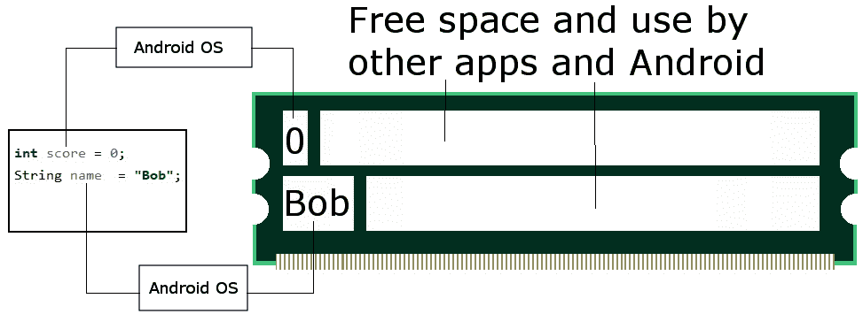
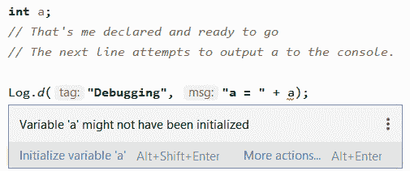
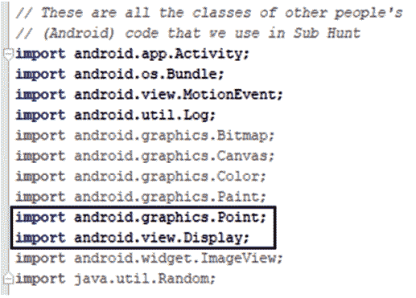
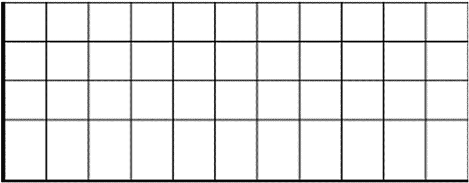

# *第三章*:变量、运算符和表达式

我们将在这一章取得良好的进展。我们将学习 Java 变量，这些变量允许我们为游戏提供所需的数据。通过这样做，像潜艇的位置和是否被击中这样的事情很快就可以编码了。此外，我们将研究**运算符**和**表达式**的使用，这将使我们能够在游戏执行时改变和数学处理这些数据。

在本章中，我们将涵盖以下主题:

*   处理语法和行话
*   全面讨论 Java 变量，包括**类型**、**引用**、**原语**、**声明**、**初始化**、**铸造**、**串联**等等
*   练习编写代码，使用运算符和表达式来使用和操作变量
*   了解用于在屏幕上绘制文本和图形的安卓屏幕坐标系
*   利用我们所学的知识给潜艇猎人游戏增加变量
*   学习如何处理常见错误

随着 Java 知识的进步，我们需要引入一点行话。

# 处理语法和行话

纵观本书，我们将用通俗易懂的英语来讨论一些技术性的东西。我绝不会指望你去读一个之前没有用非技术语言解释过的 Java 或者 Android 概念的技术解释。

到目前为止，在一些场合，我已经要求您接受一个简化的解释，以便在更合适的时候提供更完整的解释，就像我对类和方法所做的那样。

然而，Java 和 Android 社区，以及 Android 开发者教程网上，都充斥着用技术术语说话的人，要加入这些社区并从中学习，你需要了解他们使用的术语。

因此，一个好的方法是使用完全通俗易懂的语言学习一个概念或欣赏一个想法，但同时，作为学习过程的一部分，引入行话/技术术语。

Java **语法**是我们把放在一起的 Java 语言元素的方式，为了产生可以翻译成字节码的代码，以便它在 ART 系统中工作。Java 语法是我们使用的 Java 单词的组合，并将这些单词组成类似句子的结构，即我们的代码。当我们使用方法定义和方法调用来构造 Sub' Hunter 时，我们已经看到了这方面的例子。

这些 Java“单词”的数量数不胜数，但当它们被分成小块时，几乎可以肯定它们比任何人类口语都更容易学习。我们把这些词叫做**关键词**。

我有信心，如果你会阅读，那么你就可以学习 Java，因为学习 Java 比学习英语容易得多。那么，完成了初级 Java 课程的人和专业程序员有什么区别呢？正是这一点将语言学生和杰出诗人区分开来。

Java 的专业知识不在于我们知道如何使用的 Java 关键词的数量，而在于我们使用它们的方式。语言的掌握是通过练习、进一步学习和熟练使用关键词来实现的。许多人认为编程既是一门科学，也是一门艺术，这是有一定道理的。

重要说明

本书的后半部分将主要讲述我们如何使用代码，而不仅仅是代码本身。

# Java 变量

我已经提到变量是我们的数据。简单来说，数据就是价值。我们可以把一个变量想象成一个命名的存储盒。我们选择一个名字，也许是`livesRemaining`。这些名字有点像我们程序员进入用户安卓设备内存的窗口。

变量是计算机内存中的值，在必要时可以使用或更改它们的名称。

计算机内存有一个高度复杂的寻址系统。幸运的是，我们不需要与它交互，因为它是由操作系统处理的。Java 变量允许我们为程序需要处理的所有数据设计自己方便的名称。

ART 系统将处理与操作系统交互的所有技术细节，而操作系统将反过来与物理内存(RAM 微芯片)交互。

所以，我们可以把安卓设备的内存想象成一个巨大的仓库，等待我们添加变量。当我们给变量命名时，它们被存储在仓库中，以备我们需要时使用。当我们使用变量的名称时，设备确切知道我们指的是什么。

下图是我们如何看待代码中的变量的简单可视化:



图 3.1–代码中变量的可视化

然后我们可以告诉它做一些事情，比如得到`livesRemaining`，乘以`bonusAmount`，然后设置为零。

在一个典型的游戏中，我们可能有一个名为`score`的变量来保存玩家当前的分数。当玩家射击另一个外星人时，我们可以增加它，如果玩家射击一个平民，我们可以减去它。

可能出现的一些情况如下:

*   玩家完成一关，将`levelBonus`加到`playerScore`上。
*   玩家获得新的高分，因此将`score`的值赋给`highScore`。
*   玩家开始新的游戏，因此将`score`重置为零。

这些是变量的真实示例名称，如果您不使用 Java 限制的任何字符或关键字，您可以随意调用您的变量。

为了帮助你的游戏项目成功，采用**命名约定**是有用的，这样你的变量名就会一致。在本书中，我们将使用以小写字母开头的变量名的松散约定。当变量名称中有多个单词时，第二个单词将以大写字母开头。

重要说明

我们称之为**骆驼肠衣**；例如`camelCasing`。

以下是我们将很快使用的潜艇猎人游戏的一些可变示例:

*   `shotsTaken`
*   `subHorizontalPosition`
*   `debugging`

前面的例子也暗示了一些东西:

*   `shotsTaken`变量可能是一个整数。
*   `SubHorizontalPosition`听起来像一个坐标，可能是一个小数(浮点数)。
*   `debugging`听起来更像一个问题或陈述，而不是一个值。

很快，我们将看到有不同类型的变量。

重要说明

当我们转向面向对象编程时，我们将对特殊类型变量的命名约定使用扩展。

在我们查看更多带有一些变量的 Java 代码之前，我们需要看看我们可以创建和使用的变量类型。

## 不同类型的变量

不难想象，即使是一款简单的游戏也会有相当多的变数。在前一节中，我们介绍了几个；有些是假设的，有些来自潜艇猎人游戏。如果游戏有一个带有`width`、`height`、`color`、`ammo`、`shieldStrength`和`position`变量的敌人怎么办？

包括游戏在内的计算机程序的另一个常见要求是计算正确或错误。计算机程序使用`true`或`false`表示正确或错误的计算。

为了涵盖您可能想要存储或操作的这些和其他类型的数据，Java 提供了类型。有许多不同的类型，但它们都属于两个主要类别:**原始**和**参考**类型。

### 原始类型

变量有很多种类型，我们甚至可以发明自己的类型。但是现在，我们将看看我们将用于制作游戏的最常用的内置 Java 类型。平心而论，它们涵盖了我们可能会遇到的大多数情况。

我们已经讨论了假设的`score`变量。这个变量当然是一个数字，所以我们必须通过给它一个合适的类型来告诉 Java 编译器这一点。假设的`playerName`当然会包含组成玩家名字的角色。再往前跳一点，保存常规数字的类型叫做`int`(整数的缩写)，保存类似名字的数据的类型叫做`String`。如果我们试图将一个玩家的名字，也许是“`Jeff Minter`”，存储在一个`int`变量中，比如`score`，意为数字，我们肯定会遇到麻烦，如下图所示:


图 3.2–在整型变量中存储字符串时出错

正如我们所看到的，Java 的设计是为了使这种错误不可能成为一个运行的程序。编译器保护我们不受自己的攻击，可能会出什么问题呢？

让我们来看看 Java 中最常见的那些类型；然后，我们将学习如何开始使用它们:

*   `int`:int 类型用于存储整数；也就是整数。这种类型使用 32 块(位)内存，因此可以存储大小略大于 20 亿的值，包括负值。
*   `long`: As the name suggests, long data types can be used when even larger numbers are needed. A `long` type uses 64 bits of memory, and 2 to the power of 63 is what we can store in this. If you want to see what that looks like, it's 9,223,372,036,854,775,807\. Perhaps, surprisingly, there are many uses for long variables, but the point is, if a smaller variable will do, we should use it because our program will use less memory.

    重要说明

    你可能想知道什么时候你可能需要使用这个数量级的数字。显而易见的例子是进行复杂计算的数学或科学应用程序，但另一个用途可能是计时。当你计算某件事需要多长时间时，安卓`System`类使用自 1970 年 1 月 1 日以来的毫秒数。一毫秒是一秒的千分之一，所以从 1970 年以来已经有相当多的毫秒了。

*   `float`:这是针对浮点数的。这些数字的精度超过了小数点。由于数字的小数部分和整数部分一样占用内存空间，因此与非浮点数相比，数字在`float`中的范围缩小了。
*   `boolean`:在这本书里，我们会用到大量布尔语。`boolean`变量类型可以是`true`或`false`；没别的了。布尔人会回答这样的问题，玩家还活着吗？我们目前正在调试吗？布尔的两个例子够不够？
*   `short`:这种类型就像`int`的节省空间版。它可以用来存储既有正值又有负值的整数，并且可以对其执行数学运算。它与`int`的不同之处在于它只使用了 16 位内存，与`int`相比，这只是内存量的一半。`short`的缺点是，与`int`相比，它只能存储-32768 到 32767 范围内的一半数值。
*   `byte`: This type is like an even more space-saving version of `short`. It can be used to store whole numbers with both positive and negative values and can have mathematical operations performed on it. Where it differs to `int` and `short` is that it uses only 8 bits of memory, which is just half the amount of memory compared to `byte` and quarter the memory of `int`. The downside of `byte` is that it can only store half the range of values compared to `int`, from -128 to 127\. Saving 8 or even 16 bits in total is unlikely to ever matter, but if you needed to store millions of whole numbers in a program, then `short` and `byte` are worth considering.

    小费

    我一直在实践层面上讨论数据类型，这在本书的上下文中很有用。如果你对一个数据类型的值是如何存储的以及为什么会有这些限制感兴趣，那就来看看这里的 Oracle Java 教程网站:[http://docs . Oracle . com/javase/tutorial/Java/nut sandbolts/data types . html](http://docs.oracle.com/javase/tutorial/java/nutsandbolts/datatypes.html)。请注意，您不需要比我们已经讨论过的更多的信息来继续阅读本书。

正如我们刚刚了解到的，我们可能想要存储的每种类型的数据都需要特定数量的内存。这意味着在开始使用变量之前，我们必须让 Java 编译器知道变量的类型。

请记住，这些变量被称为基元类型。它们使用预定义的内存量，因此——使用我们的仓库存储类比——它们适合预定义大小的存储盒。

正如“原始”标签所暗示的，它们不像引用类型那样复杂，我们接下来将讨论它。

### 参考变量

您可能已经注意到我们没有覆盖`String`变量类型。我们之前用这个来介绍保存字母数字数据的变量的概念，比如玩家在高分桌上的名字或者多人游戏大厅。

#### 字符串引用

**字符串**是一种特殊类型的变量，被称为**参考类型**。它们非常简单地引用内存中存储变量的位置，但是引用类型本身并没有定义正在使用的特定内存量。原因很简单。

在程序执行之前，我们并不总是知道需要在其中存储多少数据。

我们可以把字符串和其他引用类型看作是不断扩展和收缩的存储盒。那么，这些字符串引用类型中的一个最终不会碰到另一个变量吗？

由于我们认为设备的内存是一个巨大的仓库，里面装满了货架上贴有标签的储物盒，因此您可以将 ART 系统视为一个超高效的叉车司机，将不同类型的储物盒放在最合适的位置。

如果有必要，艺术系统会在几分之一秒内快速移动东西，以避免碰撞。此外，在适当的时候，叉车司机 ART 甚至会扔掉(删除)不需要的储物箱。与此同时，不断卸载所有类型的新存储盒，并将其放在该类型变量的最佳位置。

ART 将仓库不同部分的变量引用到原始变量。我们将在 [*第 14 章*](14.html#_idTextAnchor282)*Java Collections**堆栈、堆和垃圾收集器*中详细了解这一点。

因此，字符串可以用来存储任何键盘字符。从玩家姓名首字母到整个冒险游戏文本，任何东西都可以存储在一个字符串中。

#### 数组引用

我们还将探索更多的参考类型。**数组**是一种存储大量相同类型变量的方法，可以快速有效地访问。我们将在 [*第 12 章*](12.html#_idTextAnchor247)*中查看数组，使用数组*处理大量数据。

现在，把一个数组想象成我们仓库中的一个通道，它包含某一类型的所有变量，按照精确的顺序排列。数组是引用类型，所以 ART 将它们作为字符串保存在仓库的同一部分。举个例子，我们将在 [*第 12 章*](12.html#_idTextAnchor247)*用数组处理大量数据的子弹地狱游戏中，使用数组存储数千发子弹。*

#### 对象/类引用

另一种引用类型是类。我们已经讨论过课程，但没有适当解释。我们将熟悉 [*第八章*](08.html#_idTextAnchor147)*面向对象编程中的类。*

现在，我们知道我们可能想要存储的每种类型的数据都需要一定的内存。因此，在开始使用变量之前，我们必须让 Java 编译器知道变量的类型。

# 如何使用变量

理论够了。让我们学习如何使用我们的变量和类型。请记住，每种原语类型都需要特定数量的真实设备内存。这是编译器需要知道变量是什么类型的原因之一。因此，在我们尝试使用它做任何事情之前，我们必须首先声明一个变量及其类型。

## 声明变量

要声明一个名为`score`的`int`类型的变量，我们需要键入以下内容:

```java
int score;
```

就这样。只需说明类型——在本例中为`int`——然后留下一个空格，并键入变量的名称。另外，请注意行尾的分号`;`。这将告诉编译器，我们已经完成了这一行，接下来的内容，如果有的话，不是声明的一部分。

类似地，对于几乎所有其他变量类型，声明将以相同的方式发生。这里有一些例子。这个过程就像在仓库里预留一个贴了标签的收纳盒。以下代码中显示的变量名是任意的:

```java
long millisecondsElapsed;
float subHorizontalPosition;
boolean debugging;
String playerName;
```

那么，现在我们已经在仓库中为安卓设备的内存预留了一个空间，我们如何在这个空间中放置一个值呢？

## 初始化变量

初始化是的下一步。这里，对于每种类型，我们初始化一个变量值。考虑在储物盒中放置一个数值:

```java
score = 1000;
millisecondsElapsed = 1438165116841l;// 29th July 2016 11:19 am
subHorizontalPosition = 129.52f;
debugging = true;
playerName = "David Braben";
```

注意`String`使用一对双引号`""`来初始化一个值。

我们还可以将声明和初始化步骤结合起来。在下面的代码中，我们声明并初始化了之前使用过的相同变量，但只需一步:

```java
int score = 1000;
long millisecondsElapsed = 1438165116841l;//29th July 2016 11:19am
float subHorizontalPosition = 129.52f;
boolean debugging = true;
String playerName = "David Braben";
```

我们是单独声明和初始化还是一起声明和初始化取决于具体情况。重要的是，我们必须在某个时候同时做到这两点:

```java
int a;
// That's me declared and ready to go?
// The next line attempts to output a to the logcat
Log.d("debugging", "a = " + a);
// Oh no I forgot to initialize a!!
```

这将导致以下警告:



图 3.3–未初始化变量“a”的警告标志

这条规则有一个重要的例外。在某些情况下，变量可以有**默认值**。我们将在 [*第 8 章*](08.html#_idTextAnchor147)*面向对象编程*中看到这一点；但是，声明和初始化变量是一种好的做法。

让我们学习如何使我们的变量更有用。

# 使变量对运算符有用

当然，在几乎任何游戏中，我们都需要*用这些价值观去做*的事情。我们用运算符操纵变量。

正如我们对变量类型所做的那样，让我们讨论一下本书中最常用的运算符。

## 本书使用最多的运算符

以下是我们将在本书中使用的最常见的允许我们操作变量的 Java 运算符列表。您不需要记住它们，因为我们将在第一次使用它们时查看每一行代码。当我们初始化变量时，我们已经看到了第一个操作符`=`，但是当它更具冒险性时，我们将再次看到它。

一旦你看到一个操作符，你就能猜到其他操作符是做什么的，但是每个操作符的一些例子会帮助你熟悉它们:

*   The assignment operator (`=`): This makes the variable to the left of the operator hold the value or variable to the right; for example:

    `score = 1000;`

    `highScore = score;`

*   The addition operator (`+`): This adds values on either side of the operator together. It is usually used in conjunction with the assignment operator to add together two values or variables that have numeric values. Notice it is perfectly acceptable to use the same variable simultaneously on both sides of an operator; for example:

    `horizontalPosition = horizontalPosition + movementSpeed;`

    `score = score + 100;`

*   The subtraction operator (`-`): This subtracts the value on the right-hand side of the operator from the value on the left. Usually, this is used in conjunction with the assignment operator; for example:

    `numberAliens = numberAliens - 1;`

    `timeDifference = currentTime - fastestTime;`

*   The division operator (`/`): This divides the number on the left by the number on the right. Again, this is usually used in conjunction with the assignment operator; for example:

    `fairShare = numSweets / numChildren;`

    `framesPerSecond = numSeconds / numFrames;`

*   The multiplication operator (`*`): This multiplies variables and numbers together; for example:

    `answer = 10 * 10;`

    `biggerAnswer = 10 * answer;`

*   The increment operator (`++`): This is a neat way to add 1 to something; for example, `myVariable ++;` is the same as `myVariable = myVariable + 1;`.

    减量运算符(`--`):你猜对了——这是一种从某物中减去 1 的简写方式。`myVariable = myVariable -1;`同`myVariable --;`。

    重要说明

    操作员被分组。例如，除法运算符是乘法运算符之一。

Java 中的运算符比这个多。我们将在后面的第 7 章*中看到一大堆用 Java If、Else 和 Switch 做决定。*

小费

如果你对操作符很好奇，这里的 Java 网站上有一个完整的操作符列表:[http://docs . Oracle . com/javase/tutorial/Java/nut sandbolts/operators . html](http://docs.oracle.com/javase/tutorial/java/nutsandbolts/operators.html)。完成这些项目所需的所有操作人员都将在本书中得到充分说明。这个链接是为那些特别好奇的人提供的。

当我们将这些元素捆绑成一些有意义的语法时，我们称之为**表达式**。让我们来看看使用变量运算符的几种特殊情况。

### 铸造

有时，我们有一种类型的变量，但我们绝对必须有另一种类型。正如我们已经看到的，如果我们在变量中使用了错误的类型，那么编译器会给我们一个错误。一种解决方案是将一个值或变量转换成另一种类型。看看这段代码:

```java
float a = 1.0f
int b = (int) a;
```

在前面的代码中，`b`变量现在等于 1。请注意，如果`a`在小数点后有一些小数值，该部分不会被复制到`b`。然而，这有时仍然有用，并且存储在`a`中的完整`float`值保持不变。

注意，不是所有的值都可以强制转换为所有的类型，但是`float`到`int`、`int`到`float`是相当常见的。我们将在这个项目后期使用铸造。

### 串联

**串联**听起来很复杂，但它很简单，我们已经看到了——只是我们还没有谈到它。串联是我们将`String`值连接或相加在一起的地方。看看这个代码:

```java
String firstName = "Ralph";
String lastName = "Baer"
String fullName = firstName + " " + lastName
```

前面的代码做了三件事:

1.  声明并初始化一个名为`firstName`的`String`变量来保存`"Ralph"`值
2.  声明并初始化一个名为`lastName`的`String`变量来保存`"Baer"`值
3.  将`firstName`连接到一个空格字符`" "`，后跟`lastName`

`fullName String`变量现在保存`"Ralph Baer"`值。注意名字和姓氏中间的空格。

既然我们对变量有了很好的理解，我们可以在我们的游戏中运用一些。

# 声明并初始化副猎人变量

我们知道很多关于变量、类型以及如何操纵它们的知识，但是我们还没有考虑 Sub' Hunter 游戏需要什么样的变量和类型。这将有助于首先考虑我们需要跟踪和操纵的所有不同的价值观和类型；然后，在实际向项目添加声明代码之前，我们可以列出名称和类型的列表。之后，我们将初始化变量。

## 规划变量

让我们思考一下我们的游戏需要记录什么。这将决定我们将要声明的变量、类型和名称:

*   我们需要知道屏幕由多少像素组成。我们将这些变量称为`numberHorizontalPixels`和`numberVerticalPixels`。他们将是`int`式的。
*   一旦我们计算了游戏网格上一个块的大小(以像素为单位)，我们就会想要记住它。我们将为此使用一个名为`blockSize`的`int`变量。
*   如果我们有每个块的大小，我们还需要知道适合给定屏幕/网格的水平和垂直块的数量。我们将为此使用`gridWidth`和`gridHeight`变量，它们也属于`int`类型。
*   当玩家触摸屏幕时，我们需要记住被触摸的坐标。这些值将是精确的浮点坐标，因此我们将使用`float`类型，并将变量命名为`horizontalTouched`和`verticalTouched`。
*   还需要选择并记住潜艇随机进入的网格位置(水平和垂直)。我们称之为`subHorizontalPosition`和`subVerticalPosition`。这些也属于`int`类型。
*   每次玩家出手，我们都需要知道潜艇是否被击中。这意味着我们需要一个`boolean`变量，我们称之为`hit`。
*   `shotsTaken`变量将是`int`类型，顾名思义，将用于计算玩家迄今为止的出手次数。
*   `distanceFromSub`变量将用于存储玩家最近一次从潜艇射击的计算距离。它将是一个`int`类型的变量。
*   最后，在我们启动安卓工作室之前，我们需要知道我们是想要输出所有的调试文本还是仅仅展示游戏。名为`debugging`的`boolean`在这里会很好。

现在我们知道了游戏中所有变量的名称和类型，我们可以声明它们，以便在需要时随时使用。

## 声明变量

在安卓工作室中，添加 follo 翼高亮变量声明。

重要说明

本章末尾的完整代码可以在`Chapter 3`文件夹的 GitHub repo 中找到。

请注意，它们在`SubHunter`类声明中声明，在`onCreate`方法声明之前声明:

```java
public class SubHunter extends Activity {
// These variables can be "seen"
// throughout the SubHunter class
int numberHorizontalPixels;
int numberVerticalPixels;
int blockSize;
int gridWidth = 40;
int gridHeight;
float horizontalTouched = -100;
float verticalTouched = -100;
int subHorizontalPosition;
int subVerticalPosition;
boolean hit = false;
int shotsTaken;
int distanceFromSub;
boolean debugging = true;
/*
     Android runs this code just before
     the app is seen by the player.
     This makes it a good place to add
     the code that is needed for
     the one-time setup.
 */
```

请注意，在前面的代码中，我们声明了变量，就像我们在本章前面学习的那样，并且我们也初始化了其中的一些变量。

大部分变量会在后面的代码中初始化，但是可以看到`gridWidth`已经被初始化为值 40。这是一个相当任意的数字，一旦 Sub' Hunter 完成，你就可以用这个值玩了。然而，给`gridWidth`一个值可以作为你计算网格大小的起点，当然还有`gridHeight`值。我们将很快看到如何进行这些计算。

我们还将`horizontalTouched`和`verticalTouched`变量初始化为-100。这也是武断的；关键是屏幕还没有被触摸过，所以像这样有很远的值就很清楚了。

## 处理不同的屏幕尺寸和分辨率

安卓是一个庞大的设备生态系统，在我们进一步初始化变量之前，我们需要知道游戏将在哪个设备上运行的细节。

我们将编写一些代码来检测屏幕的分辨率。完成后，代码的目标是将水平和垂直分辨率存储在我们之前声明的变量中；即`numberHorizontalPixels`，和`numberVerticalPixels`。此外，一旦我们有了分辨率信息，我们将能够进行计算来初始化`gridHeight`和`blockSize`变量。

首先，让我们通过使用安卓应用编程接口的一些类和方法来获得屏幕分辨率。将以下高亮显示的代码添加到`onCreate`方法中:

```java
/*
     Android runs this code just before
     the player sees the app.
     This makes it a good place to add
     the code that is needed for
     the one-time setup.
 */
@Override
protected void onCreate(Bundle savedInstanceState) {
     super.onCreate(savedInstanceState);
     requestWindowFeature(Window.FEATURE_NO_TITLE);
     // Get the current device's screen resolution
     Display display =
     getWindowManager().getDefaultDisplay();
     Point size = new Point();
     display.getSize(size);
     Log.d("Debugging", "In onCreate");
     newGame();
     draw()'
}
```

小费

一旦我们在 [*第 8 章*](08.html#_idTextAnchor147)*面向对象编程*中进一步讨论了类，这里发生的事情就会变得更加清晰。现在，接下来是对三行新代码的简单解释。

代码通过以下方式获取设备的像素数量(宽和高)。再看看第一行新代码:

```java
Display display = getWindowManager().getDefaultDisplay();
```

具体是如何工作的将在 [*第 11 章*](11.html#_idTextAnchor225)*碰撞、音效、支持安卓不同版本*中更详细的解释，我们在讨论**链接**的时候。简单地说，我们创建一个名为`display`的`Display`类型的对象，并用依次调用`getWindowManager`和`getDefaultDisplay`方法的结果初始化该对象。这些方法属于`Activity`类。

然后，我们创建一个名为`Point`类型的`size`的新对象。我们将`size`作为`display.getSize`方法的论据。`Point`类型已经声明了`x`和`y`变量，因此`size`对象也声明了变量，该对象在第三行代码之后保存了显示器的宽度和高度(以像素为单位)。

正如我们接下来将看到的一样，这些值将用于初始化`numberHorizontalPixels`和`numberVerticalPixels`变量。

此外，请注意，如果您回顾代码顶部的`import`语句，与`Point`和`Display`类相关的语句不再灰显，因为我们现在正在使用它们:



图 3.4–在该点导入语句并显示类

我们提供的解释故意不完整。随着我们的进行，你的理解会有所提高。

现在我们已经声明了所有的变量，并将屏幕分辨率存储在隐藏在`size`对象中的看似难以捉摸的`x`和`y`变量中，我们可以初始化更多的变量，并准确地揭示我们是如何得到隐藏在`size`中的变量的。

## 处理不同的屏幕分辨率，第 1 部分–初始化变量

将下面这些四(六，包括注释)行代码相加。仔细研究它们，然后，我们可以谈论它们:

```java
@Override
protected void onCreate(Bundle savedInstanceState) {
     super.onCreate(savedInstanceState);
     requestWindowFeature(Window.FEATURE_NO_TITLE);
     // Get the current device's screen resolution
     Display display = 
     getWindowManager().getDefaultDisplay();
     Point size = new Point();
     display.getSize(size);
// Initialize our size based variables 
     // based on the screen resolution
     numberHorizontalPixels = size.x;
     numberVerticalPixels = size.y;
     blockSize = numberHorizontalPixels / gridWidth;
     gridHeight = numberVerticalPixels / blockSize;
     Log.d("Debugging", "In onCreate");
     newGame();
     draw();
}
```

让我们看看第一行代码，因为它让我们可以一窥本书后面的章节:

```java
numberHorizontalPixels = size.x;
```

在前一行代码的高亮部分发生的事情是，我们正在使用点运算符访问包含在`size`对象中的`x`变量。

请记住，屏幕的宽度(以像素为单位)先前已分配给`x`。因此，前一行的另一部分`numberHorizontalPixels =`用`x`中的任何值初始化`numberHorizontalPixels`。

下一行代码对`numberVerticalPixels`和`size.y`做同样的事情。为了方便起见，这里再重复一遍:

```java
numberVerticalPixels = size.y;
```

我们现在已经将屏幕分辨率整齐地存储在适当的变量中，准备在整个游戏中使用。

最后两行代码做了一些简单的数学运算来初始化`blockSize`和`gridHeight`变量。`blockSize`变量被赋予`numberHorizontalPixels`的值，除以`gridWidth`:

```java
blockSize = numberHorizontalPixels / gridWidth;
```

请记住`gridWidth`之前是用`40`值初始化的。因此，假设屏幕变成全屏和横向(就像我们的屏幕一样)，大小为 1，776 x 1，080 像素(就像我在上面测试的模拟器一样)，`gridWidth`将如下所示:

```java
1776 / 40 = 44.4
```

重要说明

实际上，我使用的模拟器水平分辨率为 1，920，但是 Back、Home 和 Running Apps 控件占据了一些屏幕空间。关键是分辨率是什么并不重要——我们的代码会适应它。

您可能已经注意到，结果包含一个分数，`int`类型包含整数。我们将很快再次讨论这个问题。

请注意，无论屏幕的分辨率有多高或多低，与水平网格位置的数量相比,`blockSize`都是合适的，当它们被绘制时，它们将相当整齐地占据屏幕的整个宽度。

上一个代码中的最后一行使用`blockSize`来匹配高度中可以容纳多少块:

```java
gridHeight = numberVerticalPixels / blockSize;
```

以前面讨论的解决方案为例，揭示了我们代码中的第一个缺陷。看看上一行的数学表现。请注意，我们在计算`gridWidth`时也有类似的缺陷:

```java
1080 / 44 = 24.54545…
```

我们有一个浮点(分数)答案。第一，如果你还记得我们对类型的讨论，`.54545..`丢失，留下`24`。如果您查看我们最终将绘制的以下网格，您会注意到最后一行的大小略有不同:



图 3.5–网格图像

根据您选择的设备/仿真器的分辨率，这可能会更明显或更不明显。

小费

理解`float`到`int`转换的一个常见错误是像我们在高中可能被教导的那样思考，并向上或向下舍入答案。当小数放在`int`中时，数值的小数部分是**丢失的**，而不是四舍五入的。所以，它总是较低的整数。作为一个极端的例子，1.999999 将变成 1，而不是 2。当你需要更高的精度或者需要高中舍入时，那么你可以做一些稍微不同的事情。当我们阅读这本书的时候，我们会做比这更高级更精确的数学运算。

未来需要考虑的另一个重要点，虽然现在不值得挂机，但是不同的设备有不同的宽高比。完全有可能，甚至很有可能，一些设备最终会有与其他设备不同数量的网格位置。在这个项目的背景下，这是无关紧要的，但是随着我们的游戏项目在本书中的改进，我们将解决这些问题。在最后的项目中，我们将使用虚拟摄像机解决所有问题。

随着代码变得越来越膨胀，您更有可能得到一些错误。在我们添加本章的最终代码之前，让我们讨论一下您可能会遇到的最可能的错误和警告，以便您知道如何在它们出现时解决它们。

# 错误、警告和错误

最常见的入门错误是语法错误。它们最常见于我们输入错误的 Java 关键字或忘记在关键字后留空格的时候。

如果您忘记在一行代码的末尾留下分号，则会出现以下错误:


图 3.6–分号导致的错误

重要说明

有时候我们不需要分号。我们将在前进的过程中看到这些。

看下面的截图，显示了我们输入编译器无法识别的单词时出现的错误:


图 3.7–编译器无法识别单词时显示的错误

此外，请注意，安卓工作室警告我们有一些未使用的变量——警告，如**字段“水平触摸”从未使用**。如果您将鼠标指针悬停在编辑器窗口右侧的小黄线上，就可以看到这些警告，就像我们查看未使用的`import`语句一样。还有其他警告，比如这个，表示`boom`方法从未被调用过:


图 3.8–从未调用方法动臂时显示的错误

警告不必为了代码的执行而被修复，但是它们值得关注，因为它们经常提示我们避免犯错误。这些警告将在接下来的几章中修复。

很多时候，问题很可能是一个 bug。我们现在将使用`printDebuggingText`方法输出所有变量值。

当我们继续阅读这本书时，我会指出很多常见的错误。

## 打印调试信息

我们可以随时输出所有我们的调试信息。这样做的好时机是在`draw`法中。这是因为每次有事发生，都会调用`draw`方法。然而，我们不想用大量的调试代码来扰乱`draw`方法。所以，在`draw`法的最后，给`printDebuggingText`加上这个称呼:

```java
/*
     Here we will do all the drawing.
     The grid lines, the HUD, and
     the touch indicator.
 */
void draw() {
     Log.d("Debugging", "In draw");
     printDebuggingText();
}
```

请注意，该方法始终被调用。你可能想知道如果`debugging`设置为`false`会发生什么。当我们在 [*第 7 章*](07.html#_idTextAnchor131)*中学习了用 Java If、Else 和 Switch 进行决策后，我们将修改此代码。*我们还将升级以下代码，使其将文本实时输出到设备屏幕，而不是 logcat 窗口。

将以下代码添加到`printDebuggingText`以将所有值输出到 logcat:

```java
// This code prints the debugging text
public void printDebuggingText(){
     Log.d("numberHorizontalPixels",
           "" + numberHorizontalPixels);
     Log.d("numberVerticalPixels",
           "" + numberVerticalPixels);
     Log.d("blockSize", "" + blockSize);
     Log.d("gridWidth", "" + gridWidth);
     Log.d("gridHeight", "" + gridHeight);
     Log.d("horizontalTouched",
           "" + horizontalTouched);
     Log.d("verticalTouched",
           "" + verticalTouched);
     Log.d("subHorizontalPosition",
           "" + subHorizontalPosition);
     Log.d("subVerticalPosition",
           "" + subVerticalPosition);
     Log.d("hit", "" + hit);
     Log.d("shotsTaken", "" + shotsTaken);
     Log.d("debugging", "" + debugging);
     Log.d("distanceFromSub",
           "" + distanceFromSub);
}
```

虽然前面的片段中有很多代码，但都可以很快解释清楚。我们正在使用`Log.d`来写入 logcat 窗口，就像我们之前所做的那样。新的是，对于输出的第二部分，我们正在编写诸如`"" + distanceFromSub`之类的东西。这具有将保存在空字符串(无)中的值与保存在`distanceFromSub`中的值连接起来的效果。

如果您再次检查前面的代码，您会看到每一行代码都在语音标记中声明了变量名。这具有打印*名称*变量的效果。在每一行代码中，后面是空的语音标记和变量连接，输出变量持有的*值*。

看到输出会使这一点更清楚。

# 测试游戏

用通常的方式运行游戏，观察输出。这是 logcat 输出:

```java
Debugging: In onCreate
Debugging: In newGame
Debugging: In draw
numberHorizontalPixels: 1776
numberVerticalPixels: 1080
blockSize: 44
gridWidth: 40
gridHeight: 24
horizontalTouched: -100.0
verticalTouched: -100.0
subHorizontalPosition: 0
subVerticalPosition: 0
hit: false
shotsTaken: 0
debugging: true
distanceFromSub: 0
```

我们可以看到所有常用的方法都以和以前一样的方式被激活，除此之外我们所有的调试变量都在`draw`方法之后被打印出来。如果我们点击屏幕，每次调用`draw`方法时，所有的调试数据都会打印出来。这是因为`draw`方法调用`printDebuggingText`方法。

# 总结

在这一章中，我们学习了变量的来龙去脉，添加了我们在 Sub' Hunter 游戏中需要的所有变量，并初始化了许多变量，但不是全部。此外，我们使用了一些稍微怪异的面向对象的魔法来捕捉屏幕分辨率，随着我们的进步，这些魔法会变得更加清晰。我们做的最后一件事是每次调用`draw`方法时将所有变量的值输出到 logcat 窗口。如果随着项目的进展，我们有 bug 或问题，这可能会被证明是有用的。

我们真的需要更深入地挖掘 Java 方法，因为一旦我们这样做了，它就打开了一个全新的可能性世界。这是因为我们可以更容易地使用安卓类的方法。然后，我们将能够使自己的方法更加高级和灵活，并使用一些强大的类，如`Canvas`类，开始向屏幕绘制图形。我们将在下一章学习方法，然后在下一章开始画画。