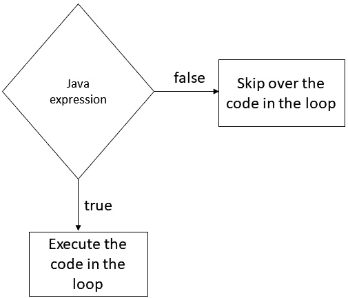
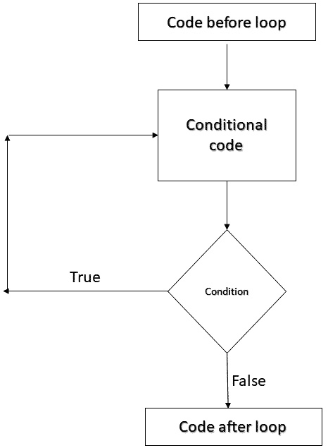

# *第六章*:循环重复代码块

在这简短的一章中，我们将学习 Java 循环，以及它们如何让我们以可控的方式重复代码的各个部分。Java 中的循环有几种不同的形式，我们将学习如何使用它们。在本书的剩余部分，我们将充分利用它们。

在本章中，我们将涵盖以下主题:

*   用 Java 做决定
*   更多的 Java 操作符
*   当循环时
*   边循环边做
*   对于循环
*   如何绘制 Sub' Hunter 游戏的网格线(使用循环)

这是第二章到最后一章，在我们完成第一个游戏并进入更高级的项目之前。

# 用 Java 做决策

我们的 Java 代码将不断地进行决策。例如，我们可能需要知道玩家是否被击中，或者他们是否有一定数量的上电。我们需要能够测试我们的变量，看看它们是否满足特定的条件，然后执行特定的代码段，这取决于它是否满足特定的条件。


图 6.1–用 Java 做决定

在本章和下一章中，我们将研究控制执行我们游戏代码的流程。顾名思义，这一章将讨论基于预定条件对代码重复部分的精细控制，而下一章将研究同样基于预定条件的代码不同部分的分支。

在接下来的两章中，我们的代码将变得更加深入，所以它有助于以一种更易读的方式呈现它。让我们看看代码缩进，让我们的讨论更容易。

# 保持东西整洁

您可能已经注意到我们项目中的 Java 代码是缩进的。例如，`SubHunter`类内的第一行代码缩进一个制表符，每个方法内的第一行代码缩进。这里有一张注释图片来说明这一点:


图 6.2–预期代码示例

另外，请注意当缩进的块结束时，通常用一个右花括号`}`，则`}`缩进的程度与开始该块的代码行相同。

小费

安卓工作室自动完成了大部分工作，但是它并没有 100%的组织好，因此有了这个讨论。

我们这样做是为了让代码更易读。然而，它不是 Java 语法的一部分，如果我们不费心这样做，代码仍然会编译。

随着代码变得越来越复杂，缩进和注释有助于保持代码的意义和结构清晰。我现在提到这一点，是因为当我们开始学习用 Java 进行决策的语法时，缩进变得特别有用，建议您以同样的方式缩进代码。

既然我们知道如何更清楚地展示我们的代码，让我们学习更多的操作符。然后，我们就可以真正开始用 Java 做决策了。

# 更多操作员

我们已经可以用运算符加(`+`)、取(`-`)、乘(`*`)、除(`/`)、赋(`=`)、增(`++`)和减(`--`)。让我们介绍一些更有用的操作符，然后我们将直接了解如何在 Java 中使用它们。

小费

不要担心记住这里显示的每个操作符。看一眼他们和他们的解释，然后快速进入下一部分。我们将很快使用一些操作符，当我们看一些它们允许我们做什么的例子时，它们会变得更加清晰。它们以列表的形式呈现在这里，只是为了从一开始就明确运营商的种类和范围。当它们没有与后面关于实现的讨论混合在一起时，该列表也将更便于参考。

我们使用运算符创建一个表达式，该表达式要么是**真**要么是**假**。我们将该表达式用括号括起来，如下所示:`(expression goes here)`。让我们来看看一些运算符:

*   **比较**运算符(`==`)。这是测试平等，是真还是假。比如像`(10 == 9)`这样的表达是错误的。10 显然不等于 9。
*   逻辑**不是**运算符(`!`)。`(! (2+2 == 5))`表达式测试某物是否为真，因为 2 + 2 不是 5。
*   另一个比较运算符(`!=`)。这个测试某物是否**不等于**。比如`(10 != 9)`表达式为真。10 不等于 9。
*   另一个比较运算符(`>`)。这个测试某样东西是不是**比**更伟大。`(10 > 9)`的表达是真的。
*   你大概能猜到这是做什么的(`<`)。这将测试小于当前值的值**。`(10 < 9)`的表达是假的。**
*   该操作员测试一个值是否大于或等于另一个值(`>=`)的**。如果两者都是真的，结果就是真的。比如`(10 >= 9)`表达式为真。`(10 >= 10)`的表达也是如此。**
*   像之前的运算符(`<=`)一样，这一个测试两个条件，但是这一次，它们是**小于还是等于**。`(10 <= 9)`的表达是假的。`(10 <= 10)`这个表情是真的。
*   这个运算符被称为逻辑**和** ( `&&`)。它测试一个表达式的两个或多个独立部分，**所有部分**必须为**真**结果为真。逻辑“与”通常与其他运算符一起使用来构建更复杂的测试。`((10 > 9) && (10 < 11))`表达式为真，因为两部分都为真，所以表达式为真。`((10 > 9) && (10 < 9))`表达是假的，因为只有一部分表达是真的，而另一部分是假的。
*   该运算符称为逻辑**或** ( `||`)。就像逻辑“与”一样，除了一个表达式的两个或多个“T8”部分中只有一个“T6”需要为“T9”真“T10”表达式才为真。让我们看看之前使用的例子，但是将`&&`切换为`||`。`((10 > 9) || (10 < 9))`表达式现在是真的，因为表达式的一部分是真的。
*   这个算子叫做**模数** ( `%`)。它会在两个数相除后返回它们的余数。例如，`(16 % 3 > 0)`表达式为真，因为 16 除以 3 等于 5，余数为 1，1 当然大于零。

如果没有正确使用这些运算符来做出影响实际变量和代码的实际决策，那么所有这些运算符实际上都是无用的。我们使用表达式和这些决策运算符的一种方法是使用循环。

# Java 循环

问循环和编程有什么关系是完全合理的。但它们正是顾名思义。它们是一种多次重复同一部分代码或在同一部分代码上循环的方式，尽管每次都有可能产生不同的结果。

这可能仅仅意味着做同样的事情，直到被循环的代码(**迭代**)提示循环结束。它可以是由循环代码本身指定的预定迭代次数，也可以是直到满足预定情况或**条件**为止。或者，它可能是这些东西中的一个以上的组合。除了我们将在下一章中学习的`if`、`else`和`switch`之外，循环也是 Java 的**控制流语句**的一部分。

在这里，我们将通过观察 Java 中不同类型的循环来学习如何以受控和精确的方式重复执行部分代码。想想潜艇猎人游戏中绘制所有网格线的难题。一遍又一遍地重复相同的代码对于在屏幕上绘制几十行非常有用，而无需编写几十行重复的代码。

循环的类型包括**而**循环、**做而**循环以及循环的**。我们还将了解使用不同类型循环的最合适情况。**

我们将看看 Java 为我们提供的所有主要类型的循环，这样我们就可以控制我们的代码。然后，我们可以添加一些代码来利用 Sub' Hunter 游戏中的循环。让我们来看看 Java 中第一个最简单的循环类型，叫做`while`循环。

## 当循环时

Java `while`循环有最简单的语法。通过`while`循环，我们放入一个表达式，它可以评估为真或假。如果表达式为真，则执行循环中的代码。如果它是假的，它就不会:



图 6.3–while 循环中的条件

看看这段代码:

```java
int x = 10;
while(x > 0){
     x--;
     // x decreases by one each pass through the loop
}
```

这里，在 while 循环之外，一个名为`x`的`int`被声明并初始化为 10。然后，`while`循环开始。其状态为`x > 0`。因此，`while`循环将继续循环其体内的代码，直到条件评估为假。因此，前面的代码将执行 10 次。

第一次通过时，x = 10，然后是 9，然后是 8，依此类推。但是一旦 x 等于 0，它就不再是大于 0 的，所以程序将退出循环，继续执行`while`循环后的第一行代码。

重要的是要认识到`while`循环甚至可能不会执行一次。看看这个:

```java
int x = 10;
while(x > 10){
     // more code here.
     // but it will never run 
     // unless x is greater than 10.
}
```

此外，条件表达式的复杂性和循环体中的代码量没有限制:

```java
int lives = 3;
int aliens = 12;
while(lives > 0 || aliens > 0){
     // keep playing game
     // etc.
}
// continue here when lives and aliens equal 0 – or less
```

前面的`while`循环将继续执行，直到`lives`和`aliens`都等于或小于零。由于条件使用逻辑或运算符`||`，这些条件中的任何一个为真都将导致`while`循环继续执行。

值得注意的是一旦进入循环体，它将总是完整的，即使是如果表达式在中途评估为假，因为它不会被再次测试，直到代码试图开始另一次传递。看看下面的例子:

```java
int x = 1;
while(x > 0){
     x--;
     // x is now 0 so the condition is false
     // But this line still runs
     // and this one
     // and me!
}
```

前面的循环体将只执行一次。我们也可以设置一个`while`循环，永远运行；这叫做一个**无限循环**。这里有一个例子:

```java
int x = 0;
while(true){
     x++; // I am going to get mighty big!
}
```

不出所料，`true`关键词评估为真。因此，满足循环条件。现在，我们需要一个退出计划。

### 打破循环

我们可以使用类似于这里所示的无限循环，这样我们就可以决定何时从其体内退出循环。当我们准备离开循环体时，我们可以通过使用`break`关键字来做到这一点，如下所示:

```java
int x = 0;
while(true){
     x++; // I am going to get mighty big

break; // No you're not
     // code doesn't reach here
}
```

我们可以在我们的`while`循环中组合任何决策工具，如`if`、`else`和`switch`，以及我们稍后将看到的其余循环。下面是`if`关键词的前瞻:

```java
int x = 0;
int tooBig = 10;
while(true){
     x++; // I am going to get mighty big!
     if(x == tooBig){
          break;
     } // No, you're not ha-ha.

     // code reaches here only until x = 10
}
```

当`x`等于`tooBig`时，您可能可以自己计算出`if(x == tooBig)`行代码导致`break`语句执行。

继续阅读更多展示`while`循环多功能性的页面会很简单，但在某个时候，我们想回到做一些真正的编程。所以，这里是最后一个结合`while`循环的概念。

## 边循环边做

一个`do while`循环与一个`while`循环非常相似，除了一个`do while`循环在代码体之后计算它的表达式*。这意味着在检查循环条件之前，`do` `while`循环将总是至少执行一次。下图显示了`do while`循环的代码执行流程:*



图 6.4–边做边循环中的条件

让我们看一个 do while 循环的小例子:

```java
int x= 10000000;// Ten million
do{
     x++;
}while(x < 10);
// x now = 10000001 
```

在测试`while`条件之前，代码将执行一次`do`块(`x++`)的内容，即使条件评估为假。

重要说明

注意`break`也可以用在`do while`循环中。

回到游戏之前，让我们再看一种循环。

## 用于循环

一个`for`循环的语法比一个`while`或`do while`循环稍微复杂一些，因为它们需要三个部分来初始化。先看看下面的代码；然后，我们将它拆开:

```java
for(int i = 0; i < 10;  i++){
     // Something that needs to happen 10 times goes here
}
```

`for`循环的明显模糊的形式在这样放置时更清晰:

```java
for(declaration and initialization; condition; 
change after each pass through the loop).
```

为了进一步澄清，我们有以下内容:

*   **声明和初始化**:我们创建一个新的`int`变量，`i`，并将其初始化为零。`int` `i = 0;`。
*   **条件**:和其他循环一样，是指循环要继续必须评估为真的条件。`i < 10;`。
*   **每次通过循环**后的变化:在本例中，`i++`表示每次通过时`i`增加/增加 1。我们也可以使用`i--`来减少/减少`i`每次通过，如下面的`for`循环所示:

```java
for(int i = 10; i > 0;  i--){
     // countdown
}
// blast off i = 0
```

重要说明

注意`break`也可以用在`for`循环中。

`for`循环本质上是控制初始化、条件评估和控制变量本身。

### 嵌套循环

我们也可以在循环中嵌套循环。例如，看一下下面的代码:

```java
int width = 20;
int height = 10;
for(int i = 0; i < width; i++){
     for(int j = 0; j < height; j++){
          // This code executes 200 times
     }
}
```

对于`i` (0 到 19)的每个值，前面的代码将循环通过`j` (0 到 9)的每个值。

问题是，我们为什么要这么做？当我们想要执行需要改变两个或更多变量的值的重复动作时，嵌套循环非常有用。例如，我们可以编写类似于前面代码的代码，在 20 个空格宽、10 个空格高的游戏板中循环。

此外，请注意，任何类型的循环都可以嵌套在任何其他循环中。我们将在本书的大多数项目中这样做。

我们现在准备在潜艇猎人游戏中使用循环。

# 使用 for 循环绘制潜艇猎人网格

到本书结束时，我们将已经使用了所有类型的循环，但是我们将使用的第一个循环是`for`循环。你能想象在 Sub' Hunter 中必须写一行代码来绘制网格的每一行吗？

我们将删除`draw`方法中现有的`drawLine…`代码，并用两个将绘制整个网格的`for`循环来替换它！

在这里，我将向您展示整个`draw`方法，只是为了确保您可以清楚地识别删除什么和添加什么。添加以下突出显示的代码:

```java
void draw() {
     gameView.setImageBitmap(blankBitmap);
     // Wipe the screen with a white color
     canvas.drawColor(Color.argb(255, 255, 255, 255));
     // Change the paint color to black
     paint.setColor(Color.argb(255, 0, 0, 0));
     // Draw the vertical lines of the grid
     for(int i = 0; i < gridWidth; i++){
          canvas.drawLine(blockSize * i, 0,
          blockSize * i, numberVerticalPixels,
          paint);
     }
     // Draw the horizontal lines of the grid
     for(int i = 0; i < gridHeight; i++){
          canvas.drawLine(0, blockSize * i,
          numberHorizontalPixels, blockSize * i,
          paint);
     }
     // Re-size the text appropriate for the
     // score and distance text
     paint.setTextSize(blockSize * 2);
     paint.setColor(Color.argb(255, 0, 0, 255));
     canvas.drawText(
          "Shots Taken: " + shotsTaken +
          "  Distance: " + distanceFromSub,
          blockSize, blockSize * 1.75f,
          paint);
     Log.d("Debugging", "In draw");
     printDebuggingText();
}
```

为了解释这段代码，让我们关注第二个`for`循环，如下所示:

```java
// Draw the horizontal lines of the grid
for(int i = 0; i < gridHeight; i++){
     canvas.drawLine(0, blockSize * i,
          numberHorizontalPixels, blockSize * i,
          paint);
}
```

这是绘制所有水平线的代码。

让我们分解第二个`for`循环，了解发生了什么。再看第二个`for`循环的第一行:

```java
for(int i = 0; i < gridHeight; i++){
```

前面的代码声明了一个名为`i`的新变量，并将其初始化为`0`。

然后，循环条件被设置为`i < gridHeight`。这意味着当`i`低于我们之前为`gridHeight`计算的值时，代码将继续循环。

`for`循环声明的第三部分是`i++`。这只是在每次通过循环时将`i`增加 1。

如果我们在这个讨论中假设`gridHeight`是 24，那么`for`循环体中的代码将执行 24 次，从 0 到 23。让我们再来看看循环体:

```java
canvas.drawLine(0, blockSize * i,
                numberHorizontalPixels, blockSize * i,
                paint);
```

首先，记住这只是一行代码。这是印刷在一本书上的局限性，这本书已经扩展到了三行。

代码的开始和我们在上一章中用`canvas.drawLine`画两条线时一样。使代码发挥其魔力的是我们作为线位置坐标传递的参数。

起始坐标为`0,` `blockSize * i`。因此，循环的第一部分从左上角 0，0 开始画一条线。记住`i`从 0 开始，所以不管`blockSize`是什么，答案仍然是 0。

接下来的两个参数决定了线将被画到哪里。论据是`numberHorizontalPixels,` `blockSize * i`。这样做的效果是在屏幕的最右边画线，也是在最上面。

对于循环中的下一次传递，`i`递增为 1，`drawLine`中的参数产生不同的结果。

第一个两个参数，`0`、`blockSize * i`，最后再次开始最左边的行，但是这次(因为`i`是 1)，开始坐标是屏幕下方的`blockSize`像素。请记住`blockSize`是通过将屏幕宽度(以像素为单位)除以`gridWidth`来确定的。`blockSize`变量的值正好是我们每行之间需要的像素数。因此，`blockSize * i`正是该行在屏幕上的正确像素位置。

绘制直线的坐标由`numberHorizontalPixels,` `blockSize * i`确定。这与屏幕最右侧的起始坐标完全相反。

由于`i`在循环中每次都递增，因此该行每次都向下移动精确的正确像素数。当`i`不再低于`gridHeight`时，过程结束。如果它不这样做，我们最终会画出屏幕上没有的线条。

最后一个论点是`paint`，这和我们之前的观点一样。

另一个`for`循环(第一个在`draw`方法中)的工作原理是一样的，只是循环条件是`i < gridWidth`(而不是`gridHeight`)并且直线是从`0`垂直画到`numberVerticalPixels`(而不是从`0`水平画到`numberHorizontalPixels`)。

研究这两个循环，以确保你理解细节。你现在可以运行代码，看到潜艇猎人网格的辉煌:


图 6.5-潜艇猎人游戏的网格

在之前的图像中，新绘制的网格线被调试文本覆盖。

# 总结

在这一章中，我们很快掌握了循环，包括`while`循环、`do while`循环和`for`循环。循环是 Java 控制流的一部分。最后，我们使用我们对`for`循环的知识来为 Sub' Hunter 游戏绘制网格线。此外，如果您想知道为什么我们没有使用所有的新运算符，那么不要担心——我们将在下一章中使用更多的运算符。

我们将在下一章中看到更多的控制流选项，其中一个(`if keyword`)我们刚刚快速看了一下。这一次，我们将学习如何分支执行我们的代码，一旦我们学会了这一点，我们将能够完成游戏。