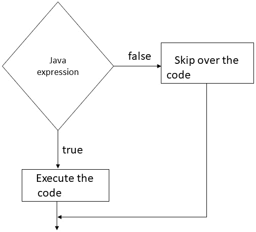
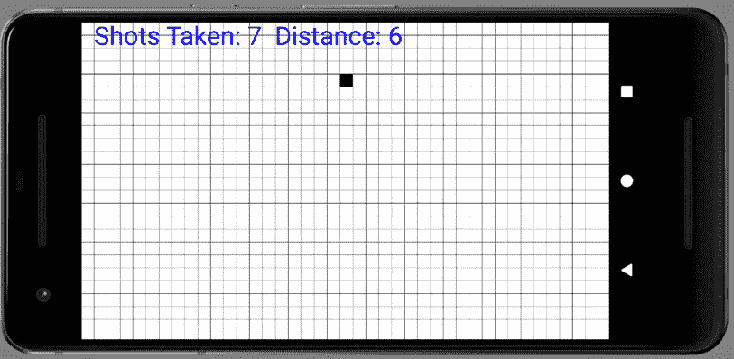
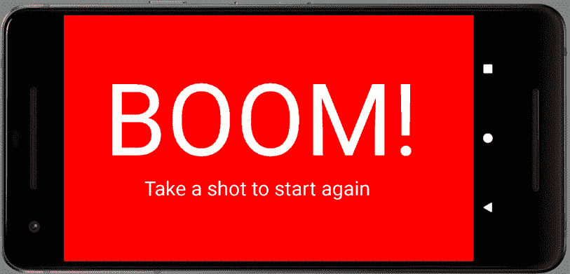

# *第 7 章*:用 Java If、Else 和 Switch 做决策

欢迎来到第一场比赛的最后部分。到本章结束时，您可以说已经学习了 Java 的大部分基础知识。在这一章中，我们将了解更多关于控制游戏执行流程的知识，我们还将对 Sub' Hunter 游戏进行最后的润色，使其具有可玩性。

在本章中，我们将涵盖以下主题:

*   一个帮助我们记住如何使用`if`和`else`的例子
*   使用开关进行决策
*   如何组合多种类型的 Java 控制流选项
*   理解屏幕触摸
*   完成潜艇猎人游戏

我们使用表达式和决策运算符的另一种方式是使用 Java 的`if`、`else`和`switch`关键字。这些正是我们需要给我们的游戏明确和毫不含糊的指示。

# 如果他们过桥，就开枪打他们

正如我们在上一章中看到的，运算符用于确定循环是否应该执行其主体中的代码以及执行频率。

我们现在可以更进一步了。让我们看一下将最常见的运算符`==`与 Java `if`和`else`关键字一起使用。然后，我们可以开始看到他们提供给我们的强大而精细的控制。

我们将使用`if`和几个条件运算符，以及一个小故事来演示它们的用法。下图说明了我们如何设计条件来确定代码块是否应该执行:



图 7.1–确定代码块的执行

下面是一个虚构的军事局势，本质上有点像游戏。

船长快死了，知道他剩下的下属都不是很有经验，他决定写一个 Java 程序，在他死后传达他最后的命令。部队在等待增援时必须守住桥的一边。

船长想让他的部队明白的第一个命令是:

**如果他们过桥，就开枪打他们。**

那么，我们如何在 Java 中模拟这种情况呢？我们需要一个布尔变量；也就是`isComingOverBridge`。下面的代码假设`isComingOverBridge`变量已经声明并初始化为`true`或`false`。

然后我们可以使用`if`，像这样:

```java
if(isComingOverBridge){

     // Shoot them

}
```

如果`isComingOverBridge`布尔值为`true`，则开始和结束大括号内的代码将运行。如果没有，则程序在`if`块之后继续，并且不运行其中的代码。

## 否则就这样做

上尉还想告诉他的部队，如果敌人不过桥，该怎么办(原地不动)。

现在，我们将介绍另一个 Java 关键词， **else** 。当我们想在`if`没有评估为真的情况下显式做某事时，我们可以使用`else`。

例如，如果敌人不过桥，要告诉部队原地不动，我们可以写下以下内容:

```java
if(isComingOverBridge){

     // Shoot them
}else{

     // Hold position
}
```

船长随后意识到问题并不像他最初想的那么简单。如果敌人过桥，但是兵力太多怎么办？他的队伍会被打垮。因此，他想出了下面的代码(这次我们也将使用一些变量):

```java
boolean isComingOverBridge;
int enemyTroops;
int friendlyTroops; 
// Code that initializes the above variables one way or another
// Now the if
if(isComingOverBridge && friendlyTroops > enemyTroops){
     // shoot them
}else if(isComingOverBridge && friendlyTroops < 
enemyTroops) {
     // blow the bridge
}else{
     // Hold position
}
```

前面的代码有三种可能的执行路径。第一是如果敌人正在过桥，而友军人数较多:

```java
if(isComingOverBridge && friendlyTroops > enemyTroops)
```

第二种是如果敌军越过桥梁，人数超过友军:

```java
else if(isComingOveBridge && friendlyTroops < enemyTroops)
```

然后，第三个也是最后一个可能的结果被最终`else`捕获，如果其他两个都不为真，则执行该结果，没有`if`条件:

挑战

你能在前面的代码中发现一个缺陷吗？一个可能会让一群没有经验的士兵完全陷入混乱的计划？敌军和友军人数完全相等的可能性还没有明确处理，因此将由最后`else`声明处理，这意味着没有敌军。我想任何一个自尊的上尉都会期望他的部队在这种情况下作战，他本可以改变第一个`if`语句来适应这种可能性。

```java
if(isComingOverBridge && friendlyTroops >=  enemyTroops)
```

最后，船长最后担心的是，如果敌人挥舞着投降的白旗从桥上经过并被迅速屠杀，那么他的士兵将最终成为战犯。这里需要的 Java 代码是显而易见的。使用`wavingWhiteFlag`布尔变量，他编写了以下测试:

```java
if (wavingWhiteFlag){
     // Take prisoners
}
```

但是他应该把代码放在哪里就不太清楚了。最后，队长选择了下面的嵌套解，将`wavingWhiteFlag`的测试改为逻辑非，如下所示:

```java
if (!wavingWhiteFlag){
     // not surrendering so check everything else

     if(isComingOverTheBridge && friendlyTroops >= 
     enemyTroops){
          // shoot them
     }else if(isComingOverTheBridge && friendlyTroops < enemyTroops) {
     // blow the bridge
     }
}else{

     // This is the else for our first if
     // Take prisoners
}
// Holding position
```

这证明了我们可以将`if`和`else`语句嵌套在一起，以创建相当深入和详细的决策。

我们可以继续用`if`和`else`做出越来越复杂的决定，但是我们所看到的作为介绍已经足够了。或许值得指出的是，解决问题的方法往往不止一种。*正确的*方式通常是以最清晰和最简单的方式解决问题的方式。

让我们看看用 Java 做决定的一些其他方法；然后，我们可以将它们放在一个应用中。

# 切换到决策

我们已经看到了将 Java 操作符与`if`和`else`语句相结合的巨大且几乎无限的可能性。但是有时候，用 Java 做决定可以用其他方式做得更好。

当我们必须基于不涉及复杂组合的可能性的清晰列表来决定时，那么**切换**通常是的方式。

我们这样开始一个`switch`决定:

```java
switch(argument){
}
```

在前面的例子中，**参数**可以是表达式或变量。在花括号`{}`内，我们可以基于`case`和`break`元素的参数做出决定:

```java
case x:
     // code to for case x
     break;
case y:
     // code for case y
     break;
```

在前面的例子中，您可以看到每个`case`表示一个可能的结果，每个`break`表示该案例的结束，以及不再评估其他案例陈述的点。

遇到的第一个`break`从`switch`块中脱离出来，在整个`switch`块的右大括号`}`之后继续下一行代码。

我们也可以使用不带值的`default`来运行一些代码，以防`case`语句都不为真，如下所示:

```java
default:// Look no value
     // Do something here if no other case statements are 
         true
     break;
```

让我们来看一个完整的`switch`在行动的例子。

## 切换示例

让我们假设我们正在编写一款老式的文本冒险游戏——玩家键入诸如“`Go East`”、“`Go West`”和“`Take Sword`”等命令的游戏。在这种情况下，`switch`可以像这样处理这种情况，我们可以使用`default`来处理玩家键入的命令，该命令不是专门处理的:

```java
// get input from user in a String variable called command
String command = "go east";
switch(command){
     case "go east":
          Log.d("Player: ", "Moves to the east" );
          break;
     case "go west":
          Log.d("Player: ", "Moves to the West" );
          break;
     case "go north":
          Log.d("Player: ", "Moves to the North" );
          break;
     case "go south":
          Log.d("Player: ", "Moves to the South" );
          break;

     case "take sword":
          Log.d("Player: ", "Takes the silver sword" );
          break;
     // more possible cases
     default:
          Log.d("Message: ", "Sorry I don't speak Elvish" 
           );
          break;
}
```

根据`command`的初始化，它可能由其中一个`case`语句具体处理。否则，我们将默认**对不起，我不会说精灵语**。

如果我们有很多代码要为一个特定的`case`执行，我们可以把它们都包含在一个方法中。在下面这段代码中，我突出显示了新的一行:

```java
     case "go west":
          goWest();
          break;
```

当然，我们需要编写新的`goWest`方法。然后，当`command`变量初始化为`"go west"`时，`goWest`方法将被执行，并且执行将返回到`break`语句，这将导致代码在`switch`块之后继续。

接下来，我们将看到我们可以混合和匹配不同类型的控制流语句。

# 组合不同的控制流块

正如你可能已经能够猜到的那样，我们可以在我们的`while`循环中组合任何决策工具，例如`if`、`else`和`switch`，以及其余的循环。看看下面的例子:

```java
int x = 0;
int tooBig = 10;
while(true){
     x++; // I am going to get mighty big!
     if(x == tooBig){
          break;
     } // No you're not

     // code reaches here only until x = 10
}
```

继续展示控制流结构的多功能性的更多页面会很简单，但是在某个时候，我们想要回到完成游戏。

既然我们对`if`和`else`很有信心，让我们再看一个关于循环的概念。

## 使用继续关键字

**继续**关键词以类似于`break`的方式作用于，这一点我们在上一章中已经了解过了。`continue`关键字将脱离循环体，但之后还将检查条件表达式，以便循环*可以再次运行*。一个例子会有帮助:

```java
int x = 0;
int tooBig = 10;
int tooBigToPrint = 5;
while(true){
     x++; // I am going to get mighty big!
     if(x == tooBig){
     break;
     } // No your not haha.

     // code reaches here only until x = 10
     if(x >= tooBigToPrint){
          // No more printing but keep looping
          continue;
     }
     // code reaches here only until x = 5
     // Print out x 
}
```

在前面的代码中，`continue`关键字用于所有循环，就像`break`关键字一样。它停止循环的当前迭代，但开始新的迭代——前提是满足条件。

现在，我们将探索如何处理屏幕上的触摸。

# 让屏幕触摸变得有意义

我们知道当玩家触摸屏幕时，操作系统会调用我们的`onTouchEvent`方法，给我们的代码响应触摸的机会。

再者，我们也看到，当玩家触摸屏幕时，`onTouchEvent`方法会被调用两次。我们知道这一点是因为我们在第二章[](02.html#_idTextAnchor048)**中检查的调试输出，Java–第一次接触*。您可能还记得方法是为触摸和释放事件调用的。*

 *为了让我们的游戏对触摸做出正确的反应，我们需要确定实际的事件类型，并找出触摸在屏幕上的确切位置。

看`onTouchEvent`方法的签名，特别注意突出的论点:

```java
public boolean onTouchEvent(MotionEvent motionEvent) {
```

即使我们对类和对象的知识仍然不完整，我们对方法的知识应该会帮助我们弄清楚这里发生了什么。名为`motionEvent`的`MotionEvent`类型的对象被传递到方法中。

如果我们想知道触摸事件的细节，那么我们需要打开`motionEvent`对象。

还记得`onCreate`法中我们称之为`size`的`Point`物体吗？这里再次提醒大家:

```java
// Get the current device's screen resolution
Display display = getWindowManager().getDefaultDisplay();
Point size = new Point();
display.getSize(size);
```

它包含两个变量，`x`和`y`，如下所示:

```java
// Initialize our size based variables based 
// on the screen resolution
numberHorizontalPixels = size.x;
numberVerticalPixels = size.y;
blockSize = numberHorizontalPixels / gridWidth;
gridHeight = numberVerticalPixels / blockSize;
```

原来`motionEvent`里面还藏着一大堆数据，这些数据包含了刚刚发生的触摸的细节。操作系统将它发送给我们，因为它知道我们可能会需要一些。

请注意，我说了一些。`MotionEvent`类相当广泛。它包含几十个方法和变量。

重要说明

在这本书的过程中，我们会发现很多，但远非全部。你可以在这里探索`MotionEvent`类:[https://developer . Android . com/reference/Android/view/motion event](https://developer.android.com/reference/android/view/MotionEvent)。请注意，没有必要做进一步的研究来完成这本书。

目前，我们只需要知道玩家手指被移出屏幕的精确时刻的屏幕坐标。

我们将使用的包含在`motionEvent`中的一些变量和方法包括:

*   `getAction`方法，不出所料，它“获取”已执行的动作。不幸的是，它以稍微编码的格式提供了这些信息，这解释了为什么需要一些其他变量。
*   `ACTION_MASK`变量，提供一个称为掩码的值。这一点，借助更多一点的 Java 诡计，可以用来过滤`getAction`的数据。
*   `ACTION_UP`变量，我们可以用它来查看正在执行的动作是否是我们想要响应的动作(比如移除手指)。
*   `getX`方法告诉我们事件发生的水平浮点坐标。
*   `getY`方法告诉我们事件发生的垂直浮点坐标。

所以我们需要用`ACTION_MASK`过滤`getAction`返回的数据，看看结果是否和`ACTION_UP`一样。如果是，那么我们知道玩家刚刚从屏幕上移除了他们的手指。一旦我们确定事件是正确的类型，我们将需要使用`getX`和`getY`找出事件发生的地点。

还有最后一个复杂因素。我提到的 Java 诡计是`&`位运算符。这不要与我们结合`if`关键字和循环使用的逻辑`&&`运算符混淆。

`&`按位运算符检查两个值中的每个对应部分是否为真。这是配合`getAction`使用`ACTION_MASK`时需要的过滤器。

重要说明

健全性检查:我不太愿意详细讨论`MotionEvent`和按位运算符。有可能完成整本书，甚至是一个专业质量的游戏，而不需要完全理解它们。如果你知道我们在下一节写的代码行决定了玩家刚刚触发的事件类型，那就是你需要知道的全部。我猜你想知道前因后果。总之，如果你理解按位运算符，那就太好了——你可以开始了。如果没有，也没关系；你还是可以去的。如果你对按位运算符感到好奇(有很多)，你可以在这里阅读更多关于它们的信息:[https://en.wikipedia.org/wiki/Bitwise_operation](https://en.wikipedia.org/wiki/Bitwise_operation)。

现在，我们可以将编码为`onTouchEvent`方法，并看到所有的`MotionEvent`东西都在运行。

## 对 onTouchEvent 方法进行编码

删除`onTouchEvent`中对`takeShot`的调用；这只是临时代码，它需要升级，以便它可以将一些值传递到方法中。我们将升级`takeShot`签名，以便它很快与以下代码兼容。

对您的`onTouchEvent`方法进行编码，使其看起来完全像这样。我们将在以下时间讨论:

```java
/*
     This part of the code will
     handle detecting that the player
     has tapped the screen
 */
@Override
public boolean onTouchEvent(MotionEvent motionEvent) {
     Log.d("Debugging", "In onTouchEvent");

     // Has the player removed their finger from the 
 screen?
     if((motionEvent.getAction() & 
          MotionEvent.ACTION_MASK) 
          == MotionEvent.ACTION_UP) {
          // Process the player's shot by passing the
          // coordinates of the player's finger to takeShot
          takeShot(motionEvent.getX(), motionEvent.getY());
     }
     return true;
}
```

让我们仔细看看决定玩家是否将手指从屏幕上移开的代码行。

它以一句`if(…`语句开始。在`if`条件的末尾，我们有了包含更多代码的主体。我们接下来会看这个。这是现在相关的条件。它就在这里，从周围代码的其余部分解包:

```java
motionEvent.getAction() & 
          MotionEvent.ACTION_MASK) 
          == MotionEvent.ACTION_UP
```

首先，它叫`motionEvent.getAction`。请记住，这相当于在条件的其余部分使用返回值。然后返回值与`motionEvent.ACTION_MASK`按位“与”。最后，将其与使用`==`的`motionEvent.ACTIONUP`进行比较。

如果触发的事件等于`ACTION_UP`，则条件为真。这意味着玩家已经将手指从屏幕上移开。

小费

你可以总结并解释对`MotionEvent`对象的整个讨论，以及那段略显笨拙的代码，说它等同于这段虚构的代码:

```java
if(player removed finger);
```

我们现在可以看看`if`语句为真时执行的代码。这段代码更容易理解。仔细看看:

```java
// Process the player's shot by passing the
// coordinates of the player's finger to takeShot
takeShot(motionEvent.getX(), motionEvent.getY());
```

单行代码简单地调用`takeShot`方法，同时使用`motionEvent.getX`和`motionEvent.getY`作为参数。你可能还记得*屏幕触摸感*部分，那么你知道这两个都是`float`值。

目前`takeShot`方法不取参数。在下一节中，我们将更改`takeShot`签名以适应这两个`float`值，我们还将添加处理玩家拍摄所需的所有代码。

我们离终点线如此之近！

# 最终任务

我们只剩下几个方法要完成，并且我们已经编码了最棘手的部分。刚刚通过的`takeShot`方法会将玩家的射击坐标与潜艇的位置进行比较，并根据潜艇是否被击中，调用`draw`或`boom`。我们将学习如何将从`onTouchEvent`获取的浮点坐标转换为网格上的位置。

之后，我们将对超简单的`boom`方法进行编码，这只是增加字体大小，绘制不同颜色的背景，然后等待玩家开始另一个游戏的情况。

编码的最后一点将是在网格上绘制玩家的射击。然后，他们可以将最后一个镜头与距离进行比较，并猜测他们的下一个镜头。

## 对拍摄方法进行编码

让我们重做整个方法，因为签名也在改变。调整`takeShot`方法，使其看起来像这样；然后，我们将分析代码:

小费

最好删除它，然后重新开始。

```java
/*
     The code here will execute when
     the player taps the screen It will
     calculate the distance from the sub'
     and determine a hit or miss
 */
void takeShot(float touchX, float touchY){
     Log.d("Debugging", "In takeShot");
     // Add one to the shotsTaken variable
     shotsTaken ++;
     // Convert the float screen coordinates
     // into int grid coordinates
     horizontalTouched = (int)touchX/ blockSize;
     verticalTouched = (int)touchY/ blockSize;
     // Did the shot hit the sub?
     hit = horizontalTouched == subHorizontalPosition
               && verticalTouched == subVerticalPosition;

     // How far away horizontally and vertically
     // was the shot from the sub
     int horizontalGap = (int)horizontalTouched -
          subHorizontalPosition;
     int verticalGap = (int)verticalTouched -
               subVerticalPosition;
     // Use Pythagoras's theorem to get the
     // distance travelled in a straight line
     distanceFromSub = (int)Math.sqrt(
                ((horizontalGap * horizontalGap) +
                (verticalGap * verticalGap)));
     // If there is a hit call boom
     if(hit) 
     boom();
     // Otherwise call draw as usual
     else draw();
}
```

`takeShot`方法很长，所以让我们给解释代码一个全新的部分。

## 解释拍摄方法

首先，我们有了新的签名。方法接收两个名为`touchX`和`touchY`的`float`变量。这正是我们所需要的，因为`onTouchEvent`方法在传入玩家射击的`float`屏幕坐标时调用`takeShot`:

```java
void takeShot(float touchX, float touchY){
```

下面的代码将调试消息打印到 logcat 窗口，然后将`shotsTaken`成员变量增加 1。下次调用`draw`时(如果不是命中，可能在此方法结束时)，玩家的 HUD 会相应更新:

```java
Log.d("Debugging", "In takeShot");
// Add one to the shotsTaken variable
shotsTaken ++;
```

继续，下面的代码通过将坐标除以`blockSize`并将答案投射到`int`，将`touchX`和`touchY`中的`float`坐标转换为整数网格位置。注意，这些值存储在`horizontalTouched`和`verticalTouched`中:

```java
// Convert the float screen coordinates
// into int grid coordinates
horizontalTouched = (int)touchX / blockSize;
verticalTouched = (int)touchY / blockSize;
```

`takeShot`方法中的下一行代码将`true`或`false`赋给`hit`变量。使用逻辑`&&`，我们可以看到**`horizontalTouched`和`verticalTouched`是否分别与`subHorizontalPosition`和`subVerticalPosition`相同。我们现在可以在方法的后面使用`hit`来决定是调用`boom`还是`draw`，如下所示:**

```java
// Did the shot hit the sub?
hit = horizontalTouched == subHorizontalPosition
          && verticalTouched == subVerticalPosition;
```

如果玩家没打中(通常他们会)，我们会计算子弹离潜艇的距离。下面代码的第一部分获取镜头与潜艇的水平和垂直距离。最后一行代码使用`Math.sqrt`方法计算假想三角形缺失边的长度，该长度由两个已知边的平方和得出。这就是毕达哥拉斯定理:

```java
// How far away horizontally and vertically
// was the shot from the sub
int horizontalGap = (int)horizontalTouched -
          subHorizontalPosition;
int verticalGap = (int)verticalTouched -
          subVerticalPosition;
// Use Pythagoras's theorem to get the
// distance travelled in a straight line
distanceFromSub = (int)Math.sqrt(
           ((horizontalGap * horizontalGap) +
           (verticalGap * verticalGap)));
```

重要说明

如果`Math.sqrt`在你看来有点奇怪，就像`Random.nextInt`方法一样，那么不要担心——所有这些都将在下一章解释。现在，我们需要知道的是`Math.sqrt`返回作为参数传入的值的平方根。

最后，对于`takeShot`方法，如果有命中，我们称为`boom`，如果有未命中，我们称之为`draw`:

```java
// If there is a hit call boom
if(hit) 
     boom();
// Otherwise call draw as usual
else draw();
```

让我们画出“BOOM”屏幕。

## 对吊杆方法进行编码

在`boom`方法内部增加以下新的高亮代码；然后，我们将回顾刚刚发生的事情:

```java
// This code says "BOOM!"
void boom(){
     gameView.setImageBitmap(blankBitmap);
     // Wipe the screen with a red color
     canvas.drawColor(Color.argb(255, 255, 0, 0));
     // Draw some huge white text
     paint.setColor(Color.argb(255, 255, 255, 255));
     paint.setTextSize(blockSize * 10);
     canvas.drawText("BOOM!", blockSize * 4,
               blockSize * 14, paint);
     // Draw some text to prompt restarting
     paint.setTextSize(blockSize * 2);
     canvas.drawText("Take a shot to start again", 
               blockSize * 8,
               blockSize * 18, paint);
     // Start a new game
     newGame();
}
```

大多数之前的代码与我们在`draw`方法中使用的代码类型相同。在前面的代码中，我们将`blankBitmap`设置为可查看:

```java
gameView.setImageBitmap(blankBitmap);
```

用单一颜色(本例中为红色)填充屏幕:

```java
// Wipe the screen with a red color
canvas.drawColor(Color.argb(255, 255, 0, 0));
```

设置将来绘图使用的颜色:

```java
// Draw some huge white text
paint.setColor(Color.argb(255, 255, 255, 255));
```

将文本大小设置为很大(`blockSize * 10`):

```java
paint.setTextSize(blockSize * 10);
```

大致在屏幕中央画一个巨大的“BOOM”:

```java
canvas.drawText("BOOM!", blockSize * 4,
 blockSize * 14, paint);
```

再次缩小文本大小，在“BOOM！”：

```java
// Draw some text to prompt restarting
paint.setTextSize(blockSize * 2);
```

画一些文字来提示玩家在下一场比赛中进行第一次射击:

```java
canvas.drawText("Take a shot to start again", 
          blockSize * 8,
          blockSize * 18, paint);
```

重启游戏，准备接收第一枪:

```java
// Start a new game
newGame();
```

我们需要完成最后一个任务:我们需要在网格上绘制玩家的射击位置。

## 在网格上绘制镜头

在`draw`方法中添加以下高亮显示的代码。请注意，我没有显示整个`draw`方法，因为它变得相当长，但是应该有足够的上下文来允许您将新添加的高亮代码添加到正确的位置:

```java
// Draw the horizontal lines of the grid
for(int i = 0; i < gridHeight; i++){
     canvas.drawLine(0, blockSize * i,
     numberHorizontalPixels, blockSize * i,
     paint);
}
// Draw the player's shot
canvas.drawRect(horizontalTouched * blockSize, 
     verticalTouched * blockSize,
      (horizontalTouched * blockSize) + blockSize,
      (verticalTouched * blockSize)+ blockSize,
     paint );
// Re-size the text appropriate for the
// score and distance text
paint.setTextSize(blockSize * 2);
paint.setColor(Color.argb(255, 0, 0, 255));
canvas.drawText(
     "Shots Taken: " + shotsTaken +
     "  Distance: " + distanceFromSub,
     blockSize, blockSize * 1.75f,
     paint);
```

我们刚刚添加的代码在适当的网格位置绘制了一个正方形。理解略长的单行代码的关键是重述`drawRect`方法的每个参数的作用。让我们从左到右将其分解:

*   左边:`horizontalTouched * blockSize`
*   最上面:`verticalTouched * blockSize`
*   右边:`(horizontalTouched * blockSize) + blockSize`
*   底部:(v `erticalTouched * blockSize)+ blockSize`
*   我们的绘画实例`paint`

看看我们如何使用对`horizontalTouched`、`verticalTouched`和`blockSize`关键变量进行简单的计算，以得出绘制正方形的正确位置？这是因为`horizontalTouched`和`verticalTouched`在之前的`takeShot`方法中被铸造到`int`并乘以`blockSize`。这提醒了我们一个事实:

```java
horizontalTouched = (int)touchX/ blockSize;
verticalTouched = (int)touchY/ blockSize;
```

作为绝对的最后一件事，仍然在最后的`draw`方法中，通过将它包装在一个`if`语句中，将调用更改为`printDebuggingText`。这将导致在`debugging`设置为`true`时绘制调试文本；否则，就不会是:

```java
if (debugging) {
     printDebuggingText();
}
```

有了这些，潜艇猎人游戏就完成了！

# 运行游戏

如果你想看到玩家看到的游戏，关闭调试。可以通过将调试的声明从`true`改为`false`来实现。运行游戏，并尝试使用给定的距离线索定位潜艇:



图 7.2–运行潜艇猎人游戏

当你开枪的时候，潜艇会…轰！



图 7.3–再次开始游戏

正如我们所看到的，拍一个镜头(轻敲屏幕)就会重新开始游戏。

# 总结

在这一章中，我们学到了很多东西，也把很多东西运用到了实际中。首先，我们研究并实现了`if`和`else`模块。我们还了解了`switch`、`case`和`break`，我们将在未来的项目中使用它们。

现在潜艇猎人完成了，我们可以转向一个稍微高级的游戏。与现代游戏相比，Sub' Hunter 稍显静态，也非常安静。在下一章中，我们将开始一个动画乒乓游戏，以哔哔声结束。然而，在我们开始这个项目之前，我们将更深入地研究类和面向对象编程。***