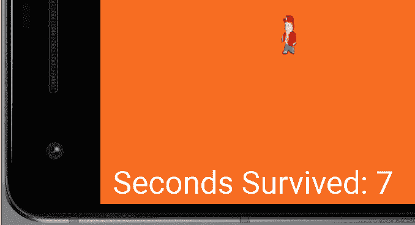
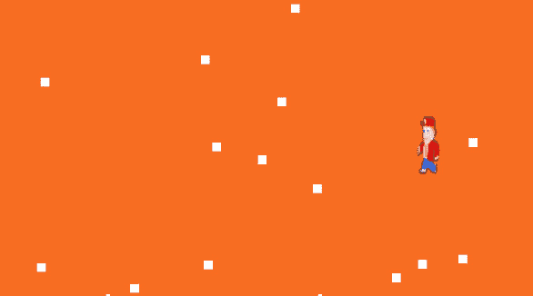
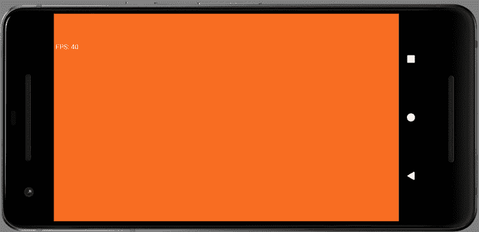
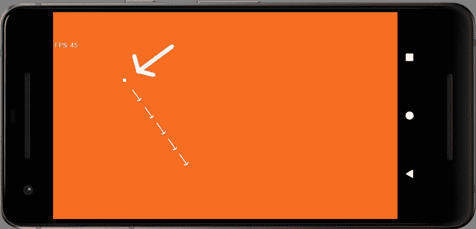
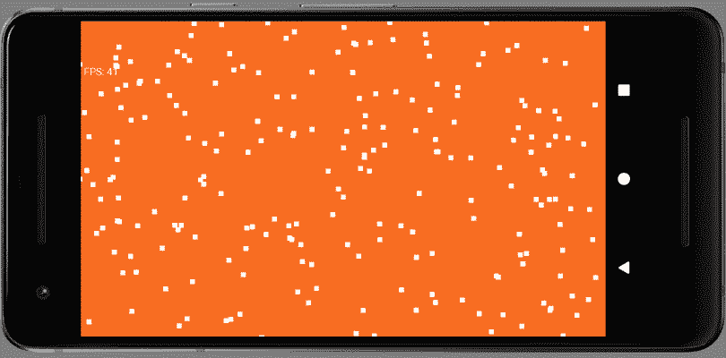

# 十二、用数组处理大量数据

在本章中，我们将首先设置子弹地狱项目，并准备好随着一颗子弹呼啸而过屏幕。然后我们将学习 Java 数组，它允许我们以有组织和有效的方式操作潜在的大量数据。

一旦我们能够轻松处理数据数组，我们将看到如何不费力地生成数百或数千个新的`Bullet`类实例。

本章的主题如下:

*   策划子弹地狱游戏
*   基于我们的乒乓引擎编码子弹地狱引擎
*   编码`Bullet`类并生成一个子弹
*   Java 数组
*   产生成千上万的子弹

让我们计划一下最后的比赛会是什么样子。

# 规划项目

子弹地狱游戏很简单，但玩起来很疯狂。游戏从屏幕上的鲍勃开始，一颗子弹绕着墙壁(屏幕边缘)跳动:


图 12.1–子弹地狱游戏中的角色

游戏的目的是尽可能长时间地生存，游戏将有一个计时器，这样玩家就知道他们做得有多好:



图 12.2–游戏中幸存的秒数

如果鲍勃即将被击中，玩家可以点击屏幕上的任何地方，鲍勃将立即传送到那个位置。然而，每次鲍勃传送时，都会产生另一颗子弹，这使得碰撞的可能性更大，鲍勃需要再次传送(还有另一颗子弹产生):



图 12.3–传送鲍勃

显然，这是一场只会给鲍勃带来糟糕结局的比赛。游戏还将记录玩家在游戏过程中的最佳表现(最长生存时间)。

重要说明

当我们在 [*第 21 章*](21.html#_idTextAnchor441)*完成滚动射击游戏*中对第五个项目进行最后的润色时，我们将看到如何在玩家关闭设备后仍能保持高分。

鲍勃将有一个 10 发子弹的盾牌，每次命中都会倒计时，当它达到零时，他就死了。这里是全流程的游戏。请注意屏幕顶部的最佳时间和屏蔽指示灯:


图 12.4–最佳时间和屏幕保护

除了学习 Java 数组和绘制位图图形的安卓主题，我们还将了解如何跟踪和记录时间。

# 启动项目

我们将快速创建一个新项目，并添加与 Pong 游戏几乎相同的游戏引擎所需的代码，然后我们可以继续对`Bullet`类进行编码。

使用**空活动**模板创建一个名为`Bullet Hell`的新项目。所有其他选项与前两个项目相同。

正如我们之前所做的，我们将编辑安卓清单，但是首先，我们将把`MainActivity`类重构为更合适的东西。

# 将主活动重构为 BulletHellActivity

和之前的项目一样，`MainActivity`有点模糊，所以我们把重构为`BulletHellActivity`。

在项目面板中，右键单击**主活动**文件，选择**重构** | **重命名**。在弹出窗口中，将**主活动**更改为**bulletellactivity**。将所有其他选项保留为默认值，然后左键单击**重构**按钮。

请注意，项目面板中的文件名已经如预期的那样更改，但是`AndroidManifest.xml`文件中多次出现的`MainActivity`已经更改为`BulletHellActivity`，并且在`BulletHellActivity.java`文件中有一个实例。

让我们设置屏幕方向。

# 将游戏锁定为全屏和横向

与之前的项目一样，我们希望使用设备必须提供的每个像素，因此我们将对`AndroidManifest.xml`文件进行更改，允许我们为应用使用一种样式，从用户界面隐藏所有默认菜单和标题。

确保`AndroidManifest.xml`文件在编辑器窗口中打开。

在`AndroidManifest.xml`文件中，找到下面一行代码:`android:name=".BulletHellActivity">`。

将光标放在关闭`>`之前。轻按*输入*键几下，将`>`移动到线的其余部分下方几行。

紧接在`".BulletHellActivity"`下方，但在新定位的`>`之前，键入或复制并粘贴下一行代码，使游戏在没有任何用户界面的情况下运行:

```java
     android:theme=
     "@android:style/Theme.Holo.Light.NoActionBar.
     Fullscreen"
```

你的代码应该是这样的:

```java
…
<activity android:name=".BulletHellActivity"
     android:theme=
     "@android:style/Theme.Holo.Light.NoActionBar.
     Fullscreen"
>
     <intent-filter>
          <action android:name="android.intent.action.MAIN"
          />
<category android:name= "android.intent.category.LAUNCHER" />
     </intent-filter>
</activity>
…
```

现在，我们的游戏将使用该设备提供的所有屏幕空间，而无需任何额外的菜单。

我们现在将对代码进行一些小的修改，就像我们在之前的项目中所做的那样。

# 修改代码使用全屏和最好的安卓类

找到`BulletHellActivity.java`文件顶部附近的以下代码行:

```java
import androidx.appcompat.app.AppCompatActivity;
```

将前一行代码改为:

```java
import android.app.Activity;
```

紧接在前一行代码之后，添加新的一行代码:

```java
import android.view.Window;
```

我们更改的代码行使我们能够使用更高效版本的安卓应用编程接口`Activity`而不是`AppCompatActivity`，新的代码行使我们能够使用`Window`类，这将在稍后进行。

此时，我们的代码中有错误。下一步将消除错误。在`BulletHellActivity.java`文件中找到下面一行代码:

```java
public class BulletHellActivity extends AppCompatActivity {
```

将前一行代码更改为与下一行代码相同:

```java
public class BulletHellActivity extends Activity {
```

此时所有的错误都消失了。我们将只添加一行代码，然后删除一行无关的代码。在同一位置添加以下一行突出显示的代码:

```java
@Override
protected void onCreate(Bundle savedInstanceState) {
     super.onCreate(savedInstanceState);
     requestWindowFeature(Window.FEATURE_NO_TITLE);
     setContentView(R.layout.activity_main);
}
```

我们的应用现在将没有标题栏或动作栏。这将是一个完整的，空屏幕，我们可以让我们的乒乓游戏。

现在我们需要删除一行代码。我们将要删除的代码是加载传统用户界面的代码。查找并删除以下代码行:

```java
setContentView(R.layout.activity_main);
```

当我们运行应用时，用户界面将不再加载。

在这个阶段，你可以运行游戏，并看到空白画布上，我们将建立子弹地狱游戏。

## 创建类

现在我们将生成三个新的类，准备在本章和下一章进行编码。选择**文件** | **新建** | **Java 类**可以新建一个类。创建三个名为`BulletHellGame`、`Bullet`和`Bob`的空类。

让我们谈谈如何重用前一个项目中的一些代码。

# 重用乒乓引擎

请随意复制并粘贴本节中的所有代码。它几乎与乒乓游戏的结构相同。不同的是我们将创建的其他类(`Bullet`和`Bob`)以及我们在`BulletHellGame`类中处理玩家输入、计时、更新和绘制的方式。

当您继续进行这一部分时，浏览一下代码以注意细微但重要的差异，在我们继续进行时，我也会向您指出这些差异。

## 对 BulletHellActivity 类进行编码

将`BulletHellActivity`类编辑为，如下代码所示:

```java
import android.app.Activity;
import android.view.Window;
import android.graphics.Point;
import android.os.Bundle;
import android.view.Display;
// This class is almost exactly
// the same as the Pong project
public class BulletHellActivity extends Activity {
// An instance of the main class of this project
     private BulletHellGame mBHGame;
@Override
protected void onCreate(Bundle savedInstanceState){
super.onCreate(savedInstanceState);
requestWindowFeature(Window.FEATURE_NO_TITLE);
     // Get the screen resolution
     Display display = getWindowManager()
     .getDefaultDisplay();
          Point size = new Point();
          display.getSize(size);
          // Call the constructor(initialize)
          // the BulletHellGame instance
          mBHGame = new BulletHellGame(this, size.x, 
          size.y);
          setContentView(mBHGame);
     }
     @Override
     // Start the main game thread
     // when the game is launched
     protected void onResume() {
     super.onResume();
     mBHGame.resume();
}
    @Override
    // Stop the thread when the player quits
    protected void onPause() {
        super.onPause();
        mBHGame.pause();
    }
}
```

除了`BulletHellGame`对象而不是`PongGame`对象声明之外，它与上一个项目非常相似。此外，`BulletHellGame`对象(`mBHGame`)因此用于调用`setContentView`方法以及`onResume`方法和`onPause`方法，以启动和停止`BulletHellGame`类中的线程，我们接下来将对其进行编码。

AndroidStudio 有很多错误，但只是因为代码引用了我们还没有编码的`BulletHellGame`类。我们现在就去做。

## 为 BulletHellGame 类编码

将下一个代码粘贴到`BulletHellGame`类中。它的结构和之前的游戏完全一样。通过一次粘贴和查看一个部分来再次熟悉它。请注意代码结构和空白方法，我们将很快向其中添加新的子弹地狱特定的代码。

添加`import`语句并修改类声明以处理一个线程(实现`Runnable`接口)并扩展`SurfaceView`:

```java
import android.content.Context;
import android.content.res.AssetFileDescriptor;
import android.content.res.AssetManager;
import android.graphics.Canvas;
import android.graphics.Color;
import android.graphics.Paint;
import android.media.AudioAttributes;
import android.media.AudioManager;
import android.media.SoundPool;
import android.os.Build;
import android.util.Log;
import android.view.MotionEvent;
import android.view.SurfaceHolder;
import android.view.SurfaceView;
import java.io.IOException;
class BulletHellGame extends SurfaceView implements Runnable{
}
```

会有错误贯穿始终，因为我们没有对`Runnable`接口的构造函数或所需方法进行编码。我们很快就会这样做。

### 成员变量编码

在类声明后添加成员变量:

```java
class BulletHellGame extends SurfaceView implements Runnable{
    // Are we currently debugging
    boolean mDebugging = true;
    // Objects for the game loop/thread
    private Thread mGameThread = null;
    private volatile boolean mPlaying;
    private boolean mPaused = true;
    // Objects for drawing
    private SurfaceHolder mOurHolder;
    private Canvas mCanvas;
    private Paint mPaint;
    // Keep track of the frame rate
    private long mFPS;
    // The number of milliseconds in a second
    private final int MILLIS_IN_SECOND = 1000;
    // Holds the resolution of the screen
    private int mScreenX;
    private int mScreenY;
    // How big will the text be?
    private int mFontSize;
    private int mFontMargin;
    // These are for the sound
    private SoundPool mSP;
    private int mBeepID = -1;
    private int mTeleportID = -1;
}
```

所有成员变量也出现在`PongGame`类中，并且具有相同的用法。前面的代码包含一些注释作为提醒。

### 编码 BulletHellGame 构造函数

在成员之后但在类的右花括号内添加构造函数:

```java
// This is the constructor method that gets called
// from BulletHellActivity
public BulletHellGame(Context context, int x, int y) {
     super(context);
     mScreenX = x;
     mScreenY = y;
     // Font is 5% of screen width
     mFontSize = mScreenX / 20;
     // Margin is 2% of screen width
     mFontMargin = mScreenX / 50;
     mOurHolder = getHolder();
     mPaint = new Paint();
     // Initialize the SoundPool
     if (Build.VERSION.SDK_INT >= 
     Build.VERSION_CODES.LOLLIPOP) {
     AudioAttributes audioAttributes = 
     new AudioAttributes.Builder()
               .setUsage(AudioAttributes.USAGE_MEDIA)
               .setContentType
                (AudioAttributes.CONTENT_TYPE_SONIFICATION)
               .build();
          mSP = new SoundPool.Builder()
               .setMaxStreams(5)
               .setAudioAttributes(audioAttributes)
               .build();
     } else {
          mSP = new SoundPool(5, AudioManager.STREAM_MUSIC,
           0);
     }
     try{
          AssetManager assetManager = context.getAssets();
          AssetFileDescriptor descriptor;
          descriptor = assetManager.openFd("beep.ogg");
          mBeepID = mSP.load(descriptor, 0);
          descriptor = assetManager.openFd("teleport.ogg");
          mTeleportID = mSP.load(descriptor, 0);
     }catch(IOException e){
          Log.e("error", "failed to load sound files");
     }
     startGame();
}
```

我们刚刚看到的构造器代码不包含任何新内容。屏幕分辨率作为参数传入，对应的成员变量(`mScreenX`、`mScreenY`)初始化，`SoundPool`对象初始化，然后音效载入内存。请注意，我们在最后调用`startGame`方法。显然，我们需要对这个方法进行编码，接下来我们会这样做。

### 为 BulletHellGame 方法编码

将这四个空方法和同样实现的`run`方法(对于 Pong 游戏)添加到来处理游戏循环:

```java
// Called to start a new game
public void startGame(){
}
// Spawns ANOTHER bullet
private void spawnBullet(){
}
// Handles the game loop
@Override
public void run() {
     while (mPlaying) {
          long frameStartTime = System.currentTimeMillis();
          if(!mPaused){
               update();
               // Now all the bullets have been moved
               // we can detect any collisions
               detectCollisions();
          }
          draw();
          long timeThisFrame = System.currentTimeMillis() 
               - frameStartTime;
          if (timeThisFrame >= 1) {
               mFPS = MILLIS_IN_SECOND / timeThisFrame;
          }
     }
}
// Update all the game objects
private void update(){
}
private void detectCollisions(){
}
```

之前我们见过的方法除了一个。我们刚刚编码了一个`spawnBullet`方法，每次我们想要产生一个新的子弹时可以调用这个方法。此时，该方法不包含任何代码。我们将在本章和下一章向这些方法添加代码。

### 对 draw 和 onTouchEvent 方法进行编码

将下面显示的`draw`和方法相加:

```java
private void draw(){
     if (mOurHolder.getSurface().isValid()) {
          mCanvas = mOurHolder.lockCanvas();
          mCanvas.drawColor(Color.argb(255, 243, 111, 36));
          mPaint.setColor(Color.argb(255, 255, 255, 255));
          // All the drawing code will go here
          if(mDebugging) {
               printDebuggingText();
          }
          mOurHolder.unlockCanvasAndPost(mCanvas);
     }
}
@Override
public boolean onTouchEvent(MotionEvent motionEvent) {
     return true;
}
```

`draw`方法只是在屏幕上填充一种普通的颜色，并将油漆颜色设置为白色，准备绘制子弹。注意当`mDebugging`变量设置为`true`时对`printDebuggingText`方法的调用。我们还为`onTouchEvent`方法添加了一个空的(除了一个`return`语句)方法，准备添加代码来处理玩家的输入。

### 编码暂停、恢复和打印调试文本

接下来的这三个方法，就像所有的之前的方法一样，服务于与他们在 Pong 项目中所做的完全相同的目的。添加`pause`、`resume`和`printDebuggingText`方法:

```java
public void pause() {
     mPlaying = false;
     try {
          mGameThread.join();
     } catch (InterruptedException e) {
          Log.e("Error:", "joining thread");
     }
}
public void resume() {
     mPlaying = true;
     mGameThread = new Thread(this);
     mGameThread.start();
}
private void printDebuggingText(){
     int debugSize = 35;
     int debugStart = 150;
     mPaint.setTextSize(debugSize);
     mCanvas.drawText("FPS: " + mFPS , 
          10, debugStart + debugSize, mPaint);
}
```

`printDebuggingText`方法只是将`mFPS`的电流值画到屏幕上。这对于监视器来说，当有大量的子弹弹得到处都是时，会很有趣。还声明并初始化了两个新的局部变量(`debugSize`和`debugStart`)。它们用于以编程方式定位和缩放调试文本，因为调试文本明显不同于抬头显示器文本，后者将在`draw`方法中绘制。

## 测试子弹地狱发动机

运行游戏，你会看到我们设置了一个简单的游戏引擎，实际上与 Pong 游戏引擎完全相同。除了每秒循环测量帧之外，它还没有做任何事情，但是它已经准备好开始绘制和更新对象:



图 12.5–测试游戏

现在我们可以专注于构建新游戏和学习 Java 数组。让我们从一个类开始，这个类将代表我们将产生的大量子弹中的每一个。

# 对子弹类进行编码

`Bullet`班并不复杂。这是一个在屏幕上跳动的小方块，将与乒乓游戏中的球有许多相似之处。首先，添加`Bullet`类旁边突出显示的成员变量:

```java
import android.graphics.RectF;
class Bullet {
    // A RectF to represent the size and location of the 
    bullet
    private RectF mRect;
    // How fast is the bullet traveling?
    private float mXVelocity;
    private float mYVelocity;
    // How big is a bullet
    private float mWidth;
    private float mHeight;
}
```

我们现在有一个名为`mRect`的`RectF`，它将代表子弹的位置。您还需要为`RectF`类添加`import`语句。另外，我们有两个`float`变量来表示行进的方向/速度(`mXVelocity`和`mYVelocity`)和两个`float`变量来表示子弹的宽度和高度(`mWidth`和`mHeight`)。

接下来添加新的`Bullet`对象创建时可以调用的`Bullet`构造函数，然后我们可以讨论一下:

```java
// The constructor
public Bullet(int screenX){
     // Configure the bullet based on
     // the screen width in pixels
     mWidth = screenX / 100;
     mHeight = screenX / 100;
     mRect = new RectF();
     mYVelocity = (screenX / 5);
     mXVelocity = (screenX / 5);
}
```

我们所有的成员变量现在都被初始化了。以像素为单位的屏幕宽度作为参数传入，用于使项目符号为屏幕尺寸的 1/100，标题/速度为屏幕宽度的 1/5。子弹将在大约 5 秒钟内穿过屏幕宽度。

这里是`getRect`方法，就像我们在 Pong 游戏中一样，所以我们可以在游戏循环的每一帧中与`BulletHellGame`类共享子弹的位置和大小。添加`getRect`方法:

```java
// Return a reference to the RectF
RectF getRect(){
     return mRect;
}
```

接下来是`update`方法，它在游戏循环的每一帧被`BulletHellGame`类中的`update`方法调用。添加`update`方法，然后我们看看它是如何工作的:

```java
// Move the bullet based on the speed and the frame rate
void update(long fps){
// Update the left and top coordinates
// based on the velocity and current frame rate
     mRect.left = mRect.left + (mXVelocity / fps);
     mRect.top = mRect.top + (mYVelocity / fps);
     mRect.right = mRect.left + mWidth;
     mRect.bottom = mRect.top - mHeight;
}
```

前面的代码通过将速度除以当前帧速率并将结果添加到左坐标和上坐标，直接操作`mRect`对象的左坐标和上坐标。记住`fps`是在游戏循环中计算出来的，作为参数传入。

然后，通过将宽度(右侧)和高度(底部)添加到先前更新的左侧和顶部位置来更改右侧和底部坐标。

在游戏过程中，子弹将能够与水平墙(顶部或底部)或垂直墙(左侧或右侧)碰撞。当这种情况发生时，我们将分别反转垂直(`y`)速度或水平(`x`)速度。将这两种方法相加来反转速度，然后我将解释它们是如何工作的:

```java
// Reverse the bullets vertical direction
void reverseYVelocity(){
     mYVelocity = -mYVelocity;
}
// Reverse the bullets horizontal direction
void reverseXVelocity(){
     mXVelocity = -mXVelocity;
}
```

这两种方法都以同样的方式达到目的。他们取适当的速度变量(或`mYVelocity`或`mXVelocity`)并使其等于负值。这具有将正速度变为负速度以及将负速度变为正速度的效果。当检测到与屏幕边缘的碰撞时，将从`BulletHellGame`类调用这两种方法。

您可能已经注意到，与 Pong 游戏中`Ball`类的构造函数相比，构造函数方法非常短。这是因为我们需要一个单独的方法来产生子弹，因为这不会像乒乓游戏中的球那样在创建时发生。我们将首先声明并初始化我们所有的子弹，当我们准备好的时候，我们可以调用这个`spawn`方法，子弹就会复活。编码`spawn`方法如下所示:

```java
// Spawn a new bullet
void spawn(int pX, int pY, int vX, int vY){
     // Spawn the bullet at the location
     // passed in as parameters
     mRect.left = pX;
     mRect.top = pY;
     mRect.right = pX  + mWidth;
     mRect.bottom = pY + mHeight;
     // Head away from the player
     // It's only fair
     mXVelocity = mXVelocity * vX;
     mYVelocity = mYVelocity * vY;
}
```

首先要注意的是`spawn`方法有四个从`BulletHellGame`类传入的参数。之所以需要这么多，是因为需要给子弹一个智能的起始位置和初速。

我们的想法是，我们不想在鲍勃身上或他旁边产生一颗子弹，直接射向他。这会使比赛无法进行。决定位置和航向的复杂性在`BulletHellGame`类中处理。`spawn`方法要做的就是使用传入的值。

我们将`pX`和`pY`分别分配到`mRect`的左侧和顶部位置。接下来，我们使用`mWidth`和`mHeight`以及`pX`和`pY`为`mRect`的右侧和底部位置赋值(再次分别)。最后将`mXVelocity`和`mYVelocity`乘以参数`vX`和`vY`。

它们相乘的原因是调用代码将为每个值传入`1`或`-1`。这与我们在两种反转速度的方法中改变子弹方向的方式相同。这样我们就能控制子弹是从左边还是右边，向上还是向下。

我们将在下一章中看到如何智能地产生子弹。为了快速看到子弹在行动，我们会写一些临时代码。现在我们可以发射第一颗子弹了。

## 射出一颗子弹

现在我们可以通过在游戏引擎(`BulletHellGame`)中生成一个实例来测试我们的`Bullet`类。

顾名思义，正如所讨论的，我们不希望只有一颗子弹；这个游戏叫做子弹地狱，而不是一颗愚蠢的子弹。我们现在要写的几行代码只是确认`Bullet`类是功能性的。一旦我们了解了 Java 数组，我们就可以生成尽可能多的你的手机/平板电脑/模拟器可以处理的数组。此外，子弹会直接飞出屏幕。我仍然认为值得我们花五分钟的时间来确认课堂的工作。如果你不同意，那就跳到下一部分，开始学习 Java 数组。

首先，在`BulletHellGame`构造函数之前将`Bullet`的一个实例声明为成员:

```java
Bullet testBullet;
```

现在在调用`startGame`之前初始化`BulletHellGame`构造函数中的项目符号，如下图所示:

```java
testBullet = new Bullet(mScreenX);
startGame();
```

接下来，在`BulletHellGame`更新方法中调用其`update`方法:

```java
// Update all the game objects
private void update(){
     testBullet.update(mFPS);
}
```

快到了！在`draw`方法中画出的子弹:

```java
private void draw(){
     if (mOurHolder.getSurface().isValid()) {
          mCanvas = mOurHolder.lockCanvas();
          mCanvas.drawColor(Color.argb(255, 243, 111, 36));
          mPaint.setColor(Color.argb(255, 255, 255, 255));
          // All the drawing code will go here
          mCanvas.drawRect(testBullet.getRect(), mPaint);
          if(mDebugging) {
               printDebuggingText();
}
          mOurHolder.unlockCanvasAndPost(mCanvas);
     }
}
```

最后，在`onTouchEvent`方法中添加两行代码开始游戏，并通过屏幕点击生成一个子弹:

```java
@Override
public boolean onTouchEvent(MotionEvent motionEvent) {

     mPaused = false;
     testBullet.spawn(0, 0, 1, 1);
     return true;
}
```

请注意，这段代码允许您通过轻击不断地重生相同的子弹。传递给`spawn`、`0,0,1,1`的参数将导致子弹在左上角(`0,0`)产生，并在水平正方向和垂直正方向(`1,1`)向外飞去。

你现在可以运行游戏，看到子弹呼啸而过屏幕。轻按屏幕，相同的项目符号将再次出现:



图 12.6–游戏中子弹的移动

重要说明

如果你想知道为什么子弹第一次出现后似乎立刻有点结巴，这是因为`onTouchEvent`法是未经过滤的。每一个触摸事件都是子弹的产生和再产生。例如，可能至少有几个`ACTION_DOWN`事件以及一个为每个点击触发的`ACTION_UP`事件。当我们为这个方法编写真正的代码时，我们将解决这个问题。

删除六行临时代码，让我们继续。

# 【Java 数组入门

你可能想知道当我们有一个有很多变量或对象要跟踪的游戏时会发生什么。一个明显的例子是我们目前的项目。再举一个例子，一个高分榜前 100 分的游戏怎么样？

我们可以这样声明和初始化 100 个独立的对象/变量:

```java
Bullet bullet1;
Bullet bullet2;
Bullet bullet3;
//96 more lines like the above
Bullet bullet100;
```

或者拿高分表的情况来说，我们可以这样编码:

```java
int topScore1;
int topScore2;
int topScore3;
//96 more lines like the above
int topScore100;
```

这看起来很笨拙，但是当一个人获得新的最高分时会怎样呢？我们必须把每个变量的分数降低一个位置。噩梦开始了:

```java
topScore100 = topScore99;
topScore99 = topScore98;
topScore98 = topScore97;
//96 more lines like the above
topScore1 = score;
```

肯定有更好的办法。当我们有一个完整的变量数组时，我们需要的是一个 Java **数组**。数组是一个引用变量，它最多包含预定的最大元素数。每个元素都是一个类型一致的变量或对象。

下面的代码声明了一个可以保存`int`变量的数组——可能是一个高分表或者一系列考试成绩:

```java
int [] intArray;
```

我们也可以声明其他类型的数组，包括`Bullet`这样的类，如下所示:

```java
String [] classNames;
boolean [] bankOfSwitches;
float [] closingBalancesInMarch;
Bullet [] bullets;
```

在使用之前，这些阵列中的每一个都需要分配固定的最大存储空间量。就像其他对象一样，我们必须在使用数组之前初始化它们:

```java
intArray = new int [100];
```

前一行最多分配 100 个`int`大小的存储空间。想象一下，我们的可变仓库中有一条由 100 个连续存储空间组成的长通道。这些空间可能会被标记为`intArray[0]`、`intArray[1]`、`intArray[2]`等等，每个空间都有一个单独的`int`值。也许这里有点令人惊讶的是，存储空间从 0 开始，而不是 1。因此，在 100 *宽的*阵列中，存储空间将从 0 到 99。

我们可以这样初始化一些存储空间:

```java
intArray[0] = 5;
intArray[1] = 6;
intArray[2] = 7;
```

但是请注意，我们只能将预先声明的类型放入数组中，而数组保存的类型永远不会改变:

```java
intArray[3]= "John Carmack"; // Won't compile String not int
```

那么，当我们有一个`int`类型的数组时，这些`int`变量分别被称为什么？这些变量的名称是什么，我们如何访问存储在其中的值？**数组符号**语法是我们获取数组中数据的方式。我们可以用数组中的一个值做任何事情，就像我们可以用一个有名字的常规变量做任何事情一样。例如，这就是我们如何给数组中的一个位置赋值(我们很快会有更详细的解释):

```java
intArray [3] = 123;
```

下面是另一个使用数组符号对存储在数组中的值进行一些基本运算并记住结果的例子(同样，我们很快会有更详细的解释):

```java
intArray[10] = intArray[9] - intArray[4];
```

这还包括将数组中的值赋给相同类型的常规变量，如下所示:

```java
int myNamedInt = intArray[3];
```

但是请注意，`myNamedInt`是一个独立且不同的原始变量，对它的任何更改都不会影响存储在`intArray`引用中的值。它在仓库中有自己的空间，与数组无关。

重要说明

在 [*第 14 章*](14.html#_idTextAnchor282) *、Java Collections、栈、堆和垃圾收集器*中，我们将更深入地了解原语和引用变量之间的区别，包括当我们在方法之间传递原语和引用类型时会发生什么。单词*参考*给了我们一个正在发生的暗示，但是在前面提到的章节中会有一个完整的讨论。

## 数组是对象

我们说过数组是引用变量。把一个数组变量想象成一组给定类型的变量的地址。或许，用仓库类比，`someArray`是一个过道号。所以`someArray[0]`、`someArray[1]`等等是过道号，后面是过道里的位置号。

数组也是对象。也就是说，它们有我们可以使用的方法和成员变量:

```java
int lengthOfSomeArray = someArray.length;
```

这里，我们将`someArray`的长度赋给了名为`lengthOfSomeArray`的`int`变量。

我们甚至可以声明数组的数组。这是一个数组，其中的每个元素都潜伏着另一个数组。如下所示:

```java
String[][] countriesAndCities;
```

在前面的数组中，我们可以保存每个国家的城市列表。不过，我们现在还不要发疯。请记住，一个数组最多可以容纳预定数量的任何预定类型的变量，我们使用以下语法访问这些值:

```java
someArray[someLocation];
```

让我们使用一些数组来尝试并了解如何在真实代码中使用它们，以及我们可能使用它们做什么。

## 简单数组示例小应用

我们来做一个简单的工作数组例子。您可以在 GitHub repo 上获得该示例的完整代码。在`Chapter 12/Simple Array Example/MainActivity.java`里。

创建一个活动为空的项目。调用项目`Simple Array Example`。保留活动的默认名称`MainActivity`。这真的不重要，因为我们不会回到这个项目。

首先，我们声明我们的数组，分配五个空格，并初始化每个元素的值。然后我们将每个值输出到**日志窗口**中。在调用`super.onCreate()`后，将此代码添加到`onCreate`方法中:

```java
// Declaring an array
int[] ourArray;
// Allocate memory for a maximum size of 5 elements
ourArray = new int[5];
// Initialize ourArray with values
// The values are arbitrary, but they must be type int
// The indexes are not arbitrary. 0 through 4 or crash!
ourArray[0] = 25;
ourArray[1] = 50;
ourArray[2] = 125;
ourArray[3] = 68;
ourArray[4] = 47;
// Output all the stored values
Log.d("info", "Here is ourArray:");
Log.d("info", "[0] = "+ ourArray[0]);
Log.d("info", "[1] = "+ ourArray[1]);
Log.d("info", "[2] = "+ ourArray[2]);
Log.d("info", "[3] = "+ ourArray[3]);
Log.d("info", "[4] = "+ ourArray[4]);
```

接下来，我们将数组的每个元素加在一起，就像我们可以正则化`int`类型变量一样。请注意，当我们将数组元素加在一起时，我们是在多行上进行的。这个很好，因为我们省略了一个分号，直到最后一个操作，所以 Java 编译器把这些行当作一个语句。将我们刚刚讨论的代码添加到`MainActivity.java`:

```java
/*
     We can do any calculation with an array element
     if it is appropriate to the contained type
     Like this:
*/
int answer = ourArray[0] +
ourArray[1] +
ourArray[2] +
ourArray[3] +
ourArray[4];
Log.d("info", "Answer = "+ answer);
```

运行该示例，并在 logcat 窗口中查看输出。

请记住，当我们将所有输出发送到 AndroidStudio 的 **logcat** 窗口时，模拟器显示屏上不会发生任何事情(但是您需要一个模拟器来运行应用)。以下是输出:

```java
info : Here is ourArray:
info : [0] = 25
info : [1] = 50
info : [2] = 125
info : [3] = 68
info : [4] = 47
info : Answer = 315 
```

我们声明了一个名为`ourArray`的数组来保存`int`变量，然后为该类型的最多五个变量分配空间。

接下来，我们为数组中的五个空间分别指定一个值。记住第一个空格是`ourArray[0]`，最后一个空格是`ourArray[4]`。

接下来，我们简单地将每个数组位置中的值打印到控制台，从输出中，我们可以看到它们保存着我们在前面步骤中初始化它们的值。然后我们将`ourArray`中的每个元素加在一起，并将它们的值初始化为`answer`变量。然后我们将`answer`打印到 logcat 窗口，我们可以看到所有的值都被加在了一起，就好像它们是普通的旧`int`类型，它们只是以不同的方式存储。

让我们将数组更进一步。

# 通过数组获得动态

正如我们在所有这些数组内容的开头所讨论的，如果我们需要单独声明和初始化数组的每个元素，那么与常规变量相比，数组并没有太大的好处。让我们看一个动态声明和初始化数组的例子。

## 动态数组示例

我们来做一个简单的动态数组的例子。您可以在 GitHub repo 上获得该示例的工作项目。在`Chapter 12/Dynamic Array Example/MainActivity.java`里。

创建一个空的`activity`项目，并调用该项目`Dynamic Array Example`。将活动名称保留为默认的`MainActivity`；因为我们不会重新讨论这个项目，我们不关心使用令人难忘的名字。

在调用`onCreate` 方法中的`super.onCreate()`后，键入以下代码。在我们讨论和分析代码之前，看看您是否能计算出输出是什么:

```java
// Declaring and allocating in one step
int[] ourArray = new int[1000];
// Let's initialize ourArray using a for loop
for(int i = 0; i < 1000; i++){
     // Put the value of ourValue into our array
   // At the position determined by i.
   ourArray[i] = i*5;
   // Output what is going on
   Log.d("info", "i = " + i);
   Log.d("info", "ourArray[i] = " + ourArray[i]);
}
```

运行示例应用，记住当我们将输出发送到 AndroidStudio 的 **logcat** 窗口时，模拟器屏幕上不会发生任何事情。以下是输出:

```java
info : i = 0
info : ourArray[i] = 0
info : i = 1
info : ourArray[i] = 5
info : i = 2
info : ourArray[i] = 10
... 994 iterations of the loop removed for brevity.
info : ourArray[i] = 4985
info : i = 998
info : ourArray[i] = 4990
info : i = 999
info : ourArray[i] = 4995
```

首先，我们声明并分配了一个名为`ourArray`的数组来保存多达 1000 个`int`值。请注意，这次我们在一行代码中执行了两个步骤:

```java
int[] ourArray = new int[1000];
```

然后我们使用了一个`for`循环，该循环被设置为循环`1000`次:

```java
(int i = 0; i < 1000; i++){
```

我们初始化了数组中的空格，从 0 到 999，值`i`乘以 5，如下所示:

```java
ourArray[i] = i*5;
```

然后为了证明`i`的值和数组中每个位置保持的值，我们输出`i`的值，后面是数组中相应位置保持的值，如下所示:

```java
Log.i("info", "i = " + i);
Log.i("info", "ourArray[i] = " + ourArray[i]);
```

这一切发生了 1000 次，产生了我们看到的结果。当然，我们还没有在现实世界的游戏中使用这种技术，但是我们很快就会使用它来让我们的子弹地狱游戏更像地狱。

# 用数组进入第 n 维

我们非常简短地提到，一个数组甚至可以在每个位置容纳其他数组。当然，如果一个数组包含许多数组，而这些数组又包含许多其他类型的数组，我们如何访问包含的数组中的值呢？为什么我们会需要这个？看下一个例子，看看多维数组在哪些地方有用。

## 多维阵列迷你 app

我们来做一个简单的多维数组例子。您可以在 GitHub repo 上获得该示例的工作项目。在`Chapter 12/Multidimensional Array Example/MainActivity.java`里。

创建一个空的`activity`项目，并将其称为`Multidimensional Array Example`。将活动名称保留为默认值；这不重要。

调用`onCreate`方法中的`super.onCreate…`后，声明并初始化一个二维数组，如下所示:

```java
// Random object for generating question numbers
Random randInt = new Random();
// a variable to hold the random value generated
int questionNumber;// Declare and allocate in separate stages for clarity
// but we don't have to
String[][] countriesAndCities;
// Now we have a 2-dimensional array
countriesAndCities = new String[5][2];
// 5 arrays with 2 elements each
// Perfect for 5 "What's the capital city" questions
// Now we load the questions and answers into our arrays
// You could do this with less questions to save typing
// But don't do more or you will get an exception
countriesAndCities [0][0] = "United Kingdom";
countriesAndCities [0][1] = "London";
countriesAndCities [1][0] = "USA";
countriesAndCities [1][1] = "Washington";
countriesAndCities [2][0] = "India";
countriesAndCities [2][1] = "New Delhi";
countriesAndCities [3][0] = "Brazil";
countriesAndCities [3][1] = "Brasilia";
countriesAndCities [4][0] = "Kenya";
countriesAndCities [4][1] = "Nairobi";
```

现在我们使用`for`循环和我们的`Random`对象输出数组的内容。注意我们如何确保尽管问题是随机的，但我们总能选出正确的答案。将下一个代码添加到上一个代码中:

```java
/*
     Now we know that the country is stored at element 0
     The matching capital at element 1
     Here are two variables that reflect this
*/
final int COUNTRY = 0;
final int CAPITAL = 1;
// A quick for loop to ask 3 questions
for(int i = 0; i < 3; i++){
     // get a random question number between 0 and 4
   questionNumber = randInt.nextInt(5);
   // and ask the question and in this case just
   // give the answer for the sake of brevity
     Log.d("info", "The capital of "
           +countriesAndCities[questionNumber][COUNTRY]);

     Log.d("info", "is "
           +countriesAndCities[questionNumber][CAPITAL]);
} // end of for loop
```

运行这个例子，记住屏幕上不会发生任何事情，因为所有的输出都将被发送到 AndroidStudio 的 **logcat** 控制台窗口。以下是输出:

```java
info : The capital of USA
info : is Washington
info : The capital of India
info : is New Delhi
info : The capital of United Kingdom
info : is London
```

刚刚发生了什么？让我们一大块一大块地来看，这样我们就能确切地知道发生了什么。

我们制作了一个名为`randInt`的`Random`类型的新对象，准备在程序的后面生成随机数:

```java
Random randInt = new Random();

```

我们声明了一个简单的`int`变量来保存问题编号:

```java
int questionNumber;
```

接下来，我们声明我们的数组名为`countriesAndCities`。外部数组包含数组:

```java
String[][] countriesAndCities;

```

现在，我们在阵列中分配空间。第一个，外阵列，现在将能够容纳五个阵列，这五个内阵列中的每一个将能够容纳两个`String`:

```java
countriesAndCities = new String[5][2];
```

现在我们初始化我们的数组来保存国家和他们相应的首都。请注意，对于每对初始化，外部数组编号保持不变，表示每个国家/首都对都在一个内部数组(一个`String`数组)中。当然，这些内部数组中的每一个都保存在外部数组(保存数组)的一个元素中:

```java
countriesAndCities [0][0] = "United Kingdom";
countriesAndCities [0][1] = "London";
countriesAndCities [1][0] = "USA";
countriesAndCities [1][1] = "Washington";
countriesAndCities [2][0] = "India";
countriesAndCities [2][1] = "New Delhi";
countriesAndCities [3][0] = "Brazil";
countriesAndCities [3][1] = "Brasilia";
countriesAndCities [4][0] = "Kenya";
countriesAndCities [4][1] = "Nairobi";
```

为了使即将到来的`for`循环更加清晰，我们声明并初始化`int`变量来表示数组中的国家和首都。如果你回头看一下数组初始化，所有国家都在内数组的`0`位置，所有对应的首都城市都在`1`位置。表示这一点的变量(`COUNTRY`和`CAPITAL`)是`final`，因为我们永远不想改变它们的值:

```java
final int COUNTRY = 0;
final int CAPITAL = 1;
```

现在我们设置一个`for`循环运行三次。请注意，这并不是简单地访问数组的前三个元素；它只是决定了我们循环的次数。我们可以让它循环一次或一千次；这个例子仍然有效:

```java
for(int i = 0; i < 3; i++){
```

接下来，我们确定要问哪个问题，或者更具体地说，要使用外部数组的哪个元素。请记住`randInt.nextInt(5)`返回一个 0 到 4 之间的数字，这正是我们所需要的，因为我们有一个包含 5 个元素的外部数组，从 0 到 4:

```java
questionNumber = randInt.nextInt(5);
```

现在，我们可以通过输出保存在内部数组中的字符串来提出一个问题，而内部数组又由外部数组保存，外部数组在前一行中由随机生成的数字选择:

```java
     Log.i("info", "The capital of "
     + countriesAndCities[questionNumber][COUNTRY]);
     Log.i("info", "is "      
     + countriesAndCities[questionNumber][CAPITAL]);
}// end of for loop
```

为了记录在案，我们不会在本书的其余部分使用任何多维数组。所以，如果数组内部的数组周围仍然有一点点模糊，那就没关系了。你知道它们的存在和它们能做什么，如果有必要，你可以重新审视它们。

## 数组越界异常

当我们试图访问不存在的数组元素时，会出现数组越界异常。有时编译器会捕捉到它，以防止错误进入工作游戏。这里有一个例子:

```java
int[] ourArray = new int[1000];
int someValue = 1; // Arbitrary value
ourArray[1000] = someValue;
// Won't compile as the compiler knows this won't work.
// Only locations 0 through 999 are valid
```

但是如果我们做这样的事情呢？

```java
int[] ourArray = new int[1000];
int someValue = 1;// Arbitrary value
int x = 999;
if(userDoesSomething){
     x++; // x now equals 1000
}
ourArray[x] = someValue;
// Array out of bounds exception 
// if userDoesSomething evaluates to true! 
// This is because we end up referencing position 1000 
// when the array only has positions 0 through 999
// Compiler can't spot it. App will crash!
```

我们避免这个问题的唯一方法是知道规则:数组从零开始，一直到它们的长度-1。我们还可以使用清晰可读的代码，这样可以更容易地评估我们所做的工作并发现问题。

在 [*第 14 章*](14.html#_idTextAnchor282)*Java 集合、栈、堆和垃圾收集器*中，我们将看看另一个与称为集合的数组密切相关的 Java 主题。这将使我们的数据处理知识更上一层楼。

让我们制造一些子弹。

# 产生一排子弹

现在我们知道了数组的基础知识，我们可以开始同时生成一堆子弹，并将它们存储在一个数组中。

小费

在继续之前，请确保从*生成项目符号*部分删除临时代码。

添加几个控制变量，声明一个项目符号数组作为`BulletHellGame`的成员。在构造函数之前添加以下代码:

```java
// Up to 10000 bullets
private Bullet[] mBullets = new Bullet[10000];
private int mNumBullets = 0;
private int mSpawnRate = 1;
private Random mRandomX = new Random();
private Random mRandomY = new Random();
```

重要说明

您需要添加`Random`类:`import java.util.Random;`。

我们有一个名为`mBullets`的阵列，能够容纳一万发子弹。`new`关键字初始化数组，而不是数组中的`Bullets`。我们还有两个`int`变量来记录每次调用`spawn`方法时我们想要产生多少子弹以及总共有多少子弹。

我们还声明并初始化了两个类型为`Random`的对象，我们将使用它们来随机生成屏幕位置以产生项目符号。请记住，在下一章中，我们将更改这段代码，并更智能地生成它们。

在调用`startGame`之前，通过添加以下代码初始化`BulletHellGame`构造函数中的所有项目符号:

```java
for(int i = 0; i < mBullets.length; i++){
     mBullets[i] = new Bullet(mScreenX);
}
startGame();
```

`for`循环从 0 到 9999 调用`mBullets`数组中所有`Bullet`实例的`new`。

编写代码来更新`update`方法中所有必要的(衍生的)项目符号:

```java
// Update all the game objects
private void update(){
     for(int i = 0; i < mNumBullets; i++){
          mBullets[i].update(mFPS);
     }
}
```

前面的代码使用了一个`for`循环来循环通过`mBullets`数组，但是注意它只对位置 0 到`mNumBullets`–1 这样做。如果子弹还没有产生，那么处理它是没有意义的。在`for`循环中，调用子弹的`update`方法，并传入当前帧速率。

现在让我们为四面墙添加碰撞检测。在`collisionDetection`方法中，添加这个高亮代码:

```java
private void detectCollisions(){
     // Has a bullet collided with a wall?
     // Loop through each active bullet in turn
     for(int i = 0; i < mNumBullets; i++) {
          if (mBullets[i].getRect().bottom > mScreenY) {
               mBullets[i].reverseYVelocity();
          }
          else if (mBullets[i].getRect().top < 0) {
               mBullets[i].reverseYVelocity();
          }
          else if (mBullets[i].getRect().left < 0) {
               mBullets[i].reverseXVelocity();
          }
          else if (mBullets[i].getRect().right > mScreenX) {
               mBullets[i].reverseXVelocity();
          }
     }
}
```

碰撞检测的工作原理就像检测乒乓球一样，通过测试子弹是否已经移出屏幕。由于这个游戏对中央处理器的要求会高得多，所以这次代码的效率会稍微高一点。如果第一个碰撞条件为真，则不需要最后三个。这将对 10，000 发子弹产生重大影响。使用适当的`reverseXVelocity`或`reverseYVelocity`方法弹起子弹。

将新代码添加到中，在`draw`方法中绘制所有必要的(衍生的)项目符号:

```java
private void draw(){
     if (mOurHolder.getSurface().isValid()) {
          mCanvas = mOurHolder.lockCanvas();
          mCanvas.drawColor(Color.argb(255, 243, 111, 36));
          mPaint.setColor(Color.argb(255, 255, 255, 255));
          // All the drawing code will go here
          for(int i = 0; i < mNumBullets; i++){
               mCanvas.drawRect(mBullets[i].getRect(), 
                 mPaint);
          }
          if(mDebugging) {
               printDebuggingText();
          }
          mOurHolder.unlockCanvasAndPost(mCanvas);
     }
}
```

在这里，我们再次从 0 到`mNumBullets`–1 循环通过`mBullets`数组，对于每个衍生的子弹，我们使用`getRect`方法将子弹的屏幕坐标传递给`drawRect`方法，该方法绘制子弹。

几乎最后，在`spawnBullet`方法中添加一些**临时**代码。这是临时代码的原因是，实际代码将取决于玩家的位置。我们将从玩家身上衍生出每一颗新子弹，并朝着相反的方向前进，给鲍勃一个机会。在给玩家编码之前，我们不能编码。到目前为止，我们添加的所有代码和变量都将在最终版本中。接下来的代码和下一部分，我们将在下一章修改，这是这个项目的最后一章。将此高亮显示的代码添加到`spawnBullet`:

```java
// Spawns ANOTHER bullet
private void spawnBullet(){
     // Add one to the number of bullets
     mNumBullets++;
     // Where to spawn the next bullet
     // And in which direction should it travel
     int spawnX;
     int spawnY;
     int velocityX;
     int velocityY;

     // This code will change in chapter 13        

     // Pick a random point on the screen
     // to spawn a bullet
     spawnX = mRandomX.nextInt(mScreenX);
     spawnY = mRandomY.nextInt(mScreenY);

     // The horizontal direction of travel
     velocityX = 1;
     // Randomly make velocityX negative
     if(mRandomX.nextInt(2)==0){
          velocityX = -1;
     }
     velocityY = 1;
     // Randomly make velocityY negative
     if(mRandomY.nextInt(2)==0){
          velocityY = -1;
     }

     // Spawn the bullet
     mBullets[mNumBullets - 1].
     spawn(spawnX, spawnY, velocityX, velocityY);
}
```

首先，声明水平和垂直位置和速度的局部变量。表示位置的变量(`spawnX`和`spawnY`)然后通过使用传递到`nextInt`方法的屏幕宽度和高度(以像素为单位)随机分配一个值。

接下来，在测试随机生成的 0 和 1 之间的数字之前，`velocityX`被初始化为`1`，如果它等于 0，则`velocityX`被重新分配给`-1`。`velocityY`也是如此。这意味着子弹可以在屏幕上的任何地方产生，无论是水平方向还是垂直方向。

最后一行代码调用`mNumBullets-1`上的`spawn`，这是`mBullets`数组中的下一个项目符号，也就是将被产生。

现在我们有了最后的代码来运行这个东西。在`onTouchEvent`方法中加入一些临时代码调用`spawnBullet`并取消暂停游戏:

```java
@Override
public boolean onTouchEvent(MotionEvent motionEvent) {
     mPaused = false;
     spawnBullet();
     return true;
}
```

就这样。

## 运行游戏

每次点击屏幕，由于`onTouchEvent`一次又一次调用`spawnBullet`方法检测到未过滤的事件，会产生多个项目符号。您现在可以通过使用我们在上一个项目中了解到的触摸处理来解决这个问题。或者我们将在下一章一起修复它:



图 12.7–运行游戏

小费

如果你产生第 10，001 颗子弹，游戏将崩溃，并且 logcat 窗口将显示一个**ArrayIndexOutOfBoundsException**，因为代码试图写超过数组中的最后一个位置。我暂时将数组大小减少到 10，这样我就可以很容易地演示错误。以下是 logcat 在崩溃后的确切错误。请注意，它表示故障时的阵列位置(`10`)和方法(`spawnBullet`)以及导致问题的代码中的行号(`152`):

`java.lang.ArrayIndexOutOfBoundsException: length=10; index=10`

`at com.gamecodeschool.c12bullethell.BulletHellGame.spawnBullet(BulletHellGame.java:152)`

欢迎来到子弹地狱。在下一章中，我们将对鲍勃进行编码。当你的游戏使用越来越多的对象时，它们开始使中央处理器紧张，并使用越来越多的设备有限的内存资源。在继续完成游戏之前，让我们稍微探讨一下这个问题。

# 总结

在本章中，我们学习了如何使用数组以及如何使用数组，包括多维数组。我们编写了一个`Bullet`类，并使用了一个`Bullet`对象数组来生成我们想要的任意多个对象。作为一个实验，我产生了 50，000 个，并且在模拟器上的帧速率保持在 30 FPS 以上。虽然如此高的数字对于这个游戏来说是不必要的，但它展示了一个设备的力量和未来游戏的可能性。在最终的项目中，我们将构建一个比屏幕更大的游戏世界(大得多)，然后我们将有更多的空间来容纳更多数量的游戏对象。

在下一章中，我们将学习如何在屏幕上绘制位图，实现一个简单的传送系统 tem，并测量和记录玩家可以存活的时间。