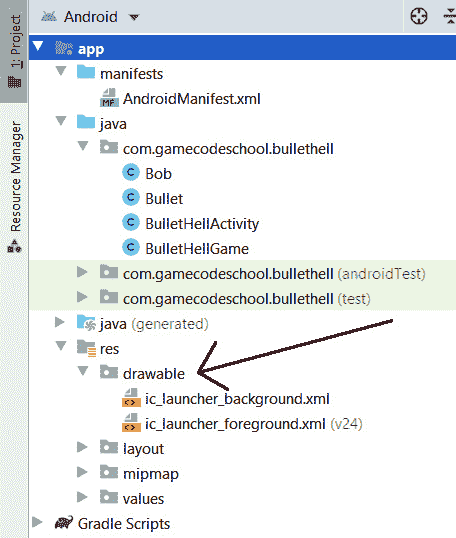
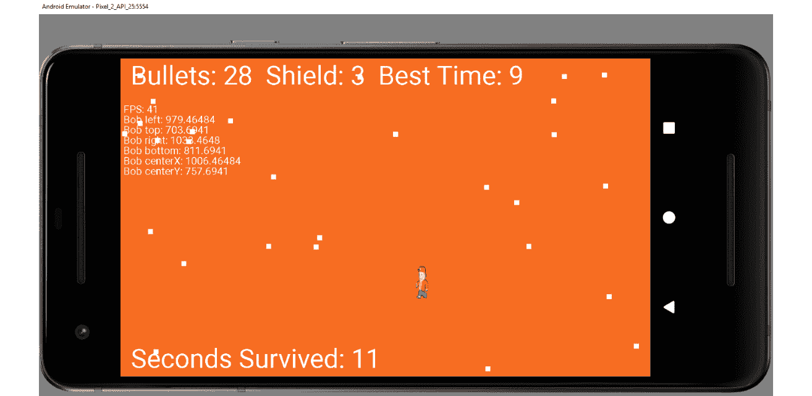
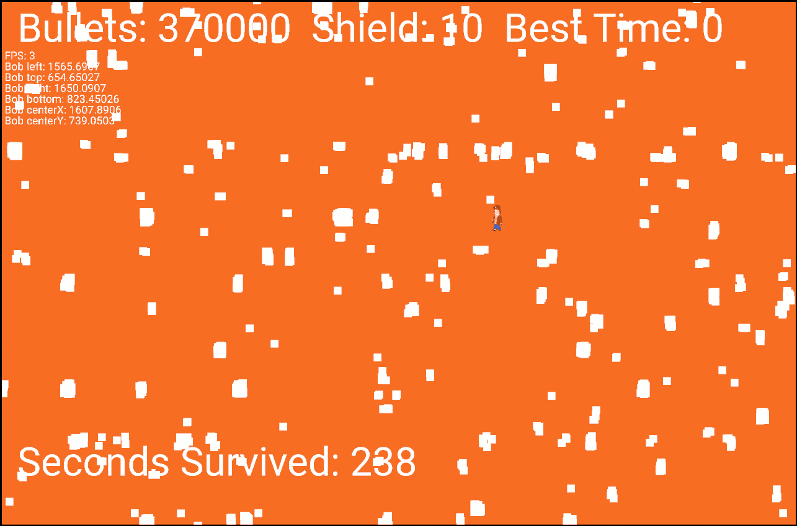

# *第十三章*:位图图形和测量时间

到目前为止，在这本书里，我们只画了原始的形状和文字。在本章中，我们将看到如何使用`Canvas`类绘制位图图形；毕竟，鲍勃不仅仅是一个街区或一条线。我们还将对鲍勃进行编码，并实现他的传送功能、盾牌和碰撞检测。为了结束游戏，我们将添加一个平视显示器，测量时间，并编写一个解决方案来记住最长(最好)的时间。

在本章中，我们将涵盖以下主题:

*   了解如何在安卓系统中使用位图图形
*   实现我们的传送超级英雄，鲍勃
*   完成游戏的所有其他功能，包括平视显示器和计时
*   安卓工作室剖析工具

让我们结束这场比赛。

# 鲍勃(球员)班

这是这个项目的最后一堂课。提醒一下，我们需要让鲍勃在每次玩家触摸屏幕时进行瞬移，他应该瞬移到触摸的位置。我预测传送方法很有可能。在我们编写这个类的代码时，我们还将看到如何使用一个`.png`文件来表示 Bob，而不是像我们到目前为止所做的那样只使用无聊的矩形。

我们要做的第一件事是将图形(`bob.png`)文件添加到项目中。

## 将鲍勃图形添加到项目中

右键选择**复制**将`Chapter 13/drawable`文件夹中的`bob.png`图形文件复制到 GitHub repo 上。

在安卓工作室中，在项目浏览器窗口中找到`app/res/drawable`文件夹。下面的截图清楚地显示了该文件夹的位置:



图 13.1–定位可绘制文件夹

右键单击**可绘制的**文件夹，选择**粘贴**将`bob.png`文件添加到项目中。单击**确定**两次至确认将文件导入项目的默认选项。

## 对鲍勃类进行编码

为了在正确的位置绘制位图，以及让`BulletHellGame`类知道 Bob 在哪里，我们需要一些成员变量。正如我们将在本章后面看到的那样，`Canvas`类有一个`drawBitmap`方法，该方法将`RectF`作为其参数之一。这意味着，即使我们有一个图形文件来表示游戏对象，我们仍然需要一个`RectF`来指示在哪里绘制它以及以什么比例绘制。

此外，我们将根据屏幕的分辨率缩放鲍勃，我们将需要计算并保留高度和宽度。我们还需要一个`boolean`变量来跟踪鲍勃当前是否在传送。

最后一个需要成为成员的东西是`Bitmap`类型的对象，使其在整个类的范围内。你大概能猜到这是干什么用的。

将成员变量和`imports`添加到与我们刚才讨论相匹配的`Bob`类中，这样您的代码如下所示:

```java
import android.content.Context;
import android.graphics.Bitmap;
import android.graphics.BitmapFactory;
import android.graphics.RectF;
class Bob {
    RectF mRect;
    float mBobHeight;
    float mBobWidth;
    boolean mTeleporting = false;
    Bitmap mBitmap;
}
```

现在我们可以开始初始化这些成员变量了。将构造函数的代码添加到`Bob`类中，如下所示:

```java
public Bob(Context context, float screenX, float screenY){
        mBobHeight = screenY / 10;
        mBobWidth = mBobHeight / 2;
        mRect = new RectF(screenX / 2,
                screenY / 2,
                (screenX / 2) + mBobWidth,
                (screenY / 2) + mBobHeight);
        // Prepare the bitmap
        // Load Bob from his .png file
        // Bob practices responsible encapsulation
        // looking after his own resources
        mBitmap = BitmapFactory.decodeResource
               (context.getResources(), R.drawable.bob);
}
```

在构造器中，`mBobHeight`初始化为屏幕高度的 1/10，然后`mBobWidth`初始化为`mBobHeight`的一半。通过这种安排，鲍勃应该是一个很好形成的(不是拉伸或挤压)角色。请注意，屏幕分辨率是作为参数从`BulletHellGame`类传入的。还有，你会看到第三个参数，`context`。这在方法后面的`Bitmap`初始化期间使用。

接下来，我们用以下代码初始化`RectF`:

```java
mRect = new RectF(screenX / 2,
screenY / 2,
   (screenX / 2) + mBobWidth,
   (screenY / 2) + mBobHeight);
```

前两个参数将 Bob 的左上角放在屏幕中央，后两个参数通过将`mBobWidth`和`mBobHeight`添加到顶部和左侧计算中，将右下角精确地放在正确的距离之外。

最后，对于构造函数，我们用下面一行代码初始化位图:

```java
mBitmap = BitmapFactory.decodeResource
(context.getResources(), R.drawable.bob);
```

`BitmapFactory`方法的静态`decodeResource`方法用于初始化`mBitmap`。它需要两个参数。第一个是打给`getResources`的电话，由`context`提供。顾名思义，该方法提供对项目资源的访问，第二个参数`R.drawable.bob`指向`drawable`文件夹中的`bob.png`文件。`Bitmap` ( `mBitmap`)现在准备好被`Canvas`班抽中了。我们只需要一种方式，在需要的时候给`BulletHellGame`类提供`mBitmap`。

接下来我们有`teleport`方法。添加`teleport`方法，注意传入的参数是两个浮动，它们是要移动到的位置。在本章的后面，我们将从`BulletHellGame`的`onTouchEvent`方法中编写一些代码来调用这个方法:

```java
boolean teleport(float newX, float newY){
     // Did Bob manage to teleport?
     boolean success = false;
     // Move Bob to the new position
     // If not already teleporting
     if(!mTeleporting){
          // Make him roughly central to the touch
          mRect.left = newX - mBobWidth / 2;
          mRect.top = newY - mBobHeight / 2;
          mRect.bottom = mRect.top + mBobHeight;
          mRect.right = mRect.left + mBobWidth;
          mTeleporting = true;
          // Notify BulletHellGame that teleport
          // attempt was successful
          success = true;
     }
     return success;
}
```

在`teleport`方法内部，会发生一些事情。首先，一个名为`success`的局部`boolean`变量被声明并初始化为`false`。紧接着，有一个`if`块，保存了这个方法的所有逻辑。条件是`if(!mTeleporting)`。这意味着如果`mTeleporting`是`true`，代码将不会执行。在`if`块之后，立即将`success`的值返回到调用代码。因此，如果不执行`if`块，则返回值`false`，调用代码将知道传送尝试失败。

然而，如果`mTeleporting`是`false`，则`if`块确实执行，并且使用传入的参数更新鲍勃的位置。仔细看`if`块中的代码，你会看到一点调整正在进行。如果我们简单地将鲍勃移动到传入的位置，那么他会传送，这样他的左上角像素就在被触摸的位置。通过将左上角的位置偏移一半`mBobWidth`和一半`mBobHeight`，获得了更令人满意的瞬移，鲍勃将直接出现在玩家的手指下。

由于我们已经成功移动了鲍勃，我们现在将`mTeleporting`设置为`true`，以便再次暂时阻止传送。

`if`块中的最后一行代码将`success`设置为`true`，这意味着当方法返回时，它将通知调用代码传送成功。

对于`Bob`类，有三种快速的最终方法可以访问一些需要添加的 Bob 私有成员:

```java
void setTelePortAvailable(){
     mTeleporting = false;
}
// Return a reference to mRect
RectF getRect(){
     return mRect;
}
// Return a reference to bitmap
Bitmap getBitmap(){
     return mBitmap;
}
```

`setTeleportAvailable`方法将`mTeleporting`设置为`false`，这意味着我们刚刚讨论的方法(`teleport`)在调用时会返回`true`。我们将很快看到何时何地使用它。

最后`getRect`、`getBitmap`返回`RectF`、`Bitmap`，以便`BulletHellGame`进行碰撞检测、绘图等事情使用。

我们现在可以给游戏添加一个`Bob`实例。

## 使用鲍勃类

让我们把鲍勃也扯进来。在`BulletHellGame`构造函数前再添加一些成员变量:

```java
private Bob mBob;
private boolean mHit = false;
private int mNumHits;
private int mShield = 10;
// Let's time the game
private long mStartGameTime;
private long mBestGameTime;
private long mTotalGameTime;
```

第一个新成员变量是我们的`Bob`实例，叫做`mBob`。接下来，有一个`boolean`变量来跟踪鲍勃在当前帧中是否被击中。

`mNumHits`和`mShield`追踪游戏结束前鲍勃被子弹击中的次数和剩余的护盾。

最后，关于新成员变量，还有三种`long`类型将用于跟踪和记录时间。我们将很快看到这些行动。

通过添加以下突出显示的代码，在调用构造函数中的`startGame`之前初始化 Bob:

```java
for(int i = 0; i < mBullets.length; i++){
     mBullets[i] = new Bullet(mScreenX);
}
mBob = new Bob(context, mScreenX, mScreenY);
startGame();
```

这段代码调用`Bob`构造函数，传入一个`Context`对象的所需参数(由`Bob`类用来初始化`Bitmap`对象)以及屏幕的高度和宽度(以像素为单位)。

### 将鲍勃添加到冲突检测中

在最后一个右大括号前，将以下代码添加到刚刚的`detectCollisions`方法中。请注意不要将此代码与我们在上一章中添加的`detectCollisions`中的现有代码混淆:

```java
…
…
// Has a bullet hit Bob?
// Check each bullet for an intersection with Bob's RectF
for (int i = 0; i < mNumBullets; i++) {
     if (RectF.intersects(mBullets[i].getRect(), 
     mBob.getRect())) {
          // Bob has been hit
          mSP.play(mBeepID, 1, 1, 0, 0, 1);
          // This flags that a hit occurred 
          // so that the draw
          // method "knows" as well
          mHit = true;
          // Rebound the bullet that collided
          mBullets[i].reverseXVelocity();
          mBullets[i].reverseYVelocity();
          // keep track of the number of hits
          mNumHits++;
          if(mNumHits == mShield) {
               mPaused = true;
               mTotalGameTime = System.currentTimeMillis()
                    - mStartGameTime;
                    startGame();
          }
     }
}
```

重要说明

您需要添加`RectF`类:

```java
import android.graphics.RectF;
```

新代码是基本上是一个大的`for`循环，从零循环到`mNumBullets` -1:

```java
for (int i = 0; i < mNumBullets; i++) {
     …
```

`for`循环中的第一行代码是一个`if`语句，用于测试正在测试的当前子弹(由`for`循环确定)是否与鲍勃相撞。正如我们在乒乓游戏中所做的那样，`intersects`方法从子弹和鲍勃身上取出`RectF`，看看他们是否相撞:

```java
if (RectF.intersects(mBullets[i].getRect(), mBob.getRect())) {
…
```

如果没有碰撞，则`for`循环继续，并测试下一颗子弹的碰撞情况。如果发生了碰撞，那么`if`块被执行，很多事情发生。让我们浏览一下。

首先，我们播放声音效果:

```java
// Bob has been hit
mSP.play(mBeepID, 1, 1, 0, 0, 1);
```

现在我们将`mHit`设置为`true`，这样就知道发生了碰撞。请注意`mHit`是成员，因此所有方法中的代码都可以检测到该帧中稍后发生了命中:

```java
// This flags that a hit occurred 
// so that the draw
// method "knows" as well
mHit = true;
```

接下来，代码反转项目符号(水平和垂直)并增加`mNumHits`以跟踪总命中次数:

```java
// Rebound the bullet that collided
mBullets[i].reverseXVelocity();
mBullets[i].reverseYVelocity();
// keep track of the number of hits
mNumHits++;
```

下一个`if`语句嵌套在我们当前讨论的`if`语句中。它会检查玩家的命中次数是否等于护盾的强度。如果是，会发生以下情况:

*   游戏暂停。
*   `mTotalGameTime`通过从当前时间减去`mStartGametime`进行初始化。
*   调用`startGame`重置所有必要的变量，并等待屏幕点击从头重新开始:

```java
if(mNumHits == mShield) {
mPaused = true;
mTotalGameTime = System.currentTimeMillis()
          - mStartGameTime;
     startGame();
}
```

现在我们可以在屏幕上画鲍勃了。

### 画鲍勃和平视显示器

添加`draw`方法为高亮显示，将鲍勃和平视显示器绘制到屏幕的每一帧:

```java
private void draw(){
     if (mOurHolder.getSurface().isValid()) {
          mCanvas = mOurHolder.lockCanvas();
          mCanvas.drawColor(Color.argb(255, 243, 111, 36));
          mPaint.setColor(Color.argb(255, 255, 255, 255));
          for(int i = 0; i < mNumBullets; i++){
               mCanvas.drawRect(mBullets[i].getRect(), 
               mPaint);
          }
          mCanvas.drawBitmap(mBob.getBitmap(), 
          mBob.getRect().left, mBob.getRect().top, 
               mPaint);
          mPaint.setTextSize(mFontSize);
          mCanvas.drawText("Bullets: " + mNumBullets +
                    "  Shield: " + (mShield - mNumHits) +
                    "  Best Time: " + mBestGameTime / 
                         MILLIS_IN_SECOND,
                    mFontMargin, mFontSize, mPaint);
          // Don't draw the current time when paused
          if(!mPaused) {
                 mCanvas.drawText("Seconds Survived: " +
                     ((System.currentTimeMillis() -
                     mStartGameTime) / MILLIS_IN_SECOND),
                     mFontMargin, mFontMargin * 30, 
                     mPaint);
          }
          if(mDebugging) {
            printDebuggingText();
          }
          mOurHolder.unlockCanvasAndPost(mCanvas);
     }
}
```

我们之前已经看过几次如何绘制文本，在之前的代码中，我们以通常的方式将子弹数量、盾牌、最佳时间和当前时间绘制到屏幕上。

然而，这是我们第一次绘制。当我们调用其`drawBitmap`方法并传入鲍勃的`Bitmap`对象和他的`RectF`对象时，我们方便的`mCanvas`对象完成了所有工作。这两个对象都是使用我们在本章前面编码的 getter 方法从`Bob`实例中检索的。

请注意，我们现在已经使用了启动项目时设置的声音(在`update`方法中)，所以让我们将声音文件添加到项目中，以便在运行游戏时，可以听到播放的效果。

### 添加音效

从 GitHub repo 上的`Chapter 13`文件夹复制`assets`文件夹及其所有内容。使用操作系统的文件浏览器，导航到项目的`BulletHell/app/src/main`文件夹，粘贴`assets`文件夹。

显然，请随意将`assets`文件夹中的所有音效替换为您自己的。如果您决定替换所有音效，请确保它们的名称完全相同，或者在代码中进行适当的编辑。

### 激活鲍勃的传送

接下来，我们可以对`onTouchEvent`方法进行编码。以下是完整的代码。使您的方法相同，然后我们将讨论其工作原理:

```java
@Override
public boolean onTouchEvent(MotionEvent motionEvent) {
     switch (motionEvent.getAction() &
               MotionEvent.ACTION_MASK) {
          case MotionEvent.ACTION_DOWN:
               if(mPaused){
                    mStartGameTime = 
                    System.currentTimeMillis();
                    mPaused = false;
               }
if(mBob.teleport(motionEvent.getX(), motionEvent.getY())){
                    mSP.play(mTeleportID, 1, 1, 0, 0, 1);
               }
               break;
          case MotionEvent.ACTION_UP:
               mBob.setTelePortAvailable();
               spawnBullet();
               break;
     }
     return true;
}
```

在这个使用`onTouchEvent`方法的触摸处理解决方案中，和以前一样，我们在`switch`块中有两个`case`语句。第一种情况`ACTION_DOWN`，检查`mPaused`当前是否为`true`，如果是，则设置为`false`并用当前时间初始化`mStartTime`。`mStartTime`变量现在可以在游戏结束时用来计算游戏的持续时间。

此外，在`ACTION_DOWN`情况下，向`mBob.teleport`进行呼叫。请记住，`teleport`方法需要屏幕触摸的坐标，这是通过使用`motionEvent.getX()`和`motionEvent.getY()`作为传入的参数来实现的。

由于这个方法调用是用`if`语句包装的，返回值被用来决定是否执行`if`块中的代码。如果`teleport`法返回`true`，则播放传送的音效。

在第二个`case`语句`ACTION_UP`中，代码调用`setTeleportAvailable`方法。这一系列事件的结果是`teleport`方法在每次按压中不会返回`true`超过一次。同样，在这种情况下，调用`spawnBullet`方法对鲍勃释放更多的危险。

### 打印调试文本方法的编码

在`printDebuggingText`中添加新的高亮代码:

```java
private void printDebuggingText(){
     int debugSize = 35;
     int debugStart = 150;
     mPaint.setTextSize(debugSize);
     mCanvas.drawText("FPS: " + mFPS , 10, 
               debugStart + debugSize, mPaint);
     mCanvas.drawText("Bob left: " + mBob.getRect().left ,
               10, debugStart + debugSize *2, mPaint);
     mCanvas.drawText("Bob top: " + mBob.getRect().top , 
               10, debugStart + debugSize *3, mPaint);
    mCanvas.drawText("Bob right: " + mBob.getRect().right , 
               10, debugStart + debugSize *4, mPaint);
     mCanvas.drawText("Bob bottom: " + 
     mBob.getRect().bottom , 
               10,debugStart + debugSize *5, mPaint);
     mCanvas.drawText("Bob centerX: " + 
     mBob.getRect().centerX() ,
               10,debugStart + debugSize *6, mPaint);
     mCanvas.drawText("Bob centerY: " + 
     mBob.getRect().centerY() ,
               10, debugStart + debugSize *7, mPaint);
}
```

在`printDebugging`文本中，我们打印出所有可能有助于观察的值。我们使用`debugStart`和`debugSize`变量来格式化和分隔文本行，这些变量是根据上一章中屏幕的分辨率在构造函数中初始化的。

## 编码 spawnBullet 方法(再次)

在`spawnBullet`方法中增加新的高亮代码，让子弹更智能的产卵，远离 Bob，删除我们上一章增加的临时代码。当您键入或粘贴代码时，观察到一些在开头的代码和一些在结尾的代码不需要删除。新代码突出显示，旧代码以常规代码字体显示:

```java
// Spawns ANOTHER bullet
private void spawnBullet(){
     // Add one to the number of bullets
     mNumBullets++;
     // Where to spawn the next bullet
     // And in which direction should it travel
     int spawnX;
     int spawnY;
     int velocityX;
     int velocityY;
     // This code will change in chapter 13
     // Don't spawn to close to Bob
     if (mBob.getRect().centerX() 
          < mScreenX / 2) {

          // Bob is on the left
          // Spawn bullet on the right
          spawnX = mRandomX.nextInt
                    (mScreenX / 2) + mScreenX / 2;
          // Head right
          velocityX = 1;
     } else {

          // Bob is on the right
          // Spawn bullet on the left
          spawnX = mRandomX.nextInt
                     (mScreenX / 2);
          // Head left
          velocityX = -1;
     }
     // Don't spawn to close to Bob
     if (mBob.getRect().centerY() 
          < mScreenY / 2) {

          // Bob is on the top
          // Spawn bullet on the bottom
          spawnY = mRandomY.nextInt
                     (mScreenY / 2) + mScreenY / 2;
          // Head down
          velocityY = 1;
     } else {

          // Bob is on the bottom
          // Spawn bullet on the top
          spawnY = mRandomY.nextInt
                (mScreenY / 2);
          // head up
          velocityY = -1;
     }
     // Spawn the bullet
     mBullets[mNumBullets - 1]  
               .spawn(spawnX, spawnY, 
               velocityX, velocityY);
}
```

为了理解新代码，让我们更仔细地检查它的一部分。基本上有两个`if` - `else`街区。这里是第一个`if` - `else`再次封锁:

```java
// Don't spawn to close to Bob
if (mBob.getRect().centerX() 
< mScreenX / 2) {

// Bob is on the left
     // Spawn bullet on the right
     spawnX = mRandomX.nextInt
           (mScreenX / 2) + mScreenX / 2;
     // Head right
     velocityX = 1;
} else {

// Bob is on the right
     // Spawn bullet on the left
     spawnX = mRandomX.nextInt
           (mScreenX / 2);
     // Head left
     velocityX = -1;
}
```

第一个`if` - `else`块获取 Bob 的中心水平像素的位置，如果水平小于屏幕中心，则执行第一个`if`块。`spawnX`变量通过屏幕中心和最右侧之间的随机数初始化。接下来`velocityX`被初始化为`1`。当`spawn`方法被调用时，这将产生从右边开始子弹并向右行进的效果，远离鲍勃。

当然，接下来`else`块将在鲍勃在屏幕右侧时执行，然后`spawnX`将瞄准左侧，`velocityX`将向左移动。

第二个`if` - `else`块使用相同的技术来确保子弹在垂直相对的两侧产生，并垂直远离鲍勃。

我们现在几乎完成了这个游戏。

### 编写 startGame 方法

对`startGame`方法进行编码，以重置玩家被击中的次数、产生的子弹数量以及`mHit`变量:

```java
public void startGame(){
     mNumHits = 0;
     mNumBullets = 0;
     mHit = false;
     // Did the player survive longer than previously
     if(mTotalGameTime > mBestGameTime){
          mBestGameTime = mTotalGameTime;
     }
}
```

最后一行代码检查在玩这个游戏时存活的时间是否比之前的最佳时间长，如果是，则重新初始化`mBestGameTime`向玩家显示新的最佳时间。

子弹地狱游戏结束了。我们玩吧。

# 运行游戏

玩一个游戏，看到完成的项目在行动:



图 13.2–玩游戏

你能活多久？

当你的游戏使用越来越多的对象时，它们就开始让 CPU 不堪重负，并使用越来越多的设备有限内存资源。在继续完成游戏之前，让我们更详细地探讨一下这个问题。

# 安卓工作室评测工具

安卓工作室剖析工具相当复杂和深入。然而，用我们的游戏做一些真正有意义的测量是非常简单的。我们可以看到我们的应用程序使用了多少设备资源，因此试图提高我们游戏的效率，使其运行更高效，使用更少的资源。通过资源，我说的是 CPU 和内存的使用。

代码优化超出了本书的范围，但是看看我们如何开始监控我们游戏的性能是一个很好的介绍。从安卓工作室主菜单中选择**查看**，然后选择**工具窗口** | **侧写**。

你会在安卓工作室的下方看到如下窗口:


图 13.3–安卓探查器窗口

要开始使用探查器，请运行子弹地狱应用程序。探查器应该开始显示图表和数据，如下图所示。

根据电脑防火墙软件的配置，您可能需要允许探查器运行。此外，您可能需要左键单击 **Profiler** 窗口左上角的 **+** 图标，如前一张截图所示，然后选择您的 AVD 供 Profiler 连接。

在下图中，我们可以看到 CPU 使用、内存使用、网络使用和能源/电池使用的实时图表数据。我们将关注 CPU 和内存的使用情况。

将鼠标悬停在**中央处理器**行上，然后悬停在**内存**行上，以查看每个指标的弹出详细信息。下图显示了我的电脑上这两个指标的详细信息，它们一起经过了 photoshopped 处理。这些值是在不同的时间获得的，但是从两个图表的一致高度可以看出，尽管存在时间差，但这些值保持大致一致:


图 13.4–中央处理器和内存行指标

有可能，甚至有可能，你会看到我不同的价值观。上图显示大约四分之一的CPU 在使用，而大约 110 MB 的 ram 在使用。

重要说明

当游戏第一次启动时，你也可能会看到明显更高的值(也许是 CPU 使用的翻倍)，尽管这些值会在执行几秒钟后稳定下来。这是操作系统设置艺术为我们的游戏采取优先。

接下来，让我们稍微修改一下代码，观察一下效果。在`BulletHellGame.java`文件中，更改`mBullets`数组声明以保存一百万个实例，如以下代码片段所示:

```java
// Up to 10000 bullets
private Bullet[] mBullets = new Bullet[1000000];
```

在`detectCollisions`方法中，注释掉此处突出显示的代码行:

```java
// keep track of the number of hits
//mNumHits++;
```

注释掉前面代码的效果是游戏永远不会结束，我们可以做一些狂野的实验。

在`onTouchEvent`方法中，找到`MotionEvent.ACTION_UP`案例，将产生子弹的代码行包装在一个`for`循环中，该循环导致一万颗子弹产生。新代码突出显示如下:

```java
case MotionEvent.ACTION_UP:

     mBob.setTelePortAvailable();
     for(int i = 0; i < 10000; i++) {
          spawnBullet();
     }
     break;
```

再次运行游戏。首先，看看内存使用情况。它增加了大约四倍。这是 ART 为一百万颗子弹分配空间，尽管我们实际上还没有产生一颗子弹。

接下来，快速点击，可能是 30 次或 40 次，快速创建几十万个子弹供我们的游戏处理。下面的截图显示我已经产生了 37 万个子弹:



图 13.5–运行游戏

在下面的截图中，你可以看到一些有趣的数据:

重要说明

这张图片经过了图片处理，以更清楚地显示必要的数据，但数据是从这次测试中获得的真实值。


图 13.6–测试数据

首先，请注意探查器的**bulletellactivity**部分中有许多重叠的圆圈。每个圆圈代表鼠标在屏幕上的一次点击。

CPU 使用率显示增长到 38%。实际上，它增加到略高于 40%，但很难捕捉到显示这一点的图像，因为该值波动很快。如果你在进行这个测试的时候观察探查器窗口，也许令人惊讶的是，你会看到中央处理器的使用量下降回大约在产生额外的`Bullet`实例之前的位置。这非常值得注意。在百万分之一`Bullet`的实例上，安卓设备在绘制、更新和计算碰撞时似乎连汗都不会流！然而，生成这些实例的行为确实给 CPU 带来了巨大的可测量的压力。

此外，上图还显示了 456 兆内存的内存使用情况。这一点我以前也提到过。内存使用量增加了大约四倍。一旦声明了数组，它就会发生，并且在整个游戏执行过程中保持不变。

我们可以从这个实验中学到两个，或者三个东西:

1.  即使没有分配任何实际值，数组也会立即占用所有内存。
2.  使用`new`关键字创建对象相当耗费处理器。
3.  当我想到这一点时，“也许”的第三个学习点仍然让我大吃一惊，那就是一部 100 美元半厘米厚的手机，放在你的口袋里，如果操作正确，可以轻松处理成千上万的物体。

在下一章的 Snake 项目中，我们将了解并使用`ArrayList`类，该类仅在需要时分配内存。在滚动射手项目中，我们将使用粒子系统创建一个星暴效果。我们将看到，我们可以在游戏循环之外分配所需的值，以避免在游戏循环期间出现 CPU 峰值。

这一小段并不打算触及我们如何优化图形或 CPU 密集型游戏的表面。它只是被设计来引入这样一个想法，即您可能希望将优化添加到您的待办事项列表中，以便进一步研究。

# 总结

在子弹地狱项目的第二章也是最后一章，我们通过增加计时和`Bob`类对游戏进行了最后的润色。

我们还首次处理了初始化和绘制位图来表示游戏对象。在所有未来的项目中，位图将发挥更大的作用，我们将做一些事情，比如移动它们，缩放它们，旋转它们，甚至从它们中制作一个正在运行的 Bob 动画。

凭借我们新发现的技能和经验，我们现在可以涵盖一些更重要的 Java 和 Android 主题，包括以下内容:

*   堆栈和堆
*   垃圾收集(是的，这是 Java 的事情)
*   本地化以增加外语支持
*   更多的封装，以防止我们的代码变得过于庞大
*   收集
*   列举
*   永远保存高分
*   更多位图素材
*   还有更多…

我们将在接下来的四章中讨论所有这些，同时构建一个经典的 Snake 游戏。