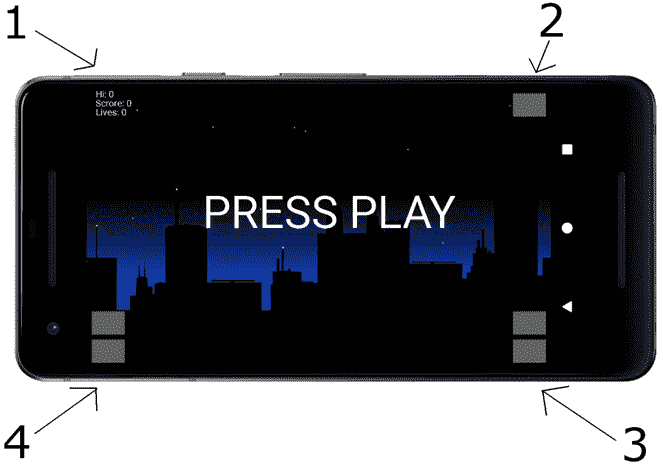
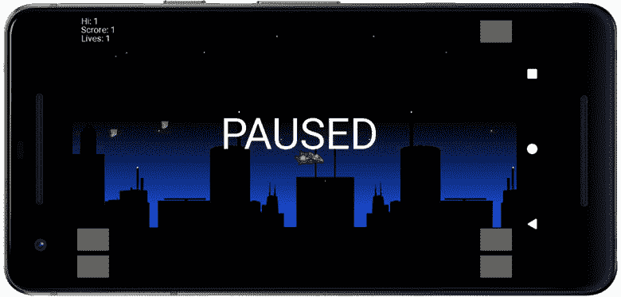
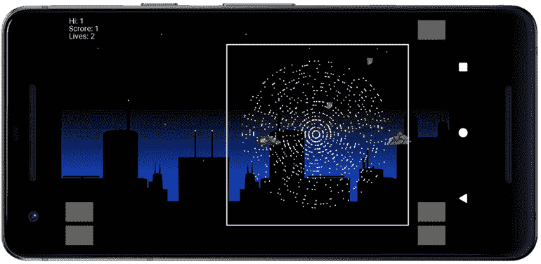
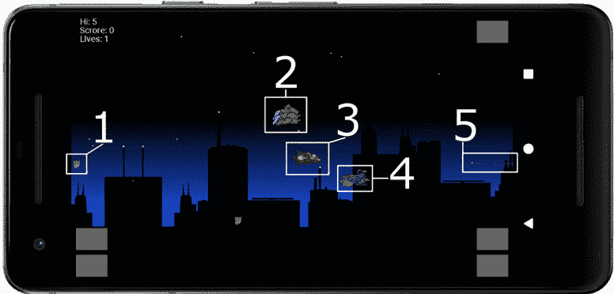
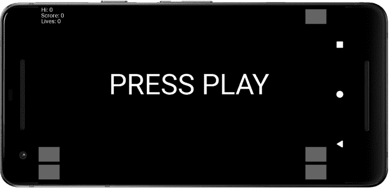

# *第十八章*:设计模式介绍等等！

从第二个项目开始，我们就一直在使用对象。你可能已经注意到许多物体都有共同点，比如速度和方向的变量，处理碰撞的`RectF`等等。

随着我们的对象有更多的共同点，我们应该开始更多地利用 OOP、继承、多态性，以及我们现在将介绍的另一个概念，**设计模式**。

继承、多态性和设计模式将使我们能够形成一个合适的层次结构，以尽量避免编写重复的代码，并避免数百行的庞大类。这种杂乱无章的代码很难阅读、调试或扩展。游戏项目越大，对象类型越多，问题就越多。

这个项目和下一个项目将探索多种方法来构造我们的 Java 代码，使我们的代码高效、可重用，并且减少错误。当我们为一个特定的、先前设计的解决方案/结构编写代码时，我们使用的是一种设计模式。

别担心，在剩下的章节中，我们还将了解更多的游戏开发技术，以编写更好、更高级的游戏。在本章中，我们将开始滚动射手项目。

为了开始创建滚动射手项目，在本章中，我们将执行以下操作:

*   介绍滚动射手项目。
*   讨论滚动射手项目的结构。
*   用`GameState`类管理游戏状态。
*   为我们的第一个接口编写代码，以便在不同的类之间进行通信。
*   了解如何即使在游戏结束且设备已关闭的情况下也能保持高分。
*   编写一个名为`SoundEngine`的类，它将使项目的不同部分触发声音效果播放。
*   编码一个`HUD`类来控制文本和控制按钮的绘制和位置。
*   Code a `Renderer` class that will handle drawing to the screen.

    小费

    从这一章开始，我不会提到什么时候需要导入一个新类。如果您正在使用另一个包中的类(安卓或 Java 提供的任何类)，您需要添加适当的`import`，或者从本书的页面中复制它，手动键入它，或者突出显示有错误的类并使用 *Alt* + *输入*组合键。

让我们看看当我们在 [*第 21 章*](21.html#_idTextAnchor441) *结束时，滚动射击游戏会做什么，完成滚动射击游戏*。

# 介绍滚动射击项目

玩家在这个游戏中的目标只是尽可能多地消灭外星人。让我们来看看更多关于游戏功能的细节。请看下图中滚动射击项目的开始屏幕:



图 18.1–滚动射击游戏屏幕

你可以看到摩天大楼的轮廓背景。这个背景会平滑快速地向玩家飞行的方向滚动。玩家可以向左或向右飞，背景也会相应滚动。然而，玩家不能保持水平不动。你可以看到当游戏结束(或者玩家刚刚启动)时，会显示 **PRESS PLAY** 信息。

我在上图中对一些感兴趣的项目进行了编号；让我们浏览一下:

1.  有一个高分特色，第一次，我们会让高分持久。当玩家退出游戏，稍后重启时，高分依然存在。玩家甚至可以关闭他们的设备，第二天再来看他们的高分。高分以下是当前分数，低分以下是游戏结束前剩余的生命数量。玩家会得到三条命，这三条命特别容易丢。当他们失去第三次生命时，将再次显示 **PRESS PLAY** 画面，如果达到新的高分，则更新高分。
2.  屏幕其余三个角上的灰色矩形是控制游戏的按钮。图中数字 **2** 为播放/暂停按钮。在开始屏幕上按下它，游戏就会开始，在游戏进行的同时按下它，暂停屏幕就会显示出来(见下一张截图)。
3.  标有 **3** 的角的两个矩形是拍摄和翻转方向。顶部按钮发射激光，底部按钮改变船只前进的水平方向。
4.  上一张截图中标有 **4** 的角上按钮，是为了上下飞行躲避敌舰和激光或者排队射击。请看下一张截图:



图 18.2–游戏的特点

下图显示了粒子效果爆炸。当一艘敌舰被玩家的激光击中时，就会发生这种情况。我选择在玩家被摧毁时不创建粒子效果，因为死亡后重新聚焦在飞船上非常重要，粒子效果会分散注意力:



图 18.3–游戏中的爆炸效果

下一张截图(不容易捕捉到)显示了几乎所有正在运行的游戏对象。唯一缺少的是敌方激光，除了是红色而不是绿色外，外观和玩家的激光一样。敌人范围广是这款游戏的特色之一。我们会有三个不同的敌人，他们有不同的外表，不同的属性，甚至不同的行为。

我们如何处理这种复杂性而不使我们的代码变成像意大利面条一样的文本迷宫将是关键的学习点之一。我们将使用一些设计模式来实现这一点。

检查下一张截图，然后查看每个对象的简要说明:



图 18.4–游戏对象

*   标签 **1** :这种类型的外星飞船叫做潜水员。它们在屏幕顶部看不见的地方产卵，然后随机下潜，目的是撞上玩家并夺走一条生命。我们将通过在每次这些潜水员被摧毁(被射击或撞向玩家)或无害地离开屏幕底部时再次对他们进行重新充电来制造一种拥有大量潜水员的错觉。
*   标签 **2** :这个外星人(截图中其实有两个)，标签为号 **2** ，是一个追赶者。它会不断尝试，并在垂直和水平方向瞄准玩家，然后用激光射击。玩家比追逐者稍微快一点，所以玩家可以跑得比他们快，但是在某个时候，他们需要改变方向，把追逐者击落。此外，玩家将无法逃脱敌人的激光。当追逐者被摧毁时，他们会从屏幕上随机向左或向右重生，并重新开始追逐。
*   标签 **3** :编号 **3** 的物体是玩家的船。我们已经讨论过它能做什么。
*   标签 **4** :这个外星人是巡逻者。它从左到右，上上下下飞行，当它到达离玩家预定的距离时，它会转身，从右到左飞行。这些船不会试图攻击玩家，但它们会经常挡道，或者在有机会击中玩家的有利位置发射激光。
*   标签 **5** :这是绿色玩家激光。玩家将有足够的激光来创造令人满意的快速射击效果，但不会太多，以至于他们可以简单地按下射击按钮，从而无敌。

也许令人惊讶的是，这个项目将只有一些新的，特别是 Java 课程。最值得注意和最新颖的是我们如何构建代码来实现这一切。那么，我们现在来谈谈这个。

# 游戏编程模式和滚动射击项目的结构

在我们深入探讨之前，也许值得一提的是**设计模式**到底是什么。

一个**设计模式**是一个编程问题的解决方案。更具体地说，设计模式是对一个“T4”编程问题的**尝试和测试的**解决方案。

设计模式的特别之处在于，解决方案已经被其他人发现，记录在书籍和其他媒体(如网站)中，它们甚至有名字，因此可以很容易地讨论。

有很多设计模式。我们将学习观察者、策略/实体组件、单例和工厂设计模式。

设计模式已经被证明是实现我们已经讨论过的想法的方法，例如重用代码、封装代码和设计表示事物的类。模式通常相当于封装的最佳实践方式，允许重用，并允许一组类进行交互。

小费

正如我们将在本书的其余部分看到的，设计模式更多地与类的结构和代码的对象有关，而不是与特定的代码行或方法有关。

设计模式用于所有语言和所有类型的软件开发。设计模式的关键是简单地知道它们的存在，以及它们每个解决了什么样的问题。然后，当您看到代码结构中的缺陷时，您可以去调查特定的模式。

小费

设计模式的另一个好处是，通过学习并使用常见问题的通用解决方案，设计模式也成为开发人员之间的一种交流方式。“嘿，弗雷德，我们为什么不尝试在 Widget 项目上实现一个基于观察者的解决方案来解决这个通信问题呢？”

在本书的其余部分，当我们被介绍设计模式时，我们也将首先检查导致我们需要模式的问题。

# 启动项目

创建一个新项目，并将其称为`Scrolling Shooter`。照常使用`Empty Activity`模板。

正如我们之前所做的，我们将编辑安卓清单，但是首先，我们将把`MainActivity`类重构为更合适的东西。

# 将主活动重构为游戏活动

和之前的项目一样，`MainActivity`有点模糊，所以我们把`MainActivity`重构为`GameActivity`。

在项目面板中，右键单击`MainActivity`文件，选择**重构** | **重命名**。在弹出窗口中，将**主活动**更改为**游戏活动**。将所有其他选项保留为默认值，然后左键单击**重构**按钮。

请注意项目面板中的文件名已按预期更改，但在`AndroidManifest.xml`文件中多次出现的`MainActivity`已更改为`GameActivity`，在`GameActivity.java`文件中也有一个实例。

让我们设置屏幕方向。

# 将游戏锁定为全屏和横向

与之前的项目一样，我们希望使用设备必须提供的每个像素，因此我们将对`AndroidManifest.xml`文件进行更改，允许我们为我们的应用使用一种样式，从用户界面隐藏所有默认菜单和标题。

确保`AndroidManifest.xml`文件在编辑器窗口中打开。

在`AndroidManifest.xml`文件中，找到下面一行代码:`android:name=".GameActivity">`。

将光标放在前面显示的关闭`>`之前。点击*输入*键几次，将`>`移动到前面显示的线的其余部分下方几行。

紧接在`".GameActivity"`下方，但在新定位的`>`之前，键入或复制并粘贴下一行代码，使游戏在没有任何用户界面的情况下运行:

```java
android:theme=
"@android:style/Theme.Holo.Light.NoActionBar.Fullscreen"
```

您的代码应该如下所示:

```java
…
<activity android:name=".GameActivity"

android:theme=
"@android:style/Theme.Holo.Light.NoActionBar.Fullscreen"
      >
      <intent-filter>
        <action android:name="android.intent.action.MAIN" />
<category android:name= "android.intent.category.LAUNCHER" />
      </intent-filter>
</activity>
…
```

现在我们的游戏将使用设备提供的所有屏幕空间，而不需要任何额外的菜单。

## 编码游戏活动类

这里我们将对`GameActivity`类进行编码，这是游戏的入口点。像往常一样，它抓取屏幕大小并创建一个主控制类的实例，在这个项目中是`GameEngine`。这段代码中除了一个很小的名字变化之外，没有什么新内容，我稍后会解释。这是全文，供您参考/复制粘贴。编辑`GameActivity`类的代码以匹配以下内容，包括使用标准的`Activity`(不是`AppCompatActivity`类)和匹配的`import` 指令:

```java
import android.app.Activity;
import android.graphics.Point;
import android.os.Bundle;
import android.view.Display;
import android.view.Window;
public class GameActivity extends Activity {
    GameEngine mGameEngine;
    @Override
    protected void onCreate(Bundle savedInstanceState) {
        super.onCreate(savedInstanceState);
        requestWindowFeature(Window.FEATURE_NO_TITLE);
        Display display = getWindowManager()
                .getDefaultDisplay();

        Point size = new Point();
        display.getSize(size);
        mGameEngine = new GameEngine(this, size);
        setContentView(mGameEngine);
    }
    @Override
    protected void onResume() {
        super.onResume();
        mGameEngine.startThread();
    }
    @Override
    protected void onPause() {
        super.onPause();
        mGameEngine.stopThread();
    }
}
```

小费

如果复制粘贴，请记住不要删除顶部的包声明。每节课都是如此，但从这一点开始，我将不再留下这些提示。

在`onResume`和`onPause`方法中有一个微小的修饰变化。他们称之为`startThread`和`stopThread`方法，而不是我们在之前所有项目中所称的`resume`和`pause`方法。唯一不同的是名字。我们将在`GameEngine`类中对这些方法进行不同的命名，以反映它们在这个更高级的项目中稍微更精细的角色。

请注意，在我们对`GameEngine`类进行编码之前，显然会有错误。我们现在就开始吧。

## 开始游戏引擎课程

正如我们已经讨论过的，我们游戏中的类是紧密交织在一起的，并且相互依赖。因此，当我们构建项目时，我们需要多次重新访问许多类。

创建一个名为`GameEngine`的新类。我们将要编码的`GameEngine`类的第一部分是一些成员变量和构造函数。一开始并没有太多的内容，但是我们会在整个项目中更广泛地增加内容和课程。添加突出显示的代码，包括扩展`SurfaceView`类和实现`Runnable`接口:

```java
import android.content.Context;
import android.graphics.Point;
import android.util.Log;
import android.view.MotionEvent;
import android.view.SurfaceView;
class GameEngine extends SurfaceView implements Runnable {
    private Thread mThread = null;
    private long mFPS;    
    public GameEngine(Context context, Point size) {
 super(context);

 }   
}
```

注意我们声明的成员有多少:只有一个`Thread`(用于游戏线程)和一个`long`变量，用来测量每秒的帧数。我们将在项目结束前再增加一些，但不会有前一个项目那么多。这是因为我们将把任务抽象到其他更具体的任务类中，以使项目更易于管理。

让我们在`GameEngine`类中增加一些代码，使其更加充实，并消除这个类和`GameActivity`中的错误。编码如下所示的`run`方法。将其放在我们之前添加的构造函数之后:

```java
@Override
public void run() {
    long frameStartTime = System.currentTimeMillis();
      // Update all the game objects here
     // in a new way
    // Draw all the game objects here
   // in a new way
     // Measure the frames per second in the usual way
     long timeThisFrame = System.currentTimeMillis()
           - frameStartTime;
      if (timeThisFrame >= 1) {
         final int MILLIS_IN_SECOND = 1000;
      mFPS = MILLIS_IN_SECOND / timeThisFrame;
      }
}
```

您可能还记得，`run`方法是所必需的，因为我们实现了`Runnable`接口。它是线程启动时将执行的方法。第一行代码记录了当前时间，然后有一堆注释表明我们将更新然后绘制所有的游戏对象——但是是以一种新的方式。

到目前为止，`run`方法的最后一部分计算所有更新和绘制花费的时间，并将结果分配给`mFPS`成员变量，方法与我们在前面的项目中所做的相同(除了第一个项目)。

一旦我们写了更多的代码和类，`mFPS`就可以传递给游戏中的每个对象，这样它们就可以根据过去的时间来更新自己。

我们将很快添加另外三个方法，这样我们就不会出错，并准备好继续这个项目的第一个新类。

加上下面这三个方法应该都很熟悉:

```java
@Override
public boolean onTouchEvent(MotionEvent motionEvent) {
      // Handle the player's input here
     // But in a new way

     return true;
}
public void stopThread() {
     // New code here soon
      try {
           mThread.join();
       } catch (InterruptedException e) {
       Log.e("Exception","stopThread()" 
              + e.getMessage());
       }
}
public void startThread() {
     // New code here soon
     mThread = new Thread(this);
     mThread.start();
}
```

我们刚刚添加的三个方法中的第一个是被覆盖的`onTouchEvent`方法，它接收与屏幕的任何交互的细节。目前，除了方法要求的`return true`之外，我们什么都不做。

第二个和第三个方法是`stopThread`和`startThread`方法，正如它们的名字所强烈暗示的那样，它们启动和停止控制`run`方法执行时间的线程。请注意，就像到目前为止的所有方法一样，有一个注释承诺很快会有更多的代码。具体来说，关于`stopThread`和`startThread`方法，我们还没有控制游戏何时运行和何时不运行的变量。我们将进入下一个阶段。

小费

此时，您可以无错误地运行游戏，并看到一个令人兴奋的空白屏幕。您可能希望这样做只是为了确认您没有错误或错别字。

让我们学习控制游戏状态。

# 用 GameState 类控制游戏

由于这个游戏的代码分散在许多类中以保持每个类的可管理性，这就产生了一个问题，当这些类中的一个需要知道另一个类中正在发生什么时会发生什么。至少当我们把所有东西都塞进主游戏引擎类时，所有需要的变量都在范围内！

小费

我的估计是，如果我们继续这个项目的常规模式(将所有东西塞进游戏引擎)，那么`GameEngine`类将有大约 600 行代码！到这个项目结束时，做一些不同的事情，它将只有 100 行代码。每个代码文件/类都会简单得多。然而，我们需要花更多的时间来理解所有不同的类是如何相互作用的——我们会的。现在我们将进入`GameState`课。

有许多方法来处理这个常见问题，您使用的解决方案将取决于您正在进行的特定项目。我将介绍在这个项目和下一个项目中处理这个问题的几种不同方法。

我们将处理知道游戏的**状态**(暂停、游戏结束、玩家失去生命、分数增加等等)的不同类的方式是创建一个保存所有这些状态的类(`GameState`)，然后通过将其传递到其他类的所需方法来共享该类。

## 将游戏状态从游戏引擎传递到其他类

正如我们将看到的，随着我们的进展，`GameEngine`类将实例化`GameState`的一个实例，并负责在需要时共享对它的引用。

现在我们知道`GameState`类将被`GameEngine`和任何其他被引用的类使用，但是如果`GameState`类需要触发`GameEngine`类中的动作(并且它会触发)怎么办？

## 从游戏状态到游戏引擎的通信

我们将需要`GameState`类能够触发所有游戏对象的清除(去繁殖)，然后在每场游戏开始时再次重生。`GameEngine`可以访问所有游戏对象，但是`GameState`将可以在发生时访问关于*的信息。*

正如我们已经讨论过的那样，`GameEngine`类当然可以通过简单地声明一个`GameState`的实例来充分利用`GameState`类中的大部分数据，但事实并非如此。`GameState`类不能触发`GameEngine`类中的事件，除非`GameEngine`特别请求，例如，当它可以使用其`GameState`实例来询问关于状态的问题，然后采取行动时。例如，下面是我们即将添加到`GameEngine`类的一段代码:

```java
…
if (!mGameState.getPaused()){
…
```

在代码片段中，`mGameState`是`GameState`的一个实例，正在使用该实例查询游戏是否暂停。该代码使用了一个由`GameState`提供的简单的 getter 方法，类似于我们已经在其他项目中出于各种原因所做的那样。那就没什么新鲜事了。

然而，正如我们一直在讨论的，我们也需要`GameState`类能够随时触发新游戏的开始。这意味着`GameState`可以参考`GameEngine`类，但是具体如何工作需要进一步讨论。

以下是我们将要做的。我们将讨论允许`GameState`直接触发`GameEngine`上的动作的解决方案，然后我们将与`GameState`类和另一个类`SoundEngine`一起实现这个解决方案，该类也将被传递到项目的多个部分，以使播放声音在任何需要的地方成为可能。

我们来谈谈接口。

# 使用接口授予对类的部分访问权

解决方案是一个接口。虽然可以将`GameEngine`的引用从`GameEngine`传递到`GameState`，但这并不可取。我们需要的是一种给予`GameState`直接但**有限的**控制权的方式。如果它完全参考了`GameEngine`，很可能随着项目的进展，它最终会产生问题，因为`GameState`有太多的访问`GameEngine`。比如`GameState`决定在错误的时间暂停游戏怎么办？

## 界面刷新

回想一下 [*第八章*](08.html#_idTextAnchor147) *，面向对象编程*，一个接口就是一个没有任何方法体的类。一个类可以实现一个接口，当它实现时，它必须为该方法提供主体(包括代码)。此外，当一个类实现一个接口时，它*是该类型的一个*对象。当一个类是一个特定的类型时，即使它也是其他类型，它也可以多形态地用作该类型。下面是一些我们已经看到的这种现象的例子。

### 例子

回想一下我们第一次讨论线程的时候。我们如何初始化像`this`这样的`Thread`对象？

```java
mThread = new Thread(this);
```

我们可以将`this`传递给`Thread`类的构造函数的原因是该类实现了`Runnable`，因此我们的类*是一个* `Runnable`。这正是`Thread`班所要求的。

### 例子

另一个例子是我们在每个项目中使用的`onTouchEvent`方法。我们的主类只是扩展了`SurfaceView`，扩展了`View`，实现了接口，允许我们覆盖`OnTouchListener`方法。结果是:安卓有了一个方法，每当玩家在设备屏幕上做什么有更新时，它就可以调用这个方法。

这些是相似但不同的解决方案，通过接口来解决。在示例 **a** 中，接口允许一个不是“正确”类型的类被多形态使用。在示例 **b** 中，一个在其他地方编写和使用但通过扩展`SurfaceView`添加的接口为我们提供了数据访问和对事件做出响应的机会，否则我们不会有这些机会。

## 我们将如何实现接口解决方案

我们的解决方案告诉`GameEngine`该做什么，但以非常有限的方式包括以下步骤:

1.  编码接口
2.  实现接口
3.  将引用(从`GameEngine`传递到接口的`GameEngine`的引用)传递到需要它的类(`GameState`)
4.  通过接口从`GameState`调用`GameEngine`中的方法

在行动中看到这一点是理解它的最好方式。我们需要做的第一件事是编写一个新的接口。

### 为新接口编码

通过右键单击包含我们的 Java 类的包名文件夹并选择**新建** | **Java 类**，创建一个新界面。在**名称**部分，键入`GameStarter`。在**类型**部分，选择**界面**，按*进入*。

最后，对于*第 1 步*，按照所有界面的要求，编辑代码并添加不带任何主体的`deSpawnReSpawn`方法。新代码显示如下，在自动生成的代码中突出显示:

```java
interface GameStarter {
    // This allows the State class to 
 // spawn and despawn objects via the game engine
 public void deSpawnReSpawn();
}
```

如果一个接口没有实现，它就什么都不是，所以接下来让我们这样做。

### 实现接口

将高亮显示的代码添加到`GameEngine`类声明中，开始实现我们的新接口:

```java
class GameEngine extends SurfaceView 
      implements Runnable, GameStarter {
```

当我们实现所需的方法时，前一行代码中的错误将消失。

现在，`GameEngine` *是一个*`GameStarter`；为了正确地实现它，我们必须添加被覆盖的`deSpawnReSpawn`方法。将`deSpawnReSpawn`方法添加到`GameEngine`类，如下所示:

```java
public void deSpawnReSpawn() {
      // Eventually this will despawn
     // and then respawn all the game objects
}
```

这个方法还没有任何代码在里面，但是在这个阶段已经足够了。现在我们需要将接口的一个实例(`this`)传递到`GameState`类中。

### 将对接口的引用传递到需要它的类中

我们还没有编码`GameState`类；我们接下来会这么做。但是，让我们在`GameEngine`中编写初始化`GameState`实例的代码，因为它将让我们对即将到来的`GameState`类有所了解，并显示我们的`GameStarter`界面的下一部分正在运行。

向`GameEngine`添加一个`GameState`实例，如下图所示:

```java
class GameEngine extends SurfaceView implements Runnable, GameStarter {
    private Thread mThread = null;
    private long mFPS;
    private GameState mGameState;
…
```

接下来，使用下面突出显示的这行代码初始化`GameEngine`构造函数中的`GameState`实例:

```java
public GameEngine(Context context, Point size) {
     super(context);
     mGameState = new GameState(this, context);
}
```

请注意，我们将`this`以及对`Context`的引用传递给了`GameState`构造器。显然会有错误，直到我们对`GameState`类进行编码。

重要说明

你可能想知道`this`到底是什么。毕竟`GameEngine`是很多东西。这是一个`SurfaceView`，一个`Runnable`，现在也是一个`GameStarter`。在我们为`GameState`类编写的代码中，我们将**将** `this`转换为`GameStarter`，只允许访问`deSpawnReSpawn`而不允许访问其他内容。

现在我们可以对`GameState`进行编码，看到接口被使用(*第 4 步*:调用接口的方法)以及其余的`GameState`类。

## 对 GameState 类进行编码

创建一个名为`GameState`的新类，就像我们在本书中经常做的那样。

编辑类声明以添加`final`关键字，删除自动生成的`public`访问说明符，并向`GameState`类添加以下成员变量:

```java
import android.content.Context;
import android.content.SharedPreferences;
final class GameState {
    private static volatile boolean mThreadRunning = false;
    private static volatile boolean mPaused = true;
    private static volatile boolean mGameOver = true;
    private static volatile boolean mDrawing = false;

    // This object will have access to the deSpawnReSpawn 
    // method in GameEngine- once it is initialized
    private GameStarter gameStarter;
    private int mScore;
    private int mHighScore;
    private int mNumShips;

    // This is how we will make all the high scores persist
    private SharedPreferences.Editor mEditor;
  }
```

乍一看，前面的成员变量很简单，但仔细看就会发现几个`static volatile`成员。制作这四个`boolean`变量`static`保证它们是类的变量而不是特定的实例，制作它们`volatile`意味着我们可以从线程内外安全地访问它们。我们有一名`static volatile`成员跟踪以下内容:

*   线程是否正在运行
*   游戏是否暂停
*   游戏是否结束
*   引擎当前是否应该在当前帧中绘制对象

由于暂停功能和开始/重启游戏，这些额外的信息(与之前的项目相比)是必要的。

接下来，我们声明我们的界面的一个实例，`GameStarter`，后面是三个简单的`int`变量来监控分数、高分和玩家剩下的船只(生命)数量。

最后，对于我们的成员变量列表，我们有一些全新的东西。我们声明一个名为`mEditor`的`SharedPreferences.Editor`实例。这是允许我们在游戏执行时间之后保持高分的课程之一。

接下来，我们可以为`GameState`类编写构造函数。

## 永远保存并加载高分

首先要指出的是后面的`GameState`构造函数的签名。它与我们在`GameEngine`类中编写的初始化代码相匹配。

它接收一个`GameStarter`参考和一个`Context`参考。记住我们传入了`this`作为第一个参数。通过使用`GameStarter`类型作为参数(而不是`GameEngine`、`SurfaceView`或`Runnable`，这在语法上也是允许的)，我们特别获得了`GameStarter`功能，即`deSpawnReSpawn`方法。

添加`GameState`构造函数的代码，然后我们将讨论它:

```java
GameState(GameStarter gs, Context context){
     // This initializes the gameStarter reference
     gameStarter = gs;

      // Get the current high score
      SharedPreferences prefs;        
     prefs = context.getSharedPreferences("HiScore",
                Context.MODE_PRIVATE);
      // Initialize the mEditor ready
      mEditor = prefs.edit();
      // Load high score from a entry in the file
     // labeled "hiscore"
    // if not available highscore set to zero 0
      mHighScore = prefs.getInt("hi_score", 0);
}
```

在构造器体内，我们用`gs`初始化我们的`GameStarter`成员。请记住，传入的是引用(`gs`)，因此现在`gameStarter.deSpawnReSpawn()`可以访问内存中包含`GameEngine`中`deSpawnReSpawn`方法的完全相同的位置。

小费

你可以把`gameStarter.deSpawnReSpawn()`想象成一个特殊的按钮，当按下这个按钮时，就可以远程访问我们添加到`GameEngine`类的方法。我们将在最后两个项目中制作相当多的带有远程访问的特殊按钮。

接下来，我们看到另一个名为`SharedPreferences`的新类，我们创建了一个名为`prefs`的本地实例。我们立即初始化`prefs`并利用它。下面是接下来的代码行，为了便于讨论，重复了一遍:

```java
       prefs = context.getSharedPreferences("HiScore",
             Context.MODE_PRIVATE);
```

前面的代码通过分配对文件的访问来初始化`prefs`。该文件被称为`HiScore`，如第一个参数所示。第二个参数指定私有访问。如果文件不存在(第一次调用时不会存在)，则创建该文件。所以现在我们有了一个名为`HiScore`的空白文件，它是这个应用的私有文件。

还记得`mEditor`对象吗，是`SharedPreferences.Editor`类型的？我们现在可以使用`prefs`将其初始化为`HiScore`文件的编辑器。这一行代码实现了这一点:

```java
// Initialize the mEditor ready
mEditor = prefs.edit();
```

每当我们想要编辑`HiScore`文件时，我们将需要使用`mEditor`，每当我们需要读取`HiScore`文件时，我们将使用`prefs`。

下一行代码(构造函数的最后一行)读取文件，我们只需要在每次游戏启动时执行一次。另一方面，每当玩家获得新的高分时，就会使用实例`mEditor`。这就是为什么我们将`mEditor`作为一个成员(具有类范围)并保留`prefs`作为一个局部变量。以下是使用`prefs`的代码行，因此您可以再次看到它，而无需翻转/滚动回完整的构造函数代码:

```java
mHighScore = prefs.getInt("hi_score", 0);
```

代码使用`getInt`方法捕获一个标签为`hi_score`的值(存储在`HiScore`文件中)。您可以将文件中的标签视为变量名。如果标签不存在(第一次运行游戏时也不会存在)，则返回默认的值 0(第二个参数)并分配给`mHighScore`。

现在我们可以在每场比赛结束时都会调用的`endGame`方法中看到`mEditor`对象在动作。添加`endGame`方法:

```java
private void endGame(){
     mGameOver = true;
     mPaused = true;
     if(mScore > mHighScore){
            mHighScore = mScore;
           // Save high score
           mEditor.putInt("hi_score", mHighScore);
          mEditor.commit();
       }
}
```

`endGame`方法将`mGameover`和`mPaused`设置为`true`，这样我们代码中查询这些状态的任何部分都可以知道当前状态。

`if`区块测试`mScore`是否高于`mHighScore`，这意味着该玩家获得了新的高分。如果有，那么`mScore`的值被分配给`mHighScore`。

我们使用`mEditor`对象的`putInt`方法将新的高分写入`HiScore`文件。代码使用`hi_score`的标签和`mHighScore`的值。第`mEditor.commit()`行实际上将更改写入文件。`putInt`和`commit`阶段分开的原因是，一个文件有多个标签是很常见的，您可能希望在调用`commit`之前使用多个`put…`调用。

重要说明

注意`SharedPreferences.Editor`也有`putString`、`putBoolean`，方法也更多。另外，注意`SharedPreferences`也有相应的`get…`方法。

下次构造器运行时，高分将从文件中读取，玩家的高分将像法老的灵魂一样被永久保存——除非他们卸载游戏。

## 按“特殊按钮”——调用界面的方法

这是我们要做的事情列表中的第四步，也是最后一步，从*我们将做什么来实现接口解决方案*部分。

将`startNewGame`方法添加到`GameState`类中，然后我们将对其进行分析:

```java
void startNewGame(){
     mScore = 0;
     mNumShips = 3;
      // Don't want to be drawing objects 
      // while deSpawnReSpawn is
      // clearing them and spawning them again
      stopDrawing();
      gameStarter.deSpawnReSpawn();
      resume();
      // Now we can draw again
      startDrawing();
}
```

正如您可能已经猜到的，该方法将`mScore`和`mNumShips`分别设置为它们的起始值`0`和`3`。接下来，代码调用`stopDrawing`方法，我们将很快对其进行编码。最后，我们按下“特殊按钮”并呼叫`gameStarter.deSpawnReSpawn`。这将触发`GameEngine`类中`deSpawnReSpawn`方法的执行。

目前`deSpawnReSpawn`方法是空的，但是在项目结束时，它将删除并重建游戏中的所有对象。首先调用`stopDrawing`，我们有机会在允许这个重要操作之前设置正确的状态。

想象一下，如果我们代码的一部分试图在删除一艘船之后画出它。哎哟。听起来不太好。事实上，这会让游戏崩溃。

调用`deSpawnReSpawn`后，代码调用即将编写的`resume`和`startDrawing`方法，再次将状态改回全系统 go。

## 结束游戏状态课程

接下来，我们将结束`GameState`课程，包括`stopDrawing``startDrawing`和`resume`方法。

添加`loseLife`方法:

```java
void loseLife(SoundEngine se){
     mNumShips--;
     se.playPlayerExplode();
     if(mNumShips == 0){
             pause();
             endGame();
      }
}
```

玩家每失去一条生命就会调用这个方法，它只是从`mNumShips`中扣除 1。`if`模块检查最近的灾难是否在 0 离开`mNumShips`，如果是，它暂停，然后通过调用`pause`和`endGame`方法结束游戏。

`endGame`方法中还有一行代码我们还没有讨论过。为了清楚起见，我突出了它。`se`变量是`SoundEngine`类的一个实例，作为参数传递给`loseLife`方法(也突出显示)。代码`playPlayerExplode()`的方法会起到很好的爆炸音效。我们将在完成`GameState`类后立即对`SoundEngine`进行编码，因此引用`SoundEngine`或`SoundEngine`实例的所有代码将暂时出现错误。

接下来是大量的代码，但是非常简单。说到这里，一定要记下方法名和它们设置或返回的变量。将以下方法添加到`GameState`类中:

```java
int getNumShips(){
     return mNumShips;
}    
void increaseScore(){
     mScore++;
}
int getScore(){
    return mScore;
}
int getHighScore(){
      return mHighScore;
}
void pause(){
      mPaused = true;
}
void resume(){
      mGameOver = false;
      mPaused = false;
}
void stopEverything(){
      mPaused = true;
      mGameOver = true;
      mThreadRunning = false;
}
boolean getThreadRunning(){
      return mThreadRunning;
}
void startThread(){
      mThreadRunning = true;
}
private void stopDrawing(){
      mDrawing = false;
}
private void startDrawing(){
      mDrawing = true;
}
boolean getDrawing() {
return mDrawing;
}
boolean getPaused(){
      return mPaused;
}
boolean getGameOver(){
      return mGameOver;
}
```

前面所有的方法都只是 getter 和 setters，代码的其他部分可以用来设置和检索游戏需要的各种状态。

## 使用 GameState 类

我们已经声明了并初始化了一个名为`mGameState`的实例。让我们使用它。通过添加以下突出显示的代码，更新`GameEngine`类中的`run`方法:

```java
@Override
public void run() {
      while (mGameState.getThreadRunning()) {
          long frameStartTime = System.currentTimeMillis();
            if (!mGameState.getPaused()) {
                  // Update all the game objects here
                  // in a new way
            }
            // Draw all the game objects here
            // in a new way
          // Measure the frames per second in the usual way
            long timeThisFrame = System.currentTimeMillis()
                        - frameStartTime;
            if (timeThisFrame >= 1) {
                  final int MILLIS_IN_SECOND = 1000;
                  mFPS = MILLIS_IN_SECOND / timeThisFrame;
            }
      }
}
```

请注意,`run`方法的整个内部被包装在一个`while`循环中，只有当`GameState`类通知我们线程正在运行时，该循环才会执行。另外，看看新的`if`块，检查`GameState`在允许更新对象之前没有暂停。显然，这个`if`块里面的代码还没有任何作用。

接下来，向`stopThread`和`startThread`方法添加这个新的高亮代码:

```java
public void stopThread() {
      // New code here soon
      mGameState.stopEverything();
      try {
            mThread.join();
      } catch (InterruptedException e) {
            Log.e("Exception","stopThread()" + e.getMessage());
}
}
public void startThread() {
      // New code here soon
      mGameState.startThread();

      mThread = new Thread(this);
      mThread.start();
}
```

当`GameActivity`类调用`stopThread`方法时，这个新代码调用`stopEverything`方法。当`GameActivity`类调用`startThread`方法时，`startThread`方法从`GameState`调用相应的方法。如有必要，在文本中稍微向后看，看看`GameState`的哪些成员变量受到`stopEverything`和`startThread`的影响。

让我们实现声音。

# 打造声音引擎

这与我们之前处理声音的方式有点不同，但仍然应该看起来很熟悉。我们将编写代码来准备一个`SoundPool`实例并播放一些声音。它将与我们在其他项目中编写的声音代码几乎相同，只是将有一个播放每个声音效果的方法。

这意味着我们代码中任何有`SoundEngine`实例的部分都可以播放它需要的任何音效，但同时，所有的声音代码都将被封装。

重要说明

我们已经在`GameState`类中看到`loseLife`方法接收`SoundEngine`的实例并调用`playPlayerExplode`方法。

## 将声音文件添加到项目

在我们得到代码之前，让我们将实际的声音文件添加到项目中。你可以在 GitHub repo 上找到`Chapter 18`文件夹的`assets`文件夹中的所有文件。复制整个`assets`文件夹，然后使用操作系统的文件浏览器，转到项目的`ScrollingShooter/app/src/main`文件夹，将该文件夹与所有文件一起粘贴。音效现在可以使用了。

## 对声音引擎类进行编码

为了准备对`SoundEngine`类进行编码，以通常的方式创建一个名为`SoundEngine`的新类。编辑类声明，添加所需的`import`指令，并添加以下成员变量:

```java
import android.content.Context;
import android.content.res.AssetFileDescriptor;
import android.content.res.AssetManager;
import android.media.AudioAttributes;
import android.media.AudioManager;
import android.media.SoundPool;
import android.os.Build;
import java.io.IOException;
class SoundEngine {
    // for playing sound effects
    private SoundPool mSP;
    private int mShoot_ID = -1;
    private int mAlien_Explode_ID = -1;
    private int mPlayer_explode_ID = -1;
}
```

添加一个构造函数，使用现在熟悉的代码来准备`SoundPool`:

```java
SoundEngine(Context c){
      // Initialize the SoundPool
      if (Build.VERSION.SDK_INT >= 
      Build.VERSION_CODES.LOLLIPOP) {
            AudioAttributes audioAttributes = 
                  new AudioAttributes.Builder()
                  .setUsage(AudioAttributes.USAGE_MEDIA)
                  .setContentType(AudioAttributes
                  .CONTENT_TYPE_SONIFICATION)
                  .build();
            mSP = new SoundPool.Builder()
                        .setMaxStreams(5)
                  .setAudioAttributes(audioAttributes)
                        .build();s
      } else {
      mSP = new SoundPool(5, AudioManager.STREAM_MUSIC, 0);
      }
      try {
            AssetManager assetManager = c.getAssets();
            AssetFileDescriptor descriptor;
            // Prepare the sounds in memory
            descriptor = assetManager.openFd("shoot.ogg");
            mShoot_ID = mSP.load(descriptor, 0);
            descriptor = assetManager.openFd(
            "alien_explosion.ogg");
            mAlien_Explode_ID = mSP.load(descriptor, 0);
            descriptor = assetManager.openFd(
            "player_explosion.ogg");
            mPlayer_explode_ID = mSP.load(descriptor, 0);
      } catch (IOException e) {
            // Error
      }
}
```

这些就是播放每一个音效的方法；只需将它们添加到`SoundEngine`类中:

```java
void playShoot(){
      mSP.play(mShoot_ID,1, 1, 0, 0, 1);
}
void playAlienExplode(){
      mSP.play(mAlien_Explode_ID,1, 1, 0, 0, 1);
}
void playPlayerExplode(){
      mSP.play(mPlayer_explode_ID,1, 1, 0, 0, 1);
}
```

请注意，代码并不新鲜。唯一不同的是代码放在哪里。也就是说，对`play`方法的每个调用都被包装在它自己的相关方法中。请注意，`GameState`类的`loseLife`方法中的错误现在应该消失了。

## 使用声音引擎类

将`SoundEngine`类的一个实例声明为`GameEngine`类的成员，如下图中突出显示的:

```java
class GameEngine extends SurfaceView implements Runnable, GameStarter {
    private Thread mThread = null;
    private long mFPS;
    private GameState mGameState;
    private SoundEngine mSoundEngine;
…
```

在构造函数中初始化它，如下所示:

```java
public GameEngine(Context context, Point size) {
      super(context);
      mGameState = new GameState(this, context);
      mSoundEngine = new SoundEngine(context);
}
```

`SoundEngine`类及其所有方法现在准备发出一些噪音。

# 测试游戏到目前为止

运行游戏仍然会产生一个空白屏幕，但是在继续之前，运行它看看是否有任何问题是非常值得的。只是为了好玩，你可以通过在`onTouchEvent`方法中添加这段临时代码来测试`SoundEngine`:

```java
@Override
public boolean onTouchEvent(MotionEvent motionEvent) {
      // Handle the player's input here
      // But in a new way
      mSoundEngine.playShoot();
      return true;
}
```

每次轻点屏幕，都会播放拍摄音效。删除临时代码行，我们将继续让我们的游戏引擎也开始绘制东西。

# 建立一个平视显示器类来显示玩家的控制按钮和文本

`HUD`会像往常一样将的所有屏幕信息显示给玩家。这款游戏的平视显示器(正如我们在本章开头看到的)更高级一点，除了分数和玩家生活等常规功能之外，它还有控制按钮。

控制按钮基本上是屏幕上绘制的稍微透明的矩形。重要的是，当我们检测到玩家的触摸时，我们准确地确定触摸是否发生在这些矩形之一以及哪个矩形中。

一整节课专门讨论这些矩形(以及通常的文本)似乎是个好主意。

此外，正如我们在上一个项目中对`Snake`和`Apple`类所做的那样，`HUD`类也将在被请求时负责绘制自己。创建一个名为`HUD`的类，添加`import`指令，并编辑其代码以匹配以下内容，包括添加成员变量和如下所示的构造函数:

```java
import android.graphics.Canvas;
import android.graphics.Color;
import android.graphics.Paint;
import android.graphics.Point;
import android.graphics.Rect;
import java.util.ArrayList;
class HUD {
    private int mTextFormatting;
    private int mScreenHeight;
    private int mScreenWidth;
    private ArrayList<Rect> controls;
    static int UP = 0;
    static int DOWN = 1;
    static int FLIP = 2;
    static int SHOOT = 3;
    static int PAUSE = 4;
    HUD(Point size){
        mScreenHeight = size.y;
        mScreenWidth = size.x;
        mTextFormatting = size.x / 50;
        prepareControls();
    }
}
```

前三个成员变量属于`int`类型。它们将用于记住有用的值，例如缩放文本的一致值(`mTextFormatting`)以及屏幕的宽度和高度(以像素为单位)。

我们已经声明了一组对象。这将包含一堆`Rect`物体，代表平视显示器的每个按钮。

接下来，在讨论下的代码中，我们声明了五个名为`UP`、`DOWN`、`FLIP`、`SHOOT`和`PAUSE`的`static int`变量，并用从`0`到`4`的值初始化它们。由于这些变量是包私有的和`static`，它们将很容易直接从类名中引用，并且没有实例。您可能已经发现每个变量的名称都指向一个按钮函数。

跟随成员声明的`HUD`构造函数初始化成员变量以记住屏幕宽度和高度。还有一个初始化`mTextFormatting` ( `size.x / 50`)的计算。`50`的值有点随意，但在测试过程中，随着屏幕尺寸的变化，它似乎工作得很好。有`mTextFormatting`是有用的，因为它现在是相对于屏幕宽度的，并且可以在类的其他部分缩放平视显示器的部分时使用。

构造函数中的最后一行代码调用`prepareControls`方法，我们现在将对其进行编码。

## 编码准备控制方法

添加并研究`prepareControls`方法的代码，然后我们可以讨论它:

```java
private void prepareControls(){
int buttonWidth = mScreenWidth / 14;
      int buttonHeight = mScreenHeight / 12;
      int buttonPadding = mScreenWidth / 90;
      Rect up = new Rect(
            buttonPadding,
            mScreenHeight - (buttonHeight * 2) 
            - (buttonPadding * 2),
            buttonWidth + buttonPadding,
            mScreenHeight - buttonHeight - 
             (buttonPadding *2));
      Rect down = new Rect(
            buttonPadding,
            mScreenHeight - buttonHeight - 
            buttonPadding,
            buttonWidth + buttonPadding,
            mScreenHeight - buttonPadding);
      Rect flip = new Rect(mScreenWidth - 
            buttonPadding - buttonWidth,
            mScreenHeight - buttonHeight -
            buttonPadding,
            mScreenWidth - buttonPadding,
            mScreenHeight - buttonPadding);
      Rect shoot = new Rect(mScreenWidth - 
            buttonPadding - buttonWidth,
            mScreenHeight - (buttonHeight * 2) - 
             (buttonPadding * 2),
            mScreenWidth - buttonPadding,
            mScreenHeight - buttonHeight - 
             (buttonPadding *2));
      Rect pause = new Rect(
            mScreenWidth - buttonPadding - 
            buttonWidth,
            buttonPadding,
            mScreenWidth - buttonPadding,
            buttonPadding + buttonHeight);
      controls = new ArrayList<>();
      controls.add(UP,up);
      controls.add(DOWN,down);
      controls.add(FLIP, flip);
      controls.add(SHOOT, shoot);
      controls.add(PAUSE, pause);
}
```

我们在`prepareControls`方法中做的第一件事是声明并初始化三个`int`变量，这些变量将作为帮助我们调整按钮大小和间距的值。他们被称为`buttonWidth`、`buttonHeight`和`buttonPadding`。如果您还没有，请注意用于初始化它们的公式。所有初始化公式都基于相对于屏幕大小的值。

我们现在可以在缩放和定位`Rect`实例时使用这三个变量，它们代表每个按钮。接下来初始化的就是这些`Rect`实例。

宣布了五个新的`Rect`实例。它们被恰当地命名为`up`、`down`、`flip`、`shoot`和`pause`。理解初始化它们的代码的关键是，它们每个都有四个参数，这些参数分别用于左、上、右和下位置。

用于计算每个`Rect`的每个角的值的公式都使用`mScreenWidth`、`mScreenHeight`，以及我们刚刚讨论的三个新变量。例如，需要位于`down Rect`上方左下角的`up Rect`实例是这样初始化的:

```java
buttonPadding,
```

作为第一个参数的`buttonPadding`变量意味着矩形的左上角离屏幕的左边缘将有`buttonPadding`(屏幕宽度除以 90)个像素。

```java
mScreenHeight - (buttonHeight * 2)- (buttonPadding * 2),
```

第二个参数位置中的前一个公式意味着按钮的顶部将从屏幕底部向上定位(两个按钮的高度加上两个按钮填充)。

```java
buttonWidth + buttonPadding,
```

前面第三个参数位置的公式意味着按钮的右侧将是按钮宽度的末端，按钮的填充将远离屏幕的左侧。如果回顾一下第一个参数是如何计算的，这是有意义的。

```java
mScreenHeight - buttonHeight - (buttonPadding *2));
```

前面的第四个也是最后一个参数是一个按钮的高度加上两个按钮从屏幕底部向上的填充。这为`down Rect`留下了足够的空间，包括上面和下面的填充。

所有的`Rect`位置计算都是手工计算出来的。如果你想完全理解这些公式，一次遍历每个参数一个`Rect`实例，或者你可以接受它们起作用并继续`prepareControls`方法的下一部分。

`prepareControls`方法的最后一部分初始化`controls ArrayList`实例，然后使用`ArrayList`类的`add`方法添加每个`Rect`对象。

## 编码平显类的绘制方法

现在我们可以编写将绘制平视显示器的代码。首先注意`draw`方法的签名，尤其是参数。它接收到对一个`Canvas`和一个`Paint`的引用，就像上一个项目中的`Apple`和`Snake`类的`draw`方法一样。此外，`draw`方法接收到对`GameState`实例的引用，我们将很快看到如何使用`GameState`。

对`draw`方法进行编码，然后我们将对其进行剖析:

```java
void draw(Canvas c, Paint p, GameState gs){
      // Draw the HUD
      p.setColor(Color.argb(255,255,255,255));
      p.setTextSize(mTextFormatting);
      c.drawText("Hi: " + gs.getHighScore(), 
            mTextFormatting,mTextFormatting,p);

      c.drawText("Scrore: " + gs.getScore(), 
            mTextFormatting,mTextFormatting * 2,p);
      c.drawText("Lives: " + gs.getNumShips(), 
            mTextFormatting,mTextFormatting * 3,p);
      if(gs.getGameOver()){
            p.setTextSize(mTextFormatting * 5);
            c.drawText("PRESS PLAY", 
                  mScreenWidth /4, mScreenHeight /2 ,p);
      }
      if(gs.getPaused() && !gs.getGameOver()){
            p.setTextSize(mTextFormatting * 5);
            c.drawText("PAUSED", 
                  mScreenWidth /3, mScreenHeight /2 ,p);
      }
      drawControls(c, p);
}
```

`draw`方法简单地开始:

*   用`setColor`方法选择绘制的颜色。
*   文本的大小用`setTextSize`方法设置，`mFormatting`变量用作大小。
*   使用`drawText`方法绘制三行文本，显示玩家的高分、分数和生命数量。请注意`mTextFormatting`变量是如何被重复使用来分隔文本行的，以及`GameState`引用(`gs`)是如何被用来访问高分、分数和玩家剩余生命的数量的。

接下来在代码中，有两个`if`块。第一个在游戏结束时执行(`if(gs.getGameOver)`)并且在里面，文本大小和位置被重新格式化并且`PRESS PLAY`信息被绘制到屏幕上。

当游戏暂停但未结束时，第二个`if`块执行。这是因为我们在游戏结束时暂停游戏(以停止更新)，但我们也在游戏未结束时暂停游戏(因为玩家已经按下暂停按钮并打算最终恢复)。在这个`if`块中，文本大小和位置被重新格式化，并且`PAUSED`文本被绘制到屏幕上。

`draw`方法中的最后一行代码调用`drawControls`方法，我们将在这里绘制所有按钮。`drawControls`方法的代码本可以直接添加到`draw`方法中，但这会使其更加笨拙。注意对`drawControls`方法的调用也传递了对`Canvas`和`Paint`的引用，因为它将需要它来绘制作为玩家控制的`Rect`对象。

## 编码绘图控件和获取控件

添加`HUD`类最后两个方法的代码，然后我们将讨论它们的作用:

```java
private void drawControls(Canvas c, Paint p){
      p.setColor(Color.argb(100,255,255,255));
      for(Rect r : controls){
           c.drawRect(r.left, r.top, r.right, r.bottom, p);
      }
      // Set the colors back
      p.setColor(Color.argb(255,255,255,255));
}
ArrayList<Rect> getControls(){
      return controls;
}
```

`drawControls`方法用`setColor`方法改变绘图颜色。看看发送到`Color.argb`方法的第一个参数，因为它不同于迄今为止我们使用它的所有时间。`100`的值将创建一个透明的颜色。这意味着任何宇宙飞船和滚动的背景在它下面都是可见的。

重要说明

`0`的值将是一个不可见的按钮，`255`的值将是一个完全不透明的按钮。

接下来，在`drawControls`方法中，我们使用增强的`for`循环依次循环每个`Rect`实例，并使用`Canvas`类的`drawRect`方法在`prepareControls`方法中确定的位置绘制我们的透明按钮。

如果您对增强的`for`循环不确定，请回顾 [*第 16 章*](16.html#_idTextAnchor313) 、*集合和枚举、* *增强的 for 循环*部分。

在`drawControls`方法的`for`循环之外，还有一行代码将颜色设置回完全不透明度。这是一种便利，因此每个使用`Paint`引用的类都不需要这么做。

`getControls`方法返回对`controls ArrayList`的引用。`controls ArrayList`在我们计算玩家的触摸时也很有用，因为在项目后期，我们可以将`Rect`物体的位置与屏幕触摸的位置进行比较，以破译玩家的意图。

到目前为止，我们几乎可以运行游戏引擎，并将平视显示器拖到屏幕上。就一节课。

# 构建渲染器类来处理绘图

`Renderer`班将监督控制图纸。随着项目的发展，它将拥有多种类型的类，并在适当的时候触发绘制。因此，我们将定期向这个类添加代码，包括向一些方法签名添加额外的参数。

目前`Renderer`类只需要控制 HUD 的绘制，我们现在会对其进行相应的编码。

创建一个名为`Renderer`的新类，并对其进行编辑以匹配该代码:

```java
import android.graphics.Canvas;
import android.graphics.Color;
import android.graphics.Paint;
import android.view.SurfaceHolder;
import android.view.SurfaceView;
import java.util.ArrayList;
class Renderer {
    private Canvas mCanvas;
    private SurfaceHolder mSurfaceHolder;
    private Paint mPaint;
    Renderer(SurfaceView sh){
        mSurfaceHolder = sh.getHolder();
        mPaint = new Paint();
    }
}
```

从刚才添加的代码中可以看到，`Renderer`类将保存`Canvas`、`SurfaceHolder`和`Paint`的实例，因此负责将`Canvas`和`Paint`的引用传递给`HUD`类的`draw`方法。`Renderer`类也将调用所有其他类的`draw`方法(当我们对它们进行编码时)。

跟随的构造函数使用从`GameEngine`类传入的`SurfaceView`引用以通常的方式初始化`SurfaceHolder`和`Paint`对象(我们将在完成`Renderer`类后添加该代码)。

接下来，将`draw`方法添加到`Renderer`类中。它主要充满了评论和几个空的`if`街区，为它在项目剩余部分的演变做准备。注意一个`GameState`参考和一个`HUD`参考作为参数接收:

```java
void draw(GameState gs, HUD hud) {
      if (mSurfaceHolder.getSurface().isValid()) {
      mCanvas = mSurfaceHolder.lockCanvas();
            mCanvas.drawColor(Color.argb(255, 0, 0, 0));
            if (gs.getDrawing()) {
                  // Draw all the game objects here
            }
            if(gs.getGameOver()) {
                  // Draw a background graphic here
            }
            // Draw a particle system explosion here
           // Now we draw the HUD on top of everything else
            hud.draw(mCanvas, mPaint, gs);
            mSurfaceHolder.unlockCanvasAndPost(mCanvas);
      }
}
```

这两个空的`if`方块将最终处理两种可能的状态:抽奖(`gs.getDrawing()`)和游戏结束(`gs.getGameOver()`)。对`hud.draw`的调用无论如何都要进行，因为它总是需要绘制的；然而，你可能还记得，根据游戏的当前状态，平视显示器绘制本身略有不同。

现在`Renderer`课就到这里。我们终于可以把所有这些新的课程投入工作，并看到游戏在行动。

# 使用抬头显示器和渲染器类

将`HUD`和`Renderer`类的实例声明为`GameEngine`类的成员，如以下代码中的所示:

```java
class GameEngine extends SurfaceView implements Runnable,
GameStarter {
    private Thread mThread = null;
    private long mFPS;
    private GameState mGameState;
    private SoundEngine mSoundEngine;
    HUD mHUD;
 Renderer mRenderer;
```

初始化`GameEngine`构造函数中`HUD`和`Renderer`类的实例，如下图所示:

```java
public GameEngine(Context context, Point size) {
      super(context);
      mGameState = new GameState(this, context);
      mSoundEngine = new SoundEngine(context);
      mHUD = new HUD(size);
      mRenderer = new Renderer(this);
}
```

现在我们可以将`run`方法中`Renderer`类的`draw`方法添加为高亮显示的方法:

```java
@Override
public void run() {
      while (mGameState.getThreadRunning()) {
          long frameStartTime = System.currentTimeMillis();
            if (!mGameState.getPaused()) {
                  // Update all the game objects here
                  // in a new way
            }
            // Draw all the game objects here
            // in a new way
            mRenderer.draw(mGameState, mHUD);
          // Measure the frames per second in the usual way
            long timeThisFrame = System.currentTimeMillis()
                        - frameStartTime;
            if (timeThisFrame >= 1) {
                  final int MILLIS_IN_SECOND = 1000;
                  mFPS = MILLIS_IN_SECOND / timeThisFrame;
            }
      }
}
```

项目现在应该运行没有任何错误。

# 运行游戏

你现在可以运行游戏，看看你的劳动成果:



图 18.5–运行游戏

如您所见，我们第一次在屏幕上标出了实际的按钮位置:在左下角上下移动，在右下角开火和翻转方向。右上角的按钮将在游戏结束时开始游戏，并在游戏进行中暂停和恢复游戏。目前，按钮没有任何作用，但我们会很快解决这个问题。

此外，我们有文本被绘制到屏幕上，以显示生活、分数和高分。还有一条信息给玩家，建议他们如何开始游戏。

# 总结

这是相当厚的一章，但我们已经学到了很多。我们已经学会了如何将这个项目细分成比以往更多的类，以保持代码的简单性，但牺牲更复杂的结构。我们还对第一个接口进行了编码，以实现不同类之间的受控通信。

在下一章中，我们将学习并实现**观察者**模式，这样我们就可以处理玩家与 HUD 的交互，而无需将所有代码都塞进`GameEngine`类。此外，我们还将编码一个很酷的爆炸恒星-爆发粒子系统效果，可以用来使拍摄外星人成为一个更有趣的事件。