# 一、为安卓开发做准备

Java 是世界上使用最广泛的语言之一，直到最近，它还是安卓开发的首选语言。尽管 Java 很伟大，但它仍然存在一些问题。多年来，我们已经看到了许多 JVM 语言的发展，这些语言试图解决 Java 带来的问题。最近的一个是 Kotlin。Kotlin 是一种新的编程语言，由一家生产软件开发工具的软件开发公司 JetBrains 开发(他们的产品之一是 IntelliJ IDEA，Android Studio 就是基于此)。

在本章中，我们将了解:

*   是什么让 Kotlin 对安卓开发如此重要
*   安卓开发需要准备什么

# 为什么用 Kotlin 开发安卓？

在所有的 JVM 语言中，Kotlin 是唯一一种为安卓开发者提供更多的语言。除了 Java 之外，Kotlin 是唯一一种提供与 AndroidStudio 集成的 JVM 语言。

让我们来看看 Kotlin 的一些惊人的功能。

# 简明的

Java 最大的问题之一是冗长。任何尝试过用 Java 编写简单的 *hello world* 程序的人都会告诉你需要多少行代码。与 Java 不同，Kotlin 不是一种冗长的语言。Kotlin 消除了很多样板代码，如`getters`和`setters`。例如，让我们将 Java 中的一个 POJO 与 Kotlin 中的同一个 POJO 进行比较。

**Java 中的学生 POJO**:

```kt
public class Student {

    private String name;

    private String id;

    public String getName() {
        return name;
    }

    public void setName(String name) {
        this.name = name;
    }

    public String getId() {
        return id;
    }

    public void setId(String id) {
        this.id = id;
    }
}
```

**Kotlin 的学生 POJO**:

```kt
class Student() {
  var name:String
  var id:String
}
```

如您所见，相同功能的 Kotlin 代码要少得多。

# 向 nullpointexception 说再见

使用 Java 和许多其他语言的主要难点之一与访问空引用有关。这可能会导致应用崩溃，而不会向用户显示足够的错误消息。如果你是一名 Java 开发人员，我很确定你对全能的`NullPointerException`非常熟悉。Kotlin 最神奇的一点就是零安全。

对于 Kotlin，一个`NullPointerException`只能由下列之一引起:

*   一个外部 Java 代码
*   明确要求抛出`NullPointerException`
*   `!!`运算符的用法(我们将在后面详细了解该运算符)
*   关于初始化的数据不一致

这有多酷？

# Java 互操作性

开发 Kotlin 是为了能够舒适地使用 Java。这对开发人员来说意味着您可以利用用 Java 编写的库。您还可以放心地使用遗留的 Java 代码。有趣的是，你也可以用 Java 调用 Kotlin 代码。

这个特性对于安卓开发者来说非常重要，因为目前安卓的 API 都是用 Java 编写的。

# 设置您的环境

在开始你的安卓开发之旅之前，你必须做很多事情来让你的机器做好安卓开发者的准备。我们将在这一节详细介绍它们。

You can skip this section if you're not new to Android development.

# Java 语言(一种计算机语言，尤用于创建网站)

由于 Kotlin 在 JVM 上运行，我们必须确保我们的机器安装了 **Java 开发工具包** ( **JDK** )。如果您没有安装 Java，请跳到安装 JDK 的部分。如果您不确定，可以按照以下说明检查您机器上安装的 Java 版本。

在 Windows 上:

1.  打开窗口开始菜单
2.  在 Java 程序列表下，选择关于 Java

3.  A popup will show, with details about the version of Java on the machine:

    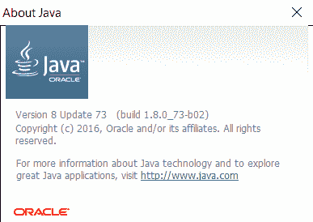

在苹果电脑或任何其他 Linux 机器上:

1.  打开终端应用。为此，打开启动板并在搜索框中键入`terminal`。终端应用将显示如下图所示。选择它:

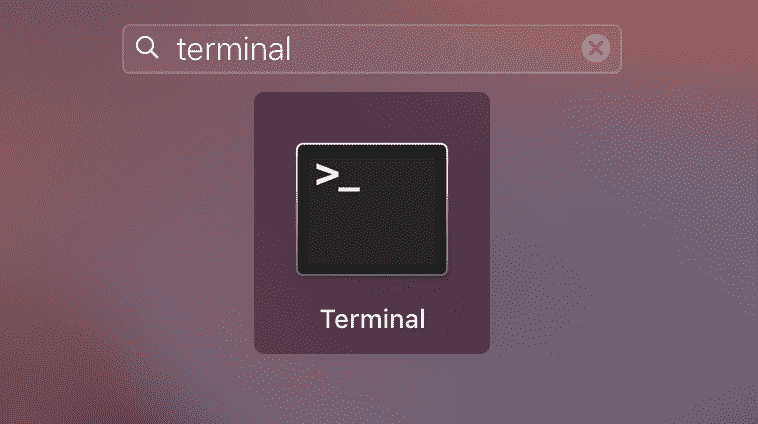

2.  在终端中，键入以下命令检查机器上的 JDK 版本:`java -version`
3.  如果您安装了 JDK，将显示 Java 版本，如下图所示:

    

# 安装 JDK

1.  打开浏览器，进入 Java 网站:[http://www . Oracle . com/tech network/Java/javase/downloads/index . html](http://www.oracle.com/technetwork/java/javase/downloads/index.html)
2.  在下载选项卡下，点击 JDK 下的**下载**按钮，如下图所示:

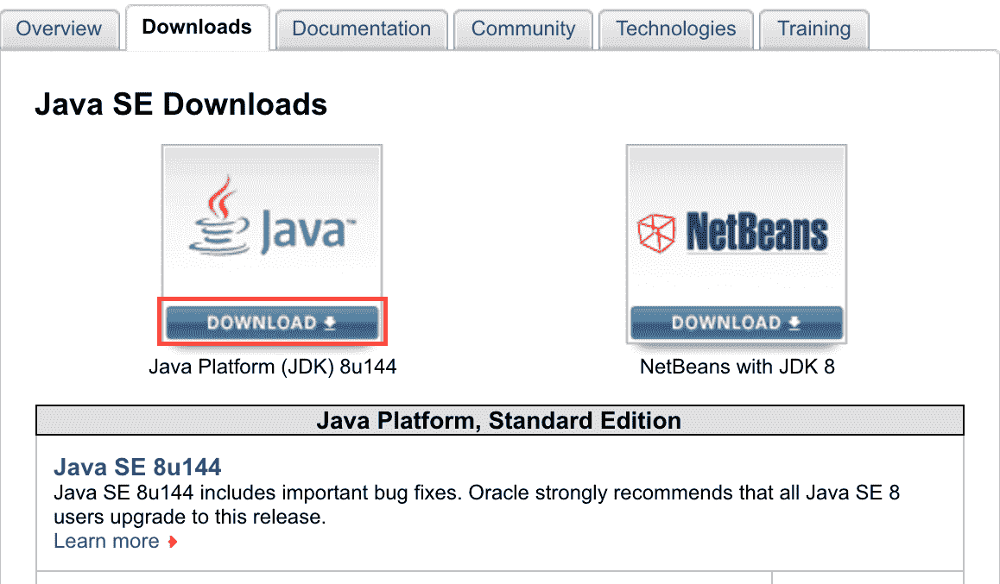

3.  在下一个屏幕上，选择接受许可协议复选框，然后单击与您的操作系统相匹配的产品的下载链接
4.  下载完成后，继续安装 JDK
5.  安装完成后，您可以再次运行版本检查命令，以确保安装成功

# Android Studio

很多**IDE**都支持安卓开发，但是最好用的安卓 IDE 是安卓 Studio。AndroidStudio 基于智能集成开发环境(由喷气大脑开发)。

# 安装 AndroidStudio

转到 AndroidStudio 页面，[https://developer.android.com/sdk/installing/studio.html](https://developer.android.com/sdk/installing/studio.html)，点击下载 AndroidStudio 按钮:

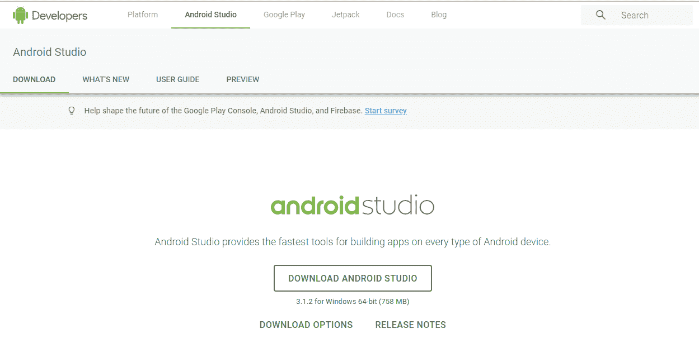

在出现的弹出窗口中，阅读并接受条款和条件，然后单击下载 ANDROID STUDIO FOR MAC 按钮:

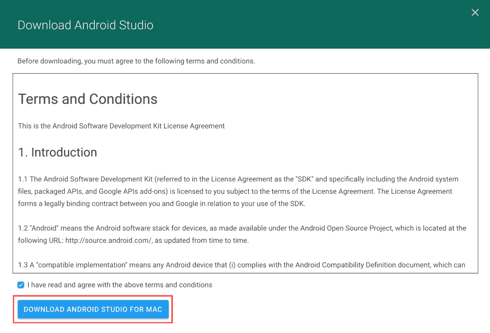

The name of the button is different depending on the operating system you're using.

下载将开始，您将被重定向到一个说明页面([https://developer.android.com/studio/install](https://developer.android.com/studio/install))。

按照为您的操作系统指定的说明安装 AndroidStudio。安装完成后，打开 AndroidStudio，开始安装过程。

# 准备好 AndroidStudio

在“完成安装”屏幕上，确保选择了“我没有以前版本的 Studio 或我不想导入我的设置”选项，然后单击“确定”按钮:


在欢迎屏幕上，单击下一步转到安装类型屏幕:

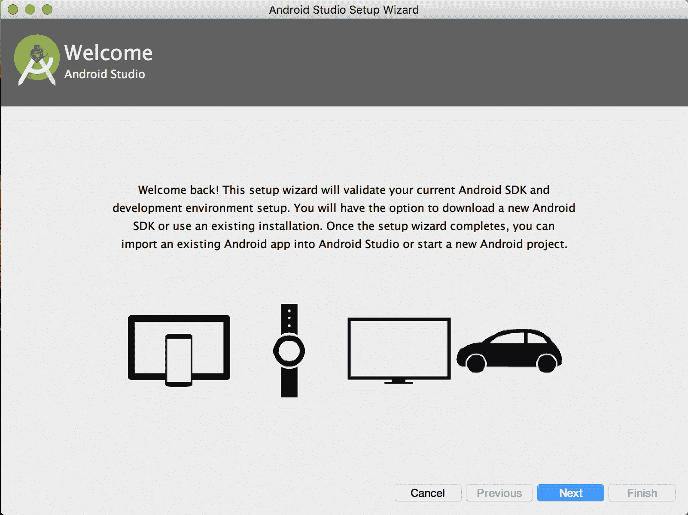

然后，选择标准选项并单击下一步继续:


在验证设置屏幕上，通过单击完成按钮确认您的设置:


“验证设置”屏幕上列出的软件开发工具包组件将开始下载。您可以单击“显示详细信息”按钮来查看正在下载的组件的详细信息:

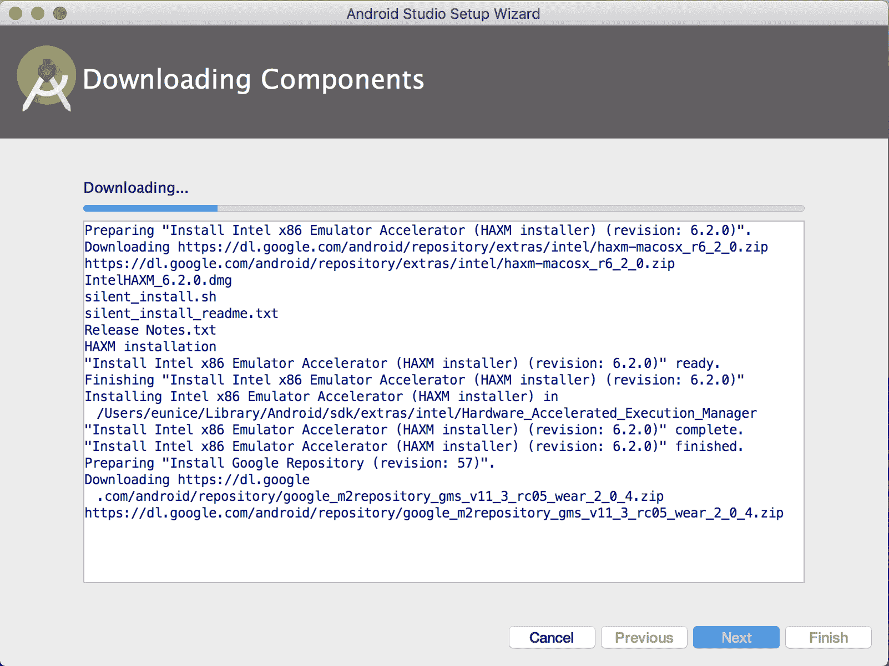

下载和安装完成后，单击“完成”按钮。就这样。你已经完成了 AndroidStudio 的安装和设置。

# 创建你的第一个安卓项目

在欢迎使用 AndroidStudio 屏幕上，单击开始一个新的 AndroidStudio 项目:

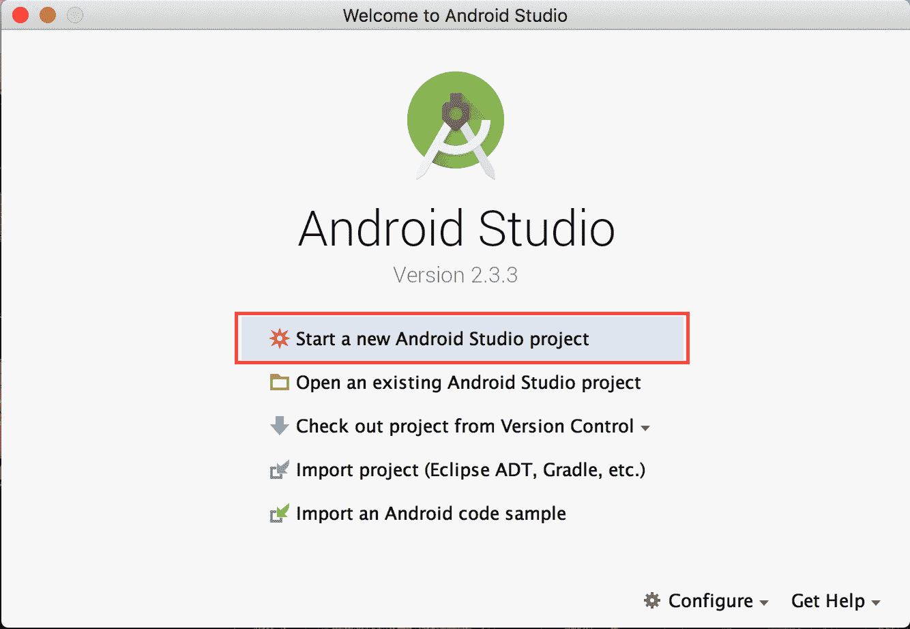

这将启动“创建新项目”向导。在配置新项目屏幕上，输入`TicTacToe`作为应用名称。指定公司域。包名由公司域和应用名生成。

将项目位置设置为您选择的位置，然后单击下一步:


# 选择软件开发工具包

在“目标安卓设备”屏幕上，您必须选择运行应用所需的设备类型和相应的安卓最低版本。安卓**软件开发工具包** ( **软件开发工具包**)提供了构建安卓应用所需的工具，无论您选择哪种语言。

每个新版本的软件开发工具包都有一套新的功能，帮助开发人员在他们的应用中提供更多令人敬畏的功能。然而，困难在于安卓运行在非常广泛的设备上，其中一些设备不具备支持最新版本安卓的能力。这使得开发人员在实现伟大的新功能或支持更广泛的设备之间做出艰难的选择。

安卓试图通过提供以下内容来简化这一决定:

*   使用特定 SDK 帮助开发人员做出明智选择的设备百分比数据。要在 AndroidStudio 中查看这些数据，请单击最小软件开发工具包下拉菜单下的帮助我选择。这将向您显示当前支持的 Android SDK 版本及其支持功能的列表，以及如果您选择该版本作为最低 SDK，您的应用将支持的 Android 设备的百分比:

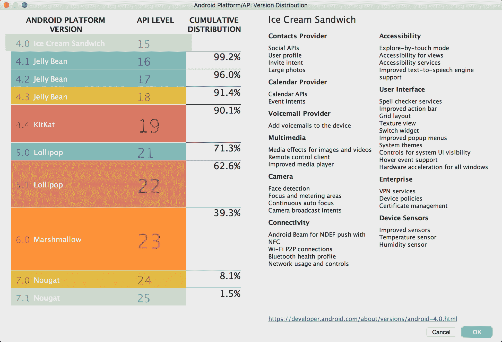

你可以在安卓开发者仪表盘([https://developer.android.com/about/dashboards/](https://developer.android.com/about/dashboards/))上查看该数据的最新和更详细的版本。

*   安卓还提供了支持库，以帮助更新的软件开发工具包版本中添加的某些新功能向后兼容。每个支持库都向后兼容特定的应用编程接口级别。支持库的命名通常基于它们向后兼容的应用编程接口级别。appcompat-v7 就是一个例子，它提供了对 API Level 7 的向后兼容性。

我们将在后面的章节中进一步讨论 SDK 版本。现在，您可以选择 API 15:Android 4 . 0 . 3(IceCreamSandwich)，然后单击下一步:


下一个屏幕是向移动设备添加活动屏幕。这是您选择默认活动的地方。AndroidStudio 提供了许多选项，从空白屏幕的活动到登录屏幕的活动。现在，选择基本活动选项，然后单击下一步:


在下一个屏幕上，输入活动的名称和标题，以及活动布局的名称。然后，点击**完成**:


# 构建您的项目

点击完成按钮后，AndroidStudio 会在后台为你生成并配置项目。AndroidStudio 执行的后台进程之一是配置 Gradle。

# 格拉德尔

Gradle 是一个易于使用的构建自动化系统，可以用来自动化项目的生命周期，从构建和测试到发布。在安卓中，它会带着你的源代码和配置好的安卓构建工具，生成一个**安卓包** **套件** ( **APK** )文件。

AndroidStudio 生成构建初始项目所需的基本渐变配置。让我们看看这些配置。打开`build.gradle`:

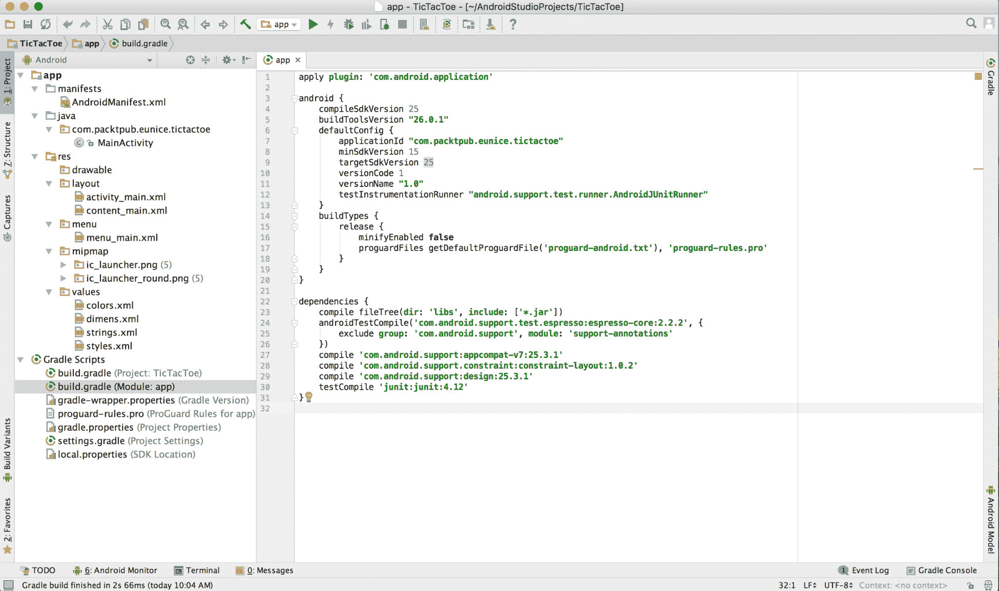

安卓部分指定了所有特定于安卓的配置，例如:

*   `compileSdkVersion`:指定应用应该编译的安卓 API 级别。
*   `buildToolsVersion`:指定应用应该使用的构建工具版本。
*   `applicationId`:发布到 Play Store 时，用于唯一标识应用。您可能已经注意到，它当前与您在创建应用时指定的包名相同。`applicationId`在创建时默认为包名，但这并不意味着你不能使它们不同。你可以。请记住，在你发布了第一个版本的应用后，你不应该再次更改`applicationId`。软件包名称可以在应用的清单文件中找到。

*   `minSdkVersion`:如前所述，这指定了运行应用所需的最低 API 级别。

*   `targetSdkVersion`:指定用于测试你的应用的 API 级别。

*   `versionCode`:指定你的应用的版本号。这应该在发布前针对每个新版本进行更改。

*   `versionName`:为你的应用指定一个用户友好的版本名。

“依赖项”部分指定构建应用所需的依赖项。

# 安卓项目的一部分

我们将看看我们项目的不同部分。截图描述了我们的项目:


让我们进一步看看我们项目的不同部分:

*   `manifests/AndroidManifest.xml`:指定安卓系统运行应用所需的关于你的应用的重要细节。这些细节的一部分是:
    *   包名
    *   描述应用的组件，包括活动、服务等等
    *   声明应用所需的权限
*   `res`目录:包含应用资源，如图像、xml 布局、颜色、维度和字符串资源:
    *   `res/layout`目录:包含定义应用的**用户界面** ( **用户界面**)的 xml 布局
    *   `res/menu`目录:包含定义应用菜单内容的布局
    *   `res/values`目录:包含颜色(`res/values/colors.xml`)和字符串(`res/values/strings.xml`)等资源
*   还有，你的 Java 和/或 Kotlin 源文件

# 运行应用

安卓让你能够在实际设备或虚拟设备上运行你的应用，甚至在谷歌 Play 商店发布之前。

# 安卓模拟器

安卓软件开发工具包附带了一个虚拟移动设备，可以在您的计算机上运行并利用其资源。这个虚拟移动设备被称为仿真器。模拟器基本上是一个可配置的移动设备。您可以配置其内存大小、屏幕大小等。您也可以运行多个模拟器。当你想在不同的设备配置(如屏幕尺寸和安卓版本)上测试你的应用，但买不起实际的时候，这是非常有用的。

You can read more about the emulator on the developer page, at [https://developer.android.com/studio/run/emulator](https://developer.android.com/studio/run/emulator). 

# 创建安卓模拟器

可以从**安卓虚拟设备** ( **AVD** )管理器创建安卓模拟器。你可以通过点击 AndroidStudio 工具栏上的图标来启动 AVD 管理器，如下图所示:


或者，从菜单中选择工具|安卓|自动增值设备管理器:

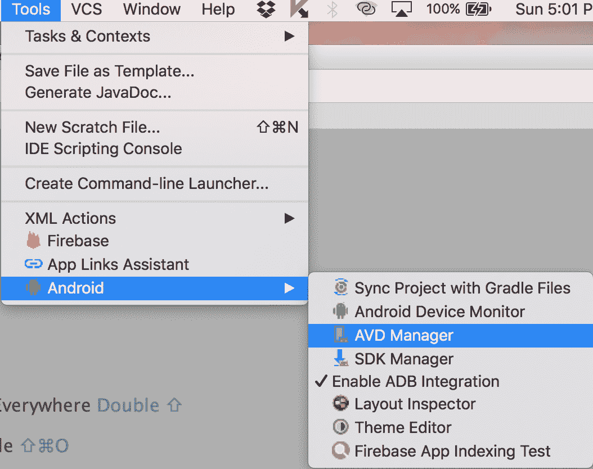

在您的虚拟设备屏幕上，单击创建虚拟设备...按钮:


If you already have an emulator created, the button will be at the bottom of the screen:

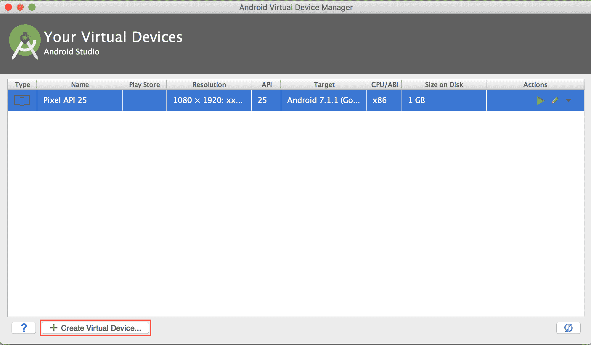

下一步是选择要模拟的设备类型。AVD 管理器允许您为电视、电话、平板电脑和安卓穿戴设备创建模拟器。

确保在屏幕左侧的类别部分选择了电话。浏览屏幕中间的设备列表并选择一个。然后，单击下一步:

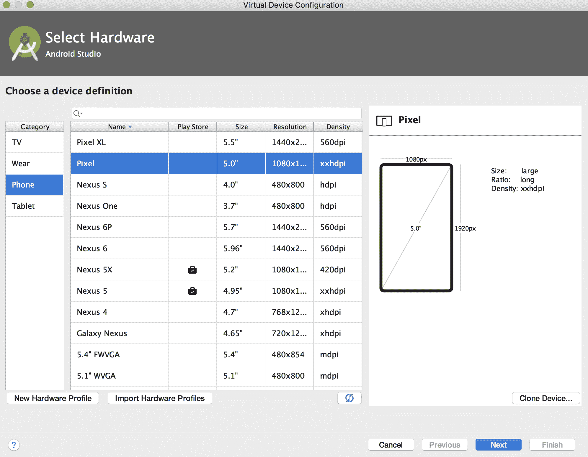

在系统映像屏幕上，选择您希望设备运行的安卓版本，然后单击下一步:

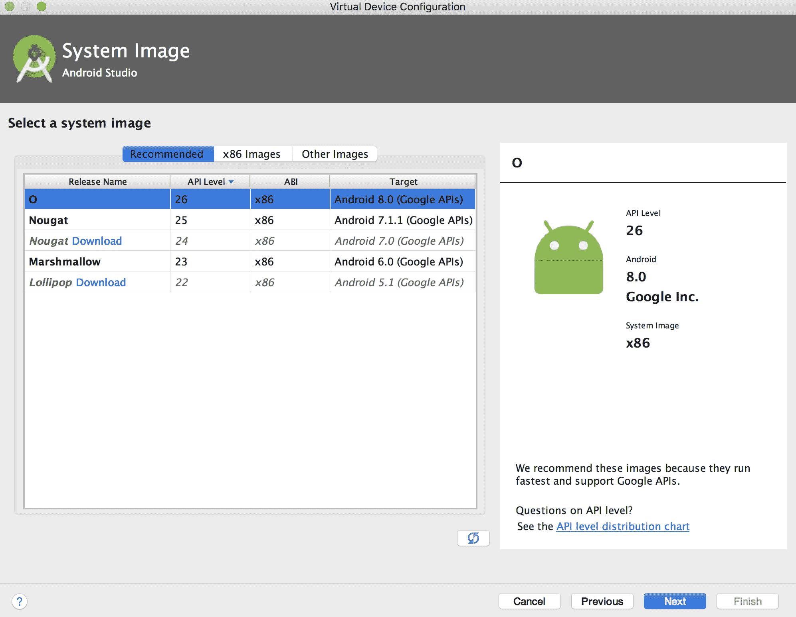

If the SDK version you want to emulate is not downloaded, click on the Download link next to it in order to download it.

在验证配置屏幕上，通过单击完成按钮，浏览并确认虚拟设备设置:


您将被发送回“您的虚拟设备”屏幕，您的新模拟器将显示以下内容:


您可以单击“操作”选项卡下的播放图标来启动模拟器，或者单击铅笔图标来编辑其配置。

让我们继续，通过单击播放图标启动我们刚刚创建的模拟器:

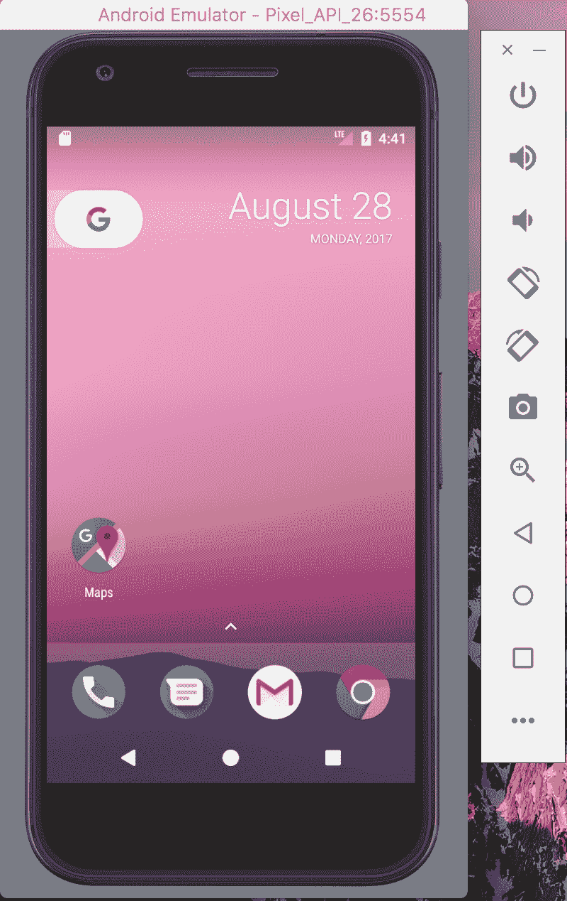

您可能已经注意到，虚拟设备的右侧带有一个工具栏。该工具栏被称为**模拟器工具栏**。它使您能够模拟关机、屏幕旋转、音量增大和减小以及缩放控制等功能。

点击更多(...)工具栏底部的图标还允许您访问额外的控件来模拟功能，如指纹、设备位置、消息发送、电话和电池电量:

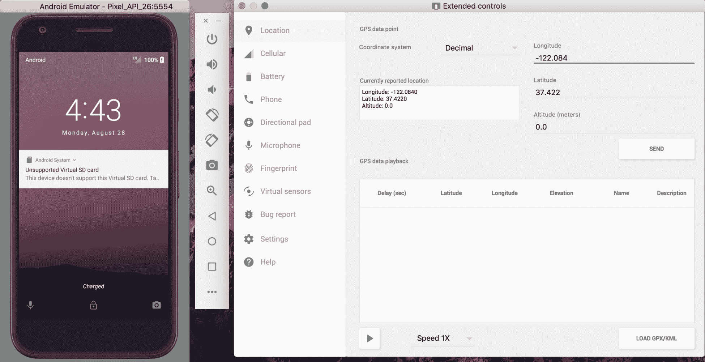

# 从模拟器运行

从模拟器运行应用非常容易。点击 AndroidStudio 工具栏上的播放图标，如下图截图所示:


在弹出的选择部署目标屏幕上，选择要运行应用的设备，然后单击确定:


AndroidStudio 将在模拟器上构建和运行您的应用:

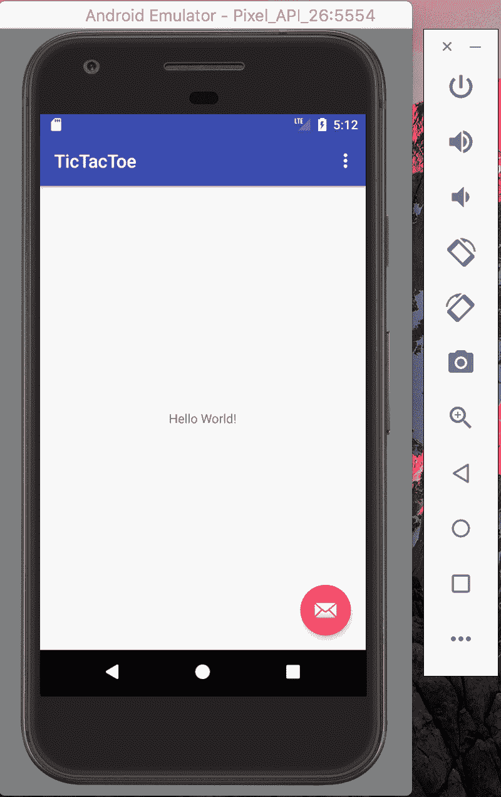

If you do not already have an emulator running, your emulators will show up under the ***Available Virtual Devices*** section. Selecting them will start the emulator and then run your app on it:

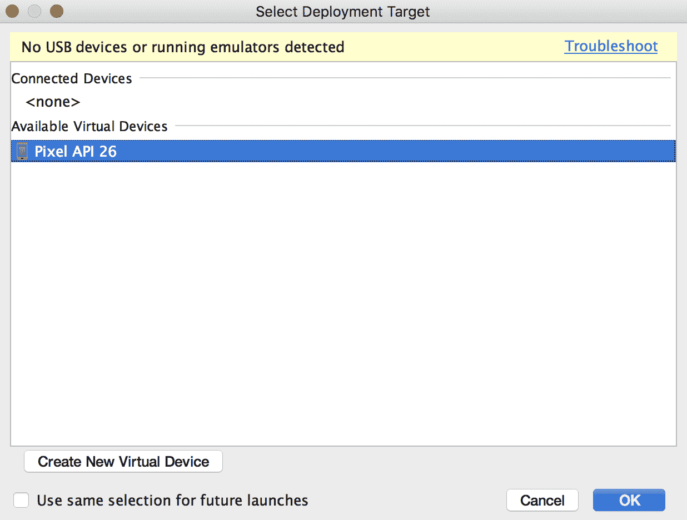

# 在实际设备上运行

要在实际设备上运行您的应用，您可以将 APK 构建并复制到设备上，然后从那里运行它。要做到这一点，安卓要求设备能够安装未知来源的应用。为此，请执行以下步骤:

1.  打开设备上的设置应用。
2.  选择安全性。
3.  查找并打开“未知来源”选项。

4.  系统会提示您安装未知来源的应用会带来的危险。仔细阅读并单击确定确认。
5.  就这样。你现在可以上传你的 APK 并在手机上运行它。

You can easily disable the Unknown Sources setting by going back to Settings | Security and turning off the option.

我们都可以同意这种运行你的应用的方式不是很理想，尤其是对于调试。考虑到这一点，安卓设备能够非常轻松地运行和调试您的应用，而无需将您的应用上传到设备。这可以通过 USB 电缆连接您的设备来实现。为此，安卓要求启用开发者模式。按照以下说明启用开发人员模式:

1.  打开设备上的设置应用。
2.  向下滚动并选择关于电话。
3.  在**电话状态**屏幕上，向下滚动并多次点击**建立** **号码**，直到您看到一个祝酒词，上面写着您现在是一名开发人员！
4.  回到**设置**画面。现在，您应该会看到一个开发人员选项条目。
5.  选择开发人员选项。
6.  在“开发人员选项”屏幕上，打开屏幕顶部的开关。如果关闭，系统会提示您“允许开发设置”？对话。单击确定确认。
7.  向下滚动并打开 USB 调试。系统会提示**允许 USB 调试？**对话框。单击确定确认。
8.  接下来，通过 USB 将您的设备连接到电脑。
9.  会提示另一个 ***允许 USB 调试？*** 对话框中有你电脑的 RSA 密钥指纹。选中“始终允许来自此计算机”选项，然后单击“确定”进行确认。

您现在已设置在设备上运行应用。再次单击工具栏上的运行按钮，在选择部署目标对话框中显示的选项中选择您的设备，然后单击确定:


就这样。您现在应该在设备上显示您的应用:

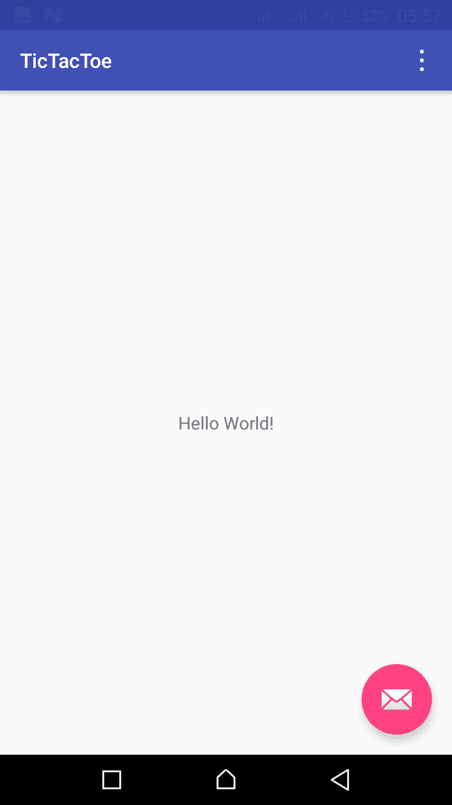

# 摘要

在这一章中，我们经历了检查和安装 JDK 的过程，这是安卓开发所必需的。我们还安装和设置了我们的 AndroidStudio 环境。我们创建了第一个安卓应用，并学会了在模拟器和实际设备上运行它。

在下一章中，我们将学习如何配置和设置 AndroidStudio 以及我们与 Kotlin 一起开发的项目。