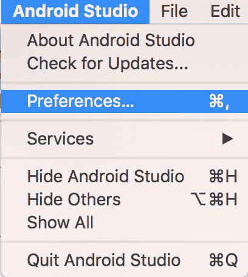
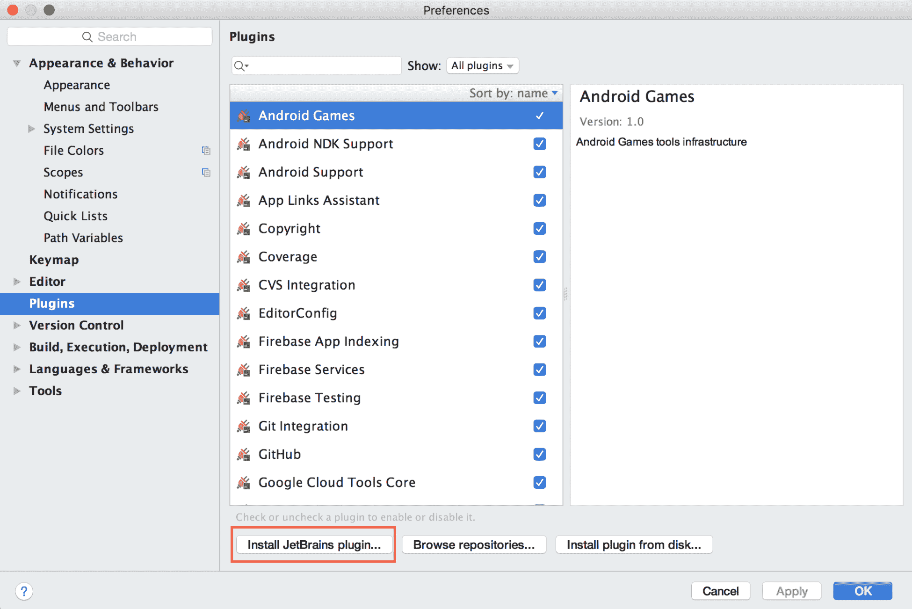
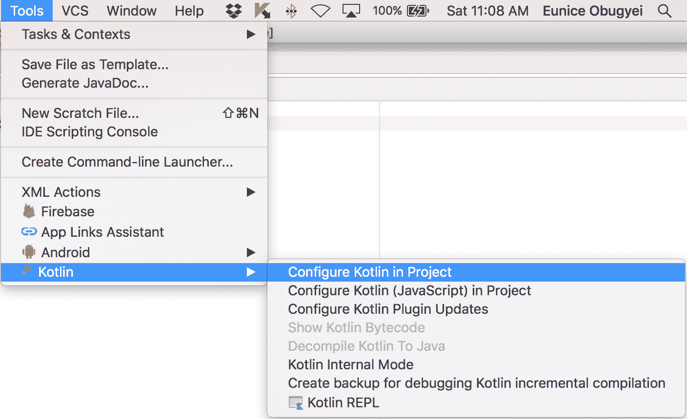
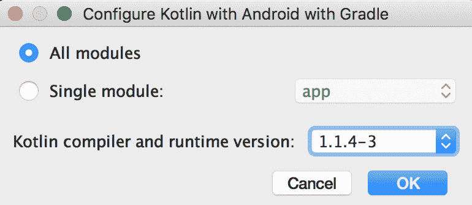
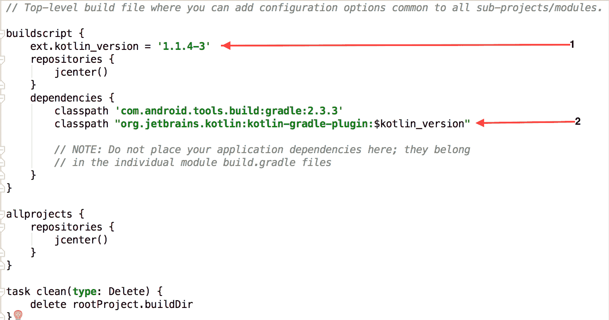
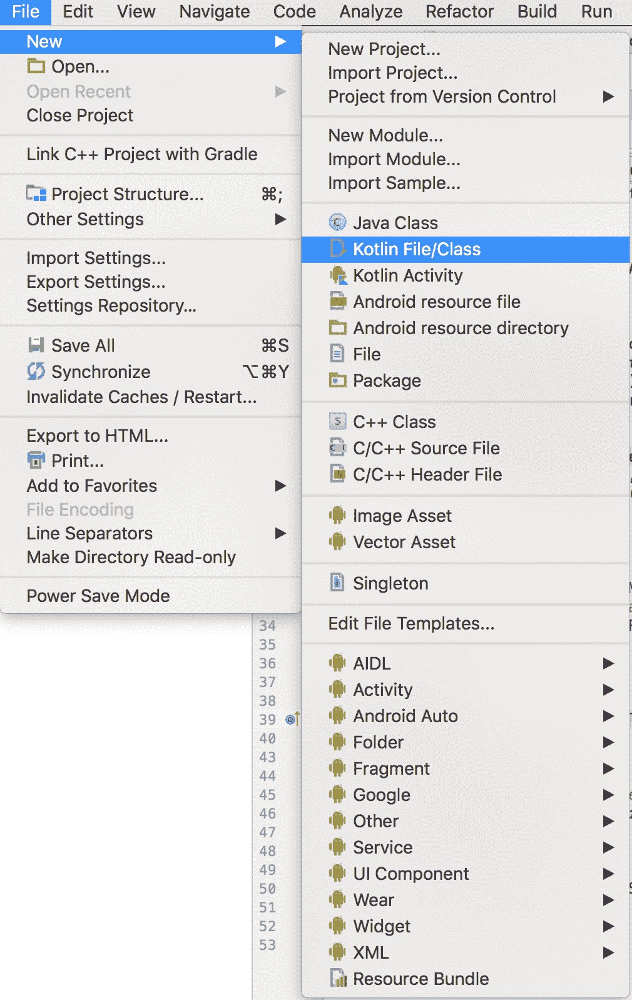
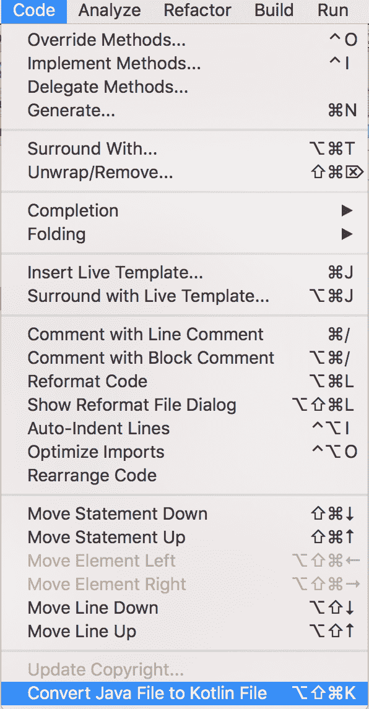

# 二、为 Kotlin 配置您的环境

在本章中，我们将经历准备 Android Studio 和配置我们在上一章中为 Kotlin 开发创建的项目的过程。

在此过程中，我们将学习如何:

*   在 AndroidStudio 下载并安装 Kotlin 插件
*   在安卓项目中配置 Kotlin
*   在 Kotlin 类中引用 Java 代码，反之亦然
*   将一个 Java 类转换成一个 Kotlin 类

# 安装 Kotlin 插件

要在项目中使用 Kotlin，您必须首先在 Android Studio 中安装 Kotlin 插件:

1.  选择 AndroidStudio|首选项，并在首选项窗口中选择插件:



2.  在插件窗口中，单击安装喷气大脑插件...屏幕底部的按钮:



3.  在浏览喷气大脑插件屏幕上，搜索`Kotlin`并从选项列表中选择 Kotlin。然后，点击**安装**按钮:


4.  下载安装完成后，点击重启 AndroidStudio 按钮重启 IDE。

The latest version of Android Studio, and the one above version 3.0, offer full support for Kotlin out of the box. In the versions below 3.0, Kotlin support can be enabled by installing the plugin, as shown previously.

# 让我们的项目做好准备

为了能够开始向我们的项目添加 Kotlin 代码，我们首先必须配置我们的项目来支持 Kotlin。

1.  首先，选择工具|Kotlin|在项目中配置 Kotlin:



2.  接下来，在“选择配置器”弹出窗口中选择带有梯度的安卓选项:


3.  在“用安卓系统配置 Kotlin 和梯度”弹出窗口中，选择要使用的 Kotlin 版本，然后单击“确定”:



It is advisable to leave the version that is selected by default, since this is usually the latest version.

这将导致项目中的`build.gradle`文件发生许多变化:

*   在项目的`build.gradle(Project:TicTacToe)`文件中，应用了以下更改:
    *   声明了项目中使用的 Kotlin 插件的版本
    *   The Kotlin Gradle plugin is declared as part of the project's classpath dependencies:

        

*   并且，在应用模块的`build.gradle(Module:app)`文件中，应用了以下更改:
    *   `kotlin-android`插件应用于模块
    *   The Kotlin `Standard` library is declared as a `compile` time dependency for the app module:

        

*   单击“立即同步”来构建项目

Starting from Android Studio 3.0, Android Studio comes with built-in Kotlin support. As such, you won't have to install the Kotlin plugin to be able to use it.

现在我们已经完全配置了 Kotlin，让我们转一转。

# Kotlin 傍 Java？

Kotlin 令人惊奇的一点是它能够在同一个项目中驻留和使用 Java。

让我们尝试创建一个 Kotlin 类。AndroidStudio 的 Kotlin 插件让这变得像创建一个 Java 类一样简单。选择**文件** | **新** | **Kotlin 文件/类**:



在**新 Kotlin 文件/类别**弹出窗口中，输入您的类别名称，从**种类**下拉列表中选择`Class`，然后单击确定:


新类如下所示:

```kt
package com.packtpub.eunice.tictactoe

class HelloKotlin {
}
```

The default visibility modifier in Kotlin is public, so there's no need to specify the public modifier like you would in a Java class.

让我们在新的 Kotlin 类中添加以下方法:

```kt
fun displayMessage(view: View) {
    Snackbar.make(view, "Hello Kotlin!!", Snackbar.LENGTH_LONG).setAction("Action", null).show()
}
```

前一种方法以安卓视图(`android.view.View`)为参数，并将其与消息一起传递给 Snackbar `make()`方法以显示消息。

Kotlin 利用 Java 代码的这种能力被称为**互操作性。**这个特性也可以反过来工作，允许从 Java 类调用 Kotlin 代码。让我们试试看:

打开`MainActivity.java`。在`onCreate()`方法中，替换下面一行代码:

```kt
Snackbar.make(view, "Replace with your own action", Snackbar.LENGTH_LONG).setAction("Action", null).show();
```

带有以下内容:

```kt
new HelloKotlin().diplayMessage(view);
```

前一行代码创建了一个`HelloKotlin`类的实例，并调用了它的`displayMessage()`方法。

构建并运行您的应用:


是的，就这么简单。

# 盆地到 Java？

到目前为止，我们已经完成了创建一个 Kotlin 类并在我们的`MainActivity.java`类中访问它的方法的过程。我们的项目目前由一个 Java 类和一个 Kotlin 类组成，但是我们希望我们的整个项目都在 Kotlin 中。那么，我们该怎么办？我们一定要重写 Kotlin 的`MainActivity.java`课吗？不。Kotlin 插件给 AndroidStudio 增加的功能之一是将代码从 Java 转换成 Kotlin 的能力。

To do this, open the `MainActivity.java` class and go to Code | Convert Java File to Kotlin File:



系统将提示您一条关于转换准确性的警告消息。目前，我们不需要担心这个。只需单击“确定”继续:


你的`MainActivity.java`类现在应该是这样的:

```kt
class MainActivity : AppCompatActivity() {

    override fun onCreate(savedInstanceState: Bundle?) {
        super.onCreate(savedInstanceState)
        setContentView(R.layout.activity_main)
        val toolbar = findViewById(R.id.toolbar) as Toolbar
        setSupportActionBar(toolbar)

        val fab = findViewById(R.id.fab) as FloatingActionButton
        fab.setOnClickListener { view ->   
    HelloKotlin().displayKotlinMessage(view) }
    }

    override fun onCreateOptionsMenu(menu: Menu): Boolean {
        // Inflate the menu; this adds items to the action bar if it is   
       //present.
        menuInflater.inflate(R.menu.menu_main, menu)
        return true
    }

    override fun onOptionsItemSelected(item: MenuItem): Boolean {
        // Handle action bar item clicks here. The action bar will
        // automatically handle clicks on the Home/Up button, so long
        // as you specify a parent activity in AndroidManifest.xml.
        val id = item.itemId

        return if (id == R.id.action_settings) {
            true
        } else super.onOptionsItemSelected(item)

    }
}
```

你还会注意到文件的扩展名也改成了`.kt`。

再次，构建并运行您的应用:


# 摘要

在这一章中，我们学习了如何为 Kotlin 开发配置 Android Studio 和一个 Android 项目。我们还学习了从 Java 创建和调用一个 Kotlin 类。我们还学习了使用 Kotlin 插件将 Java 源文件转换成 Kotlin。如果您有用 Java 编写的遗留代码，并且希望逐渐切换到 Kotlin，这些功能特别有用。

在使用`Convert Java to Kotlin`功能时，请记住，在某些情况下，您必须对生成的 Kotlin 文件进行一些更正。

在接下来的几章中，我们将为我们的项目添加更多的功能(正如您可能已经猜到的，这是一个简单的 **TicTacToe** 游戏)。在这个过程中，我们将更深入地研究 Kotlin 作为一种语言的基础知识。我们将讨论数据类型、类、函数、协同程序和 Null 安全等主题。