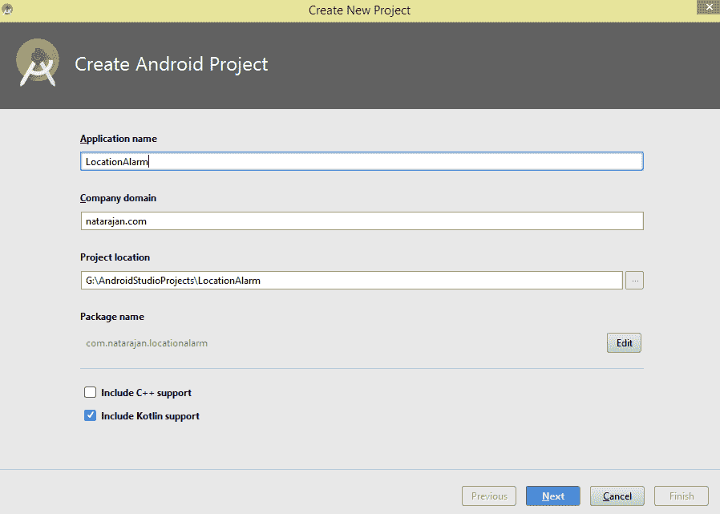
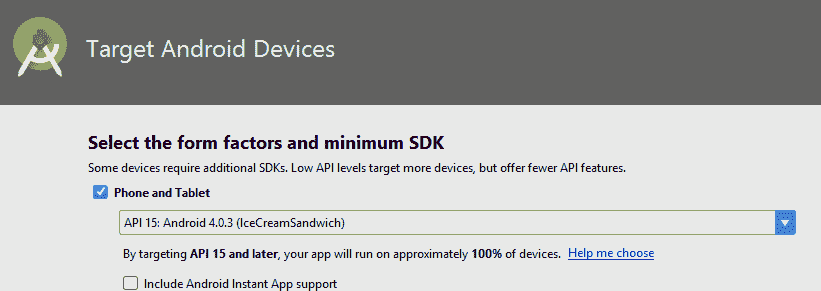
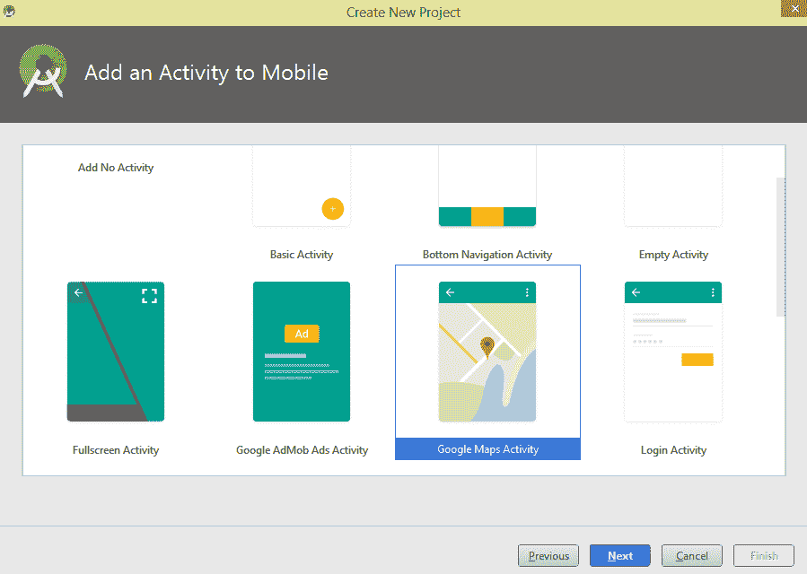
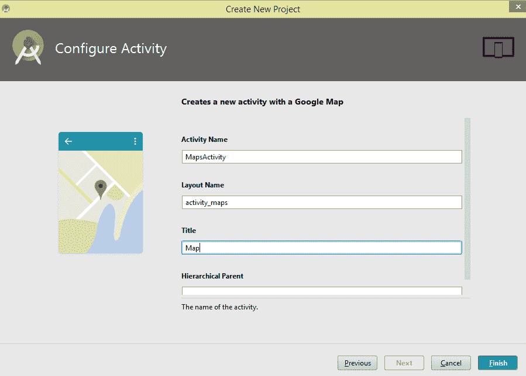
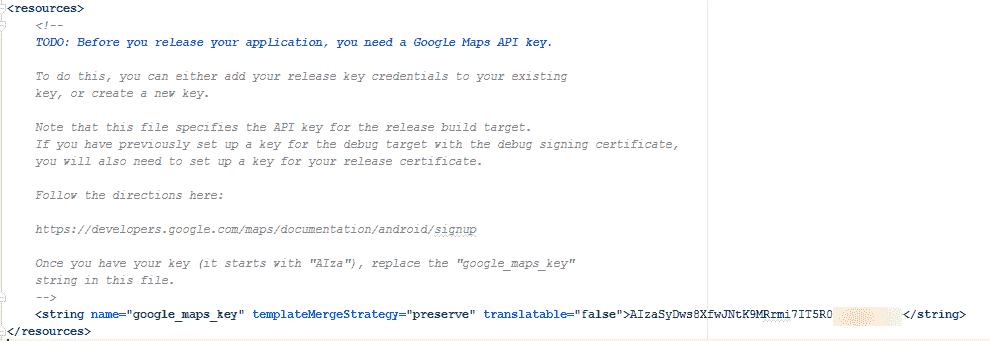

# 七、开发基于位置的警报

了解用户的位置并为他们提供定制服务是安卓设备的强大功能之一。安卓应用开发者可以利用这一强大的功能，为他们应用的用户提供令人着迷的服务。因此，理解谷歌定位服务、谷歌地图应用接口和定位应用接口，对于安卓应用的开发者来说非常重要。

在本章中，我们将开发自己的**基于位置的报警** ( **LBA** )并且在开发 app 的过程中，我们将了解以下内容:

*   基于安卓活动创建地图
*   谷歌地图在安卓应用中的使用
*   注册和获取谷歌地图活动所需密钥的过程
*   为用户开发一个向应用提供输入的屏幕
*   如何完成我们的应用，并通过添加报警功能和使用谷歌定位服务在下一章制作一个可行的模型

# 创建项目

我们将看看创建 LBA 的步骤。我们将使用我们最喜欢的集成开发环境，AndroidStudio，来开发 LBA。

让我们从启动AndroidStudio开始。一旦它启动并运行，点击开始一个新的AndroidStudio项目。如果您已经打开了一个项目，请单击文件|新建项目。

在以下屏幕上，输入此处显示的详细信息:

*   **申请名称** : `LocationAlarm`。
*   **公司域名**:AndroidStudio使用域名为我们开发的应用生成包名。该软件包确保我们的应用在游戏商店中获得唯一的标识符。一般来说，包名会是域名的反义词，比如这种情况下会是`com.natarajan.locationalarm`。
*   **项目位置**:我们希望开发并保存项目代码的路径。您可以选择开发应用的路径。当我们使用 Kotlin 开发我们的应用时，我们必须选择包括 Kotlin 支持:



在接下来的屏幕上，我们将根据以下因素对目标安卓设备做出决定:

*   他们提供的 API
*   波形因数

对于我们的应用，我们将选择手机和平板电脑，应用编程接口作为应用编程接口 15。API 选择框下方的文本告诉我们，通过选择 API 15 和更高版本，我们将选择让我们的应用在大约 100%的设备上运行。

The Help me choose option would help you to understand the distribution of Android devices across the globe grouped by the android version (API) they run.

我们不会在任何其他外形规格上运行我们的应用；因此，我们可以跳过这些选择区域，点击下一步:



在下一个屏幕中，我们将获得一个向我们的应用添加活动的选项。

AndroidStudio通过在最常用的活动上提供现成的模板，让开发人员更容易包含他们的应用所需的活动类型。

我们正在开发一个 LBA，所以我们需要一个地图，显示警报设置的位置。

点击**谷歌地图活动**并点击下一步:



我们将在下一个屏幕上配置活动。一般来说，原生安卓应用是Kotlin/Java 类和由 XML 定义的用户界面的组合。屏幕上提供了以下输入来配置我们的应用:

*   **活动名称**:这是我们地图活动的 Kotlin 类的名称。当我们选择一个地图活动时，该名称默认显示为地图活动；我们将在这里使用相同的。
*   **布局名称**:我们将用于设计用户界面的 XML 布局的名称。
*   **标题**:我们希望应用为本次活动显示的标题。我们将把它保留为默认显示的地图。

完成这些输入后，单击“完成”按钮:



点击按钮，我们将看到建筑“位置报警”梯度项目信息屏幕。

# 谷歌地图应用编程接口密钥的生成

一旦构建过程完成，我们将看到默认情况下由 Android Studio 打开和显示的以下资源文件屏幕:

该文件默认命名为`google_maps_api.xml`。该文件明确指出，在我们运行我们的应用之前，我们需要获得一个谷歌地图应用编程接口密钥。获取该应用的谷歌地图应用编程接口密钥的过程被详细列出。

生成的密钥应该由文件中提到的占位符 YOUR_KEY_HERE 替换:

```kt
<resources>
 <!--
TODO: Before you run your application, you need a Google Maps API key.

To get one, follow this link, follow the directions and press "Create" at the end:

https://console.developers.google.com/flows/enableapi?apiid=maps_android_backend&keyType=CLIENT_SIDE_ANDROID&r=00:ED:1B:E2:03:B9:2E:F4:A9:0F:25:7A:2F:40:2E:D2:89:96:AD:2D%3Bcom.natarajan.locationalarm

You can also add your credentials to an existing key, using these values:
Package name:
 00:ED:1B:E2:03:B9:2E:F4:A9:0F:25:7A:2F:40:2E:D2:89:96:AD:2D
SHA-1 certificate fingerprint:
 00:ED:1B:E2:03:B9:2E:F4:A9:0F:25:7A:2F:40:2E:D2:89:96:AD:2D

Alternatively, follow the directions here:
 https://developers.google.com/maps/documentation/android/start#get-key

Once you have your key (it starts with "AIza"), replace the "google_maps_key"
 string in this file.
 -->
<string name="google_maps_key" templateMergeStrategy="preserve" translatable="false">YOUR_KEY_HERE</string>
 </resources>
```

我们将使用文件中提供的链接生成我们的应用所需的密钥。

[https://console.developers.google.com](https://console.developers.google.com/apis/dashboard) requires the user to sign in with their Google ID. Once they sign in, the option for creating the project and enabling the API will be presented.

选择并完整复制链接([https://console.developers.google.com/flows/enableapi?)apiid = maps _ android _ 后端&key type = CLIENT _ SIDE _ ANDROID&r = 00:ED:1B:E2:03:B9:2E:F4:A9:0F:25:7A:2F:40:2E:D2:89:96:AD:2D；natarajan . location alarm](https://console.developers.google.com/flows/enableapi?apiid=maps_android_backend&keyType=CLIENT_SIDE_ANDROID&r=00:ED:1B:E2:03:B9:2E:F4:A9:0F:25:7A:2F:40:2E:D2:89:96:AD:2D;com.natarajan.locationalarm))*并将其输入您最喜欢的浏览器:*

 *

一旦用户登录到控制台，用户将被要求在谷歌应用编程接口控制台中为谷歌地图安卓应用编程接口注册应用。

我们将看到几个选项:

*   选择一个项目
*   创建项目

如下文所示，选择一个项目，您的应用将在其中注册，用户可以使用一个项目来管理所有开发的应用的应用编程接口密钥，或者为每个应用选择一个不同的项目。

选择使用一个项目来管理开发的各种安卓应用所需的所有应用编程接口密钥，还是每个应用有一个项目，取决于用户。在撰写本文时，默认情况下，用户将被允许免费创建 12 个项目。

接下来，您需要阅读并同意 Google Play Android 开发者 API 的服务条款和 Firebase APIs 服务服务条款([https://console.developers.google.com/flows/enableapi?)apiid = maps _ android _ 后端&key type = CLIENT _ SIDE _ ANDROID&r = 00:ED:1B:E2:03:B9:2E:F4:A9:0F:25:7A:2F:40:2E:D2:89:96:AD:2D；com.natarajan.locationalarm](https://console.developers.google.com/flows/enableapi?apiid=maps_android_backend&keyType=CLIENT_SIDE_ANDROID&r=00:ED:1B:E2:03:B9:2E:F4:A9:0F:25:7A:2F:40:2E:D2:89:96:AD:2D;com.natarajan.locationalarm) ):


选择创建项目并同意条款和条件。完成后，点击**同意并继续**:


一旦项目创建成功，用户将看到一个屏幕。屏幕上写着项目已经创建，谷歌地图安卓应用编程接口已经启用。接下来，您需要创建一个应用编程接口密钥来调用该应用编程接口。用户还会看到一个按钮，上面写着**创建应用编程接口** **键**:


单击“创建应用编程接口密钥”按钮，用户将看到一个控制台，弹出一条消息，内容为“已创建应用编程接口密钥”。这是我们需要在应用中使用的 API 密钥:


复制 API 密钥，然后用生成的 API 密钥替换`google_maps_api.xml`文件中的 YOUR_API_KEY 文本，如图:


带有生成的谷歌地图应用编程接口密钥的修改文件应该如下所示:



Developers can always check the API key generated by logging into the Google API console and cross checking the usage of the correct API key generated specifically for the project:


现在我们已经生成了应用编程接口密钥，并修改了文件以反映这一点，我们都为分析代码和运行应用做好了准备。

简单回顾一下，我们创建了包含谷歌地图活动的应用，并创建了一个布局文件。然后我们生成了谷歌地图应用编程接口密钥，并将其替换到文件中。

# 运行应用

要运行该应用，请转到运行|运行应用或点击**播放**按钮。

AndroidStudio将提示我们选择部署目标，即启用了开发人员选项和 USB 调试的物理设备或仿真器，也称为用户设置的虚拟设备。

一旦我们选择其中一个选项并点击 ok，应用将在部署目标上构建和运行。该应用将启动并运行，我们应该会看到地图活动正在悉尼加载标记:


# 理解代码

我们可以成功运行该应用，现在是时候深入研究代码并了解它是如何工作的了。

让我们从`MapsActivity.kt` Kotlin 类文件开始。

`MapActivity`类扩展了`AppCompatActivity`类，也实现了`OnMapReadCallback`接口。我们有几个变量，`GoogleMap`、`mMap`和`btn`按钮已初始化。

覆盖`onCreate`方法，应用被设置为在应用启动时从 XML 文件`activity_maps.xml`加载内容。

`mapFragment`和`btn`的资源是从资源文件中设置的:

```kt
class MapsActivity : AppCompatActivity(), OnMapReadyCallback {

private lateinit var mMap: GoogleMap
 override fun onCreate(savedInstanceState: Bundle?) {
super.onCreate(savedInstanceState)
         setContentView(R.layout.activity_maps)
// Obtain the SupportMapFragment and get notified when the map is ready to be used.
val mapFragment = supportFragmentManager
.findFragmentById(R.id.map) as SupportMapFragment
         mapFragment.getMapAsync(this)
     }

 }
```

# 自定义代码

生成的默认代码显示了悉尼的市场。此处显示的方法`onMapReady` 在地图准备好并加载并显示标记时被调用。根据提到的`LatLng`值找到位置:

```kt
override fun onMapReady(googleMap: GoogleMap) {
 mMap = googleMap
// Add a marker in Sydney and move the camera
val sydney= LatLng(-33.852,151.211)
mMap.addMarker(MarkerOptions().position(sydney).title("Marker in Sydney"))
mMap.moveCamera(CameraUpdateFactory.newLatLng(sydney))
}
```

现在让我们定制这个代码来显示印度泰米尔纳德邦钦奈的标记。要做出改变，第一步是了解 Lat 和 Lng 代表什么。

纬度和经度一起用来指定地球任何部分的精确位置。在 Android 中，类`LatLng`用于指定位置。

# 找到一个地方的纬度和经度

在浏览器中使用谷歌地图可以很容易地找到一个地方的经纬度。出于我们的目的，我们将在我们最喜欢的浏览器中推出谷歌地图。

搜索需要查找纬度和经度的位置。在这里，我们搜索瓦桑塔姆，这是一所专门为印度泰米尔纳德邦钦奈的智障儿童开设的学校。

找到我们搜索的位置后，我们可以在 URL 中看到纬度和经度值，如图所示:


对于我们搜索的地方，我们看到的纬度和经度值分别是 13.07 和 80.17。让我们继续对代码进行以下更改。

在`onMapReady`方法中，让我们进行以下更改:

*   将`Sydney`变量重命名为`chennai`
*   把拉特和液化天然气从悉尼的改为钦奈的
*   将`Marker`文本改为`Marker in Chennai`
*   将`newLatLng`改为以`chennai`为输入值

```kt
override fun onMapReady(googleMap: GoogleMap) {
 mMap = googleMap
// Add a marker in Chennai and move the camera
val chennai = LatLng(13.07975, 80.1798347)
 //val chennai = LatLng(-34.0, 151.0)
mMap.addMarker(MarkerOptions().position(chennai).title("Marker in Chennai"))
 mMap.moveCamera(CameraUpdateFactory.newLatLng(chennai))
 }
```

当我们保存所做的更改并再次运行该应用时，我们将能够看到地图现在加载了印度钦奈的标记:


触摸标记后，我们应该能够看到红色标记上方显示的钦奈标记文本:


# XML 布局

我们已经详细研究了 Kotlin 类，以及定制 Lat 和 Lng 输入的方法。

让我们快速检查一下 XML 布局文件。我们还将了解添加按钮的过程，该按钮将带我们进入屏幕，用户将能够通过该屏幕输入警报的 Lat 和 Lng 输入。

在`activity_maps.xml`文件中，我们将地图片段和按钮元素包装在`LinearLayoutCompat`中，如下所示。我们将按钮元素链接到`onClickSettingsButton`方法:

```kt
<android.support.v7.widget.LinearLayoutCompat xmlns:android="http://schemas.android.com/apk/res/android"
xmlns:tools="http://schemas.android.com/tools"
android:layout_width="match_parent"
android:layout_height="match_parent"
android:orientation="vertical"
android:layout_weight="1.0"><fragment
android:id="@+id/map"
android:layout_weight="0.8"
android:name="com.google.android.gms.maps.SupportMapFragment"
android:layout_width="match_parent"
android:layout_height="match_parent"
tools:context="com.natarajan.locationalarm.MapsActivity" />

<Button
android:layout_width="wrap_content"
android:layout_height="wrap_content"
android:layout_weight="0.2"
android:id="@+id/settingsbtn"
android:onClick="onClickSettingsButton"
android:text="@string/Settings"/>

 </android.support.v7.widget.LinearLayoutCompat>
```

在`MapsActivity` Kotlin 类中，我们可以定义一个名为`onClickSettingsButton`的方法，在调用该方法时，我们会激发另一个名为`SETTINGACTVITY`的活动，如图所示:

```kt
fun onClickSettingsButton(view: View) {
 val intent = Intent("android.intent.action.SETTINGACTIVITY")
 startActivity(intent)
 }
```

# 开发供用户输入的屏幕

当点击`Settings`按钮时，我们的应用会将用户带到一个屏幕，在那里他们可以输入用户想要设置警报的新位置的 Lat 和 Lng 值。

我们有一个非常简单的输入屏幕。我们有一个`LinearLayout`，它有几个`EditText`，一个用于纬度输入，另一个用于经度输入。这些编辑文本后面是一个按钮，允许提交用户输入的新位置坐标。

我们还有一个链接到按钮的`onClickButton`方法，当用户点击按钮时调用:

```kt
<?xml version="1.0" encoding="utf-8"?>
<LinearLayout xmlns:android="http://schemas.android.com/apk/res/android"
android:layout_width="match_parent"
android:layout_height="match_parent"
android:orientation="vertical">

     <EditText
android:id="@+id/latText"
android:layout_width="wrap_content"
android:layout_height="wrap_content"
android:ems="10"
android:hint='Latitude'
android:inputType="numberDecimal" />

     <EditText
android:id="@+id/langText"
android:layout_width="wrap_content"
android:layout_height="wrap_content"
android:ems="10"
android:hint="Longitude"
android:inputType="numberDecimal" />

     <Button
android:id="@+id/alarmbtn"
android:layout_width="wrap_content"
android:layout_height="wrap_content"
android:onClick="onClickButton"
android:text="Ok" />

 </LinearLayout>
```

我们已经为用户输入准备好了 XML 布局；现在让我们创建一个新的 Kotlin 活动类，它将使用这个设置的 XML 并与用户交互。

类`SettingsActivity`扩展了`AppCompatActivity`，包含了几个编辑文本元素和初始化的按钮元素。变量由它们的标识从资源文件中识别并设置为正确的资源。该活动在调用和加载时加载`settings_activity` XML。

在`onClickButton`方法中，我们有一个简单的吐司消息，上面写着警报设置。在接下来的章节中，我们将保存输入的内容，并在用户输入感兴趣的位置时触发警报:

```kt
class SettingsActivity : AppCompatActivity() {

public override fun onCreate(savedInstanceState: Bundle?) {
super.onCreate(savedInstanceState)
         setContentView(R.layout.settings_activity)

}
fun onClickButton(view: View) {
         Toast.makeText(this, "Alarm Set", Toast.*LENGTH_LONG*).show()
     }
}
```


当用户在输入 Lat 和 Lng 详细信息后点击 OK 按钮时，将显示 Toast 消息，如图所示:


# AndroidManifest 文件

清单文件是项目中最重要的文件之一。在这个文件中，我们必须列出我们打算在我们的应用中使用的所有活动，并提供我们用于谷歌地图应用接口的应用接口密钥的详细信息。

清单文件中有以下重要指针:

*   我们的应用使用许可`ACCESS_FINE_LOCATION`。这是为了获取用户位置的详细信息；我们要求在用户到达设置警报的位置时启用警报。

`ACCESS_COARSE_LOCATION` is the permission-enabled app to get the location details provided by `NETWORK_PROVIDER`. The `ACCESS_FINE_LOCATION` permission enables the app to get the location details provided by `NETWORK_PROVIDER` and `GPS_PROVIDER`.

*   我们有安卓地理应用编程接口密钥的元数据，它只不过是我们生成并放置在`google_maps_api.xml`中的应用编程接口密钥。
*   我们有一个发射主活动，用钦奈位置上的标记发射地图。
*   我们还有默认的活动设置，当点击`Submit`按钮时触发:

```kt
*<?*xml version="1.0" encoding="utf-8"*?>* <manifest xmlns:android="http://schemas.android.com/apk/res/android" package="com.natarajan.locationalarm">
*<!--
          T*he ACCESS_COARSE/FINE_LOCATION permissions are not required to use
          Google Maps Android API v2, but you must specify either coarse or fine
          location permissions for the 'MyLocation' functionality. 
     --><uses-permission android:name="android.permission.ACCESS_FINE_LOCATION" />

     <application android:allowBackup="true" android:icon="@mipmap/ic_launcher" android:label="@string/app_name" android:roundIcon="@mipmap/ic_launcher_round" android:supportsRtl="true" android:theme="@style/AppTheme">
*<!--
        *      The API key for Google Maps-based APIs is defined as a string resource.
              (See the file "res/values/google_maps_api.xml").
              Note that the API key is linked to the encryption key used to sign the APK.
              You need a different API key for each encryption key, including the release key that is used to
              sign the APK for publishing.
              You can define the keys for the debug and release targets in src/debug/ and src/release/. *-->* <meta-data android:name="com.google.android.geo.API_KEY" android:value="@string/google_maps_key" />

         <activity android:name=".MapsActivity" android:label="@string/title_activity_maps">
             <intent-filter>
                 <action android:name="android.intent.action.MAIN" />
                 <category android:name="android.intent.category.LAUNCHER" />
             </intent-filter>
         </activity>

         <activity android:name=".SettingsActivity">
             <intent-filter>
                 <action android:name="android.intent.action.SETTINGACTIVITY" />
                 <category android:name="android.intent.category.DEFAULT" />
             </intent-filter>
         </activity>

     </application>

 </manifest>
```

# Build.gradle

`build.gradle`文件包括谷歌地图服务所需的依赖关系。我们必须包括谷歌游戏服务的游戏服务地图。从谷歌游戏服务中，我们包括我们感兴趣的服务。在这里，我们希望有一个地图服务可供我们使用，因此我们包括`play-services-maps`:

```kt
apply plugin: 'com.android.application' apply plugin: 'kotlin-android' apply plugin: 'kotlin-android-extensions' android {
     compileSdkVersion 26
defaultConfig {
         applicationId "com.natarajan.locationalarm" minSdkVersion 15
targetSdkVersion 26
versionCode 1
versionName "1.0" testInstrumentationRunner "android.support.test.runner.AndroidJUnitRunner" }
     buildTypes {
         release {
             minifyEnabled false proguardFiles getDefaultProguardFile('proguard-android.txt'), 'proguard-rules.pro' }
     }
 }

 dependencies {
     implementation fileTree(dir: 'libs', include: ['*.jar'])
     implementation"org.jetbrains.kotlin:kotlin-stdlib-jre7:$kotlin_version" implementation 'com.android.support:appcompat-v7:26.1.0'
 implementation 'com.google.android.gms:play-services-maps:11.8.0' testImplementation 'junit:junit:4.12' androidTestImplementation 'com.android.support.test:runner:1.0.1' androidTestImplementation 'com.android.support.test.espresso:espresso-core:3.0.1' }
```

# 摘要

在这一章中，我们讨论并学习了如何创建我们自己的 LBA。我们了解了谷歌地图应用编程接口的细节、应用编程接口键的生成、地图用户界面的创建、向地图添加标记、定制标记、为用户输入创建用户界面屏幕等等。

我们还讨论了清单文件、`build.gradle`文件以及 XML 布局文件和相应的 Kotlin 类中的重要组件。在下一章中，我们将使用共享首选项保存从用户那里收到的输入，使用谷歌应用编程接口中基于位置的服务，并在用户进入位置时启用和触发警报。*