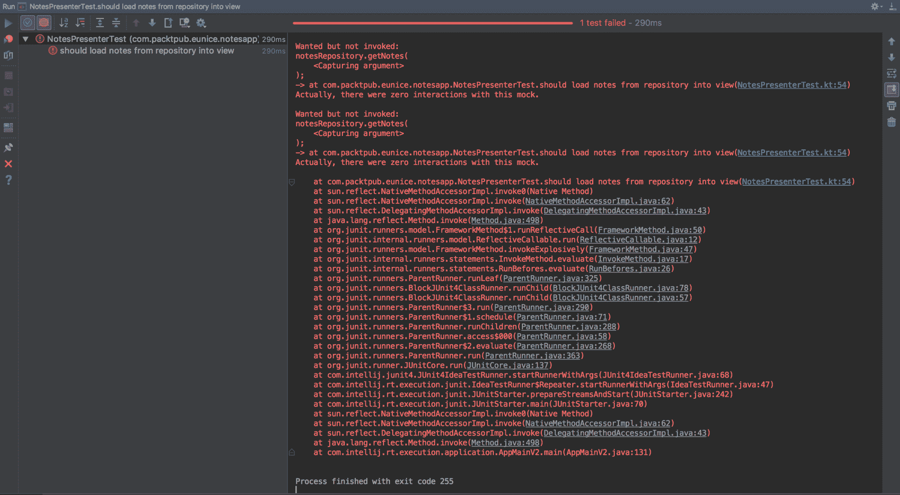
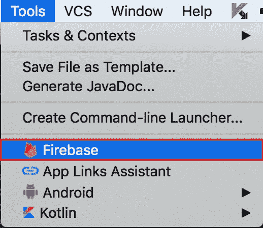
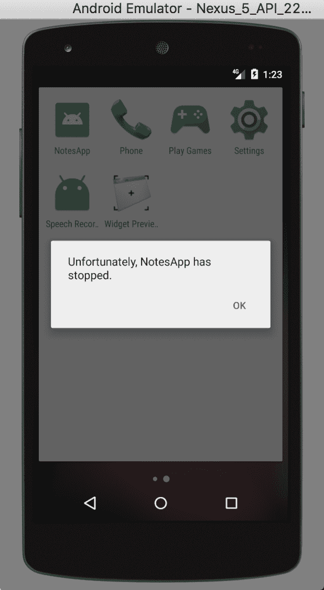
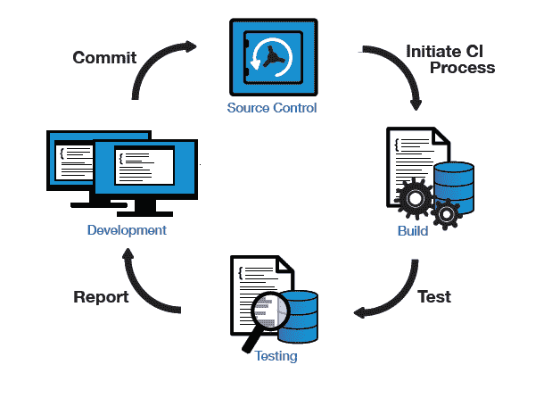

# 测试和持续集成

本章将向您介绍**持续集成** ( **CI** )的概念以及测试的重要性。没听说过 CI？那么，测试呢？

在本章中，我们将:

*   了解写作测试
*   了解安卓测试支持库
*   了解如何使用 Crashlytics 跟踪碰撞报告
*   了解 beta 测试
*   了解竞争情报的概念
*   了解 Jenkins、Bamboo 和浪子等工具，以及如何将它们用于构建自动化和部署

# 测试

软件测试是评估软件或软件的一部分的过程，以确保它按预期工作。产品必须满足其制造的给定要求。因此，测试报告给出了软件质量的指示。测试的另一个主要原因是发现 bug 并修复它们。

有时，会有将测试视为事后想法的诱惑。这主要是时间限制等问题的结果，但是考虑到测试的重要性，它应该成为开发过程的一部分。在软件生命后期编写测试可能是一种非常可怕的体验。在开始编写测试之前，您可能需要花费大量的时间对其进行重构，以使其可测试。所有这些因素带来的挫败感使得大多数软件很难进行适当的测试。

# 测试的重要性

测试是一个非常广泛的话题，你可以很容易地写一本关于它的书。测试的重要性怎么强调都不为过。以下是所有软件都需要测试的一些原因:

*   它允许企业认识和理解软件实施的风险
*   它确保编写出高质量的程序
*   它有助于生产无缺陷的产品
*   它降低了维护成本
*   这是验证软件的可靠方法
*   它提高了性能
*   它确认所有声明的功能需求都已实现
*   它给客户灌输信心
*   它能更快地暴露 bug
*   它被要求继续营业
*   它确保产品可以在其预期环境中安装和运行

# 安卓测试支持库

**安卓测试支持库** ( **ATSL** )是一组专门为测试安卓应用而构建的库。就像你在安卓应用开发中常用的支持库一样，只有这个是专门用来测试的。

# 模型-视图-演示者体系结构

如前所述，软件需要是可测试的。只有这样，我们才能为他们编写高效的测试。为此，您将使用**模型-视图-演示者** ( **MVP** )架构来设计您的应用。这种架构采用了一些设计最佳实践，例如控制反转和依赖注入，因此使其适合于测试。为了让一个应用可测试，它必须尽可能地去耦合它的各个部分。

查看下图中 MVP 架构的高级示意图:


简言之，这就是各个部分的含义:

*   模型:它提供并存储应用的数据
*   视图:它处理模型数据的显示
*   推荐者:它协调用户界面和数据

您也可以很容易地交换出其他部分，并在测试过程中模拟它们。在软件测试中，模型是模仿真实对象的对象。您将提供它的行为，而不是依赖代码的实际实现。这样，您就可以专注于测试中的类，它的表现完全符合预期。在下面的部分中，您将看到它们的实际应用。

# 测试驱动开发

您将使用一种被称为**测试驱动开发** ( **TDD** )的软件开发来构建一个 Notes 应用。请看下图，以及下面的解释:


**TDD** 是一种在实际程序代码之前编写测试的软件开发方法。

红色:红色是 TDD 过程的第一阶段。在这里，你写测试。既然这是第一次考试，那就说明你基本没什么可考的了。因此，您必须编写可以测试的最少代码。现在，因为它是能够编写测试所需的最少代码量，所以当您编写代码时，它很可能会失败。但这完全没问题。在 TDD 中，你的测试必须在其他事情发生之前失败！当你的测试失败时，这就是 TDD 周期的第一阶段——红色阶段。

格林:现在，你必须写出通过测试所需的最少代码。当测试通过时，那太好了，你已经完成了 TDD 周期的第二阶段。通过测试意味着你的程序的一部分如你所期望的那样工作。当你继续以这种方式构建你的应用时，在任何时候你都将测试你代码的每一部分。你能看出这是怎么回事吗？当您完成一个特性时，您已经有足够的测试来测试该特性的各个部分。

重构:TDD 过程的最后阶段是重构您之前编写的代码，以通过测试。在这里，您删除多余的代码，清理，并为模型编写完整的实现。然后，再次运行测试。他们可能会失败。在 TDD 中，测试失败是一件好事。当您编写测试并且测试通过时，您可以确定已经满足了特定的要求或期望。

还有其他形式的围绕测试构建的开发模型，如行为驱动测试、黑盒测试和冒烟测试。然而，它们基本上可以分为功能测试和非功能测试。

# 功能测试和非功能测试

通过功能测试，您可以根据给定的业务需求测试应用。他们不要求应用完全运行。其中包括:

*   单元测试
*   集成测试
*   验收测试

通过非功能性测试，您可以根据应用的运行环境对其进行测试。例如，应用将连接到一个真实的数据源，并使用一个 HTTP 连接。其中包括:

*   安全测试
*   可用性测试
*   兼容性测试

# Notes 应用

要开始构建我们的笔记应用，请创建一个新的应用，并将其称为笔记应用。使用AndroidStudio左上角的选项卡切换到项目视图。此视图允许您查看文件系统中存在的完整项目结构。它应该如下图所示:


单元测试测试小部分代码，没有产品的任何其他部分。在这种情况下，这意味着您的单元测试不需要物理设备，也不需要安卓 jar、数据库或网络；只是你写的源代码。这些是要写入`test`目录的测试类型。

另一方面，集成测试包括运行应用所需的所有组件，这些测试将进入`androidTest`目录。

# 测试依赖关系

目前只有一个测试库`Junit`，您将使用它进行单元测试。但是，由于您的代码将与其他组件交互，即使它们可能不是被测试的组件，您也必须模拟它们。`Junit`仍然不足以编写测试用例。因此，您还需要添加`Hamcrest`来帮助创建断言匹配等等。让我们继续添加我们需要的库。

打开模块的构建文件，更新依赖项以匹配以下代码，并同步项目:

```kt
dependencies {
  implementation fileTree(dir: 'libs', include: ['*.jar'])
  implementation "org.jetbrains.kotlin:kotlin-stdlib-jre7:$kotlin_version"
  implementation 'com.android.support:appcompat-v7:26.1.0'
  implementation 'com.android.support.constraint:constraint-layout:1.0.2'
  testImplementation 'junit:junit:4.12'
  testImplementation "org.mockito:mockito-all:1.10.19"
  testImplementation "org.hamcrest:hamcrest-all:1.3"
  testImplementation "org.powermock:powermock-module-junit4:1.6.2"
  testImplementation "org.powermock:powermock-api-mockito:1.6.2"
  androidTestImplementation 'com.android.support.test:runner:1.0.1'
  androidTestImplementation 'com.android.support.test.espresso:espresso-core:3.0.1'
}
```

For now, use the exact library versions as shown in the preceding code. This means you will have to ignore suggestions from the IDE to upgrade your library versions. 

Later, you can update to newer, stable versions which are compatible with each other.

# 你的第一次测试

您将首先向用户显示注释。笔记演示者将提供显示进度指示器的逻辑，该指示器显示笔记和其他与笔记相关的视图。

由于**演示者**坐标在**模型**和**视图**之间，你将不得不嘲笑他们，这样你就可以专注于被测班级。

在本测试中，您将验证要求`NotesPresenter`添加新注释将触发对`View`的调用，以显示添加注释屏幕。让我们执行``should display note when button is clicked`()`测试方法。

您将首先向演示者的`addNewNote()`方法添加一个调用。然后，您将验证视图的`showAddNote()`是否被调用。因此，您调用一个方法，并验证它反过来调用另一个方法(回想一下 MVP 模式是如何工作的；演示者与视图协调)。

目前，我们不会担心第二个调用方法会做什么；这是单元测试，你一次测试一件小事(单元)。因此，您将不得不模拟视图，并且现在不需要实现它。几个接口就可以做到这一点；也就是说，一个不一定实现它们的应用编程接口或合同。请参见以下最后几段代码:

```kt
import com.packtpub.eunice.notesapp.notes.NotesContract
import com.packtpub.eunice.notesapp.notes.NotesPresenter
import org.junit.Before
import org.junit.Test
import org.mockito.Mock
import org.mockito.Mockito.verify
import org.mockito.MockitoAnnotations

@Mock
private lateinit var notesView: NotesContract.View
private lateinit var notesPresenter: NotesPresenter

@Before
fun setUp() {
 MockitoAnnotations.initMocks(this)

 // The class under test
 notesPresenter = NotesPresenter()
}

@Test
fun `should display note view when button is clicked`() {
 // When adding a new note
 notesPresenter.addNewNote()

 // Then show add note UI
 verify(notesView)?.showAddNote()
}
```

现在，创建`NotesContract`，这是 MVP 架构的**视图**部分。这将是一个接口，其中只需要方法来通过测试:

```kt
interface NotesContract {
    interface View {
        fun showAddNote()
    }

    interface UserActionsListener {

        fun loadNotes(forceUpdate: Boolean)

        fun addNewNote()

        fun openNoteDetails(requestedNote: Note)
    }
}
```

接下来，创建`Note`类。它代表了 MVP 架构中的**模型**。它为您正在构建的笔记应用定义了笔记的结构:

```kt
import java.util.UUID

data class Note(val title: String?,
 val description: String?,
 val imageUrl: String? = null) {

 val id: String = UUID.randomUUID().toString()
}
```

创建`NotesPresenter`，代表 MVP 架构中的**演示者**。让它在`NotesContract`类中实现`UserActionsListener`:

```kt
class NotesPresenter: NotesContract.UserActionsListener {
    override fun loadNotes(forceUpdate: Boolean) {
    }

    override fun addNewNote() {
    }

    override fun openNoteDetails(requestedNote: Note) {
    }
}
```

第一次测试就够了。你准备好了吗？好了，现在点击定义测试方法的数字旁边的右箭头。或者，您也可以右键单击`NotesPresenterTest`文件并选择运行:


您的测试应该失败:


它失败了，因为我们期望调用`NotesView`类的`showAddNote()`方法，但它没有。发生这种情况是因为您只在`Presenter`类中实现了接口，但从未在`NotesView`类中调用期望的方法。

让我们现在就着手解决这个问题。

首先，更新`NotesPresenter`以在其主构造函数中接受一个`NotesContract.View`对象。然后，调用期望的方法，`showAddNote()`，在`addNewNote()`方法内。

You should always prefer constructor injection to field injection. It is much easier to handle, and easier to read and maintain too.

你的`NotesPresenter`类现在应该是这样的:

```kt
class NotesPresenter(notesView: NotesContract.View): NotesContract.UserActionsListener {
    private var notesView: NotesContract.View = checkNotNull(notesView) {
        "notesView cannot be null"
    }

    override fun loadNotes(forceUpdate: Boolean) {
    }

    override fun addNewNote() = notesView.showAddNote()

    override fun openNoteDetails(requestedNote: Note) {
    }
}
```

`checkNotNull` is a built-in `Kotlin` utility function for verifying whether an object is null or not. Its second parameter takes a lambda function which should return a default message if the object is null.

由于`NotesPresenter`现在在其主构造函数中需要一个`NotesContract.View`，因此您必须更新测试以满足这一要求:

```kt
@Before
fun setUp() {
    MockitoAnnotations.initMocks(this)

// Get a reference to the class under test
    notesPresenter = NotesPresenter(notesView)
}
```

代码已被重构。现在，重新运行测试:


万岁！现在测试通过；太棒了。干得好。

这是一个完整的循环使用 **TDD** 。现在，您需要继续前进，在功能完全实现之前，还有一些测试要完成。

您的下一个测试是验证演示者是否按预期显示了笔记。在此过程中，在更新视图之前，必须首先从存储库中检索注释。

您将使用与之前测试类似的测试 API。不过，在这里你会学到一个新的东西，叫做`ArgumentCaptor`。正如您可能已经猜到的，它捕获传递给方法的参数。您将使用这些调用另一个方法，并将它们作为参数传入。我们来看看:

```kt
@Mock
private lateinit var notesRepository: NotesRepository

    @Captor
    private var loadNotesCallbackCaptor: ArgumentCaptor<NotesRepository.LoadNotesCallback>? = null

private val NOTES = arrayListOf(Note("Title A", "Description A"),
 Note("Title A", "Description B"))
...

@Test
fun `should load notes from repository into view`() {
 // When loading of Notes is requested
 notesPresenter.loadNotes(true)

 // Then capture callback and invoked with stubbed notes
 verify(notesRepository)?.getNotes(loadNotesCallbackCaptor?.capture())
 loadNotesCallbackCaptor!!.value.onNotesLoaded(NOTES)

 // Then hide progress indicator and display notes
 verify(notesView).setProgressIndicator(false)
 verify(notesView).showNotes(NOTES)
}
```

让我们简单地再看一遍。

你首先调用你正在测试的方法，就是`loadNotes()`。然后，您使用`NotesRepository`实例验证了该动作反过来获得了笔记(`getNotes()`)，就像前面的测试一样。然后，您验证了实例被传递到`getNotes()`方法，该方法再次用于加载注释(`onNotesLoaded()`)。然后，确认`notesView`隐藏进度指示器(`setProgressIndicator(false)`)并显示注释(`showNotes()`)。

Leverage the Null Safety feature in Kotlin as much as possible. Instead of having nullable types for the mocks, use Kotlin's `lateinit` modifier instead.

This results in much cleaner code because then you don't have to have nullability checks everywhere, nor do you have to use the `elvis` operator, either.

现在，如下创建`NotesRepository`:

```kt
interface NotesRepository {

    interface LoadNotesCallback {

        fun onNotesLoaded(notes: List<Note>)
    }

    fun getNotes(callback: LoadNotesCallback?)
    fun refreshData()
}
```

接下来，更新`NotesContract`:

```kt
interface NotesContract {
    interface View {
        fun setProgressIndicator(active: Boolean)

        fun showNotes(notes: List<Note>)

        ...
    }

  ...
}
```

现在，您已经准备好测试第二个测试用例了。继续运行它:



好吧，失败了。同样，有了 TDD，这是完美的！你意识到这告诉了我们到底缺少什么，以及需要做什么。您只实现了契约(接口)，但是没有进一步的操作。

打开你的`NotesPresenter`并重构代码，让这个测试通过。您将首先添加`NotesRepository`作为构造函数参数的一部分，然后在适当的方法中进行调用。有关完整的实现，请参见下面的代码:

```kt
import com.packtpub.eunice.notesapp.data.NotesRepository
import com.packtpub.eunice.notesapp.util.EspressoIdlingResource

class NotesPresenter(notesView: NotesContract.View, notesRepository: NotesRepository) :
 NotesContract.UserActionsListener {

 private var notesRepository: NotesRepository = checkNotNull(notesRepository) {
 "notesRepository cannot be null"
 }

 override fun loadNotes(forceUpdate: Boolean) {
 notesView.setProgressIndicator(true)
 if (forceUpdate) {
 notesRepository.refreshData()
 }

 EspressoIdlingResource.increment()

 notesRepository.getNotes(object : NotesRepository.LoadNotesCallback {
 override fun onNotesLoaded(notes: List<Note>) {
 EspressoIdlingResource.decrement()
 notesView.setProgressIndicator(false)
 notesView.showNotes(notes)
 }
 })
 }
 ...
}
```

您使用构造函数注入将一个`NotesRepository`实例注入到`NotesPresenter`中。你检查了它的可空性，就像你检查`NotesContract.View`一样。

在`loadNotes()`方法中，您根据`forceUpdate`字段显示进度指示器并刷新数据。

然后，您使用了一个实用程序类`EspressoIdlingResource`，基本上是为了提醒 Espresso 一个可能的异步请求。拿到笔记后，隐藏进度指示器并显示笔记。

创建一个 util 包来包含`EspressoIdlingResource`和`SimpleCountingIdlingResource`:

```kt
import android.support.test.espresso.IdlingResource

object EspressoIdlingResource {

    private const val RESOURCE = "GLOBAL"

    private val countingIdlingResource = SimpleCountingIdlingResource(RESOURCE)

    val idlingResource = countingIdlingResource

    fun increment() = countingIdlingResource.increment()

    fun decrement() = countingIdlingResource.decrement()
}
```

而对于`SimpleCountingIdlingResource`:

```kt
package com.packtpub.eunice.notesapp.util

import android.support.test.espresso.IdlingResource
import java.util.concurrent.atomic.AtomicInteger

class SimpleCountingIdlingResource

(resourceName: String) : IdlingResource {

    private val mResourceName: String = checkNotNull(resourceName)

    private val counter = AtomicInteger(0)

    @Volatile
    private var resourceCallback: IdlingResource.ResourceCallback? =  
    null

    override fun getName() = mResourceName

    override fun isIdleNow() = counter.get() == 0

    override fun registerIdleTransitionCallback(resourceCallback: 
    IdlingResource.ResourceCallback) {
        this.resourceCallback = resourceCallback
    }

    fun increment() = counter.getAndIncrement()

    fun decrement() {
        val counterVal = counter.decrementAndGet()
        if (counterVal == 0) {
            // we've gone from non-zero to zero. That means we're idle 
            now! Tell espresso.
            resourceCallback?.onTransitionToIdle()
        }

        if (counterVal < 0) {
            throw IllegalArgumentException("Counter has been 
            corrupted!")
        }
    }
}
```

确保使用`EspressoIdlingResource`库更新应用的构建依赖关系:

```kt
dependencies {
  ...
  implementation "com.android.support.test.espresso:espresso-idling-resource:3.0.1"
...
}
```

接下来，更新`setUp`方法以正确初始化`NotesPresenter`类:

```kt
@Before
fun setUp() {
    MockitoAnnotations.initMocks(this)

// Get a reference to the class under test
    notesPresenter = NotesPresenter(notesView)
}
```

现在一切就绪，运行测试:


太好了。非常棒的东西。您已经使用 TDD 方法成功地为 NotesApp 编写了业务逻辑。

# 碰撞物

从官方网站:

*Firebase Crashlytics 是一款轻量级的实时崩溃报告程序，可帮助您跟踪、优先处理和修复影响应用质量的稳定性问题。Crashlytics 通过智能地对崩溃进行分组并突出显示导致崩溃的环境，为您节省了故障排除时间。*

好了，这就是 Crashlytics 的基本内容。它可以在 iOS 和安卓系统上运行。以下是它的一些主要功能:

*   **崩溃报告:**它的主要目的是报告崩溃，而且做得真的很好。可以根据您的需要进行定制。例如，在其他定制选项中，您可能不希望它报告某些类型的崩溃。
*   **分析:**它提供崩溃报告，包括受影响用户、他们的设备、崩溃发生时间的数据，包括干净的堆栈跟踪和日志，以帮助调试和修复。
*   **实时警报:**您会被自动提醒新的和重复出现的问题。实时警报是必要的，因为它们可以帮助您快速缓解问题。

Crashlytics 用于发现特定的崩溃是否影响了许多用户。当问题的严重性突然增加时，您还会收到警报，这使您能够找出是哪几行代码导致了崩溃。

实施步骤如下:

*   连接
*   合并
*   检查控制台

# 连接

你将从添加 Firebase 到你的应用开始。Firebase 是一个移动和网络应用的开发平台。它有很多工具，其中一个就是 Crashlytics。

最低要求是:

*   运行安卓 4.0(冰淇淋三明治)或更高版本以及谷歌游戏服务 12.0.1 或更高版本的设备
*   AndroidStudio 2.2 或更高版本

您将使用AndroidStudio 2.2+中的 Firebase 助手工具将您的应用连接到 Firebase。助手工具将更新您现有的项目，或者创建一个包含所有必要的渐变依赖项的新项目。它提供了一个非常直观的用户界面指南，您可以遵循:



查看[第 12 章](12.html)、*设置任务提醒*中关于将您的项目添加到 Firebase 的完整指南。完成后，从浏览器登录 Firebase 控制台。在侧面菜单上，从**稳定性**部分选择**防撞器**:


当 Crashlytics 页面打开时，会询问您该应用是否是 Crashlytics 的新应用。选择是，这个应用是 Crashlytics 的新版本(它没有任何版本的 SDK):


然后，第二步为您提供了一个链接，指向为您的应用设置 Crashlytics 的文档页面。要将 Crashlytics 添加到应用中，请更新您的项目级`build.gradle`:

```kt
buildscript {
    repositories {
        // ...
        maven {
           url 'https://maven.fabric.io/public'
        }
    }
    dependencies {
        // ...
        classpath 'io.fabric.tools:gradle:1.25.1'
    }
}

allprojects {
    // ...
    repositories {
       // ...
       maven {
           url 'https://maven.google.com/'
       }
    }
}
```

然后，用 Crashlytics 插件和依赖项更新应用模块的`build.gradle`文件:

```kt
apply plugin: 'com.android.application'
apply plugin: 'io.fabric'

dependencies {
    // ...
    implementation 'com.crashlytics.sdk.android:crashlytics:2.9.1'
}
```

就是这样，Crashlytics 已经准备好在你的应用中监听崩溃。这是它的默认行为，但是如果您想自己控制初始化，您必须在清单文件中禁用它:

```kt
<application
...
 <meta-data android:name="firebase_crashlytics_collection_enabled" android:value="false" />
</application>
```

然后，在您的 Activity 类中，您可以启用它，即使使用这样的调试器:

```kt
val fabric = Fabric.Builder(this)
        .kits(Crashlytics())
        .debuggable(true)
        .build()
Fabric.with(fabric)
```

确保您的 Gradle Wrapper 版本至少为 4.4:

```kt
distributionUrl=https\://services.gradle.org/distributions/gradle-4.4-all.zip
```

由于您的应用需要向您的控制台发送报告，请在您的清单文件中添加互联网权限:

```kt
<manifest ...>

  <uses-permission android:name="android.permission.INTERNET" />

  <application ...
```

像往常一样，同步 Gradle，用您刚刚进行的依赖项更新来更新您的项目。

之后，您应该会看到与AndroidStudio集成的 Fabric 插件。使用您的电子邮件和密码注册:


确认您的帐户后，将为您生成结构应用编程接口密钥。应该是这样的:

```kt
<meta-data
    android:name="io.fabric.ApiKey"
    android:value="xxYYxx6afd23n6XYf9ff6000383b4ddxxx2220faspi0x"/>
```

现在，您将在应用中强制崩溃以进行测试。创建一个新的空白活动，并只添加一个按钮。然后，将其`clicklistener`设置为强制碰撞。Crashlytics 软件开发工具包有一个简单的应用编程接口可以做到这一点:

```kt
import kotlinx.android.synthetic.main.activity_main.*

...

override fun onCreate(savedInstanceState: Bundle?) {
 crash_btn.setOnClickListener {
  Crashlytics.getInstance().crash()
 }
}
```

因为您正在测试，所以在应用崩溃后重新打开它，以便报告可以发送到您的控制台。

继续运行应用。您的测试活动应该如下所示:


点击 CRASH！按钮来强制崩溃。您的应用将崩溃。单击确定并重新打开应用:



查看您的收件箱，也就是您在 Crashlytics 上注册的收件箱:


单击了解更多按钮。它将打开 Crashlytics 控制台。从那里，你可以找到更多关于坠机的细节。从那里，你可以解决它。

# 测试阶段

测试主要有两个阶段:alpha 和 beta 测试。主要想法是让一组人在应用开发的某个阶段测试该应用。它通常在应用刚开始成形时就开始了，这样就可以利用反馈来使应用更加稳定。稳定是这里的关键。区分不同测试阶段的一个关键因素是参与测试的人数。

# 阿尔法测试

Alpha 测试被认为是测试软件的第一阶段。这个测试通常只涉及很少数量的测试人员。现阶段 app 高度不稳定，所以这个阶段会有几个接近开发者的人参与进来测试，提供建设性的反馈。在应用变得稳定后，它就可以进入测试阶段了。

# Beta 测试

Beta 测试是软件测试的一个阶段，在这个阶段会有更多的人测试应用。它可能涉及 10、100 或 1000 人或更多，这取决于应用的性质和使用该应用的团队规模。如果一个应用在全球有很多用户，它很可能会有一个庞大的团队在开发它，因此可以负担得起让很多人参与该应用的测试。

# 设置测试版测试

您可以从**谷歌支付控制台设置和管理 beta 测试。**您可以选择将您的应用提供给特定的谷歌群组，也可以通过电子邮件向他们发送邀请。

用户必须有谷歌(`@gmail.com`)或 G Suite 账号才能加入。发布后，测试人员可能需要一段时间才能看到您的链接。

# 创建测试跟踪

现在，你必须在你的谷歌游戏控制台内创建一个所谓的**轨迹**。这基本上是一个管理测试过程的设置。

在这里，您可以上传您的 APK，将其分发给选定的一组人，并在他们测试时跟踪反馈。您也可以管理 alpha 和 beta 测试阶段。

按照以下步骤设置测试轨道:

1.  登录到您的游戏控制台并选择您的应用。
2.  在**发布管理****T5】下找到 **App 发布**，在 **Beta 赛道**下选择**管理**。**
3.  在**工件**部分上传你的 APK，然后展开**管理测试员**部分。
4.  在**选择测试方法**下，选择**开放测试**。
5.  复制**选入网址**并与测试人员分享。
6.  在**反馈通道**旁边提供电子邮件地址或网址，以便收集测试人员的反馈。然后，点击**保存**保存。

# 选择加入的网址

创建完测试后，发布它。然后，您将获得测试链接。其格式如下:[https://play.google.com/apps/testing/com.yourpackage.name](https://play.google.com/apps/testing/com.yourpackage.name.)。现在，你必须和你的测试人员分享这个链接。有了这个，他们可以选择加入测试你的应用。

# 连续累计

通常，不止一个人(团队)在一个应用上工作。例如，在业务逻辑中，人甲可能在用户界面上工作，而人乙在功能 1 上工作，人丙在功能 2 上工作。这样的项目仍然会有一个代码库以及它的测试和其他一切。所有提交者在推送代码之前，都可能在本地针对各自所做的工作运行测试。具有不同提交者的共享存储库中的代码必须被统一并构建为一个完整的应用(集成)。测试也必须针对整个应用运行。这必须定期进行，在配置项的情况下，每次提交都要进行。因此，在一天之内，共享存储库中的代码将被构建和测试多次。这就是持续集成的概念。下面是一个非常简单的图表，显示了配置项流程的流程。从左边开始(发展):



# 定义

CI 是一种软件开发实践，其中建立了一个自动化系统，以便在软件被检查到版本控制中后，对其进行构建、测试和报告。**整合**的发生是因为各个分支合并到了主分支。这意味着主分支中的任何内容都有效地代表了整个应用的当前状态，并且由于每次代码进入主存储库时都会发生这种情况，所以它是**连续的；**遂，**持续整合**。

在 CI 中，每当提交代码时，自动构建系统都会自动从共享存储库(主分支)中获取最新的代码，并构建、测试和验证整个分支。通过定期这样做，可以快速检测到错误，从而可以快速修复。知道您的提交可能会导致不稳定的构建，您被迫只提交小的更改。这也使得识别和修复 bug 变得容易。

这一点非常重要，因为尽管应用的不同部分是单独测试和构建的，但在它们被合并到一个共享存储库中后，可能就没有必要了。然后，每个签入都由自动化构建进行验证，从而允许团队及早发现问题。

同样，还有持续部署和持续交付。

# 工具

配置项有各种各样的工具。有些是开源的，有些是自托管的，有些更适合 web 前端，有些适合 web 后端，有些更适合移动开发。

例子包括詹金斯，竹和浪子。您将使用浪子集成您的应用并运行您的测试。浪子是自托管的，这意味着您可以在您的开发机器上运行它。理想情况下，您应该将其安装在配置项服务器上，这是配置项任务的专用服务器。

首先，让我们在本地安装它，并使用它来运行 Notes 应用的测试。

Fastlane, at the time of writing this book, runs on MacOS only. There is work in progress to get it to work on Linux and Windows as well. Some CI services include Jenkins, Bamboo, GitLab CI, Circle CI, and Travis.

# 安装快车道

要安装 fastlane，请执行以下步骤:

1.  由于 x 代码使用 Ruby 并与 Mac OS X 捆绑在一起，您的终端中应该已经有了 **`gem`** 了。

```kt
brew cask install fastlane
```

You may need to use `sudo` depending on your user account's privileges.

2.  成功安装后，将`bin`目录的路径导出到您的`PATH`环境变量:

```kt
export PATH="$HOME/.fastlane/bin:$PATH"
```

3.  在此过程中，还要添加以下区域设置:

```kt
export LC_ALL=en_US.UTF-8
export LANG=en_US.UTF-8
```

4.  在您的终端中打开一个新会话。这个新会话将加载您刚刚对环境变量所做的更改。首先，确保您已经安装了`bundler`。如果您还没有以下命令，请使用它:

```kt
[sudo] gem install bundler
```

5.  然后，切换到工作目录的根目录。在那里，用以下命令初始化`fastlane`:

```kt
fastlane init
```

在这个过程中，你会被问一些问题。首先是你的包名。当您将其留空时，将提供一个默认名称，因此请输入您的软件包名称:


6.  接下来，您将被要求提供某个服务动作 JSON 秘密文件的路径。只需按*进入*，因为我们还不需要它；可以稍后提供。最后，你会被问及是否要上传一些元数据。谦卑地拒绝；您可以稍后通过以下方式进行设置:

```kt
fastlane supply init
```

还会有一些其他的提示，你只需要点击*进入*键。

7.  完成后，使用以下命令运行测试:

```kt
fastlane test
```

当一切顺利时，您应该会看到如下结果:


# 摘要

在本章中，您已经了解了配置项和测试的概念。你已经学会了如何使用 ATSL 写测试。

您了解了测试中最受欢迎的两个阶段，以及如何在谷歌游戏控制台中设置它们。您试用了 Crashlytics，并体验了它的崩溃报告功能。然后你学习了配置项，举个例子，你使用了一个配置项工具，叫做浪子。

哇，这一章真的很精彩，你来了——你已经走到了最后。在下一章中，你将学习如何“让你的应用对全世界开放”。很有趣，对吧？好吧，让我们继续；我们将在下一章再次见面。