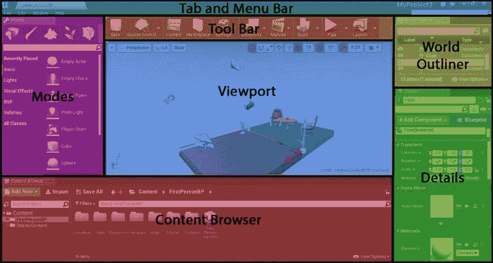
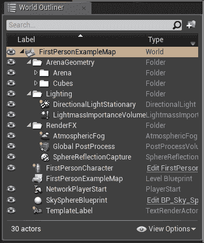
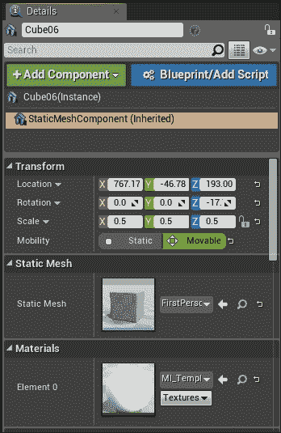

# 二、启动虚幻 4 引擎

现在你知道如何下载和安装 UE4，你应该已经设置好一切，准备开始制作游戏。然而，在我们开始制作游戏之前，有一个重要的话题需要讨论，那就是 **编辑器**。编辑是所有魔法发生的地方。这是你做游戏的地方。因此，在我们继续之前，了解编辑器、它的功能、用户界面以及如何浏览它是很重要的。所以，这一章专门带你度过。

我们将涵盖以下主题:

*   编辑是什么
*   它的用户界面
*   在编辑器中导航
*   热键和控件

# 见见编辑

编辑器是你制作游戏的地方。您为游戏创建的所有素材都是通过编辑器实现的。您可以在编辑器中设置您的环境和级别，您创建的所有代码序列都可以在这里测试；游戏的测试、调试和打包也在这里完成。

不用说，重要的是你要理解编辑器是什么，熟悉它的用户界面，并知道如何浏览它，然后我们才能更进一步。最后，为了改进您的工作流程，您还应该熟悉一些热键。

# 虚幻项目浏览器

当你通过引擎启动器启动 UE4 时，除非你已经直接从库中打开了一个项目，否则虚幻项目浏览器将会打开。在虚幻项目浏览器中，您可以看到您已经创建的所有虚幻项目的列表，并且您可以打开任何一个您想要的项目。您也可以从这里创建一个新项目。

在下一章中，我们将介绍什么是项目；目前我们只关注**虚幻项目浏览器**及其用户界面，如下图截图所示。

在顶部，就在标签栏下方的处，有两个标签，分别是**项目**和**新项目**。这些选项卡中的每一个都包含了我们将要了解的某些功能。

在**项目**选项卡中，您可以看到并打开存储在系统中的任何项目。顶部是搜索栏。如果您有很多项目，并且很难找到一个特定的项目，您可以简单地在搜索栏中键入您希望打开的项目的名称，它将显示与您输入的名称匹配的项目。

搜索栏右侧是**刷新**按钮。如果您在市场上进行了任何购买，它将不会反映在浏览器中。要更新项目列表，点击**刷新**按钮。**刷新**按钮旁边是**市集**按钮；点击此处将带您进入引擎启动器市场面板。

搜索栏下方是**我的项目**部分；您创建的所有项目都显示在这里。**我的项目**下面是**样品**部分。您可以从市场购买的任何游戏功能示例或引擎功能示例都会显示在此处。

在前面的截图中可以看到，目前显示了两个项目。您可能还注意到其中一个项目 **Test** 相当暗，在缩略图的右下角旁边写着 4.4。这是因为**测试**项目是使用 4.4 版本创建的，我们已经推出了 4.6.1 版本。如果我们尝试启动这个项目，我们将得到一个提示，说这个项目是用不同的引擎版本构建的，并且将被给予选项来转换这个项目，以与我们当前运行的虚幻 4 版本兼容。一旦您转换了项目，它将与您当前的引擎版本兼容。

### 注

虽然转换对于升级项目很有效，但是降级项目(例如，将 4.6 版中创建的项目转换为与 4.4 版兼容)会有一些复杂之处。首先，虽然您可以使用项目中创建的大部分资源，但是您将无法加载在其中创建的地图，并且将从完全空白的场景开始。

接下来是**样品**部分。您从引擎功能示例、示例游戏项目等下载的任何内容都会显示在此处。我们之前讨论的项目升级和降级过程也适用于这些项目文件。

要打开一个项目，只需点击它，选定的项目将突出显示为黄色。选中后，点击**打开**按钮启动。如果您必须打开一个未在**我的项目**部分列出的项目，只需点击**浏览**按钮，搜索项目文件，然后运行它。最后，在窗口的左下角有一个小的勾号框，上面写着**总是在启动时加载最后一个项目**。如果勾选该框，它将自动打开您下次启动 UE4 时打开的最后一个项目。

移至**新项目**面板，我们看到以下屏幕:

正如我们在前面的截图中看到的，有多种类型的模板可供选择，具体取决于你想制作什么类型的游戏。例如，有第一人称游戏、益智游戏、侧滚游戏和车辆游戏的模板。有两种模板可以选择，**蓝图**和 **C++** 。蓝图项目不需要用户有预先的编程经验。所有的游戏功能都可以使用蓝图来实现，模板还提供了特定游戏模式所需的基本蓝图集，如相机、控件、物理等。然而，C++项目要求开发人员了解 C++。这些项目为特定的模板提供了基本框架，开发者可以在此基础上制作游戏。选择蓝图项目对于缺乏编程知识的开发人员来说是有益的，提供了开发的便利性。然而，尽管蓝图是一个伟大的工具，但它仍然不如编码那样通用。通过编码，您可以更好地控制引擎，甚至可以修改它来满足您的需求。这也意味着更好地优化你的游戏。如果需要，开发人员可以使用蓝图来实现特性。

### 注

要创建 C++项目，建议您在系统上安装 Visual Studio 2013 或更高版本。如果没有，您将首先必须下载并安装 Visual Studio，然后才能创建这些类型的项目。但是，您可以使用 Visual Studio 2012，前提是您从 GitHub 下载源代码，然后在 Visual Studio 2012 中编译整个引擎。但是，由于引擎启动器是用 Visual Studio 2013 构建的，建议您使用 2013 版本。如果你在苹果电脑上，你将需要 Xcode 5 或更高版本。

项目列表的右侧是突出显示的项目的屏幕截图，下面是它的描述。

决定使用哪个模板后，在打开项目之前，您可以选择一些设置。首先，你可以选择在哪个硬件上开发你的游戏，无论是电脑/控制台，还是手机/平板电脑。

这将在您启动项目时设置一些东西如控件。之后可以在游戏中设置渲染质量。您可以选择选择最高质量或可扩展。现在，虽然你想让你的游戏看起来很棒是可以理解的，但是你必须记住移动设备是有局限性的。为移动设备开发时，最好选择 **可扩展**。可伸缩性和最高质量之间的区别在于，在可伸缩性中，引擎配置文件被优化以提供最佳性能。这意味着一些更昂贵的功能，如抗锯齿和运动模糊，默认情况下是关闭的。最后，您可以选择是否要使用初学者内容创建项目(初学者内容包含材质、道具、音频文件、纹理等)。

设置这些选项后，您可以设置项目的存储位置。左侧栏显示项目将存储的文件夹的位置和名称。你可以把它设置成任何你想要的。在右侧栏中，您可以设置项目的名称。最后，设置完所有这些选项后，只需点击**创建项目**按钮打开编辑器。

# 用户界面

打开或创建新的项目后，编辑器将打开。打开后，您将看到以下屏幕:

编辑器是你创建游戏的地方。正如您所看到的，即使编辑器用户界面被整齐地分类，仍然有相当多的按钮、菜单和面板。为了使解释用户界面更容易，我们将把编辑器分成不同的部分，然后逐个检查每个部分。

## 标签栏和菜单栏

在顶部，我们有标签栏。就像在网络浏览器中一样，可以看到的选项卡，所有当前打开的地图文件，可以停靠多个视口。

在标签栏的右侧，您可以看到项目的名称用浅灰色书写， **MyProject2** ，在这种情况下。项目名称旁边是**发送快速反馈**按钮，看起来像一个聊天气泡。想给 Epic 一些关于编辑器的反馈，正面的还是负面的？你可以用这个按钮。只需点击图标，打开一个菜单，您可以选择发送正面或负面反馈，以及询问 Epic 的问题。做出选择后，会打开一个窗口，您可以在其中选择反馈的内容，然后选择您的想法。写好反馈后，点击**发送**，将发送至 Epic。

接下来，我们有**显示可用教程**按钮，当点击该按钮时，会打开一个窗口，您可以从中选择想要查看的教程。编辑器内部有教程。当你点击按钮时，一个新的窗口打开，向你显示所有可用的教程。

标签栏下方是菜单栏。它提供了所有应用提供的所有通用命令和工具。

*   **文件**:这里可以创建、打开、保存关卡/地图，也可以从这里创建或打开项目(创建或打开新项目时，当前项目关闭，编辑器重新打开)。你也可以从这里打包你的游戏。只需点击**文件**，将鼠标悬停在**套装产品**上，会打开另一个菜单，选择在哪个平台上打包你的游戏，然后按照说明完成这个过程。您可以在这里设置各种设置和构建配置，我们将在后面的章节中介绍。
*   **编辑**:从 **编辑**菜单中，您可以执行撤销或重做最后一个动作、剪切、复制、粘贴和/或复制您选择的任何对象(或对象组)。您也可以从这里访问编辑器首选项。为此，只需点击**编辑**菜单中的**编辑器首选项**。这样做会打开一个新窗口，您可以在其中设置选项，例如打开/关闭自动保存或设置自动保存的频率、更改或分配热键以及更改测量单位(厘米、米或公里)。偏好设置中有更多可用的设置，所以请随意探索，并调整它们以适合您的游戏。

最后，还可以设置，更改当前打开项目的设置。在**编辑器首选项**的正下方是**项目设置**选项；点击此处打开项目设置窗口。在**项目设置**窗口，你可以设置项目描述(这包括为你的项目添加一个缩略图，添加一个描述，和一个项目 ID)，游戏将如何打包，以及项目将支持什么平台。

### 注

在**编辑器首选项**和**项目设置**中，有很多设置可以更改和调整，以满足您的要求，建议您彻底浏览一下。

*   **Window**: The Editor window is fully customizable. Apart from the tab and menu bar, all the other windows can be customized in the Editor to suit your preferences. The screenshot in the preceding section is the default layout of the Editor. You can add, remove, and move around any window you like.

    为此，只需遵循以下步骤:

    1.  将光标移动到要移动的窗口选项卡上
    2.  按住标签上的鼠标左键
    3.  将窗口移动到您想要移动的位置
    4.  松开鼠标左键，窗口将被设置

    有时您可能找不到 windows 选项卡。例如，在前面的截图中，视口没有选项卡。这是因为它的标签是隐藏的。要取消隐藏，只需点击位于窗口左上角的黄色小箭头。

    记住以上几点，视窗菜单就是为了这个。如果您希望在编辑器中添加另一个窗口，您可以简单地打开窗口菜单，选择要添加的窗口，然后单击它。当您这样做时，窗口将打开，然后您可以移动和设置到任何您想要的地方。如果您使用双屏，那么窗口菜单可能会派上用场，因为您有空间添加更多窗口。

*   **帮助** : Epic 已经尽最大努力确保他们和社区提供的教程在任何时候都可以轻松访问，无论是在他们的网站上，引擎启动器上，还是编辑器本身。帮助菜单类似于引擎启动器的**学习**部分(在[第 1 章](1.html#aid-DB7S1 "Chapter 1. Getting Started with Unreal 4")、*虚幻入门 4* 中描述)；它有所有关于 UE4 的教程和文档的链接。菜单栏的最右上角是**搜索帮助**栏。您是否需要找到一个特定的教程，而不必浏览整个帮助部分？在这种情况下，只需输入您希望查找教程的主题名称，它就会显示匹配的结果。

## 工具栏

接下来，我们有工具栏，位于标签和菜单栏的正下方。

它提供了对最常用命令和操作的快速访问。

*   **保存**:在最左边，是**保存**按钮。任何开发人员都知道这个函数有多重要。一次崩溃，你所有的工作都付诸东流；因此，它在工具栏上是可用的，因此您可以快速访问它。
*   **Source Control**: From here, you can either enable or disable source control, which is, by default, disabled. Source control is an important tool when working in a team. It is a method of keeping track of any changes made to a file and controlling the version of the software. When any modification has been made to the file, the team can check the modified files, and if they made any changes, post it for others.

    要启用它，点击按钮，将打开一个下拉菜单，并选择**连接到源**。将打开一个新窗口，要求您选择提供商。选择你想要的，点击**接受设置**。启用后，您可以检查其他团队成员所做的任何修改，并发布您自己所做的任何修改。

*   **内容**:**内容**按钮打开内容浏览器。这类似于虚幻引擎 3 中的内容浏览器。所以，如果你熟悉它，你应该对新版本没有问题。对于那些没有使用虚幻引擎 3 的人来说，内容浏览器是可以找到所有素材、代码、级别和一切的地方。
*   **市场**:你突然意识到你的游戏需要一个或多个素材；不需要再次打开引擎启动器，只需点击此按钮即可进入引擎启动器的**市场**部分，您可以在此浏览并购买所需物品。
*   **设置**:这类似于虚幻引擎 3 中**信息**的设置。它列出了编辑器最常用的设置。诸如打开/关闭演员捕捉、允许/不允许选择半透明对象、允许/不允许组选择等等，都可以在这里更改。还值得一提的是，引擎的视觉设置，如分辨率、纹理渲染质量、抗锯齿等也可以在这里更改。
*   **蓝图**:我们有一整章专门讲蓝图；因此，它是 UE4 中一个重要且最常用的功能之一应该不足为奇。您可以从这里访问蓝图编辑器。
*   **日场**:这是 UE4 提供的又一个重要且常用的功能，使用它你可以在虚幻日场中创建电影等等。你可以从这里打开虚幻日场。
*   **打造**:打造是 UE4 的一个非常重要的功能。构建标高时，引擎会预先计算照明和可见性数据，生成导航网络，并更新几何图形。
*   **Play**: When you click on the **Play** button, the game starts normally in the viewport for you to test your level and to see whether everything is functioning as intended. When the game starts, the **Play** button gets replaced by the three other buttons.

    

*   **暂停**:此按钮暂停游戏会话。暂停后，您可以继续或跳过一帧。
*   **停止**:这个按钮停止游戏会话，带你回到编辑模式。
*   **Eject**: When you click on **Play**, you take control of a character. If you click **Eject**, you stop taking control of it and can move it around in the Viewport.

    通过点击按钮旁边的向下箭头，您可以为**播放**设置其他选项，这将打开**播放**菜单。

*   **启动**:当你认为你的游戏已经完成并准备好移植的时候，点击**启动**按钮会将你的项目烹饪、打包并部署到一个可执行的应用文件中(取决于你想要将你的游戏部署在什么平台上)。

## 视口

位于编辑器的中心，视口是您创建和查看游戏的地方。你所有的素材都被放置和组装在这里来创造你的世界。

让我们仔细看看视窗。左右移动时，按住鼠标左键或右键，使用 *W* 、 *S* 、 *A* 、 *D* 键左右移动。要选择一个对象，左键单击它。顶部是视口工具栏，一些在左侧，一些在右侧。让我们分别检查这些工具:

*   **视口选项**:在工具栏最左边的处，由向下的箭头表示，是视口选项。单击时，它会打开一个菜单，其中包含查看视口的选项以及您想要在其中看到的内容。例如，您可以切换到名为**游戏模式**的东西，该模式显示游戏中出现的场景。这意味着，诸如卷、隐藏的演员和演员图标(例如，在前面的截图中，有四个演员图标)之类的东西都被隐藏了。还有一种叫做**沉浸式模式**的东西，可以让视口全屏。在“视口选项”菜单中还可以设置其他选项，所以四处看看吧！
*   **视口类型**:接下来我们有**视口类型**菜单。视口有两种类型，透视和正交。透视图是完整的三维视图，在其中可以看到三维场景。正交视图使您能够沿 *XZ* 平面(正面) *YZ* 平面(侧面)或 *XY* 平面(顶部)二维观察世界。
*   **查看模式**:有多种模式可以选择查看自己的世界。点击**查看模式**按钮，您可以查看 UE4 提供的所有各种查看模式。默认情况下，模式设置为**点亮**。在这种模式下，您可以看到场景中放置的所有灯光演员渲染的层次。你可以切换到**无灯光**，顾名思义，它显示的场景没有任何灯光。另一种可以切换的模式是**线框**，只显示放置在场景中的演员的线框。
*   **展示**:从这里可以选择你想在场景中查看或者隐藏什么类型的演员。当您打开菜单时，您可以看到带有勾号框的项目列表。如果打勾，这些类型的演员在场景中是可见的。如果盒子没有打包，这些类型的演员就会被隐藏起来。
*   **变换工具**:让移动到工具栏的右侧。首先，我们有转换工具，有三个图标。可以对一个演员执行三个转换动作。第一个动作是平移，这是改变一个演员在你的世界中的位置(或坐标)。第二个动作是旋转，即围绕 *x* 、 *y* 或 *z* 轴旋转演员。第三个动作是缩放，即增加或减少对象的大小。您可以通过从“转换工具”中选择其中任何一个来选择要执行的操作(您也可以在“详细信息”窗口中这样做)。
*   **Coordinate System**: The next item in the Viewport Toolbar, represented by an icon shaped as a globe, is the Coordinate System. There are two coordinate systems in which any transform action takes place: global, and local. You can click on the button to switch between them. If the global coordinate system is active, the icon will be of a globe. When the local coordinate system is selected, the icon will be a cube. When the local coordinate system is active, the axes about which you perform a transform action will align itself to the actors rotation. When the global coordinate system is active, it will not align itself with the actors rotation; instead, it will align itself with the world. The following screenshot shows you what this means. On the left, the local coordinate system is active, and on the right the global coordinate system is active.

    

*   **Surface Snapping, Grid Snapping, and Grid Snap Value**: The next three tools all relate to the translate action; hence, they are grouped together. Surface snapping tool, represented by an icon in the shape of a curved line with an arrow perpendicular to it, when active, causes the actor to snap to surfaces (BSPs, other Actors surfaces, and so on) when translated. This is handy when you want to place actors on the ground. Just make sure that the actors pivot is at the bottom, since its the pivot point that snaps onto the surfaces.

    网格捕捉(由网格形状的图标表示)处于活动状态时，会导致演员在转换时移动特定的值。把世界想象成一个网格，网格中的每个单元都有一定的大小。当活动时，如果您翻译一个演员，它将捕捉到这个网格。这在关卡设计中特别方便，当你想要演员的精确位置时，所有的东西都要适当地间隔或对齐。可以在“网格捕捉值”菜单中设置这些角色移动的值。

*   **旋转网格捕捉和旋转网格捕捉值**:接下来的两个工具类似于网格捕捉，唯一的区别是这些工具是用于旋转动作的。激活时，演员将按设定值旋转(例如，10 度)。可以在“旋转网格捕捉值”菜单中更改该值。
*   **缩放网格捕捉和缩放网格捕捉值**:网格捕捉组中的最终成员是缩放网格捕捉。这适用于您希望缩放对象的情况。激活时，执行元将以特定的增量放大或缩小，这可以在“缩放网格捕捉值”菜单中设置。
*   **相机速度**:从标尺网格捕捉开始移动，我们有了相机速度。您可以使用箭头键移动相机。您可以通过在“相机速度”菜单中设置其速度来设置相机移动的速度。
*   **Maximize or Restore Viewport**: The last item in the Viewport toolbar, at the far right corner, is the Maximize or Restore Viewport button. As mentioned previously, there are four Viewport types that you can switch to: perspective, front, side, and top. When clicked, the Viewport is divided into 4 segments, with each Viewport type in each segment. The following screenshot shows what this looks like:

    \

    

左上角是侧视图；右上角是前视图；左下角是透视图；右下方是俯视图。每个窗口都有自己的视口工具栏。通过在要最大化的视口中单击最大化或恢复视口按钮，可以最大化任何视口类型。在设计标高和放置资源时，此视口设置是最重要的注释，因为您希望确保它们从各个方向正确对齐。所以，要做好在这些设置之间频繁切换的准备。

## 模式

**模式**窗口包含编辑器中存在的各种模式。根据您希望在编辑器中执行的任务，您可以从该面板中选择切换到哪种模式。

有五种模式，由五个不同的图标表示，您可以切换到这五种模式。这些是:

*   **地点模式**:这是默认模式。用于将演员放到你的关卡。演员是你在游戏中放置的任何东西；这包括静态网格、灯光、触发器、体积等等。这类似于其他游戏引擎中使用的*实体*或*对象*。有各种类型的演员可以放在关卡中；尤其是所有类型项目的共同演员。所有这些演员都根据他们的类型进行了分类，称为类。有 5 种类型的类。它们如下:
    *   **基本**:这个包含了非常基本的演员，以及你制作的几乎任何游戏中使用的演员。这些包括触发器、摄像头、播放器启动等等。
    *   **灯光**:灯光面板包含不同类型的灯光演员。例如，你有点光源，它就像一个普通的灯泡，从一个点光源向各个方向均匀地发光；还有定向灯，它从无限远的地方发光，比如太阳，等等。
    *   **视觉**:这个类包含了所有影响游戏视觉的演员，比如后期处理卷、大气雾、贴花等等。
    *   **BSP** : BSP 或二进制空间分割，包含 BSP 笔刷，这是创建游戏内几何图形的基本构件。该类包含不同形状的 BSP 画笔，如长方体、圆锥体、旋转楼梯等。
    *   **卷**:卷类包含不同的卷，每个卷都有不同的属性。例如，您有一个名为 **KillZ** 的卷，它会破坏任何进入其中的演员，包括玩家演员。当你制造陷阱时，这是很有用的，还有地方会掉下来的地方。
*   **绘制模式**:绘制模式允许你在静态网格上绘制和调整颜色和纹理。在这里，您可以设置笔刷大小、衰减半径、强度等。需要注意的一点是，您只能在当前选定的演员上绘画，以确保您只在网格上绘画，而不是在其他任何地方。
*   **景观模式**:如果你有一个自然的户外环境，而不是先在 3D 建模软件中创建整个景观，然后导入到 Engine 中，你可以借助景观工具在 Engine 本身中创建！启用横向工具时，视口中会出现一个巨大的绿色平面。这向你展示了景观一旦被创造出来将会有多大。您可以在窗口中设置尺寸和其他设置。满意后，点击模式窗口底部的**创建**按钮，创建景观平面。创建后，您可以雕刻和绘制平面来创建您的景观。要删除飞机，只需点击**放置模式**启用放置模式，选择飞机，点击*删除*，将其删除。
*   **树叶模式**:在这个模式下，可以使用画图选择(放置)快速绘制静态网格，并擦除风景平面和其他静态网格上的静态网格。这是一个非常方便的工具，如果你放置的东西像树，植物，灌木，岩石等，因此得名叶模式。你可以简单地使用这个工具来放置树木、岩石和灌木，而不是费力地一次一个地将它们放置在你的关卡中。您可以设置要放置的网格的密度、笔刷大小以及要在树叶模式中放置的一个或多个演员。
*   **几何编辑模式**:最后我们有了几何编辑模式。如前所述，BSP 笔刷是你游戏内几何体的基本构件，非常有用。然而，提供给你的 BSP 笔刷有特定的形状。如果您要求 BSP 笔刷具有不同的形状，您可以切换到几何编辑模式，然后手动自定义您的 BSP 笔刷。

最后，如果你想找到一个特定的演员，你可以在顶部的搜索栏中输入它的名字，它会显示与你输入的名字匹配的演员。

## 世界大纲

**世界大纲视图**以层级格式显示你所在级别的所有演员。您可以从**场景大纲视图**窗口选择和修改演员。这是记录哪些演员在现场的好方法。当制作一个相对较大的关卡时，开发者经常会忘记从场景中移除一些他们不再需要的演员。因此，这些演员会留在场景中，并在游戏运行时占用不必要的内存。世界大纲是防止这种情况发生的一种方法。

您可以在**世界大纲视图**中执行的一些操作如下:

*   **Create Folders**: You have the option to create a folder and put actors into it. For example, in the preceding screenshot, there is a folder titled `Lighting`, which contains all of the light actors that are present in the scene. This makes keeping track of your assets even easier. It also makes things look neat, tidy, and organized!

    当您想要移动某些演员时，将演员分组到一个文件夹中也非常方便，而不会干扰他们彼此的相对位置。例如，假设您制作了一个室内场景，并且想要将其移动到不同的位置。您可以将房间中的所有资源分组到一个文件夹中，而不是单独移动所有资源或分组选择它们。如果您想移动房间，只需点击文件夹，房间中的所有素材都将被选中，您可以同时移动它们，而不会干扰它们的相对位置。要选择文件夹中的所有对象，请右键单击文件夹以打开菜单。然后，将光标移到**选择**，然后点击**所有后代**。

*   **隐藏功能**:你可能注意到了每个演员/文件夹左边都有一个眼睛形状的图标。这是隐藏功能。如果点击它，相应的演员就会隐藏在场景中。如果它是一个文件夹，那么该文件夹中的所有演员都将被隐藏。
*   **Attach Actors**: You can attach two or more actors. This is another, and relatively quicker way of moving a group of actors without disturbing their relative position from each other. To do so, in the Scene Outliner window, simply select the actor, and drag it over to the actor you wish to attach it to, and then release it when you see a popup saying **Attach *actor name* to *other actor name***. You can also attach multiple actors to another actor.

    **附加形式——一个等级**:你附加其他演员的演员变成了某种程度上的父母演员。当您移动父演员时，附加到它的所有演员也会移动。但是，如果移动附加的执行元，父执行元将不会移动。

    需要注意的一点是，要一起移动附加的演员，您必须从场景大纲视图中选择父演员，然后移动它。如果从视口中选择父角色，则只有它会移动，而其他附加角色不会移动。

在左下方，你可以看到你的场景中有许多演员。右下角是一个叫做**查看选项**的东西，在这里你可以根据**查看选项**菜单中的滤镜选择你想看的演员。

## 内容浏览器

你所有的游戏资源，比如静态网格、材质、纹理、蓝图、音频文件等等都会显示在内容浏览器中。这是您导入、组织、查看和创建素材的地方。

顶部是三个图标，**新增**、**导入**、T6【全部保存】。它们描述如下:

*   **新增**:使用此按钮，可以新建一个素材，如材质、粒子系统、蓝图等
*   **导入**:如果要将内容导入到项目文件中，可以使用导入功能
*   **全部保存**:如果已经在内容浏览器中创建或修改了素材，点击**全部保存**保存所有修改或创建的素材

在这些图标下面，我们有导航栏。如果您的内容浏览器中有许多文件夹和子文件夹，这将有助于您快速浏览它们。在最右边的角落，有一个小挂锁图标，默认情况下是解锁的。如果点击它，它将锁定所有**在内容浏览器中查找**的请求。在视口中，当您右键单击一个演员时，它会打开一个菜单。里面有一个叫**的功能，在内容浏览器**中查找。当您单击它时，内容浏览器会显示素材的位置。如果锁定，当您点击**在内容浏览器中查找**时，它不会显示该素材的位置。相反，它将打开一个新的**内容浏览器**窗口，向您显示演员所在的位置。

导航栏下方，左侧是**源面板**。**资源面板**包含项目中的所有文件夹和集合。右边是**素材视图**；这将显示源面板中选定文件夹中包含的所有资源和子文件夹。顶部是**过滤器**菜单。如果您只想查看某一类型的素材，例如，如果您只想查看您选择的文件夹中包含哪些材质素材，那么您可以借助**过滤器**菜单进行查看。它的右边是搜索栏，您可以使用它来查找所选文件夹中的特定素材。

在“素材视图”的底部，您可以看到项目的总数，包括选定文件夹中的素材和文件夹。右下角是**视图选项**菜单，您可以在其中设置素材视图中项目的显示方式。例如，您可以设置是将项目视为切片、列表还是列。

## 详情

在**面板中，您可以查看和修改当前所选演员的属性。**

 **

在顶部，您可以看到所选演员的姓名(在本例中为`Cube06`)。这是名字框，在这里你可以把演员的名字设置成你喜欢的任何名字。最右边是锁钮。默认情况下，它是未锁定的。锁定后，“详细信息”面板将仅显示该演员的属性或详细信息，即使您选择了不同的演员。

下面是搜索栏，你可以用它来过滤你想看的属性。旁边是**属性矩阵**按钮，打开属性编辑器窗口。最右边是**显示过滤器**按钮，您可以使用该按钮来进行折叠/展开所有类别、仅显示修改的属性以及在**详细信息**窗口中显示所有高级属性等操作。

名称下方有两个按钮，**添加组件**，**蓝图/添加脚本**。顾名思义，添加组件允许您向选定的演员添加组件。这些组件包括静态网格、形状图元(立方体、球体、圆柱体和圆锥体)、灯光演员等。这类似于世界大纲视图中的附加演员功能。演员在一个层次中被连接，被选择的演员作为父母。

除了附加组件，还可以将选中的演员转换为蓝图类。蓝图类是一个作为组件的演员，以及其中的一些代码。(在其他发动机中，等效术语是 **预制**)。我们将在后面的章节中详细介绍这一点。

最后，在底部是属性区域，它显示所有选定的演员属性，例如位置、旋转、缩放、当前在其上的材质、添加和移除材质等，您可以对其进行修改。

# 热键和控件

我们将在编辑器上结束我们的讨论，列出一些你应该知道的窗口控件和热键。记住他们！这将使在编辑器中导航变得更加容易和高效。以下是您应该了解的基本控制:

<colgroup><col> <col></colgroup> 
| 

控制

 | 

行动

 |
| --- | --- |
| 鼠标左键 | 这将选择光标下的演员 |
| 鼠标左键+鼠标拖动 | 这将向前和向后移动相机，并将其向左和向右旋转 |
| 鼠标右键 | 这将选择光标下的演员，并打开该演员的选项菜单 |
| 鼠标右键+拖动 | 这将沿拖动鼠标的方向旋转相机 |
| 鼠标左键+鼠标右键+拖动 | 这将根据您移动鼠标的位置来上下左右移动相机 |
| 鼠标中键+拖动 | 这将根据您移动鼠标的位置来上下左右移动相机 |
| 向上滚动 | 这将摄像机向前移动 |
| 向下滚动 | 这将向后移动相机 |
| *F* | 这将放大并聚焦于选定的演员 |
| 箭号键 | 这将向前、向后、向左和向右移动相机 |
| *W* | 这将选择翻译工具 |
| *E* | 这将选择旋转工具 |
| *R* | 这将选择缩放工具 |
| *W* +任意鼠标键 | 这将摄像机向前移动 |
| *S* +任意鼠标按钮 | 这将向后移动相机 |
| *A* +任意鼠标按钮 | 这将相机向左移动 |
| *D* +任意鼠标键 | 这将相机向右移动 |
| *E* +任意鼠标键 | 这将摄像机上移 |
| *Q* +任意鼠标键 | 这将摄像机下移 |
| *Z* +任意鼠标键 | 这增加了视野(当按钮被释放时回到默认值) |
| *C* +任意鼠标键 | 这将缩小视野(释放按钮后恢复默认值) |
| *Ctrl* + *S* | 这保存了场景 |
| *Ctrl* + *N* | 这创造了一个新的场景 |
| *Ctrl* + *或* | 这将打开一个保存的场景 |
| *Ctrl*+*Alt*+*S* | 这允许您以不同的格式保存场景 |
| *Alt* +鼠标左键+拖动 | 这将创建所选演员的副本 |
| *Alt* +鼠标左键+拖动 | 这将摄像机旋转 360 度 |
| *Alt* +鼠标右键+拖动 | 这将向前或向后移动相机 |
| *旧* + *P* | 这可以让您进入播放模式 |
| *Esc* (播放时) | 这脱离了播放模式 |
| *F11* | 这将切换到沉浸式模式 |
| *G* | 这将切换到游戏模式 |

# 总结

在这一章中，我们仔细研究了项目浏览器、编辑器、它的用户界面、如何在其中导航，以及一些您应该注意的重要控件和热键。我们现在已经涵盖了你需要知道的一切，以便真正开始使用 UE4 制作游戏。所以，不用多说，让我们开始制作我们的游戏。

在下一章中，我们将带您了解什么是项目，您可以创建的不同类型的项目，如何使用 BSP 画笔，在游戏中导入和实现素材，灯光等。**