# 三、构建游戏——第一步

到现在为止，你希望一切都准备好了。你现在知道的足够多了，我们终于开始了解你来这里的真正目的，用 UE4 制作游戏。UE4 的一个很好的特点是它很容易上手，但是很难掌握，因为你可以用这个强大的引擎做很多事情。我们将从制作游戏的核心元素开始，即关卡、灯光和材质。

在本章中，我们将涵盖以下主题:

*   什么是项目，UE4 提供的不同类型的项目，加载和创建新项目
*   我们游戏的概念、目标、类型和特点
*   几何和 BSP 画笔
*   将资源导入到内容浏览器和级别中
*   如何创造材质
*   照明、其类型、实现和建筑照明

# 项目

项目是一个实体，它拥有构成你游戏的所有素材、地图和代码。创建后，您可以在该项目中创建多个级别或场景。您可以创建、购买和使用自己的项目文件。大多数情况下，您可以购买的项目都是以主题的形式出现的，素材和级别都是根据该主题制作的。例如，你可以从市场免费下载**科幻走廊**项目。该项目文件包含各种对象、材质和未来走廊的示例层设置。

## 创建新项目

当创建一个新的项目时，UE4 提供了许多模板供你选择，这取决于你希望制作什么类型的游戏。让我们再次查看**虚幻项目浏览器**以更好地理解这意味着什么:

在前面的截图中，我们看到有各种类型的模板可用。这些模板是您可以创建的项目文件，其中包含您需要制作的游戏类型的框架。例如，如果你想制作第三人称射击游戏或冒险游戏，你可以选择**第三人称**，它包含了相机、角色和脚本化的基本力学等内容。它还包含一个示例地图，您可以在其中测试控件和机制。要创建新项目，只需突出显示您希望创建的游戏类型，然后点击**创建项目**。

## 打开现有项目

打开项目有几种方式。一种方法是通过**我的项目**，在**引擎启动器库**部分。第二种方式是在**虚幻项目浏览器**中，**项目**面板下。加载项目的第三种方法是在编辑器中。为此，只需点击菜单栏中的**文件**打开**文件**菜单，选择**打开项目**并简单选择您想要打开的项目。这样做将关闭当前项目并重新打开编辑器。

## 项目目录结构

默认情况下，您创建的任何项目都存储在`C:\Users\*account name*\Documents\Unreal Projects`中。打开此文件夹时，您将看到类似于以下屏幕截图的内容:

在前面的截图中，每个项目都有自己独立的文件夹。每个文件夹包含与该项目相关的文件和文件夹，如素材、地图、项目文件或`.uproject`文件等。四处看看，看看哪个文件夹里有什么，每个人都扮演什么角色。要删除任何项目，只需删除要删除的项目文件夹。

# 区块

我们有我们的项目设置。我们可以开始制作我们的游戏了。先说说游戏是什么？

## 概念

指南中我们要制作的游戏是 Bloques，这是一款专为安卓设计的第一人称益智游戏。游戏的主要目标是解决每个房间的一系列谜题，从而进入下一个房间。我们要做的游戏将有四个房间；随着每一级的进步，谜题变得更加复杂。

## 控制

玩家使用两个虚拟操纵杆控制角色，一个用于移动，另一个用于寻找。游戏的所有交互，比如拿起物品、开门等等，都会通过触摸来完成。

## 为游戏创建项目

我们首先需要做的是建立一个项目。在引擎启动器中，通过**启动**按钮启动编辑器。用来制作这个游戏的版本是 4.7.6。虚幻项目浏览器打开后，打开**新项目**面板，按照以下步骤操作:

1.  从模板部分选择**第一人称**，在**蓝图**选项卡中选择模板。
2.  在**目标硬件**选项中，选择**移动/平板**。
3.  在**质量设置**中，有两个选项，**最大质量**和**可伸缩 2D 或 3D** 。如前所述，如果你是为个人电脑或游戏机制作游戏，你应该只选择**最高质量**，而为手机或标签制作**可扩展 2D 或 3D** 。记住这一点，选择**可扩展 2D 或 3D** 。
4.  在询问您要开始还是不要开始内容的菜单中，选择**无开始内容**。
5.  最后，将项目名称设置为`Bloques`。

完成所有这些设置后，它应该如下所示:

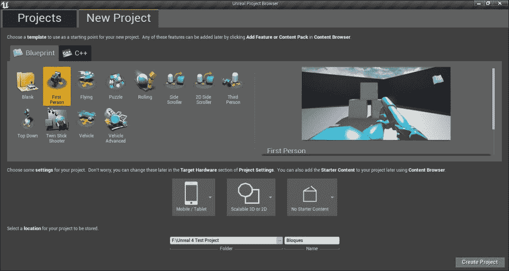

接下来，只需点击**创建项目**。我们现在已经建立了我们的项目。编辑器打开后，您将看到已经设置好的测试级别。测试级别只是展示您选择的模板提供的基本功能和机制。在**第一人称**模板中，玩家将能够移动、跳跃和射击。另一个很棒的功能是，当你选择**移动/平板**作为你的目标硬件时，UE4 会自动提供两个虚拟游戏垫，一个用于移动，另一个用于寻找。这使得在控件中编写脚本变得非常容易。

然而，我们不想在这个示例地图上工作。我们想绘制一张新地图。只需点击**文件**打开菜单，点击**新等级**。点击打开**新等级**窗口，提供**默认**和**清空**两种等级。一个**默认等级**有非常基本的组件，比如一个天箱和一个已经设置好的玩家启动演员。

**空级**不过，顾名思义，包含的东西绝对没有设置。如果你想让你的游戏从头开始，你应该选择**空级**。因为我们的游戏将在室内进行，所以我们并不真的需要一个 skybox。因此，选择**空级**。我们现在已经建立了我们的水平，我们将使我们的游戏。让我们把这个等级保存为`Bloques_Game`。您的**视口**现在将如下所示:

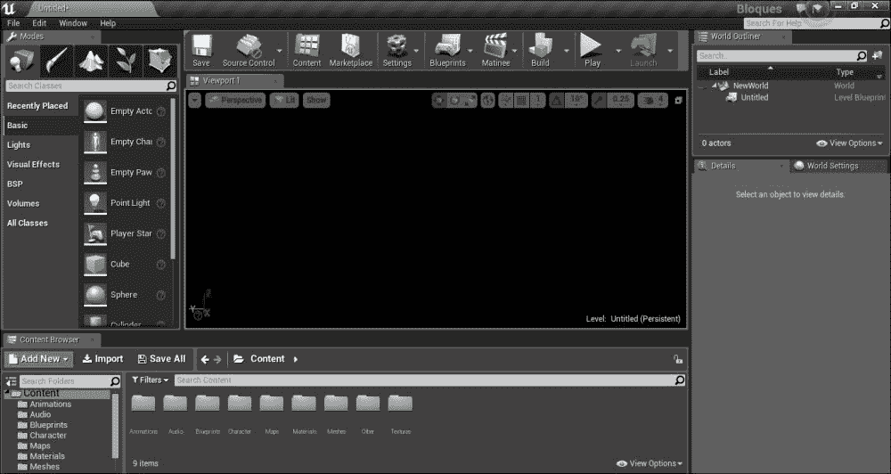

# BSP 刷子

我们首先需要做的是建立我们的关卡。我们将在 BSP 画笔的帮助下做到这一点。我们在第二章中简单讨论了 BSP 画笔，但是现在我们将更详细地讨论它们。BSP 笔刷为您的级别创建体积和表面。它提供了一种快速简单的方法来屏蔽你的关卡和制作快速原型。你甚至可以使用 BSP 笔刷创建整个关卡。如果您无法访问三维建模软件(如 Maya 或 3DS Max)来为您的标高创建素材(如墙、天花板等)，则可以使用 BSP 笔刷来创建标高。BSP 画笔可以在**模式**面板中选择，在**放置模式**中选择。

## 默认 BSP 笔刷形状

如前一章所述，UE4 提供的默认刷共有七把。以下是画笔创建的几何图形的屏幕截图:

从左到右，您有:

*   **方块笔刷**:这个创建了一个立方体形状的笔刷。您可以设置盒子的长度、宽度和高度。您还可以设置是否希望立方体是空心的。如果是这样，您可以选择设置墙的厚度。
*   **球形笔刷**:这个创建了一个球形笔刷。您可以设置镶嵌次数。增加镶嵌的数量将使它更平滑，更像一个合适的球体。但是，请记住，增加镶嵌会增加曲面的数量，因此需要更多内存来渲染。记住这一点和移动设备的技术限制，最好是低多边形几何图形具有良好的纹理，而不是高多边形几何图形具有不好的纹理。
*   **圆柱画笔**:这将创建一个圆柱画笔。您可以设置它的半径和高度。您也可以增加或减少边数。与球体笔刷一样，增加边的数量会增加沿长度方向的表面数量，使其更平滑，但需要更多内存来渲染。
*   **锥形笔刷**:这个创建了一个锥形笔刷。您可以设置属性，如高度和底部半径。您也可以设定笔刷中的曲面数量。
*   **线性楼梯刷**:这个可以让你创建线性或者直线楼梯。您可以在引擎本身中创建楼梯，而不必在您的标高中建模、展开和导入楼梯。您可以设置属性，如每一步的长度、宽度和高度、步数以及第一步下方的距离。
*   **曲线楼梯刷**:你也可以使用曲线楼梯刷创建曲线楼梯。您可以设置诸如曲线的内半径、曲线的角度(曲线的角度意味着楼梯将弯曲多少。您可以将其设置为 0 到 360 度之间的任何值)、步数和第一步下方的距离。最后，还可以设置楼梯是顺时针弯曲还是逆时针弯曲。
*   **螺旋楼梯刷**:最后我们有了螺旋楼梯刷。螺旋楼梯和弯曲楼梯的区别在于，螺旋楼梯可以重复缠绕自身，而弯曲楼梯则不能。您可以设置内半径、每个台阶的宽度、高度和厚度、台阶数以及一个完整螺旋的台阶数。最后，您还可以设置选项，例如您希望楼梯的底面和/或表面是倾斜的还是阶梯状的，以及您希望螺旋是顺时针还是逆时针。

通过**放置** / **BSP** 下的**模式**面板，上述笔刷类型可用于创建几何图形。当笔刷添加到您的级别并用于创建几何图形时，添加笔刷类型将添加几何图形。减法笔刷类型将移除任何与加法几何体重叠的几何体。

除了这些设置，您还可以设置几何图形的每个表面的属性，例如平移、旋转、翻转和缩放 *U* 和/或 *V* 坐标。当你对它们应用材质时，你可以看到它们的效果。

最后，您还可以选择使用画笔创建卷，如触发卷、阻塞卷、引起疼痛的卷等。

## 编辑 BSP 笔刷

比方说，你想要使用 BSP 笔刷创建几何图形，但是你需要的形状不是七个默认形状之一。在这种情况下，您可以使用**几何编辑**模式创建自己的笔刷。它位于**模式**面板的最右侧。点击切换到**几何编辑**模式。

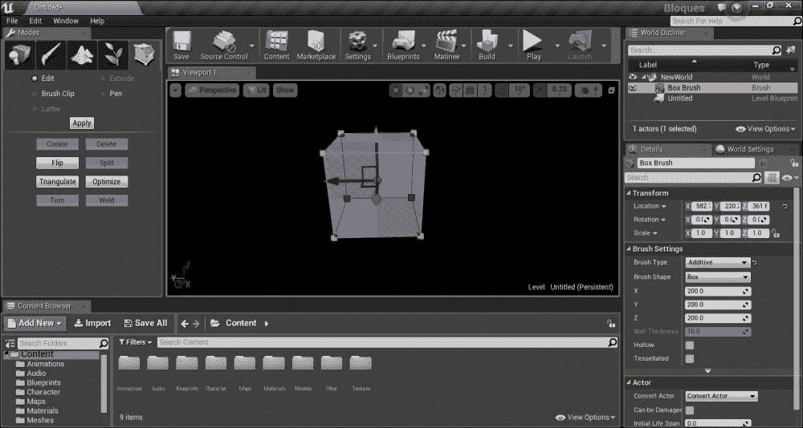

在前面的截图中，您可以看到当您切换到几何编辑模式时，几何中的所有顶点、面和边。您可能还注意到顶点的大小增加了。在此模式下，您可以选择整个笔刷、面、顶点或几何图形的边。

在模式面板中，可以看到**创建**、**删除**、**翻转**等多个操作。有些你可以表演，有些你不能。您可以执行和不可以执行的操作取决于您选择的内容(例如顶点、边或面)。

# 用 BSP 刷子把房间隔开

我们现在将为我们的游戏设计环境。建造四个房间并把它们封锁起来，这样玩家就必须在一个房间里解谜才能进入下一个房间。

## 第一个房间

第一个房间会相对简单。这个房间将是长方体。因为这是玩家开始的地方，他/她将被介绍到这个房间里的机械装置，比如移动，看，拿起和放置物体。玩家只需拿起钥匙方块，放在底座上就可以开门了。玩家也会通过这个简单的任务，知道每个房间的主要目标。

让我们从做地板开始。我们将使用**盒刷**。要添加**方块画笔**，只需在 **BSP** 下的**模式**面板中点击**方块**，并将其拖动到**视口**中。在**细节**面板中，将画笔的尺寸设置为`2048 x 2048 x 64`。我们希望这个房间相对较小，因为拼图很简单，并且避免不必要的行走，因为玩家可能会感到无聊。

之后，让我们现在做墙壁。同样，我们将使用 Box BSP 笔刷来制作它们。将尺寸设置为`2048 x 64 x 1024`。制作一面墙后，只需点击并按住 *Alt* 键，移动墙以创建一个副本，可以将其放置在房间的另一侧。

### 注

使用 BSP 画笔时，将查看模式切换到**不亮**。否则，您将无法看到表面，并且必须在每次引入表面时构建照明。

对于相邻边的墙，我们将尺寸设置为`64 x 2048 x 1024`。同样，与另一面墙一样，只需复制 BSP 笔刷，并将其移动到房间的远侧。

最后，对于天花板，只需复制地板并将拖到墙的顶部。

### 注

为了防止光出血和其他有关照明和渲染的并发症，请确保任何画笔之间没有间隙。切换到**顶视图**、**侧视图**或**前视图**以确保所有墙壁和天花板完美对齐。

这个房间现在需要的是一个门洞。否则，玩家将被困在第一个房间，无法前进到下一个房间。我们将在减法 BSP 画笔的帮助下这样做。

要创建减色法笔刷，将**方块笔刷**拖到关卡上，在**细节**面板中，将**笔刷类型**设置为**减色法**。将该尺寸设置为`64 x 256 x 256`。将减色法画笔放在房间短边的任何一面墙上。

最后让我们在门边增加一个基座，玩家要在这里放置钥匙立方体才能开门。

这样，我们现在已经封锁了第一个房间。让我们继续下一个。

## 第二个房间

在第二个房间，我们将为玩家增加一点挑战。一进第二个房间，中间会有一扇大门。玩家可以通过在屏幕上触摸开门。然而，只要他/她抬起手指或移开手指，门就会关上。玩家右边将是关键立方体；然而，它被困住了。为了让玩家解锁钥匙立方体，他/她将必须经过门，取回另一个立方体，将其放置在门附近的平台上，以解锁钥匙立方体，将其放置在基座上，并前进到下一个房间。

在第一个房间中，我们已经分别创建了每个表面(墙壁、地板和天花板)。我们可以用另一种方法来创建我们的第二个房间。为此，我们将使用笔刷细节面板中的**空心**属性。

说完后，选择**方块笔刷**，将其拖到场景中。接下来，将其尺寸设置为`2048 x 1544 x 1024`，并将其放置在第一个房间的正旁边(记得将其放置在有门的墙旁边)。将其定位如下图所示:

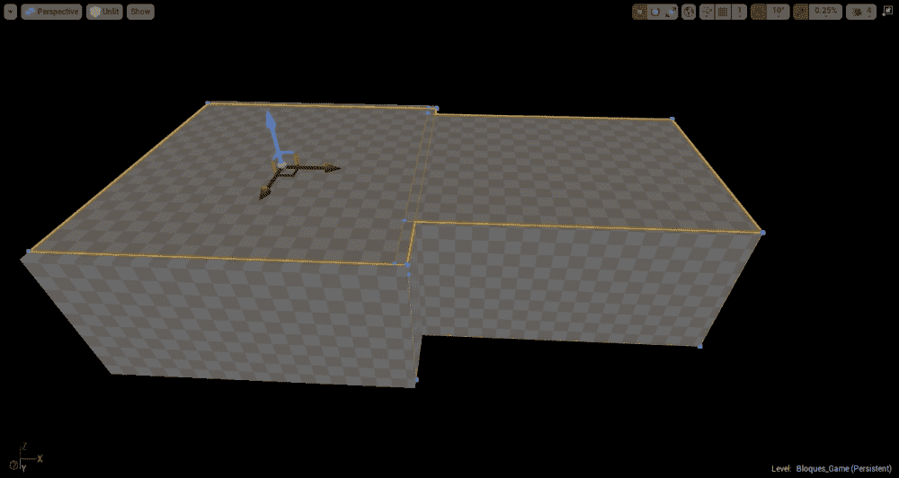

定位后，选择笔刷，进入**细节**面板，勾选**空心**。一旦勾选，新的设置就可用了，**壁厚**。将其值设置为 **128** (确保我们在上一个房间中用于门的减法笔刷与两面墙重叠；否则，您将无法看到门)。

就是这样！我们的第二个房间被封锁了，而 T2 不必花费大量的时间放置房间的每个部分，并确保它们正确对齐。唯一要放的东西是基座和通向第三个房间的门的洞。对于门，只需像我们对第一个房间所做的那样，创建一个尺寸为`64 x 256 x 256`的减法画笔，并将其放置在房间的另一侧。或者，复制第一个房间的减法笔刷，然后将其副本移动到房间的另一侧。

最后，为了完成工作，我们将在这个房间里增加两个基座。一个基座将靠近房间的中间，那就是大门。玩家必须将第一个钥匙立方体放在这个底座上才能解锁第二个钥匙立方体。

第二个基座在房间的另一边，玩家必须在那里放置钥匙立方体来打开门，然后进入第三个房间。

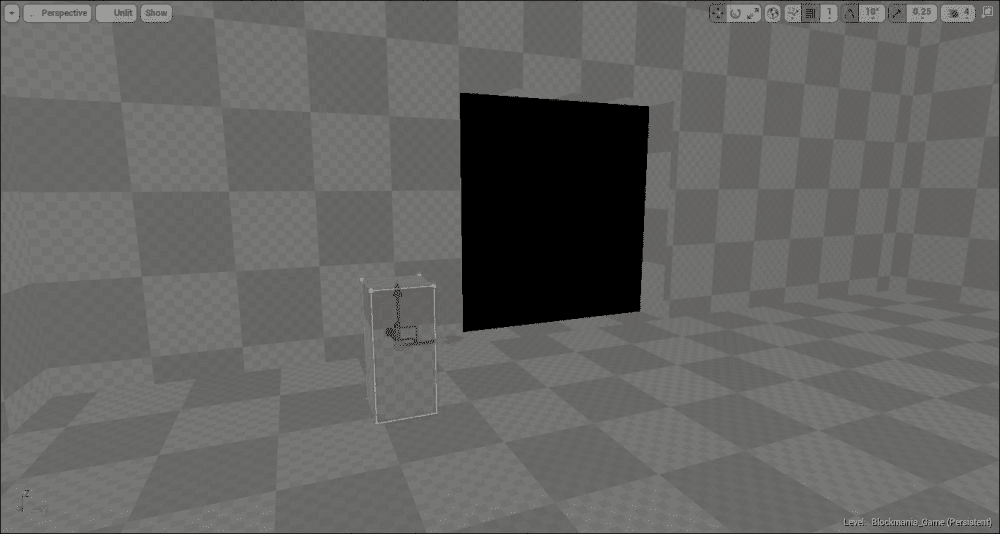

这样，我们就把第二个房间封锁好了。现在让我们进入第三个问题，事情开始变得有趣。

### 注

请记住继续保存，以便在发动机突然崩溃或出现任何其他技术问题时，您不会丢失您的工作。要保存，只需点击 *Ctrl* + *S* ，或点击**视口**工具栏上的**保存**按钮。

## 第三个房间

到现在为止，玩家已经理解了游戏中的基本机制和控制。现在让我们在第三个房间给他/她一个更大的挑战。进入第三个房间时，玩家和最终房间的门之间会有一个坑。为了让玩家能够穿越这个坑，他/她需要一座桥。

为了画出桥，玩家必须将人工智能控制的物体指向一个开关。该对象将沿着一条路径移动。然而，部分位丢失。玩家可以借助放置在关卡中的开关来填补空白。在这里，挑战在于确定按下哪个开关以及何时按下它。它也依赖于适当的时机。物体到达目的地后，会画出一座桥，玩家可以通过这座桥穿越，抓住钥匙立方体，打开门，进入下一关。

建坑有两种方式；第一种方法是把房间分成两部分。第一部分在坑的一边，第二部分在另一边。制作好两部分后，建造坑，最后放置。然而，这是一种糟糕且耗时的建造房间和坑的方式。我们还会有额外的表面，这意味着渲染关卡时会占用更多的内存。此外，您还必须煞费苦心地将所有零件正确对齐，以确保没有间隙。

第二种方法，我们将改为使用，是我们将创建整个房间，并在减法画笔的帮助下，雕刻出坑。这样，我们就不必担心额外的面对齐房间的部分，我们也可以通过移动和/或编辑减法画笔来轻松设置坑的尺寸。

像往常一样，让我们从做地板开始。现在，既然我们要挖坑，地板将比其他房间有更多的高度。选择**盒刷**，将其尺寸设置为`4096 x 2048 x 512`。这将是主要领域，也是谜题所在。

由于这个房间比前几个房间高，我们需要一些楼梯，以便玩家可以到达第三个房间。首先，添加一个小**盒刷**，将其尺寸设置为`512 x 1544 x 64`，并将其放置在前一个房间的门附近。

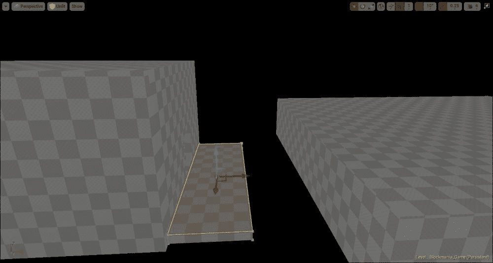

要添加楼梯，请将**线性楼梯刷**从**模式**面板拖到楼层上。将楼梯宽度设置为`1544`，步数设置为`23`。将楼梯放置在我们之前放置的**框** **刷**的边缘；最后取第三个房间的楼层，放在楼梯旁边。

为了增加坑，我们需要一个盒子减法刷。选择减色法笔刷的另一种方法是首先选择笔刷的形状，在这种情况下是**框笔刷**，然后在底部的**模式**面板中，您可以将笔刷类型设置为加法或减法。只需选择减法并拖动画笔到水平。

我们必须确保这个坑足够宽，这样玩家就不能跳过它，足够深，这样玩家就不能在掉进坑里的时候跳出来。记住这一点，将画笔的尺寸设置为`640 x 2304 x 512`。将坑放在房间另一端附近。

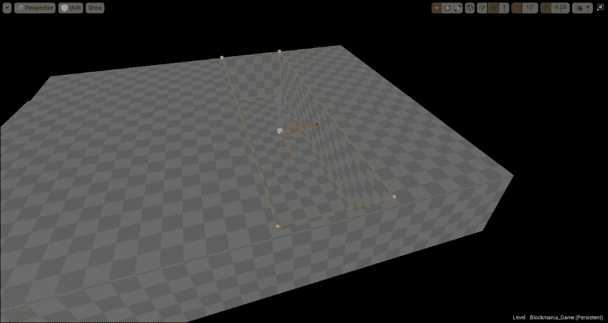

我们现在有来放置墙壁。我们将在几步之内给这个房间加墙。首先，选择一个长方体笔刷，将其尺寸设置为`4096 x 64 x 512`，并沿着房间的长边放置。复制并在另一侧放置第二面墙。

接下来，我们需要沿着通往第三个房间的楼梯和走廊放置一些墙壁。为此，将的尺寸设置为`1202 x 64 x 1024` ，并将其放置在楼梯的两侧，确保所有尺寸正确对齐，刷子之间没有间隙。

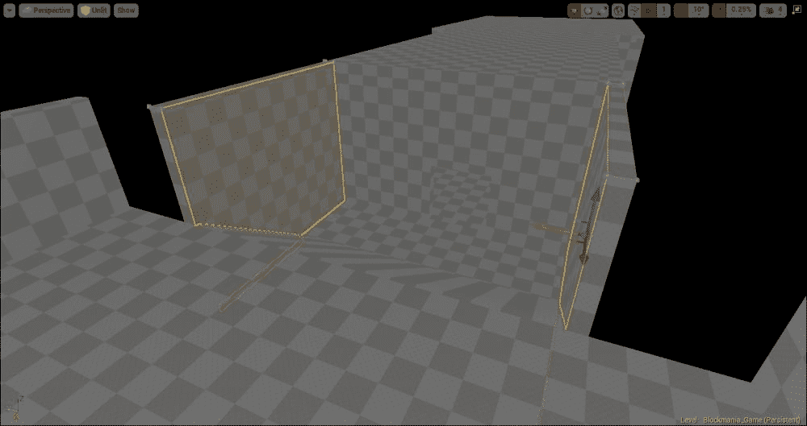

在前面的截图中，你可能已经注意到走廊的墙壁和房间较长一侧的墙壁之间有一个间隙。让我们用一个尺寸为`64 x 188 x 512`的方块笔刷来填充它。放两个，一边一个，来填补空白。

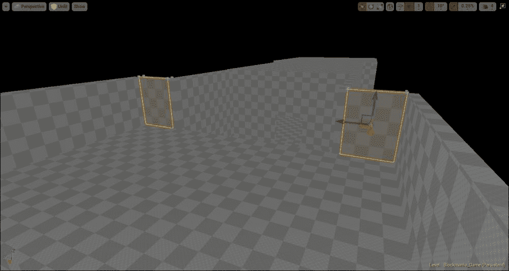

最后，我们要放置的墙在房间的较远的一侧，沿着较短的一侧。将**箱刷**的尺寸设置为`64 x 2048 x 512`，用减法刷将最后一面墙放置在门上。

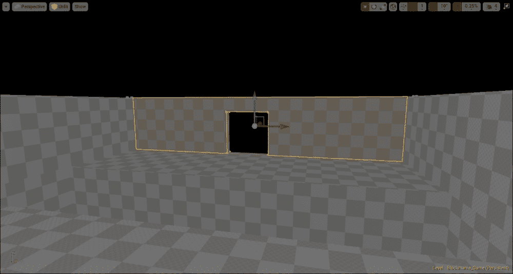

走廊的天花板尺寸为`1202 x 1544 x 64`，房间的天花板尺寸为`4096 x 2056 x 64`。

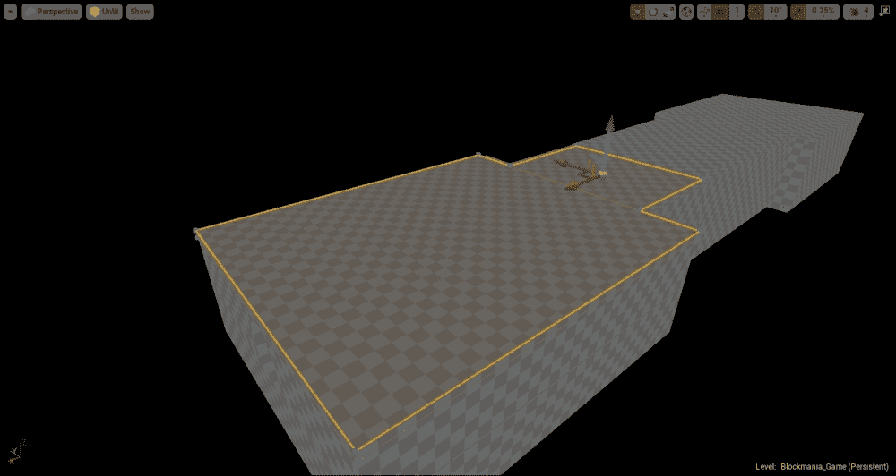

现在我们已经封锁了房间，在我们进入第四个也是最后一个房间之前，我们需要再增加一些的东西。首先，我们将放置一些面板，上面有开关，玩家可以按下开关来引导物体穿过坑。只需复制前几个房间的基座，并把它们放在这个房间来制作面板。将它们放在任何一面较长的墙附近，并以玩家可以看到另一面墙的方式放置它们。

最后，在门边放一个底座。这样，我们就完成了第三个房间的封锁。现在，让我们封锁第四个也是最后一个房间。

## 第四个房间

我们只有一个房间可以封锁了。在前三个房间，我们有不同的困惑和目标。在第四个房间里，我们要把前一个房间的所有谜题组合起来。在这个房间里，玩家的目标与前一个房间类似，引导一个 AI 控制的物体穿过门和坑等障碍物，朝向房间的另一边。物体将沿着预先定义的路径行进，并一直移动，直到到达目标。如果它撞到门上或掉进坑里，它会从起始位置复位。

由于我们将有坑，房间的高度将与以前的相似。而且，这将是最大的房间。记住这一点，我们将选择尺寸为`5120 x 2048 x 512`的**方块笔刷**来制作地板。

现在有了地板，我们要做一些坑。再次，选择减法模式，创建尺寸为`728 x 1928 x 512`的**方块笔刷**，并将其放置在门附近。在这个房间里，我们将有三个坑，所以通过按住 *Alt* 键复制减色法笔刷，并创建两个副本并沿着地图放置它们。

接下来，是墙。对于较长的一面，只需复制第三个房间的墙壁。在**详情**面板中，将 *X* 的值设置为`5120`，简单放置墙壁即可。复制并放置另一面墙。对于较短的一面，你可以做同样的事情——复制并在房间的另一端放置较短的一面墙(带门的那面)。

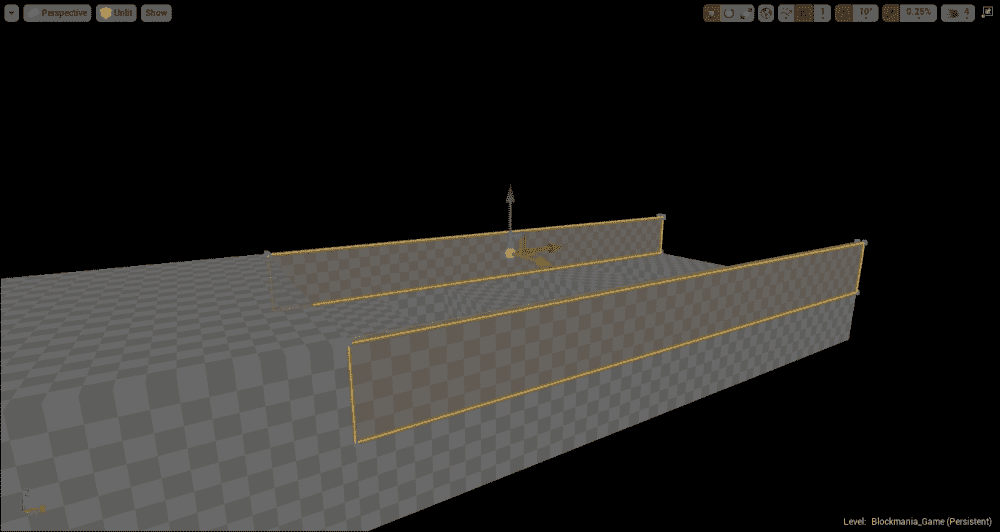

接下来，复制，将笔刷的 *Z* 值设置为`64`，向上拖动形成屋顶。

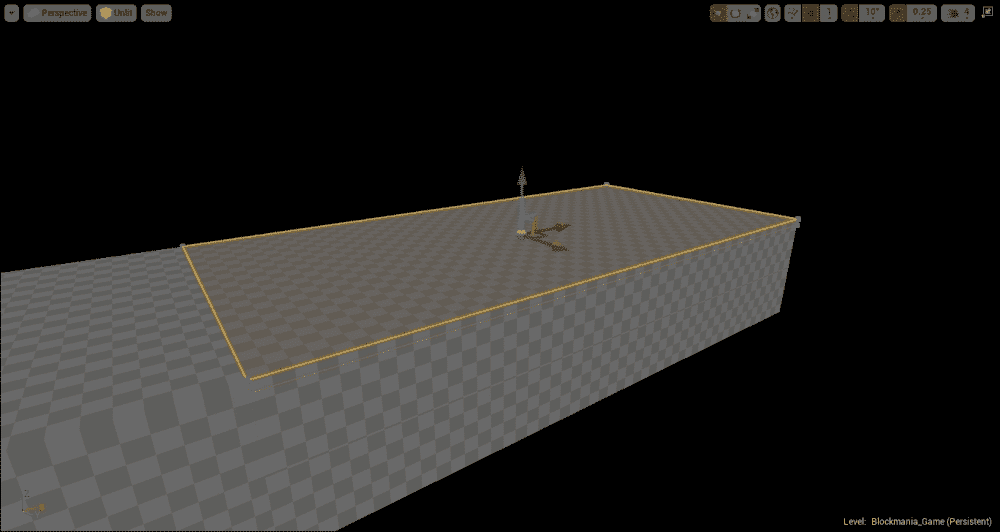

最后，我们将在开关所在的位置放置几个基座。

至此，我们已经封锁了最后一个房间！

现在我们已经封锁了我们的房间，让我们放置一些素材，创建材质，并将它们应用到我们的级别。

# 内容浏览器

在上一章讨论编辑器的用户界面时，我们简要讨论了 **内容浏览器**。让我们再多说一点。**内容浏览器**是存储和显示项目所有素材的地方。这些素材包括**网格**、**纹理**、**材质**、**骨骼网格**、**蓝图**、**贴图文件**、**音频文件**等等。

在前面的截图中，您可以看到不同的文件夹，根据每个文件夹中包含的内容进行命名。这被认为是一种很好的做法，也可以防止以后出现混乱，如果您的项目有很多素材，您可以根据它们的类型来组织您的素材。

## 迁移和导入素材

当创建一个游戏时，你需要的主要东西是素材，因为没有它们，你的游戏将只是一张空白地图。您可能希望在项目中导入为游戏创建的素材。为此，您需要先将它们导入到项目文件中，然后才能使用它们。目前，UE4 接受以下素材:

*   **纹理文件**:这些是 2D 图像，可以导入为`.jpg`、`.png`、`.bmp`、`.tga`文件。
*   **静态网格/骨骼网格**:静态网格是使用 3D 软件创建的 3D 对象，例如玛雅、 Max、Blender 等。骨骼网格是一种可以设置动画的网格。可以作为`.obj`文件导入，也可以作为`.fbx`文件导入。
*   **音频文件**:您可以将音乐、音效、对话等音频文件(单声道)导入为`.wav`文件。您也可以导入具有多个通道(立体声)的音频文件。
*   **脚本文件**:也可以将脚本文件导入 UE4 作为`.lua`文件。
*   **IES 灯光配置文件** : IES 灯光配置文件文件定义了弧中的光强。这通常用于使光线看起来更逼真。这些也可以作为`.ies`文件导入到 UE4 中。
*   **立方体贴图纹理**:立方体贴图纹理作为`.hdr`文件导入。这些文件用于绘制环境地图，尤其是当你的游戏有户外场景时。这些文件包含一个范围内的颜色和亮度信息。
*   **真型字体**:你也可以为你的游戏导入各种类型的字体。字体用于 hud、UI 等，可以作为`.ttf`文件导入。

### 导入素材

有两种方法可以导入您在项目文件中为游戏创建的素材。

### 注

为了演示如何导入资源，在 Maya 中创建了一个简单的球体，并将其导出为 FBX 文件。

第一种方式是通过**内容浏览器**:

1.  Click on the **Import** button located at the top of the **Content Browser**.

    

2.  Once clicked, a window will open asking you which asset to import. Simply search where your asset is located, highlight it, and click on **Open**.

    

3.  When you click on **Open**, the **Import Options** window will open up, which has different import options, depending upon the type of asset you have imported. Once satisfied with the import settings, click on **Import** and the asset will be imported to your project file.

    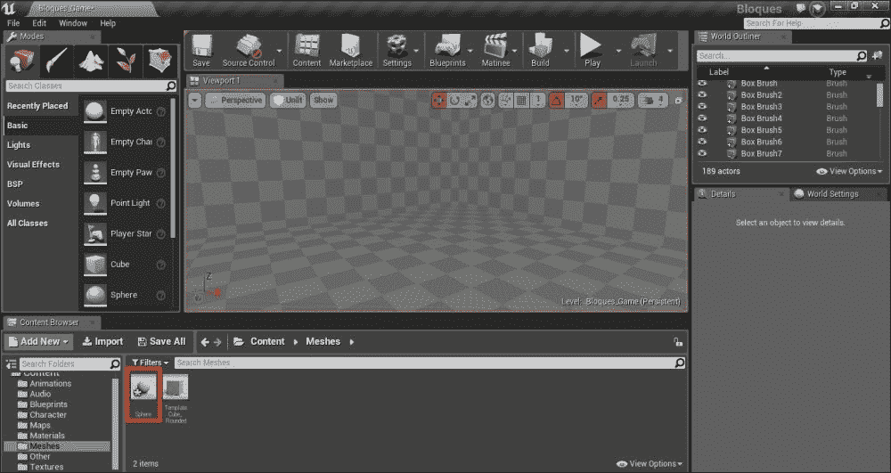

将素材导入项目的第二种方法是简单地拖动您想要导入的素材，并将其放入您的**内容浏览器**中。要做到这一点，只需点击并从存储素材的地方拖动素材，并在**内容浏览器**上释放鼠标左键。当您松开鼠标左键时，将打开**导入选项**窗口，类似于第一种方法中提到的窗口。再次，一旦对设置满意，点击**导入**上的，素材将被导入。

### 迁移素材

有时，您可能需要来自不同项目文件的某些素材。在这种情况下，前面提到的关于导入素材的方法将不起作用，因为项目的内容将作为`.uasset`文件或`.umap`文件保存在您的系统中。因此，UE4 将无法导入它们。因此，您必须执行**迁移素材**操作。

当我们创建项目时，我们选择**无起始内容**，因为我们不需要所有的内容。这会占用不必要的空间。然而，我们确实需要一些素材，尤其是墙壁和地板材质。为了演示这一点，已经建立了一个包含所有初始内容的新项目。

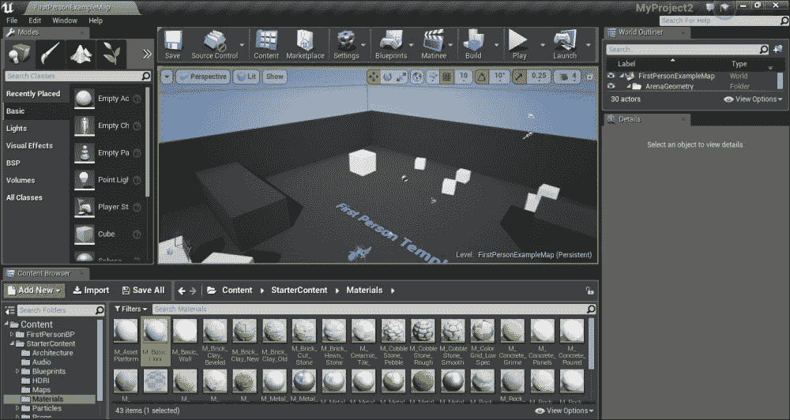

这是一个包含所有入门内容的项目。我们需要的是两种材质，即 **M_Basic_Floor** 和 **M_Basic_Wall** 。迁移这两种材质并遵循以下步骤:

1.  突出显示 **M_Basic_Floor** 和 **M_Basic_Wall** 并右键单击打开菜单。在菜单中，将光标悬停在**素材操作**上，然后单击**迁移**。
2.  After you have clicked on it, a window will open up telling you that the following asset(s) will be migrated to another project.

    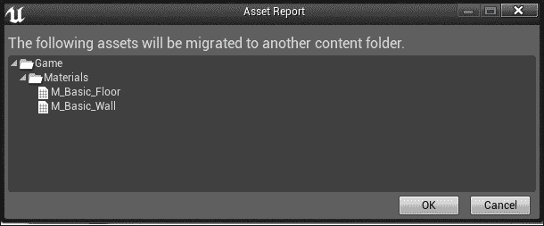

3.  一旦你点击 **确定**，另一个窗口将会打开，询问你要将素材移动到哪里。您可能希望将它们存储在项目的`Content`文件夹中。打开后，找到您的项目文件夹(如果您记得的话，它在`My Documents`中)，并将其存储在 **Content** 子文件夹中。
4.  点击后会出现提示说**素材已经成功迁移**。

如果您现在返回到区块狂热项目，您将看到 **M_Basic_Floor** 和 **M_Basic_Wall** 显示在**内容浏览器**的**材质**子文件夹中。

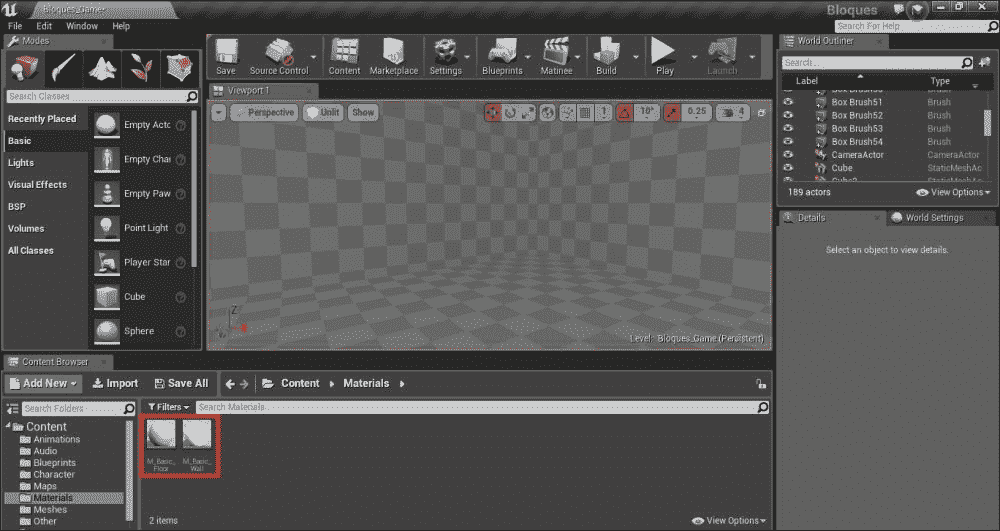

# 放置演员

一旦你在**内容浏览器**中拥有了你所有的素材，下一步就是将它们放入你的游戏中。我们将使用**内容浏览器**中的立方体网格在我们的游戏中创建对象，例如关键立方体、人工智能控制的对象、门等等。

首先，让我们让门打开，当你把钥匙立方体放在基座上。只需从**内容浏览器**中拖动**模板立方体 _ 圆角**静态网格，并将其放置在门应该去的孔中。使用缩放工具设置其尺寸，使其完全适合。

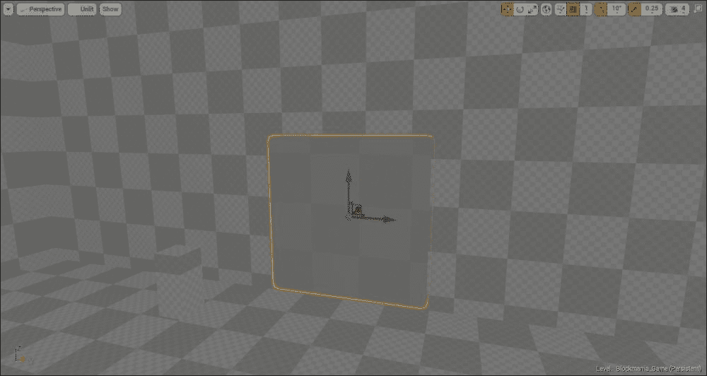

为了让事情更简单方便，可以在**详情**面板中将立方体的名称改为`Door01`。对于门的其余部分，由于孔的尺寸是相同的，您可以简单地复制这个演员并放置副本。最后，由于这些在游戏中是移动的而不是静止的，将其移动类型设置为**可移动**。

### 类型

使用不同的视角来设置尺寸并将门与孔对齐。

接下来，让我们把玩家会遇到的大门放在房间的中间。再次，从**内容浏览器**中取出**模板立方体 _ 圆角**演员，并将其放在第二个房间。设置它的尺寸，以便它阻止角色移动到房间的另一边。命名这个`Room_Door01`。同样，复制并放在第四个房间，壁架在那里。但是，您必须修改进入第四个房间的门的尺寸，因为第四个房间的尺寸与第二个房间的尺寸略有不同。

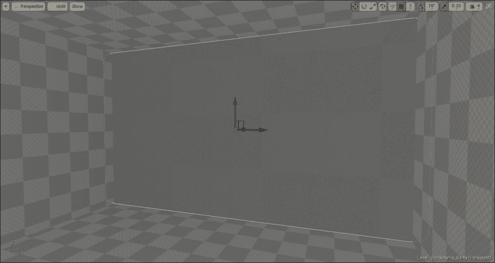

接下来我们要放置钥匙立方体，玩家要收集放置才能进行到下一个房间，或者解锁其他钥匙立方体。我们将再次使用**模板立方体 _ 圆形**。沿所有三个坐标将其刻度设置为`0.15`，并将其放置在我们的水平线上。以下是四个房间中钥匙立方体放置位置的简要介绍:

*   **第一个房间**:在第一个房间，我们只需要一个钥匙立方体。你可以把它放在房间中央附近的任何地方。
*   **第二个房间**:在第二个房间，我们需要两个钥匙立方体。将第一个立方体放在大门的一侧，将第二个立方体放在另一侧。第一个立方体是锁定的，第二个立方体是玩家必须放在基座上才能解锁的。
*   **第三个房间**:在第三个房间中，我们将只需要一个钥匙立方体，AI 对象在击中目标时会解锁。所以，把它放在坑的另一边，靠近通向第四个房间的门。
*   **第四个房间**:在第四个房间，把钥匙方块放在房间的另一边。一旦人工智能对象击中目标，这也将被解锁。

我们已经在游戏中放置了所有的基本素材。让我们在关卡中添加一些装饰立方体。由于装饰素材将保持静止，而不是在游戏中移动，所以您应该将其移动性设置为**静态**。只需在地图周围放置立方体，以不同的模式，并按照您认为合适的方式排列它们。

# 材质

在 UE4 中，在对对象应用纹理之前，首先要创建材质。材质是一个对象在游戏中如何被渲染，它是包含许多属性的着色器的集合，这些属性可以应用于对象并在游戏中渲染。用更专业的术语来说，当光源发出的光照射到一个表面或物体上时，材质决定了光将如何与所述表面或物体相互作用(颜色、纹理、表面有多粗糙或光滑、金属感有多强等等)。

UE4 使用*基于物理的着色*。在虚幻引擎的早期版本中，材质具有一些任意属性，如漫射光、自定义照明漫射等。在 UE4 中，材质具有更相关的属性，如基色、金属性、粗糙度等，使过程更容易理解。

材质是在所谓的材质编辑器中创建的。所以，在我们开始创建自己的材质之前，让我们先来谈谈它和它的用户界面。

## 材质编辑器

材质编辑器是一个简单但非常强大的工具，您可以使用它为对象创建材质。例如，可以将纹理文件应用到材质的漫射通道，然后在资源上使用它。对于我们的游戏，我们将从头开始创建自己的素材。要访问材质编辑器，首先需要创建新材质，或者双击现有材质。要创建新材质，点击位于**内容浏览器**左上角的**添加新的**按钮，选择**材质**，该材质将位于**创建基本素材**部分。一旦完成，您将看到一个新的材质创建。双击它打开材质编辑器。打开后，您应该会看到此窗口:

我们先来看看编辑器本身及其用户界面。与编辑器一样，我们将把材质编辑器用户界面分成几个部分，并逐个进行检查。

### 选项卡和菜单栏

在顶部，我们有标签和菜单栏。选项卡栏类似于编辑器的选项卡栏。

在标签栏下面，我们有菜单栏。和编辑器中的菜单栏一样，它提供了所有的常规命令和动作。它们描述如下:

*   **文件**:点击此处打开**文件**菜单。在这里，您可以执行一些操作，例如保存您创建的材质，从**内容浏览器**打开资源，等等。
*   **编辑**:这将打开**编辑**菜单。在这里，您可以撤消或重做任何可能执行的操作。您也可以从这里访问编辑器和项目设置。
*   **素材**:从**素材**菜单中，可以在**内容浏览器**中找到正在创建的素材，并打开当前素材的参考查看器窗口。
*   **窗口**:在这个菜单中，你可以在你的材质编辑器窗口中选择你想要的面板，在**图形**面板中搜索特定的节点，访问插件窗口等等。
*   **帮助**:最后，如果你想了解更多关于素材编辑器的知识或者需要找到问题的解决方案，你可以从这里访问维基页面和官方 Epic 文档。

### 工具栏

再次将与编辑器中的工具栏进行比较，这里的工具栏显示了您在制作素材时可能执行的所有最常用的操作。

*   **保存**:从左边开始，以软盘为代表，是**保存**按钮。这是为了保存您对材质所做的任何修改。
*   **在 CB** 中查找:**在 CB** 中查找(或内容浏览器)，由放大镜描绘，在**内容浏览器**中定位并高亮显示您在材质编辑器中打开的当前材质。
*   **应用**:接下来，我们有**应用**按钮。如果你已经将当前素材应用到游戏中的一个对象，一旦你对其进行了任何修改，点击**应用**将更新当前场景中的素材。
*   **搜索**:需要找节点或者连接吗？您可以通过点击**搜索**并输入您想要的任何内容来实现。当你点击它时，在材质编辑器的底部会打开**搜索**面板。只需输入您想要查找的内容，它就会在面板中显示结果。
*   **主页**:**主页**按钮将图形面板重新聚焦到材质输入描述(您在材质编辑器中首先看到的节点，包含所有这些输入)。当您创建一个非常复杂的材质时，这非常有用，因为您将有许多节点相互连接，并且可能看不到材质描述。
*   **清理**:**清理**按钮删除任何未连接到物料输入的节点。这非常方便，因为即使是未连接的节点也会使材质在内存使用方面变得不必要的繁重。
*   **连接器**:默认情况下，这是打开的。关闭时，任何未使用的输入或输出引脚(未连接到任何设备的引脚)都会被隐藏。这是保持工作空间整洁有序的好方法，因为它消除了视图中的混乱。
*   **直播预览**:这个也是默认开启的。启用后，您对材质所做的任何修改都会在**视口**面板中实时更新。
*   **活节点**:启用时实时更新各节点的素材。
*   **实时更新**:当打开此选项时，它会实时编译着色器以及所有节点和表达式，并且每当您更改、添加、移除节点或更改参数值时，它都会这样做。
*   **统计**:打开后，可以在材质编辑器底部看到自己创建的材质的统计。这可以让你知道你的材质有多重。
*   **移动统计**:这个类似于**统计**，但是给你移动设备的材质统计和任何错误。

### 调色板面板

调色板面板包含所有可以在材质编辑器中使用的节点。

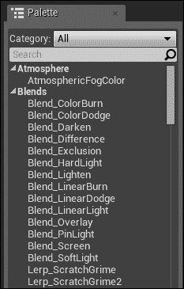

这里明确列出了所有的函数、表达式等等。您在顶部有一个类别，您可以使用它来过滤您想要显示的节点类型。

如果您希望找到一个特定的节点，您可以在位于**类别**栏下方的**搜索**栏中进行搜索。

### 统计面板

如前所述，**面板显示所有关于你创建的材质的统计数据。**

 **

如果你打开了工具栏中的**移动统计**，你也会看到这里显示的移动设备的统计。这基本上显示了材质中有多少指令和着色器。这会让你知道你的材质有多大，有多重。

### 详细信息面板

**详细信息**面板显示材质的一般属性，例如**材质域**，这意味着您想要创建什么类型的材质。

正常的材质，比如你套用到演员身上的，都是**面**材质。如果你希望你的材质是**贴花**(我们将在下一章讨论)，你可以切换到**贴花**等等。

您也可以在该面板中设置您选择的任何节点的属性。

### 视口面板

在**视口**面板中，您可以预览正在创建的材质。如果**实时预览**选项已启用，您所做的任何修改都将实时更新并在此预览。

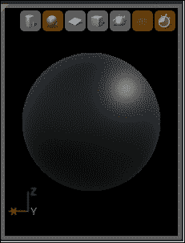

默认情况下，形状图元是一个球体。您可以使用“视口面板”顶部的按钮从材质编辑器切换到圆柱体、平面、立方体或特定网格。您也可以打开/关闭网格，也可以从这里打开/关闭实时预览。

### 图形面板

材质编辑器用户界面的最后一个元素是图形面板。这是你创作素材的地方。

在我们继续之前，有几个术语和表达你应该知道，因为我们将在本书中大量使用它们。首先，我们有一个叫做节点的东西。一个节点是你连接的任何东西，你可以在蓝图中制作你的素材或脚本。它可以是变量、表达式等等。在前面的截图中，这里的节点是您看到的长面板。

现在，每个节点要么有输入，要么有输出，要么两者都有。输入是节点接受的任何值或表达式，位于节点的左侧，为白色引脚。回到上面的截图，该节点接受相当多的输入，每个输入对应于材质的不同属性。

输出引脚是节点返回的内容(值、表达式等)，也由白色圆形引脚表示。它们位于节点的右侧。当连接到两个或多个节点时，您可以将第一个节点的输出引脚连接到第二个节点的输入引脚，以此类推，从而创建节点链。

在前面的截图中，您可以看到一个有大量输入的长节点。这是材质输入。每个输入对材质有不同的影响。您可能还注意到一些输入是白色的，而其余的是黑色的。变暗的节点是当前被禁用且无法使用的节点。启用和禁用哪个输入取决于材质的**混合模式**，可在**详细信息**面板中找到和更改。例如，看截图，**不透明度**节点当前被禁用。这是因为为材质设置的**混合模式**是**不透明**，所以自然不能设置材质的不透明度。要启用它，您必须将**混合模式**更改为**半透明**。

让我们回顾一下最常用的材质输入:

*   **基础色**:这个跟材质的颜色有关。潜在的颜色是什么。
*   **金属**:这个处理的是你想要你的材质有多少金属光泽。
*   **镜面**:如果你想让你的材质光滑有光泽，这是给你的节点。这涉及到有多少光被材质反射。
*   **粗糙度**:与**镜面**相反，如果你想要你的材质不光滑或者凹凸不平，这个输入就是你需要的。
*   **发射色**:如果你想让你的素材发光，你可以在这里设置，在发射色输入。
*   **不透明度**:这涉及到你希望你的对象有多半透明。

还有其他输入，但这些是您现在应该知道的主要输入。

## 涂抹材质

将材质应用到对象上有两种方式。第一种应用材质的方法简单明了。让我们使用第一种方法来应用地板材质。我们将应用 **M_Basic_Floor** 。要应用材质:

1.  从内容浏览器中选择`M_Basic_Floor`。
2.  将其拖到地板表面。
3.  Release the left-mouse button, and the material will be applied to the floor.

    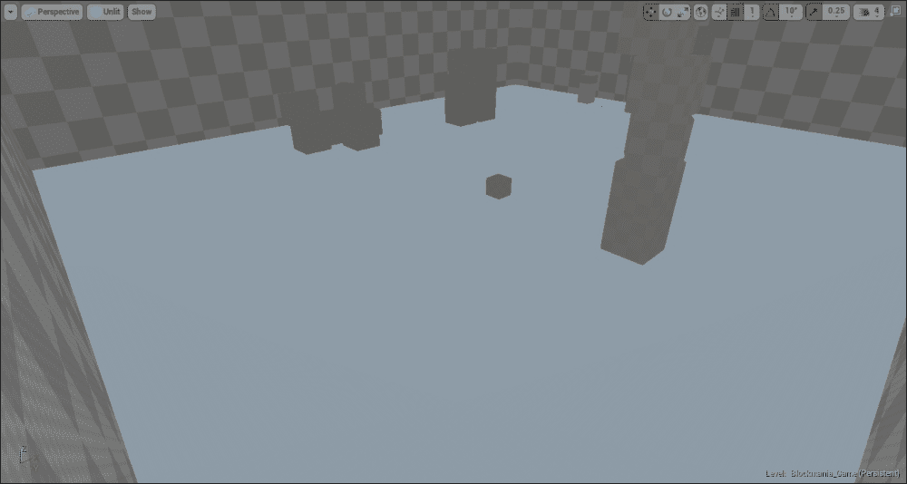

我们将使用第二种方法为墙壁涂抹材质。我们将把`M_Basic_Wall`应用到我们的墙壁上。为此，请遵循以下步骤:

1.  选择任意墙面。
2.  在**细节**面板中的**表面材质**部分下，你会看到一个叫做**元素 0** 的东西。旁边会有一个写着**无**的菜单按钮。
3.  Open the menu. You will see all of the materials in the Content Browser listed out. Simply select **M_Basic_Wall** from the list, and the material will be applied to the wall.

    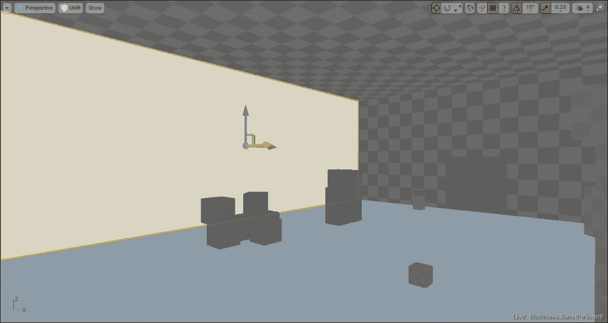

使用两种方法中的任何一种，将材质应用于游戏中的所有墙壁和地板。

## 创建材质

现在我们已经覆盖了材质编辑器的用户界面，并看到了如何将它们应用到对象上，让我们继续为我们的级别创建材质。

### 基座

首先，我们将为基座创建一个材质，T2 玩家需要在这个材质上放置立方体。我们将创建一个相当简单的材质。我们将创建的基座将是黄色的，会有点闪亮。首先，在**内容浏览器**中创建新素材并命名为`Pedestal_Material1`。然后双击它打开材质编辑器。

我们要做的第一件事是给**基色**输入添加一些东西。我们需要创建的是一个叫做**常量 3 向量**的节点。要创建它，只需从**调色板**面板拖动节点，并将其放置在图形面板中。创建**常量 3 矢量**节点的另一种更快的方法是按住 *3* 并在图形面板中的任何地方左键单击。该节点将在您单击的任何地方形成。一旦形成，将其连接到**基色**输入。您可以将颜色设置为黄色。为此，只需选择**常量 3 矢量**节点，在**细节**面板中，您将看到一个名为**常量**的属性，旁边有一个黑色条。点击黑色条，将打开**颜色选择器**窗口。将颜色设置为黄色，点击**确定**。现在将其连接到基本颜色输入。您将看到“视口”面板随着您所做的更改而更新。

现在我们有了基础色，我们要增加闪耀。对于这个，我们要创建一个**常量**节点。同样，您可以从调色板面板拖动它，或者按住 *1* 并单击图形面板上的任何位置。在细节面板中，将其值设置为`0.5`，然后将其连接到**镜面**输入。您的图形编辑器将如下所示:

现在您已经创建了材质，点击**保存**，然后将其应用于基座。

对于按钮所在的基座，通过右键点击创建**基座 _ 材质 1** 副本，选择**副本**，将其重命名为**基座 _ 材质 2** ，在材质编辑器中，只需将基础颜色更改为蓝色，保存并应用即可。

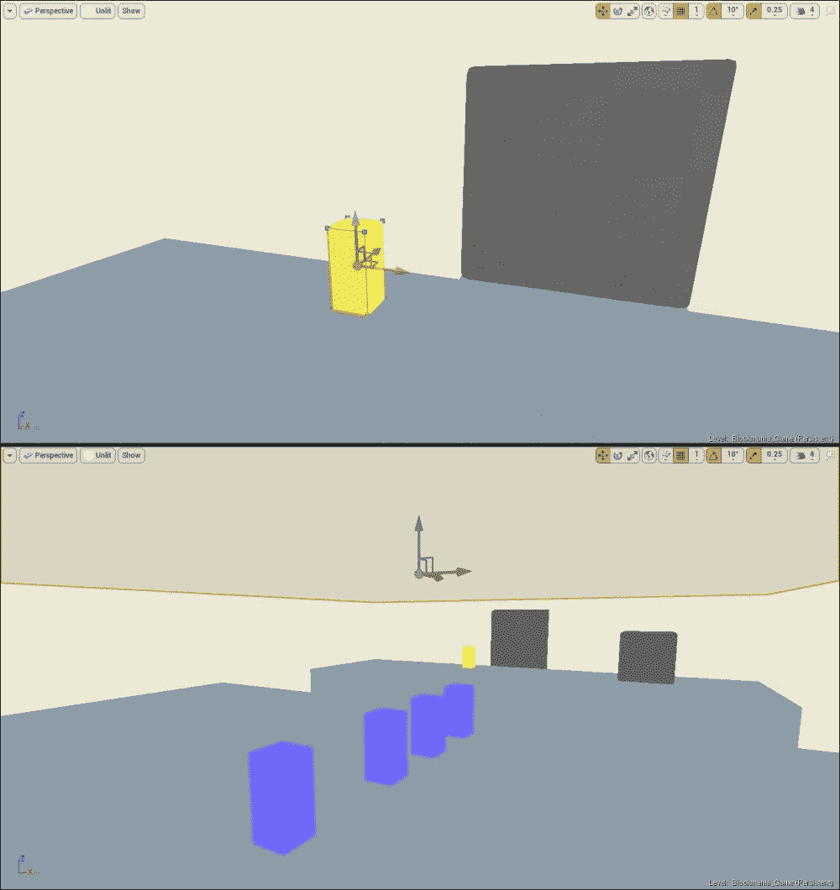

### 门

对于门，我们将做与我们为基座制作材质时几乎相同的事情。唯一不同的是，我们将使门有点透明，并使材质玻璃状。说了这么多，为门创建一个材质，并将其命名为**门 _ 材质**。

在材质编辑器中，首先需要做的是将材质的混合模式设置为**半透明**。之后，创建一个**常量 3 矢量**，选择一个浅蓝色，并将其连接到**基色**输入。

现在，创建三个**常量**节点。将第一个节点的值设置为`1`，并将其连接到**镜面**输入。将**第二个**节点的值设置为`0.5`，并将其连接到**不透明度**输入。我们的玻璃材质现在是半透明的。然而，玻璃还有一个非常基本的特性——折射。折射输入位于输入面板的底部。将第三个**常量**节点的值设置为`0.35`，并连接到**折射**输入。

我们为我们的门创造了一种基本的玻璃材质。保存这个并将其应用到门上。

### 关键立方体

让我们把这套材质变得有趣一点。我们要让它变红。另外，我们要让它闪光，以吸引玩家的注意力。创建一个材质并命名为**键轴 _ 材质**。

首先创建 **Constant3Vector** 节点，将颜色设置为红色，并将其连接到**基础颜色**输入。这将是我们的底色。对于发光效果，我们将使用**线性插值**函数。一个**线性插值**接收三个输入。它混合了前两个输入( **A** 和 **B** ，第三个输入用作遮罩(Alpha)。对于输入 **A** ，创建一个您为基色创建的**常量 3 矢量**节点的副本并连接它。对于输入 **B** ，创建另一个 **Constant3Vector** 节点，将颜色设置为较浅的红色并连接。

我们有自己的意见。我们现在需要为**阿尔法**输入创建一些东西。由于按键方块会定期闪烁，我们可以使用**正弦**或**余弦**功能。您可以在调色板面板中找到这两个选项中的任何一个。放在图形面板中，连接到 **Alpha** 输入。现在要让**正弦**或**余弦**函数真正工作，需要一些输入数据。我们将创建一个**时间输入数据**节点。只需在调色板面板中键入`Time`，将节点放在图形面板中，并将其连接到**正弦**或**余弦**节点。最后，完成所有操作后，将**线性插值**连接到**发射**输入。

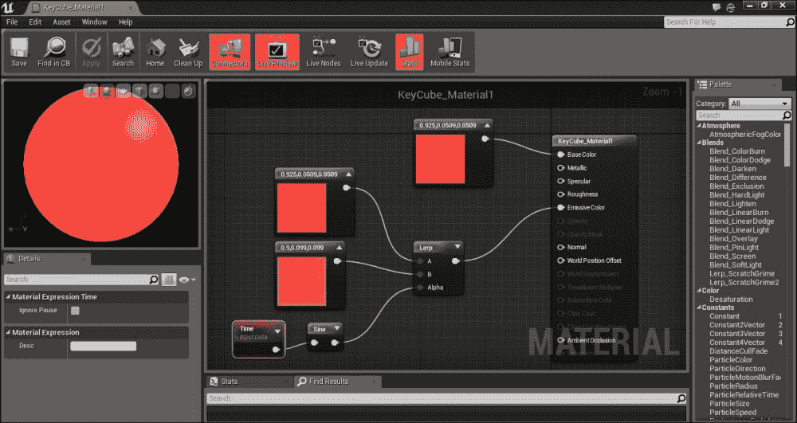

这就是了。我们现在有了一个闪光材质作为我们的主钥匙立方体。将其应用于所有关键立方体。

### 装饰性素材

对于我们的装饰素材，我们将创建一种周期性改变颜色的材质。首先，创建一个材质并命名为**装饰素材 _ 材质**。为了改变效果，我们将使用一个**旋转器**节点。如果你有一个合适的纹理，并希望它旋转，你可以这样做使用这个。它获取**纹理**的*紫外*坐标和一个**时间**功能，并使用该功能旋转纹理。我们要用它让我们的材质变色。像往常一样，创建一个**常量 3 矢量**，并将其颜色设置为淡蓝色。

现在，我们将它连接到**旋转器**节点，而不是直接连接到基色输入。在调色板面板中找到**旋转器**节点，并将其放置在图形面板中。**旋转器**节点接受两个输入，**坐标**和**时间**。将**常量 3 矢量**连接到**坐标**输入。创建一个**正弦**函数，连接一个时间输入数据给它，并连接到**时间**输入。最后，将**旋转器**节点连接到**基色**输入端。这就是我们需要做的。现在你会注意到材质会定期变色。您可以通过更改**旋转器**节点的“详细信息”面板中的**速度**设置来设置其变色速度。

将此材质应用到游戏中的所有装饰素材。这样，我们的环境就有了质感。

如果你测试你的水平，你会发现你什么也看不见。这是因为我们的关卡没有任何灯光，因此没有渲染任何东西，你看到的只是一个黑屏。现在让我们进入照明。

# 照明

照明是任何游戏中非常重要的元素，因为没有它你就看不到你周围的世界。UE4 提供四种类型的照明，即:方向灯、点光源、聚光灯和天空灯。让我们逐个检查它们，并讨论它们的一些属性，您可以在“详细信息”面板中设置这些属性:

*   **Directional light**: Directional light is the ideal type of light when you have an outdoor scene and want to simulate light coming from the sun, since directional light simulates light coming from a source infinitely far away. The shadows formed by directional lights are parallel.

    您可以在“细节”面板中设置诸如强度、颜色、是否影响世界、间接灯光的强度等内容。

    

    前面的截图显示了方向灯及其在关卡中的工作方式。它的图标由一个带有两个平行箭头的太阳来描绘。另一个单箭头显示了光线的方向。您可以使用旋转工具设定方向。

*   **Point light**: A point simulates light coming from a single source of light, emitting light uniformly in all directions, much like a bulb. It is the light source we will be using most in the game. In an indoor scene, this will be your primary actor for lighting.

    

    如您所见，点光源演员由灯泡表示。你在它周围看到的球体是*衰减半径*。它由球体线框表示，并显示光源有直接影响的体积。您可以设置强度、颜色、衰减半径、光源是否影响世界、间接照明的强度等。如果您觉得不想要单点光源，可以根据您的要求设置光源的半径或长度。

*   **Spot light**: Spot lights are similar as point light, in that, they both originate from a single source. The difference between the two, however, is that while a point light emits lights uniformly in all directions, spot light emits lights in one direction, in a cone.

    

    你可能已经注意到了两个圆锥体。内锥是光线最亮的地方。当你径向向外朝着外锥体移动时，光线变得不那么明亮，并且会发生衰减。您可以设置这两个圆锥体的半径，以及光源的强度、颜色、长度和半径等。

*   **Sky light**: Lastly, we have the sky light. Sky light simulates light being reflected off the atmosphere and distant objects.

    

    天空之光在效果上相当微妙。考虑到这一点，在前面的截图中，左边是有天空光的场景，右边是没有天空光的场景。两者并列时可以看到天光的效果。

    天空灯光设置与其他类型的灯光有点不同。首先，你可以设置一个叫做 **天空距离阈值**的东西。这是与天空之光演员的距离，在这个距离上，任何演员都将被视为天空的一部分。您还有**下半球为黑色**选项，当切换时，将忽略来自场景下半球的光线。您也可以使用自己的自定义立方体贴图来获得自己的天空灯光类型。除此之外，您还可以设置光线的颜色、强度等。

## 机动性

所有类型的灯都有三种类型的机动性。如果你需要的话，你可以在游戏运行时修改一些轻装角色的设置。移动部分允许您这样做。

移动选项位于灯光演员详细信息面板的**变换**部分。

共有三种类型可供选择:

*   **静态**:当将灯光设置为**静态**时，在制作游戏时设置的属性保持不变，不能用触发器或在游戏过程中修改。一旦建立了照明，光信息和由该光烘焙的阴影保持静态，并且不能改变。对于游戏期间不移动或不开关的灯，这是最合适的移动类型，因为它需要最少的内存来渲染。
*   **静止**:当一个光演员的移动性被设置为**静止**时，唯一可以通过触发或者在游戏过程中改变的属性是强度、颜色等等。然而，在这种设置下，光线不能移动或平移。这比静态灯需要更多的内存，可以用于闪烁的灯之类的东西。
*   **Movable**: Under this setting, the light actor is totally dynamic and along with altering things like intensity and color, it can also move, rotate, and scale during gameplay. Keep in mind, however, that this type of light takes the most memory to render, since every time its property is altered within the game, it has to recalculate the shadows and lighting information in real time. Therefore, unless it is really required in your game, avoid using movable lights when developing games on mobile devices. It is better if you use static lights, for best performance. When you switch the mobility to **Movable**, the light actor's icon in the game changes. You will see four arrows underneath the light actor.

    

左边是移动性设置为**可移动**的灯光演员，右边是移动性设置为**静止**或**静止**的灯光演员。

## 点亮环境

既然你已经熟悉了灯光演员，他们的类型和移动类型，让我们在我们的关卡中放置一些灯光。

现在，我们将在我们的关卡中放置静态点光源。稍后我们将讨论固定式和移动式灯。也就是说，在水平仪中放置一个点光源。将`intensity`设置为`20000`，将`attenuationradius`设置为`5000`。另外，将机动性设置为`Static`。创建点光源的多个副本并放置它们，记住应该为玩家提供足够的照明。你也应该切换到*灯光查看模式*，这样你就可以知道房间里是否有足够的灯光。最后，搭建关卡。您可以设置照明构建的质量。但是请记住，您想要的光质量越高，构建所需的时间就越长，但是在这些更高的设置下，照明将更接近于反映生产质量。

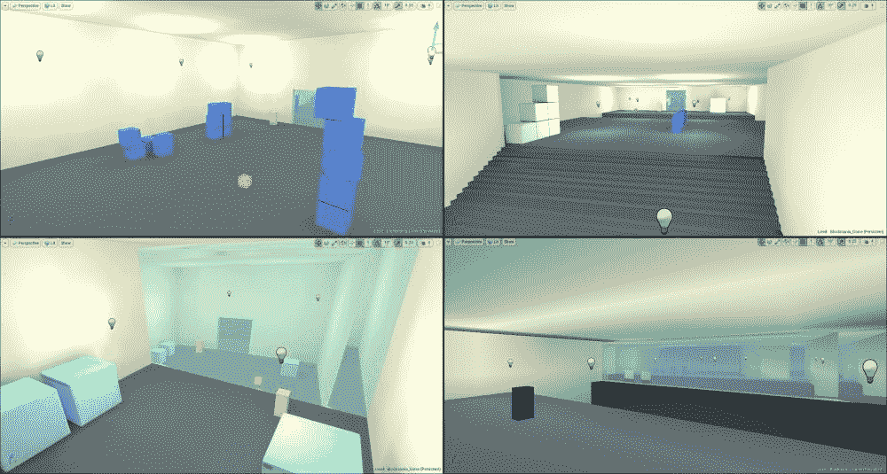

你现在可以看到所有正确渲染的材质和纹理。

# 总结

在本章中，我们讨论了项目，它们是什么，UE4 提供了什么类型的项目，以及如何创建和加载项目。接下来，我们介绍了什么是 BSP 笔刷，BSP 笔刷的默认类型，以及如何编辑它们来创建我们自己的几何图形。我们返回并再次查看了内容浏览器，如何导入和迁移素材，以及如何将演员从内容浏览器放到级别上。我们介绍了材质的概念、材质编辑器、它的用户界面以及如何创建材质。最后，我们以谈论灯光、不同类型的灯光以及一些重要的设置来结束这一章。

利用这些知识，我们创造了我们的环境，从而朝着构建我们的游戏迈出了第一步。在下一章中，我们将讨论卷的概念，它们是什么，卷的不同类型，以及我们如何在游戏中应用它们。所以，不再多言，让我们进入下一章。**