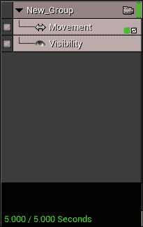
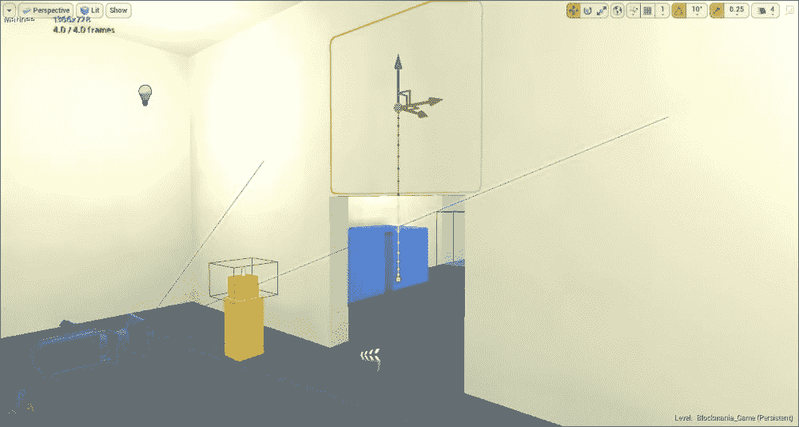
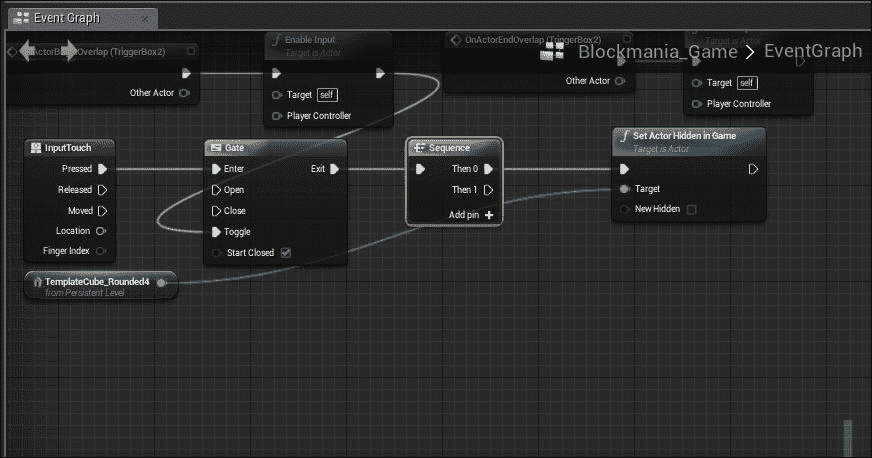
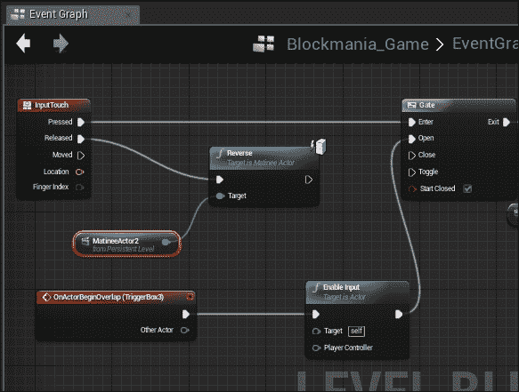
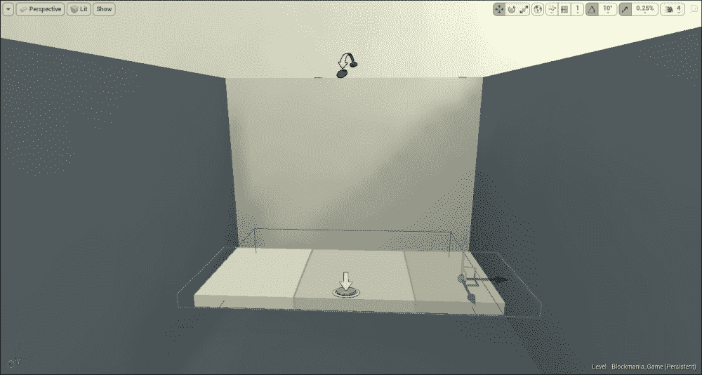
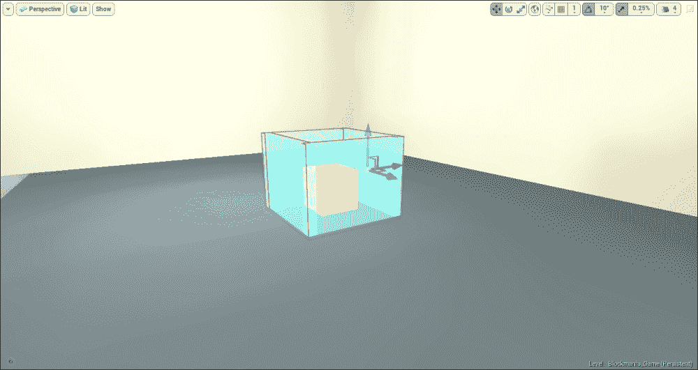
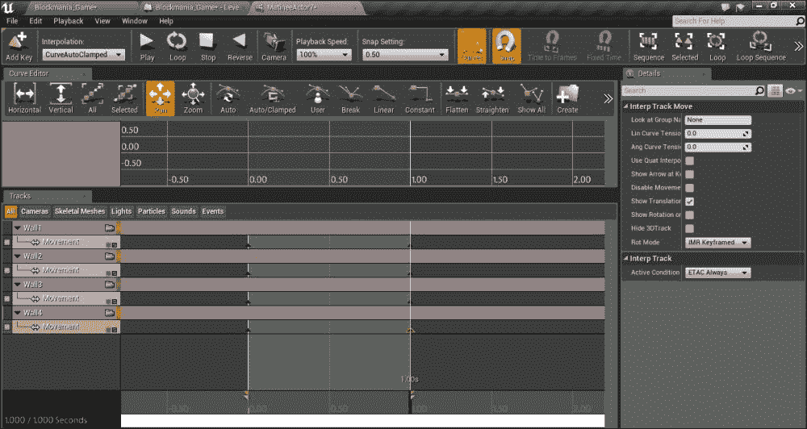
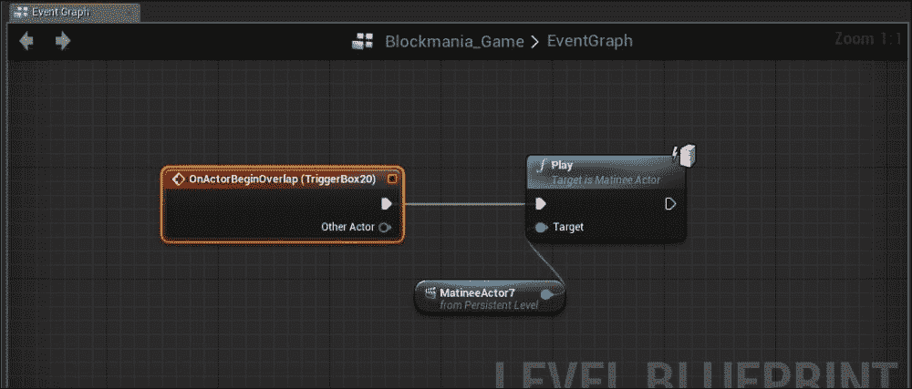

# 第六章。使用不真实的日场

虚幻日场是虚幻引擎 4 提供的另一个强大的工具。虚幻日场用于制作电影、过场动画、动画、布景等。它也很容易学习，你可以用它来创造惊人的东西。通常日场和蓝图一起使用。在前一章中，我们已经省略了游戏中的一些脚本编写，我们现在将介绍这些内容。本章将涵盖以下主题:

*   什么是虚幻日场？
*   虚幻日场用户界面
*   在我们的游戏中使用虚幻日场

# 什么是虚幻日场？

虚幻日场是一个动画工具。它提供了一些工具，你可以在游戏中使用这些工具来激活演员的属性，或者创建电影、过场动画、布景等等。在曲线和关键帧的帮助下，你可以使用这个工具来制作游戏中演员的动画，就像专业人士使用的任何其他视频编辑软件一样。您也可以使用日场来设置日场活动。

## 增加日场演员

在可以使用日场之前，首先需要做的就是在场景中加入一个日场演员。日场演员由拍板描绘，就像你在电影布景中看到的那样，如下图所示:

我们已经在[第 4 章](4.html#aid-VF2I2 "Chapter 4. Using Actors, Classes, and Volumes")、*中通过模式面板讨论了一种添加日场演员的方法，即使用演员、班级和音量*。另一种添加日场演员同时检查场景中有多少演员的方法是单击视口工具栏中的**日场**按钮，该按钮会打开一个下拉菜单。这里，在菜单的顶部，在**新建**部分下，您可以选择通过点击**添加日场**来创建新的日场演员。在此下方的**编辑现有日场**部分，您可以找到列表中所有日场演员的列表。双击其中任何一个进行编辑。

当你创建一个新的日场演员或双击一个现有的演员时，一个新的窗口会打开。让我们仔细看看。

# 虚幻日场用户界面

任何在 **虚幻开发套件** ( **UDK** )中使用过日场的都会发现布局和用户界面相当相似。

## 选项卡和菜单栏

就像在网络浏览器中一样，在标签栏中，你可以看到当前打开了多少个窗口，在它们之间交换，重新排列它们，并关闭其中的任何一个。

下方是菜单栏，包含以下动作和功能:

*   **文件**:从这里，您可以选择从 FBX 文件导入序列(因为 FBX 文件和网格一起也存储对象的动画，导入它会将那个 FBX 文件的动画序列导入到 Matinee)，导出一个动画序列，保存一个序列，等等
*   **编辑**:使用此选项卡，可以撤销或重做之前的动作，添加或删除关键帧，编辑部分等
*   **回放**:这为您提供了播放、暂停、停止、循环和反转动画序列的选项
*   **查看**:这里可以设置想要查看的内容，启用网格捕捉，在轨迹视图面板中适应整个序列，等等
*   **窗口**:这个标签允许你通过设置你想要在 UI 中显示的面板和窗口来定制你的日场 UI，等等
*   **帮助**:你可以从这里访问日场的文档和教程

## 工具栏

下方菜单栏为工具栏。在这里，您可以访问最常用的操作。

从左至右，图标如下:

*   **添加关键帧**:这个在动画轨迹的当前位置添加一个关键帧。
*   **插值**:插值就是在另外两个点之间找到一个点。在关键帧动画中，插值是一个重要的工具，因为它使动画平滑。这样，您可以设置关键点和曲线的初始插值模式。您可以选择线性、恒定、曲线自动夹紧、曲线自动等等。
*   **播放**:播放按钮播放您创建的动画序列。您可以在“编辑器”视口中看到动画。动画只播放一次。
*   **循环**:如果想多次观看动画，可以点击**循环**按钮，动画一结束就会循环播放。
*   **停止**:点击此处将停止动画。
*   **反转**:这样会反方向播放动画。
*   **相机**:点击这个可以创建**相机**组。
*   **播放速度**:通过该选项，可以设置想要播放动画的速度。可以从正常播放速度的 **100%** 、 **50%** 、 **25%** 、 **10%** 、 **1%** 中选择。
*   **捕捉设置**:如果启用了栅格捕捉，可以从这里设置捕捉大小。
*   **曲线**:默认启用，可以用此打开/关闭曲线编辑器窗口。
*   **捕捉**:以磁铁为代表，切换网格捕捉。
*   **帧时间**:此将时间轴光标捕捉到**捕捉设置**中设置的捕捉大小。仅当快照大小以每秒帧数为单位时，才会启用此选项。
*   **固定时间**:使用此功能，您可以将播放速度固定为在**快照设置**菜单中选择的帧率。仅当捕捉设置以每秒帧数为单位时，它才有效。
*   **序列**:点击此处的进行缩放，以适合您在“轨迹”面板中创建的整个序列。
*   **选定的**:这将缩放以适合在**轨迹**面板中选定的关键帧。
*   **循环**:这将缩放时间线以适合动画序列中的循环部分。
*   **循环序列**:这将循环部分的起点设置为动画序列的起点，终点设置为序列的终点。换句话说，点击它将调整循环部分的大小，使其适合您创建的整个动画序列。
*   **End** :点击工具栏最右上角的箭头，会多出三个图标。第一个是 **End** 。这将轨道时间线移动到序列的末尾。
*   **录制器**:这将打开**日场录制器**窗口，您可以使用该窗口为您的日场录制序列。
*   **电影**:最后我们有**电影**选项。您可以使用它从您创建的动画序列中创建电影。

## 曲线编辑器

下一个窗口是**曲线编辑器**。与任何动画软件一样，您可以使用曲线编辑动画。如果您想要在动画序列中包含粒子系统，也可以使用它。曲线还有许多其他用途，但这些是最常见的用途。 *x* 轴代表时间， *y* 轴是你在日场中随时间变化的数值。曲线编辑器中的曲线显示该值随时间变化。例如，如果值以恒定的速率变化，曲线将是线性的，如果值以指数变化，曲线将是指数曲线，以此类推。

要查看和编辑曲线，首先必须在**轨迹**面板中切换它们。完成后，您将看到相应动画序列的曲线，然后您可以编辑该曲线，以便进一步编辑或微调动画。

顶部是曲线编辑器的工具栏。让我们看看它的选项:

*   **水平**:该选项允许缩放以水平拟合选定的曲线组。
*   **垂直**:这与**水平**选项相同，但垂直拟合选定的曲线组。
*   **All** :它在水平和垂直方向上拟合曲线，这样整个曲线在曲线编辑器中都是可见的。
*   **选中**:此功能与 **All** 功能相同，但只针对选中的点。
*   **平移**:这将把**曲线编辑器**切换到平移模式，也就是说你可以通过按住鼠标左键并拖动它在图形编辑器中移动。
*   **缩放**:这将切换到缩放模式。您可以通过按住鼠标左键并拖动鼠标来放大和缩小。
*   **自动**:将选择的曲线插值改为**自动**。
*   **自动/夹紧**:将选择的曲线插值设置为**自动/夹紧**。
*   **用户**:该选项将插值更改为用户(如果在曲线设置为**自动**或**自动/夹紧**时对曲线进行任何更改，则将插值更改为用户)。
*   **断开**:这将插值改为**断开**。
*   **线性**:这将插值改为**线性**。这意味着两点之间的曲线将是线性的，即两个关键帧之间的直线。
*   **常数**:这将插值改为**常数**。这意味着所选关键帧之间的曲线将是一条水平直线。换句话说，沿着 *Y* 轴的值将随着时间保持不变。
*   **展平**:点击此处将展平曲线的选定切线，使其变平。
*   **拉直**:该选项从曲线的选定切线上移除任何不规则，并使其变直。
*   **显示全部**:这显示了存在的所有曲线的所有切线。
*   **创建**:最后，我们有**创建**标签按钮。您可以选择创建多个选项卡。您可以通过点击工具栏最右上角的箭头按钮并使用**当前**选项卡菜单选择要转到的选项卡来切换选项卡。您也可以删除当前选项卡。

工具栏下方的左侧是曲目列表。在这里，您可以看到当前标签中的所有轨道。顶部是轨道的名称，底部是您可以打开/关闭的按钮。在这个例子中，我们有一个运动轨迹，所以每个轴有三个按钮:红色代表 *X* 轴，绿色代表 *Y* 轴，蓝色代表 *Z* 轴。最右侧是一个黄色按钮，可用于打开/关闭整个轨道。

在它的右边，我们有一个图形编辑器，在那里你可以看到和调整曲线。

在这里，您可以看到有三条单独的曲线，每条曲线代表我们刚才讨论的按钮。您可以在这里调整每条曲线，以获得所需的结果。选择曲线上的一个点，并更改切线以改变曲线的形状。

## 轨道面板

在 **轨迹**面板中，您可以看到动画序列中的所有轨迹、文件夹和组。

在这里，您可以看到指定动画时长的时间线、您创建的组、动画中涉及的所有组件等。面板顶部是选项卡栏。下方是**组**选项卡。对于简单的动画，您并不真的需要这样做，但是如果您有一个复杂的动画序列(如电影或过场动画)，您可能希望利用这个功能来保持您的工作站整洁有序。您可以将类似的演员放在他们各自的标签中。例如，如果您有摄像头，您可以将它们放在**摄像头**组中。要创建组或文件夹，右键单击它；这将打开一个菜单，从中可以创建组或文件夹。

在左侧的**组**标签下，是组和轨迹列表。列出了动画序列或当前标签中的所有组和轨道。您也可以在此添加或删除组。

可以看到，一组下面有各种轨迹。每个单独的轨道都有自己的动画，您可以编辑。您也可以通过单击每个轨道左侧的灰色框来打开/关闭整个轨道。右下角还有两个盒子。左边的按钮启用或禁用动画序列中各个轨道的播放。右边的选项启用或禁用该轨道的曲线编辑器。此外，有些轨道没有这两个按钮，表明这些轨道没有曲线。

它的右边是动画时间线。

在底部，您可以看到动画时间刻度。在它上面，带有红色边缘的半透明白色方框描绘了动画时间的总持续时间。您可以单击边缘并向左或向右拖动它们，分别减少或增加动画的持续时间。浅绿色方框显示循环序列的持续时间。这意味着只有绿色线段内的部分将循环，其余部分将被忽略。您也可以通过单击并向左或向右拖动绿色箭头来增加或减小其大小。还有时间线滑块，由白线描绘，您可以使用它跳转到任何帧。最后，您可以单击时间栏上的任何位置来跳转到任何帧。时间线滑块将跳转到您单击的任何位置。

## 详细信息面板

最后是 **细节**面板，在这里可以设置某些轨迹、组等属性。

前面的截图显示了运动轨迹关键帧的属性。可以在视口中切换运动轨迹不播放，切换旋转开/关，设置是否要在编辑器视口中看到轨迹，等等。

# 激活门

现在你已经熟悉了虚幻日场及其用户界面，我们可以继续为我们的游戏添加一些动画。这包括打开门的动画，第一个房间的一个小过场动画，以及为人工智能角色画一座桥。

## 1 号房间

现在是时候在我们的游戏中实际使用日场了。选择第一个房间门口附近的日场演员，点击**详情**面板中的**打开日场**。打开后，第一步是添加一个组。在制作组之前，确保在**编辑器视口**中选择了要动画化的一个或多个演员；否则，该组中不会有任何演员引用，您会收到一条错误消息，说**没有要为**设置关键帧的内容，或者**选定的对象不能在这种类型的轨道**上设置关键帧。

点击门选择，右键点击**轨迹**面板中的**轨迹列表**，选择**新增空组**。当要求给组命名时，将其命名为**门**并按*进入*。门将连接到该组。这将创建一个空组，您可以在其中放置多个轨迹(运动、可见性、粒子等)。首先，我们需要一个运动轨迹。右键单击**门**，选择**添加新的运动轨迹**。创建后，您将在**轨迹**面板中看到它。

现在，我们做不希望动画持续 5 秒，因为对于简单的开门动画来说太长了，会不必要地降低游戏速度。因此，通过左键单击最右侧的红色箭头(位于 5 秒标记上方)将动画持续时间减少到 2 秒，并将其移回 2 秒标记。如果需要，您也可以通过对绿色框右边的绿色箭头执行相同的操作，将循环序列持续时间从 1 秒增加到 2 秒。

在时间线中，在运动轨迹之前，你会在 0 秒标记上看到一个小的栗色箭头。这是一个关键的框架。因为我们有一个简单的动画，所以我们只需要两个关键帧:一个在动画序列的开头，另一个在结尾(如前面的截图所示)。要添加第二个关键帧，请将动画滑块移动到动画时间线的末端，然后按*进入*。

现在我们已经设置了关键帧，回到编辑器。

你会在视窗的左上角注意到一些东西。无论何时打开日场，视口都会发生变化，以预览相应的日场动画。左上角用白色文字写着的是**日场**。这基本上是通知视口当前设置为预览模式。在它旁边，用青色文字书写的是视口的分辨率。在它下面，用绿色文字写着，是相应的日场动画的帧数。左上角写着**日场**。在它旁边，你可以看到分辨率，在它下面，是动画的总帧数。在此模式下，您不能保存、打开或加载场景，也不能玩游戏。为了执行这些动作，您必须先关闭日场。

现在，确保时间线滑块位于动画时间线的末端，使用变换工具，向上或沿着 *z* 轴移动门。移动它，直到它不碍事。

只要你移动门，你就会看到一条垂直的黄线。这条线显示了播放动画时门将遵循的路径。要观看动画，返回日场，点击工具栏中的**播放**按钮。

接下来我们需要的是利用我们之前添加的摄像头。当玩家把钥匙立方体放在基座上时，我们想玩一个小过场动画，展示它有什么效果，这样玩家就知道房间里的主要目标是什么。在这个过场动画中，我们将:

1.  从玩家手中夺走控制权。
2.  从主摄像头切换到门前摄像头。
3.  播放动画。
4.  归还玩家对角色的控制权。

为此，我们需要添加一个摄像机组。返回到日场窗口，右键单击**轨道**面板，然后单击**添加新摄像机**组(再次确保在视口中选择了摄像机)。命名该组**相机**。

一个摄像机组有两条轨迹:一条 **运动**轨迹和一条**视场角** 角度轨迹。日场播放时，您可以用它来移动相机并设置其视野。在这种情况下，我们希望摄像机保持静止。所以，把时间轴滑块拿到时间轴的末端，在相机组的**运动**轨迹中点击*进入*创建关键帧。

接下来我们需要的是所谓的 **导演**组。它的一个用途是在播放动画时指定切换到哪个摄像机。再次右键单击**轨迹**面板，选择**创建新导演组**。将在**导演**组的**轨道**面板上方创建一个新的独立轨道。

现在我们有了我们的**导演**组，我们需要告诉它动画播放的时候切换到哪个镜头。为此，选择它并按*进入*。这将打开一个小窗口，询问您要切换到哪个组。这个窗口登记了我们在日场中创建的所有组。在这里，点击下拉菜单，选择**相机**，点击**确定**(确保时间线滑块在 0 秒标记处)。一旦完成，**摄像机**组将被分配到**导演**组。

现在如果你播放日场，你会看到在视口中，摄像机切换到我们放在门前的那个。我们已经安排好了日场。现在我们需要在它应该播放的时候编写脚本。我们希望它在玩家将钥匙立方体放在基座上时播放。因此，打开蓝图，在我们为放置关键立方体而创建的序列中，添加一个**序列**节点。将此连接到**门**节点。接下来，将**the0**输出引脚连接到**设置演员隐藏在游戏**节点。

接下来，在视口中选择**日场**演员，右键单击并创建其参考。然后，拖动该节点的管脚，菜单打开时输入`Play`，创建**播放**节点。将其连接到**序列**节点的 1 号引脚。

如果你测试出水平，你会看到一切都按预期运行；当玩家将钥匙立方体放在底座上时，摄像头会切换到门前面的那个，门的动画就会开始播放。然而，还有一些事情要做。在过场动画播放时，你仍然可以控制玩家(移动和射击)。我们希望玩家在动画播放时不能移动或拍摄。为此，选择**日场**演员，并在**详情**面板中的**电影**部分下，检查以下内容:

*   **禁用移动输入**
*   **禁用查看输入**
*   **隐藏玩家**

这就是我们所拥有的:我们刚刚创建了自己的过场动画。让我们继续到第二个房间的大门。

## 2 号房间

在第二个房间的中间，我们有一扇大门。我们希望玩家能够在他们将第一个钥匙立方体放在基座上时使用它。到目前为止，它与前一扇门相当相似。这里唯一的区别如下:

1.  当玩家在屏幕上触摸它时，门就会打开(前提是先解锁)。
2.  当玩家从屏幕上松开手指时，门就会关闭。

在这里，日场部分会类似；我们将创建一个 2 秒长的运动轨迹，并设置门向上的动画。这里，由于我们不是在创建剪辑场景，我们不需要**摄像机**组或**导演**组，也不需要在日场运行时禁用玩家输入。考虑到这一点，选择大门口附近的**日场**演员，点击**详情**面板中的**开启日场**。使用**运动**轨迹为门设置动画，就像我们对前一扇门所做的那样。

完成后，打开级别蓝图。这里，我们将使用触摸输入节点，而不是打开门的立方体。与前面的触发器一样，为门周围的大触发器添加一个重叠事件。如下图所示设置节点:

这里，当玩家叠加触发时，启用玩家输入，打开**门**节点。当玩家现在触摸屏幕时，它将播放**日场**。我们唯一需要编写脚本的是当玩家释放屏幕时会发生什么。这里，当玩家停止触摸屏幕时，门会关闭，即**日场**反向播放。

为此，创建另一个对**日场**演员的引用(或者复制已经存在的引用)，创建一个**反向**节点，并将**日场**演员附加到其**目标**输入。

现在测试游戏，你会看到，当你把钥匙立方体放在第一个底座上，点击门(在编辑器中玩的时候，鼠标键充当触摸输入)，门就打开了；你一松手，它又关上了。对 4 号房间的门也这样做，但不需要先开门；你可以简单地编写脚本，让它在玩家靠近它并触摸屏幕时打开，在玩家从屏幕上松开手指时关闭。让我们继续到桥的平台。

## 人工智能角色的桥梁

在有 AI 角色的房间里，玩家要给它做一个桥段，这样它就可以过坑解锁钥匙立方体了。有一些开关可以画出一段桥。玩家必须在 AI 角色掉进坑里之前快速画出桥的所有线段。在第三个房间，桥将有三个部分，每个部分由基座上的开关画出。对于我们的桥，我们将使用立方体原始演员。在场景中加入三个 Cube 原始人演员，将他们的比例分别设置为`2.2`、`2.5`、`0.3`，放在坑底。确保将他们的机动性设置为**可移动**。

这样做了之后，再加上三个日场演员，每段一个。然后，在日场中，将动画时间设置为 1 秒，并通过移动它使其与地面对齐来动画化即将到来的部分。确保该部分完全对齐。太高的话 AI 角色上不去，太低的话 AI 角色上不去。如果您看到该部分的上表面是绿色的(因为导航网格边界体积)，这意味着该部分对于人工智能角色是可行走的，如下图所示:

对剩余的两个部分进行同样的，确保它们在绘制时完全吻合。

下一步我们需要做的是将日场脚本写入我们的游戏。我们在第三个房间有四个基座。从左到右，第一个激活 AI 角色，第二个绘制桥的第一段，第三个绘制第二段，第四个绘制第三段。所以，打开 Level bluetooth，就像第二个房间的大门一样，编写脚本，这样，当玩家离开关足够近并触摸屏幕时，日场就会播放。对所有三个播放各自日场的触发盒都这样做。

当 AI 角色掉进坑里的时候，我们希望桥段回到坑底，这样当玩家重新开始的时候，他们就要再次按下开关来画段了。回到将人工智能角色传送回起始位置的触发框。到**序列**节点，添加一个大头针，为所有三个日场演员创建一个引用。创建一个**反向**节点，并将所有三个角色连接到它。

现在，如果人工智能角色掉进坑里，除了被传送回它的起始位置，桥段也会重置到它们的原始位置。

我们的难题已经解决了。然而，目前这个难题没有任何回报。我们之前提到过，当 AI 角色穿过坑时，它会解锁钥匙立方体。但是现在，我们的钥匙似乎没有锁。我们能做的是封装我们的关键立方体，当人工智能角色成功穿过坑时，它就会打开。为此，在关键立方体(充当笼子的墙壁)周围放置四个立方体，创建它们打开的日场，并设置一个触发框，当人工智能角色与触发框重叠时，触发框将播放日场。因此，在包围它的关键立方体周围放置四个立方体，并对它们应用门材质(如果您愿意，您可以复制**门 _ 材质**，并在材质编辑器中，删除与**折射**表达式的连接，并将其应用于墙壁，以便从坑的另一侧可以正确地看到关键立方体)。当放置这些时，确保钥匙立方体周围的触发盒也封闭在墙壁内。

现在在这个笼子附近添加一场日场，并在目标点演员上方放置一个触发框。打开日场，这样我们就可以创作动画了。这里，我们有四个单独的对象要制作动画。然而，由于它们都是一起制作动画的，所以为每面墙创建四个不同的日场演员是很浪费的。相反，我们将在同一个日场动画所有四面墙。为此，我们将创建四个不同的组，每面墙一个，每个组都有一个运动轨迹。选择第一面墙，创建一个带有运动轨迹的空组(命名为**墙 1** ，并使其向下运动。将动画时间设置为 1 秒。然后，用第二面墙的移动轨迹创建另一个空组(命名为**墙 2** ，并且使其向下移动。对剩下的两面墙也这样做。

我们现在有四个独立的动画对象使用同一个日场演员。剩下的最后一件事是为播放日场的触发盒设置重叠事件。

从你所学到的，在制作第四个房间的桥时应用同样的方法，确保AI 角色在绘制时可以穿过它们。

# 总结

在这一章中，我们看了虚幻日场:它是什么，它的用户界面，以及它能做什么。我们用它来创建过场动画，制作门和桥的动画。就这样，我们完成了我们的小游戏，展示了 UE4 提供的各种功能和工具。下一步是最终确定游戏(添加主菜单，润色游戏等)，将其打包成`.apk`文件，移植到安卓设备上，并在那里进行测试。