# 第七章。游戏的整理、包装和发布

在最后的几章里，我们一直在一点一点地构建一个游戏。我们从使用 BSP 笔刷构建世界开始，添加灯光和静态网格，创建材质，并将其应用于网格。然后，我们添加了开发游戏和增强游戏性所需的各种类和卷。在添加了所有演员之后，我们继续使用蓝图、关卡蓝图和蓝图类来编写我们的游戏脚本。最后，我们利用日场来创作场景和动画。

我们现在有一个功能正常的游戏。下一步是完成游戏，将其打包成`.apk`文件，并发布到谷歌 Play 商店。

# 使用虚幻运动图形添加主菜单

如果你玩过任何一种游戏，你会发现所有的都有一个主菜单。让我们也在游戏中加入一个。我们的主菜单会很简单。我们会把游戏的名字放在中间。当玩家点击名字下方时，游戏将被加载。游戏的菜单、用户界面、 **抬头显示** ( **抬头显示**)等等——以及它们的功能——可以使用**虚幻运动图形** ( **UMG** 轻松创建。UMG 是一个简单易用的工具，有一个简单直观的编辑器，你可以很快学会制作你的游戏菜单等等。

# UMG 编辑

要访问 UMG 编辑器并制作您的用户界面，您首先需要创建一个`Widget Blueprint`类。右键点击**内容浏览器**，在**用户界面**下，选择**小工具蓝图**。命名为`Main_Menu`，双击打开 **UMG 编辑器**。

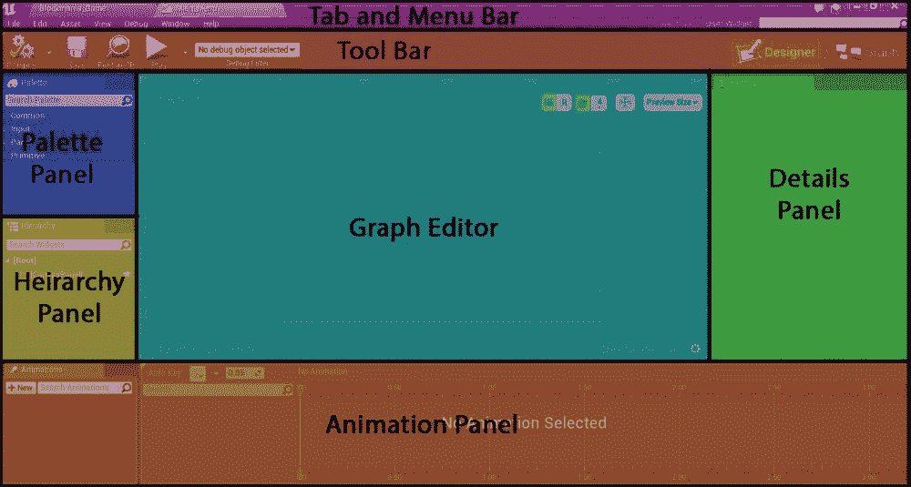

## 选项卡和菜单栏

标签栏显示当前打开的标签。您可以从这里切换、关闭、重新排列和移动任何标签。


菜单栏是，在这里您可以找到要使用的操作:

*   **文件**:从这里可以保存你的小部件蓝图，编译你创建的蓝图，打开一个选中的资产，等等。
*   **编辑**:这里可以撤销或者重做上一个动作，打开**编辑器**和**项目偏好设置**。
*   **资产**:在这里，你可以在**内容浏览器**中找到你选择的任何资产，也可以在小部件中找到该资产的引用。
*   **查看**:这里可以选择隐藏/取消隐藏蓝图中存在的任何未使用的管脚。
*   **调试**:如果您已经在蓝图中创建了断点(调试错误)，那么您可以启用/禁用它们，并从这里删除所有断点。
*   **窗口**:从这里可以选择你想看哪个面板或者窗口，不想看哪个。
*   **帮助**:最后，如果您需要任何关于小部件的教程或文档，您可以从这里访问它们。

## 工具栏

菜单栏下方是工具栏。这里列出了所有最常用的操作。


*   **编译**:点击该选项编译该类，并通知用户任何错误和/或警告
*   **保存**:这将保存您对小部件类所做的所有修改
*   **在 CB 中查找**:该选项在内容浏览器中定位所选对象
*   **玩**:这在编辑器视口中玩游戏
*   **调试过滤器**:这里列出了你设置调试的所有变量和/或节点

UMG 编辑器中有两个窗口:**设计器**和**图形**。**设计器**窗口是打开小部件类时看到的窗口。这是您设计用户界面的地方。这包括添加用户界面元素、在图形编辑器中排列它们、设置它们的属性等等。另一个窗口是**图形**窗口，看起来像**级蓝图**窗口。这是您为用户界面执行所有可视化脚本的地方。


所有的菜单都具有与任何其他蓝图窗口相同的操作。

## 图形编辑器

屏幕中间的是图形编辑器。在这里，你制作和设计你的用户界面。


在中间，你可以看到一个虚线矩形。这被称为画布，它代表游戏屏幕。您想要在小部件中包含的所有用户界面元素都在这里。这显示了元素的位置，它们在屏幕上的外观，以及它们在游戏屏幕上的排列位置。

在图形编辑器的左下角，您可以看到屏幕的分辨率。屏幕右下角是显示 **每英寸点数** ( **DPI** )刻度的地方。您可以通过单击旁边的齿轮图标来更改它。

左上角可以看到缩放比例。最后，右上角是几个按钮。从左到右，他们被招募如下:

*   **小部件布局转换**:这是用来转换和设置你为 UI 创建的小部件的布局。
*   **小部件渲染变换**:这是为了变换整个 UI 本身。
*   **栅格捕捉**:这将打开/关闭栅格捕捉。
*   **栅格捕捉值**:如果启用可以在这里设置捕捉值。
*   **缩放至合适的大小**:这将平移和调整图形编辑器以适应图形编辑器中的整个画布。
*   **预览尺寸**:在这里可以设置并查看 UI 在不同设备上的外观，每个设备都有不同的屏幕尺寸、DPI 和屏幕分辨率。当你为不同的设备开发游戏时，它真的很方便。

## 详细信息面板

**详细信息** 面板是您可以设置所选组件属性的地方。

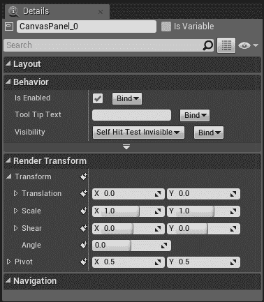

在这里，您可以设置属性，如小部件的变换和轴心，在小部件被按下或悬停时添加事件，设置可见性，等等。

## 调色板面板

有各种各样的小部件元素进入用户界面。您可以在**调色板**面板中找到它们。只需将您需要的内容从面板拖放到图形编辑器中，即可添加该元素。


微件组件分为四组，即**常用**、**输入**、**面板**、**原始**:

*   **常用**:该组包含最常用的小部件，如按钮、图像框、滑块、进度条等。
*   **输入**:该组包含可以接受玩家输入的元素，例如文本框、旋转框和组合框
*   **面板**:该组包含用于布局小部件和控制何时放置小部件的元素。
*   **原语**:这个组包含了 Trobbers、可编辑文本等东西。
*   **用户创建的**:本部分包含您已经创建的或在项目文件中的任何小部件蓝图。您可以从这里添加它们。

## 层次面板

**层次结构**面板显示了部件所有组件的层次结构。


顶部是作为用户界面基础的 **CanvasPanel** 。每当添加一个组件时，它也会被添加到层次结构中。如果您在**层次结构**面板中的小部件组件上拖放组件，它将与您在其上放置小部件组件的组件一起添加，作为父组件，您添加的组件作为子组件。它们也在图形编辑器中连接在一起。

## 动画面板

UMG 用户界面的最后一个组件是位于窗口底部的 **动画**面板。


UMG 允许用户创建动画。您可以设置小部件组件的动画来满足您的偏好。**动画**面板的工作方式与虚幻日场几乎相同。左边是**轨道**面板。这是您可以添加、移除或移动动画轨迹的地方。要添加动画轨迹，点击 **+新建**按钮。

右边是动画时间线。这是您使用关键帧创建动画的地方。左上角是一些设置，比如启用/禁用网格捕捉，网格捕捉值，等等。

# 创建主菜单

创建我们的主菜单的第一步是创建一个新的关卡。在编辑器中，点击**文件**，选择**新等级**。当水平类型窗口打开时，选择**空水平**。


将此级别命名为**主菜单**。创建后，在**内容浏览器**中打开**主菜单**小部件类。在 UMG 编辑器中，向画布添加一个**文本**小部件。把文字做大。首先，将文本槽面板的大小增加到 1300 x 200。有两种方法可以做到这一点:第一种方法是点击边缘并拖动它来增加大小。第二种方式是在**详情**面板，可以将**尺寸 X** 设置为`1000`、**尺寸 Y** 设置为`250`。

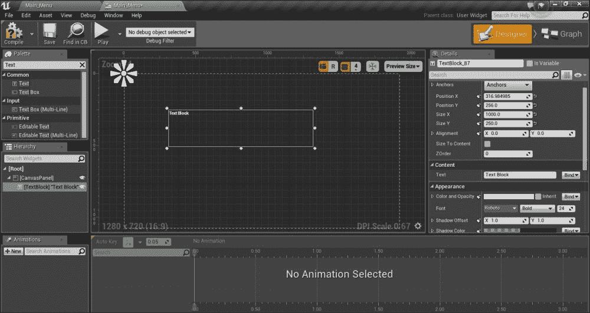

文本槽现已设置。然而，文本本身的实际大小相当小。接下来我们需要做的是增加文本的大小。再次在**详情**面板的**外观**部分，你会发现**字体**选项。在最右侧，您可以设置字体大小的值。默认情况下，该值设置为`24`。增加到`150`。

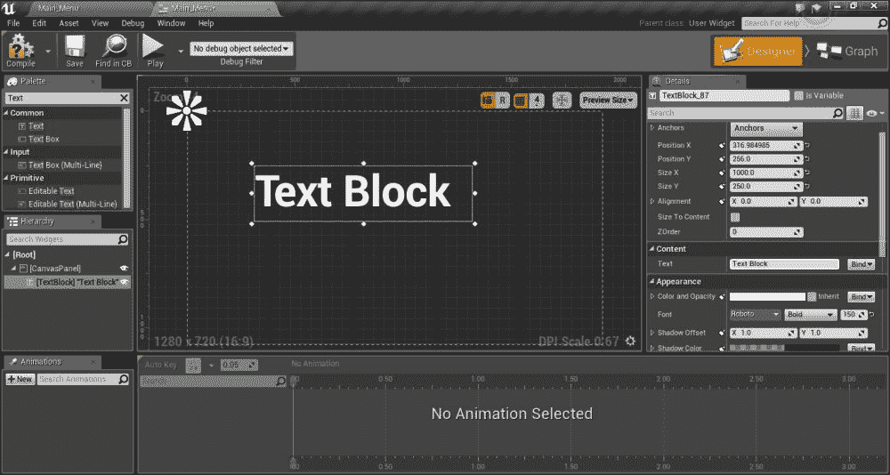

这是我们将显示游戏名称的地方。在**内容**部分，您可以设置想要在屏幕上打印的文本。无论您写什么都会显示在图形编辑器中。移除**文字区块**，写上游戏名称:`Bloques`。最后，调整**文本**面板的位置，使名称出现在屏幕中央。


接下来我们要添加的是一个按钮，当玩家点击时，它会开始游戏。为此，从**调色板**面板的**常用**部分添加一个**按钮**部件。将它放在中间游戏名称的下方。将其尺寸设置为`256 x 64`。我们还需要一些文本到按钮上，所以从**调色板**面板中拖动一个**文本**组件并放到按钮上。文本将被附加到**按钮**部件上。在**层次**面板中可以看到**文本**小部件作为一个组件在按钮小部件下面。无论何时移动按钮小部件，文本小部件都会随之移动。将字体的颜色从白色更改为蓝色，以便清晰可见。


我们的按钮已经就位，但是它没有任何作用。我们需要编写它的功能脚本。选择按钮后，进入**详情**面板，在**事件**部分，点击**旁边的按钮点击**。窗口将切换到**图形**窗口，其中**图标**按钮事件节点已经设置。


在这个节点上，我们将附加一个 **OpenLevel** 节点。右键单击并通过在搜索栏中键入来搜索它，然后将其附加到**图标**节点。在**关卡名称**输入中，写下你想要开启的关卡名称，在我们这里是 **Bloques_Game** 。请确保您正确复制了级别的名称；否则，它不会打开。


最后，我们还需要移除小部件；否则，当关卡加载时，它仍会存在。右键单击并选择**从父节点**移除，并将其连接到**开放等级**节点的输出引脚。


就是这样。通过蓝图加载等级真的这么简单。

我们已经准备好了主菜单。我们必须在我们的场景中实现它。为此，打开**级蓝图**。在显示小部件之前，我们首先需要创建它。在**事件开始播放**部分，右键单击并键入`create widget`找到创建小部件节点并连接它们。接下来，在**类**输入中，点击下拉菜单并选择**主 _ 菜单。**

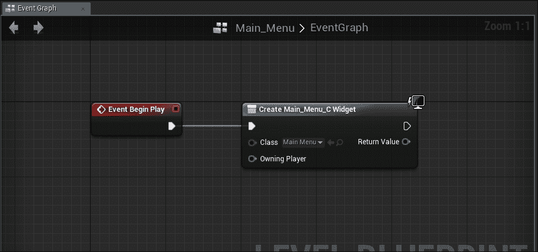

当关卡开始时，将创建 **主菜单**部件。一旦创建，我们需要将其添加到视口中，以便玩家可以看到它。为此，我们需要一个**添加到视口**节点。将**返回值**拖出，并在图形编辑器中的任意位置释放它。菜单打开后，输入`Add to Viewport`，找到后添加。

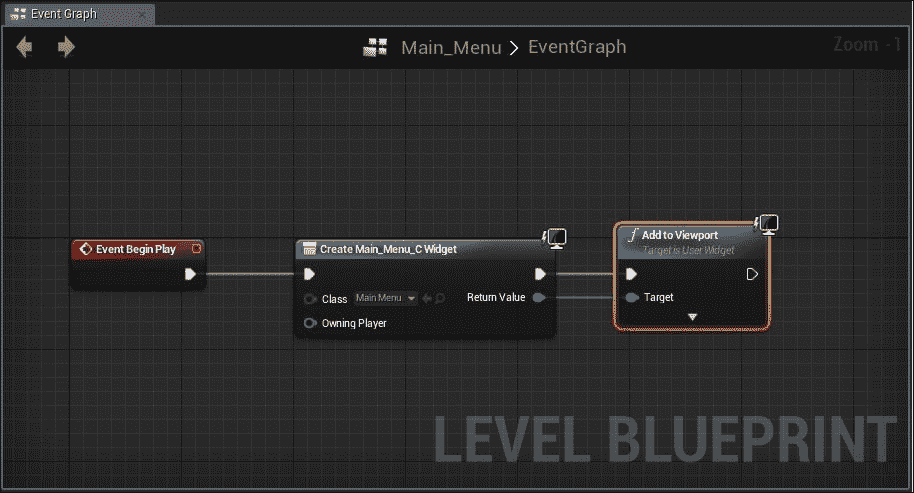

你要测试这个游戏，你会看到只要你运行这个游戏，游戏的名字和按钮就会出现在屏幕上。


然而，我们仍然有一些东西可以改进。首先，我们可以隐藏虚拟操纵杆，因为它们不是必需的。

右键单击图形编辑器中的任意位置；关闭**上下文敏感**；找到**设置虚拟操纵杆可见性**节点；将其添加到图形编辑器中；并将其连接到**添加到视口**节点。对于**目标**输入，需要创建一个**获取播放器控制器**并将其附加到**目标**输入引脚。

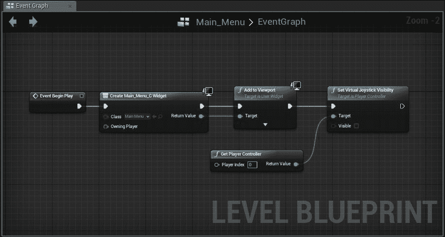

现在运行游戏。运行时虚拟操纵杆将不可见。

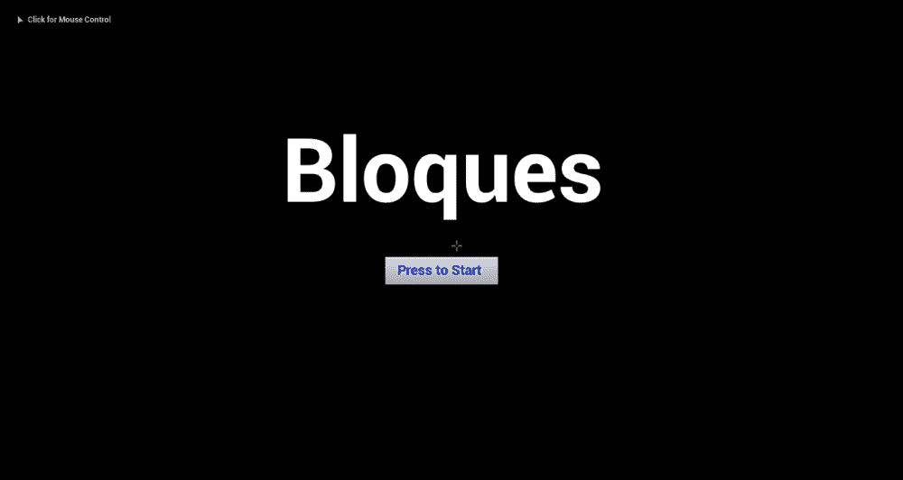

如果你按下按钮，它会加载并带你去游戏，只要关卡一加载，UI 就会消失。这是你如何添加一个主菜单到你的游戏。

# 安装安卓软件开发工具包

在我们可以做饭和打包我们的游戏之前，我们首先需要安装安卓 SDK。幸运的是，你不需要在网上找到它并下载它；它的安装文件可与 UE4 一起使用。可以在 **<位置> \虚幻引擎\ 4.7\引擎\附加\安卓**找到。我们需要的文件是`tadp-2.0r8-windows`。


找到后，双击它运行安装。安装程序打开后，您只需按照屏幕上的说明进行安装即可。

### 注

需要注意的一点是，安装程序需要互联网连接，因为它下载了构建工具；因此，在安装 SDK 工具时，请确保您已连接到互联网。

一旦你成功安装了 Android SDK 文件，接下来你需要做的就是告诉引擎所有文件在哪里(尤其是如果你已经在默认位置之外的其他位置安装了 SDK 文件)。为此，首先需要打开**项目设置**(可在**编辑**下的视口菜单栏中找到)。在**项目设置**窗口的**平台**部分，选择**安卓软件开发工具包**。


在这里，你可以告诉引擎所有文件夹的位置。左边是安卓需要构建的所有文件的列表。在面板的右侧，是设置相应文件目录的位置。有两种方法可以改变这种情况。您可以手动输入面板中文件夹的位置，或者点击面板旁边的 **…** 。当您点击它时，**浏览文件夹**窗口打开，您可以在其中指定文件夹。


*   第一个选项是安卓软件开发工具包文件夹的。找到`android-sdk-windows`文件夹并设置。
*   第二个选项是安卓 NDK 文件。找到`android-ndk-r9c`文件夹并设置。
*   第三个选项是针对 ANT 文件。找到`apache-ant-1.8.2`文件夹并设置。
*   第四个选项是针对 Java 文件的。找到`jdk1.6.0_45`文件夹并设置。对于已经安装了 Java SDK 的开发人员，您需要检查系统环境变量以及路径是否正确。

您可以有不同的文件夹名称；您只需要确保当前分配了适当的文件夹。

接下来的两个选项是指定使用哪个版本的 SDK 和 NDK 工具。安卓软件开发工具包文件现在已经安装好了。接下来要做的是设置你的安卓设备进行测试。

# 设置安卓设备

开发游戏时，自然会时不时地想要测试一下你的游戏，看看它在设备上是否运行流畅、正常。您可以选择在安卓设备上直接构建和运行游戏，而不必首先打包游戏，将其放在设备上，然后进行测试。

1.  To do this, the first thing is to enable the Developer mode on your device. This can usually be found in **Settings** | **About phone**. Here, you need to find **Build number** and tap on it several times. If done correctly, you will get a prompt saying **You are now a developer** (in some devices or versions of Android, the **Build number** option is located within **More**). Once that is done, a new section called **Developer Options** will be available to you; open that and enable **USB debugging**.

    

2.  Once done, connect your device to the system and let it install the drivers. Your device is now ready for testing. To check whether it has been properly set up, in the **Editor Viewport Toolbar** click on the little arrow next to **Launch** and see whether your Android device is listed under **Devices**. If it is, that means that it has been properly set up. Some devices do not automatically install the driver. In such cases, it is advised that you download the respective driver from the company's website.

    

3.  Once set up, we can now test our game on our Android device. To do so, click on the Android device listed under **Devices**. Once clicked, UE4 will start packaging the game and deploying it for the device. You can see a pop-up at the bottom-right corner of the screen.

    

4.  要停止构建过程，点击**取消**按钮。要查看构建过程的输出日志，点击**显示输出日志**打开日志窗口，在这里可以看到正在执行的内容。如果出现错误，您还可以看到错误发生的位置。一旦构建过程结束，它将自动在您的设备上启动。也将安装`.apk`文件。

# 包装项目

打包游戏并在你的设备上测试的另一种方式是先打包游戏，导入设备，安装，然后玩。但是首先，我们应该讨论一些关于包装的设置，以及安卓的包装。

## 地图&模式设置

这些设置处理最终游戏的地图(场景)和游戏模式。在编辑器中，点击**编辑**并选择**项目**设置。在**项目**设置中，**项目**类别，选择**地图&模式**。


让我们看一下各个部分:

*   **默认地图**:这里可以设置打开项目时编辑器应该打开哪个地图。您还可以设置游戏运行时应该打开哪个地图。你首先需要改变的是我们创建的主菜单地图。为此，点击**游戏默认地图**旁边的向下箭头，选择**主菜单**。
*   **本地多人游戏**:如果你的游戏有本地多人游戏，你可以修改一些关于游戏是否应该有分屏的设置。如果是这样，你可以设置两个和三个玩家的布局。
*   **默认模式**:在这个部分，你可以设置游戏应该运行的默认游戏模式。游戏模式包括**默认棋子**类、**抬头显示器**类、**控制器**类、**游戏状态类**等。对于我们的游戏，我们会坚持**我的游戏**。
*   **游戏实例**:这里可以设置默认**游戏实例类**。

## 包装设置

打包游戏时，您可以调整一些设置。要访问这些设置，首先进入**编辑**并打开**项目**设置窗口。打开后，在**项目**部分点击**包装**。

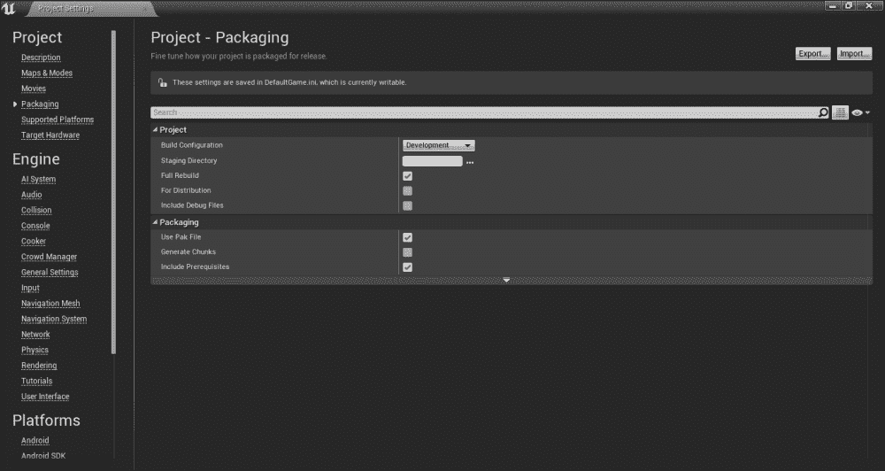

在这里，您可以查看和调整与打包项目文件相关的常规设置。分为**项目**和**包装**两部分。在**项目**部分，您可以设置选项，例如打包项目的目录、要调试、开发或发货的构建配置、是否希望 UE4 在您每次构建时从头构建整个项目，或者只构建修改后的文件和资产，等等。

在**打包** 设置下，可以设置是否希望所有文件都在一个`.pak`文件下，而不是多个单独的文件，是否希望那些`.pak`文件成块等等。单击向下箭头将打开高级设置。

这里，因为我们正在打包我们的游戏进行分发，所以勾选**进行分发**复选框。

## 安卓应用设置

在前面的部分，我们谈到了一般的包装设置。我们现在将讨论安卓应用的特定设置。这可以在**平台**部分的项目设置中找到。在此部分，点击**安卓**打开安卓应用设置。


在这里你会发现所有的设置和属性，你需要包装你的游戏。在顶部，您应该做的第一件事是为安卓配置您的项目。如果你的项目没有配置，它会提示你这样做(从 4.7 版本开始，UE4 自动为你创建`androidmanifest.xml`文件)。在你做其他事情之前先做这件事。这里有不同的部分。这些是:

*   **apk packing**:在这个部分，可以找到打开所有构建文件所在的文件夹、设置包的名称、设置版本号、游戏默认方向应该是什么等等选项。
*   **高级打包**:本部分包含更多高级打包选项，比如给`.apk`文件增加额外设置。
*   **构建**:要调整**构建**部分的设置，首先需要从 GitHub 获得源代码。在这里，您可以设置是否希望构建支持 x86、OpenGL ES2 等。
*   **分发签名**:这部分是关于给你的 app 签名的。安卓系统要求所有应用都有数字签名。这是为了让安卓能够识别应用的开发者。您可以通过单击该部分顶部的超链接来了解有关数字签名的更多信息。当您为您的应用生成密钥时，请确保将其保存在安全的地方，因为如果您丢失了密钥，您将无法在谷歌游戏上修改或更新您的应用。
*   **谷歌 Play 服务**:安卓应用通过谷歌 Play 商店下载。这一部分涉及到启用/禁用谷歌游戏支持、设置应用的标识、谷歌游戏许可证密钥等等。
*   **图标**:在这个部分，你可以设置你游戏的图标。您可以根据您要开发的设备的屏幕密度来设置各种大小的图标。您可以通过单击该部分顶部的超链接来获取有关图标的更多信息。
*   **数据炊具**:最后，在这个部分，你可以设置你希望游戏中的音频如何编码。

对于我们的游戏，首先需要设置的是**安卓套装名称**，在**apk packing**部分可以找到。命名的格式为`com.YourCompany.[PROJECT]`。在这里，将`YourCompany`替换为公司名称，将`[PROJECT]`替换为您的项目名称。

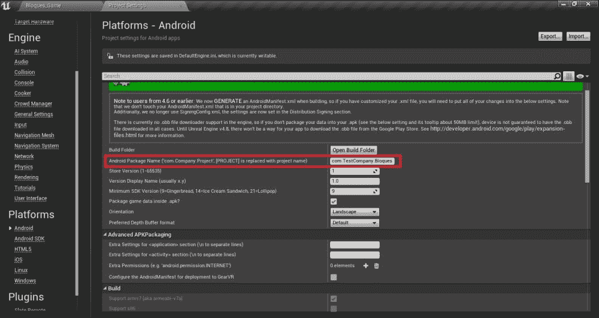

## 构建包

要打包你的项目，在编辑器中转到**文件** | **打包项目** | **安卓**。

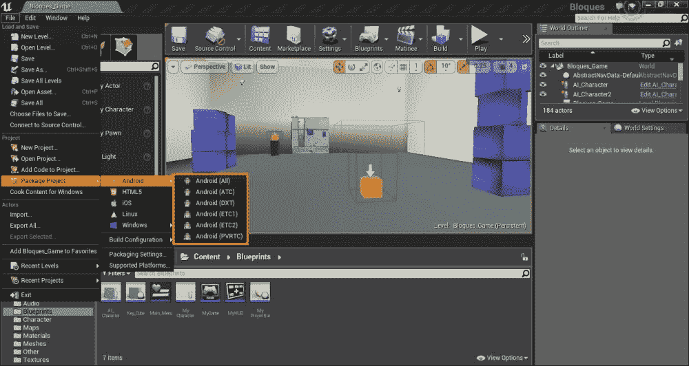

您将看到不同类型的格式来打包项目。这些措施如下:

*   **ATC** :如果你的设备有高通骁龙处理器，就用这个格式。
*   **DXT** :如果你的设备有一个 Tegra 图形处理单元(GPU)，使用这个格式。
*   **ETC1** :任何设备都可以使用。但是，这种格式不接受带有 alpha 通道的纹理。这些纹理将被解压缩，使你的游戏需要更多的空间。
*   **ETC2** :使用这种格式是你有一个基于 MALI 的设备。
*   **PVRTC** :如果你有一个带 PowerVR GPU 的设备，就用这个格式。

一旦您决定使用哪种格式，单击它开始打包过程。将打开一个窗口，要求您指定要将包存储在哪个文件夹中。

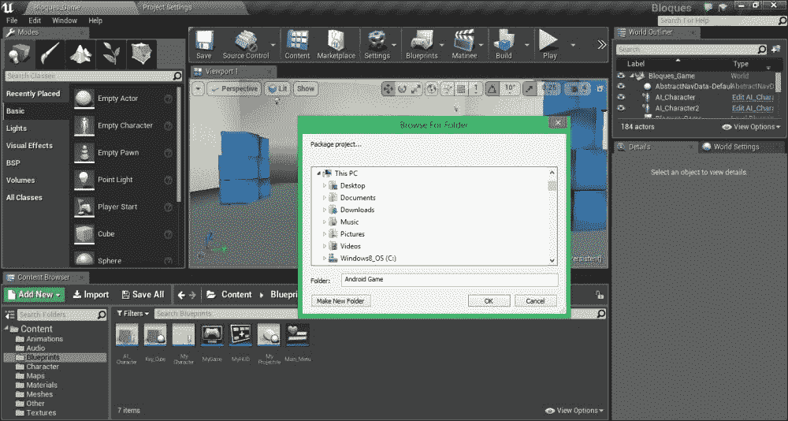

一旦决定了包文件的存储位置，点击**确定**，构建过程将开始。启动时，就像启动项目一样，屏幕右下角会弹出一个小窗口，通知用户构建过程已经开始。您可以打开输出日志并取消构建过程。

构建过程完成后，转到您设置的文件夹。


你会找到一个游戏的`.bat`文件。如果您已经检查了`.apk?`选项中的打包游戏数据(位于**打包**部分下的安卓类别中的项目设置中)，您还将找到游戏的`.apk`文件。

`.bat`文件直接将游戏从系统安装到你的设备上。为此，首先将您的设备连接到系统。然后双击`.bat`文件。这将打开一个命令提示窗口。


一旦它打开，你就不需要做任何事情。只需等到安装过程完成。安装完成后，游戏将在您的设备上准备执行。

要使用`.apk`文件，你必须做一些不同的事情。一个`.apk`文件在设备上安装游戏。为此，您需要执行以下步骤:

1.  连接设备。
2.  创建`.apk`文件的副本。
3.  将其粘贴到设备的存储器中。
4.  从设备执行`.apk`文件。

安装过程将开始。一旦完成，你就可以玩游戏了。

# 开发人员控制台

在我们讨论如何在谷歌 Play 商店上发布游戏之前，我们首先需要讨论一下**开发者控制台**，您可以从这里管理您的应用。这包括将应用上传到 Play Store 和从 Play Store 中移除应用、填写应用的描述、设置应用的价格等。但是，在访问**开发者控制台**之前，您首先需要注册。注册费用是 25 美元。注册页面的链接是[https://play.google.com/apps/publish/signup/](https://play.google.com/apps/publish/signup/)。


注册后，进入**开发者控制台**页面。


在这里，点击位于右上角的**添加新应用按钮**。点击后会打开窗口，可以设置语言，将游戏名称设置为`Bloques`。设置完成后，点击**上传 APK** 。单击后，您将看到关于该应用的几个选项。

在顶部，您可以看到应用的名称，Bloques。在它的左侧下方是几个面板。中间是相应面板中的可用设置或选项。

## 所有应用

这里是你已经发布或者正在发布的所有应用和/或游戏的显示位置。

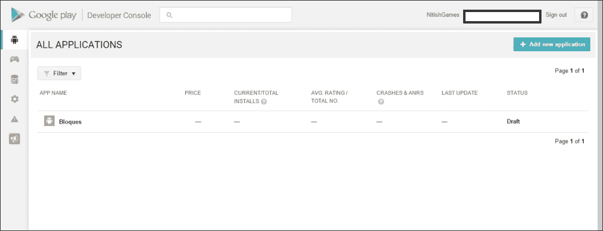

尚未发布和/或正在上传到游戏商店的应用将保存为草稿。您还可以查看诸如您的应用已经下载/安装了多少次、价格、应用上次更新的时间等信息。单击列出的任何应用将打开应用页面，您可以在其中为其设置各种属性和选项。

### APK

**APK** 面板默认为打开。在这里，您可以选择是否要在游戏商店中发布游戏。

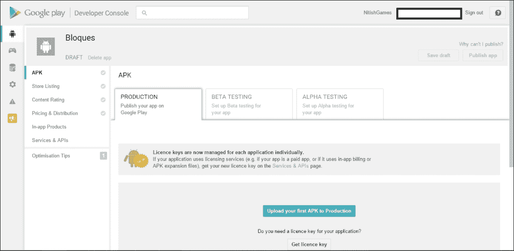

如果您正在开发您的应用或游戏的过程中，并且想要在市场上测试您的产品，以及在发布最终产品之前获得一些反馈，您可以通过从 **beta TESTING** 选项卡上传您的应用来设置 BETA 测试。如果您希望对您的应用进行更多的受控测试，例如，如果您有邀请或密钥代码，则只能下载，那么您可以通过从 **alpha TESTING** 选项卡上传您的产品来设置 ALPHA 测试。

### 店铺列表

下一步面板是**商店列表**面板。该面板包含所有与该应用在谷歌游戏中的显示方式相关的选项。


在这里，您需要填写有关您的应用的详细信息。当用户点击时，这些详细信息将显示在游戏商店中。该面板有五个部分。

第一部分是**产品详情**。您可以在这里设置应用的名称、关于您的应用的简短描述(应该简短有趣，足以引起用户的注意)，以及关于您的应用的完整描述(包含应用是什么、其功能集等的完整描述)。

下一节是 **图形资产**。在这里你需要发布你的游戏截图。由于安卓设备多种多样，每个设备的屏幕大小和屏幕分辨率都不一样，所以需要添加几个不同分辨率的截图，这样截图就不会在任何设备上被拉伸或压缩。你至少需要添加两张截图；你最多可以添加八张截图。给出了各种设备所需的尺寸，因此您可以进行相应的检查和设置。除了添加截图，你还可以添加一个视频，它可以是你的应用的预告片或游戏视频。

在**图形资产**之后是**分类**面板。这涉及如何在游戏商店中对您的应用进行分类。在这里你需要指定你的产品是应用还是游戏。设置之后，您需要指定您的产品属于哪一类；如果你选择了**应用**，你在类别下得到的选项将是**书籍和参考资料**、**教育**、**商业**、**金融**、**生活方式**等等。如果你选择了游戏，你将不得不在棋盘游戏、益智游戏、休闲游戏等下设置它的类型。最后，你还需要为你的应用设置**内容评分**。

接下来，我们有**联系方式**，您可以在其中发布您的网站或您公司的网站、联系电子邮件地址和电话号码。

最后，在 **隐私政策**部分，您为您的应用提供了隐私政策。

### 内容评级

内容评级是任何游戏或应用的重要方面。谷歌 Play 也提供自己的内容评级。


尽管**商店列表**中有**内容评级**部分，但这是一个更全面、更广泛的评级系统。借助一份包含关于应用/游戏及其内容的各种问题的问卷，谷歌将对你的产品进行评级。但是要拿到问卷，你必须先上传你的应用。

### 定价&配送

本部分包含与您的应用的成本相关的所有内容，以及您的应用可以在哪里下载。

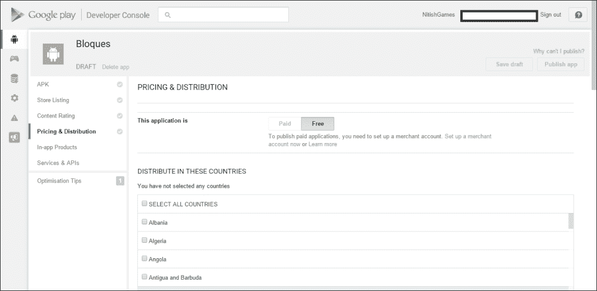

在顶部，你可以设置你的应用是**免费**还是**付费**。如果你想让你的 app 被支付，你首先要设置一个商家账户。

下面是一份国家名单。您可以通过单击复选框来选择希望您的应用在哪个国家可用。如果您希望您的应用在全球范围内可用，请选中**选择所有国家/地区**，所有的复选框都将被选中。

### 应用内产品

本部分包含关于应用内产品的设置。

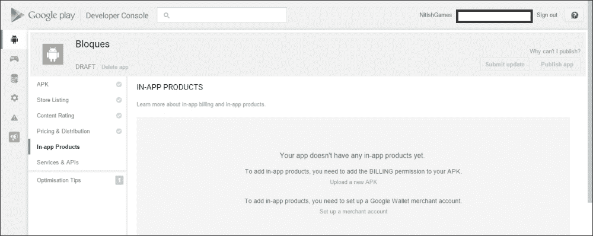

开发者使用的一种流行的货币化方法是应用内购买。这些是可以用真实货币购买的虚拟商品。在这里，您可以管理您的应用内产品，并设置价格、可购买的产品等项目。但是，如果你想在你的游戏或应用中进行应用内购买，你必须首先设置一个商家账户。

### 服务&原料药

这是你可以看到谷歌提供的哪些服务目前活跃在你的应用/游戏中的地方。


这些服务包括谷歌云消息，你可以使用它将信息和数据从服务器发送到你的应用或游戏；授权，防止盗版和未经授权的分发您的产品，并用于验证应用内购买；以及 Google Play 服务，其中包括排行榜、成就、推送通知等等。

## 游戏服务

正如之前所讨论的，谷歌为应用开发者提供各种服务。在这里你可以在你的应用/游戏上设置你想要的服务。


当你进入这个面板时，你会看到一个你已经制作的应用列表，类似于**所有应用**面板中的列表。在这里，你可以查看你的应用或游戏在什么平台上，你在游戏中取得了什么成就，你的排行榜，以及有多少独特的玩家使用他们的谷歌帐户登录了你的游戏。与**所有应用**一样，点击应用的名称将打开一个页面，您可以在其中选择这些服务。

让我们单独讨论这些部分。

### 游戏详情

在这里，您可以设置关于您的应用/游戏的一般细节。


这些一般细节包括你的应用的显示名称、描述、类别、图形资产等等。您也可以在这里更改这些设置。

### 链接应用

为了能够使用谷歌服务，你首先必须链接你的应用。


链接您的应用将生成一个 OAuth2 密钥，您需要将其包含在应用的二进制文件中，然后才能使用这些服务。在这里，您可以为您的应用选择不同的平台，即安卓、iOS、网络等。点击其中任何一个都会打开一个页面，在链接你的应用之前，你必须填写一些细节。我们将在后面的部分回到这一点。

### 事件

让用户下载你的应用是一回事。确保下载了你的应用或游戏的用户继续使用它们，换句话说，用户保留是一个完全不同的专业领域，同样重要，如果不是更多的话。接下来的三个面板就是为了这个。首先是**事件**面板。

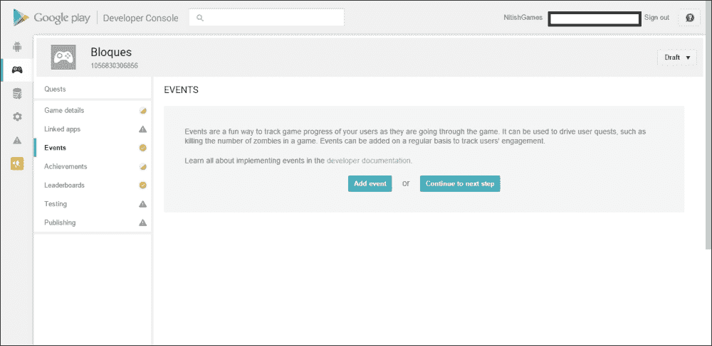

一旦你有了相当数量的用户，你就可以开始为参与或赢得这个活动的用户提供定期活动和奖励。活动可以包括每周竞赛、游戏内产品折扣等。这是让用户参与游戏的好方法。要添加事件，点击**添加事件**，将进入**事件**页面，您可以在其中填写事件的详细信息。

### 成绩

留住用户的另一种方式是创造成绩。成就是玩家为了解锁各自的成就而必须在游戏中执行的目标或任务。这可能包括玩游戏的次数 *X* 次，杀死的敌人数量 *Y* 次等等。通常，当玩家解锁一个成就时，他们会得到一些游戏内货币或类似的奖励。成就是留住完美主义玩家的理想选择，这些玩家玩到游戏完全结束。这意味着完成游戏(假设它有一个结局)，解锁任何东西和所有不可解锁的东西，并解锁游戏中的每一个成就。它也是你游戏的必要组成部分，因为你至少需要五个成就才能发布你的游戏。

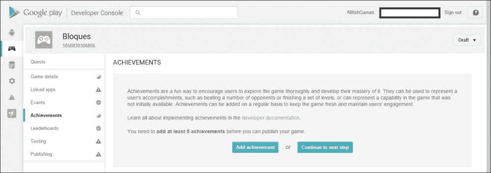

要添加成就，点击**添加成就**按钮，将进入**成就详情**页面。在这里，您可以设置所有的成就细节，例如成就的名称、如何解锁的描述、图标等。

### 排行榜

最后但同样重要的是，我们有 **排行榜**。排行榜是留住玩家的另一种方式，尤其是那些为了获得最高分数而比赛的竞技玩家。排行榜是一种列表，其中在你的游戏中得分最高的玩家的名字以降序显示。


添加排行榜，点击**添加排行榜**按钮，进入**排行榜详情**页面。在这个页面上，你可以设置各种选项，比如排行榜的名称、格式、上下限等等。

### 测试

本部分包含关于在你的应用/游戏上测试谷歌游戏服务的各种选项。在你发布你的游戏之前，建议你首先测试你的应用，以确保一切正常工作，如果出现问题，在发布前修复它。


在这里，您可以看到服务是否准备好测试。如果没有，将在测试开始前告诉您需要什么。您也可以通过点击 **【添加测试人员】**按钮并输入他们各自的谷歌账户详细信息，邀请其他人测试您的应用/游戏。

### 出版

最后是 **出版**版块。一旦你填写了所有的细节，添加了截图，设置了谷歌游戏服务，测试了它们，并且确信你的产品已经准备好发布了，你就可以发布它了。

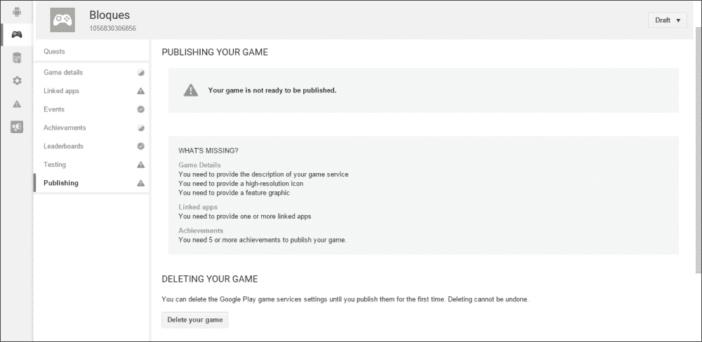

在这里，你可以看到你的应用/游戏是否准备好发布了。如果还没准备好，可以看看缺了什么，发布前需要做什么。如果你的游戏已经发布，你想从游戏商店中删除它，你可以点击 **删除你的游戏**按钮。

## 报告

在 **REPORTS** 面板中，可以查看点评、**撞车& ANRs** 、**统计**等事情。


这里也有不同的部分，都包含不同的报告:

*   **崩溃& ANRs** :在本部分，可以查看游戏崩溃和 ANRs 相关的报告。游戏崩溃是经常发生的事情。即使你的游戏得到了适当的优化，仍然有一些不可预见的问题可能会发生——一些小问题和一些大问题。为了留住你的用户，你必须修复这些崩溃；否则，他们会感到沮丧并删除你的游戏。在这里，您可以查看您发布的所有游戏和应用的崩溃报告，并相应地进行调试。当你的应用在一个类似于**不响应**的设备上停止响应时，ANRs 就会出现。这不同于崩溃，因为当游戏崩溃时，应用停止。发生 ANR 时，应用仍在设备上运行，但没有响应。解决这个问题同样重要。
*   **评论**:看你的游戏或应用在市场上表现如何的好方法是阅读它的评论。这也是了解你的游戏或应用缺点的好方法。您可以在创建续集或计划开发更新时使用这些信息。您还可以获得游戏中存在的任何 bug 的信息，并使用这些信息来解决它们。
*   **统计数据**:这个部分显示了有多少人在玩这个游戏，你的游戏下载了多少次，你的游戏在哪里最受欢迎(位置)，你的游戏有多少活跃用户，等等。
*   **财务报告**:最后是**财务报告**部分，你可以跟踪你的产品产生的收入，并据此更新你的游戏或应用。

## 设置

在这里，您可以查看和设置各种选项，例如帐户详细信息、关于谁可以访问开发人员控制台的权限等等。


这里也有各种部分，每个部分根据选项的类型分类如下:

*   **账户详情**:这个部分包含了所有关于你的开发者控制台账户的常规选项，比如开发者的名字，你的地址，你的邮箱 ID，网站 URL 等等。
*   **用户账号&权限**:在这里可以设置谁可以访问你的开发者控制台。当在一个团队中工作时，你想让他们都有权限是可以理解的。您可以在此部分设置。
*   **活动日志**:在这里你可以在开发者控制台看到你对你的应用所做的所有更改，以及特定更改的时间戳。这是跟踪对应用所做的任何更改的好方法。
*   **电子邮件首选项**:如果你想或者不想通过电子邮件收到关于你的应用的提醒，你可以在这里设置。
*   **API 访问** : API 是 app 的一个重要方面。它允许您管理应用内购买、验证交易等。但是，在使用它们之前，您必须先链接您的应用。你可以在这里链接你的应用，在**应用编程接口访问**部分
*   **广告词账户**:这里你可以把你的账户链接到一个**广告词账户**。AdWords 是谷歌提供的一项服务，它允许您通过使用高级定位技术来推广您的应用，以确保合适的人能够看到您的应用或游戏的广告或推广。

## 警报

在设置部分，我们讨论了如何打开/关闭电子邮件提醒。如果您已经打开了电子邮件提醒，您将通过电子邮件收到关于您的应用的所有提醒。如果已经关闭，您可以在**警报**面板中查看这些警报。


# 发布你的游戏

既然我们已经讨论了开发者控制台，我们可以继续将我们的游戏发布到谷歌 Play 商店。

## 激活谷歌服务

现在，由于应用超过 50 MB，你将不得不使用谷歌播放服务，即 APK 扩展文件。转到**游戏服务**面板，然后转到**游戏详情**部分。在这里，填写所有字段，因为所有这些都是应用在发布服务之前应该具备的基本要求。这包括设置**显示名称**，可以设置为`Bloques`。在**描述**部分只写游戏是什么，游戏的目的是什么等等。


由于这是一款益智游戏，在 **类别**字段，选择**益智**。此外，由于我们不需要保存游戏，您可以将其设置为**关闭**。对于**图形资产**，您至少需要两个:一个图标和一个特征图形。截图要求的分辨率为`512 x 512`，特征图形要求的分辨率为`1024 x 500`。您可以拍摄场景的高分辨率截图，并在 Photoshop 中编辑它们以创建您的图像。

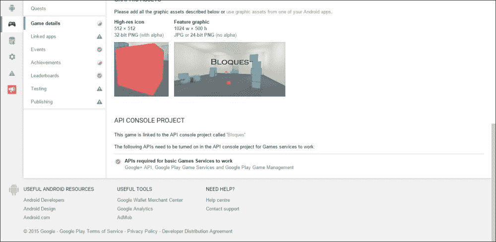

设置好后，点击屏幕上方的**保存**。

填写完详细信息后，进入**链接应用**，填写必填字段，点击顶部的**继续**。点击后，您必须授权您的应用。点击**立即授权您的应用**按钮。这将打开一个菜单，要求您填写产品名称、徽标等。但是，由于我们之前已经填写了这些细节，我们可以保持原样(除非您想做任何更改)。点击**继续**。在我们继续之前，我们首先要创建一个客户标识。要了解您的应用的客户端标识是什么，请执行以下步骤:

1.  打开命令提示符。确保您以管理员身份运行。
2.  运行以下命令:

    ```
    keystore –exportcert –alias androiddebugkey –keystore C:\Users\*Your Username*\.android\debug.keystore –list –v
    ```

3.  当它要求输入密码时，输入默认密码:`android`。
4.  复制 SHA1 签名并将其粘贴到签名证书指纹(SHA1):字段中。
5.  接下来，点击**创建标识**，将为您创建一个客户端标识。

一旦完成，谷歌将为你的游戏创建一个唯一的客户端标识以及一个应用标识。

接下来我们需要的是**成就**。为了发布我们的游戏，我们至少需要五个成就。你需要一个成就的名字，一个描述和一个图标来配合它。你可以创造自己的成就，但目前有以下五项成就:

*   **第一次**:这是玩家第一次玩游戏的时候
*   **掌握窍门**:这是玩家清空第二个房间的时候
*   **傀儡师**:这是玩家清空第三个房间的时候
*   **解谜大师**:这是玩家清空第四个房间的时候
*   **上瘾**:这是玩家玩游戏五次的时候

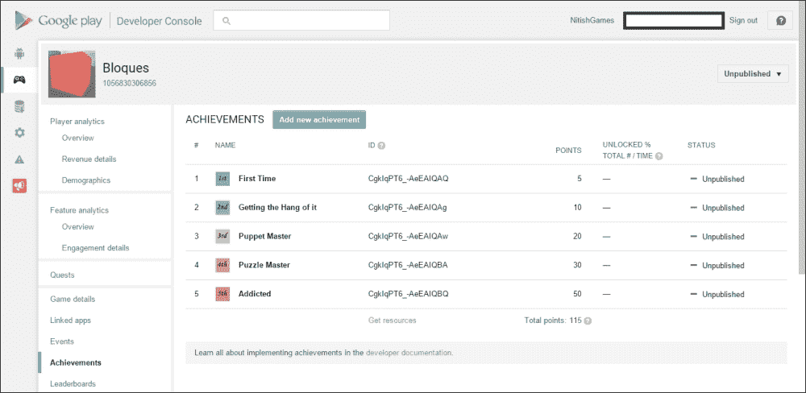

你可以指定你认为合适的任意数量的点。我们不需要排行榜，因为我们的游戏没有分数。

## 准备项目出货

现在我们需要回到**引擎**并在项目中定义一些设置。首先，我们需要设置我们将要构建的构建类型。为此，请前往**项目设置**并在**项目**下的**包装**部分，勾选**配送**框。您会注意到**构建配置**选项将被设置为`Shipping`，并且该选项将被锁定。


接下来我们要做的是将一些值从开发人员控制台复制到我们的项目中。前往**项目设置** | **平台** | **安卓**。首先，在**apk packing**部分，取消勾选**将游戏数据打包在里面。全境通告。**。由于我们的游戏超过 50 MB，我们无法上传。直接 apk 文件。我们需要的是一个`.obb`文件，一个扩展名文件，除了`.apk`文件之外，我们还要上传这个文件。取消选中此选项后，UE4 将自动创建一个`.apk`文件(小于 50 MB)和一个`.obb`文件(扩展名文件)。


接下来，前往**配送签约**。这一部分是必要的，如果我们要包装我们的游戏运输。我们首先需要的是创建一个`keystore`文件。密钥库文件是一个包含一组密钥的二进制文件。你可以把它想象成一个数字签名，用来在应用商店识别和验证你的应用。创建密钥库有多种方法:其中之一是借助命令提示符。因此，以管理员身份运行命令提示符，并输入以下命令:

```
keytool –genkey –v –keystore -*name of your project*.keystore –alias *alias_name* -keyalg RSA – keysize 2048 –validity 10000

```

将`*name of your project*`替换为 Bloques(或您认为合适的任何内容)，将`*alias_name*`替换为 Game(或您认为合适的任何内容)。

输入命令后，您将被要求填写一些其他信息，如密钥库的密码、您的姓名、您公司的信息等。一旦您填写了这些内容，就会创建密钥库。将其定位并置于`*Project Directory*/Build/Android`中。

完成后，返回**项目首选项**，在**分发签名**下的**密钥存储**中，输入您创建的`keystore`文件的名称以及扩展名(例如，如果密钥库的名称是 Bloques，则输入 Bloques.keystore)。然后，在**键别名**中，输入别名(游戏)。最后，在**密钥存储密码**和**密钥密码**字段中，输入您在制作`keystore`文件时定义的密码。

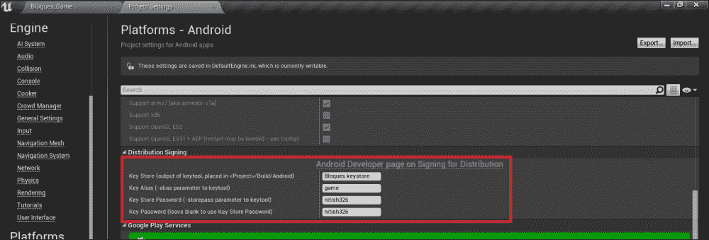

接下来，进入**谷歌游戏服务**。这里首先要做的是检查**启用谷歌游戏支持**。这将在游戏中启用谷歌游戏服务。在**游戏应用标识**字段中，填写您在开发者控制台中链接应用时获得的应用标识。你可以在**游戏服务**面板的**链接应用**的**授权**部分的开发者控制台找到这个 ID。


接下来，我们将需要谷歌播放许可证密钥。这可以在**所有应用**面板中**服务和应用接口**的**许可&应用内计费**部分的**开发者控制台**中找到。


这个看似随机的超长字符串就是我们的许可证密钥。复制整个内容并粘贴到**谷歌播放许可证密钥**部分。接下来，在成就地图中，填写您之前创建的成就的名称和 ID。


只需在此复制并粘贴姓名和身份证即可。如果您有想要添加的图标，也可以在**图标**部分添加。我们现在准备打包我们的游戏进行分发。所以，在编辑器中，转到**文件** | **打包项目** | **安卓**选择任意格式打包游戏。

构建完成后，转到您设置的用于存储包的文件夹。您将看到项目的一个`.apk`文件、`.bat`文件和一个`.obb`文件。我们只需要`.apk`和`.obb`文件。


## 在游戏商店上传游戏

最后一步是将包上传到游戏商店，并填写更多的细节。返回**开发人员控制台**，转到**所有应用**。在此范围内，前往 **APK** 。这里是我们上传`.apk`和`.obb`文件的地方。转到**生产**选项卡，点击**上传 APK**；然后选择`.apk`文件。上传完成后，我们需要上传扩展名或`.obb`文件。

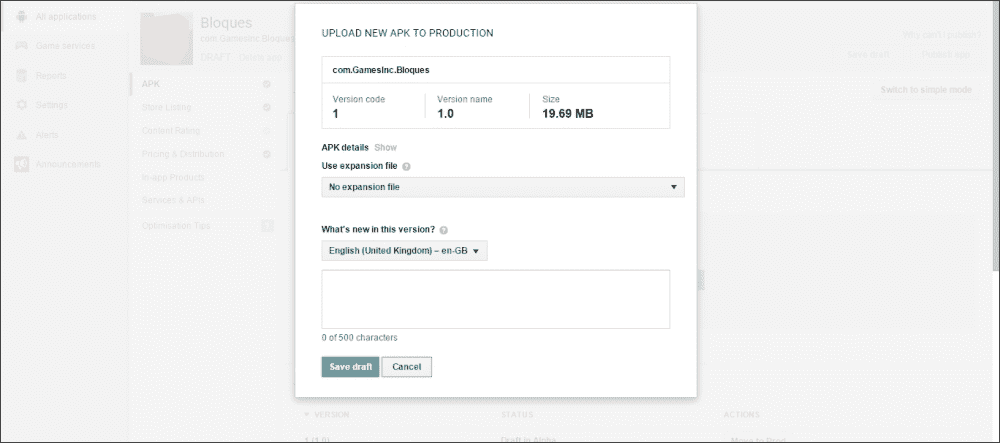

要上传`.obb`文件，点击**无扩展**文件打开下拉菜单，选择**上传新文件**。从那里，选择`.obb`文件。上传完成后，点击**保存草稿**。

接下来要做的是填充**商店列表**部分中的部分。这类似于我们在**游戏服务**面板的**游戏详情**部分填写的内容。您可以复制粘贴字段。你还需要至少两个截图。

接下来进入**内容评分**。在这里，一旦你上传了 APK，你将被要求填写一份问卷，这将适当地评价你的应用。这些问题大多与你的游戏内容有关。填写并保存问卷。**保存**按钮位于底部。接下来，点击**计算等级**，它会为你的游戏生成一个合适的等级。看到您的评分后，点击页面底部的**应用评分**。

我们最后需要填写的是**定价和配送**表。在这里，你需要具体说明你希望游戏在哪些国家发售，以及勾选“阅读并同意出口法指南”等。

你现在可以发布你的应用了。点击位于**开发者控制台**右上角的**发布应用**，你的应用将被添加到谷歌 Play 商店，供全世界下载、玩和欣赏。

# 货币化方法

做好游戏是一回事。然而，最重要的是让你的游戏产生收入，因为毕竟我们都有账单要付。自从手机游戏问世以来，出现了几种货币化模式。以下是开发人员用来创造收入的四种最受欢迎和最广泛使用的货币化模式:

*   **Freemium model**: This is a widely used business model made popular by games such as Angry Birds, Cut the Rope, and so on. Here, you make certain features of the game free while other features are locked—which cost money to unlock. The main goal of this model is to attract as many people as possible and give them a preview of the app and its features without giving away too much, so that the users become interested enough in purchasing the whole app. This is similar to the Demo version of games for the PC and Consoles.

    使用这种模式的好处是，用户可以在购买之前尝试该产品，这使得他们更有可能在以后购买该应用。这也是建立庞大用户群的简单方法，因为这款应用没有前期费用，人们喜欢免费的东西。

    另一方面，使用这种模式的一些缺点是，如果您提供的功能太少，用户将无法充分参与购买整个产品。另一方面，如果你提供了太多的功能，用户将没有足够好的理由购买整个产品。

*   **In-app advertisement**: Another popular business model is making the product completely free for users. The way developers earn revenue is through in-app advertisements. You may have seen such apps. The game or app is free to download and you have ad banners at the top or bottom of the screen.

    使用这种模式的好处是，你可以完全消除用户和应用提供的功能之间的任何付费墙或障碍，使其更受欢迎。您还可以根据他们的行为收集数据，并将其用于目标广告。

    然而，使用这种模式意味着牺牲已经有限的屏幕空间用于广告，这意味着牺牲用户体验。另一件需要记住的事情是，人们可能会对广告感到恼火，这可能会导致他们停止使用或卸载该应用。所以要小心使用它们的方式和时间。

*   **付费应用**:顾名思义在这个模式下，app 不是免费的；用户将不得不购买该应用才能使用。使用这种模式的好处是，你可以从每次下载中获得前期收入，同时更好地保留用户(因为他们付费下载应用，所以他们更有可能频繁使用它)。然而，话虽如此，除非你在应用市场有良好的声誉，否则很难说服用户为你的产品预付费用。这也意味着用户会对你的产品有很高的期望。
*   **App 内购买**:这款让受到《糖果粉碎传奇》、《氏族冲突》等游戏欢迎的机型，与 Freemium 机型类似，产品免费提供。但是，在这种情况下，在用户进行购买之前，不会阻止他们使用任何功能。相反，他们从一开始就获得了所有的特性。开发者赚取收入的方式是通过应用内购买。这些都是虚拟物品，比如生命、加电、虚拟货币等等。使用这种模式的优势在于，它提高了用户参与度，从而提高了用户保留率。另一点是它的风险很低，因为它不需要大量投资。但是，请记住不要因此而得意忘形。开发人员犯的一个致命错误是，除非用户付费，否则开发的游戏实际上是不可玩的。

# 移动性能和优化

每一个开发者都希望通过各种类型的后处理、复杂的着色器、灯光等，让他们的游戏变得美好。虽然在 PC/console 上制作游戏时这是完全可以的，但您必须记住，移动平台有一定的技术限制，这可能会导致您的游戏表现不佳，从而导致销售不佳。这里有一些关于如何优化游戏以获得最佳性能的提示和技巧。

*   整个场景的平局次数应该少于 700 次，以获得最佳表现。
*   虽然动态灯让游戏看起来不错，但在技术方面也很重。因此，除非你绝对要求他们避免使用动态灯。此外，建议您在设备上移植游戏之前构建照明。
*   理想情况下，整个场景的三角形数应该是 500，000 或更少。
*   除非绝对需要，否则应该关闭 Mobile **高清渲染** ( **HDR** )。这将关闭照明功能，并大大提高移动设备的性能。
*   同样，除非需要，否则您应该关闭后处理功能以获得更好的性能。
*   说到纹理，为了防止内存浪费，它们的分辨率应该是 2 的幂(256 x 256，512 x 512，1024 x 1024，等等)。

您可以在**引擎**类别的**渲染**部分的**项目设置**中设置一些**渲染**选项。


您可以从这里打开/关闭不同的功能，如照明、后期处理、纹理等，包括上面提到的最后两点。

说到性能，您应该首先了解一些性能层。它们都与游戏中的灯光功能有关。在为手机开发游戏时，根据您的需求和目标平台，您应该记住以下几点:

*   **低动态范围** ( **LDR** ):此模式性能最高，对内存和处理器的负载最小。对于游戏中不需要照明功能和/或后处理的游戏，建议使用此模式。
*   **基础照明**:这是在性能方面的次佳模式。在这种模式下，您可以使用 UE4 提供的基本照明功能，如全局照明、材质着色等。
*   **Full HDR Lighting**: This mode is on the other end of the spectrum. It has the lowest performance and the highest load on the memory and processor. In this mode, you make use of most of the lighting and post-processing features offered by UE4\. It is not recommended for use in mobile games.

    ### 类型

    建议您访问[https://wiki.unrealengine.com/Android_Device_Compatibility](https://wiki.unrealengine.com/Android_Device_Compatibility)。这是一个社区驱动的页面，其中各个社区成员使用不同的照明模式在各种基于安卓的设备上测试了 UE4。在为安卓开发游戏的时候真的很有帮助。如果您已经在未列出的设备上测试了 UE4，您可以自己发布，以方便其他社区成员。

# 总结

在本章中，我们讨论了 UMG 及其用户界面。使用它，我们为我们的游戏创建了一个主菜单(它包含游戏的名称和一个当玩家触摸它时启动游戏的按钮)。完成后，我们准备将我们的游戏打包到安卓设备上。

这样做的第一步是安装安卓软件开发工具包，其中包含将我们的游戏打包成`.apk`文件所需的所有构建文件。安装后，下一步是向引擎指定所有文件的位置。然后，我们讨论了如何设置安卓设备直接测试游戏，而不必每次都打包游戏。最后，我们讨论了如何包装最终产品，并将游戏上传到谷歌 Play 商店供人们下载。

本章最后详细介绍了移动游戏开发商广泛使用的几种盈利模式，以及如何为移动设备适当优化游戏的一些技巧..

你现在已经具备了开始制作你一直梦想的游戏所需要知道的一切。从这里开始，你在 UE4 唯一能做的就是练习。