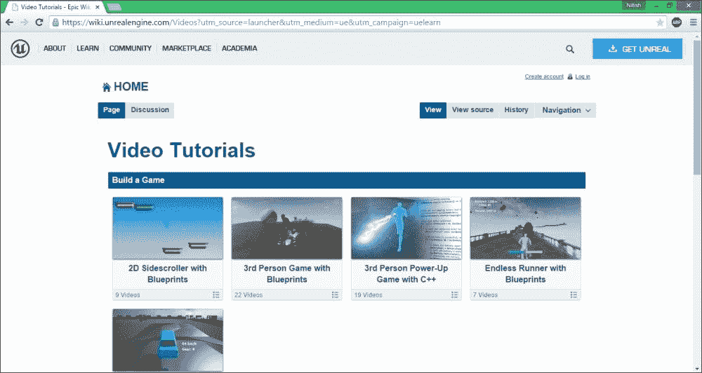
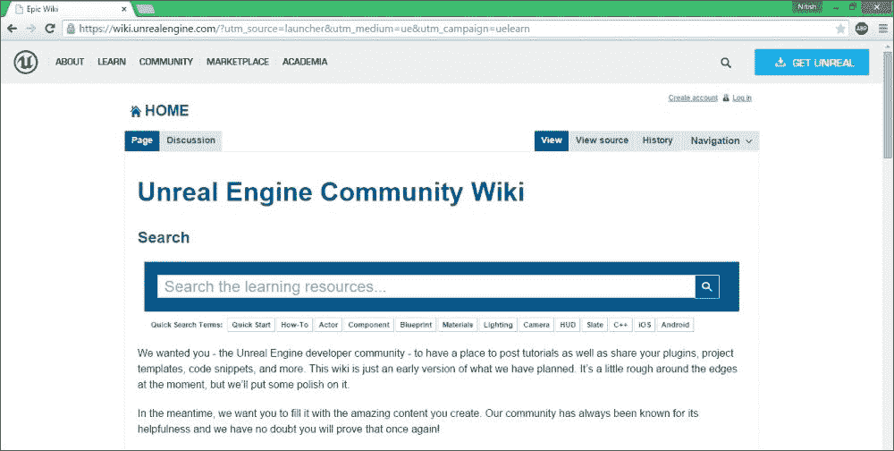
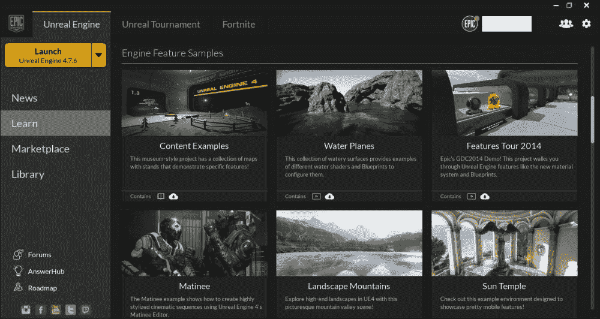
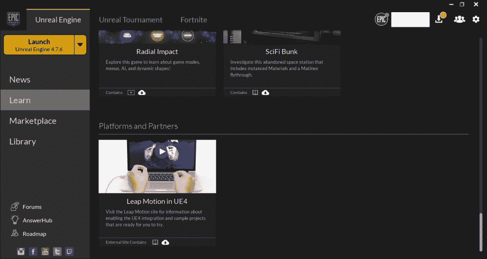
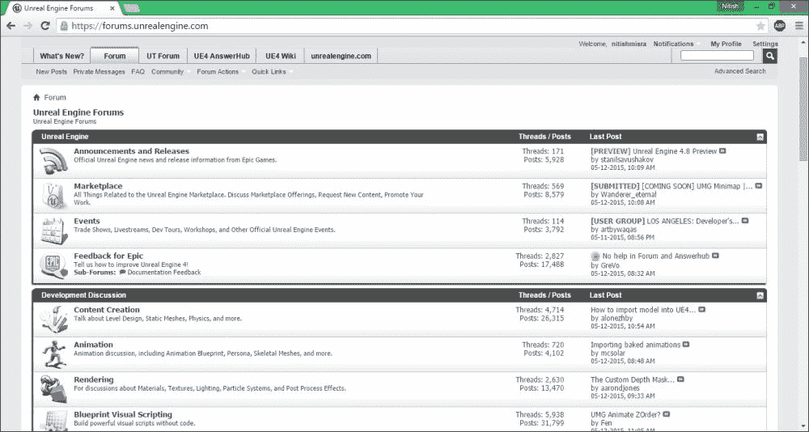

# 附录 a .接下来呢？

在本书中，我们涵盖了一系列主题，例如如何下载和安装 UE4、如何创建项目、如何创建材料、从其他项目添加/导入/迁移资产、使用蓝图编写脚本等。希望到现在为止，你对 UE4 已经足够了解，可以开始了。下一步是学以致用，坚持练习。

# 学习

我们在第一章中简要介绍了 UE4 发射器中的 **学习**部分。让我们再多谈一点。

该面板包含涵盖各种主题的教程，包括如何创建材料、蓝图等。这里提供的教程有以下各种格式。

*   **Video Tutorials**: First off, there are video tutorials offered by Epic. To access them, click on the **Video Tutorials** button located at the top of the page, which will take you to the Unreal website.

    

    在这里，您可以找到各种视频教程系列，为了您的方便，所有的分类整齐。如果您向下滚动页面，您会发现浏览部分，其中列出了所有主题，以及每个主题有多少个视频系列。单击任何主题，您将看到该特定主题可用的所有教程系列。

*   **Documentation**: Then there is the Epic's official documentation. To access it, click on the **Documentation** hyperlink, and it will take you to the Epic's official documentation page.

    

    文档页面和视频教程页面一样，包含各种主题的教程，但是更加深入，涉及的主题也更多。左侧是导航面板。所有的主题都列在那里。点击任何带有 **+** 标志的主题，打开更多的子主题，你可以从中选择你想阅读的内容。当你点击一个主题时，它会在屏幕的右侧打开。

    ### 注

    如果你习惯了在 Unity 上做游戏，想转到虚幻 4，Epic 提供了一个文档，比较了两个引擎的 Viewport、术语等等，这样你就可以把你的技能从 Unity 翻译到虚幻 4。可以在**开阔眼界**部分找到

*   **Unreal Wiki**: Unreal Wiki, accessible by clicking on the **Wiki** hyperlink at the top, is UE4's official Wiki page, made by the community, and is constantly updated by them.

    

    在这里，你可以找到社区创建的教程、插件、代码和游戏，帮助你发展技能。您也可以将自己的内容或教程提交到维基页面供他人查看。最后，你可以看到人们正在 UE4 上开发的游戏列表。你也可以提交你的游戏来获得一些宣传。

*   **Engine Feature Samples**: This section contains project files, each containing a feature or various features offered by UE4.

    

    例如有一个展示日场的项目，然后有一个展示 UE4 提供的景观工具的项目，还有更多。一旦您挑选并下载了一个项目文件，您就可以打开它并将其签出。与该特性相关的一切都已经为您设置好了，您可以亲眼看到一切是如何工作的，事物是如何连接的，等等。这也是为你自己的项目获取资产(材质、纹理、蓝图类等)的一个好方法。

    ### 注

    强烈建议您下载**内容示例**项目。这个项目文件包含了一个由 UE4 提供的功能的集合，所有这些功能都是以博物馆风格的方式在不同的层次上提供的。例如，有一个级别展示了材质编辑器和它可以做什么，还有一个级别展示了动画功能，等等。

*   **Gameplay Content Examples**: This section contains project files that showcase features, similar to what you would find in the Engine Feature Samples, but geared towards games specifically.

    

    这些项目大多包含一个蓝图，每个都有一个机械师或游戏中常见的功能。它们提供了一个框架，你可以用它来构建你的游戏。例如，您可以找到一个项目文件，它具有基于转弯的力学设置，还有一个演示库存用户界面的项目，等等。

*   **Example Game Project**: This section is similar to the **Gameplay Content Examples** section, the only difference being that this section contains project files with a sample game already set up.

    

    示例游戏项目有资产和级别，供您探索、学习和利用。有多种流派可以选择，比如 2D 平台、3D 平台、FPS 等等。

*   **Community Contributions**: This section also contains project files with sample games and environments, but, unlike the project files in the other section, the content here is created by the community, hand-picked by Epic.

    

    这个部分，在写的时候，只包含两个项目文件，分别是演示保存菜单的 Radial Impact 等等，以及展示 UE4s 渲染技术的 SciFi Bunker。

*   **Platforms and Partners**: Finally, there's the **Platforms and Partners** section, which has sample projects with technology and peripherals that UE4 currently supports.

    

    在写作的时候，只有一个样本项目可用，那就是 Leap Motion。点击缩略图将带你进入官方页面，在那里你可以下载一个关于 Leap Motion 的实验。

# AnswerHub

**AnswerHub** 、另一个主题在[第 1 章](1.html#aid-DB7S1 "Chapter 1. Getting Started with Unreal 4")、*虚幻入门 4* 中有简要介绍，在这里你可以发布关于你有问题的特定主题的问题，或者如果你需要帮助。点击位于启动客户端左下角的**应答中心**超链接，将带您进入应答中心页面。

在首页，你可以看到其他成员发布的问题列表。现在，你面临的问题很可能不是唯一的。因此，在发布问题之前，建议您首先在 AnswerHub 中搜索相同或相似的问题。只有当你找不到合适的解决方案或任何解决方案时，你才应该在上面发帖。

要发布问题，点击页面右上角的**发布问题**按钮，将进入**提问**页面。

你把问题放在最上面。确保它清晰、简洁，并以读者能够在阅读后获得想法的方式编写。在它下面，你可以选择问题与哪个部分相关。例如，如果你在包装你的游戏时有困难，那么在部分，你应该选择**包装&部署**等等。

下面是你写问题细节的地方。这是你阐述你发布的问题的地方。同样，在细节上尽量保持简洁明了。如果可能的话，发布截图、日志文件等，这样人们更容易理解你的问题。

最后，您需要为您的问题设置标签。标签使用户更容易搜索问题。当您搜索问题时，搜索引擎会将您所写的内容与标签进行比较，因此也要确保您正确标记了您的问题。

帮助别人总是好的。话虽如此，如果你觉得你可以帮助一个有问题的人，你应该通过回答其他成员发布的问题来帮助他/她。这是一个与社区互动的好方法，在这个过程中你也可以学到一些新的东西。这也是建立你业力点的好方法。如果你在 AnswerHub 上相当活跃，并且你的答案很有用，你会被投票，反过来增加你的因果报应点(类似于 Reddit)。

# 论坛

最后，我们有我们的好的老式论坛。点击引擎启动器上的 **论坛**超链接会将您带到论坛页面。

论坛根据各种主题进行了整齐的分类，这样你就更容易找到相关的帖子。这些部分如下:

*   **虚幻引擎**:这里是一般来说，所有和 UE4 相关的话题都会发布在这里，比如最新的公告、更新、市场等等。
*   **开发讨论**:本板块包含了在 UE4 开发游戏或者其他项目相关的话题。这些话题从渲染、动画、内容创作、架构可视化等东西，到更多的技术话题，比如 C++编程、安卓开发、iOS 开发等等。
*   **社区**:这里是，在这里你可以更直接地与社区接触。比如你对做游戏或者产品感兴趣，但是缺乏天赋，或者有兴趣加入团队做游戏，可以去**拿到技能？寻找人才？**部分，并在那里发布你的需求或个人资料，希望能得到一些回应。否则，如果你已经在做一个项目，并且想要得到一些反馈，你可以发布在**正在进行的工作**部分，并从其他社区成员那里得到一些建设性的反馈。这也是一个让你的游戏被关注的好方法。
*   **UE4 for Schools** :本板块包含与学术界相关的话题和讨论线索。在这里，导师可以讨论课程以及如何向学生讲授 UE4，也可以向其他教育者提供反馈。如果你是学生，可以和其他同学讨论 UE4，获得一些支持。
*   **国际**:最后，如果你对与你所在地理位置附近的社区成员接触感兴趣，你可以在相关的子版块发布一条讨论线索。例如，如果你想制作一个游戏，但更希望你的团队成员在附近，你可以发布一个相关的线程。

# 总结

在这里，我们研究了阅读本指南后，您可以学习和发展 UE4 技能的各种方法。

好消息是，UE4 本身几乎有各种格式的教程，无论是书面的、视频的、项目文件的、直播流的等等。仅仅通过单独复习，你就会学到很多关于发动机的知识。

如果您仍然需要关于某个特定方面或功能的帮助，或者您有一个似乎无法解决的问题，或者只是需要一些帮助，您可以随时在 AnswerHub 上发布它，并让其他社区成员和/或 Epic 员工自己解决它。此外，如果你发现一个问题，由其他社区成员发布，你认为你知道答案，为什么不直接帮他们一把呢？它会改善你的业力，让社区保持活跃。

最后，还有论坛，你也可以用它来获得一些帮助，讨论最新的更新和市场添加，展示你的工作并获得一些反馈，对其他人的工作给出反馈，招募人员，或者成为团队的一员，等等。