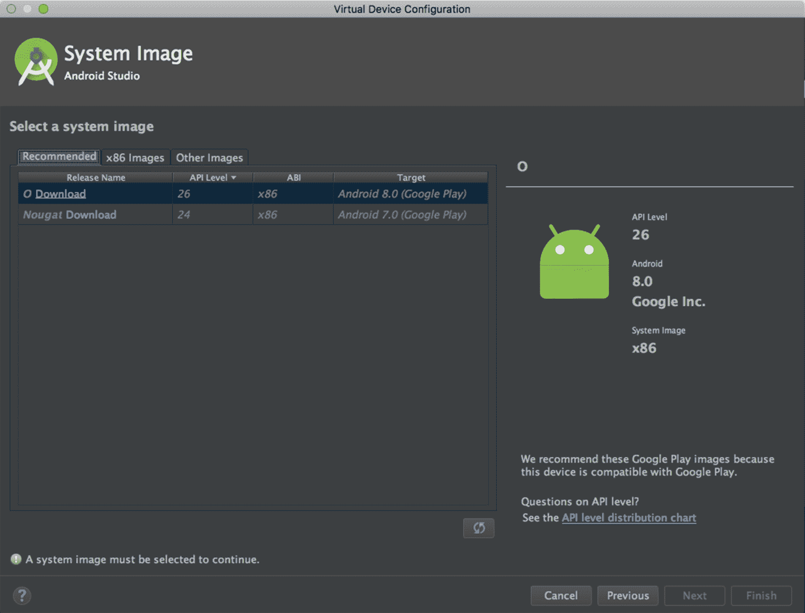
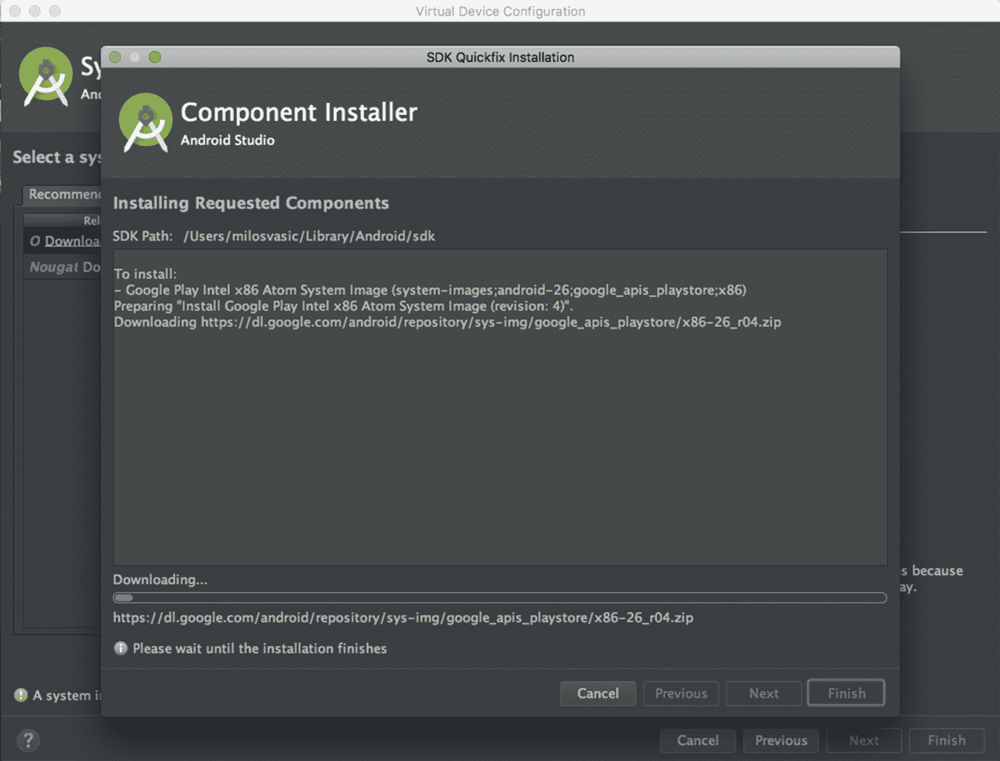
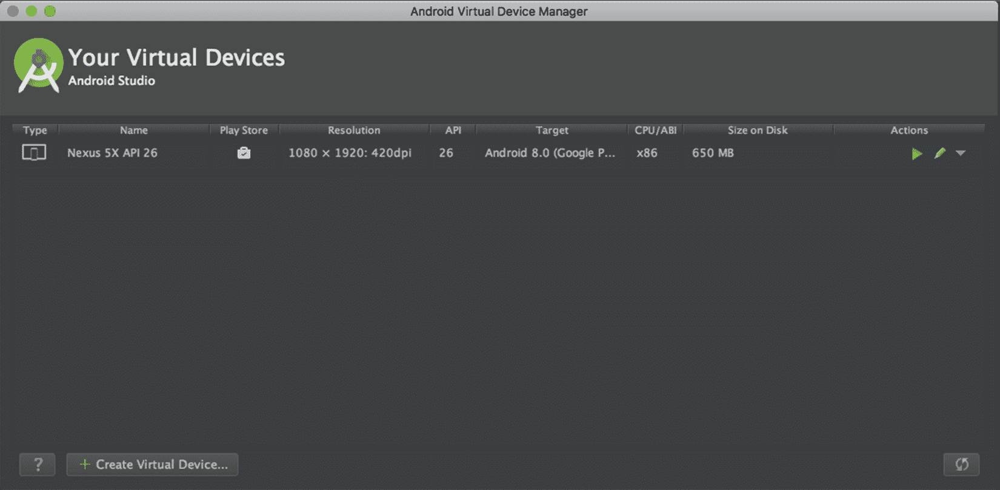
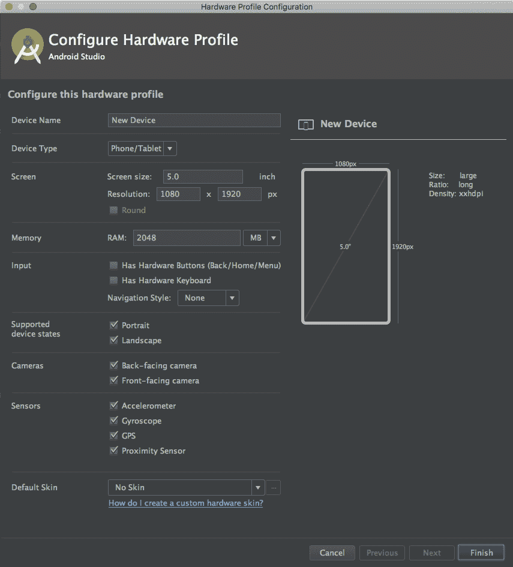
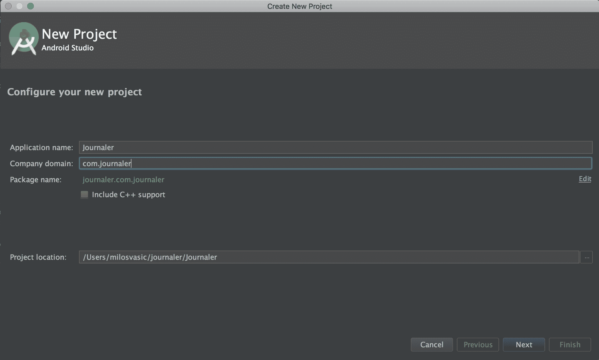
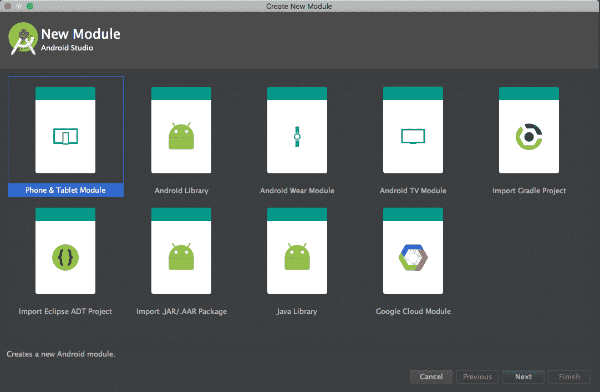
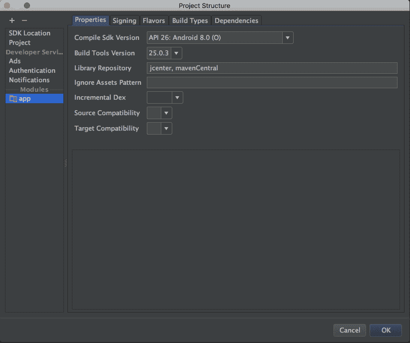
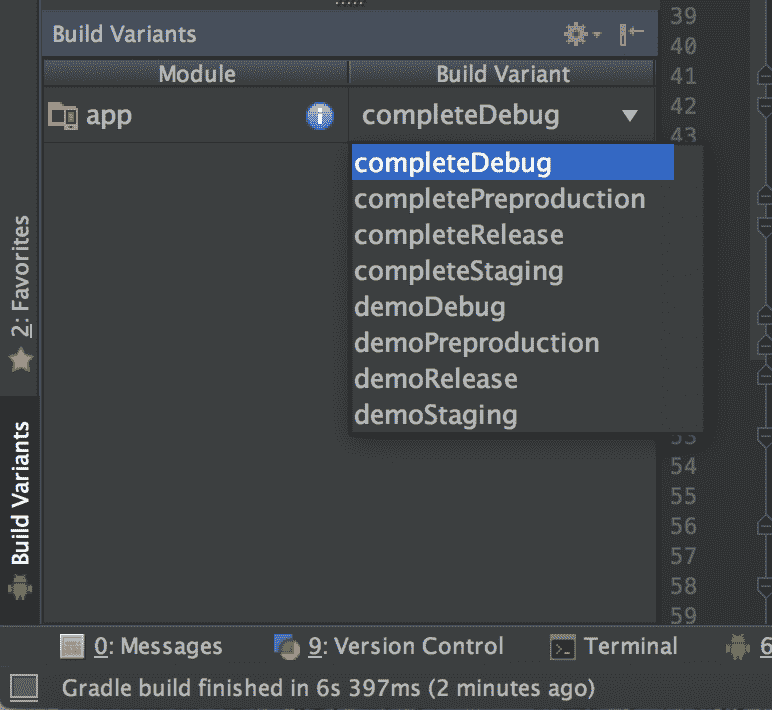

# 一、从安卓开始

**Kotlin** 已经被谷歌正式宣布为安卓的一流编程语言。了解为什么 Kotlin 是你作为新人可以使用的最好的工具，为什么高级安卓开发者首先采用 Kotlin。

在本章中，您将学习如何设置工作环境。你将安装和运行 AndroidStudio，并设置安卓软件开发工具包和 Kotlin。在这里，还将向您介绍一些重要且有用的工具，如**安卓调试桥** ( **adb** )。

既然你还没有你的项目，你就要建立它。您将初始化一个 Git 存储库来跟踪代码中的更改，并创建一个空项目。您将启用它来支持 Kotlin，并添加对我们将使用的其他库的支持。

初始化存储库和项目后，我们将检查项目结构，并解释 IDE 生成的每个文件。最后，您将创建第一个屏幕并查看它。

本章将涵盖以下几点:

*   为 Git 和 Gradle 基础的开发建立一个环境
*   使用安卓清单
*   安卓模拟器
*   安卓工具

# 为什么是 Kotlin？

在我们开始我们的旅程之前，我们将回答章节标题中的问题——为什么是 Kotlin？Kotlin 是由开发 IntelliJ IDEA 的公司 JetBrains 开发的一种新的编程语言。Kotlin 简洁易懂，它像 Java 一样将一切编译成字节码。它还可以编译成 JavaScript 或原生！

Kotlin 来自行业内的专业人士，解决程序员每天面临的问题。启动和采用都很容易！IntelliJ 附带了一个 Java 到 Kotlin 的转换器工具。您可以一个文件接一个文件地转换 Java 代码，一切仍然可以完美地工作。

它是可互操作的，可以使用任何现有的 Java 框架或库。互操作性无可挑剔，不需要包装器或适配器层。Kotlin 支持外部支持的构建系统，如 Gradle、Maven、Kobalt、Ant 和 Griffon。

对于我们来说，Kotlin 最重要的一点是，它可以完美地与 Android 协同工作。

一些最令人印象深刻的 Kotlin 功能如下:

*   零安全
*   异常未被检查
*   类型推理在任何地方都有效
*   单行函数采用一行
*   开箱即用的生成吸气剂和设置剂
*   我们可以在类外定义函数
*   数据类
*   功能编程支持
*   扩展函数
*   Kotlin 对 API 文档使用 Markdown 而不是 HTML！Dokka 工具是 Javadoc 的替代工具，可以读取 Kotlin 和 Java 源代码并生成组合文档
*   Kotlin 比 Java 有更好的泛型支持
*   可靠且高性能的并发编程
*   字符串模式
*   命名方法参数

# 安卓的 Kotlin 这是官方的

2017 年 5 月 17 日，谷歌宣布正在为 Java 虚拟机制作静态类型编程语言 Kotlin，这是一种编写安卓应用的一流语言。

AndroidStudio 的下一个版本(3.0，当前版本是 2.3.3)将支持 Kotlin 开箱即用。谷歌将把精力放在 Kotlin 的未来。

It is important to note that this is only an additional language, not a replacement for existing Java and C++ support (for now).

# 下载和配置 AndroidStudio

为了开发我们的应用，我们需要一些工具。首先，我们需要一个 IDE。为此，我们将使用 AndroidStudio。AndroidStudio 提供了最快的工具来在各种安卓设备上构建应用。

AndroidStudio 提供专业的代码编辑、调试和性能工具。这是一个灵活的构建系统，允许您专注于构建高质量的应用。

设置 AndroidStudio 只需点击几下鼠标。在我们继续之前，您需要为您的操作系统下载以下版本:

[https://developer.android.com/studio/index.html](https://developer.android.com/studio/index.html)

以下是对苹果操作系统、Linux 和 Windows 的说明:

**macOS** :
要将其安装在 macOS 上，请按照以下步骤操作:

1.  启动 AndroidStudio`DMG`文件。
2.  将 AndroidStudio 拖放到`Applications`文件夹中。
3.  启动 AndroidStudio。
4.  选择是否要导入以前的 AndroidStudio 设置。
5.  点击确定。
6.  按照说明操作，直到 AndroidStudio 准备好使用。

**Linux:** 要在 Linux 上安装，请按照以下步骤操作:

1.  将您下载的归档文件解压缩到适合您的应用的位置。
2.  导航至`bin/directory/`。
3.  执行`/studio.sh`。
4.  选择是否要导入以前的 AndroidStudio 设置。
5.  点击确定。
6.  按照说明操作，直到 AndroidStudio 准备好使用。
7.  或者，从菜单栏中选择工具|创建桌面条目。

If you are running a 64-bit version of Ubuntu, you need to install some 32-bit libraries with the following command:

`**sudo apt-get install libc6:i386 libncurses5:i386 libstdc++6:i386 lib32z1 libbz2-1.0:i386**`

In case you are running a 64-bit Fedora, the command is follows:
`**sudo yum install zlib.i686 ncurses-libs.i686 bzip2-libs.i686**`

**Windows** :要在 Windows 上安装，请按照以下步骤操作:

1.  执行你下载的`.exe`文件。
2.  按照说明操作，直到 AndroidStudio 准备好使用。

# 设置安卓模拟器

Android SDK 自带**仿真器**，能够运行我们开发的应用。我们的项目需要它！模拟器的目的是模拟一个设备，并在您的计算机上窗口显示其所有活动。我们能用它做什么？我们可以在没有硬件设备的情况下进行原型设计、开发和测试。你可以模仿手机、平板电脑、可穿戴设备和电视设备。您可以创建自己的设备定义，也可以使用预定义的仿真器。

模拟器的好处是速度快。在许多情况下，在模拟器实例上运行应用所需的时间比在真实的硬件设备上少。

使用模拟器和使用真正的硬件设备一样简单。对于手势，你用鼠标，对于输入，你用键盘。

模拟器可以做任何真正的手机做的事情！您可以轻松发送来电和短信！您可以指定设备的位置，发送指纹扫描，调整网络速度和状态，甚至模拟电池属性。模拟器可以有一个虚拟 SD 卡和内部数据存储，这两者你都可以用来发送真实的文件到那个空间。

**安卓虚拟设备** ( **AVD** )配置用于定义仿真器。每个 AVD 实例作为一个完全独立的设备工作！为了创建和管理自动增值设备，我们使用自动增值设备管理器。AVD 定义包含硬件配置文件、系统映像、存储区域、外观和其他重要属性。

我们一起玩吧！要运行自动车辆识别管理器，请执行以下操作之一:

选择**工具** | **安卓** | **AVDManager** 或点击工具栏中的 **AVDManager** 图标:


它会显示您已经定义的所有 avd。如你所见，我们还没有！

我们在这里能做什么？我们可以做到以下几点:

*   创建新的 AVD
*   编辑现有的自动增值设备
*   删除现有的自动增值设备
*   创建硬件配置文件
*   编辑现有硬件配置文件
*   删除现有的硬件配置文件
*   导入/导出定义
*   启动或停止自动电压调节器
*   清除数据并复位自动电压调节器
*   访问文件系统上的 AVD `.ini`和`.img`文件
*   查看 AVD 配置详细信息

要获取 AVD 实例，您可以从头创建一个新的 AVD，也可以复制一个现有的 AVD 并根据需要进行修改。

# 创建新的 AVD 实例

从 AVD 管理器的**您的虚拟设备**中，单击创建虚拟设备(您可以通过单击运行图标在 Android Studio 中运行您的应用，然后在选择部署目标对话框中选择创建新模拟器)。请参考以下截图:


选择一个硬件配置文件，然后单击下一步，如前一个屏幕截图所示。



如果您注意到系统映像旁边的下载链接，您必须单击它。下载过程开始，如下图所示:



我们必须注意，目标设备的 API 级别非常重要！您的应用不能在 API 级别低于应用所需级别的系统映像上运行。该属性在您的梯度配置中指定。稍后我们将详细讨论 Gradle。

最后，将出现验证配置:


如果需要，更改 AVD 属性，然后单击“完成”完成向导。根据您从何处访问向导，新创建的 AVD 会出现在您的虚拟设备列表或选择部署目标对话框中。



如果您需要创建现有 AVD 的副本，请遵循以下说明:

1.  打开 AVD 管理器，右键单击 AVD 实例，然后选择复制。
2.  按照向导操作，修改完所需内容后，单击“完成”。
3.  一个新的修改版本出现在我们的 AVD 列表中。

我们将演示如何通过从头创建一个新的硬件配置文件来处理硬件配置文件。要创建新的硬件配置文件，请按照下列说明操作。在选择硬件中，单击新建硬件配置文件。请参考以下截图:



出现“配置硬件配置文件”。根据需要调整硬件配置文件属性。点击完成。将显示您新创建的硬件配置文件。

# 复制现有的自动增值设备，并根据需要进行修改

如果您需要基于现有配置文件的硬件配置文件，请遵循以下说明:

1.  选择现有硬件配置文件，然后单击克隆设备。
2.  根据需要更新硬件配置文件属性。要完成向导，请单击“完成”。
3.  您的配置文件会出现在硬件配置文件列表中。

让我们回到 AVD 列表。在这里，您可以对任何现有的 AVD 执行以下操作:

*   点击编辑进行编辑
*   通过右键单击并选择删除来删除
*   通过右键单击 AVD 实例并选择在磁盘上显示，访问磁盘上的`.ini`和`.img`文件
*   要查看 AVD 配置详细信息，请右键单击 AVD 实例，然后选择查看详细信息

既然我们已经介绍了这一点，让我们回到硬件配置文件列表。在这里，我们可以执行以下操作:

*   通过选择硬件配置文件并选择编辑设备来编辑它
*   通过右键单击硬件配置文件并选择删除来删除它

You can't edit or delete the predefined hardware profiles!

然后，我们可以运行或停止模拟器或清除其数据，如下所示:

*   要运行使用自动增值设备的仿真器，请双击自动增值设备或选择启动
*   要停止它，右键单击它并选择停止
*   要清除模拟器的数据，并将其恢复到第一次定义时的状态，请右键单击 AVD 并选择擦除数据

我们将继续我们的模拟器之旅，讲解您可以在`*-`中使用的命令行特性。

要启动仿真器，请使用仿真器命令。我们将向您展示一些从终端启动虚拟设备的基本命令行语法:

```kt
emulator -avd avd_name [ {-option [value]} ... ]
```

另一个命令行语法如下:

```kt
emulator @avd_name [ {-option [value]} ... ]
```

让我们看看下面的例子:

```kt
$ /Users/vasic/Library/Android/sdk/tools/emulator -avd Nexus_5X_API_23 -netdelay none -netspeed full
```

您可以在启动模拟器时指定启动选项；稍后，您不能设置这些选项。

如果您需要一个可用的自动增值设备列表，请使用以下命令:

```kt
emulator -list-avds
```

结果是来自安卓主目录的 AVD 名称列表。您可以通过设置`ANDROID_SDK_HOME`环境变量来覆盖默认主目录。

停止模拟器很简单——只需关闭它的窗口。

It is important to note that we can run AVDs from Android Studio UI as well!

# 安卓调试桥

要访问设备，您将使用从终端执行的`adb`命令。我们将研究常见的案例。

列出所有设备:

```kt
adb devices
```

控制台输出:

```kt
List of devices attached
emulator-5554 attached
emulator-5555 attached
```

获取设备的外壳访问权限:

```kt
adb shell
```

访问特定设备实例:

```kt
adb -s emulator-5554 shell
```

其中`-s`代表设备来源。

将文件从设备复制到设备:

```kt
adb pull /sdcard/images ~/images
adb push ~/images /sdcard/images
```

卸载应用:

```kt
adb uninstall <package.name>  
```

`adb`最大的特点之一就是可以通过 telnet 访问。使用`telnet localhost 5554`连接到您的模拟器设备。使用`quit`或`exit`命令终止您的会话。

我们来玩`adb`:

*   连接到设备:

```kt
        telnet localhost 5554
```

*   更改功率水平:

```kt
        power status full
        power status charging
```

*   或者模拟一个呼叫:

```kt
        gsm call 223344556677
```

*   发送短信:

```kt
        sms send 223344556677 Android rocks
```

*   设置地理位置:

```kt
        geo fix 22 22  
```

With `adb`, you can also take a screenshot or record a video!

# 其他重要工具

我们将介绍日常安卓开发中需要的一些其他工具。

让我们从下面开始:

*   `adb dumpsys`:要获取系统和运行应用的信息，使用`adb dumpsys`命令。要获得内存状态，请执行以下命令- `adb shell dumpsys meminfo <package.name>`。

下一个重要工具如下:

*   `adb shell procrank`:`adb shell procrank`按照内存消耗的顺序为您列出所有应用。此命令在实时设备上不起作用；您只与仿真器连接。出于同样的目的，你可以使用- `adb shell dumpsys meminfo`。
*   对于电池消耗，可以使用- `adb shell dumpsys batterystats` -充电`<package-name>`。
*   下一个重要的工具是 **Systrace** 。要通过捕获和显示执行时间来分析应用的性能，您将使用此命令。

当您遇到应用故障的问题时，Systrace 工具是一个强大的盟友！

不到 20 就不能用安卓 SDK 工具了！要使用它，您必须安装并配置 Python。

让我们试试吧！

要从用户界面访问它，请在 AndroidStudio 中打开安卓设备监视器，然后选择监视器:


有时，从终端(命令行)访问它会更容易:

The Systrace tool has different command-line options, depending on the Android version running on your device.

让我们看一些例子:

一般用法:

```kt
$ python systrace.py [options] [category1] [category2] ... [categoryN]
```

*   安卓 4.3 及以上版本:

```kt
        $ python systrace.py --time=15 -o my_trace_001.html 
        sched gfx  view wm
```

*   安卓 4.2 及更低版本选项:

```kt
        $ python systrace.py --set-tags gfx,view,wm
        $ adb shell stop
        $ adb shell start
        $ python systrace.py --disk --time=15 -o my_trace_001.html
```

我们要展示的最后一个重要工具是`sdkmanager`。它允许您查看、安装、更新和卸载安卓软件开发工具包的软件包。位于`android_sdk/tools/bin/`。

让我们看看一些常见的使用示例:

列出已安装和可用的软件包:

```kt
sdkmanager --list [options]
```

*   安装软件包:

```kt
        sdkmanager packages [options]
```

您可以发送从`--list`命令获得的包裹。

*   卸载:

```kt
        sdkmanager --uninstall packages [options]
```

*   更新:

```kt
        sdkmanager --update [options]
```

还有一些其他的工具你可以在安卓中使用，但是我们只展示了最重要的工具。

# 初始化 Git 存储库

我们已经安装了 AndroidStudio，并向自己介绍了一些重要的软件开发工具包工具。我们还学习了如何处理运行我们代码的模拟设备。是时候开始我们的项目了。我们将为笔记和 todos 开发一个小应用。这是每个人都需要的工具。我们将给它起一个名字- `Journaler`，它将是一个能够创建笔记和 todos 的应用，带有提醒，将同步到我们的后端。

开发的第一步是初始化 Git 存储库。Git 将是我们的代码版本系统。由您决定是否将 GitHub、BitBucket 或其他东西用于远程 Git 实例。创建您的远程存储库，并准备好它的网址以及您的凭据。所以，让我们开始吧！

进入包含项目的目录:

```kt
Execute: git init .
```

控制台输出如下所示:

```kt
Initialized empty Git repository in <directory_you_choose/.git>
```

我们初始化了回购。

让我们添加第一个文件- `vi notes.txt`。

用一些内容填充`notes.txt`并保存。

执行`git add .`添加所有相关文件。

*   然后:`git commit -m "Journaler: First commit"`

控制台输出如下所示:

```kt
[master (root-commit) 5e98ea4]  Journaler: First commit
1 file changed, 1 insertion(+)
create mode 100644 notes.txt
```

正如您所记得的，您用凭证准备了您的远程 Git 存储库`url`。将`url`复制到剪贴板。现在，执行以下操作:

```kt
git remote add origin <repository_url> 
```

这将设置新的遥控器。

*   然后:`git remote -v`

这将验证新的远程网址。

*   最后，将我们拥有的一切推送到远程:`git push -u origin master`

如果要求您输入凭证，按*进入*确认。

# 创建安卓项目

我们初始化了我们的代码库。是时候创建一个项目了。启动 AndroidStudio 并选择以下选项:

开始新的 AndroidStudio 项目或文件|新建|新项目。

创建新项目，出现一个窗口。

填写申请信息:



然后，单击下一步。

选中手机和平板选项，然后选择安卓 5.0 作为最低安卓版本，如下所示:


再次单击下一步。

选择添加无活动，然后单击完成，如下所示:


等到项目创建完成。

您将注意到一条关于检测到未注册 VCS 根目录的消息。单击添加根目录或转到首选项|版本控制|，然后从列表中选择我们的 Git 存储库，然后单击+图标，如下图所示:


要确认所有内容，请单击应用和确定。

在提交和推送之前，更新您的`.gitignore`文件。`.gitignore`文件的目的是允许您忽略文件，如编辑器备份文件、构建产品或您永远不想提交到存储库中的本地配置覆盖。如果不符合`.gitignore`规则，这些文件将出现在 Git 状态输出的`untracked files`部分。

打开位于您的项目`root`目录中的`.gitignore`并编辑它。要访问它，请单击 AndroidStudio 左侧的项目展开项目，然后从下拉菜单中选择项目，如下图所示:


让我们添加一些行:

```kt
.idea
.gradle
build/
gradle*
!gradle-plugins*
gradle-app.setting
!gradle-wrapper.jar
.gradletasknamecache
local.properties
gen
```

然后，编辑位于`app`模块目录中的`.gitignore`:

```kt
*.class
.mtj.tmp/

*.jar
*.war
*.ear
 hs_err_pid*
.idea/*
.DS_Store
.idea/shelf
/android.tests.dependencies
/confluence/target
/dependencies
/dist
/gh-pages
/ideaSDK
/android-studio/sdk
out
tmp
workspace.xml
*.versionsBackup
/idea/testData/debugger/tinyApp/classes*
/jps-plugin/testData/kannotator
ultimate/.DS_Store
ultimate/.idea/shelf
ultimate/dependencies
ultimate/ideaSDK
ultimate/out
ultimate/tmp
ultimate/workspace.xml
ultimate/*.versionsBackup
.idea/workspace.xml
.idea/tasks.xml
.idea/dataSources.ids
.idea/dataSources.xml
.idea/dataSources.local.xml
.idea/sqlDataSources.xml
.idea/dynamic.xml
.idea/uiDesigner.xml
.idea/gradle.xml
.idea/libraries
.idea/mongoSettings.xml
*.iws
/out/
.idea_modules/
atlassian-ide-plugin.xml
com_crashlytics_export_strings.xml
crashlytics.properties
crashlytics-build.properties
fabric.properties
target/
pom.xml.tag
pom.xml.releaseBackup
pom.xml.versionsBackup
pom.xml.next
release.properties
dependency-reduced-pom.xml
buildNumber.properties
.mvn/timing.properties
!/.mvn/wrapper/maven-wrapper.jar
samples/*
build/*
.gradle/*
!libs/*.jar
!Releases/*.jar

credentials*.gradle
gen
```

您可以使用前面的`.gitignore`配置。现在我们可以在 macOS 上提交并推送 *cmd* + *9* 或者在 Windows/Linux 上提交并推送 *ctrl* + *9* (视图|工具窗口|版本控制的快捷方式)。展开未版本文件，选择它们，然后右键单击添加到 VCS。


在 Windows/Linux 上按下 *Cmd* + *K* (或 *Ctrl* + *K* ，检查所有文件，输入提交消息，从提交下拉菜单中选择提交并推送。如果出现行分隔符警告，请选择修复并提交。将出现“推送提交”窗口。选中“推送标签”，选择“当前分支”，然后选择“推送”。

# 设置梯度

Gradle 是一个构建系统。你可以不用一个就构建你的安卓应用，但是，在这种情况下，你必须自己使用几个软件开发工具包工具。那可不简单！这是你需要一个 Gradle 和安卓 Gradle 插件的部分。

Gradle 获取所有的源文件，并通过我们提到的工具对它们进行处理。然后，它将所有内容打包成一个扩展名为`.apk`的压缩文件。APK 可以解压缩。如果通过将其扩展名更改为`.zip`来重命名，则可以提取内容。

每个构建系统都使用它的约定。最重要的约定是将源代码和素材放在具有适当结构的适当目录中。

Gradle 是一个基于 JVM 的构建系统，因此这实际上意味着您可以用 Java、Groovy、Kotlin 等编写自己的脚本。此外，它是一个基于插件的系统，易于扩展。谷歌的安卓插件就是一个很好的例子。您可能注意到了项目中的`build.gradle`文件。它们都是用 Groovy 编写的，所以您编写的任何 Groovy 代码都将被执行。我们将定义我们的 Gradle 脚本来自动化构建过程。让我们建起我们的大楼！打开`settings.gradle`看一看:

```kt
include ":App" 
```

该指令告诉 Gradle，它将构建一个名为`App`的模块。`App`模块位于我们项目的`app`目录中。

现在从项目`root`打开`build.gradle`，并添加以下行:

```kt
    buildscript { 
      repositories { 
        jcenter() 
        mavenCentral() 
      } 
      dependencies { 
        classpath 'com.android.tools.build:gradle:2.3.3' 
        classpath 'org.jetbrains.kotlin:kotlin-gradle-plugin:1.1.3' 
      } 
    } 

    repositories { 
      jcenter() 
      mavenCentral() 
    } 
```

我们定义我们的构建脚本将从 JCenter 和 Maven 中央存储库解析它的依赖关系。相同的存储库将用于解决项目依赖关系。针对我们将拥有的每个模块，添加了主要依赖项:

*   Android Gradle 外挂程式
*   kotlin gradle 外挂程式

更新主`build.gradle`配置后，打开位于`App module`目录下的`build.gradle`，添加以下几行:

```kt
    apply plugin: "com.android.application" 
    apply plugin: "kotlin-android" 
    apply plugin: "kotlin-android-extensions" 
    android { 
      compileSdkVersion 26 
      buildToolsVersion "25.0.3" 
      defaultConfig { 
        applicationId "com.journaler" 
        minSdkVersion 19 
        targetSdkVersion 26 
        versionCode 1 
        versionName "1.0" 
        testInstrumentationRunner  
        "android.support.test.runner.AndroidJUnitRunner" 
      }  
       buildTypes {     
         release {   
           minifyEnabled false    
           proguardFiles getDefaultProguardFile('proguard- 
           android.txt'), 'proguard-rules.pro'    
         }
       }    
       sourceSets {   
         main.java.srcDirs += 'src/main/kotlin'  
       }}
       repositories { 
         jcenter()  
         mavenCentral()
       }dependencies {
          compile "org.jetbrains.kotlin:kotlin-stdlib:1.1.3"  
          compile 'com.android.support:design:26+'  
          compile 'com.android.support:appcompat-v7:26+'}
```

我们设置的配置使 Kotlin 成为我们项目和 Gradle 脚本的开发语言。然后，它定义了应用所需的最小和目标 sdk 版本。在我们的例子中，这是最小的`19`和目标的`26`。需要注意的是，在默认配置部分，我们也设置了应用标识和版本参数。依赖项部分为 Kotlin 本身和一些安卓用户界面组件设置依赖项，这将在后面解释。

# 解释目录结构

AndroidStudio 包含构建应用所需的一切。它包含源代码和素材。所有目录都是由我们用来创建项目的向导创建的。要查看它，请打开集成开发环境左侧的项目窗口(单击查看|工具窗口|项目)，如下图所示:


项目模块表示源文件、素材和构建设置的集合，这些集合将项目划分为独立的功能部分。`modules`的最小个数为 1。你的项目可以拥有的最大`modules`数量没有真正的限制。`Modules`可以独立构建、测试或调试。正如您所看到的，我们只定义了一个名为 app 的模块。

要添加新模块，请执行以下步骤:

转到文件|新建|新模块。



可以创建以下`modules`:

*   安卓应用模块代表了你的应用源代码，资源和设置的容器。默认的模块名是 app，就像我们创建的例子一样。
*   电话和平板电脑模块。
*   安卓穿戴模块。
*   玻璃模块。
*   安卓电视模块。
*   `Library`模块代表可重用代码的容器——库。该模块可以用作其他应用模块中的依赖项，也可以导入到其他项目中。当它被构建时，这个模块有一个 AAR 扩展——安卓存档，而不是 APK 扩展。

“创建新模块”窗口提供以下选项:

*   **安卓库**:一个安卓项目支持所有类型。这个库的构建结果是一个**安卓归档器** ( **AAR** )。
*   **Java 库**:仅支持纯 Java。这个库的构建结果是一个 **Java 归档器** ( **JAR** )。
*   **谷歌云模块**:这为谷歌云后端代码定义了一个容器。

重要的是要理解，Gradle 将`modules`称为单个项目。如果您的应用代码依赖于名为 **Logger** 的安卓库代码，那么在 **build.config** 中，您使用的必须包括以下指令:

```kt
    dependencies { 
      compile project(':logger') 
    } 
```

让我们浏览一下项目结构。AndroidStudio 用来显示项目文件的默认视图是安卓视图。它不代表磁盘上的实际文件层次结构。它隐藏了一些不常使用的文件或目录。

安卓视图呈现以下内容:

*   所有与构建相关的配置文件
*   所有清单文件
*   单个组中的所有其他资源文件

在每个应用中，模块内容分为以下几组:

*   清单和`AndroidManifest.xml`文件。
*   Java 和 Kotlin 源代码的应用和测试。
*   `res`和安卓 UI 资源。
*   若要查看项目的真实文件结构，请选择“项目视图”。为此，单击安卓视图，从下拉菜单中选择项目。

通过这样做，您将看到更多的文件和目录。其中最重要的如下:

*   `module-name/`:这是模块的名称
*   `build/`:这保存构建输出
*   `libs/`:这里有私人图书馆
*   `src/`:保存模块的所有代码和资源文件，组织在以下子目录中:
    *   `main`:这里保存了`main`源码集文件——源代码和所有构建变体共享的资源(我们将在后面解释构建变体)
    *   `AndroidManifest.xml`:这定义了我们的应用及其每个组件的性质
    *   `java`:这里保存了 Java 源代码
    *   `kotlin`:这里保存了 Kotlin 的源代码
    *   `jni`:保存使用 **Java 原生接口** ( **JNI** )的原生代码
    *   `gen`:保存 AndroidStudio 生成的 Java 文件
    *   `res`:保存应用资源，例如**可绘制的**文件、布局文件、字符串等
    *   `assets`:保存应该编译成`.apk`文件的文件，不做修改
    *   `test`:这里保存了测试源代码
    *   `build.gradle`:这是模块级构建配置
    *   `build.gradle`:这是项目级的构建配置

选择文件|项目结构，在下面的屏幕截图中更改项目设置:


它包含以下部分:

*   软件开发工具包位置:设置项目使用的 JDK、安卓软件开发工具包和安卓 NDK 的位置
*   项目:这将设置 Gradle 和 Android Gradle 插件版本
*   模块:编辑特定于模块的构建配置

模块部分分为以下选项卡:

*   属性:这为模块构建设置了软件开发工具包和构建工具的版本
*   签名:这为 APK 签名设置了证书
*   口味:这定义了模块的口味
*   构建类型:这定义了模块的构建类型
*   依赖性:这设置了模块所需的依赖性

请参考以下截图:



# 定义构建类型和风格

我们正在接近项目的一个重要阶段——为我们的应用定义构建变体。构建变体代表安卓应用的独特版本。

它们是唯一的，因为它们覆盖了一些应用属性或资源。

每个构建变体都是按模块级别配置的。

让我们延长我们的`build.gradle`！将以下代码放入`build.gradle`文件的`android`部分:

```kt
    android { 
      ... 
      buildTypes { 
        debug { 
          applicationIdSuffix ".dev" 
        } 
        staging { 
          debuggable true 
          applicationIdSuffix ".sta" 
        } 
        preproduction { 
          applicationIdSuffix ".pre" 
        } 
           release {} 
        } 
       ... 
    }  
```

我们为我们的应用定义了以下`buildTypes`-`debug`、`release`、`staging`和`preproduction`。

产品风味的创造方式类似于`buildTypes`。您需要将它们添加到`productFlavors`并配置所需的设置。下面的代码片段演示了这一点:

```kt
    android { 
      ... 
      defaultConfig {...} 
      buildTypes {...} 
      productFlavors { 
        demo { 
          applicationIdSuffix ".demo" 
          versionNameSuffix "-demo" 
        } 
        complete { 
          applicationIdSuffix ".complete" 
          versionNameSuffix "-complete" 
        } 
        special { 
          applicationIdSuffix ".special" 
          versionNameSuffix "-special" 
        } 
       } 
    } 
```

创建并配置`productFlavors`后，点击通知栏中的立即同步。

您需要等待一段时间才能完成该过程。构建变体的名称由`<product-flavor><Build-Type>`约定形成。以下是一些例子:

```kt
    demoDebug 
    demoRelease 
    completeDebug 
    completeRelease 
```

您可以将构建变体更改为您想要构建和运行的变体。转到构建，选择构建变体，并从下拉菜单中选择`completeDebug`。



`Main/source`集合在应用中的所有构建变体之间共享。如果您需要创建一个新的源代码集，您可以针对特定的构建类型、产品风格及其组合来创建。

所有的源代码集文件和目录必须以特定的方式组织，类似于`Main/Source`集。特定于您的*调试*构建类型的 Kotlin 类文件必须位于`src/debug/kotlin/directory`中。

为了学习如何组织文件，请打开终端窗口(视图|工具窗口|终端)并执行以下命令行:

```kt
./gradlew sourceSets
```

仔细看看输出。这份报告可以理解，不言自明。AndroidStudio 不创建`sourceSets`目录。这是一项必须由你来完成的工作。

如果需要，您可以使用`sourceSets`块更改 Gradle 寻找源集的位置。让我们更新我们的构建配置。我们将更新以下预期的源代码路径:

```kt
    android { 
      ... 
      sourceSets { 
       main { 
       java.srcDirs = [ 
                'src/main/kotlin', 
                'src/common/kotlin', 
                'src/debug/kotlin', 
                'src/release/kotlin', 
                'src/staging/kotlin', 
                'src/preproduction/kotlin', 
                'src/debug/java', 
                'src/release/java', 
                'src/staging/java', 
                'src/preproduction/java', 
                'src/androidTest/java', 
                'src/androidTest/kotlin' 
        ] 
        ... 
     } 
```

你想要打包的代码和资源只有特定的配置，你可以存储在`sourceSets`目录中。以下是使用`demoDebug`构建变体构建的示例；这个版本变体是一个`demo`产品风格和`debug`版本类型的产品。在格拉德勒，他们享有以下优先权:

```kt
    src/demoDebug/ (build variant source set) 
    src/debug/ (build type source set) 
    src/demo/ (product flavor source set) 
    src/main/ (main source set) 
```

这是 Gradle 在构建过程中使用的优先级顺序，在应用以下构建规则时会考虑到这一点:

*   它一起编译`java/`和`kotlin/`目录中的源代码
*   它将清单合并到一个清单中
*   它合并`values/`目录中的文件
*   它合并`res/`和`asset/`目录中的资源

最低优先级给予包含在库模块依赖项中的资源和清单。

# 其他库

我们配置了我们的构建类型和风格，现在我们需要一些第三方库。我们将使用并增加对改装、OkHttp 和 Gson 的支持。这是对他们每个人的解释:

*   改装是 Square，Inc .为安卓和 Java 开发的一个类型安全的 HTTP 客户端。改装是最受欢迎的安卓 HTTP 客户端库之一，因为它简单且性能优于其他客户端。
*   `OkHttp`是一个默认高效的 HTTP 客户端——HTTP/2 支持允许同一主机的所有请求共享一个套接字。
*   Gson 是一个 Java 库，可以用来将 Java 对象转换成它们的 JSON 表示。它还可以用于将 JSON 字符串转换为等效的 Java 对象。Gson 可以处理任意的 Java 对象，包括您没有源代码的预先存在的对象。

有几个开源项目可以将 Java 对象转换为 JSON。在本书的后面，我们将添加 Kotson 来为 Kotlin 提供 Gson 绑定。

让我们用改装和 Gson 的依赖来扩展`build.gradle`:

```kt
    dependencies { 
      ... 
      compile 'com.google.code.gson:gson:2.8.0' 
      compile 'com.squareup.retrofit2:retrofit:2.2.0' 
      compile 'com.squareup.retrofit2:converter-gson:2.0.2' 
      compile 'com.squareup.okhttp3:okhttp:3.6.0' 
      compile 'com.squareup.okhttp3:logging-interceptor:3.6.0' 
      ... 
    } 
```

更新您的 Gradle 配置后，请在询问时再次同步它！

# 熟悉安卓清单

每个应用都必须有一个`AndroidManifest.xml`文件，并且该文件必须有完全相同的名称。它的位置在它的`root`目录中，在每个模块中，它包含关于你的应用到安卓系统的基本信息。`manifest`文件负责定义以下内容:

*   为应用命名包
*   描述应用的组件——活动(屏幕)、服务、广播接收器(消息)和内容提供者(数据库访问)
*   为了访问安卓应用接口的受保护部分，应用必须拥有的权限
*   其他应用必须拥有的权限，以便与应用的组件(如内容提供商)进行交互

下面的代码片段显示了`manifest`文件的一般结构和它可以包含的元素:

```kt
    <?xml version="1.0" encoding="utf-8"?> 
    <manifest> 
      <uses-permission /> 
      <permission /> 
      <permission-tree /> 
      <permission-group /> 
      <instrumentation /> 
      <uses-sdk /> 
      <uses-configuration />   
      <uses-feature />   
      <supports-screens />   
      <compatible-screens />   
      <supports-gl-texture />   

      <application> 
        <activity> 
          <intent-filter> 
            <action /> 
              <category /> 
                <data /> 
            </intent-filter> 
            <meta-data /> 
        </activity> 

        <activity-alias> 
          <intent-filter> . . . </intent-filter> 
          <meta-data /> 
        </activity-alias> 

        <service> 
          <intent-filter> . . . </intent-filter> 
          <meta-data/> 
        </service> 

        <receiver> 
          <intent-filter> . . . </intent-filter> 
          <meta-data /> 
        </receiver> 
        <provider> 
          <grant-uri-permission /> 
          <meta-data /> 
          <path-permission /> 
        </provider> 

        <uses-library /> 
      </application> 
    </manifest> 
```

# 主应用类

每个安卓应用都定义了自己的主`Application`类。安卓系统中的`Application`类是包含所有其他组件的安卓应用中的基类，例如`activities`和`services`。创建应用/包的过程时，`Application`类或`Application`类的任何子类在任何其他类之前被实例化。

我们将为日志员创建一个`Application`类。找到主要来源目录。展开它，如果没有 Kotlin 源目录，创建它。然后，创建`package com`并分装日志器；为此，右键单击 Kotlin 目录并选择**新建** | **包**。创建好包结构后，右键单击**日志器**包，然后选择新建|文件/类。命名为`Journaler`。`Journaler.kt`被创造出来。

每个`Application`类必须扩展安卓应用类，如我们的例子所示:

```kt
    package com.journaler 

    import android.app.Application 
    import android.content.Context 

    class Journaler : Application() { 

      companion object { 
        var ctx: Context? = null 
      } 

      override fun onCreate() { 
        super.onCreate() 
        ctx = applicationContext 
      } 

    } 
```

目前，我们的主`Application`类将为我们提供对应用上下文的静态访问。这个语境是什么，后面会解释。但是，在清单中提到之前，安卓不会使用这个类。打开`app`模块`android manifest`并添加以下代码块:

```kt
    <manifest xmlns:android="http://schemas.android.com/apk/
    res/android" package="com.journaler"> 

    <application 
        android:name=".Journaler" 
        android:allowBackup="false" 
        android:icon="@mipmap/ic_launcher" 
        android:label="@string/app_name" 
        android:roundIcon="@mipmap/ic_launcher_round" 
        android:supportsRtl="true" 
        android:theme="@style/AppTheme"> 

    </application> 
    </manifest> 
```

有了`android:name=".Journaler"`，我们告诉安卓用哪个类。

# 你的第一个屏幕

我们创建了一个没有屏幕的应用。我们不会浪费时间，我们会创造一个！创建一个名为`activity`的新包，在这里我们所有的屏幕类都将被定义，并创建你的第一个名为`MainActivity.kt`的`Activity`类。我们将从一个简单的类开始:

```kt
    package com.journaler.activity 

    import android.os.Bundle 
    import android.os.PersistableBundle 
    import android.support.v7.app.AppCompatActivity 
    import com.journaler.R 

    class MainActivity : AppCompatActivity() { 
      override fun onCreate(savedInstanceState: Bundle?,
      persistentState: PersistableBundle?) { 
        super.onCreate(savedInstanceState, persistentState) 
        setContentView(R.layout.activity_main) 
      } 
    } 
```

很快，我们将解释所有这些行的含义。现在，需要注意的是`setContentView(R.layout.activity_main)`将 UI 资源分配给我们的屏幕，`activity_main`是定义它的 XML 的名称。既然我们还没有它，我们就要创造它。在`main`目录下找到`res`目录。如果那里没有布局文件夹，创建一个，然后通过右键单击`layout`目录并选择新建|布局资源文件来创建一个名为`activity_main`的新布局。指定`activity_main`为其名称，`LinearLayout`为其根元素。文件的内容应该类似于这样:

```kt
    <?xml version="1.0" encoding="utf-8"?> 
    <LinearLayout xmlns:android="http://schemas.android.com/
     apk/res/android" 
      android:orientation="vertical" 
      android:layout_width="match_parent" 
      android:layout_height="match_parent"> 

   </LinearLayout> 
```

在我们准备运行我们的应用之前，还有一件事要做:我们必须告诉我们的清单关于这个屏幕。打开`main manifest`文件，添加以下代码:

```kt
    <application ... > 
      <activity 
        android:name=".activity.MainActivity" 
        android:configChanges="orientation" 
        android:screenOrientation="portrait"> 
        <intent-filter> 
          <action android:name="android.intent.action.MAIN" /> 
          <category android:name="android.intent.category.LAUNCHER" /> 
        </intent-filter> 
      </activity> 
    </application> 
```

我们将很快解释所有这些属性；现在您需要知道的是，您的应用已经准备好运行了。然而，在此之前，`commit and push`你的工作。你不想失去它！

# 摘要

在这一章中，我们介绍了安卓的基础知识，并简要介绍了 Kotlin。我们配置了一个工作环境，并制作了应用的第一个屏幕。

在下一章中，我们将深入讨论安卓系统。您将学习如何构建应用和定制不同的变体。我们还将介绍运行应用的不同方式。