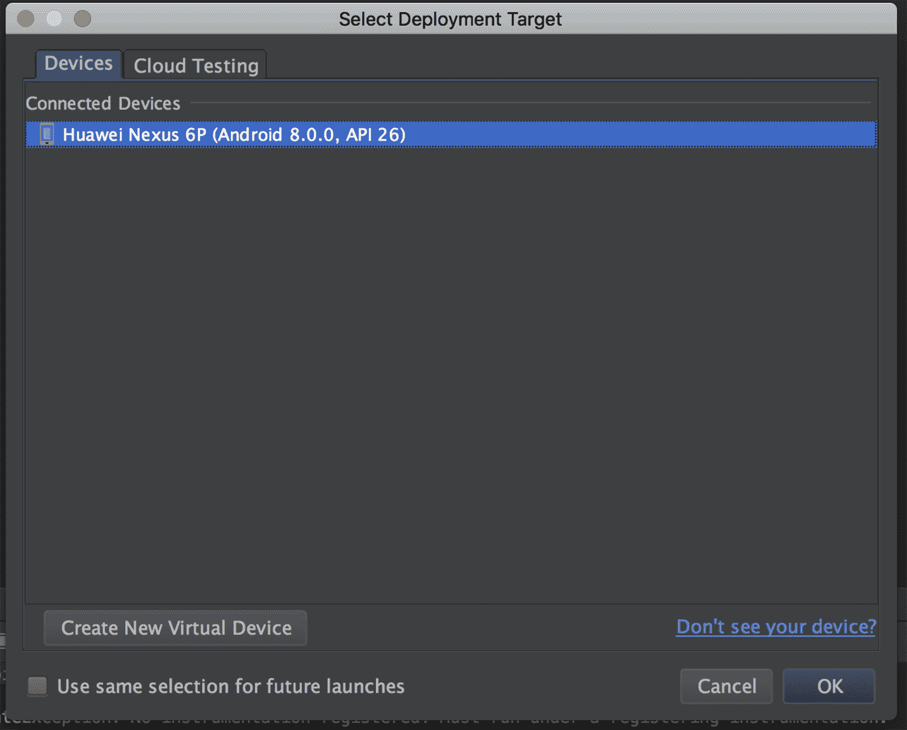

# 十四、测试

我们开发了一个具有大量代码库的应用。我们尝试了一下，认为我们的应用没有错误。然而，我们可能错了！有时，即使我们确信我们的应用中没有 bug，也可能会发生一个危险的问题正在等待。如何防止这种情况？简单！我们将编写测试来检查我们的代码。在本章中，我们将向您介绍测试，并举例说明如何设置、编写和运行测试。

在本章中，我们将涵盖以下主题:

*   第一次考试怎么写
*   使用测试套件
*   如何测试 UI
*   运行测试
*   单元和仪表测试

# 添加依赖项

为了运行测试，我们必须满足一些依赖性。我们将通过扩展`build.gradle`来更新我们的应用配置，以支持测试并提供我们需要的类。打开`build.gradle`并按如下方式展开:

```kt
    apply plugin: "com.android.application" 
    apply plugin: "kotlin-android" 
    apply plugin: "kotlin-android-extensions" 

    repositories { 
      maven { url "https://maven.google.com" } 
    } 

    android { 
      ... 
      sourceSets { 
        main.java.srcDirs += [ 
                'src/main/kotlin', 
                'src/common/kotlin', 
                'src/debug/kotlin', 
                'src/release/kotlin', 
                'src/staging/kotlin', 
                'src/preproduction/kotlin', 
                'src/debug/java', 
                'src/release/java', 
                'src/staging/java', 
                'src/preproduction/java', 
                'src/testDebug/java', 
                'src/testDebug/kotlin', 
                'src/androidTestDebug/java', 
                'src/androidTestDebug/kotlin' 
        ] 
      } 
      ... 
      testOptions { 
        unitTests.returnDefaultValues = true 
      } 
    } 
    ... 
    dependencies { 
      ... 
      compile "junit:junit:4.12" 
      testCompile "junit:junit:4.12" 

      testCompile "org.jetbrains.kotlin:kotlin-reflect:1.1.51" 
      testCompile "org.jetbrains.kotlin:kotlin-stdlib:1.1.51" 

      compile "org.jetbrains.kotlin:kotlin-test:1.1.51" 
      testCompile "org.jetbrains.kotlin:kotlin-test:1.1.51" 

      compile "org.jetbrains.kotlin:kotlin-test-junit:1.1.51" 
      testCompile "org.jetbrains.kotlin:kotlin-test-junit:1.1.51" 

      compile 'com.android.support:support-annotations:26.0.1' 
      androidTestCompile 'com.android.support:support
     -annotations:26.0.1' 

      compile 'com.android.support.test:runner:0.5' 
      androidTestCompile 'com.android.support.test:runner:0.5' 

      compile 'com.android.support.test:rules:0.5' 
      androidTestCompile 'com.android.support.test:rules:0.5' 
     } 

    It is important to highlight use of: 
    testOptions { 
        unitTests.returnDefaultValues = true 
    } 
```

这将使我们能够测试内容提供者，并在测试中使用所有相关的类。如果我们不启用此功能，将会出现以下错误:

`Error: "Method ... not mocked"!`

# 更新文件夹结构

其中的文件夹结构和代码必须遵循关于构建变体的约定。对于我们的测试，我们将使用结构的以下部分:

*   对于单元测试:


*   对于仪器测试:


现在我们准备开始写测试了！

# 写你的第一个测试

找到单元测试的`root`包，并创建一个名为`NoteTest`的新类，如下所示:

```kt
    package com.journaler 

    import android.location.Location 
    import com.journaler.database.Content 
    import com.journaler.model.Note 
    import org.junit.Test 

    class NoteTest { 

      @Test 
      fun noteTest() { 
        val note = Note( 
                "stub ${System.currentTimeMillis()}", 
                "stub ${System.currentTimeMillis()}", 
                Location("Stub") 
        ) 

        val id = Content.NOTE.insert(note) 
        note.id = id 

        assert(note.id > 0) 
     } 
    } 
```

测试非常简单。它创建一个`Note`的新实例，触发我们的内容提供者中的 CRUD 操作来存储它，并验证收到的 ID。要运行测试，请右键单击项目窗格中的类，然后选择运行“测试说明”:


单元测试是这样执行的:


如您所见，我们成功地将我们的`Note`插入到数据库中。现在，在我们创建了第一个单元测试之后，我们将创建第一个仪器测试。然而，在此之前，让我们解释一下单元测试和仪器测试之间的区别。检测测试在设备或仿真器上运行。当您需要测试依赖安卓上下文的代码时，可以使用它们。让我们测试一下我们的主要服务。在仪器测试`root`包内创建一个名为`MainServiceTest`的新类，如下所示:

```kt
    package com.journaler 

    import android.content.ComponentName 
    import android.content.Context 
    import android.content.Intent 
    import android.content.ServiceConnection 
    import android.os.IBinder 
    import android.support.test.InstrumentationRegistry 
    import android.util.Log 
    import com.journaler.service.MainService 
    import org.junit.After 
    import org.junit.Before 
    import org.junit.Test 
    import kotlin.test.assertNotNull 

    class MainServiceTest { 

      private var ctx: Context? = null 
      private val tag = "Main service test" 

      private val serviceConnection = object : ServiceConnection { 
        override fun onServiceConnected(p0: ComponentName?, binder:
        IBinder?) { 
          Log.v(tag, "Service connected") 
        } 

        override fun onServiceDisconnected(p0: ComponentName?) { 
          Log.v(tag, "Service disconnected") 
        } 
     } 

     @Before 
     fun beforeMainServiceTest() { 
        Log.v(tag, "Starting") 
        ctx = InstrumentationRegistry.getInstrumentation().context 
     } 

     @Test 
     fun testMainService() { 
        Log.v(tag, "Running") 
        assertNotNull(ctx) 
        val serviceIntent = Intent(ctx, MainService::class.java) 
        ctx?.startService(serviceIntent) 
        val result = ctx?.bindService( 
           serviceIntent, 
           serviceConnection, 
           android.content.Context.BIND_AUTO_CREATE 
        ) 
        assert(result != null && result) 
     } 

     @After 
     fun afterMainServiceTest() { 
       Log.v(tag, "Finishing") 
       ctx?.unbindService(serviceConnection) 
       val serviceIntent = Intent(ctx, MainService::class.java) 
       ctx?.stopService(serviceIntent) 
    } 

   } 
```

要运行它，请创建一个新的配置，如下图所示:


运行新创建的配置。您将被要求选择运行测试的安卓设备或模拟器实例:



等到测试执行完毕。恭喜你！您已经成功创建并运行了检测测试。现在，在您的练习中，定义尽可能多的测试来覆盖您的应用拥有的所有代码。注意测试应该是单元测试还是仪器测试。

# 使用测试套件

一个**测试套件**是测试的集合。我们将向您展示如何创建测试集合。创建一个测试来表示要收集的容器。姑且称之为`MainSuite`:

```kt
    package com.journaler 

    import org.junit.runner.RunWith 
    import org.junit.runners.Suite 

    @RunWith(Suite::class) 
    @Suite.SuiteClasses( 
        DummyTest::class, 
        MainServiceTest::class 
    ) 
    class MainSuite  
```

重复我们在示例中为仪器测试所做的过程，以运行您的测试套件。

# 如何测试 UI

测试用户界面可以帮助我们防止用户发现意外情况、应用崩溃或性能下降。我们强烈建议您编写用户界面测试，以便确保您的用户界面按预期运行。为此，我们将介绍 Espresso 框架。

首先，我们将为它添加如下依赖项:

```kt
    ... 
    compile 'com.android.support.test.espresso:espresso-core:2.2.2' 
    androidTestCompile 'com.android.support.test.espresso:espresso-
    core:2.2.2' 
    ... 
```

在编写和运行 Espresso 测试之前，请禁用测试设备上的动画，因为这将影响测试、预期时间和行为。我们强烈建议您这样做！在您的设备上，转到设置|开发人员选项|并关闭以下功能:

*   窗口动画比例
*   过渡动画比例
*   动画师持续时间比例

现在你准备好写浓缩咖啡测试了。学习浓缩咖啡框架需要一些努力。这对你来说可能很耗时，但它的好处将是巨大的！让我们看看一个浓缩咖啡测试的例子:

```kt
    @RunWith(AndroidJUnit4::class) 
    class MainScreenTest { 
       @Rule 
       val mainActivityRule =   
       ActivityTestRule(MainActivity::class.java) 

       @Test 
       fun testMainActivity(){ 
        onView((withId(R.id.toolbar))).perform(click()) 
        onView(withText("My dialog")).check(matches(isDisplayed())) 
      } 

   } 
```

我们定义了我们将测试`MainActivity`类。测试触发工具栏按钮点击后，我们检查对话框是否存在。我们通过检查标签可用性来做到这一点- `"My dialog"`。学习整个浓缩咖啡框架超出了这本书的范围，但至少我们给了你一个可能性的暗示。花些时间学习它，因为它肯定会帮助你！

# 运行测试

我们已经通过 AndroidStudio 执行了我们的测试。然而，一旦你把它们都写完了，你就会想同时运行它们。您可以为所有的构建变体运行所有的单元测试，但是只能为特定的风格或构建类型运行。这同样适用于仪器测试。我们将向您展示几个使用 Journaler 应用的现有构建变体来实现这一点的例子。

# 运行单元测试

打开终端，导航到项目的`root`包。要运行所有单元测试，请执行以下命令行:

```kt
$ ./gtradlew test
```

这将运行我们编写的所有单元测试。由于`NoteTest`使用内容提供商，测试将失败。为此，需要使用适当的`Runner`类来执行。默认情况下，AndroidStudio 会这么做。然而，由于这是一个单元测试，我们从终端执行它，测试将会失败。你会同意这个测试实际上是必须考虑的工具，因为它使用安卓框架组件。通常的做法是，如果您的类依赖于安卓框架组件，它必须作为工具来执行。因此，我们将把`NoteTest`移到仪器测试目录中。现在我们没有任何单元测试。至少创建一个不依赖于安卓框架组件的。为此，您可以在单元测试文件夹中移动现有的`DummyTest`。从您的集成开发环境中拖放它，并使用相同的命令重新运行测试。

要运行构建变体的所有测试，请执行以下命令行:

```kt
$ ./gradlew testCompleteDebug 
```

我们执行`Complete`风味和`Debug`构建类型的测试。

# 运行仪器测试

要运行所有检测测试，请使用以下命令行:

```kt
$ ./gradlew connectedAndroidTest 
```

它的前提是连接一个设备或运行模拟器。如果您有一个以上的设备或模拟器，所有这些设备或模拟器都将运行测试。

要运行构建变体的检测测试，请使用以下命令行:

```kt
$ ./gradlew connectedCompleteDebugAndroidTest 
```

这将触发`Debug`构建类型的`Connected`风味的所有仪器测试。

# 摘要

在本章中，我们学习了如何为我们的应用编写和运行测试。这是迈向生产的又一步。我们建立了一个写得很好并且没有错误的产品。很快，我们将真正出版它。要有耐心，因为那一刻就要来了！